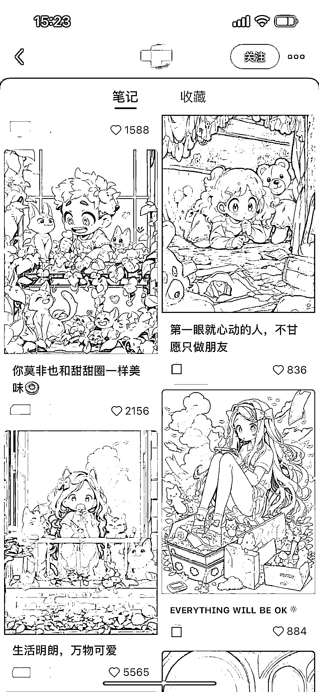
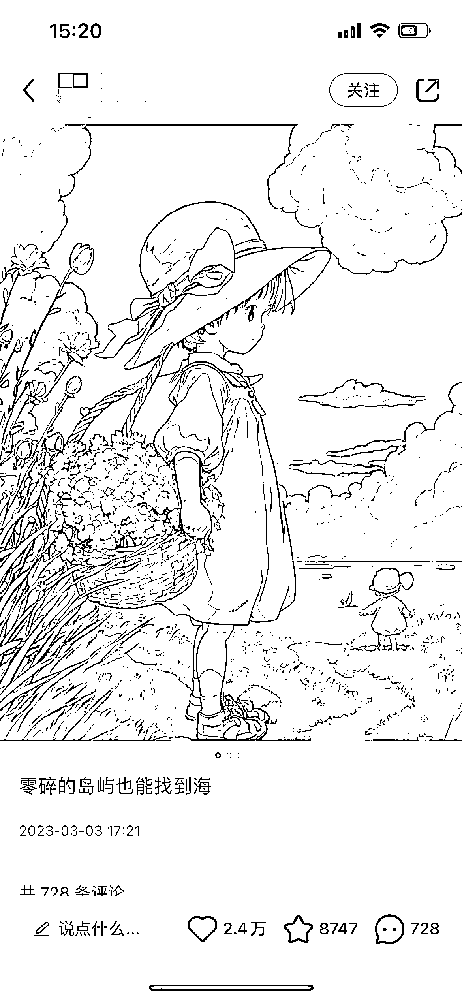
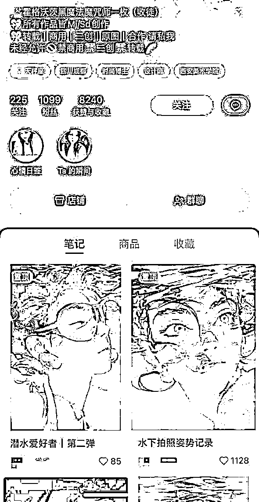
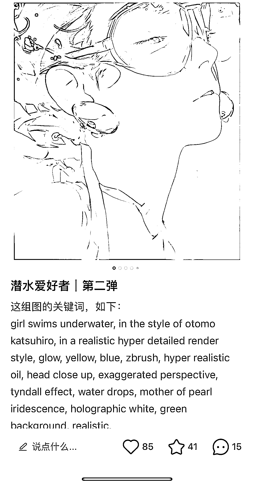
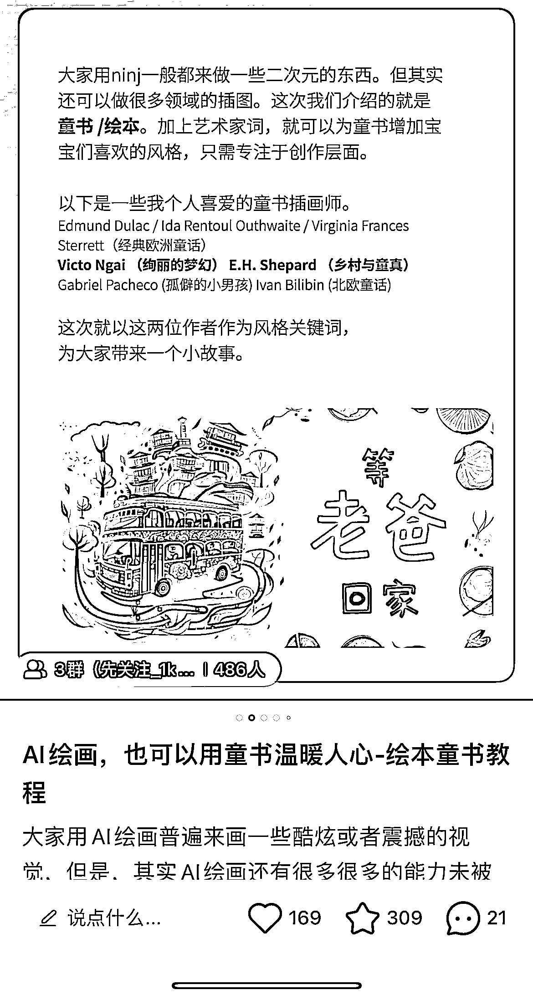
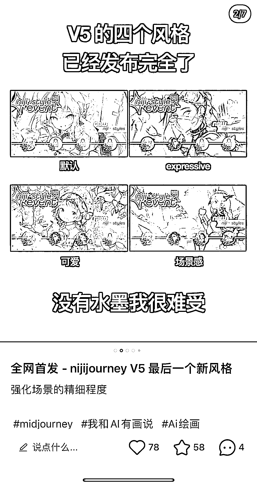

# 8.4.1.1 账号类型

类型一：插画+一句话语录（难度等级🌟🌟）

可以用作于壁纸，头像或朋友圈图文，文案可以模仿小红书热门账号或者微博等其他平台的文案：

类型二：教学号（难度等级🌟或者🌟🌟🌟🌟🌟）

•难度等级🌟的教学号：

仅需发布图片+关键词即可，可以复制 MidJourney 画廊热门关键词出图，发布图片+关键词

•难度等级🌟🌟🌟🌟🌟的教学号，以课程/社群教学变现：

以 Midjiurney 为例，需要对关键词的组成熟悉并理解，不断学习，充实自己的知识库，有一定的表达对能力，可以将所学知识输出，形成体系课程，教授别人。

可以在小红书上分享制作过程、最新的版本功能及各个工具组合应用方法等等来打造账号，输出知识，这是一个需要沉淀的过程，不会那么快速变现。

