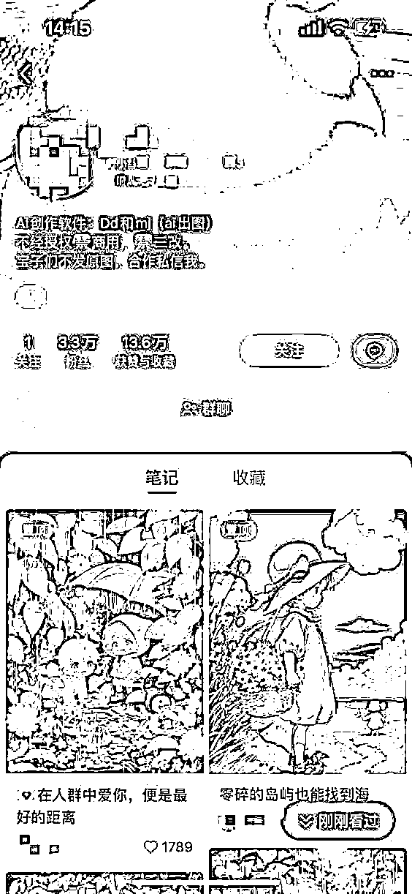
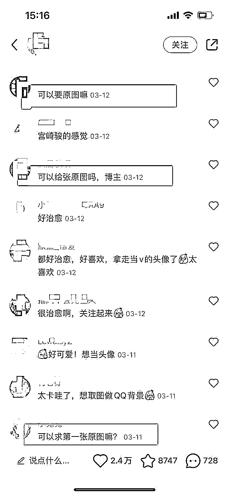
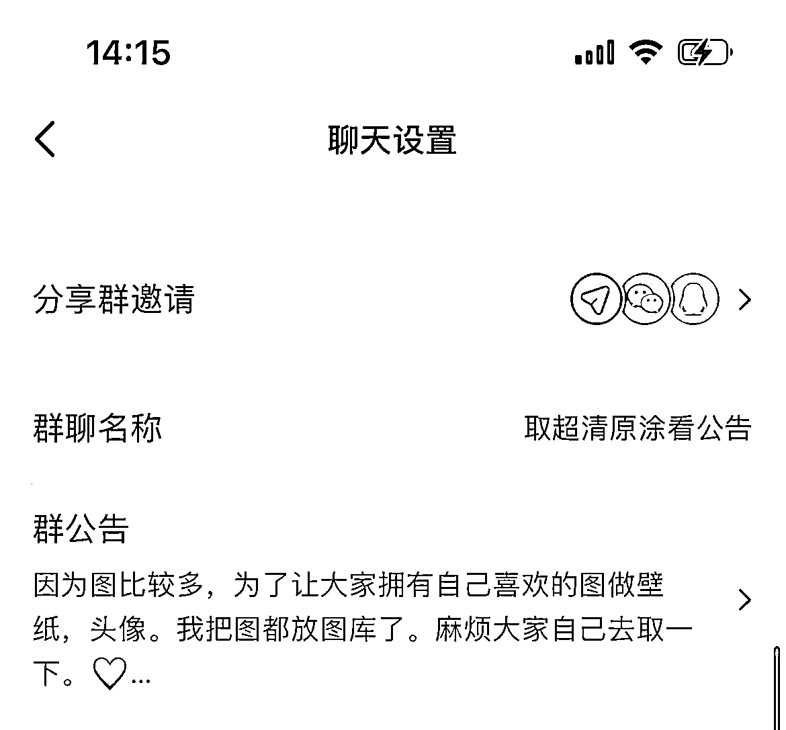
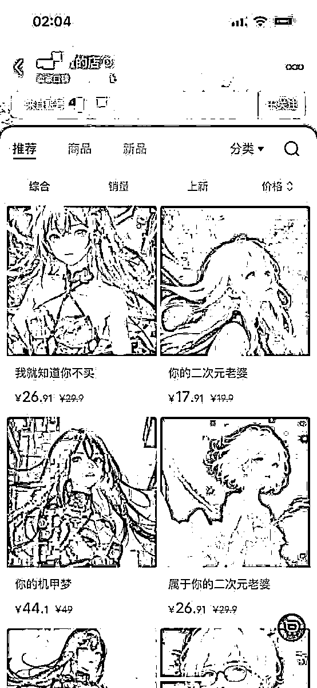
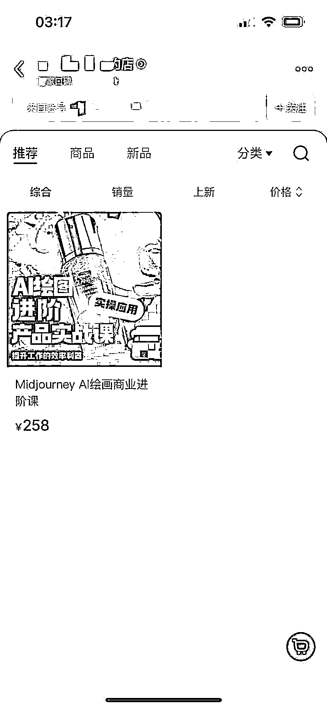

# 8.4.1.2 变现方式

原图变现的方法主要有以下 3 种。

方式一：建立小红书群聊，引导分析粉丝小程序取图

发布图文，粉丝喜欢，可以设置免费取图的钩子：

小红书群聊，引导粉丝进群后，可以在群聊公告里写出取图方式，粉丝直接去搜索取图小程序，通过粉丝取图看广告，我们赚取点击费。如：

方式二：建立小红书群聊，群公告改为自己的公众号

以公众号为媒介，公众号取图，涨粉速度快，且安全，不存在频繁被加风险，引流到公众号上，用户通过公众号获取图片。

那么到公众号取图，会有以下 3 种变现路径：

•小程序取图收益：与方式一类似，在公众号上直接跳转到神图君等取图小程序，通过取图看广告，赚取点击费

这里要注意的是，某些取图小程序，比如神图君，要满 20，才能提现，变现不是即时的。当然，如果你神图君里的图片比较多，不排除用户会多点几个，让你收益多多。

•网盘拉新：在公众号上回复设置好的引导词，如“取图 1”，会自动回复你设置好的网盘链接，用户点击网盘链接，下载 APP，转存获取图片，赚取拉新费用。

这里需要注意的一个点是：有可能你的用户已经有你要拉新的网盘，那么他就不属于一个新用户了，你可能就获取不了这部分收益，所以这个方式，是有几率赚不到钱的。

•私域+网盘拉新：那么针对第 2 种，你可能赚不到钱的方式，我的建议是，回复关键词，跳转出你的微信二维码，让用户扫描二维码直接加你好友，把人导到私域里，再给他发网盘链接，

这样的话，假设网盘拉新失败，你还会有一个私域转化粉丝，这个粉丝单价是 0，也是很香的，后续如果喜欢你的图片，可能会找你定制头像，或者找你学习，亦或是你有自有业务，可以通过其他业务变现，这是隐藏价值。

当然，这里有 4 点需要说明：

一是，有一部分人白嫖过后，会删除你的好友，对于这样的，咱们无视就好，要相信，下一个会更香；

二是，你需要做好你的朋友圈，日常发图，发文，运营好你的朋友圈，不然用户不了解你，吸引不了用户下单；

三是，建立群聊，会有人进入打广告，需要及时对广告进行撤回；

四是，不论哪种方式引流操作，都会有违规风险，大家做好心理准备。

方式三：小红书店铺变现

开通小红书店铺，将 AI 作品或者 AI 课程上架，进行变现：

