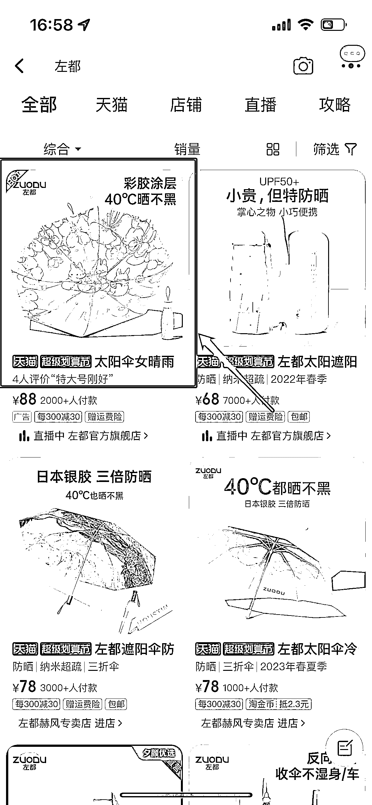
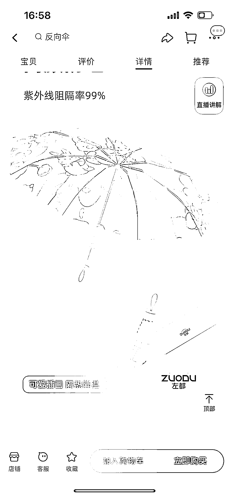

# 8.4.2 定制变现

AI 绘画可以通过以下方式进行定制变现：

① 设计定制化插画：可以根据客户需求进行定制化设计，提供更多的选择和服务。

② 授权许可：可以通过授权许可的方式，将其应用于商业领域，如广告、包装设计等。

③ 出售设计方案：可以生成多样的插画设计方案（关键词），可以将其进行打包出售，提供更多的选择和服务。

④ 开发插画设计软件：可以通过开发插画设计软件，为用户提供更多的选择和服务。

具体可以根据客户需求定制相关，如：文创周边包括各种形式的衍生品，书籍插图、文具图案、服装图案、装饰画、海报设计、绘本制作、贴纸、雨伞图案、笔记本封皮内页插画设计等等。

