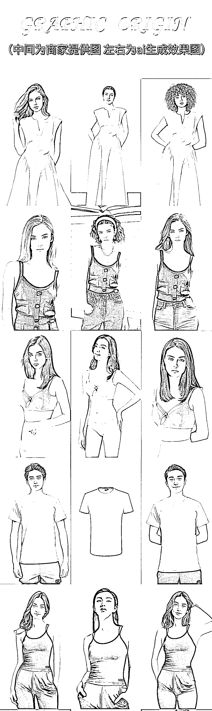
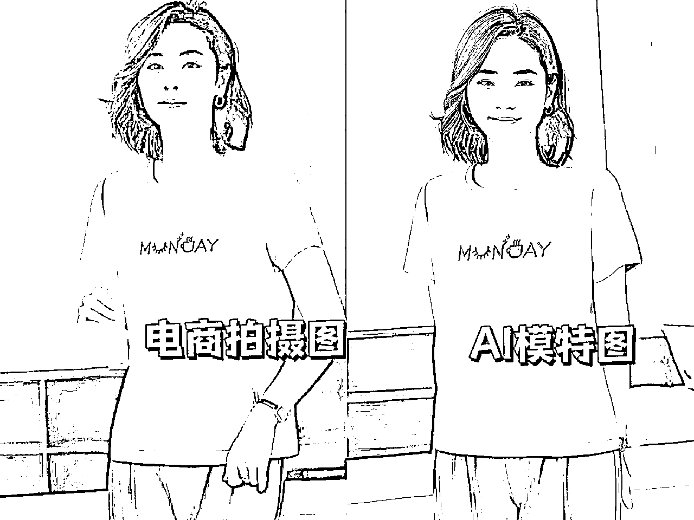

# 9.1 玩法介绍

AI 模特图/产品图，是通过 Stable Diffusion、MidJourney 等 AI 绘图软件，以文字生图、图生图、条件生图等形式，在无真人模特、无真实拍摄条件下直接创作图片，以达到商家使用目的的项目制作过程。

目前的 AI 绘图技术不仅可以实现“一句话出图”，而且随着技术的不断进步，AI 绘画的作品开始慢慢变得以假乱真，AI 绘画制作的模特图和产品图的效果，已经慢慢超越现在很多新入电商摄影的新手。

目前使用 AI 绘画技术，可以完全实现简单基础纯色款衣物的模特图，比如：

大面积纯色块的 T 恤、卫衣、外套、裙子；电商的产品拍摄图；简单产品的不同场景图，比如形状规则的护肤品包装瓶等。

在商业应用中，除去可以为模特“穿上客户要求的衣服”，也可以为模特更换特定的衣服，做到同一个模特，适用更多的场景。

虽然现在的 AI 绘图可以胜任简单的模特图/产品图，但对于复杂和极高要求的模特图/产品图，在实际商用效果、成本、适用场景等方面，依然存在着差距。

目前 AI 技术能做的很多图已经能够满足一些商用需求了，期待技术的进一步进步（图片使用已获商家授权）。

其优势主要有以下几点：

•成本低：在一次性少量产品拍摄时，AI 绘画具有比较大的成本优势，而且随着 AI 绘画技术的不断发展，未来 AI 模特图的制作成本，将会变得更低，甚至可以在大规模的批量摄影上，与传统电商摄影抢占市场。

•不受时间、空间场景的限制：AI 绘画可以根据客户指定的场景进行出图，不需要考虑拍摄场地，直接使用 AI 绘画技术进行场景的生成客户想要的效果图；相比于传统电商摄影，省去协调场地、准备拍摄环境等工作流程，帮助客户节省拍摄的时间和拍摄成本。

•可以快速满足个性化、定制化需求：AI 绘画可以通过快速改换模特，生成符合产品特色的模特图/产品图，满足客户对于产品模特的个性化、定制化需求，保持整个店铺模特风格的统一性。

但 AI 绘画在实际电商图出图中仍有局限，比如我们来看下图：

（客户提出需求将模特进行替换，并进行合适的穿搭）

现在我给大家布置一道思考题：上图是否能够满足商家的商用需求？

答案是不能满足商家要求，不能满足商家要求的原因是：AI 生产的模特过于幼态，没有成熟女性（中老年）的气质。

目前达成 AI 模特有两大思路，各有局限性。

第一个思路是让 AI 根据投喂的图片重塑整张照片，优点是更智能，图片可能也会更容易协调，美观；

缺点是在这种条件下稳定性（生成对应的模特和服装）和细节准确性（服装的细节把控，比如衣领，扣子）会弱。

在这种技术下

•AI 绘画“挑活”

AI 模特服装图复杂的款式目前技术达不到，能做简单款的产品，不能满足较高要求的拍摄，特别是带有繁杂花纹的衣服，很难保证 AI 模特的衣服与实物完全一致，需要借助后期处理技术；

但传统电商摄影不存在这个问题，传统电商的线下拍摄，有相机、有模特、有场景就可以拍，没有拍不出来的照片，而且可以保证照片即实物。

•成品概率低，效率低

使用 AI 技术进行 AI 模特图/产品图创作，受限于机器性能、模型训练时间，在实际操作过程中，需要测试、训练多次才能达到满意的效果，适合产品的个性定制化，不适合大规模；

一次进行上百款大规模产品拍摄，在使用同一位模特的情况下，使用传统摄影成本低、时间短，更为划算。

但是如果 AI 技术进一步进步，准确性进一步增强，会很有前景。

第二个思路是让 AI 根据投喂的图片，不改变衣服，只对模特，背景做出更换，这种情况下，实物容易保持一致，缺点是还不够那么的”智能“，图片可能协调度，美观度的上限不如第一种高。

让模特做一些简单的动作可以，但是复杂难以识别的不行，比较适合团队作战。

关于 AI 绘画在电商模特摄影领域的应用，更多的详细信息，可以参考生财有术圈友的精华帖：《失业危机自救：AI 模特项目 7 天跑通变现闭环的复盘实录》

