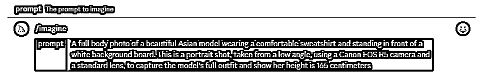
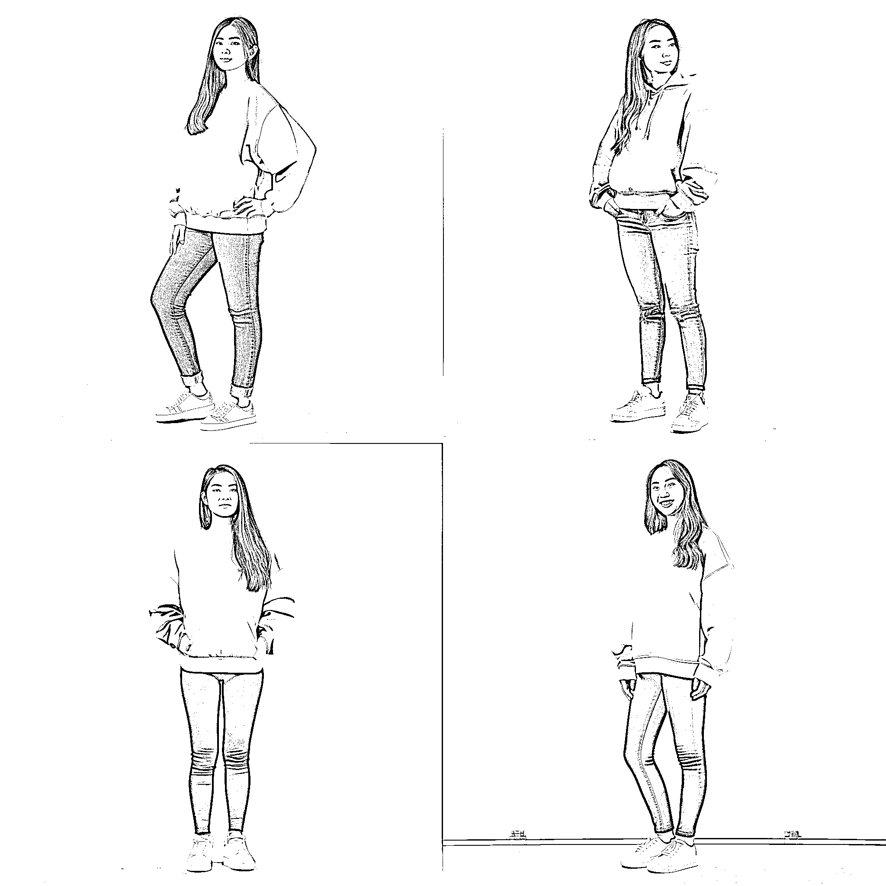
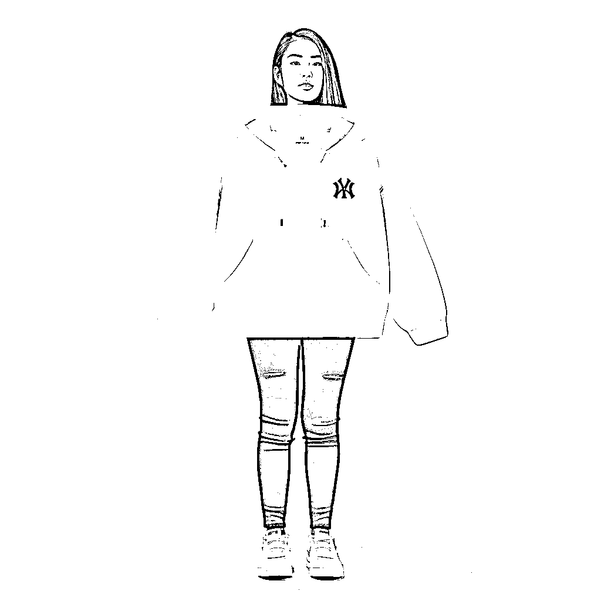
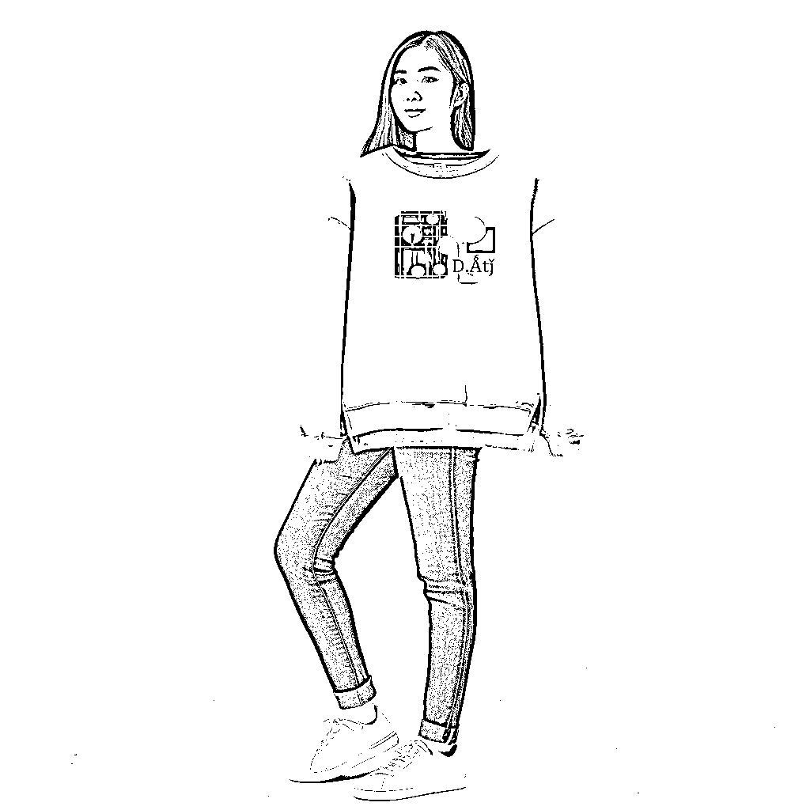
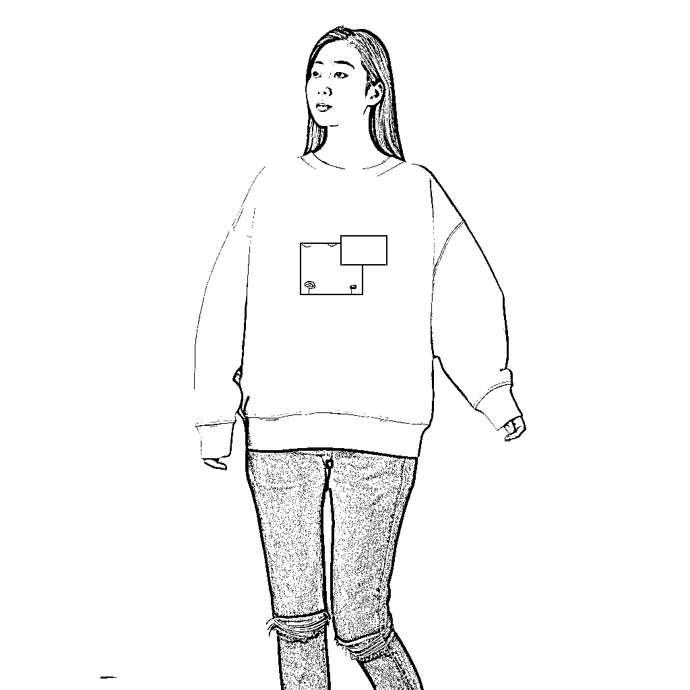
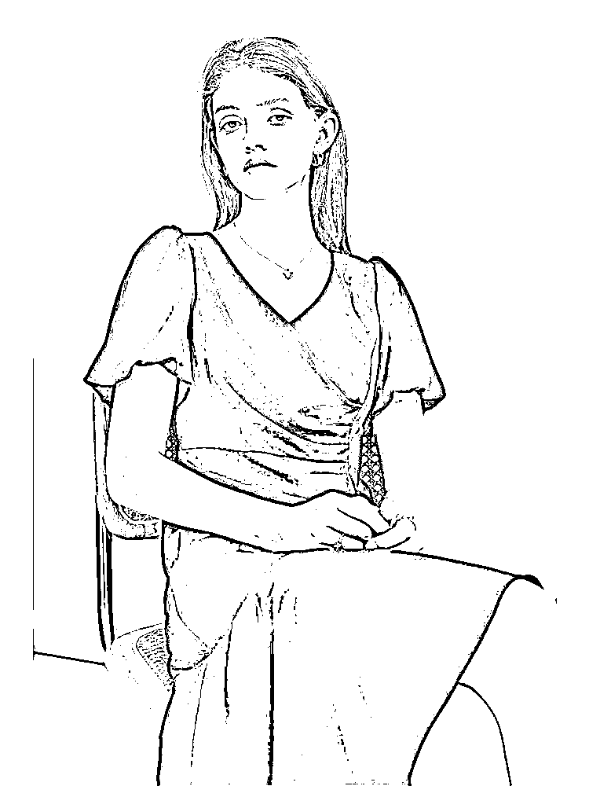
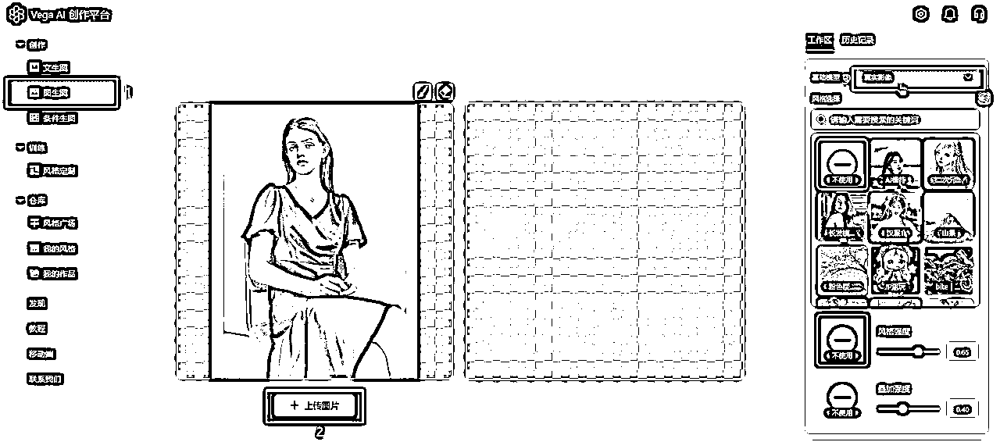
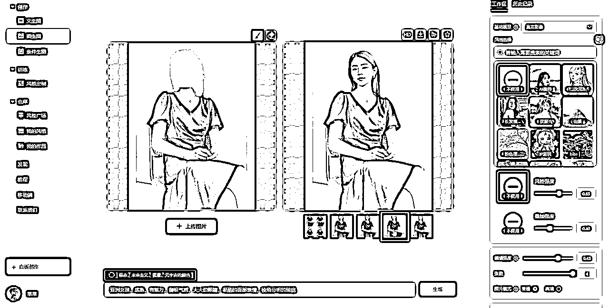
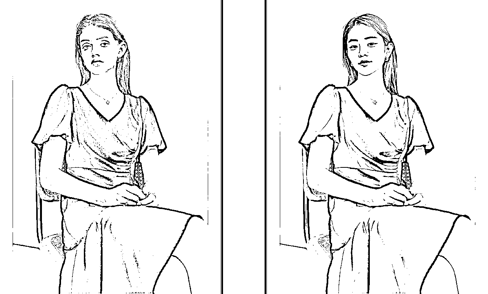
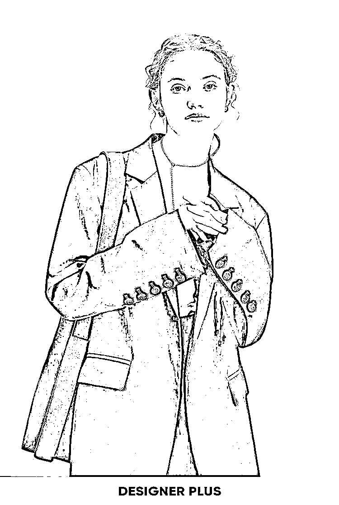

# 9.2.1 初阶技术

方法一：使用 MidJourney 软件的以图生图功能

适用于纯色简单款衣服：如卫衣、T 恤、衬衫不适用于复杂花色、花纹类衣服，生成符合要求的模特模特

具体操作步骤：

① 写一个符合你要求的文案，例如

“一张亚洲美女模特的全身照片，穿着舒适的运动衫，站在白色背景板前。这是一张人像照片，采用低角度拍摄，使用佳能 EOS R5 相机和标准镜头，拍摄模特整套服装，并展示她 165 厘米的身高。”

② 将这句话放入 ChatGPT 或者其他翻译软件中，翻译成适合 AI 绘画的英文提示词

"A full body photo of a beautiful Asian model wearing a comfortable sweatshirt and standing in front of a white background board. This is a portrait shot, taken from a low angle, using a Canon EOS R5 camera and a standard lens, to capture the model's full outfit and show her height is 165 centimeters."

③ 将这句话放到 Discord 中，让 MidJourney 机器人去识别，在输入栏中输入 /imagine + 英文提示文案（这里的+号不用输入），发送指令，等待 AI 绘图完成：

④ Ai 就直接生成了 4 个模特，对比较满意的模特，点击图片的 U1、U2、U3、U4 来直接打开大图。

如果四张图都不满意，击蓝色的“刷新按钮”；如果对某张图片比较满意，但是需要调一下细节，可以点击 V1、V2、V3、V4，进行生成更为符合要求的图片：

⑤ 将符合要求的图片下载下来，与我们准备好的衣服照片，通过 Photoshop 等修图软件，简单的叠加放在一起：

⑥ 将经过 Photoshop 处理后的图片，按住 shift 键，上传至 MidJourney 的 Discord 机器人栏中，获取上传成功的图片链接。

⑦ 在输入栏中输入 /imagine + 图片链接 + 原来生成模特的文案 + -- iw2 （这里的+号不用输入）， -- iw 2 代表的是权重，发送指令后，生成穿上指定衣服的模特：

注：使用 MidJourney 绘图软件，在实际生成 AI 模特图时，会因为 AI 绘图的随机性，存在颜色和衣服上 logo 的变化，可以通过后期的修图进行处理，完成自己想要的作品。

方法二：使用 Vega AI 创作平台的软件的局部重绘功能

考虑到部分圈友受限于电脑设备的硬件限制，不能流畅使用 Stable Diffusion 模型源代码安装包，所以，采取一种更为稳定、简单、可靠的方式，使用 Vega AI 创作平台进行快速进行 AI 模特局部更换。

•Vega AI 教程👉【三、简易方法：学会用 Vega AI 完成 AI 绘画】

•Stable Diffusion 教程👉【五、学会用 Stable Diffusion 完成 AI 绘画】

① 我们以一张不是很满意的商品模特实拍图为例，对模特图进行局部调整，将模特图绘制成我们想要的样子：

② 将模特图上传至 Vega AI 创作平台，选择图生图的模式，选择真实影像。

③ 选择画笔笔刷，在图中需要改变的部分，绘制蒙版，在文本输入框中输入想要绘制的模特关键词：

④ 点击生成，等待图像生成。

现在，我们根据上文的过程，进行对其他图片换脸，商家要求：将下图的欧美模特换成亚洲模特。

如上图，我们完成 AI 模特的局部重绘。

但大家可以思考下：这样的图片可以完全满足商家需求吗？

答案是不能满足。

这个不能满足商家要求的原因是：模特脸部和身体的协调度低（可以理解为美洲豹身上长了一张兔子脸），有违和感，衔接不够自然，并且这张脸没有模特的张力感。

所以，AI 模特是电商摄影中的垂直细分领域，不是孤立的存在，如果我们想用 AI 模特生出符合商用标准的模特图，也需要注意学习电商摄影相关知识。

