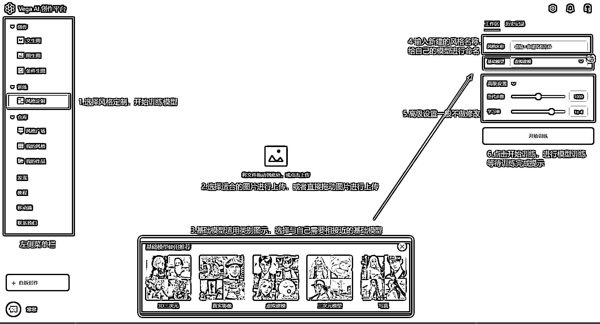
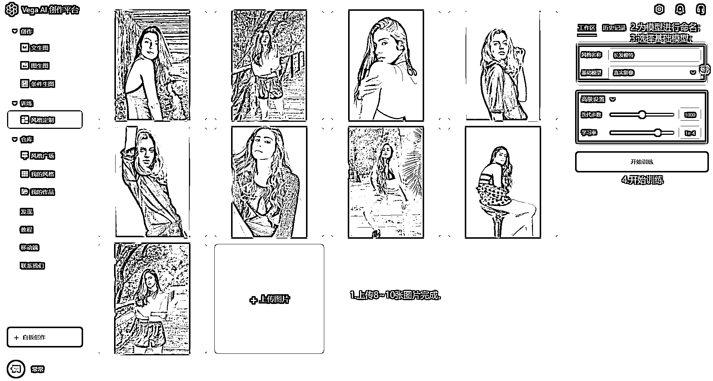
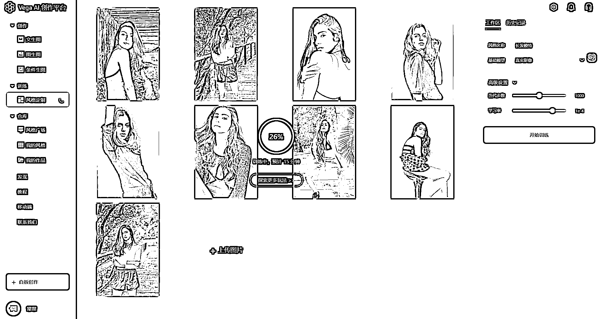
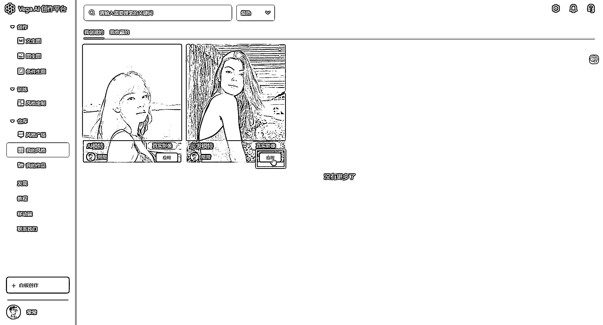
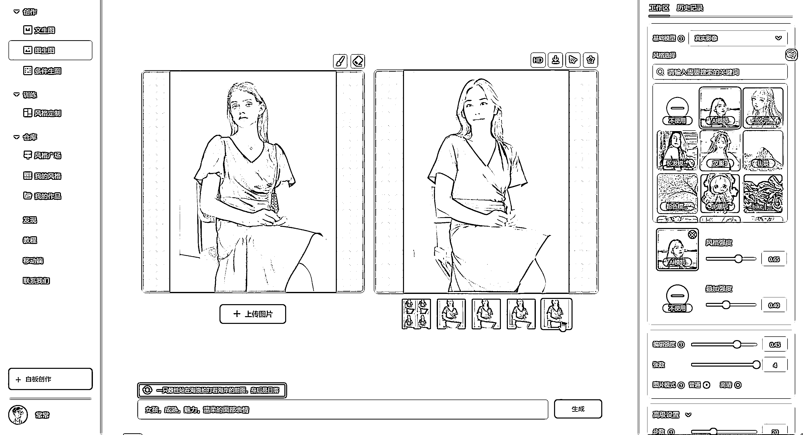

# 9.2.2 进阶技术

方法三：使用使用 Vega AI 创作平台的模型训练功能

① 根据 Vega AI 平台训练定制专属模型要求，准备图片：

图片类型：如同一人物、同一画风、同一物体、同一纹理、同一材质、同一姿势等图片数量：10-100 张之间，图片数量越多效果越好图片大小：建议分辨率在 512x512 像素以上图片的内容：建议保持主体一致，避免主体元素过小

② 输入风格名称，根据下方五种基础模型的展示图，选择适合自己需要的模型，在右侧菜单栏的基础模型中选择基础模型，基础模型是 Vega AI 平台的内置模型，不同的模型之间差异非常大，会直接影响出图效果，需要进行慎重选择：

③ 上传图片，点击左侧菜单栏，选择风格定制，点击“上传照片”进行上传，或者使用鼠标进行直接拖拽上传：

④ 点击开始训练，一般需要等待 30 分钟左右时间，等待训练完成，训练完成后，会有弹窗提示进行操作：

⑤ 模型训练完成后，可以点击左侧菜单栏，选择“风格定制”——我的模型，可以查看到刚才训练的模型，点击去应用。

⑥ 选择左侧菜单栏“文生图”或者“图生图”、“条件生图”的模式，输入文案开始使用自己训练完成的模特进行创作：

