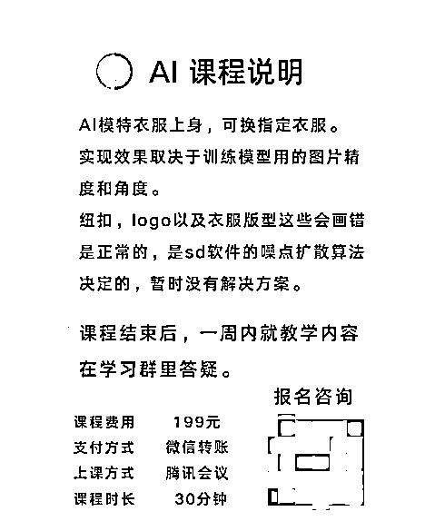
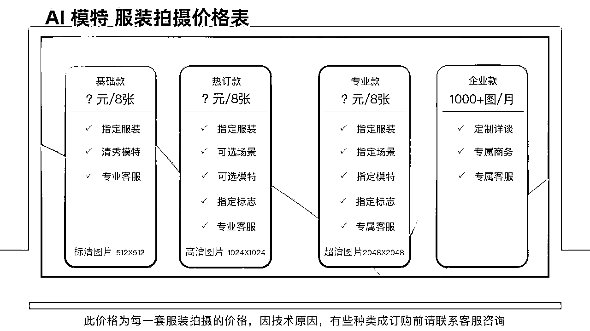

# 9.3 变现方式

如果你本就在电商领域，你可以直接将 AI+电商领域的玩法学以致用；

如果你非电商领域玩家，那么以下两种方式也可以变现。

方式一：出售教程

整理 Stable Diffusion 模特图/产品图的制作方法，制作课程，进行出售：

方式二：对接商家资源，为商家提供 AI 模特服务

在小红书、淘宝、闲鱼店铺，通过给商家发送私信，寻找合适的商家店铺，进行商家合作。

通过为商家提供不同的 AI 模特服务，按照实际出图张数进行收取费用。

方式三：成为 AI 模特商业链上面的任意一环

比如，能够获取流量，能够获得很多商家资源，可以为 AI 摄影师提供商单资源，获得收入。同理，AI 摄影师也可以为这样的渠道提供人力资源。

所有生意都会有多个环节，供应链，流量，产品交付，在每个环节上都有着可以进行提供个人价值的变现机会。

方式四：资源组合，形成团队赚钱

在上文已经提及，AI 模特绘图单个个人进行产出，效率和收益都很低，难以接下大单，比如商家一次要 500 张图，要求一周内出图。

这种情况下，必须团队作战，比如有 10 个人，1 个负责推市场，1 人负责商家沟通和交付，剩下 8 人，负责出图，那么每人一周的工作量就是 60 张+，这就是可以做到的。

方式五：直接成为商家

这个建议听起来大胆，但是对于生财的小伙伴，可行性非常高。

相信很多人已经从生财上学习了如何选品，如何运营的知识。

那么，现在正好有 AI 可以帮我们搞定图片，我们开店的成本进一步降低，图片也不再是能够阻挡我们的门槛。

当然，上述变现方法都还在探索初期，规则都并不完善，如果有兴趣，你可以亲自尝试一下。

