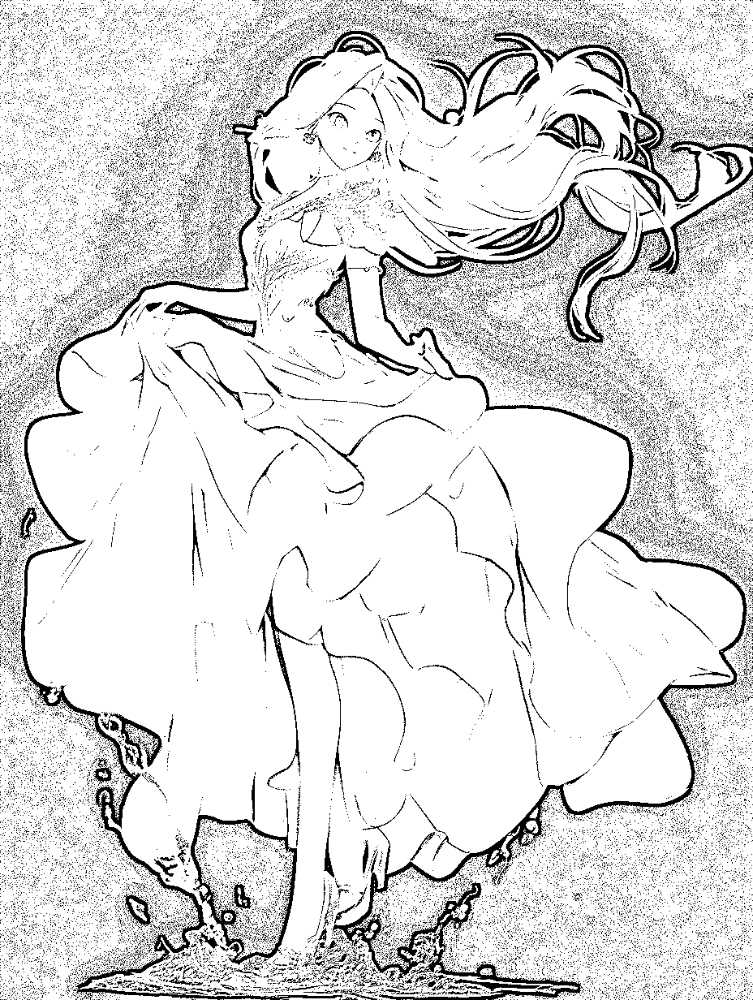
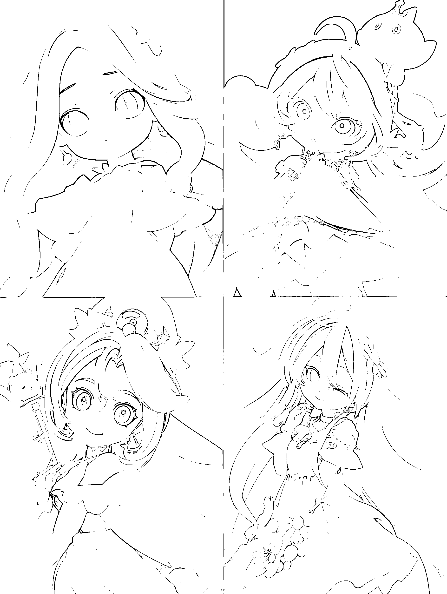
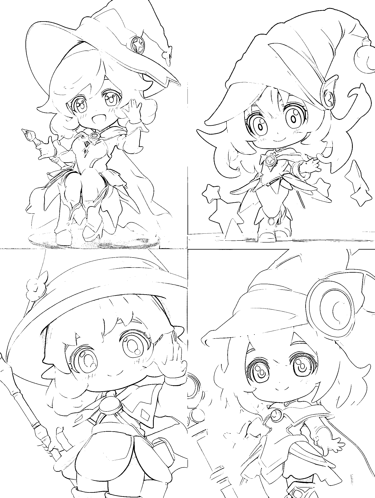
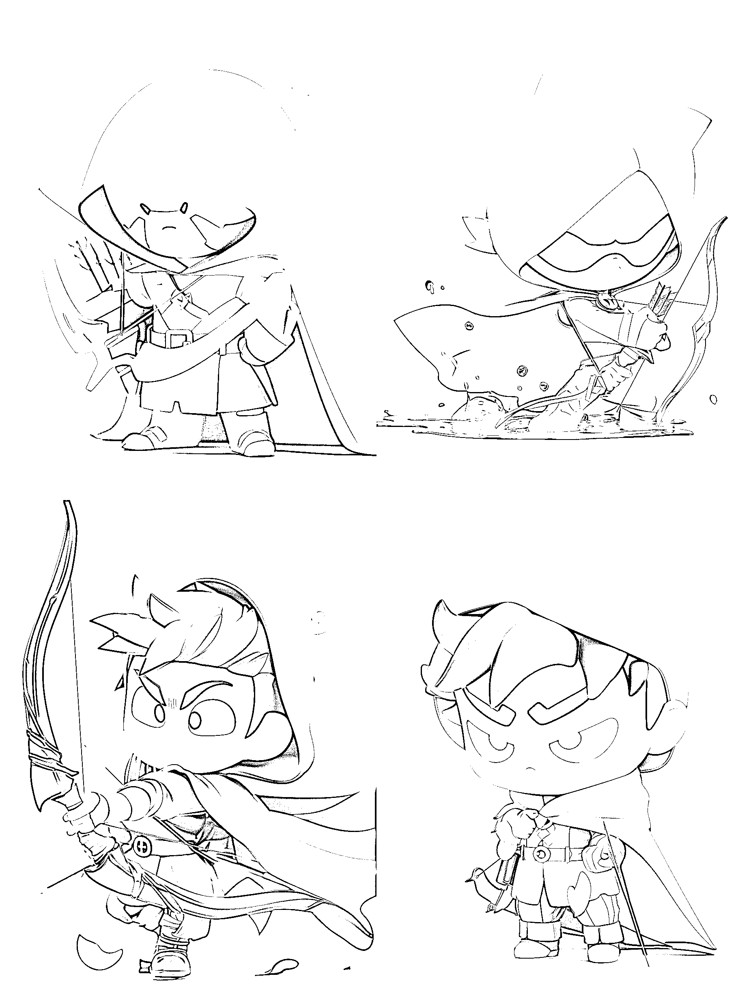
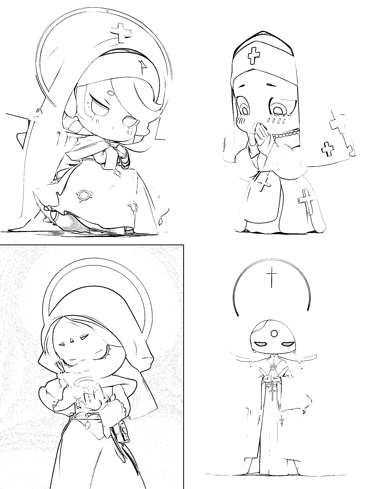
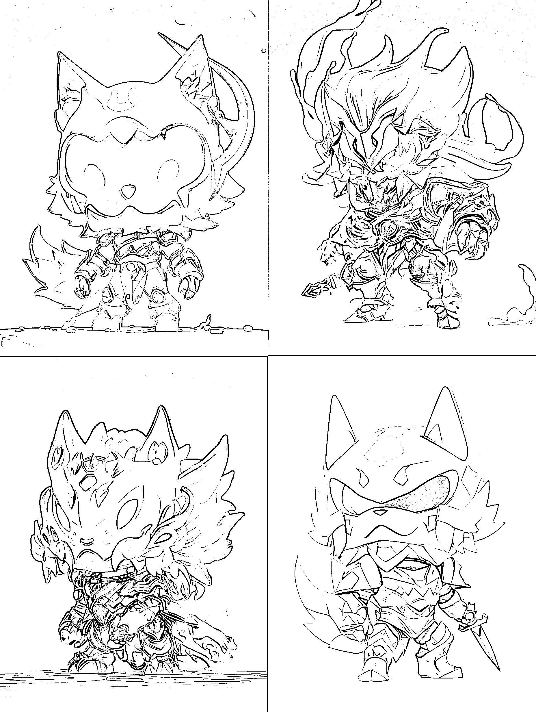

# 10.2 如何实操

•推荐工具：MidJourney

•如何使用 MidJourney，可参考章节【四、学会用 MidJourney 完成 AI 绘画】

•关键词公式：【核心风格】，【主体】，【主体设定】，【风格设定】，【渲染工具/引擎】，【质量词】

目前较为流行的是 IP 是盲盒系列，那么就来做一个盲盒的举例。

•常见盲盒定制

Blind Box style,dynamic pose, beautiful girl, blue princess dress, white long hair, black background, lumen reflection, 3D,C4D, CGI, VFX, HD, --niji 5 --style expressive 盲盒风格，动态姿势，美少女，蓝色公主裙，白色长发，黑色背景，流明反射，C4D，CGI，VFX，HD

•Q 版风格

Blind box style, chibi, dynamic pose, beautiful girl, white princess dress, blue long hair, white background, lumen reflection, C4D, CGI, VFX, HD --niji 5 --style expressive

•全身盲盒

Blind Box style, POPMART, chibi,Kawaii,magician cute Girl, Cute and playful posture,full body ,PVC, reflective clothing,best quality,ultra details --niji 5 --style expressive 盲盒风格，POPMART，Q 版，卡哇伊，魔术师萌妹，可爱俏皮姿势，全身，PVC，反光衣，极品，极致细节

•不同职业

Blind box style, POPMART, chibi, dynamic pose, archer, cape, green clothing, white background, lumen reflection, C4D, CGI, VFX, HD --niji 5 --style expressive 盲盒风格，POPMART，chibi，动态姿势，弓箭手，披风，绿色服装，白色背景，流明反射，C4D，CGI，VFX，HD

Blind box style, POPMART, chibi, dynamic pose, priest, girl, blue clothing, white background, lumen reflection, C4D, CGI, VFX, HD --niji 5 --style expressive 盲盒风格，POPMART，chibi，动态姿势，牧师，女孩，蓝色衣服，白色背景，流明反射，C4D，CGI，VFX，HD

Blind box style, POPMART, chibi, dynamic pose, warrior, wolf head, red armor, white background, lumen reflection, C4D, CGI, VFX, HD --niji 5 --style expressive 盲盒风格，POPMART，chibi，动态姿势，战士，狼头，红色盔甲，白色背景，流明反射，C4D，CGI，VFX，HD

