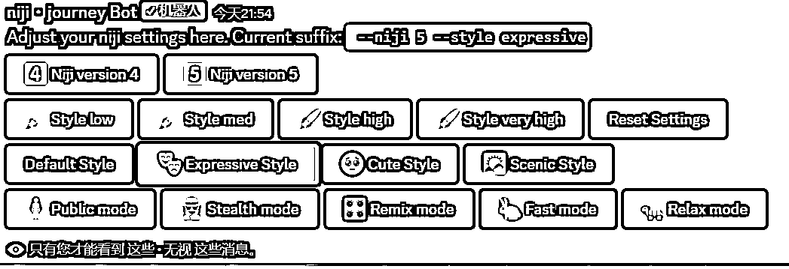

# 10.3 常用关键词

•核心风格词：盲盒风格/手办 Blind Box style/figure 等

•主体设定：外貌、服装、职业等

•风格设定：平面 flat、3D、chibi、POPMART、动漫风 anime style、机械风 mechanical style、复古风 retro style、潮流风 trendy style、科技风 technological style、全息影像 holographic image、酸设计 Acid designd 等

•渲染工具/引擎：RTX、C4D、CGI、VFX、HDR、Maya 等

•建议模型：niji expressive（并不是其他的不能用，而是暂时感觉这个效果比较好）

