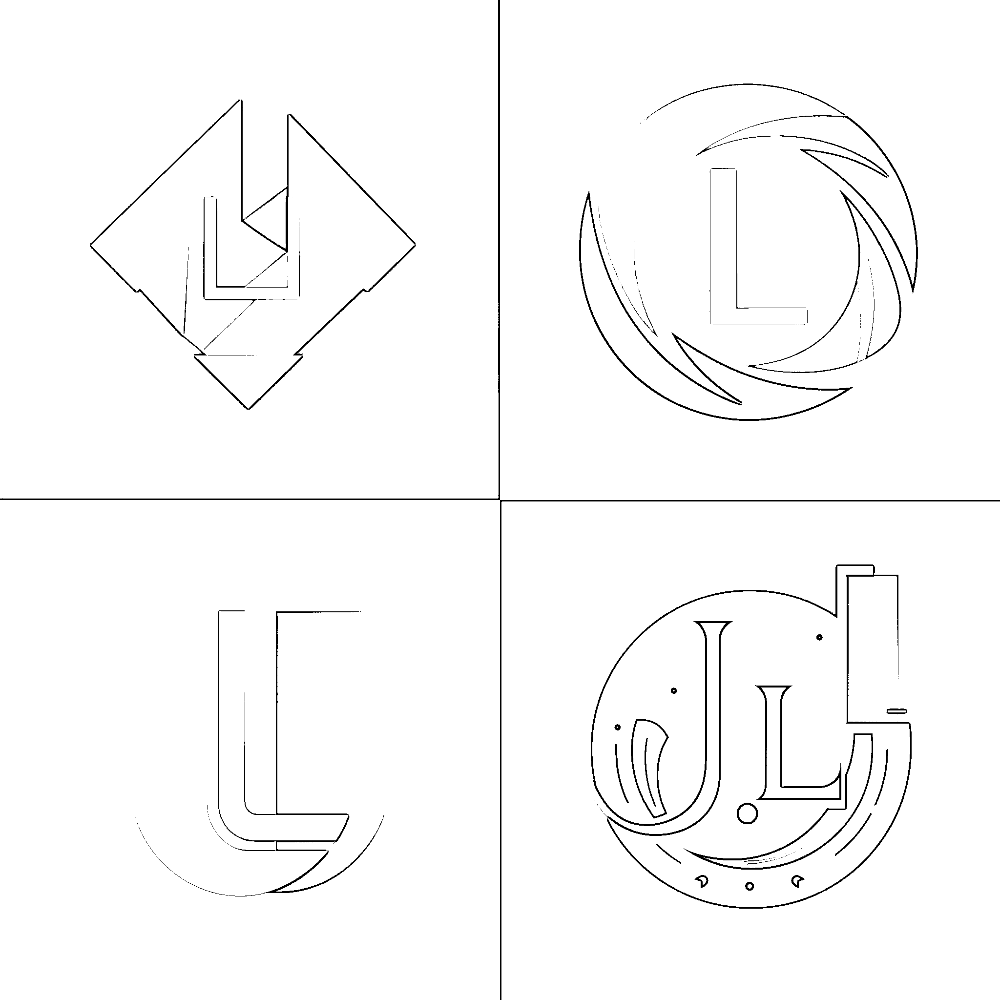

# 11.1 玩法介绍

LOGO 指的是企业、组织、品牌等在商业活动中使用的标志和标识，是品牌身份的重要组成部分。LOGO 设计需要考虑到品牌的特点和定位，通过图形、文字、色彩等元素的组合和运用，表达品牌的理念、特点和形象，从而达到品牌宣传和市场推广的目的。

LOGO 设计的类型有：

•字形 LOGO：仅使用文字或字母来表达品牌形象和价值；

•图形 LOGO：使用图形或图案来表达品牌形象和价值；

•组合 LOGO：将文字和图形组合在一起，形成更加复杂和丰富的品牌形象；

•徽标 LOGO：类似于图章或徽章。

风格主要有：

•扁平化风格：简化图形和色彩，强调简洁和现代感；

•立体化风格：使用阴影和渐变等效果，增强图形的立体感和质感；

•手绘风格：手绘的方式表现图形和文字，增强品牌形象的个性和亲和力，适用于比较轻松和有趣的品牌形象；

•经典风格：使用传统的设计元素和技巧，强调品牌的历史和传统，适用于具有丰富历史和传统的品牌；

•未来主义风格：使用未来感十足的图形和色彩，强调品牌的科技感和先进性，适用于科技和创新型品牌。

AI 绘画在 LOGO 设计领域的优势，与插画设计基本相似，这里不重复赘述。

局限性上，AI 绘画在 LOGO 设计领域的局限更多两条：

•文字/字母无法完美体现

•只能提供思路，不能完全当成品图

现阶段 AI 对文字的输出还不可控，只能设计单独的字母，比如：字母“L”，不能设计单词和中文。在 LOGO 类型中，它现阶段只能对图形 LOGO+徽标 LOGO 进行设计，对字形 LOGO 还远远无法满足设计需求，如对单词：LIN，它的设计如下图，不能很好的表达。

并且，AI 缺乏情感意识，设计出来的 logo 不够有趣，没有灵魂。对于商单来说，AI 绘画只能提供一个灵感，一个基础图形，对于 LOGO 来说，需要矢量图形，或者分层图层等等，这些都需要设计师进行二次创作。

