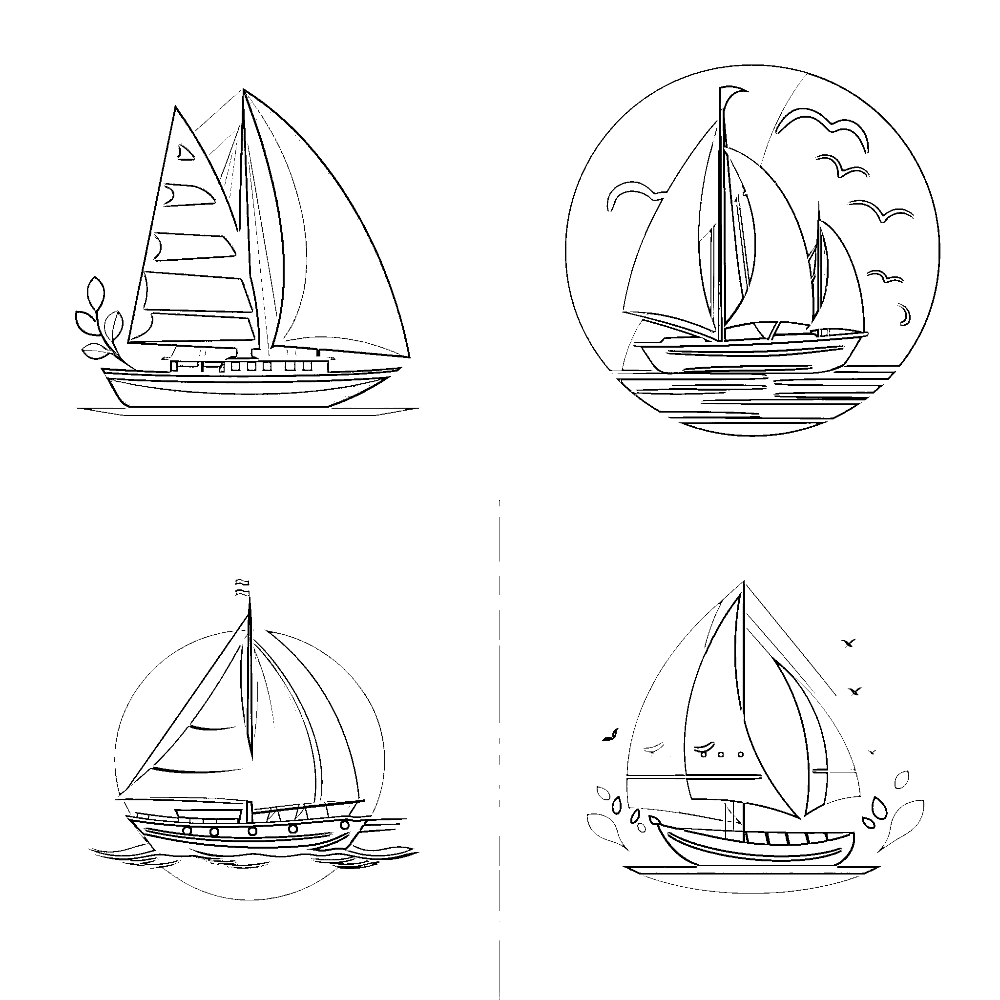
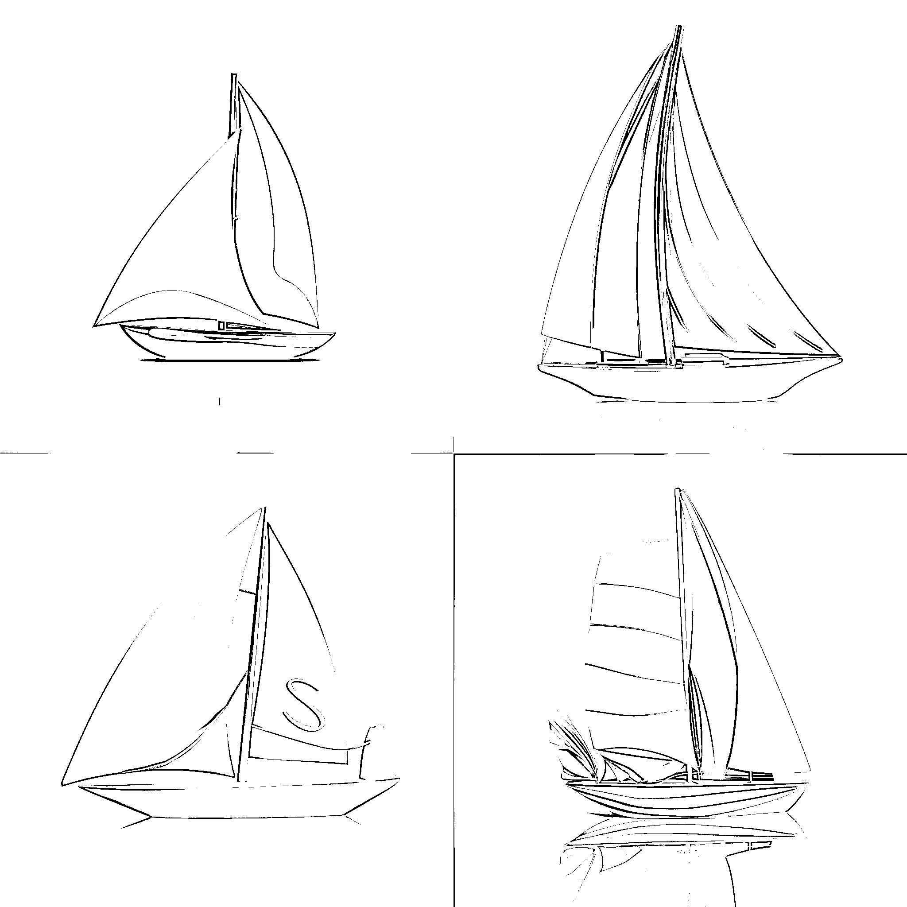
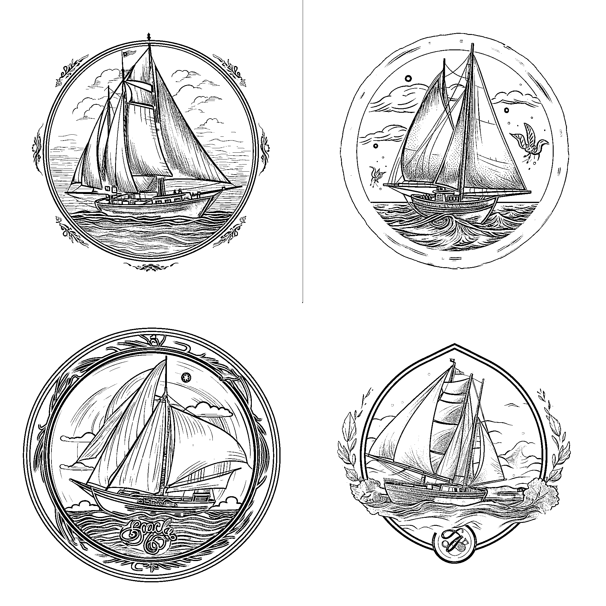
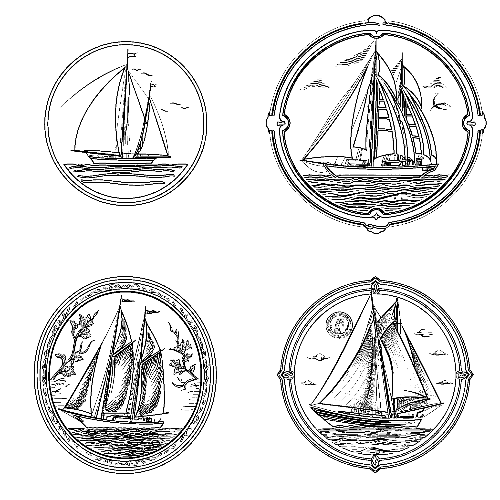
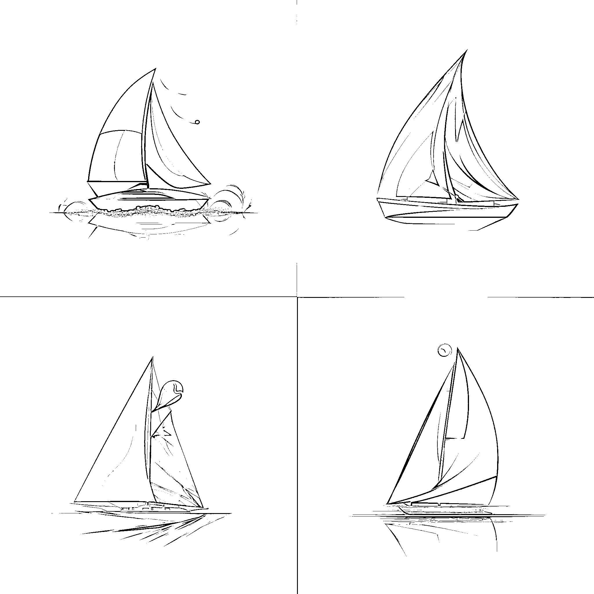

# 11.2.1 快速上手

一个快速的上手设计方法，公式：【LOGO 设计】+【LOGO 风格】+【你想要的画面】。

比如，我想为生财设计一个帆船图标 LOGO，用这样的方法，我可以快速设计出多组关键词。

以下出图均使用 MidJourney 工具，如何使用 MidJourney，可参考章节【四、学会用 MidJourney 完成 AI 绘画】。

LOGO 设计，扁平化风格，一只绿色的帆船 LOGO design, flat style, a green sailboat --v 5

LOGO 设计，立体化风格，一只绿色的帆船 LOGO design, 3D style, a green sailboat --v 5

LOGO 设计，手绘风格，一只绿色的帆船 LOGO design, hand-drawn style, a green sailboat --v 5

LOGO 设计，经典风格，一只绿色的帆船 LOGO design, classic style, a green sailboat --v 5

LOGO 设计，未来主义风格，一只绿色的帆船 LOGO design, futuristic style, a green sailboat --v 5

