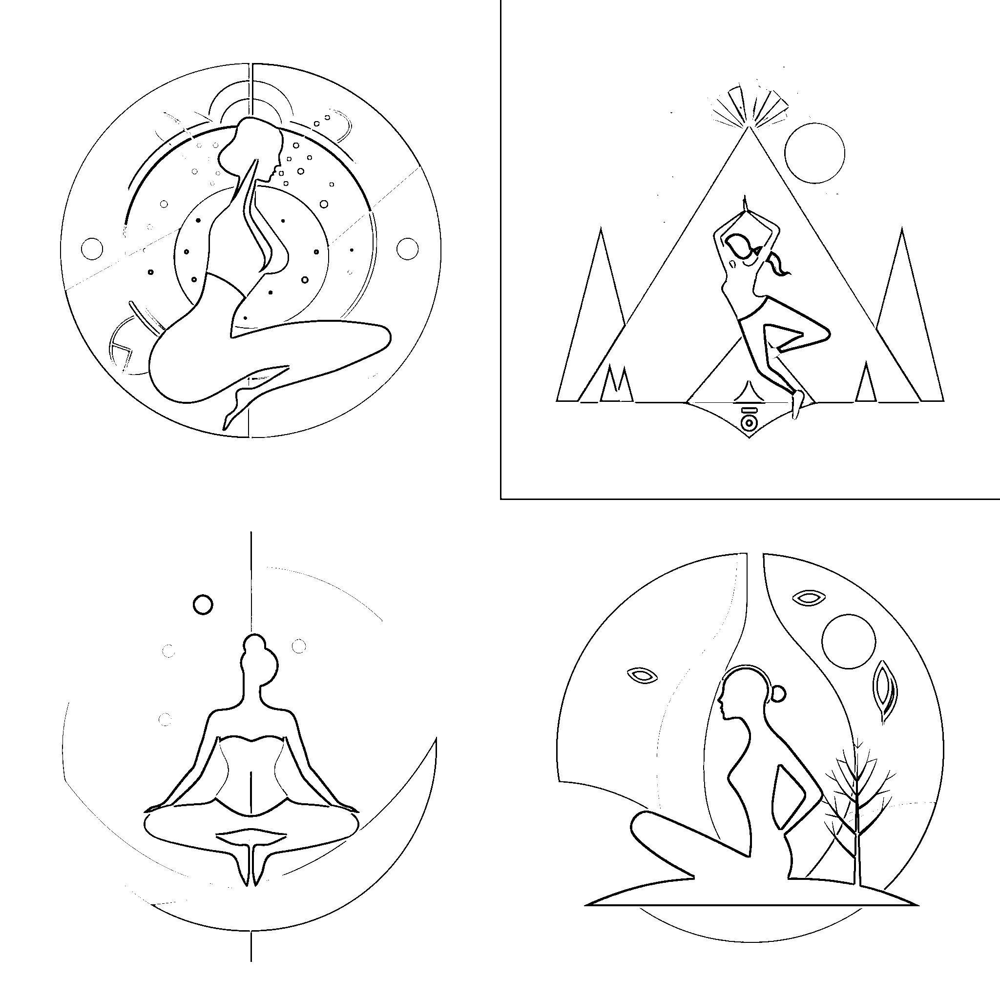
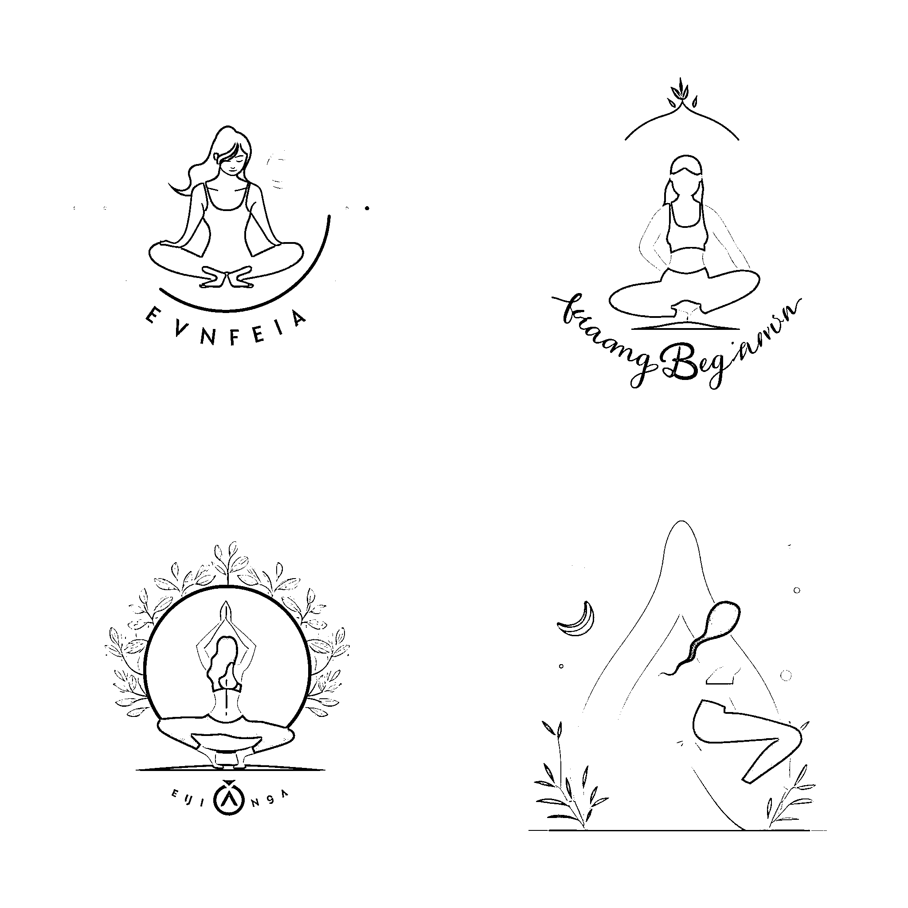
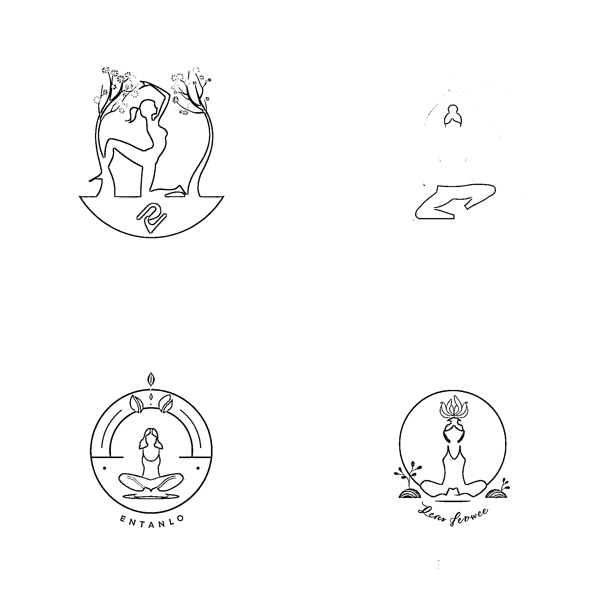
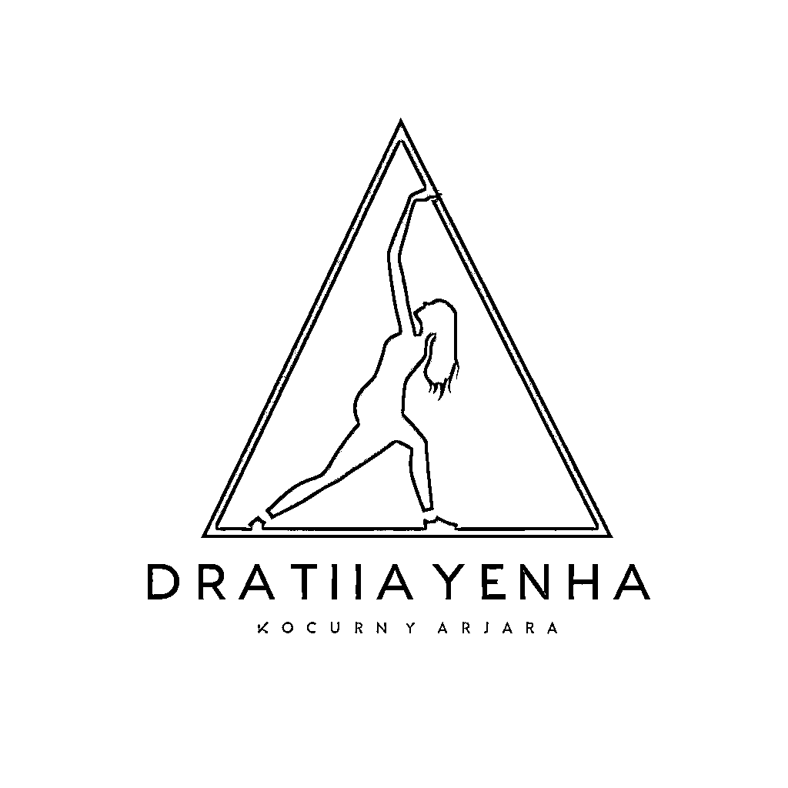
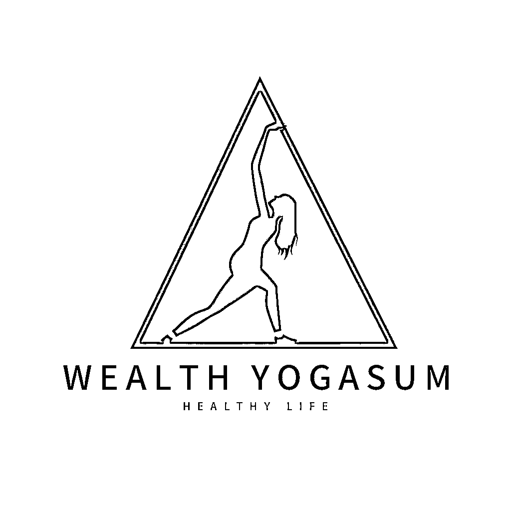

# 11.2.2 延伸设计

拓展玩法一：扩展关键词，加入艺术大师名字

关键词的组合可以多种多样，比如还可以加上 LOGO 领域的设计大师名字，做出相关的作品。

公式：【LOGO 设计】+【by 设计师名字】+【LOGO 风格】+【你想要的画面】

比如，我想要为一个瑜伽馆设计一个 LOGO 图标，我想要艺术家 Saul Bass 的风格，那么，我的关键词就可以为：

Logo design, by Saul Bass,flat style, girl doing yoga --v 5

当今世界上有许多才华横溢的 LOGO 设计大师，他们设计的标志已经成为了很多知名品牌的象征。以下是 Notion AI 列出的顶级的 10 位 LOGO 设计大师及其代表作，供大家参考：

Paul Rand - Paul Rand 是美国现代图形设计的奠基人之一。他设计的标志包括 IBM、ABC 和 UPS 等，这些标志已经成为了标志设计的经典案例。其中，IBM 的标志是一条条带组成的网格，代表着信息科技的复杂性和精准性。Milton Glaser - Milton Glaser 是美国最伟大的平面设计师之一，他设计的标志包括 I <3 NY 和 DC Comics 等。其中，I <3 NY 已经成为了纽约市的象征，而 DC Comics 的标志则展现了超级英雄的力量和魅力。Saul Bass - Saul Bass 是美国最著名的电影开场片和标志设计师之一，他设计的标志包括 AT&T、Kleenex 和 United Airlines 等。其中，AT&T 的标志是一只手拿着电话听筒，代表着通信和联系的力量。Massimo Vignelli - Massimo Vignelli 是意大利最伟大的图形设计师之一，他设计的标志包括 American Airlines、Bloomingdale's 和 Ford 等。其中，Ford 的标志是一个蓝色的椭圆形，代表着汽车的精致和高贵。Michael Bierut - Michael Bierut 是美国最有才华的图形设计师之一，他设计的标志包括 Hillary Clinton 2016、Saks Fifth Avenue 和 MIT Media Lab 等。其中，Hillary Clinton 2016 的标志是一个 H 和一个箭头组成的标志，代表着希望和改变。Lindon Leader - Lindon Leader 是美国最有天赋的标志设计师之一，他设计的标志包括 FedEx 等。其中，FedEx 的标志是一个紫色和橙色的箭头，代表着速度和可信赖。Ivan Chermayeff - Ivan Chermayeff 是美国最有才华的图形设计师之一，他设计的标志包括 NBC、National Geographic 和 Showtime 等。其中，NBC 的标志是一个彩色的鸟笼，代表着娱乐和创造力。Tom Geismar - Tom Geismar 是美国最着名的平面设计师之一，他设计的标志包括 Xerox、Chase Bank 和 Mobil 等。其中，Mobil 的标志是一个红色的圆圈和一个蓝色的斜线，代表着能源和创新。Chermayeff & Geismar & Haviv - Chermayeff & Geismar & Haviv 是美国最著名的标志设计团队之一，他们设计的标志包括 Armani Exchange、National Parks Service 和 Library of Congress 等。其中，Armani Exchange 的标志是一个黑色的手写字母，代表着时尚和品味。Chip Kidd - Chip Kidd 是美国最著名的平面设计师之一，他设计的标志包括 Jurassic Park、Batman 和 Jurassic World 等。其中，Jurassic Park 的标志是一个恐龙骨架的剪影，代表着冒险和惊险。

这里要说明一点，在接商单的时候，一定要避免使用艺术大师的名字，以免出现版权纠纷。

拓展玩法二：扩展关键词，加入其他风格词汇

AI 绘画最大的乐趣是，你加入一个不同的词，它出来的图的效果都不同，大家可以多进行尝试，惊喜就会多多，我们尝试一下，不加入 LOGO 风格限定，加入其他词语。

公式：【字母 LOGO 设计】+【其他风格】+【你想要的画面】，比如“极简风格”

字母 LOGO 设计，极简风格，一个女孩做瑜伽 Letter logo design, minimalist style, girl doing yoga

再多个控制，想要一个简单的背景和线条，那么我们可以写：

字母 LOGO 设计，极简线条，做瑜伽的女孩，白色背景 Letter logo design, minimalist lines, girl doing yoga, white background --v 5

拓展玩法三：利用 BUG 进行文字排版

上面我们说了，LOGO 的 4 种类型，有字形 LOGO，对于 AI 绘画来说，它识别不了文字，AI 出来的字母不是正确的文字，但是不妨碍我们可以利用它来进行排版。

以上面的图为例，一些聪明的朋友已经发现，LOGO 中多了文字，那是因为我的关键词不是单纯的【LOGO】，而是【字母 LOGO】，加上字母，会随机出现字母，而且，文字的排版已经不需要我们再去设计，将图片中的文字用 PS 或者美图秀秀等工具消除，再输入我们想要的字母即可。

以一个图为例：

修改前

修改后

