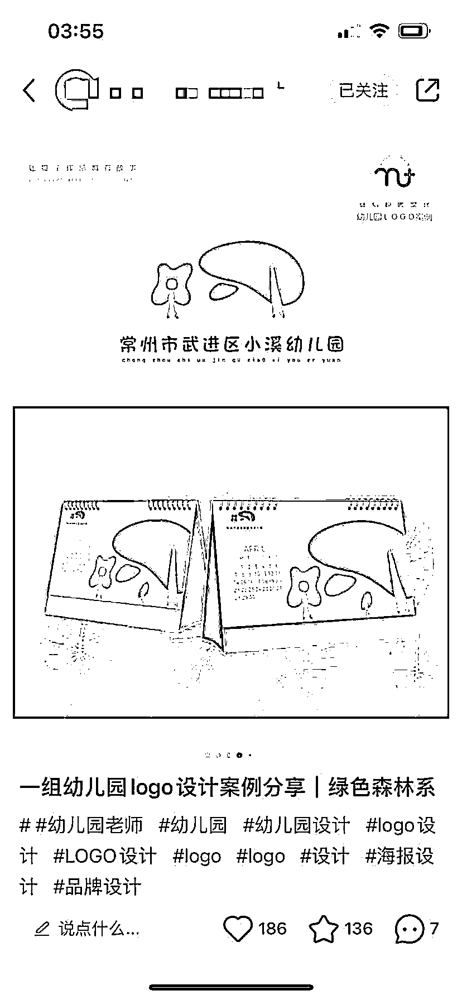
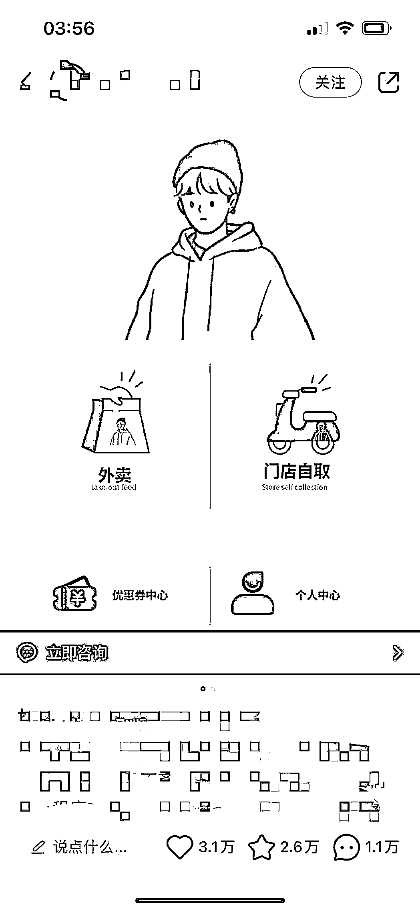
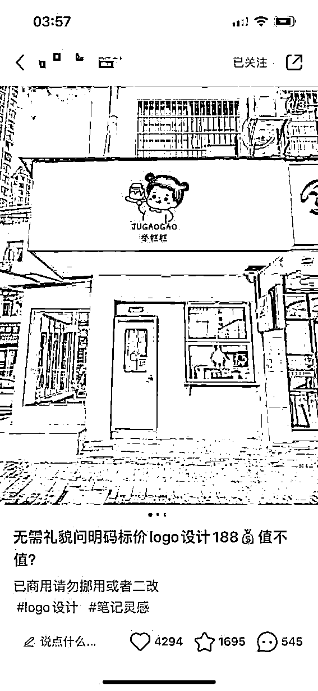
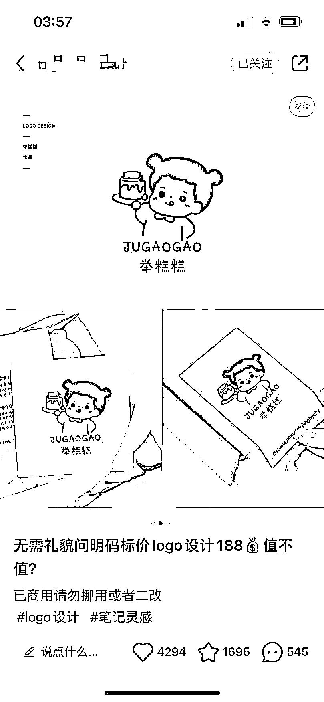
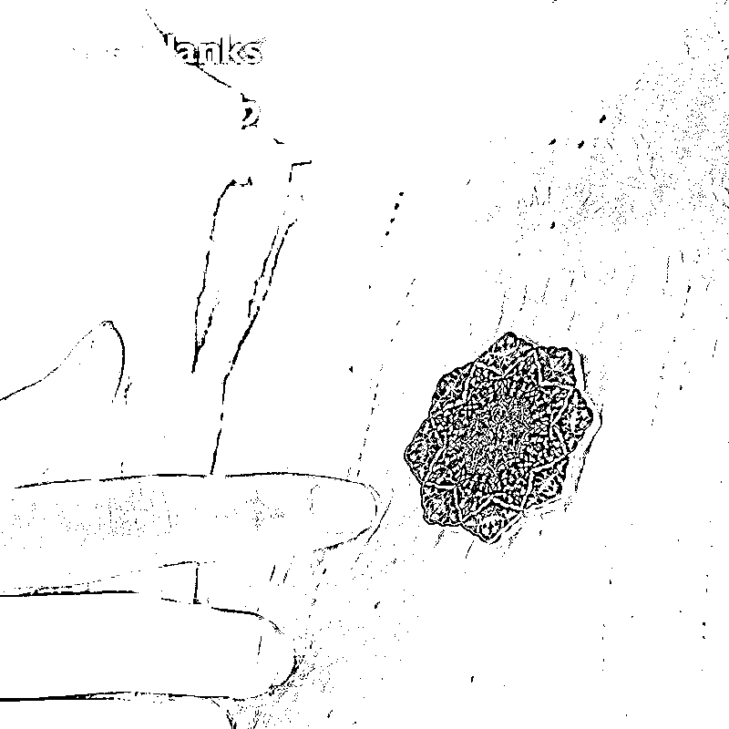
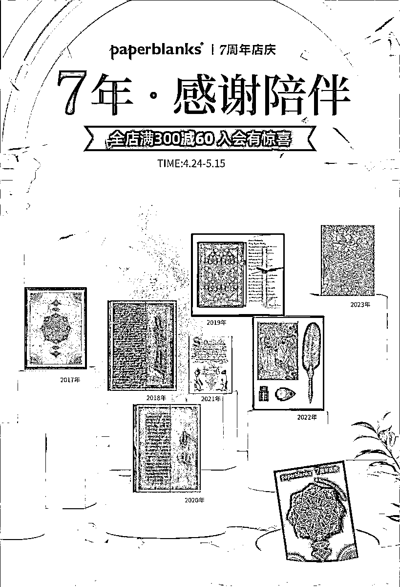

# 11.3 变现方式

在讲变现之前，先来和大家说一下 Logo 的性质：

识别性、特异性、内涵性、法律意识、整体形象规划（结构性）、色彩性

logo 的种类和性质决定了它的制作是有一定门槛的，AI 绘画工具只是起到辅助作用。如果商用，需要进行二次创作，如修改 AI 出图后图片上的字体，添加场景使用等等，还需一定的语言功底，描述出设计理念。

发布小红书图文，如果是发纯 logo 的话，建议“赋予图片意义，给出使用场景”，比如，将 logo 用于门店上、周边文创的包装袋上、日历上、店铺小程序等等，更直观的展示，促进甲方老板下单定制，如：

可做的定制包括但不限定于：设计企业 LOGO 及周边产品，比如店铺的 LOGO，书籍封面图，店铺纪念徽章，书签等

