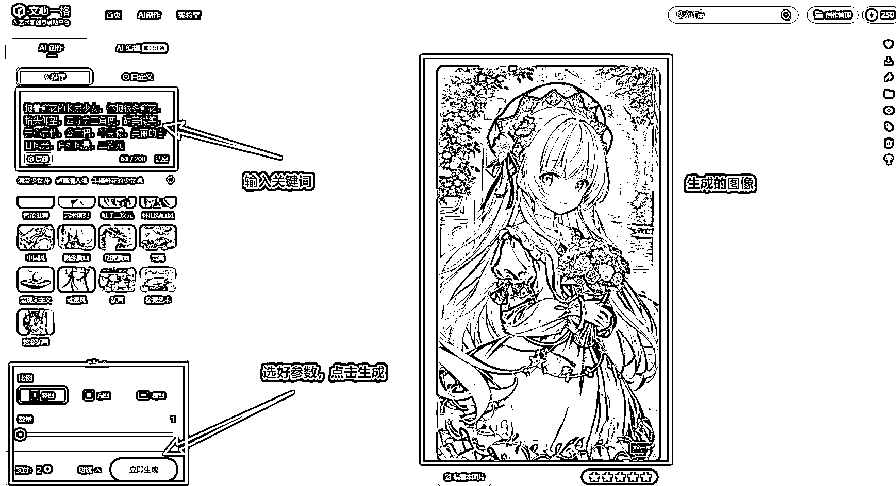
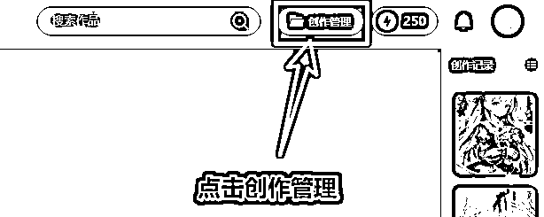
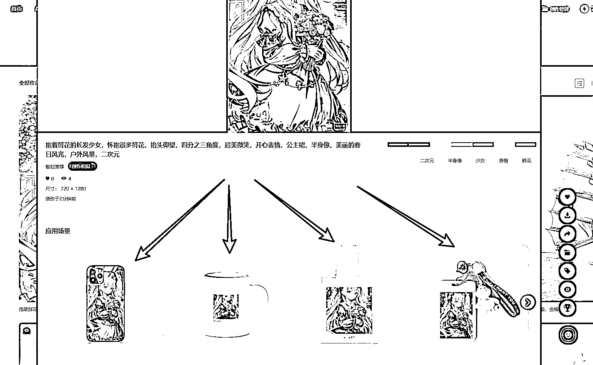
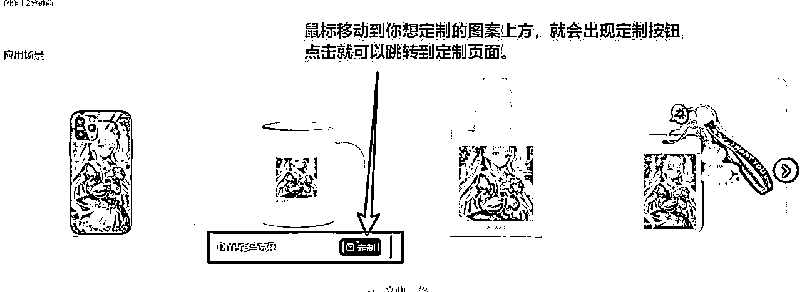
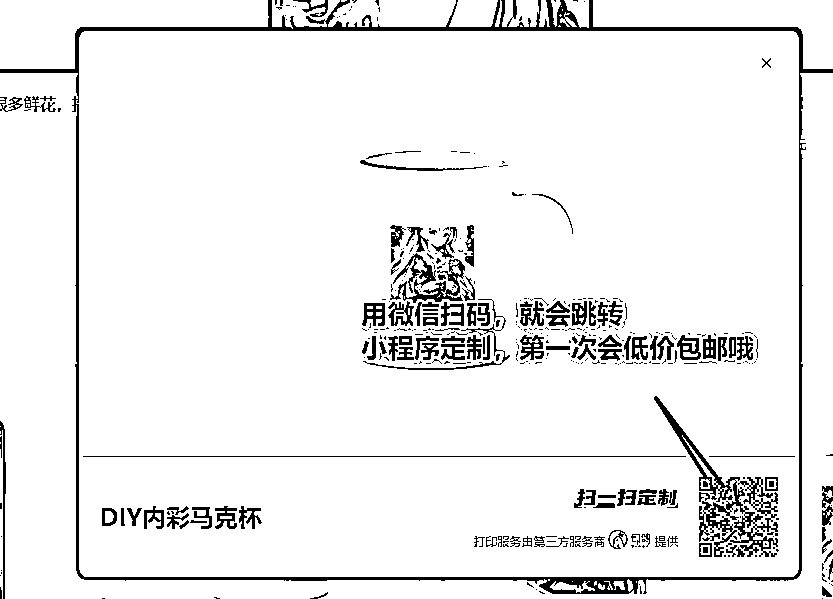
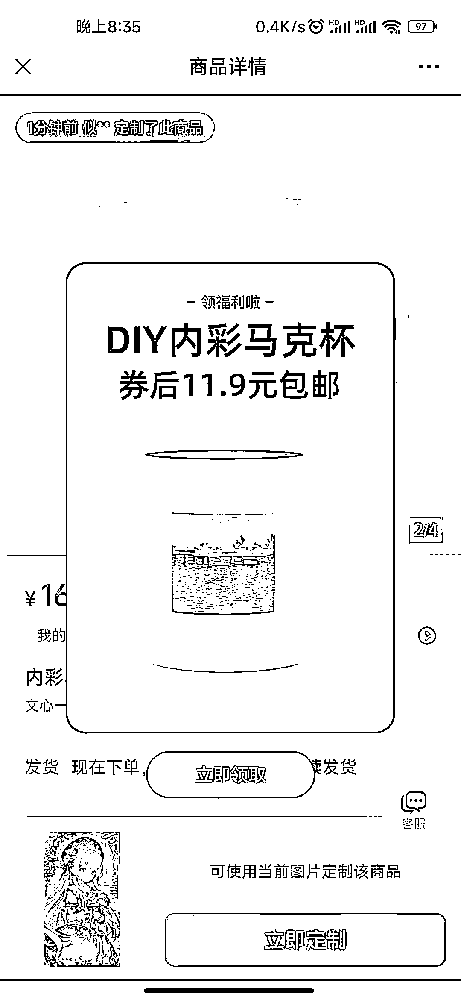
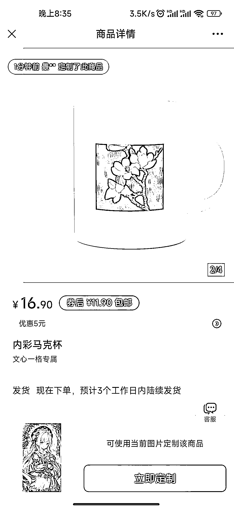
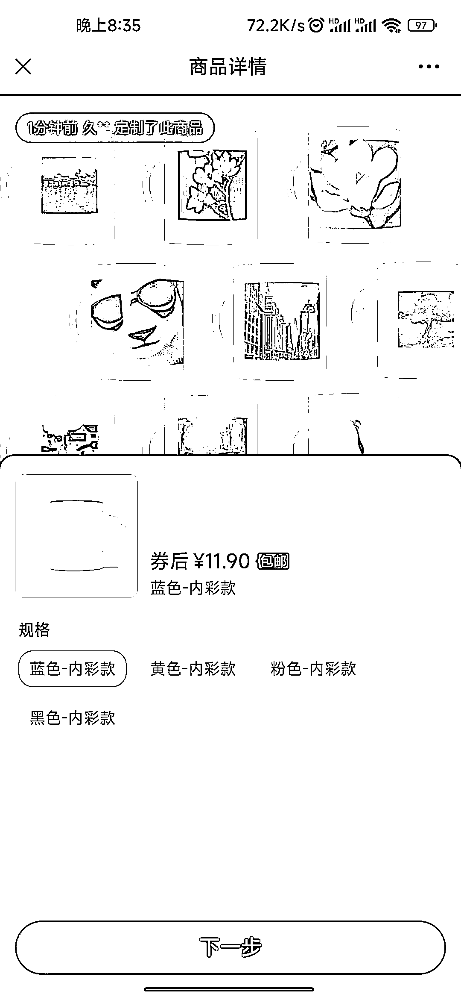
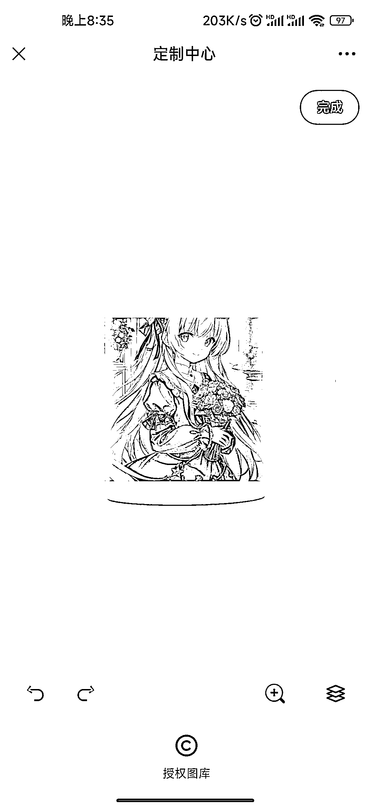
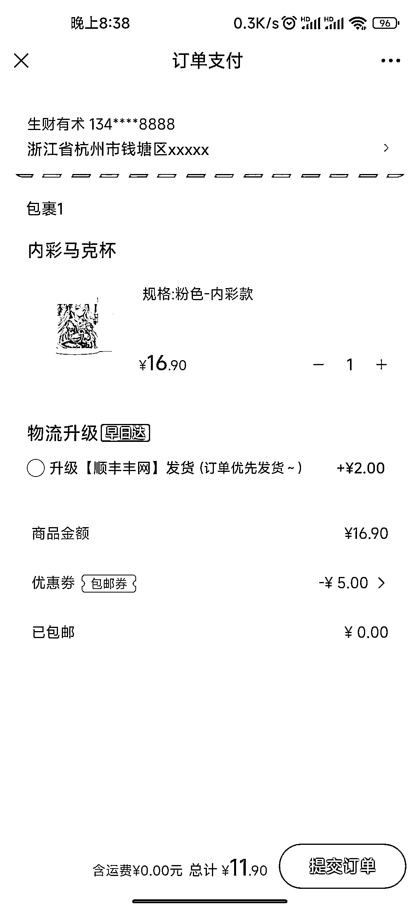

# 12.2.1 玩法一：百度文心一格

文心一格网址：[`yige.baidu.com/`](https://yige.baidu.com/)

文心一格还提供周边定制，生成作品之后可以选择定制成手机壳、马克杯、帆布包等。不过，只有通过审核的图片才能定制相关周边。

我们可以根据客户要求，制作好图案，给客户确认，并在定制的价格上加个差价卖给需要定制的客户。

操作步骤如下图：

然后点击你生成的图案，就能看到应用场景下的 4 种周边产品，选择任意一个，就可以定制：

第一次定制的可以领取优惠券，会便宜点哈，然后点击【立即定制】，选好哪个款式，然后点击下一步。

然后在定制中心，选择右上角的完成，提交客户的发货地址，点击提交订单，就完成了定制流程：

