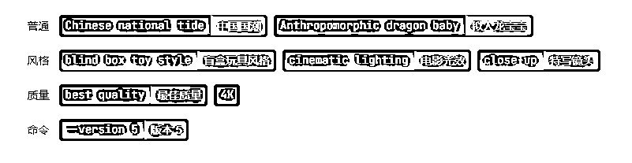
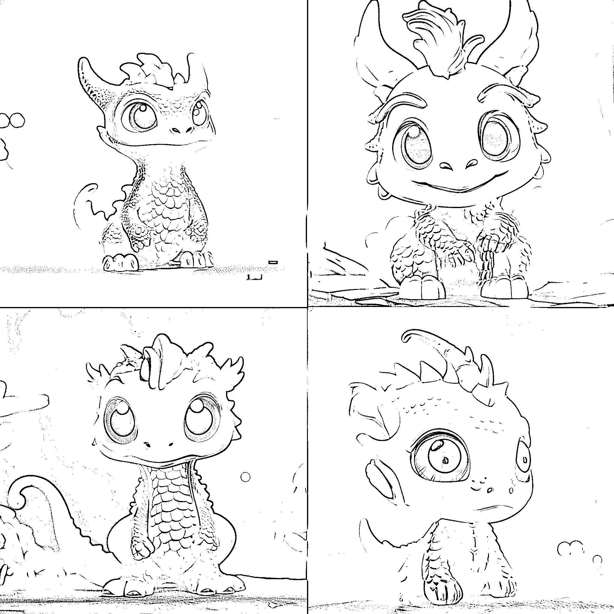
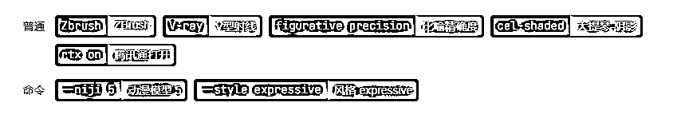

# 12.2.2 玩法二：MidJourney 画图

用 MidJourney 画出图案，然后再去淘宝或者 PDD 上面找定制商家，直接搜索【XX 定制】，然后再询问客服，是否支持一件定制。

如何使用 MidJourney，可参考章节【四、学会用 MidJourney 完成 AI 绘画】

步骤分为两步：

① 和客户确定图案类型，然后画图；

② 找平台商家定制，然后加价给到顾客，赚差价。

周边产品图案主题可以是以下系列风格（也是部分常用关键词）：

•可以是星座、星⾠系列、十二生肖系列；

•厚丙烯、油画肌理，抽象画 ，线条画；

•⽮量、极简图案、涂鸦；

•国潮、3D 画；

•艺术、风景、卡通；

•个人头像......等等

也可以根据顾客需求，写出符合的关键词，画出顾客满意的图案。

比如我以国潮，龙宝宝为主题：

/imagine prompt: Chinese national tide, Anthropomorphic dragon baby, blind box toy style, cinematic lighting, close-up, best quality, 4K --v 5 中国国潮，拟人化龙宝宝，盲盒玩具风格，电影灯光，特写，最佳品质，4K - v 5

如果是手机图案，那尺寸就需要 9：16 的尺寸，也就是--ar 9:16，如：

/imagine prompt: Zbrush, V-ray, figurative precision, cel-shaded, rtx on --niji 5 --style expressiveZbrush，V-ray，具象精确，cel-shaded，rtx on - niji 5 风格表现力

