# 13.2.1 MidJourney 画头像

使用 MidJourney+InsightFaceSwap 插件来完成。

具体步骤：

第一步：MidJourney 垫图生成部分

① 垫图：（最多可以垫 5 张图）

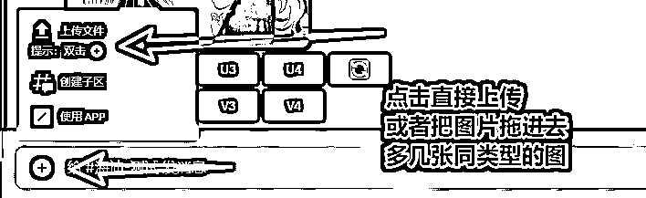

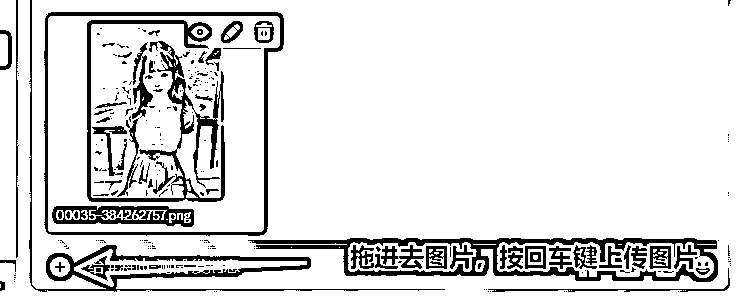

② 右键点击图片，选择复制链接：

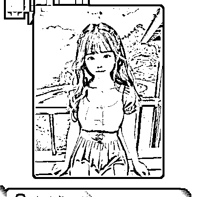

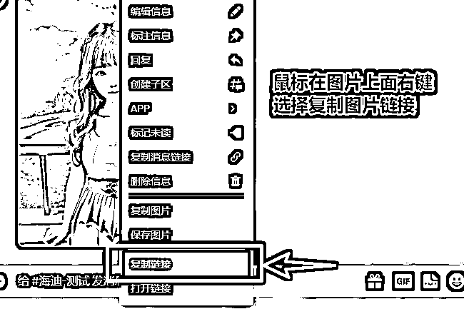

③ 在输入框/imaging prompt+链接+描述语

重点：将你想生成的头像的画面用英文描述下来（不写描述语 MidJourney 就会给你天马行空的画了），比如说 ：

宝宝，短头发、笑、皮克斯，卡通...... ( babies,short hair,cartoon,smile,pixar,cartoon)

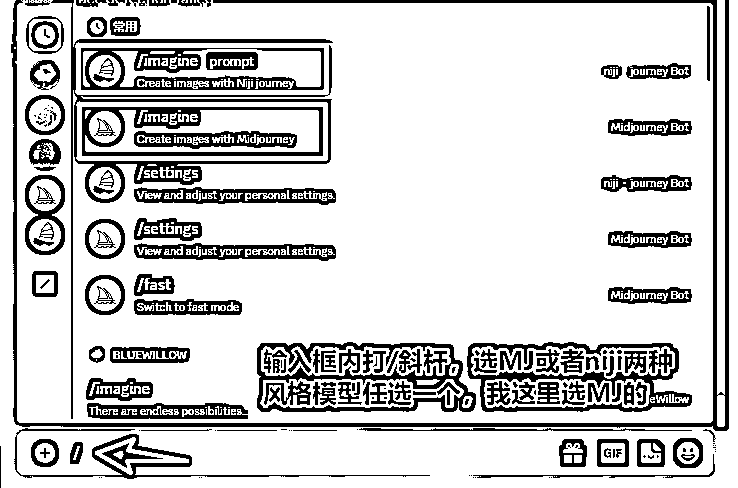

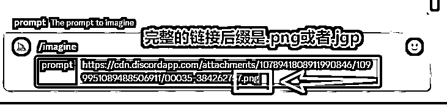

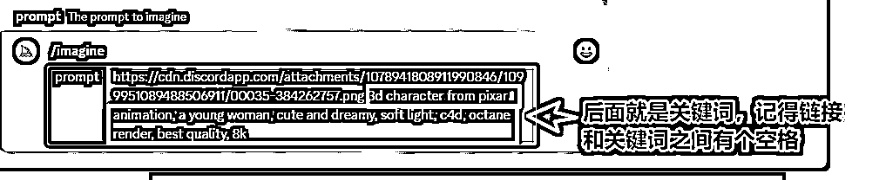

辅助关键词：

3d character from pixar animation, a young woman, cute and dreamy, soft light, c4d, octane render, best quality, 8k

这个关键词加头像 URL 后面，都不会太难看（woman 可以换成 man）。

④ --iw 数值：基本描述语句后边可以加指令 iw，格式是：--iw 2

iw 值范围是 0.5-2，数值越大和原图越接近：

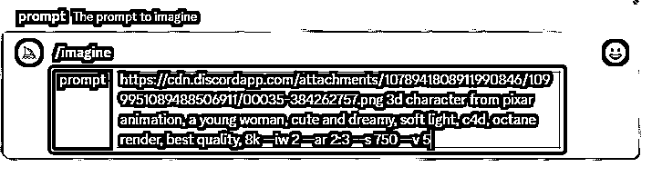

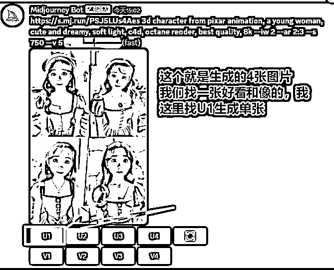

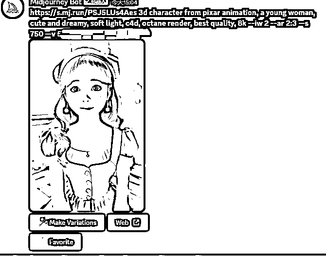

到此我们第 1 个步骤完成，开始第 2 个步骤。

第二步：InsightFaceSwap 换脸部分

① 邀请 InsightFaceSwap bot（[`discord.com/api/oauth2/authorize?client_id=1090660574196674713&permissions=274877945856&scope=bot`](https://link.zhihu.com/?target=https%3A//discord.com/api/oauth2/authorize%3Fclient_id%3D1090660574196674713%26permissions%3D274877945856%26scope%3Dbot))到你的 Discord 聊天室（就和你拉 MidJourney 机器人到你服务器一样的方式）。

顺利的话现在你会在聊天室右侧看到这样的列表：

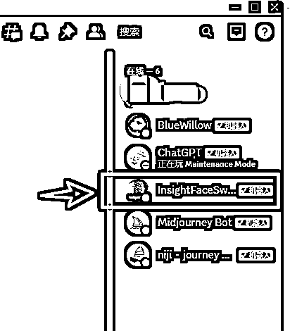

② 输入斜杠命令 「/saveid mnls <上传照片>」，这里 mnls 是注册的名字 id，可以为任意 8 位以内的英文字符和数字）。

保存成功后，新建立的 ID 名称会被自动当作默认 ID，可以通过「/setid idname（s）」命令来手动指定默认 ID：

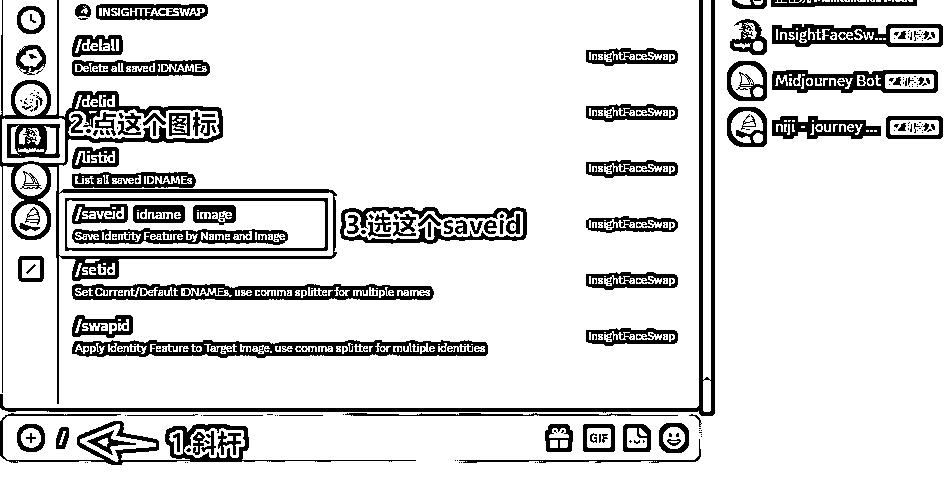

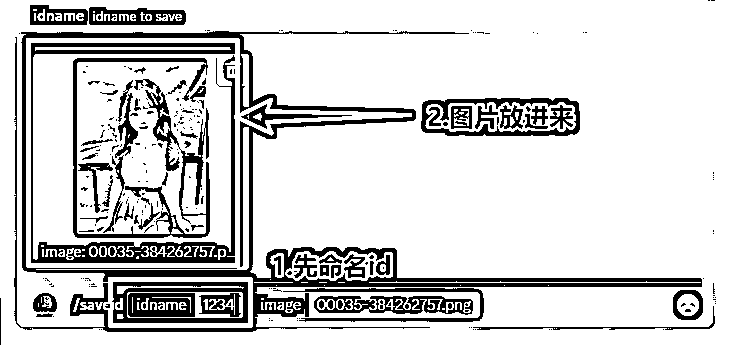

图片放进去后，记得按下回车键。

出现这个就表示命名成功。

③ 换脸术，原理就是把我们上传的这张图的脸，换到我们用 MJ 生成的图片的脸上面。

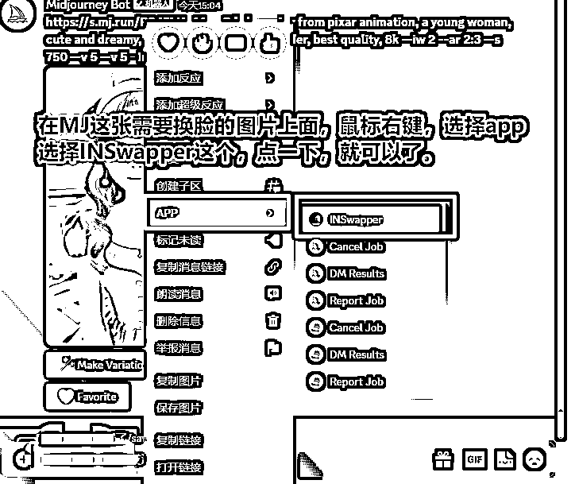

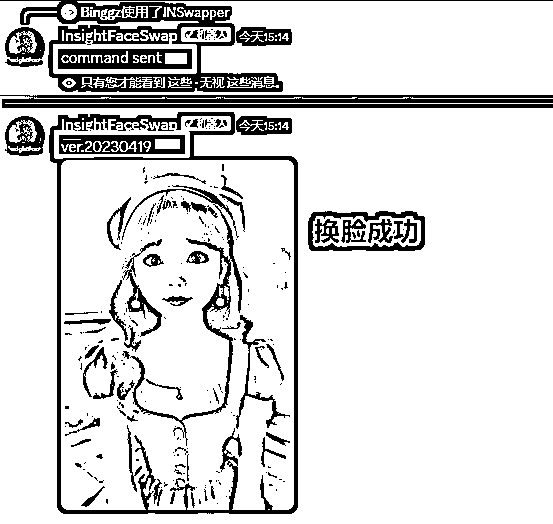

以上就是成功换脸完毕。

注意事项：

•可以使用「/listid」来列出目前注册的所有 ID。总数不能超过 10 个。也可以用「/delid」和「/delall」命令来删除 ID；

•注册的 ID 名字只能用英文和数字，并且不超过 8 个字符；

•你可以输入多个 idname， 用逗号分割，用来实现多人脸替换的效果。例如「/setid me，you，him，her」；

•可以通过重新上传相同的 ID 名字来覆盖旧的 ID 特征；

•如果你不想上传自己的照片，可以调用 insightface python package， 来生成自己的人脸特征，并保存成为一个 。npy 的 512 维向量文件上传；

•尽量的 ID 照片尽量保证 ：清晰、正脸、无遮挡；

•不推荐上传：带眼镜的照片、过度美颜失去面部纹理的照片；

•每个 Discord 账号每天可以执行 50 次命令，为了避免自动化脚本；

•不能保证每次生成的效果都很好；

•请仅用于自我娱乐用途。

