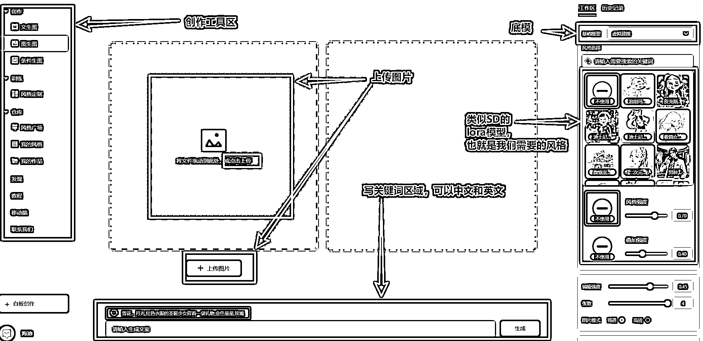
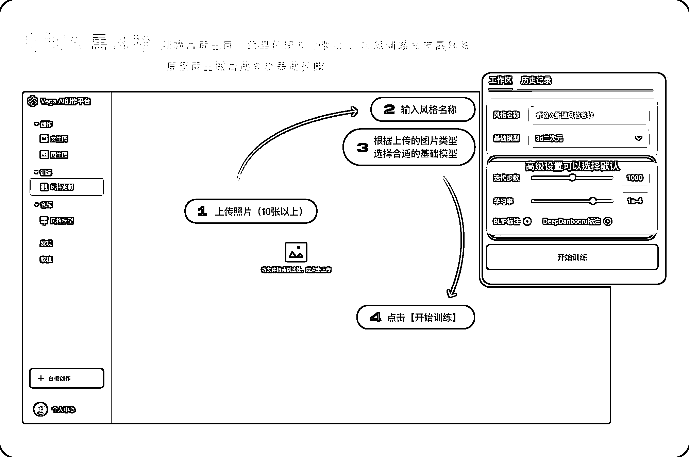
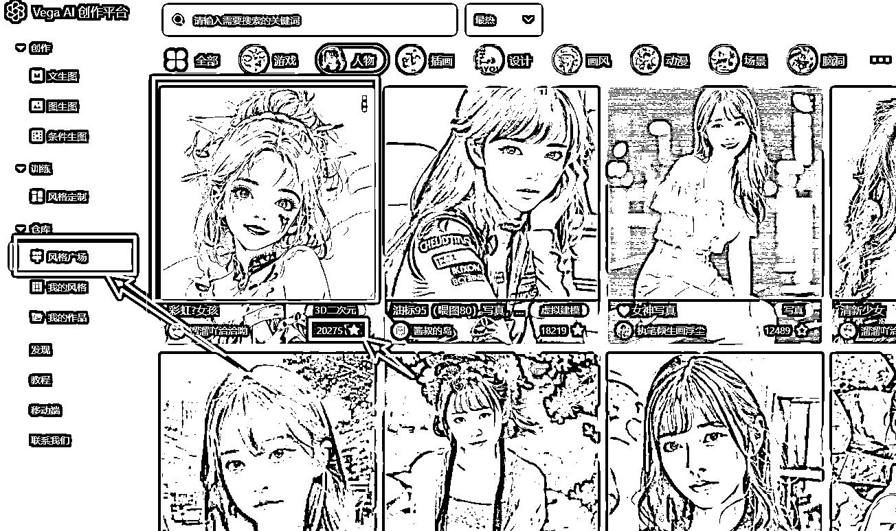
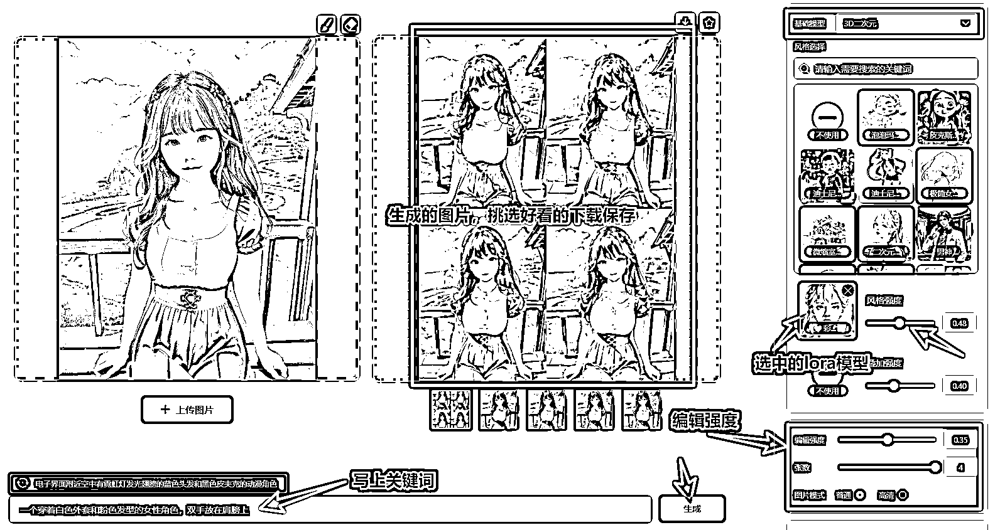

# 13.2.2 Vege AI 画头像或壁纸

•Vega AI 教程👉【三、简易方法：学会用 Vega AI 完成 AI 绘画】

我们这里就以图生图举例应用，生成不同风格的人像壁纸：

也可以选择某个风格的照片训练成自己的 lora 模型：

比如在风格广场选择别人训练好的 lora 模型，点五角星，然后再回到图生图界面：

图生图界面中，选择彩虹女孩这个 lora，底模（基础模型）选 3D 二次元：

•选择风格强度 0.40+，强度越大，越接近 lora 模型；

•编辑强度选择 0.35 左右，我们只改变部分，这样才会像原图；

•张数就是你要生成多少张；

•图片质量，可以选高清，生成速度慢一点而已。

也可以选择两个 lora 模型混合。

以上就是用 Vega AI 制作头像壁纸的方式。

