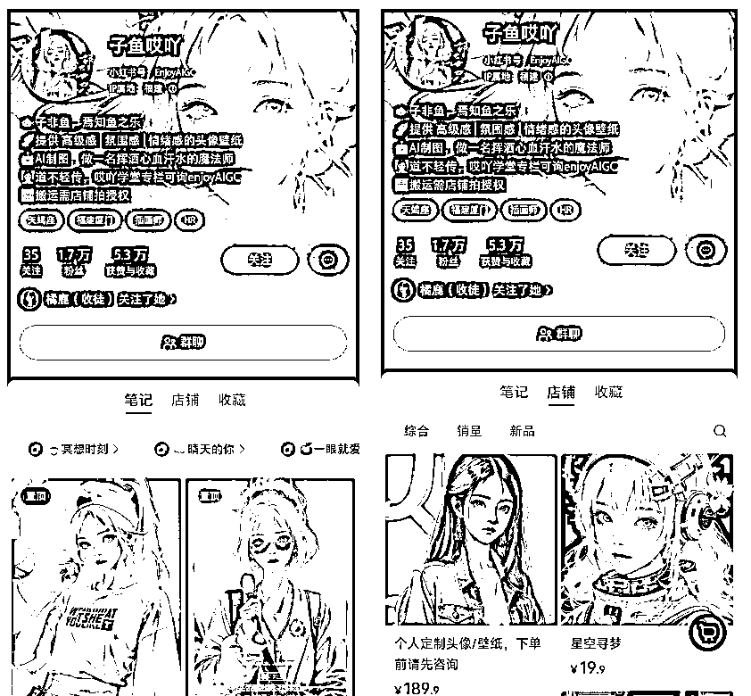
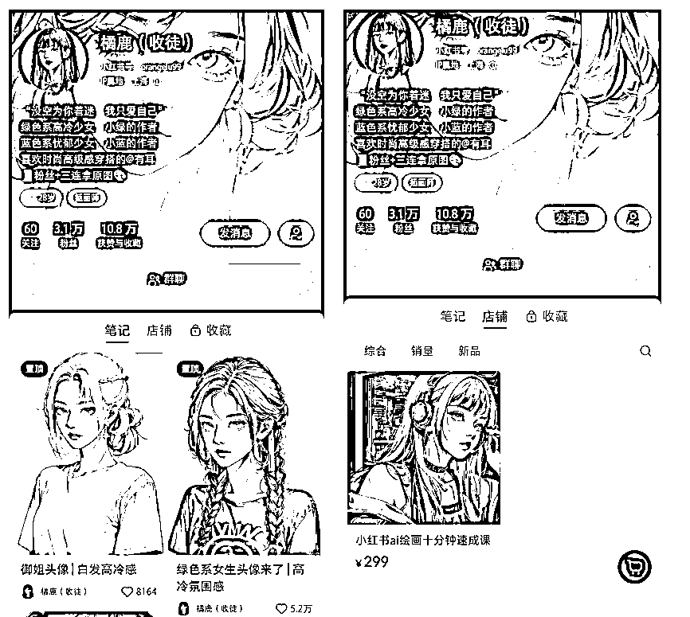
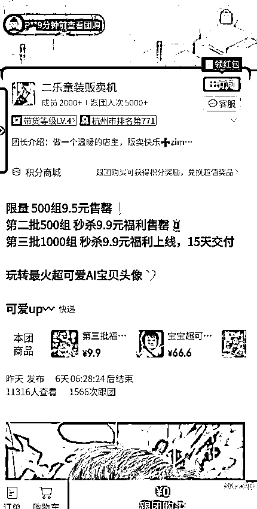
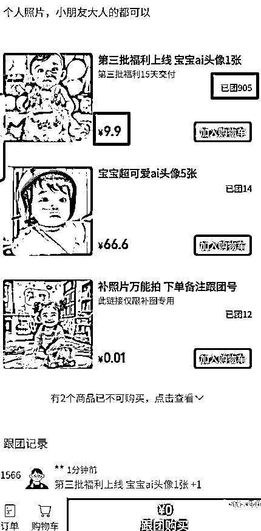
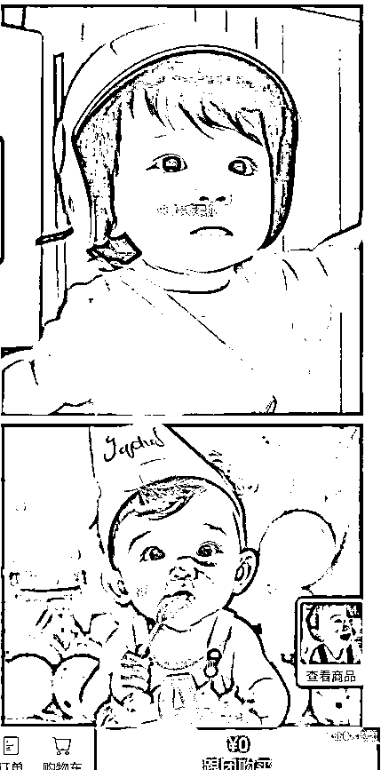

# 13.3 变现方式

头像壁纸的变现方式相对来说比较多，简单来说就是利用公域或私域流量成交：

•私域：比如用快团团工具等工具发布团购，团购内容可以是收费制图，也可以是收费教学，发在群聊和朋友圈即可，有自己的私域流量的更好，吸引顾客下单成交；

•公域：比如在小红书上发布图片笔记或者制作成对比视频笔记（原图+换脸后的图），发布笔记。笔记火了，会有粉丝私聊你做定制，单价 30-99 元 3 张都是可以的。也可以一鱼多次，多平台发布，或者收费教学；

•注意事项：受限于 AI 绘画的出图方式等，制作头像和壁纸不支持改稿，可以在约稿时提前和对方约定一口价；

•更多图文变现方式，可查看【2 月航海｜AI 绘画&ChatGPT｜实战手册】的章节【3.1.2 图文变现】

案例一：头像壁纸

比如在小红书上广受关注与喜欢的子鱼哎吖，其定制的价格方案，大概是 129-189/张，笔记单图售卖 19.9 元。

起号成功后，半个月变现了五位数：

案例二：知识付费

小红书搜“橘鹿”账号，该账号起号 3 天，粉丝接近 2 万粉，并制作付费交付课程，付费会员几百个，客单价 299-599 之间。

案例三：儿童照片

目前宝妈宝爸群体还是愿意对这种儿童迪士尼风格的照片付费的，毕竟新鲜玩意，客单价合适的情况下，人家直接就付款了。

一个宝妈，平时就爱给自己的宝贝拍照，了解到 AI 绘画后，自己用 MJ 试了下效果很好，自己很满意，就琢磨着能不能通过这个赚点钱呢，补贴家用。

很快，她就用快团团发布 AI 绘画团购，在朋友圈和群发了个拼团，没想到两天时间，一千多人拼团，关键还没啥成本（就花费自己的人力成本）：

而这些，只需要套用关键词+垫图，就能直接出这种风格的照片。我们可以算一下她的收入：9.9 元*1500 人=14850 元，这直接就 5 位数。

对于超过 99%的人来说，使用 MidJourney 来创作自己的肖像照是不可行的。除非你是个大明星，这意味着在网上有几千上万张你的相片。但是现在，你可以借助 InsightFaceSwap 这个 Discord bot， 来帮助客户实现这个想法。

