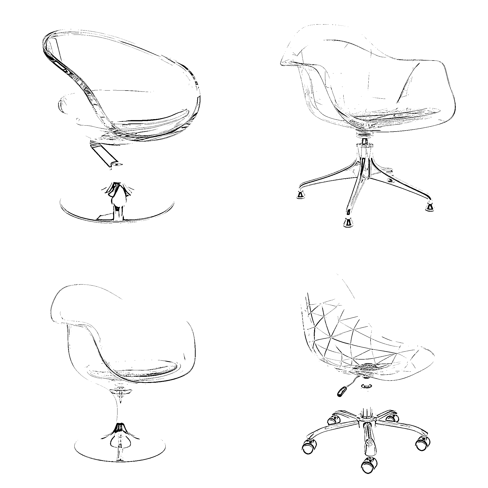
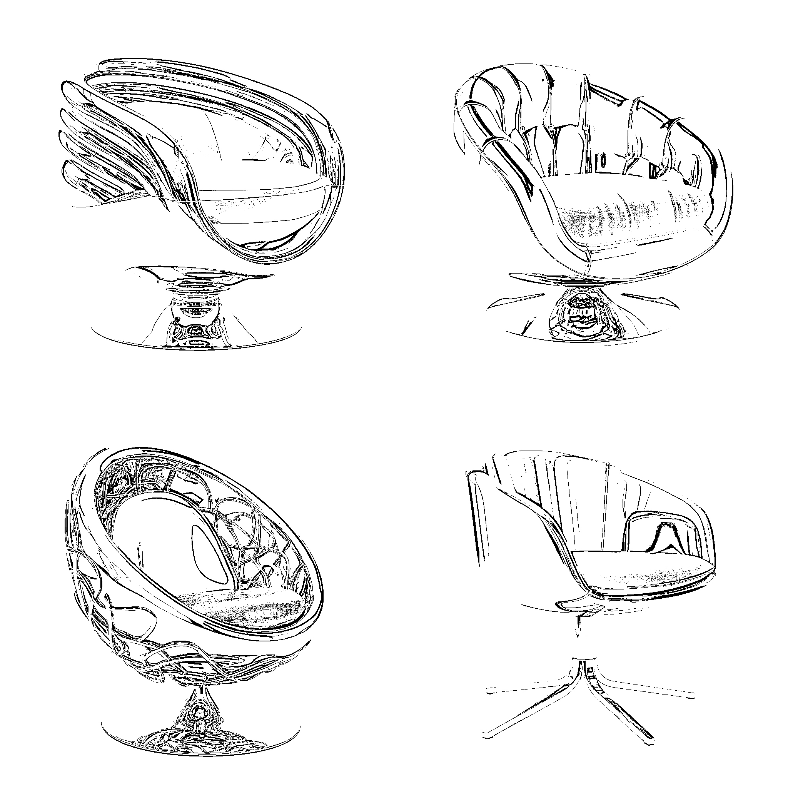
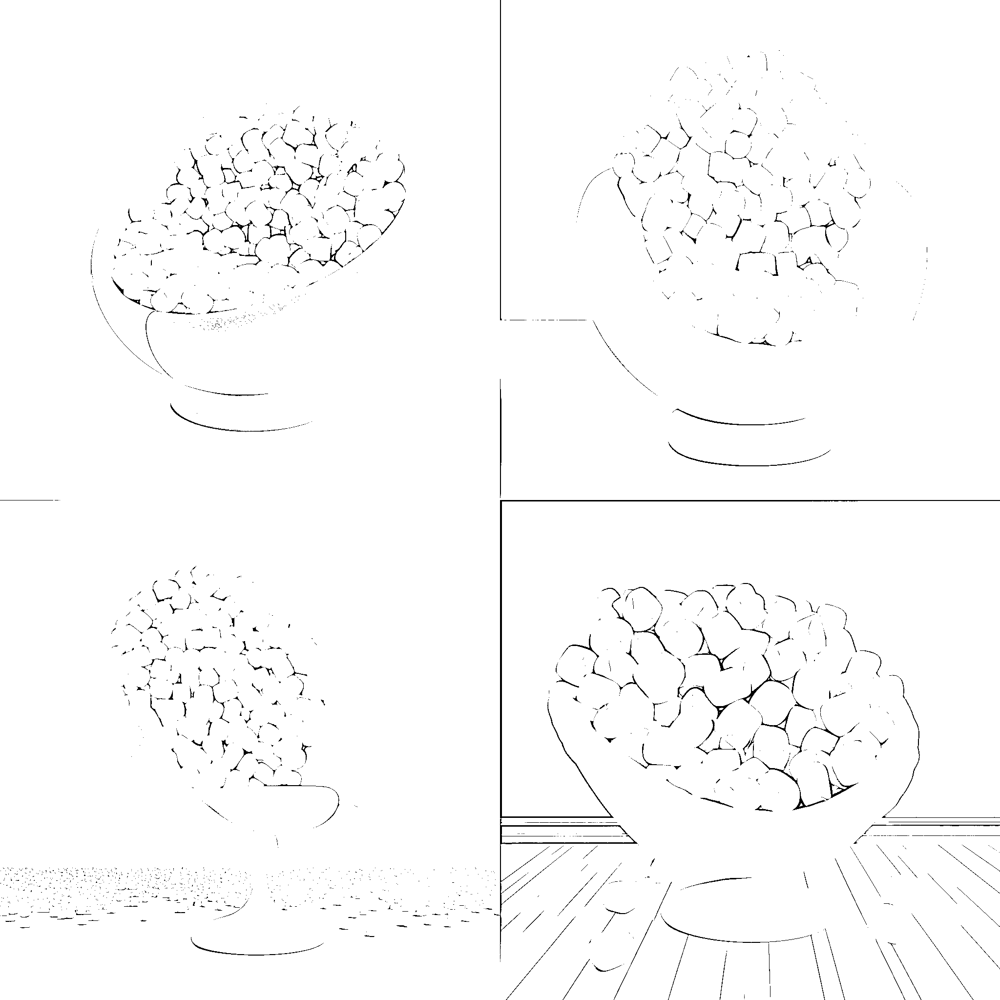
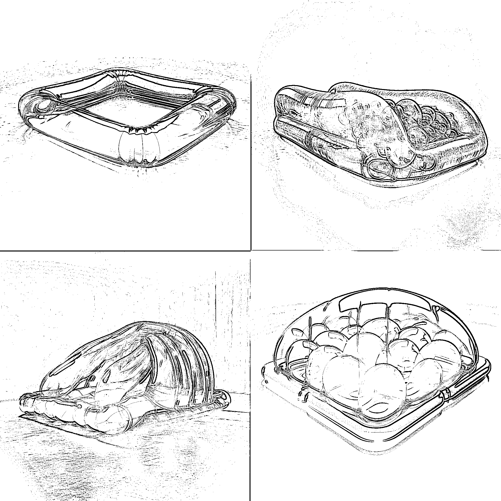

# 14.2.1 家具设计

AI 绘画可以根据不同类型的家具来进行图片构造，碰撞出不同的思维火花，尤其是关于某个家具不同材质的变化，更是快捷便利。

举个例子：玻璃质北欧风转椅，钢铁质北欧风转椅，棉花糖柔软质北欧风转椅，

Made of glass, Nordic style swivel chair, transparent, refraction of light, white background, simple, HD --v 5 玻璃制造，北欧风转椅，透明，光的折射，白色背景，简约，HD

Steel manufacturing, Nordic style swivel chair, metallic luster, lumen reflection, white background, minimalism, HD --v 5 钢铁制造，北欧风转椅，金属光泽，流明反射，白色背景，简约，HD

Nordic style swivel chair made of marshmallows, soft, white background, minimalism, HD --v 5 棉花糖制造的北欧风转椅，柔软，可爱，糖果色，白色背景，简约，HD

我们还可以尝试其他不同的家具。

fluid bed, transparent pvc, inflatable, soft, colorful,black background, minimalist, hd --v 5 流化床，透明 pvc，充气，柔软，多彩，黑色背景，极简主义

