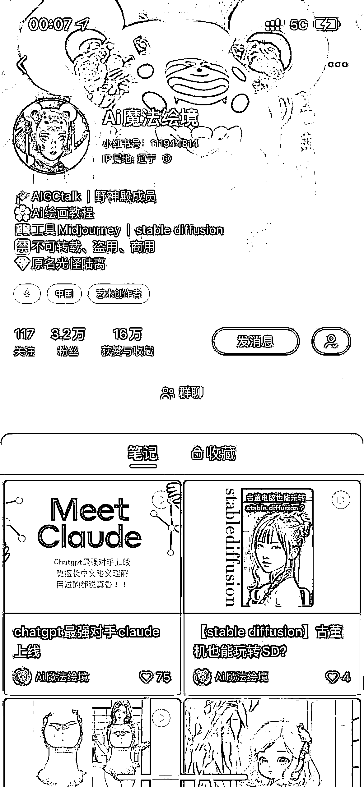
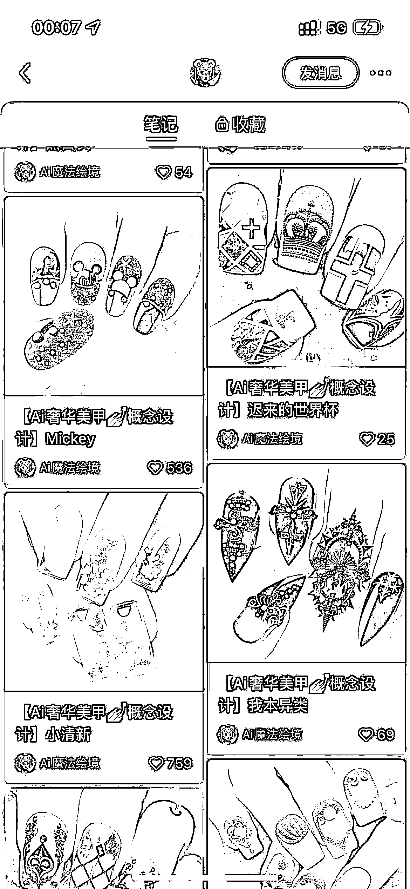
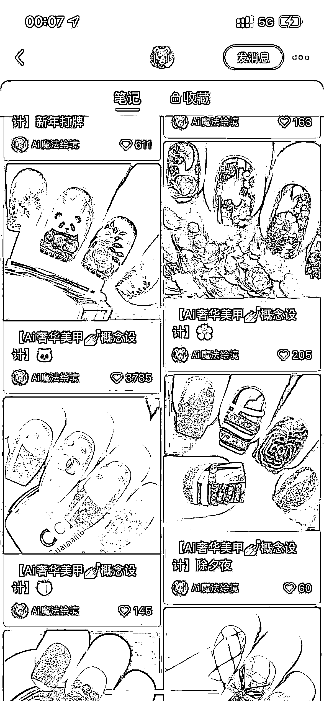
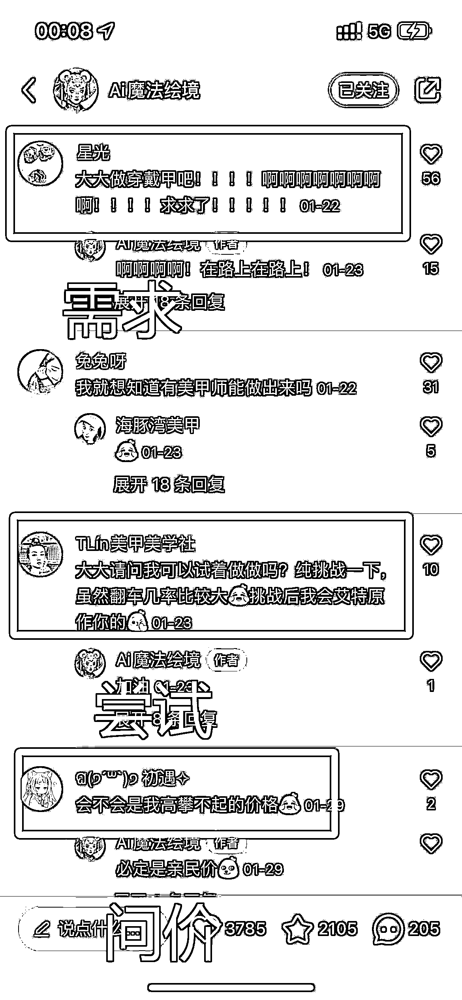

# 15.4 变现方式

我们结合一个案例来看，AI +美甲如何完成变现？

号主 AI 魔法绘境，之前依靠垂直 AI 绘画美甲，涨粉 3W，赞藏 16 万。

点开爆款笔记可以看到，需求、尝试和问价的人不少，说明这是一个有市场、有需求、可转化的方向。这个账号证明 AI 绘画与美甲的结合是一个有潜力的方向，值得探索。

AI 绘画与美甲都是目前较热门的领域，且契合小红书年轻女性用户的兴趣爱好，所以选择这两个方向进行内容打造，容易吸引流量与互动。提供图片作为美甲设计灵感，这满足了很多用户美甲新意和个性化的需求。

可以结合美甲店，由线上转化为线下流量；也可以作为一个热门话题，吸引足够多的人群，进行其他方向开发：

