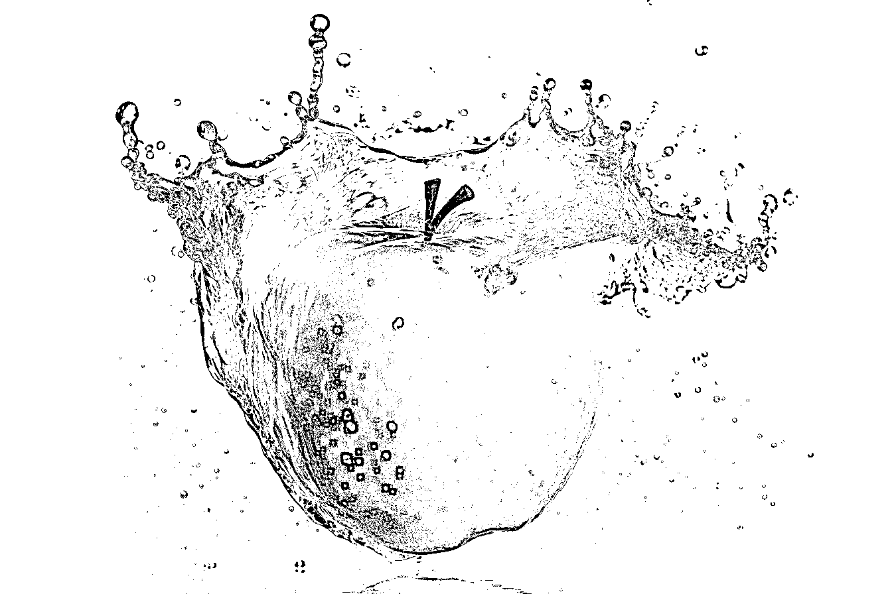
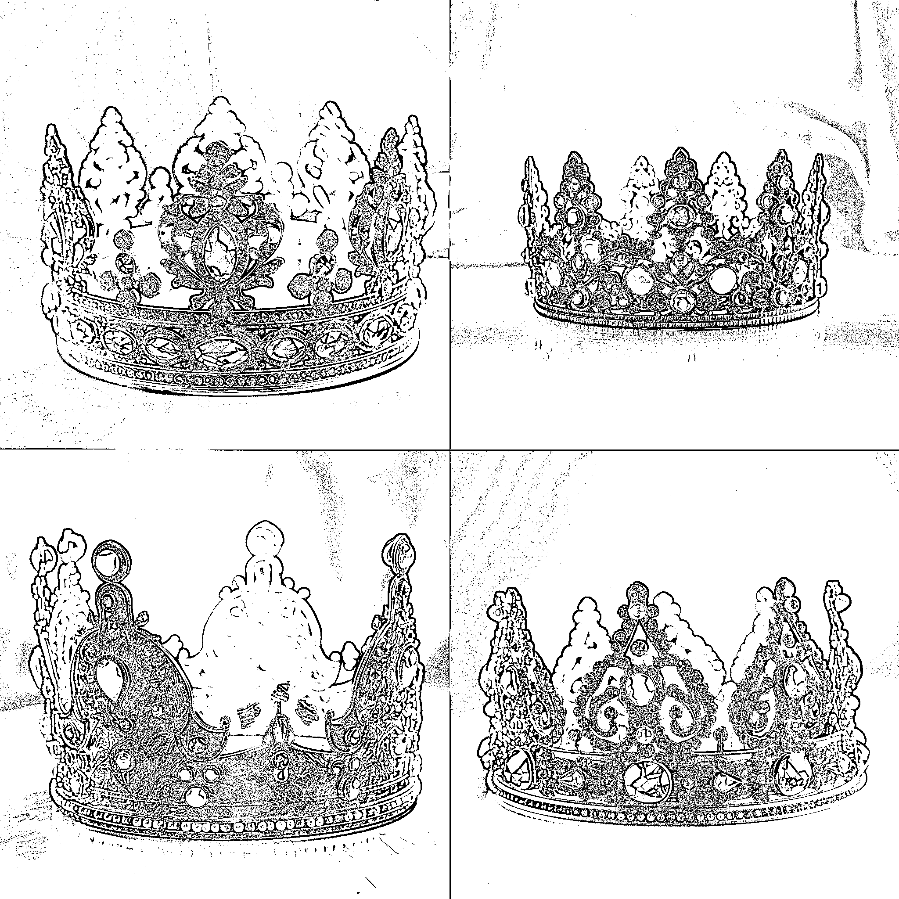
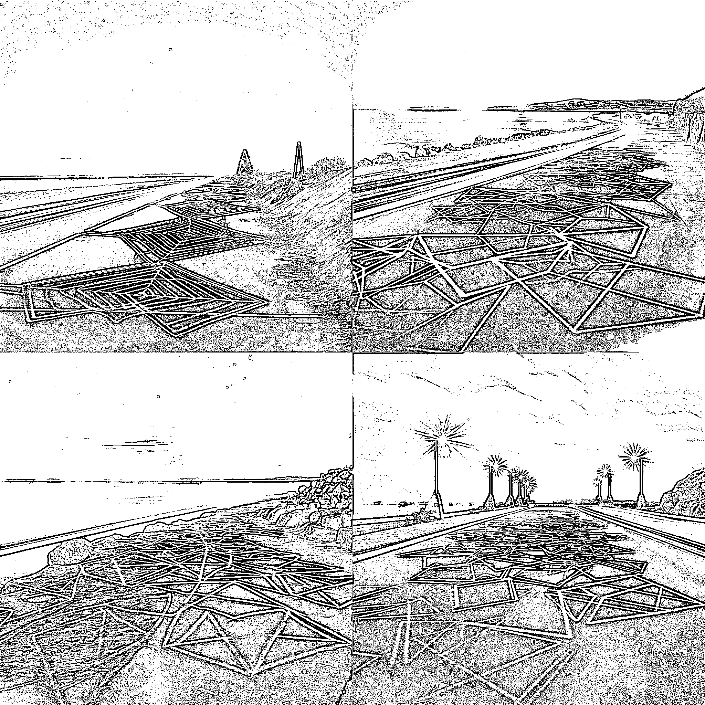
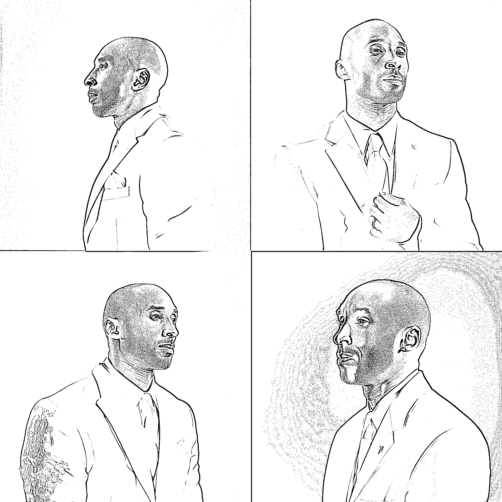

# 16.2 如何实操

•推荐工具：MidJourney

•如何使用 MidJourney，可参考章节【四、学会用 MidJourney 完成 AI 绘画】

•关键词公式：【摄影类型】， 【摄影师】，【镜头设定】，【主体】，【主体设定】，【用光】，【环境】，【颜色】，【质量】

以下为大家列举几种 AI 绘画在摄影中的出图效果。

高速摄影：

High speed photography, by Harold Edgerton, closeup, green apple falling into water, splash, studio light, white background, best quality --ar 3:2 --v 5 高速摄影，来自哈罗德·埃杰顿，特写镜头，掉落在水中的青色苹果，飞溅的水花，影棚光，白色背景，最佳质量

航拍：

Aerial photography, by Cecil Beaton, black Mercedes G50, driving on a frozen lake, surrounded by forest, natural light, chiaroscuro, best quality --ar 3:2 --v 5 航拍，by 塞西尔·比顿，黑色奔驰 G50，行驶在结冰的湖面上，周围是森林，自然光，明暗对比，最佳质量

商业摄影：

Commercial Photography, Pure Gold Crown, studded with gems, shiny, metallic Sheen, Soft Light, Clean Background, from Museum, HD, --v 5 商业摄影，纯金皇冠，镶嵌满宝石，闪亮，金属光泽，柔光，干净的背景，来自博物馆，HD

光涂鸦：

Light graffiti, seaside roads, geometric shapes --v 5 光涂鸦，海边的道路，几何图形

人像摄影：

by Annie Leibovitz, portrait photography of Kobe Bryant in white suit, upper body close-up, color, interior, studio lighting, best quality --v 5by 安妮·莱博维茨，科比布莱恩特的肖像摄影，穿着白西装，上半身特写，彩色，室内，影棚灯光，最佳质量

