# AI绘画变现案例合集 

# AI 绘画变现案例 合集 

AI 绘画有很多的玩法和变现⽅式，找准⽅向最重 

整理⽇期：230803 

懒⼈专属群的群友⼤家好。⼩懒继续给⼤家带来⼀份AI 绘画变现案例合集 本⽂档为懒⼈专属群内部分享，懒⼈⼿动整理。

⽣财⻛向标系列单独⽤在线⽂档分享，地址⻅专属群q群消息。 

往期的⽣财周报合集（含在线版和离线版），⻅专属群Q群⽂件和群公告。 

希望⼤家有收获~ 

标题加了(精华)的表⽰精华贴，前⾯为截⾄今⽇的点赞数。 

以下是⽬录，内容有些多。⼤家可以挑兴趣的内容阅读。

懒⼈专属群更新记录（点此跳转）

# ⽬录

[TOC] 

# 【新⼿指南】1篇 

# (精华帖)(148赞)新⼈⼩⽩ 30 天利⽤ AI 作画技巧，让我的作品快速变现的经验分享

作者： 饼公⼦ 

⽇期：2022-12-12 

哈喽~⼤家好，我是本次AI绘画⼊⻔航海的船员饼公⼦。毕业之后⼀直都在江西南昌的保险公司就职，主要是负责公司的某⼀条线产品管理和设计。

  

加⼊⽣财8个⽉，很幸运今年在11⽉读了天辉教练的精华帖，于是去链接天辉⽼师。在天辉⽼师的教导和指点下终于有了⼀点点⼩成绩。

  

⽬前是"智慧之星"星球的联合创始⼈，AI绘画关键词⼩群主讲⼈之⼀，接触AI绘画⼀个⽉，⼀周时间通过教学、关键词、定制画赚了⼩四位数，相⽐各位⼤佬的⽔平，还是略有不⾜，我相信能赚到第⼀块钱，那么未来有⽆限的机会。

  

随着航海⼀天天进⾏，我相信⼤家都已经对AI绘画有了尝试，最为基础的出图⻔槛都已经踏过了。渐渐的⼤家都从直接复制粘贴，开始转向对如何制作⼀个精美的图⽚和按照⾃⼰的想法出图的研究了。

  

那你有没有这样的疑问：提⽰词prompt（以下均称为提⽰词）到底应该怎么写才好？如何才能达到⾃⼰想要的结果？为啥⼈家写的可以出好看的图，我不能呢？今天就分享⼀下好的提⽰词基本的书写⽅式和如何改写。

本⽂主要围绕以下⼏个⽅⾯来写，⽬录详看下图：

#   

# （⼀） ⼀段好的提⽰词是什么样⼦？ 

# 1.思路 

⾸先，我们要明⽩AI绘画是能将你脑海中的画⾯呈现出来的⼯具。那么你脑海中的那副画⾯是要描述？那是怎么样⼦的⼀幅画？画中具体有什么？是⼀个⼈嘛？是⼈的话，是⼀个怎么样的⼈？⼈的具体情况是如何的？TA⻓的什么模样？穿的什么服装？在做什么？ 

你可以把它理解为你在拍写真照是拍古⻛?动漫?现代?⺠国?描述词，就是围绕拍照的这个⼈来由你给他穿⾐服，化妆。

设定好了主体⼈物⼈物，接下来，画⾯有没有背景？背景⻓什么样⼦呢？背景中有城堡?湖泊？还是其他？有什么特点呢？是⻩昏下的海边，还是夜晚的森林? 

  

  

总结起来，每⼀个画⾯中的每样东西都可以找到⼀个规律：由整体到具体，⼤框架⸺主体内容⸺细节。

  

主体是什么？类别是什么？⼈类？动物？鲜花？

有什么特征？什么颜⾊？发光吗？处在光下还是在阴暗中？

次要的是什么？建筑吗？是⼭峦嘛？

⼀个画⾯，包含了主体，客体，背景等，⽽它们都⼜有⾃⼰的细节，

⽐如：

服装有T恤，衬衫等等。 

建筑有中式宫殿还有西式教堂。

通过这样的⽅法可以将所有元素都细分。

你在脑⼦⾥想到⼀个场景，要⽤AI看得懂的语⾔表述出来，就像是你要说“落霞与孤鹜⻬⻜，秋⽔共⻓天⼀⾊”，⽽不要说“卧槽，好美”。

  

通过上述思路再简化，在脑海⾥思考⼀个⼤概的画⾯，然后通过公式来写提⽰词，可以简化为：

主体指的是画⾯中的主要部分，可以是动植物，⼈物，建筑，景物，幻想⽣物等。

对主体部分进⾏丰富的描述，就可以更精准的获得你想要的图⽚。

如：

⼀个⾮常可爱的蓝⾊兔⼦，站⽴着，⽿朵耷拉下来，⼿中拿着⼀个⾜球

A very cute blue rabbit, standing，ears down and a football in his hand 译⽂来⾃百度翻译

  

  

环境指的是画⾯中的背景、场景等。⽤来讲述，谁，什么物体，在哪⾥，周围是什么样⼦。

⽐如在⻩昏的沙滩边（By the beach at dusk 译⽂来⾃百度翻译）   

  

前后缀指的是对画⻛要求词，对引擎使⽤词，对整体效果的要求词，是⽤来⽤于确定图⽚的总体⽣成质量。

⽐如：8K，CG，masterpiece，by PabloPicasso，等等。   

  

当然了，如果你没有对这些细节进⾏描述，那么AI就会帮你补全画⾯，只是这样的补全是随机的，出图的效果就像是开盲盒，有可能会出极为精美的图⽚，还有可能出效果很差的图⽚，但是绝⼤部分都是效果⼀般的图⽚，属于是没啥掌控感了。

  

  

# 2.举例 

接下来就⽤举个栗⼦吧，⽅便⼤家理解。

⽹上复制⼀个抖⾳爆款图⽚的提⽰词：

A magnificent crystal palace is above the clouds. The palace covered with pink flowers is surrounded by clouds and running water. Pink flowers, Atlantis, fAIry tales, dreams, clouds and mist, animation style, Miyazaki Hayao animation lighting effects, movie detAIls, trends in artstAIon, 8K, yevgeny Lu Xiping,HD --ar 9:16  --uplight - Upscaled (Light) 成品图效果是这样的：

  

  

我们来看下分析⼀下这段提⽰词，我把他扔微信进⾏翻译，⽅便⼤家理解。

  

这⾥我通过划线的模式去帮助⼤家理解。

粉⾊划线部分是这段话中的描述“主体”的部分，告诉AI主体是个⽔晶宫殿，在哪⾥，还有粉⾊花是次要主体。

蓝⾊划线部分是描述“环境”，告诉AI这宫殿是被云和流⽔包围。 

⿊⾊划线部分是“前后缀”，告诉AI整体的⻛格的趋向，灯光效果，图⽚质量。   

通过运⽤这样简单的公式结构去分析别⼈的爆款、好看的关键词，是不是就简单多了？

那么接下来就讲讲改写关键词的思路。

  

# （⼆） 如何写提⽰词？ 

# 1. 词语替换、精简和改写 

从朋友那⾥得到了⼀段提⽰词，如下：

mono tone pAInting metro car in a abandoned platform,a little girl with fox ears and tAIl and white dress jumping next to the metro car,Japan animate style,colorful --v 4 （译⽂来⾃百度翻译：在⼀个废弃的站台上⽤单⾊画地铁⻋厢，⼀个狐狸⽿朵和尾巴的⼩⼥孩，⽩⾊连⾐裙跳到地铁⻋厢旁边，⽇本动画⻛格，⾊彩斑斓⸺v 4） 

把它扔进软件⾥，出图的效果是这样的：

  

  

我进⾏⼀个⼩幅度改动：

⾸先是对主体进⾏保留，保留穿着⽩⾊连⾐裙的⼩⼥孩和狐狸，

接着环境的废弃站台上的地铁⻋厢，和⽅位是在地铁⻋厢旁边保留，

将前后缀中的⽇本动画⻛格改为⽔彩画，得到的⼀段提⽰词如下：

watercolor,metro car in a abandoned platform,a little girl,white dress,fox,next to the metro car,--v 4 

（译⽂来⾃百度翻译：⽔彩，废弃站台上的地铁⻋厢，⼀个⼩⼥孩，⽩⾊连⾐裙，狐狸，地铁⻋厢旁边，--v 4） 

扔进软件⾥，出图的效果是这样的：

  

  

接下来我觉得我想再做⼀个变化，变得更简单⼀些，只想保留⼀个主体。

那么我在上⾯的提⽰词⼜进⾏了精简，得到的提⽰词如下：

watercolor, cute white fox,street--v 4 （译⽂来⾃百度翻译：⽔彩，可爱的⽩狐，街头--v4） 

依旧是符合之前的公式，这⾥主体只有 可爱的⽩狐狸，环境是 街道，前后缀是 ⽔彩画和v4。 扔进软件⾥，出图的效果是这样的：

  

  

通过上述的改写，你觉得否称之为是⾃⼰原创了⼀段提⽰语？

  

再来引申⼀下，我只觉得画⾯中的⽔彩画是我想要的怎么办，我想通过⽔彩画来做⼀个有冲突的画⾯感的图怎么搞？那么就只保留⽔彩画好了，其他都改写掉。

简单按公式修改⼀下提⽰词：

watercolor,Cyberpunk City,night,street--v 4 

（译⽂来⾃百度翻译：⽔彩，赛博朋克城市，夜晚，街道⸺v 4） 

主体：赛博朋克城市；环境：夜晚和街道；前后缀：⽔彩和v 4 

扔进软件⾥，出图的效果是这样的：

  

  

好像挺不错的，但是效果感觉没有达到啊，⽔彩的感觉没有出来。

这时候怎么办？我的答案是增加权重，告诉AI你不要瞎搞，我这是⼀副⽔彩画，强调⽔彩画的重要性。

提⽰语再次修改为：

watercolor::5,Cyberpunk City,night,street--v 4 （译⽂来⾃百度翻译：⽔彩：：5，赛博朋克城市，夜晚，街道⸺v 4） 

扔进软件⾥在测试⼀下，出图的效果是这样的：

  

是不是⽔彩画和赛博朋克的冲突就体现出来了呢？

  

引申：关于权重的问题

权重的控制，这关系到你想要的东西是否获得了AI⾜够的重视，根据基础AI的基础逻辑，越靠前的词汇越受到重视。同时还可以通过其他形式来调整权重。

在这⾥⽤Midjourney举例，根据官⽅的使⽤指南。 

在⼀段词之后加上"：：数字"即可调整权重，基础权重是1。 

经询问天辉教练，给出的答案是：

数字的取值范围⼀般是在0~5之间，0~1之间（如0.5）会降低权重，1~5之间（如2.5）的会增加词语的权重，超过5依旧会显⽰5的效果。 

对了，官⽅给出的解释中，当你使⽤"--no farms"和"farms：：-0.5"会让这词语不出现在画⾯中。运⽤这个可以控制你不想出东西的。

  

# 2. 如何实现脑海中的想法 

我在群⾥/抖⾳/⼩红书，看到⼀张好看的图⽚，也找到了相应的提⽰语，我要怎么变成我想要的图呢？ 举个栗⼦：

  

这是我看到⽊⽊在群⾥分享的⼀张图，然后她也把提⽰词贴了出来：

split screen, above water is a tall pirate shipbelow the water is a large octopus, sunrise,photographic, cinematic lighting, creative --ar 2:3--v 4 （译⽂来⾃百度翻译：分屏，⽔上是⼀艘⾼⼤的海盗船，⽔下是⼀只⼤章⻥，⽇出，摄影，电影灯光，创意--ar 2:3--v 4） 

  

我感觉不错，但是⼜有点和我想要的图不太⼀样。

我想要的是⼀张图⽚的左右两边是对称的，还要有中间被分割开来感觉。于是进⾏分析和改写。

分析：

主体：⽔上的船和⽔下的章⻥；环境：⽇出；前后缀：分屏、摄影、电影灯光、创意--ar 2:3--v 4 可以看到能让画⾯分开的是"分屏"这个词语，但是分屏明显不能达到我想要的左右对称的感觉，于是⾸先要替换的就是这个词，这⾥我想到的词语是“mirror image”，中⽂为“镜像”。这个词在⽜津词典的释义是可以让你的画⾯左右对称。

那么这个词可能会达到我想要达到“对称”的效果。

  

那么就只对这个词进⾏替换，改写后为：

mirror image,above water is a tall pirate ship, below the water is a large octopus, sunrise, photographic, cinematic lighting, creative --ar 2:3 --v 4 扔进软件⾥在测试⼀下，出图的效果是这样的：

  

  

效果还不错，但是我还想要的左右割裂的效果没有达到。

于是再思考⼀下，什么样⼦的图即是对称，⼜是中间割裂呢？如何割裂呢？

我想到了颜⾊的冲突，对，让画⾯的左边和右边颜⾊表现不⼀致，但是画⾯保持镜像，是不是⼜对称⼜割裂呢？

于是对提⽰词进⾏添加，使⽤"half XX and half XX"的写法。   

修改后的提⽰词：

mirror image,above water is a tall pirate ship,half bule and half orange, sunrise, photographic, cinematic lighting, creative --v 4 扔进软件⾥在测试⼀下，出图的效果是这样的：

  

  

成功达到了我想要的效果，以上就是如何通过修改别⼈的提⽰词来实现⾃⼰脑海中的想法的举例。

总结⼀下就是：根据公式去分析原来的结构，然后提取其中⾃⼰想要的效果，接着加⼊⾃⼰的想法，进⾏测试。

我相信很快⼤家都能够写出令⾃⼰满意的关键词来。

  

# 3. 完全原创应该如何写 

当你熟悉了上⾯2个⽅式之后，对于提⽰词⼀定是有了不少的理解了，但是还是会想，所有的都是基于别⼈的提⽰词，怎么能够满⾜⾃⼰的需求呢？不能完全原创的话，那就是只能够"有什么⽤什么"，⽽不是"⽤什么有什么"。 

  

接下来就是要告诉⼤家如何从零开始写⼀个好的提⽰词。

⾸先复习⼀下基本的公式： 主体+环境+前后缀 

基于这个公式，写下脑海中初步的构想的提⽰词：

①⼀个⼥孩，站⼀个赛博朋克城市中

masterpiece,1 girl,standing in a cyberpunk city --v 4 扔进软件⾥在测试⼀下，出图的效果是这样的：

  

  

接着是按照扩句的思路把每⼀个元素都扩展，让画⾯随着你的思路来，加强掌控感。

②画⾯很真实，⼀个⼥孩，⽩⾊⻓头发，上⾝穿着⿊⾊棒球服，⾐服上有很多⾦属饰品，双⼿插在兜⾥，背对着观众，夜晚的赛博朋克城市正在下⾬，街道上还有积⽔，电影照明效果，realistic,1 girl,white long hAIr,wearing black baseball uniform,many metal ornaments on clothes,hand in pocket,facing away,night,cyberpunk city,rAIn,still water on the street,cinematic lighting--v 4 

扔进软件⾥在测试⼀下，出图的效果是这样的：

  

  

  

再来⼀个栗⼦：如何做⼀个可爱的头像？

⾸先，确定主体，在这⾥做⼀个可爱的⼥孩头像

①⼀个⼥孩，⽩⾊的背景，⽔彩画，上半⾝

masterpiece,1 cute girl, white background, watercolor, upper body--v 4 扔进软件⾥在测试⼀下，出图的效果是这样的：

  

  

  

结果并不是我想要，那么再来扩句。既然是头像那么精致的脸庞必不可少，于是我还想要对五官和发型进⾏指定，上⾝的⾐服我也想要指定。

②⼀个⼥孩，⽩⾊的背景，⽔彩画，上半⾝，精致的眼睛和脸，蓝⾊的眼睛，精细的头发纹理，凌乱⿊⾊的头发，戴着⼀个红⾊蝴蝶发卡，穿着T恤 

masterpiece,1 girl, white background, watercolor, upper body，extremely detAIled eyes and face,blue eyes, fine hAIr texture, messy black hAIr, red butterfly hAIrclip, wearing a T-shir--v 4 扔进软件⾥在测试⼀下，出图的效果是这样的：

  

  

以上就是制作⼀个头像的思路。

注：以上测试出图均来⾃"画了个画"⼩程序，⽬前的AI绘画技术主要是基于Diffusion这个技术来的，只是框架和源码模型不同。各种⼯具的玩法其实差不多，⼤同⼩异。基础的写作理论都是通⽤的，你既可以⽤于 画了个画，也可以⽤于SD，还可以⽤于Midjourney、Nijidjourney，当然也可以⽤于Novel AI。 

  

总结：根据公式  主体+环境+前后缀 

然后将你想要的内容套进公式⾥，每⼀项都进⾏丰富，就可以得到⼀个好的提⽰词  

# 4. 如何看图推提⽰词 

很多⼈都遇⻅过⼀个问题，我只是在抖⾳/⼩红书等平台看到⼀张图，觉得很好看，但是找不到它的关键词要怎么办？

①根据图⽚中的画⾯去“画廊”中寻找类似的图⽚，运⽓好可以直接找到原图。

②“画廊”中也找不到，那么试试AI识图，反推提⽰词。 

③我没有现成的⼯具怎么办？那就⾃⼰来“看图猜话”吧！

怎么做？还是基于公式 主体+环境+前后缀 

先去观察画⾯中什么是最主要的部分，有什么特征，先写下来。接着去观察整体画⾯的环境、背景中有什么内容，接着是加上识别的画⻛和⼀些常⽤提⽰优质画⻛的词语。

  

举个栗⼦：

航海过程中，有圈友发出⼀张图⽚问应该如何拆解：

  

点开⼤图是这样的：

  

  

那么⾸先根据公式：主体是个太极，次要的有两个⽉亮，环境是云海，前后缀先只加⼀个环，对称，⽤v4引擎。 

整合起来就是：

Yin and Yang, Symmetry, Ring, Cloud Sea, Moon --v 4 扔进软件⾥试试看：

  

基本上有70%-80%相似了，接下来就是细化和改造的问题了。 

但是我没有继续细化，因为我想要的是和别⼈相似，⽽不是⼀模⼀样，⼀模⼀样会出现抄袭问题。但是70%-80%没什么关系，学习整个框架，剩下⾃⼰来改造，⽣成属于你⾃⼰的图⽚。   

④运⽤“⿊科技”chatGPT 

⽐如这样的：

  

把你看到的画⾯描述出来，让chatGPT帮助你写提⽰词，⽤AI+AI。   

# 5. AI绘画的⼀些技巧 

①优先符合“常识”

AI在识别并⽣成图⽚的时候，会根据你的提⽰词优先去匹配是否符合“常识”逻辑， 当你的提⽰词不符合常识逻辑，那么AI就将其强⾏融合到⼀起，变成⼀种“怪图” 这⾥的常识包括⽣活、幻想、电影等等。

⽐如，要在⼀张图⾥看⻅“三视图”这个⻆度，就不符合常识，但是AI为了满⾜你的需求，就会强⾏融合。⽐如这样的

提⽰词：a iphone,three sided view 

  

AI确实给我出了个三视图，三个视⻆都看⻅了，但是图就很奇怪。 

那么在不违背常事的情况下，什么时候有三视图呢？

设计图，reference sheet，组合到⼀起提⽰词： 

reference sheet,iphone,three sided view --v 4 扔进软件测试 如下： 

  

⾮常合情合理，没问题。

  

②主体与场景的⽐例

通过对主体和场景的权重进⾏调整，可以调整主体的⼤⼩和占⽐（权重的控制⻅上⾯的引申内容）；

另外对主体加强细节描写也可以调整主体的显⽰范围；还可以调整视⻆运⽤“特写镜头”，  

③画⻛对出图效果影响巨⼤

画⻛对出图的效果影响巨⼤，直接影响画⾯整体效果

  

图源⾃⽹络，by suzakiz 

  

④为何我的画不好看？

第⼀种情况，运⽤的模型不理想。

第⼆种情况，也是最多的情况。是你没有定义清晰，描述不够具体。⽐如只告诉AI你要画⼀只猫，很可能效果不好。但是你告诉AI是⼀只可爱⽑茸茸的布偶猫，有着蓝⾊眼睛，戴着红⾊⼩帽⼦，蹲坐在地上。这样的效果肯定会好很多。

  

# （三） 如何运⽤AI 

# 1.AI绘画会冲击谁 

①低端画师

②创意素材

③低端⼴告设计师

低端的⼀些简单的头像定制、⼈物图、同⼈图、创意素材，平⾯⼴告设计肯定是会受到冲击的，还有之前流⾏过的照⽚转⼿绘，随着AI绘画越来越强⼤注定是要被取代，这也是倒逼画师们、设计师们精进⾃⼰，越来越强，否则只能是被AI劝退。 

  

# 2.变现的⼏个⽅式 

①卖关键词

卖关键词已经在淘宝、咸⻥等平台屡⻅不鲜了，虽然价格低，但是量⼤依旧能赚不少钱。

  

②做教学课程、做社群

当你有了⼀定的技巧和稳定的输出能⼒，那么做教学和课程也是能够赚到钱的，卖铲⼦⼀直都会是⻔好⽣意。

  

③接定制

定制头像、图⽚、壁纸，SD⼯具上的私⼈模型，都是可⾏的。 

  

④做平台

程序员做好前端，把已有的平台通过API的形式去接好，做平台也是可以的。这⼀块我没有这个技术，只能是说个⼤概。

  

⑤我⾃⼰做了什么

刘润⽼师说，所有的⽣意都是把“⼈”（消费者）和“货”（商品）连接在⼀起，同时你要知道“场”在哪⾥。我个⼈选择的场是⼩红书，货就是我制作的画。

我从来也没有弄过⼩红书，纯粹⼩⽩⼀个，什么都不懂，我也不知道观众喜欢什么，我也并不最清楚是否会有⼈喜欢我的画，我能做的就是对标，找到我⾃⼰感兴趣的号主，看看别⼈的思路，保持⼀直发。

  

⼀开始发了两周也⼀直都没有流量，⼩眼睛基本不过百，点赞也只有个位数，评论根本没有。其实挺丧⽓的，也去问过天辉。告诉我在没有爆发前，号都是属于在泛流量的⼩池⼦⾥，没有平台不知道谁喜欢你的，没有流量很正常。要么蹭热度，要么保持⼀直发。

我⾃⼰倒是觉得先试试看，反正边学边做边思考，于是就⼀直坚持发。直到有⼀篇⼩红书点赞过百了，突然觉得挺有趣了，正向反馈总算是来了，更有动⼒去坚持了。

同时也开始了想要做原创的念头，于是精⼼制作了poker系列， 但是效果很不理想。 因为平台的规则，它是⼀个流量池⼀个流量池向上逐级递增的，刚开始的⼩号，粉丝基数少平台也不知道把你推给谁，这个时候的推送就是泛粉，点开某个标签进来看看的粉。他们不并定喜欢你的作品，不看你的作品也是正常事情。但是我初期突破不了⼩流量池，⽆法获得⼤的推送流量，主打的原创系列，直接就被这个随机性被埋没了。

天辉告诉我，前期这个阶段就是要追着流量⾛，哪⾥流量⼤，哪⾥有热点，就往哪个⽅向追，也就是要去蹭热点。先把粉丝基数堆起来，把曝光⼏率拉⾼，让第⼀时间看到你笔记的⼈，有更多想要点进来看的欲望，快速去突破初级的流量池。这样我的笔记才会有更⼤⼏率被更多的⼈看到，⼈多了，⾃然就会有喜欢你的⼈，形成⼀个良性循环。

在⽆⼈关注的阶段，要先追寻热点，快速起流量。

当你出现爆款时，追着爆款发，积累起垂直粉丝。

当你的粉丝多起来后，之前的爆款不新鲜了，这个时候再求变化。

同时还有⼀点要注意的，不是哪个爆款就要追哪个，⽽是与⻓期规划要有关联。找寻到爆款中爆款因⼦，想⼀想这个爆款图与其他的笔记之间有什么不同，将之运⽤起来。

于是在这个没有流量的阶段，我停下了发poker系列的脚步，转头去寻找属于我⾃⼰的“爆款因⼦”。

去寻找先让⾃⼰⽕起来的⽅式，等待之后爆发再去继续我的poker系列。   

慢慢的在⼩红书上开始有⼈想和我学习技术，也有⼈找我定制头像。渐渐地到和⼩伙伴们组建社群，做关于思考、拆解的分享。我⾃⼰做社区，并不是只分享关键词，⽽是拆解，告诉⼤家如何去做⼀张这样的图。⼤家在学习之后能够⾃⼰动⼿、修改形成新的头脑⻛暴，让⼤家脑海中的画⾯呈现出来，让每⼀个⼈都变得更优秀。

  

  

 

  

# 3.运⽤⽰例： 

l 三视图 

  

l 拆解图 

  

l 设计蓝图 

  

l ⼈物设定图 

  

l UI图 

图源⾃@刘楚宾 

l 渲染图 

  

l ⼴告创意图 

  

图源⾃⼩红书

l 产品kv图 

  

图源⾃⼩红书

l 投放效果图 

图源⾃⼩红书

l 环境建筑效果图 

  

图源⾃⼩红书

#   

# （四） AI绘画到底意味着什么 

AI绘画终究是⼀个⼯具，并不能完全取代画师，但是起码可以帮助普通⼈，⽤较低的成本去描绘出脑海中浮现的画⾯。

同时，他在⾼级创意⼈员的⼿中，成为了创意辅助者，可以快速的开启头脑⻛暴，⽣成草图，极⼤的加快了整个设计进度。

还意味着⼀个“内卷”的时代开启，普通⼈也拥有了⼀般画师、设计师的⽔平，倒逼从业⼈员研究新的⽣存⽅向。

说到底，个⼈觉得AI绘画本质就是光影的艺术，到了最后⽐拼的还是基本功和创意思路。⽐如艺术鉴赏能⼒，分析组合能⼒，对⼯具的掌握熟练程度。AI只不过是帮你快速把脑海中的图像呈现出来，然后给出很多⽅案去选择。现在有了chatGPT，有很多差距更可以被抹平。或许，AI这个⼯具不是⽤来追⼀张图的效果，⽽是从⼀张图拿到灵感去创作属于⾃⼰的作品。

  

⼤家现在要做的就是掌握这⻔技巧，平台软件有很多，但是基础底层逻辑是⼀致的，掌握了就⼀通百通，不必为了挑选⼯具⽽去浪费过多的时间。快速去熟悉⼀个⼯具，运⽤最省⼒原则，怎么简单怎么来，先上⼿，先做起来才是重点。就像是你会⽤office，还能不会wps吗。学会了驾驶技能之后，驾驶⼤众和宝⻢其实难度都差不多不是吗？

⻛⼝刚刚开启，腾讯和微博也才刚起步⼊场，未来的想象空间也很⼤。希望每个⼩伙伴都能在这⾥赚到属于⾃⼰的那⼀份财富。

  

最后感谢⽣财可以给到⼀个让我发光发亮的平台，感谢从⼈群中发现我的天辉教练，给我帮助的有饭助教，⾖⼦⼩姐姐，筑梦⼤佬。感谢⼏位⼀起努⼒的⼩伙伴：⽊⽊｜终⾝成⻓践⾏者、阿狸、诗农、刘楚宾。没有⼤家的帮助我⼀个⼈也难以⾏进下去。

感谢⼤家抽出宝贵的时间观看，谢谢！

  

评论区：

宅⽆恙 : 先赞后看👌 

林伟焕 : 宝藏帖⼦，常看常新 

饼公⼦ : 感谢🙏 

饼公⼦ : 谢谢[呲⽛] 

⻜扬 : 饼公⼦yyds，发现叫饼的都贼厉害，我应该改名[呲⽛] 

饼公⼦ : [可怜]太夸奖了 

liliya : 太极的图最棒了 

清华 : 太精彩了！饼公⼦对我技术⻓进提供了莫⼤的帮助[憨笑] 

# 【变现⽅式】3篇 

# (精华帖)(193赞)AI 绘画变现思路分享 

作者： 蕃茄 

⽇期：2023-07-04 

AI绘画变现思路分享 

哈喽⼤家好，我是蕃茄，今年2⽉接触AI绘画，在实践的过程中尝试了多种变现⽅式，最终跑通项⽬闭环。

下⾯，给⼤家分享下我实操过的 AI绘画变现⽅法及其优缺点，希望能够帮助各位圈友从 0 到 1 迈出第⼀步。

1.新媒体图⽂、视频变现 

2.取图 / 取图团队变现 

3.⽹盘拉新变现 

4.销售作品变现 

5.定制变现 

6.⼩说+AI绘画变现 

7.其他变现模式 

https://i.shengcaiyoushu.com/docx/FraIdcOOyolJ36xXCN6czji0nPb 评论区：

坏孩（⼤学⽣） : [偷笑]太⼲了 

亦仁 : 感谢分享，已加精华。 

蕃茄 : 谢谢亦仁⽼⼤[憨笑] 

半⼈⻢星空 : 写的层层递进， 

FF_23531 : 请教⼤佬：现在打开智影，没有插⼊数字⼈功能了，只能⽤平台⾃带的形象了？ 蕃茄 : 的确是这样⼦的，现在没有了 

美少⼥守护者 : 最近很多平台都看到很多好看的AI作品 

FF_23531 : 多谢回复[抱拳][抱拳] 

# (精华帖)(116赞)AI绘画赚钱指南引流变现全案教程 

作者： ⽼旺 

⽇期：2023-07-03 

哈喽，各位圈友好，我是⽼旺，⼀个擅⻓做流量增⻓的AIGC的实战家 

今天不贩卖焦虑，单纯分享下我正在做的AI绘画的商业项⽬，保姆级攻略教程，重点会偏向于术，你可以带着思考去结合运⽤到⾃⼰的项⽬中去/⼀起下场淘⾦，⾃认为今天内容写的很全⾯且细致了，也欢迎你来验验货帮我看看能打⼏分

详情请移步⻜书：https://d1jpewyavi.feishu.cn/docx/SuuJdXgusoDbT9x5NW3cKLJunih 评论区：

霍德胜 : 受教了 

亦仁 : 感谢分享，已加精华。 

⽼旺 : 感谢亦仁，越分享越有[抱拳][抱拳] 

⽆界记 : 超级棒的⽂章，⾮常感谢 

A ゞ 当⻛把酒 : [强][强][强] 

东哥 : 保姆级教程，很详细了，谢谢分享[玫瑰][玫瑰] 

周周Mia : 有些内容似曾相识…… 

# (精华帖)(92赞)AI 绘画新⼿变现指南 

作者： 温酒。 

⽇期：2023-04-17 

⼤家好，我是温酒，今年是在⽣财的第三年，

围观别⼈跑ai绘画⼀个⽉，有些变现思路分享给⼤家。 

1.信息差变现 

2.头像定制变现 

3.公众号琉流量主变现 

4.⼩程序取图变现 

5.社群变现 

全⽂阅读请移步⻜书链接。

https://f9ii5g947k.feishu.cn/docx/CVBQdU7FtoRjfzxXPLzc0huanod?from=from_copylink #ai绘画 

评论区：

温酒。 : Ai绘画新⼿变现指南 

https://f9ii5g947k.feishu.cn/docx/CVBQdU7FtoRjfzxXPLzc0huanod?from=from_copylink 控⼼ : 很不错。感谢⽼板分享 

温酒。 : [抱拳] 

少川 : [西⽠]谢谢，受益匪浅〜 

请问有画图交流群吗？刚上⼿玩，想和⼤家多交流

亦仁 : 感谢分享，已加精华。 

Amanda（七七） : ⼩姐姐留个VX啊 

温酒。 : 我是⼩哥哥[害羞]，点头像就有 

温酒。 : 跟着⽣财的⼩航海⾛，再在路上寻找伙伴，积累⾃⼰信息差，真诚分享，能让你快速链接到同⾏的⼈

# 【精准引流变现】4篇 

# (140赞)AI 绘画唐诗 300 ⾸，涨粉近 4000，适合批量⽣产和教育场景 作者： Daemon 

⽇期：2023-06-30 

另类⼩说推⽂，将唐诗300⾸⽤ai绘画，每句诗⽤sd⽣成⼀张图⽚，发了12个视频，涨粉近4000。 适合直接批量⽣产，也可以应⽤在特定场景下，⽐如⼩学⽣必背的XX⾸唐诗/宋词，“孩⼦不喜欢背诗，让孩⼦爱上诗”等等

 

评论区：

万简 : sd是什么 

Daemon : stable diffusion 

亦仁 : 中标，术值+1。 

在上⽅专栏点击 #中标，可查看所有中标⻛向标 

万律师 : 这个刚和在⼩红书看到的⼀个思路契合，还准备发⻛向标呢 

mikan 阿橘KK* : 这种号怎么变现呢？ 

o吉吉积极向上 : 有需求就有产品 

伟业 : 理解：利⽤AI绘画为古诗配图，吸引⼩学家⻓，解决孩⼦不爱学习古诗的问题。变现可以引流私域，卖⼩学⽣的教培课程

⼩⽩脸 : 这个创意我之前想过，可以做成绘本，但是不知道是不是牵扯版权问题。 (35赞)通过 AI 绘画⾃动⽣成简历等资料发布到⼩红书引流 

作者： 上川书记 

⽇期：2023-03-21 

最近看通过ai绘画⾃动⽣成简历等资料发布到⼩红书引流。微博上，普普通通的简历都有这么⾼的流量，如果那些⾼质量的发布上去应该流量不错。

 

评论区：

亦仁 : 中标，术值+1。 

在上⽅专栏点击 #中标，可查看所有中标⻛向标。 

# (25赞)⻁扑的流量分析 

作者： 姚⿇ 

⽇期：2022-11-28 

⻁扑的流量其实很⼤，⽤来引流很舒服，虽然基本都是男粉，但是质量其实挺不错的。

⽬前看到觉得⽐较舒服的两种引流，⼀个是运动装备粉，引流到qq群⽤机器⼈发券做淘客，可以看图⼀，现在1700个⼈，⽽且他好像弄了四五个群。 

第⼆个是做地区性群引流，可以看图⼆，群主是个房产中介，通过在⻁扑分享⻓沙各楼盘的信息，然后完成引流，进群之后有意向去看房的，他就约好时间带着去。针对这样的，我们可不可以结合线下资源，做全国各地区的群呢，不只是买房，买⻋也可以，约线下活动也可以，相亲都⾏。只要群⾥的⼈多且活跃，收费都⾏的。⻜盘⽕的时候，就在⻁扑⻅过⻓沙⻜盘群引流，还要收费，39.9/⼈。 然后⼀些新兴的东西，在⻁扑流量也好，⽤⼾的兴趣也⼤，愿意去了解和咨询，⽐如说AI绘画这种，动不动⼏⼗万浏览量，然后很多⼈问什么软件，怎么⽤，能不能教教这样的。

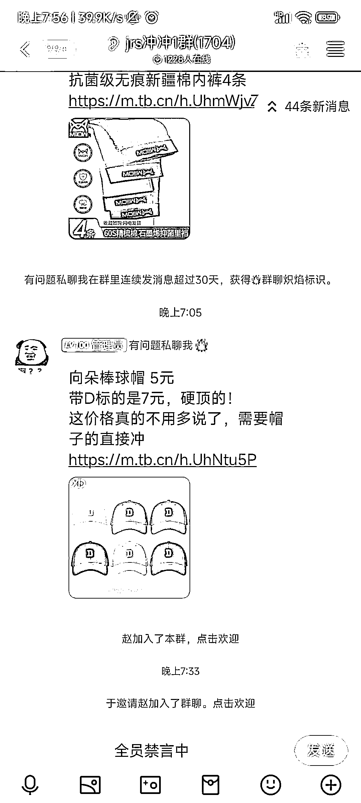 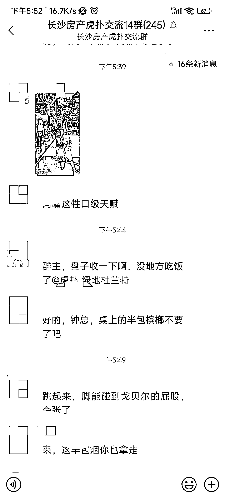 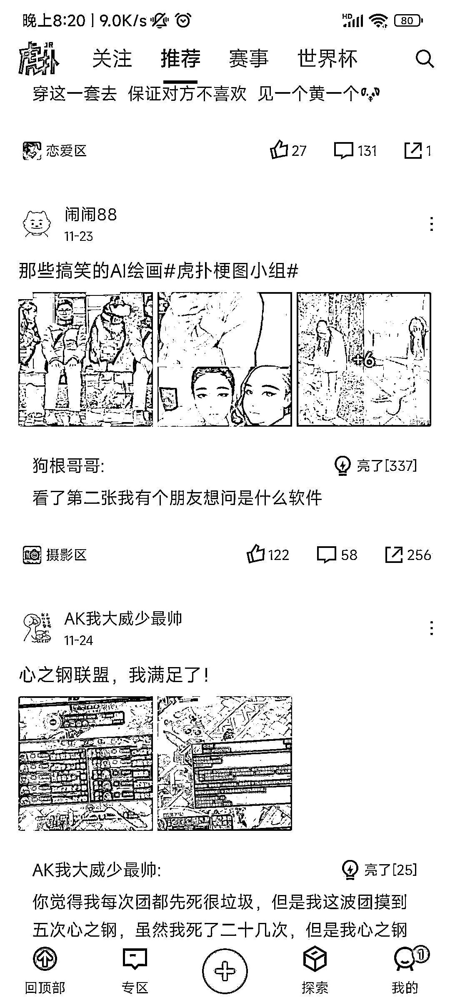 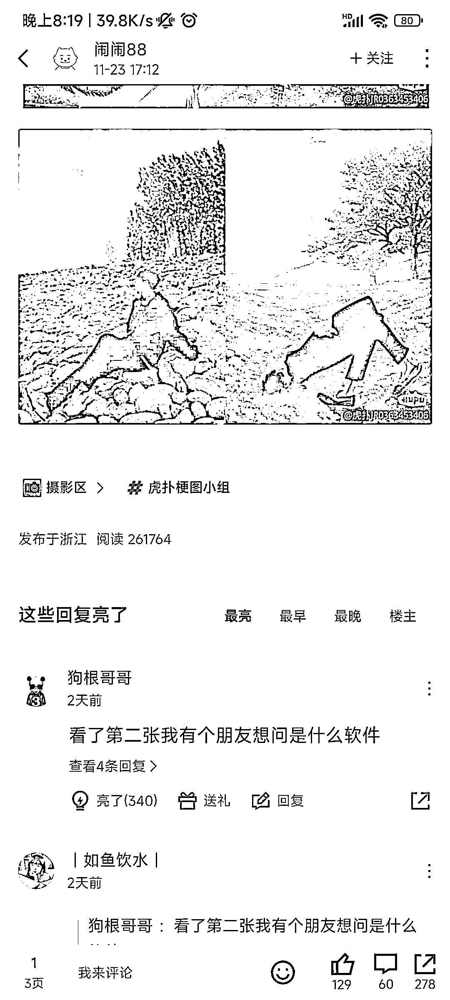 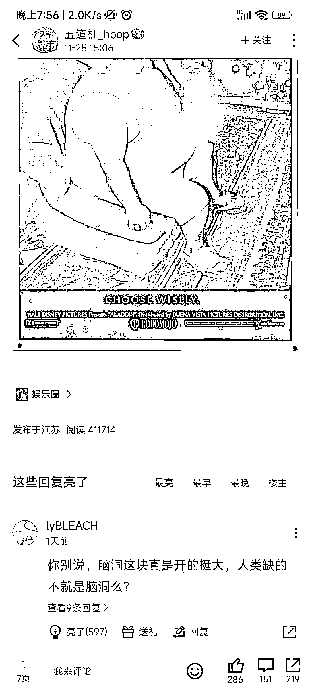 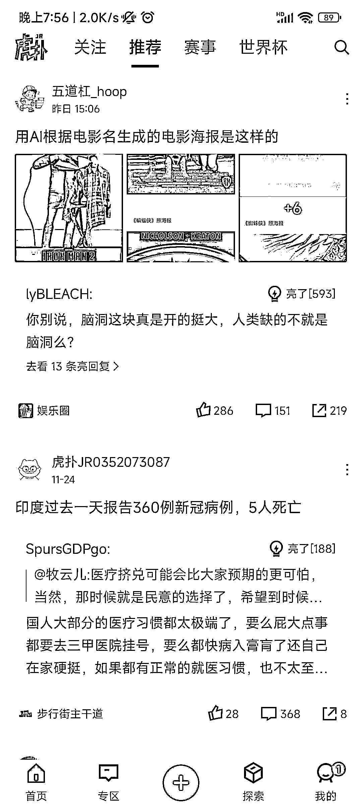

评论区：

亦仁 : 中标，术值+1。 

在上⽅ #星球栏⽬ 专栏中，点击 #中标，可查看所有中标⻛向标。 

# 【定制服务】4篇 

# (精华帖)(449赞)场景应⽤-Chatgpt + AI 绘画，玩法多样 作者： 七⼩ 

⽇期：2023-03-10 

Chatgpt+AI绘画+⽣⽇祝福定制？ 

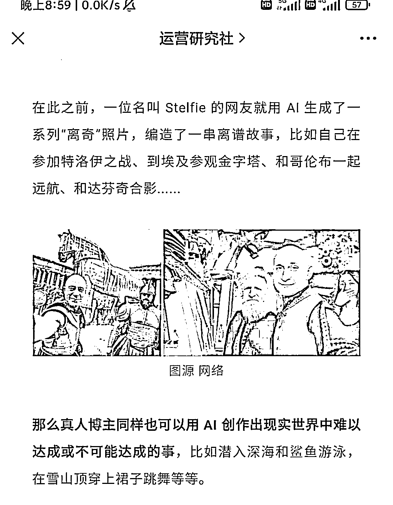 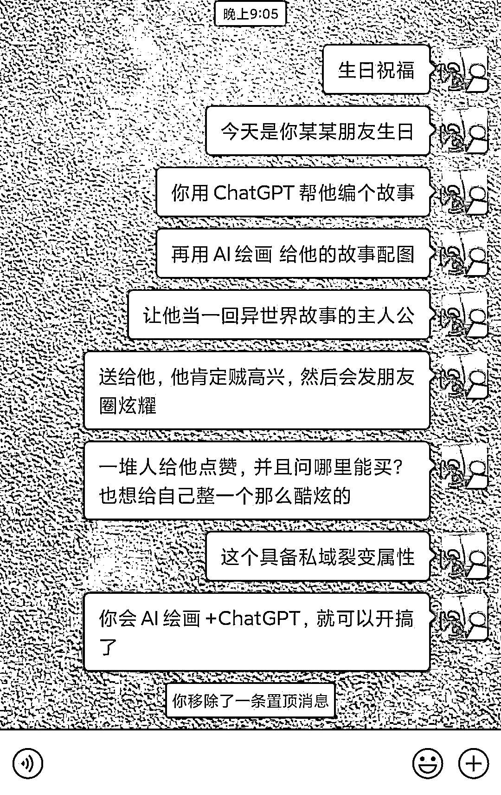

评论区：

卓桐 : 延展⼀下，⽤这个⽅式来订制求婚图册或视频，ChatGPT+ai绘画，⽤漫画的形式，很多男⽣从恋爱到求婚阶段，其实⼤概率没有什么拍照⽚做成视频的概念或习惯，但可以借助这个⼯具衍⽣成两个⼈的情感历程、故事节点的漫画，⽤来作为求婚或者婚礼的订制产品，产品可以视频+图册。卖个⼏百上千应该问题不⼤。

七⼩ : 🐮 

MYX(爆单路上) : 厉害。 

o吉吉积极向上 : 这个好，可以拿来炫哈哈 

⼩睡猪 : 这个idea⾮常赞 

波叔 : good idea 

melisa : 朋友是主⼈公，怎么把朋友脸放在图⾥呢 

郑经 : [强][强] 

# (200赞)AI 绘画⽼照⽚修复，接单变现的机会 

作者： ⽼旺 

⽇期：2023-07-05 

【AI绘画⽼照⽚修复进⾏接单变现】 

内容制作👇： 

⽼照⽚修复Ai⼯具： 

介绍：免费修复 ⿊⽩/泛⻩ ⽼照⽚ 

AI视频修复变⾼清⼯具地址： 

介绍：AI直接让普通视频秒变⾼清 

⽤AI修复⽼照⽚： 

图⽚变清晰⽹站：

1、 

2、 

3、 

4、 

可以制作为图⽚和视频两种模式，图⽂可利⽤GPT营造怀旧复古的氛围，图⽚突出前后对⽐，图⽚素材可以⽤古往今来的历史⼈物/政治⼈物/娱乐巨星等 

视频可以⽤剪映套⼀些⼀秒成⽚的复古模版配上⼀些古典和怀旧的⾳乐，也可以尝试着把照⽚变⾼清的玩法再搬到现在这个AI让视频变⾼清再来⼀遍 

引流模式👇 

1.⼩红书/公众号/即刻/⼩众平台进⾏发图⽂案例，赠送服务/资料进⾏引流变现 

2.可抖⾳/⼩红书/视频号等多平台直播⽼照⽚修复演⽰，在直播间呆了会很多⼈询单，赠送资料/免费帮⽣成⼀次，引流私域成交

变现模式👇 

1.接单修复⽼照⽚，收⼀个服务费/订阅费 

2.卖产品，古⼈画像、诗⼈、作家、三国⼈物、玩物等照⽚，可附带相框、相纸、胶卷、绘本等产品进⾏搭配售卖

3.搭配⼩程序/软件拉新做⼴告，⾛CPS、CPC都可以 

4.知识付费，当有些结果了也可做陪跑训练营、课程、资料、咨询这些进⾏收费 https://palette.fm/https://jeya-maria-jose.github.io/rebotnet-web/https://www.restorephotos.io/https://www.upscale.media/zhhttps://replicate.com/nightmareai/real-esrganhttps://www.restorephotos.io/https://imgupscaler.com/ 

  

评论区：

胖⼤魔 : 感谢分享，已经加感谢[呲⽛] 

⼤王 : 感谢真诚分享 

亦仁 : 中标，术值+1。 

在上⽅专栏点击 #中标，可查看所有中标⻛向标 

悦佬 : 视频变⾼清的⽤不了呢。 

⽼旺 : 可能⽹站和谐了，可以⼩红书搜索⼀下类似的⼯具⽹站 

悦佬 : 好的[玫瑰] 

骷⽐絨 : palette试了下，好像只能上⾊，⽆法修复 

⽼旺 : 可以结果其他AI⼯具进⾏⼀下修复，这个好像修复需要开会员 

# (精华帖)(144赞)⼀⽂讲透如何⽤SD制作出来⾼质量艺术⼆维码 

作者： 明⽉ 

⽇期：2023-07-11 

⼤家好，我是明⽉。

艺术⼆维码已经出来⼀段时间了，市⾯上的教程也满天⻜。

但是我⼀直都不太满意⽬前市⾯上的效果。

直到最近，才研究出来⼀个令我⽐较满意的效果，且能够稳定出图的⽅法。

⽂章内⼲货内容⽐较多，不太适合0基础的AI绘画⼩⽩。 

为了更好的阅读体验，⽂末有⻜书链接

https://hdjmn9shgs.feishu.cn/docx/OUYOdKSwzoHS8pxpeRNcRcdqnHh 

评论区：

热⼼⽹友⼤表哥 : 不⾏啊，打不开了[撇嘴] 

復 : 试试第⼆条 

⽼吴说投资 : 你重新编辑。然后把⻜书链接回⻋键按⼀下，链接要出来，才能阅读。 嘉赫 : https://hdjmn9shgs.feishu.cn/docx/OUYOdKSwzoHS8pxpeRNcRcdqnHh 歧⻩之后 : 这个可以，等下实操⼀下 

伟业 : 实操⼀下发结果[偷笑]，欢迎链接 

明⽉ : 调整了⼀下链接，这下能点开了[呲⽛] 

明⽉ : 感谢 

# (39赞)⽤ AI ⼯具⽣成奶奶的虚拟数字⼈ 

作者： ⼟⾖君 

⽇期：2023-03-20 

⽤AI⼯具⽣成奶奶的虚拟数字⼈ 

B站⼀up主结合AI绘画、ChatGPT、智能语⾳等AI⼯具，以⼿把⼿教学教程的形式制作了已去世奶奶的虚拟数字⼈视频。

教程⾮常详细，列举了使⽤的各种⼯具，可以跟着⼀步⼀步制作虚拟⼈视频。

另外，已故⽼⼈的虚拟⼈视频绝对是⼀个巨⼤是隐形市场需求，很多⼈都会有需要。

跟着up主学习⼀下，制作出来可以⻢上发到公域平台引流变现。 

https://b23.tv/dmYjTAO 

评论区：

A潘典 君和联⾏ : 早上也刷到了 确实很有想法 

lalalaLiz : 很有意义和温度的项⽬ 

亦仁 : 中标，术值+1。 

在上⽅专栏点击 #中标，可查看所有中标⻛向标。 

# 【定制产品】7篇 

# (152赞)Ai 绘画在⼩红书的变现实操案例 

作者： 阿凯 

⽇期：2023-05-05 

【Ai绘画在⼩红书的变现实操案例】 

主要是给⼤家反馈下数据，做个⼩红书AI的⼀个数据模型。 

两个背景点：⼩红书是对图⽂类内容最友好的平台 ；AI绘画让图⽂素材的⽣产成本变得极低 1）内容和数据 

基于此，在上个⽉，我拿⼩红书的⼀个⽼号测试，发了5天笔记，每天1条，然后第五天爆了。 内容是：真⼈宝宝 转 迪⼠尼头像，如图1。 

爆了后，⼤概⼀天涨粉1000，差不多私信也是每天1000条，都是问能不能给她宝宝做⼀个。我定价40/张，不管后端的承接率，在这定价体系下⼀天的成交单量在150单的样⼦，也就是6000/天的收益。 消化150单，成本⾄少是3个⼈的⼈⼒成本，再加上30美元的midjourney账号。 为啥3个⼈的⼈⼒成本？我的要求还是相对⾼⼀点，要求原照⽚和转化后的⼈ 尽量像。像。像。所以⼀个单⼦的时间基本在10-15分钟的样⼦，还有⼀个⼈要兼着接客服，满负荷转。 另，还有复购转介绍的，有⼈⼀来想做好⼏张，有⼈会介绍别的宝妈来，因为微信换头像的宣传效果可好了。

当然，突如其来的单量让毫⽆准备的我，⾚裸裸的引流让我⼏天后封了号... 2）复制拓展 

拓展⽅式1：搞很多号是第⼀思路，但据我观察，AI图⽂内容对新号不怎么友好，出来的极少数幸存者偏差。

拓展⽅式2：找⼈代发，找各种宝妈⼩红书⽼号发，做提成。核⼼是投产，我考虑到客单价低，没敢这么做。⼩红书站内投放没测试。

拓展⽅式3：拓产品端。这应该是重点。头像定制⽣意在整个淘宝⼀个⽉的成交额⼤概在180万左右，主类⻛格实际上是⽇漫⻛，我说的这个迪⼠尼⻛格反⽽是少数。从⻛格、⼈群、场景出发，还是能衍变出很多的，情侣头像是个⼤头。以及，⽐如给胎⼉做头像，第⼀次做这个⼈的⼈真是个天才，如图2 拓展⽅式4：也许，线下摆摊有惊喜。 

拓展⽅式5：抖⾳我看到有⼈在做转迪⼠尼⻛格头像的直播，当然收徒变现的也必然会有，不知道数据反馈怎么样，圈友交流下。

3）注意事项 

引流⽤群或私信或⼩号，反正⽣财⾥有⼀套完整的针对⼩红书的引流⽅式，不赘述。

因为AI图的成本极低，你会的别⼈也会，所以⼀旦⼤爆，图⽚曝光之后，竞对就迅速上来，价格就下去了。然后流量红利会缩短⽐较快，⼩红书⽤⼾的新鲜度也就会下去。

但是，但是，但是。

这个项⽬对⼀个兼职在家的⼈⾮常好，你⼀天发⼀条也不费时间，坚持发总会好的，降低期待⽤时间来耗，出个⼏百赞的笔记，每天能多赚个两三百是没问题的。这种需求⽐较稳也⻓期。与把这个⽣意当做⼀个模式且想半年1年以上的持续，挑战是不同的。 

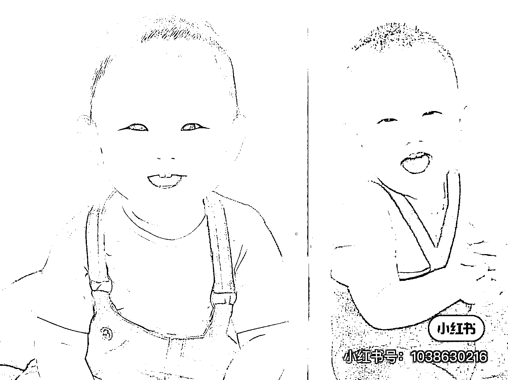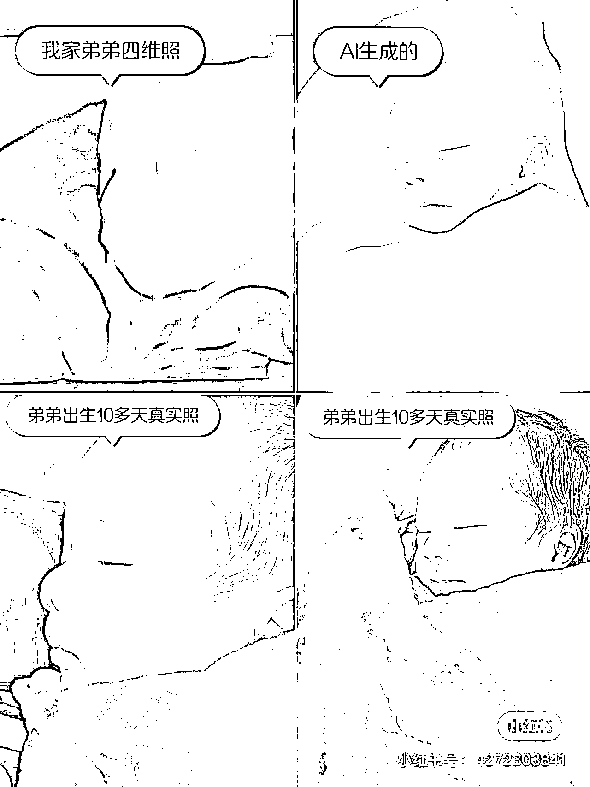

评论区：

⾳⽆ : 你好⼤佬，这个个⼈也尝试了使⽤MJ与SD⻛格化头像照⽚，但是没办法做到很⾼的相似度，这个有什么技巧可以分享下吗？

字节叔叔 : ⽤SD也可以做，就是对⾃⼰的设备有要求[呲⽛] 

亦仁 : 中标，术值+1。 

在上⽅专栏点击 #中标，可查看所有中标⻛向标。 

阿凯 : 技术原理层⾯⽆法做到，尽量耐⼼重复的开盲盒。主要于销售前置，把相似度这个事说清楚，⼤部分⼈没有想象的那么在意。

⾳⽆ : 了解了，谢谢⼤佬。 

# (精华帖)(125赞)AI 绘画从随机出图到随⼼定制 

作者： 饼公⼦ 

⽇期：2023-03-29 

⼤家好，我是饼公⼦，⼀个浪漫爱⾃由的⼈（⾃封的），希望能⽤AI绘画，画出⼼中所想，创造出属于⾃⼰的世界。

经过了这么⼀段时间的AI⽕爆和两次航海，⼤家对于AI绘画有了⼀定的了解。相信⼤家已经知道，要想画出⼀幅你想要的画⾯，核⼼内容还是“写好关键词”。

感谢张⼦安@⽣财有术 的邀请，让我来和⼤家分享⼀下如何让AI绘画，从随机出图到随⼼定制，我将以“如何写好关键词”结合定制商单为例，聊⼀聊我的想法和思路。

全⽂⻅下⽅⽂档~希望能帮到⼤家！ 

同时也感谢⼏位⼩伙伴 和帮助过我的所有朋友，还有让我可以发光的⽣财有术平台。

https://onpzm80xtu.feishu.cn/docx/KfrYdaWSTobevfxC0NscSPzxnMe 评论区：

诗农Hope : 哇哦，太太太优秀了〜 

宅⽆恙 : 为饼⼦打call！ 

嘉赫 : 🎉 

四哥升华经 : 优秀 

浅⾊8ug的喵 : 感谢分享[偷笑] 

饼公⼦ : 感谢认同~ 

饼公⼦ : [呲⽛] 

饼公⼦ : 谢谢 

# (97赞)分享⼀个 AI绘画 电商应⽤场景 

作者： ⼦不语 

⽇期：2023-05-15 

分享⼀个AI绘画电商应⽤场景 

抱枕，地垫等等需要印刷的产品，

图案直接可以让midjourney或者SD来⽣成。 

或者直接可以⽤midjourney上公共频道好看的图⽚， 

复制咒语，然后重新⽣成。

另外⼀种思路就是把付费图⽚⽹站上的图⽚，

⽤咒语⽣成类似的照⽚。

节约成本。

这种就适合⼀件也能⽣产的⼯⼚，

尤其是那种⼩型数码印花企业。

每天⼏⼗张图⽚，不断的传产品，

同⾏根本来不及跟。

我朋友靠着这种⽅法，已经是Temu的地垫类⽬的top卖家。 

前⾯也有圈友分享过类似的把MJ的图⽚套在⾃⼰的产品上， 

所有的需要图形设计的产品，都值得试⼀试。

有圈友看到这种⽅法有所得，赚了6位数以上的，记得送我个⻰珠[偷笑] 

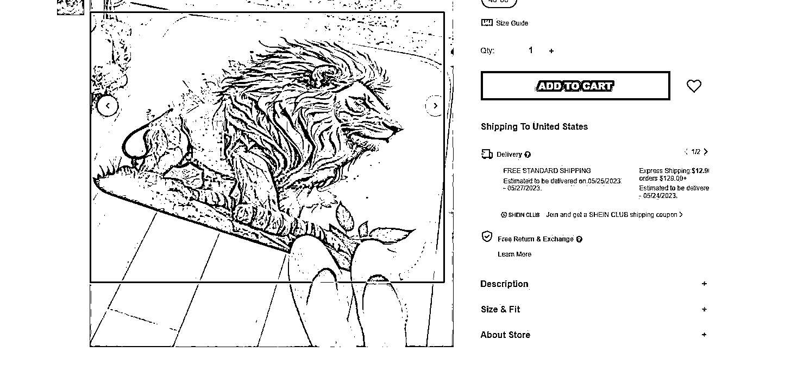

评论区：

亦仁 : 中标，术值+1。 

在上⽅专栏点击 #中标，可查看所有中标⻛向标。 

骷⽐絨 : 有点像亚⻢逊的指纹定制 

阿奇 : ⽼哥，你的配图是shein 的，shein也适合卖家⼊驻么[发呆] ⼦不语 : 适合 

# (88赞)⼩红书分享反 PUA 笔记，互动数据不⼩，变现 5 W多 

作者： ⽼⾦ 

⽇期：2023-07-03 

⼩红书上看到分享反PUA的笔记，如图1、图2、图3。互动数据都不⼩，如图4。 通过壁纸会员（图5）、原创⼿机壳（图6）等变现。 

仅⼿机壳已变现5万多。 

有⼿绘技能的圈友，可以考虑，或者结合AI绘画软件，打造另⼀个IP 

⽐如：博主是疯狂⽼太，那换个嘚瑟⽼头、焦虑⽼婆等。

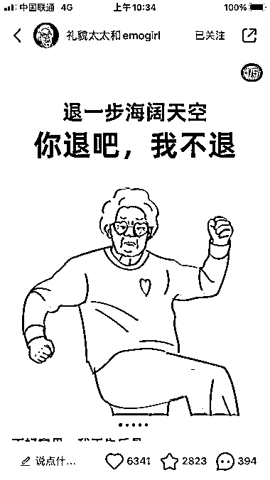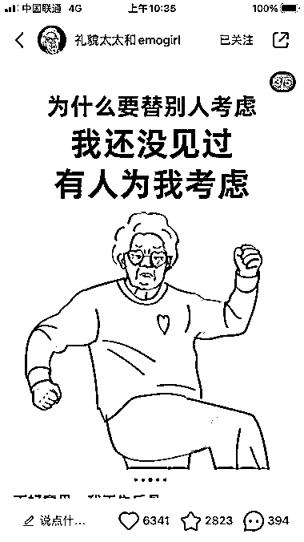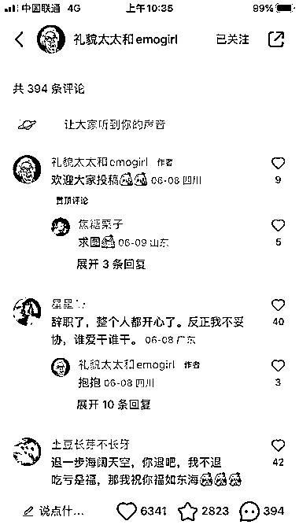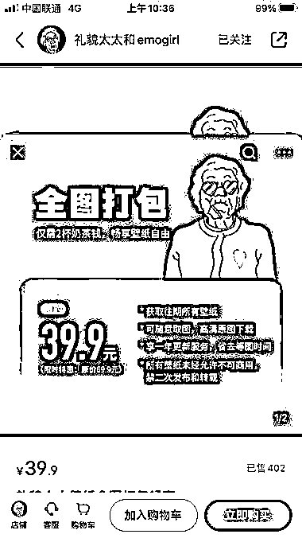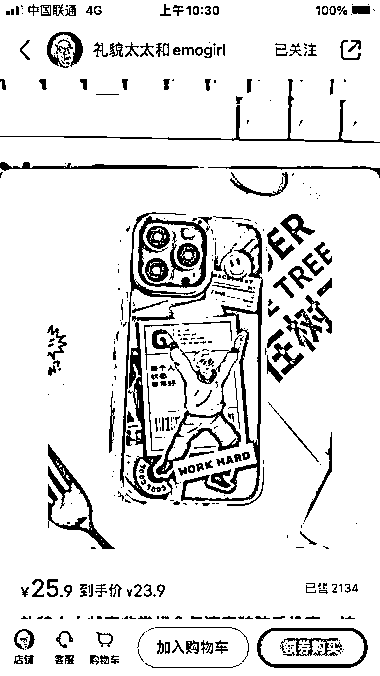

评论区：

胖⼤魔 : 暴⼒丑学，我刚把徐志胜看顺眼 

⽼⾦ : ⼤魔，你真的太卷了😂[强][强][呲⽛] 

胖⼤魔 : [害羞]不卷不卷 

亦仁 : 中标，术值+1。 

在上⽅专栏点击 #中标，可查看所有中标⻛向标 

⽼⾦ : 谢谢亦仁⽼师[呲⽛][抱拳][抱拳] 

Sunshine : 这个好玩 

Alex : 恭喜中标[呲⽛][呲⽛] 

⽼⾦ : 😂😂 

# (50赞)根据客⼾照⽚定制积⽊ 

作者： 浅⾊8ug的喵 

⽇期：2023-03-15 

根据客⼾照⽚定制积⽊

之前也⻅到过类似的，⽐如城市建筑、景点地标、明星、影视⻆⾊等等做出来的定制产品这种的算是定制服务2.0 结合AI绘画 发展空间很⼤ 评论区很多询问如何定制 

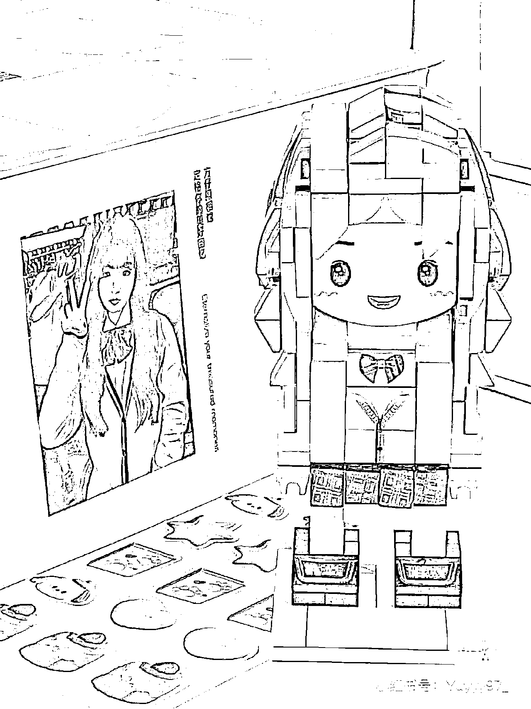 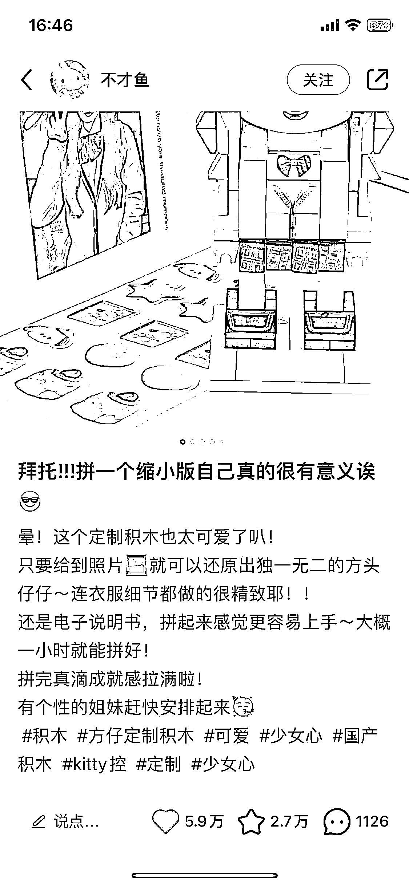 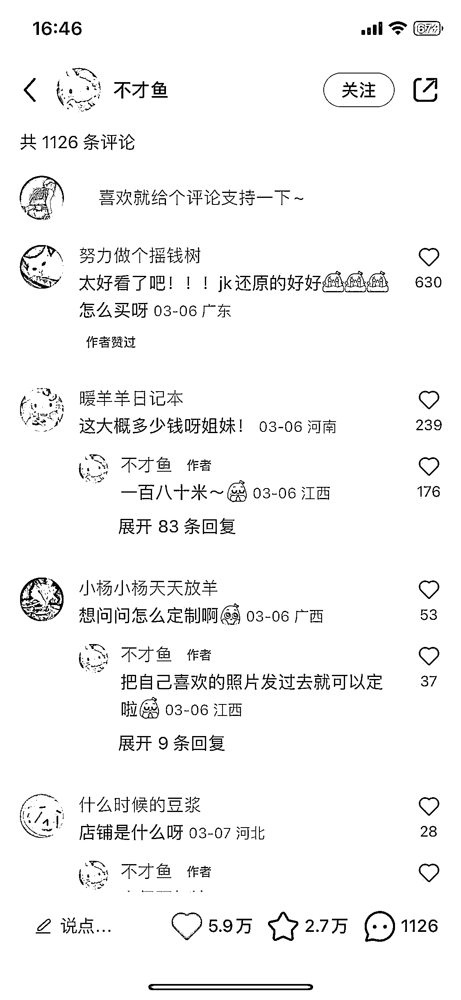 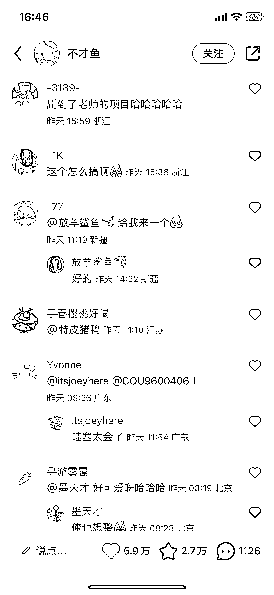

评论区：

刘岩涛 : ⽅仔照相馆？竟然是⼀个2020年就有了的项⽬ 

亦仁 : 中标，术值+1。 

在上⽅ #星球栏⽬ 专栏中，点击 #中标，可查看所有中标⻛向标。 

# (45赞)AI 绘画 ：可⽤于 DIY 美甲 

作者： 七⼩ 

⽇期：2022-12-07 

AI绘图 + 穿戴指甲彩绘打印，DIY美甲，理论上是不是可以做了？ 

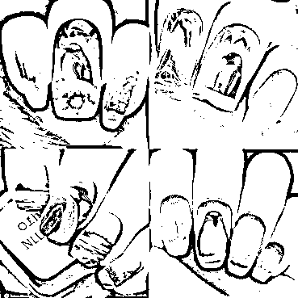 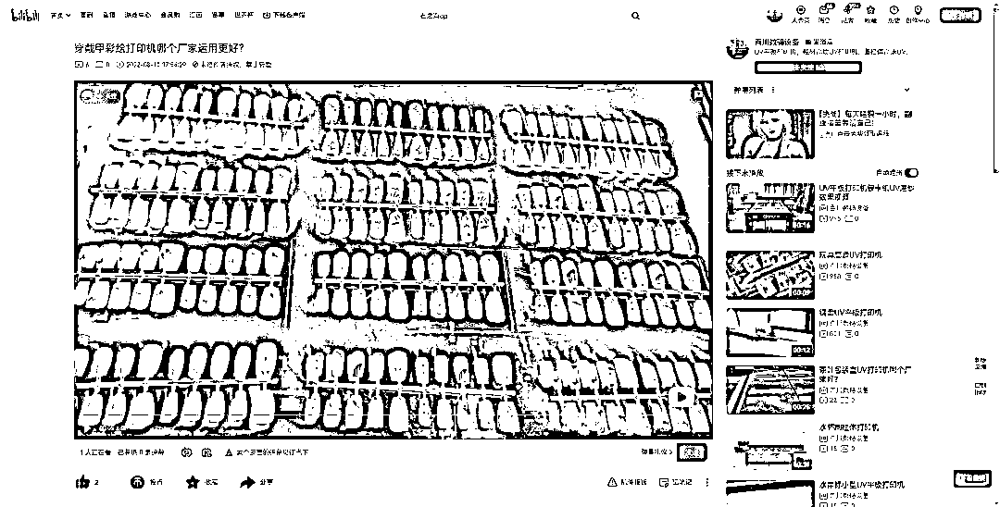

评论区：

晨曦 : [呲⽛]我觉得⾏ 

七⼩ : 哈哈😄 

勿以恶⼩⽽为之 : 这个不错 

张优勋 : ⽜ 

亦仁 : 中标，术值+1。 

在上⽅ #星球栏⽬ 专栏中，点击 #中标，可查看所有中标⻛向标。 

段⽼湿 : 我开美甲店的。。意思原创款式也可以这样做呗。。。然后款式教程。。 

# (22赞)AI 绘画应⽤：专⻔⽤ AI ⽣成纹⾝的⽹站，采⽤订阅制购买图⽚ 作者： do⼩⻥ 

⽇期：2023-02-07 

AI绘画应⽤⸺专⻔⽤AI⽣成纹⾝的⽹站，采⽤订阅制的⽅式来购买图⽚。 ⽹站：www.tattoosai.com 

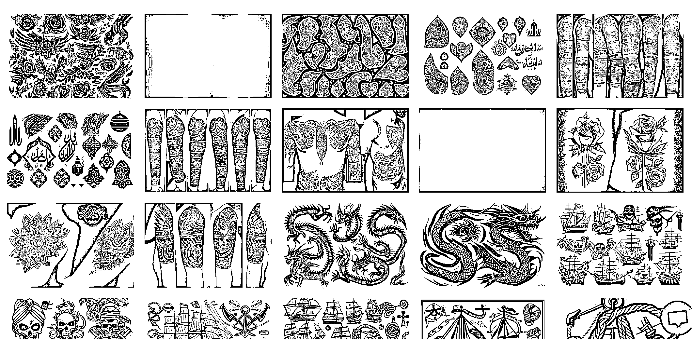 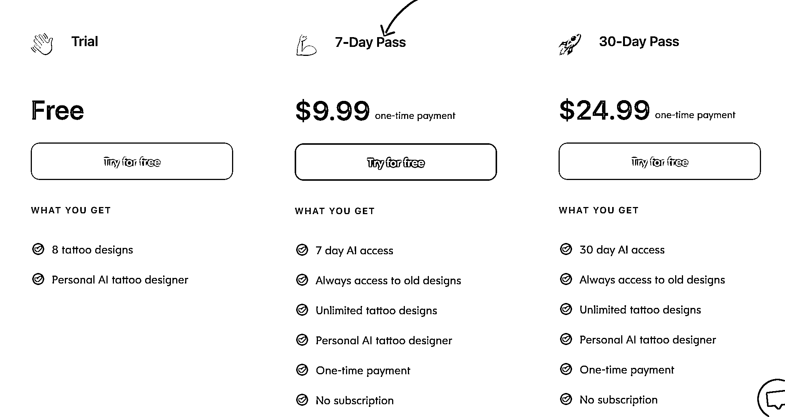

评论区：

三林 : 很垂直 

亦仁 : 中标，术值+1。 

在上⽅ #星球栏⽬ 专栏中，点击 #中标，可查看所有中标⻛向标。 

# 【公众号流量主】4篇 

# (274赞)AI绘画+ChatGPT+追热点：12 天收益 39900+ 作者： 妞妞💋 

⽇期：2023-06-13 

AI绘画+GPT+追热点发在公众号上，12天收益39900+，还有赞赏3000+，简直不要太⾹[偷笑] 

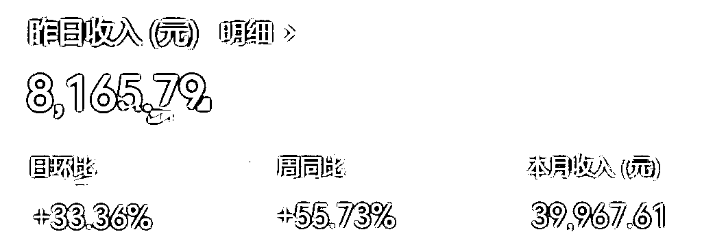 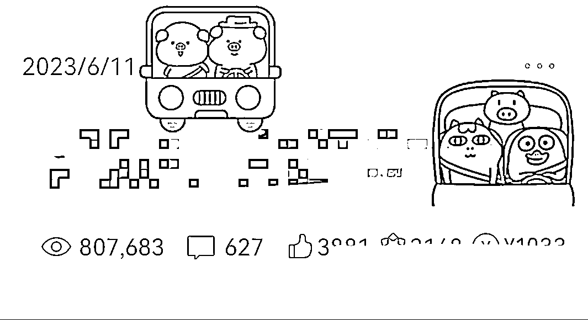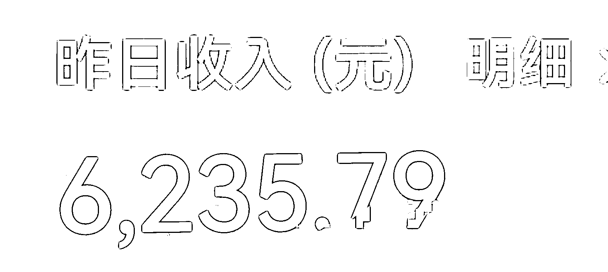 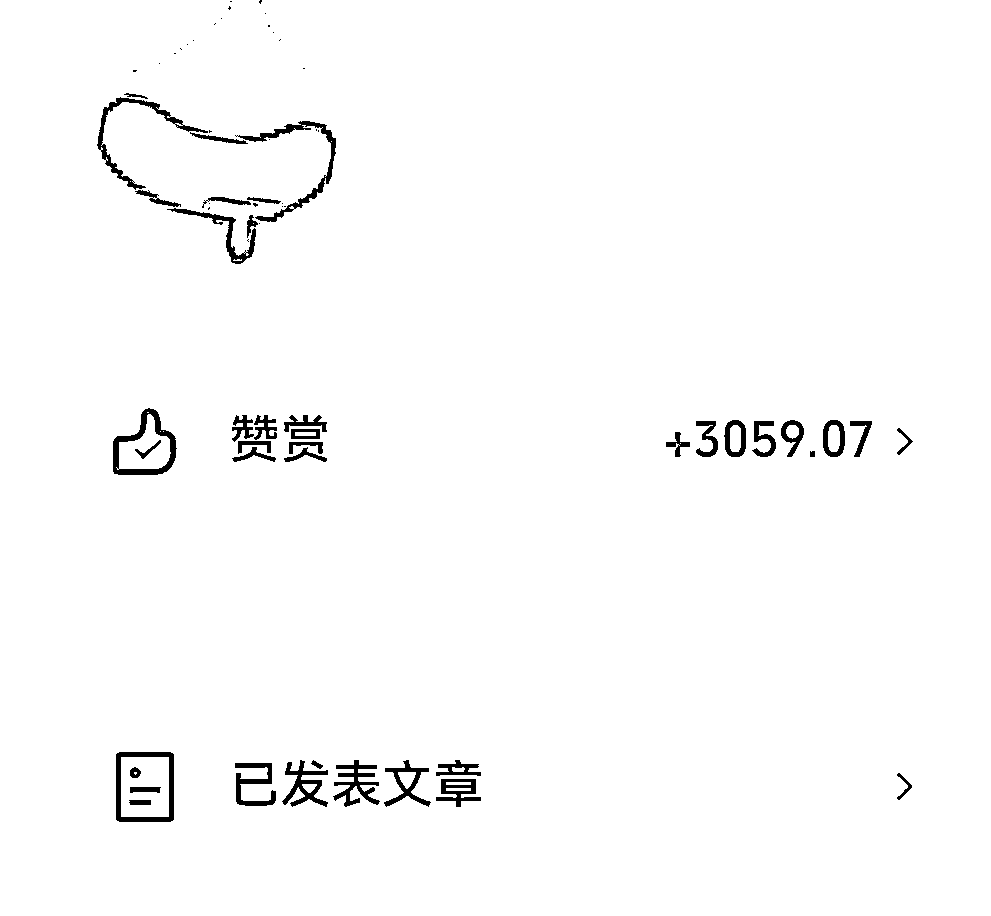

评论区：

翱翔蓝天 : 个个都这么厉害👌，什么类型的⽂章[害羞] 

帅⼦ : 教练威武 

妞妞💋 : ⾏规，不暴露账号 

妞妞💋 : 热点，就这⼏天的牵⼿⻔ 

妞妞💋 : 帅⼦也很棒，我在练习发帖，哈哈哈，多尝试⼀下，感觉⽣财星球⽐公众号后台复杂好多 翱翔蓝天 : [强][强][强] 

# (127赞)公众号写作流量主变现：美⼥图⽚⽅向，流量⼤，变现轻松 

作者： 叶华 

⽇期：2023-06-23 

公众号写作流量主变现之美⼥图⽚⽅向。

男粉，s粉，甚⾄是爱美之⼼，这类粉丝在⽹络上最多。这个⽅向流量⼤，内容制作简单，项⽬完全合规不擦边。版权问题完全可以⽤ai绘画解决。流量有了，变现通过流量主⼴告变现，在公众号⽂章信息流机制下很容易出10万+ 

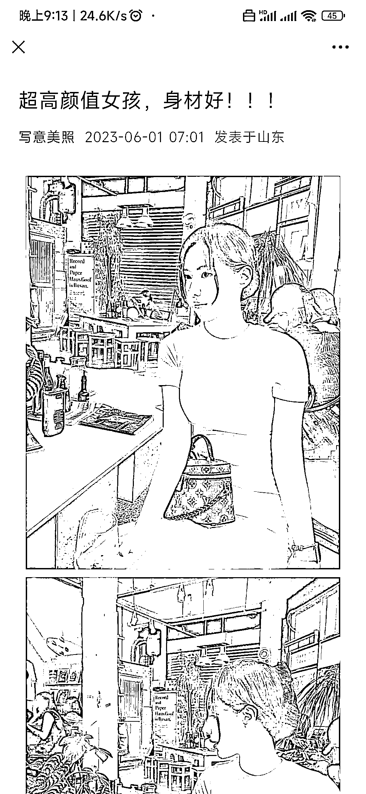 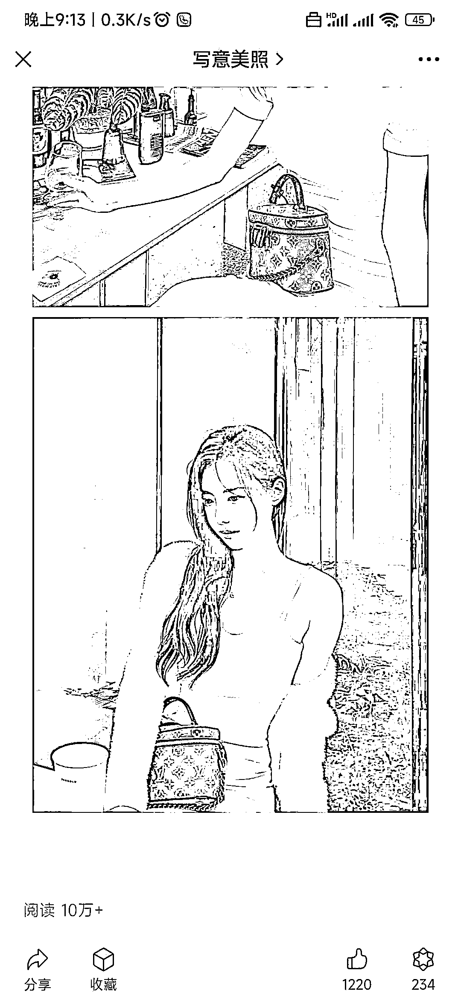 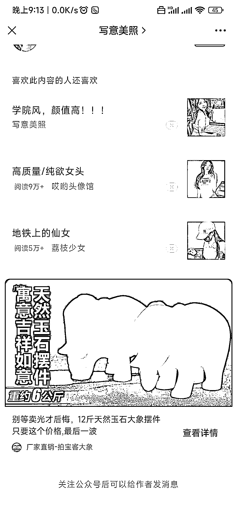 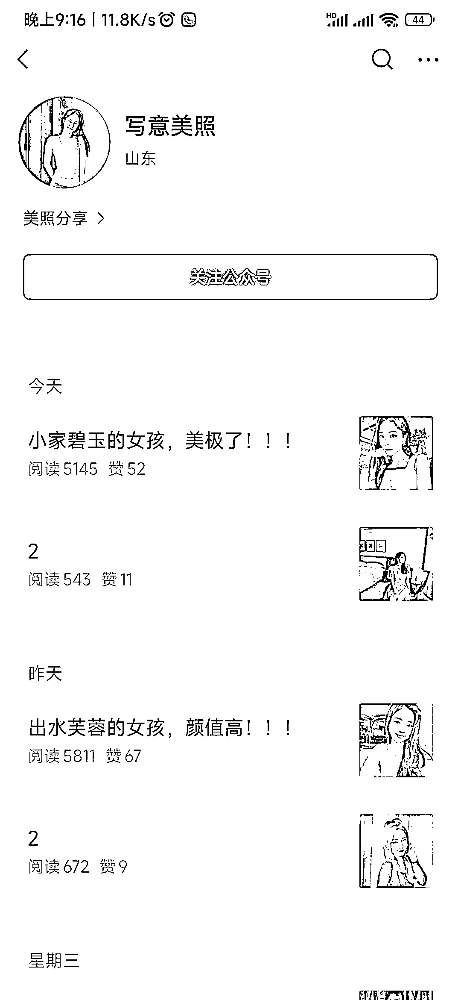

评论区：

⼩武武 : 这个厉害 看了简介 刚注册号也没多久 ，流量很⾼ 

亦仁 : 中标，术值+1。 

在上⽅专栏点击 #中标，可查看所有中标⻛向标。 

⽼彭 : 流量主⼀天能赚多少钱啊，这种很难标原创啊 

在路上 : 我也刷到了 

叶华 : 适合个⼈矩阵化操作 

⽼传 : 我朋友在做，1W阅读20-30 

垚垚 : 请问下，这个在发布的时候有没有什么讲究，我最近每次都选群发，原创，类型选壁纸，然后连续6天都是只有我和我⽼公2个阅读，是不是操作有啥不对啊？ 

叶华 : 这个时候是给你安利⼀下⽣财的公众号爆⽂写作⼩航海了，保姆级教程，重点是免费 (76赞)公众号流量主，ChatGPT+Ai 绘画，3天⼊池 

作者： 元彻 

⽇期：2023-06-26 

公众号流量主，chatgpt+Ai绘画，3天⼊池，5w+ 

同时起⽼号和0粉号，确实⽼号⼊池容易些 

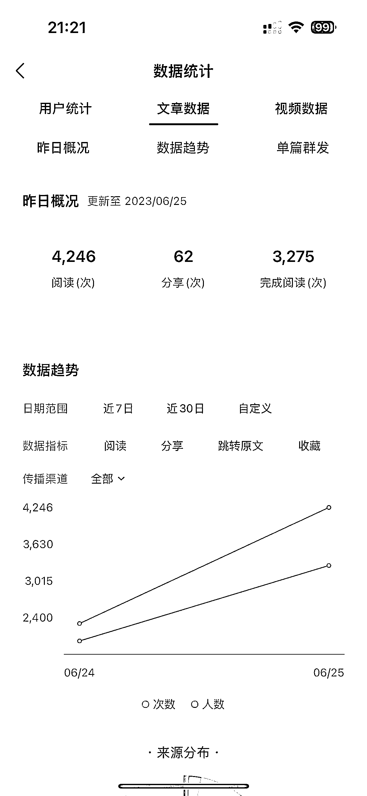 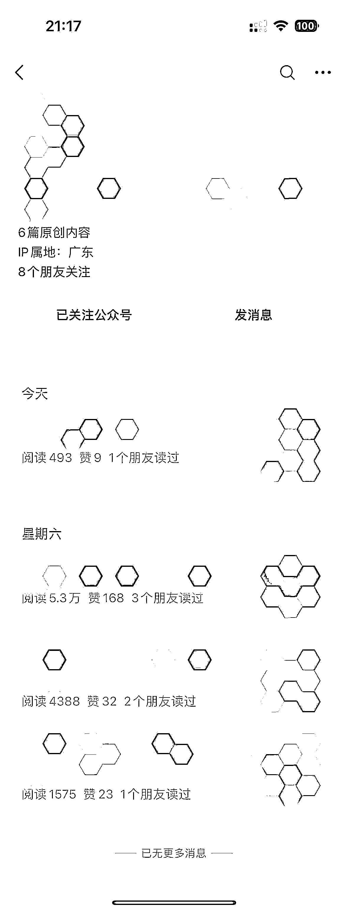

评论区：

思⾏Super : 情感⽂+美⼥图嘛？ 

元彻 : 是的 

思⾏Super : ⽜逼[强] 

元彻 : 谢谢，有兴趣可以试⼀下 

思⾏Super : 有个点不明⽩，假如是当做⽂章配图，AI绘画和美⼥配图有什么不⼀样的作⽤嘛？[疑问] ⽻落 : ⽼哥，请教个问题，情感⽂和美⼥图的⽐重是怎么分配的，就是偏重哪⼀块？最近也在整这个，也会进池⼦，但是最⾼阅读量也就1000左右。 

元彻 : 我感觉⽂ 1:图9，然后图⽚尽量偏真实和有质感，让看的⼈有视觉享受但⼜不违规。 ⼊池了就坚持更，靠量博运⽓。

⽻落 : 在问⼀个(有点脸⽪厚了)😆，标题会带Ai绘画⼀类的关键字吗？ (45赞)AI 绘画 + 公众号，⼴告主变现 

作者： 奇点 

⽇期：2023-02-21 

AI绘画+公众号，⼴告主变现。 

图⽚⾥的公众号2⽉10号注册的，每篇⽂章就是发的⼏张AI⽣成的图⽚，阅读量最⾼有4000+，关键是每天发了8条⽂章。 

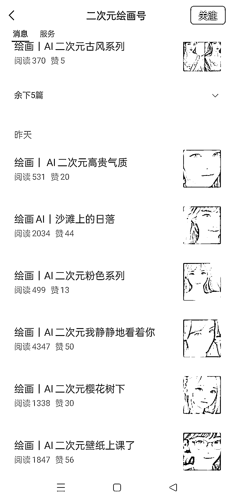 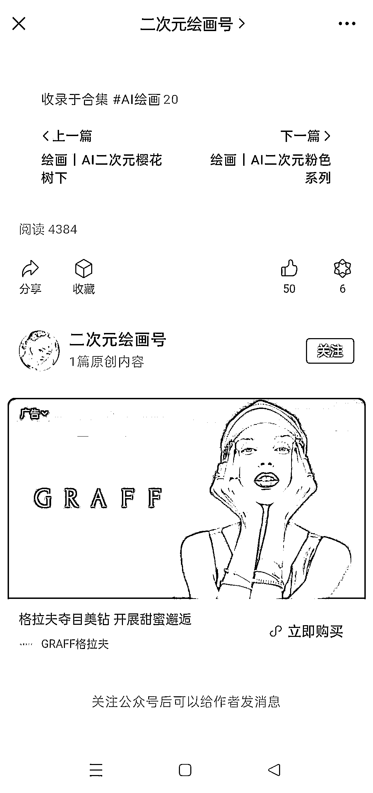 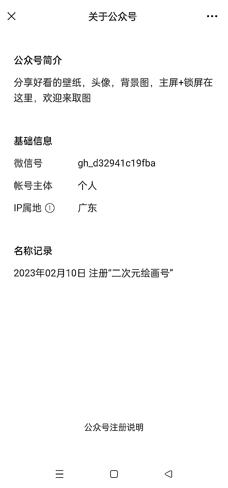

评论区：

振哥 : 不知道是纯⾃然流量还是有引流过去？图确实挺好看的[强] 

亦仁 : 中标，术值+1。 

在上⽅ #星球栏⽬ 专栏中，点击 #中标，可查看所有中标⻛向标。 

王先森 : 请问公众号有什么引流的⽅法吗？ 

# 【淘宝店省钱】4篇 

# (211赞)AI 绘图模型不⽌于应⽤电商，动漫设计等都可⾃⼰训练 

作者： 阿袁 

⽇期：2023-05-16 

stable diffusion ⾃⼰训练 lora，光跑模型 3090 显卡吭哧了⼀个半⼩时， AI 绘画对电商模特的打击简直了，⾃⼰训练⽆版权的⼈物模特，可指定⾐服替换，10秒内就出完图。 AI绘图模型不⽌于应⽤电商，动漫设计、室内设计、⽹⻚设计、平⾯设计、⼯业设计等，都可⾃⼰训练，这商业价值简直了。

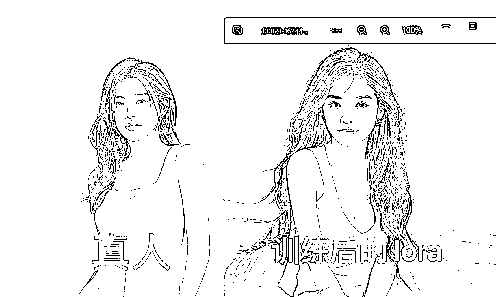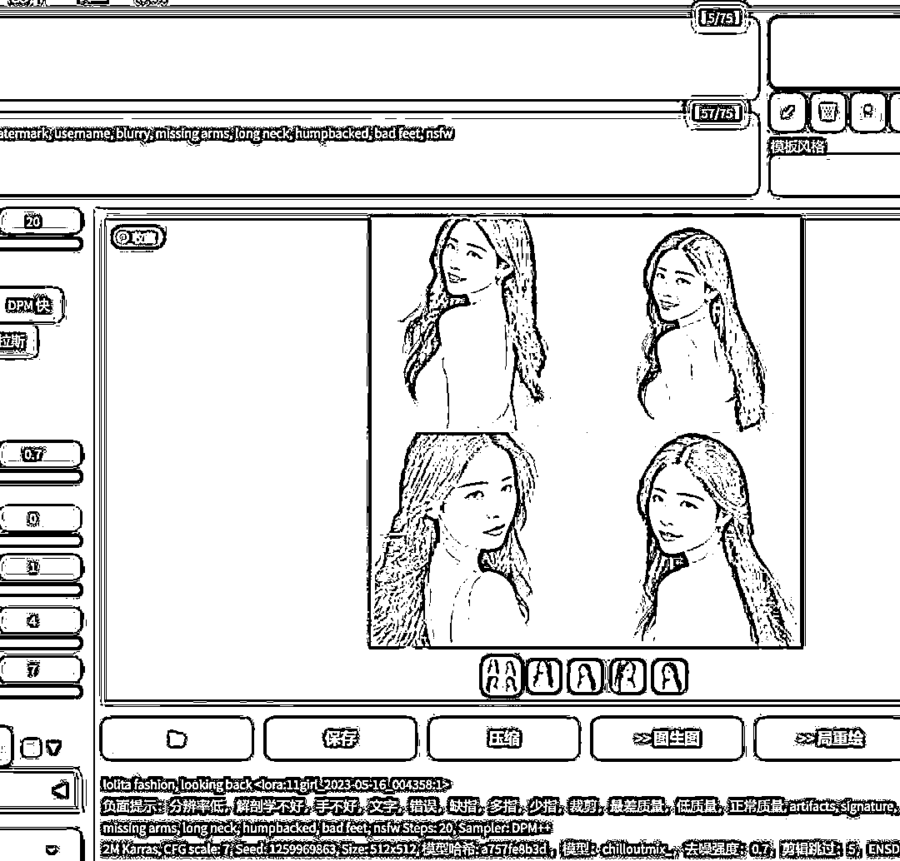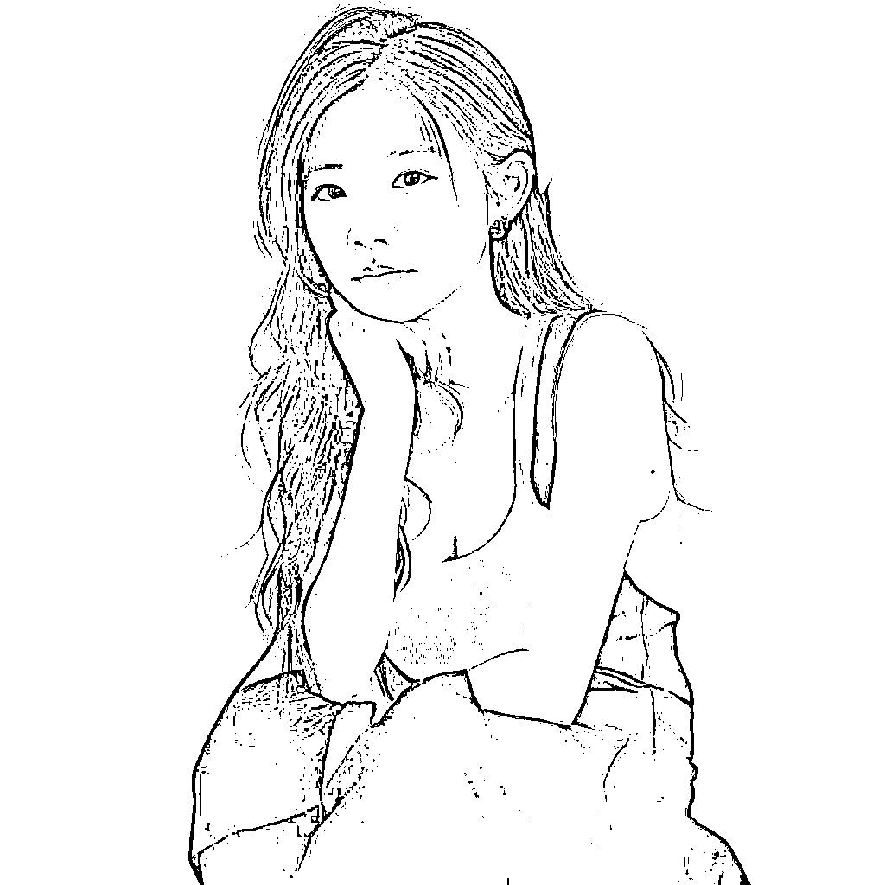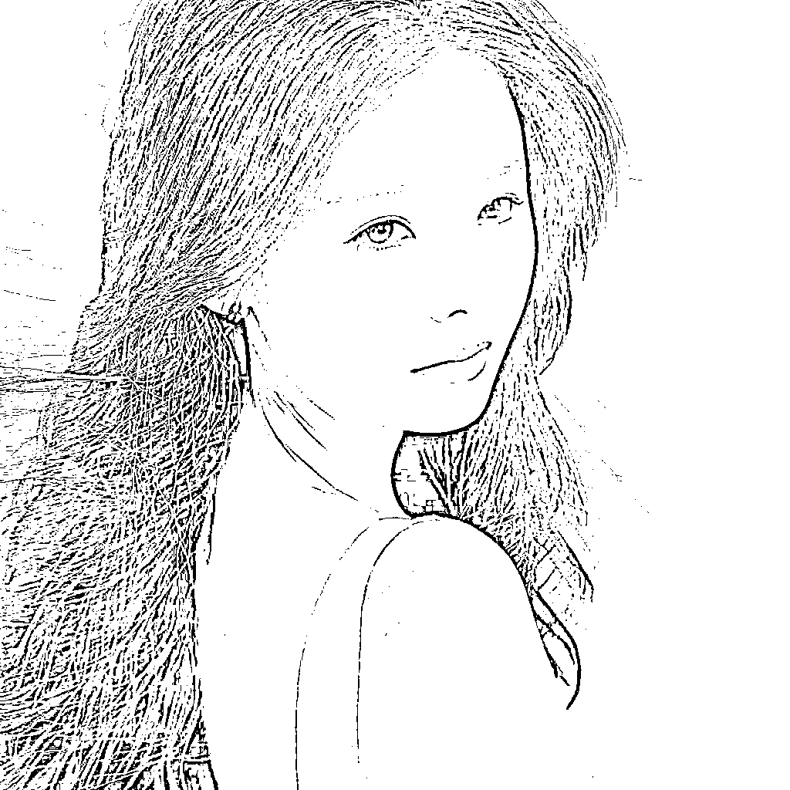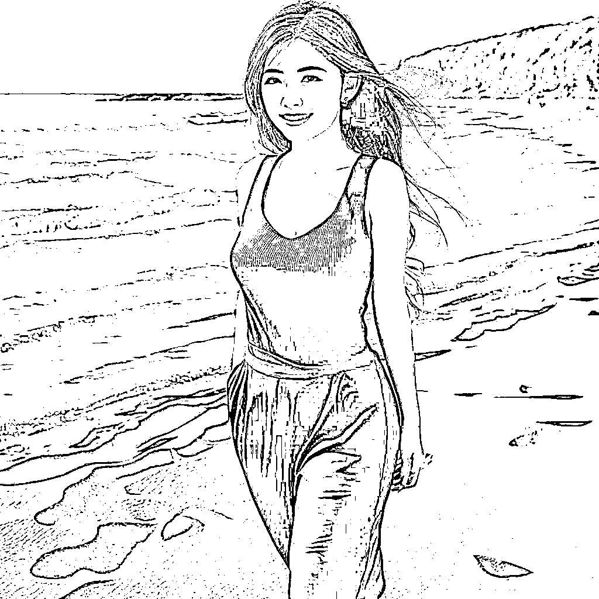

评论区：

看好你 : 看着不错哦 

伟业 : 有教程吗，好厉害 

Javinlee : 稳定出图吗 

跨境⼩⽩⿏ : 求教程😂 

平凡⼩吴 : 能安排个教程嘛，圈友[抱拳] 

张优勋 : 求教程 

亦仁 : 中标，术值+1。 

在上⽅专栏点击 #中标，可查看所有中标⻛向标。 

someone so* : 厉害 

# (98赞)36 氪 AI 淘宝店⼀个⽉卖出 200 件，分享从 0 到 1 的踩坑经验 作者： ⼟⾖君 

⽇期：2023-06-15 

36氪AI开的淘宝店成真了，⼀个⽉卖了快200件 

⼀个⽉前36氪开了个AI⾐服淘宝店，没想到⼀个⽉还有后续，他们跑通了0-1，⼀个⽉卖了200件，太厉害了，昨天发的视频分享了他们从0-1的踩坑经验，可以说是⾮常实⽤的教程。 【【36氪】我⽤AI开的淘宝店成真了，⼀个⽉卖了快200件！-哔哩哔哩】 【【36氪】我⽤AI开了家“假”淘宝店，居然真的有⼈下单？-哔哩哔哩】 https://b23.tv/XAgVYImhttps://b23.tv/mKIZnTg 

评论区：

亦仁 : 中标，术值+1。 

在上⽅专栏点击 #中标，可查看所有中标⻛向标。 

# (65赞)帮助淘宝店家⽤ ChatGPT 和 AI 绘画完成服饰产品的拍摄 作者： 🐵Sunday🐵 

⽇期：2023-03-21 

《帮助淘宝店家⽤Chatgpt和AI绘画完成服饰产品的拍摄》 

此⽂计划是根据我们队船员， 的思路作为延展思考🤔 

⼀、背景和市场分析

淘宝作为中国最⼤的电商平台之⼀，越来越多的店家开始向⽹上转型。然⽽，传统的拍摄⽅式在成本和效率上⾯临着⼀些挑战，⽽Chatgpt和AI绘画技术的出现为淘宝店家提供了⼀种更为便捷、⾼效、低成本的产品拍摄⽅式。

据调查，中国的电商市场在近年来增⻓迅速，但传统拍摄⽅式所需的费⽤和时间成本让许多淘宝店家望⽽却步。此外，对于⼀些卖场不⼤、场地狭窄的淘宝店家来说，传统拍摄⽅式所需的空间和设备也是制约因素。

因此，我们将通过Chatgpt和AI绘画技术，为淘宝店家提供⼀种更加便捷、⾼效、低成本的产品拍摄解决⽅案。

传统拍摄⽅式的成本包括：

模特费⽤：根据模特的知名度和形象，模特费⽤⼀般在⼏百到⼏千元不等。

场地租赁费⽤：场地租赁费⽤因地区⽽异，通常每⼩时⼏百元到⼏千元不等。

拍摄设备费⽤：拍摄设备费⽤包括摄像机、灯光设备、背景布等，根据设备品质和数量不同，费⽤在数千元⾄数万元之间。

化妆费⽤：根据化妆师的知名度和经验，化妆费⽤⼀般在⼏百到⼏千元不等。

摄影师费⽤：根据摄影师的知名度和经验，摄影师费⽤⼀般在⼏千元⾄数万元之间。

后期制作费⽤：后期制作费⽤包括修图、剪辑、特效等费⽤，根据后期制作复杂度和效果不同，费⽤在数千元⾄数万元之间。

因此，传统拍摄⽅式的总成本通常在数万元⾄数⼗万元之间，具体费⽤因不同情况⽽异。

AI绘图⽅式的成本包括： 

软件和硬件费⽤：AI绘图需要⼀定的软件和硬件⽀持，费⽤在⼏千元⾄数万元不等，具体费⽤因不同情况⽽异。

AI技术⽀持费⽤：如果需要购买或订阅AI技术⽀持服务，可能需要⽀付⼀定的技术⽀持费⽤。 ⼈员培训和维护费⽤：如果店家没有相关技术⼈员，可能需要花费⼀定的时间和费⽤进⾏⼈员培训和维护。

因此，AI绘图⽅式的总成本相对传统拍摄⽅式较低，但具体费⽤因不同情况⽽异。 ⼆、产品和服务

我们的服务主要包括两部分：

Chatgpt⽂本⽣成：我们将利⽤Chatgpt模型，输⼊相关的⽂字和描述，⾃动⽣成⼈物模特和服饰的效果图。店家只需要提供相关的⽂字和描述，即可获得多张服饰产品的效果图。

AI绘画：我们将利⽤AI绘画技术，为淘宝店家提供⾼质量的服饰产品效果图。店家只需要提供相关的产品图案和样式，即可获得⾼质量的效果图。

三、商业模式

基于AI绘图⽅式的商业模式，我们可以提供⼀个灵活、便捷、⾼效、低成本的商业模式，主要针对那些预算相对较低、需要频繁拍摄产品的淘宝店家。

我们可以提供⼀个基于订阅制的商业模式，店家可以根据⾃⼰的需求和预算选择不同的订阅⽅案，包括以下⼏种：

⽂本⽣成订阅：店家可以根据⾃⼰的需求，订阅⼀定数量的Chatgpt⽂本⽣成服务。我们将根据店家提供的⽂字和描述，⾃动⽣成服饰产品的效果图，并交付给店家。

AI绘画订阅：店家可以根据⾃⼰的需求，订阅⼀定数量的AI绘画服务。店家只需提供相关的产品图案和样式，即可获得⾼质量的效果图。

组合订阅：店家可以根据⾃⼰的需求，订阅以上两种服务的组合。

四、市场推⼴

我们将通过以下⽅式进⾏市场推⼴：

通过淘宝平台进⾏推⼴：在淘宝平台上开设我们的官⽅店铺，通过线上推⼴和⼴告展⽰等⽅式进⾏宣传和推⼴。

利⽤社交媒体：通过微信、微博等社交媒体平台进⾏宣传和推⼴，与淘宝店家建⽴合作关系。

⼝碑推荐：我们将利⽤客⼾的⼝碑推荐来推⼴我们的服务。

五、竞争对⼿分析

当前市场上，尚未有类似于我们所提供的Chatgpt和AI绘画技术的解决⽅案。我们的技术优势和成本优势可以帮助我们在市场上占据优

以上⽂案是通过今天⽤chatgpt⽤了200条对话最终形成的商业计划！如有不是太完善的地⽅，请各位⼤佬指教。因为⽬前我还是在gpt的 

建模中学习，但是我相信，只要努⼒，每个⼈都有⾃⼰的⼀个微雕产品！我也很感谢我们船的队友每天为我提供很好的思路进⾏深挖！

图⽚来源， ，@春柏，@⻨洛milo 

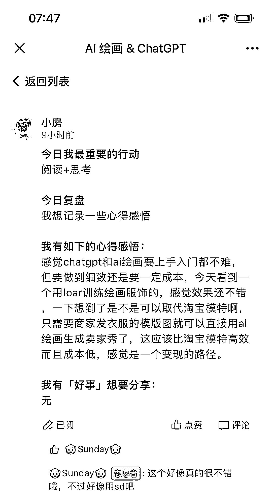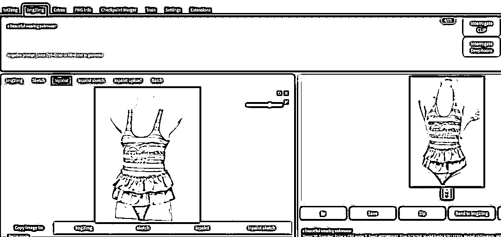 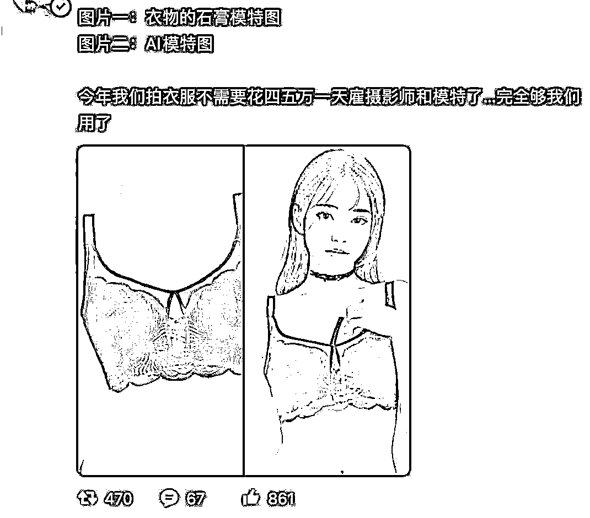

评论区：

亦仁 : 中标，术值+1。 

在上⽅专栏点击 #中标，可查看所有中标⻛向标。 

# (35赞)通过 AI 让模特穿上你想要的⾐服，拍摄费⽤可以省下好⼏万 作者： 陈⼩胖 

⽇期：2023-04-10 

⽣财朋友圈

#技术交流 

#Ai绘画 

stable diffusion局部重绘，让Ai模特穿上你想让她穿的⾐服，模特拍摄的费⽤可以省下好⼏万 优点：服装的相似度能控制在95%以上 

缺点：

1.⻣架调节难度较⼤，模特⾝体⽐例不太⾃然。需要探索别的⽅法。 

2.不能重新⽣成，每次都要重新开⻚⾯设置参数，不然重⽣成的就跟我的参考图⽆关。这个可能是这个SD模型的BUB,下次换个模型试下。 

教程链接：https://www.bilibili.com/video/BV1uM411u739?vd_source=9fefcdde4ad2f3a6c7fb2f768ab6172d 

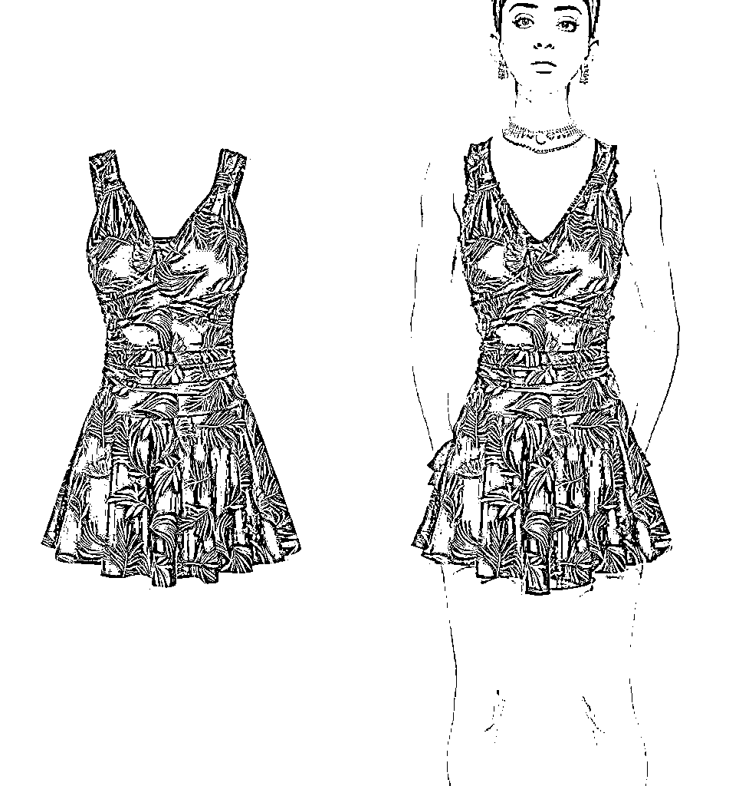

评论区：

亦仁 : 中标，术值 +1。 

点击最上⽅ #中标 专栏，可查看所有中标⻛向标。 

# 【其他项⽬】

# (精华帖)(285赞)受⼀条⻛向标启发跑通抖⾳四维彩超AI 项⽬，实现17 天收⼊过万

作者： ⽵⼦。 

⽇期：2023-06-30 

《新⼿⼩⽩受到⼀条⻛向标的启发，执⾏拉满，跑通抖⾳四维彩超AI 项⽬，实现17 天收⼊过万的复盘》

⼤家好，我是⽵⼦。今年 4 ⽉ 22 ⽇加⼊⽣财的新⼈。出⽣财新⼿村后，5⽉6⽇看到了⼀条四维彩超ai⽣成宝宝照⽚的⻛向标后，5 ⽉ 7 ⽇晚上⼊场抖⾳，发了第⼀条关于四维彩超 AI 预测宝宝⻓相的短视频，当天晚上开始有客单咨询，完成了从 0 到 1 的变现，17 天完成收⼊过万，⽬前视频合集播放量超 100w。 

这是⼀篇复盘帖，我将从AI绘画的变现形式和路径、引流转化的⽅式、我遇到的各种问题和解决⽅式来分享这个项⽬的跑通经验。

⼤部分内容在5⽉的AI绘画航海中已经做过分享，本次的分享添加了⼀些新的内容，重新做了⼀下章节调整。

具体内容请移步⻜书阅读：

在这⾥感谢⽣财平台和圈友提供的⻛向标，让我赚到了来⽣财的第⼀桶⾦。也谢谢⽣财团队⼦安的分享邀请，push我产出了这篇复盘帖。 

感谢 我的朋友和⼤学同学在朋友圈为⽣财代⾔，让我知道了这个会搞钱的社群，带我进了⽣财，也作为这个项⽬的合伙⼈为整个团队的⼩伙伴提供了不少帮助和⽀持。

感谢美丽的⾸席医官 指导我修改帖⼦，通过醒谱⽩战队进⼊⽣财真是我的福⽓呜呜，醒谱⽩战队&陪伴群yyds, 感恩！！ 

我永远爱⽣财，⼀起⽣财有术！

https://xqya1zd76f2.feishu.cn/docx/Xqmed28eTomg4bxVEmkcCwgtnSd 评论区：

书情⼩跟班 : 这执⾏⼒杠杠的啊 

梁靠谱 : 执⾏⼒拉满，就是结果拉满，⻛向标⽜逼，⽵⼦⽜逼！ 

三⾏MU : 厉害了这执⾏⼒ 

坏脾⽓的⼩可爱 : 执⾏⼒太强了吧！ 

课代表 . jime : 很佩服有系统有执⾏⼒的做事⼉ 

凌⼼ : 执⾏⼒拉满 

张热烈啊 : 执⾏⼒yyds 

⽵⼦。 : 谢谢夸夸，⼀起⽣财〜 

# (精华帖)(117赞)抖⾳四维彩超宝宝 AI 绘画项⽬，引流精准粉近400的复盘 作者： ⼀颗⼩苗苗 

⽇期：2023-07-10 

《抖⾳三天快速起号，四维彩超宝宝AI绘画项⽬，播放量100w+，引流精准粉近400，⽉⼊过万》 ⼤家好，我是⼀棵⼩苗苗，坐标南京。双211⼯程⼥硕⼠，90后宝妈，主业⽬前就职于全球三家5G芯⽚公司之⼀的通信企业，⼀枚毫不起眼的芯⽚前端验证⼯程师。我也是⼀名⽣财新⼈，今年4.16经⽅波妮介绍，通过醒谱⽩战队加⼊的⽣财。在⽅波妮的⼩组织⾥，认识了⼀批优秀的⽣财⼩伙伴，其中包括我们⼩组织⾥四维彩超ai绘画的发起⼈⽵⼦，得以顺利进⼊到了四维彩超AI绘画赛道。我们⼩团队⼤概有20来⼈都同时在做这个项⽬，相当于⾃发性的矩阵打法。⽵⼦的分享中具体描述了画图相关咒语，引流⽅式及相关话术，后期交付过程及话术，已描述得⾮常清楚，本⽂将不过多赘述，此处先附上⽵⼦的复盘贴。

本⽂将从以下⼏个⽅⾯进⾏阐述：

1 抖⾳三天快速起号和变现⽅式 

2 账号运营与维护 

3 起号注意事项及避坑 

4 项⽬发展潜⼒和⼆次转化 

5 总结 

本⽂共5500字超级⼲货，正⽂请移步⻜书👉 

感谢⽣财让我遇到这么多优秀的圈友，没有向⼤家学习并⼀起卷，我也⽆法短期内赚回近10张⻔票。 感谢我的好朋友 带我进⽣财，并毫⽆保留的分享所有经验，扫除了很多的障碍，让我们加速变现。 感谢优秀圈友 ⽆私分享⾃⼰发掘的项⽬，并带领⼤家⼀起赚钱！ 

感谢我的偶像靠谱姐 ，有幸加⼊到陪伴群，拥有指导修改帖⼦的福利，这波简直赚翻了。 最后再介绍下我⾃⼰，⼤家好，我是苗苗，⼀颗野蛮⽣⻓的⼩苗苗。

https://t.zsxq.com/0f0vYur0qhttps://tviaco1ik6k.feishu.cn/docx/JRawdxHJnoLJsQx2NCWcGAkNnVf

评论区：

⼤智 : 超级棒，get 

益雪 : 厉害 

⽵⼦。 : 苗苗威武[得意] 

林⼦意 : 真棒a 

⼩浩哥 : 优秀 

⼀颗⼩苗苗 : 谢谢[呲⽛] 

⼀颗⼩苗苗 : [抱拳][抱拳]感谢 

⼀颗⼩苗苗 : 谢谢⽵⼦[玫瑰] 

# (精华帖)(640赞)超详细的胎教级 Stable Diffusion 使⽤教程，看这⼀篇就够！

作者： 吴东⼦ 

⽇期：2023-05-08 

《耗时80⼩时！超详细的胎教级Stable Diffusion使⽤教程，看这⼀篇就够！》 ⼤家好，我是吴东⼦。花了很⻓时间终于整理好了这份万字SD的使⽤教程！ 从⼿把⼿安装部署，到界⾯功能讲解，再到实战案例制作，到下载优质模型，每⼀步都有详细教程，并且⽤⼀个⼜⼀个的例⼦展⽰，让你不⽌是枯燥地学，⽽是学完⽴刻也能做出⼀样的图⽚出来！

同时，⽆论是安装包，⼤模型，lora，关键词的⽂件都给⼤家打包好了，不⽤再⾃⼰这找找那找找，希望能做到让⼤家学SD，看这⼀篇就够！ 

如果有什么疑问的地⽅，欢迎在评论区留⾔噢！

为了更好的阅读体验，⼤家可以移步⾄⻜书

https://ry5hwpuf7b.feishu.cn/docx/HYrZdLBMRorB0qxKqFFcQ075nWf 

  

评论区：

GEWO.GUO🌪 : ⼤写的⽜逼 

+⻰ : 谢谢，边收藏边看[呲⽛] 

愚者 : 怎是⼀个“⽜”字了得！ 

悦佬 : 肯定是先收藏了[呲⽛] 

开⼼ : 你可真是太棒了[强] 

欢乐⻢ : 请教下⼤佬，宽⾼⽐设置成9：16⽐例就会出⿊图，是哪⾥的问题啊（⽤的云平台，显存也够）谢谢

西元 : ⽜逼 

红烧电饭煲 : 真滴⽜我的哥 

# (精华帖)(240赞)新⼿也可以快速上⼿的AI绘画：个⼈头像篇 

作者： 依琳 

⽇期：2023-05-23 

《新⼿也可以快速上⼿的AI绘画：个⼈头像篇》 

Yo！这⾥是⽊⽊｜终⾝成⻓践⾏者，⽣财领队，AI绘画航海教练。 

今天，⽊⽊想和⼤家分享⼀些个⼈头像制作的内容，通过制作头像，你不仅可以展⽰⾃⼰的创意和艺术感，还可以与他⼈分享你的想法和情感，更可以让你的朋友圈内容更加丰富多彩，顺便，也可以赚点钱。

⽂章⽬录如下：

⼀、垫图的使⽤⽅法

⼆、⽤⾃⼰的照⽚制作AI头像 

三、图像权重参数--iw的说明 

四、头像变现+NotionAI辅助⼯具的结合玩法 

本篇内容图⽂较多，为了更好的观感，还要⿇烦⼤家动⼀下⼿指点下⾯的链接，移步⻜书。

看完如果有⼀丢丢收获，请给个⼩赞⿎励⼀下。

如果有不妥的地⽅也欢迎各位朋友在评论区批评指正哈，谢谢⼤家。

https://zf8mp27jub.feishu.cn/docx/RFRpdNbcOoN9NqxjlUJcEgB7nTc 评论区：

浅笑 : 泰裤辣！ 

依琳 : [害羞][害羞][害羞] 

MissMujin : 今晚听完常常⽼师的分享，也想弄个AI头像呢。你这个分享太及时了，感谢🙏 苓枫 : 真的是保姆级⼿册呀，必须的点赞收藏⼀波 

诗农Hope : 动⼿画起来哇[嘿哈][奸笑] 

依琳 : [抱拳]⼀起探索哇，欢迎来交流⼼得 

依琳 : [爱⼼][爱⼼][爱⼼] 

巴菲 : 这么详细的教程，市⾯上怎么说也得 299 吧[强] 

# (35赞)⼩红书 AI 头像账号很⽕ 

作者： 海迪 

⽇期：2023-03-13 

⼩红书现在做Ai绘画账号的，最⽕的就是头像类账号。 

数据最⾼的点赞上限在五万，加上评论收藏数据，⼀条笔记互动量基本能到⼗万了。

头像类Ai账号的⽤⼾需求分为三类。 

1.第⼀类 

集中在帮助⽤⼾表达⾃⾝性格或积极情绪的内容，⽐如：元⽓少⼥头像、甜妹头像、⾼冷美⼥头像、清冷美⼥头像、御姐头像、甜酷⼥孩、时尚⼥孩、婚纱头像。

这类内容是稳定⾼频需求，⽤⼾范围⼴。

2.第⼆类 

在少⼥头像的基础上加上差异化的形象需求，来筛选更加精准的⽤⼾。

⼀般是形象词+少⼥头像的组合。 

⽐如⽩发清冷美⼥、⿊⾊短发⼥⽣头像、⾦发⿊⾊⽑⾐⼥孩、⿇花辫⼥孩。

3.⽂化元素 

除了上⾯的两类内容之外，⼀些结合了⽂化元素的头像也备受⻘睐。

⽐如博主“爱是与世界平⾏”的四⽅神少⼥系列头像，印象很深，打出了差异化的卖点，另外还有⼗⼆星座少⼥系列。

三类笔记转粉率没有数据，但我个⼈感觉第三类转粉会⾼⼀点。

这类笔记受众基本都是18-25岁的⼥性，⼀篇笔记80-90%都是⼥⽣在消费。 带的标签🏷⼤多是Ai绘画、⼆次元头像、⼆次元少⼥相关。 

以上供运营参考。

   

评论区：

亦仁 : 中标，术值+1。 

在上⽅ #星球栏⽬ 专栏中，点击 #中标，可查看所有中标⻛向标。 

# (156赞)⼩红书⾮常⽕，在⼿机模型上快速⽣成 AI 绘画的壁纸 

作者： Faith 

⽇期：2023-04-13 

#⻛向标# 

先看⼀下⼩红书上⾮常⽕的作品：

 

通过将壁纸应⽤到模型上，消费者可以更直观地看到壁纸在⼿机屏幕上的实际效果，包括⾊彩、对⽐度、清晰度等⽅⾯，也可以帮助消费者更好地选择适合⾃⼰⼿机的壁纸，此外，将壁纸放在⼿机模型⾥⾯也可以增加宣传的吸引⼒和趣味性，从⽽更好地吸引消费者的注意⼒和兴趣。

这个⽹站可以实现这个功能，操作⾮常简单，直接上传照⽚，选取模型，下载图⽚即可。

https://smartmockups.com/zh/mockups/smartphone 

评论区：

Kevin : 之前在⼩红书刷到很多这种壁纸，确实很惊艳，让⼈有购买冲动，原来都是有渠道的 11 : 请教⼀下，你这模板是⾃⼰设计的吗？好像它现有模板底图没法和⼿机屏幕⼀致 BeCa公主 : 请问为什么我下载不了图⽚[抱拳][抱拳] 

Faith : 背景图可以⾃⼰设计，平台也会提供⼀些

Faith : 刚刚我⼜试了⼀下，是可以的呢

BeCa公主 : 我明⽩了，我⽤pc试试，感谢感谢 

拾悦说 : 和AI绘画⼀起⽤，每天可以做出100张作品。[偷笑] 

cck : ⾮常好，我们也在做这个⽅向 

# (76赞)⼩红书上宠物粉群体，AI 绘画宠物赛道可以吸引精准的宠物粉 作者： 筑梦 

⽇期：2023-03-21 

⼩红书上宠物粉群体⾮常⼤，所以流量⼀直不错

Ai绘画宠物赛道可以吸引精准的宠物粉 

可通过多种⽅式引流变现：

1.将想要取图的⽤⼾引⾄公众号，可以为公众号快速涨粉，配合宠物知识类等转化 

2.夸克⽹盘拉新、迅雷拉新等，想要免费取图就要下载（适合各种头像类宠物类账号） 3.定制宠物头像壁纸等（宠物头像的单价要⽐⼈像⾼很多，宠物头像⼀般200+，⼈像⼀般50左右） 

 

评论区：

筑梦 : 这个也适合宠物赛道的商家矩阵化运营，再配合后端产品或知识的转化，吸取流量的速度很快且精准。

亦仁 : 中标，术值+1。 

在上⽅专栏点击 #中标，可查看所有中标⻛向标。 

# (64赞)⼩红书宠物赛道 AI 吸粉变现⽅式 

作者： 筑梦 

⽇期：2023-03-23 

⼩红书宠物赛道变现⽅式

借Ai绘画的⾼流量吸引精准宠物粉+穿插养宠⽇常和养宠⼲货 

⼴告主很喜欢，助你接单到⼿软

评论区：

詹伟平 : 这个有创意，以后假图遍地⻜ 

筑梦 : 慢慢的就真假难分了~ 

⼀颗杏仁 : 没看出来，这个哪⾥有ai绘画？ 

亦仁 : 中标，术值+1。 

在上⽅专栏点击 #中标，可查看所有中标⻛向标。 

# (153赞)AI 也能够让项⽬快速上线社群的⽅法 

作者： ⼀堆薄码 

⽇期：2023-04-07 

#⻛向标 

嗨，⼤家好，我是⼀堆薄码，⽣财有术AI绘图&ChatGPT航海的教练，是⼀个独⽴创意⼈，提供AI相关咨询、品牌营销、数字营销咨询。

很多朋友不知道ChatGPT和AI绘画有什么⽤，我分享⼀个有趣的经历给⼤家，如何利⽤AIGC达到项⽬的快速上线，⽆论社群、产品还是别的什么，都可以通过AI实现⼀个快速响应，快速测试，⽽且如果时间允许，那就不仅仅是这么粗糙的内容，⽽是可以更精细、更⾼品质的实现内容的呈现了，本⽂主要是AI混合应⽤的思路展⽰，更多玩法可以⾃⼰挖掘！ 

事情是这样的，在⼀个平凡的周⼆的晚上，⼀款基于ChatGPT的社群学习产品正在开发途中，技术合伙⼈突然说，要不咱们上线测试⼀下吧！上线？当时我⽛都还没刷的情况下，脑⼦就懵了？什么时候？现在吗？20:44突然要上线了？ 

上线⼀个产品体验群需要的产品名称、产品logo、体验群头像、体验规范等等，哪有那么快，说上就线就上线？不要搞我啊！经过激烈的探讨，最后他⼀句话说服我了，既然这样，那咱们就搞！

⾸先产品需要有个名字，想名字是⼀件⾮常漫⻓⽽痛苦的过程，怎么办？先搞简单的，AI的名字，头像这些，可以先搞起来。

迅速的,打开ChatGPT，⽤AI给AI取名字，我都佩服⾃⼰了，10个名字，选⼀个，就你了mary！名字定了，下⼀步当然是头像，那⼀个叫mary的AI英语⽼师应该⻓什么样？ 

既然我能⽤AI给AI取名字，那我也可以⽤AI给AI做头像，哇偶，格局打开了，⽴刻打开midjourney，开始⽣成⼀个头像，那AI是个机器⼈，要不就是个赛博朋克⻛格的美⼥如何？ 

⽴刻⻢上就有⼈反对了，没关系，不喜欢，那继续，可爱⼀点的外国妹⼦，第⼀个好看是好看，但似乎有点距离感，嗯，第⼆个可爱是可爱，但是不太像⼀个⽼师啊，不⾏，看来要换关键词。

让我想想，我们需要⼀个什么？⼀个英语⽼师！⼀个外国⼈，看起来像个⽼师，嗯，⽅向有了，那关键词就很好搞了，经过激烈的讨论，最后⼤家⼀直同意选⽤2号作为我们mary的头像。⿎掌 

放⼤图⽚，给AI机器⼈换头像，换名字，时光⻜逝，已经来到了晚上22:17分，距离上线需求已经过去了整整30分钟了，只搞定了名字、头像，需要加快速度了。下⾯需要什么了？群规！社群需要有规定，嗯，⻢上切换会ChatGPT，帮我写群规 

这么复杂吗？需要简化⼀点，要不放在群规栏⾥都没⼈看，简短、易懂还要加上表情包，对不对？

不得不夸AI⼀句，⼲的漂亮，对了，既然咱们是⼀个英语学习平台，那英语难道不是必要的吗？还得加上英语才⾏啊！可是我的英语都已经还给体育⽼师了，怎么办？知道的⼩伙伴们请回答！不错不错，你们已经会抢答了！

OKOK，稍微中英⽂结合排⼀下，赶紧发到群⾥，已经22:38了，⼀个群规浪费了我20分钟的时间，简直要命了，我的头要秃了，快快快，要加快了，不对，还缺东西啊，还得来⼀段发朋友圈的⽂案啊，社群上线，⼈员哪⾥来？当然是发朋友圈招⼈了，那好，说⼲就⼲。⽤ChatGPT快速⽣成朋友圈招募⽂案，你的输⼊稍微详细⼀点，⽣成的效果就还不错，稍微改改字眼就能⽤。

好了，朋友圈⽂案有了，让我想想还缺什么？⼀个产品得有⼀个名字啊！终于要来到最重要的起名环节了，看着不断跳动的时间和掉落的头发，豁出去了，既然格局都打开了，还有什么顾虑的，起名这件事也还是让AI来吧！（哦，你们可能注意到了，这张图的AI界⾯不太⼀样，这个是我们产品接⼊OpenAI的API，使⽤的是GPT 3.0 的版本，虽然GPT3.0版本没有⽹⻚3.5的智能，但也为了赶时间，就这么顺⼿⽤了）。在我的⼏轮输⼊下，很快ChatGPT给我了名字的选择，但是现在单词都太⻓了，不够朗朗上⼝，作为⼀个产品的名字，需要更有⼒、更简短、更好记⼀些。缩短名字这种⼯作，当然让可以让ChatGPT⼲了。 

好了，名字也搞定了，已经⼜过去整整30分钟了，已经到晚上的23点12了，我们的社群还缺产品logo，我的上帝啊，这个时间需要做⼀个产品logo。。。。。要不今天就这样吧，做logo这件事，ChatGPT就帮不上忙了，midjourney⽣成的也可以，但是⼀是需要调教的时间有点多，⼆是midjourney⽣成的很多logo过于华丽和复杂了，反⽽不适合做互联⽹产品logo，看着已经开始哗哗掉的头发，我想放弃了，不过突然想到，AIGC不只有ChatGPT，midjourney，还有别的很多好⽤的⼯具啊！

当格局再次打开，我想起来另外⼀个AI产品，之前也在公众号分享过的⼀个AI⽣出logo的⽹站，https://looka.com/ 

注：因为涉及到产品保密等问题，产品名和logo就不⽤⽬前选定的，使⽤的是我另外⼀个项⽬的使⽤过的图⽚。

⽹站打开是这个样⼦的，全英⽂的⽹站？不要怕，其实很简单，跟着我⼀步⼀来就好了，在中间的对话框⾥输⼊你想要⽣成的名字，可惜这⾥还不⽀持中⽂，就先⽤wujiushuo的拼⾳吧。 

输⼊完成后，点击Get started 然后⻚⾯就会跳转到新的界⾯，这个界⾯需要你告诉⽹站你的⾏业是什么

这个时候你借助⼀下⽹上的各种翻译⼯具，把⾃⼰的⾏业翻译成英⽂的，然后输⼊进去，就可以，⽐如我在“⾼端⼤⽓上档次(伪)商业咨询”⾏业，那就输⼊“⾼端⼤⽓上档次(伪)”，你看“商业咨询”就⾃⼰出来了，⽹⻚会⾃动匹配你的⾏业，帮你补完！

点击Continue后进⼊新的⻚⾯，这个⻚⾯⽹站会列出不同⻛格的logo让你看看，你只要点选喜欢的logo⻛格，⽐如我选的这个⼀看就很符合“⾼端⼤⽓上档次(伪)商业咨询”的⻛格。然后点击选中，就可以进⼊下⼀个⻚⾯了。

这个⻚⾯会让你选择你喜欢的颜⾊，那对于我这样的猛男来说，难道还有什么别的选择吗？必须是粉⾊对不对！猛男们！

好了，进⼊下⼀个⻚⾯，这个⻚⾯是让你确认⾃⼰公司的名字，还有⼝号，既然是⽣成wujiushuo的logo，那⼝号当然是“Just BB No Do It” 

然后下⼀步，这个界⾯是让选择⼀些关联的符号类型，你可以直接选择类型，你也可以选择最下⾯的“I want to pick my own symbols“意思是你想⾃⼰选择你喜欢的符号。 

在“I want to pick my own symbols“界⾯中你可以选择5个不同符号，选择完成后就可以下⼀步了

然后激动⼈⼼的环节开始了，⽹站开始运算，开始基于你的选择⽣成不同的logo不得不说，有些logo还能看。虽然⽐起设计师们设计的精美的logo来说这些logo还是过于简单，但结合AI绘图⽣成logo图形，在⽤这个⼯具辅助排版，嗯，貌似还挺⾹的。

 

最后选中喜欢的logo，既然有了产品logo，产品头像，朋友圈⽂案，似乎少了点什么?⼀张宣传海报。

还有10分钟就12点了，⼀个体验产品上线居然要搞⼀天，也太不像话了。 

OK，nice，下⼀步需要快速排版，打开Photoshop，，基本上只需要⽤到ps的图层功能、⽂字功能、矩形框功能就搞定，那⼿机上可以吗？也可以啊，⼿机上⽤稿定设计app，套⽤⼀个模板，改改字，搞

定了

这下可以收⼯碎觉了，嗯，⼀看时间12点20了，唉，下次需要更快⼀点，花了2个⼩时才完成产品名、产品logo、体验群头像、体验群群规、朋友圈⽂案、朋友圈海报等⼯作，是男⼈，还要更快⼀点！ 洗漱完成上床躺下，突然想起，对了，我还可以发个视频，⽤AI⽣成，基本上再有20分钟也就搞定……未完待续……

评论区：

阿黛 : 哇哇 

Y024 : 快快快，三连 

⾦多多 : 这标题[捂脸] 

⼀堆薄码 : 多快[奸笑] 

⼀堆薄码 : 666 

橙丫 : 这效率🤙 

星夜 : 确实快 给我们进群体验⼀下 

谢奇遇 : 太强了 

# (28赞)AI 的线下变现模式 

作者： ⻩浩在观察 

⽇期：2023-04-03 

有没有想过AI的线下变现模式：AI绘画⽕了这么久，⽬前看到的变现⽅式基本上都是线上的，很少看到把AI绘画应⽤到线下的变现形式。⽐如⻔店展⽰AI绘画，可以让⼈免费输⼏次关键词画画，然后影印⾃⼰的词⽣成的画收费。顾客⾃⼰创作的画，可能付费意愿⼤。

在抖⾳上已经看到有⼈做成机器线下卖照⽚赚钱了：

听说福⽥插画馆有台机器每⽉嫌10万！！带⼤家来揭秘⼀下〜 复制此链接，打开Dou⾳搜索，直接观看视频！

同理，ChatGPT 会不会也迸发出现线下的变现模式？可以开开脑洞 [嘿哈]

（图2、3是我问了⽂⼼⼀⾔得到的回答）https://v.douyin.com/AygxNAe/ 

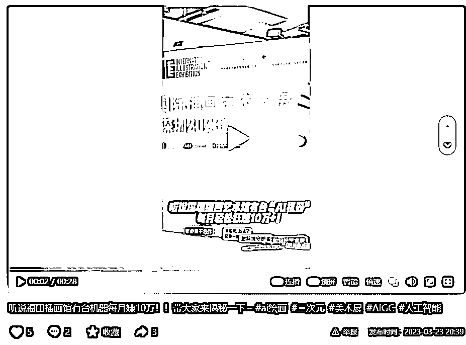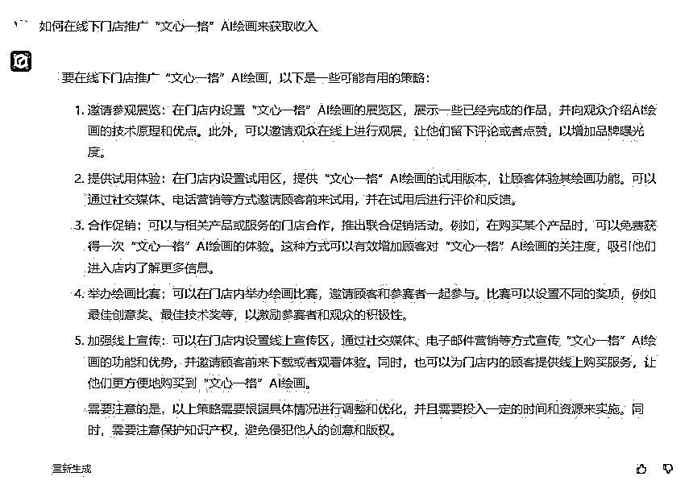 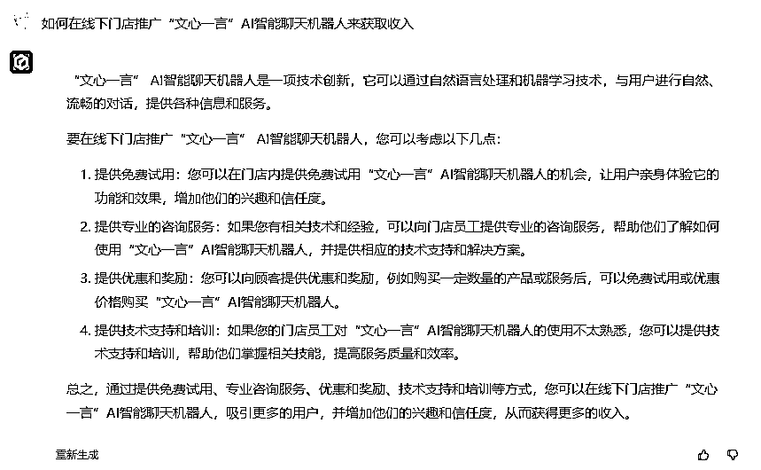

评论区：

⻩浩在观察 : 想到⼀个点，有很多给⼈题诗写字题词的线下店，结合GPT应该不错。这个⽅案可以卖不[呲⽛] 

# (63赞)可以做个 AI 绘画⼩程序接⼊ Midjourney，只需要⽤⼾输⼊他的⽣肖和职业

作者： 离⼼之巅 

⽇期：2023-03-29 

⼗⼆⽣肖壁纸在各⼤平台都⽐较⽕，midjourney同⼀组关键词只需要修改对应动物和职业就可以⽣成不同的图。思路扩展下，可不可以做个ai绘画⼩程序接⼊midjourney，只需要⽤⼾输⼊他的⽣肖和职业，不懂ai绘画的⼩⽩也能⽣成⾃⼰专属头像 

评论区：

亦仁 : 中标，术值+1。 

在上⽅ #星球栏⽬ 专栏中，点击 #中标，可查看所有中标⻛向标。 

# (37赞)结合 AI 绘画和按需印刷开发⼀些产品出海 

作者： MC 

⽇期：2023-02-28 

可以结合AI绘画和按需印刷开发⼀些产品出海，有⼀家叫指纹科技的公司 

提供了个性化印刷供应链，覆盖了⾮常多的品类还提供了低⻔槛的独⽴站⽅案

https://www.hicustom.com/wap?ad_code=HR8EFHUEB87Q 评论区：

亦仁 : 中标，术值+1。 

在上⽅ #星球栏⽬ 专栏中，点击 #中标，可查看所有中标⻛向标。 

秋冬。 : 插眼 

暗淡枫叶 : 这是什么意思，不太懂[发呆] 

# (31赞)AI 绘画领域上线多款 APP 

作者： 洋先⽣ 

⽇期：2023-03-08 

AI绘画出了很多app，可以尝试⼀下 

   

评论区：

亦仁 : 中标，术值+1。 

在上⽅ #星球栏⽬ 专栏中，点击 #中标，可查看所有中标⻛向标。 

# (55赞)AIGC 做 YouTube Shorts,⼀天可以⽣产半个⽉的视频量 作者： do⼩⻥ 

⽇期：2023-03-22 

AIGC做Youtube shorts，⼀天可以⽣产半个⽉的视频量，AI绘画+配⽂案，实操数据如图，⽐⾃⼰做youtube内容数据好很多 

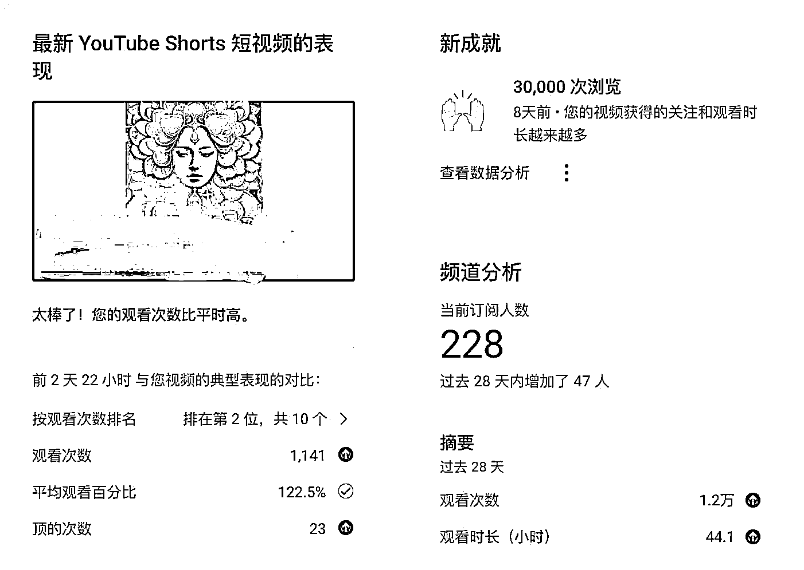

评论区：

⼤⽀ : 如何制作怎么联系你 

亦仁 : 中标，术值+1。 

在上⽅专栏点击 #中标，可查看所有中标⻛向标。 

# (59赞)AI 绘画 MJ + ChatGPT + line 贴图 = 表情包变现 作者： 乐希 

⽇期：2023-03-15 

ai绘画 mj+ChatGPT+line贴图=表情包变现 

mj⽤来做line贴图，可以直接销售。 

提⽰词也⽤ChatGPT⽣成 

已经有⼈⼏天直接变现了⼀万多⽇元

上架后就是躺赚，⽐百度⽂库好多了

NFT也⼀样，ai绘画⾮常适合发散性的内容制作 

⽤来做微信表情包，也可以引流

  

评论区：

亦仁 : 中标，术值+1。 

在上⽅ #星球栏⽬ 专栏中，点击 #中标，可查看所有中标⻛向标。 

⽵影 : 想请教下，mj注册需要注意什么，我⼀直注册不成功[抱拳][抱拳] 乐希 : 可以直接加⼊discord⼩组去做的，注册不成功是什么原因呢 ⽵影 : 怎么加⼊discord⼩组[抱拳] 

乐希 : 官⽹上有链接的，另外可以在⼩航海的ai绘画⼿册⾥看到mj的详细注册⽅式，如果不太懂可以在b站看⼿把⼿教程 

⽵影 : 好的，谢谢拉 

赈早⻅海 : 10000⽇元才500RMB，看来不怎么赚😂⽽且要对Line⽂化⽐较了解，适合tw本地⼈做吧 乐希 : 虽然暴利不了，这个产业是细⽔⻓流的，就⼀套表情包，⼏天就销售600，这些都是gpt⽣成的提⽰词，批量投喂就⾏了，要是专⻔去做，⼀天⽣产5套，之后躺赚过万也不是不⾏。 主要是专业的别⼈花⼀个⽉的事情，⾃⼰半天就能搞定，能赚钱的都可以这么做，⽐如⽂库，头条，投稿，都是搬砖⽣意，但效率提⾼很多。

# (精华帖)(321赞)⽣财的⼀句话，衍⽣⼀个“ AI 绘图” IP 

作者： 天辉 

⽇期：2022-10-10 

⽣财刘⼩排⼤神⼀句 “刚才我在桥上⻅到了⽕烧云……”， 

让我变现3900元，并且这个数字还在增加。 

这篇帖⼦给没钱没资源没⼈脉没流量的圈友打打⽓，提供⼀个0⾦钱起步参考。 去做，做就会有机会，事物发展超出你的想象，积极主动⼀定会有好事发⽣。

向宇宙公开许愿，宇宙会接收到你的善意

我先来，许愿⾃⼰得到⼀颗⻰珠，许愿⼤家出海顺利！

⼤家好，我是天辉，是梨云《⽣财·航海之歌》的配图师， 

主业是病毒制备和病毒清除，和艺术没有半⽑钱关系，

⽤AI绘图技术产出 50 张适配插画图，只⽤了不到半⼩时。 

⽣财·航海之歌（链接） 

不是搜索素材库，也不是拼图，⽽是实实在在地画出了世上独⼀⽆⼆的插画。

 

（结果梨云当晚就⽤上这些图出了，⾏动⼒拉满）

# 前⾔：AI绘图科普 

AI绘图⽤⼀句话解释，那就是“会说话，就会画画”， 

给⼀段⽂字，绘图⽹站就会按照⽂字信息⾃动画出相应的图⽚。

具体原理是，绘图的⽹站会在训练后的模型⾥，⼀步步地检查图⽚与⽂字的契合程度，先出⼀个模糊图，再逐步出现细节，每⾛⼀步，检查匹配⼀步，称之为扩散（diffusion），出图效果与描述词有很⼤关系。

⽐如，同样是百度⽂⼼⻜桨⼤模型⽹站

梨云⽣成的图⽤的描述词是：

⻩昏、⼤海、海浪、暗礁、船、天空

出图效果为蓝⾊框框内容

我想了⼀下，梨云真正想要的，需要修改⼀下描述词：

⻩昏时分的船在⼤海上航⾏，遍布海浪和暗礁，概念艺术，宏⼤，⾼清插画，HD，幻想⻛格, 超现实主义

也就是橙⾊框框内容

这也就是所谓的，描述词不同，效果天差地别。

但是，描述词⼀旦确定下来，复刻同类效果图⾮常容易，只要⼀直点⽣成按钮就好了，批量化⽣产，⼏⼗秒⼀张⼏⼗秒⼀张的出。

⼤家可以把梨云的蓝⾊⽂字、我的橙⾊部分的⽂字，分别在⽂⼼的⽹站⾥试⼀试，看看会不会出同款，记得选⼀下尺⼨。

https://wenxin.baidu.com/moduleApi/ernieVilg （⼿机也能⽤，⽂⼼的教程也提供了描述词的基本组成部分，作为⼊⻔很不错）

# 本帖讲述⼀个天辉与AI⻓⻓的⼩故事， 

# 每个时期都可以挣钱， 

# 都有⾜够多的细节可供像素级模仿 

1.AI绘图⼩攻略时期（萌新） 

2.AI绘图体验营时期（新⼿） 

3.AI绘图⼩报童时期（⽼⼿） 

4.AI绘图IP时期（品牌） 

5.AI绘图其他 

# ⼀、AI绘图⼩攻略时期（萌新） 

1.《刘⼩排：普通⼈⽤AI创作，有⼿就⾏》（2022-06-27 12:00） 2.《亦仁：卖空⽓检验真需求》（2022-07-08 21:47）

3.《天辉：原来还有⼀种模式是 “卖空⽓”，有⼈买时真快乐~》（2022-07-14 21:39） https://github.com/alembics/disco-diffusion （AI插画⽹站） 

https://b23.tv/ES3LNUN 

（视频教程）

https://www.bilibili.com/read/cv16525687 （图⽂教程）

我能根据资料跑通，那⼤家也都能跑通，也可以根据关键词找到更详细的资料。尽管研究、钻研、跑通、验证⽤了⼀些时间精⼒，但是后续分享链接只需要⼏秒钟，没什么额外成本，因此免费分享；

如果⾃⼰实在研究不出来，我也提供⼀份付费的保障，

1. ⼀对⼀指导，在过程中遇到问题解决问题，解决不了的协助⼀起寻找⽅法的陪跑服务；

2. 成了收，不成不收，类似保险的⻛险转嫁服务。

这是我提供的增量价值产品

以上是我售卖的19.9元的⼩攻略服务，⼀经发布，就被拍下，为什么呢，因为AI图⽚的可视化效果⾜够强，⼈们⼀眼就能知道你在做什么，这是⼀个特别容易展⽰的最⼩MVP产品。 朋友圈⼀发，说，打⼀段⽂字就能画出这样的图，总会有⼈⼼动的吧，谁⼼⾥没有点绘画梦呢？

对标我这个阶段的伙伴，可以根据上述资料进⾏跑通试⼀试，当你⽤我给的描述词和⽣成⽅式出图的时候，⽣成的都是你⾃⼰的图，你⽤你⾃⼰画的图作宣传。

（顺便说⼀句，⽤ disco diffusion ⽣成的图⽚，⽹站不会跟你要版权，可能有点拗⼝，之后再集中说版权的问题，现在记住，可以⽤就⾏了）

卖出去两份，你就挣到 40 元。挣的是提供增量价值的钱，朋友都很感谢你，因为它能提供的快乐远超 20 元。 

这个钱，⼈⼈可挣。

关于 disco diffusion 以及描述词，我写了更容易上⼿的版本，给在座的各位去挣 40 元，请拿它去⽣财。

《001 会说话就会画画（disco diffusion）》 

《002 这是我能画出来的图？（描述词的优化）》 

此外，也写了⼀份Midjourney的基础⼊⻔，下⾯⼩报童⽼⼿篇有进阶资料 《加⼊Midjourney⸺天辉》 

# ⼆、AI绘图体验营时期（新⼿） 

不要觉得 40 元很少，它不⽌是 40 元，⽽是代表了，有⼈愿意为它付费。 1. 产品产⽣ 

有设计师伙伴看到了我卖的攻略，找到了我，说，我们来办个体验营吧，我帮你做设计和⼆改，她就是⾖⼦，⼀个⼆次元⻤神⽂化爱好者游戏UI界⾯设计师。我还在⽂案改来改去的时候，她觉得差不多了，不想再墨迹了，直接把海报发到朋友圈了。这也是我参加⽣财⼩红书航海的时候，既然都是写图⽂，就⽤朋友圈练练⼿好了。

这个时候我有什么呢？

只有你看到的那两篇整理⽂章的⽔平，也就是说，你现在能卖 40 元，你就可以开⼀个体验营。 2.产品宣发 

体验营怎么招⽣的呢，不怕⼤家笑话，就是提前7天发朋友圈，告诉⼤家我要办⼀个⼀周的AI绘图体验营收价29.9元，帮助营内⼩伙伴体验⽂字绘图的快乐。 

最初营内只有我的妈妈还有⼀个尝鲜的⼩伙伴共四五位伙伴，没有⼈来。但是我知道这个东西很吸引⼈，所以我坚持⾄少每天群⾥发⼀次预热，并且⽤群⾥的出图和攻略每天发⼀条朋友圈。尽管群内没⼈回应，朋友圈也没⼈互动。

要出什么攻略我⾃⼰都不知道，但就是硬着头⽪上了，因为需要交付，所以每天逼迫⾃⼰想内容、搜内容，结果扩充了知识库，发现了 Midjourney（MJ）⽹站。那个时候 Stable diffusion ⽹站还没有出现，MJ就是最⼤的王者，因为它出图速度太快了，出图质量太⾼了。 

可能因为朋友圈美图重复触达真的很有效果，到临近开营那⼏天，⼀下⼦涨到了⼆⼗⼏⼈左右，这个时候我才知道之前发的内容都是有⽤的。

真正让⼈数爆发的，是我受邀作商业⼤课分享，分享了⾃⼰产品的制作过程与价值观《项⽬从开始到落地⸺AI绘图体验营》（链接） 

我秉持的核⼼原则是，宣传不是为了吸引⼈加⼊，⽽是尽可能地阻挡⼈加⼊。我特别担⼼的是宣传中产⽣了不恰当的误解，让⼈误以为可以通过训练营达成，从⽽付费进来了，之后因为没达成期望，⾛了。这对⽤⼾，对我们都是极差的体验。

所以我在宣传上，尽可能地降低⼤家的期望值，把之前列了很多的关于福利的宣传统统删掉（⼊营后再公布），把⼤家能在体验营做的事情在宣传上⽆限地拔低。我们将训练营，改成了体验营，重在体验。

我在朋友圈宣传⽤的图，不是⽹络⼤神产⽣的极其漂亮精美的图⽚，⽽是实实在在的我能做到的图⽚。我们将交付，定在了可以辅助学员⽣成你的第⼀张图，并且可以让学员⽣成7种不同⻛格的图，并告诉你哪些参数可以修改以及修改后的效果，到此，就算交付结束。

这是我们⼀定能提供的价值，我们寻找愿意为我们提供的保底价值⽀付29.9元的⽤⼾，那么除保底价值之外的每⼀项价值都是超额交付，这是我们宣传的逻辑。我们⾃信可以做到超额交付，这样对⽤⼾，对我们都是⼀次极佳的体验。

⼀些实⽤总结：

1. 所有帮助他⼈的事情都是在给⾃⼰投资，真正的利⼰主义者所做的事情都是极致利他。我能落地训练营，⼏乎都是来⾃于伙伴们的助推。

2. 想办法创造价值⽽⾮创造⾦钱，⾦钱只是随价值必然到来的副产品。多想⼀想为他⼈提供的价值，是节省了⾦钱，还是节省了精⼒时间，还是提供了情绪价值或者其他。

3. ⾛出开始的那⼀步最难，中间难，最后也难。

4. 超额交付就是，当⽆论如何你都能保底交付的价值，别⼈也愿意为之付费时，此时除了保底，其他都是超额。

5. 不需要纠结⾃⼰没有和⽆法改变的东西，多想想⾃⼰有什么，能做什么，然后去做，做着做着，经验就有了。⽆论能否成功，你的经验都是给他⼈的价值。

6. 如果⽆法掌控条件，那就⾛⼀步看⼀步吧，只要失败的损失能承受，那就没有什么是不能尝试的。

7. 压低期望值，压低期望值，隐藏交付福利。

# 3. 体验营 SOP 

当时我⾛⼀步看⼀步的，现在都沉淀成了已有经验，这是被验证过有效的⽅式，现在分享给你⽤来挣钱。

① 从现在开始，你学习AI绘图出的每⼀张图⽆论好坏都可以发在朋友圈，这是你是菜⻦的证明，有⼈会看。

② 当你的图⽚越来越好看时，就可以释放变好看的技巧，这是你在研究的证明，有⼈会看 ③ 开营倒计时（这个时候每天都要发预热了，展现体验营⾥能⼲嘛） 

以上内容需要的技术，基本都包含在下⾯这两篇⽂章⾥了，⼤家拿去开营。

《001 会说话就会画画（disco diffusion）》 

《002 这是我能画出来的图？（描述词的优化）》 

④ 开营之后的⽇⼦，每天分享学员出的图⽚，坏的图⽚证明他们在成⻓，好看的图⽚⾃带光环，⽤真实感受说话，你的学员都是你的好朋友，他们会很开⼼地在朋友圈⾥发图，带来很好的转介绍。

⑤ 你与学员的关系，是共创者的关系，不是师⽣，⽤⼼对待每⼀个问题，回馈好每⼀个成员。有学员说我是运营天花板，群⾥的每个成员都散发着主⼈翁⼀样的光和热，我觉得我真的没有什么运营的技巧，真诚⾃有万钧之⼒。

⑥ 结营的时候，可以抒发与伙伴们共同精进的感受，在群⾥举办⼀个结营仪式，⽤真情实感。我们在结营时，设计师伙伴悄悄地汇总了⼀个结营图，从⼏百张画中，找了出图的四⼗⼏位伙伴们的图，⼈⼿⼀张，汇总在⼀起，包括底图也是 AI ⽣成的图⽚。 

# 附：有哪些超值体验的部分？ 

1. 说是⽣成⼀张图⽚即可，实际上会⽣成⽆数张图

2. 说是只有7种⻛格，实际上⼏⼗上百种 

3. 说是只有disco diffusion的教学，实际上加了Midjourney、Stable diffusion 4. 说是⼀周结束，实际上有8天，且群永久保留答疑 

5. 未曾宣发的实物⼩布包抽奖，0元包邮（可印成员出的AI图） 

6. 未曾宣发的结营仪式

7. 极其耐⼼细致地⼿把⼿教

8. 超赞美图扎堆分享，良好视觉体验

9. 伙伴们的积极互动

# 关于运营 

⼩伙伴说我运营做的很好，其实没有任何运营的技巧，我只是想着能不能让⼤家尽量⿇烦节省时间，能不能体验再多⼀点，能不能再超值⼀点。

我把⾃⼰想象成⼀个从来没接触过AI绘画的⼩⽩，甚⾄是从来都没有看过外⾯⽹站的⼩⽩ 我在遇到问题时，最困惑我的是什么，什么能够第⼀时间解决问题先让我能⾛起来，然后在⾛起来之后，能不能想着⾛快⼀点，⾛的远⼀点

喜欢⾃⼰钻研的⼩伙伴，我提供⼀份可以钻研的资料；

喜欢与⼈交流的伙伴，我也积极参与探讨；

喜欢信息繁多刷屏的伙伴，我们⼀起刷屏体验氛围感；

不喜欢刷屏想安静的伙伴，只需要保存⼀份⽂档链接；

这⼀段时间，我帮助很多伙伴解决了很多的卡点。

有的是⼀点就透，有的是⼀步⼀步带着⾛，有些不熟悉的地⽅我也会慢慢地等，因为我知道这就是两个⽉前什么都不懂的我。

我那个时候很希望能有⼀个什么都懂，⾄少关键步骤能带我向前进，专业，且温暖的指引者。帮我节省时间，⽽不是碰到问题⽆法及时解决⼜要⾯对翻来翻去的苦恼。

所以我想成为能在关键时刻帮上⼀把，能为不同进度的学员解决个性化问题的伙伴4. 结算 

体验营⼀共 89 位⼩伙伴，营收2600元， 

这个数字，全是朋友圈、转介绍、分享来的，我没有其他流量，如果你有其他流量途径，应该还会有更多伙伴感兴趣。

忙这个，把⼩红书的航海给落下了，但12次打卡是保住了，后来协商了⼀下，这也算是航海的成果。

我也成了那⼀期可能唯⼀的0粉0笔记变现两千多元的记录。 

你能挣 40 元，就能和我⼀样再开个体验营，假设没有分享等促因，保守估计也能招30⼈左右，这就是900元。 

这次的体验营，还带来了圈内好伙伴，那就是拾⼀，他在七⽉有好事⾥发现了我，加⼊了我的体验营，还帮徐宿找到了我，徐宿认为我应该开设⼀个⼩报童专栏，于是就有了⼩报童。

# 三、AI绘图⼩报童时期（⽼⼿） 

这是徐宿怂恿我开的，我把前⼏个场景的⽤到的知识、技巧总结成⽂，放在了⼩报童⾥。

《再⼩的个体，也有⾃⼰的品牌》

这个就是⼀本随⾏⽇志，刚开始探索时发现disco diffusion很强⼤，后来发现Midjourney出图更快，更具有艺术⽓息，之后⼏乎是跟着 Stable diffusion 在前进。 ⽐如，你在探索中肯定会遇到想不出描述词的问题，那我就会拆解描述词是怎么想到的，哪些描述词在哪些⽹站会有什么样的效果。有⼩⼯具助⼒你迅速从⼩⽩变成进阶，或者提供思路等。

⽐如，我平时都从哪些地⽅获取AI绘图信息，哪些地⽅有描述词的探讨，哪些地⽅有国外的研究资料。

现在AI进展如何了，除了⽂⽣图，还有⽂⽣视频（起步阶段），⽂⽣3D模型（未开放，部分开放）。 有哪些博主在介绍相关信息，哪些博主值得关注，哪些图⽚可以复刻，等等

准确地说，⼩报童不是课程也不是服务，它是⼀本时时更新的研究⽇志，提供的是我以后可能会出的百元级、千元级产品的底层基础和素材库。

任何时候有需要交流的时候都可以问我，我可能会帮你省很多的时间和让你少⾛弯路。

记录我找到的资料，其实我知道的已经有很多了，但是写了⼀夜有点困有点写不动了，这些都是我读过的资料，列⼀些经典的，更多延展的，可以之后随时找我要。可能现在都不懂没关系，熟悉后你就知道这些多有价值了，全⽹可能找不到第⼆个像我写这么细的了。

都是我⼀个⼀个找的，各位珍藏。

1. Disco diffusion研究资料 

①（参数基础，英⽂）

②（基础知识整理，英⽂，最耗时间，但包含⼤量测试与底层原理）

③（国外⽹友⾃研⼩册⼦）

④（参数研究报告，中⽂整理，上）建议读

⑤（参数研究报告，中⽂整理，下）建议读

⑥（AI实验报告）建议读 

2. Midjourney 研究资料包 

①（⻛格参照）

②（Midjourney百科） 

③（Midjourney⼈像⽣成研究） 

④（⼈像⽣成研究2） 

⑤（艺术词图册）

⑥（prompt参照） 

⑦（描述词⽣成⼩⼯具）

3. Stable diffusion 

这个的资料过多，因为它最出圈，直接以它为关键词，全⽹搜索即可

尤其是在B站，有⼤量免费本地化部署教程，不过我的电脑不太给⼒，本地化⼀直都不成功，⾄今还在⽤⽹⻚版。

4. 其他绘图⼯具 

⼤约⼗⼏种，有些我看了，有些我还没看，零零散散，待总结，不过⽂⼼是真的挺不错，航海之歌的配图就是通过它⽣成的。

⼩报童现在有38位读者，有1260元收⼊，与前述加在⼀起，共变现3900元。 四、AI绘图IP时期（品牌） 

正如芷蓝姐说的那样，做到30分就可以教零基础，做到60分就能教30分，我现在应该算是做到了60分。

拆三个案例，看看掌握了AI绘图到60分能做什么 

⼀个是紫⾊可爱卡通⻛格，⼀个是⽣财航海之歌，⼀个是⼩红书爆款的现象级复制1. 紫⾊可爱卡通⻛格 

 

简单来讲，就是图⽣⽂，⽂⽣图加垫图，⼀旦找到⼀个能⽤的，接下来就是30秒⼀张30秒⼀张 2. ⽣财·航海之歌 

这个在本⽂最开头已经拆解过了，你可以按照我的⽅式做出同款来。

3. ⼩红书爆款拆解 

以上是⼩红书的蝴蝶

以下是拆解后可批量⽣产的类似⻛格图⽚

# 五、AI绘图其他 

只要是⽤到图的，都可以⽤AI绘图再想⼀遍。 

AI绘图不仅能画现实中有的东西，也可以画现实中没有的东西。 

芷蓝姐举的应⽤场景：动漫、游戏、⽐如批量⽣成纸⽚⼈⽼婆、画CG爱好者的名场⾯等都是可以的。 我⽬前打算以及在做的⽅向有两个，

⼀个是研究⼩红书的爆款，试着模仿和拆解图背后⽣成的参数和描述词

另⼀个是深度优化⾃媒体⼈学习路径，最终效果是保存1篇⽬录⽂档，30分钟内熟悉相关信息，1个⼩时能够进⾏个性化应⽤。

以上均为理想型，⽐较难，但我会试⼀试。

当然，应⽤也不限于此，我也会同步保持相关信息的更新。

AI绘图，对于我来说是⼀个从⽆到有的建⽴全过程，希望我的经历能够帮助到更多犹豫不前的伙伴们躬⾝⼊局试⼀试，⾄少在AI绘图上，你可以0⾦钱起步，像素级复刻，重⾛⼀遍我的路径。 当然，0⾦钱不代表0成本，投⼊的时间精⼒等都属于⼴义的成本，但容错率很⾼，失败了不会造成什么毁灭性的打击，多掌握⼀⻔技术，多⼀项能⼒。

我⼀直保持着研究学习状态，对AI绘图有任何想法，都欢迎与我交流。 

困了，可惜要去上班了，⼀般⽩天要进实验室制备和清除病毒，晚上有更多时间详谈，欢迎⼤家与我做朋友~ 

评论区：

⼀盘唐僧⾁ : 天辉⽼师，没有⻰珠不能留联系⽅式和分销码 

天辉 : 奥奥，这样啊，那我删掉重发内容还在不 

⼀盘唐僧⾁ : 重新编辑即可 

天辉 : 分销码删掉啦〜 

⽶斯特 LIu : 为啥看不了呢 

天辉 : 刚刚在修改，现在应该可以看啦 

⼀盘唐僧⾁ : 微信号 

天辉 : ⼗分不好意思，谢谢提醒，已删 

# (41赞)AI 绘画卖课？赚⼤钱 

作者： 瑾糖 

⽇期：2023-03-29 

Ai绘画卖课？赚⼤钱[旺柴] 

400块还三千多⼈买 

这种⽤视频制作成动态漫画的做引流

显卡够的这种视频（30S左右） 

⼀天制作20以上个啥问题 

关键没啥操作难度，会⽤sd就⾏。 

 

评论区：

茶叶蛋 : 会⽤sd.怎么弄成动画呢 

瑾糖 : Ps把视频逐帧导出，sd确定⾸帧⻛格，再⽤插件全部绘制。 

孙骄Zzzz : 也可以⽤mov2mov插件 

瑾糖 : Mov2mov很⽅便直接拖视频进去就可以了 

孙骄Zzzz : 是的，不过就是要求⽐较⾼ 

草⽊⻘（勇猛精进版） : 这个是抖⾳平台，还是快⼿的， 

瑾糖 : 抖⾳ 

草⽊⻘（勇猛精进版） : 不过要上架这个产品，得需要开店认证啥的吧， 

# (40赞)AI 绘画关键词售卖平台，可以买关键词，也可以卖关键词 

作者： 海迪 

⽇期：2022-12-16 

AI绘画关键词售卖平台，国外版，可以买关键词，也可以卖关键词，最低1.9美元⼀组词，有DALL·E, GPT-3, Midjourney, Stable Diffusion，这4类型的词。 ⽽且还可以借鉴画⻛，⽐如它有类型词，是可以借鉴来做AI绘画，⾃⼰写描述词。

https://promptbase.com/ 

评论区：

亦仁 : 中标，术值+1。 

在上⽅ #星球栏⽬ 专栏中，点击 #中标，可查看所有中标⻛向标。 

# (19赞)⼩程序挂 AI 绘画课程变现 

作者： 北⾠ 

⽇期：2023-03-20 

通过汇总AI绘画关键词引流，⼩程序挂AI绘画课程变现。 

该模式已经是机构矩阵玩法（且X学院），批量出视频，视频+直播，轰炸的很厉害。 现在已经变现6位数~ 

评论区：

亦仁 : 中标，术值+1。 

在上⽅专栏点击 #中标，可查看所有中标⻛向标。 

# (66赞)新奇特产品如 AI 绘画刺绣，多平台有资源扶持 

作者： 清华 

⽇期：2023-02-20 

新奇特的产品⼀直引⼈注⽬，连平台都会帮你推。

还是我的AI绘画。画的刺绣，受到了 当代⼈⺠艺术家的⻘睐，亲⾃帮我研发出刺绣成品。然后，今天上快团团链接，我顺这个销路通挖掘下去，过两位圈友的推荐发展出两条路线。 ⼀个是找到供应链，对⽅还没做个此产品，尝试帮推。第⼆，拼多多的跨境Temu平台，也没有上过此品，说都可以给资源。

如果你的产品够新奇特的，那你也可以尝试尝试。可以多平台尝试。特别是你的产品新奇特，质量有好，客单价有⾼，那更应该了。

我的AI刺绣变成了实物刺绣也验证了之前的从AI绘画到实物变现这条链路，且跟商家合作的话，可以拿提成的，就是每卖⼀单，都能有⼀份的收⼊。

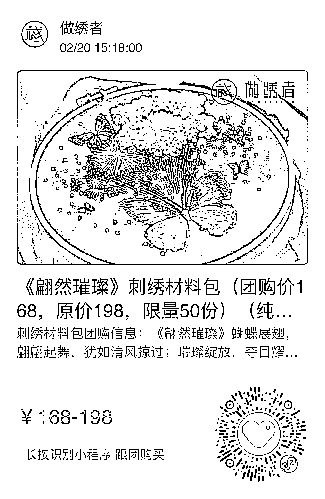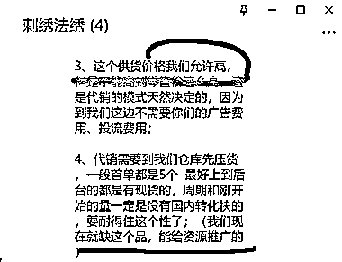

评论区：

亦仁 : 中标，术值+1。 

在上⽅ #星球栏⽬ 专栏中，点击 #中标，可查看所有中标⻛向标。 

MYX(爆单路上) : ⽼哥优秀的。 

# (65赞)(ChatGPT+ AI + 绘画 + 设计公司)GPT+ MJ 结合，帮设计公司出⽅案图

作者： 🐵Sunday🐵 

⽇期：2023-03-16 

今天我要给⼤家分享⼀个我在Chatgpt和Ai绘画航海中学到的⼀个⼩技能，就是是⽤gpt➕mj结合，这种帮设计公司出⽅案图，给甲⽅爸爸⽆限选择，接着定稿了，就给设计师出图，⼤⼤减少设计师的⼯作量。👌 

我这段时间就是这样帮朋友接单。费⽤还不低，⽽且时间成本相对来讲⽐较低。🤑 gpt➕mj是什么呢？其实就是两个⼈⼯智能软件的缩写。gpt是⼀个可以⽣成各种⽂本的软件，⽐如说标题、简介、⽂章等等。mj是⼀个可以⽣成各种图⽚的软件，⽐如说logo、海报、插画等等。👏 这两个软件结合起来就可以做到很多神奇的事情。⽐如说你想给⼀个品牌做⼀个logo，你只需要输⼊品牌名称和⼀些关键词，gpt就会给你⽣成⼀些logo的描述和建议，然后你再把这些描述输⼊到mj⾥⾯，mj就会给你⽣成⼀些logo的图⽚供你选择。👌 

同理，如果你想给⼀个项⽬做⼀个⽅案图，你只需要输⼊项⽬名称和⼀些要求，gpt就会给你⽣成⼀些⽅案图的描述和建议，然后你再把这些描述输⼊到mj⾥⾯，mj就会给你⽣成⼀些⽅案图的图⽚供你选择。👌 

这样⼀来，你就不⽤⾃⼰花费很多时间和精⼒去思考和创作了。⽽且gpt➕mj⽣成的内容都很有创意和质量，让甲⽅爸爸看了都觉得满意和惊艳。😍 

当然了，并不是说⽤了gpt➕mj就可以完全替代⼈类设计师了。毕竟⼈⼯智能也有它的局限性和缺陷。所以在最后定稿之前还是要请专业的设计师进⾏修改和优化才⾏。但是⽤了gpt➕mj之后可以⼤

⼤减少设计师的⼯作量和压⼒，并且提⾼效率和质量。🙌 

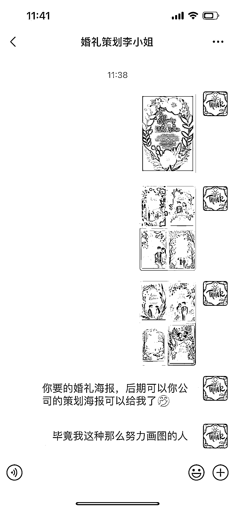 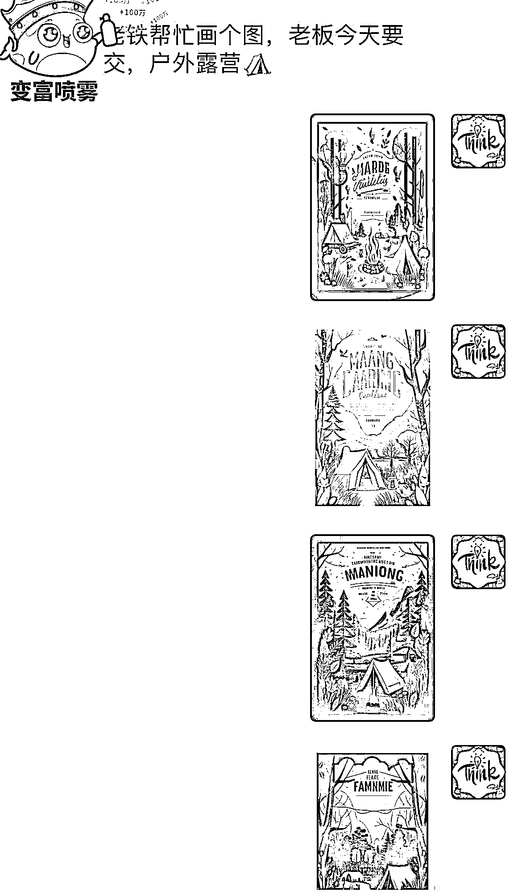 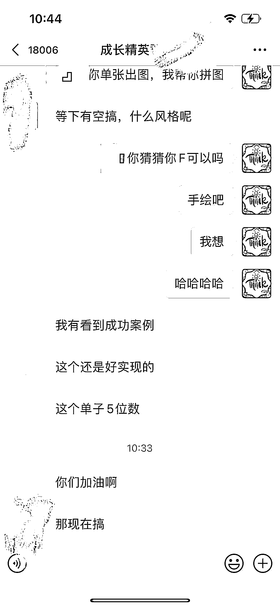

评论区：

茶叶蛋 : 可能⽅法⼤家都知道，就是缺这样的朋友 

🐵Sunday🐵 : 来，⼀起做朋友 

出海SEO孔明 : 图⽚⾥⾯的⽂字也可以⽤mj⽣成？ 

亦仁 : 中标，术值+1。 

在上⽅ #星球栏⽬ 专栏中，点击 #中标，可查看所有中标⻛向标。 

🐵Sunday🐵 : 他是⾃动⽣成 

晓光 : 再也不怕甲⽅刁难了，来多次都不怕 

红⽇ : mj是哪个软件 

阿满-擅⻓沟通 : 可以去今年2⽉的航海⼿册看⼀下，⾥⾯有详细介绍，也有你要的⽹站 (30赞)通过 AI 绘画来做服装设计，切⼊童装赛道 

作者： 斑⻢森林 

⽇期：2023-03-17 

AI的出现，解放了⽣产⼒ 

通过AI绘画来做服装设计，切⼊童装赛道 

作品分发到流量平台，根据数据反馈的情况

可以⾛预售，再找⼚家投⼊⽣产，降低成本

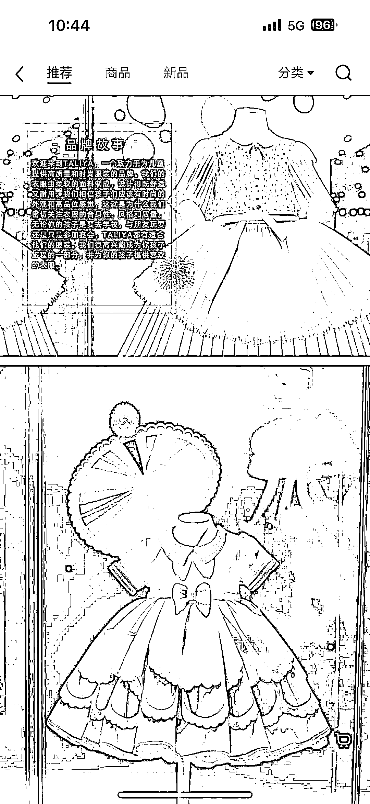 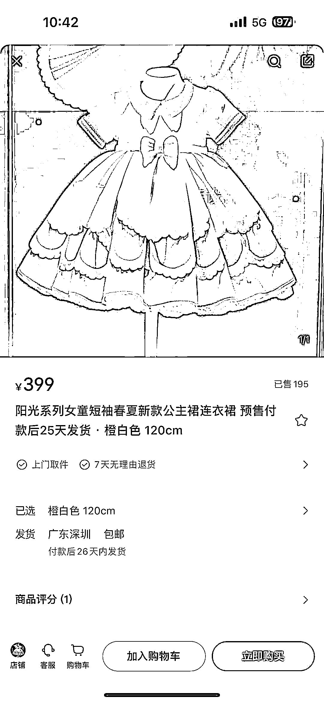 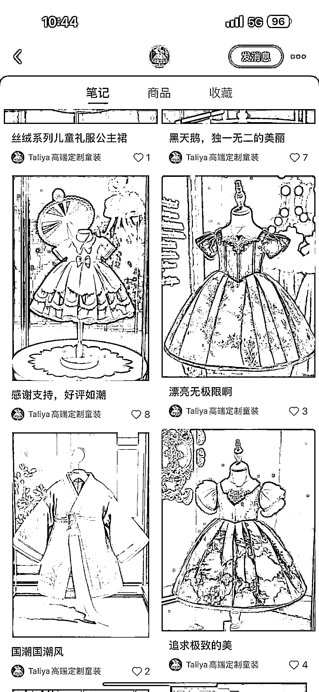 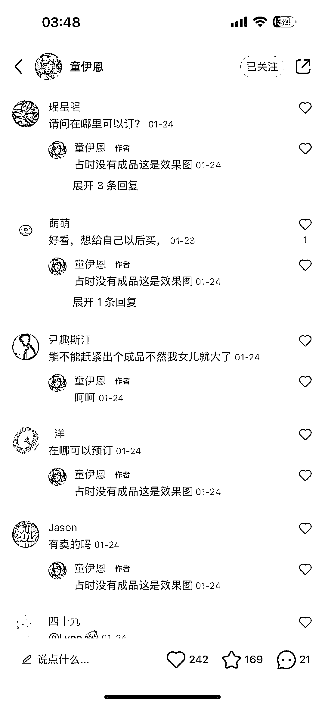

评论区：

亦仁 : 中标，术值+1。 

在上⽅专栏点击 #中标，可查看所有中标⻛向标。 

# (95赞)利⽤ AI 技术，⽆限套娃，出爆款视频 

作者： ⽺⽺⽺ 

⽇期：2023-03-03 

这个⽅法适合⽆法出镜，还有对着镜头话说不利索的⼈。⽐如我。。。

看到最近有个爆款。⼀个品有⼤量的达⼈带货。⽂案也是相同的。

说明，第⼀这个产品⼚家在有意的做推⼴投放。第⼆产品是这个品在旧有基础上做了⼀些微调整，平台对这样的新品有流量倾斜。

分析看⽬标⼈群都是⼀致的。是不是我们想办法往这个流量红利的品上去靠呢。

那⽤什么形式呢？⼝播的话，很多⼈⽆法出镜，对镜头说话都不利索。

那这个问题就变成了如何找到⼀个能够⼝播的⼈或者形象。

有⼀个解法是利⽤现在的AI技术。 

⾸先，⽤AI绘画做⼀个⼈物的形象。 

其次，⽤智能配⾳。配⼀段⼝播的⽂案。

最后，⽤AI⾃动视频⽹站⽣成⼈物的视频⼝播。 

同样的素材，不要浪费。把⼈物抠像，找⼀些相关内容的视频作为背景。⼜可以制作⼀批新的视频。

还可以继续复⽤。

①⼝播视频可以把声⾳去掉，只留下画⾯。

②找爆款⼝播⽂案利⽤AI⾃动配⾳。 

③再把视频和语⾳结合起来。就变成了⼀个新的爆款视频。

这种⽅式可以播⽆数的⼝播⽂案。

约束条件

1.年轻群体很容易就能看出来。是AI配⾳和画⾯。 

2.针对的⽬标群体是对画⾯没有特别要求，看重内容的群体。 

3.哪些群体呢？就是中⽼年⼈群。 

评论区：

A潘典 君和联⾏ : 好思路 

Nommy : 没看明⽩，这不就是数字⼈吗？已经有数字⼈的视频了 

陈远清 : 加个V，交流⼀下~ 

王⼤诗 : 加，wangdashi- 

交流⼀下⼯具细节

淡然 : 加个v，交流下 

⼦⻥ : AI绘画、AI配⾳、AI合成视频 

韵韵 : ai⾃动视频⽹站能推荐吗？ 

⽺⽺⽺ : ，新账号免费好像是10多分钟https://studio.d-id.com/editor (83赞)抖⾳ AI 绘画⼯具：批量起号，中年⼤姐切换不同场景 

作者： 东哥 

⽇期：2023-07-10 

图⽂ 抖⾳批量起号 AI绘画； 

AI绘画 中年⼤姐，切换不同场景； 

图⽚⼤字 ⽣⽇，送祝福。配⾳，要求点赞，互动，关注等。 

  

评论区：

⾏者 : 这个应该男粉居多，感觉后⾯应该会有相关⼈群变现的操作 

亦仁 : 中标，术值+1。 

在上⽅专栏点击 #中标，可查看所有中标⻛向标 

彦威 : 涨粉好策略[捂脸] 

鞭炮 : 有点意思 

从⼩就很帅 : 类似的可以ai⼀个最近特别⽕的秀才，吸引⼤妈粉[呲⽛] ⼀只鸵⻦ : 这个⾏[偷笑] 

强哥⼿记 : 怎么变现呢？ 

东哥 : 涨粉过千了，橱窗带货。 

# (精华帖)(470赞)⾸次参加 AI 绘画航海赚到⼈⽣副业第⼀桶⾦，来⽣财⼀年后我终于明⽩什么是“利他”

作者： 巴菲 

⽇期：2023-05-09 

⼤家好，我是巴菲，主业是个 996 程序员，⼀个潜⽔近⼀年的⼩⽩。第⼀次参加航海，便在 15000 ⼈中排名第⼆，短视频涨粉过万。⽽且直到参加这次航海，才发现⽣财这个平台，也很适合没有资源⼈脉的⼈开启副业挣钱，我就是这样赚到了⼈⽣副业第⼀桶⾦。今天我把⾃⼰这段经历整理分享给⼤家，希望能帮助更多尚未下场的圈友。

# ⼀、背景介绍

我是 2022 年 4 ⽉ 18 ⽇加⼊⽣财的。和⼤部分加⼊⽣财的圈友⼀样，怀着⼀颗仗剑⾛天涯的⼼。希望能在⽣财⾥⾯，发现财富密码，⽇进⽃⾦，⾛上⼈⽣巅峰。

刚进⼊的时候，发现到处都是宝藏，市⾯上主流的挣钱项⽬，在这⾥⼏乎能找得到。我甚⾄幻想着，⾃⼰要⼀下⼦找 3 个项⽬，同时做起来，那么我很快就能实现财富⾃由了。 我⼏乎是看到⼀个赚⽅法，就收藏⼀个。

但是直到我的收藏夹已经有⼏百篇⼲货了，我还是没有赚到⼀分钱。

这次的转机来⾃ 2 ⽉航海前，收到⻥丸关于新的航海的提醒。 

我⼼想，已经是第六期最后⼀次航海了，哪怕下⼀期不再续费⽣财了，那⾄少也要体验⼀下航海，进⾏⼀次实战，也不枉来⽣财体验⼀次。

就这样抱着试试的态度，我报名了⽬前⽐较⽕的 AI 绘画&chatGPT。 第⼀次参加航海，其实是有点畏惧的，是对陌⽣环境的恐惧。来到航海群，举⽬四望，⼀个熟⼈的 ID 都没有。因为之前从来没有链接过圈友，作为⼀个和⼤家完全陌⽣的⼩⽩，⼼中有些落寞，不知道如何融⼊这个实战团体。

当发现⼤家都是⽼朋友，我只能故作镇定⼩⼼翼翼的尝试第⼀次的发⾔。然⽽在接下来的 21 天⾥，我却慢慢的成了这个群⾥最活跃的成员之⼀。

⼦安在开船仪式⾥⾯说过了航海要做的五件事：

【共读】实战⼿册

【持续】探索实践

【举⼿】主动提问

【互助】热⼼解答

【⾼频】交流经验

这五句话深深影响了我的航海⾏动。

# ⼆、我如何通过航海实战从零涨粉

航海的第⼀天，我和⼤部分⼈⼀样，阅读了航海⼿册。⼿册内容太详细了，我看了⼀整晚，最后还是选择有侧重的去学习部分⽐较感兴趣和重要的知识点，并很快的能上⼿画出第⼀幅图。

航海⽇志模板，有⼀个设计特别不错，那就是⽇志的最后会要求必须写接下来的⽬标。

为了能给⾃⼰有⼀个努⼒的⽬标，我在第⼀天⽇志就⽴下了 7 天在短视频平台发布第⼀个视频的⽬标。

接下来就围绕着这个⽬标去⾏动。

航海的第⼆天，天辉教练授权我们使⽤他分享的内容。发到朋友圈，通过⼩额收费和朋友们⼀起学习。

当天晚上，我就发了朋友圈。我在朋友圈⾥⾯，巧妙的运⽤了原价 29.9，前 10 个报名的只需要 19.9 这样的⽂案。

第⼀天就卖出去了⼏份。成了群⾥第⼀个因为快速的执⾏⼒，得到了这次航海的第⼀个正反馈的⼈。

虽然变现不多，但是让我很快尝到成功的甜头。我把⾃⼰的这份⾏动经验分享到群⾥，得到了很多圈友的称赞。

他们纷纷因为我的⾏动⼒和乐于分享加为我好友，这给了我很⼤的信⼼。当天我也拿到了⾃⼰航海⽇志的第⼀件好事。

做对他⼈有帮助的事，并且得到⼤家的认可是会让⼈上瘾的，这让我更加努⼒想要学习和分享。

在航海的第三天，我已经可以从⼀开始的出图质量差的程度，变成能⽣成稳定的⼈物图⽚的⽔平了。

这在我看来是⼀个不⼩的进步，于是把这次问题解决的过程，记录到航海⽇志⾥⾯，意料之外的获得了好事和精选。

⼜⼀次让我意识到，在航海的每⼀天，积极去⾏动，努⼒解决问题，遇到困难在群⾥寻求帮助，不仅能提升⾃⼰的能⼒。也能帮助到其他圈友，得到⼤家的认可。

因此接下来的每⼀天，我都在不断钻研并解决问题并且把这个过程分享到群⾥，以及记录到作业⾥，因此⼤部分航海⽇志都是精选，得到了更多圈友的称赞。

再次让我体会到越分享越幸运，越分享越有收获。在利他的过程中，我成就了⾃⼰的 AI 绘画技术和⼈脉。

时间来到航海的第七天，我在抖⾳和⼩红书，同步更新了我的第⼀个作品，顺利完成了第⼀个七天⽬标。

 

并制定了第⼆个⽬标，七天后，抖⾳视频播放量有⼀个量级的提升，在第九天把这个量级设定为具体的数值，出个 10 万播放量的⼩爆款视频。 

但是第⼀个作品发布的 24 ⼩时之内只涨了个位数的粉丝，赞也是寥寥⽆⼏。第⼆天，我⼜发布了两个作品，效果都不好，点赞都是个位数。

发了三个作品都没有⼏个⼈看，属实对我有点打击。甚⾄有⼀个作品，被判定为低质量违规，让我更加受挫了，但是想到⾃⼰的⽬标，默默告诉⾃⼰不能放弃。

但我对⾃⼰的图⽚质量还是挺有信⼼的。毕竟很多圈友都夸好看的东西，必然不会太差。

我看抖⾳上⾯其他⼈，同种类型的视频，播放量都挺不错的。如果排除是作品质量有问题，那我要反思，到底⾃⼰和爆款的差距是什么。

我发现爆款视频的背景⾳乐听着很舒服，是不是我也可以拿来⽤。针对上⾯的思考与猜想，我把爆款视频的背景⾳乐拿过来⽤。搭配⾃⼰的作品看起来挺不错的，抱着试试的⼼态就发布了。

让我感到惊喜的是，⼀天的时间，就跑了 2 万播放量，涨粉 1000。当我发现出⼀个爆款，我⽴⻢⼜⽤同样的格式⼀天内共发了三个视频。

我的理解是乘胜追击，刷到我爆款视频的⼈，如果进我主⻚，肯定想看更多的同类型视频。

这样做有两个好处，⼀个是让爆款带动我新视频的流量，另⼀个是让新视频带来更多的关注，让⽤⼾确信关注我可以经常看到他喜欢看的视频。

时间来的第⼗四天，我并没能完成 10 万播放量爆款的⼩⽬标。其中最⾼播放量的视频是 7.6 万。尽管没达成⽬标，但也已经很接近了。

我在想如何制定接下来的⽬标，才能寻求更⼤的突破，实现真正意义上的跑通项⽬，做到变现。于是我定了接下来的七天⽬标，完成 AI 绘画⼊⻔课程的⼤纲。 

接下来的⼏天⾥⾯，抖⾳继续保持的快速的涨粉，⼩红书也快速涨粉突破 1000 粉丝。 到航海结束的那⼀天，抖⾳粉丝 8600，⼩红书粉丝 2700。 

 

这段时间⾥⾯，我没有花很多的时间去迭代视频。只是保持同⼀种⻛格和相同的更新频率，⼀天更新三个视频。然后把更多时间投⼊到课程的准备中。

# 三、我如何通过参加航海变现

接下来讲讲，作为⼀个 AI 绘画零基础的⼈，是如何通过参加航海进⾏变现的。 当我通过 AI 绘画软件⽣成的图⽚，在抖⾳出爆款涨粉之后，我就⼀直在寻求变现的⽅法。 我的图⽚属于好看的壁纸类型，可以通过分享图⽚引流变现。航海⼿册有介绍到可以通过引流到壁纸⼩程序变现，因此我通过抖⾳的⼩程序神图壁纸，进⾏引流变现。下载⼀张图⽚的单价有 0.27，⽤⼾开通会员有⼏块钱。

与此同时，我在灵创⼩程序发现了有推⼴合作的需求，抱着试试的态度，我加了他们的商务。

他们合作的要求是在短视频平台⾄少要有 5000 粉丝，⽽当时的我，刚好有 6000 多粉丝，刚好踩线符合要求，于是我⼜多了⼀个变现的渠道。

为了让抖⾳的流量更值钱，也为了能更好的推⼴灵创⼩程序，我改变了我短视频的变现策略⸺通过抖⾳引流对 AI 绘画感兴趣的粉丝到公众号，开发⼀套 AI 绘画的⼊⻔课程，通过绑定课程和灵创⼩程序。

卖课的同时也推⼴⼩程序，两个渠道⼀起变现。

想到好的⽅案之后，我⻢上着⼿准备课程的开发。

第⼀次开发课程没有经验，刚好想起有优秀的⼩伙伴在航海⽇志⾥⾯分享让 ChatGPT 帮忙做课程提纲。

我⼜回去复习了⼀遍，通过⼏次的修改便做好了课程⼤纲。

由于之前 ChatGPT 的账号已经不能⽤了，所以没有找到当时调教的过程的细节，我就简单的贴⼀下课程⼤纲出来的效果。刚出课程⼤纲的时候，21 天的航海也快结束了。 

但是航海的结束并没有打断我在 AI 绘画变现路上继续往前探索。 

课程⼤纲出来之后，尽管没有经验，课程质量还没有保证，没有时间，不知道什么时候能做好，没有⽅向，不知道课程要上架哪个平台。但是我就开始在朋友圈进⾏课程预售了。

因为航海期间⼀直在朋友圈持续分享⾃⼰ AI 绘画的成果。就靠⼀张简单的⼤纲宣传海报，第⼀天就卖出去了好⼏份。

也是因为这种⽋客⼾⼀个课程的状态，让我接下来在开发课程的时候，遇到困难都没想过退缩。

钱都收了，再⾟苦咬咬⽛也是要坚持把课做完。

经常是晚上加班到 9 点回家，写课件录视频到深夜 12 点多。 

所以会发现我的视频课程声⾳不⼤，因为怕说话太⼤声吵到了家⼈和邻居。

做课的过程其实是⼀波三折的。

因为⼀开始不清楚抖⾳的默认字体不能商⽤，ppt 的默认字体也不能商⽤。 我课程都录制好了，准备找平台上架了。还好咱们⼤航海的群友嘟嘟，知道我在做视频特意发到群⾥提醒我。

天呐！简直是毁灭性打击！

我昨晚刚熬夜录制的视频，今天⼜要重新录制⼀遍。怪我没有提前做好功课，太⼼酸了，想要放弃，想到钱都收了，算了吧，重头再来吧。

折腾了⼀两天终于把商⽤的字体改成免费的了。找到了平台上架，审核了⼀天之后。商务跟我说，因为我的 PPT ⾥⾯有出现微信号和公众号信息，没办法过审，需要修改。 

我才意识到，⾃⼰把⽔印打在每⼀⻚ PPT 上⾯，⼜要重头再来⼀遍！ 

离终点就⼀步之遥了，⼜是⼀次通宵达旦。想着好事多磨，希望就在眼前，⼜⽃志满满。

完成所有视频的录制之后，我终于松了⼀⼝⽓，可以安稳的睡个好觉了。

整个课程的制作，整整花了 20 天的时间。上架到平台的第⼀天，包括预售的部分，⼀共卖出 20 ⼏份。

虽然客单价不⾼，卖的数量也不多，但是已经感到很欣慰了。

为了提⾼⽤⼾的体验，我决定把课程做成 7 天的课程训练营学习模式。通过每天布置作业，来提升学员的参与感。

7 天的训练营结束，实事证明我的决定是对的。这样陪着学员通过每⼀次作业的进步，让他们喜欢上了 AI 绘画。在训练营结束之前就有同学问我有没有进阶的课程可以学习。很遗憾我没有时间开发进阶课程。

为了不浪费第⼀波转化的流量，我当机⽴断，决定创建属于⾃⼰的知识星球，并成功转化了 5 个客单价 399 的付费学员。 

我在 AI 绘画的变现道路，就是这样通过⼀⼩个台阶，⼀⼩个台阶的向上攀爬的。从最开始的单张壁纸价格的 0.27 元，到⽬前⼀个知识星球付费⽤⼾的 399 元。 

我还在持续规划中，后⾯还想推出客单价 999,1999...的付费服务，通过⼀对⼀指导帮助学员通过 AI 绘画短视频变现。

# 四、航海环境是如何对我涨粉和变现提供帮助的

如果没有参加本次航海，我不可能会⾃⼰去学习 AI 绘画。 

我⼀直觉得时间不够⽤，哪有时间去学习新领域的知识。但这次航海，我跟着完成了航海⼿册学习，⾼⼿分享学习，甚⾄跟着优秀的航海⽇志学习，让我随时调整错误的⽅向，更省⼒的快速进步。

我每天都会去翻阅精选⽇志，并学习他们分享的优质内容。

如何提升图⽚质量，我是看了精选的分享才有了启发。

如何提升短视频的播放量，我也是从学习别⼈的⽇志来的。

⽤ ChatGPT 出课程⼤纲还是看了⼩伙伴的分享，⾃⼰跟着⽤起来的。 我的⼀些⾏动跟优秀伙伴的分享息息相关，我的成果离不开他们利他的分享。

我的变现⽅法，则是来⾃航海⼿册的变现教程⾥⾯的，写着⼏⼗种变现⽅式的详细操作⽅法，并分析每⼀种适⽤的场景，我结合⾃⼰的情况，做出⽐较合适的选择。

# 五、航海⾥给我带来帮助的朋友们

在⽣财⾥经常听到⼀个词被提到，那就是“利他”。以前听并没有什么感觉，这次发⽣在⾃⼰⾝上才⾮常有感触。

我在⽂章前⾯有提到，刚进航海群的时候，我⼀个认识的朋友都没有。但正是这群与我素未谋⾯的朋友，却给我带来⾮常多的帮助。

⾸先感谢对我帮助⾮常⾮常⼤的两个圈友，⼦西和天辉。

⼦西是我的第⼀个贵⼈，我们很聊得来。她懂命理，同时涉猎领域⼴泛，对信息的筛选和总结能⼒强。她跟我分享了很多制作课程的⽅法，朋友圈运营，社群运营的⽅法。教我如何链接更多⼤佬，向⼤佬们请教问题，就是在她的帮助和⿎励下，我才有机会得到其他⼤佬的帮助。

同样对我⾮常⼤帮助的天辉教练。当我第⼀次带着课程⼤纲去请教他问题的时候，他⾮常耐⼼地倾听我的问题，并给予我很好的建议和指导。在他的帮助下，我改善了课程的不⾜点。

在卖课之前，他⼜教我如何打造个⼈朋友圈 IP，如何通过稳定的在朋友圈输出，增加⾃⼰课程的曝光，教我朋友圈运营。在⼊⻔训练营结营后，学员转化到知识星球服务的时候，⼜给我提供了很好的⽅案，帮助我顺利完成付费转化。

感谢领队何伟建，在航海期间，⼀直⿎励我们多去实战。看我经常认真记录航海⽇志，就建议我持续努⼒学习和分享，冲击排⾏榜。那时候，我才知道原来我已经在 AI 绘画的排⾏榜 top10。让我更有⽃志去冲击更⾼的⾥程，最后达到了 AI 绘画的第⼆名，同时也是航海全榜的第⼆名。 感谢饼公⼦，向他请教问题的时候，交流也很愉快，他也帮我解决很多疑惑，让我更坚定做课程的信念。

感谢嘟嘟 MD，我们两个很聊得来，经常会讨论⼀些问题，相互⿎励，在我课程⽤到付费字体的时候，第⼀时间帮我纠正。

感谢⼀三，指导我课程需要设置体验课，核⼼课，并教我如何转化。

感谢 Loiy 卢艺，给了给我课程售卖技巧的建议，通过具体数字的展现，宣传的时候让课程看起来物超所值，才更有吸引⼒。

感谢我们的组⻓向前，也⼀直给予我很⼤的⿎励。

感谢排⾏榜第⼀名的浅⾊ bug 的喵，虽然我们没有过任何交流，但是看到他分享的那么多优秀航海⽇志，学习到很多。然后也觉得⾃⼰的技术和他还有差距，让我更有持续努⼒学习的动⼒。

感谢和⻛，和他交流，给了我很多创作的灵感。

感谢同个群⼀起实战的圈友们，我们⼀起努⼒，相互帮助，互相成就。

# 六、写在最后

通过这次的航海实战，不管在物质上还是精神上，都让我收获很多。

从 AI 绘画零基础⼩⽩，到开展⼊⻔课程训练营，再到 AI 绘画联盟的合伙⼈。迈出了出圈的第⼀步，也让更多的⼈认识了我，也给了我很多的机会。希望我这次的分享能实实在在的帮助到还没有参加过航海的⼩⽩。

送⼈玫瑰⼿留余⾹，我⼀路⾛来受到太多⼤佬的帮助和指导。同样的我也希望能尽⾃⼰的微薄之⼒，帮助更多需要帮助的新⼈。

我已经申请挑战 5 ⽉ AI 绘画航海的教练和志愿者，如果你也对 AI 绘画感兴趣，那我们到时候⻅。如果你对航海或者 AI 绘画有疑问，欢迎来和我链接交流，⼀起⽣财有术。 

最后的最后，要感谢那个上班 996，却⼜在航海 21 天⾥⾯，每天下班后⾄少 3 个⼩时死磕实战的⾃⼰，课程制作过程中⼀次次出错从来未曾放弃过的⾃⼰，敢于每天分享经验的⾃⼰。

我也是个严重的社恐患者，但是我深知，默默的⾏动，独享成果，没办法放⼤⾃⼰⾏动的价值。

低调做⼈，⾼调做事！在航海⾥⾼调分享⾃⼰的经验成果，帮助他⼈，也能让⾃⼰被看到！在⽣活⼯作中⼜何尝不是呢？在⼀次次的分享中成⻓和积累⼈脉，你将有意想不到的收获！

从今天起，让我们⼀起⾼调的⾏动起来，⼀起⽣财有术！

评论区：

潇湘妃⼦ : 同为996的程序员，加个V？[偷笑] 

星⽉有⼼ : 感谢分享，对即将⾸次出海的我是⼀次及时的扫盲。让我更了解航海在做什么。感谢 巴菲 : 现在正是航海的报名时间段，我在 AI 绘画船上等你，我们⼀起冲[机智]巴菲 : 好的哈，相互学习[愉快] 

巴菲 : 冲〜 

⻜书何伟建 : 真棒👌 

梁⾠ : 棒棒哒 

⼀次就好 : 真棒 

# (35赞)妄图耍⼩聪明利⽤ AI 绘画制作 NFT 出售的⼈要注意了

作者： Jimmy Chen 

⽇期：2023-03-21 

妄图耍⼩聪明利⽤AI绘画制作nft出售的⼈要注意了。很多时候，你以为⾃⼰拥有了强⼤的技术，可以为所欲为，以为别⼈都想不到的时候，往往很容易掉到坑⾥。

今天，我就有⼀个朋友被骗了，我从骗⼦的⻆度，理了⼀遍思路：

顺⼀遍思路：

1.推特找⾲菜，⾼价求购nft，降低⼼理界限，让⼈变得兴奋 

2.事先通过让⼈点击⾃⼰的链接，或登陆⾃⼰的⽹站，获取对象的⼩狐狸钱包密码 3.说账号出现问题，并且提出是正常情况，并展⽰opensea与⾃⼰之前的沟通截图，要求往⾥⾯充值0.2ETH做⼀个保证，⾃⼰才能转账过去 

4.受害者往⾥⾯充值了0.2ETH，⽴⻢被转⾛（账号已被盗） 

5.再次说明这是正常情况，打感情牌，并保证承诺，再给0.2ETH就可以成功解决问题了（实现⼆次变现）

nft的意义很⼤程度上并不取决于图像的样⼦⽽更多是背后的⼀些东西。⽐如项⽬⽅，模式，信任机制，热度……

你本就毫⽆名⽓，别⼈为什么要来买你的画呢？

AI绘画虽然说的很厉害，但说到底，他是⼀个⻔槛极低的事情，写点prompt，⼤部分只要研究⼀下都能做。

所以在这件事情就不存在稀缺性了

那么⼜怎么能寄希望于通过单纯的AI绘画直接变现或者制作成nft轻松变现呢？ AI绘画仅仅是因为现在新，存在⼀个信息⻔槛，⽽且⼤部分都是英⽂预料的训练模型，因此也存在⼀个地域⻔槛。

所以很多⼈都可以卖课程教别⼈怎么作画，可事实上，这些东西在信息差慢慢变少，基于中⽂语料的模型慢慢发展起来后，就并不需要⼈来教了，甚⾄是不需要怎么学习的东西，就像吃饭喝⽔⼀样这次朋友虽然只是⼩⼩的损失了2k，并没有酿成⼤祸。但这件事也提醒了我，⼈性的贪婪很容易被利⽤，每个⼈都要警惕。

不要觉得谁会那么傻。

有时候，不是你不傻。⽽是给你的刺激还不⾜以引起你犯傻⽽已

保持⾼度警惕和思考🤔 

    

评论区：

亦仁 : 中标，术值+1。 

在上⽅专栏点击 #中标，可查看所有中标⻛向标。 