# (精华帖)(148 赞)新⼈⼩⽩ 30 天利⽤ AI 作画技巧，让我的作品快速变现的经验分享

作者： 饼公⼦ 

⽇期：2022-12-12 

哈喽~⼤家好，我是本次 AI 绘画⼊⻔航海的船员饼公⼦。毕业之后⼀直都在江西南昌的保险公司就职，主要是负责公司的某⼀条线产品管理和设计。

  

加⼊⽣财 8 个⽉，很幸运今年在 11⽉读了天辉教练的精华帖，于是去链接天辉⽼师。在天辉⽼师的教导和指点下终于有了⼀点点⼩成绩。

  

⽬前是"智慧之星"星球的联合创始⼈，AI 绘画关键词⼩群主讲⼈之⼀，接触 AI 绘画⼀个⽉，⼀周时间通过教学、关键词、定制画赚了⼩四位数，相⽐各位⼤佬的⽔平，还是略有不⾜，我相信能赚到第⼀块钱，那么未来有⽆限的机会。

  

随着航海⼀天天进⾏，我相信⼤家都已经对 AI 绘画有了尝试，最为基础的出图⻔槛都已经踏过了。渐渐的⼤家都从直接复制粘贴，开始转向对如何制作⼀个精美的图⽚和按照⾃⼰的想法出图的研究了。

  

那你有没有这样的疑问：提⽰词 prompt（以下均称为提⽰词）到底应该怎么写才好？如何才能达到⾃⼰想要的结果？为啥⼈家写的可以出好看的图，我不能呢？今天就分享⼀下好的提⽰词基本的书写⽅式和如何改写。

本⽂主要围绕以下⼏个⽅⾯来写，⽬录详看下图：

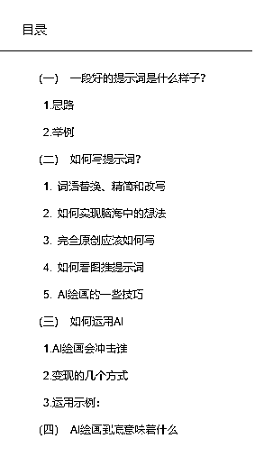

#   

# （⼀） ⼀段好的提⽰词是什么样⼦？ 

# 1.思路 

⾸先，我们要明⽩AI 绘画是能将你脑海中的画⾯呈现出来的⼯具。那么你脑海中的那副画⾯是要描述？那是怎么样⼦的⼀幅画？画中具体有什么？是⼀个⼈嘛？是⼈的话，是⼀个怎么样的⼈？⼈的具体情况是如何的？TA⻓的什么模样？穿的什么服装？在做什么？ 

你可以把它理解为你在拍写真照是拍古⻛?动漫?现代?⺠国?描述词，就是围绕拍照的这个⼈来由你给他穿⾐服，化妆。

设定好了主体⼈物⼈物，接下来，画⾯有没有背景？背景⻓什么样⼦呢？背景中有城堡?湖泊？还是其他？有什么特点呢？是⻩昏下的海边，还是夜晚的森林? 

  

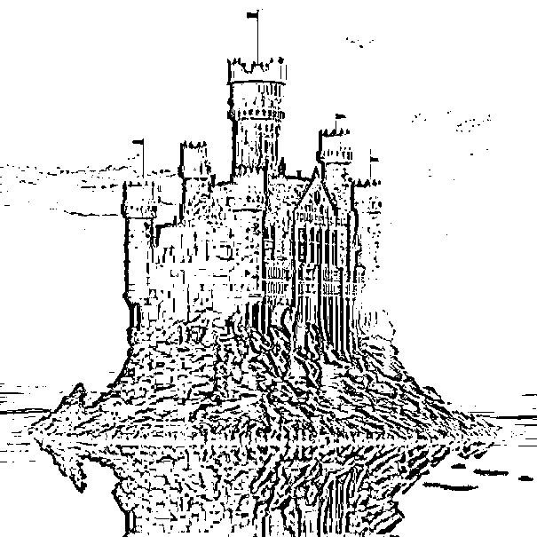

  

总结起来，每⼀个画⾯中的每样东西都可以找到⼀个规律：由整体到具体，⼤框架⸺主体内容⸺细节。

  

主体是什么？类别是什么？⼈类？动物？鲜花？

有什么特征？什么颜⾊？发光吗？处在光下还是在阴暗中？

次要的是什么？建筑吗？是⼭峦嘛？

⼀个画⾯，包含了主体，客体，背景等，⽽它们都⼜有⾃⼰的细节，

⽐如：

服装有 T 恤，衬衫等等。 

建筑有中式宫殿还有西式教堂。

通过这样的⽅法可以将所有元素都细分。

你在脑⼦⾥想到⼀个场景，要⽤AI 看得懂的语⾔表述出来，就像是你要说“落霞与孤鹜⻬⻜，秋⽔共⻓天⼀⾊”，⽽不要说“卧槽，好美”。

  

通过上述思路再简化，在脑海⾥思考⼀个⼤概的画⾯，然后通过公式来写提⽰词，可以简化为：

主体指的是画⾯中的主要部分，可以是动植物，⼈物，建筑，景物，幻想⽣物等。

对主体部分进⾏丰富的描述，就可以更精准的获得你想要的图⽚。

如：

⼀个⾮常可爱的蓝⾊兔⼦，站⽴着，⽿朵耷拉下来，⼿中拿着⼀个⾜球

A very cute blue rabbit, standing，ears down and a football in his hand 译⽂来⾃百度翻译

  

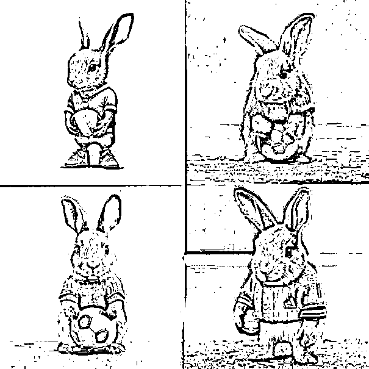

  

环境指的是画⾯中的背景、场景等。⽤来讲述，谁，什么物体，在哪⾥，周围是什么样⼦。

⽐如在⻩昏的沙滩边（By the beach at dusk 译⽂来⾃百度翻译）   

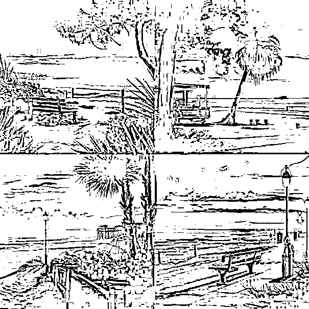

  

前后缀指的是对画⻛要求词，对引擎使⽤词，对整体效果的要求词，是⽤来⽤于确定图⽚的总体⽣成质量。

⽐如：8K，CG，masterpiece，by PabloPicasso，等等。   

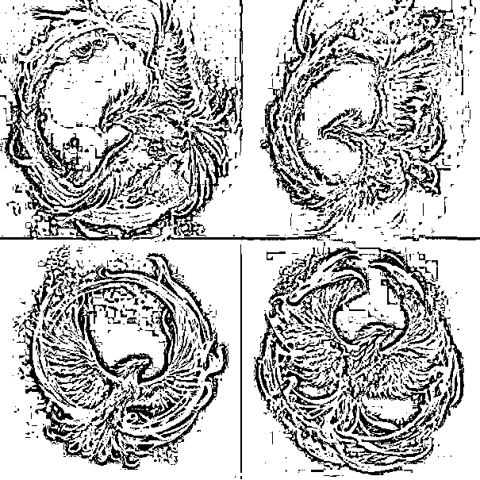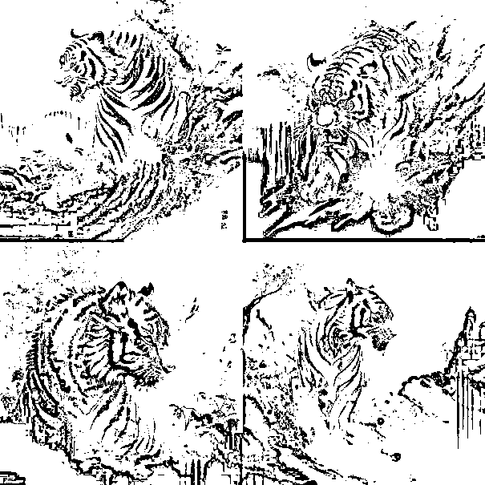

  

当然了，如果你没有对这些细节进⾏描述，那么 AI 就会帮你补全画⾯，只是这样的补全是随机的，出图的效果就像是开盲盒，有可能会出极为精美的图⽚，还有可能出效果很差的图⽚，但是绝⼤部分都是效果⼀般的图⽚，属于是没啥掌控感了。

  

  

# 2.举例 

接下来就⽤举个栗⼦吧，⽅便⼤家理解。

⽹上复制⼀个抖⾳爆款图⽚的提⽰词：

A magnificent crystal palace is above the clouds. The palace covered with pink flowers is surrounded by clouds and running water. Pink flowers, Atlantis, fAIry tales, dreams, clouds and mist, animation style, Miyazaki Hayao animation lighting effects, movie detAIls, trends in artstAIon, 8K, yevgeny Lu Xiping,HD --ar 9:16  --uplight - Upscaled (Light) 成品图效果是这样的：

  

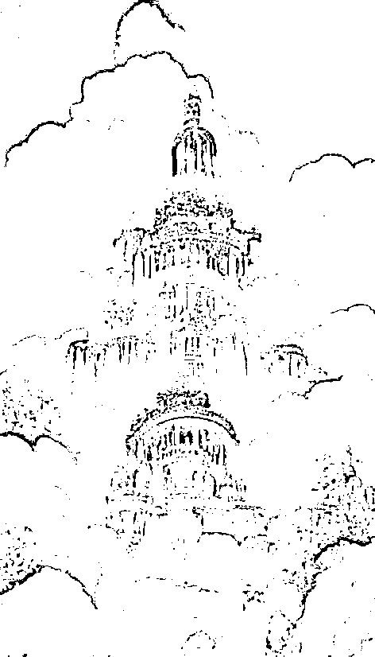

  

我们来看下分析⼀下这段提⽰词，我把他扔微信进⾏翻译，⽅便⼤家理解。

  

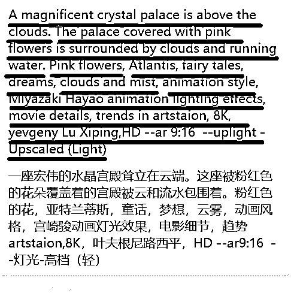

这⾥我通过划线的模式去帮助⼤家理解。

粉⾊划线部分是这段话中的描述“主体”的部分，告诉 AI 主体是个⽔晶宫殿，在哪⾥，还有粉⾊花是次要主体。

蓝⾊划线部分是描述“环境”，告诉 AI 这宫殿是被云和流⽔包围。 

⿊⾊划线部分是“前后缀”，告诉 AI 整体的⻛格的趋向，灯光效果，图⽚质量。   

通过运⽤这样简单的公式结构去分析别⼈的爆款、好看的关键词，是不是就简单多了？

那么接下来就讲讲改写关键词的思路。

  

# （⼆） 如何写提⽰词？ 

# 1. 词语替换、精简和改写 

从朋友那⾥得到了⼀段提⽰词，如下：

mono tone pAInting metro car in a abandoned platform,a little girl with fox ears and tAIl and white dress jumping next to the metro car,Japan animate style,colorful --v 4 （译⽂来⾃百度翻译：在⼀个废弃的站台上⽤单⾊画地铁⻋厢，⼀个狐狸⽿朵和尾巴的⼩⼥孩，⽩⾊连⾐裙跳到地铁⻋厢旁边，⽇本动画⻛格，⾊彩斑斓⸺v 4） 

把它扔进软件⾥，出图的效果是这样的：

  

  

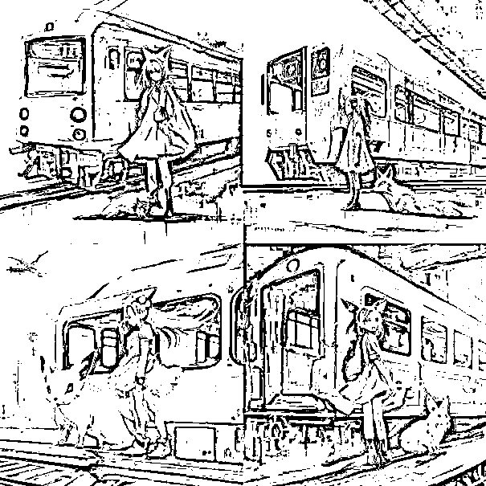

我进⾏⼀个⼩幅度改动：

⾸先是对主体进⾏保留，保留穿着⽩⾊连⾐裙的⼩⼥孩和狐狸，

接着环境的废弃站台上的地铁⻋厢，和⽅位是在地铁⻋厢旁边保留，

将前后缀中的⽇本动画⻛格改为⽔彩画，得到的⼀段提⽰词如下：

watercolor,metro car in a abandoned platform,a little girl,white dress,fox,next to the metro car,--v 4 

（译⽂来⾃百度翻译：⽔彩，废弃站台上的地铁⻋厢，⼀个⼩⼥孩，⽩⾊连⾐裙，狐狸，地铁⻋厢旁边，--v 4） 

扔进软件⾥，出图的效果是这样的：

  

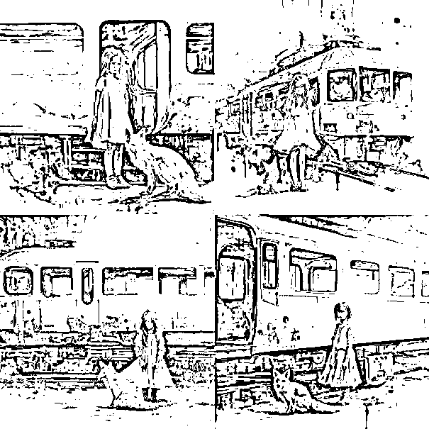

  

接下来我觉得我想再做⼀个变化，变得更简单⼀些，只想保留⼀个主体。

那么我在上⾯的提⽰词⼜进⾏了精简，得到的提⽰词如下：

watercolor, cute white fox,street--v 4 （译⽂来⾃百度翻译：⽔彩，可爱的⽩狐，街头--v4） 

依旧是符合之前的公式，这⾥主体只有 可爱的⽩狐狸，环境是 街道，前后缀是 ⽔彩画和 v4。 扔进软件⾥，出图的效果是这样的：

  

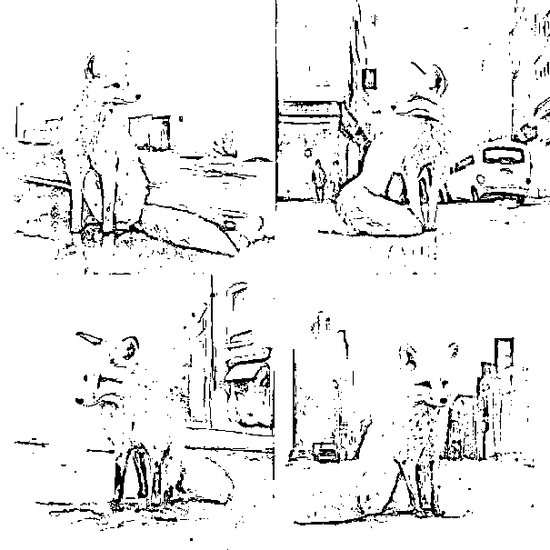

  

通过上述的改写，你觉得否称之为是⾃⼰原创了⼀段提⽰语？

  

再来引申⼀下，我只觉得画⾯中的⽔彩画是我想要的怎么办，我想通过⽔彩画来做⼀个有冲突的画⾯感的图怎么搞？那么就只保留⽔彩画好了，其他都改写掉。

简单按公式修改⼀下提⽰词：

watercolor,Cyberpunk City,night,street--v 4 

（译⽂来⾃百度翻译：⽔彩，赛博朋克城市，夜晚，街道⸺v 4） 

主体：赛博朋克城市；环境：夜晚和街道；前后缀：⽔彩和 v 4 

扔进软件⾥，出图的效果是这样的：

  

  

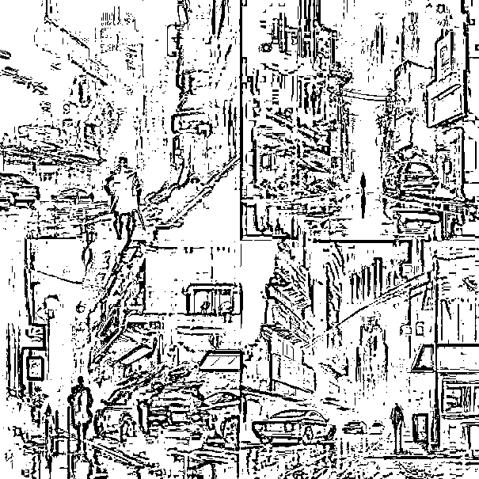

好像挺不错的，但是效果感觉没有达到啊，⽔彩的感觉没有出来。

这时候怎么办？我的答案是增加权重，告诉 AI 你不要瞎搞，我这是⼀副⽔彩画，强调⽔彩画的重要性。

提⽰语再次修改为：

watercolor::5,Cyberpunk City,night,street--v 4 （译⽂来⾃百度翻译：⽔彩：：5，赛博朋克城市，夜晚，街道⸺v 4） 

扔进软件⾥在测试⼀下，出图的效果是这样的：

  

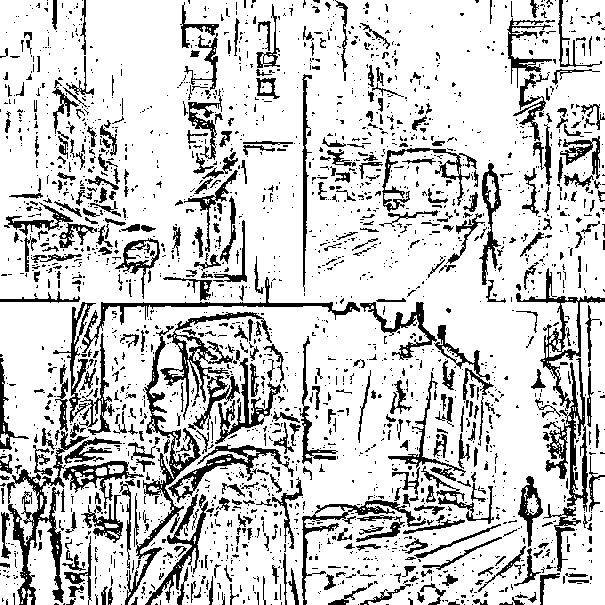

是不是⽔彩画和赛博朋克的冲突就体现出来了呢？

  

引申：关于权重的问题

权重的控制，这关系到你想要的东西是否获得了 AI⾜够的重视，根据基础 AI 的基础逻辑，越靠前的词汇越受到重视。同时还可以通过其他形式来调整权重。

在这⾥⽤Midjourney 举例，根据官⽅的使⽤指南。 

在⼀段词之后加上"：：数字"即可调整权重，基础权重是 1。 

经询问天辉教练，给出的答案是：

数字的取值范围⼀般是在 0~5 之间，0~1 之间（如 0.5）会降低权重，1~5 之间（如 2.5）的会增加词语的权重，超过 5 依旧会显⽰5 的效果。 

对了，官⽅给出的解释中，当你使⽤"--no farms"和"farms：：-0.5"会让这词语不出现在画⾯中。运⽤这个可以控制你不想出东西的。

  

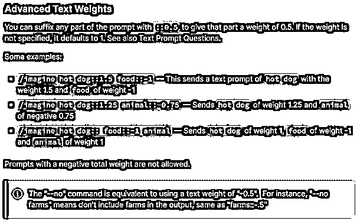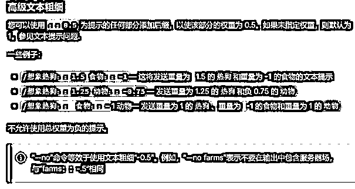

# 2. 如何实现脑海中的想法 

我在群⾥/抖⾳/⼩红书，看到⼀张好看的图⽚，也找到了相应的提⽰语，我要怎么变成我想要的图呢？ 举个栗⼦：

  

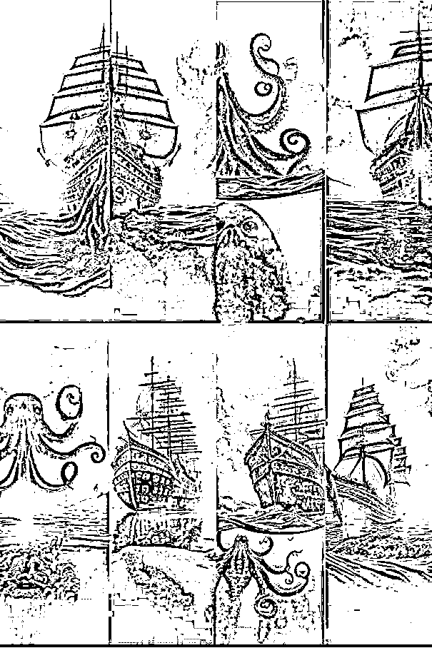

这是我看到⽊⽊在群⾥分享的⼀张图，然后她也把提⽰词贴了出来：

split screen, above water is a tall pirate shipbelow the water is a large octopus, sunrise,photographic, cinematic lighting, creative --ar 2:3--v 4 （译⽂来⾃百度翻译：分屏，⽔上是⼀艘⾼⼤的海盗船，⽔下是⼀只⼤章⻥，⽇出，摄影，电影灯光，创意--ar 2:3--v 4） 

  

我感觉不错，但是⼜有点和我想要的图不太⼀样。

我想要的是⼀张图⽚的左右两边是对称的，还要有中间被分割开来感觉。于是进⾏分析和改写。

分析：

主体：⽔上的船和⽔下的章⻥；环境：⽇出；前后缀：分屏、摄影、电影灯光、创意--ar 2:3--v 4 可以看到能让画⾯分开的是"分屏"这个词语，但是分屏明显不能达到我想要的左右对称的感觉，于是⾸先要替换的就是这个词，这⾥我想到的词语是“mirror image”，中⽂为“镜像”。这个词在⽜津词典的释义是可以让你的画⾯左右对称。

那么这个词可能会达到我想要达到“对称”的效果。

  

那么就只对这个词进⾏替换，改写后为：

mirror image,above water is a tall pirate ship, below the water is a large octopus, sunrise, photographic, cinematic lighting, creative --ar 2:3 --v 4 扔进软件⾥在测试⼀下，出图的效果是这样的：

  

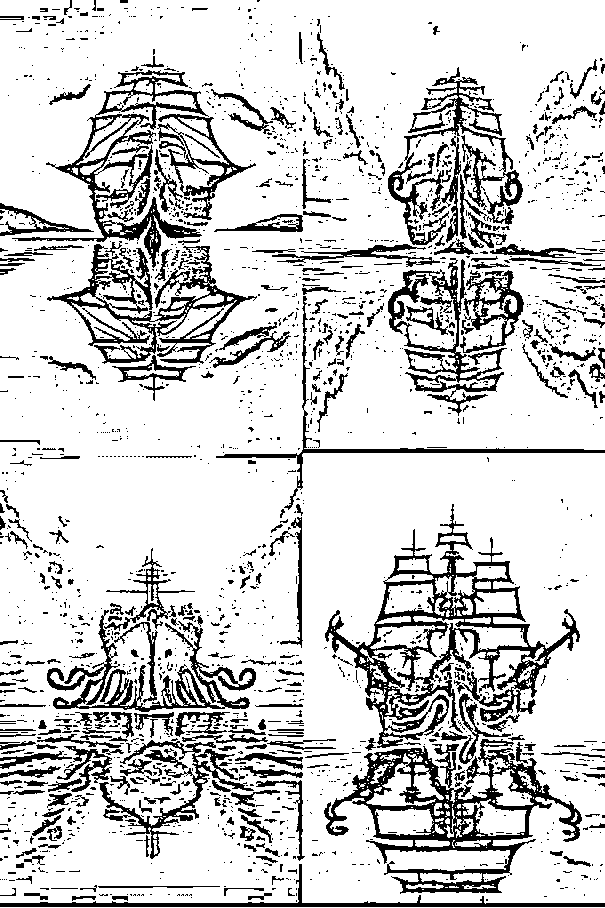

  

效果还不错，但是我还想要的左右割裂的效果没有达到。

于是再思考⼀下，什么样⼦的图即是对称，⼜是中间割裂呢？如何割裂呢？

我想到了颜⾊的冲突，对，让画⾯的左边和右边颜⾊表现不⼀致，但是画⾯保持镜像，是不是⼜对称⼜割裂呢？

于是对提⽰词进⾏添加，使⽤"half XX and half XX"的写法。   

修改后的提⽰词：

mirror image,above water is a tall pirate ship,half bule and half orange, sunrise, photographic, cinematic lighting, creative --v 4 扔进软件⾥在测试⼀下，出图的效果是这样的：

  

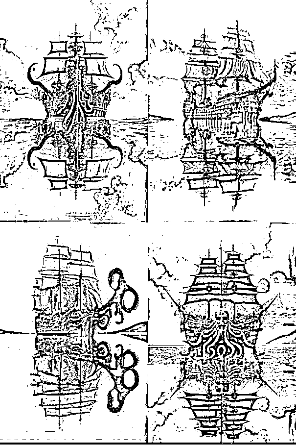

  

成功达到了我想要的效果，以上就是如何通过修改别⼈的提⽰词来实现⾃⼰脑海中的想法的举例。

总结⼀下就是：根据公式去分析原来的结构，然后提取其中⾃⼰想要的效果，接着加⼊⾃⼰的想法，进⾏测试。

我相信很快⼤家都能够写出令⾃⼰满意的关键词来。

  

# 3. 完全原创应该如何写 

当你熟悉了上⾯2 个⽅式之后，对于提⽰词⼀定是有了不少的理解了，但是还是会想，所有的都是基于别⼈的提⽰词，怎么能够满⾜⾃⼰的需求呢？不能完全原创的话，那就是只能够"有什么⽤什么"，⽽不是"⽤什么有什么"。 

  

接下来就是要告诉⼤家如何从零开始写⼀个好的提⽰词。

⾸先复习⼀下基本的公式： 主体+环境+前后缀 

基于这个公式，写下脑海中初步的构想的提⽰词：

①⼀个⼥孩，站⼀个赛博朋克城市中

masterpiece,1 girl,standing in a cyberpunk city --v 4 扔进软件⾥在测试⼀下，出图的效果是这样的：

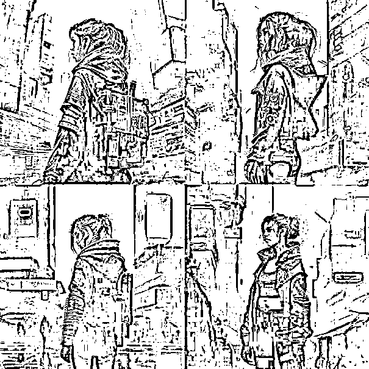

  

  

接着是按照扩句的思路把每⼀个元素都扩展，让画⾯随着你的思路来，加强掌控感。

②画⾯很真实，⼀个⼥孩，⽩⾊⻓头发，上⾝穿着⿊⾊棒球服，⾐服上有很多⾦属饰品，双⼿插在兜⾥，背对着观众，夜晚的赛博朋克城市正在下⾬，街道上还有积⽔，电影照明效果，realistic,1 girl,white long hAIr,wearing black baseball uniform,many metal ornaments on clothes,hand in pocket,facing away,night,cyberpunk city,rAIn,still water on the street,cinematic lighting--v 4 

扔进软件⾥在测试⼀下，出图的效果是这样的：

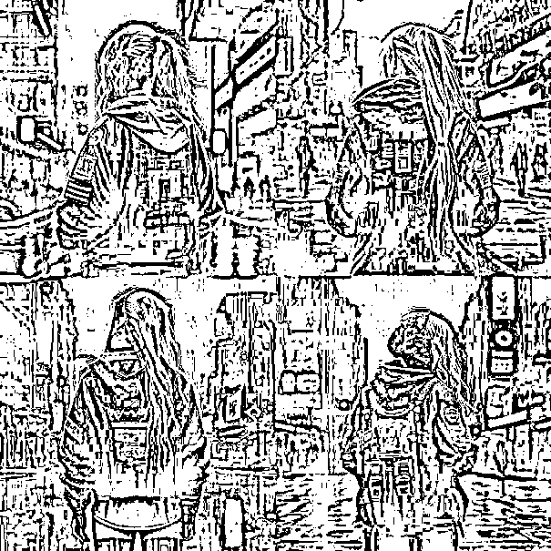

  

  

  

再来⼀个栗⼦：如何做⼀个可爱的头像？

⾸先，确定主体，在这⾥做⼀个可爱的⼥孩头像

①⼀个⼥孩，⽩⾊的背景，⽔彩画，上半⾝

masterpiece,1 cute girl, white background, watercolor, upper body--v 4 扔进软件⾥在测试⼀下，出图的效果是这样的：

  

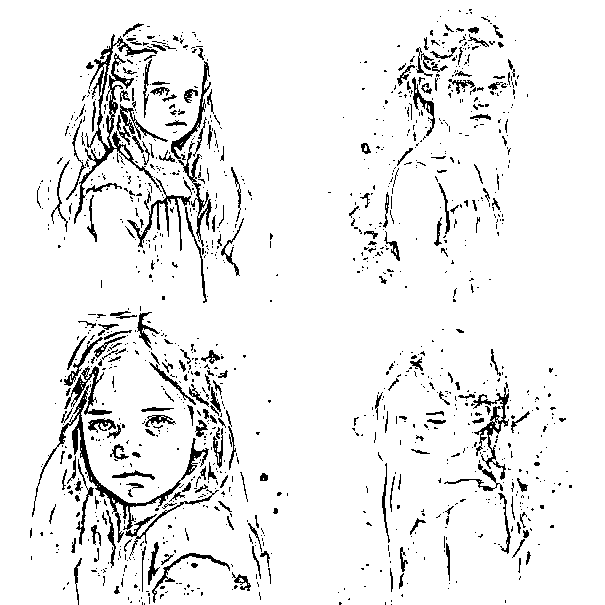

  

  

结果并不是我想要，那么再来扩句。既然是头像那么精致的脸庞必不可少，于是我还想要对五官和发型进⾏指定，上⾝的⾐服我也想要指定。

②⼀个⼥孩，⽩⾊的背景，⽔彩画，上半⾝，精致的眼睛和脸，蓝⾊的眼睛，精细的头发纹理，凌乱⿊⾊的头发，戴着⼀个红⾊蝴蝶发卡，穿着 T 恤 

masterpiece,1 girl, white background, watercolor, upper body，extremely detAIled eyes and face,blue eyes, fine hAIr texture, messy black hAIr, red butterfly hAIrclip, wearing a T-shir--v 4 扔进软件⾥在测试⼀下，出图的效果是这样的：

  

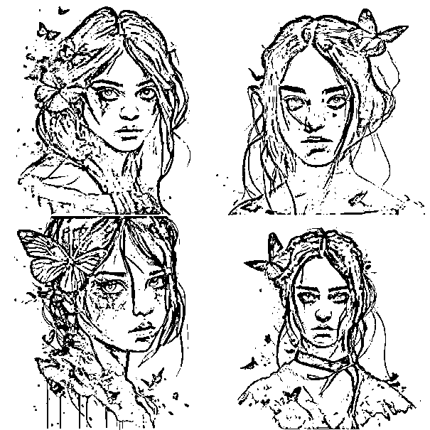

  

以上就是制作⼀个头像的思路。

注：以上测试出图均来⾃"画了个画"⼩程序，⽬前的 AI 绘画技术主要是基于 Diffusion 这个技术来的，只是框架和源码模型不同。各种⼯具的玩法其实差不多，⼤同⼩异。基础的写作理论都是通⽤的，你既可以⽤于 画了个画，也可以⽤于 SD，还可以⽤于 Midjourney、Nijidjourney，当然也可以⽤于 Novel AI。 

  

总结：根据公式  主体+环境+前后缀 

然后将你想要的内容套进公式⾥，每⼀项都进⾏丰富，就可以得到⼀个好的提⽰词  

# 4. 如何看图推提⽰词 

很多⼈都遇⻅过⼀个问题，我只是在抖⾳/⼩红书等平台看到⼀张图，觉得很好看，但是找不到它的关键词要怎么办？

①根据图⽚中的画⾯去“画廊”中寻找类似的图⽚，运⽓好可以直接找到原图。

②“画廊”中也找不到，那么试试 AI 识图，反推提⽰词。 

③我没有现成的⼯具怎么办？那就⾃⼰来“看图猜话”吧！

怎么做？还是基于公式 主体+环境+前后缀 

先去观察画⾯中什么是最主要的部分，有什么特征，先写下来。接着去观察整体画⾯的环境、背景中有什么内容，接着是加上识别的画⻛和⼀些常⽤提⽰优质画⻛的词语。

  

举个栗⼦：

航海过程中，有圈友发出⼀张图⽚问应该如何拆解：

  

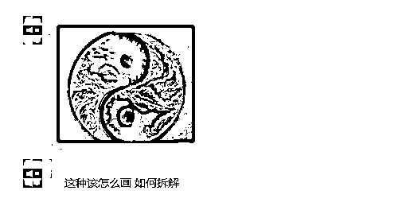

点开⼤图是这样的：

  

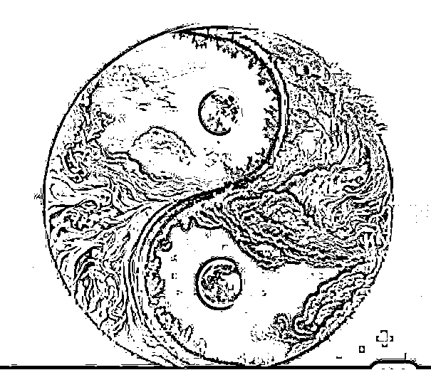

  

那么⾸先根据公式：主体是个太极，次要的有两个⽉亮，环境是云海，前后缀先只加⼀个环，对称，⽤v4 引擎。 

整合起来就是：

Yin and Yang, Symmetry, Ring, Cloud Sea, Moon --v 4 扔进软件⾥试试看：

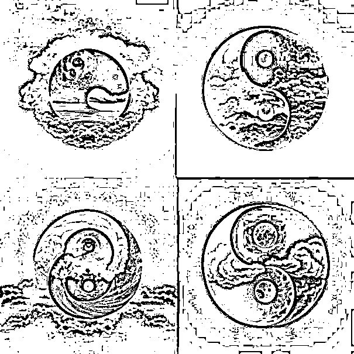

  

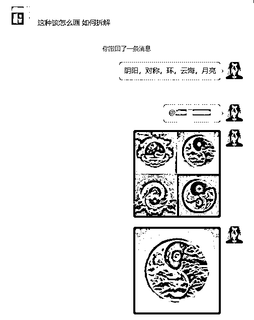

基本上有 70%-80%相似了，接下来就是细化和改造的问题了。 

但是我没有继续细化，因为我想要的是和别⼈相似，⽽不是⼀模⼀样，⼀模⼀样会出现抄袭问题。但是 70%-80%没什么关系，学习整个框架，剩下⾃⼰来改造，⽣成属于你⾃⼰的图⽚。   

④运⽤“⿊科技”chatGPT 

⽐如这样的：

  

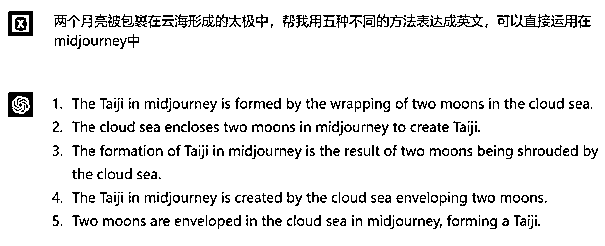

把你看到的画⾯描述出来，让 chatGPT 帮助你写提⽰词，⽤AI+AI。   

# 5. AI 绘画的⼀些技巧 

①优先符合“常识”

AI 在识别并⽣成图⽚的时候，会根据你的提⽰词优先去匹配是否符合“常识”逻辑， 当你的提⽰词不符合常识逻辑，那么 AI 就将其强⾏融合到⼀起，变成⼀种“怪图” 这⾥的常识包括⽣活、幻想、电影等等。

⽐如，要在⼀张图⾥看⻅“三视图”这个⻆度，就不符合常识，但是 AI 为了满⾜你的需求，就会强⾏融合。⽐如这样的

提⽰词：a iphone,three sided view 

  

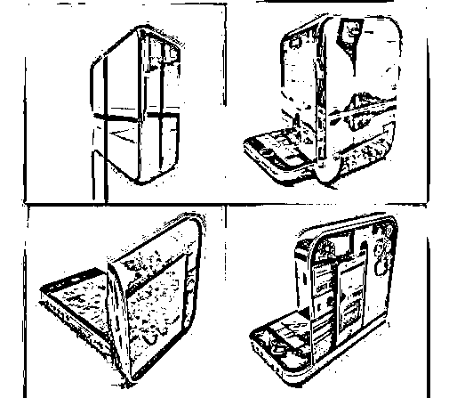

AI 确实给我出了个三视图，三个视⻆都看⻅了，但是图就很奇怪。 

那么在不违背常事的情况下，什么时候有三视图呢？

设计图，reference sheet，组合到⼀起提⽰词： 

reference sheet,iphone,three sided view --v 4 扔进软件测试 如下： 

  

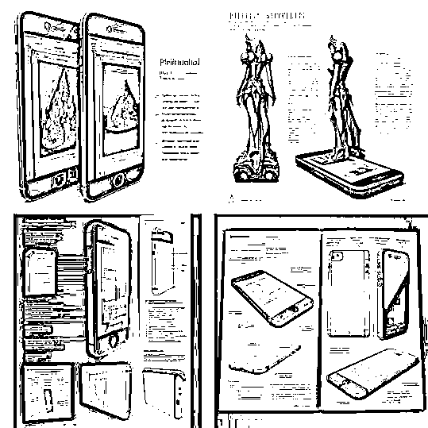

⾮常合情合理，没问题。

  

②主体与场景的⽐例

通过对主体和场景的权重进⾏调整，可以调整主体的⼤⼩和占⽐（权重的控制⻅上⾯的引申内容）；

另外对主体加强细节描写也可以调整主体的显⽰范围；还可以调整视⻆运⽤“特写镜头”，  

③画⻛对出图效果影响巨⼤

画⻛对出图的效果影响巨⼤，直接影响画⾯整体效果

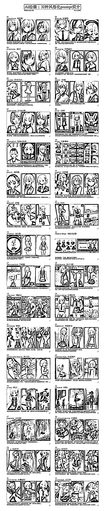

  

图源⾃⽹络，by suzakiz 

  

④为何我的画不好看？

第⼀种情况，运⽤的模型不理想。

第⼆种情况，也是最多的情况。是你没有定义清晰，描述不够具体。⽐如只告诉 AI 你要画⼀只猫，很可能效果不好。但是你告诉 AI 是⼀只可爱⽑茸茸的布偶猫，有着蓝⾊眼睛，戴着红⾊⼩帽⼦，蹲坐在地上。这样的效果肯定会好很多。

  

# （三） 如何运⽤AI 

# 1.AI 绘画会冲击谁 

①低端画师

②创意素材

③低端⼴告设计师

低端的⼀些简单的头像定制、⼈物图、同⼈图、创意素材，平⾯⼴告设计肯定是会受到冲击的，还有之前流⾏过的照⽚转⼿绘，随着 AI 绘画越来越强⼤注定是要被取代，这也是倒逼画师们、设计师们精进⾃⼰，越来越强，否则只能是被 AI 劝退。 

  

# 2.变现的⼏个⽅式 

①卖关键词

卖关键词已经在淘宝、咸⻥等平台屡⻅不鲜了，虽然价格低，但是量⼤依旧能赚不少钱。

  

②做教学课程、做社群

当你有了⼀定的技巧和稳定的输出能⼒，那么做教学和课程也是能够赚到钱的，卖铲⼦⼀直都会是⻔好⽣意。

  

③接定制

定制头像、图⽚、壁纸，SD⼯具上的私⼈模型，都是可⾏的。 

  

④做平台

程序员做好前端，把已有的平台通过 API 的形式去接好，做平台也是可以的。这⼀块我没有这个技术，只能是说个⼤概。

  

⑤我⾃⼰做了什么

刘润⽼师说，所有的⽣意都是把“⼈”（消费者）和“货”（商品）连接在⼀起，同时你要知道“场”在哪⾥。我个⼈选择的场是⼩红书，货就是我制作的画。

我从来也没有弄过⼩红书，纯粹⼩⽩⼀个，什么都不懂，我也不知道观众喜欢什么，我也并不最清楚是否会有⼈喜欢我的画，我能做的就是对标，找到我⾃⼰感兴趣的号主，看看别⼈的思路，保持⼀直发。

  

⼀开始发了两周也⼀直都没有流量，⼩眼睛基本不过百，点赞也只有个位数，评论根本没有。其实挺丧⽓的，也去问过天辉。告诉我在没有爆发前，号都是属于在泛流量的⼩池⼦⾥，没有平台不知道谁喜欢你的，没有流量很正常。要么蹭热度，要么保持⼀直发。

我⾃⼰倒是觉得先试试看，反正边学边做边思考，于是就⼀直坚持发。直到有⼀篇⼩红书点赞过百了，突然觉得挺有趣了，正向反馈总算是来了，更有动⼒去坚持了。

同时也开始了想要做原创的念头，于是精⼼制作了 poker 系列， 但是效果很不理想。 因为平台的规则，它是⼀个流量池⼀个流量池向上逐级递增的，刚开始的⼩号，粉丝基数少平台也不知道把你推给谁，这个时候的推送就是泛粉，点开某个标签进来看看的粉。他们不并定喜欢你的作品，不看你的作品也是正常事情。但是我初期突破不了⼩流量池，⽆法获得⼤的推送流量，主打的原创系列，直接就被这个随机性被埋没了。

天辉告诉我，前期这个阶段就是要追着流量⾛，哪⾥流量⼤，哪⾥有热点，就往哪个⽅向追，也就是要去蹭热点。先把粉丝基数堆起来，把曝光⼏率拉⾼，让第⼀时间看到你笔记的⼈，有更多想要点进来看的欲望，快速去突破初级的流量池。这样我的笔记才会有更⼤⼏率被更多的⼈看到，⼈多了，⾃然就会有喜欢你的⼈，形成⼀个良性循环。

在⽆⼈关注的阶段，要先追寻热点，快速起流量。

当你出现爆款时，追着爆款发，积累起垂直粉丝。

当你的粉丝多起来后，之前的爆款不新鲜了，这个时候再求变化。

同时还有⼀点要注意的，不是哪个爆款就要追哪个，⽽是与⻓期规划要有关联。找寻到爆款中爆款因⼦，想⼀想这个爆款图与其他的笔记之间有什么不同，将之运⽤起来。

于是在这个没有流量的阶段，我停下了发 poker 系列的脚步，转头去寻找属于我⾃⼰的“爆款因⼦”。

去寻找先让⾃⼰⽕起来的⽅式，等待之后爆发再去继续我的 poker 系列。   

慢慢的在⼩红书上开始有⼈想和我学习技术，也有⼈找我定制头像。渐渐地到和⼩伙伴们组建社群，做关于思考、拆解的分享。我⾃⼰做社区，并不是只分享关键词，⽽是拆解，告诉⼤家如何去做⼀张这样的图。⼤家在学习之后能够⾃⼰动⼿、修改形成新的头脑⻛暴，让⼤家脑海中的画⾯呈现出来，让每⼀个⼈都变得更优秀。

  

  

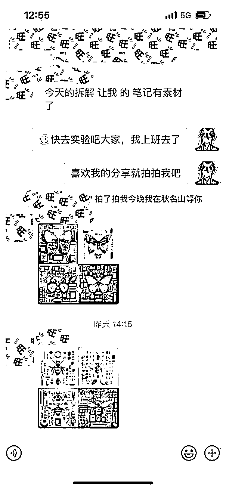 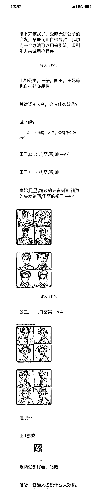

  

# 3.运⽤⽰例： 

l 三视图 

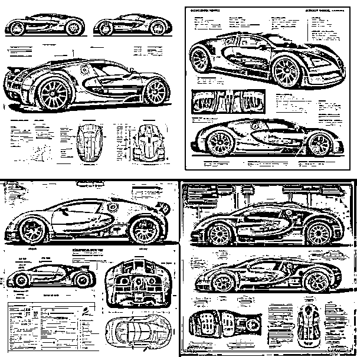

  

l 拆解图 

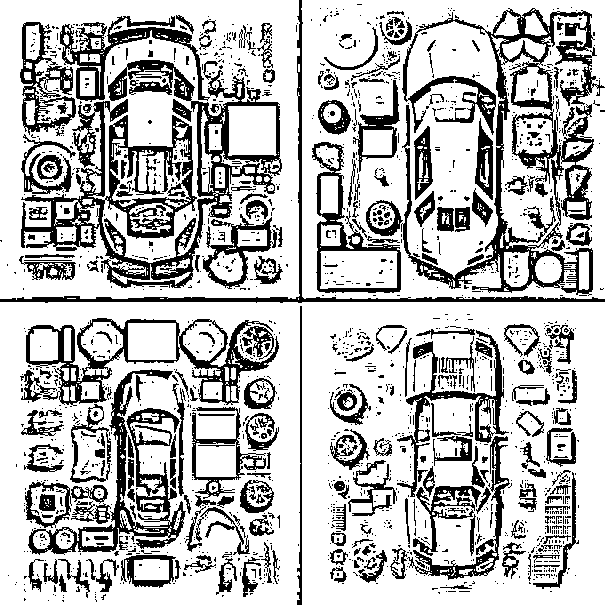

  

l 设计蓝图 

  

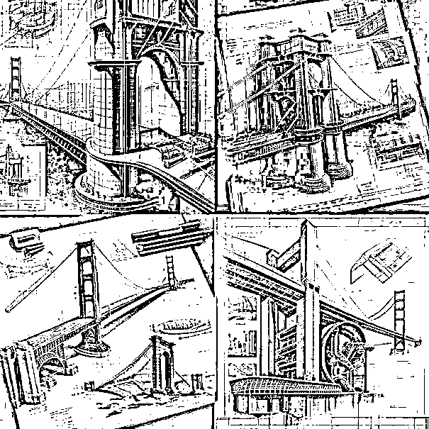

l ⼈物设定图 

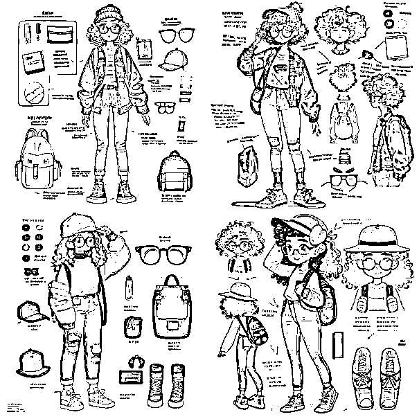

  

l UI 图 

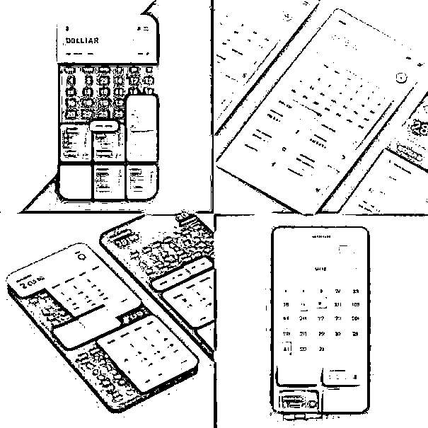

图源⾃@刘楚宾 

l 渲染图 

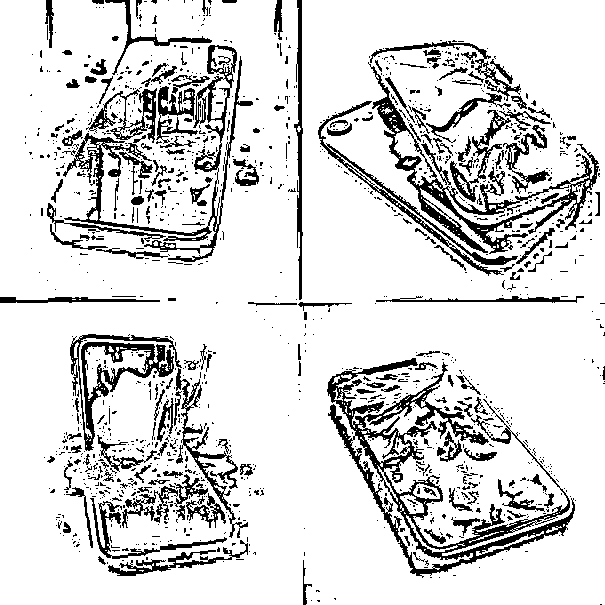

  

l ⼴告创意图 

  

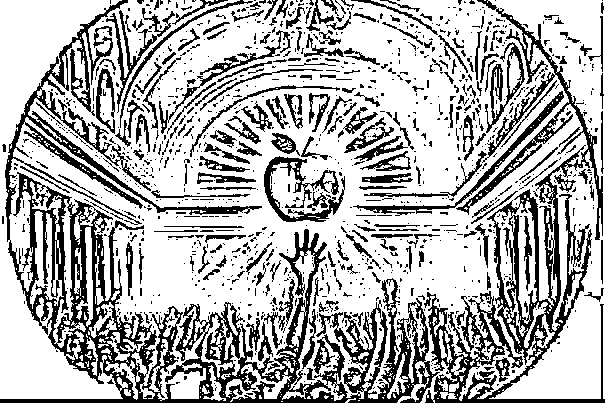

图源⾃⼩红书

l 产品 kv 图 

  

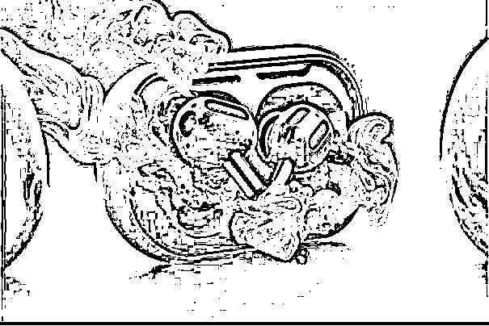

图源⾃⼩红书

l 投放效果图 

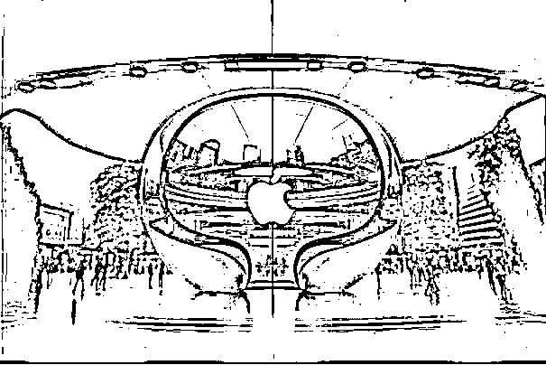

图源⾃⼩红书

l 环境建筑效果图 

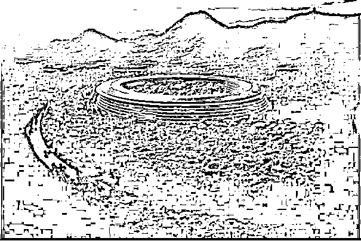

  

图源⾃⼩红书

#   

# （四） AI 绘画到底意味着什么 

AI 绘画终究是⼀个⼯具，并不能完全取代画师，但是起码可以帮助普通⼈，⽤较低的成本去描绘出脑海中浮现的画⾯。

同时，他在⾼级创意⼈员的⼿中，成为了创意辅助者，可以快速的开启头脑⻛暴，⽣成草图，极⼤的加快了整个设计进度。

还意味着⼀个“内卷”的时代开启，普通⼈也拥有了⼀般画师、设计师的⽔平，倒逼从业⼈员研究新的⽣存⽅向。

说到底，个⼈觉得 AI 绘画本质就是光影的艺术，到了最后⽐拼的还是基本功和创意思路。⽐如艺术鉴赏能⼒，分析组合能⼒，对⼯具的掌握熟练程度。AI 只不过是帮你快速把脑海中的图像呈现出来，然后给出很多⽅案去选择。现在有了 chatGPT，有很多差距更可以被抹平。或许，AI 这个⼯具不是⽤来追⼀张图的效果，⽽是从⼀张图拿到灵感去创作属于⾃⼰的作品。

  

⼤家现在要做的就是掌握这⻔技巧，平台软件有很多，但是基础底层逻辑是⼀致的，掌握了就⼀通百通，不必为了挑选⼯具⽽去浪费过多的时间。快速去熟悉⼀个⼯具，运⽤最省⼒原则，怎么简单怎么来，先上⼿，先做起来才是重点。就像是你会⽤office，还能不会 wps 吗。学会了驾驶技能之后，驾驶⼤众和宝⻢其实难度都差不多不是吗？

⻛⼝刚刚开启，腾讯和微博也才刚起步⼊场，未来的想象空间也很⼤。希望每个⼩伙伴都能在这⾥赚到属于⾃⼰的那⼀份财富。

  

最后感谢⽣财可以给到⼀个让我发光发亮的平台，感谢从⼈群中发现我的天辉教练，给我帮助的有饭助教，⾖⼦⼩姐姐，筑梦⼤佬。感谢⼏位⼀起努⼒的⼩伙伴：⽊⽊｜终⾝成⻓践⾏者、阿狸、诗农、刘楚宾。没有⼤家的帮助我⼀个⼈也难以⾏进下去。

感谢⼤家抽出宝贵的时间观看，谢谢！

  

评论区：

宅⽆恙 : 先赞后看👌 

林伟焕 : 宝藏帖⼦，常看常新 

饼公⼦ : 感谢🙏 

饼公⼦ : 谢谢[呲⽛] 

⻜扬 : 饼公⼦yyds，发现叫饼的都贼厉害，我应该改名[呲⽛] 

饼公⼦ : [可怜]太夸奖了 

liliya : 太极的图最棒了 

清华 : 太精彩了！饼公⼦对我技术⻓进提供了莫⼤的帮助[憨笑] 
