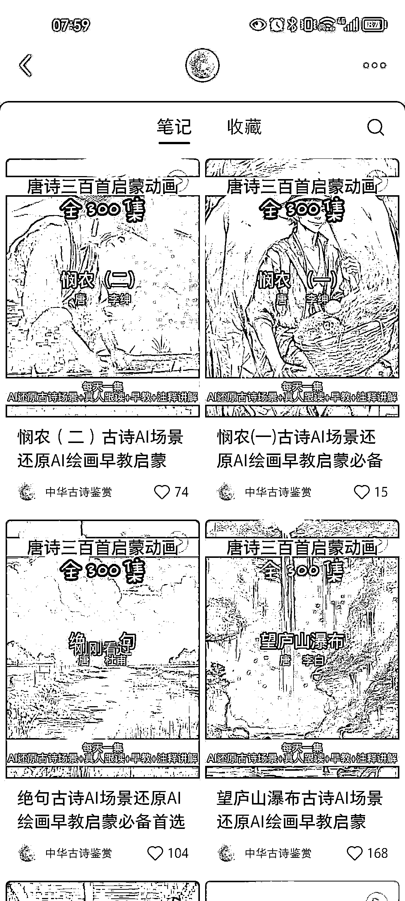
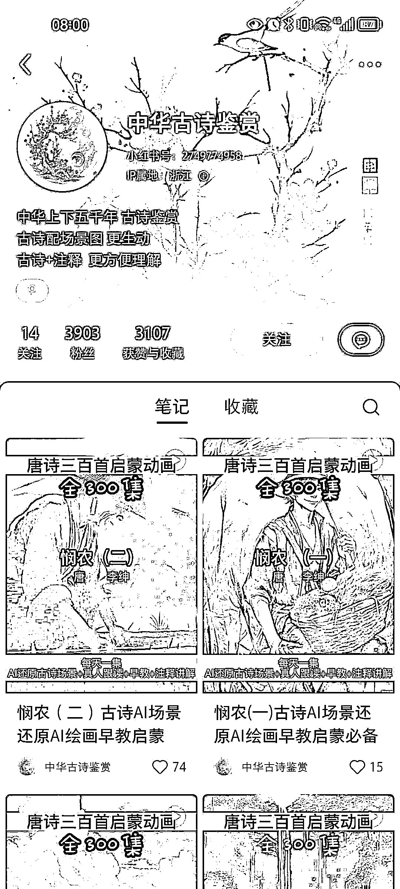
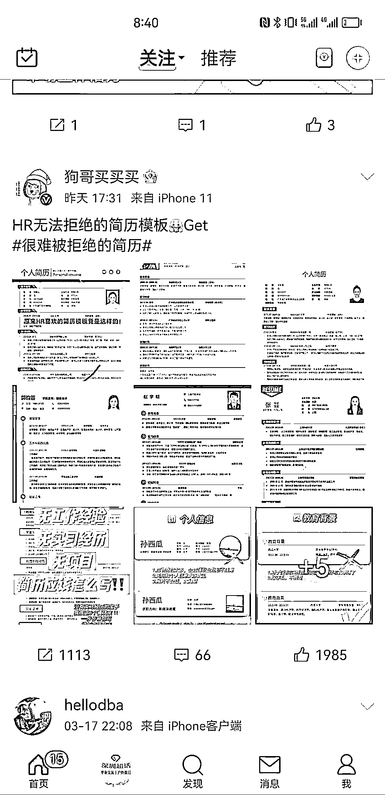

# (140 赞)AI 绘画唐诗 300 ⾸，涨粉近 4000，适合批量⽣产和教育场景 作者： Daemon 

⽇期：2023-06-30 

另类⼩说推⽂，将唐诗 300⾸⽤ai 绘画，每句诗⽤sd⽣成⼀张图⽚，发了 12 个视频，涨粉近 4000。 适合直接批量⽣产，也可以应⽤在特定场景下，⽐如⼩学⽣必背的 XX⾸唐诗/宋词，“孩⼦不喜欢背诗，让孩⼦爱上诗”等等

 

评论区：

万简 : sd 是什么 

Daemon : stable diffusion 

亦仁 : 中标，术值+1。 

在上⽅专栏点击 #中标，可查看所有中标⻛向标 

万律师 : 这个刚和在⼩红书看到的⼀个思路契合，还准备发⻛向标呢 

mikan 阿橘 KK* : 这种号怎么变现呢？ 

o 吉吉积极向上 : 有需求就有产品 

伟业 : 理解：利⽤AI 绘画为古诗配图，吸引⼩学家⻓，解决孩⼦不爱学习古诗的问题。变现可以引流私域，卖⼩学⽣的教培课程

⼩⽩脸 : 这个创意我之前想过，可以做成绘本，但是不知道是不是牵扯版权问题。 (35 赞)通过 AI 绘画⾃动⽣成简历等资料发布到⼩红书引流 

作者： 上川书记 

⽇期：2023-03-21 

最近看通过 ai 绘画⾃动⽣成简历等资料发布到⼩红书引流。微博上，普普通通的简历都有这么⾼的流量，如果那些⾼质量的发布上去应该流量不错。

 

评论区：

亦仁 : 中标，术值+1。 

在上⽅专栏点击 #中标，可查看所有中标⻛向标。 
