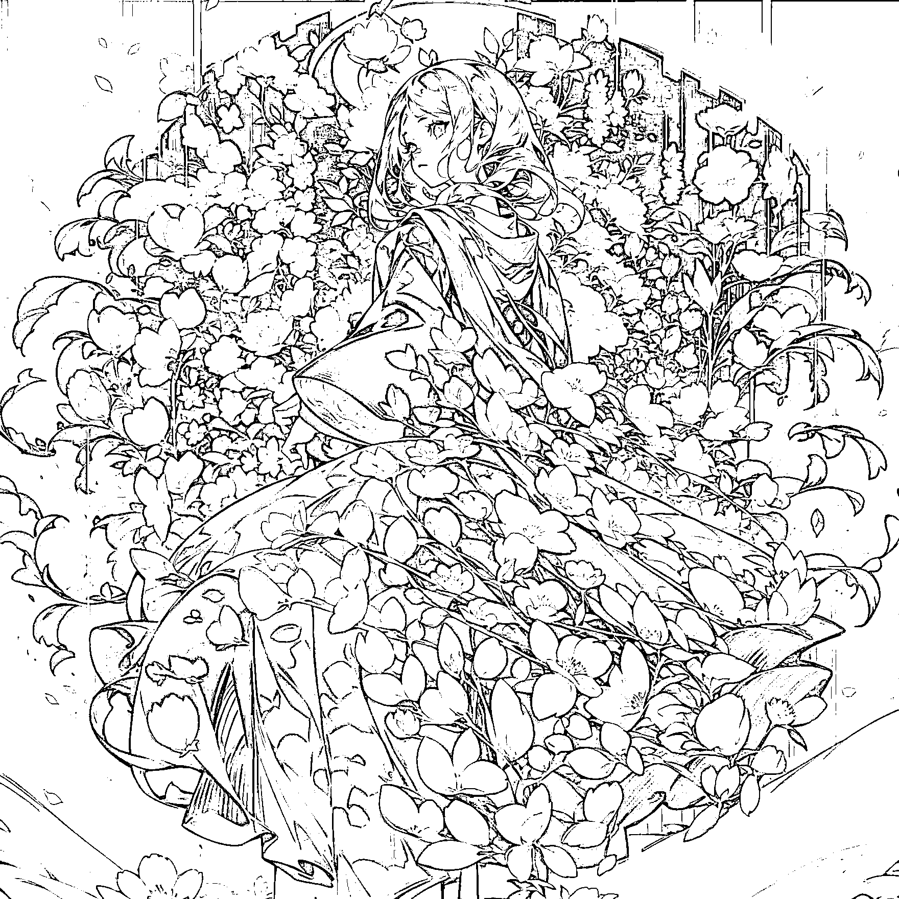

# (精华帖)(144 赞)⼀⽂讲透如何⽤SD 制作出来⾼质量艺术⼆维码 

作者： 明⽉ 

⽇期：2023-07-11 

⼤家好，我是明⽉。

艺术⼆维码已经出来⼀段时间了，市⾯上的教程也满天⻜。

但是我⼀直都不太满意⽬前市⾯上的效果。

直到最近，才研究出来⼀个令我⽐较满意的效果，且能够稳定出图的⽅法。

⽂章内⼲货内容⽐较多，不太适合 0 基础的 AI 绘画⼩⽩。 

为了更好的阅读体验，⽂末有⻜书链接

https://hdjmn9shgs.feishu.cn/docx/OUYOdKSwzoHS8pxpeRNcRcdqnHh 

评论区：

热⼼⽹友⼤表哥 : 不⾏啊，打不开了[撇嘴] 

復 : 试试第⼆条 

⽼吴说投资 : 你重新编辑。然后把⻜书链接回⻋键按⼀下，链接要出来，才能阅读。 嘉赫 : https://hdjmn9shgs.feishu.cn/docx/OUYOdKSwzoHS8pxpeRNcRcdqnHh 歧⻩之后 : 这个可以，等下实操⼀下 

伟业 : 实操⼀下发结果[偷笑]，欢迎链接 

明⽉ : 调整了⼀下链接，这下能点开了[呲⽛] 

明⽉ : 感谢 
