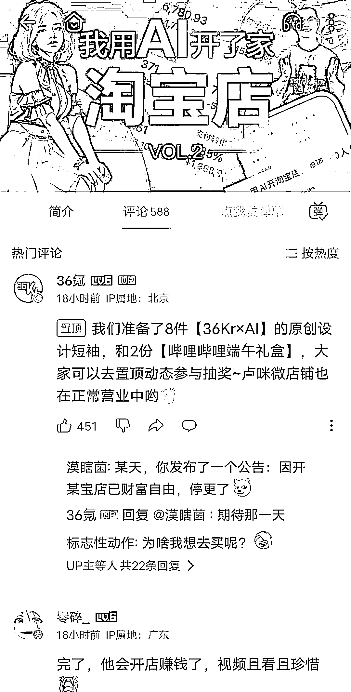

# (98 赞)36 氪 AI 淘宝店⼀个⽉卖出 200 件，分享从 0 到 1 的踩坑经验 作者： ⼟⾖君 

⽇期：2023-06-15 

36 氪 AI 开的淘宝店成真了，⼀个⽉卖了快 200 件 

⼀个⽉前 36 氪开了个 AI⾐服淘宝店，没想到⼀个⽉还有后续，他们跑通了 0-1，⼀个⽉卖了 200 件，太厉害了，昨天发的视频分享了他们从 0-1 的踩坑经验，可以说是⾮常实⽤的教程。 【【36 氪】我⽤AI 开的淘宝店成真了，⼀个⽉卖了快 200 件！-哔哩哔哩】 【【36 氪】我⽤AI 开了家“假”淘宝店，居然真的有⼈下单？-哔哩哔哩】 https://b23.tv/XAgVYImhttps://b23.tv/mKIZnTg 

评论区：

亦仁 : 中标，术值+1。 

在上⽅专栏点击 #中标，可查看所有中标⻛向标。 
