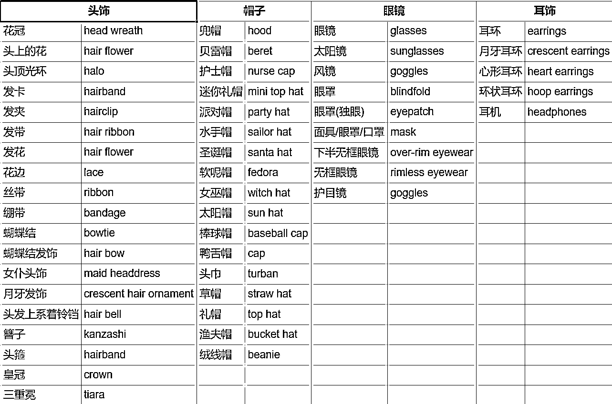
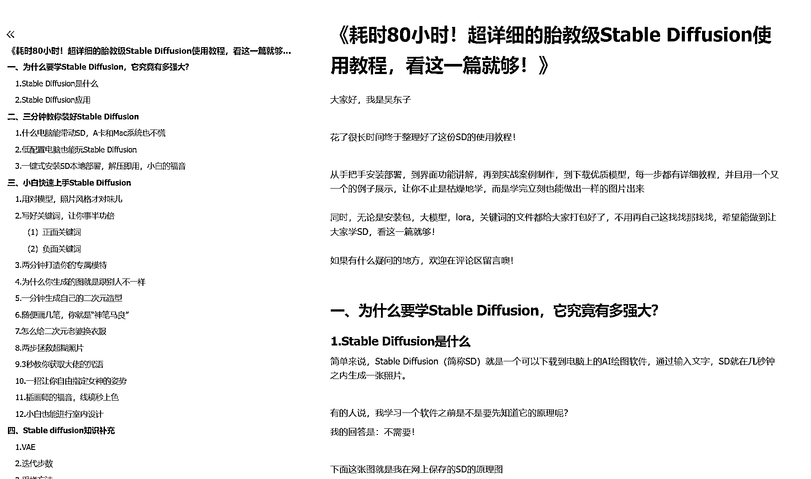
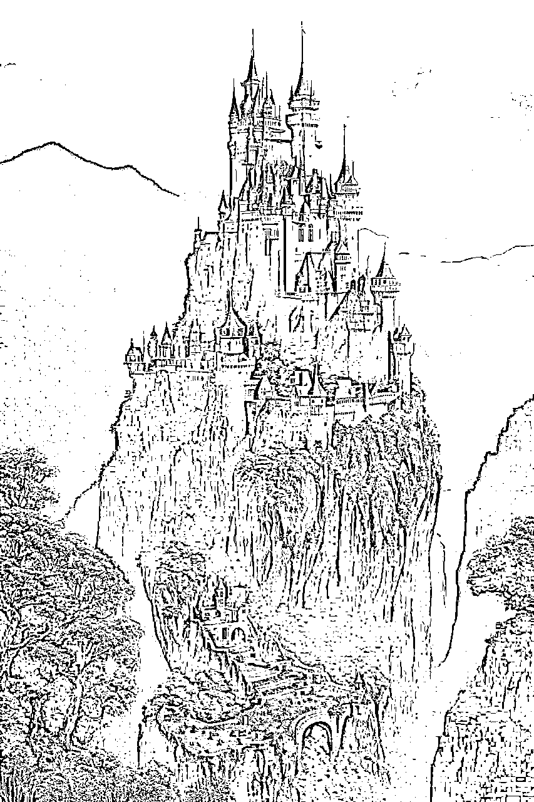
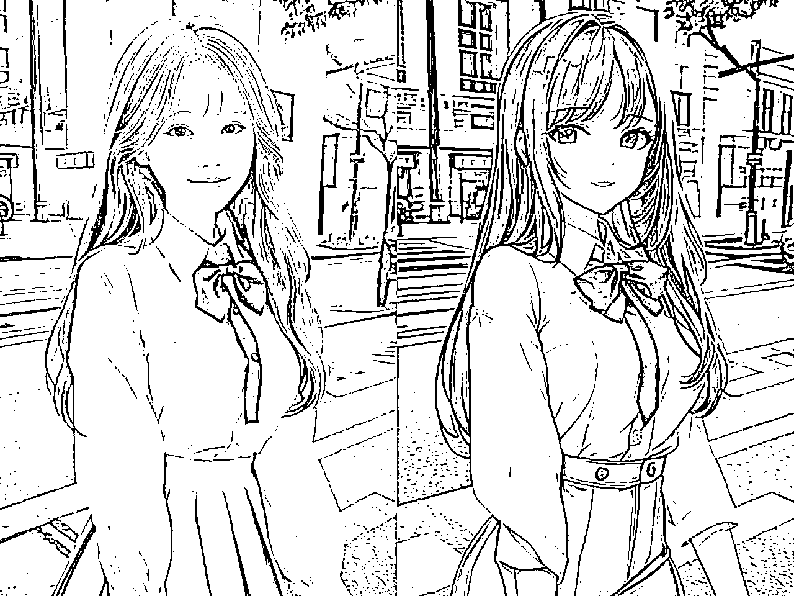

# (精华帖)(640 赞)超详细的胎教级 Stable Diffusion 使⽤教程，看这⼀篇就够！

作者： 吴东⼦ 

⽇期：2023-05-08 

《耗时 80⼩时！超详细的胎教级 Stable Diffusion 使⽤教程，看这⼀篇就够！》 ⼤家好，我是吴东⼦。花了很⻓时间终于整理好了这份万字 SD 的使⽤教程！ 从⼿把⼿安装部署，到界⾯功能讲解，再到实战案例制作，到下载优质模型，每⼀步都有详细教程，并且⽤⼀个⼜⼀个的例⼦展⽰，让你不⽌是枯燥地学，⽽是学完⽴刻也能做出⼀样的图⽚出来！

同时，⽆论是安装包，⼤模型，lora，关键词的⽂件都给⼤家打包好了，不⽤再⾃⼰这找找那找找，希望能做到让⼤家学 SD，看这⼀篇就够！ 

如果有什么疑问的地⽅，欢迎在评论区留⾔噢！

为了更好的阅读体验，⼤家可以移步⾄⻜书

https://ry5hwpuf7b.feishu.cn/docx/HYrZdLBMRorB0qxKqFFcQ075nWf 

  

评论区：

GEWO.GUO🌪 : ⼤写的⽜逼 

+⻰ : 谢谢，边收藏边看[呲⽛] 

愚者 : 怎是⼀个“⽜”字了得！ 

悦佬 : 肯定是先收藏了[呲⽛] 

开⼼ : 你可真是太棒了[强] 

欢乐⻢ : 请教下⼤佬，宽⾼⽐设置成 9：16⽐例就会出⿊图，是哪⾥的问题啊（⽤的云平台，显存也够）谢谢

西元 : ⽜逼 

红烧电饭煲 : 真滴⽜我的哥 
