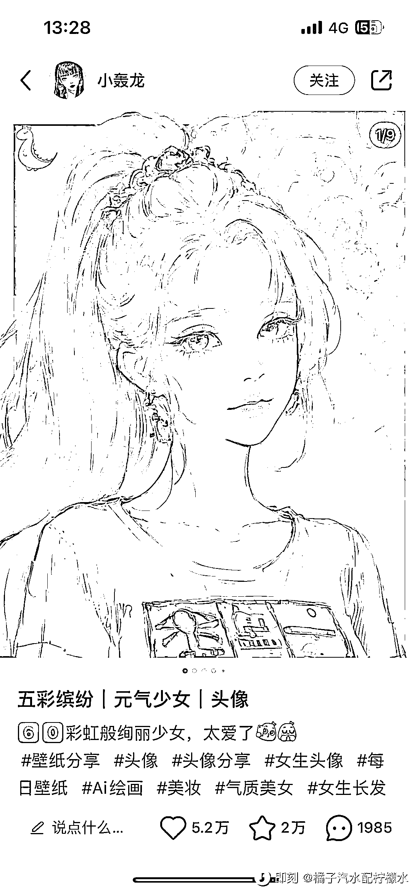
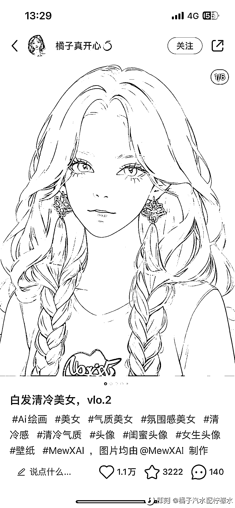
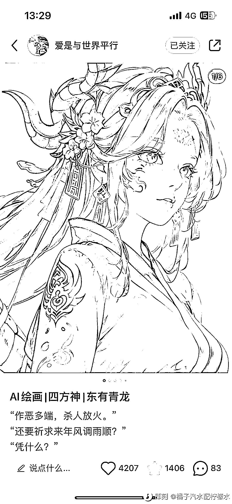
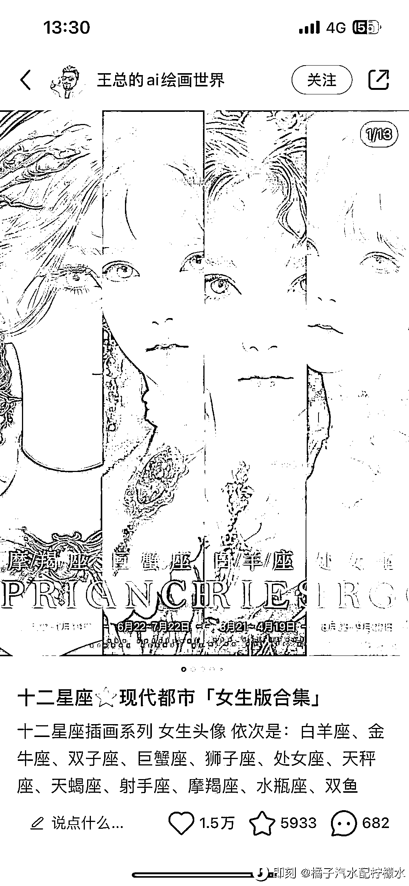

# (35 赞)⼩红书 AI 头像账号很⽕ 

作者： 海迪 

⽇期：2023-03-13 

⼩红书现在做 Ai 绘画账号的，最⽕的就是头像类账号。 

数据最⾼的点赞上限在五万，加上评论收藏数据，⼀条笔记互动量基本能到⼗万了。

头像类 Ai 账号的⽤⼾需求分为三类。 

1.第⼀类 

集中在帮助⽤⼾表达⾃⾝性格或积极情绪的内容，⽐如：元⽓少⼥头像、甜妹头像、⾼冷美⼥头像、清冷美⼥头像、御姐头像、甜酷⼥孩、时尚⼥孩、婚纱头像。

这类内容是稳定⾼频需求，⽤⼾范围⼴。

2.第⼆类 

在少⼥头像的基础上加上差异化的形象需求，来筛选更加精准的⽤⼾。

⼀般是形象词+少⼥头像的组合。 

⽐如⽩发清冷美⼥、⿊⾊短发⼥⽣头像、⾦发⿊⾊⽑⾐⼥孩、⿇花辫⼥孩。

3.⽂化元素 

除了上⾯的两类内容之外，⼀些结合了⽂化元素的头像也备受⻘睐。

⽐如博主“爱是与世界平⾏”的四⽅神少⼥系列头像，印象很深，打出了差异化的卖点，另外还有⼗⼆星座少⼥系列。

三类笔记转粉率没有数据，但我个⼈感觉第三类转粉会⾼⼀点。

这类笔记受众基本都是 18-25 岁的⼥性，⼀篇笔记 80-90%都是⼥⽣在消费。 带的标签🏷⼤多是 Ai 绘画、⼆次元头像、⼆次元少⼥相关。 

以上供运营参考。

   

评论区：

亦仁 : 中标，术值+1。 

在上⽅ #星球栏⽬ 专栏中，点击 #中标，可查看所有中标⻛向标。 
