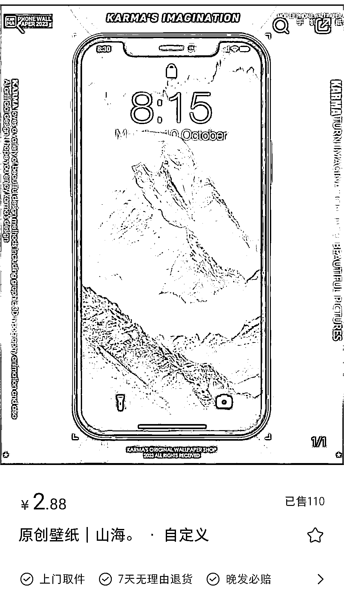
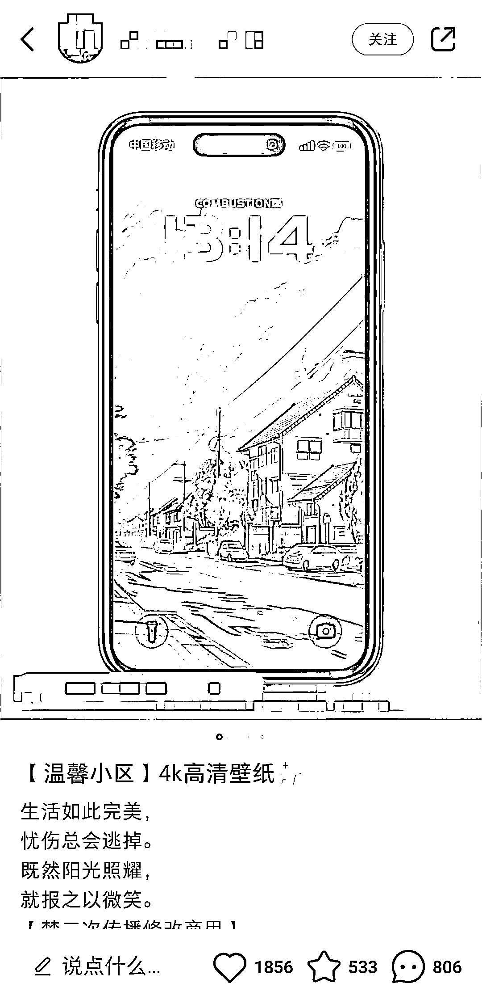
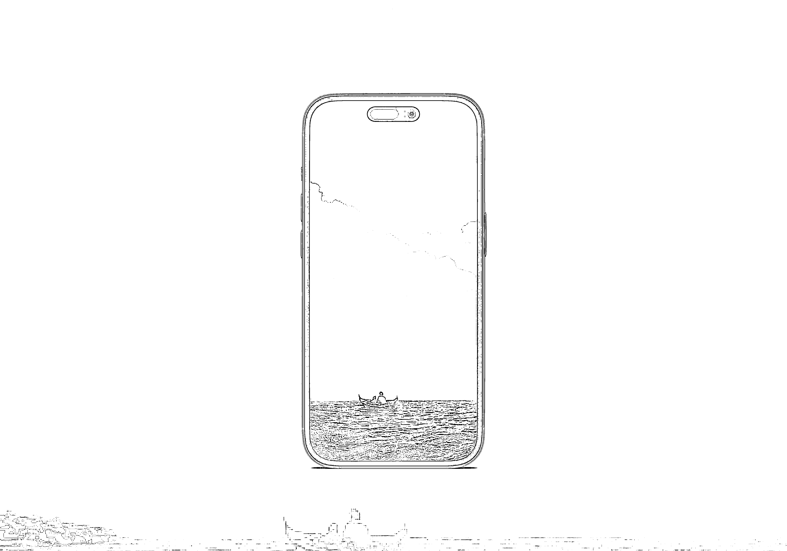

# (156 赞)⼩红书⾮常⽕，在⼿机模型上快速⽣成 AI 绘画的壁纸 

作者： Faith 

⽇期：2023-04-13 

#⻛向标# 

先看⼀下⼩红书上⾮常⽕的作品：

 

通过将壁纸应⽤到模型上，消费者可以更直观地看到壁纸在⼿机屏幕上的实际效果，包括⾊彩、对⽐度、清晰度等⽅⾯，也可以帮助消费者更好地选择适合⾃⼰⼿机的壁纸，此外，将壁纸放在⼿机模型⾥⾯也可以增加宣传的吸引⼒和趣味性，从⽽更好地吸引消费者的注意⼒和兴趣。

这个⽹站可以实现这个功能，操作⾮常简单，直接上传照⽚，选取模型，下载图⽚即可。

https://smartmockups.com/zh/mockups/smartphone 

评论区：

Kevin : 之前在⼩红书刷到很多这种壁纸，确实很惊艳，让⼈有购买冲动，原来都是有渠道的 11 : 请教⼀下，你这模板是⾃⼰设计的吗？好像它现有模板底图没法和⼿机屏幕⼀致 BeCa 公主 : 请问为什么我下载不了图⽚[抱拳][抱拳] 

Faith : 背景图可以⾃⼰设计，平台也会提供⼀些

Faith : 刚刚我⼜试了⼀下，是可以的呢

BeCa 公主 : 我明⽩了，我⽤pc 试试，感谢感谢 

拾悦说 : 和 AI 绘画⼀起⽤，每天可以做出 100 张作品。[偷笑] 

cck : ⾮常好，我们也在做这个⽅向 
