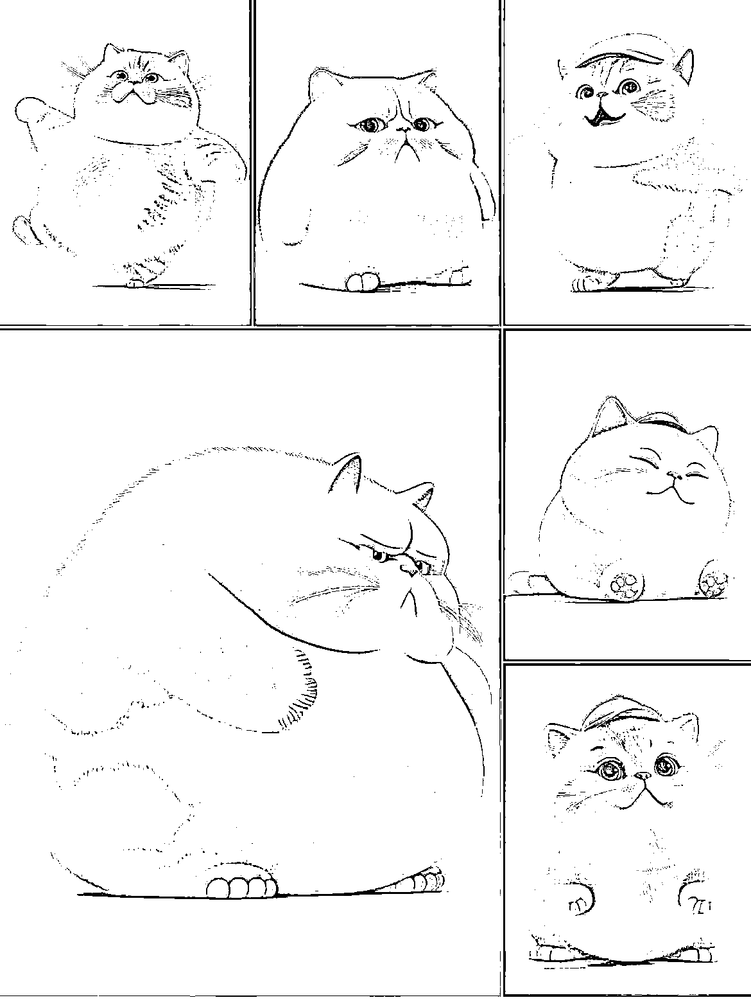
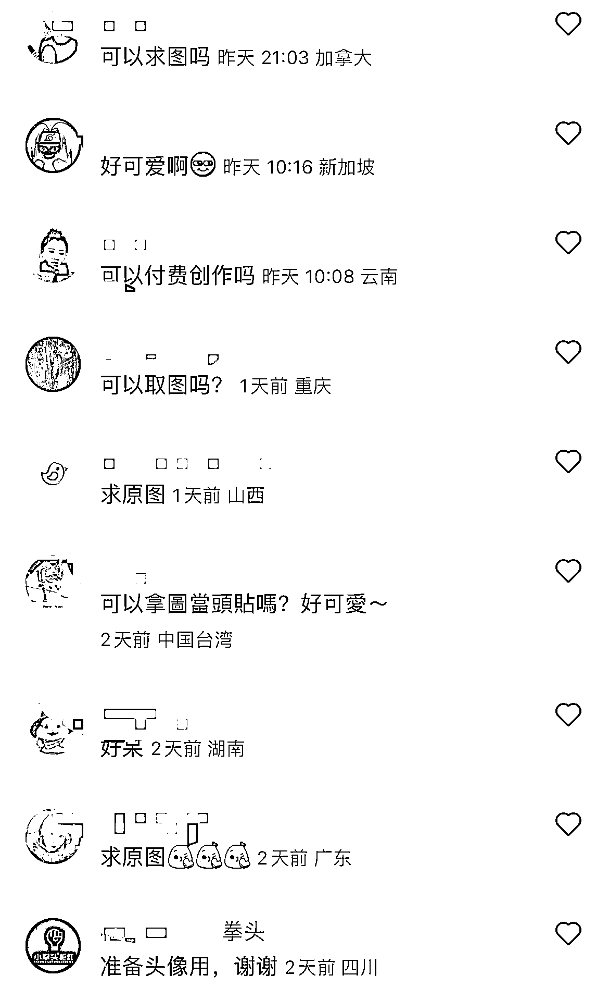

# (76 赞)⼩红书上宠物粉群体，AI 绘画宠物赛道可以吸引精准的宠物粉 作者： 筑梦 

⽇期：2023-03-21 

⼩红书上宠物粉群体⾮常⼤，所以流量⼀直不错

Ai 绘画宠物赛道可以吸引精准的宠物粉 

可通过多种⽅式引流变现：

1.将想要取图的⽤⼾引⾄公众号，可以为公众号快速涨粉，配合宠物知识类等转化 

2.夸克⽹盘拉新、迅雷拉新等，想要免费取图就要下载（适合各种头像类宠物类账号） 3.定制宠物头像壁纸等（宠物头像的单价要⽐⼈像⾼很多，宠物头像⼀般 200+，⼈像⼀般 50 左右） 

 

评论区：

筑梦 : 这个也适合宠物赛道的商家矩阵化运营，再配合后端产品或知识的转化，吸取流量的速度很快且精准。

亦仁 : 中标，术值+1。 

在上⽅专栏点击 #中标，可查看所有中标⻛向标。 
