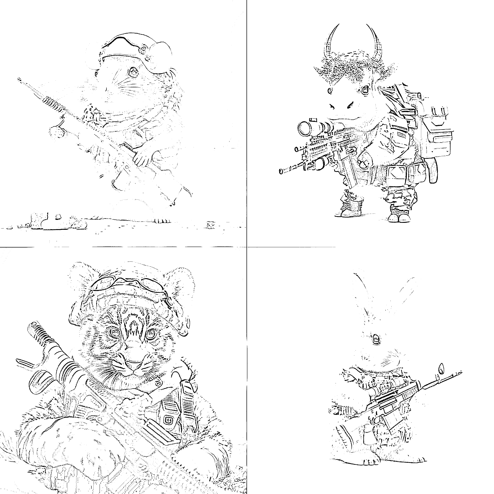
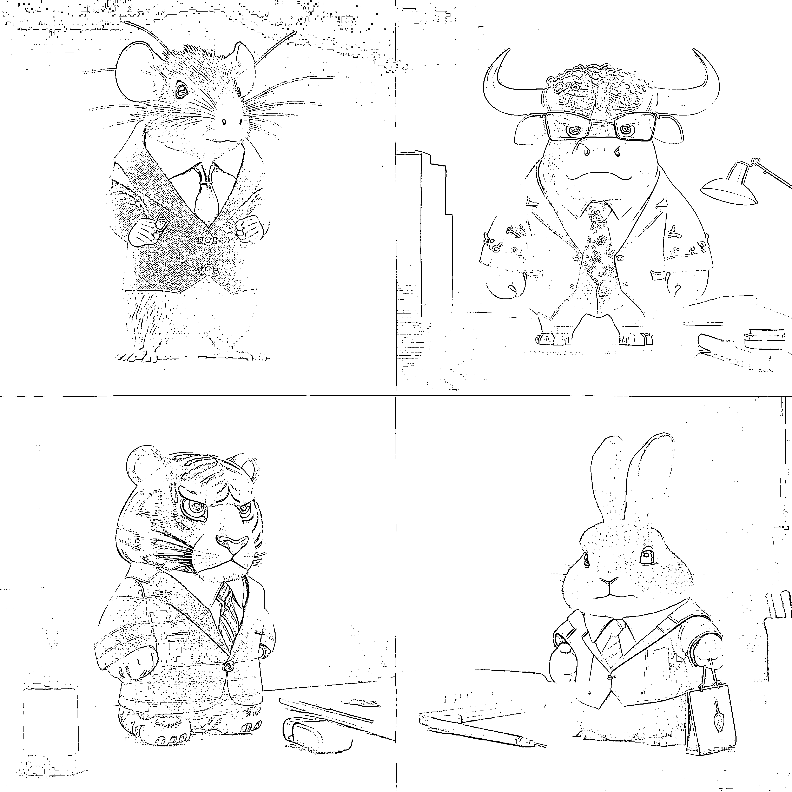
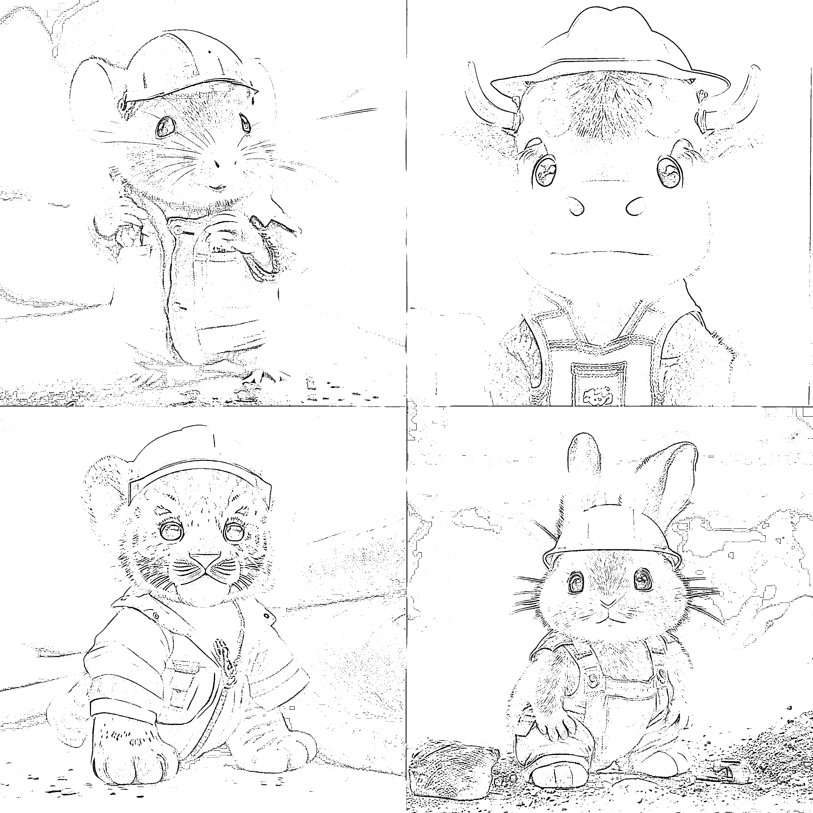
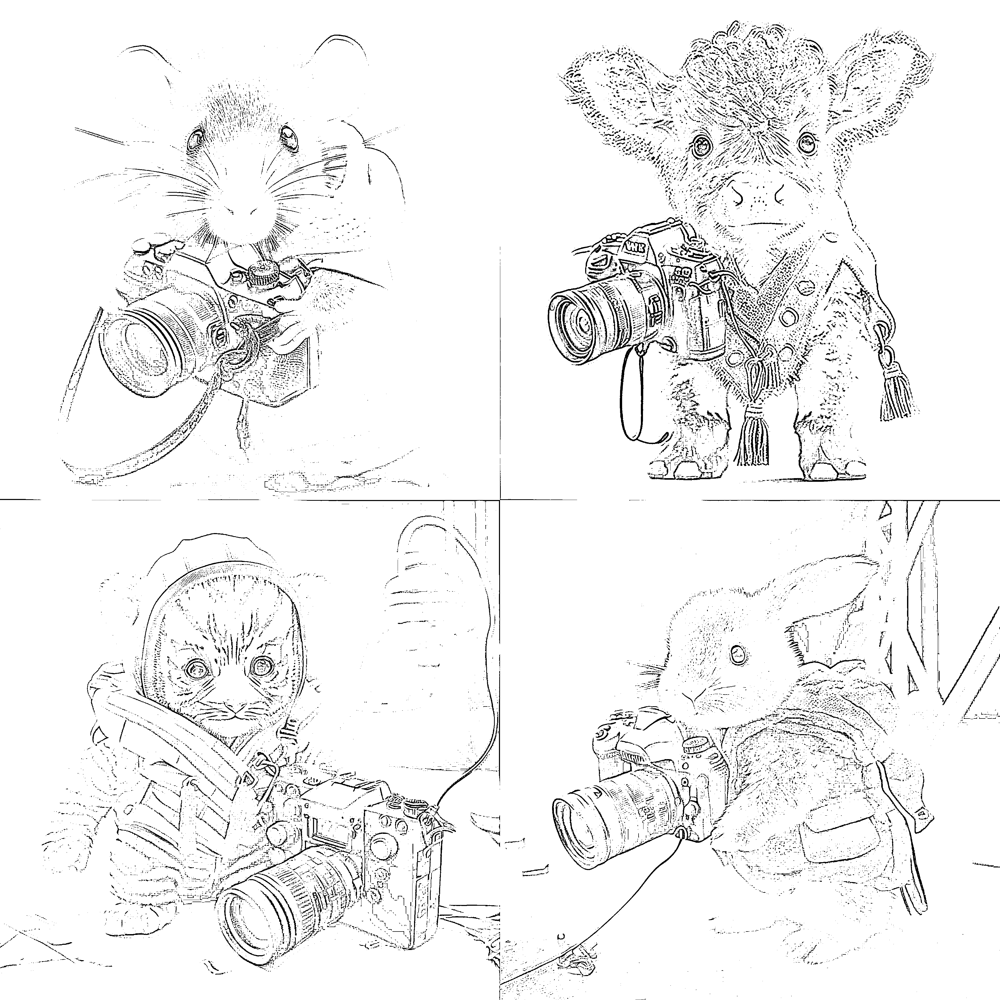

# (63 赞)可以做个 AI 绘画⼩程序接⼊ Midjourney，只需要⽤⼾输⼊他的⽣肖和职业

作者： 离⼼之巅 

⽇期：2023-03-29 

⼗⼆⽣肖壁纸在各⼤平台都⽐较⽕，midjourney 同⼀组关键词只需要修改对应动物和职业就可以⽣成不同的图。思路扩展下，可不可以做个 ai 绘画⼩程序接⼊midjourney，只需要⽤⼾输⼊他的⽣肖和职业，不懂 ai 绘画的⼩⽩也能⽣成⾃⼰专属头像 

评论区：

亦仁 : 中标，术值+1。 

在上⽅ #星球栏⽬ 专栏中，点击 #中标，可查看所有中标⻛向标。 
