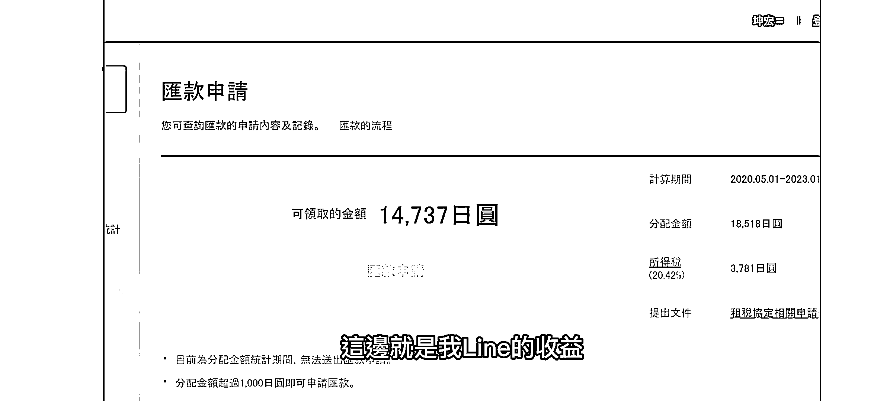
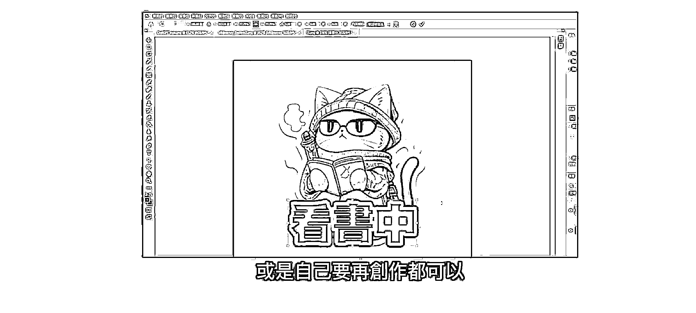
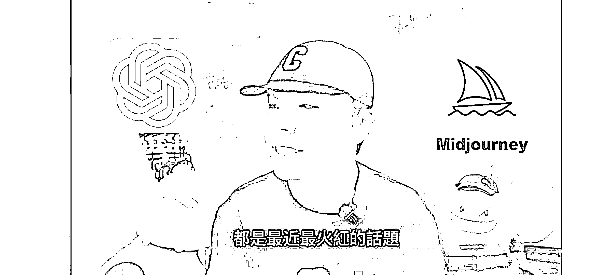

# (59 赞)AI 绘画 MJ + ChatGPT + line 贴图 = 表情包变现 作者： 乐希 

⽇期：2023-03-15 

ai 绘画 mj+ChatGPT+line 贴图=表情包变现 

mj⽤来做 line 贴图，可以直接销售。 

提⽰词也⽤ChatGPT⽣成 

已经有⼈⼏天直接变现了⼀万多⽇元

上架后就是躺赚，⽐百度⽂库好多了

NFT 也⼀样，ai 绘画⾮常适合发散性的内容制作 

⽤来做微信表情包，也可以引流

  

评论区：

亦仁 : 中标，术值+1。 

在上⽅ #星球栏⽬ 专栏中，点击 #中标，可查看所有中标⻛向标。 

⽵影 : 想请教下，mj 注册需要注意什么，我⼀直注册不成功[抱拳][抱拳] 乐希 : 可以直接加⼊discord⼩组去做的，注册不成功是什么原因呢 ⽵影 : 怎么加⼊discord⼩组[抱拳] 

乐希 : 官⽹上有链接的，另外可以在⼩航海的 ai 绘画⼿册⾥看到 mj 的详细注册⽅式，如果不太懂可以在 b 站看⼿把⼿教程 

⽵影 : 好的，谢谢拉 

赈早⻅海 : 10000⽇元才 500RMB，看来不怎么赚😂⽽且要对 Line⽂化⽐较了解，适合 tw 本地⼈做吧 乐希 : 虽然暴利不了，这个产业是细⽔⻓流的，就⼀套表情包，⼏天就销售 600，这些都是 gpt⽣成的提⽰词，批量投喂就⾏了，要是专⻔去做，⼀天⽣产 5 套，之后躺赚过万也不是不⾏。 主要是专业的别⼈花⼀个⽉的事情，⾃⼰半天就能搞定，能赚钱的都可以这么做，⽐如⽂库，头条，投稿，都是搬砖⽣意，但效率提⾼很多。
