# (精华帖)(321 赞)⽣财的⼀句话，衍⽣⼀个“ AI 绘图” IP 

作者： 天辉 

⽇期：2022-10-10 

⽣财刘⼩排⼤神⼀句 “刚才我在桥上⻅到了⽕烧云……”， 

让我变现 3900 元，并且这个数字还在增加。 

这篇帖⼦给没钱没资源没⼈脉没流量的圈友打打⽓，提供⼀个 0⾦钱起步参考。 去做，做就会有机会，事物发展超出你的想象，积极主动⼀定会有好事发⽣。

向宇宙公开许愿，宇宙会接收到你的善意

我先来，许愿⾃⼰得到⼀颗⻰珠，许愿⼤家出海顺利！

⼤家好，我是天辉，是梨云《⽣财·航海之歌》的配图师， 

主业是病毒制备和病毒清除，和艺术没有半⽑钱关系，

⽤AI 绘图技术产出 50 张适配插画图，只⽤了不到半⼩时。 

⽣财·航海之歌（链接） 

不是搜索素材库，也不是拼图，⽽是实实在在地画出了世上独⼀⽆⼆的插画。

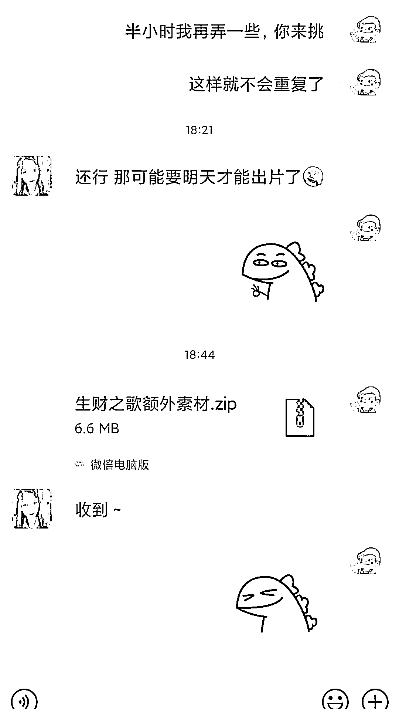 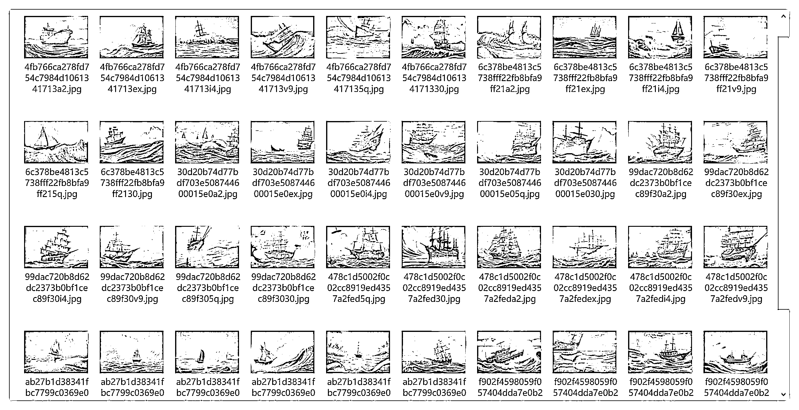

（结果梨云当晚就⽤上这些图出了，⾏动⼒拉满）

# 前⾔：AI 绘图科普 

AI 绘图⽤⼀句话解释，那就是“会说话，就会画画”， 

给⼀段⽂字，绘图⽹站就会按照⽂字信息⾃动画出相应的图⽚。

具体原理是，绘图的⽹站会在训练后的模型⾥，⼀步步地检查图⽚与⽂字的契合程度，先出⼀个模糊图，再逐步出现细节，每⾛⼀步，检查匹配⼀步，称之为扩散（diffusion），出图效果与描述词有很⼤关系。

⽐如，同样是百度⽂⼼⻜桨⼤模型⽹站

梨云⽣成的图⽤的描述词是：

⻩昏、⼤海、海浪、暗礁、船、天空

出图效果为蓝⾊框框内容

我想了⼀下，梨云真正想要的，需要修改⼀下描述词：

⻩昏时分的船在⼤海上航⾏，遍布海浪和暗礁，概念艺术，宏⼤，⾼清插画，HD，幻想⻛格, 超现实主义

也就是橙⾊框框内容

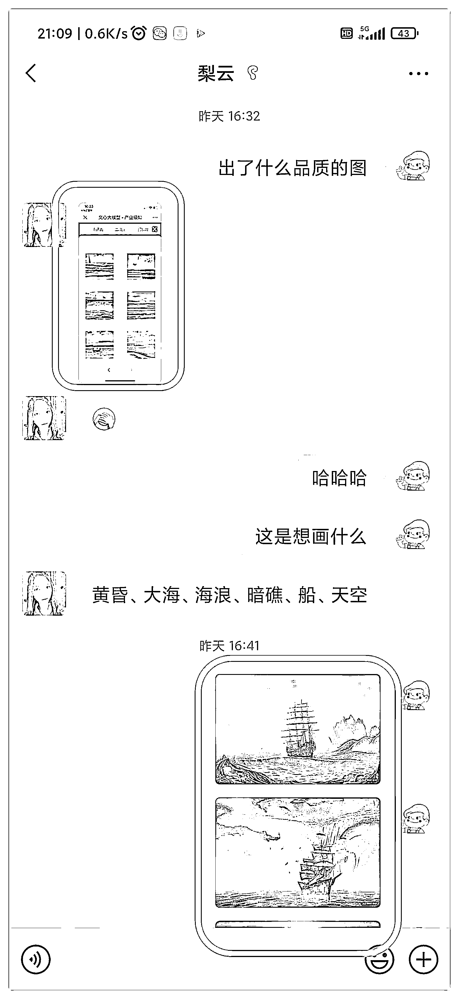

这也就是所谓的，描述词不同，效果天差地别。

但是，描述词⼀旦确定下来，复刻同类效果图⾮常容易，只要⼀直点⽣成按钮就好了，批量化⽣产，⼏⼗秒⼀张⼏⼗秒⼀张的出。

⼤家可以把梨云的蓝⾊⽂字、我的橙⾊部分的⽂字，分别在⽂⼼的⽹站⾥试⼀试，看看会不会出同款，记得选⼀下尺⼨。

https://wenxin.baidu.com/moduleApi/ernieVilg （⼿机也能⽤，⽂⼼的教程也提供了描述词的基本组成部分，作为⼊⻔很不错）

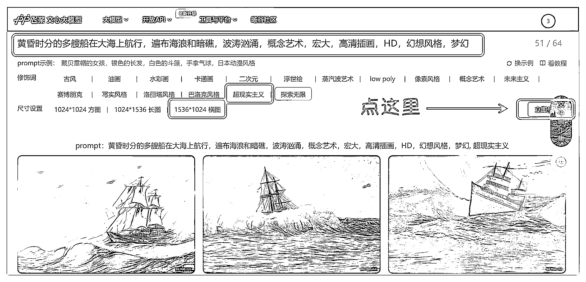

# 本帖讲述⼀个天辉与 AI⻓⻓的⼩故事， 

# 每个时期都可以挣钱， 

# 都有⾜够多的细节可供像素级模仿 

1.AI 绘图⼩攻略时期（萌新） 

2.AI 绘图体验营时期（新⼿） 

3.AI 绘图⼩报童时期（⽼⼿） 

4.AI 绘图 IP 时期（品牌） 

5.AI 绘图其他 

# ⼀、AI 绘图⼩攻略时期（萌新） 

1.《刘⼩排：普通⼈⽤AI 创作，有⼿就⾏》（2022-06-27 12:00） 2.《亦仁：卖空⽓检验真需求》（2022-07-08 21:47）

3.《天辉：原来还有⼀种模式是 “卖空⽓”，有⼈买时真快乐~》（2022-07-14 21:39） https://github.com/alembics/disco-diffusion （AI 插画⽹站） 

https://b23.tv/ES3LNUN 

（视频教程）

https://www.bilibili.com/read/cv16525687 （图⽂教程）

我能根据资料跑通，那⼤家也都能跑通，也可以根据关键词找到更详细的资料。尽管研究、钻研、跑通、验证⽤了⼀些时间精⼒，但是后续分享链接只需要⼏秒钟，没什么额外成本，因此免费分享；

如果⾃⼰实在研究不出来，我也提供⼀份付费的保障，

1. ⼀对⼀指导，在过程中遇到问题解决问题，解决不了的协助⼀起寻找⽅法的陪跑服务；

2. 成了收，不成不收，类似保险的⻛险转嫁服务。

这是我提供的增量价值产品

以上是我售卖的 19.9 元的⼩攻略服务，⼀经发布，就被拍下，为什么呢，因为 AI 图⽚的可视化效果⾜够强，⼈们⼀眼就能知道你在做什么，这是⼀个特别容易展⽰的最⼩MVP 产品。 朋友圈⼀发，说，打⼀段⽂字就能画出这样的图，总会有⼈⼼动的吧，谁⼼⾥没有点绘画梦呢？

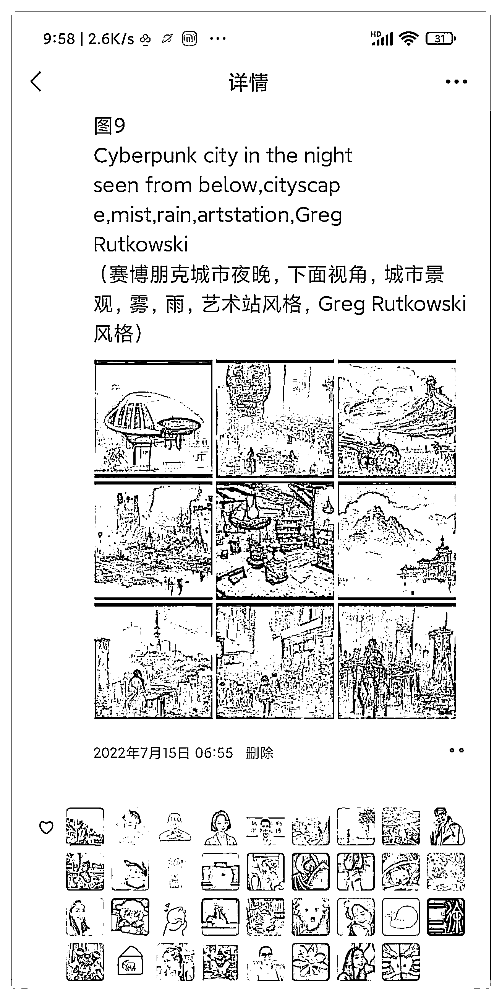

对标我这个阶段的伙伴，可以根据上述资料进⾏跑通试⼀试，当你⽤我给的描述词和⽣成⽅式出图的时候，⽣成的都是你⾃⼰的图，你⽤你⾃⼰画的图作宣传。

（顺便说⼀句，⽤ disco diffusion ⽣成的图⽚，⽹站不会跟你要版权，可能有点拗⼝，之后再集中说版权的问题，现在记住，可以⽤就⾏了）

卖出去两份，你就挣到 40 元。挣的是提供增量价值的钱，朋友都很感谢你，因为它能提供的快乐远超 20 元。 

这个钱，⼈⼈可挣。

关于 disco diffusion 以及描述词，我写了更容易上⼿的版本，给在座的各位去挣 40 元，请拿它去⽣财。

《001 会说话就会画画（disco diffusion）》 

《002 这是我能画出来的图？（描述词的优化）》 

此外，也写了⼀份 Midjourney 的基础⼊⻔，下⾯⼩报童⽼⼿篇有进阶资料 《加⼊Midjourney⸺天辉》 

# ⼆、AI 绘图体验营时期（新⼿） 

不要觉得 40 元很少，它不⽌是 40 元，⽽是代表了，有⼈愿意为它付费。 1. 产品产⽣ 

有设计师伙伴看到了我卖的攻略，找到了我，说，我们来办个体验营吧，我帮你做设计和⼆改，她就是⾖⼦，⼀个⼆次元⻤神⽂化爱好者游戏 UI 界⾯设计师。我还在⽂案改来改去的时候，她觉得差不多了，不想再墨迹了，直接把海报发到朋友圈了。这也是我参加⽣财⼩红书航海的时候，既然都是写图⽂，就⽤朋友圈练练⼿好了。

这个时候我有什么呢？

只有你看到的那两篇整理⽂章的⽔平，也就是说，你现在能卖 40 元，你就可以开⼀个体验营。 2.产品宣发 

体验营怎么招⽣的呢，不怕⼤家笑话，就是提前 7 天发朋友圈，告诉⼤家我要办⼀个⼀周的 AI 绘图体验营收价 29.9 元，帮助营内⼩伙伴体验⽂字绘图的快乐。 

最初营内只有我的妈妈还有⼀个尝鲜的⼩伙伴共四五位伙伴，没有⼈来。但是我知道这个东西很吸引⼈，所以我坚持⾄少每天群⾥发⼀次预热，并且⽤群⾥的出图和攻略每天发⼀条朋友圈。尽管群内没⼈回应，朋友圈也没⼈互动。

要出什么攻略我⾃⼰都不知道，但就是硬着头⽪上了，因为需要交付，所以每天逼迫⾃⼰想内容、搜内容，结果扩充了知识库，发现了 Midjourney（MJ）⽹站。那个时候 Stable diffusion ⽹站还没有出现，MJ 就是最⼤的王者，因为它出图速度太快了，出图质量太⾼了。 

可能因为朋友圈美图重复触达真的很有效果，到临近开营那⼏天，⼀下⼦涨到了⼆⼗⼏⼈左右，这个时候我才知道之前发的内容都是有⽤的。

真正让⼈数爆发的，是我受邀作商业⼤课分享，分享了⾃⼰产品的制作过程与价值观《项⽬从开始到落地⸺AI 绘图体验营》（链接） 

我秉持的核⼼原则是，宣传不是为了吸引⼈加⼊，⽽是尽可能地阻挡⼈加⼊。我特别担⼼的是宣传中产⽣了不恰当的误解，让⼈误以为可以通过训练营达成，从⽽付费进来了，之后因为没达成期望，⾛了。这对⽤⼾，对我们都是极差的体验。

所以我在宣传上，尽可能地降低⼤家的期望值，把之前列了很多的关于福利的宣传统统删掉（⼊营后再公布），把⼤家能在体验营做的事情在宣传上⽆限地拔低。我们将训练营，改成了体验营，重在体验。

我在朋友圈宣传⽤的图，不是⽹络⼤神产⽣的极其漂亮精美的图⽚，⽽是实实在在的我能做到的图⽚。我们将交付，定在了可以辅助学员⽣成你的第⼀张图，并且可以让学员⽣成 7 种不同⻛格的图，并告诉你哪些参数可以修改以及修改后的效果，到此，就算交付结束。

这是我们⼀定能提供的价值，我们寻找愿意为我们提供的保底价值⽀付 29.9 元的⽤⼾，那么除保底价值之外的每⼀项价值都是超额交付，这是我们宣传的逻辑。我们⾃信可以做到超额交付，这样对⽤⼾，对我们都是⼀次极佳的体验。

⼀些实⽤总结：

1. 所有帮助他⼈的事情都是在给⾃⼰投资，真正的利⼰主义者所做的事情都是极致利他。我能落地训练营，⼏乎都是来⾃于伙伴们的助推。

2. 想办法创造价值⽽⾮创造⾦钱，⾦钱只是随价值必然到来的副产品。多想⼀想为他⼈提供的价值，是节省了⾦钱，还是节省了精⼒时间，还是提供了情绪价值或者其他。

3. ⾛出开始的那⼀步最难，中间难，最后也难。

4. 超额交付就是，当⽆论如何你都能保底交付的价值，别⼈也愿意为之付费时，此时除了保底，其他都是超额。

5. 不需要纠结⾃⼰没有和⽆法改变的东西，多想想⾃⼰有什么，能做什么，然后去做，做着做着，经验就有了。⽆论能否成功，你的经验都是给他⼈的价值。

6. 如果⽆法掌控条件，那就⾛⼀步看⼀步吧，只要失败的损失能承受，那就没有什么是不能尝试的。

7. 压低期望值，压低期望值，隐藏交付福利。

# 3. 体验营 SOP 

当时我⾛⼀步看⼀步的，现在都沉淀成了已有经验，这是被验证过有效的⽅式，现在分享给你⽤来挣钱。

① 从现在开始，你学习 AI 绘图出的每⼀张图⽆论好坏都可以发在朋友圈，这是你是菜⻦的证明，有⼈会看。

② 当你的图⽚越来越好看时，就可以释放变好看的技巧，这是你在研究的证明，有⼈会看 ③ 开营倒计时（这个时候每天都要发预热了，展现体验营⾥能⼲嘛） 

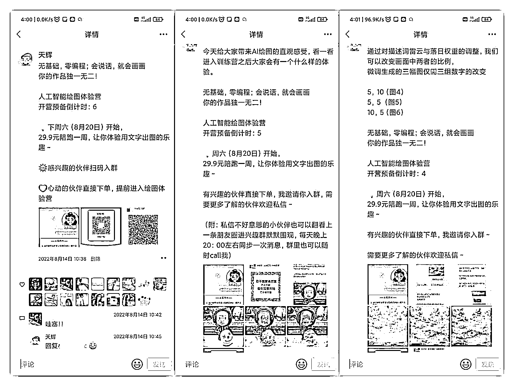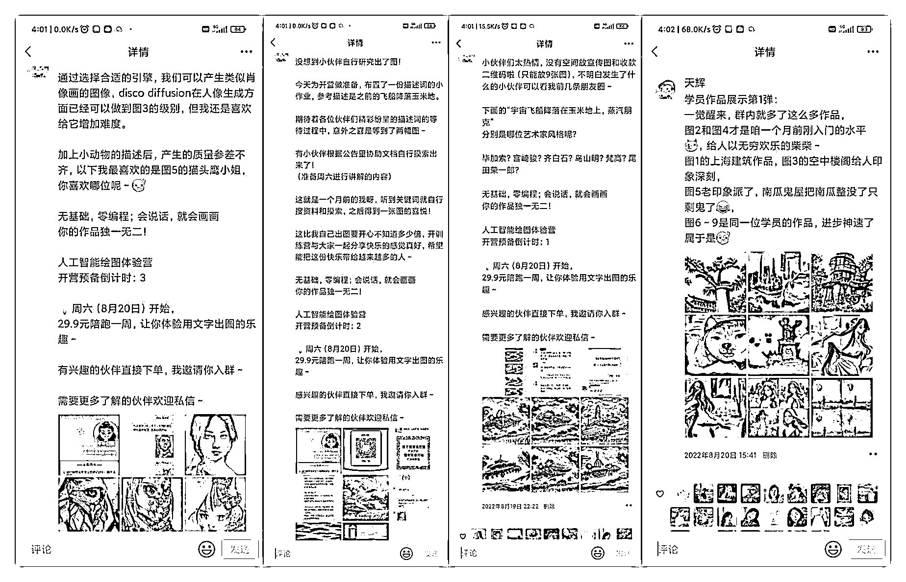

以上内容需要的技术，基本都包含在下⾯这两篇⽂章⾥了，⼤家拿去开营。

《001 会说话就会画画（disco diffusion）》 

《002 这是我能画出来的图？（描述词的优化）》 

④ 开营之后的⽇⼦，每天分享学员出的图⽚，坏的图⽚证明他们在成⻓，好看的图⽚⾃带光环，⽤真实感受说话，你的学员都是你的好朋友，他们会很开⼼地在朋友圈⾥发图，带来很好的转介绍。

⑤ 你与学员的关系，是共创者的关系，不是师⽣，⽤⼼对待每⼀个问题，回馈好每⼀个成员。有学员说我是运营天花板，群⾥的每个成员都散发着主⼈翁⼀样的光和热，我觉得我真的没有什么运营的技巧，真诚⾃有万钧之⼒。

⑥ 结营的时候，可以抒发与伙伴们共同精进的感受，在群⾥举办⼀个结营仪式，⽤真情实感。我们在结营时，设计师伙伴悄悄地汇总了⼀个结营图，从⼏百张画中，找了出图的四⼗⼏位伙伴们的图，⼈⼿⼀张，汇总在⼀起，包括底图也是 AI ⽣成的图⽚。 

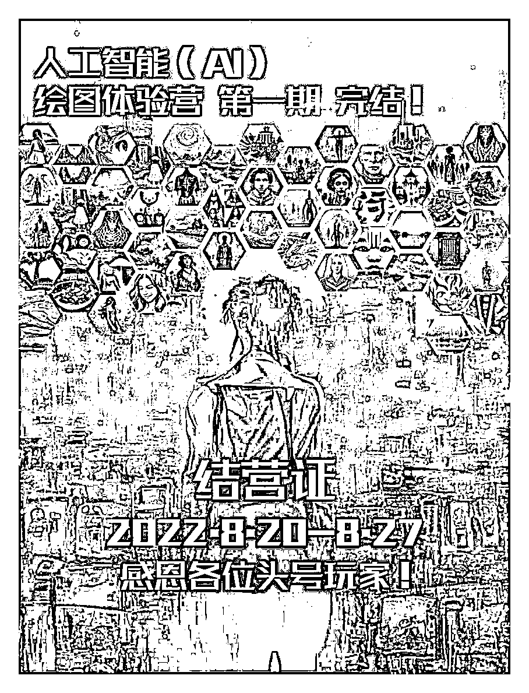

# 附：有哪些超值体验的部分？ 

1. 说是⽣成⼀张图⽚即可，实际上会⽣成⽆数张图

2. 说是只有 7 种⻛格，实际上⼏⼗上百种 

3. 说是只有 disco diffusion 的教学，实际上加了 Midjourney、Stable diffusion 4. 说是⼀周结束，实际上有 8 天，且群永久保留答疑 

5. 未曾宣发的实物⼩布包抽奖，0 元包邮（可印成员出的 AI 图） 

6. 未曾宣发的结营仪式

7. 极其耐⼼细致地⼿把⼿教

8. 超赞美图扎堆分享，良好视觉体验

9. 伙伴们的积极互动

# 关于运营 

⼩伙伴说我运营做的很好，其实没有任何运营的技巧，我只是想着能不能让⼤家尽量⿇烦节省时间，能不能体验再多⼀点，能不能再超值⼀点。

我把⾃⼰想象成⼀个从来没接触过 AI 绘画的⼩⽩，甚⾄是从来都没有看过外⾯⽹站的⼩⽩ 我在遇到问题时，最困惑我的是什么，什么能够第⼀时间解决问题先让我能⾛起来，然后在⾛起来之后，能不能想着⾛快⼀点，⾛的远⼀点

喜欢⾃⼰钻研的⼩伙伴，我提供⼀份可以钻研的资料；

喜欢与⼈交流的伙伴，我也积极参与探讨；

喜欢信息繁多刷屏的伙伴，我们⼀起刷屏体验氛围感；

不喜欢刷屏想安静的伙伴，只需要保存⼀份⽂档链接；

这⼀段时间，我帮助很多伙伴解决了很多的卡点。

有的是⼀点就透，有的是⼀步⼀步带着⾛，有些不熟悉的地⽅我也会慢慢地等，因为我知道这就是两个⽉前什么都不懂的我。

我那个时候很希望能有⼀个什么都懂，⾄少关键步骤能带我向前进，专业，且温暖的指引者。帮我节省时间，⽽不是碰到问题⽆法及时解决⼜要⾯对翻来翻去的苦恼。

所以我想成为能在关键时刻帮上⼀把，能为不同进度的学员解决个性化问题的伙伴 4. 结算 

体验营⼀共 89 位⼩伙伴，营收 2600 元， 

这个数字，全是朋友圈、转介绍、分享来的，我没有其他流量，如果你有其他流量途径，应该还会有更多伙伴感兴趣。

忙这个，把⼩红书的航海给落下了，但 12 次打卡是保住了，后来协商了⼀下，这也算是航海的成果。

我也成了那⼀期可能唯⼀的 0 粉 0 笔记变现两千多元的记录。 

你能挣 40 元，就能和我⼀样再开个体验营，假设没有分享等促因，保守估计也能招 30⼈左右，这就是 900 元。 

这次的体验营，还带来了圈内好伙伴，那就是拾⼀，他在七⽉有好事⾥发现了我，加⼊了我的体验营，还帮徐宿找到了我，徐宿认为我应该开设⼀个⼩报童专栏，于是就有了⼩报童。

# 三、AI 绘图⼩报童时期（⽼⼿） 

这是徐宿怂恿我开的，我把前⼏个场景的⽤到的知识、技巧总结成⽂，放在了⼩报童⾥。

《再⼩的个体，也有⾃⼰的品牌》

这个就是⼀本随⾏⽇志，刚开始探索时发现 disco diffusion 很强⼤，后来发现 Midjourney 出图更快，更具有艺术⽓息，之后⼏乎是跟着 Stable diffusion 在前进。 ⽐如，你在探索中肯定会遇到想不出描述词的问题，那我就会拆解描述词是怎么想到的，哪些描述词在哪些⽹站会有什么样的效果。有⼩⼯具助⼒你迅速从⼩⽩变成进阶，或者提供思路等。

⽐如，我平时都从哪些地⽅获取 AI 绘图信息，哪些地⽅有描述词的探讨，哪些地⽅有国外的研究资料。

现在 AI 进展如何了，除了⽂⽣图，还有⽂⽣视频（起步阶段），⽂⽣3D 模型（未开放，部分开放）。 有哪些博主在介绍相关信息，哪些博主值得关注，哪些图⽚可以复刻，等等

准确地说，⼩报童不是课程也不是服务，它是⼀本时时更新的研究⽇志，提供的是我以后可能会出的百元级、千元级产品的底层基础和素材库。

任何时候有需要交流的时候都可以问我，我可能会帮你省很多的时间和让你少⾛弯路。

记录我找到的资料，其实我知道的已经有很多了，但是写了⼀夜有点困有点写不动了，这些都是我读过的资料，列⼀些经典的，更多延展的，可以之后随时找我要。可能现在都不懂没关系，熟悉后你就知道这些多有价值了，全⽹可能找不到第⼆个像我写这么细的了。

都是我⼀个⼀个找的，各位珍藏。

1. Disco diffusion 研究资料 

①（参数基础，英⽂）

②（基础知识整理，英⽂，最耗时间，但包含⼤量测试与底层原理）

③（国外⽹友⾃研⼩册⼦）

④（参数研究报告，中⽂整理，上）建议读

⑤（参数研究报告，中⽂整理，下）建议读

⑥（AI 实验报告）建议读 

2. Midjourney 研究资料包 

①（⻛格参照）

②（Midjourney 百科） 

③（Midjourney⼈像⽣成研究） 

④（⼈像⽣成研究 2） 

⑤（艺术词图册）

⑥（prompt 参照） 

⑦（描述词⽣成⼩⼯具）

3. Stable diffusion 

这个的资料过多，因为它最出圈，直接以它为关键词，全⽹搜索即可

尤其是在 B 站，有⼤量免费本地化部署教程，不过我的电脑不太给⼒，本地化⼀直都不成功，⾄今还在⽤⽹⻚版。

4. 其他绘图⼯具 

⼤约⼗⼏种，有些我看了，有些我还没看，零零散散，待总结，不过⽂⼼是真的挺不错，航海之歌的配图就是通过它⽣成的。

⼩报童现在有 38 位读者，有 1260 元收⼊，与前述加在⼀起，共变现 3900 元。 四、AI 绘图 IP 时期（品牌） 

正如芷蓝姐说的那样，做到 30 分就可以教零基础，做到 60 分就能教 30 分，我现在应该算是做到了 60 分。

拆三个案例，看看掌握了 AI 绘图到 60 分能做什么 

⼀个是紫⾊可爱卡通⻛格，⼀个是⽣财航海之歌，⼀个是⼩红书爆款的现象级复制 1. 紫⾊可爱卡通⻛格 

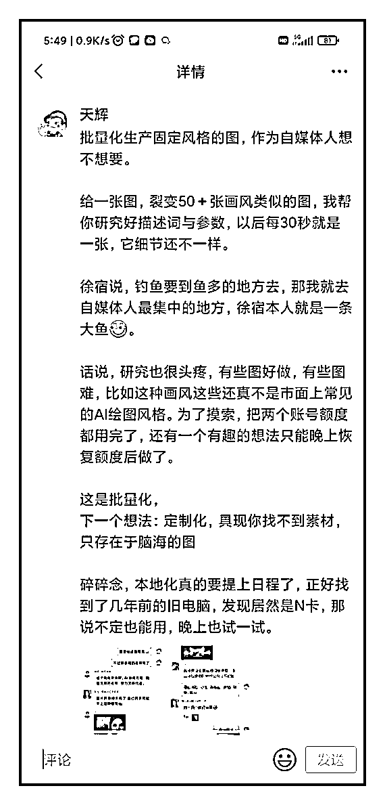 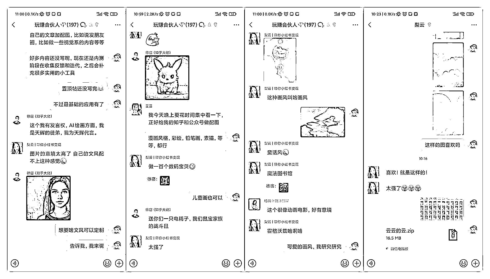

简单来讲，就是图⽣⽂，⽂⽣图加垫图，⼀旦找到⼀个能⽤的，接下来就是 30 秒⼀张 30 秒⼀张 2. ⽣财·航海之歌 

这个在本⽂最开头已经拆解过了，你可以按照我的⽅式做出同款来。

3. ⼩红书爆款拆解 

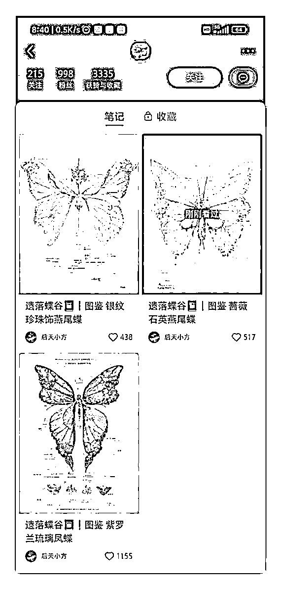

以上是⼩红书的蝴蝶

以下是拆解后可批量⽣产的类似⻛格图⽚

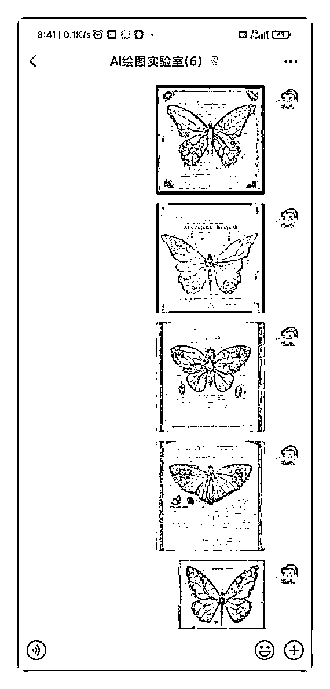

# 五、AI 绘图其他 

只要是⽤到图的，都可以⽤AI 绘图再想⼀遍。 

AI 绘图不仅能画现实中有的东西，也可以画现实中没有的东西。 

芷蓝姐举的应⽤场景：动漫、游戏、⽐如批量⽣成纸⽚⼈⽼婆、画 CG 爱好者的名场⾯等都是可以的。 我⽬前打算以及在做的⽅向有两个，

⼀个是研究⼩红书的爆款，试着模仿和拆解图背后⽣成的参数和描述词

另⼀个是深度优化⾃媒体⼈学习路径，最终效果是保存 1 篇⽬录⽂档，30 分钟内熟悉相关信息，1 个⼩时能够进⾏个性化应⽤。

以上均为理想型，⽐较难，但我会试⼀试。

当然，应⽤也不限于此，我也会同步保持相关信息的更新。

AI 绘图，对于我来说是⼀个从⽆到有的建⽴全过程，希望我的经历能够帮助到更多犹豫不前的伙伴们躬⾝⼊局试⼀试，⾄少在 AI 绘图上，你可以 0⾦钱起步，像素级复刻，重⾛⼀遍我的路径。 当然，0⾦钱不代表 0 成本，投⼊的时间精⼒等都属于⼴义的成本，但容错率很⾼，失败了不会造成什么毁灭性的打击，多掌握⼀⻔技术，多⼀项能⼒。

我⼀直保持着研究学习状态，对 AI 绘图有任何想法，都欢迎与我交流。 

困了，可惜要去上班了，⼀般⽩天要进实验室制备和清除病毒，晚上有更多时间详谈，欢迎⼤家与我做朋友~ 

评论区：

⼀盘唐僧⾁ : 天辉⽼师，没有⻰珠不能留联系⽅式和分销码 

天辉 : 奥奥，这样啊，那我删掉重发内容还在不 

⼀盘唐僧⾁ : 重新编辑即可 

天辉 : 分销码删掉啦〜 

⽶斯特 LIu : 为啥看不了呢 

天辉 : 刚刚在修改，现在应该可以看啦 

⼀盘唐僧⾁ : 微信号 

天辉 : ⼗分不好意思，谢谢提醒，已删 
