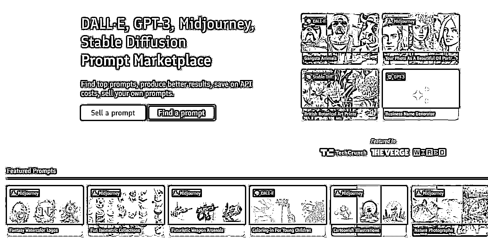

# (40 赞)AI 绘画关键词售卖平台，可以买关键词，也可以卖关键词 

作者： 海迪 

⽇期：2022-12-16 

AI 绘画关键词售卖平台，国外版，可以买关键词，也可以卖关键词，最低 1.9 美元⼀组词，有 DALL·E, GPT-3, Midjourney, Stable Diffusion，这 4 类型的词。 ⽽且还可以借鉴画⻛，⽐如它有类型词，是可以借鉴来做 AI 绘画，⾃⼰写描述词。

https://promptbase.com/ 

评论区：

亦仁 : 中标，术值+1。 

在上⽅ #星球栏⽬ 专栏中，点击 #中标，可查看所有中标⻛向标。 
