# (精华帖)(470 赞)⾸次参加 AI 绘画航海赚到⼈⽣副业第⼀桶⾦，来⽣财⼀年后我终于明⽩什么是“利他”

作者： 巴菲 

⽇期：2023-05-09 

⼤家好，我是巴菲，主业是个 996 程序员，⼀个潜⽔近⼀年的⼩⽩。第⼀次参加航海，便在 15000 ⼈中排名第⼆，短视频涨粉过万。⽽且直到参加这次航海，才发现⽣财这个平台，也很适合没有资源⼈脉的⼈开启副业挣钱，我就是这样赚到了⼈⽣副业第⼀桶⾦。今天我把⾃⼰这段经历整理分享给⼤家，希望能帮助更多尚未下场的圈友。

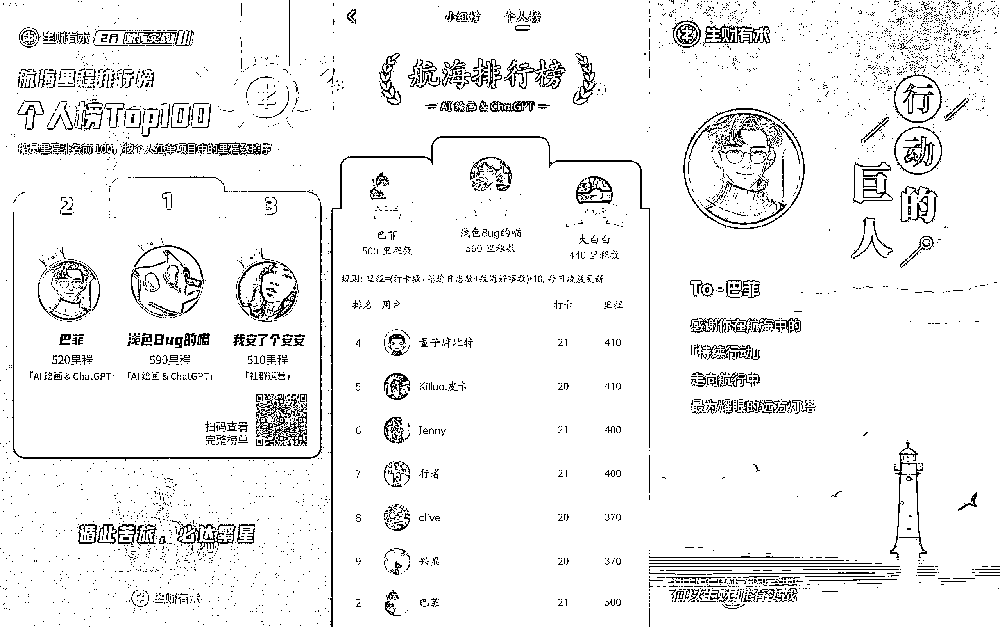

**⼀、背景介绍**

我是 2022 年 4 ⽉ 18 ⽇加⼊⽣财的。和⼤部分加⼊⽣财的圈友⼀样，怀着⼀颗仗剑⾛天涯的⼼。希望能在⽣财⾥⾯，发现财富密码，⽇进⽃⾦，⾛上⼈⽣巅峰。

刚进⼊的时候，发现到处都是宝藏，市⾯上主流的挣钱项⽬，在这⾥⼏乎能找得到。我甚⾄幻想着，⾃⼰要⼀下⼦找 3 个项⽬，同时做起来，那么我很快就能实现财富⾃由了。 我⼏乎是看到⼀个赚⽅法，就收藏⼀个。

但是直到我的收藏夹已经有⼏百篇⼲货了，我还是没有赚到⼀分钱。

这次的转机来⾃ 2 ⽉航海前，收到⻥丸关于新的航海的提醒。 

我⼼想，已经是第六期最后⼀次航海了，哪怕下⼀期不再续费⽣财了，那⾄少也要体验⼀下航海，进⾏⼀次实战，也不枉来⽣财体验⼀次。

就这样抱着试试的态度，我报名了⽬前⽐较⽕的 AI 绘画&chatGPT。 第⼀次参加航海，其实是有点畏惧的，是对陌⽣环境的恐惧。来到航海群，举⽬四望，⼀个熟⼈的 ID 都没有。因为之前从来没有链接过圈友，作为⼀个和⼤家完全陌⽣的⼩⽩，⼼中有些落寞，不知道如何融⼊这个实战团体。

当发现⼤家都是⽼朋友，我只能故作镇定⼩⼼翼翼的尝试第⼀次的发⾔。然⽽在接下来的 21 天⾥，我却慢慢的成了这个群⾥最活跃的成员之⼀。

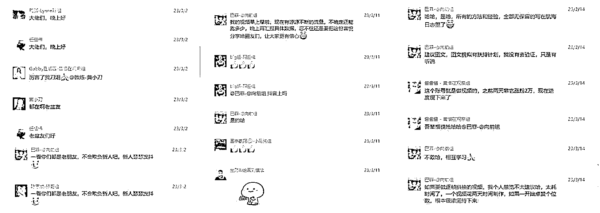

⼦安在开船仪式⾥⾯说过了航海要做的五件事：

【共读】实战⼿册

【持续】探索实践

【举⼿】主动提问

【互助】热⼼解答

【⾼频】交流经验

这五句话深深影响了我的航海⾏动。

**⼆、我如何通过航海实战从零涨粉**

航海的第⼀天，我和⼤部分⼈⼀样，阅读了航海⼿册。⼿册内容太详细了，我看了⼀整晚，最后还是选择有侧重的去学习部分⽐较感兴趣和重要的知识点，并很快的能上⼿画出第⼀幅图。

航海⽇志模板，有⼀个设计特别不错，那就是⽇志的最后会要求必须写接下来的⽬标。

为了能给⾃⼰有⼀个努⼒的⽬标，我在第⼀天⽇志就⽴下了 7 天在短视频平台发布第⼀个视频的⽬标。

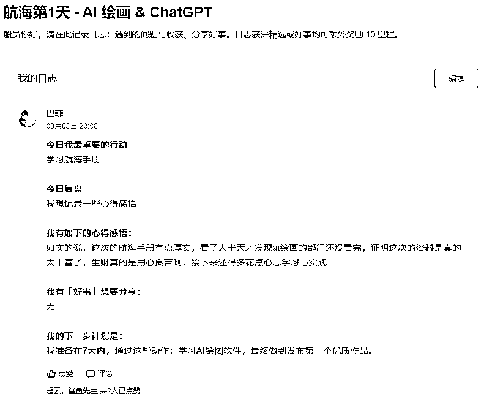

接下来就围绕着这个⽬标去⾏动。

航海的第⼆天，天辉教练授权我们使⽤他分享的内容。发到朋友圈，通过⼩额收费和朋友们⼀起学习。

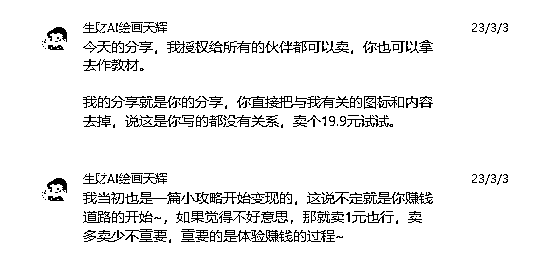

当天晚上，我就发了朋友圈。我在朋友圈⾥⾯，巧妙的运⽤了原价 29.9，前 10 个报名的只需要 19.9 这样的⽂案。

第⼀天就卖出去了⼏份。成了群⾥第⼀个因为快速的执⾏⼒，得到了这次航海的第⼀个正反馈的⼈。

虽然变现不多，但是让我很快尝到成功的甜头。我把⾃⼰的这份⾏动经验分享到群⾥，得到了很多圈友的称赞。

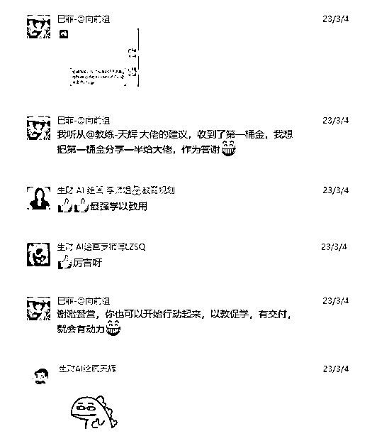

他们纷纷因为我的⾏动⼒和乐于分享加为我好友，这给了我很⼤的信⼼。当天我也拿到了⾃⼰航海⽇志的第⼀件好事。

做对他⼈有帮助的事，并且得到⼤家的认可是会让⼈上瘾的，这让我更加努⼒想要学习和分享。

在航海的第三天，我已经可以从⼀开始的出图质量差的程度，变成能⽣成稳定的⼈物图⽚的⽔平了。

这在我看来是⼀个不⼩的进步，于是把这次问题解决的过程，记录到航海⽇志⾥⾯，意料之外的获得了好事和精选。

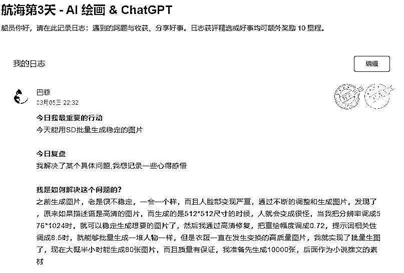

⼜⼀次让我意识到，在航海的每⼀天，积极去⾏动，努⼒解决问题，遇到困难在群⾥寻求帮助，不仅能提升⾃⼰的能⼒。也能帮助到其他圈友，得到⼤家的认可。

因此接下来的每⼀天，我都在不断钻研并解决问题并且把这个过程分享到群⾥，以及记录到作业⾥，因此⼤部分航海⽇志都是精选，得到了更多圈友的称赞。

再次让我体会到越分享越幸运，越分享越有收获。在利他的过程中，我成就了⾃⼰的 AI 绘画技术和⼈脉。

时间来到航海的第七天，我在抖⾳和⼩红书，同步更新了我的第⼀个作品，顺利完成了第⼀个七天⽬标。

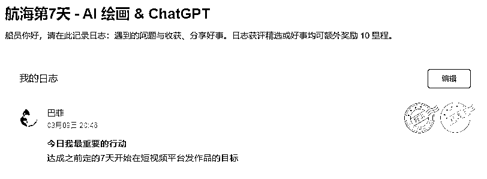 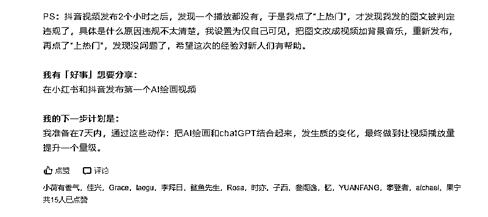

并制定了第⼆个⽬标，七天后，抖⾳视频播放量有⼀个量级的提升，在第九天把这个量级设定为具体的数值，出个 10 万播放量的⼩爆款视频。 

但是第⼀个作品发布的 24 ⼩时之内只涨了个位数的粉丝，赞也是寥寥⽆⼏。第⼆天，我⼜发布了两个作品，效果都不好，点赞都是个位数。

发了三个作品都没有⼏个⼈看，属实对我有点打击。甚⾄有⼀个作品，被判定为低质量违规，让我更加受挫了，但是想到⾃⼰的⽬标，默默告诉⾃⼰不能放弃。

但我对⾃⼰的图⽚质量还是挺有信⼼的。毕竟很多圈友都夸好看的东西，必然不会太差。

我看抖⾳上⾯其他⼈，同种类型的视频，播放量都挺不错的。如果排除是作品质量有问题，那我要反思，到底⾃⼰和爆款的差距是什么。

我发现爆款视频的背景⾳乐听着很舒服，是不是我也可以拿来⽤。针对上⾯的思考与猜想，我把爆款视频的背景⾳乐拿过来⽤。搭配⾃⼰的作品看起来挺不错的，抱着试试的⼼态就发布了。

让我感到惊喜的是，⼀天的时间，就跑了 2 万播放量，涨粉 1000。当我发现出⼀个爆款，我⽴⻢⼜⽤同样的格式⼀天内共发了三个视频。

我的理解是乘胜追击，刷到我爆款视频的⼈，如果进我主⻚，肯定想看更多的同类型视频。

这样做有两个好处，⼀个是让爆款带动我新视频的流量，另⼀个是让新视频带来更多的关注，让⽤⼾确信关注我可以经常看到他喜欢看的视频。

时间来的第⼗四天，我并没能完成 10 万播放量爆款的⼩⽬标。其中最⾼播放量的视频是 7.6 万。尽管没达成⽬标，但也已经很接近了。

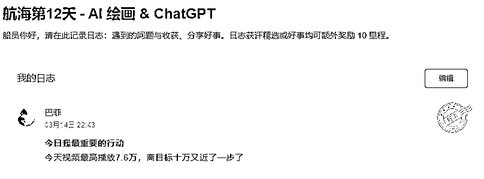

我在想如何制定接下来的⽬标，才能寻求更⼤的突破，实现真正意义上的跑通项⽬，做到变现。于是我定了接下来的七天⽬标，完成 AI 绘画⼊⻔课程的⼤纲。 

接下来的⼏天⾥⾯，抖⾳继续保持的快速的涨粉，⼩红书也快速涨粉突破 1000 粉丝。 到航海结束的那⼀天，抖⾳粉丝 8600，⼩红书粉丝 2700。 

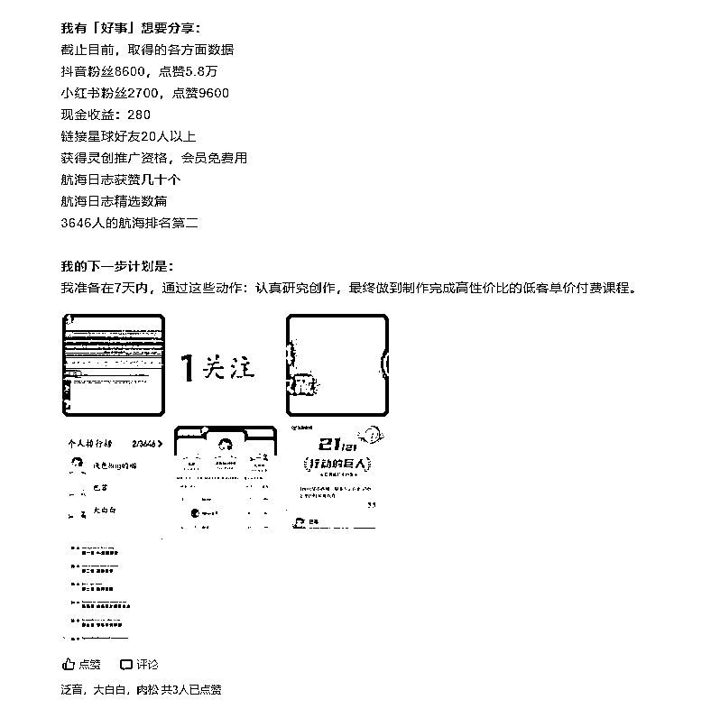 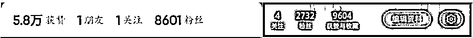

这段时间⾥⾯，我没有花很多的时间去迭代视频。只是保持同⼀种⻛格和相同的更新频率，⼀天更新三个视频。然后把更多时间投⼊到课程的准备中。

**三、我如何通过参加航海变现**

接下来讲讲，作为⼀个 AI 绘画零基础的⼈，是如何通过参加航海进⾏变现的。 当我通过 AI 绘画软件⽣成的图⽚，在抖⾳出爆款涨粉之后，我就⼀直在寻求变现的⽅法。 我的图⽚属于好看的壁纸类型，可以通过分享图⽚引流变现。航海⼿册有介绍到可以通过引流到壁纸⼩程序变现，因此我通过抖⾳的⼩程序神图壁纸，进⾏引流变现。下载⼀张图⽚的单价有 0.27，⽤⼾开通会员有⼏块钱。

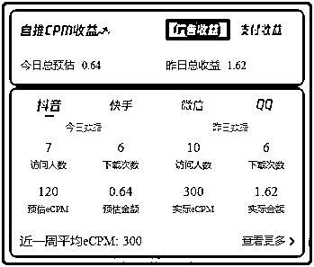

与此同时，我在灵创⼩程序发现了有推⼴合作的需求，抱着试试的态度，我加了他们的商务。

他们合作的要求是在短视频平台⾄少要有 5000 粉丝，⽽当时的我，刚好有 6000 多粉丝，刚好踩线符合要求，于是我⼜多了⼀个变现的渠道。

为了让抖⾳的流量更值钱，也为了能更好的推⼴灵创⼩程序，我改变了我短视频的变现策略⸺通过抖⾳引流对 AI 绘画感兴趣的粉丝到公众号，开发⼀套 AI 绘画的⼊⻔课程，通过绑定课程和灵创⼩程序。

卖课的同时也推⼴⼩程序，两个渠道⼀起变现。

想到好的⽅案之后，我⻢上着⼿准备课程的开发。

第⼀次开发课程没有经验，刚好想起有优秀的⼩伙伴在航海⽇志⾥⾯分享让 ChatGPT 帮忙做课程提纲。

我⼜回去复习了⼀遍，通过⼏次的修改便做好了课程⼤纲。

由于之前 ChatGPT 的账号已经不能⽤了，所以没有找到当时调教的过程的细节，我就简单的贴⼀下课程⼤纲出来的效果。刚出课程⼤纲的时候，21 天的航海也快结束了。 

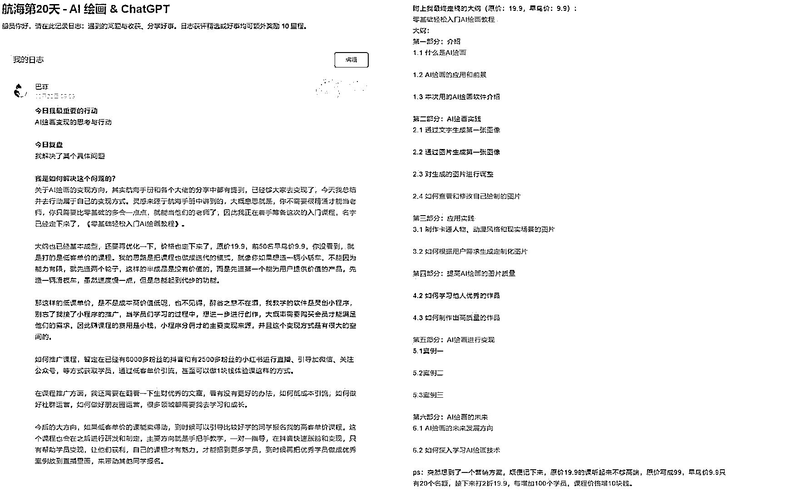

但是航海的结束并没有打断我在 AI 绘画变现路上继续往前探索。 

课程⼤纲出来之后，尽管没有经验，课程质量还没有保证，没有时间，不知道什么时候能做好，没有⽅向，不知道课程要上架哪个平台。但是我就开始在朋友圈进⾏课程预售了。

因为航海期间⼀直在朋友圈持续分享⾃⼰ AI 绘画的成果。就靠⼀张简单的⼤纲宣传海报，第⼀天就卖出去了好⼏份。

也是因为这种⽋客⼾⼀个课程的状态，让我接下来在开发课程的时候，遇到困难都没想过退缩。

钱都收了，再⾟苦咬咬⽛也是要坚持把课做完。

经常是晚上加班到 9 点回家，写课件录视频到深夜 12 点多。 

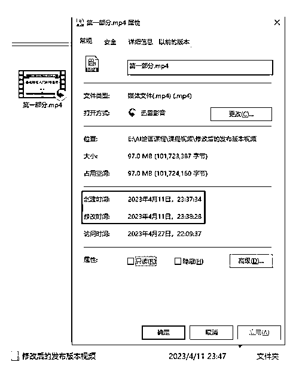

所以会发现我的视频课程声⾳不⼤，因为怕说话太⼤声吵到了家⼈和邻居。

做课的过程其实是⼀波三折的。

因为⼀开始不清楚抖⾳的默认字体不能商⽤，ppt 的默认字体也不能商⽤。 我课程都录制好了，准备找平台上架了。还好咱们⼤航海的群友嘟嘟，知道我在做视频特意发到群⾥提醒我。

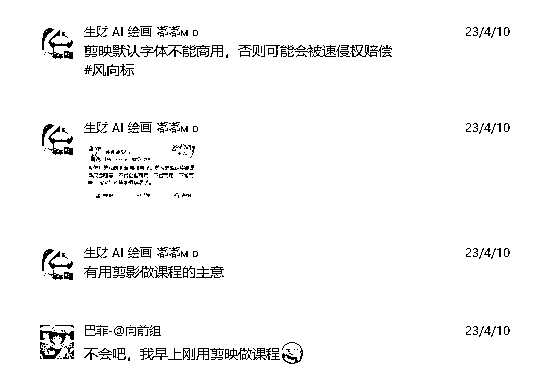

天呐！简直是毁灭性打击！

我昨晚刚熬夜录制的视频，今天⼜要重新录制⼀遍。怪我没有提前做好功课，太⼼酸了，想要放弃，想到钱都收了，算了吧，重头再来吧。

折腾了⼀两天终于把商⽤的字体改成免费的了。找到了平台上架，审核了⼀天之后。商务跟我说，因为我的 PPT ⾥⾯有出现微信号和公众号信息，没办法过审，需要修改。 

我才意识到，⾃⼰把⽔印打在每⼀⻚ PPT 上⾯，⼜要重头再来⼀遍！ 

离终点就⼀步之遥了，⼜是⼀次通宵达旦。想着好事多磨，希望就在眼前，⼜⽃志满满。

完成所有视频的录制之后，我终于松了⼀⼝⽓，可以安稳的睡个好觉了。

整个课程的制作，整整花了 20 天的时间。上架到平台的第⼀天，包括预售的部分，⼀共卖出 20 ⼏份。

虽然客单价不⾼，卖的数量也不多，但是已经感到很欣慰了。

为了提⾼⽤⼾的体验，我决定把课程做成 7 天的课程训练营学习模式。通过每天布置作业，来提升学员的参与感。

7 天的训练营结束，实事证明我的决定是对的。这样陪着学员通过每⼀次作业的进步，让他们喜欢上了 AI 绘画。在训练营结束之前就有同学问我有没有进阶的课程可以学习。很遗憾我没有时间开发进阶课程。

为了不浪费第⼀波转化的流量，我当机⽴断，决定创建属于⾃⼰的知识星球，并成功转化了 5 个客单价 399 的付费学员。 

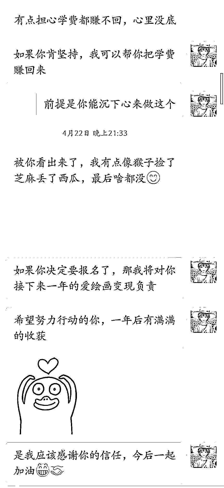

我在 AI 绘画的变现道路，就是这样通过⼀⼩个台阶，⼀⼩个台阶的向上攀爬的。从最开始的单张壁纸价格的 0.27 元，到⽬前⼀个知识星球付费⽤⼾的 399 元。 

我还在持续规划中，后⾯还想推出客单价 999,1999...的付费服务，通过⼀对⼀指导帮助学员通过 AI 绘画短视频变现。

**四、航海环境是如何对我涨粉和变现提供帮助的**

如果没有参加本次航海，我不可能会⾃⼰去学习 AI 绘画。 

我⼀直觉得时间不够⽤，哪有时间去学习新领域的知识。但这次航海，我跟着完成了航海⼿册学习，⾼⼿分享学习，甚⾄跟着优秀的航海⽇志学习，让我随时调整错误的⽅向，更省⼒的快速进步。

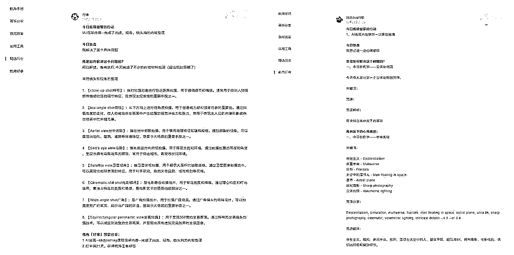

我每天都会去翻阅精选⽇志，并学习他们分享的优质内容。

如何提升图⽚质量，我是看了精选的分享才有了启发。

如何提升短视频的播放量，我也是从学习别⼈的⽇志来的。

⽤ ChatGPT 出课程⼤纲还是看了⼩伙伴的分享，⾃⼰跟着⽤起来的。 我的⼀些⾏动跟优秀伙伴的分享息息相关，我的成果离不开他们利他的分享。

我的变现⽅法，则是来⾃航海⼿册的变现教程⾥⾯的，写着⼏⼗种变现⽅式的详细操作⽅法，并分析每⼀种适⽤的场景，我结合⾃⼰的情况，做出⽐较合适的选择。

**五、航海⾥给我带来帮助的朋友们**

在⽣财⾥经常听到⼀个词被提到，那就是“利他”。以前听并没有什么感觉，这次发⽣在⾃⼰⾝上才⾮常有感触。

我在⽂章前⾯有提到，刚进航海群的时候，我⼀个认识的朋友都没有。但正是这群与我素未谋⾯的朋友，却给我带来⾮常多的帮助。

⾸先感谢对我帮助⾮常⾮常⼤的两个圈友，⼦西和天辉。

⼦西是我的第⼀个贵⼈，我们很聊得来。她懂命理，同时涉猎领域⼴泛，对信息的筛选和总结能⼒强。她跟我分享了很多制作课程的⽅法，朋友圈运营，社群运营的⽅法。教我如何链接更多⼤佬，向⼤佬们请教问题，就是在她的帮助和⿎励下，我才有机会得到其他⼤佬的帮助。

同样对我⾮常⼤帮助的天辉教练。当我第⼀次带着课程⼤纲去请教他问题的时候，他⾮常耐⼼地倾听我的问题，并给予我很好的建议和指导。在他的帮助下，我改善了课程的不⾜点。

在卖课之前，他⼜教我如何打造个⼈朋友圈 IP，如何通过稳定的在朋友圈输出，增加⾃⼰课程的曝光，教我朋友圈运营。在⼊⻔训练营结营后，学员转化到知识星球服务的时候，⼜给我提供了很好的⽅案，帮助我顺利完成付费转化。

感谢领队何伟建，在航海期间，⼀直⿎励我们多去实战。看我经常认真记录航海⽇志，就建议我持续努⼒学习和分享，冲击排⾏榜。那时候，我才知道原来我已经在 AI 绘画的排⾏榜 top10。让我更有⽃志去冲击更⾼的⾥程，最后达到了 AI 绘画的第⼆名，同时也是航海全榜的第⼆名。 感谢饼公⼦，向他请教问题的时候，交流也很愉快，他也帮我解决很多疑惑，让我更坚定做课程的信念。

感谢嘟嘟 MD，我们两个很聊得来，经常会讨论⼀些问题，相互⿎励，在我课程⽤到付费字体的时候，第⼀时间帮我纠正。

感谢⼀三，指导我课程需要设置体验课，核⼼课，并教我如何转化。

感谢 Loiy 卢艺，给了给我课程售卖技巧的建议，通过具体数字的展现，宣传的时候让课程看起来物超所值，才更有吸引⼒。

感谢我们的组⻓向前，也⼀直给予我很⼤的⿎励。

感谢排⾏榜第⼀名的浅⾊ bug 的喵，虽然我们没有过任何交流，但是看到他分享的那么多优秀航海⽇志，学习到很多。然后也觉得⾃⼰的技术和他还有差距，让我更有持续努⼒学习的动⼒。

感谢和⻛，和他交流，给了我很多创作的灵感。

感谢同个群⼀起实战的圈友们，我们⼀起努⼒，相互帮助，互相成就。

**六、写在最后**

通过这次的航海实战，不管在物质上还是精神上，都让我收获很多。

从 AI 绘画零基础⼩⽩，到开展⼊⻔课程训练营，再到 AI 绘画联盟的合伙⼈。迈出了出圈的第⼀步，也让更多的⼈认识了我，也给了我很多的机会。希望我这次的分享能实实在在的帮助到还没有参加过航海的⼩⽩。

送⼈玫瑰⼿留余⾹，我⼀路⾛来受到太多⼤佬的帮助和指导。同样的我也希望能尽⾃⼰的微薄之⼒，帮助更多需要帮助的新⼈。

我已经申请挑战 5 ⽉ AI 绘画航海的教练和志愿者，如果你也对 AI 绘画感兴趣，那我们到时候⻅。如果你对航海或者 AI 绘画有疑问，欢迎来和我链接交流，⼀起⽣财有术。 

最后的最后，要感谢那个上班 996，却⼜在航海 21 天⾥⾯，每天下班后⾄少 3 个⼩时死磕实战的⾃⼰，课程制作过程中⼀次次出错从来未曾放弃过的⾃⼰，敢于每天分享经验的⾃⼰。

我也是个严重的社恐患者，但是我深知，默默的⾏动，独享成果，没办法放⼤⾃⼰⾏动的价值。

低调做⼈，⾼调做事！在航海⾥⾼调分享⾃⼰的经验成果，帮助他⼈，也能让⾃⼰被看到！在⽣活⼯作中⼜何尝不是呢？在⼀次次的分享中成⻓和积累⼈脉，你将有意想不到的收获！

从今天起，让我们⼀起⾼调的⾏动起来，⼀起⽣财有术！

评论区：

潇湘妃⼦ : 同为 996 的程序员，加个 V？[偷笑] 

星⽉有⼼ : 感谢分享，对即将⾸次出海的我是⼀次及时的扫盲。让我更了解航海在做什么。感谢 巴菲 : 现在正是航海的报名时间段，我在 AI 绘画船上等你，我们⼀起冲[机智]巴菲 : 好的哈，相互学习[愉快] 

巴菲 : 冲〜 

⻜书何伟建 : 真棒👌 

梁⾠ : 棒棒哒 

⼀次就好 : 真棒 
