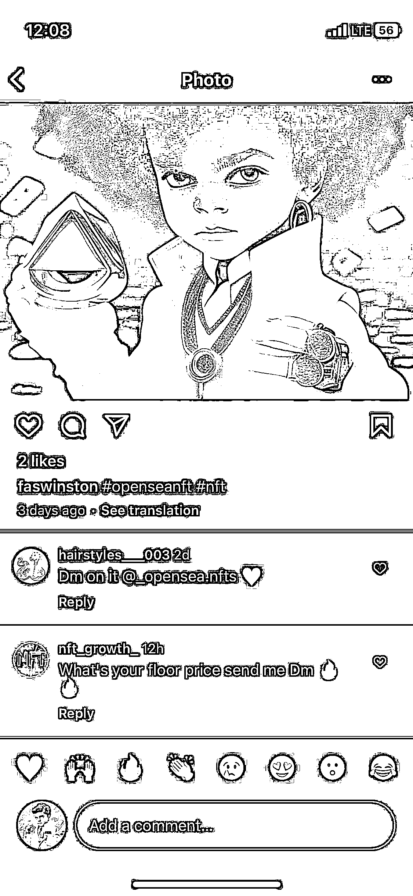
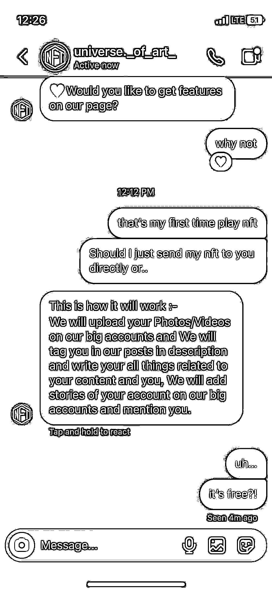
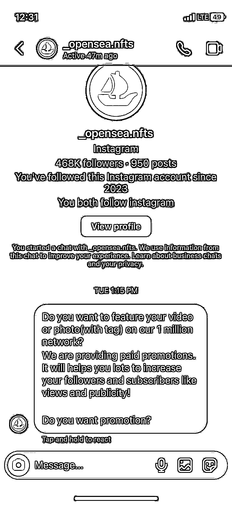
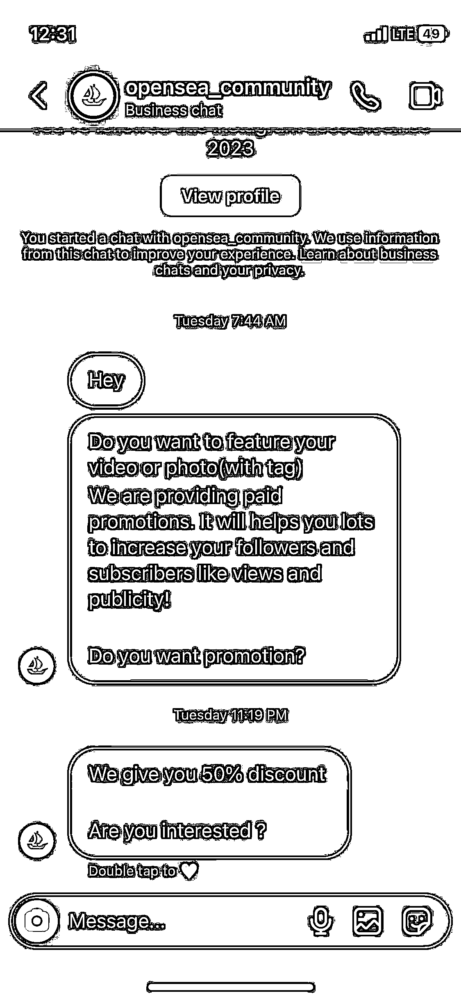
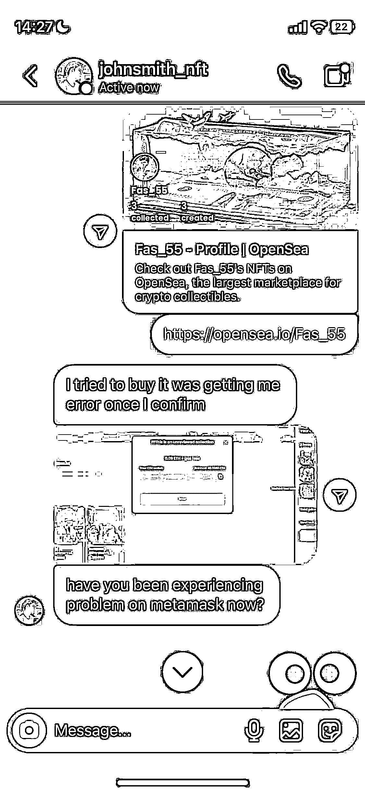

# (35 赞)妄图耍⼩聪明利⽤ AI 绘画制作 NFT 出售的⼈要注意了

作者： Jimmy Chen 

⽇期：2023-03-21 

妄图耍⼩聪明利⽤AI 绘画制作 nft 出售的⼈要注意了。很多时候，你以为⾃⼰拥有了强⼤的技术，可以为所欲为，以为别⼈都想不到的时候，往往很容易掉到坑⾥。

今天，我就有⼀个朋友被骗了，我从骗⼦的⻆度，理了⼀遍思路：

顺⼀遍思路：

1.推特找⾲菜，⾼价求购 nft，降低⼼理界限，让⼈变得兴奋 

2.事先通过让⼈点击⾃⼰的链接，或登陆⾃⼰的⽹站，获取对象的⼩狐狸钱包密码 3.说账号出现问题，并且提出是正常情况，并展⽰opensea 与⾃⼰之前的沟通截图，要求往⾥⾯充值 0.2ETH 做⼀个保证，⾃⼰才能转账过去 

4.受害者往⾥⾯充值了 0.2ETH，⽴⻢被转⾛（账号已被盗） 

5.再次说明这是正常情况，打感情牌，并保证承诺，再给 0.2ETH 就可以成功解决问题了（实现⼆次变现）

nft 的意义很⼤程度上并不取决于图像的样⼦⽽更多是背后的⼀些东西。⽐如项⽬⽅，模式，信任机制，热度……

你本就毫⽆名⽓，别⼈为什么要来买你的画呢？

AI 绘画虽然说的很厉害，但说到底，他是⼀个⻔槛极低的事情，写点 prompt，⼤部分只要研究⼀下都能做。

所以在这件事情就不存在稀缺性了

那么⼜怎么能寄希望于通过单纯的 AI 绘画直接变现或者制作成 nft 轻松变现呢？ AI 绘画仅仅是因为现在新，存在⼀个信息⻔槛，⽽且⼤部分都是英⽂预料的训练模型，因此也存在⼀个地域⻔槛。

所以很多⼈都可以卖课程教别⼈怎么作画，可事实上，这些东西在信息差慢慢变少，基于中⽂语料的模型慢慢发展起来后，就并不需要⼈来教了，甚⾄是不需要怎么学习的东西，就像吃饭喝⽔⼀样这次朋友虽然只是⼩⼩的损失了 2k，并没有酿成⼤祸。但这件事也提醒了我，⼈性的贪婪很容易被利⽤，每个⼈都要警惕。

不要觉得谁会那么傻。

有时候，不是你不傻。⽽是给你的刺激还不⾜以引起你犯傻⽽已

保持⾼度警惕和思考🤔 

    

评论区：

亦仁 : 中标，术值+1。 

在上⽅专栏点击 #中标，可查看所有中标⻛向标。 