# 亚马逊** **合集

亚马逊作为最大的跨境电商平台，都有哪些掘金机会和玩法？

整理日期：**230831**

 

 

生财风向标和周报系列另外用文档分享，地址见专属群q群消息。

往期的生财周报合集（含在线版和离线版），见专属群Q群文件和群公告。

希望大家有收获~

标题加了(精华)的表示精华贴，前面为截至今日的点赞数。

以下是目录，内容有些多。大家可以挑兴趣的内容阅读。

 

 

 

# **# **目录

亚马逊** **合集

目录

【项目认知】**11**篇

(精华帖)(261赞)从做谷歌销售到创业，10多年跨境出海，赚到千万级美金(精华帖)(183赞)自由职业 5 个月回顾之我的亚马逊进修之路

(精华帖)(173赞)亚马逊避坑指南和可复制方法

(精华帖)(151赞)真正的跨境运营和营销绝不是简单的筛选产品上架促销这么简单(精华帖)(112赞)以亚马逊电商为例，聊聊从公模到私模的整个过程

(精华帖)(111赞)从服务、流量、变现三方面，聊聊我 2 年赚到 100W 的站外推广商业模式

(精华帖)(104赞)分享我做了十多年跨境电商后，对供应链的 10 点思考(精华帖)(100赞)一个年营 4000W 服装卖家的自剖，谈谈我眼中的亚马逊和Shopee

(100赞)我是如何度过亚马逊创业这一年

(精华帖)(92赞)创业分享：从玩转海外流量，到亚马逊金牌卖家，再到为跨境电商服务商

(精华帖)(81赞)亚马逊蓝海之极致细分，根据用户分层找到极致细分

【从** 0 **到** 1**】**14**篇

(精华帖)(283赞)生财有术分享：2020亚马逊如何从零到一

(精华帖)(273赞)一文搞定亚马逊开店卖货（2020年最新店铺注册-品牌备案-卖货发货-养号）

(精华帖)(259赞)复盘一个去年做的项目：纪念币，月平均纯利润3w+美金(精华帖)(200赞)跨境电商创业全流程分享

(精华帖)(134赞)跨境小白从 0 到 1 通过亚马逊在线套利的实操分享(精华帖)(123赞)电商小白实操从 0 到 0.1 跑通 Amazon 闭环并赚到一块钱，我是如何做到的

(精华帖)(124赞)亚马逊批发，如何一年从 0 做到 100W 利润？

(精华帖)(109赞)利用生财有术的知识：1 年内在亚马逊上实现月销百万，月盈利十万

(精华帖)(97赞)低门槛定制化产品批量上架亚马逊，单月变现 3K-1.5W+(精华帖)(92赞)怎么通过业余时间靠海淘礼品卡月入 2 万+

(精华帖)(71赞)电商小白实操 Amazon 项目 OA 从 0.1 到 1，我是如何做到的 

 

(47赞)亚马逊 OA「保姆级」入门手册

(47赞)跨境电商复盘：0 基础亚马逊铺货创业一年，月销售额 20W+ 美金(41赞)3-4 人小团队如何做亚马逊精铺，实现利润翻倍增长？

【选品方法】**9**篇

(精华帖)(419赞)跨境龙头创始人教会我价值百万的选品方式

(精华帖)(259赞)如何用一套犀利的选品思维与精细化的选品工具，找到有利润空间的跨境电商爆品？

(精华帖)(173赞)5000 字讲解跨境电商选品逻辑

(精华帖)(162赞)独创：必胜法之四步打造一个百万爆款

(精华帖)(150赞)怎样在亚马逊中筛选出蓝海产品？

(精华帖)(123赞)亚马逊选品、运营的常见问题详解，探讨如何突破天花板实现极致人效的自动化

(精华帖)(117赞)如何找到不起眼但有销售空间的小产品

(精华帖)(99赞)手把手教你如何选出月入上万的单品

【工具网站】**1**篇

(精华帖)(36赞)分享亚马逊的工具网站

【进阶玩法】**13**篇

(精华帖)(439赞)跨境电商平台年利润100万的低成本小产品打法分享(精华帖)(386赞)10人团队做亚马逊年营收7000w的方法论

(精华帖)(190赞)不靠广告，如何在亚马逊3个月把一个产品做到100W销售额(精华帖)(186赞)“亚马逊零库存”玩法的简单介绍

(精华帖)(108赞)推荐一个收入不高但省心的副业，美国亚马逊礼品卡

(精华帖)(94赞)规避难中难，寻找蓝中蓝：蓝海小语种市场（日本）中的蓝海信息差品类的套利机会

(精华帖)(84赞)跨境电商独立站从发掘产品到放大的全过程

(精华帖)(74赞)如何从细节抓利润，将亚马逊业务的利润率从 1-2% 提升至 7-10+%？

(53赞)亚马逊 OA 模式分享

(精华帖)(48赞)亚马逊新品上线，前三个月要怎么备货才能保证不断货又减小库存风险？

(精华帖)(45赞)亚马逊蓝海：FBM 自发货精品模式分享

(22赞)在线人数不高，转化效果不错的 Amazon Live，单场直播几千-上万美金的亚马逊直播玩法分享

(19赞)使用ChatGPT优化亚马逊listing流程，效率提升可观(精华帖)(38赞)从水果店倒闭老板到千万级站外服务商我是怎么做到的？

 

 

【踩坑经验】**9**篇

(精华帖)(248赞)从月入 6k 做到月入 10w 的亚马逊运营经验和避坑指南(精华帖)(237赞)我是如何用4000元在亚马逊上赚到第一个百万的

(精华帖)(153赞)亚马逊从 0 到盈利 1w+ 这 125 天，我的鲁莽代价和快速成长(精华帖)(153赞)花费10万，从新手到熟手，总结我在亚马逊行业的经验(精华帖)(144赞)亚马逊失去年收入百万的一个单品经历

(精华帖)(64赞)如何通过精细化运营拯救一个亏钱的亚马逊产品

(49赞)疫情期间，从亚马逊小白到单款产品月入10w+，我踩了哪些坑，又做对了什么？

(精华帖)(48赞)不同类型卖家在亚马逊打造品牌，铺货、精铺或者精品模式的避坑经验分享

(精华帖)(32赞)一个基于创新型产品的垂类小品牌站打法复盘

# 【项目认知】**11**篇

# **# ****(**精华帖**)(261**赞**)**从做谷歌销售到创业，**10**多

# 年跨境出海，赚到千万级美金

作者：  亦仁

日期：2020-05-06

“消极的人看到的全是负面，而积极的人看到的更是机遇”。

今天周三，  如约更新。

今天的  ，与前两次的分享不太一样，没有很多方法论总结，只有他 10 多年的创业生活记录，这10年跨境出海，赚到千万级美金，背后是无数天的升级打怪，用他自己的话说，“没有哪一年不是磕磕碰碰”。

 

 

确实是这样，赚钱的路从来不平坦。

“看到整个大趋势是向上的，便可安心做好自己的本职工作，尽量少浪费时间在无效的琐碎的事情上，保持好心态、扎实练内功会看到明天的太阳。”

大家很给力，400+ 赞，一起欢迎出今天的跨境创业老兵带来他的10年创业经历分享。

— 10年跨境出海，我是如何挣取千万级美刀

大家好，我是侠客行，很荣幸受亦仁邀约，分享十年来跨境出海的经历，也是给自己这十多年创业的一个总结。

说真心话这些年行业很浮躁，自己也很少沉下心写点东西。一来文笔太次，二来今年国外的疫情对外贸、对跨境行业是个不小的打击。朋友圈不是流行这么一句话么：今年的外贸人太难了，国内打完国外打，外贸人是坐等打全场。

苦笑，咳咳! 跑题了，说正题。

先自我介绍下，虽然入生财的时候也贴过，但是当时比较简约一笔带过，因为知道圈子卧虎藏龙，不敢班门弄斧。

█ 从AdWords投手到跨境电商玩家

我06年在杭毕业，普通院校读的电子商务专业，原以为是高科技，现在想想太傻太天真。课程就是销售+管理的结合版，哪来的电商元素……上学那会某宝还没出现呢，哈哈。

直到毕业我一直觉得读了个假电商，明明是市场营销么，然后入了第一家和互联网还算相关的企业——Google 在杭州的AD代理服务商，开启了一份算是互联网的销售工作。其实就是那时阿里中供的原版，除了电话Call 就是拜访客户，那时Google 在华还是有不少份额的，无奈最后退出，结果大家看到某度的堕落。

一直以来接触比较多的是海外的咨讯和外贸企业相关的内容，直到08年考出 Google AD 广告优化师的证书，也算是成了一名合格的AdWords投手。在接触了大量海外各类咨讯、以及分析了华东各个行业的数据之后，我对AD还有搜索相关的内容越发感兴趣，每天会花大量的时间研究各种SEO 相关的技术和玩法（主要是黑帽），最后也是付出沉重的代价（后面会补充）。

 

 

因为前期资金受限SEM的玩法很容易碰到瓶颈，于是 09年告别网络广告销售的岗位，依靠父母仅有的几万块血汗钱，毅然冲进外贸电商这个行业，那时没有现在跨境这么专业的表述。

█ 从企业职员到合伙创业

09 年算是正式自主创业，约了一位合伙人两人分工，我主要负责技术端和营销，他负责供应链管理和物流，当然更多的是和邮政打交道，哪有现在这么完善的物流渠道。就这么开始没日没夜的折腾，当时小区公寓吃住一起是标配。

第一版上线的是B2C 针对服饰类的平台，因为华东供应链的强项基本在轻纺类，所以选择了服饰这个品类。09年的独立站平台确实比较少，头部也就是兰亭、敦煌、DX、大龙等，那会儿第三方平台只是萌芽期，包括 eBay、易趣这些电商程序比较成熟的平台，在国内 C2C 市场被淘宝打败后才刚刚打算杀回出口界，还处于起步阶段。

而我们起步因为资金受限，基本都是拿来主义系统，也是开源的PHP购物车程序，现在回看当年的作品哪能见人，更没有像现在Shopfiy 等成熟稳定的电商系统。为此我们付出了不少代价，其中有一次被攻击导致数据库丢失了几个小时的量，破于水平有限无法找回，都是泪。

08-09年确实好做，应该说竞争少加上本身自己对 Google AD 投放的优势和高毛利的回报，让我们2位股东各挣了一套房，要知道09-10年的杭州房价不低于北上广一线。算是捕捉到一个风口期，当然后面因为自己的贪心付出了沉痛的代价。

研究SEO各种玩法实践于自己的B2C平台，因为贪心不满足，于11年初 Google 的熊猫算法终结了这一切，一夜回到解放前。那几个月一直活在阴霾中走不出来，就是那种把自己的小孩带大后夭折的感受是一样的，当然现在回想，出来混迟早要还的。

之后因为太过依赖 Google 流量口子反而错过了 Facebook 的风口期，如果那时转战  Facebook 相信依然会收到不错的收益，所以现在总结：

「人不能太贪否则会迷失方向」

之后又复制母站打算从头再起，而且也反复阅读 Google 站长内容所有文章和指南，说白了就是内容才是王道，但那时的自己心态太浮根本静不下心做内容，所以多次尝试均无效收场，应该说对自己失去信心。

 

 

人一但迷失方向，如果没有一个人点醒和拉一把真的会颓废，我的合伙人承担了这个角色，他对技术营销比较薄弱而对市场方向把控比较有信心，在我最底谷的时候，是他带着我们找到又一块新大陆。

█ 从迷失方向到业务破局

10 年我的合伙人在业务受困时不断找出路开启 Aliexpress 、 eBay 销售，因为他知道业务不能停。那时我们已经有 10多人的小团队，不能因为一块业务受堵而退缩，而那时我们确实找到了新的发展方向， Aliexpress 在10 年上线，11年在 eBay 上的经营让我们看到了希望，而且基于过往的独立站运营经验和成熟的供应链体系，我们在 Aliexpress 和  eBay上的经营以每月几倍的速度增长，短短2年时间在这2个平台销售过亿，团队成员也持续扩容至30多人，而且依然保持高速增长。

➢  批量铺货，高毛利促进N倍增长

流量风口期我们采用批量模式，也就是现在很多大卖团队的铺货模式，多产品线多SKU多店铺一发不可收拾，而高毛利也是支撑我们不断投入直到扩容至近百人。

11-13年我们一直采用这种团队作战模式，确实获得不少的收获，而且各平台的玩法我们也是精细化运作，每年保持N倍的增长不是难事。特别在 Aliexpress ，我们从初创到类目前五基本上6个月内完成，当然期间也碰到一些问题运营过于奔放导致客户留存少，但那时根本不在乎，追求高毛利和回报让我们团队实足沦为一个外贸搬运工。

➢  抢占先机，借助 Amanzon 打造良好现金流

直到13年底，我们接触了 Amazon ，发现原来的模式可以更垂直，而且我们在经营上也是国内最早的一批商户，在 Amazon 未开启中国招商之前，我们就通过国外渠道和自身资源复制经营，概括的说之前是搬运白银，而在Amazon 早期实属搬运黄金，高客价高毛利加上快速回款，让团队一直保持良好的现金流。

那时的我又犯了09-11年做 Google 时的老毛病，完全忘记了之前被熊猫算法一套送回解放前的辛酸，再次去研究平台的政策和漏洞，各种玩法一顿操作猛如虎，快速切入平台市场。好在平台处于早期，早期如果能玩通一个玩法，尽管有风险（平台规则变动带来的业务影响），但这个阶段养活一家公司是完全没问题的，这种状态持续到 15 年。

那几年我们基本通过集群模式的打法再一次获得丰厚的回报，当然后来圈子接触多了，获知更多的圈内人脉之后，发现我们还不算快。华南现在的超级大卖其实玩的更专业和奔放，只是行业相对比较低调，或者说行业不够阳光化，被人获知的少，所以近几年可能才会被定义为跨境。至少我们这10多年的经营也就这几年知道自己是做跨境出口，一 

 

直认为就是一名卖货的。

➢  坐失良机，错过 WISH 新风口

15年后同样出现的另一个新平台 WISH ，我们启动不够快，加上 Aliexpress 、 eBay 、  Amazon 三架马车的经营确实精力有限，没有All In 而是小范围测试，错过了平台的风口期。而身边原来不少只有几个人的团队，短短几个月的时间可以让人刮目相看，后来和圈内一些资深外贸人聊起，确实早期一批商户挣得盆满钵满，一年在上海挣一套别墅不过份吧，哈哈，流口水。

随着 Amazon 入华开启全球开店后，近些年大家慢慢对我们这个行业有了更深入的接触，而且大量商户涌入平台，也就是从15年起我们团队发现原来的集群模式不管用了，价格战走起已经闻到某宝的味道，也让我深思这样的搬运还能持续多久，流量的风口还能持续多久。

09-11年的死亡危机再一次让我陷入沉思，如果不做出转变后面的路从何走，近百人的团队、花了多年的心血架构的管理体系又能支撑多久。

➢  趋舍有时，优化线上SKU & 品牌出海

最后和我的合伙人经过几个月的复盘和打磨决定开始做减法，通过 ERP 数据分析我们的SKU 量已破20W ，供商数量破500家，要应付大量的采购和管理线下生产供应链会考验整个团队的承载力，最后供应链团队中出现腐败事件是压死我们被迫改革的最后一根稻草。

15年起，当大量的商户报着一夜暴富的心态杀入 Amazon 时, 我们选择做减法，砍掉长尾供应链，优化线上SKU , 去掉低客值和低毛利的产品，拥抱大件商品销售。接触过跨境电商的都知道早期的商品均是走航空小包的模式，重量控制2KG以内，而我们15年之前就是在这条线深耕不能自拔。

同时我们启动品牌出海，把优化后的供应链精细运作。截止目前，我们已成功推出2个品牌的产品线，占各平台各类目的前十，并有有多个listing 长期占居BS的位置。

当然现在回顾那时的决策还算明智，但确实受到团队成员的阻力，因为在15年我们依然高速增长，年销售体量上亿级不是刹车能直接刹停。而且我们 Amazon 的增长还在持续，团队资源也是更多的倾斜于它。

 

 

现在我们依然保持三架马车，同时通过几年的品牌经营也慢慢让自己沉下心来，原来浮造的心安静很多。看了大量圈里分分合合的故事或者叫事故，一步步走来让自己成熟很多，也考虑更多，更多的责任让自己始终坚信现在走的这条路是对的。

以上基本上能表述出我以及我们团队这几年在跨境行业的处境，其间也有去尝试不同市场和平台的经营，均已失败告终，最惨的是前年All In 做RU 市场的JOOM，一年不到的时间20人的小团队直接解散，损失不少，像这样的案例还有不少。

因为这10年期间我们经营了超过 20个市场的 30个以上平台，有收获更多的是失败的收获，当然不尝试怎么知道结果，所以在我们团队始络保持一颗创业的心态，并且会大量试错。

————————

以下主要分享近三年的经历：

10年跨境出海一直做着搬运工的角色，各种滋味只有自己知道，所以近三年我们一直在品牌经营上下功夫，虽未出好成绩但至少坚信是正确而且长远的道路.

目前我们团队分二大模块：「自营+第三方」

「第三方」即为一直说的三架马车，毕竟这么多年的资源积累而且相对稳定。而「自营」是我们现在重心去打造的这个模块，以品牌为导向向海外用户输出中国制造同时输出服务。

我自己知道这是条正确的路，只是走的会很长。我们又回到09年的独立平台，当然10年后看10年前又是一翻滋味，毕竟10年前更多的是为了生存，而现在更多的是想做点事，哪怕一点点。

想通过海外本地化的服务让品牌更有生命力，也想通过自己的实践给周边的一些工厂，制造业的朋友一个模板，凭什么我们中国制造的产品只能卖几美金，而采购商贴完自己的品牌能N倍溢价，不就是我们不会讲故事吗？

————————

然后谈下疫情对外贸和跨境的影响吧，希望自己的一些文字对大家有帮助哪怕一点点，好比我平时也会看很多文字，而且会快速筛选出自己认为有价值的内容。

 

 

搭过团队的应该能认同好比每天在打怪，而且每次出现的怪兽破坏力更强，而每次打败后自己也会上一个台阶，所以这10多年的创业生活我感觉一直这么度过，没有哪一年是没有任何磕碰的。所以这次疫情我们也是这么正视，消极的人看到的全是负面，而积极的人看到的更是机遇，特别现在是信息碎片化的时代，各种大 V 自媒体更有带路党真的需要擦亮眼去辨别，而且需要把眼光放远未来的3-5年以后。

「看到整个大趋势是向上的，便可安心做好自己的本职工作，尽量少浪费时间在无效的琐碎的事情上，保持好心态、扎实练内功会看到明天的太阳。」

最后也借生财宝地给大家做个推荐——

有工厂，有供应链，有研发的团队和企业可以对接我们，我们可以一起品牌出海。

有海外流量资源的企业和团队可以对接我们，可以一起探讨下，因为我们正需而可能你们正有。

附上WX： Eric-bo88（注明生财）

注：因为平时工作和家庭时间占用比较多，加WX只是问候和刷我朋友圈的财友抱歉让您失望了，本人朋友圈没有任何和工作业务相关信息更没鸡汤。

评论区：

晓川 : 没人？

军哥 : 有

福建  珠宝-Mr游 : wish 很短暂

陈先森 : 韧性！看到大家赚钱的亏钱的，东山再起的，无外乎一股不甘由内而外喷薄而出。

侠客行 : 对滴，快速试错

Benjamin : 来了  来了

Dreamland : 当当当[鼓掌][鼓掌][鼓掌]

seven : 一，初入亚马逊

14年在公司就职做亚马逊，那时候疯狂搬运公司在ebay的listing，描述标题直接照抄，一天多的时候可以上架100条lisitng。

那时候真的很爽，就是上个再烂，都是上什么出什么，很刺激肾上腺素。

但是弊端也非常明显，跟卖问题非常严重。但是公司自主研发的ERP设置了自动调价功能，由于利润高，倒是可以一路价格战致公司底价。那时候公司产品出单最多的集中在3-9美金，现在无法想象，0.99-2美金的东西，那时候是怎么可以玩得那么开心。

 

 

但时间久了心中一直很困惑，为啥公司的底价永远做不过人家，不是说大公司么，价格站怎么就干不过深圳的某树和某拓。

总之公司也是不管不顾各种弊端，一路狂奔，巨多店铺同时运作，野蛮生长，这也埋下了危机的伏笔。

二，疯狂死账号

为了扩大体量，为了和ebay竞争的亚马逊，早期是对中国卖家的各种野蛮手段不管不顾，但情况来到15年的时候发生了巨大的变化，野蛮的中国卖家伤害了亚马逊公司价值，亚马逊开始收紧政策。

由于大家都是投石问路，野蛮生长，一路狂奔，公司多店铺运作的所有账号都是放在实体电脑，而电脑都是放在同个机房，30平方左右的机房，用货架的方式，摆放了上百台电脑。

由于公司在ebay是华南区第一，ebay有大客户经理撑腰，不知道死账号一说，那时候公司什么最好卖，侵权最好卖，什么产品利润最高，侵权产品利润最高。可是来到亚马逊可不是ebay那一套了，15年开始疯狂死账号。一年死上百个账号，跟感染了瘟疫一样，成批成批的死，那时候每天上班就跟上坟一样，第一件事就是看看又死了多少个账号。

其实主要原因是出在了机房，所有店铺都关联了，那时候不知道，天天排查，排查上架姿势是不是有问题，排查各种问题，就是不知道原理核心问题是关联。

由于一路狂奔野蛮生长带来的甜头，公司的决策也是不管疯狂死账号，根本谁愿意停下高速的发展，于是不停下来排查原因，一路狂死账号，一路狂上产品。但终究碾压不过亚马逊封店的速度，很快，公司账号不够用了，出现了一个组十几个人，嗷嗷待哺的等一个账号。

有句话叫不给马儿草，还要马儿跑，公司政策根本不管你没有账号，总之业绩下滑就拼命扣钱，于是不违法劳动法的操作下，亚马逊部门发生了剧烈的震荡，大批员工离职。

三，长出新芽

经历了剧烈震荡和血洗，清走了老员工，新人新气象，一切都可以不被老员工的思想束缚，16年也排查了原因，用上了高大上的云服务器重新起号。这时候基本账号不死了，但是竞争激烈了，开始走起了品牌路线。

一切都从新的开始，规划了品牌线，走起了FBA，客单价也一路上涨，从过往几美金主流一路上涨30美金并不断提高主流客单价。

 

 

一切都往好的方向发展了，但新的问题也同时在暗涌。公司采取组别竞争的方式，让各组跑马圈地，争个你死我活，受益的还是公司。

# **# ****(**精华帖**)(183**赞**)**自由职业** 5 **个月回顾之我的

# 亚马逊进修之路

作者：  郑小焦

日期：2021-03-31

复盘  案例分享  小焦亚马逊修bug系列

2020年10月26号，受贵人之恩，我来到408。

结束四年半的酒店生涯，开始自由职业之路。至今五个月，从“焦虑的小焦”转为“聚焦的小焦”。得之生财，“小透明”文章距今也有五个多月，我想复盘一下这段时间的历程，也请大家督促我。

 

 

《自由职业5个月回顾之我的亚马逊进修之路》

https://shimo.im/docs/KJgkTqhcd3V8cgY8/

 

 

评论区：

 

 

小蚁 : 小焦好厉害！[嘿哈]

CC : 小焦棒棒哒

Winter.校长 : 感谢分享，小焦

老黄牛 : 又有亚马逊干货[强][强]

天天的那个天天 : 厉害干货

蓝子鱼 : 小焦好棒啊，认识两年多你给我的感觉永远充满正能量

Dimple : 厉害的小焦

季伟宏 : 小焦好棒

# **# ****(**精华帖**)(173**赞**)**亚马逊避坑指南和可复制方

# 法

作者：  小马丁

日期：2021-02-03

跨境掘金  亚马逊  跨境电商

大家好，我是小马丁，擅长独立站和亚马逊的精细化运营。

我们的slogan是“后电商人之乐而乐”。

电商人的快乐其实很简单，少亏点是快乐，多赚点也是快乐。

电商，特别是跨境电商，是一个繁华中带着复杂，美丽中又暗藏波涛的精彩世界，小马丁在这个精彩的世界里摸爬滚打若干年，带着一身伤痕累累和还算过得去的成绩，总结了一些还算有用的经验。

在沐文大佬的鼓励下，我们决定把这些经验分享给大家，为大家提一些也许有用的建议。

https://articles.zsxq.com/id_eoipieiw3rpe.html评论区：

阿冠 : 内容好干，光是网址都收藏了好几个，谢谢马丁哥！

小马丁 : 谢谢阿冠～

SHUAI/帅帅 : 太干了，感谢大佬分享，已收藏

唱歌似学友 : 干活满满！

 

 

无题 : 感谢分享

Ronny : 好好学习,天天向上

zone : 龙珠预定😁

赵博洋 : 又有成功方法又有踩坑经验，太强了吧！

# **# ****(**精华帖**)(151**赞**)**真正的跨境运营和营销绝不

# 是简单的筛选产品上架促销这么简单

作者：  鱼丸|亦仁助理

日期：2022-01-12

大家做跨境，通常的运营手段都是筛选产品上架促销，但这样的方式，很快就会遇到瓶颈。本期「生财合伙人」，@拓跋勇老师，一个出海十年的卖家，就来跟我们分享一下他不同的看法。

本篇内容将以七部分展开叙述：

1\. 精准出海的第一步，是锚定你的用户群体

从十万个普通用户中挖掘需要我们产品的特定用户，还是从五千个特定用户中寻找愿意使用我们产品和服务的三百个用户？

2\. 正确的产品观念是为了解决特定用户的特定问题，然后悄然发展

机会越大往往意味着竞争越多，一款产品满足了所有的市场需求，看似很美好，但却最容易被快速淘汰。

3\. 没有优质的内容生产能力，找一个靠谱的合作者比埋头苦干更好

 

 

一个新的出海企业或者团队其实是不具备内容制作能力的，但是这并不意味着我们要放弃，恰恰这是我们跟其他人能够拉开差距的很好的一点。

4\. 一定要建立属于自己的品牌

品牌的核心在于加深用户的记忆，这样才能发展的更持久。

5\. 先要让尽可能多的目标客户看到我们，然后让有意向的客户进入我们的页面视觉既包括你要销售的产品，同时也包含你的商品页面，网站形象和网店形象设计，这几个缺一不可。但大多数的中国出海企业只完成了第一部分，缺少对第二部分的补充。

6\. 先抓专业用户产生口碑，由专业用户向普通用户做波次扩散

很多人把推广简单的理解为促销或者带货，即使是找渠道带货也是采取促销的方式，但是这样的方式换来的并不是忠诚的用户，甚至不是真实的用户。

7\. 站在中间做腰部企业，保持好的产品质量，做用户能够消费的起的产品

并不是说我们随意创建一个品牌搞一款产品就能够实现成功，真正能够让我们发展的更健康的是我们做这件事儿能够弥补用户的某种需求缺失。

最后，他还会以 Savior Equipment ，不到 10 人的公司，却创造了一年 4000 万利润的户外品牌为例，验证上述论点的有效性，建议你可以花费 5 分钟快速阅读。

目录

一、用户

 

 

二、产品

三、内容

四、品牌

五、视觉

六、传播

七、价值

---正文---

非常感谢生财有术团队的朋友邀请我分享自己对于出海互联网品牌产品营销方面的一点浅见。说实话，作为一个在跨境电商行业十年的老油条，可以说是全程经历了这个行业的变化，看着中国卖家想尽一切努力进入海外平台，到平台张开怀抱接纳这个群体，一起快速发展，又调整规则和风控筛选掉一大批靠灰色手段成长起来的卖家，如今有人依旧热情高涨地涌向亚马逊、Ebay，有人却只能抱憾离场，开始追逐独立网站的新风口，真可谓：有人星夜赴考场，有人辞官归故里，少年不知愁滋味，老来方知行路难。

事实上绝大多数的出海企业之所以出现失误，在我看来是因为没有抓住问题的核心，用一句话来概况，出海品牌应该做的事儿是寻找有规模的用户群体，用好的品牌和产品视觉把正确的产品传递给精准的用户。如果一定要提关键词的话，我把它整理成了：用户、产品、内容、品牌、视觉、传播、价值。

**-01-**

用户

 

 

不管是平台类运营还是品牌的运营，首先要想清楚的一个问题就是我们未来服务的用户是谁。这个问题几乎可以决定我们后续发展的一切可能性，但是中国企业比较奇怪，绝大多数的公司都是先从产品出发，绕了一个弯子之后才想起来去思考用户的问题，我们都知道互联网的流量成本是在飞速提高的，如果你没有确立好要服务的用户群体而贸然开启一门生意，后果就是你后边做的绝大多数的推广工作都是无效的。

有精准的目标用户群体有助于我们向下去挖掘流量和内容的渠道，相比较而言，从十万个普通用户中挖掘需要我们产品的特定用户和从五千个特定用户中寻找愿意使用我们产品和服务的三百个用户，工作量和成果是完全不一样的。

经过这十年的磨练，我的体会就是不管你从事什么行业，确立用户都是第一位的，它会让我们的目标和方向感更为清晰。

拿出海零售行业为例，早几年大家吃的都是流量红利，因为卖家数量少，同类产品少，只要你在产品上稍微下点功夫，很容易能够借助低廉的流量成本快速起来。

但是到了当下，绝大多数产品背后的流量成本已经可以说是惊人了，如果你还是盲目地去搞，有非常大的概率是会失败的，并且出海行业跟国内零售业最大的不同在于，我们作为货物和商品的所有人，却无法完全自主地处理自己的产品，一旦出现滞销的情况，大概率这些商品库存的价值会直接变零，所以不管你要做什么，请先瞄定你要服务的用户群体。

**-02-**

产品

 

 

一般人对于产品的理解都是赶热点，有八九成以上的企业习惯性地把扒数据称之为选品，事实上这只是产品的一个维度，并且还是比较浅显的一个维度，正确的产品观念是为了解决特定用户的特定问题的。

举个例子：2019 年爆发的新冠疫情让很多人不得不放慢节奏，尽量在家，所以居家消费品的销量是在持续增长的，人在室内环境下一长会感觉到非常无聊和焦虑，于是很多行业的产品都可以换一种思维做下改造。

拿我熟悉的北美狩猎射击行业来说，以往大家都是习惯于室外射击场训练或者户外狩猎，疫情一来，都只能乖乖待在家里，所以我们就开发了一款可以居家室内练习射击的产品，并且开发了一套完整的练习教程和测试方案，这样以来不管是重度用户，还是新用户都可以通过我们的产品排解无聊的情绪并且提高自己的技能，这在我看来就是为特定的用户提供特定的产品解决他们的实际问题。

如果你的产品对于用户来说替代性太强或者可有可无，那么很有可能是没有什么发展机会的，最可怕的是一款产品满足了所有的市场需求，这种愿望看起来非常美好，实际的情况却是如果有巨头盯上了你的领域，大概率你是会被快速淘汰的。

我们都知道手机上即时通讯工具的发明人并不是腾讯，也不是 FB 这样的公司，但是到最后能够收割市场的却是他们，原因就在于此，机会越大往往意味着竞争越多。就算零售行业，也是存在这样的现象。比方说个人护理行业，几乎是每个人都需要的，只有做过的人才知道，你想冲出来有多难，要么是被巨头收购，要么是被巨头弄死，完全没有第三种结局。

所以开发产品一定要针对特定群体，解决特定问题，然后悄然发展，用句电影的台词：

悄悄的进村，打枪的不要。

 

 

**-03-**

内容

我一直以来都保持的一个观点就是中国企业是能够做出好的产品的，但是能够做出好的内容的团队确实比较少。

绝大部分的出海企业都面临的一个共同问题就是有产品没内容，事实上一个产品的设计和改造是相对不那么复杂的，这就像一道数学题一样，掌握了正确的算法，得出的答案基本都是一致的。

但是内容就没那么简单了，大家现在都还处在强行启动的阶段，产品推出之后一通推广组合拳下来，要么生，要么死。但是硬广的转化往往比较悲惨，如果没有掌握内容的生产和输出，我们会在推广阶段浪费不少的资源。

去年海外短视频平台上挂起了一阵风，**TIKTok Leggings **在各个电商平台上的销量用疯狂都不足以形容了，其实在我看来，一般的团队和品牌是非常难做到这一点的，这里边的核心就是没有大规模的内容生产和输出导致的。

一个新的出海企业或者团队其实是不具备内容制作能力的，但是这并不意味着我们要放弃，恰恰这是我们跟其他人能够拉开差距很好的一点。

举个例子：我们所处的行业，有几个美国的公司，背后其实就是海外华人，但是他们利用自己的地域和语言优势，在当地找了一些内容制作公司来帮助他们建立相关的东西，从产品的图片、视频、乃至一些对外发布的博客文章、新闻通稿、网站软文，社交媒体的贴文素材。

 

 

有了这些内容的帮助，人家虽然在产品方面并不比我们做的好，但是有优质的内容来吸引目标客户，最终实现的销售成绩明显比我们突出。我在给我们的同行朋友分享时多次提到的一个品牌 Savior Equipment 就是如此，当然了，他们产品本身做了也非常好，但是如果没有优质的内容做铺垫，并不会有太多人关注到这个品牌。

 

 

 

 

这里需要强调的一个点就是，绝大多数的行业都是讲究分工的，一个公司，一个团队并不能解决所有的问题，这就好比你是一个做产品的，但是内容方面可能是个小白，为了能够完成这件事儿，需要的不是建立自己的内容团队或者从零去学习如何生产内容，最有效的方式恰恰是找到一个靠谱的合作者，然后制定合理的方案，循序渐进的实施计划。

 

 

我建议同样在做出海的伙伴，可以在内部设置一个岗位负责协调本土的资源，这会大大地加快我们的工作效率，并且成果一定是要比我们自己埋起头苦干好得多的。

**-04-**

品牌

在拥有了特定的目标群体，有了产品和内容之后，一定要建立属于自己的品牌。事实上，从严格意义上算，品牌要排在内容之前，品牌的核心在于加深用户的记忆。

我们就曾经碰到过这样一个问题，在我们发展过程中曾经开发过一款产品非常受用户的欢迎，几乎没有一个差评，但是当时我们推广的时候只是一味地强调自己的产品有多好，以至于不少客户知道了产品，不知道背后的品牌，因为那个时候我们完全没有品牌概念。

一年以后，市面上出现了一模一样的产品，连包装都模仿我们，价格却连我们的一半都不到，于是尴尬的情况出现了，原本属于我们的客户群体，纷纷转头把钱投给了跟我们销售同样商品的卖家，我们作为这个产品的开发者，只能干瞪眼，如果一早就有品牌的概念，有知识产权的概念，我想这一切都不会发生了。

经过这件事儿之后，我们痛定思痛地决定不论如何都要建立属于自己的品牌，只有这样我们才能发展的更持久。一个品牌绝不仅仅是商标那么简单，背后有大量的工作需要完成，首要的就是品牌故事，要告诉别人我们是做什么的，为什么要做这件事儿以及我们的品牌能够帮助客户解决什么样的问题。

 

 

 

 

这些信息在我们后续跟渠道的合作中非常重要，也是品牌重要的组成部分，不仅仅如此，一个品牌还要有自己的 VI 系统，要有自己的核心卖点，最重要的是要让自己能够被用户记忆。这里边的 VI 系统包括：品牌 LOGO 、品牌色彩、品牌字体、品牌包装、品牌的基础 Banner 以及品牌 Slogan ，还要有自己的品牌官网做形象的展示。

**-05-**

视觉

说到视觉就不得不回头看下内容部分，因为视觉属于内容的一项工作，也是在我看来比较难的一项工作。

我们国内的企业习惯了国内的审美风格，不管是什么网站和平台，尽可能做的就是色彩的堆砌，老外跟我们存在着根本性的差异，大多数的网站和平台都力求简约干净，所以你会发现像亚马逊这种电子商务巨头，他们的产品图片用国内的眼光看简直是 LOW ，但是老外就是认这么一套，他们感觉能够一眼识别产品的本来面貌是件非常重要的事 

 

儿。

但是单纯是在电商平台陈列商品是这样，做推广可就不是这么回事儿了。有相当一部分人存在的一个误区就是懒，懒得为同样一款产品建立多个视觉表现形式，事实上我们看一些优秀的品牌，他们把产品的视觉部分通常分为三个模块：自有渠道、平台要求、宣发渠道。

在自己的官网和电商平台使用的图片存在一定的差异，在一些媒体网站、内容渠道恰恰是另外一套体系，这是因为平台的作用是为了方便用户识别和结算的，但是宣传渠道的作用是为了吸引目标用户的关注形成转化的。在平台你当然可以白底图，但是在渠道里，最佳的方式是融合场景之后的图片，这样更能够打动消费者。

 

 

 

 

如果你是一个内容网站的编辑，你会选择哪个配图，正确的答案恰恰是两个都要，因为场景图可以做 Banner ，也可以描述产品，但是单纯的商品图可以让访客更直观的知道你要介绍的东西，两者缺一不可。而实际的情况是，大多数的中国出海企业只完成了第一部分，缺少对第二部分的补充。

在我看来，视觉既包括你要销售的产品，同时也包含你的商品页面，网站形象和网店形象设计，这几个缺一不可，因为我们捕获客户的过程就如同一个漏斗一样，先要让尽可能多的目标客户看到我们，然后让有意向的客户进入我们的页面，最后让那些有购买意向的客户下定决心购买我们的产品，所以每一个环节应用到的视觉元素是不一样的，不能一概而论。

**-06-**

传播

 

 

像我说的中国企业不擅长做内容、品牌和视觉一样，传播更是几乎九成以上公司的短板。有很多人把推广简单的理解为促销或者带货，即使是找渠道带货也是采取促销的方式，但是这样的方式换来的并不是忠诚的用户，甚至不是真实的用户，不信你可以看看自己的产品，有多少是因为低价或者折扣进来的，真正想要做好营销工作，就要先搞清楚一个信息是如何传播的。

我之前曾经总结过零售行业的一个营销窍门：先抓专业用户产生口碑，由专业用户向普通用户做波次扩散。大多数普通人或者叫普通消费者存在一个羊群效应，他们总是喜欢跟从头羊到一个地方，也就是俗称的跟风。

我们会看到一些有影响力的媒体网站或者网红往往具备着很大的号召力，这种号召力是自上而下的，所以一些聪明的品牌或者企业，非常善于抓住机会，先从这些具备影响力的专业用户入手，让他们先体验我们的产品，然后利用他们的影响力来实现我们的转化目标。拿我们这个行业的领头羊 Anker 为例，他们在去年的年中曾经跟消费电子测评领域的大牛  **nbox Therapy **作的一期视频

 

 

该视频到目前的播放量差不多一百一十万了，这等同于一个什么概念呢，如果按照流量来计算，我们可能在电商平台想要达到这样的流量需要花费的是巨额的资金，按照最低  1美金的成本计算的话也要人民币近 700 万的成本。

当然了，这是视频平台的数据，跟真正的电商平台的流量是有差异的，但是当你的品牌和产品在短期内获得有效用户的有效曝光接触之后，会在不少人的心中留下印象，有部分的浏览者会在看到视频的同时选择下单购买视频中推荐的产品，还有一部分当时没有购买商品但是已经记住了这个品牌和他们大致的商品解决什么样的问题，这就在用户心目中树立了一个正确瞄点，一旦他们某天有相关的需求，一定会相切这个品牌，并且有较大概率选择这个品牌的商品。

 

 

同样的，一些用户特征非常清晰的内容网站，新闻媒体，网红达人，测评机构都是我们做营销过程中非常好的传播渠道，我们只要是做运营，就离不开这些渠道，除非你愿意一辈子只走促销这一条路。

通常越是特征清晰的用户群体，它的传播渠道也会非常有限和清晰，我们需要做的工作就是在你树立正确的目标用户群体之后花费精力把它给梳理出来，然后打通这些环节，我称之为搭建我们和用户之间的桥梁。

而这个工作很重要的一点就是正确识别这些渠道并且用合理的话术开发它们，这里我给大家一个小的建议，一旦你的品牌、产品定下来后，找专业的写手帮你去整理出来不同的话术，比方说邮件模板，电话沟通话术，拿到足够的资源渠道会帮助我们尽可能的减少失败的概率。

**-07-**

价值

很少有朋友会思考价值的问题，但是这个认知层面的东西往往决定了一件事儿能够做多久，一条路能够走多远。

并不是说我们随意创建一个品牌搞一款产品就能够实现成功，真正能够让我们发展的更健康的是我们做这件事儿能够弥补用户的某种需求缺失，就如同我一开始看到我们行业的现状，头部的品牌享受着高溢价，但是对于普通消费者而言完全负担不起，底层的卖家靠着低价收割用户，但是产品并不能达到合格商品的要求，所以我们选择站在中间做腰部企业，保持好的产品质量，做用户能够消费的起的产品。

 

 

如果你所在的行业不存在这样的机会，强烈建议你要慎重，因为没有一个人一个企业能够从现有的秩序中快速成为头部的，如果你做的事儿跟底层竞争者没有任何区别，那么市场可能不那么需要你。

为了能够让大家看到上述论点的有效性，我跟大家拆解一下我在上边提到的一个户外品牌 Savior Equipment 的成长路径。

**Savior Equipment **一个专业从事射击周边产品的品牌，通俗一点说是一个枪包支架的品牌，该品牌诞生自 2017 年的下半年，我们可以简单的看下它的商标注册情况。

 

 

事实上这间公司最初并不是销售该类产品的，并且他们最初的团队规模非常小，之所以知道他们是因为他们公司刚好在我一个美国朋友家的附近，公司是由三个华人小伙儿创建的，他们因为身处美国，发现市面上没有质量非常过硬的步枪枪包，但是美国本身又是一个合法拥枪的国家，拥有庞大的持枪群体，于是这几个小伙一合计，注册了一个商标然后做起了枪包的生意。

 

 

我在谷歌上查询这个品牌的时候发现第一次出现是一个射击论坛里，当时他们自己注册的账号发帖介绍自己的产品，结果下边的评论清一色的都是说产品看着不咋地，是不是垃圾的中国货之类的言论，后边让他们发生巨大转折恰恰是我那位美国朋友，因为他本身是美国步枪协会认证的射击教练，加上距离比较近，于是他们经常一块儿沟通如何改进枪包让它变的更好用，最后搞出来的第一款正式意义上的产品如下图：

这个产品是 2017 年 11 月 17 号正式在电商平台发售的，因为产品的开发阶段有行业的重度用户参与设计和改进，一经发售轰动整个射击圈子。当然，因为有人指导，他们产品发售前基本上是把宣传工作做到了极致，不信你可以往下看。

首先他们找了在射击行业小有名气的一个内容制作公司  **offensivegroup **助他们完成产品拍摄、视频拍摄和社交媒体内容制作和内容托管等等工作，不从事这个行业的人并不清楚这是一家什么公司，所以我连带给大家看下他们的业务。

 

 

这个公司名气并不大，但是他们给不少的户外战术装备公司做内容方面的服务，其中最具代表性的就数5.11这个战术服饰品牌。

 

 

于此同时，这个当初名不经传的小品牌找到了另外一个公司 leviathangroupllc 跟他们合作，这个公司同样也没什么名气，但是他们却是一家在射击领域拥有上百位 Youtube网红合约的公司。

 

 

 

 

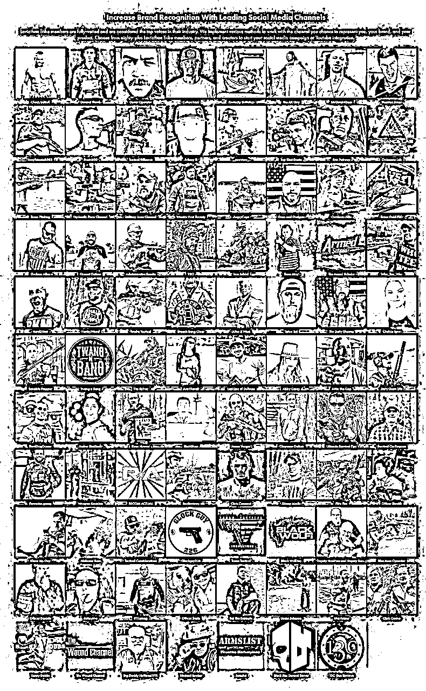

于是在好产品+好的制作团队+好的传播团队的强强组合下，该品牌很快就在专业领域内刮起了一阵风，但凡有一点影响力的网红和教练几乎人手一个他们家的枪包，并且更有意思的是，在这样的传播效率下，他们开始对专业领域内的媒体，网站，论坛进行大量的内容铺设，如果你感兴趣的话，可以到谷歌上搜索 avior Equipment forum ，你会发现这样的结果。

 

 

有大量的论坛在持续不断的发酵关于这个品牌的内容，要知道用户的关注度就是品牌的影响力，而这种持续的影响力会转化成源源不断的购买力，结果就是，他们的产品在亚马逊上上架三个月后站到了品类的第一名，并且从 18 年一直保持到现在从来没有其他品牌打破这个记录，他们的产品售价也要比同类型的其他产品高出不少，但是依然架不住用户的热情，理由其实也非常简单：

**1**、产品设计、功能、质量、确实好；

**2**、**savior equipment**有完整的品牌概念；

**3**、在专业领域内的口碑超级好；

**4**、产品信息覆盖的面非常广。

结果是什么呢，一年以后，他们上新了相同系列的不同产品，依然快速卖爆，两年之后他们从步枪枪包拓展到手枪枪包依然卖爆，2019 年他们进一步拓展步枪支架，无一例外的爆，2021 年，他们拓展了手枪支架，还是卖爆了。

与此同时，他们的销售渠道不断地拓宽，从最初的亚马逊平台，到后来自己的品牌官网，再到后来他们在线下超过 30 家经销商销售该品牌的产品，如果你现在去查询，你会发现亚马逊、沃尔玛、eBay、好市多、连新蛋都在销售他们的产品，而这一切恰恰就遵从了我上边分享的理念。

在一个特定行业寻找特定受众，用优质产品+好的品牌形象+优质内容+强有力的传播方式深耕，我们最终都能够找到适合自己长期发展的方向。

 

 

2020 年的时候，我曾经问过我那美国朋友，他说他们这个公司在 19 年的时候也就不到十个人，一年创造 4000 多万的利润。

更有意思的是，去年为了研究好这个品牌，我托朋友帮忙在美国买了他们的产品并且空运了回来，比较搞笑的是，我在深挖他们背后的供应链时发现他们合作的工厂就在广州，当我真正拿到的他们产品的时候，我才切身体会到为什么用户对他们那么狂热了，产品的功能设计非常合理，用料也非常扎实，最关键的是细节的地方他们都做的非常到位，举个例子：他们把产品的包装盒内侧设计成了靶纸的图案，每个客户收到产品之后，包装可以直接拆开当作靶纸来使用，丝毫没有多余的东西。

现在看来不管是偶然还是必然，他们选择了一个中国多数企业都不太了解的领域，但是他们具备天然的优势，并且这个领域的用户群体非常清晰，资源渠道也非常清晰。最关键的是他们深知自己的不足，所以懂得借势，寻求专业领域人士的帮助，这才有了后来的发展，坚持服务好一类用户，坚持做好的产品，坚持做品牌，懂得做传播，这就是他们的成功经验。

事实上有很多行业都值得这么走一遍，比如母婴领域、垂钓设备领域、骑行野营领域、宠物用品领域、甚至是游戏办公领域，因为存在太多特定场景下的特定用户需求了，我们需要做的不过是确定好要服务的用户群体、确定好行业、深挖用户需求、内容制作资源和传播渠道，以品牌的方式完成每个步骤的链接，如果你还是不懂，强烈建议你去认真挖掘一下** BarkBox **这个宠物用品领域的案例，你就会发现真正的运营和营销绝不是简单的筛选产品上架促销这么简单了。

除此之外，品牌出海行业还存在着大量的问题和机会，比如如何保持足够的优势，如何改造自己的产品，如何形成有效的产品线以及如何保持健康的发展态势，介于内容过多，我就不再一一赘述，如果你感兴趣，欢迎点赞评论，如果点赞数量超过 188 ，我再来跟大家分享别的内容~

 

 

最后再次感谢生财团队的盛情邀请，我是拓跋勇，一个在跨境行业混迹十载的电商从业者。

P.S. 如果你也想在生财有术专栏分享你的经验和认知，请点击链接

http://form.shengcaiyoushu.com/f/HA1G1g  填写表单，我们会陆续邀请有赚钱相关经验和案例的嘉宾做分享。如已填写表单请忽略。

评论区：

鱼丸|亦仁助理 : 感谢  老师的分享，大家如果有什么问题。可以在评论区留言~ 拓跋勇 : 感谢生财团队的邀请，大家有什么问题可以评论区互动，不方便公开交流的可以添加微信tuobayong跟我交流

草木青 : 先赞再看

M_Alex : 写的真的是很好，提供了不少新的思考角度。

Act-炼 : 像艺术品一样jing mei q

唐杰(Jason) : 有高度，有洞见

超云 : 打开世界的新视觉，非常感谢分享，收获极大

郑小焦 : 太精彩了，谢谢  老师分享~~ 一直听说老师在推广这一块很强，看来研究非常深刻、透彻。刚入行一年的萌新学习了[抱拳]

# **# ****(**精华帖**)(112**赞**)**以亚马逊电商为例，聊聊从

# 公模到私模的整个过程

作者：  鱼丸|亦仁助理

日期：2021-08-16

很多卖家做亚马逊的时候，为了做差异化的产品，会一开始就做私模，这就会面临一系列问题，比如成本高、生产周期长等等。

 

 

但对于一个有足够纵深的产品类目来说，如果你没有供应链，可以先做公模，再做私模。

今天轻享嘉宾@Bryce 老师就以亚马逊平台为例，分享了他是怎么从公模转向私模的，这个思路不仅仅是做亚马逊，做其他电商平台也可以参考。

他有四年的跨境电商从业经验，曾是跨境电商公司有棵树的主管，过手的大小平台超过十个，对平台的发展阶段和与之匹配的运营模式有了一定的理解。之后，他入职远古科技，负责新平台部门团队搭建与项目策划，实现 19 年国内蓝牙耳机出口量第一的目标。不仅如此，在开发的平台法国fnac也实现了月销售突破 100 万人民币的业绩。现在，他已经自己出来创业，曾在一个类目中获得超过 180W 利润和大量的现金流。

来，花5分钟，快速看看 Bryce 老师的思路分享。

目录

一、如何选品

二、如何筛选工厂

三、聊聊公模产品的优势及需要注意的事项

四、聊聊限定私模的条件、优势及局限

五、包销私模的模式是怎样的

六、合作开模的模式是怎样的

七、我的案例复盘

 

 

八、总结

---正文---

大家好，我是 Bryce ，目前亚马逊创业两年，很荣幸可以和大家分享我的一些亚马逊从业思路。

虽然创业的平台选择了亚马逊，但在此之前我从未实操亚马逊的经验。相较于其他平台，亚马逊是门槛最高的平台之一。就目前主流的亚马逊玩法来说，首先需要备货到海外亚马逊仓库，其次对销售策略和平台规则的掌握上，亚马逊对卖家的要求也更高。

但是亚马逊在站内流量、类目纵深、仓储物流等方面有着巨大的优势，对有一定行业经验和启动资金的卖家来说，是更好发展自有品牌的一个平台。

一、如何选品

**1. **蓝海选品** **

首推 Seven 老师的系列文章：

-https://wx.zsxq.com/dweb2/index/topic_detail/241155558258851-https://wx.zsxq.com/dweb2/index/topic_detail/421144845824518 

 

这两篇文章详细讲述了如何在细分领域中从零到一打造属于自己的独一无二产品，对于有一定运营经验的卖家来说，是建立属于自己团队的产品壁垒的最初也是最关键的一步。

而对于大部分新入行的卖家来说，一方面由于运营经验不足与产品挖掘能力匮乏，很难从亚马逊繁复的品类中挑选出有价值的产品，另一方面蓝海选品完整的一套流程跑下来，通常需要三到六个月的时间，加上物流和销售的时间，收回成本的时间大大超过新手的预期。

**2. **红海选品** **

个人推荐小马丁的选品思路一文

-https://articles.zsxq.com/id_mrzguwk55xw1.html

无论我们是从过往运营经历出发，还是捕捉近期的行业热点接触到了意向产品，红海选品一定意味着这个类目有了一定程度的挖掘，但是是我们仍觉得有利可图的产品。

讲完选品，接着来讲讲如何筛选工厂。

二、如何筛选工厂

下面以大家最为常用的 1688 网站对去年日本站热卖的皂液器进行举例。

** **

**1. **拿货渠道

 

 

代理商：

没有自有工厂，店铺产品通常横跨十数个小类，价格参差不齐。

组装工厂：

主要负责整体的产品结构设计，但是芯片方案和外观模具通常是采购其他厂商的，和代工厂的定义类似。

产研一体的工厂：

即 ODM ，有部分或全部的方案专利，在技术层面相较与其他工厂有一定自主研发的优势。

**2. **关键词** **

很多时候我们在平台获知的产品名称是直译过来的，与工厂对产品标定的关键词可能会有出入，因此用已有的关键词搜索，找到其他常用品名，能让我们避免漏掉其他关键产品。

以皂液器搜索为例，结果中「皂液器」和「洗手机」被搜索系统判定为等价词汇并标红，因此我们也应该尝试洗手机的搜索，来扩大产品的搜索面。

 

 

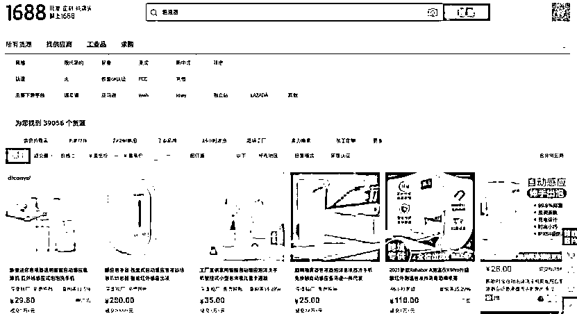

**1**）以品定厂** **

在首页上直接搜索，我们进入的是货源模式，即看到全是产品，我们根据需求，细化搜索条件，来挑选产品并下单。

选定「泡沫洗手机」为关键词。

-在深度认证一栏选择深度验厂，选择合并供应商（过滤大部分小代理商）。

-还可以按需筛选价格区间和所在地区。

 

 

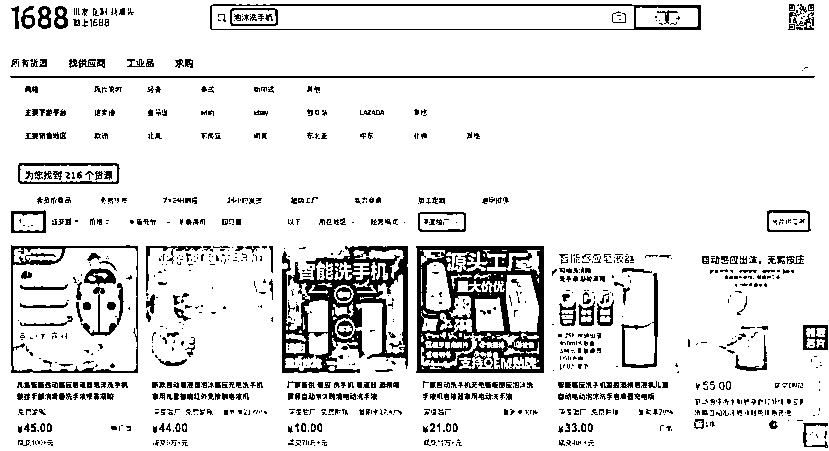

**2**）定厂找品** **

在首页上我们选择找工厂，输入关键词，此时我们进入工厂模式。

-点击品类的排行榜可查看热门工厂（注意有充钱刷榜的工厂）。

-点击厂名进入详情页，可查看工厂档案与产品目录。

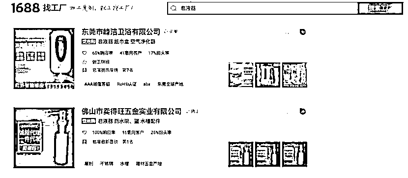

 

 

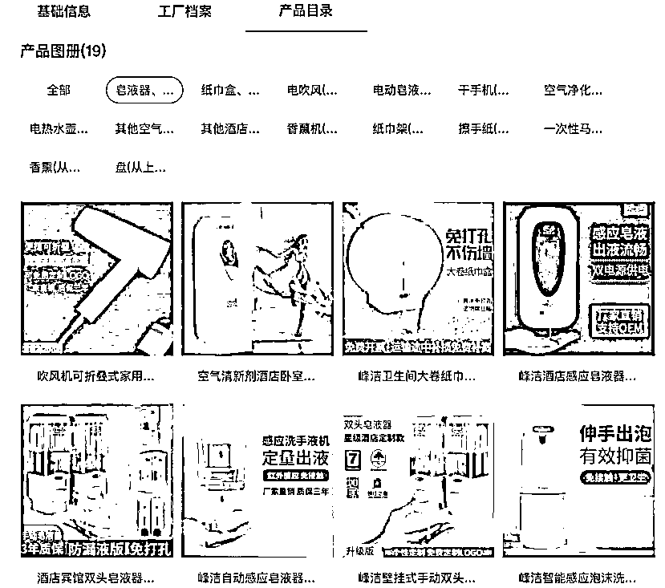

**3**）样品采购

比对产品，选择符合要求的 3-5 款产品。之后选择下单（通常必选 2 个），用阿里旺旺联系卖家拿样改价。

**4**）工厂造访

有了样品的比对之后，我们可以有针对性的选择厂家进行造访了解。

-产品的工期、质检规格、海外认证与专利。

-了解大货起订量与首批价格。

-返单之后的降价区间与账期的可行方案。

 

 

三、聊聊公模产品的优势及需要注意的事项

选品选厂后，我们就会开始接触到我们最熟悉的公模产品，接下来我将讲述公模到私模的转换思路。

**1. **公模产品的优势

公模就是公有的，即厂商开好模后（当然这模具属于开模厂商），任何人都可以买这套模具生产的产品。

采购并销售公模的这种销售方式，我们通常称为现货模式。

现货模式有着显而易见的缺点，产品周期短，跟买多，竞争大。

但是对于初入行的卖家朋友来说，我觉得仍然不失为一个好的入局亚马逊的方式。

主因有四：

**1**）起订量低** **新手入局

公模产品往往承担着试水的作用，我们可以在代理商或者工厂购买很少的量来进行测款，通常两百到三百都是允许的。

**2**）价格透明** **

 

 

在不清楚该类产品具体的行情下，公模价格非常具有指导意义。因为通常公模会拥有大量的代理商，比较火爆的模具，可能同时有几家组装工厂进行生产。我们在择优的同时，也可以对各家的价格进行比对。

**3**）现货供应** **

相对与工期动辄一个月起步的私模产品，公模产品由于有多方卖家参与，出货量大，供应商一般会有 2-3K 的现货预备，即使没有现货，公模产品排期更多，多为 5-10 天即可交货。

**4**）产品周期短** **

链接存在的时间短，是一把双刃剑。对于老卖家而言，产品获利的时间较为短暂，长期收益看低。但对于新卖家而言，类目里整体产品的寿命短，意味着评论积累较少，打新速度更快，使得资金能够更快运转起来。

**2. **公模产品需要注意什么

**1**）代理商的优势：（诚然代理商在很多量小的产品中没有任何优势）

在市场热门的产品中，对于想要测款或者达不到工厂起订量的朋友来说，代理商能够汇聚小批量订单，在工厂方面拿到优势价格。

通常热门产品，代理商因为下单量足够多，会预留一部分的现货供给市场，能大大缩短我们下单和返单所需时间。

代理商不从事生产工作，对于小批量订单也能配合我们贴标打单发货。

**2**）产品成本的把控：

 

 

如果我们前期使用代理商供货，那么在产品稳定返单之后，我们可以直接咨询工厂进行拿货。

**3**）备用链接的建设：

在市场出现大量同款产品的时候，坑位靠前的产品，自然容易受到其他卖家的攻击，这也是产品周期短暂的重要原因之一。

我们可以通过卖家精灵等工具，观察同类产品的生命周期，通常在**6-12**个月不等，一般在产品的生命中期即可开始准备备用链接的搭建。

**3. **如何利用好公模产品的优势

**1**）定制**LOGO**

对于绝大部分的厂家来说，500 的起订量就可以支持印制 LOGO ，这在一定程度上能够防止白牌卖家间的跟买行为。

**2**）定制包装说明书

包装的定制一般需要 2K 起步，说明书最好 1K 起订，在产品稳定返单之后，将定制的包装图片搬上主图，能够有效杜绝跟买行为。

**3**）配色的升级

如果你的起订量能达到 2K ，就可以和工厂协商更改外观的配色，一般更改产品 A 面的配色，就能很大程度上与其他竞争对手的产品区别开来。

 

 

四、聊聊限定私模的条件、优势及局限

限定私模，通常由较为有实力的组装工厂或者产研一体的工厂发起（我们在筛选工厂的时候应该注意这一点），一般选择 2-5 个卖家去共同营销一款产品。

无论你是创业初期就携带着不菲的本金，还是依托公模市场的红海搏杀积累了一定的资金，小范围的私模绝对是你不容错过的一种合作模式。

**1. **限定私模的条件

**1**）历史销售

很大一部分工厂在筛选限定私模卖家的时候，会参考你以往在他那里的采购情况或店铺其他产品的历史销量，以判定卖家是否具备一定的销售能力。

**2**）销量** **

通常根据产品的不同，起订量一般在 1-2K 区间，相较与泛滥的公模产品，因为限定了卖家数量，所以会有相应的退出机制，如果后续返单达不到工厂要求肯定会被取消售卖权利。

**3**）限价** **

由于卖家数量有限，工厂为了控制利润，会标定每个站点底线售价，以及活动的最低折扣比例，如果卖家违反限价规则，会根据所签销售合同进行处罚或取消售卖资格。

**2. **限定私模的优势

 

 

**1**）更好的产品

一般推出的限定私模，至少具备外观优势，自研工厂的产品往往还具有一定的技术优势，在与同类产品竞争时，与公模产品比较更容易取得销量。其次，在限定卖家数量的情况下，往往能出现产品配色独占的情况。

**2**）更稳定的利润

限价的存在避免了同款产品竞争时，大家打价格战的做法，保证了参与限定私模卖家的利润下限。

**3**）更长的生命周期

卖家数量的限定和销售协议的存在，一定程度上能够遏制卖家间的恶性竞争，提供了一个比公模产品更为公平的竞争环境。另一方面，由于限定私模的产品优势，在一定时间范围内它能够存活更长的时间。

**3. **限定私模的局限

**1**）利润透明化

恰恰也是因为限价的存在，大家在出厂价格趋于一致的情况下，除了占据最高排名的卖家能够稍微拉升自己售价外，其余卖家大多数时候只能将售价维持在统一的较低水准，因此产生的利润几乎是可预见的。

**2**）实力卖家的降维打击

虽然大家售卖同一款私模产品，但卖家的实力却不太一致，如果出现实力异常强劲的卖家或是工厂亲自下场，大家前期推广节奏的差距会很大，导致尾部卖家难以赶上，最终排名和销量会异常惨淡。

 

 

**3**）工厂的资源倾斜

在原材料不充足或工期较紧的情况下，头部卖家备货需求会优先满足，尾部卖家工期往往被拉长甚至无法供给产品，致使强者愈强。

五、包销私模的模式是怎样的

包销私模，顾名思义是工厂将一种产品打包给一个卖家，在限定的渠道和限定区域销售的一种合作模式。

**1. **包销协议

**1**）渠道和范围** **

渠道主要是线上和线下的区别，作为亚马逊卖家的我们一般只会拿到线上渠道或者单一亚马逊平台的包销资格，工厂通常会保留线下渠道的权利以便直接出口。

范围的议定主要是根据卖家主营的销售区域决定，你可以单独拿到欧美日任意站点的包销权利，也可以拿到全站点的包销权利。

**2**）人选与销量

工厂每年新模具数量是一定的，在决定包销的模具开发过程中，为了保证该款产品的预期利润，就会物色实力卖家。

一般是有一定合作基础且过往销量有所保证的合作伙伴，但是如果新卖家有同类产品的运营经验且愿意支付一定的模具费用，也可以成为包销的对象。

 

 

销量的议定是必不可少的，一般以年度为单位，根据产品的特性确定产品的最低年销量，并议定相应的退出或补偿机制

**2. **包销的注意事项

**1**）包销产品的风险

产品升级风险：

包销模具的产品，在卖家相应的市场上一定独一无二，人无我有的产品是优势也伴随着相应的风险。

不是每一款模具都能被市场接受和认可，就像我们推的产品不是每一款都能成功。一旦我们订购了库存，由于包销协议的存在，产品发生滞销时，厂家不能将产品转销给其他客户，我们的损失会比其他时候更大。

市场区域风险：

很多产品的开发具有区域针对性，适合欧美国家的产品不一定适合日本，反之亦然，因此我们一定要明确产品在目标区域的可售性。

**2**）工期延长

对于厂家而言，不同模具的产品，从壳料到部分原材料的采购都会有所不同。备料只能根据你的销售计划来确定，如果没有明确的备货计划，特定原材料配备时间会因临时采购而拉长。其次，没有足够体量的情况下，工厂排期也没有优势。

**3**）认证与专利

 

 

我们千辛万苦来到了包销的这一步，基本摆脱了跟买和同款产品恶性竞争的烦恼。

但是值得我们注意的是，包销产品，很多厂家不愿意为我们准备相应国家的相关认证和专利，取得认证能够保证我们在平台正常销售，而取得专利能够确保产品在推广成功之后，其他厂家不会生产类似或倒模的产品或者被别有用心的卖家抢注专利落入被动。

六、合作开模的模式是怎样的

当我们在一个产品领域积累了足够多的经验，我们就可以向工厂提出自己的模具开发需求，和工厂合作开发模具。

**1. **合作模块

**1**）外观设计** **

参与模具的外观设计是最常见也是最基础的合作内容，根据自身在以往同类产品获得的市场反馈或者市场的流行趋势，我们可以向工厂提出模具外观设计的方向或直接提供相应的外观设计图稿。

**2**）功能设计** **

根据自身销售经验所获取的消费者痛点，对工厂提出相应的功能升级或者功能增加的需求或直接提供相应的相应的结构设计方案。

**3**）方案设计** **

 

 

如果需要自行改进电子产品的 PCB 方案、整机方案等，需要自身具备一定的方案设计研发能力。

**2. **合作开模的意义

**1**）把握产品的升级方向

相比于厂家，卖家与消费者之间的联系更为紧密，对于产品的痛点和消费者的需求把握更为精确，卖家参与开模之后，能设计出更为贴合市场的产品。

**2**）领域细分与品牌调性确立

领域细分：

不同的需求痛点有时候不能在同一个产品同时解决，产品到再细分的时候，会在功能上进行取舍。以TWS耳机举例，便携型与长续航型，在设计上存在一定冲突，所以我们根据不同卖家需求，开发出了不同类型的产品。

品牌调性：

确立  一个品牌的树立通常会确立它的品牌风格，或是偏商务风的，产品素雅，曲线干练，或是主打运动型，配色鲜明，造型前卫。这种风格就对应这品牌的调性，也是品牌具有的文化基底，需要我们与厂家深入沟通开发意向才能有所成果。

**3**）为企业升级做好准备

到了这一步，我们会逐渐吸纳产品研发人员，加大对产品研发以及品牌建设的投入。开始发生从传统的贸易公司到科技驱动型公司的转变，逐渐提高自己的技术竞争力和品牌附加值。

 

 

七、我的案例复盘

方法和经验在前面已经说了很多了，最后我想和大家回顾一下我自己创业过程中最重要的一条产品线。

**1. **出师未捷的第一条链接

我们大概是 19 年 9 月初的时候在日本站上架了第一条 listing 。8 月份的时候我们对了  5 款市面上比较热销的产品，并最终选择了一款价格中等偏上的——为了避开卖家数量最多的低价款。

同时为了一开始进行差异化处理，我们在首批订单出货之前就自己设计了包装盒和说明书，包装盒为了质感，加入了覆膜、凹凸等复杂工艺，成本达到了三块多，起订量是两千，说明书成本很低，有固定开机费 500 块左右，所以一千和两千本只有 100 块的差距，当时也定了两千。

首批产品 200 个上架之后，我们立即遭遇了该产品的最大竞争对手恶意评价并投诉质量问题，在开卖 10 天后，我们的产品就被下架了，后续申诉也是无果，至今仍然有 91 个库存处于不可售状态。

从这一经验出发，后续我们又进入了好几个不同类目，但我们一直保守着两条原则：

-不要选择价格区段过高，卖家数量更少的产品试水，因为自身目标更显眼，相对来说遇到的对手的手段也更强（属于别人的利润款）

-试水产品，不要一开始就定制，一旦失败，付出的成本太高。

 

 

**2. **靠该换节点获得的第一个**BS**

我们在 19 年 9 月底上架了第二条 listing ，因为前期联系的供应商比较多，所以我们在产品下架之后立即锁定了一款市面上销量最大的低价产品，同时也是该小类目的 BS 。

这次我们选择的是一个有自己组装工厂的代理商供货，他的优势在于产品选择多，能小批量供给大工厂的产品，配合度很高。

基于当时的测评环境，我们在度过 15 天新品推广期后，排名就来到了小类的前 30 名，为了避免第一次被人过早盯上的情况，我们果断选择更改节点去到一个流量相对较小的小类。时间来到 19 年 12 月底，我们顺利的拿到了第一个小类的 BS ，当月这个产品带给我们的利润在 8W 左右。

**3. **成为小类第一前做了哪些准备

我们在 19 年 12 月份的时候开始注册自己的品牌，欧洲站历时 10 个月下证，美国站在提交注册一周后，即可申请使用 TM 标进行品牌备案，日本站目前还在公示期。在第二条链接起量后，为了尽快实行品牌备案，减少跟买行为，我们在 20 年 1 月份正式购买了日本商标（当时均价在两万左右）。

在 20 年 3 月份，我们上线了第三条 listing ——颜色变体，红色变体最后大约占据市场份额的 10% （独占，但是不是主流偏好颜色）。

在经过 5 个月的市场观察，我们发现该类的产品由于使用频次很高，属于消耗型电子产品，一般销售三个月之后，差评开始爆发式增长，链接存活时间大多为 4-6 个月。因此我们在 3 月份同时上线了备用链接，并在 20 年 5 月成功取代第二条 listing 。

 

 

在 20 年 5 月，我们最大的竞争对手，占领这个产品的市场份额约为 40% ，我们的市场份额约为 30% ，此时每月的利润为 12W 左右。

**4. **拿到真正的**BS**

同样是在 5 月底，小类里面出现了一个 FBM 的卖家恶意跟买。许多卖家同时收到了勒索信件，卖家之间迅速组成了结盟，但我的竞争对手选择每月缴纳保护费用维持销量，而我们选择拒绝，并采用多种办法投诉跟买者的数个店铺。历时一个月，我们关停了跟买者的两个店铺，销量终于开始回升。

而我的竞争对手在此之后，数次被跟买，导致链接权重慢慢下降，最终在 9 月份彻底销声匿迹。我们在 8、9 月份靠着积累的评价转战原本的小类，一直维持在 BS 水平。

在积累了不少类目经验与销量之后，我们终于作为首批卖家于 20 年 8 月上线了第四条  listing ——当年新品。

这家工厂在武汉，主要走大批量的外贸订单和分发代理商，即使无法控制卖家数量，但由于有先发资格，我们的新产品仍然从 20 年 10 月份到 21 年 2 月份牢牢占据着 BS 。

此时，我们在该小类的利润，大约是在每月 20W 左右。

**5. **产品的没落与更迭

今年春节的时候，合并国际评论之风席卷各大类目。另一个强劲的竞争对手出现了，他从产品抄到文案，链接风格保持和我们的高度一致。然后花重金在三条链接上合并了超过五万条评论，我们从每天 200 单一路下滑至 50 单只用了不到两个月的时间。

 

 

最终，我们在慢慢清理完库存之后，于 21 年 5 月份正式退出了这个类目。这个类目在创业创期给我们贡献了超过 180W 利润和大量的现金流，再做新的产品我们仍然有机会能赚钱。但是由于类目的特殊性，线下的巨量订单，使得行业内几乎不存在私模，导致卖家之间厮杀严重。

经过了近两年的洗礼，我们不再需要一个无法深耕的类目去带动现金流了。在此之后，我们将所有资金投入到限定私模以及可以包销的产线上去，并在今年上半年，对另一条经营了一年的成熟品线和厂家合作开发了两套模具。

八、总结

对于一个有足够纵深的产品类目来说，没有供应链的新手卖家基本会循序渐进走完从公模到私模的这个过程。

而一些特殊的产品，比如手工艺品，家具类或是服饰类它们会或多或少会缺失其中的某些环节。但我们要看到这个流程的本质在于，选择了红海的同款产品之后，如何一步步实现自己产品的差异化。

最后在我们积累了足够的供应商资源和运营经验之后，和工厂的合作模式只是一个灵活运用的手段。我们用公模测款，用私模来降低开模成本与试错风险，用提升的运营和研发能力去开模，去提升利润和产品附加值。

以上就是我从业跨境电商四年来，对于如何选择工厂以及后续产品如何升级的一些经验与思路。

 

 

创业以来，一路磕磕绊绊，自己的产品也终于来到了合作开模的阶段，虽然还停留在给工厂提供最基础的外观设计理念和功能升级方向上（笑）。后续开模意义算是我在前公司的心得体会。

这是我在生财的第一篇分享，感谢 Lissa 的介绍让我加入这个有趣的大家庭，最后欢迎大家批评指正，也想和各位圈友们一起沟通成长。

By the way，最近的亚马逊真是不太平，希望大家柳暗花明，诸事顺意。

P.S. 如果你也想在生财有术专栏分享你的经验和认知，请点击链接

http://form.shengcaiyoushu.com/f/HA1G1g  填写表单，我们会陆续邀请有赚钱相关经验和案例的嘉宾做分享。如已填写表单请忽略。

评论区：

鱼丸|亦仁助理 : 感谢  老师的分享，大家如果有什么问题。可以在评论区留言~ 草木青 : 先赞再看，惯例

Bryce : 大家好，我是这次的分享人Bryce,有什么问题，我都可以和大家一起探讨[呲牙] Lissa Tam : 优秀优秀！

轩辕 | 专注视频号 : 给Bryce老师点赞

大头 : 优秀  优秀  我要是能早看到，可以省半年的时间。

张大大 : 优秀优秀

丁邱洁律师团队 : 来云上夜话呗，这周末［跨境电商］专场，来分享吧！

 

 

成果：在不到一年时间赚到 100w，团队从一个人走到现在 8 个人，日利润最高达到 2w。

心得：选择和运气很重要，聚焦更加重要，聚焦成一道闪电。

心得：圈子决定一切，你的能力和认知由你所在的圈子决定，成长路上，愿意

引你入门的人很重要。

# **# ****(**精华帖**)(111**赞**)**从服务、流量、变现三方

# 面，聊聊我** 2 **年赚到** 100W **的站外推广商业模

# 式

作者：  雪球

日期：2022-02-17

大家好，我是雪球（陈凯锐），一个 96 年的亚马逊创业者，2019 年毕业就开始进入跨境电商这一行做亚马逊运营，2020 年跟人合伙创业做亚马逊，2021 年 3 月份一个人  All in 到亚马逊站外推广服务创业到现在 8 个人的小团队，截至 10 月份赚了人生的第一桶金 100w。

说到这，大家肯定很感兴趣我做的项目吧（站外推广服务），接下来我分两部分给大家介绍，我为什么选择了站外推广这个项目？为什么会通过这个项目项目赚到 100w？

第一部分：离开原来的合伙团队，一个人 All in 到站外推广服务中。

第二部分：我的成功并非偶然，源于我过去的上班和合伙经历，以及踩的坑。

 

 

目录：

**0. **前言

**1. **我是如何在不到一年时间赚到** 100w**？

**2. **我的成功源于我过去的积累和踩的坑

**3. **关于创业，我总结了** 6 **句话

**4. **感谢生财，感谢贵人

**—**前言**—**

2021 年 10 月份，给家里寄了共 50w，自己账上的余额也有 50w 左右，算了下总共赚了 100w，虽然这笔钱在生财有术这个圈子里面不是一笔大数目，但是对我来说算是人生的第一桶金。

目前，团队成员也从我自己一个人到目前的 8 个人，办公室也由原来的 15 平换到现在的 50 平，最让我骄傲的是，身边有三个因为我月入过万的人，两个是我的员工，一个是我的代理。

**—01—**

 

 

我是如何在不到一年时间赚到** 100w**？

2021 年三月份的时候，我离开了原来的团队，自己找了一个 15 平米的办公室，开始了一个人的创业，定位就是只做跨境电商亚马逊的站外推广服务。

为什么选择站外推广服务作为自己的创业项目？

第一，合伙创业的时候就开始尝试做这方面的服务，也从 0 到 1 跑了一个小闭环，证明这个服务有市场需求，但是之前因为一边做亚马逊卖货一边又做服务没有做好，我现在有信心 All in 到站外推广服务这个领域里面，可以做得更好。

第二，我预见 2021 年站外推广服务会是一个红利期。首先在 2020 年末的时候，我发现很多外行人开始入场亚马逊，据说日增量 3700 人，原因在于媒体炒作深圳湾一号的房子都被那群做亚马逊的人买了，其次是亚马逊算法越来越严格，平台逐渐趋向正规，很多只靠刷的卖家都可能会被平台淘汰。

据侃侃网统计，2021 年年初的时候平均每天就有 3700 个新手亚马逊卖家入场：

 

 

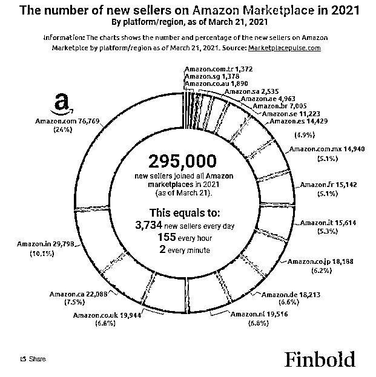

第三，站外推广服务的模式比较简单，流量变现，通过公众号论坛引流到微信，然后提供站外推广的服务转化。

第四，几乎不需要投入资金，因为做服务都是一手交钱一手交服务，只要我们做的服务有需求，资源 OK，服务到位，基本上我们每天都有稳定的现金流，现金流对创业初期非常重要。

接下来我开始了我的单干创业之旅，分三个阶段：

 

 

第一阶段：从** 0 **到** 1**，站外推广模式

商业模式之「服务」

我的模式也很清晰，简单来说就三点：服务、流量、变现。

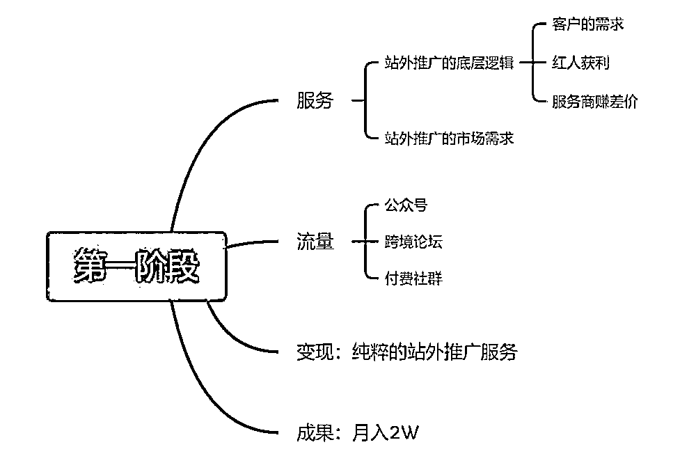

站外推广服务就是帮助亚马逊卖家在亚马逊平台外进行推广，推广的形式主要以促销为主，英文名叫 Deals，说白了我们就是流量中介，把站外的流量倒卖给亚马逊卖家的服务商。要了解一个服务，我们需要了解它是否有需求和它的底层逻辑。

 

 

**1**）需求

当时因为我自己做过亚马逊卖家，深知亚马逊的各种需求，对于站外方面的需求如下：

拉动排名推产品

清理库存，提高库容

秒杀预热

稀释留评率** **、退货率和投诉率

**2**）底层逻辑

简单总结就是我们通过倒卖流量满足亚马逊卖家的需求，而且站外红人也能从中获利，我们服务商也能赚取中间差价。

 

 

赚发帖的手续费，也就是我们给红人支付的发帖佣金；

赚亚马逊联盟的佣金，这个佣金才是大头。

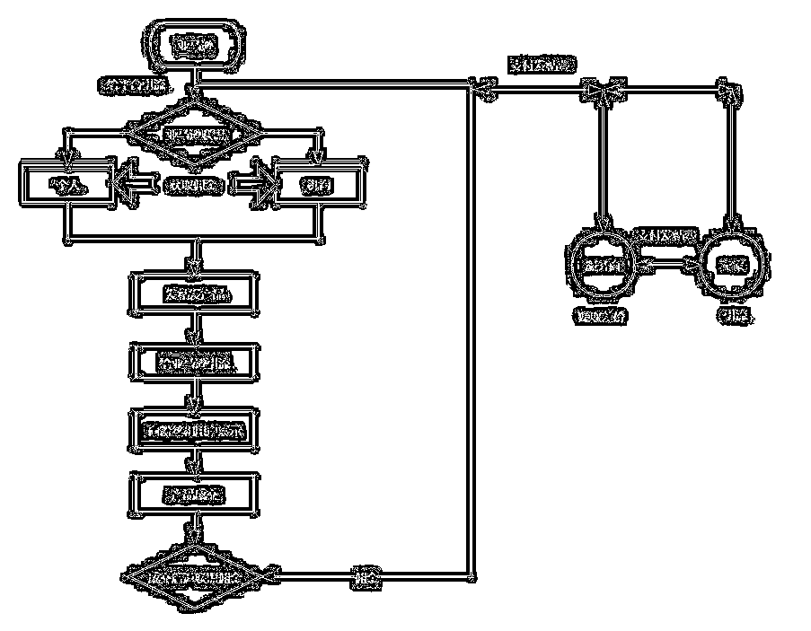

我们站外的流量来自于站外的红人，他们有自己的粉丝群，我们把 Deals 发到他们群里，从而产生销量，客户的需求就满足了。

那么问题来了，我们发 Deals 对红人来说有什么好处？他们凭什么要帮我们带来流量？

 

 

商业模式之「流量」

亚马逊联盟，有点类似于国内的淘宝客，只要发的产品绑定了那位管理员的亚马逊联盟，那么亚马逊会按销售出去的销售额抽一定百分比的佣金返回给这些管理员，本质是亚马逊花钱买流量。比如一个 7 万人左右的美国群组管理员，每天的收入大概在一千美元左右，一个月差不多 3 万美元一个月。

下面是最新的亚马逊联盟的佣金，不同类目的佣金是不同的：

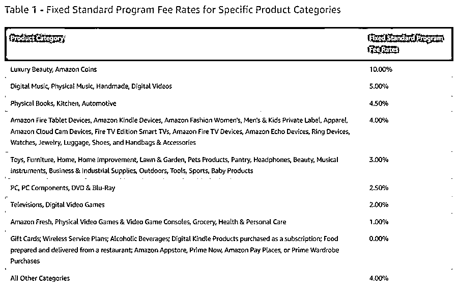

我们服务商的角色就是流量中介，有点类似国内的网红直直播带货，网红可以拿到佣金，买家可以获取性价比极高的商品，商家可以提升销量，实现三赢。

站外推广服务也一样，给亚马逊买家提供高折扣的商品，帮助亚马逊卖家提高销量，然后我们中介获得佣金，这也三赢，所以这套商业模式是行的通的。

 

 

当我们这一套模式形成之后，接下来就是获客，只要是做亚马逊的卖家，他们就需要到我们的服务，那么我们只是需要不断的获取亚马逊客户就行了。

接下来的难题是怎么去获取客户？因为当时整个市场上鱼龙混杂，整体上给亚马逊卖家的口碑是非常差的，所以获取客户是比较难的，大家普遍相信自己经常合作的服务商，而不相信一个刚出来不久的服务商，当时我在想怎么在这种大环境下杀出一条血路。

当时我能想到的获取用户的途径有以下：

**1**）公众号

同行是最好的老师，当时我经常观察一个头部的同行的公众号，渐渐摸索出他们的引流方法，就是通过公众号内容干货的分享，再通过资料引流转发裂变，这个地方引流过来的用户都是比较精准的，而且都是需求量比较大的卖家，而且那时候这么做的服务商还比较少，只有我跟头部的这家这么操作，我的第 1 批用户就是从这里来的，不到半年的时间，公众号从 0 粉丝做到 5000 多的粉丝，而且都是精准的亚马逊卖家。（之前有另一个号达到 5000，但是被封）

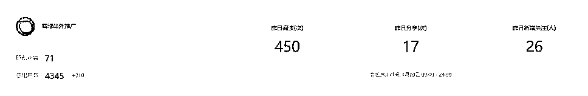

 

 

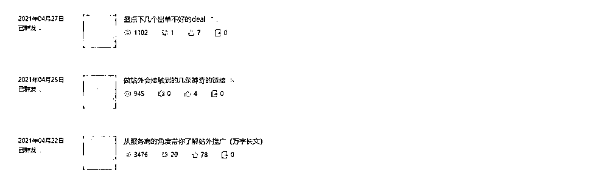

**2**）跨境论坛

我把公众号的内容同步到每个亚马逊的论坛上，浏览量都非常高，然后我仔细观察了一下每个论坛的算法和规则，我发现他们的算法是只要你的帖子有一个人回复留言就会被置顶一次，所以我那时候我分享的文章都会提醒大家留下邮箱，以便我把资料发给他们，这导致我的帖子一般都会置顶在首页的前几位，给我带来了很强的曝光，而且引流到私域的亚马逊卖家非常多，几乎每天至少上百人过来加我微信，虽然过来的人都是亚马逊小白，但是只要他们是做亚马逊的，就是我的潜在客户。

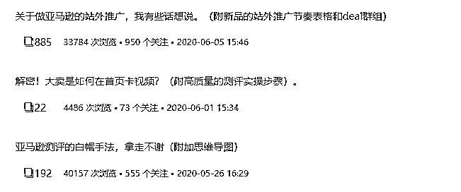

**3**）付费社群

 

 

最后一个就是加入付费社群，当时我加入了两个付费社群，一个是生财有术，一个是优联荟。

生财有术是一个谈钱不伤感情的一个圈子，在这里面我的认知得到了很大的提高，那时候天天熬夜刷精华帖，看了很多大佬的案例，对于了私域流量开始有了清晰的认识，所以我就想只要有足够多的亚马逊卖家作为我的私域流量，他们就是我的潜在客户，因为他们都是有这方面的需求的，所以我当时的目标很简单，就是微信加足够的亚马逊卖家。

优联荟，是一个外贸人的社群，我的里面也有很多做亚马逊的卖家，我的潜在用户，初衷我只是想进去学习的，但是因为我的分享，大家对我都非常认可，直到优联荟的创始人小北老师把我的文章发到了他的公众号。

当时我在 Lissa 的鼓励下，写了一篇关于站外推广从 0 到 1 万字长文，我刚好也把文章发到了优联荟社群里，也因为运气，这篇万字长文被顾小北老师看到，被小北老师转发他的公众号（小北的梦呓），在小北的光环下，这篇文章的阅读量达到了 1.2w，也为我带来了一批忠实的客户，大家都把我称为顾小北推荐的站外服务商，很幸运，有了小北老师的背书，我的一个站外推广品牌（雪球站外）完成了冷启动。

 

 

商业模式之「变现」

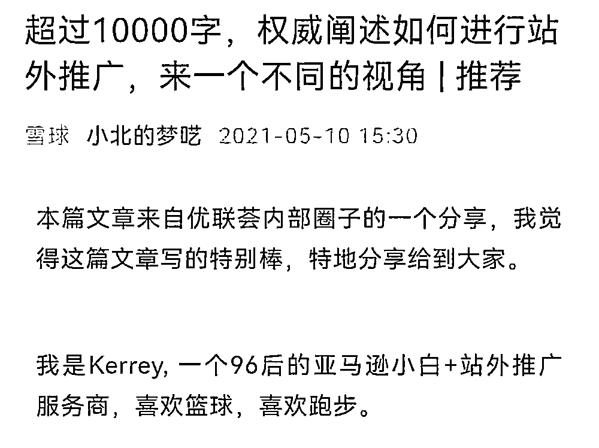 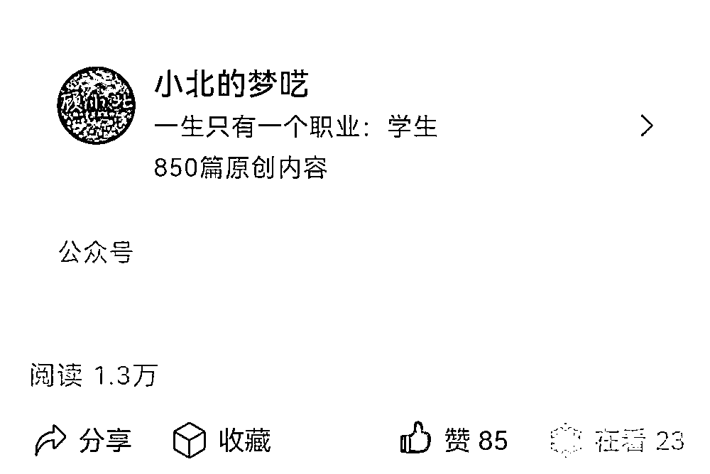

 

 

所以我们做站外推广服务，我们是通过赚取中间差价变现的，很简单的公式就是：中间差价 = 收入（客户给的金额）- 支出（给红人的费用），正常来说一单的利润是销售额的 50%，至于如何通过提高效率和规模效应实现更高利润，后面会说。

这其中存在一个信息差，就是很多亚马逊卖家自己不懂得去找站外的流量，而且有些卖家即使知道，他们也不想花这个时间去找，所以我们把这些流量倒卖给亚马逊卖家，既帮助亚马逊卖家，也能实现盈利。

这时候我们需要用到 Facebook 账号，这个账号主要用来对接国外的流量资源，比如一些群组、主页的管理员，模式很简单，就是不断的去找到这种可以发 deals 的群组和主页，然后不断联系这些群组和主页的管理员。

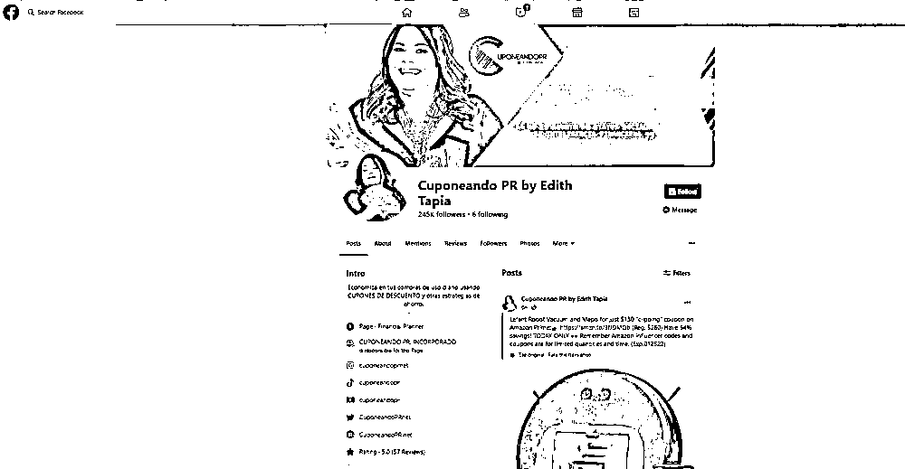

在这个阶段，我一个人跑完了整个流程，花了 0 成本，通过不断积累客户，不断累积站外资源，每个月能达到的净利是 2w。

 

 

第二阶段：从** 1 **到** 10**，团队的搭建

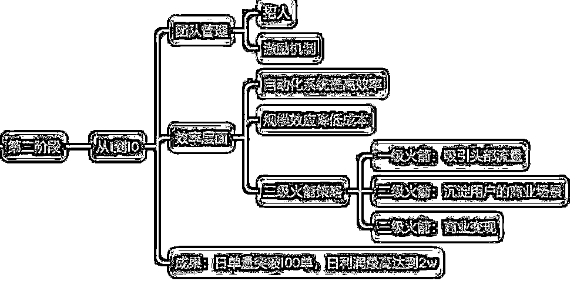

如果说上面讲公司的模式是从 0 到 1，那么拓展团队就是从 1 到 10。

在我开始单干之后不到一个月，由于已经从 0 到 1 把模式跑通了，每个月能做到 2w 的利润，我就想，能不能复制多几个我出来，我自己一个人做最多也只能做到 2w 到顶了，但是如果有 5 个人我的话，那情况是怎么样的呢？抱着这样的想法我就开始招人了。

一个人做好可能比较轻松，但是带着一群人一起做好可能就比较难了，作为一个创业小白，在管理方面我是一点经验都没有，在组建团队的过程中，我也遇到了很多问题。

**1**）团队招人

 

 

前期为了节省开支，我把办公室选在在深圳宝安比较郊区的地方，但也因此埋下祸患，我们一直招不到人，因为大部分年轻人都喜欢去市中心上班。但是没办法，只能烧广告了，我索性同时开 boss 直聘和前程无忧一起找，最后确实有效果，只是烧的钱有点多，接近上万，但是幸运的是我招到了比较合适的工作伙伴。

**2**）激励机制

因为公司刚起步，很多流程化还不是很完善，前期需要自己手把手的去培训，由于我们招的岗位是客服，技术门槛不是很高，很多员工会觉得单调，有的甚至上班不到几天就跑了，所以当时我一直很苦闷是什么原因？

我请教了一些前辈，发现是我们公司在激励机制和福利方面做的不好，很多员工来了之后会发现工作单调，没有盼头。根据这个点，我制定了公司的提成制度，还有销售冠军，进步奖等激励机制，通过这个举措，后续我开会的时候都会跟员工提醒下这件事，会把大家每个星期的业绩陈列在在线表格上，这样每个人都能看到，也能对比，自己离目标还有多远。

有个员工，在 2021 年最后一个月拿了销售冠军，月薪破万，但是其他人的薪资都差不多在 6-7k，这虽然不是一笔大数目，但是对于员工来说，是一个非常大的激励。

 

 

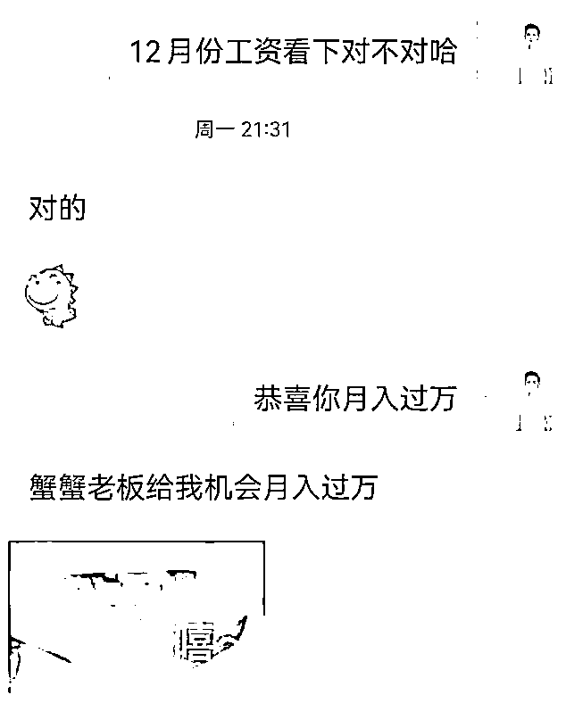

在我们团队搭建起来之后，我们做了 3 个动作，让我们的体量逼近头部。

**1**）自动化系统提高效率

 

 

当时我们订单量逐渐增多，导致我们的人工远远不够，我找了一个程序员，帮我做了一个自动化系统。

当时我们接的每一个订单我们称作一个帖子，我们业务的流程是这样的，接到帖子 - 整理帖子 - 测试折扣码是否生效 - 发给红人 - 检测效果。这一套流程下来，需要花费不少人力物力，按照当时的业务量，至少需要三个人才能完成。

所以我在考虑能不能把这套流程做成一个自动化的一个流程，因为它本身是机械性，所以理论上是可以程序化的。

当时我经常去拜访一位同行业的头部服务商 B，一方面跟他合作另一方面跟他学习，久而久之，跟他交流之后发现 B 已经实现了这个自动化，所以我更有底气去做这件事了，我把我的需求提交给一个程序员朋友，就这样一个月之后，我们的自动化系统出来了，通过这个自动化，原本需要三个人才能完成的事，最后只需要一个人就能完成。

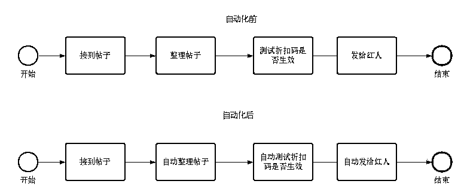

**2**）规模效应降低成本

 

 

当时的站外市场是这样的，我们是按照帖子的数量付佣金给管理员（一个帖子就是一个促销信息），然后管理员帮我们把这个帖子发给他们的粉丝。

因为我们的单量逐渐增多，我们开始是跟管理员谈判，本来一个帖子的佣金要 5 美金我们买 1000 个帖子怎么样？每个帖子的成本直接压缩到 1-2 美金。甚至有些管理员直接给我们按包月来算，就相当于一个月只要给他一笔固定资金，就可以无限量在他们的群里面发帖，所以边际成本几乎为 0。

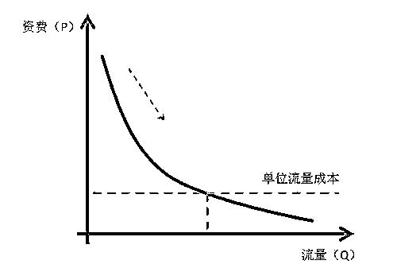

通过自动化和规模效应，我们将压缩下来的成本一方面是我们的利润，另一方面我们拿来给客户发更多的帖子，覆盖更多的站外粉丝量，提高爆单的概率，所以导致我们的效果比同行高出很多，也间接给我们带来了很更多的转介绍。

**3**）三级火箭策略

正如亦仁大大说，先向女性用户售卖 A 罩杯，再向他们推荐丰胸产品。不同的是，“丰胸产品” 我不是拿来盈利的。

 

 

我们当时在站外推广方面的口碑慢慢做大之后，我们开始给我们的客户推荐 “丰胸产品”, 因为当时亚马逊卖家的需求非常多的，这也衍生出很多亚马逊的周边服务，所以我就去找到几家这方面服务的源头供应商，因为我们有流量资源，是可以跟源头拿到更低的价格的。

亚马逊的周边服务的种类还是蛮多的，有物流、知识产权、图片视频等，但是我知道不懂的东西不碰，每个领域都是需要沉淀，尽可能选择跟自己行业相关的服务入手，所以我当时选择了跟运营有关的服务，我们还做了买家秀、QA、点赞、首页无差评等一些比较简单的、高频的服务，这些在外行人看来可能不知道是什么，但是在内行人看来已经是家常便饭了，这一部分虽然利润低，但是几乎刚需，所以这块我们不用来盈利，直接给客户接近成本价，提高粉丝粘性。

当时这个我主要是受梁宁的三级火箭策略的影响，什么是三级火箭策略？

我给我们的三级火箭定义是这样的：

 

 

一级火箭：抓住头部流量，我们通过内容和高频服务（周边服务）让很多亚马逊卖家来加我们微信，这部分不赚钱。

二级火箭：做一个沉淀用户的商业场景，主要是微信群，然后专门有人在群里为客户解答一些亚马逊会遇到的问题。

 

 

三级火箭：高利润的商业变现，也就是我们的主打服务，站外推广。这里还有一个原因，站外推广服务其实不是特别刚需，是比较低频的服务，所以需要用高频率高需求的服务来带动，这就是三级火箭策略里面的高频带低频。

 

 

**1**、平台红利

**2**、跟头部同行学习

虽然我们的三级火箭是很简单版本的三级火箭，但是很有效果，我们的粉丝粘性很高，获得很多转介绍，粉丝量慢慢扩大。

再加上平台的红利，业务量慢慢扩大，最高峰一天的利润能达到 2 万，日订单量达到  100 多单，慢慢逼近这个行业的头部，当时我们头部服务商一天单量差不多在 150 单左右。要知道，头部服务商都是已经做了 2-3 年的时间了，我们不到一年的时间。

最后总结我这次创业成功的原因：

年初的预想成真了，因为大部分卖家涌入，导致出现了卖家红利。很多人觉得亚马逊很赚钱，就很盲目的进入了这个赛道。当时在 2020 年年末我就开始有这个预兆了，过年回来我就开始着手全力投入亚马逊服务这条赛道了。

在平台政策上，上半年亚马逊做了两个动作，一个是限制亚马逊仓库库容，一个是封掉很多人工干预的大卖品牌，这两个动作直接导致亚马逊的玩法彻底改变，一是大家如果要开新品，就需要把原有的一些滞销库存清出亚马逊仓库，这样一开就需要找我们通过站外推广来清库存了，二是过去大家没有什么运营手法，就简单一个字，刷，现在大家都怕被封店铺，只能采用安全的手法推产品，就是站外推广。

前期我们其实只是通过一个微信号和一个 Facebook 在运作，但是我们的模式还是没有那么完善的。我开始去找头部的同行学习，不断去吸取他们的经验，去跟他们交流，渐渐的我们也把整套流程做成了一个 sop，方便后面招新员工入职培训。

 

 

**3**、个人聚焦

**4**、口碑和背书很重要

**5**、团队的力量不容忽视

后面我们的业务量越来越多，我们开始想方法去提高我们的效率，所以我们做了一套自动化的解决方案，提高了好几倍的效率。

2021 年前我是既做亚马逊卖家又做服务，2021 年后我只专注做站外推广服务，然后利用我自身的优势写公众号不断去引流到微信上变现。

我们在短短一年内赶超头部服务商，为什么？其实大家基础设施都差不多，但是唯一不同但是我们的口碑做的比较好。因为服务商在跨境行业的总体口碑是比较差的，一方面很多服务商资源偷工减料，另一方面服务态度也很差。

我们团队的原则就是一切以客户为中心，做好了口碑，再加上很多亚马逊牛人朋友的背书，我们把站外服务做成了一个品牌，老客户复购率很强，而且转介绍也很多。

如果自己从 0 到 1 已经跑完了项目的整个流程了，接下来需要做的就是复制。团队的力量是很可怕的，团队就像一个飞轮，作为一个管理者，需要做的就是让这个飞轮高效的运作起来，即使自己不在，它也能继续维持运转。

 

 

**—02—**

我的成功

源于我过去的积累和踩的坑

很多人都会问我为什么会接触到亚马逊这个领域，时间回到 2019 年 2 月份，那时候我刚出来实习，在一家亚马逊公司上班，主要的运营的是欧洲站，当时什么经验都没有，公司的运营手法比较简单粗放的，主要就靠一个字，刷，每天接触最多的就是

Facebook，在 Facebook 群组发帖找一些老外，让他们来帮我们数据补充，日日如此。

那时候亚马逊管的不严，整个深圳的卖家都笼罩在数据补充的氛围中，确实只要是数据补充，基本都能做得起来，而且确确实实很多人都有靠数据补充起来的成功案例，线下跟别人交流也基本离不开数据补充这个话题。但是我知道数据补充没有未来，所以开始拼命学习一些广告和站外推广的玩法。

那时我每天也开始写公众号，把每天学到的知识整理下来发到公众号，输出的同时会逼着我学得更快，因为我想快点摆脱这样的环境。另一方面通过分享结识到一些做亚马逊的卖家朋友，期间我的前合伙人 A 就是通过公众号认识的。

乔布斯说：你不能事先把点点滴滴串在一起，只有回头看的时候才知道点点滴滴是如何串在一起的。

 

 

第一，整个亚马逊的体系，结识了一些亚马逊卖家；

第二，积累了 Facebook 站外推广的一些资源。

现在证明我的想法是对，虽然当时觉得做什么都是浪费时间，但是回头看，之前所走的每一步都是有用的。  这次上班给我的收获：

后来有一次，我斗胆问了下 A 有没有意愿想要跟他一起合伙出来创业做亚马逊，本来只是一句玩笑话，没想到后来却成真了，就这样，我开始踏上我的创业之旅，一边做亚马逊一边做站外推广服务。

我每天的工作就是更新亚马逊公众号，通过文章引流一些亚马逊卖家到我们的微信上成交，亚马逊店铺也开始选品运营，一边学习一边实操，日子过的很充实，每天早上 9 点到公司晚上 11-12 点回家。

 

 

虽然一开始的想法很美好，但是现实比较残酷，亚马逊卖货真的不太顺利，由于我们不会选品，就只是通过一些课程，学到一些选品方法就开始实操了，但是真正实操起来发现出现很多问题，我们当时在通过选品软件看到一些市场需求非常高，利润也非常高的产品，却没考虑到背后的风险，就当机立断就发了 1000 个货过去，初期每人砸了 5w 左右。

当时我们的策略是直接通过前期站外推广 + 数据补充，后期再通过站内广告来进行推广，但是那时候供应商延误了货期，再加上物流不给力，到了那边之后发现这个产品已经沦为一片红海了，价格被压的很低，我们再怎么推广也已经无力回天了，所以最后只能草草清货。

这次失败让我不得不开始质疑我自己的选择和判断，我开始怀疑自己不是做亚马逊这块的料。

好在我们手头的另一个项目（站外推广服务）有些起色，通过公众号、论坛引流过来，流量变现，一方面我自己刚好是有引流经验的，另一方面我们前期为了做口碑，做的效果也不错，所以这个项目总体上虽然不赚什么大钱，但是可以养活整个团队。

所以我认为卖货和服务这两者不可同时做，一心不可二用，我选择聚焦服务，这可能跟我的初衷可能想违背，我的初衷是聚焦亚马逊卖货，服务只是辅助初期的现金流，因为我以为亚马逊是一个长期的生意，服务商是个短期的生意。但是我发现我错了，做亚马逊需要投入的资金远超想象，特别是现在这个阶段，资本入场，要想做好只能拼命的砸钱，但是我没有，而且也没有能力去承担这么多风险。而服务，我们可以在短期内获得一笔现金流，提高我的抗风险能力，即使不长久，我也能先赚第一桶金。

就像光合说的，聚焦成一道激光，日拱一卒，就能穿越所有圈层，一往无前。

 

 

**1**、圈子

**2**、性格改变

我开始集中精力在站外推广服务这个项目上，我开始自己自主学习引流，转化的基本功，也因为良辰美推荐加入了生财有术。说实话本来没抱多大的期望进入这个社群，一直都在潜水，但是后来让我出乎意料的是这个社群给我的价值超出 10 倍门票价，虽然那时候还没发挥价值，但是在我出来创业单干的时候给我的帮助很大，认识了很多对我帮助巨大的贵人。

合伙人 A 看我开始把心思转到服务方面了，我们开始为此产生争执，最后我的决定是离开，这时候我之所以有底气选择离开，是因为站外推广这个项目我已经从 0 到 1 跑了一遍，我发现每个月都有不同程度的增长，在第四季度的时候，单量突然暴涨起来，于是我开始觉得这个项目有必要全身心投入一下。

虽然这次合伙创业最后失败告终，我还是很感谢我的合伙人的，给我认知上带来了很大的改变，这次合伙创业给我带来的收获如下：

那时候我也名正言顺的成为一名亚马逊卖家，同时也加入了很多亚马逊的圈子，去跟大家交流，然后我回来在自己的亚马逊账号实操，再把这些内容写在公众号上，也吸引了一批亚马逊卖家来加我好友，后来也成为了我们的站外推广服务的第一批用户。

我自己是一个有点社恐的人，在一开始我很少主动去跟别人打交道，创业之后进入了合伙人的圈子，大家聊天主要就是聊亚马逊和赚钱，我也不再去关心我的性格问题，社交只是用来交换信息的途径，社交的前期是我有社交筹码，所以我更多精力花在磨练我的技术上。

 

 

**3**、从** 0 **到** 1 **孵化一个非常好的项目

**1**、创业要先赚到第一桶金

**2**、单干之前要先完成小闭环

一个好的项目是很难找的，特别是一个几乎 0 成本，但是年收入能过百万的项目，除非有一个贵人愿意带你入门，不得不说，合伙人 A 就是那个贵人。

所以即使最后离开了，我们也没有什么不愉快，更多就是互相祝福吧。当然，那时候对于未来的不确定是不可预知的。

**—03—**

创业总结

作为一个晚辈，我自我觉得经历的还太少，踩的坑也很少，所以分享的文字还是浅层，更多是我的经历感受，真正的干货不多，下面我总结下我的创业经验：

每个创业者只有在赚到钱之后对钱才有一个新的理解，才能知道钱是怎么来的，才更有动力去赚更多的钱。为什么很多人创业会失败，我觉得可能就是因为理想太浮夸，现实太骨感，没有先赚到第 1 桶金，大部分创业失败的人都是死在黎明前的黑暗。

 

 

**3**、越分享越幸运

**4**、预见红利期的时候要选择聚焦

**5**、竞争对手是最好的老师

**6**、利他就是利己

没有的话建议先上班或者合伙，等到自己完成一个项目的小闭环了，再出来单干 all in，这种情况创业不太容易失败。因为单干和上班或者合伙永远都是两回事，前者你面临的风险九死一生，后者你面临的风险其实不算什么，还有很多机会翻身。

一方面写公众号我能快速让我对这个领域的体系有了了解，另一方面通过文章我能结识到这个行业的其他牛人，写作是普通人完成破圈的最低成本的方法，没有之一。输出的同时，说不定就有大咖帮你很一把，帮你转发一下，会比你努力很久都有效。

红利期很短，2021 年的红利期在上半年，下半年潮水就开始慢慢褪去，甚至平台开始不让卖家做站外推广了，我们之所以在这么短时间内超越同行进入头部，就是因为我选择了聚焦，专门做站外推广，放弃掉以前一心二用的心理。

小排老师说过，种内竞争你死我活，种间竞争相互退让，生态竞争抱团取暖。从进入站外这个领域开始，就看到这个行业非常卷，大家都在拼价格战，口碑也很差，我仔细分析了市场之后，三番两次拜访一个头部服务商，一开始对方确实很不待见，但是我很愿意把我的东西、资源都分享给对方，最后达成战略合作，也从那里也学到很多东西、资源。

 

 

市场很大，我希望大家一起挣钱，而且说不定大家还做的比我好，然后把好的经验也分享给我，这样大家的蛋糕才越做越大。我更想大家一起抱团取暖，一起研究站外推广这件事，一个人或许可以走的更快，但是一群人也许能走的更远。

**—04—**

感谢生财，感谢贵人

从 2019 年毕业到现在，从上班到创业，从合伙到单干，我过的还是顺利的，至少我踩的坑比较少，当然我也有自知之明，我的成功不是因为我的个人实力，更多是时代红利和遇到的贵人，其中大部分贵人来自于生财有术，也有我的合伙人和同行，还有身边的人，比如员工、家人。

@生财有术，进入这个社群最重要的不是挣多少钱，而是提高了自己的认知，可以链接到各行各业有结果的人，我的几个贵人就是从生财有术链接到的，在这看了很多人的项目复盘，受益匪浅，在其中我看的最多的关键词是利他，确切的说，生财不是教我的挣多少钱，而是利他。

@杨涛，不得不说，涛哥真是生财有术里面的宝藏男孩，我加入了涛哥的星球，经常看到涛哥给每个人解答都是非常长的文字，非常接地气，印象比较深刻的是涛哥那句话，钱要赚，字号不能坏，二者不可兼得时，取其重，非常佩服涛哥那种利他的精神，耳濡目染，我也开始践行利他，无论是对待员工，对待客户，对待朋友。

 

 

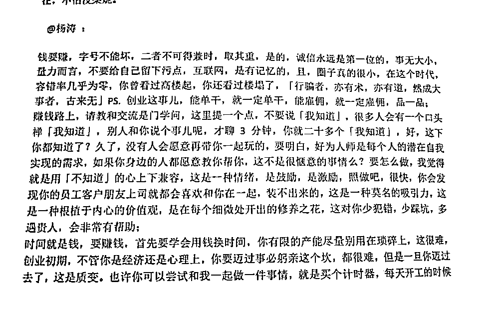

@Lissa Tam , 生财有术的小姐姐，年初的时候进入了她的星球，给我下了个死任务，一个月内写一篇我擅长领域的文章，但是我憋了好久，一直到团队拆伙，我自己出来单干的时候我才完工交付，写一篇万字长文，当时发到优联荟还被小北老师转发到小北的梦呓公众号，也给我的新业务带来了很多客户，帮助雪球站外实现了冷启动，对了雪球之名就来自这位大神之手。后来我也意识到内容的重要性，越分享越幸运。

@吴熳（财神爷小姐姐），生财有术的催稿大师，在个人 IP 这件事给了我很多指导，比如头像、朋友圈、表情包，是我个人 IP 这条路上的启蒙导师，我是一个拖延症晚期患者，这篇文章是在她从头到尾陪伴下完成的，因为完成不了就会被打爆狗头，最后终于定期交稿了。

 

 

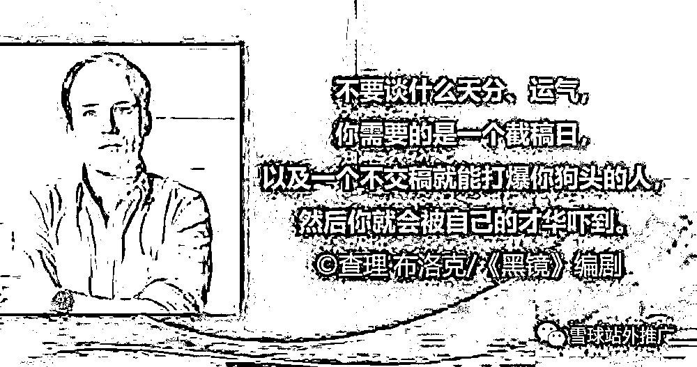

@杨爽学姐，生财有术的内容小姐姐，这篇给我这篇文章很多指导，一开始我完全就是长篇大论，文章比较多经历和感受，但是这些其实对读者来说没什么用，所以杨爽学姐的指导下，我尝试在利他和读者视角的角度给大家分享，再次要感叹一下，生财的精华帖真的都是精华中的精华，因为每一篇文章都是生财有术精挑细选出来的，有时候我感叹，一篇文章就值一张门票费。

@良辰美，也是生财有术的，也是同龄人，也是亚马逊创业者，坚持日更，执行力方面比我高几个等次的人，之前一直监督我写文章，之前我们都有一个梦想，在深圳买房，以前上班的时候一直看他的文章，每次看完跟打鸡血一样，瞬间又有动力了，当时我的想法很简单，我只要跟着他走就不会出现太大问题。

@合伙人 A，之前的合作伙伴，作为我的创业引路人，虽然后来分开了，但是在合作的时候给我很多帮助，即使在分开后也给我支持了很多时间。初出茅庐的我，在没经过社会毒打的情况下，此人带我入行，给了我赚到第一桶金的机会，在遇到很多困难的时候总能给我一些恰到好处的建议。

 

 

@同行 B，站外推广服务中的头部服务商，也是唯一个最大合伙伙伴和竞争对手，虽然是头部，但是很谦虚，给我的帮助很大，很多次上门拜访都没有拒绝，后来我们也达成战略合作，互相学习。

@顾小北，一个我的跨境前辈导师，在优联汇有幸文章被小北老师选中，当时小北老师也问了我有什么需要帮忙的？我当时想想等自己有一定成就了再找小北老师面对面沟通下就没有说。之后小北老师转到了小北的梦呓公众号，导致一直有优联荟的学员过来加我，很多人过来是直接就转化的，因为小北老师的光环，把我称作小北老师推荐的站外服务商，所以背书真的很重要，但是前提也得我靠谱，不然就辜负了小北老师的信任。

@团队的小伙伴，今年年初自己一个人，到现在的 8 个人，发展速度算挺快的，这中间有些人来了走了，只留下 8 个人，这群人我都觉得是值得认可的，愿意一起共渡难关的人，也让我这个连一个刚开始不敢开会的人变成一个独当一面的领导者。熟悉我的人都知道我是有社恐的，但是就是今年为了带好这群人，我硬生生成了一个不惧怕开会的人，一个不怕在众人面前说话的人，一个可以做半个小时直播的人。

@家人，打球的朋友，自己，生活上给予很多陪伴和支持，感谢！

以上这些贵人在我创业这条路上都给我带来不同程度的帮助，没有贵人指引就没有我现在。创业路上，有人带真的很重要。

最后，祝大家一起生财有术！

评论区：

李天民 : 收获很大，感谢分享！

个人理解

从跨境电商行业的角度看，你能赚到钱，还有一个重要原因：

 

 

和做纯粹的亚马逊卖家相比，站外推广服务商显然是一个更好的生态位。

宋大刀 : 太优秀了！

Tyler : 英语过关是必须把

森林 : 感谢分享～

亦仁 : 感谢分享，已加精华。

雪球 : 感谢亦仁大大🙏

跨境老兵聊电商 : 选择正确[偷笑]

chloe : 你好，可以加个VX吗？

# **# ****(**精华帖**)(104**赞**)**分享我做了十多年跨境电商

# 后，对供应链的** 10 **点思考

作者：  竹叶三十

日期：2022-01-06

大家好，我是竹叶三十，一名深耕供应链的跨境电商从业者。我本科和硕士都是供应链相关专业，师从现在此专业的基础教材《供应链管理》的马士华老师；后来在中兴通讯干采购计划，第一年就做了十多个亿的采购额，再后来自己扎入跨境电商领域创业，今年是创业第十一年，公司也走的是打造供应链方向，偏向服装、小型日用品等浙江产品，铺货、精品都做了很久了。

本篇内容，我将会分享一些我对跨境电商供应链的总结和思考，不一定能帮大家打造快速爆发的供应链，但是希望能在打造不亏钱的供应链的上对大家有点启发。毕竟在现在这个时代，不亏就是赚嘛，也算符合生财有术的宗旨了。

**1. **首先要说一个反常识的事情，偶尔缺货的供应链才是正常的供应链

 

 

采购数量和客户需求的关系，是预测关系。既然是预测，就一定有偏差，不是买多了就是买少了。那么如果你从来都不缺货那说明什么，说明一定是采购多了。所以一个从来不缺货的采购员，一定就是给你造成损失最多的采购员（JIT 模式例外）。正常的供应链，缺货率、库存积压，一定都存在，只要控制在一个幅度即可。在这点上不要走极端。

原来我在 Z 公司的时候，见过采购员为了保证项目绝对不缺货，往埃塞俄比亚发了海量设备。后来设备没用完，剩了十多亿电池在非洲，全部都风吹雨淋报废了。全公司的人都被搞的头痛了一年。所以各位老板一定不要要求 100% 不缺货！（对，也不能要求  100% 没有库存积压）都会搞死人的！

**2. **要做好供应链，最大的敌人是来自销售的冲动

第二个反常识的事情，是当你销售最好的时候，就是你最危险的时候，这个危险就来自于销售的冲动。我做了这么多年供应链，最惨的一次就是 2017 年，当时在黑五前两周有一款产品突然超乎预期的冲进了大类 100，一天能卖 2-3Kpcs。我记得当时兴奋的跟采购员讲，快下 10 万 Pcs 的采购订单，不顾采购再三提醒会不会下多了，在邮件里直接说：所有库存风险由我承担。结果货来的时候就是销售开始下跌的时候，这 10 万 Pcs 一直卖到 2020 年。

另外一个案例就是今年跨境电商很著名的破产的某家家居大卖，去年销售额翻了 10 倍，很开心的发了 10 万张桌子到了美国。然后今年一天卖一张，直接被压破产了。“冲动是魔鬼”，在供应链里当出现销量开始快速攀升的时候，一定要反复问自己这个攀升会不会持久。

 

 

**3. **从卖出第一单开始，就要考虑自己的供应链管理算法；供应链管理算法的核心是备货周期

从卖出第一单的时候，就开始需要采购了。开始采购的时候就要考虑自己的供应链算法。这里用算法两个字，意思是你一定要用 excel 算一算，而不是拍脑袋决定。最简单的算法就是：  采购数量 = 平均日销量 * 备货周期。

最理想的备货数量就是，这一批货刚刚卖完，下一批货正好到仓库门口。备货周期的基础就是平台能容忍你的最大发货的时间，在这个上面再结合每次采购发生的成本（下一次采购订单，单次产品运费等）做微调。

**4. **经验分享：做好** BOM **表分解和按周下达采购计划

万物皆可 BOM，  采购到哪个级别，BOM 就一定要做到哪个级别。BOM 的作用第一是指导采购，第二是让采购资料沉淀下来，成为公司资产。

我原来做过一段时间手工艺蝴蝶结：蝴蝶结是由织带生产的，又是手工艺，行业里是没人计算蝴蝶结要用多少织带的，常规做法是一卷织带起做，做完了成品是多少个就要收多少个的货（现在很多小型制衣厂也是这个风格，一件布起做，做完了是多少件都必须收货）。我就自己写了个料单系统，一个蝴蝶结需要红色织带 3 寸，白色织带 1 寸，那么 10 个蝴蝶结就需要红色织带 30 寸，白色织带 10 寸。

完成这项工作以后，采购、生产工作就由只有老板会计算物料变成了谁都可以凭借系统计算了。结果是当时全行业只有我能实现蝴蝶结一打起定制，狠吃了几年红利。

 

 

按周下达采购计划也是一个反常识但有用的小技巧。每个产品，我都会每周计算一次需求，将当周需求发给供应链，要求滚动交货。

这个事情对不熟悉这个打法的工厂来说，开始是会混乱和反感的。因为大部分加工厂习惯一笔订单做完换一个产品做。在按周下发需求下，会出现上周的产品还没生产完毕，刚进入第三个工序，本周又要求生产同一个产品，进入第一道工序；加工厂会强烈反馈，为什么不能一次把订单下出来。但是如果能做下来，其实会发现周生产计划可以带来生产时间、库存的大幅下降，真香！

**5. **在电商领域，库存积压风险一定是最大的风险。避免库存积压比批量折扣要重要

谁都知道一次采购量大，就能拿到好的价格。但是大部分情况下，小批量采购带来的避免库存积压的优势会远远大于批量折扣：Fashion 类产品，过了这阵风就卖不动了；电子类产品，不断有新的版本出来。就算是最不容易变的家居类产品，还有同行跟进瓜分市场和消费者需求变化呢。

而且在中国的产能过剩的大国情下，本身批量折扣就不会很大。而且好的价格也不一定非要采购量大才能拿到。上下游关系、谈判水平，甚至和供应商喝顿酒都可能带来和放大采购量一样的效果。

**6. **要避免库存积压，最终要靠供应链柔性；打造供应链柔性离不开小厂和跟催

 

 

随着消费者变化越来越快，柔性供应链已经成为很多行业的热点。那么如果你体量没那么大，要做到供应链柔性就靠两个点，小厂和跟催。

先讲小厂部分。大厂和小厂最大的区别是在对规模、设备的使用上。大厂人多，制度、流程玩的好，交期质量可控。但要能做到大厂，就一定是靠大单养出来的，做小单很多会水土不服。所以要柔性，就得有放弃大厂、结盟小厂的觉悟。  柔性供应链玩到极致的  Shein，最初就是靠大量广州小厂支撑起来的。

跟催则是另外一个实操技巧。简单点说，就是一天打无数个电话询问进度，这个效果杠杠的。这是我原来在 Z 公司学到的第一课。

那时候我刚刚入职就接到马来的前线催货邮件。前方销售代表哭着喊着说必须在 7 天内发货，说不发货就要被赶出市场了，实际上标准生产周期是 28 天。当时也不知道啥叫江湖套路深，就一个初生牛犊不怕虎。算了算所有原材料都是齐活的，那就搞呗。

我开始不断地打电话催仓库拣货，打电话催仓库调拨材料上产线，打电话催产线待料，打电话催产线生产，电话不同意就直接上产线找负责人，负责人不行就找他上级，再不行就威胁不排产就睡在他办公室。一个进度一个进度的催，最终七天就把产品催出来了。那段时间我的口头禅就是，生产嘛，催一催，进度总能挤出来的。

**7. **和小厂结盟就是要不断培育他

上一条说到和小厂结盟，既然是小厂，就代表能力有限。这时候就需要我们作为供应链的主导来培育他。

 

 

纯粹生产的小厂，大部分都只会生产，对于怎么备料，怎么安排生产进度、怎么管理都是糊涂的。

我们有的对接小厂，最开始送货的时候，货往我们仓库一丢就算了。我们还得手把手设计送货单，要求他们必须附上送货单；还有的小厂，找不到原材料，我们就拍采购上市场去找原材料，再把原材料厂商对接给他们。还有前面讲的周生产计划，我们都是手把手地跟他们讲道理、讲怎么执行。

那怎么让这些小厂都愿意接受我们的培育呢，一个是体量。对每个小厂，争取占到它的产能的 30% 以上，这是一个我认为最合适的比例。不多不少，有很强的话语权，又有一定的弹性。再就是筛选有潜力的老板。他们被培育成功以后，也会觉得这个体系比他们自己原来混乱的搞法好很多，真香！

当然，如果有牛 B 的老板能直接自己开厂那就更厉害了，配合程度更高而且更可控，我当年一度在 ebay 上某个细分裙装做到过行业第二，但后来也还是被赛维这种自己开厂的大佬干掉了。自己开厂最大的痛点是在招工上，这又是另外一个话题了。

**8. **海运、空运、海外仓的联动

跨境电商供应链里面，物流也是重头戏。到底是选择海运、还是选择空运，不要光看价格，而是要结合财务、销售情况综合来看。

举个例子，去年在 ebay 圈子大火的虚拟仓，明明价格比海运高 3 到 4 倍，但是就是有卖家玩的挺开心的。这是因为虽然成本高，但周转快，综合财务收益高啊。从快递到空派到海运，货物运输成本是越来越低，对应的就是财务压力越来越大，还有风险越来越高。一柜在当地，一柜在海上，一柜在国内的卖家风险程度挺高的。

 

 

**9. **另外一个供应链经验：物流池子计划；不要为了单单为了价格引入物流供应商

每天都会接到 10 个以上的物流公司的陌拜电话，我很少因为价格引入新的物流供应商。因为和生产供应链一样，物流最重要的也不是价格，更不是服务，而是稳定可靠。

往往伤害你最深的，就是对你最殷勤的人。

我原来有过一个物流快递商，刚创业的小伙子，价格给的低，人也很殷勤，每天下午没事就来我们仓库帮着打包，笑呵呵的和谁关系都好。我很信赖他，直到有一天，我一个英国客户给我发了带照片的邮件，抱怨收到的货物和外包装被分开了，他还要一个一个去套包装（每个产品都有一个纸的独立外包装，客户收到的时候，产品码在一起，外包装折叠起来码在一起），我才知道，那个可爱的小伙子每天从我这把我们精心好好的货物拖走以后，再拖到他家里，再和他老婆把外箱拆开，把我的货物内容和独立包装分开，再把独立包装折叠。。。就是为了赚取产品体积差价。从那以后我就只和在本地有仓库的知名物流供应商合作了。

那么长期合作怎么让价格最优呢，我的办法是做了一个供应商池子。每条线路找 3 个供应商，比如美线找 3 家，要他们每天发当日报价。每天发货的时候走当天的最低价供应商，同时告知他们这一规则。感觉这方法还挺好用的，既不用每天都去比较一堆不熟悉的供应商，又可以拿到不错的价格。

**10. **最后水一条，凑个十全十美吧。就是要把供应链当做盟友

 

 

供应链嘛，啥是链，串在一条线上的蚱蜢才是链。供应链关系，不是你死我活的关系，也不是你多赚一分我就少赚一分的关系，也不是日常消费的一次性关系，是共同进步的关系。我很多生产知识、物流知识都是供应商教我的，我也经常把我们公司的管理文件这些向他们开放，要共同进步共同赚钱嘛。要抱着长期做盟友的心态来做供应链。

我的分享就到这里，希望能对大家有所帮助。最后再打一个广告，最近我在筹备 Tiktok 供应链业务，想为各位短视频、直播大佬提供供应链上面的服务。欢迎各位大佬私信我来提需求。

评论区：

郑小焦 : 谢谢前辈分享，给我当头一棒又是重要有价值的一课。

今年九月看自己的产品流量上来了，准备迎接圣诞旺季，一顿操作猛如虎直接一直补货，结果并没有按照预期增加销量，现在货物全部堆积亚马逊仓和本地仓，按照当下销量还能卖三个月。还要祈求没有其他意外情况出现

要求链接不断货是不可能的，学习了

陈焘 : 感谢前辈分享，收益匪浅

亦仁 : 感谢分享，已加精华。

杜芳 : 感谢分享，求加好友

卷毛娜小姐 : 谢谢分享，销售最好的时候，就是最危险的时候。我们做亚马逊备货的时候，就经常犯这个错误。以为爆单了，就猛地加单，现在还有一堆库存在仓库

倪子杰 : 感谢  微信多少号？

Luna : 感谢分享，求加好友

东南亚扶贫大使 : 感谢分享，求加好友

# **# ****(**精华帖**)(100**赞**)**一个年营** 4000W **服装卖家的

# 自剖，谈谈我眼中的亚马逊和** Shopee**

作者：  夏冰雹

 

 

日期：2021-05-26

跨境电商  创业经历  《一个年营4000W服装卖家的自剖，谈谈我眼中的亚马逊和shopee》

各位生财圈友，大家好，我是夏冰雹，坐标长沙，跨境电商亚马逊服装卖家，主做欧洲市场。

第一次在生财发帖，内心很激动，先自我介绍一下吧。

我并不是传统意义上的跨境电商人，加入跨境行业不到1年，之前从事过社区团购、抖音信息流等行业，20年底以COO的身份跨行加入一家跨境电商公司（做了12年的老牌跨境电商企业），主管服装类目，目前该类目年营在4000W左右。

在接下来的内容中，我将从以下3个方面为大家分享我眼中的亚马逊：

一、观点：我对跨境电商的行业观点和判断

二、剖析：深度剖析服装卖家的门槛、护城河、困境和机遇

三、机遇：公司shopee业务的从0到1（轻小型玩家的创业首选）

以下文档约7000+字，欢迎阅读。

【腾讯文档】一个年营4000W服装卖家的自剖，谈谈我眼中的亚马逊和shopee https://docs.qq.com/doc/DS0ZlUWRPa0tWSU1L评论区：

易九川 : 感谢圈友的分享，一字不落的全神贯注看完了，干货十足[强][强][强] 夏冰雹 : 真的吗？我都开始怀疑自己是不是内容写得有问题咋一个评论都没有~~ greyboy胖虎 : 很有帮助,我打算做这个了

易九川 : 哈哈哈，不是的，我不就是第一条评论嘛！写的真的很好，再次感谢分享[抱拳][抱拳][抱拳]

Fleming : 写的非常好，有条理有见解。

老谢 : 干货多多

Chloe Feng : 我也有做虾皮的打算，请多指教[抱拳]

夏冰雹 : 加油，shopee目前的增速很快。

# **# ****(100**赞**)**我是如何度过亚马逊创业这一年

 

 

作者： Lissa Tam

日期：2022-06-22

在行文之前，刚刚掐指一算，发现生财居然陪伴了我整个创业生涯！！时间果然是猝不及防的东西……想起最初写的文章，还是20年是否适合跨境电商创业，转眼间，重新工作，到再次出来创业，又满满当当一年了……

我是Lissa, 一个持续创业人，电子商务专业，从事跨境电商5年，20年加入生财，跟着生财学会了选品，学会了商业思考，学会了和焦虑做朋友（很真实……），还接触了很多除亚马逊之外的跨境电商新事物。

在生财，对抗焦虑的好办法，是踏实做事，是承认自己是个普通人，是比别人更努力的前行。

今天的主题，是我的一年创业小记。

说创业有点大，还是说自由职业者吧……

今天的文章，想要和你分享一下，过去的一年：

**1. **我的自由职业经历

**2. **我的营收模型

**3. **我的日常规划

**4. **以及我对是否要创业的一些想说的话

如果我能够做到，那么在做的各位，一定可以做得更好！

一、我的自由职业经历

 

 

刚创业的时候，我是无法接受别人说我是个自由职业者的。因为我打心底里认为，我正在做一件有意义的事情，我在做一家有价值的公司。

眼中有光，有想做的事情，这种人聊起天来，对于迷茫人士，也就是这个世界上一部分暂时没找到自我使命的人来说，那是致命吸引力。我曾经一度爱装这种逼，后面发现没卵用……按道理说，“抬头看天”和“低头赶路”这中间不应该有什么矛盾，问题就在于，个人资源是否能够将二者相连。

大约不到半年，我就被现实鞭打得体无完肤了   开公司第一要务：活下来。

自由职业者也好，soho卖家、一人公司也好，有限责任公司也好，核心都是：赚钱。往虚了说：提供社会价值，获得酬劳。如果做得好，还能够得到社会认可及嘉奖。

于是你们的Lissa林氧氧同学，变得越来越现实，越来越落地，越来越努力的成为一名合格的商人。

**#**为什么选择创业

21年算是亚马逊创业泡沫破灭的一年，好比买股票，我买在高点了。真 · 别人恐惧我兴奋，别人兴奋我羡慕，别人转行我入坑 · 实锤。

我选择创业的原因大家可能想不到。因为一些不可抗力，在4月份离职了。实际上当时也没想好要干什么。

我是个不太安分的人，无论是打工还是创业，我考虑的都是如何打造一个“作品”出来，而大部分的工作，实际上在短期内并不能达成这个目的。咱们卖货的，在公司的首要任务，是打正，是不断给公司赚钱，创造利润。花钱的事儿，不是每个公司都愿意让人大胆尝试的。

再加上成熟的公司，岗位分得很明细，都是螺丝钉式的，上下左右能够对接到的人，层层分明。

很多看似的资源近在眼前，就跟驴眼前那根胡萝卜一样，看得到，吃不着。我急啊，急死了。

但是很多事儿又是急不来的。

 

 

身在公司，融入到公司运转的机器当中后，唯有用时间建立强信任关系，证明自己，才有后续的故事。

我的性格不是那种能够耐得住前期寂寞，慢慢来、慢慢等的人。无聊的、一成不变的工作，只会让我变得麻木，变得停滞不前，这是我最恐惧的事情。

我太着急、太想看到公司运转全貌，太想要学习到更多的内容了。在亚马逊公司，进步得太慢，成长得太慢。这让我即便是拿着稳定的薪酬，也每天都过得很焦虑。

朋友劝我：要不你就创业吧，省的每次都有这个想法又不行动，反正你年轻，干脆全身心试一次，踏踏实实创个业，如果做得不好，那就回来踏踏实实打工。

于是乎，我就创业了。

然鹅，创业之后，更焦虑了🥲。

我@¥#&……&%¥¥%……&

**#**我的创业历程

4月初开干，啥都还没开始，资料店铺损耗3套。

天知道我到底是踩了什么狗屎P  那段时间，我真是花了十多天在申诉上，跑各种水务网电物业煤气局，收集资料，各种招商经理客户经理能联系的全联系了，无解。

最惨的是货已经发出去了，店铺回不来，每个月还倒扣银行卡的钱，各种仓储费等等，每个月四五百。再加上物流出问题，2个月一直没到货，想移除都没办法，我硬生生又被扣了好多钱。

那段时间怎么说呢，我看起来就是像个被下了咒的倒霉孩子，浑身乌云密布。

直到6月中，事情才慢慢好转。

 

 

我放弃了之前的所有资料和店铺，以及店铺里的货，计亏损2万。

找朋友借了套资料，一切重新来过。店铺开好后，把处理好的货发走，这才正式开始。

我很清楚的记得，时间是6月16号，正好是去年的这个时候。

店铺稳定，后面的选品、上架运营，也就按流程稳步进行。

用**2**个月的时间稳定基础端（店铺），用**2**个月的时间跑出一个盈利的产品并保持返单，用剩余的**8**个月重复**“**选品、拿样、采购、拍摄、运营**”**这个流程。从一开始货堆在客厅，到借朋友的仓库一平方地，到自己租仓库。库存慢慢变得越来越大，直到我的小仓库也放不下了，里里外外堆满了成品和半成品。

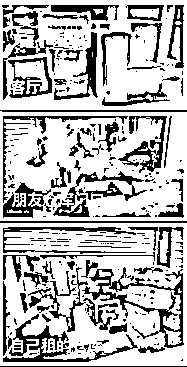

今年3月的时候我开始招人，从1个人到一个小团队，后面运营职业发展迷茫，选择离职转行，我再度回到1个人的状态。今年亚马逊的行情仍旧一般，我的产品属于下半年旺季，暂时也就没有再招人。等到7月份，新品上架，再把团队拉一拉。

在网上看到过这样一张创业公司曲线图。开始高歌猛进，奔向巅峰，然后急转而下，底部徘徊，接着一路坎坷，几近崩溃。其实很多创业公司都走不到后面，所谓创业九死一生，拼的就是谁能熬到最后。

 

 

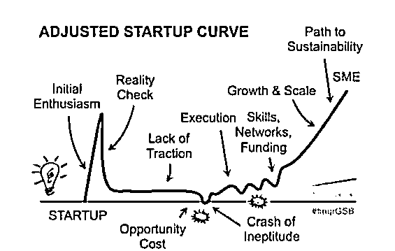

涛哥之前在直播间讲过，创业其实考究一个人的耐受力。啥意思呢？好比挖井需要6个月，有的人只能接受干1个月没回报，挖一个月走了。有的人能接受干半年没回报，前期埋头苦干，第6个月迎来增长曲线。

我是一个耐受力很差的人，只有不断的强有力正反馈，才能让我兴奋。

亚马逊呢，说来也简单。上产品，测试，销售。只要不断的上产品，提高自己的选品能力，然后快速测试，正常运作，那么盘子就能够越来越大。

单一产品的天花板可能很低，但是整体而言，卖货的天花板实则很高。

当然，如果能够做垂直肯定很好，特别是有合作很久的供应链资源的时候。但是如果没有，像我这样一穷二白的，直接做垂直，会更适合多测试几个方向的产品，慢慢找到自己适合的那个类型，再去做垂直。说起来轻松，其中的时间花费也是要去到一年以上的。

这两天实际上想明白了一件事情。我可以慢慢开产品，往常我的目标是每个月2个品，现在我甚至可以放慢这个节奏，每个月开1个品。如果每个品能做到月销2万美金，净利润能有15%，理想状态下，每年也有150万美金了，一年能赚22万美金，这不是比焦虑的上产品要幸福得多吗？

 

 

卖的好，正反馈强，我就越兴奋，状态就越好。当然啦，这不是什么所谓的“长期主义”，在我的理解下，真正的长期主义，应当是在短期活下、活好后，自然而然出现的存在。

因为，长期赚的钱肯定是比短期综合赚的更多，才选长期哇！这都是帐。所有的理想主义，都要在会计学的认可下，才能开始实践乃至实现。

焦虑是正常的，创业哪有不焦虑的。要选择和焦虑做朋友，要适应它的存在，并友好地利用它，疯狂赶进度，赶DDL，这才是有效焦虑。今天看到新东方的带货视频，也是直呼卧槽。

“有朋友说我们涨了好几万粉，我也没想到，以前我们直播间几百个人，一直在坚守着，在熬”“痛苦是对的，是源于对现状的不满，痛苦才会想要改变这一切，痛苦就是力量”“焦虑也是对的，焦虑是因为你想做的更好，说明你追求高”

“悲观是远见，乐观是智慧。意识到现在不够好，意识到未来也不一会一帆风顺，本身就需要勇气，就需要知识，需要智慧”

不管外界怎么样，我们继续做好自己的事情就好。只要我们保持持续进步，保持一直在场，珍惜并利用好每一分钟，即便是我回去上班，也能拿到更高的待遇和机会。

想到这，就没啥可慌的，继续造哇～

二、我的营收模型

诚如上文多次提到，做生意最重要的是赚钱，创业最重要的是活着。

亚马逊是一个相对很重的生意，前期我们不仅投入时间，还要投入真金白银。

这里我不得不说，生财，虽然带给我焦虑，却也是前期让我支撑下去的核心。

 

 

刚开始创业那会，正好遇上生财2021年的纳新。我想着自己从没做过社群推荐，那就试试吧！

于是在纳新开始前3天，开始推广、拉群，最终邀请了24人，赚了第一笔内部分佣，解决了前期的生存问题。再加上我在生财做过分享，拿过社群币龙珠。现金流紧张的时候，10K卖掉过一颗，又稍微回了回血。

一个人创业很孤独，很容易自我封闭。这就是有个社群能够交流的重要性了，很多新鲜事儿、机会、新玩法、同频交流的人，都能够见识到。这也是我创业时候的重要信息源&知识库之一。

如果用《小狗钱钱》中下金蛋的鹅来定义我的投资及营收情况，那么我现在拥有：一只鸡，一群鹅。

鸡是我的自媒体板块，目前还是只小鸡。这只鸡的投资回报很高，只要我坚持每天给它喂粮，它就能持续给我下蛋。虽然更新不多，却也积累了一些忠实粉丝。

鹅是我的亚马逊卖货，目前有个8只，有大有小，能够持续稳定的下蛋。但事实上，它的投资回报率比较低。这两年亚马逊物流费用飙得不行，所有的货只能走海运，原本的投资回报只有50%，再加上仓库、海上压货，投资回报就只有25%了。利润太低，钱一直在货里滚，转不出来。

干了一年，在亚马逊上赚了不到五十万人民币，都在货里了。我可谓是纯纯搬砖人，赚了点社会给我发的工资，工种叫做“全球资源流转加速官”🫠

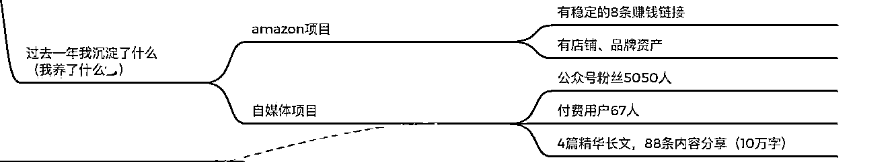

当然了，除了钱之外，还有一些其他资产，比如说店铺啊、品牌啊、办公固定资产啊，以及日渐增长的诚e赊额度、货代账期，和我日渐灵活的大脑子(*☻-☻*)

我自己设计的营收模型，还是以亚马逊为主，内容为辅。

按照一个自由职业者的发展轨迹，我大致做了个图片：

 

 

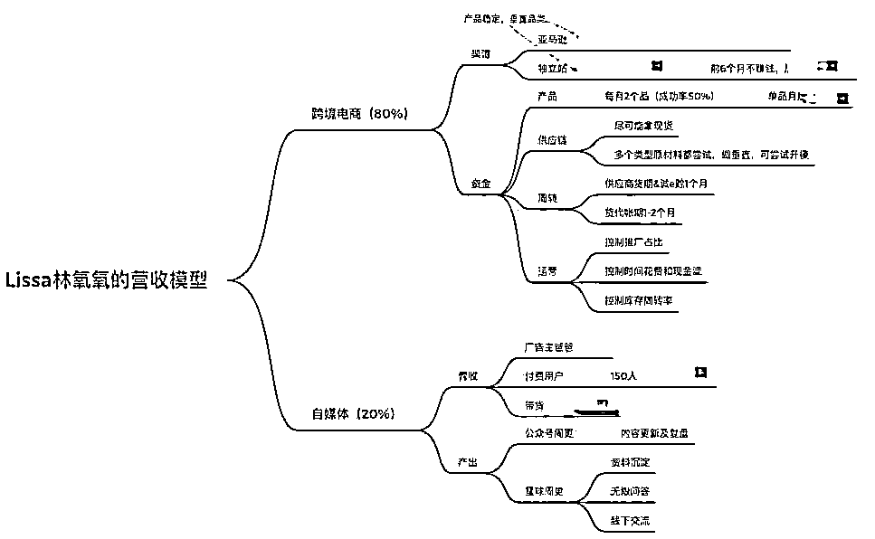

在我的规划里，跨境电商花费的时间占80%以上，主要集中在亚马逊上，通过重复选品循环，以提高整体营收，来对抗单一产品生命周期变短的问题。

此外，尽可能少压货，尽可能拿现货，提高资金周转率。

之前刘润老师有一篇文章，分析资金来去：“创业就是问5种人借钱，用在4个地方”。5种资金来源是指：自己的钱、投资人的钱、预收（客户的钱）、借款（银行的钱）、应付（供应商的钱）

4种资金去处是指：现金、存货、应收、固定资产。

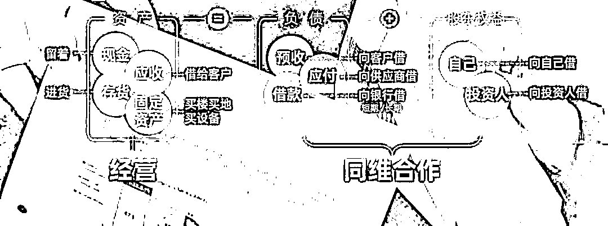

 

 

能找钱，会花钱，把钱运转好，计算现金流周转表，生意就能实现自循环，正常运转。

这里有个插曲，因为我实在是对“招人”做“团队”这一块没有经验，外加上我又十分地要脸皮……我很怕招人进来后给不到对方对应的成长和想要的钱，因而一直在等自己准备好，再开始招人。创业公司，也是资源受限啊，钱给不到位，导致也招不到什么好的人才。

之前涛哥教我，要计算个人的时间成本，比如我一个小时值1000块，我去干80块钱/小时的活，我就亏了浪费了嘛！

但是我脑瓜子那时候不是这么算的，我不是每一个小时都能获得1000块的利润，那么在我剩余无所事事的时间段，我80/小时也是赚哇！（不知道涛哥看到这个逻辑会作何感想，哈哈）前阵子和朋友聊天，谈及个人成长，我原计划是未来要考MBA的，大约1-2年以后。我用我的魔鬼逻辑🤏指一算，既然读MBA要钱，那么我不如提前把这个钱花掉，用来招人，于是乎我就可以把我的时间节省下来，去学习，去拓展哇！

我假设我有了60万的未来预算，并把它前置，将它用在团队扩展上，提高综合生产力。而且人招过来总不能亏钱的，我们假定他最多亏2个月（一般赚不回自己的工资都被开掉了嘛），那即便是我招2个人，也就最多亏个4万块。

但是我有时间拓展新的项目，我相当于花这个钱做了自我提升，这不比花钱报韭菜培训班强吗？这样未来我能读更好的MBA，有更大的成长空间哇～（朋友说虽然结论很离谱，但是魔鬼逻辑💯）

 

 

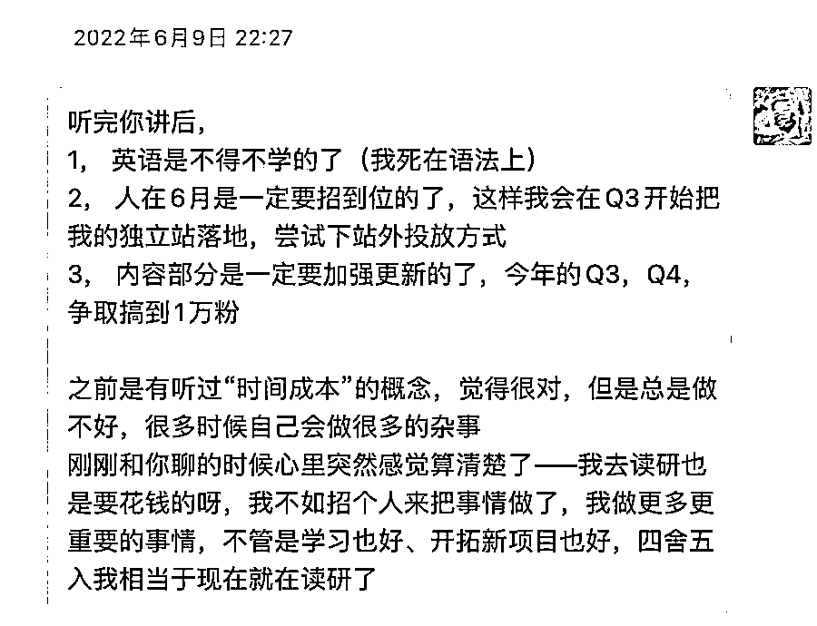

这里也就是上面的思维导图里，我会提及独立站的原因。我将会在今年的Q3和Q4，把稳定的产品线对应的独立站开起来，花半年时间等一朵花开。

再者就是内容更新，我通过各种各样莫名其妙的方式来实现自我催更，比如找广告主爸爸（卖家精灵）合作，成功拥有了一名可爱的美少女编辑Doris，以及更新deadline；比如加入了视频号训练营，甚至要开始把视频也发一发（不把我的公众号置顶星标兄弟萌你们可能就看不到哇）。

很多东西讲起来好像很小很轻松，实际上真正做过的人就知道了，这需要多少的时间和坚持。

我不知道我能做成什么样，但我知道的是，我会尽力去做。因为有你们在，因为你们的陪伴和鼓励，我很快乐。

希望我们都能大大滴挣钱～～～

三、我的日常规划

 

 

有朋友和我说，想看我的日常，觉得我是时间管理王者，好像能做好多好多事。实际上并不然。

当亚马逊跑通后，我的流程基本上是：选品、拿样、确定产品方案、采购、拍摄、修图、剪视频、运营、补货。

大约是2-3周一个循环，偶尔遇到选品瓶颈期，则往后顺延。

可以给大家看一下21年刚创业的时候做的进度甘特图。

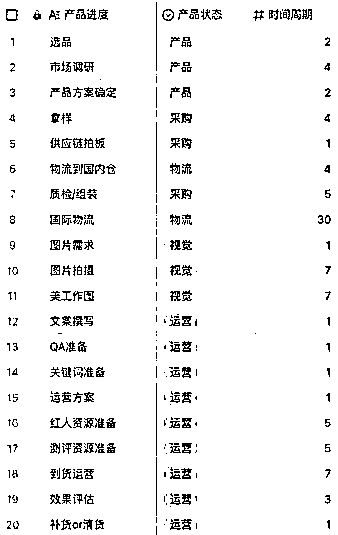 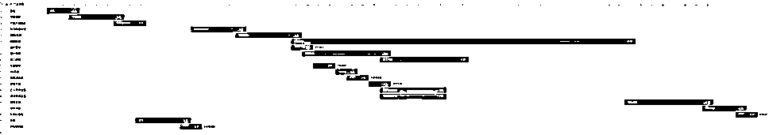

选品是最让我觉得“好像每天都没有产出、无所事事”的一个环节，这部分就是以“选出来一个产品”为里程碑。

因为周期着实有些长，这让我感受不到什么反馈。

后来我就尽可能把量化颗粒度做细一点，比如说一天要海选出 XX 个产品、一周做 X 个产品方案、一个月确定 X 个可量产的产品方案。

 

 

除了工作流程外，重要还有数据分析和汇总。通过三方工具进行数据整理，自己再用Excel做个数据分析看板，用来追踪各个节点达成率。推新品也会有专门的推新记录表格。记录每日的销售数据、关键词排名、产品数据、流量转化率、新品日志等等，便于后续的复盘，以及推新策略的可复制。

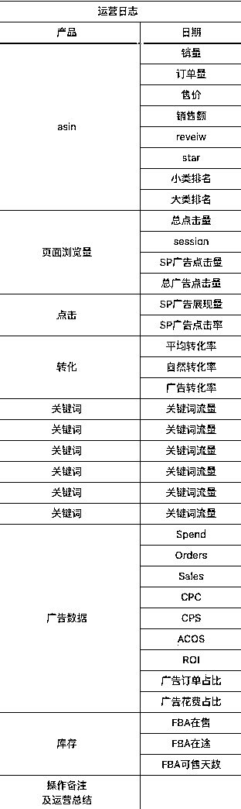

大部分的时间，我都花在选品上，预估是占65%。产品花的心思比较多，在运营这一块，时间花费相对就少一些。

在运营端，我目前只做效率最高、**ROI**最漂亮的事情：投广告。像 post 这些，之前招了人我是全部给运营在做的。这个对于我而言，是需要花时间、ROI还不错的事情，但我没有那么多时间和精力去做，遂排名靠后，时间不够我就不做。

新品我会每天都盯着，老品则时间节奏拉得比较长。

 

 

新品每天看排名、看销量、看广告数据，进行调整；老品一般一周看一次，统一进行调整。然后再一周统计一次销售数据，对齐销售目标。

看起来很多很琐碎的事情，拆分到天，其实也没有那么忙。比方说最近一段时间，我会睡到8点起床，在星巴克从9点呆到12点，回办公室从1点呆到晚上10点。推进了上个月的两个要开模的产品，同时毙掉了上个月和这个月选出的品，目前正在为这个月的产品KPI发愁。

至于每天做的事儿，我偶尔在事情多的时候，会用印象笔记记录下来我要干的事儿，然后对照着做（实际上大部分我都没办法当天完成）。更多的时候，我则按心情做事儿。

我是个拥有人类缺点**“**拖延**”**、**“**懒散**”**、**“**情绪化**”**的人，我没有办法**100%**克服，而正因如此，这才塑造了我的样子。

我属于“时间管理能力其实挺菜”，但我用“加班来凑”的人……

自由职业者贵在自律。自律使人自由，诚不我欺。

在我的时间管理方法里，我个人的理念是：时间管理旨在提高单位时间利用率，而不是时间总长度的花费。

我更倾向于“结果导向”+“聚焦”，这也会结合到精力管理。只有精力管理好了，时间利用率和效率才会变高。

这个方法也是在生财学到的，来自易仁永澄老师的时间管理  https://t.zsxq.com/03MrB2Zb6  和CC老师的精力管理https://t.zsxq.com/03ZrfiybY。

 

 

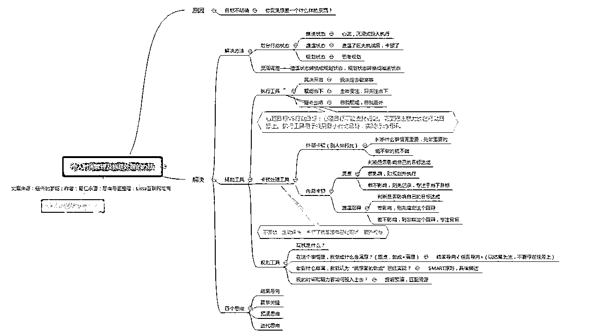

然后我会再用飞书，每个月初，我会制作好当月**OKR/KPI**，然后再分拆为多个小计划，进行达成。

飞书的模板功能太好了好嘛！强烈建议大家都用上！

同款链接：https://vzzx5hov90.feishu.cn/base/bascns3tNXQ7OjZB0RF9jQKPwsd?table=tblrpPfle2ObsJQP&view=vew9vIz0jN 

 

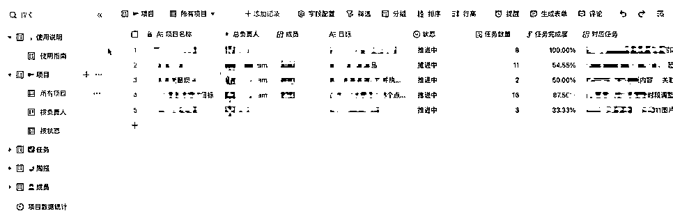 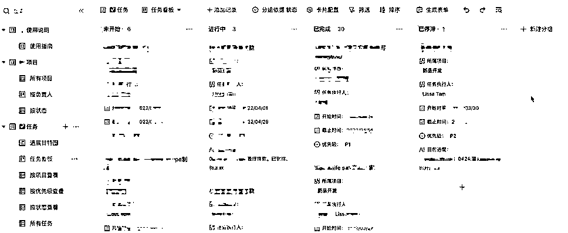

作为创业者来说，时间维度是需要拉长来看的，至少得半年往上。创业是个长期的事儿，很多时候往往放弃，是源于坚持不下去了，而非破产倒闭。

在制作个人使用说明书的时候，我对小白 @白一喵  老师的话印象深刻：一个人的时间花费，决定了这个人是什么样子。

https://t.zsxq.com/037iuN7Mf（白一喵老师的原帖）如果时间放长到周、乃至月，那么我一般是这样安排的：

1\. 按照亚马逊项目流程进行工作，一般是平均工作60小时/周

2\. 每周会文字复盘一次，2k字的文章，时间花费在1-2个小时；6k字及以上的文章，时间花费在8个小时

3\. 每周至少锻炼2次，一般是跑步/刘畊宏/健身房/羽毛球，一般是平均3小时/周 

 

4\. 每周休息一天，大部分时间追剧、看书，偶尔画油画；每2周/月会自嗨一次，一般是花一个小时愉快的唱歌

5\. 每月/2个月偶尔出去玩一次，一般是海边/爬山

6\. 每周喝2杯奶茶，一般是为了缓解焦虑（乱入）

生活是看起来似乎平淡又枯燥，但也正常的运转着。

要是说我有什么遗憾，我觉得最大的在于：我没有充分利用好自由职业者的“自由”——空间自由和时间自由。

随时随地的办公，去任何想去的地方旅行，做自己想做的事情。

我曾经幻想过，我或许可以过上数字游民的生活，像Jarod、Natalia 一样，在东南亚地理套利，用极低的生活成本，享受极高的生活体验。跳伞、潜水，带着电脑，出入各种各样有调性的城市咖啡店；我或许可以过上房车自驾游的生活，像博主小墨与阿猴一样，花上半年时间，走到一个地方，停下来，住一段日子，感受生命的真实，体会大自然的馈赠……我也想过更可行的，每个月选择一个城市旅行，呆上一周，找当地的三五好友小聚，体验体验不同的人文与生活方式。

当然啦，我每次的想去地点都是西双版纳，但每次实际的出行地点或者是准备地点都是杭州😂

最近一年甚至连杭州都不敢出发了。总觉得，身上有好多好多事情，虽然也没有特别紧要、没有非要在周边，却也不敢怠慢，不敢离开。

卖货就是这样，或者说，我目前的模式就是这样。仓库每周/每两周都必须要去一趟，得看看，有货要处理、要质检；办公室总有样品寄来，得拿到手感受。我自己甚至还想了个歪招儿，把仓库搬回老家，让我爸妈帮我看着，帮我质检发货。然后我就可以愉快的玩耍～哈哈哈！（只能想想）

不放心手头的事儿，又觉得总会慢慢做大，要招人干活，因而也没有自由职业者的自由，这也就让我慢慢困在这一公里内了。

 

 

这是我的困境，我不清楚，这是不是大多数个人创业者的困境。

**#**关于是否要创业我想要说的

最后一个话题，因为销售行业的特殊性，我发现好多运营/开发都会选择出来单干。再加上网上各类博主的吹嘘，很多老板们也在寻求增长，想要入局跨境电商。

20年的时候我写过一篇文章，评估资源来决定是否选择创业，今年我的感受是，最好还是不要出来创业了。

第一点，肯定是大环境不好了。

Q1的时候，店铺数据还是很不错的，但从Q2开始，肉眼可见的流量、销量在下跌。

我原以为是我自己太菜了，直到发现大多数朋友都如此，我也就放心了┬─┬ ノ( ゜-゜ノ) 后来看到亚马逊的数据，发现今年的亚马逊的流量是去年的80%。再加上，亚马逊的FBA配送费、头程物流运费一直在涨，利润明显变少了。

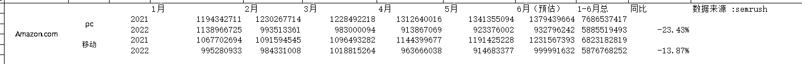

还有一个点，以前都是我们求着招商经理，今年太多招商经理找上门的了……足以见得，潮水已退去。

市场经济下行，苟住第一名。

第二点，创业九死一生，成功率太低了。

亚马逊的门槛很低，只要有货、有店，就能卖。因而我们看到，很多做得好的运营出来自己单干。

如果是在2020年及以前，个人创业成功率算是相对比较大的，流量便宜，竞争较小，利润率高。

 

 

现在则是越来越考究个人能力，综合能力的提升，以及对有限预算的极致利用。

比如说创业，供应链是否能够处理好，产品端是否有竞争力，仓管质检是否能做到位，运营端是否能抓住每一个高价值的流量。

很多事情，在没有经历过的时候，它就是个概念。概念很轻，显得很容易，但实际上真正做起来，才会知道原来从A到B之间，要走这么多步路，要做这么多决策，而正是这些组合决策，让几乎是按照统一套方法概念做事的人，得到的结果截然不同。

创业考究的更是一个人的综合能力，一个人的心态，一个人的软技能。

今年很多公司大幅度裁员，运营被离职、降薪。但是通过boss直聘等平台，会发现运营的薪酬仍旧居高不下，之前听moss分析过，我觉得很在理：大部分运营之前拿高薪养惯了，不愿意降薪入职，担心降薪之后再也难抬上去了。再者行情不好，大部分公司都在清货，入职工作也难以拿到提成，不如选择高底薪。

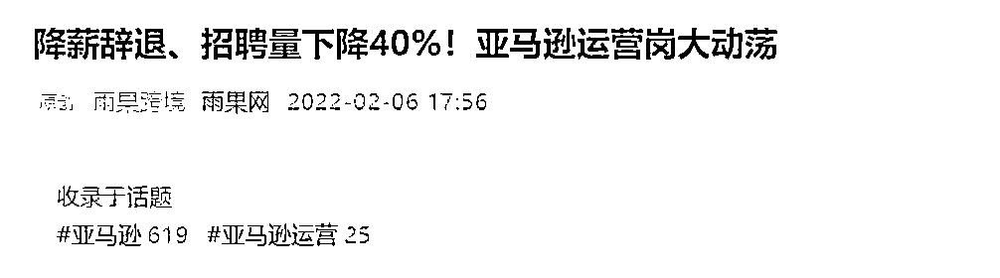

我不清楚其他城市的运营是怎么玩的，深圳这边之前很多SD黑科技的公司，这一年来被封的元气大伤。

深圳这个城市，鱼龙混杂，在这个行业热潮的时候，显得太过浮躁。

错把行业的机遇看成是自己的能力，然后膨胀，然后栽个大跟头。

今年下来，在招聘以及同行交流时，我发现很多运营换了一个思路：在公司一边打工，自己一边开店。

我不得不说很聪明，但如果放在我自己身上，我不会去这么做。

我们不从道义角度和法律层面上评判对错。

 

 

的确，做一些和主业相关的副业，能够增加经济收入来源。

但是自己开店，我们盘算一下，究竟需要耗费多少心力。我不说别人，我自己全职在做，都感觉做得不是很好。

重资产创业需要真金白银的投入，钱砸进去了，没效果，你的心态会如何？

更何况，你还要面对公司的同事、老板，工作KPI。你的精力怎么分配？

你的时间怎么分配，如果你的时间全部放在了选品、供应链、运营上，如果全部放在了一些琐碎的事情上，如果全部放在了一些交洽、扯皮上，那么，你的成长时间呢？

你还有时间自我提升吗？

你有多久没有读过一本书了？

后台的一些新的功能，你用了吗？

后台非亚马逊广告投放功能，你尝试过吗？

如果你是管理层，你的团队业绩如何，你的组员们，你有在持续关注他们的成长吗？

你有拓展一些新项目、新业务吗，有尝试过站外、比如说tiktok、 youtube 红人联动吗？

我不是为了制造焦虑，而是这些问题，需要我们自己想明白、想清楚。

究竟是短期找赚钱项目，还是让自己变得值钱？

每个人的答案不同，没有对错，只要想清楚了、坚定去做就好。

我能够理解大多数人、特别是运营同学，对当下阶段的迷茫感。

看不清未来方向，也不知道自己要做什么。想要快速成长、想要努力自我提升，又不知道从何开始。想要用力去拼一把，却因为看不到正反馈而放弃，然后开始自我怀疑……别焦虑，我也是这样。

 

 

在创业早期的时候，我特别迷茫，有时候会突然之间无所事事。我给自己整了个扎心每日问，挂在印象笔记的快捷访问里面。每当我感到焦虑，我就翻一遍这个帖子，给自己找点事儿做。

做点小事儿，有反馈，有成就感，还能让我冷静。

借用涛哥一句话：事情不是想明白的，而是干明白的。

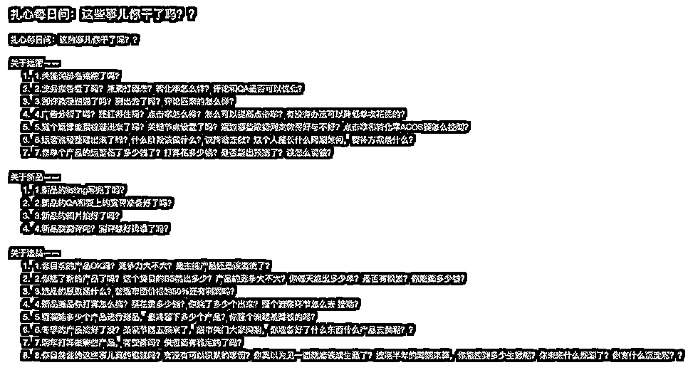

要说**2021**年我的成长在于：世界很大；靠自己。

那么过去创业这一年，我同样有两条成长经验，分享给你：

自我成长很重要，切莫荒废好时光。

想不清楚，干就完了。

生财是个好地方，这个月的航海我入了两条：视频号和读书。时间就是挤呀挤呀突然就有了好多，@明白老师  就是个特别好的榜样。如果你还不知道在生财从何开始，不妨加入生财的航海之行，不妨深度沉浸式体验一下。

如果我能做得到，相信你可以做得更好～～

 

 

过去这一年，特别感谢大家的分享和各式各样的活动的陪伴，还有鱼丸无微不至的关心（我问过是哪一颗，但是她不告诉我！），这也是我开始动笔写这篇文章的动力，@光合  的成为一道激光，@杨涛  涛哥的各种心里辅导和出谋划策，还有同城 @Sky老思  思哥在我迷茫期的解惑。

下面是文内相关的文章，一并整理给大家。

如何尽快和陌生人破冰&白一喵的使用手册  https://t.zsxq.com/037iuN7Mf @白一喵  易仁永澄的时间管理分享  https://t.zsxq.com/03MrB2Zb6 @易仁永澄CC老师的精力管理分享  https://t.zsxq.com/03ZrfiybY @CC活成一道激光  https://t.zsxq.com/03BUJiqnQ @光合平民版人生复利修行准则  https://t.zsxq.com/03QrZNbQ7 @杨涛真正的跨境运营和营销绝不是简单的筛选产品上架促销这么简单

https://t.zsxq.com/03NF2nY76 @拓跋勇

如何创造更多优质创意赋能给产品来实现差异化竞争  https://t.zsxq.com/03BuByj2n @lenry完美的创业项目，是怎么被想出来的  https://t.zsxq.com/03UJuNr3B @刘小排……

还有很多很多，不一一列举了，生财的精华贴值得搜索一一查看！！

我是Lissa林氧氧, 一个努力搞钱的深圳女孩，跨境电商从业创业者

以下是我在生财有术的精华帖（按时间排序）

https://t.zsxq.com/03E27qvjM  手把手教你如何选出月入上万的单品https://t.zsxq.com/03RvRzFqr  我是如何毕业两年晋升为跨境电商大厂经理的https://t.zsxq.com/03AUZrVZn  手把手带你在亚马逊开店卖货  https://t.zsxq.com/03QneyJyJ 10人团队做亚马逊年营收7000w的方法论 

 

https://t.zsxq.com/03z3NJa2b  疫情下，跨境电商还有机会入局吗https://t.zsxq.com/033nu7MFM  不靠广告，如何在亚马逊3个月把一个产品做到100W销售额https://t.zsxq.com/03MFMjQF6  我是如何3个月时间推出一个类目老大商品的最后，因为业务增长，有一些招人扩团队的需求，欢迎各位来撩～～

https://t.zsxq.com/03eyvR7Q3

感谢生财让我们相遇～

#跨境电商 #创业 #轻享 #复盘 #个人成长

评论区：

草木青 : 涛哥星球看到你了，

草木青 : 创业的确很容易焦虑，得熬，

跨境老兵聊电商 : 创业不容易吧😄,所有经历皆会有回报,还有,选择正确的赛道永远是创业者最重要的一步

云海 : 我曾经幻想过，我或许可以过上数字游民的生活，像Jarod、Natalia 一样，在东南亚地理套利，用极低的生活成本，享受极高的生活体验。跳伞、潜水，带着电脑，出入各种各样有调性的城市咖啡店；我或许可以过上房车自驾游的生活，像博主小墨与阿猴一样，花上半年时间，走到一个地方，停下来，住一段日子，感受生命的真实，体会大自然的馈赠……，我想这也是很多人的幻想，自由自在，享受生活~

何友澜 : 好棒，也算做出成绩。21年出来做亚马逊行业人士10个有11个应该是劝你可别。

可是你做出来了，太难得了。

iamgo : 同是华西邻居，你怎么那么优秀！

 

 

Lissa Tam : 上你家吃饭去

Lissa Tam : (｡ ́︿ ̀｡)

# **# ****(**精华帖**)(92**赞**)**创业分享：从玩转海外流量，

# 到亚马逊金牌卖家，再到为跨境电商服务商

作者：  亦仁

日期：2018-12-12

每周三，带你认识一位新的生财合伙人。

前几天  发了一条朋友圈：每一个成功人士的背后，必定曾经做出过勇敢而又孤独的决定。

这一条，让很多人，包括我，心有戚戚。

我与大多数生财合伙人聊，发现即使他们这样的创业老司机，面对未知，都有很多彷徨的时刻，甚至充满恐惧的时刻，彻夜不眠，压力巨大，几个月熬白了头。

但，想想都是问题，干了才有办法，若因恐惧不前，什么事情都做不了。

创业，必须学会克服恐惧，带着恐惧前行。

今天的这位生财合伙人，就是一个不断克服内心的恐惧，做出一个又一个勇敢而又孤独的决定的人，虽不说人生巅峰，也在自己专注的领域有所成就。

作为海外流量玩家的他，一个niche站月入五万美元；

作为Amazon卖家的他，旺季月销售额破五百万美金；

作为资源整合者的他，成立了亚马逊最大的刷Review公司，日刷万单；

作为新媒体创业者，他如何从一个流量玩家变成一个媒体玩家？

欢迎侃侃网创始人  ！

以下为本次专访内容， Enjoy。

各位生财有术的圈友，大家好，我是侃侃网Moss。

 

 

今天有幸受到亦仁兄邀请，来和大家聊聊我的事业聊聊我的生活。先简单介绍一下我的经历吧：我在新西兰和澳洲完成了本科和硕士的学业，专业是电子商务和计算机科学。

毕业后，我独自去美国创业寻找机会，小有所成以后又回国继续创业，目前来说仍在路上。

回国这几年，一直辗转在合肥，杭州，重庆和深圳这几个城市。目前公司在重庆和深圳，所以今年一直来往于两地。有机会的话，可以和这两个地方的朋友好好聚一聚。

说实话，如果像自传式的记录我这些年的经历，未免太过于冗长，而且大家也不一定会感兴趣。在我的世界观里面，一个人的一生严格来说是由不同的阶段组成的，这个阶段可以是事业上的阶段，当然也可以是情感上的阶段，也可以是生理的阶段。因为小密圈的主题是生财有术，而不是情感频道，也不是人生哲学。所以，今天主要和大家聊一聊我的事业上的阶段。

作为连续的创业者，我在每一个创业阶段都获得了某种意义上的成功，这种成功主要是体现在财务上的。准确来说，我所有的创业项目其实都是基于一个大行业下的，跳脱的并不是很大。而且，每一个创业项目和经历都颇有所得，收获巨大，积累的经验和人脉都会对我们下一个项目都会起到非常大的促进作用。某种意义上来说其实是承前启后的。上一个项目都是为下一个项目做铺垫，而且下一个项目开展过程中，上一个项目还能够在不耗费太多精力的情况下，提供大量的现金流支持新项目的前期运转。所以，严格来说，我算是一个幸运儿了，也是一个谨慎的创业者。

下面我会以四个创业的阶段作为划分，给大家讲一讲我这些年的创业故事。希望能够给大家带来一些启发，也欢迎共同交流，学习讨论。

第一个阶段：  海外流量玩家

因为大学时代，有学过一门课，大致的内容就是讲social media，SEO以及SNS这方面的内容。当然并不是很深入，是非常偏介绍性的。但是老师真的不错，给了我很大的启发。我就从这里开始入了海外流量玩家的坑。也算我的半个启蒙了。

刚开始玩的时候，那时还是学生，其实都不太懂，就一阵子瞎捣鼓。靠着自己建站，主要是一些产品测评网站，把亚马逊的review拿过来改写一下，然后对接Google adsense，想要通过流量变现赚钱。结果可想而知，站点虽然是有模有样，但是基本上流量屈指可数，很快就以失败告终。

 

 

我一直是一个坚韧的人，当然不会轻易言败。一直在不断地学习不断地找原因。其中有几件事情对我影响很大：第一件事情看了两本书，一本书是长尾理论，另一本是Zac的SEO实战密码，对我有非常大的启发。一方面，受Zac启蒙，给我塑造了一个完整的SEO思路和大体框架。另一方面，受长尾理论这本书的影响，我放弃了之前专门做一到两个大站的想法，后续慢慢开始玩长尾站群的模式，开始玩niche 站点了，而且流量变现的方向从之前CPM模式的adsense，转向了CPA模式的亚马逊联盟，也就是amazon affiliate。

第二件事情就是加了很多黑客群，SEO群，认识一帮莆田大神，很有意思的是当时机缘巧合，找了一个高中生，也是莆田人，在百度和Google上面玩黑五类玩的是风生水起。

我当时咬了咬牙，花了一万块钱拜师学艺，他答应给我线上授课，几个月间教会了我很多黑帽作弊玩法，比如流量点击的脚本制作，流量劫持，抓rj等等。因为本来计算机就是我的专业，这些东西只要给我一个大致的方向，我差不多自己钻研下就能够融会贯通了。所以说，有时候有人带路比自身努力还要重要。

经过一段时间学习以后，就非常顺风顺水了。当时最巅峰的时候，一个人有150个niche站点，其中最大一个niche站点月收入超过5W美金。那个时候我还是一个学生。

第二个阶段：跨境电商亚马逊卖家

后面快毕业了，当时觉得这个事情毕竟不能长久，想换一个更稳定的创业方向，或者说一个可以作为事业去做的事情。主要是因为当时黑科技作弊玩的有点猛，后面还碰了黑五类，暴利的同时风险也是巨大的，被谷歌K掉了不少站，收入受到了大幅度的影响。

当时由于一直在做amazon affiliate，  我在想我通过联盟都能赚那么多钱，要是直接去亚马逊卖货的话，是不是能赚更多的钱。但是，这一块的确算是陌生的领域，而且当时亚马逊还没有全球开店的业务，中国团队还没开始建立。要开店也只能借助目的国的公司或者个人身份。我思来想去，后来就决定毕业以后去美国找找机会，看看能不能抓住这个红利。

当时申请了一个美国公司找了一个有身份的华人合伙人就开始搞了，货源的话也很简单，直接通过速卖通去做dropshipping，那时候亚马逊FBA还不流行，基本都是FBM自发货为主。其实做亚马逊真的是踩中风口了。那个时候亚马逊上面基本上鬼佬卖家比较多，流量成本非常非常便宜，而且对于刷单几乎是没有打击。

 

 

所以，当时直接用虚拟机开镜像配V-P-N 的模式，养了1000+亚马逊买家账户，产品上架以后就开刷，广告也不做，同时通过直评的模式，一个listing一上架就刷大几百review，然后关键词刷到首页，就可以收割了。基本上刷一款产品爆一款产品。后面量太大，速卖通dropshipping已经扛不住了，直接用阿里巴巴国际站开始B2B采购了。巅峰的时候是黑五旺季差不多一个月销售额破了五百万美金。

开始很美好，但是后面还很严峻。因为对物流供应链这一块没有没有主动权，而且说实话也不太懂，毕竟我是玩流量出身的，对产品这一块比较欠缺。导致后面大量发货延迟，包括退货，直接导致亚马逊账户被亚马逊给关停了，损失惨重。不过，我依然很看好亚马逊这个行业，因为跨境电商是国家外贸出口的一个全新的方向，外贸又是拉动经济增长的三驾马车之一，中国又严重依赖外贸出口。所以，我判断，亚马逊这个事情其实是可以当做长久发展的事业来做的，而且供应链在中国，还是得回去才有更好的出路。

第三个阶段：  亚马逊最大的刷单公司

回国以后整合供应链资源，也谈了很多家工厂。亚马逊卖货的生意一直在做，后面还开展了跨境电商独立站的业务，主要是shopify+Facebook这种模式的，还根据情况承接了一部分代运营业务，整个卖家的体量维持在一个不大不小的规模。最高峰应该是2016年差不多销售额有1.5个亿。

但是随着中国卖家越来越多，竞争压力越来越大，而且亚马逊FBA需要提前压货到美国，导致整体资金链非常不健康，所有的利润都滚进库存了，完全见不到现金，而且一旦被封号，之前的利润可能就都没了。  所以，我也需要寻找新的现金流业务。正好，16年年底亚马逊出了一个政策就是禁止激励性评价，review的获取变成了一个巨大的难题。我们就开始抓住这个点，开始筹建刷单团队。

当时分为几个方向来走： 1 通过美国线下拉人头派单的模式，主要是华人。 2 Facebook 广告外加Facebook群控去拉人头，最终落地到Facebook私密group上面派单。

3 通过短信和邮件的轰炸去拉人头。4 通过WhatsApp群控买数据去加人，拉人头 5 与北美机房合作，外加家庭IP渠道，自养账号刷单，这一部分自养机器账号刷单是在系统里面全自动完成的。

因为亚马逊卖家为了拿评价，基本上产品都是白送的，只要留评就行，所以还是很有诱惑力的。很快的速度就拉起来一支庞大的刷单团队。以自然人作为刷单主力，机器号作为补充，很快成为亚马逊行业数一数二的刷单公司。

 

 

但是，这个事情只能补充现金流，毕竟拿不上台面，而且随着后面亚马逊打击力度越来越大，，过来黄金收割期，这个业务也开始走下坡路了。

第四个阶段：跨境电商新媒体一站式服务平台

我们看准的下一个风口是在于跨境电商行业的新媒体平台，也是目前我们公司正在从事的事业。因为B2B外贸出口逐年下跌，跨境电商异军突起，现在这一块已经成为外贸出口出的一个新起之秀。政府越来越重视，慢慢国内大型外贸工厂，传统品牌商都纷纷进场。品牌出海越来越热！

准确来说我们应该是今年年初起步的，第一步就是尽可能的把流量做到最大，我们平台名字叫跨境电商侃侃网，花了不到一年的时间，已经做到了整个跨境电商行业流量最大的媒体平台。半年之内，通过社群玩法，分销裂变等玩法，三个微信公众号粉丝数量均已破五万，其中最大一个公众号Moss的精神家园已经破10W粉丝，同时有2000+的微信社群，覆盖整体跨境电商卖家从业者达二十万左右，付费会员人数破万。这个规模一般行业可能不算什么，但是在我们这个在垂直行业的新媒体已经算是很大的量级了。我们前期的重心在布局我们侃侃网的公众号和微信社群矩阵，重点在微信这一块。后面的目标就是尽可能把侃侃网这个网站的流量做大，形成网站论坛，媒体资讯，视频直播，小程序，APP，微信公众号，以及微信社群，相结合的一个完整的跨境电商新媒体生态链。

除了做大线上流量这块以外，线下这一块也取得了不错的成绩，半年内举办了一次大型的千人跨境电商选品大会，五场千人跨境电商干货交流分享会。同时，模仿樊登读书会模式，在全国五个主要跨境电商主要城市都有侃侃网的线下社群，定期聚会，交流学习。最终，形成了线上流量与线下流量相结合，互相引流的良性循环。

当然可能很多朋友疑惑，我们为啥短时间之内起来比较快：一方面是因为我们本身在跨境电商行业浸淫已久，目前现有的卖家代运营等业务还在继续，能够提供足够的运营选品干货内容，以及绝对第一手的跨境电商资讯，在内容上面有巨大的优势。另一方面，我们用了很多裂变玩法和社群玩法，也就是用增长黑客的模式代替了传统的投放广告增长的模式。这里就不多说了，感兴趣的朋友可以私下交流。

而且，我们成功把之前玩海外流量的套路思维模式以及方法论，和国内新媒体流量玩法做了一个无缝的连接，这也是我们起步很快的原因。另外，刚进入新媒体行业的时候，流量池这本书对我启发很大，推荐各位可以去看一看。

 

 

所以，我目前的侃侃网是一个跨境电商一站式新媒体服务平台，助力中国品牌出海。为跨境电商卖家，以及出海品牌提供最新的资讯信息，货真价实的运营实操干货内容，各种信息咨询服务，各种推广代运营落地服务，以及帮助品牌出海工厂转型的一整套方案落地等等方面。如果各位想要出海的国内品牌，想要转型跨境电商的传统B2B外贸工厂和国内电商卖家，欢迎和我联系！欢迎沟通交流！

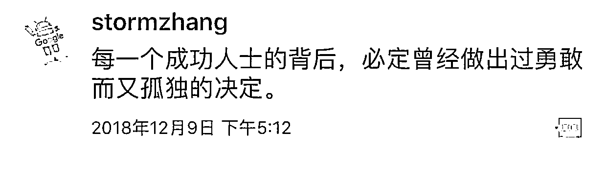 

评论区：

stormzhang : 开头被点名，以为这期是我，一想不对啊，我特么没跟亦仁聊过啊。。。

正明Jimmy : 大佬怎么加微信  正好有开亚马逊难题需把脉。

亦仁 : 图中二维码是Moss的微信

正明Jimmy : [OK][嘿哈]

Steven : 这一期评论有点少

 

 

# **# ****(**精华帖**)(81**赞**)**亚马逊蓝海之极致细分，根据

# 用户分层找到极致细分

作者： Edwin

日期：2021-05-25

产品**--**流量**--**转化

挖掘需求--验证需求--做价值超越--满足需求+错开竞争--完成转化--建立壁垒--形成闭环如果我前面写的文章你有看过的话，你应该会知道我做亚马逊蓝海的核心思维就是根据不同的对象或场景，进行客户分层，在细分领域里面，把产品包装成客户需求匹配度最高的产品，并打磨到在细分领域里面拥有绝对的竞争力，做到价值超越。

以下内容是第一篇文章《**Edwin | **亚马逊蓝海错位竞争玩法》的延伸，如果你之前还没有看过的话，我建议可以先花点时间先看看：

https://articles.zsxq.com/id_a6l7aasqvmbh.html由于之前用来举例子的案例，可能讲得还不够细致，所以有部分人看过后反馈说对他们来说的确有新的启发，但是还会有很多地方无法理解，所以这篇文章，我希望在第一篇文章的基础上进行延伸，把一些内容再写的更加细致一点，让更多行业经验不太丰富的小白看完也能理解并可以直接用来实践，能赚到钱。

希望通过文字，我们会有更好的交流。

Go...

 

 

产品极致细分

下面给出一些实际的案例：

PS：只提供案例，具体的产品需要自己再去深入调研，我希望大家掌握这套方法的底层逻辑，学会举一反三。

假如你是一名卖LED灯泡的卖家，你售卖的灯泡型号是E26，你们售卖的这个型号的LED灯泡功能非常强大，可以满足客户在不同场景下都可通用的，比如说适用于客厅，卧室，厨房，走廊，庭院，车库，冰箱。

很多人常规的产品打造思路就是觉得这个产品真厉害啊，可以适用这么多场景，卖点肯定要把所有适用场景全部罗列出来，肯定大卖。其实也并不是说这样的思维完全不对，只是说这种常规打法更适合资金玩家，有一定资金的，并且资源很充足的，他们也能推广起来卖得很好，但是利润确不会特别高。

我的做法就是把每一个场景细分（客厅，卧室，厨房，走廊，庭院，车库，冰箱），进行客户分层运营，同样这款LED灯泡产品，我会把每一个场景对应的功能产品都做成一个链接，把这个产品包装成适用于这个场景下相比竞品而言最专业的的专属产品，其实对于卖家而言，库存都是同一个库存产品，只是你需要告诉客户，我售卖的是对应场景需求下的专属产品，这样就会有产品溢价空间，因为你相比同类竞品而言，你是需求匹配度最高的产品，并且你再把之前收集到的客户需求痛点融入到里面，进行价值超越，肯定就会在这个细分场景领域有绝对的竞争力，去获取更多的市场份额。

比如我可以同样把同一个LED灯泡包装成：客厅专用LED灯泡，卧室专用LED灯泡，厨房专用LED灯泡，走廊专用LED灯泡，庭院专用LED灯泡，车库专用LED灯泡，冰箱专用LED灯泡。

 

 

以下拿《冰箱专用**LED**灯泡》这个来举个栗子：

【客户需求】：我的冰箱灯坏了，我想换一个适合我这个冰箱相同型号的LED灯泡，产品质量要高，不要经常坏，我的冰箱品牌是XXX，灯头插口型号是E26，买了要能安装且合适耐用才行。

【满足需求】：我们这款是LED灯泡是你这款冰箱专用LED灯泡，型号是E26，专用的，有防水功能，使用寿命长，专用型LED灯泡，适用于冰箱这种潮湿环境。

对于客户来说，他的冰箱灯坏了，其实他的需求已经很明确了，就是想要买一个质量高的冰箱灯替换，也不需要太多的其他功能，对他来说没用。如果他通过搜索展现了大量的产品，大部分都是万金油一般，什么场景适用，那么他如果看到我这个专属产品肯定会眼前一亮，因为这个就是满足他需求的产品，他只需要挑选应用在冰箱这个场景下最好的产品即可，恰好我的产品优势就体现出来了，我的是专用的冰箱灯这个场景下的产品，无论从图片，文案，视频，A+，评论等各方面，我的产品都是围绕冰箱这个场景来展开的，凸显卖点，所以我的产品在这个场景下就很容易做到价值超越了，相比竞品而言，我的产品优势就很大了，这样子就实现了错位竞争了。

不能把产品单独剥离开来，其实这是一个体系，先确定你的客户是哪些人群，适用于哪些场景，满足哪些需求，经过调研分析，然后再去打造产品，产品包装，说明书，图片，文案，视频，A+，评论，QA等等，都要围绕这个场景来进行包装，打造成一个专属的产品，服务于细分的人群，提升产品核心竞争力。

做推广的时候，就更加容易的，可以直接专门挑选适用于这个场景产品的长尾词就进行推广，可能一个长尾词的流量并不大，但是如果你挖掘了非常多的长尾词，每个流量你都做到头部的话，那加起来的流量也是非常大的，并且这种模式的好处是转化率真的非常高。

 

 

关键词：**refrigerator light bulb **（冰箱灯泡）

第三方插件调研关键词数据：（任何软件的数据仅供参考，要结合人为判断）

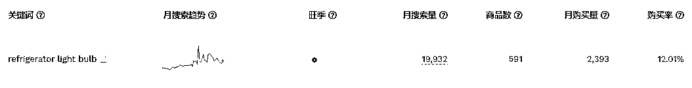

通过看月搜索量和月购买量，我们可以大概知道这款冰箱灯在亚马逊上大概的需求量是怎样的，通过商品数和搜索量的比值，我们就可以算出这款产品目前的竞争度大不大，另外还需要去查看这个产品相关关键词的广告数据等一些其他数据，结合成本就能大概估算出利润情况。

关键词亚马逊前台页面：https://www.amazon.com/s?k=refrigerator+light+bulb&ref=nb_sb_noss_2亚马逊前台搜refrigerator light bulb展示出的关键词自然排位前四个产品：

 

 

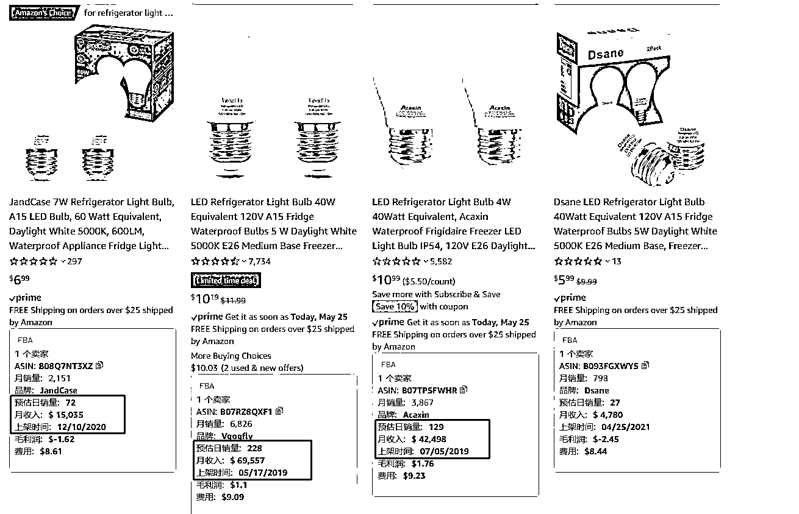

中间的两个卖家是在2019年中旬通过这种细分的思维切入市场的，通过2年左右的累计，也有了一些不错的评论基础，所以价格比较高一点，获取的订单量也大一点，然后左右两边的这两个新卖家分别是在2020年12月份和2021年4月份通过相对低价切入市场，也能获取一定的订单量。

我们可以清晰的看到前面已经有卖家用这种精细化产品细分的思维去做产品了，并且效果是非常好的，  首页的其中一个产品刚好是我认识的一个人操盘的，具体是哪个产品就不方便透露，大家也不要过深去挖掘，多把心思集中在学习底层逻辑和方法上。我们可以看到这款小小的的灯泡，一个月可以卖这么多，而且成本其实比我们想象中要低，大家有兴趣也可以去中山古镇那边灯具市场看看，各种灯具产品眼花缭乱。具体的利润其实大家可以自己去核算，看看如果这款产品是你的话，大概一个月可以赚多少钱，这个我就不细说了，都是比较基础的东西，我更想说一些操盘思路方面的内容。

 

 

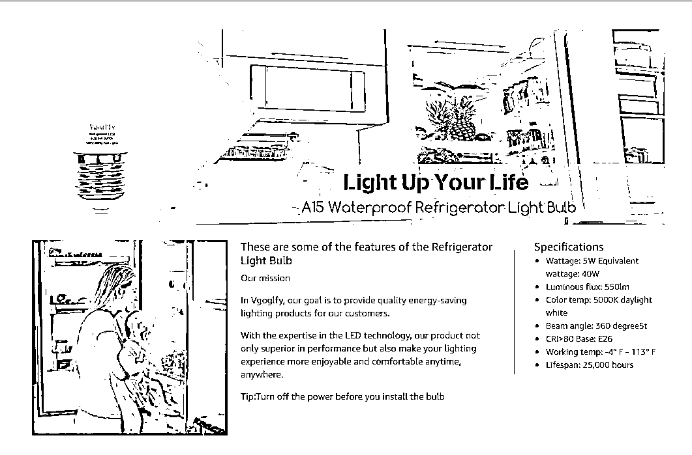

点进去其中的一个产品链接，我们可以看到listing页面的文案和图片等等全部围绕着冰箱的这个场景来展开描述的，所以这个产品在那个时期竞争不大的时候能在细分领域里面做到拥有绝对核心的竞争力，所以能快速获取大量订单并且累计了很多不错的评论基础，这就是建立壁垒。

当然，现在我把这个案例搬出来，不是说让大家又继续按照之前一样的思维去做冰箱灯，因为这肯定是比较难的，除非你有供应链获取更低价格，或者有其他优势，否则对于小卖家来说，肯定是很困难的。

那么，是不是完全没有办法在**2021**年中旬这个时期切入这个市场呢？

答案是可以切入的，接下来就是我想要重点强调的亚马逊蓝海之极致细分的核心思维，如果你真的能够做到我以下所要求的一些东西的话，肯定还是有很多的机会切入进来的，并且也能活得不错。

 

 

OK，往下走：

我在几个卖得不错的冰箱灯泡的评论和QA里面，发现了一些有重要价值的信息，大家可以认真的看看下面的几个QA页面的截图：

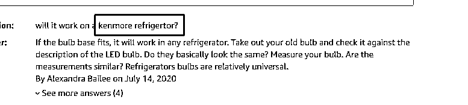  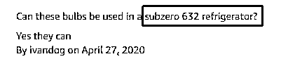  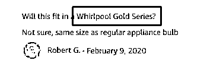

 

 

我们是不是可以发现，很多买家会咨询更详细的内容，比如这个冰箱灯泡是否适用于自己的XXX冰箱，具体到一些冰箱的品牌和型号了，那么我们是否可以换位思考，站在客户的角度来思考。

用以下场景来举例：Edwin昨晚发现自己的西门子冰箱的灯泡坏了，想去亚马逊平台购买一个可更换的适用于西门子冰箱的灯泡，因为要在网上购买灯泡，如果到货后发现买的不对了，退货也麻烦。那我最好的情况是不是直接给我一个确定答复，你的产品是适用于我的西门子冰箱的，这样子购买就最贴切我需要的产品。所以当你把所有产品极致细分的时候，你的核心竞争力就出来了，就很容易做到价值超越了。

所以这就是我一直在说的，做产品的时候我们要先去调研客户的实际需求，客户的需求就是我上面的那个场景，至于亚马逊其实只是其中一个销售平台而已，我们做产品一定要归根于客户需求和产品本身，不要一直盯着某一个平台或者排行榜，永远躲在一个小角落思考问题。

那么既然知道了我们需要极致细分去做了，那如果操作呢，其实也很简单，就是把所有的冰箱品牌和型号都调研收集起来，做成一个表格统计好，然后再融合到

**listing**页面的文案，图片，**A+,QA**这些里面，让卖家点进你的**listing**页面后通过你收集到的数据，就能知道他自己家里的冰箱是否合适目前我们现在销售的冰箱灯，按照我之前的简单调研，其实大部分冰箱灯型号都是差不多的，只要接口那个螺纹孔对得上就合适，所以只是你把客户的需要再细分而已，产品还可以是同一个产品来的，不用担心会有很多个变体，最多就**2~4**个子变体。

那如何去收集这么多冰箱的品牌和型号呢，其实这个就会绊倒90%的人了，我说你可以去搜索  ，通过谷歌或者其他搜索引擎啊，或者直接点进亚马逊平台家电冰箱分类那个页面进行细致统计也行，但是肯定还是有很多人被一些小困难绊倒就会放弃的（比如还有人会问怎么科学上网之类的问题，问怎么我登录不了你说的那些网站等等），所以我想说真正能赚到钱的都是那些有耐心的，能做到极致的人，学会用搜索引擎代替你的大脑很重要。

 

 

其实你大概去谷歌搜一下，也能找到一些东西，只是需要花一些时间整理而已。

例如以下网站：https://www.ranker.com/list/refrigerator-brands/werner-brandes

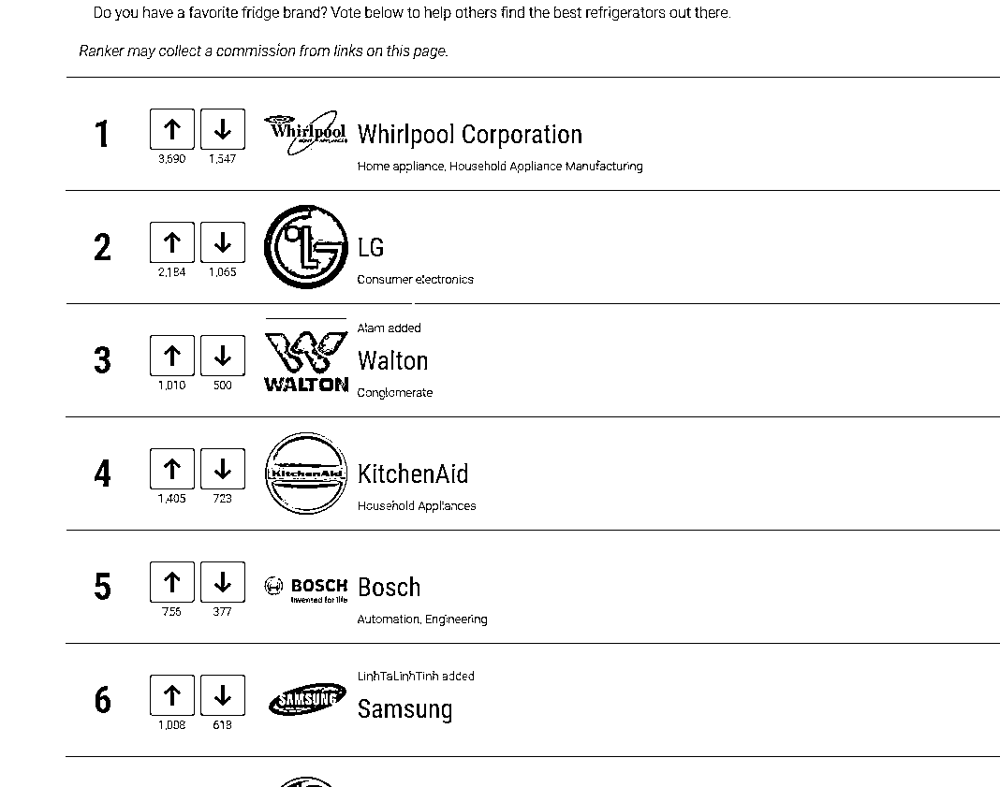

我们就可以找到有人收集到的冰箱品牌大全，几百个品牌型号，还有排名热度呢，这就是用心。

还有其他的方法收集数据，我就不一一列举了，正常会思考的人都会举一反三的。

 

 

其实你只要把这些内容整理好，做好细分，满足你潜在客户的需求，最终的效果肯定会出乎你的意料的，你可以看亚马逊上面也有很多做得非常棒的产品其实已经在再用这种思路。

其实说到底，就是：你是否能够满足客户更深层次的需求。

简单的事情重复做用心做，就是成功。

就像那句话：以大多数人努力的程度，根本没有达到拼智商的程度。

在我们追求极致的过程中，哪怕成不了大师，离成功也不远了。

知乎上曾有个提问：怎样才能将工作做到极致，成为该领域的高手？

一个回答是这样的：我们每个人都有成为高手的机会，那就是把你现在手里的工作坚持做到最好，然后坚持10年。

任何一项伟大的事业，都是从简单的事情开始，简单的事情重复做用心做，就是成功。

其实，并没有各个领域都精通的高手，想要成为专家，很多时候优秀和平庸的差距，就在于你有没有专注于目标并把它坚持下去。

把一件事情做到极致，你就赢了。

以上。

 

 

评论区：

良辰美 : 知易行难，我已经抄下来了，接下来是背诵执行。

良辰美 :

超级奶爸Rock : 你怎么这么秀呢！加油

Summer Xia : 厉害，厉害。执行第一位

老袁 : 读过seven的文章  良辰美的文章  你的文章  思路是真的好  受教了  谢谢[抱拳][抱拳][抱拳]

嘉应岛主 : 干货好文，已收藏

老袁 : [强][强][强]

粉粉大魔王 : 厉害

# 【从** 0 **到** 1**】**14**篇

# **# ****(**精华帖**)(283**赞**)**生财有术分享：**2020**亚马逊

# 如何从零到一

作者：  亦仁

日期：2020-06-22

每周一的  ，邀请一位圈友分享TA的生财之术。

今天的  ，我邀请的分享者是  ，他从事跨境7年，前跨境龙头大厂亚马逊部门销售top1，目前创业。

他曾通过选品，成功打造单品月利润10w+，关于选品，可以移步他之前在生财有术做过的分享：

 

 

亚马逊低阶选品：

亚马逊中阶选品：

亚马逊高阶选品：

“做亚马逊，要有  合作紧密的产品设计+较强的供应链把控+相对有战斗力的团队+专利闭环（非必须）”

他今天分享的主题是：“2020，新手如何在亚马逊从 0 到1 ”

这是一篇25页的万字长文，掏家底级别的分享，从注册账号- 选品- 核心打法 - 供应链 -- 物流发货，每个环节都拆解的十分详细。

相信对于想入门亚马逊应该足够，不多说了，你们直接看吧。

https://t.zsxq.com/iamaiMr https://t.zsxq.com/IiQrvVb https://t.zsxq.com/j2fuzRB评论区：

爱新觉华 : 小白呢，估计看了还是不会太懂，但是如果是小卖有一定基础的人，细细琢磨，真的会受益匪浅

悟空甜心 : 中阶选品链接是视频号扫盲贴

张静伟@生财有术 : seven很棒，特别愿意帮助别人，很感谢他

张静伟@生财有术 : 下面文件第十篇，谢谢

张静伟@生财有术 : 受益匪浅

悟空甜心 : 嗯嗯，干货很多

Zev : seven一直都在用最真挚的方式影响着身边的人。[强]

路明 : 感谢seven！

# **# ****(**精华帖**)(273**赞**)**一文搞定亚马逊开店卖货

# （**2020**年最新店铺注册**-**品牌备案**-**卖货发货**-**养

# 号）

作者： Lissa Tam

日期：2020-10-05

 

 

轻享  亚马逊  《一文搞定亚马逊开店卖货（2020年最新店铺注册/品牌备案/卖货发货/养号）》

大家好，我是玩亚马逊的Lissa，我又来了。

卖货嘛，三件事儿，货/渠道/运营。折腾了这么久，有个比较大的感受，前两个属战略层，后一个偏战术。也就是说，把前两个搞定了，运营就是个推动的事儿，赚钱自然而然的嘛，只要想，总有渠道能卖出去。

平台属于渠道的一种，如果产品不错，国内外可同步运作。之前觉得，对我而言，可以国外作为突破口，品牌影响力做起来后，以品牌回海的形式，强势回归。

现在回头看，我在想什么鬼东西，活都没活下去还整这么多七七八八呢（哭）。这话怎么说，创意还真不一定每个人都有，但是创意能实现的程度，非常看背景实力。各位大老板，也许可以考虑考虑品牌回海这种形式，尤其香薰品类。

回到正题，今儿和大家分享亚马逊平台开店卖货启动全流程。

主要涉及到什么呢：

**1. ** 亚马逊开店入驻；

**2. ** 品牌备案；

**3. ** 产品上架；

**4. ** 物流发货；

**5. ** Lissa的开店流程及养号方案。

这应当是市面上最新最全的亚马逊开店介绍了。文中涉及到的内容，不仅仅适用于想尝试亚马逊平台的老板们，也适用于当下正在运营中的卖家朋友，打算创业、或是准备多店铺运营早日品牌备案的。时间有限不想详细了解的，可以直接拉到最后一节看我案例抄作业 ;)

本文全部为本人踩坑测试亲自实操后的成果，结合2020年最新的亚马逊平台规则。仅代表个人观点，给大家作为参考。

enjoy～

【一、亚马逊开店入驻】

（一）开店要求

亚马逊的账户有四类，Amazon Seller Central(SC)、Amazon Vendor Central(VC)、Amazon Vendor Express(VE) 和 Amazon Business Seller(AB)。amazon seller central 任何人都可以注册，amazon business seller 可以在开通 SC 的同时，一并开通。VE 是美国 

 

本土企业才能开，VC 则是亚马逊邀请开通。一般我们说亚马逊开店，开的就是 seller central 账户。（后文内容，全部针对于 SC 账户）

亚马逊 SC 账户可以以个人名义和公司名义两种形式进行注册，且每个主体只能注册一个店铺。区别在于，中国卖家以个人名义注册的失败率高。

两种形式都可以注册成为个人销售计划卖家和专业销售计划卖家。

那么个人销售计划和专业销售计划又有什么区别呢？

👉个人销售计划不需要缴纳月租，但上传的每个产品都需要缴纳上传费用（💲0.99）；

没有购物车，用户付款的时候会多好几个步骤；可卖的品类有限制；没有数据报表；不能做促销。

👉专业销售计划每个月缴纳月租（💲39.99）即可，有购物车，可以做促销，用户从购买到付款一气呵成，也就是该有的都有。

个人销售计划和专业销售计划可以在亚马逊卖家后台进行转换，跟Shopify后台切换销售计划一样。目前市面上大部分都是公司型专业销售计划卖家。

网传专业计划相较个人计划，会有一定流量倾斜，我没有测试过，不过从逻辑上讲，流量分配应当是一样的，只是用户使用习惯上，个人计划账户会降低一定转化率。

一般而言，我们会直接选择“公司注册的专业卖家账户”，方便且后期可操作空间大。

官方视频--专业与个人销售计划区别：

亚马逊账号类型的区别：

（二）开店方法

亚马逊店铺注册有2种办法。

**1. ** 官网注册开店（amazon 全球开店： )

**2. ** 注册链接注册（联系招商经理给链接）

开店共有两次店铺审核。一审所有账户在注册过程中都会遇到，很容易过，审核时间1-5天。二审的出现在店铺经营过程中，如果是合规运营，符合亚马逊要求，那么二审是早过早好，不影响卖货；但倘若是多店铺操作、公司无地址对无对公账户等情况，遇到二审大概率店铺凉凉。

亚马逊一审主要审核注册销售权限，检查法人身份证和执照等信息；而亚马逊二次审核是指在店铺经营过程中，针对一些关联存疑、资料存疑、合规性存疑的账号，进行进一步审核验证，审核经营时间、发票、库存等。前文有提到，每个公司或个人主体只能注册一个亚马逊店铺，因为网络IP相似或者重复使用导致的店铺关联等，都会触发二次审核。

 

 

网传官网注册必二审，招商经理给的链接注册，则有一半概率不会遇到二审。玄学问题，不置可否。不过呢，基于多个官方联系人多条出路原则，注册店铺尽可能选择找招商经理下链接。Chinese 擅长啥子，可不就是人际关系人脉链接嘛！嗯，射程范围之内，搞定一个人等于拓展一片全新地图。

好了，跟人有关的东西，必定涉及权利大小问题。那么招商经理有哪几种呢？

我目前接触到的有3种：

A. 普通招商经理；

B. B2B 招商经理；

C. 品牌加速器等参与官方活动的招商经理。

上述三种经理自带不同资源，普通招商经理一般只开通 2C 功能，也就是 SC账户，B2B 招商经理在后台可以把 SC 和 B2B 账户一起开通。其他资源大致相同，跟经理所处公司岗位会有一定关系，不过帮不帮忙就和性格有关了。

那品牌加速器等参加官方活动的招商经理是个什么存在呢？

官方活动有 IP 加速器，品牌加速器，以及亚马逊卖家扶持计划等。官方活动的账户一般会有一定流量扶持，当然，对应的会有注册要求，比方说注册资质或者付费。

品牌加速器我认识一个招商经理，他和我说过，他们下的链接可以免二审，这个就有点厉害了！其他活动我没接触过，大家可以自行了解。

注册完之后，每个店铺会有一个对应的客户经理，客户经理的联系方式会以邮件的形式发送到注册邮箱，一般是QQ群的形式。客户经理会在群里进行答疑，发布最新亚马逊资讯。如果店铺遇到什么问题，可以联系客户经理进行解决。开店后一定要想办法加上。

同理，客户经理的权利与其所处职位息息相关，再同理，搞定一个人等于拓展一片全新地图（你懂得）

不过话说回来，我至今没加到我店铺的客户经理，群都没加进（卑微），但是通过朋友推荐，进了别人的客户经理QQ群（迷离），目前仍旧在努力挣扎加群ing，誓要找到属于我的客户经理，嗯！

每年的账户注册名额有限，且越来越严格。现在注册的时候会有明信片认证、视频答题认证等，确认账户所有者是注册者本人，避免多账户运营。

2021年的招商注册在今年10月份全面开启，招商经理开始下链接，大家感兴趣的话可以搞一搞。没有招商经理联系方式的，可以联系我，我给大家推几个。

（三）注册准备资料

公司 SC 账户注册的时候需要的官方资料有：

 

 

**1. ** 公司营业执照；

**2. ** 法人的身份证正反面照片；

**3. ** 双币信用卡。

来，让我们划重点：

**1. ** 公司营业执照注册超过60天（欧洲站点要求只需45天），且身份证一定要法人的；

**2. ** 双币信用卡不一定要法人的。

也就是说，同一个人可以开很多张卡，同一个卡可以再开子卡，只要付款卡号不同即可。官方文件中没有要求信用卡必须和法人身份一致，同一个信用卡号开不同账户也许可以，但是本着账号不被关联的原则，还是别尝试了，不敢搞事情。关于信用卡注册银行，随便找家大银行就行，不需要纠结。

关于公司营业执照，可以借用朋友的，也可以找财税公司开一个挂靠地址的公司，注册报税三章一套费用在1800左右，后续每年付报税费用，开票1800元/年，不开票1000元/年左右。

除了亚马逊需要的官方注册资料，我们还需要准备一切其他资料：

**1. ** 用于注册的干净网络及电脑；

**2. ** 未绑定过亚马逊账户的手机卡；

**3. ** 从未注册过亚马逊账户的邮箱；

**4. ** 收款账户。

注册网络的重要性前文中有提及，再次申明，一家公司/一个人只能注册一个账号。

为了账号安全，一定要注意注册环境。当亚马逊觉得你是多账号注册，比如你注册的 IP 之前有人注册过的时候，会大概率判定你的账号关联，账号就死掉了。就是这么无情。包括后面店铺开下来了，运作的时候，也要留意这个点，一定要独立 IP 运作。

所以这个时候可以怎么做呢？

**1. ** 网络：手机开热点，或者买个无线网卡（两三百块钱）；

**2. ** 电脑：用从未注册、登录过亚马逊后台的电脑（据说刷机后的电脑也可以，我胆子小，没尝试过。尝试过的朋友可以评论区帮忙科普一下）

也就是说，用干净的网络+干净的电脑进行注册，来保证成功率。

关于电脑，如果自己的不行了，可以远程借用朋友的电脑，也可以搞一些二手电脑 

 

渠道，用来注册。这块圈友@良辰美  好像有资源。

关于IP，有一些卖家用超级浏览器的 IP 进行注册，我不推荐。因为谁也没办法保证这些 IP 干净，而且大部分这种 IP 都是重新分配的，污染程度比较高，遇到二审注册失败的概率较高。

再说收款账户。上文里说到的双币信用卡用于给亚马逊付钱，主要用于付月租。这里的收款账户，则是店铺有营收后，亚马逊打款给我们的渠道。

收款账户目前市面主流有：连连支付、Payoneer、Pingpong。最近亚马逊也出了官方收款渠道。

我使用过前两款，注册使用简单方便，需要考量的主要是安全性及费率。在我看来，前期选哪个都差不多，安全性有保证且费率不高。

给个小tips：

**1. ** 在注册第三方收款平台时，需要1-3天审核时间。如果想加速，直接联系平台客户经理，建立联系（一般一两个小时就搞定了）

**2. ** 如果后期想要在亚马逊后台更换收款方式，请一定要先在后台联系客服帮助，和客服报备一下，避免亚马逊机扫判定为账户异常，触发二审。

亚马逊收款方式有哪些：

亚马逊全球收款介绍：

好了，需要的资料准备好了，开店渠道有了。如果是自行通过官方链接注册，可以直接上；如果是找招商经理下链接，则按照招商经理的要求，填写表格，等待招商经理下链接（一般7天），拿到链接后在准备好的网络环境下进行注册即可。

整个注册过程在1个小时左右，非常非常非常的简单。别听别人说多难多难，怎么怎么容易死账号，就给卡住了，第一步都迈不出去。一般注册完后，店铺立即就可使用。

当然，也可以直接购买市面上现成的店铺。过一审的店铺约4k，过二审且有销售记录的店铺约20k元。（所以亚马逊衍生服务有多赚钱，你懂了……）

二、亚马逊品牌备案

亚马逊品牌备案是个啥？为什么我要在开店后提到这个？

简而言之，品牌备案可保护卖家权益，防止辛苦做的产品链接被人渔翁得利（赶跟卖），获得更多操作空间及流量曝光（品牌广告、VINE、品牌店铺），获得更多平台数据（品牌分析）。

亚马逊品牌备案官网：

亚马逊品牌备案及打跟卖全步骤：

 

 

品牌这个存在，不影响卖家卖货，没有也可以。但作为未来品牌出海趋势，提前布局很有必要，并且品牌注册和店铺注册可以同时进行，节省时间，所以我还是要在这里和大家唠叨一下。

品牌=商标+市场影响力；

亚马逊品牌备案=在亚马逊后台将已注册的商标进行登记授权；

一个站点成功进行品牌备案后，可以同步备案其他站点，也就是美国站商标可用于欧洲站备案。

好的，说人话就是需要先注册商标。

我主要做北美站，那么以美国商标进行讲解。

美国商标官网：

注册商标的流程是：确定好商标名及类目——准备资料——律所申请——下受理回执（TM标）——成功注册（R标）

第一步到第三步，也就是申请注册可以请税务公司帮忙，费用在3000-3500元左右。如果是深圳公司，或者是深户，注册商标有1000元补贴。

需要准备的资料是：

**1. ** 有商标的2到3个产品实拍图；

**2. ** 一条显示带商标产品图片的在售链接；

**3. ** 产品后台出单截图（2个）

显示商标的产品图片，可以找个镭雕店，10分钟内搞定，雕一个费用在10块钱左右（工厂镭雕5分钱，你品……）。百度地图或者淘宝搜一搜，满足你所有任性的小要求！

至于链接，上一个就可以，出单截图，可以P，也可以找服务商下单，然后再取消（还是P吧没关系）。

申请后下到获得TM标，时间约1-3天；

从TM标到R标，时间约为6-10个月。

获得R标的周期比较长，所以如果未来你有品牌出海的打算，现在可以准备注册。即便是未来用不上，也可以卖掉。目前商标市场价在8K-2W不等，看名字和品类。

说个题外话，@顾小北  小北老师（我的亚马逊引路人）之前在龙珠群分享过网站套利，那么同理，是不是可以商标套利、专利套利（歪果仁最爱干的事儿）。即便是为了自我保护，以及长远运营，前期该做的准备是不是需要做好？（适用于精品卖家，铺货玩家如果感兴趣，可以借此打一打品牌曝光）

 

 

有R标后，可以直接在亚马逊后台进行备案，准备几张带有商标的产品实拍图即可。在整个备案流程结束后，亚马逊会发一个验证码给到商标注册邮箱，找代理注册的税务公司要到后，3天左右，即可完成备案，享有品牌福利。

亚马逊品牌备案方法：

但是！我要是这么简单和你说说带过，那就不是我，这篇文章就没啥价值了。

重点来了，我可不可以用TM标进行品牌备案呢？那么整个时间周期，直接可以控制在一周内搞定了。

当然可以！

目前有三个方案实现。

（一）IP加速器（）

亚马逊和一些商标注册商进行了合作，在这些商标注册商处注册，只要出了 TM 标，就可以在亚马逊后台进行备案。这个费用是国内注册的2倍左右，约7000-8000左右。除了贵，没什么缺点，没有附加要求。

我体验过整个服务，因为主要用邮箱联系，时效比较慢。拖延症患者本人和对方负责人聊了两周，啥也没搞成……（怪我）

（二）品牌加速器

品牌加速器是亚马逊19年推出的活动。只要你有TM标，就可以找招商经理帮忙在后台进行备案。如果没有亚马逊店铺，还能下链接注册店铺（就是不会触发二审的那种哦）。

这个项目的优势在于，有流量倾斜和专属品牌曝光，需要缴费的亚马逊官方活动比如秒杀等，一律免费（现在是部分免费）。

要求是什么呢：第一，收取额外的7%的店铺佣金；第二，亚马逊有权收购品牌。

看起来好像很好的样子，但是这个额外佣金让我停下了步伐。怎么说呢，我当时的想法是，如果我有好多个品牌和店铺，我会拿一个出来试试。现在我觉得，如果你顺带着一玩，没多少时间打理店铺，的确是可以一试的，回报相对大于付出（也不一定），看个人权衡。

目前美国及欧洲站除了母婴彩妆和个护之外的品类，都可以参与品牌加速计划，日本只招募时尚类。

我之前嚯嚯过招商经理，让他偷摸儿给我后台备案一下，根据逻辑来说，有这个权利的确是可以做到的，吃不了亏上不了当，是不是，嚯嚯了两天，失败了。所以啊……回到最最前面常说的那句话，什么来着？你体会体会……

附上当时招商经理发给我的品牌加速器项目基本介绍和优势介绍——

 

 

**1. ** 品牌加速器项目的优势汇总：

a) 卖家仍然把控店铺运营，库存管理和定价权，但是却可获得亚马逊的专属营销支持进行品牌和产品推广，流量倾斜和品牌曝光度；

b) 优质ASINs获得top rated from our brand等亚马逊自有品牌特定位置的展示和曝光；

c) 免费获得VINE绿标测评，每个Parent Asin可获取30个免费sample，测试新产品并快速获得顾客反馈。（此福利如果后期有调整会提前通知您）

d) 免费的deal资源（数量待定）

e) 专属项目经理提供上线指导和产品支持；

f) 品牌保护；

g) A+/EBC页面 & Brand store功能

h) 其它更多的平台后台算法优化提供的品牌推广

Ø 加入美国加速器项目的必备条件：

**1. ** 加速器项目优先招募现有账号的卖

**2. ** 卖家项目佣金7%（除平台佣金费，FBA仓储费/配送费，另外收取）【此费用暂未收取，未来的收取比例若有调整也会官方通知卖家】

**3. ** 企业（非个人）拥有自主品牌，且该品牌已经在美国UPSTO登记并提供在有效期内的Trademark ID（俗称TM标）或者R标。

**4. ** 已完成BR2.0 品牌备案（TM标也可通过联系我进行备案）

**5. ** 亚马逊保留收购品牌的权利（此条件为必须接受条款）；

**6. ** 参加项目的卖家必须提供亚马逊认可的而且在有效期内的社会责任报告（我们认可的4种社会责任报告【BSCI, Sedex, Better Work, RBA】）。（此步骤只需先了解确认，后续操作按我们指示即可）

**7. ** 卖家的品牌店铺必须满足美国站点的法律法规要求，且必须匹配我们的招募商品类目（Hardline,Softline）。

**8. ** 参加项目的品牌店铺为美国站的独家销售渠道，不允许卖家在平台其他店铺或其他电商平台或其他线下分销渠道继续进行该品牌的产品销售。

**9. ** 必须100%使用FBA。

**10. ** 品牌店铺具有增长潜力的GMS表现，差异化的产品设计和优质的顾客评分。

**11. ** 优质强势的供应链资源和管理，可快速打造差异化的产品并推出市场 

 

**12. ** 其它更多的要求和条件。

（三）TM标白名单（）

这个是2020年今年新出的，大部分人不知道的。我运气好，靠这个渠道完成了品牌备案。

目前仅对美国站和印度站开放，只要有TM标，就可以通过上面这个链接进行申请。目前通过率比较高，申请完后，随时留意邮箱信息，一般7天左右可以收到官方邮件，说申请成功。如果没收到的话，每天申请一遍，坚持就是胜利，嗯！（我就是这么干的）  我研究了一下注册链接，仿佛不是根据申请账户定制的，所以……嗯！我回去翻一翻。

三、产品上架

好了，平台准备好了，咱要开始卖货了。

在亚马逊卖东西，抛开跟卖这种骚玩法，我们需要自己上传产品，制作产品链接。

亚马逊上传产品图文教程：

官方—亚马逊上传产品视频教程：

在后台选择出售全新产品后，有一些必填信息。其中标题卖点详情描述图片等都可以随便写，有两个是不能随心所欲填写的：

**1. ** 商品编码；

**2. ** 品牌

（一）商品编码

商品编码换言之就是商品的唯一识别标志。

有两种方法解决：第一，UPC豁免；第二，购买商品编码。

UPC 豁免很简单，在后台搜索UPC豁免，进行申请，上传印有自家商标的产品实拍图的照片即可。如果没商标呢？根据招商经理消息，可以做Generic豁免，获得所需批准后，卖家可以继续在“Generic”品牌名称下发布商品。

申请成功后，商品编码直接填写ASIN码，即亚马逊分配的编号。

购买商品编码，我们一般选择UPC码。方便，全球通用（其实我也没细研究，咳）  购买渠道主要有两个：a. 淘宝创蓝，6毛钱一个；b. barcodestalk.com，1美金左右一个，买的多则单价低。前者便宜，我自己一般淘宝买。后者相对安全，像傲基等大卖，会在这里买。

 

 

（二）品牌

瞧，倘若注册了商标，出了TM标，可以联系客服，填写商标即可。

如果没有的话，测试过可以填写：n-a；n / a；N / A；N-A；Generic。

根据亚马逊官方信息，除了Generic, 其他都不可以填了，可能被人注册了商标进行了品牌备案，使用可能侵权。事实上，我后面也测试过，Generic直接填也不行，需要先联系客服做Generic豁免。

填好后，链接制作完成，15分钟左右，你的产品就会出现在亚马逊网站上，和芸芸众产品，一起被顾客挑选。

四、物流发货

根据发货的不同，亚马逊分为两种产品出售模式。

第一，FBM卖家自发货。即买家下单后，卖家亲自把产品寄到买家地址。也就是我们从国内发到国外。

第二，FBA亚马逊发货。即买家下单后，亚马逊帮你把产品寄给买家，前提是，你需要先把货发到亚马逊仓库。

简单的说就是，FBM你需要找物流商帮你发货，你准备的货在国内；FBA你找的物流商就是亚马逊，你准备的货放在国外。

目前自发货可用的物流商很多：邮政；云途；燕文；递四方。这四家我都聊过，费用都差不多，随便选一个就行，时效也不错，比较靠谱。100g的产品，费用在33块钱左右，时效大约10-15天。

和上文写到的注册连连方法一样，直接搜索，进入官网，注册申请，然后直接给负责人打电话，让对方处理。

如果是FBA呢，需要先在后台把链接转为亚马逊配送。

亚马逊FBA物流发货图文教程：

官方—亚马逊FBA物流发货教程：

这个时候把产品发往亚马逊仓库，涉及到两个点：

第一，亚马逊分配的亚马逊仓库；

第二，发到亚马逊仓库的物流，即头程。

（一）亚马逊仓库

新店铺都会被分配到 FTW1（仓库代码）,这个是美国最大的仓库，人多货多入仓慢（玄学）。

一般亚马逊接收时间3-5天，根据仓库及货物情况变动。疫情期间14-30天，看个人运气 

 

及仓库情况。

新品可以通过改发货地址来更改配送的仓库。可以先开case问客服，目前哪些仓库爆仓了，哪些仓库运作稳定（疫情/旺季影响亚马逊接收时效）。确定好要发的仓库后，拿着仓库代码去谷歌地图上搜这个代码对应的地址，然后在这个地址附近选个地方，把这个地方的地址，填入后台发货的地址，你的产品就会因为就近原则，而分配到这个仓库。

就是这么简单。千万不要偷懒，疫情期间我经历过1个多月亚马逊仓库才接收货的情况。

一个月竞争对手早就上去了，时间就是钱呐……（泪目）

如果货到了亚马逊仓库，但是亚马逊没有接收的话，可以拿着采购发票、合同、以及POD，即亚马逊签收证明，开case联系客服、发邮件联系对应负责人，请求尽快接收入库。

（二）头程

从国内发到亚马逊仓库，有几个派送方法：

**1. ** 整柜发；

**2. ** 散货发：快递、空运、铁路、海运（铁路适用于欧洲，时效根据排名递减）  货很多的时候，可以整柜发，物流费用便宜。一般我们货不多，联系物流商发散货就可以。

散货渠道再细分，可分为：快递（FedEx、UPS)、空运（海航、普通航空）、铁路、海运（上海美森、以星快船、海派盐田的船）

时效根据排名递减，费用随排名降低。

如果是寄到美国：快递一般3-5天，空运一般8-12天，海运一般是18-25天。

目前费用，快递在50/kg，空运在40/kg, 海运在10/kg。快递和空运的费用和时效这段时间浮动比较大。选择靠谱的货代公司非常的重要，至少要服务好响应快，不至于遇到问题后面找不到人。

货代公司深圳这边很多，选择几家老牌稳定的，多比比价，感受一下对方的服务、专业度。再去做选择。

确定要做FBA的话，在发布新产品时，先把产品链接的必填信息填好，然后发货亚马逊，在货去到亚马逊的路上时，集中精力优化链接，做图片、准备 QA 和 Review等推广运营上面，充分利用时间，争做时间管理大师。

 

 

到此，开店、上产品、发货，全部介绍完毕，根据上述步骤进行操作，即可实现无痛入门。

要是哪儿还没介绍清楚，评论区留言，我来优化～

最后，个人案例出没，和大家介绍一下我的开店流程及养号方式。

全文超过一万字了

剩下的内容请戳链接——

准备了一些内容上可能涉及到的操作文件，有需要可以自行下载~https://images-na.ssl-images-amazon.com/images/I/E1BOxWzWG2S.mp4?ld=NSBaidu https://www.zhihu.com/question/266330310 https://gs.amazon.cn/ https://www.zhihu.com/question/33182304 https://mp.weixin.qq.com/s/Bzd5AugLvFkyYtTiEx4Fvw https://brandservices.amazon.com/cn https://www.amz123.com/thread-277044.htm https://www.uspto.gov/ http://m.cifnews.com/article/47549 https://brandservices.amazon.com/ipaccelerator https://brandservices.amazon.com/pending-trademark-request https://www.cifnews.com/article/39580 https://images-na.ssl-images-amazon.com/images/I/E1-I7JRszoS.mp4?ld=NSBaidu https://jingyan.baidu.com/article/f3ad7d0f514cbf09c3345b06.html https://images-na.ssl-images-amazon.com/images/I/E1ieaJv-RcS.mp4?ld=NSBaidu https://articles.zsxq.com/id_tw4req7cgg4x.html评论区：

Eric : 干的噎着了[得意]

瓜神 : 棒极了！

咯 : 太赞了，必须精华。已收藏

seven : 价值巨大，Lissa非常优秀[玫瑰][玫瑰][玫瑰]

暖洋 :    

**98. ** : 已收藏[强]

张集慧 : 多账号，我见很多公司都是租虚拟机来做，远程登录也安全

Justin : 非常感谢！干货满满！

 

 

# **# ****(**精华帖**)(259**赞**)**复盘一个去年做的项目：纪

# 念币，月平均纯利润**3w+**美金

作者：  不二

日期：2021-01-28

一起赚美元

年底复盘一个去年做的项目：纪念币，月平均纯利润3w+美金。

2020年，注定载入史册，太多令人难忘和全球关注的事件，美国大选在全球疫情、澳洲大火、奥运延期、科比、马拉多纳逝世、Black Live Matters等等一系列事件中显得不是那么突出，但它确实是持续时间长、全美甚至全球关注的重点事件之一，再加上全球顶流--川建国同志，自带话题和流量，我也是从怹老人家身上着实蹭到一波流量和美金。

美国四年一次的大选含金量很高，太深远的不说，咱也摸不到，早在2016年川普上台，我还在外贸公司工作，当时看到一条新闻是国内一家工厂因为美国大选爆单，产品是美国国旗。那会儿我的想法很单纯：那下次大选我也卖星条旗...

这届大选比以往更受瞩目，在年初各种事件持续发酵，再加上美国国内阶级矛盾激化，红蓝对立以及川建国同志的个人影响力，他的支持者很是狂热，从攻占国会大厦大家也能感受一二。狂热粉丝为自家idol打call消费是非常冲动的，但是咱也没那实力联系川建国同志带货，那有什么产品可以串联起川普个人IP和美国大选呢？这个问题早在18年的时候就困扰着我。

为什么是18年？

因为当时我做了一个网站，内容围绕川普的各种新闻。做为一名谷歌SEO从业人员，天天看着川普Twitter治国，这么大的话题和流量羊毛不薅，有点说不过去，而且我一直心心念念的一个事情：下次大选我也卖星条旗...

这个网站，当时我把它放在不紧急不重要的项目当中，因为一直没找到合适的变现方式，只是挂了一些广告位，而且新闻类的内容时效很短，外包给国外写手创作网站内容也是一笔不小的开支，广告收入聊胜于无，18-19年初，这个网站一直是亏损状态，但是在自己的预算控制范围内，让我撑着没卖掉这个网站的重要原因是，EDM订阅人数一直在增加，不到1年时间，而且在没重点运营的情况下就订阅近1w人，远超我预期，足可见川建国同志的个人影响力。

 

 

多说一句，EDM全称是Email Direct Marketing，中文翻译为邮件营销，在国外是一种很常见也很重要的运营方式，58%的美国人早晨起来上网做的第一件事就是查看邮箱，而且国外多家数据机构报告显示，EDM是投入产出比（ROI）最高的三种渠道之一（PPC, SEO, EDM）它的重要性就像我们国内的微信，在国内做私域流量首选微信个人号，那么在国外就是EDM。

在这1w左右EDM订阅的支持下，自己信心爆棚，离我星条旗爆单的目标又近了一步。联系好供货商就开始卖货，新建一个Shopify独立站，各种星条旗上架后，EDM发邮件开推！但是，现实总是和你想像的不太一样，搞了两个星期，不到10个订单，刨除各种费用，卖一面星条旗的纯利润还不到5美金，重点是订单太少了，这让我很焦虑，只能安慰自己说时间尚早，还没到大选爆发阶段。又过了一个多月，订单有起色，但是各种问题也随之而来。

因为我之前运营网站一直是通过Affiliate和虚拟产品变现，对跨境电商实体产品的B2C销售经验并不多，虽然自己之前做过B2B外贸业务，但是和2C之间还是有很多不同。B2B你搞定采购主管一个人就能带来几万美金的业务，但是2C你搞定一个人也就几美金的利润，这种心理落差很难平复。而且很多细节问题也是让人头大，虽然只是卖星条旗这一个单品，但是客户咨询时就问过多种尺寸，因为尺寸不合适而跑单的用户不少。

我最开始的计划是不屯货，从AliExpress Dropshipng，但是货源店铺的主要尺寸也就是2种，其它尺寸需要现做，数量太少工厂也不配合，重点是成本高很多，最后到我这边基本就是零利润，搞不好还要亏钱。要想扩大利润只能屯货自己发，但是没有经验和数据参考，拿不准需要哪几种尺寸、各多少数量，而且助理一个人根本忙不过来，需要增加人手招人培训...各种问题搞得自己身心俱疲，也没时间精力照顾其它项目，最后只能叫停。

没有稳定供应链和专业采购人员配合，就算运营做得再好也很难突破。

星条旗计划搁浅，但是针对大选变现的想法一直没变，也考虑过其它产品：马克杯、T恤、帽衫等等，都因为冗长的供应链问题放弃。因为自己一直在做Affiliate，对于变现方式的追求是越轻量越好。考虑过合伙，聊了几个朋友，想法也没能达成一致…这时已经5月，还没任何眉目，离20年越近，心理越焦虑。

有一天在整理网站关键词的时候，trump coins这个词突然蹦进我的视线。纪念币！虽然网站很早之前就写过关于川普纪念币的文章，但当时看到是在白宫的线上纪念品商店销售，以为会有肖像权、版权之类的问题就没深入研究，但是那天在搜索trump coins + powered by shopify之后，发现很多Shopify独立站还有Amazon都在卖，而且销量还不 

 

错，整个人顿时High了。我在Aliexpress上也很快找到卖家，找了几款热门的款式上架开推，效果很不错，发了一封EDM就来了几十个订单，而且用户在售前咨询的问题很少，大多数都是看到了直接下单。利润也可以，一枚纪念币纯利在10美金以上。

纪念币很符合我所追求的轻量级变现方式，

**1. ** 产品标准化生产，客户没有太多个性化问题

**2. ** 体积小，运费低

**3. ** 基本零售后，退货比例低，除了极少数客户对材质有比较高的要求才退货**4. ** 成本低，利润高，Dropshiping的平均成本一枚在5美金左右，零售可以卖到20多美金

**5. ** 单价低，用户买起来没压力，不用做购买决策

19年6月-8月，一直Dropshiping，每个月300单左右，助理一个人还能应付得来。8月以后，明显感觉到大选的话题热度逐渐升温，我原计划清理下手上其它项目，联系工厂生产下单，屯货自己发，成本可以控制在2美金以内，然后再招2个助理专心搞纪念币，但是突然PayPal冻结了我的收款账号，很是尴尬，打乱了所有计划。

独立站收款确实是一个很麻烦的问题，不论PayPal还是Stripe对我们中国商户都不是很友好。搞定了运营和供应链，如果最后倒在收款上，那就太难受了。向几个跨境多年的朋友取经后，最后我的方案是和国外的朋友合作，他在美国有注册公司和办公场地，负责搞定收款、客服和物流，我这边负责采购和运营，虽然分摊了利润，但是我能更专注在自己擅长的运营上。

到19年9月，网站EDM订阅已经快３万人，除了通过SEO自然流量的积累，期间我也在Google FB等平台投放广告。很多做跨境的朋友对投放广告推广产品很熟悉，但是我的广告并不是推广纪念币产品，而是引导用户订阅EDM，在后期的邮件营销Follow-up过程中慢慢达成转化。

9月底，第一批货发到朋友美国公司那边，新的独立站也建好，开始卖货，主要想抓紧时间磨合，不要在黑五和圣诞订单多时出乱子。10月开始我定期EDM推广，也改变了销售策略，从单枚销售转向主推2枚销量最好的纪念币打包套餐，提高客单价。

在推广策略方面，除了在自己的私域EDM里推广，也在寻找其它流量渠道。自己的3万EDM订阅，虽然不少，也经不起长时间消耗，毕竟转化率在那里，而且大选的热度会在20年持续升温，只靠自己网站的自然流量肯定是不够的。

 

 

但并不是只有我一家在做美国时政和川普相关的网站，我主动找到其它站长，做两件事，

**1. ** 买下他们的EDM，在他们的EDM邮件营销中推广纪念币；

**2. ** 互换外链和Guest post，因为自己的Blog有一定权重和稳定流量，当我主动提出要给他们外链时，大多数站长是不会拒绝的，做为交换，我的要求就是在他们的网站上发布一篇推广纪念币的文章，或者在他们原有的文章当中插入纪念币的销售链接，这样我的纪念币独立站就有了更多稳定的流量增长渠道。这也是Google SEO优化当中很常见的一种推广方式，outreach.

我先后联系到30多位站长推广，后来不少站长主动要求开通Affiliate，不用我付广告费，他们也会主动推广，直接Affiliate佣金结算。

19年11月-20年1月，黑五和圣诞期间，我们也跟着促销，联系站长们一起推，平均每个月的纯利润接近10w美金。但是天有不测风云，疫情来了，停工停产，美国库存也快空了，无奈只好停止推广，2月靠着自然流量纯利不到1w美金，3月时实在没货卖，纯利只有1千多美金…

还好4月初新的一批货送到美国，但是那边疫情也不省心，库存和运输问题不断，虽然临近大选，人们情绪高涨，但是我俩决定不再扩大规模，求稳为主。

可惜川普下台，连Twitter都被封了，不然还能再赚它4年...

最后几点经验和建议，

**1. ** 现在大多数跨境电商独立站，不论是在广告投放还是网站优化都是以产品为中心，可以尝试换一种思路，从你的受众出发，做一个Blog或者新闻站，发布受众关注的话题，吸引他们转化到你的EDM私域流量，不论以后你的产品变化甚至平台变化，从Amazon到Shopify，或者以后的其它平台，只要有EDM用户在，就有稳定的客户群体为你带来业绩。

**2. ** 产品是死的，人是活的，而且人的需求是多样的，当你得到一定数量人群的支持和认可，那么你可以尝试开发推广多种产品。如果我最开始只是围绕星条旗建站运营，这个项目多半会垮掉。但是我聚拢了一群关注美国时政、支持川普的民众，围绕他们的潜在需求，不断测试最终发现了纪念币项目。

**3. ** 团队合作，做自己擅长的事情，把不懂的事情，交给专业的人来做。如果我没找到合伙人，疫情期间各种库存、物流问题早就把我搞崩溃了，哪还有精力做优化运营推广。

 

 

**4. ** 供应链为王，如果你对产品不熟悉，也没有专业的采购配合，不要盲目尝试实体产品的跨境销售，一件代发、零库存，听起来确实很诱人，Dropshipping的红利期早已过去，现在确实还有机会，但肯定不是一个新手靠运气就能搞定的。能在

AliExpress上找到的产品，肯定有人比你做得更专业，而且现在广告投放的门槛越来越高，最后拼的重点还是供应链。如果我一直Dropshipping, 前期的成本是5美金一枚，再加上疫情期间工厂停产、物流涨价等等，利润肯定大打折扣。但是我们直接和工厂采购，自己发货，最后的平均成本在1美金左右。但还是经验不足，没能在年前销售情况最好时及时补货，不然也能避免2、3月无货可卖的尴尬局面，一定要在阳光灿烂时修屋顶。

**5. ** ROI最高的三种流量渠道，除了PPC，建议大家多关注SEO和EDM，做好SEO和EDM并不难，重点是心态，长期主义，能静下心来赚慢钱。

**6. ** 验证一套变现模式，要尽快通过广告投放复制放大。自己的EDM不够用，就去买别人的EDM推广，快速复制形成规模效应。如果不是疫情和库存问题，我们肯定会拓展更多广告渠道，比如Google Ads, FB, 销量肯定还会有更大突破。因为关注的一个竞争对手，他们在FB投放不少，预估月销量在20w美金以上。

**7. ** 纪念币是一个不错的产品，找到合适的IP，溢价空间很大。

**8. ** 借势，蹭大IP和热门话题。川普的个人影响力和大选各种事件，气氛烘到那儿了，身在其中的人们很容易为自己的信仰买单，甚至冲动消费。

以上。

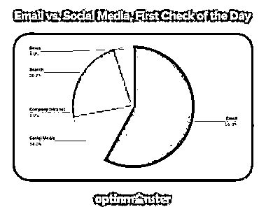

 

 

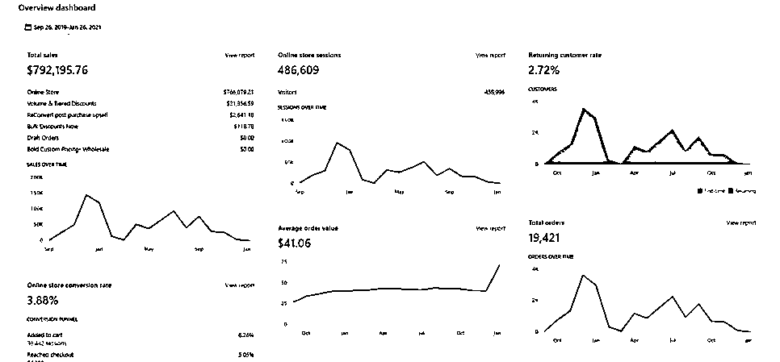

 

 

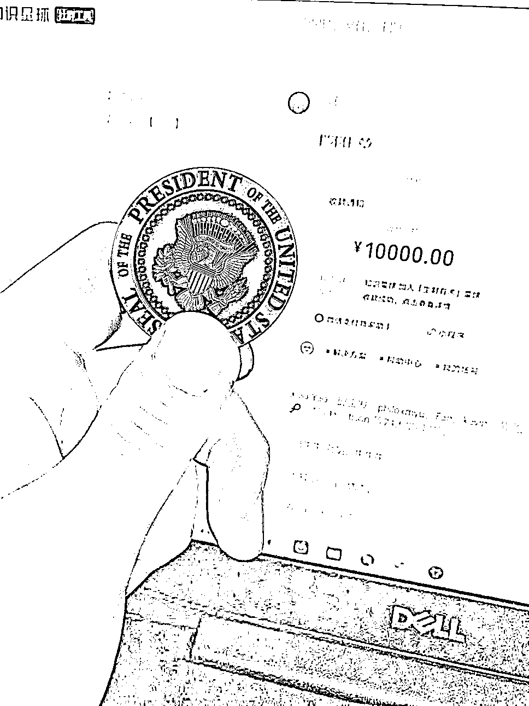

评论区：

 

 

亦仁 : 非常棒赚美金的案例，优秀[强]

不二 : 谢谢老大打赏[哇][哇][哇]

壹树 : 用香港个人身份弄 PayPal 和 Stripe 会稳点。

傅超人 : 1、  产品是死的，人是活的，而且人的需求是多样的，当你得到一定数量人群的支持和认可，那么你可以尝试开发推广多种产品。

2、验证一套变现模式，要尽快通过广告投放复制放大。

牛皮[太阳]

涵哥 : 看得很过瘾，虽然整个过程不是水到渠成，但是思路异常清晰，沙子里都能淘出金，不想赚钱都难，相当厉害👍。不过也要感谢你、让我知道，跨境电商和国内电商的差异，原来还可以用EDM的方式，还可以聚集站长联合推广，另外，还有必不可少的seo，这些在国内电商已经不常见了。当然类似的地方，就是渠道为王，这是基本盘，到哪都一样。

古辛 : 优秀[强][强][强]

one先生 : 好过瘾

半年 : 请问那IP地址要设置为香港的吗？还是用大陆的IP登陆就行？

# **# ****(**精华帖**)(200**赞**)**跨境电商创业全流程分享

作者： Lissa Tam

日期：2020-04-20

跨境电商创业全流程分享

hi大家好，我是Lissa，主业跨境电商（嗐，卖货的），副业B站UP主（瞎玩儿的哈哈）。

终于混进生财有术圈子了，激动，和大家分享一下我亚马逊创业从产品到运营的整个流程，就当自我介绍了~~~

2019年回到深圳后，我以打品牌、做精品为目的，进入了一家中型跨境电商公司，开始了为期一年的亚马逊之旅。那一段时间收获和成长都挺大的，3个月时间把一条新品推爆，成为类目老大，月销80W。后面接手整个站点，又花2个月时间左右把品牌从小份额占有（第8-10左右），做到英国站第一。后面继续接手美国站点，2个月时间实现销量翻倍，我手中站点加起来业绩平均每月300W左右，团队加我3个人，利润不大，因为前期 

 

主要目的是抢多市场，大概10%。到现在，我做起来的产品仍旧很稳，英国站一直BS，所有产品都在首页，美国站推的爆款也稳在首页，利润我估计整体大概上到了20%。

2020年年初离职，正式开始合作创业。创业更多是全盘的东西，就如下棋，需要轻重权衡，有舍有得。创业至今快4个月了，由于YQ的影响，七七八八的事情非常坎坷。但同样也感谢这段经历，让我能更全面的了解怎么通过跨境电商赚钱，也打通了供应链、选品、渠道、运营、公司运作这一整个流程。

这次的创业，我选择了以我最擅长的亚马逊进行首个突破。接下来的内容，将从平台、选品、做品、运营四个角度，和你分享我创业的整个流程。

一、平台

跨境电商主流平台有：亚马逊、eBay、速卖通、wish、shopify等。

对于亚马逊来说，亚马逊拥有完善的前端客服、与后端仓储配送服务，主要用户为欧美中产及以上等高端群体。在亚马逊中，选品是非常重要的事情。

而eBay的用户群体相对比较低端，用户对价格很敏感，相当于国内咸鱼。速卖通类似于阿里巴巴，用户群体以发展中国家为主，东南亚市场占比高。wish基于图片流的形式，主要还是得靠铺货来做。自建站则相当于微信公众号，半开放式，需要自己去争取流量入口。

由于这次创业我们打算精细化运作品牌，因此我们不仅仅需要亚马逊作为产品销售平台，还需要搭建官网作为展示及信息收集平台。考虑再三后，我选择用shopify作为搭建平台。

确定好要做的平台后，就要准备系列资料。

**1. ** 店铺；2\. 商标；3.域名

现在亚马逊店铺越来越难注册，2020年开始，还需要视频进行认证，因此市面上的店铺越来越贵。

我对店铺这块的内容了解不深，但我知道亚马逊对品牌化是一直在扶持的，因此我的目的很简单，就是尽可能得到平台资源与支持。因此我会选择公司卖家名义进行注册，并准备商标进行品牌备案。

那么我需要准备的事情有：注册公司、准备VISA信用卡、找靠谱招商经理申请亚马逊店铺注册、购买商标。

亚马逊店铺审核严格，有2次审核，特别是美国站点的店铺，很容易被抽中进行二审。很多店铺就卡在二审上，如果审核没过，那整套注册资料也就用不了了。当然，上述所有流程都可以找靠谱服务商帮忙搞定。

 

 

域名购买推荐大家使用namesilo.com，不像有的平台首年便宜，后面几年加价，这个平台价格每年都差不多。一个域名大概几十块钱一年。

不管是选择哪个平台，商业的本质就是低买高卖。

那么首先得有产品。

二、选品

在星球我和大家有聊过，选品类的时候，第一，选择蓝海市场，竞争小；第二，选择你有供应链优势的市场，能够拥有资源倾斜；第三，选择传统行业占比大的市场，差异化可操控空间大。

根据我们自身的情况，我们选择了厨房品类。一是我们能得到供应链支持，产品质量、价格及货期上有优势，第二是这是传统行业，热销产品主要是靠线下品牌及上线年份的加成，精细化运营程度相对不高，这点对于从3C市场厮杀出来的我而言，能够加入很多不同玩法。

我们的市场定位是潮牌，通过对传统产品的外观设计做突破，从造型上来打差异化，营造生活美学概念，抓住当下厨房类20-35岁的主要中产阶级消费群体。

根据自身资源，整个品类下我们选定了4条品线，定好品线后就进入了选品阶段。

与以市场定产品不同，我们先确定了方向，再从中选择产品。那么选品阶段更侧重于市场分析、可行性分析、竞品分析以及产品选择，通过调研后的数据来确定市场容量、利润率，判断该品线是否可行。

市场分析主要从品牌占有率、产品上架年份、BSR排名、评论数、星级、Listing质量等几个维度考量。若一个市场某个品牌占据了50%的销量，形成了市场垄断，那这个品类前期很难打，我们不会选择。如果市场上评论数大于1000的产品（单个SKU情况）超过10条，我们也不会考虑。

关于市场分析怎么做，我之后和大家介绍我的方法，感兴趣可以先关注一波。

通过对市场的调研，确定好产品选择，找到对标竞品，并从阿里巴巴上估算产品成本价，进行初步利润核算。

亚马逊中运营产品的基本费用涉及到：产品成本、FBA运费、单位头程、佣金、FBA仓储费。FBA相关费用可以通过免费的利润计算器进行计算，我用过的工具有：Tool4seller（免费的亚马逊FBA利润计算器 - tool4seller - 点金数据通 | 亚马逊跨境电商卖家运营...）、卖家之家。单位头程可以简单用物流费用*产品重量进行估算。比如说我的产品发海运，目前海运发往美国的均价为10RMB/kg，用10乘以单个产品重量即可得出结果。

 

 

一般而言，除了基本的费用外，还要涉及到管理费用和营销费用。管理费用一般占比5%，营销费用10%左右。因此，如果产品利润率小于30%，那就可以放弃了。

那么当产品利润>30%的时候，也就是选品可行的时候，下一步就是竞品分析。主要通过抓取竞品评论，来找出产品卖点，总结用户痛点。根据痛点整理好产品要求，向工厂询价，近一步核算产品利润，并对产品进行定位，初步确定打法。

与此同时，还需要同步进行项目可行性分析，对项目进行至少6个月的投入产出预估。整个计算维度涉及到：推广计划、物流及库存安排、销量预估。最终得到一个项目预算表，用于分析项目前期需投入费用，以及回本周期。目前市面上大卖的回本周期为7-8个月左右。若回本周期大于9个月，且没有优化余地，那么一般而言这个项目也不会再考虑。

三、造品

产品确定后，进入产品打造阶段。

在这个阶段，要做的有：产品做货、软包装准备、图像拍摄、VI设计。

产品做货分为：打样、确定样板、做大货；

软包装有：包装、说明书、售后卡；

图像拍摄：产品图片拍摄、视频拍摄。

VI设计：官网搭建、LOGO设计、公司简介等文案内容设计

产品做货不用说，在确认样板，与工厂签订合同后，即可进入做货阶段。根据品类不同，产品货期也不同，比较长的货期大概在25天左右，较短的一周即可出产品。因为亚马逊本质上就是一个货的生意，需要压货在国外，资金回流速度慢。货期时间会影响运营节奏，因此在签署合同的时候最好和工厂谈好账期，并确认好交货日期，以及延误交货后相应的问责方式。一般每延误1天，需赔付合同0.5%的违约金。

软包装决定了用户体验。之前工厂问我，我们是做线上生意的，亚马逊上很多卖家都是随便包装，我们为什么非要在包装盒上下这么大功夫。我回答说，这就是品牌和卖货的区别。线上决定成交，线下决定体验。好的体验带来好的口碑，而好的口碑决定产品的二次传播率。

罗振宇在得到里说过，验证产品的成功与否，就是用户是否愿意和它合照。国内花西子的包装，每一步都让人很有惊喜感。

 

 

增长黑客五个阶段：用户获取、激活、留存、变现、口碑。

我们通过亚马逊站内及站外SEO和SEM获取用户，通过促销活动及优质新品（也许未来还会做优质内容）激活用户，通过品牌塑造及官网进行用户沉淀，通过购销产品进行流量变现，利用优质的产品及极致的用户体验打造口碑。

除了包装外，还有说明书、售后卡等，一切能够增强用户体验以及带来转化目的（例如增加好评留评率）的方法，都可以去尝试。比如我在售后卡上写了“登录官网，即可获得VIP礼物”之类的话，收集用户邮箱，将用户沉淀到网站，同时还能再通过官网设定好评有礼的流程，增加好评留评率。

图像拍摄主要是为了增强转化，线上购物主要是以图像为主，用户通过图像来体验产品，了解产品。而好的图像，能够让用户体验到产品的触感，换言之就是，能够让用户有“我正在看着并且触摸这个产品”的感觉，触感是激发用户购买欲望的重要因素。在内容表达中，视频>图片>文字，视频可以全方位展现出产品的性能和使用场景，有利于用户更了解产品，增加对产品的信任度。

在产品拍摄中，最好请专业的团队进行拍摄。这里提示一点，在拍摄之前，一定要做好产品定位，明确产品的对应的目标客户，并写好拍摄需求。整一个系列的产品调性要统一，用于展示品牌的聚焦度。如果是同类的产品，可以做不同的风格划分或者是用户群体划分，来降低自家产品之间的竞争。

VI设计的目的是统一品牌调性，在后期的套图设计及A+设计中，统一字体及颜色，做好规划化。官网搭建相对简单，因为目的是作为展示站，shopify上最基本的模板就够用了。你可以使用builtwith.com来查询竞争对手网站所用的建站系统，还可以用Commerce Inspector查询网站流量来源和安装的APPS。当然，重点要知道建站的目的是什么，比如我的主要目的就是信息收集+增加留评率，那么我会更着重于打造好用户进入官网后的注册及留评步骤。

官网还有一个重要点是，售后服务。拥有域名，就可以制作官方邮箱。比如我的网站是Lissatam.com，我就可以通过腾讯企业邮箱等平台，生成属于自己的一级邮箱名，比如lissa@lissatam.com, support@lissatam.com，相比其他后缀邮箱，拥有属于自己品牌名的邮箱，看起来就相当专业了。

四、运营

产品做货完毕，就可以写Listing上传至亚马逊了。如果你的时间来不及，你可以先简单写一下Listing，然后上传，先把货发出去再进行Listing的打磨优化。如果来的及的话，那就还是先打磨好Listing，再上传，减少Lisitng的修改次数。

在亚马逊上传Listing需要产品标识码，一般我们会使用UPC码。我们可以选择使用UPC 

 

码，也可以申请UPC豁免。

UPC可以从创蓝论坛进行购买，也可以选择在barcodestalk.com上进行购买，前者比后者便宜，且服务号，但后者看似更靠谱的样子。

UPC豁免即申请不使用产品标识码进行上传Listing，适用于品牌产品。品牌授权店铺与非品牌授权店铺皆可以使用。具体操作很简单，可参考此篇文档亚马逊品牌备案后，如何申请产品UPC豁免？-雨果网。我因为害怕通过中间商购买的UPC码后期会出问题，因此我选择UPC豁免的方式。申请前我没有做品牌备案，只需要几张产品图片，24小时内便通过了。

上传完产品，后台进行发货。发往美国FBA的话，空运需要大概15天，海运25天左右。

找一个靠谱货代，并对比好价格后，就可以发出了。

接下来着重讲一下打磨Listing。

打磨Listing的过程比较费时间，Listing分为图片部分与文案部分，前期需要根据市场分析做好产品定位，决定产品的主要卖点。我的做法是提取产品主要卖点，分析竞品的差评，再两相结合，选择出一个主要卖点，其他的则为辅助卖点，根据用户需求程度进行排序。

根据卖点设定，做好套图与A+设计需求表，外包给设计师进行制作，那么我的精力主要是打磨文案部分。

文案则为标题、卖点、详情描述。整个文案部分需要考虑亚马逊的SEO抓取规则。

你卖的是苹果，亚马逊觉得你是苹果，他就会想办法帮你。你卖的是苹果，亚马逊觉得你是颗梨，那你怎么都卖不起来。这就是由产品与用户之间的符合程度，也就是转化率决定的。那么首要目的，一定要清晰描述产品，尽可能叠加关键词，使其符合亚马逊的搜索逻辑，并多占据一些流量词渠道。

除此之外，还要考虑用户的转化路径。用户点击进入产品界面后，如何让用户心动到下单。

一种方式是，我可以蹭竞品的流量。用instant data scraper抓取竞品的差评，并总结出主要痛点。在确定我们的产品能解决竞品的问题的条件下，把该痛点作为主要卖点进行展示，并把广告打在竞品页面下。那么浏览竞品后却因为差评没有购买的人，看到我们的Listing能够解决这个问题，就会增加下单机率，产品转化率也就高了。

另一种方式，就是比较传统的做法。回归Listing本身，提取市面上最大的几个用户需求与痛点，在文案中凸显出满足程度。此外，可以加上对比环节，让客户深入了解产品的同时，能够看到与其他产品的对比，以及购买过后用户的好评。这个玩法淘宝卖家用得比较多，亚马逊还是以凸显产品卖点为主。可以多参考淘宝BS产品，研究其转化路径。

 

 

在写Listing的时候，多参考竞品的Listing以及相关行业优质Listing的写法，用webscraper一次性抓取前10页的产品的标题、卖点及详情，再用wordart词频分析工具，筛选出卖家最常用的关键词。与此同时，利用卖家精灵等关键词工具，找出用户搜索关键词及对应的搜索量。再与卖家常用关键词进行反向匹配，这时往往能找到一些用户搜索量大，但是竞争对手用的少的词。把这些长尾关键词放入Listing中，就能独占一份流量。

如果产品能在市场上做出差异化，且质量优质，Listing的转化设定深入人心，那么后续的运营就是顺其自然的事情了。做好客户服务，把控好产品质量，及时反馈迭代。也许这就是市面上常说的产品占7分，运营占3分的原因。

但是不尽然如此，运营仍旧有很多发挥空间，只要你充分了解平台规则，并顺应规则进行产品推广。比如占据关键词自然排名首位、换节点拿BS、ppc广告等等。

在做3C产品的时候，产品质量一般的情况下，我仍旧纯靠运营，将产品推爆，并做到站点第一。之前在星球里系统写过如何打造新品使其稳定出单，以及如何打造爆品的流程，感兴趣可以翻一翻。

除此外，在等到货期间，考虑到是做品牌产品，我们还可以在国外的平台上发布20篇左右的软文，避免用户在网站上搜索产品出现0内容的情况，以消除用户购买顾虑。可以考虑布局的平台有问答类如quora，类似于新浪的门户网站如yahoo，社交网站如Facebook、YouTube，以及垂直领域的平台。

运营是最靠近客户的一端，因此能够接触最多的信息，及时整理用户反馈做好产品迭代，对市场保持敏感度以保证竞争力，及时进行数据分析以锻炼全局观及操盘能力。总而言之，无非就是流量+转化。如果精力足够，多尝试不同的玩法，去优化，去打磨，去创造。

——————

以上就是我整个创业流程中，关于产品的一些接触和总结。

运营出身，所以对我而言无论是什么产品，前期市场分析做足够，质量把控到位，都可以推起来。因此流程中没有提及测款这个点。同样，也是因为我们的产品起订量比较大，第一批款式我们都很喜欢，就直接去做了。

当然，测款也很重要，像我接触到的，可以用Facebook广告测，也可以直接新品发小批量空运到亚马逊仓，用广告测，看后台数据，分析哪个产品表现好，来进行选择。

 

 

除此外，就是具体到产品线和每个产品的运营策略了，去年的时候总结过，怎么稳定出单，怎么打爆款。其实也无非就是流量+转化，国内怎么玩的，国外差不多。咱们生财有术圈子肯定有很多大神分享。涛哥@杨涛  就非常的秀，玩流量厉害到起飞，是我一直膜拜的对象。

如果你觉得这期分享对你有用，请给我点个赞呗哈哈

最后，感谢生财圈子，希望能和大家一起玩~~

一起生财有术，感恩遇见。

跨境电商 Lissa互联网电商  亚马逊

评论区：

清水哥 : 哥们，分享得很到位👍，我也是在做跨境电商的，主要做东南亚虾皮，现在在研究国际版抖音，配合跨境电商运营

Lissa Tam : 号子赶紧养起来~~~

清水哥 : 批量做了很多Tiktok的帐号，在研究变现的渠道。

不许变懒的猫 : 国际版抖音tiktok四月初发起的大航海活动啊，船长每天都有日志。搜标签：大航海计划，有很多文章。刚研究过来[偷笑]

Eric : 哥们，文章分析的很到位哈

北风 : 给女神打call

清水哥 : 每天都有看的

# **# ****(**精华帖**)(134**赞**)**跨境小白从** 0 **到** 1 **通过亚马

# 逊在线套利的实操分享

作者：  大咪

日期：2022-05-02

亚马逊在线套利

【跨境小白的亚马逊在线套利0到1实操分享】

嗨，大家好，我是大咪，一枚从事 5 年的后端 Java 程序员。

 

 

今天想分享一下，我在 2021 年一整年是如何从一个跨境小白，慢慢在亚马逊平台上做到出单的完整复盘。如果你对跨境有兴趣，同时不想投入大资金量去自研产品，也不想压货，只想轻资金踏入跨境行业，不妨看看这篇《亚马逊在线套利实操分享》，希望可以对你有所帮助。

亚马逊在线套利（OA）去年其实在国内挺火的，但看新手迈不过去的坎儿是选品困难，这篇分享里，在选品部分把我常用的 4 种方式介绍的非常详细了，相信看完随着实践一定可以选到自己的品。

看完这篇文章，你大概可以收获到：

**1. ** 亚马逊店铺注册的流程

**2. ** 亚马逊店铺的一些基础运营知识

**3. ** 亚马逊在线套利的完整闭环流程

**4. ** 亚马逊上赚到属于自己的第一美金（看个人行动力了）

友情提示：大概12000+字，阅读时间约半小时。

飞书详情链接：

另，有问题留言区欢迎随时讨论[耶]

[https://a49xsb7n3c.feishu.cn/docs/doccnpxb6jZ2sA3fHuDzSmIcUmd](https://a49xsb7n3c.feishu.cn/docs/doccnpxb6jZ2sA3fHuDzSmIcUmd)评论区：

思思在自然成长 : 大咪yyds

大咪 : 哈哈哈，谢谢阳思[偷笑]

毅 : “要知道一点，OA ，货永远不会砸在手里，因为你选的品，多少都是建立在销量的基础上的，如果真的好久没人买，大不了把价格拉到最低，肯定是会有人买的，不至于全额亏损。”不太完善，还真会卖不出去，比如入仓后要求提供商品相关资质，入仓后突然没该商品的销售权限，我认为OA的风险比国内找货源入仓还大

大咪 : 感谢补充，提到的这点确实也是风险...这种情况之前也有朋友遇到过，所以，第一批测品尽量少买，不需要大量屯货。还有一点就是看 FBA 的卖家数量，后来我找品，基本上都是在 FBA 至少有 5-7 个以上，虽然竞争大，但是有保障... 亦仁 : 从你观察来看，这个做到头部一年利润有多少？

 

 

大咪 : 公司维度的，之前在知乎上看到一个做 OA 的前辈，他在这篇帖子里提到过  【今天跟一个朋友聊天，他们公司做OA，月销1000万美元。我问你们公司能在北美卖家中进前100名不？

他说，他们排名在亚马逊卖家1000多位！】

月销 1000W 美元， OA 保守点利润一般都是按 20% 左右的利润去选品，商品利润  200w 美金起步…有些品类的利润不止 20%，比如玩具类的品牌品。

知乎原贴：

个人卖家的话不清楚，还是得看资金投入量

了...https://zhuanlan.zhihu.com/p/368807359  汗🐗 : 非常细致的介绍，感谢分享！

大咪 : 🤝

# **# ****(**精华帖**)(123**赞**)**电商小白实操从** 0 **到** 0.1 **跑通** **

# **Amazon **闭环并赚到一块钱，我是如何做到的

作者：  家永

日期：2021-06-25

复盘  案例分享  亚马逊电商

《电商小白实操从0到0.1跑通Amazon闭环并赚到一块钱，我是如何做到的》大家好，我是家永，喜欢实操作各种赚钱的项目，今天给家分享一个我在实操的项目，对新手友好，手把手教你以最低的资金快速跑通亚马逊的流程，全文加入两篇文章共1万+字，把我所有实操流程及注册店铺踩的坑毫无保留分享给你。希望对你有用。

这篇文章主要给跟我一样的小白看，大佬、大卖请略过，望海涵！

全文加起来1万多字，为了更好的阅读体验，以下是石墨文档链接：

《电商小白实操从0到0.1跑通Amazon闭环并赚到一块钱，我是如何做到的》https://shimo.im/docs/JRryrXcRYkWy3gX9/ 

 

评论区：

漆菲特 : 家永哥真厉害，总是那个执行力最强的

大脸狗 : 感谢分享！！想问一个问题:运作亚马逊店铺，英文基础比较差怎么解决？

家永 : 英文不是问题，谷歌翻译就够用了。

张静伟@生财有术 : 永哥NB，

大咪 : 感谢分享，我也在做OA[偷笑]帮助很大！等我跑通也来分享

清蒸鱼 : 第二期oa在报名了[偷笑]

seven : 很强悍，加油啊

天添乐 : 可以报名了吗？

# **# ****(**精华帖**)(124**赞**)**亚马逊批发，如何一年从** 0 **

# 做到** 100W **利润？

作者：  国民弟弟的跨境十年

日期：2022-08-24

在生财圈子待久了，今天鱼丸找到我说，**Bruce**你的经历很丰富哈。可以在圈子里面分享。

感谢推动，也在群里里面收获了很多认知。这里分享自己的创业的经历。就是一个普通人诚恳的讲讲自己故事。

不喜勿喷。我就是一个普通的不能再普通的人。

以下是正文。

大家好，我是国民弟弟的跨境十年 Bruce.（这篇文章是4月份写的，直接搬运过来了） 

 

我是一个美国本土亚马逊店铺套利和批发卖家。从0到1开启自己亚马逊套利生意，半年内从月销2K刀做到月销2W刀，副业给自己每月带来2W+人民币的收入。目前也跨境公司做项目合伙人，也做自己的项目。这次给大家分享下我的副业是如何从0开始起步做和自己微创业的感受。

# **1.**目前的情况**.**

废话不多说，这是2022年4月份某天的主店铺的截屏。30天售卖了2.6W刀，货值是售价的1/3左右（8K刀)，利润是货值的50%左右，也就是4k刀，利润是2.6W人民币。

PS，现在2022年8月到了6W刀的销售。利润也是大致5-6w人民币的样子。

后面一张是细节图。有时间戳。

 

 

这是随手截图的产品利润率。可以看到时间和我命名SKU的方式就知道这个产品的利润率基本就是100%

# **2.**我的微创业的人生转变故事

 

 

先简单介绍下，来自一个二本学校，学了个万金油的专业。毕业做外贸，自己玩过Gap year间隔年，在东南亚晃荡。不正经的在一家公司做户外向导，一年工作半年，剩下半年就是旅游。钱也只够穷游。穷困潦倒的时候，某次飞机上，找空少要了4盒飞机餐回去继续吃了两天。（机票是公司的报销的）

真正开始工作是2016年进入某大厂，万科做教育板块。后来因为各种情况和办公室政治。离开了某教育行业公司，之前虽然在这个行业待了6-7年，但是在这个行业没有什么积累。算是人生吃了一鼻子的亏和瞎混了一圈。只是拿了个工资的打工人。除了做事认真以外，乏善可陈。年级又到30了，基本上在人才市场是属于吃灰的那种。只有小公司万不得已才收。

从跨境前的唯一一份正经工作开始说起

当时在万科里面做户外教育板块。算是新业务，公司让我负责宁波市的业务。很快就和几个深圳的小伙伴上了早上10点深航飞机，两个小时后，小团队就这么在一个完全陌生的城市开始了业务。新城市，新地点，每个角落都是未知的。刚开始租车花了5天，跑了下城市大概，好歹先不要迷路。

前期的3个月的时间，每天除了睡觉就是工作。4个小伙伴一起鸡血，虽然不至于通宵，但是基本上3个月连轴转。没有休息，白天开会讨论引流方案和活动方案，晚上头脑风暴，盘点复盘。

团队里面，我是一个唯一在这行业有经验的人，其他人只有两个月的经验，还要负责培训新人。

对了，团队里面还有一个几个月才慢18岁的小朋友。算是带着童工和一堆新手开始在一个新城市，找流量，开始做业务。

作为项目负责人的我，晚上唯一的解压方式，是找其他各个同行朋友和其他分公司负责人打电话。还记在平楼的沥青小阳台上，踱着脚，从东走到西，南到北，像极一个热锅的蚂蚁在试图找到新业务的流量密码入口。

 

 

和现实中所有的一样，欲速则不达，客户进来都需要时间沉淀的，特别是我们做小朋友的生意的，更需要长期活动下来的信任。且自己也是流量新手，并不懂如何很好的去使用其他方式去引流和成交客户。就这样团队在每天鸡血忙碌了一年，流量业务上没有什么业绩，虽然成为公司夏令营口碑最佳的营期代表，抵不住利润报表的亏空。团队也就被公司拆散了。随后几个月后自己也离开了。

基于对之前行业的负面经历，决定换行业新进入跨境电商，付费两次找过跨境电商大佬电话咨询，只是希望自己没有选错方向。目标就是自己的跨境的创业的起步不要错。

现在社会试错成本都很高，宁可利润低，也不要最后一地鸡毛。

2020年末，从0开始进入换行业赛道，从深圳一个小跨境公司上班开始做亚马逊，中间换了一次，到现在长期搬砖的跨境年的大厂，做项目合伙人，同时也在2021年末，悄悄的开始了做自己的副业，目前自己副业已经超过主业收入。

 

 

# **3.**为什么选择跨境呢？

2018年的时候，就萌生换行业的想法。给认识的唯一在做亚马逊的同学打电话的时候，随意闲聊中，之前的小学弟已经是年入50W了，这个金额让我错愕不已，当时的我虽然在公司做项目经理，也只是拿1W的工资，且要扣除各种公积金和税到手也就8K。对比下，猛然觉得选对行业比经验都重要。中国的老话，男怕入错行，女怕嫁错郎。只有经历过才刻骨铭心。

现在回顾下，这个世界大部分都是普通人，你和我和现在看这个篇文章的朋友，承认一个现实，95%以上的人都是普通人。如果你不是，那么你就是社会中的1%的老板了。

# **4.**那么普通人怎么现实逆袭呢？

 

 

选择一个持续增长的行业。什么叫持续增加的行业？

最简单的判读，这个行业是替代之前旧需求的解决方案。

如，新能源的特斯拉替代燃油车，成为妖股。

美国亚马逊电商就是替代去商超店的购物。和我们中国淘宝起来的那么一波一模一样。

# 未来铁定是中国电商全球的市场。进入这个行业至少有**10**年

# 以上的发展前景。

# 新的信息和新的改变。

于是在2020,12月通过社群知道亚马逊还有套利模式的时候

（简单介绍下，套利，就是通过在美国的其他零售平台购买打折的货物，在美国亚马逊上进行售卖，如，在美国沃尔玛上买到廉价的尾货，同样的产品在亚马逊上进行售卖。

类似中国拼多多进货到淘宝卖的模式）

而且在群里看着人家从0开始白手起家，20W直接在4个月后直接赚回来的时候，自己终于磨蹭的在3月份开始套利模式。

然而在当时公司新项目，忙碌到每天加班到10点，只能周末做事情。

周末通过社群和网络资料来学习。刚开始真的一脸蒙蔽，大量海外网站在自己面前，说是简单的套利，从别人家买了到亚马逊售卖。然而花花绿绿的网站放在你面前，还有更多五颜六色的商品在网站上，要在这成千上万的产品中找到能让有利润的产品，瞬间感觉到无从下手的焦虑。

 

 

钱不会掉下来，每一次的开始都是要靠自己。

硬着头皮，直接上，选择最笨的战术。黏贴采购网站的标题，到亚马逊搜索，人工识别确认是否一致，是否有利润，是否有权限售卖等等。

然而看着自己每天工作打卡到晚上10点，偶尔半夜起来工作的节奏加上大小周的作息，已经榨干了我这个打工人的精力。和所有人在奋斗的人一样，都希望努力出成绩，但是超人的勤奋会严重透支你的精力。

在前期鸡血干了一个月后，因为投入时间严重不足，加上白天工作的焦虑和忙碌。几个月下来，我的店铺只有刚开始的业绩截图是看的下去的。因为我只是进了一次货。这是5月份新店业绩截图。

 

 

这段时间，开心的是开始自己能够有自己的副业赚到一笔60刀。遗憾的是自己无法投入更多精力做事情。

回顾下，最重要的是，任何副业前期都要给出时间让自己专注的做事情。

# **5.**亚马逊套利副业启航的故事

2021年7月中旬，终于有空出大量时间开始做亚马逊套利。正到我准备踌躇满志的时候。晴天霹雳，收到亚马逊封店的邮件。封店！配图是网图（非正式邮件内容） 

 

因为放了一段时间，没有售卖任何货物。账户被审查需要提供资料，然后因为是买的店铺，没有任何资料，无法解封。就像你新店还未开张在装修的时候，就被租店的人告知你，不租店铺给你，你关门吧！

当时看到封店的邮件的时候，心中瞬间非常低落，不想说话，只想躺在沙发上刷手机看点其他的排除下烦恼，然后点一顿外卖，配上肥宅快乐水，刷个剧抚慰下自己受伤的心。

躺在沙发默默不语，抿着嘴半个小时之后，开始咨询各方朋友，确认了确实无法解封。

又是一波失落涌在心头。做在公寓台阶上，就那么看着天，发着呆，什么都不想说。天上的云儿就那样无表情的来回游走。我也无表情的看着他们。

约半个时候后，过来会，想想到自己悟到的金句。**“**这个世界没有什么是不变的，唯一的不变就是变化，而且非常多的事情不是你能控制的，积极应对才是生活的强者，**You are NOT in control”**

 

 

反复脑中念了几遍，这么多年来，其实所有的东西都是变化，人和关系，都是一样的。

跳出固定思维，积极应对才是生活的强者。如果你碰到类似的事情，这句话送给你。

承认这个世界的不确定后，我开始接纳现实，同时阿Q精神的告诉自己，封的早好，好歹没有货，否则钱货两空就更难过。

几天后，同时大量中国身份注册的亚马逊的店铺已经被限制权限了。让我也被治愈了，抱团取暖就是这样的感觉吧。同时也阿Q一把，反正中国账号也没有意思，本来就要换，只是被强制提前升级了而已。

# **6.**美司亚马逊之旅的开启

然后我开启走向开美国公司注册亚马逊的路程。真的像，上帝给你关上了门，但是同时有给你开了一扇窗。很多时候你就是被时代机遇推着走的，其实回想起来，感谢封店。

不封我不会去探索新的路径。

开美国公司做亚马逊的路并不容易，好歹自己积累了些美国朋友资源，通过朋友的朋友，找到代理完成了从公司到店铺地址的明信片的验证，后续也完成了亚马逊最难的二审验证。

还记得在某个晚上和美国留学的朋友一起聊我的新公司起什么名字，最后在3个备用选项里面，帮我选择了一个美国化的名字。隔着大洋  一点一滴，一家美国公司在我的方寸间的房间里诞生了。

 

 

有了这些基础，我才可以第一次申请自己的亚马逊账号。

 

 

在社群和网络上翻略无数的帖子和反复和代理确认，我自己开始了自己的申请账号的路程，一切并不是很复杂，远程朋友家的电脑提交了资料。然后再是视频验证。记得视频的时候是一个小姐姐，操着南美口语，拿着一堆资料和她核对，15分钟搞定。小插曲是，资料提交因为格式不规范，导致来来回了一下，在咨询朋友和代理后，提交了正确的资料，比较顺利。

在8月中旬有了自己的店铺，权限齐全。记得那一天感觉闻到的空气都是甜的。辛苦一个月，靴子落地，而且结果很好。

# **7.**店铺有了，从这里开始，才是真正的自己美司套利启航的

# 开始。

2021年的8月中旬，又是重置自己，从0开始手动选品，在一个Nordstorm Rack网站打折清仓区开始，黏贴复制到亚马逊, 又是几个夜晚的不眠，凌晨三点的挑灯夜战，让我回归了到高考的感觉。然而几天后，效果依然一般。虽然下来几单，但是效率依然比较低下。

# **8.**学习总是遇到困难就有新的解决方案。

开始复习TA和SM这两款选品软件。我把网络上关于他们的工具使用的视频全完了，又投入到选品中。成果比较喜人，选出了一些利润在30-40%的产品。

当我欣喜的时候，这时候总有让你打回原形的事情发生。

当我下单的时候，我的美区Paypal被封了（这是大家做套利的重要的支付路径）。当时候还得意自己的美区PayPal 可能没有问题，因为注册的时间久，想想是老账号，权重高，蜜汁自信。结果说封就封。

 

 

然后就是疯狂的给PayPal打电话，20多分钟终于找到合适的人通话。按照自己的中国思维，好歹给个机会，结果是一个BIG NO.

祸不单行，大量网站也砍了我的单子，沃尔玛，Macys,还有Academy,只要我下单子就砍。

无法支付，无法下单。让我好多天都没有精神，躺着床上，起来找攻略，可惜这个领域都是一个全新的领域，并没有任何人能够提供适合你的解决方案。

我瞬间蒙蔽了！那段时间是我打了很多电话。

我随意截图下。因为需要在美国时间电话，我一般都是晚上11点之后电话，一个一个打，还有最坑的是，话说到一半，网络掉线了。你知道那种崩溃是什么样子的么？花了半个小时找到人，已经聊到核心的时候，断线，然后需要重新打进入，因为他们不会打回来。持续了几周的一天3个小时电话量。

 

 

 

 

 

 

大量的实践，居然让我总结出来，其他下单的套路。和如何和客服快速沟通的经验。

在一个未知的领域，实践出真知。

总结了支付和砍单的经验后，我又升级打怪，进入批发的领域。

# **9.**开始批发之路！

普通人厉害，靠什么？靠超人的勤奋！

15天互联网的汪洋中，自己找到的600个批发商，开始电话和邮件。

 

 

 

 

你以为这些有资料就是能够解决问题？

不要天真了，大部分需要你的资质和其他的材料。

经历了几次沟通不畅的情况，一个大胆的想法出现在我的脑子，雇佣美国人帮我电话。

于是乎万能的朋友圈让我找到之前的美国朋友，美国老爷子没事愿意以一个比较低的价格帮我电话。

 

 

 

 

我们就这么交替合作，努力这次有了回报的，找到了些不错的利润的批发商。总结下，本土人互相沟通比较方便，而且年级大的做事比较稳，和销售沟通时彼此比较信任。

# **10.**这半年里面**,**我的困难和努力。

有很多不眠之夜我是挂着电话和海外网站的客服隔空撕逼，要求单子能够下进去。

有多少个夜晚在不同的网站里面跳转，选择思考分析，把选到的产品放到自己采购清单里面。

还有绝望的等待，因为第三方贴标服务商把我的几十万的货拖在仓库（他们人手不够）。

有着不断选择测试IP怎么样不被PayPal封号的探索，和被封号后，一周每天3个小时的和他们客服的撕逼大战。

 

 

中间很多事情，都是新的，要不断想办法来解决。

在这里我补习了自己的商业英文口语，每日从油管follow 教程，怎么样把自己的锻炼的更美式英文表达思维，如何高效的表述和合理获得解决方案。

我自己搭建了独立站，自己装修站点。包装的非常本土，以至于被后续居然啥也没做独立站也出单了。

我学会了如何电话拜访供应商，如何和美国人谈完公事后拉家常，建立良好的供应商关系。

在这里，我又测试了出来了申请ITIN（美国个人税号）绑定美区PayPal，稳定不封号的方法。

又开通了美司的商业PayPal

在熬夜的一个晚上，我用空壳的美国公司，申请下来了美客多，Etsy和其他电商平台。

（正常的中国公司很难申请）

 

 

在某个晚上，我又信手拈来，去批量开了美国的信用卡，获得更多的美国银行方式。

在某个白天，自己闲着没事又开通了，美区的Stripe。

到现在，可以借着着自己的经验，利用美司，开Walmart，分享美司套利的技巧。

游刃有余的协助一些朋友一起开始OA套利。

当你开始了，一切就变得越来越简单。

# **11.**时间是我的朋友

我从的店铺从第一个月的2k刀，到第二个月到了单日出20单欢喜。然后是缓慢的从5k到破1W，到现在开始到2W。利润不断追加投入中，到雇佣了我的亲戚帮我打理店铺。一切就在短短的半年完成了。

这是第一个月的2K的开始

 

 

每一步都是一个积累，大量的练习，让我行业经验越来越足，不断能够淘到50%到100%以上的高周转产品，同时因为需要处理非常的事务，自己的工作节奏也是更加高效和简明。

这是顺手截图的在出单的产品。

# **12.**走下来感悟最深的是：

1.任何副业都没有速成的，都是需要大量的前期垃圾时间的积累，自己每日的经验总结。

 

 

2.提前规划最佳，因为使用的美国公司开的亚马逊账号，后续开权限基本无压力。包括后续开ITIN等申请信用卡一切都是水到渠成。

3.主动努力中，也要积极寻找合适可以帮助你的资源。没有美国的朋友和代理的协助有些事情在国内只能望洋兴叹。

4.主动学习的解决问题，向行业厉害的人虚心讨教。很多事情都是第一次做，通过搜索和问行业里面厉害的人，少走了弯路。

5.在自己擅长的领域开始，投入比常人更多精力。无数个夜晚对接美国时间和电话，一切都让后期的事情，无比顺畅。

6.选择比努力重要。如果我在跨境的路上还是抱着中国公司开店铺，估计很快就会有瓶颈。而美司虽然来来回回，好歹给我更多的选择。

现在有稳定的副业收入了，然而事情也没有更少，在培训下一个人帮我运营新店铺。已经兼职雇佣到第三个人了。

今年赚钱突破100个W。多点开花。PS(今年100W目标应该不远，唯一的目标就是150W)

 

 

关于利润同样无图证据！

这是我今年获得的人民币的资产（里面有卖货的利润，知识付费，工资，帮公司做项目的收益）90多W。美元就暂时不放出来了。还有30W人民币左右。

对于很多朋友都不算什么，但是作为一个普通人创业成功，也是非常不容易的开始。

 

 

 

 

 

多赚了点，像我这样的工作狂人而已只是银行数字增加，唯一的就是给自己买了一辆高配的公路车自行车，给家人经常买点东西。

在银行里面转的美元，马上进入买货，进行复利操作。

越是赚钱的初期，越要节约，让自己的复利飞轮赚的更快些。普通人资本积累，获得资金的复利是最重要的。

不要去购买那些不能给自己带来生产力的东西，炫耀的产品。车子对于我这样的人，就没什么必要的。

我看过挥霍的钱的人，刚刚有点现金，自己挥霍一空，换成豪车，最后变卖豪车的人。

我只是一个普通人，刚开始创业，圈子里面也有很多厉害的朋友，故事分享出来也只是让普通人有一些参考价值。

毕竟大佬也是从普通开始的。

# **13.**最后，送自己一句话。自助者天助，这个世界很公平。

公号：国民弟弟的跨境十年

我会更新最新的关于美司的一些自己摸索的经验和自己的思考分享，方便大家避坑。

可以给生财的朋友提供的资源如下：

 

 

【可提供资源】

1.亚马逊套利从0到1的经验，OA高阶➕批发经验.跨境经验分享博客

www.amz10years.com

2.超级低成本39刀注册美国公司和处理税务的美国资源可以分享.

3.利用美国公司开户walmart.ebay.etsy.美乐多等电商平台的分享。

4.美区Stripe和美区paypal商业版本使用开通使用经验

5.自己开通美国信用卡经验

6.海外美元账户开户经验分享

7.英国Tiktok小店从0到1落地经验

8.滑雪，滑翔伞，野外急救经验分享。

 

 

博客网站：https://www.amz10years.com/amazon-oa-experience/评论区：

凯 : 牛

阿鸿 : 一般人做不到

倪大胖 : 赞

苏生 : 厉害

曾世拓 : 精神可嘉

无念 : 看完文章，能感受到Bruce所经历的种种困难，一路的前行，一路的克服困难，优秀[强]。

喜欢你说的一句话:积极应对才是生活的强者。

国民弟弟的跨境十年 : 谢谢喜欢

66 : 真棒，加油

 

 

# **# ****(**精华帖**)(109**赞**)**利用生财有术的知识：**1 **年内

# 在亚马逊上实现月销百万，月盈利十万

作者： Feynman

日期：2022-10-27

利用生财有术的知识：1年内在亚马逊上实现月销百万，月盈利十万。

哈喽大家好，我是Feynman，在开始这段亚马逊的创业前，我原来主要从事独立站相关的工作，完全没有亚马逊经验，也没有选品的经验，在接手这摊子业务前，我是两眼一抹黑不知道怎么开始，好在那会加入了生财有术，从里面将所有相关的内容都看了一遍，整理成框架和SOP，差不多用了近1年的时间，和团队3个小伙伴一起做了2个亚马逊店铺，  在第8个月实现盈亏平衡，目前每月销售百万人民币，盈利十万左右，算是将模型跑通；不得不感慨生财有术内容的强大，很庆幸加入了这里。

先感谢下Seven、Lissa Tam、刘小排、Lenry、盗坤等各位大佬的无私分享，正是因为有了这么多大神无私的分享，我们才能在最短的时间找到正确的路。

整个选品逻辑和运营逻辑都取自生财有术的第五期知识库，在准备开始前，花费约2周左右的时间看完了跨境选品和亚马逊运营、亚马逊模型相关的帖子后，将开店和选品的逻辑细化成标准SOP，根据各个帖子里面的教程我们严格执行。

三流的执行人好过一流的空想家。

更多内容请移步飞书：

https://hs88nuws9z.feishu.cn/docx/doxcnZhpLJgEAHIbNsawquq2p4c评论区：

草木青 : 厉害，

蕣 : 太强啦，思路清晰，执行力超棒！

三林 : 很干！  亚马逊选一个上升期的市场的策略很棒

凯 : 牛

胡三 : 真的超棒

Feynman : 用什么方法收集小类增速大于大类产品的数据？可以这样做，先爬取大类亚 

 

马逊排行榜榜单前300名产品，然后每个产品通过卖家精灵或者Keepa这种工具去拿这个产品过去12个月的销售数据，再按照我表里那些维度去进行统计：过去12个月里有哪些是新进入的，哪些是后进入的，这样就能基本可以拿到大类的数据了。小类同理是一样的操作方法，但有时候小类会被归到大类的排行榜里去，这样的话就需要用小类产品的主要搜索关键词去爬取该关键词下前300-400的产品，将重复与不相关的产品去掉后就可以得到小类的数据了。最后再做比对即可。

然后看一下小类的品牌数量和销售额的情况占比大类的是不是一直在增长，这样就说明用户的需求在发生变化。

很累，也很无聊，但是做一些别人不愿意做的事情，可能就更容易获得别人得不到的东西。

亦仁 : 感谢分享，已加精华。

求学之路长漫漫 : 受教了。感谢分享

# **# ****(**精华帖**)(97**赞**)**低门槛定制化产品批量上架亚

# 马逊，单月变现** 3K-1.5W+**

作者：  亦行

日期：2022-06-08

亚马逊新人入局的机会还有吗？我的答案是有的，这个模式业余兼职做，差不多三个月的沉淀，单个店铺稳定后变现 3K+，旺季的时候在 1.5W 左右。

大家好，我是亦行，一个四年多亚马逊 POD 电商从业者。

来生财有术一年多了，从生财的字里行间里看到了不一样的生财思路，原来还可以这样赚钱，很多是以前没有看到的，想到的。

我主要借助工具分销平台，省去了选品和发货一些复杂的亚马逊流程，简化为只要运营店铺即可。

 

 

运营的内容包括 4 点：

❤  分析和预判热卖图案，并二次创作图片（这个是重点，是出单的关键）；

❤  使用分销平台合成产品详情图，写产品文案，批量上架产品；

❤  适当投放亚马逊站内广告，来活跃店铺；

❤  出单后，订单导入分销平台，他们负责生产和发货，只需要去亚马逊后台填写物流单号即可。

这个模式需要三个月的沉淀，业余兼职做，稳定后变现 3K+，旺季的时候在 1.5W 左右。

目录：

一、从 0-1 了解亚马逊 POD 运营模式

二、新手入门准备

三、注意事项

四、总结

一、亚马逊**POD**模式如何做

**1. **整体流程

举例一款产品的流程，借助分销平台批量合成产品详情图并上架亚马逊。

 

 

**①**平台直接选品

①平台直接选品→②PS作图→③写产品文案→④批量上架新品→⑤适当自动广告跑单→⑥根据反馈优化作图和文案

这里举例一款抽绳背包设计一个图案作为案例：

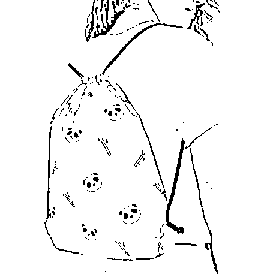

 

 

**②PS**作图

在免费的图片网站上（  https://pixabay.com/）找个鹦鹉的图。下载之后一定要用英文名字命名好，如下图。

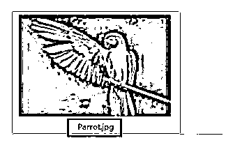

之后，把图片上传到分销平台用系统合成产品详情图。

 

 

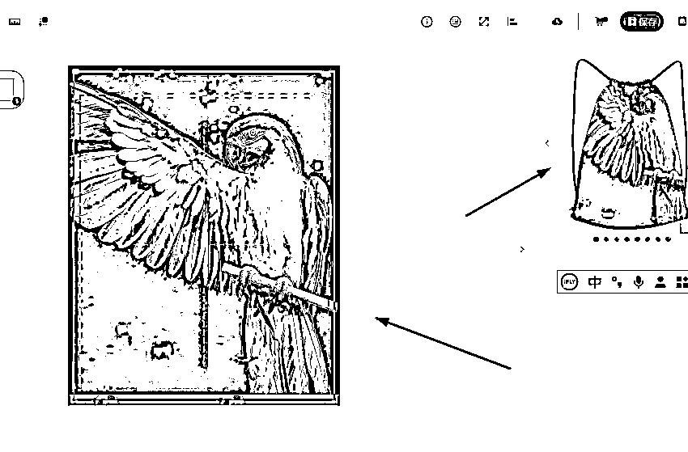

保存之后，抽绳的主图和详情图就合成好了。

 

 

**③**写产品文案（**listing**）

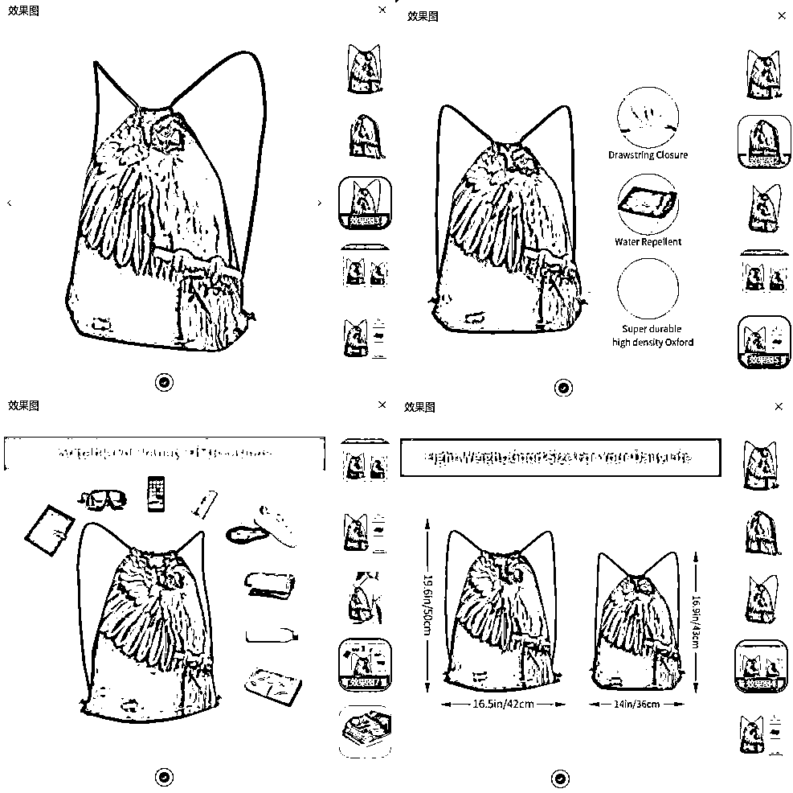

根据这个抽绳背包的特性写产品的文案（listing），这里我就不赘述怎么写了，下一部分的运营会具体讲清楚。

写完是导入到分销平台的后台，以便无限次使用。

 

 

**④**批量上架产品到亚马逊

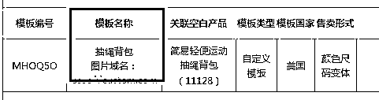 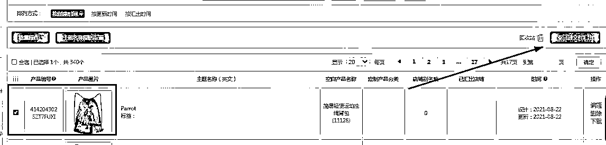 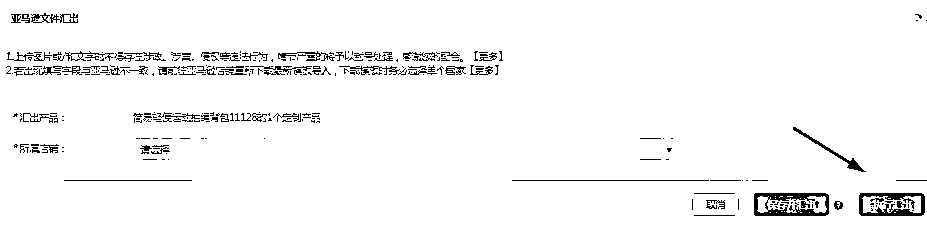

产品汇出的文件直接在亚马逊后台批量上传。

 

 

**⑤**适当自动广告跑单

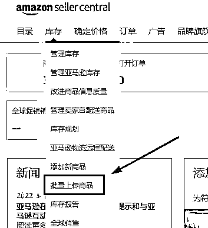

 

 

**⑥**根据反馈优化作图和文案

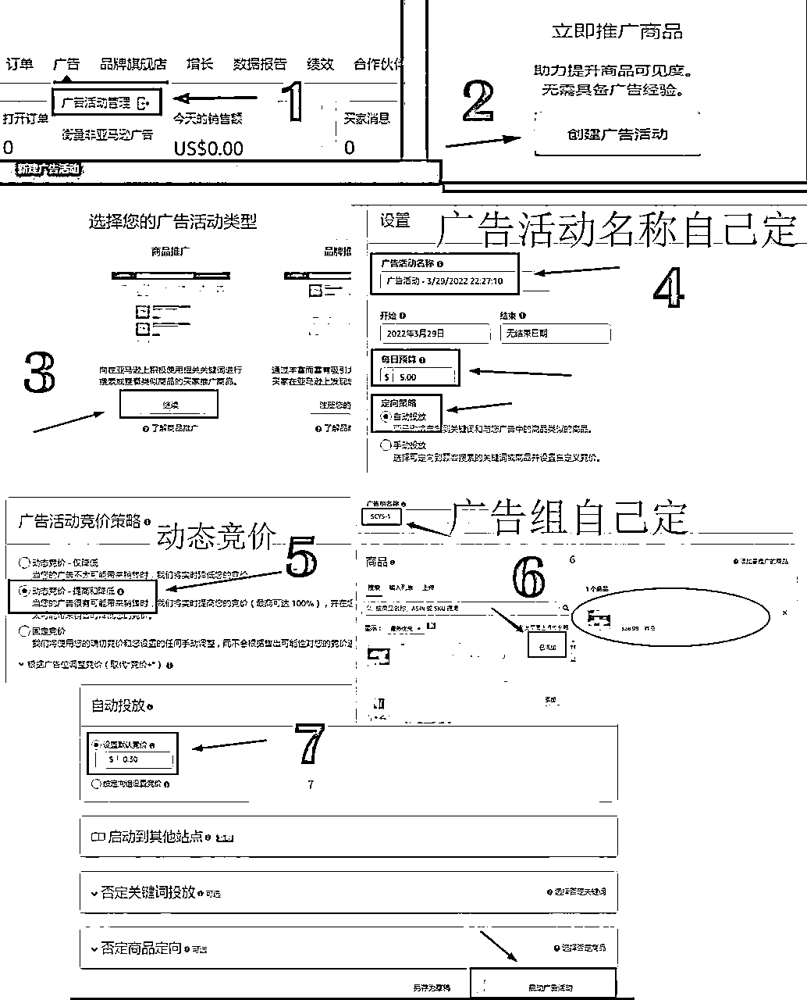

开的是自动广告，测试数据，一方面看顾客会点击什么类型的图案，一方面出单活跃店铺。

 

 

这个运营部分会细讲。

**2. **如何运营（分点讲解如何做）** **

**1**）选品** **

既然要批量做，前期就需要有批量上架的工具。

目前福建省内的平台：柔性定制德谱家、史努比定制供应链、厦门飞飞鱼、指纹定制、SDS 定制选品。

这几个平台上的产品涵盖了季节性产品、日常家居用品、箱包皮具、汽车用品、户外用品、宠物用品、  节日用品，还有服装和电子产品配件等等，有超过 700+ 的产品供选择。

那么这么多产品，要选什么呢？

虽然说平台产品有很多，但是也要看情况去做，才能事半功倍。如果实在不想选品，就先选定一个类目，在分销平台有这些类目的产品做一遍，做得多了也照样出单。

**a. **趋势选品** **

①关注热点突发事件

 

 

这里举的例子是 2020 年的疫情爆发，国外的口罩需求猛增。我们先来看下谷歌趋势上口罩的搜索量。

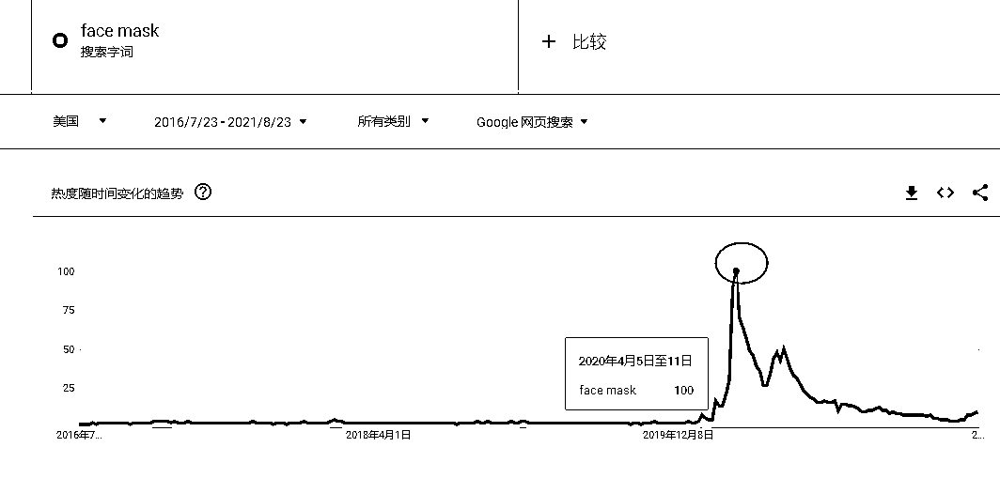

可以看出 2016 年 7 月到 2019 年 12 月，口罩的搜索量还是和往常一样，2020 年因为疫情的爆发而猛增，到 2020 年 4 月份达到了历年峰值。

口罩的需求暴增，那么这个时候，你去做平台上的口罩就肯定比去做其他产品的单量多。

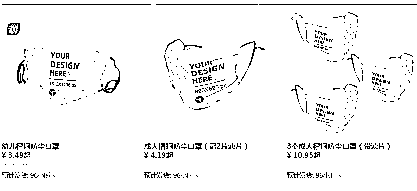

 

 

那么再给口罩加上有趣的图案，满足他们买到有趣口罩的需求。

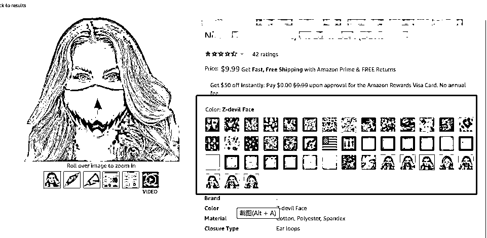

②时刻去观察亚马逊新品榜单的动向

新品榜单如果有突然卖得好的产品，同时分销平台有这个类似的产品，那就可以去做。

比如之前在新品榜单发现一款骑行面罩，也称作百变头巾。

 

 

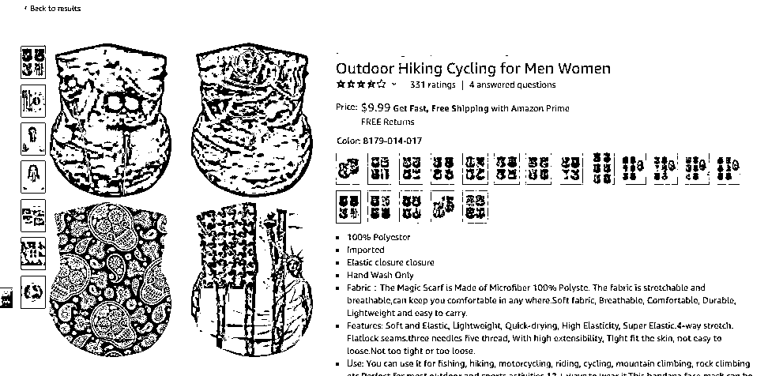 

同时再去谷歌上搜索一下看一下它的趋势是怎么样的？

 

 

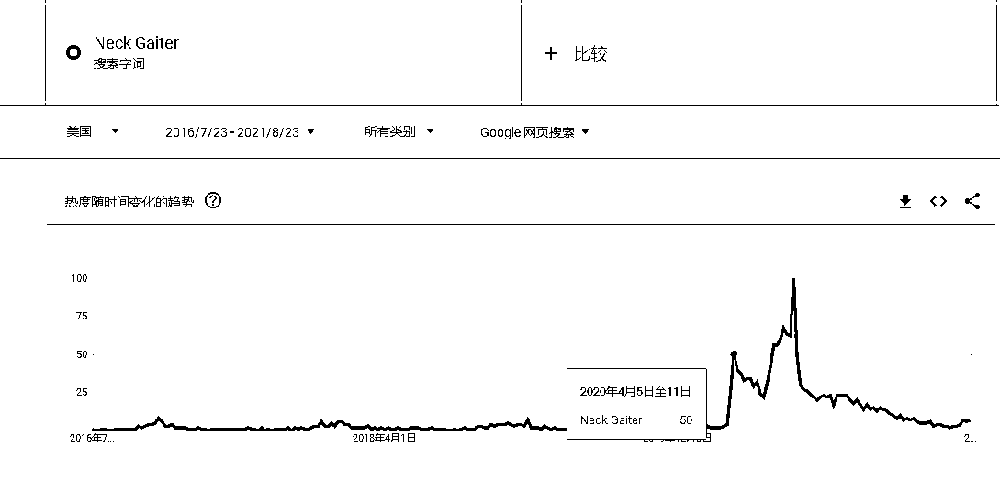

这个百变头巾在 2020 年 4 月份的时候也突然增长了，几乎是和口罩同时暴增的。

即使我们知道的比较晚一点，5 月份开始做也是来得及的，而且外国人还不大喜欢戴口罩，这个销量一直不错。

最后再看下分销平台有没有，有的话，立马设计上架亚马逊。

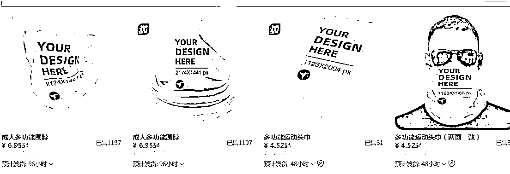

总结：

①关注热点时事，再结合谷歌趋势发现商机。

 

 

②关注亚马逊新品榜单，看到卖得好同时分销平台也有点产品，3天之内立马上架亚马逊。

③举一反三：疫情的时候，在家的时间比较长，我们可以做一些家居产品，例如围裙，烘培手套等等

基本上你能想到的一些日常需求大的产品，分销平台里都有，选择性的去做。

**b. **特定季节性产品** **

季节性产品比较简单，比如说在夏天的时候卖比基尼、泳帽和沙滩裤，冬天卖卫衣和圣诞节的产品。

看下最近 5 年的比基尼的谷歌趋势：

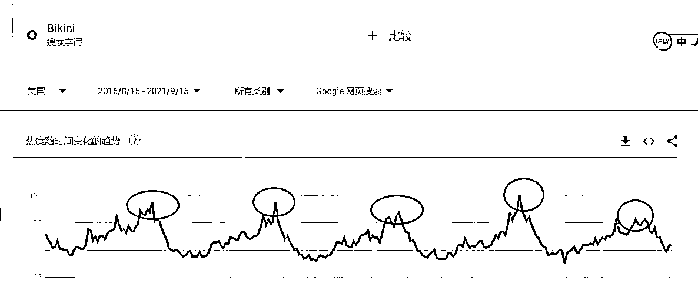

比基尼每年的 6-7 月的趋势都是达到最高点。

想象着在沙滩上穿着一件独一无二的比基尼，然后美国人又是比较喜欢张扬个性的。

 

 

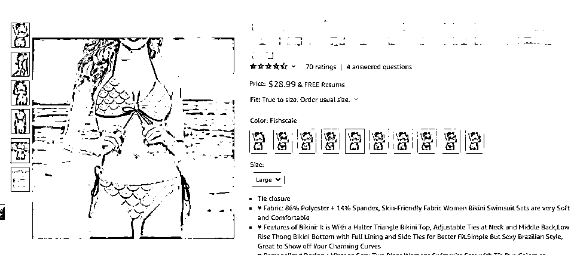 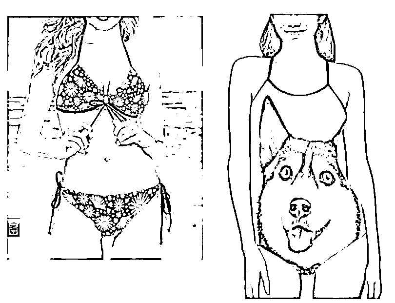

这些有特色的比基尼卖和同行之间就拉开了差异。

对于特定季节的产品还是比较容易发现的，平台也会给你分类。

 

 

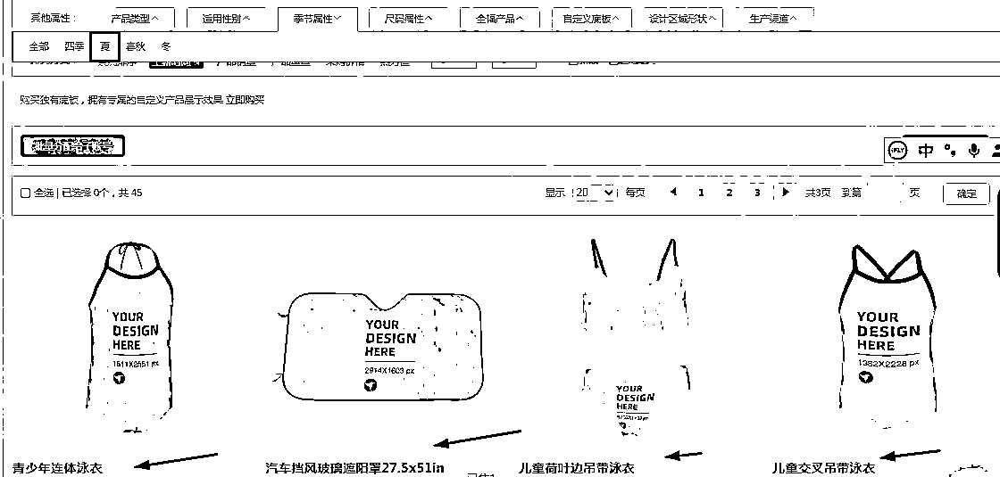

总结：特定季节的产品，在特定季节的前一个月就要开始找相关图片，上链接。

**c. **四季产品** **

四季产品，就是四季通用的产品，这个用生活常识来选择，我们主要的差异化就是图案。

还有就是一些家居类的产品，比如地垫、浴帘、抱枕套、马克杯、帆布画等等，这里我就直接举一些常见的产品：棒球帽，老外喜欢戴帽子。

 

 

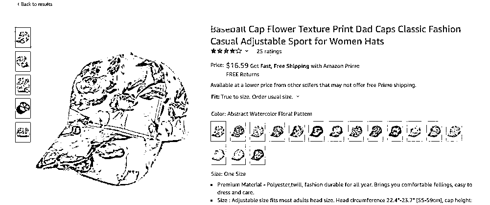 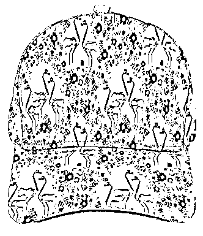

这个帽子上印的上火烈鸟

 

 

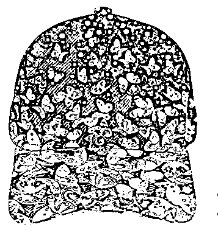

这个帽子上印的上蝴蝶

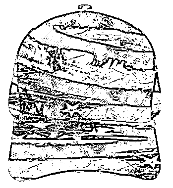

这个帽子上印的是有设计感的国旗

**d. **选品总结** **

 

 

虽然平台提供了 700-900 款产品，但是不同的时间段是侧重不同的产品上架。

一年四季都可以卖的产品是长线（细水长流），比如水杯、浴帘、窗帘等等。

季节性的产品是短线（提前一定的时间布局），夏天沙滩裤，冬天卫衣。

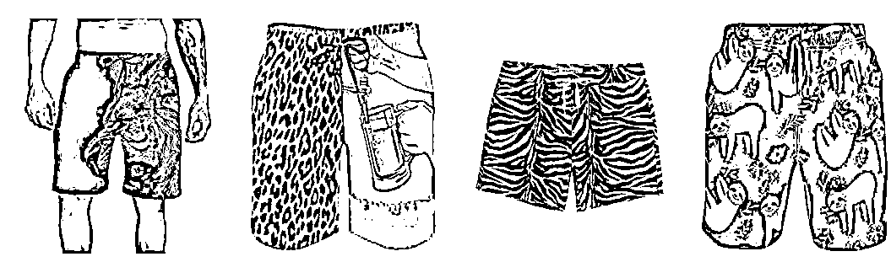

热点相关的产品是辅助（上架要快），比如最近他们各种设计 WKL 国旗上架到亚马逊上就卖得很快。

 

 

**2**）作图（重点）** **

**a. **分析和预判亚马逊上热卖图案

图案分为季节性的和非季节性的热点图案。

❤季节性图案

比如：圣·帕特里克节、母亲节、父亲节、万圣节、感恩节、圣诞节等等。你设计产品上的图案如果能对应节日氛围，那就比较容易卖。

圣·帕特里克节

 

 

母亲节和父亲节

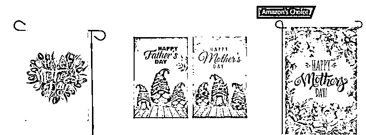

万圣节

 

 

感恩节

圣诞节

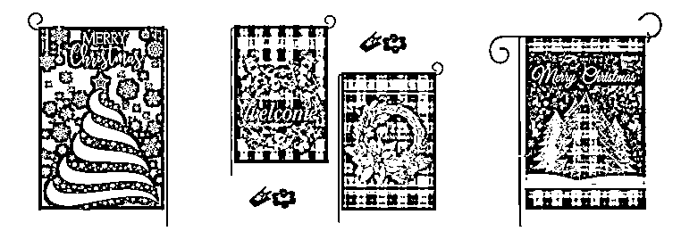

❤季节性图案

怎么看一个主题图案是否是热卖的？看这个主题是否在各个产品上面都可以卖，而且评论还不少。

 

 

比如在亚马逊上搜索向日葵这个主题：向日葵主题相关图案设计在花园旗上有卖且有评论。

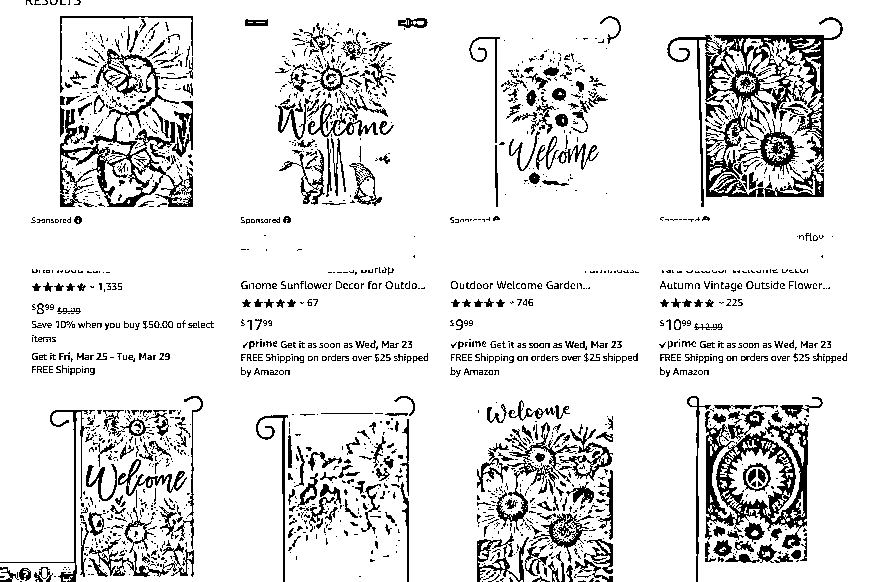

向日葵主题相关图案设计在毛毯上有卖且有评论。

 

 

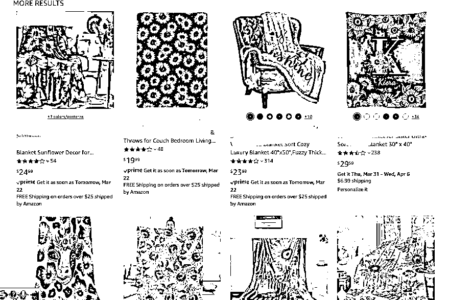

向日葵主题相关图案设计在手机壳上有卖且有评论。

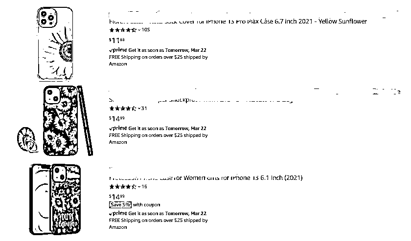

 

 

在亚马逊上找了好几个带向日葵图案的产品都有卖，而且卖得还不错，那么这个向日葵大概率就是一个他们喜欢的图案。

总结下来，就是找竞争对手什么卖得好，对手就是最好的老师。

接下来就是错开竞争，我们要模仿他们，并且做得跟他们不一样的图案。一来防止图片有版权，二来防止被恶意投诉。

**b. **找元素模仿作图（举例向日葵）** **

找到一个对标图案

拆解找素材：海龟 + 向日葵 + 背景。

 

 

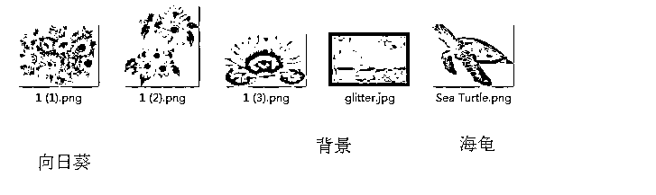

找图的网站：谷歌找图  https://www.google.com

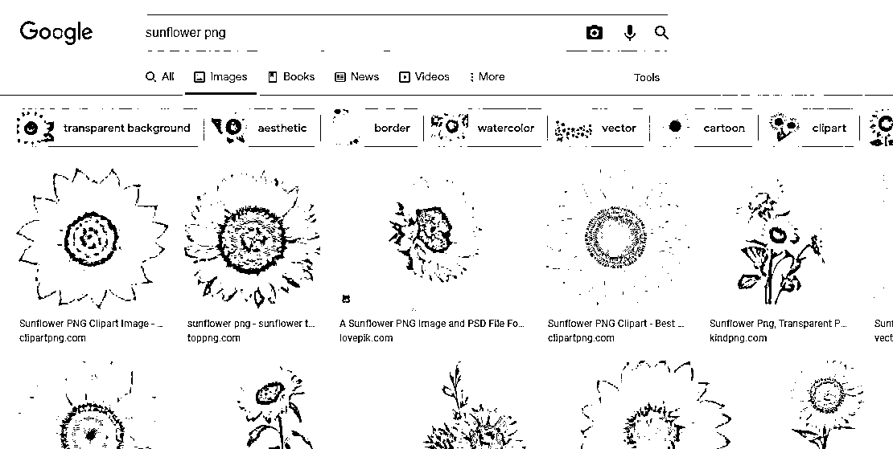

 

 

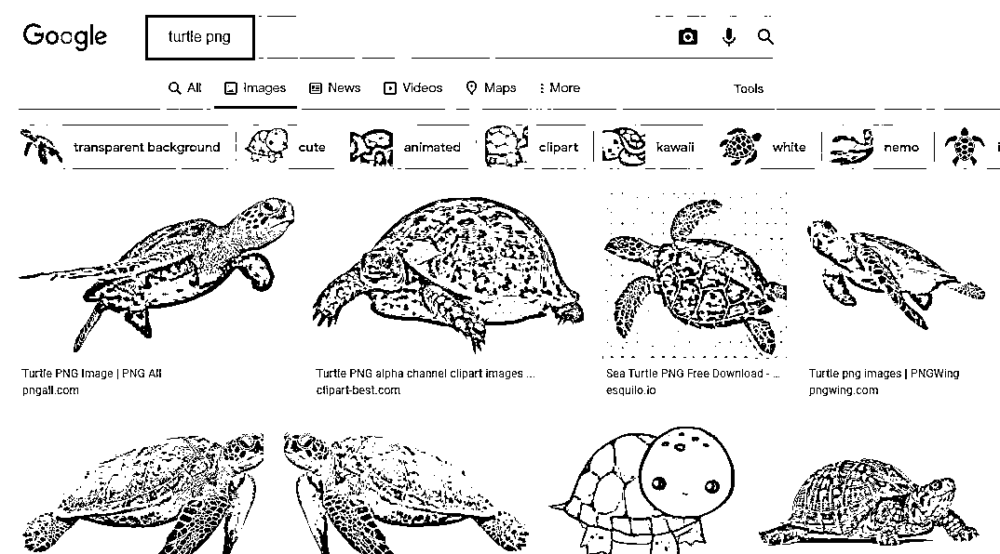

英文单词后面加个 PNG，找出来的图片上透明底的图片，比较好处理。同时还可以点击谷歌搜索到图案的网站，点击进去看是否好用。

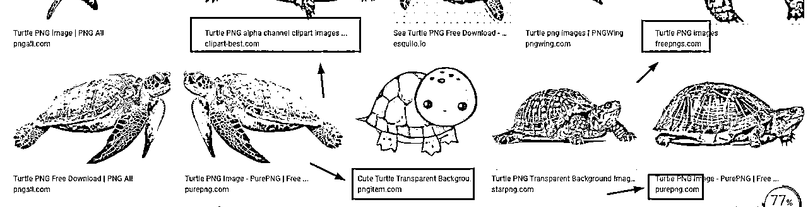

用 PS 软件制作新的图片。

 

 

研究热卖图案的要点是：一个主题图案在亚马逊上多款产品都可以卖，那么这个就是相对比较热门的图案，我们去找相关的图案，模仿作图。

当然模仿是为了一个好的开局，后期做图片，可以找美工合作或者自己网上自学 PS 的相关教程，制作美国人喜爱且有创意和新奇的图片。

初期对自己要求严格一点，一天做 10 张图，后面出单多了，根据出单的风格，做出自己风格的图片，那个时候就可以精做。

**3**）写产品文案（**listing**）模板，批量上架产品** **

 

 

产品文案（listing）= 标题 + 五点 + 长描述

引用生财里很多人提到过的一句话：竞争对手永远是最好的老师。

这里举例子写毛毯的产品文案，找 20 个毛毯的链接，复制到 Excel 表格里，分析他们的产品文案是怎么写的。

对于小白，一定要耐心来基本功。

这里简单提一些基本的产品文案写法：

❤标题的格式：

主题图名称+核心词+衍生词+属性+功能+使用范围。根据差品的属性调整，复制 20 个标题到 Excel 里拆解分析。

 

 

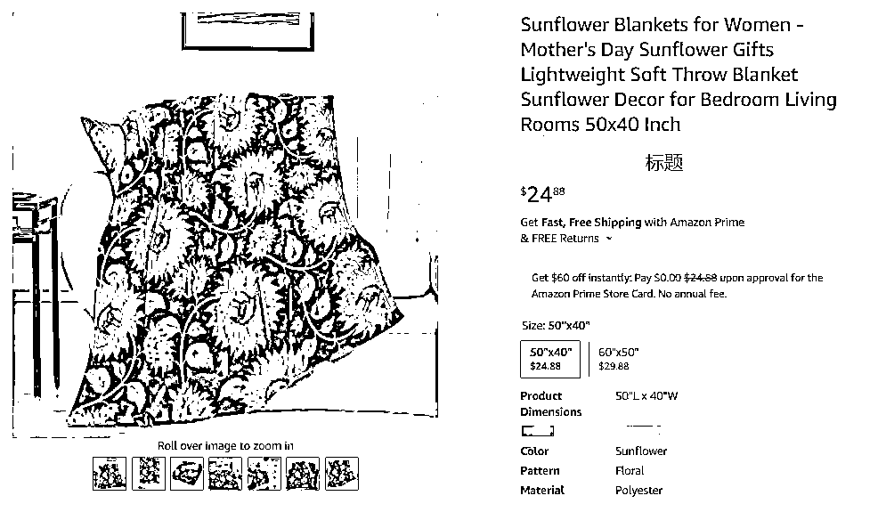

❤五点描述：简单明了，写明特点

第一点写差品材质；

第二点写产品尺寸；

第三写产品的特点和优点；

第四点写产品适合当礼物；

第五点写服务或者洗涤注意事项。

 

 

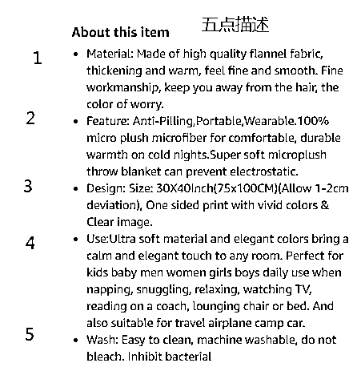

❤长描述：适当补充说明产品

产品细节、应用场景、当作礼物、洗涤说明。

 

 

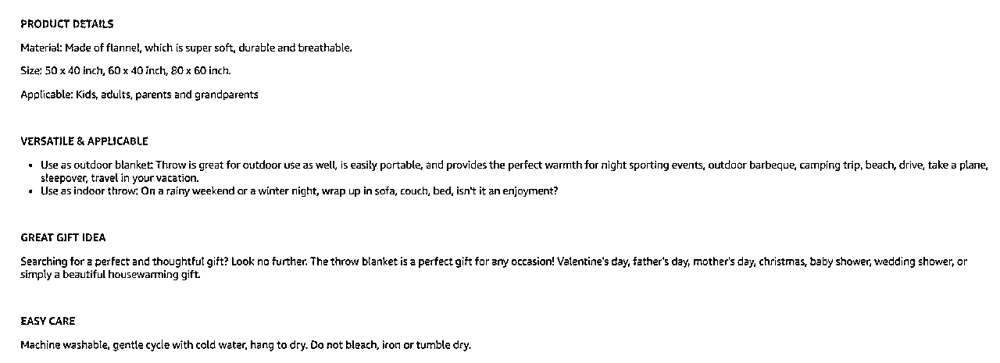

这个亚马逊 POD 模式，文案写得简洁明了，基本是可以卖的，当然也可以尝试写得比较长。

核心是图案，之前有测试过，产品文案写得很简单，也是会出单的，主要是图案要好且受众广。

**4**）适当自动广告跑出单** **

首先要清楚，广告商奔着出单去的还是为了辅助出单。

这个模式不是亚马逊精品 FBA 模式，做精品模式对广告的要求比较高。

亚马逊 POD 精铺模式，广告是为了活跃店铺，起初开自动广告，跑出什么图案比较好卖，再去重点研究。

目前测试过这个亚马逊自发货广告的订单不是很好，但是可以带动自然流量的订单。

 

 

二、新手入门准备

**1. **简单认识英语和完全不会英语的人（前期需要付出更多的努力）** **

亚马逊产品用到的单词都不会太难，但是语言的习惯不同，一个产品可以用不同单词来表示（可能一个产品可以用两三个不同的单词表示）。

这个时候需要你耐心的去研究同类产品的标题是怎么写的，学会把产品的主词找出来，新手最少看一个产品的** 20 **个不同链接是怎么写的，拆解出来，重新组合。

对于亚马逊产品文案，新手要是英语基础薄弱，尺码、材质、特点写清楚即可，不要用太复杂的词汇。

**2. **会简单的** PS **，后期需要慢慢打磨进阶（或者找美工合作）** **

如果是要自己一整个流程做下来的话，需要会简单的 PS，起码有些图会有水印，要简单的去掉，然后去拼接图片。

当然也可以找个认识的美工合作，或者找个在校大学生兼职给你作图，你就负责写产品文案和设计并批量上架产品到亚马逊。

**3. **注册亚马逊店铺（亚马逊官方注册流程）** **

亚马逊官方的文档还是很详细，这个链接是多站点注册的流程：

（https://gs.amazon.cn/sign-up）

 

 

这是北美站的注册流程：

（https://gs.amazon.cn/north-america?ref=as_cn_ags_signup_na）三、过程中有什么需要注意的地方** **

**1. **心态要沉得住气** **

这个自发货的亚马逊 POD 模式成本比较小，主要成本是亚马逊店铺每个月 39.99 的美金+你的时间。

所以时间就花得比较多，快的话一个月出单，慢的话 2 个月，第三个月开始慢慢赚钱。

前三个月一天要按照 10 张图的数量来要求自己，后面出单了就不用做那么多图，转变为精做图。

小白尤其要有耐心，因为是主要是做这个的，所有业余时间去做的话，是重复上班的内容，相对来说阻力会比较小。对于新手可以找美工合作，你找图给他做，然后你去批量上架到亚马逊店铺，运营出单。

**2. **亚马逊平台规则的变动** **

众所周知，亚马逊这两年封号比以前多，所以还是建议自己有资料去注册店铺，这样下来的店铺比较稳。

 

 

**3. **规避侵权** **

第一类：

热门电影，比如漫威系列，你会发现是有不少人在做，可能一两个月不会抓，又出单很好，但是亚马逊可能会秋后算账的，要看你的承受能力。

第二类：

热点，可能会有人去注册商标，所以做的时候，一段时间后要及时下架，不然到时候会面临被人投诉的风险。

第三类：

版权，网上的图片也不好判定是否有版权，这类有版权的图目前也不好查询，尽量自己去找美工合作，买一些素材会员，自己二次创作图片。

四、总结** **

赚钱的模式有很多，选择一个适合自己的相对会比其他人做得更好。

亚马逊 POD 模式这个模式是成本比较低，比较容易入门的一个模式，介于精品和泛铺之间，相当于精铺。

个人要做的话，需要耐心点。团队的话，因为人比较多，测试的数据会比较快。

 

 

目录：

如果有什么疑问，可以在评论区留言，我会整理起来一起回答。

感谢生财团队，他们的耐心打磨也让我受益良多，大家选择适合自己的模式一起生财有术。

评论区：

黎昕 : 感谢分享  请问这种从下单到客户收货要几天呢

亦行 : ①普通快递大概20天左右；

②如果用加急的DHL大概是10天。

黎昕 : 后台需要设置物流方式吗  这两种物流价格应该差的蛮多的

风帆 : 收藏了，感谢分享[抱拳]

何勇刚KH : 差点看成亦仁了[偷笑]

亦行 : 一起生财有术[呲牙]

亦行 : 哈哈😄

亦行 : 对，亚马逊后台加急的运费设置30美金以上

# **# ****(**精华帖**)(92**赞**)**怎么通过业余时间靠海淘礼品

# 卡月入** 2 **万**+**

作者：  七幺幺

日期：2022-01-21

大家好，我是七幺幺  ，主业在经营一家剧本店，因为经常给女朋友买东西  ，而接触到海淘这个领域，后来随着身边人的代购需求越来越高，开始了自己的海淘代购生涯。一张礼品卡到手 5.6 折，也就是说，100 刀的礼品卡，有 44 刀的利润，我靠着海淘副业，实现了月入 2w+。因此，我今天就想来跟大家分享一下，这个海淘项目从引流获客到变现的整个过程，希望能给大家带来帮助。

 

 

1\. 海淘礼品卡项目介绍

2\. 如何引流获客？

3\. 变现模式及利润空间

4\. 普通人入场还有哪些机会？

**—01—**

海淘礼品卡项目介绍

为什么要海淘买东西？

首先说说为什么很多国外品牌很贵。国外的产品进到中国是需要交关税的，就简单讲增值税就有 17%，不同品类不一样，这里就有很大的提价。再加上国际汇率，基本上价格就很高了。

其实最最主要的原因是代理的加价，一层层的加，每个都要分点，价格就直接上去了。

海淘便宜的两个原因是优惠和免税转运。为什么很多大的海淘代购能拿到很便宜的货，就是他们能够把握优惠活动，将价格到最低。很多品牌点都会有一些优惠活动，经常会有 7-8 折的优惠，还会送其他正品或小样。美国转运的话还有些免税路线，运费也就 50 多 500g，打折后比国内买便宜超级多。

 

 

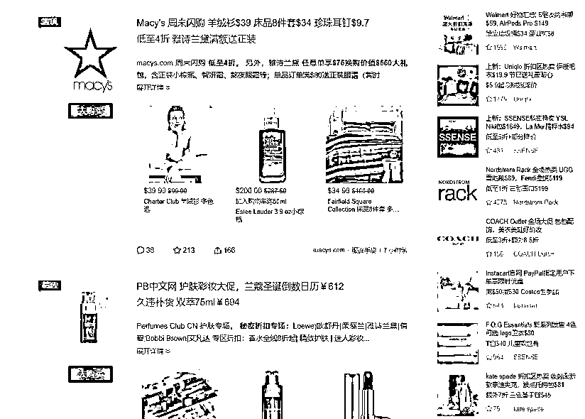

（dealmoon 打折线报）

所以当时在大学的时候就经常帮身边的朋友海淘买些东西，养养信用卡，后来需求越来越大的时候开始做海淘代购卖货，海淘正常周期在两周左右。

 

 

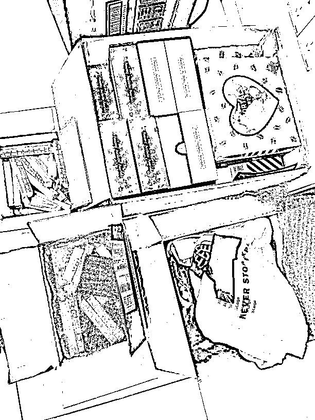

 

 

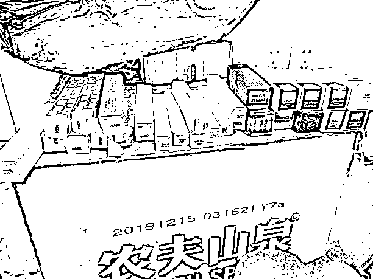 

 

 

**—02—**

如何引流获客

**1**、引流平台

1）小红书，微博

第一块就是小红书微博发一些引流广告和文案，这个私域流量引流有很多大咖分享，我就不多赘述了。前期文案主要以海淘拼单为主。

 

 

 

 

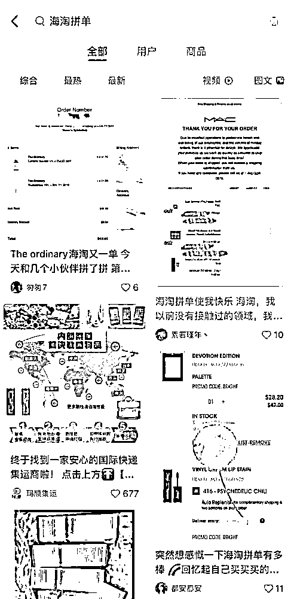

2）学校平台

学校平台是我当时做校园美团的时候，沉淀的学生消费群体。

通过微信公众号推送，做抽奖活动。

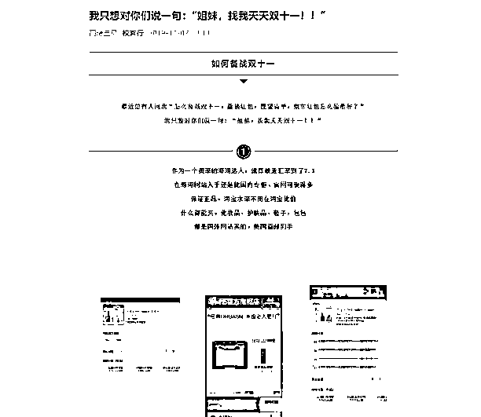

 

 

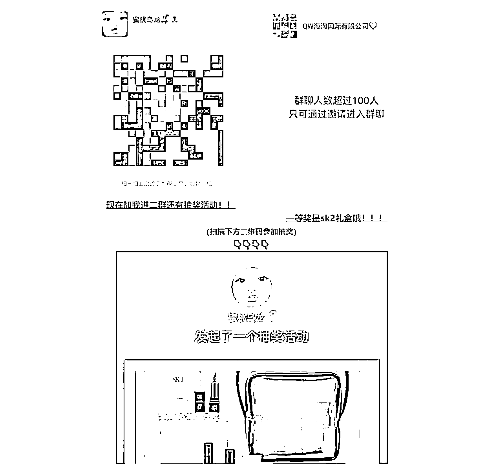

学校平台这块再加一个，就是电商下单社群。社群里的好多兄弟姐妹们可能都抢过茅台，可能一个人用十几个手机去操作。

沉淀学生的好处就是，可以找学生去帮忙抢货，一是因为他们生活费不够垫付，二是跑不掉，不会拿着垫付金跑路。所以就每到电商大促，做果农、纪念币、大益茶项目。

 

 

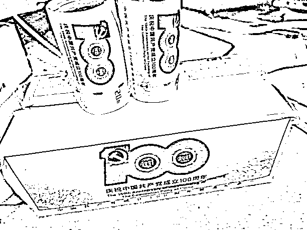

 

 

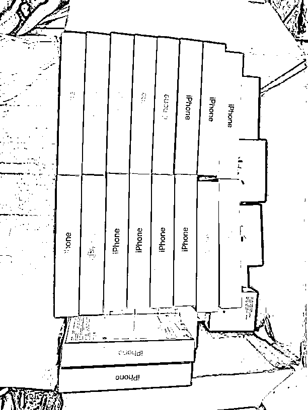

**2**、引流活动

 

 

1）朋友圈发广告，微信群开团

引流到微信好友，然后下过单的进行拉群（做老顾客维护福利），朋友圈和群消息多次触达，发广告，什么有活动发什么。

朋友圈广告怎么发，一般来说两种文案：

第一，直接复制粘贴同行的广告。

这一点的操作逻辑就很简单了，在小红书或者微博加到一些代购，直接复制文案，看一下自己下单多少钱，改价就好。

第二，海淘选品。

根据近期海外热门活动或者节日，发产品，图片可以从小红书保存（带介绍）。

三行文字模板攻略：

 

 

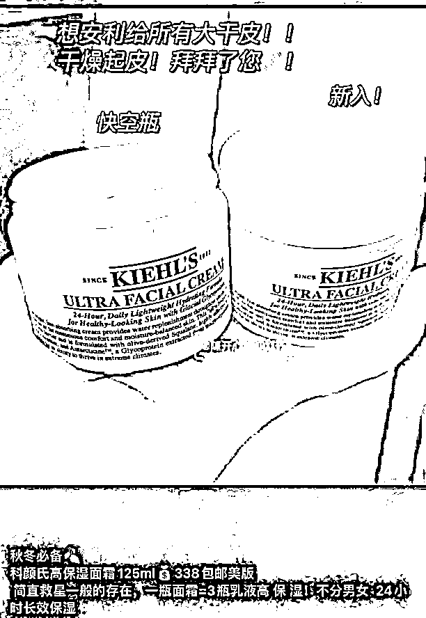

 

 

 

 

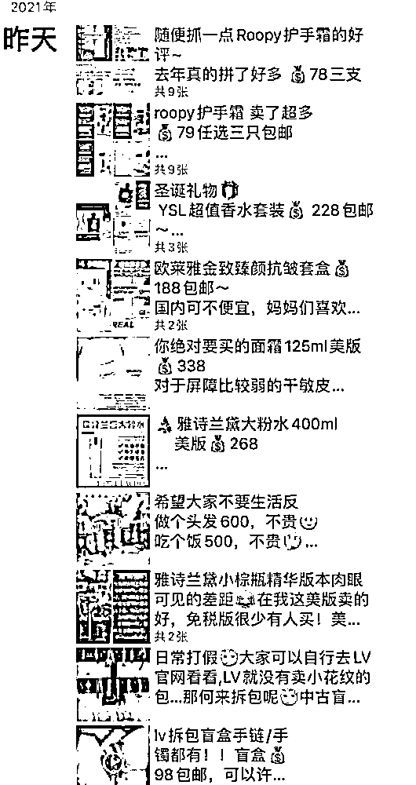

然后用拼团小程序接单。

2）与快递点，美甲店合作，分点

我们除了去市场截流消费群体，还会把眼光瞄准到市场上消费群体高度同质化的门店。

美甲店就是其中之一，赞助活动加 vx，发展美甲店店员成代理。也是微信抽奖扩列思路。

 

 

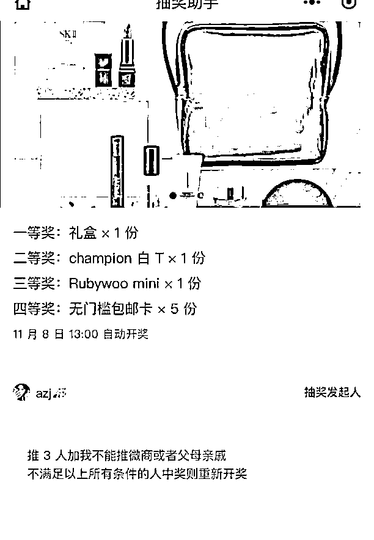

 

 

为什么这里强调和快递点合作，因为发快递价格真的很高，跟快递点合作放个展架宣传，然后谈个微商发货价，也算是盈利了。

**—03—**

变现模式及对应的利润空间

**1**、海淘官网下单，国际转运

这个是最常规的下单方式，不用找上游。

步骤一：买什么先上 dealmoon 搜，找最划算的电商平台打折。

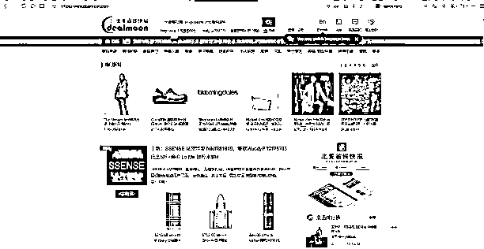

 

 

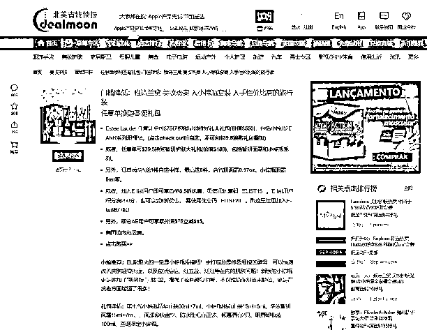

怎么实现盈利？

第一，礼品卡汇率差。

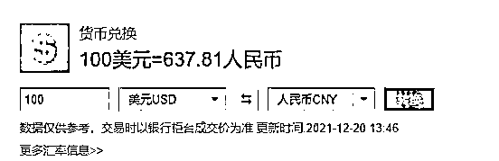

100 刀的礼品卡大概只有 450r 左右，礼品卡折扣大概是 7 折左右。

 

 

第二，礼卡优惠。

虽然礼卡面额和现金等值，但是也可以在活动期间用优惠价买到划算的礼品卡，比如  ebay 或者专营礼卡的网站就有满 $100 立减 $20，满 $50 送 $10，或者全场 9 折的活动，这样就已经有折扣了。

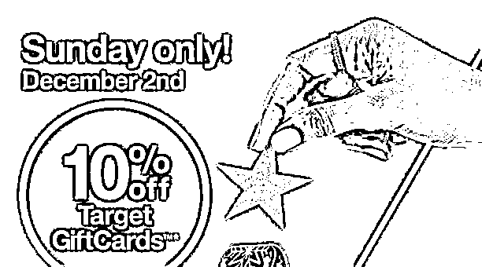

7 折上再打 8 折，到手 5.6 折。

既然礼卡这么好用，要怎么购买？

1）paxful 平台交易（国外交易 - 加密货币）

 

 

2）闲鱼找卡（国内卡商）

 

 

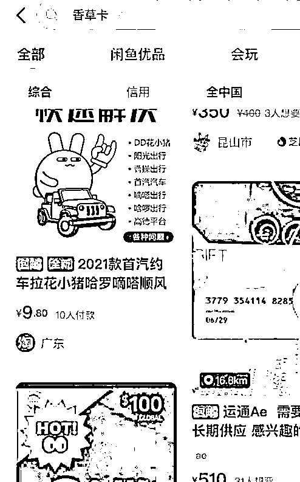

3）电商平台买卡

淘宝

 

 

 

 

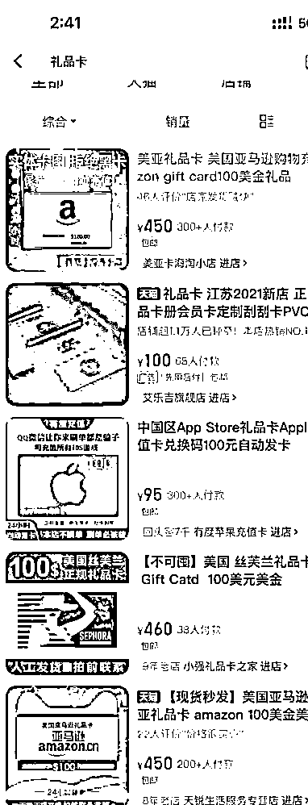

 

 

**Amazon**

首选亚马逊，安全有保障。在亚马逊，能买到来自各个领域商家的礼卡，经常会推出优惠活动，比如满 $100 立减 $20，变相 8 折优惠；或者满 $100 送 $10 等，都是很值得囤的；

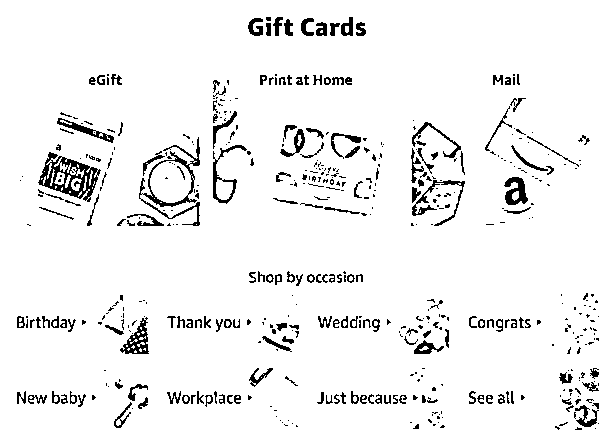

**eBay**

eBay 上聚集的礼卡种类，几乎算是全网最多的了，各种零售商、餐饮、美妆，还有航空公司、商场等都有。相比亚马逊，eBay 除了官方经营的礼卡外，也有二手礼卡卖，但是价格层次不齐，需要仔细筛选哦～

 

 

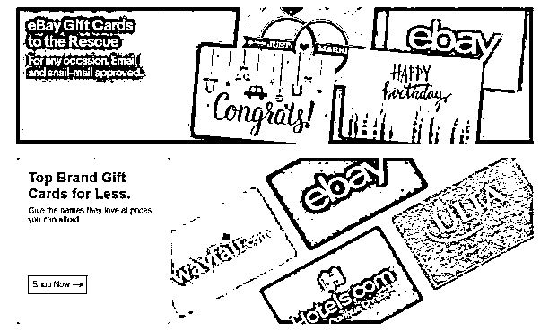

**Groupon**

类似于国内的美团，但是 Groupon 的优惠真的又好又便宜，经常刷一刷就停不下来了…… 他们线下的优惠更多一点，美容美发、健身、spa、旅游等等，线上的也有，大多是超市，不太适合海淘党，不过价格真心划算！

各商家官网

国外的商家真的很爱礼卡，随便一翻，几乎都会有自己的礼卡页面，可以选择面额，虚拟卡和实体邮寄卡都有，线下线上都能用，也是很方便了。

查看详情就去各商家官网。

 

 

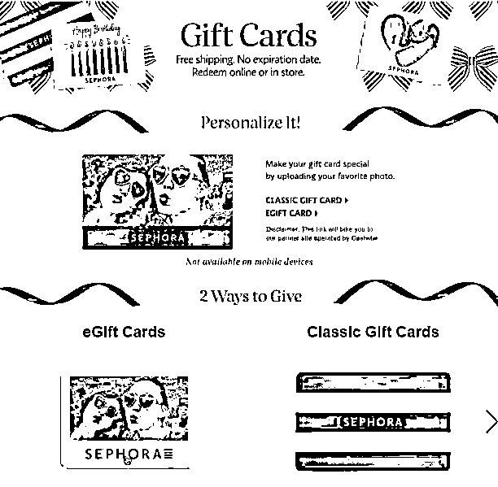

4）返利网站，这是很重要的一部分

和国内电商平台一样，国外购买商品也是可以返利的。

5）信用卡返利

 

 

招行等银行，针对海淘用户，不时会推出特定网站消费返 li 的活动，比如境外线上消费返 | 现 5% 之类的，配合这样的优惠，再利用组合立萍礼品卡的消费模式，一顿神操作，不用盘都很嗨～

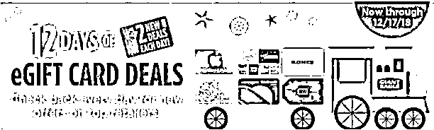

线上的虚拟礼卡几乎没有时间限制，但是使用上有部分门槛，比如部分商家的打折商品不能使用等，如果使用上有问题，可以翻看一下使用规则，或者直接问客服～

步骤二：套用上面的优惠方式下单。

 

 

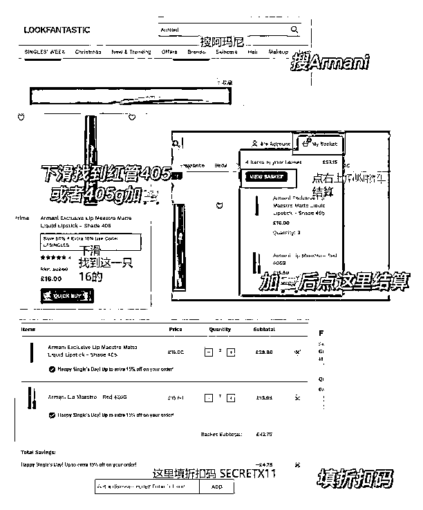

步骤三：很多购物网站的不能直邮中国，这样我们就需要一个国外地址。

这些就是国外的转运公司，相当于下单到国外的仓库。

 

 

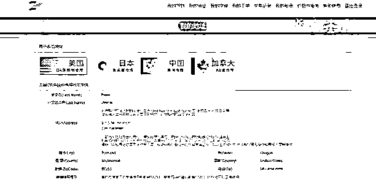

到仓之后再由转运公司寄回国内啦：

 

 

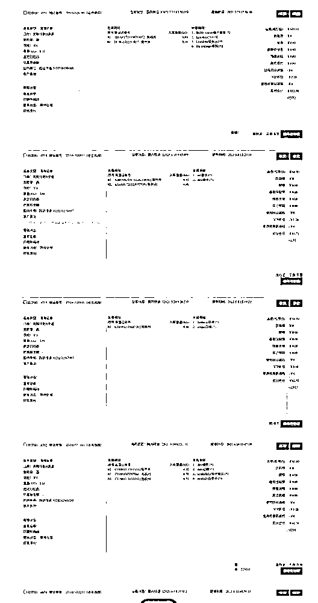

 

 

到货了就是这样的：

 

 

 

 

 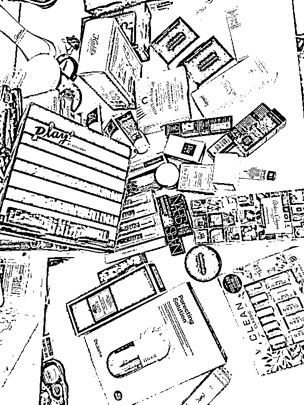

实操就讲当时卖的最多得 airpods pro 和 ipad。

 

 

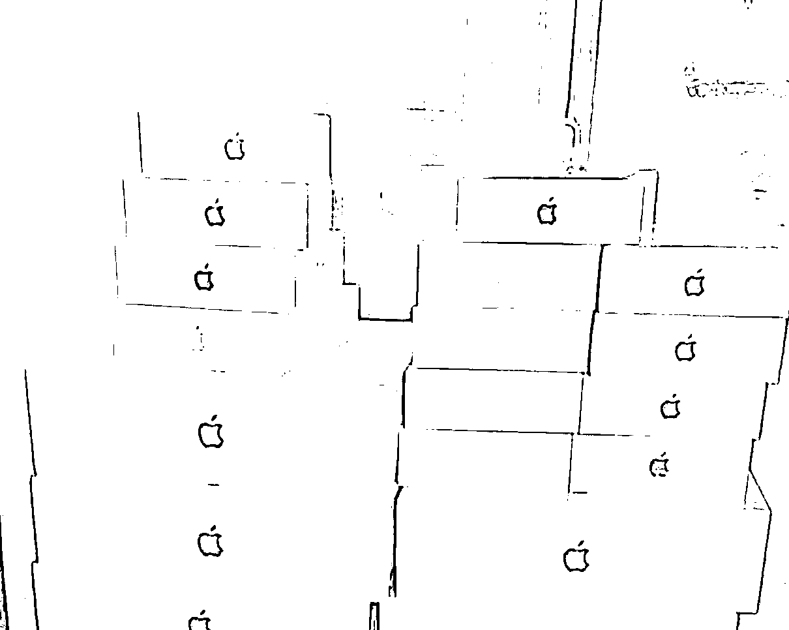

**1**）**airpod pro**

官方是 1999 元，但是属于预定，要等一个月左右，京东商城现货，但是涨价到了  2399。

那亚马逊是多少钱？

249 刀，礼品卡大概是 4.5：1 的汇率购入的，相当于正常汇率的 65 折。

249*4.5=1120 元  ，运费 50，合计 1170 元。

 

 

 

1170 元的 airpodspro，当时随便找点人都可以卖掉，如果没有客源，即便是闲鱼 1800 也很轻松。

 

 

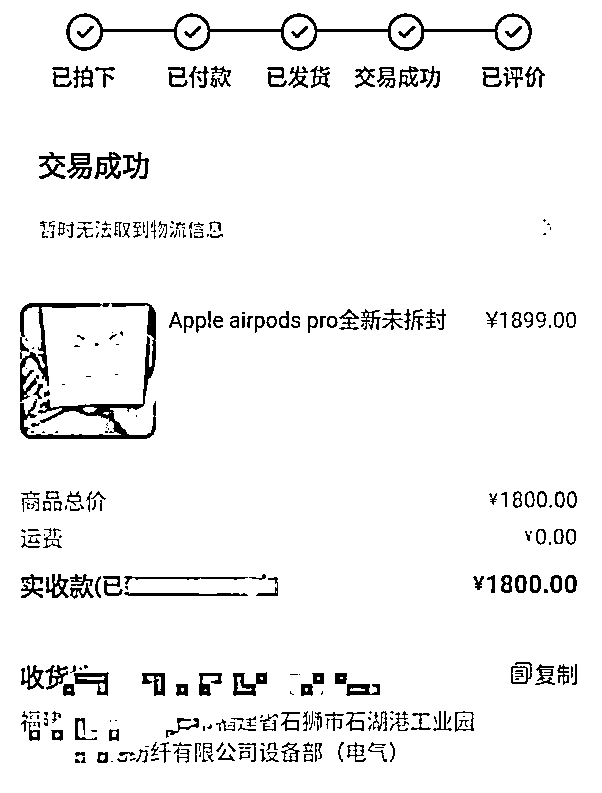

**2**）**ipad**

 

 

这就直接导致 ipad 这个苹果最不畅销的产品，一下子卖断货了。基础款 2499 的 ipad，  直接涨价到 2999，并且有价无市，买不到，估计是平时没什么人买所以备货不多。

那会儿，你只要能联系上苹果实体的直营店，可以正价（学生价 - 200 更好）买到四台（限购）ipad，当天就可以每台 + 500 出掉，非常的疯狂。

那 ipad2019 亚马逊多少钱？也是 249 刀（32GB），综合算下来到手成本在 1500 以内，因为 ipad 运费贵，容易被关税。  但是到国内就能卖 2500-2800。

 

 

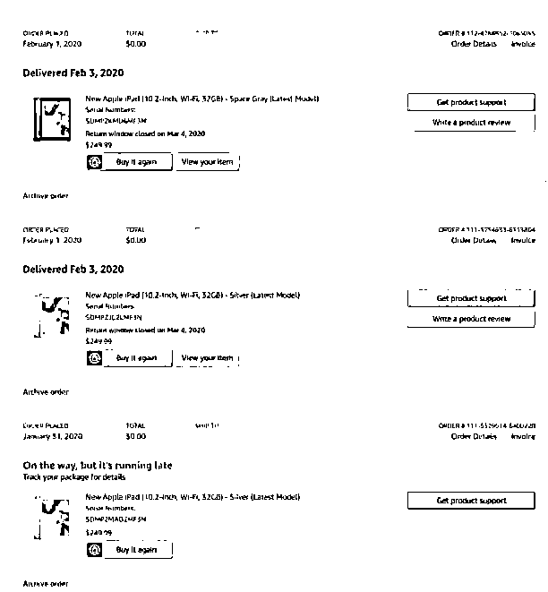

**2**、韩免刷手团

免税店的柜哥柜姐也会有销售指标，所以会给出一点内部折扣给刷手团冲业绩。

 

 

一般我们国内下单，都是联系到这些刷手团，我们下单买货，他去团购。

**3**、国内现货仓，微信开团

国内现货仓是有些大型团队，会在黑五或者一些品牌折扣比较大的时候囤货。建自己的现货仓，但是价格比较高。

 

 

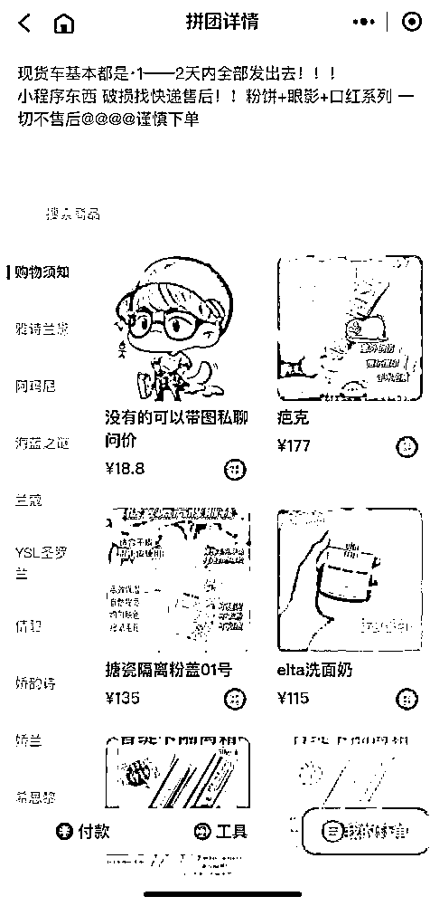

 

 

**—04—**

普通人入场还有哪些机会

市场是一直存在的，因为关税的原因，我们国内购买商品一定是比国外买那些商品更贵的，再加上疫情影响，国内买买买的主力不出去消费了，国外一些折扣会更多更大。

客源除了上述的引流方案里，还有一个可以无客源做的方法 —— 卖毒（得物）。

得物算是个公共交易平台，本来是鞋和服饰。现在大力扶植美妆和奢品，可以无门槛注册个人商家，然后把货通过平台卖出。

 

 

 

 

基本上是闪电入仓鉴别之后，两天就有人付款打款，通过得物提现到银行卡或者支付宝微信。

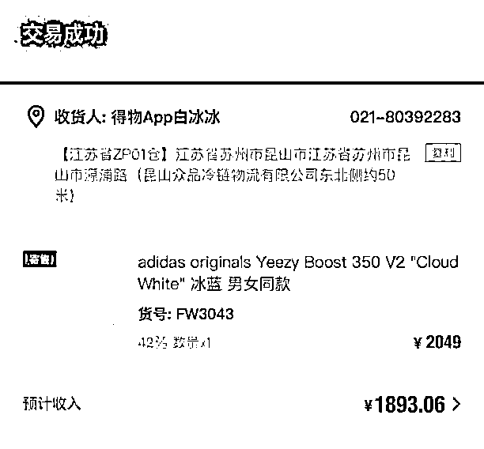

评论区：

 

 

m : 求带飞！

亦仁 : 感谢分享，已加精华。

汪 : 礼品卡在哪买能拿到那么大的汇率差？我看官方买也都是正常汇率差

费柯举-郑州 : 厉害，能搞定亚马逊的都不是一般人。18年在美亚买苹果手表时，淘宝上买了400刀礼品卡，由于支付时误把转运地址设为账单地址，账户直接被冻结，幸亏买的不是黑卡。后来因为自己的执着发传真，发邮件用了一个多月才恢复正常，因为这个事，现在都不敢再买卡购物，太费时间成本了😂

滑翔小仙女 : 借个楼，需尼日利亚代付或当地货币的圈友，有意私聊

James : 加个好友交流下  我有3000个亚马逊买家号

C H T : 吞卡的概率大吗  希望能加个好友交流下

# **# ****(**精华帖**)(71**赞**)**电商小白实操** Amazon **项目** **

# **OA **从** 0.1 **到** 1**，我是如何做到的

作者：  家永

日期：2021-12-28

复盘  案例分享  跨镜电商  亚马逊电商

《电商小白实操Amazon项目OA从0.1到1，我是如何做到的》

写在前面

大家好，我是家永，喜欢实操各种赚钱的项目，今天给大家分享一个我在实操的亚马逊项目，上一篇我有分享过从0到0.1走通了闭环原文。

记得不知道是谁说过的一段话，大概意思是，“难度就是价值所在，个人想提高溢价，只有一条路，想办法变稀缺，做别人想不到，不愿做，做不到，做不好，做不精的事情。”所以这一次分享有如下几点意思：

001

总结沉淀一下我做OA所学的所有技能和我靠OA每个月能有1500元左右的收入，写成了这篇SOP，当然这点收入跟投入的资金有关，我是从TikTok提了1000美金开始起步的，后面也没有投入很多。

 

 

002

如果新手小白想要入门亚马逊，OA是最好的切入点(我至今还这么认为)，根据我这篇文章已经足够了，拿到正反馈是没有问题的，前提还是要靠很强的执行力。

003

通过100多天每天坚持5公里的跑步，我越来越喜欢做难而有价值的事情，比如亚马逊我想挑战一下难而正反馈又慢的精品(且认为是精品，就是要开模的那种)，精品对我这个新手来说难不难，难，我觉得比登天还难，但我愿意去尝试一下，我也能想到有两种结果，1，我真的能做成了，2，我把它做失败了。

因为我之前也有说过新手从OA熟悉平台，最后过度到精品，对品牌出海起到很好的作用。

004

记录一下我在亚马逊上创业的过程，如我是怎么做起来的，或者我是怎么做失败的，也方便给后人提供一些参考。

005

真诚毫无保留分享，希望对有需要的人有用。

这篇文章主要给跟我一样的小白看，对新手非常友好，大卖就请略过吧，望海涵！

全文加起来1万多字还有我录制的选品视频，阅读完估计要30分钟以上，为了更好的阅读体验，以下是飞书文档链接：

https://t.zsxq.com/e2B2rjm https://runqqmrvph.feishu.cn/docs/doccnwbL5WfN7AtVu3HSfGemfuf#

评论区：

Y024 : 永哥yyds，不是在憋龙珠文就是在憋龙珠文路上。[666] 一盘唐僧肉 : 家永哥yyds，不是在憋龙珠文就是在憋龙珠文路上。[666] 范磊 : 家永哥yyds，不是在憋龙珠文就是在憋龙珠文路上。[666] 杨昌 : “ 通过100多天每天坚持5公里的跑步，我越来越喜欢做难而有价值的事情”，家永哥👍👍👍

林勇-广深 : 谢谢家永哥的分享，现在正是需要这个正反馈的时候，感恩笔芯[爱心] miox : 永哥，能加vx具体聊下吗？

亦仁 : 感谢分享，已加精华。

 

 

跨境电商fantas* : 好厉害的分享，逻辑特别清晰，哈哈哈借永哥的分享发个言，我主营亚马逊欧美专线FBA，公司是自己的，坐标深圳，做亚马逊的圈友可以找我发货，我能发的价格都好说毕竟都是圈友，V13923478957[坏笑]

# **# ****(47**赞**)**亚马逊** OA**「保姆级」入门手册

作者：  施小施

日期：2022-11-11

大家好，我是施小施，之前在生财比较少活跃，但是我发了一个关于自己的自我介绍，也在圈子里回答了一些关于亚马逊OA的问题，于是有很多圈友私下问我相关问题。有很多人问的问题都是重复的，所以我就想干脆写一篇文章，来统一回答一下。

其实文章酝酿很久了，但是因为自己文笔太差，所以一直写得比较慢，请了生财里面的几个熟悉的朋友帮忙看过后才敢发出来。这篇文章，只是从事亚马逊OA到现在，积累的一些经验和方法，能帮助大家系统了解亚马逊OA这个项目。如果有问题，欢迎指正。

以下将从几个方面来介绍：

1\. 亚马逊OA到底是什么？怎么赚钱的

2\. 亚马逊OA和亚马逊精品或其他模式有什么不同

3\. OA怎么选品

4\. OA一年可以赚多少

5\. 投入资金要准备多少

6\. 大概多久能赚到钱

7\. 如何解决OA痛点

** **

 

 

以下的文章链接：亚马逊OA“保姆级”入门手册  https://kdocs.cn/l/cbHq2LJwzg5K希望能看完能解决各位的问题~

评论区：

施小施 : 想做OA的圈友看这篇文章就够啦，如果需要我可以提供海外仓帮助大家快速跑通0～1的流程

Rena : 感谢分享，对啥都不懂的萌新来说好友好。。让人简单易懂就是好文笔[呲牙] 施小施 : 谢谢，嘿嘿，最近也在锻炼写作，希望后面有更多能分享的

黎  嘉文 : 想问下新手现在入局亚马逊OA迟不迟？

施小施 : 其实我文章中都写很清楚啦，你应该问清楚，你有多大的决心想做这个项目，很多项目本身没问题，能不能成，要看做事的人。

[害羞]我也今年才入局的呢，我当时也在星球提问怎么把OA做好，现在也成长得挺好的啦～

我开始的想法是：下场做-坚持做。我也没啥过人之处，但是我把报名的训练营里面所有的文章都看完了，每节课听两遍，并做很详细的笔记。最后获得了训练营优秀学员称号，拿了第一名奖学金，图片是我笔记📒仅供参考

黎  嘉文 : 谢谢，回复得很详细，哪里有这类训练营[呲牙][呲牙][呲牙] 施小施 : 可以加我Shiy-31推荐你哈，防止被认为我是打广告

道是无情 : 这个OA是主做美国市场吗？还是说各个站点都能做，具体做多少站点看自己的精力？

# **# ****(47**赞**)**跨境电商复盘：**0 **基础亚马逊铺货创业

# 一年，月销售额** 20W+ **美金

作者：  陈焘

日期：2022-10-08

 

 

大家好，我是陈焘，一名跨境电商创业者，21年7月开始，从0基础开始做亚马逊铺货创业。

这篇文章，在去年21年9月销售额做到10万美金的时候就在酝酿了，当时写了一半，题目叫："0基础电商小白做亚马逊铺货，开店3个月做到月销10万美金，是如何做到的？"，当时无知，觉得自己还挺厉害的。但后来因为一些别的事情，文章就被暂时搁置了

到了22年，业绩开始滞涨，甚至回落，同时随着入行时间越长，觉得自己做的很多地方还是不够好，模式也只是站在巨人的肩膀上去借鉴，没啥值得分享的。直到跟一些圈友交流，发现还是很多人对亚马逊铺货不是很了解，也印证了那句话：你以为人人都知道的，至少还有1亿人不知道。所以决定趁着这个十一，把文章分享出来

考虑到排版问题，另附飞书链接方便阅读：跨境电商复盘：0基础亚马逊铺货创业一年，月销售额20万+美金

# 一、最新业绩，**22**年**9**月销售额：**21.5**

# 万美金

 

 

从下图销售曲线可以看到，整体发展的趋势并不是一路向上，中间还是有不少曲折的。

在21年底的旺季，就一度做到了20万美金，然后开始销售额开始回落，直到5月重回20万，又遭遇了横盘滞涨，直到9月才略有起色

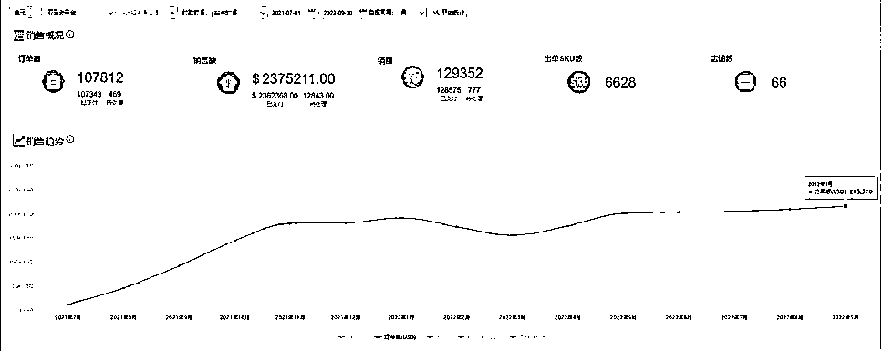

亚马逊平台仅看销售额，会虚高。因为平台的佣金是10-15%，平台FBA配送费占比也在10-20%，还有VAT税费（欧洲）、广告费、仓储费、促销费、退款等，所以平台销售额的回款率一般是在40-50%，再减去商品采购成本和发货费用，才是毛利

举个网上常说的例子：10元人民币的成本商品，卖10美金，回款按50%，5美金即35人民币，减掉采购成本和发货成本（产品重量不同，发货成本不同，暂按5元算），毛利是35-10-5=20元，毛利率也就20/70=28%

亚马逊铺货的毛利率和精品比，又要更低一点。我们的铺货模式，毛利率普遍就是10-20%之间。我们前期目标还是以业绩增长为主，所以定价也是按毛利率10%来定价。所以20万美金的销售额，毛利也就2万美金左右

# 二、亚马逊铺货之路

 

 

# **# ****1**、跨境业务开启原因

为什么一个电商小白，当时会选择做跨境电商，还是当时已经大部分人都看不起的铺货模式？

也是机遇巧合，当时因为一些别的项目，和国内某上市跨境大卖（以下简称Y公司）有了业务往来。他们也正好在孵化分销项目，合作之前深入他们公司学了2个月，了解了他们的铺货运作模式，觉得ok，就和Y公司开始了合作。

分销业务的具体模式就是：Y公司提供系统，我们提供人员和资金，然后按照Y公司内部的运营模式，上架产品进行销售，产品卖出后，由Y公司供应链来进行采购发货**# ****2**、亚马逊铺货解析

# （**1**）亚马逊两种发货模式

为了便于下文讲解，先介绍2种亚马逊发货模式

 

 

1）国内自发货（简称FBM）：

产品出单之后再在国内采购发货，通过国际物流发给客户，一般从用户下单到用户收货，时间一般为10-30天左右。

优点：卖家不用囤货，没有资金的压力；

缺点：客户收货时间较长，一般选择较少；平台流量不倾斜

2）亚马逊物流发货（简称FBA）：

先将产品提前发到亚马逊仓库，产品出单后，由亚马逊物流帮忙配送给客户，然后亚马逊会向卖家收取物流配送费（可参考京东物流配送）

优点：配送速度快，客户优先选择，平台流量倾斜（因为亚马逊能赚到更多的钱，配送费、仓储费、人工处理费、销毁费等）

缺点：需要囤货，有资金压力，且有滞销风险

# （**2**）我们的亚马逊铺货模式

我们的运营模式，就是通过多店铺批量上架FBM商品链接，当某个FBM链接出单达到一定的条件（比如90天内，FBM出2单以上），就会将其转为FBA链接，发货去亚马逊仓库，从而获得更好的流量，出更多的单。

简单来说，就是通过FBM铺货去选品，然后发货去亚马逊做FBA。然后中间的一些运营细节：

 

 

# 类目选择

在铺货产品类目的选择上，会避开3C、服装等红海的类目，选择比如工业，汽配，户外等处于相对蓝海市场的品类，很多靠的都是类目长尾流量。

# 商品链接上架

上架ERP：商品上架有专门的ERP软件，每个sku自带图片和文案，且带侵权排查。侵权排查，对于做跨境铺货，尤其是亚马逊铺货非常重要，因为国外非常注重知识产权，如果不做侵权排查就上架，店铺很容易就侵权，侵权多了店铺也很容易挂掉。

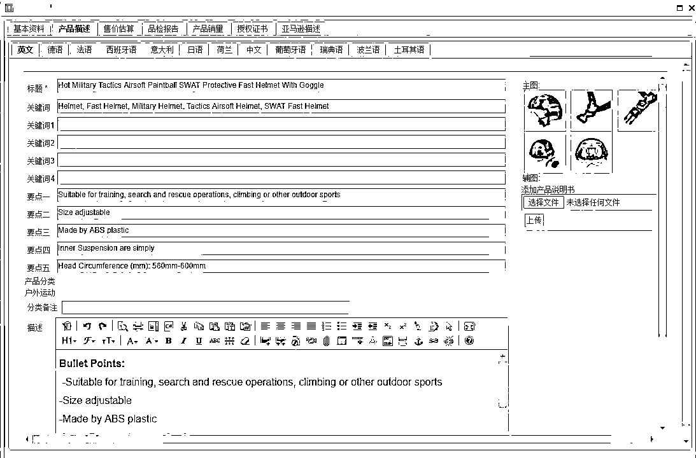

 

 

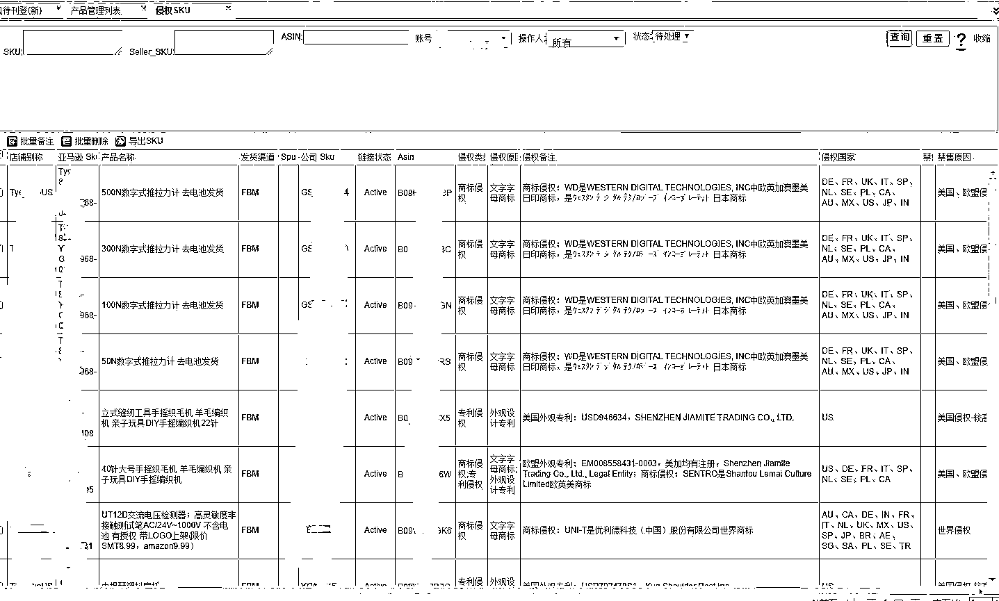

上架模式：因为有ERP，理论上可以做到一键快速批量上架多个站点。（现在我们在做的非亚马逊平台，就是一键上架）但亚马逊平台有查重机制，会合并相同文案，所以上架的时候，每个sku的文案要进行适当的修改优化，避免合并的同时，也可以提高初始链接质量，更好地利用新品流量红利期。

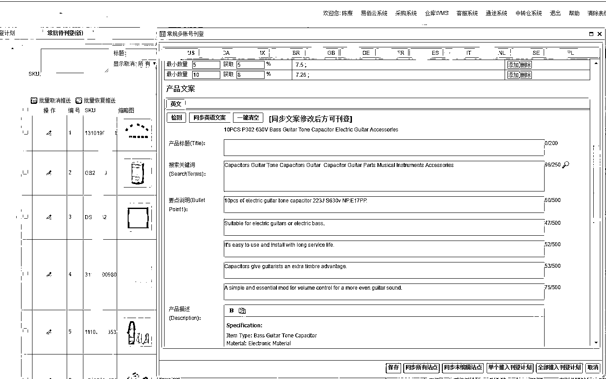

 

 

上架速度：铺货前期，因为没有太多别的工作，每个员工每天上架20-80个sku不等（质量不同，数量要求不同）；后期逐渐稳定在每天8-10个sku

# 上架后运营

FBM链接上架后，会根据以下SOP对链接进行相应动作：

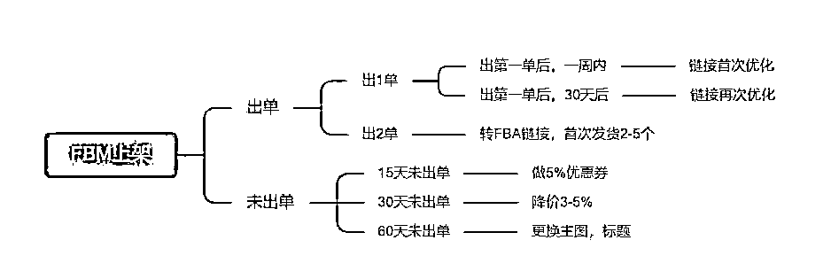

随着商品链接出单数增多，相应转FBA的链接也会越多，当所有FBA链接需要发货的sku个数，其重量能满足空运起始重量的时候（市场上一般是21-23kg，我们一开始也是，后来做到了10kg起重），就会开始备货发到亚马逊仓库。

FBA链接到货后，会根据以下SOP对链接进行相应动作：

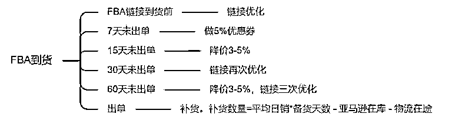

FBA补货的数量，如何计算出准确的数量，是个技术活。

简单的公式就是补货数量=平均日销*备货天数 - 亚马逊在库 - 物流在途。

 

 

但展开来说，平均日销的计算公式如何确定？备货天数根据不同的补货方式（快递，空运，陆运，铁路，海运）也是不一样，当同时存在不同物流的在途库存时，如何确定要补的数量？还有会涉及热销/潜力产品的加量备货，旺季备货加量，季节性产品备货加量/减量，以及清仓链接的屏蔽与释放等。总之怎么把货的数量备好，最大程度的保证商品链接不会断货，又不能过多备货占用周转资金，更不能产生冗余库存，真的是个很技术的事。

FBA库存滞销清仓

上面也提到了，既然发货到亚马逊仓库，就会有库存冗余的风险，一旦冗余就要进行清仓，同样清仓也是有相应的SOP：清仓如何降价？降到什么程度价格要会涨？清仓的链接是否淘汰不再补货？具体会更复杂些，我们的完整SOP也还在梳理中，就先不放出来了

# 后端供应链

前面提到了，我们用的是Y公司的ERP和供应链：

FBM出单，所有的采购，入库，打包，贴标，发货都不用管

FBA发货，我们在ERP里建好相应的FBA发货单就好，后面的流程也都不用管当然这些都是有服务费，不过我们也省下了相应的采购，仓库，物流的费用，并且有更专业的人为我们服务，这对刚接触跨境电商的我们来说，更友好更高效。

 

 

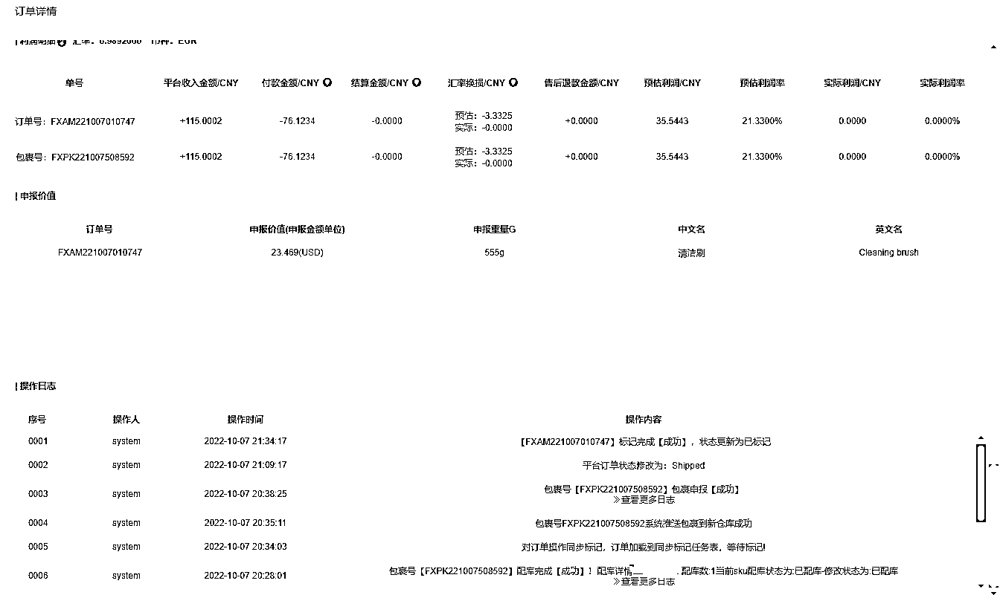

# 广告

我们的广告目前也是交给了Y公司托管，铺货模式的广告也是个体力活，让更专业的人做更专业的事。

目前每个月广告数据如下，还是符合我们预期的：

aoc是20%左右，广告销售额/整体销售额=30%，广告花费占比（广告花费/整体销售额）=6%

以上就是我们在做的亚马逊铺货模式的简单介绍，中间一些细节，篇幅原因就没有展开。如果有感兴趣的圈友，可以再找我交流。

# **# ****3**、后期业务规划

 

 

亚马逊铺货业务之外，基于现有的一些优势，我们也希望拓展以下新的业务

# （**1**）亚马逊精品合作

结合我们实际铺货一年多的数据，以及对Y公司EPR商品数据的了解，还是发现了有不少有潜力可以做精品模式的sku（我们铺货sku的日销，最高的有10+），所以也在积极探索精品模式中

但我们目前的团队没有太合适做精品模式的人员，所以对外也接受合作。我们提供选品支持，感兴趣的圈友可以联系

# （**2**）其他跨境平台铺货合作

Y公司的产品库，一共有100万+sku的铺货完整供应链，且其中有5万左右的sku是有现货库存5个以上的，出单可以做到当天发货的。对于有发货时效的平台，还是很有优势的。

像我们目前在做的一个拉美平台，就是一键上架铺货，1个员工一个月能做1.5-2万美金销售额，毛利率10%。

所以有类似跨境平台铺货需求的圈友，也可以多多交流，互通有无

评论区：

 

 

凯 : 详细了

Lesley金子 : 真棒 

知道 : 跟卖，上个月卖了400多万的货物，这个月还没搞清楚，算下来还是亏了几万，退货率太严重了

陈焘 : FBA跟卖还是FBM跟卖？理论上跟卖不可能亏，因为卖出去的价格是否有利润，在你决定要是否跟卖之前就知道了啊。没有算利润么？

跨境杨少 : 铺货 erp 要谨慎

陈焘 : 哈哈感谢杨少提醒  有空去南京找你

跨境杨少 : [OK]好嘞

良辰美 : 最近测试个小产品，FBM没开广告一天几单，发了FBA开广告没单，链接基本一模一样，也是神奇

# **# ****(41**赞**)3-4 **人小团队如何做亚马逊精铺，实现

# 利润翻倍增长？

作者：  黄达龙

日期：2023-08-18

冰箱里的一个鸡蛋收纳盒可以作为一个电商选品，那冰箱里的蔬菜或水果置物盒，是不是也可以呢？如果再延伸到厨房里的其他物品上，是不是也适用？

我现在做亚马逊就是用的这个方法，目前一个月的销售额在 60 万美金左右。今天，我就结合自己的经验从选品、团队搭建等方面来讲讲，如何通过精铺模式做好亚马逊。

一、自我介绍

 

 

18 年通过国内一件代发项目几千元开始创业，19 年 800 多万销售额，20 年国内下滑的同时，研究亚马逊，21 年亚马逊销售 60 万美金，22 年 380 万美金，23 年目前月销售额 60 万美金左右。

亚马逊有精品、精铺、铺货等模式，精品属于红海爆款，精铺属于小爆款或者低需求市场，铺货属于概率性模式海量产品。

目前我们做的是精铺的模式。

刚开始接触亚马逊时，并不知道有这三种模式，只是根据自身能切入的方式就开始尝试了。店铺数据验证后，开始团队搭建，然后解决供应链，通过不断的产品、经验、供应链的积累，获得了一定的销售数据。

二、亚马逊精铺

机会：

亚马逊相对于国内电商来说，竞争系数比较小，还有汇率的加持，整体的 ROI 比较高。

入行以来美金兑人民币汇率最低 6.4，最高 7.3。目前 ROI 可以达到 3。

 

 

我们精铺模式的核心在于选品以及跟品，选品我们只要求日出几单就可以切入了客单价  20$左右，通过一定的积累后，有些产品也能达到月销 800 单左右。

选品：

根据以往熟悉的产品、能触达的供应链、身边的灵感，找到一些商品。

譬如，厨房用于收纳鸡蛋的盒子，是我们身边随时都可以触及的，通过反查亚马逊数据，发现竞争不大、或者可以找到优化方式，以及 1688 的工厂能够配合，那么就可以尝试了。

举例：

在前台调研 egg holder 时，发现此款商品，月销可以达到 9000 件，亚马逊配送费用是  5.69$，15%佣金是 1.5$，回款有 9.99-5.69-1.5=2.8$，投入：1688 拿货成本是 9.26，换成美金不到 1.5$，头程海运大约 1$左右，回款 2.8-1.5-1=0.3$，未计算退货以及广告等。

毛利率仅有 3%，通过不断的找品、验证，会积累一定的选品技能、供应商沟通技能以及产品分析技能。

 

 

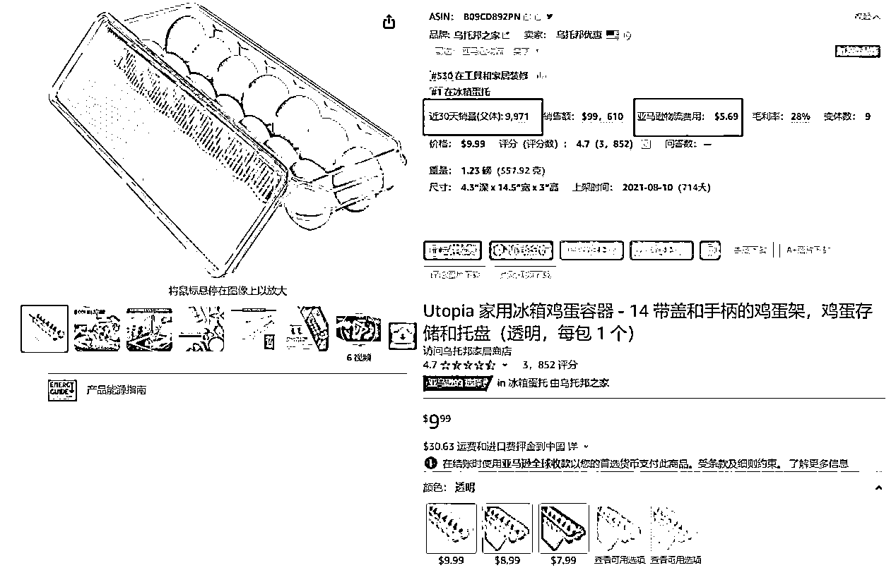 

持续的调研过程中，发现客单价高点，尾程&佣金占比低于 40%，切入机会相对容易点。

 

 

譬如一下这个款，月销可以达到 1 万件，亚马逊配送费用是 6.39$，15%佣金是 2.7$，回款有 17.99-6.39-2.7=8.9$，投入：1688 拿货成本是 9.48，换成美金不到 1.5$，头程海运大约 1$左右，回款 8.9-1.5-1=6.4$，未计算退货以及广告等。

毛利率可以达到 35%。ROI=投入 6.4$/2.5$=2.5，得出毛利率以及 ROI 在自己能接受的范围内后，可以找供应商沟通采购发货事项。

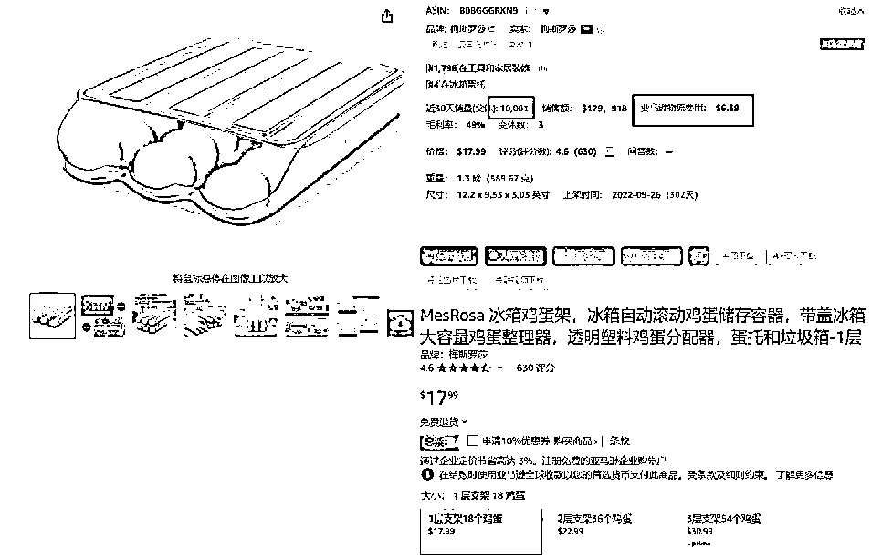

 

 

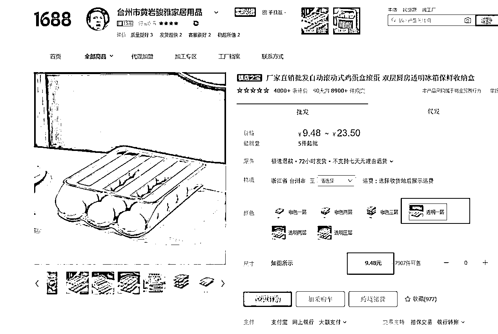

有了第一款的切入后，积累 listing、发货、供应商沟通、头程、广告等经验，可以考虑横向延伸，找到相对有切入机会的产品，但是用户人群是一致的。

 

 

 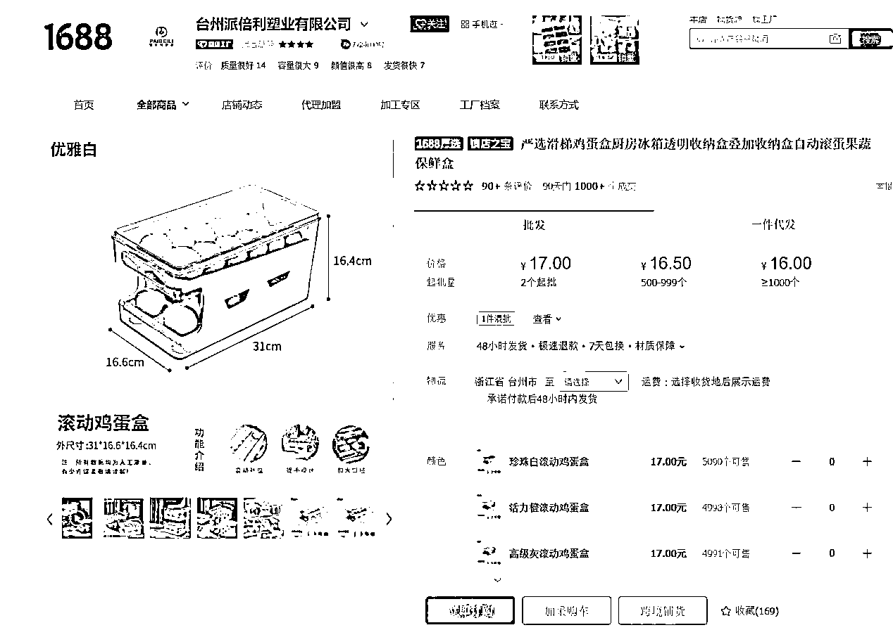

 

 

通过几款产品的验证后，梳理出自己对于选品的需求，譬如日销达到 5 个，利润率 30%左右，退货率 5%左右，那么下次选品时可能会更加清晰。在塑料材质的同时，也可以考虑其他的材质，譬如陶瓷类的

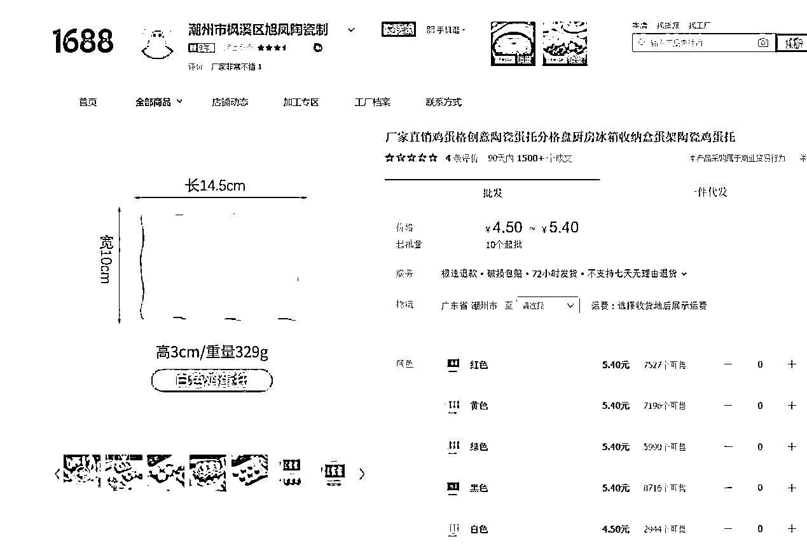

金属类的

 

 

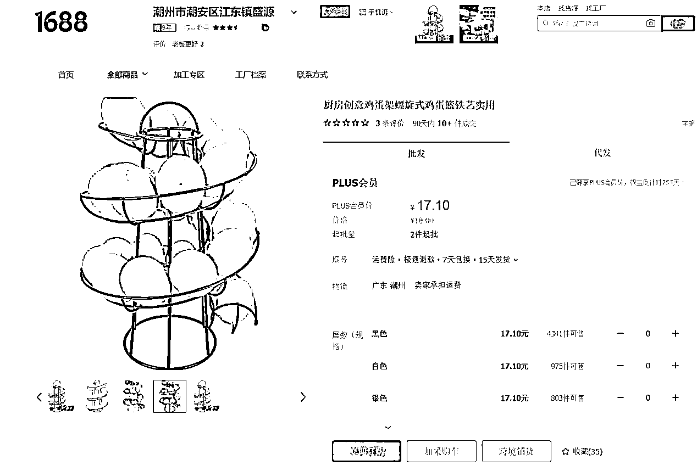

木制类的

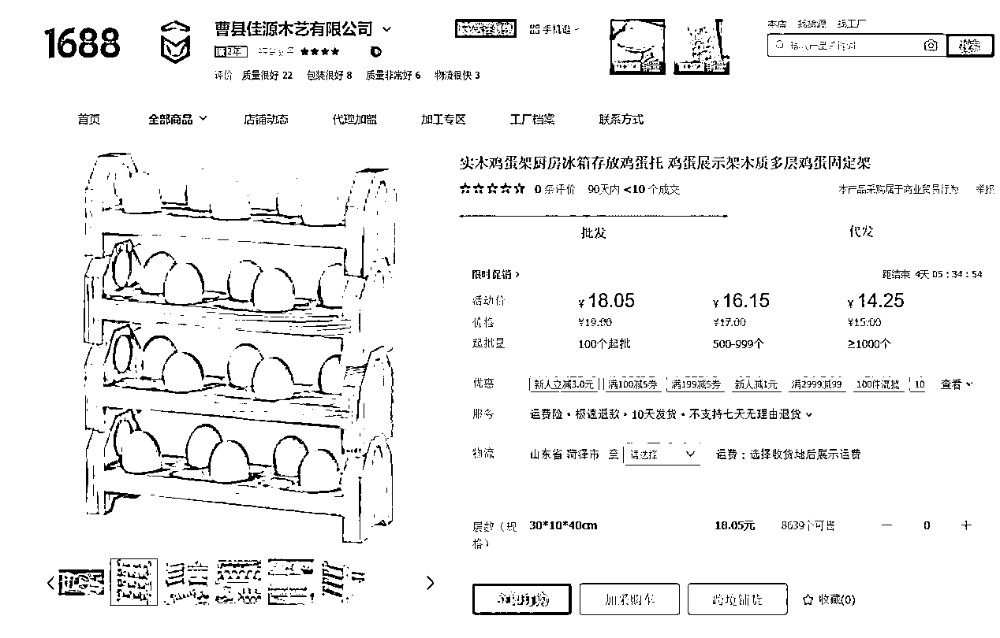

 

 

当鸡蛋置物架感觉遇到瓶颈时，有足够的时间精力以及资源匹配，可以延伸到厨房场景的其他产品。

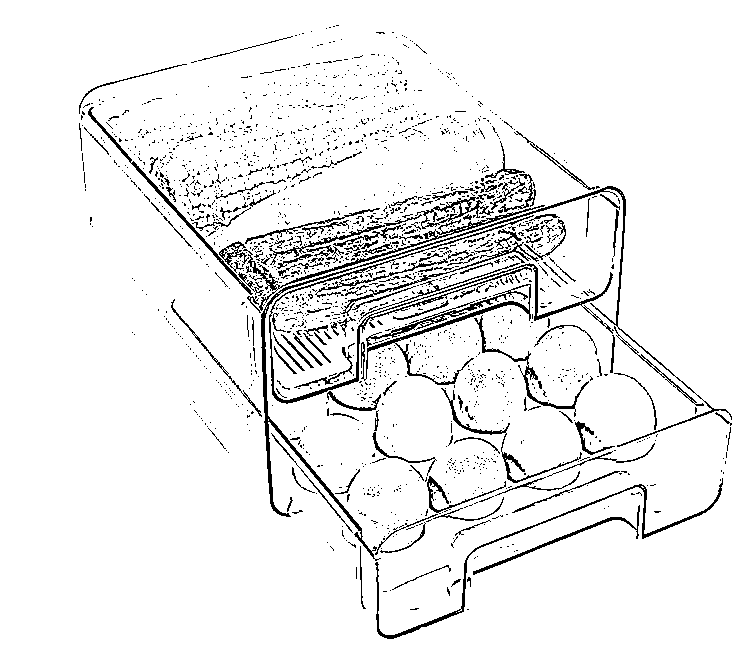

 

 

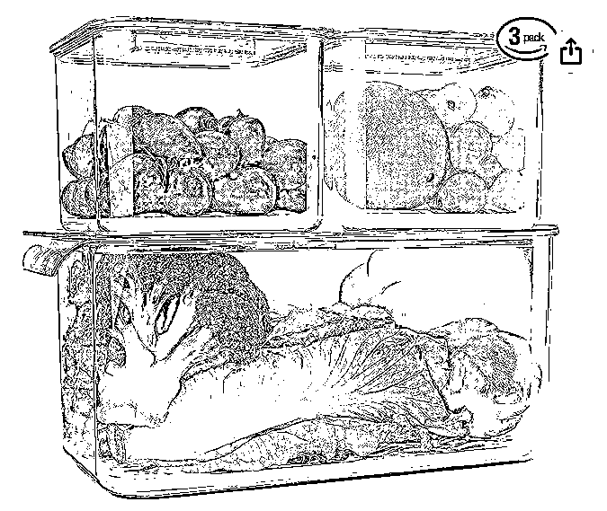

在此过程中，不断积累供应链资源，了解每一道生产工艺，物料成本，有利于后期研发私模产品。

在以上几款置物盒获得一定的数据后，可以反向找到工厂开发、延伸，通过不断的复制，可以从材料入手，譬如塑料制品浴室场景、庭院场景、超市场景等。

供应链：店铺有一定的销售数据后，通过 1688 的了解，发现塑料的供应商在浙江居多，可以先去拜访几位合作过的工厂，参观生产线、请教一些生产上的问题。

 

 

有一定的了解后，根据自己的需求匹配工厂，譬如该工厂没有 1688 店铺，自己有能力设计模具、自己生产加工、订单不饱和、资金不充沛等，跟工厂深入合作，前期给予一定的支持，模具费、货款全部现金，但是要求快速小批量出产品等。

三、团队搭建

① 合伙人：

通过现货测试后，跑通数据后，寻找身边价值观吻合，有一定信任基础的朋友一起打造。跨界小白，无需电商经验，无需资金投入，合作的前提是彼此信任、尊重，价值观不吻合、工作不闭环的，不考虑合作，以免后期产生内耗。

喜欢自己打造的，也可以考虑招人，这样会更可控些；

② 运营：

1、小伙伴进来公司时会分配 1 个有业绩的老店铺以及 1 个新店铺，业绩提成从  3%-10%阶梯式。有一定的运营基础后，会给他多配 1 个新店铺，为下一位小伙伴做准备。

 

 

2、当有新的小伙伴进来时，老员工需贡献一个老店铺给新人，我们理解为一种传承。老店铺给新人后，老员工只需要指导新人，协助其完成销售，但是此店铺老员工的提成会降低 50%。

到后续新员工上升之后，老员工基本不需要管理该店铺了，把时间精力放在自己的店铺上，享受被动收入。

3、当新员工再培养下一位时，第三位新员工的业绩只跟第二位员工有挂钩，被动收入只能享受到第二层级。

员工培养下一位时，会增加 1000 的底薪，但是贡献出去的店铺提成会降低 50%（本来每月可以拿 6%的话，共享出去后只能拿 3%）。

每一位员工的业绩提成比例时一致的，层级也是一致的，大家都可以想办法培养更多员工，不喜欢带人的也可以做好自己店铺。

③ 协议：

针对性的拟合作协议、退出机制、持股比例等；

④ 选品：

上架测试过的产品，并且横向延伸出同类产品，最好是同个供应商；

⑤ 文案：

 

 

打造 listing（链接），找供应商要素材图，淘宝协助修图，文案可读性的前提下，埋入部分关键词。卖家精灵有个 listing 生成器，前期学习的过程中，可以参考；

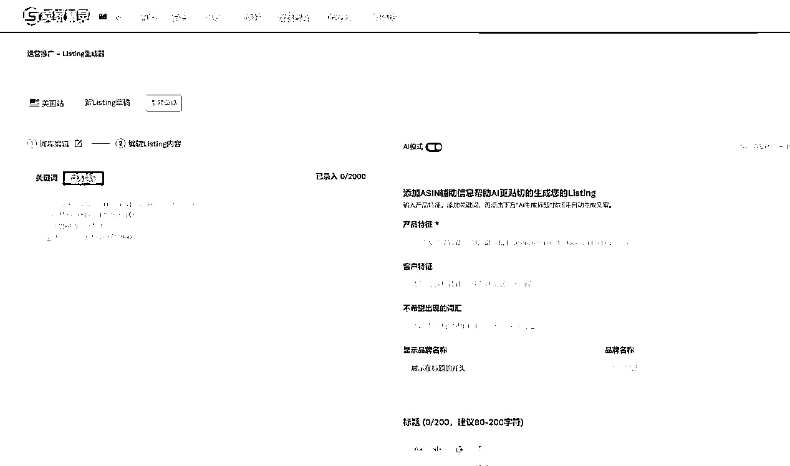

⑥ 广告：

上架后立马自动广告测试，看系统推荐的词或者同类商品是否吻合，验证 listing 有没有跑偏。自动广告的同时，针对性的投放到竞品；

亚马逊官方广告网址：

https://advertising.amazon.com/zh-cn/resources/learning-console?ref_=a20m_us_hnav_lc_t1

⑦ 分红：

 

 

合伙人模式，前期由公司投入，当总回款大于总投入+预留资金时，约定超出的部分按比例次月分红。

譬如从创始至今，所有的投入共 20 万，亚马逊回款 50 万后，预留 20 万资金公司周转，另外 10 万可以拿出来分红。预留资金随着库存、周转资金可以商讨着调整。

不管是合伙人模式还是招人，前期有测试过的产品加持，已经各个流程已经跑通了，可以避免一段摸索的时间，并且增加了成功率。团队合作前期，尽量让问题出现的更多、更快，可以更好的磨合以及打造信任基础。

四、亚马逊机会

亚马逊模式：铺货、精铺、精品；

亚马逊测算：售价-佣金-尾程-成本-头程，佣金按照类目收取，参考：

https://sellercentral.amazon.com/help/hub/reference/GTG4BAWSY39Z98Z3  尾程按照体积、重量、长宽高等维度判断，可以参考以下链接：

 

 

https://sellercentral.amazon.com/help/hub/reference/GABBX6GZPA8MSZGW  头程，海运按照体积、重量等计算，20 公斤起，目前慢船美西时效 40 天左右。空运也是体积重量参考，一件都可以发，目前时效 5-7 天。

尾程头程都有重量体积等参考维度，所以轻小商品是相对来说有这方面的优势。

根据这样的特质，可以借助软件工具选品，譬如卖家精灵，

https://www.sellersprite.com/.  有个选市场功能，根据自己的情况，筛选条件。

举个例子：

选市场-月销量小于 800-售价大于 16$-毛利率大于 50%-新品数量大于 20%（该软件有很多视频可以学习），通过筛选后发现 Executive Desk Toys （办公桌玩具），前台搜索发现结果数量 532，

往下调研后发现 10-20 美金区间销量占比最高，从中抽取了一个产品举例，并不是建议哈，因为我也没有做过这个类目。

 

 

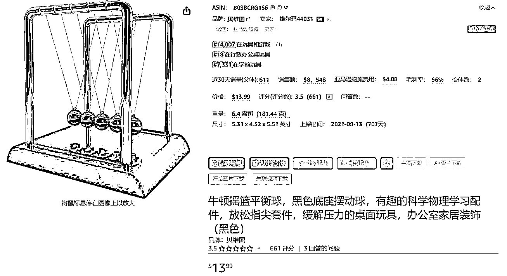

13.99 售价，尾程只要 4.08，佣金 15%，去除尾程、佣金后毛利率有 56%，就是还有  7.8$回款，中号成本 8.2 元，头程空运预计 12 元海运预计 2 元，即使空运还有 4.8 美金回款，34%毛利率。

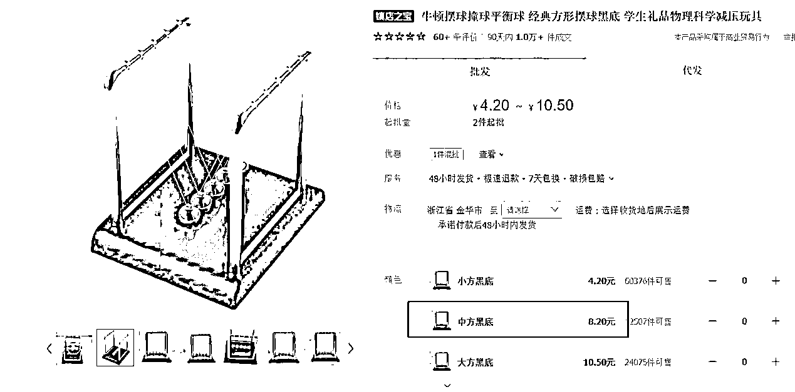

所以，建议新切入的小伙伴，可以尽量选择轻小商品，通过学习调研（卖家精灵有很多视频可以学习，有 5 分深入已经领先很多人了），找到细分类目，调研后找到对标产品，排除专利后，思考怎样优化。

 

 

前期只能考虑赠品或者搭配组合的方式去切入，后期才考虑模具或者新颖设计。

拿货发货，关于广告可以关注微信公众号：亚马逊广告，里面也有按照不同阶段提供了很多学习资料。

有了点的切入后，再慢慢延伸到面，验证好数据，可以考虑如何复制。

评论区：

西瓜 : 亚马逊品类分为精品，精铺，铺货。[强][强][强]

# 【选品方法】**9**篇

# **# ****(**精华帖**)(419**赞**)**跨境龙头创始人教会我价值

# 百万的选品方式

作者： seven

日期：2020-04-19

跨境龙头创始人教会我价值百万的选品方式

产品占7分，运营占3分，这是一篇关于产品为王的文章，核心内容用一句话说就是在细分领域里，竞争极小，需求极大，打磨产品做到单品占有率第一，那完全足以做到年利润百万了。

我之前在大公司是做产品经理，你知道的，大公司，一个萝卜一个坑，除了产品，我啥都不会，而且创业没有足够的资金，没钱投运营，也碾不过一般人的竞争，因此逼着自 

 

己只能打磨产品，并且把产品做到市场占有率第一，所以这篇文章，只有产品，没有运营和流量，毕竟我也不会。

19年1月4号，我和合伙人开始了我们的公司（55分成，我占百分之65决策权），一年时间，我和合伙人各自分红百万以上，所以实践了这个方法，真的不是标题党，这个方法给我的价值，远远远远大于100万。

我是14年2月进入跨境龙头企业某谷的，后来做到产品经理，这个公司，每个季度上调百分之30的销售目标（达不到提成会有折扣），加班非常严重（晚上9点后下班对于我来说是常态），收入对不起付出，我感觉是被极致的压榨，就像被榨干的甘蔗，还要被舔一口汁，大型的血汗工厂。

但有个非常大的重磅收获。某谷的老板大邹极少和我们小角色说话，有一次召集了亚马逊产品经理开会，上来就是一顿看不过眼，在座的都是垃圾（不是夸张，真实场景更人身攻击，粗口成章），然后说他重心是独立站，没时间管我们，但是今天，就教我们一个杀手锏的技能，价值百万，他说你们懂这个技能，不管今后在哪里，都足以在亚马逊有自己的天地。

事实确实如此，我纠结了很久，真的非常不舍得放出来，毕竟这是我用7年时间，加班加点经历过没日没夜的日子实践得出来的技能，有可能这个方法会流出去市面，我们都知道，一个好用的方法，无数人知道，这个方法就不好用了，并且，这不是一个有时效性的技能，类似捆绑踢人合并等过时的技能，而是当下最具杀伤力的利器，小白零起点用小成本就可以高概率轻松切入并获利百万以上的杀手锏技能，足以在亚马逊市场用3年5年甚至更久更久更久。

但为何我还是放出来了，主要有两方面最大的理念，当然，我知道最终看的人，也不会按照我想的那样去走，毕竟，每个人的理念不同。以下是我个人很想去实现的理念，想看选品技能的直接跳到底下的选品教程。

第一方面，我真心希望国内一些企业，可以善待求职者和雇员，而不是把他们当成工具人按在地板上摩擦摩擦。甚至明明盈利，借疫情之口行克扣之实，强制加班还疫情期间不给加班费，企业的目的确实是为了盈利，但嗜血的资本也别吃相太难看。

我真心希望，国内的企业，能在收入，可以达到发达国家的4分一甚至以上，工作时间可以达到发达国家的1.3倍，而不是1.5倍甚至是1.7倍工作时长，他们之所有有更少的工作时长，更高的收入，是因为他们的效率更高，大家都是做亚马逊，差距为何如此之大？

 

 

我们现在招了6位同事（我当大家是平级的同事，从未当成是员工），由于我自己长期的加班有点肩颈劳损，于是给每一位同事（4位应届生，2位有工作经验）都配了赫曼aeron人体力学椅，还有降噪bose耳机。上班时间为上午9点半，下午5点半，中午休息2个小时，配发午休床，1点半后强制午休。大小周，小周周六12：00下班，上下午各10分钟断网强制休息时间（学生时期都有课间，工作了反而3小时连坐，这本身就不合理，也不符合健康）。年度体检预算是1200每人的体检项目。

我们公司的盈利支出现在是百分之15大家分红，百分之15管理分红，百分之40-50留存公司发展（用于扩大生产，留存资金抵御风险），百分之20-30用于无息贷款去协助大家成长，实现自己心之所想，理念和需求，无息贷款最低5万，最高30万（随着公司发展后续或许会更高，当然是和公司能力相匹配，我们无法做超出能力范围的事情），还款是2年内不需要还款，2年后分10年慢慢还清）。这项无息贷款的政策，已经帮助了两位同事买房（一位在老家买的，一位是在广州买），如果不是疫情影响，今年应该可以再帮一到两位同事。

我能力真的有限，还有非常多非常多的地方还无法为同事做好，在这个大环境下很乏力，但我还是会尽自己最大努力去实现。这周也睡了两次办公室，爱人哭诉我就知道给钱，给合伙人钱，给钱给员工，给钱给供应链，给钱给物流，凌晨1点走去办公室的时候还觉得已经到大是大非走不下去的地步了，但现在和好了，但大家还是有个梗，只是现在避而不谈。而我知道，要实现心中的理念，必须进一步优化效率，盈利高了，自然很多东西就更容易实现下来。

第二个理念是，部分中国卖家，真心应该提高自己的出海技能，而不是整天觉得亚马逊很难做，非常难做，甚至是窝里反，内斗，丢差评，变狗，改listing主图等等等等。

在公司就职的职业生涯真的很累，凌晨起来搞跟卖狗，试过listing标题图片被改，试过被丢差评，试过被恶意投诉下架，这些我都深深地经历过，而这一切的背后的本质是什么，中国卖家自己窝里反，跟自己人内斗和竞争。

那么整天觉得亚马逊难做，甚至是窝里反的本质其实已经很明显了，那就是，中国卖家自己跟中国卖家竞争，而中国卖家本来就体量非常庞大且良莠不齐，所以难做甚至是恶性竞争就再正常不过了。文章写到这里，就来到了我们价值百万的选品技能了，我相信懂的人看到这里其实已经抓到本质了，吃透这个原理，带来的年盈利何止百万。总结一句话，那就是和本土卖家竞争，并且聚焦一个细分市场的单品，打磨产品，单品做到市场绝对的领先水平，从而做到单品市场占有率第一，而一个细分市场的单品市场占有率第一，就足以年利润50万甚至百万了。以下是具体可实操的教程。

价值百万的市场分析，流量分析，利润分析和选品教程

 

 

a. 市场分析

1\. 可塑性极强

2\. 本土卖家

3\. 竞争小，需求高

4\. 存在市场久（用keepa可以看到），意味我们也可以存在2-3年甚至更久  5\. 我们可以做到细分领域单品第一，单品领先市场，才能做到占有率第一。然后可以开发下去，把一个单品的潜力吃尽。

b. 流量及对手销量分析

1\. 用keepa

2\. 看排名

3\. 用软件 Helium 10看出单

4\. 加购物车看库存变化

c. 利润分析

1\. 我们有7成把握做到市场第一，用利润表格，预估出单量，那就知道一个单品的潜力了  2\. 亚马逊配送费，输入对手asin就可以知道配送费了

d. 具体可行的选品教程

1\. 锁定一个可塑性极强的单品，探寻细分领域

a. 记录提炼素材(热卖元素=需求)：心理需求，生理需求，衣食住行吃喝玩乐喜怒哀乐  （谷歌，关于衣着的关键字有哪些…）

1 材质/产品 2.对象 3.场景 4.功能等，探寻细分市场及产品设计创意  b. 用最大的词搜索（优先在亚马逊搜索），记录元素（不要先入为主，刻板印象，除非你实践），亚马逊长尾词（长尾推荐，软件）  关联推荐  自己列举关键字组合搜索…3\. 看产品不能只看表面，你必须要对客户的需求有极强的认知

只有你的单品好到处于市场绝对的领先地位，你才有可能做到市场占有率第一，甚至寻求价格上探的可能性（我们最好的单品就是做到了市场绝对的领先地位，并且对原来最好的对手价格更高）

亚马逊平台创业：当你知道自己可以持续输出高质量单品的时候。

 

 

其实我们能够更少时间相对更好福利的核心以及和别的公司差异化竞争的原理和机制在于：一套基于本土卖家的开发思维和模式，在一个客户需求大而供应少的市场，收集所有素材，融入素材，以一种本土化的设计和思维切入这个市场，从而做市场细分领域最好的单品，进而做到单品占有率市场第一，这就是本土思维，而跟本土卖家竞争，可以免去你很多烦恼（本土卖家数量少，素质高，质量高，质量高的意思是一个单品的利润很高，这也就是他们为何收入高，工作时长少，也是我们工作时长比一般公司少，而福利相对来说比较好，当然我们还处于初创型，很多东西还是达不到）

如果我们能对他们的需求如数家珍，我们就能融合需求元素，创造一个产品并完全贴合他们的需求，进而做到细分领域单品占有率第一。

看到这里如果看不明白的话，那应该是行业不同导致的，但思维原理我觉得还是相通的，应该有一点点的帮助，那为了照顾行业外的，打破这个行业壁垒，我拿一个具体的产品来举例，注意，我只是拿一个产品举例，并非这个产品一定可行，但是你要get到本土卖家的单品利润，真的竞争小到你无法想象，利润高到你无法想象，年利润200-500万以上的比比皆是，数不胜数。

狗碗，dog bowl, 一搜索，需求巨大，然后我们怎么操作呢。

逮住10美金需求最大的单品，发4000个库存到亚马逊，然后刷单，刷好评，广告站外等全部开起来，把市场的对手变狗，改他们的图片标题，给他们丢差评。

不不不，这是中国卖家的做法，咱不能这样，而且你小白资金又少的情况下更不能这样做，就算做了，很累，而且成功概率不高啊。

咱都知道，产品占7分，运营占3分，例如狗碗，普通几美金，但是细分领域功能强大的可以去到30美金左右，这个细分市场可以通过组合搜索，长尾等方式挖掘到，于是我们锁定一个细分市场的单品，

带升降功能的狗碗，其实只有寥寥几家在卖而且都是本土卖家，然后用工具得知，这个产品一天的量可以去到80以上，单品利润改进了组合款降低了配送的情况可以去到50以上，那么一天利润去到4000，年利润百万以上。

然后咱就做升降狗碗了吗？不不不，如果你是大资金，懂营运，会流量，那当然你可以做升降就可以年利润50万以上，但我们说了，即时你啥都不会，就只会产品，你也能在本土卖家中脱颖而出，那为了和本土卖家竞争，并且你要做到升降细分市场的单品第一，仅仅是升降功能是远远不够的，必须要把单品打磨到市场绝对的领先地位，  我们会调研狗碗最大的需求有5个功能（防过快进食，升降等5个最大的需求点），调研的方法就是亚马逊，谷歌，独立站等，最大基于亚马逊，把所有有价值的评价提炼出来，这样可以改进产品缺陷，同时又可以将几个需求最大的功能糅合到一个产品中（例 

 

如又可以升降同时可以放过快进食又可以同时满足5大需求），那样几个功能都是贴合最大需求的，做货出来就是前所未有的产品，  积累元素，  糅合一起，那客户从前要买到他最大的需求的5个功能的产品，他要付出80美金以上的价格，而我们打磨出来的产品，只需要30美金，那么这时候，你不需要任何的推广运营技巧，只需要一天5美金内的广告预算，让客户看到你，就足以让他们尖叫并选择你的产品了，并且你的产品价格可以上探，毕竟整个市场，能符合客户最大需求的单品，就只有你。

记住，你要做的是细分市场（也就是长尾市场）的占用率第一，你要做的是和本土卖家竞争，这就是本土思维（为什么本土人总能创造出只有他一家卖的单品，因为他对本土需求熟悉，而我们通过调研，去深刻认知本土需求，做只有你有的单品）本土卖家从来不考虑价格战，记住，要培养自己本土思维，价格战，恶性竞争是中国卖家才做的事情。

我已经说的不能再多了，不管是最核心的思维还是最小白的实操，我都把自己仅有的家底都掏出来了，我其实也很怕，庞大的中国卖家群体全部这样做，让我们本来可以轻轻松松赚钱的路子变得异常难走，但其实我更希望大家可以像华为抖音等中国出海企业那样，去和本土卖家竞争，别再做低附加值甚至恶性竞争了，把利润提上去后，可以善待雇员。一个国家要迈入发达国家，例如日本韩国（韩国当初比某鲜还穷）等，早期可以low起家，但是后期，必须得有可以和本土卖家匹敌的产品和技术，衷心希望这个行业，别这么搞到这个行业这么low并且水深火热，去打磨产品和技术吧。如果看完还是有疑问，我很愿意为大家去解答。

最后，对于同事关于我自己的理念，就是努力让她们在广州市区就近买个小两居老破小（小两居也够一个老人家带小孩了，挤挤嘛），解决最大的通勤问题，因为人一天清醒的时间减去上班睡觉也就3-4个小时，通勤已占用就全没了，而如果自己又保持技能的提升（例如工作是富有成长性的，而非机械性重复性工具性，因为我什么都愿意教，只要个人是上进的，那么工作所带来的成长，你在这个领域的年资就可以引导自己收入提升），而同时业余的学习又是进一步提升价值的，那么未来的收入，叠加通货膨胀，现在买不了，以后也可以买的了（就是第二个小两居），而一切都觉得很难，那就是建立在收入不会涨，或者是对于未来收入涨的预期不高（觉得涨幅大的概率小）。最后，希望我身边的每个人保持学习，提升价值，从而提升收入。

https://sellercentral.amazon.com/fba/profitabilitycalculator/index https://www.amazon. 

 

com/gp/product/B00TV1A6IA

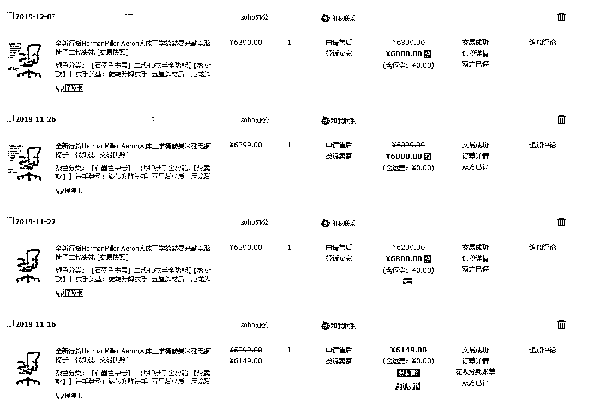 

 

 

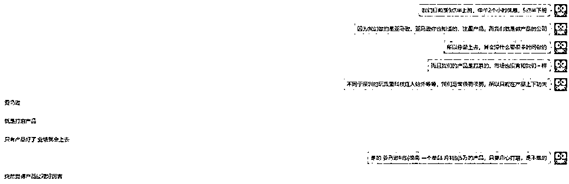

评论区：

果¥郡$王 : 好利害，牛人

王子健 : 优秀

概率 : 冲楼主的价值观关注了

捕风人 : 老板还招人吗[呲牙]

Eric : 大麦，某谷，每年能挣好多钱

allen : 向前辈学习[抱拳]

Ryan老陈 : 正能量老板，赞！

Jeremy : 小团队可以，要做大，还是得回到大品类，大单品。

# **# ****(**精华帖**)(259**赞**)**如何用一套犀利的选品思维

# 与精细化的选品工具，找到有利润空间的跨境电

# 商爆品？

作者：  鱼丸|亦仁助理

日期：2021-04-07

今天#生财合伙人#嘉宾@小马丁  就会聊一聊这个话题。

 

 

他是跨境掘金俱乐部发起人，擅长钻研各种海外赚美金方法，且在跨境电商网站的精细化运营、谷歌SEO、SNS社媒营销及内容营销上都颇有心得。他所售卖的商品，在竞争激烈的亚马逊里挤进了类目 Top 榜单。

欢迎@小马丁分享他的心得。

这是最坏的时代，也是最好的时代。

——致电商人

本文主要内容：

一、前言

二、初期选品思路

三、选品工具介绍

四、可复制选品思维

五、结语

一、前言

大家好，我是小马丁，是跨境掘金俱乐部发起人，擅长钻研各种海外赚美金方法。

 

 

在跨境电商里摸爬滚打多年，算取得过小成就吗？

算吧，毕竟要在竞争激烈的亚马逊里挤进类目 Top 榜单，现在回想起来胸腔里也还积攒着一腔热烈。

我失败过吗？也是失败过的。当渠道和生产都不掌握在自己手里，面对产品差评无能为力被亚马逊强制下架产品的时候，那种整个世界都是灰白的色彩的感受，依旧跃然眼前。

是正当竞争的失败还是不正当竞争地被人恶搞，现在再谈论这个对我来说已经没什么意义了，但是作为一种警醒，对后来者还是有些意义的。

我经历过那种万念俱灰的感觉，所以不想你再经历，同时我的心态慢慢地发生了转变。

从意难平到处之淡然，再到热爱分享，鬼知道我都经历了什么。

跨境电商是个行业，我常说，大家一起玩才是行业，只有自己玩，那只能是玩完。

我总归是热爱生活，也热爱跨境电商行业的，带着大家一起玩，是我现阶段找到的，能满足自己的行业意义。

所以这篇文章，我会从怎么选品开始，带着大家试一试亚马逊的水，水深水浅，我说了不算，如同小马过河，亲身尝试了才知道。

 

 

做了亚马逊这么多年，我时而会陷入一种巨大的矛盾中，有时候会觉得现在已经没有什么产品值得做亚马逊了，有时候又会觉得亚马逊仍然存在大量空白市场。

前几日苏伊士运河被堵，全球经济命脉被扼制，造成全球日均600亿的亏损，我们会发现跨境电商的体量依旧庞大。

这么庞大的体量，为什么会产生没有什么产品值得卖的错觉？

那是因为我自己钻了选品的牛角尖，永远都在找什么产品好卖，却不思考为什么这款产品会好卖，过分地关注热卖产品而忽视了目标受众的需求。

二、初期选品思路

其实选品的本质就是“抄”，但并不是找一样的产品，那样的话并不需要选品，直接跟卖就行了。

那么具体要怎么“抄”，在起步初期，或者说是手头资金并不太充裕的情况下，这里提供一个初步的思路，希望能尽可能地减少一些试错成本。

**1.**尽量选择重量体积偏小的同时又精美的产品，做到物美价廉的同时，实现成本最小化；

**2.**选择不因季节而变化的刚需性产品，减少因季节原因而堆积库存的情况；

 

 

**3.**尽量避开有大卖品牌的产品类目，同时不能选择太冷门的市场；

**4.**针对细分人群的刚需，提供高溢价低竞争产品，开拓细分市场和蓝海市场；

**5.**在同类目产品中制造差异化，做人无我有的产品。

三、选品工具介绍

在选品思路有了之后，我们就可以肆无忌惮地去选品了吗？

答案显然是否定的。

使用纯手动浏览筛选不仅效率不高，并且会更多地掺入我们先入为主的主观判断。

我们的喜好、习惯和文化都与老外不太一样，比如说之前疫情大家就想不通为什么老外会去抢购卫生纸，老外也想不通，国人为什么抢购大米面粉。

这种主观判断会在很大程度上影响我们选品的针对性。

所以在选品的时候融入工具的使用是十分必然的。

下面我们来介绍一些常用的选品工具。

 

 

**1. **谷歌趋势** Google Trends**

这个完全免费的工具对于电商人来说简直就是福音，通过它可以快速锁定产品关键词的热度和走向，迅速判断产品的市场容量和未来趋势。

下面举个例子简单地介绍一下这个工具如何使用：

比如我们想要了解美国的墨镜市场，我们可以把核心关键词 sunglasses 放到搜索框进行搜索，随后我们可以得到墨镜整体的一个需求走势图，可以看到墨镜在一年里面的需求走势情况。

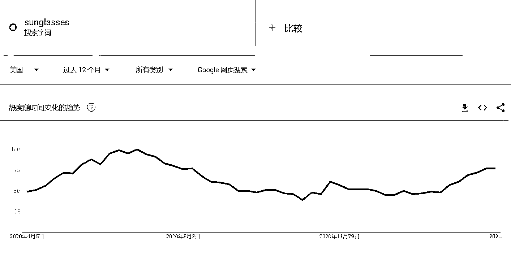

我们还可以把类似产品或者其他意向产品进行比较，比如可以把普通眼镜和墨镜这两种类似产品作一个比较，这样就可以知道谁的热度和需求更大，方便我们在选择产品遇到困难的时候来做出最终的决定。

 

 

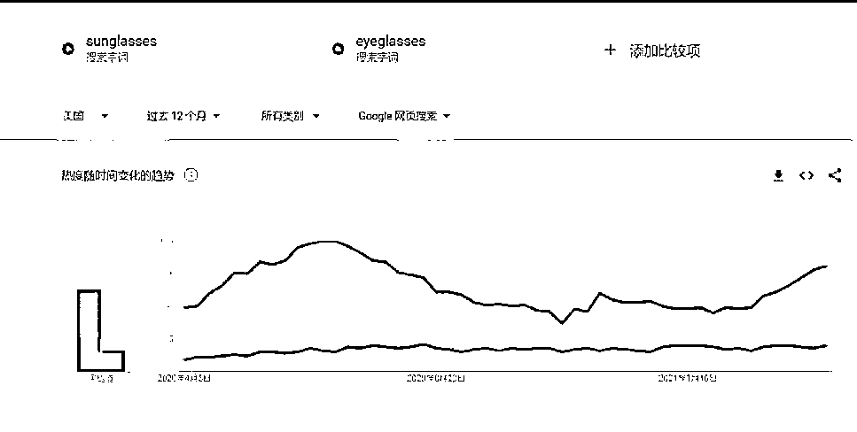

此外，我们还可以知道产品在美国不同州的不同需求情况，以及与墨镜相关的搜索词和相关话题，方便我们去做进一步的深挖，找到这个产品下面更多的长尾产品和关联产品，以及更深层次的了解我们目标消费者的对这个产品的喜好情况。

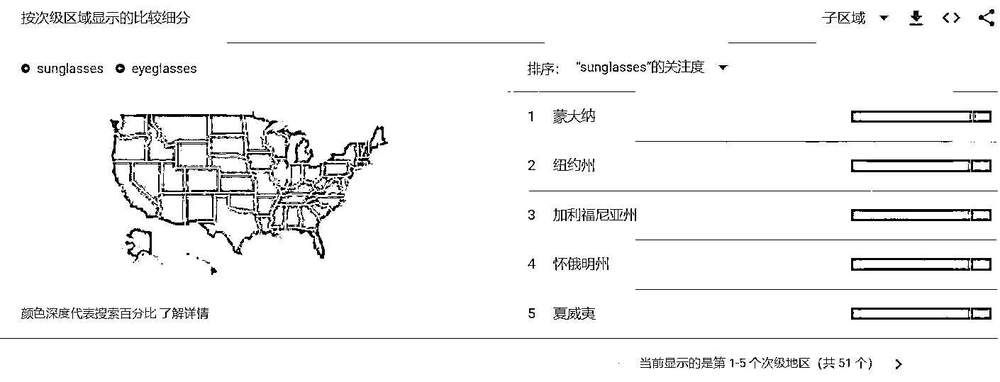

 

 

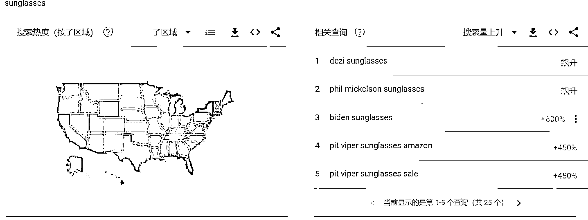

**2. Semrush**

这个工具是 Google Trends 的进阶版，虽然要付费，但是能够获得更加详尽的数据。

这个工具可以得到网站最近平均流量（平均日流量、月流量）、网站客户所在国家、网站主要竞争对手、网站品牌关键词带来流量、网站投放广告等信息。

通过 Semrush这个工具分析同行网站流量和访客主要来源，精准分析选品的竞争对手。

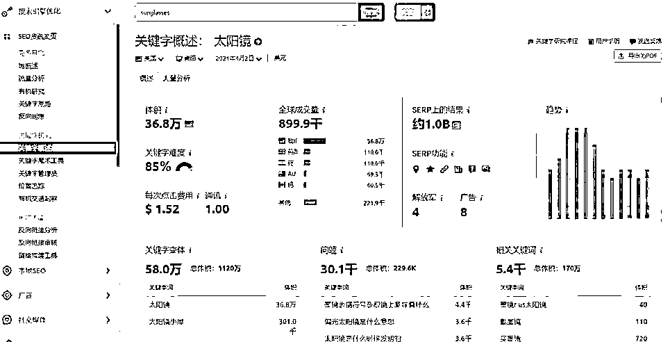

 

 

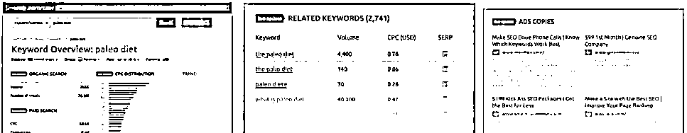

**3. Ahrefs**工具

Ahrefs 工具与 Semrush 是两个差不多的工具，彼此的功能和领域都非常接近，可以在这二者中间挑选一款，选择 Google Trends + Ahrefs \ Semrush 配合使用。

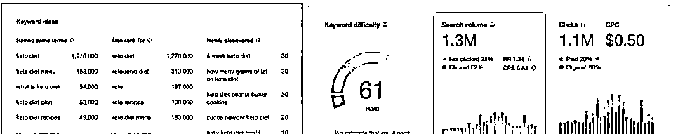

产品搜索量相关的衍生词都可以用 Ahrefs 找出来，根据他们搜索量和点击量来判断这个产品和行业适不适合我们。

Ahrefs 还可以查看同行在谷歌投放的广告词和广告语，方便我们了解同行广告投放情况，针对性布局和优化自己的广告语和关键词，提高广告优化效果。

我们通过 Ahrefs 看产品在谷歌趋势上面的搜索量趋势，可以大概了解这个产品的过去和未来发展趋势，同时获取必要的外部行业信息。

 

 

功能之强大，集站内诊断、关键字研究、热门内容研究、外链分析、关键词排名追踪于一身，是 SEO 的必要工具，如果选择了付费使用， Semrush 和 Ahrefs 都是非常值得深挖功能的工具。

**4. **亚马逊榜单** + Keepa **插件** \ **卖家精灵

通过 Ahrefs 看出关键词的 SEO 竞争难度后，我们再通过亚马逊 Best Sellers 最热销榜单查看当前热销产品，通过 New Release 最新上架榜单查看新品趋势，通过 Movers & Shakers 榜单看不同产品人气指数，通过 Most Wished For 榜单查看产品的存量市场和顾客的购买意愿。

通过 Keepa 插件 \ 卖家精灵，根据产品价格、产品订单、产品发货时间、广告产品做筛选，最终快速锁定产品。

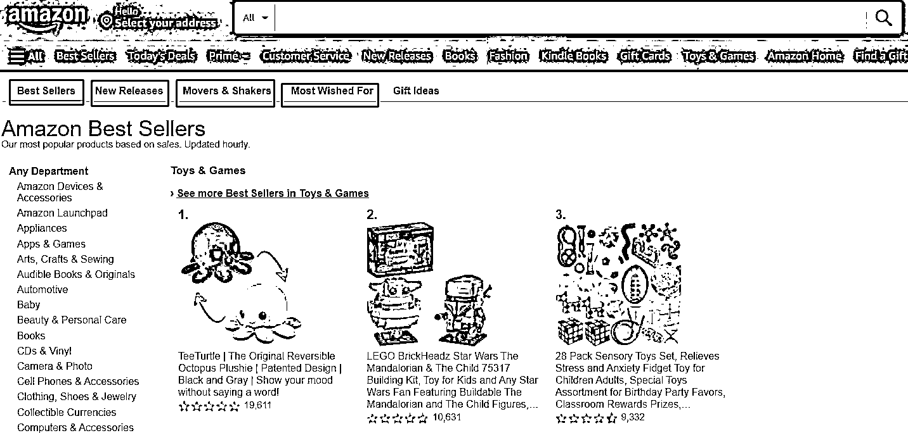

 

 

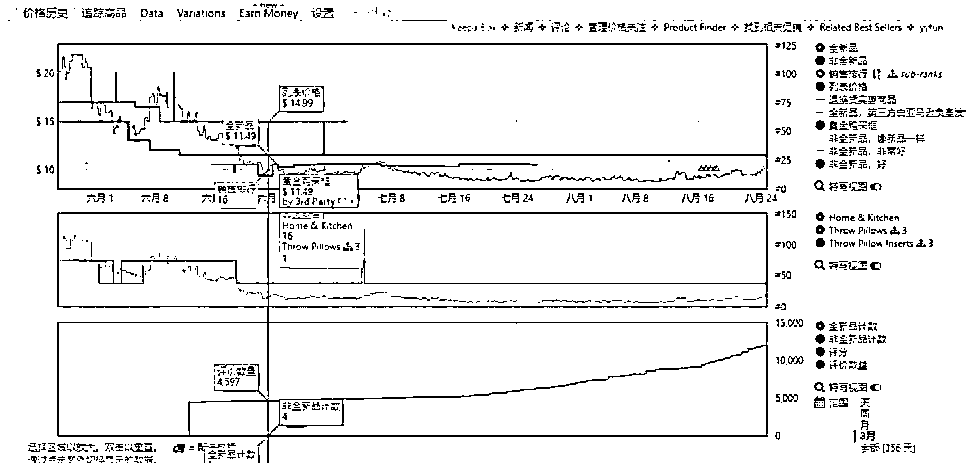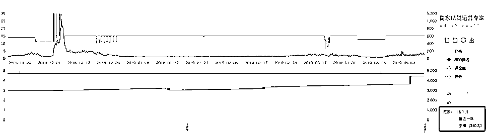

**5. Bigspy**

从亚马逊榜单找到合适产品后，我们再通过 Bigspy 这个工具，查看主流社交媒体上面打广告产品，找出广告点赞互动高的产品。

根据自己性质查看更适合在哪个社媒平台做广告，找出同行做的最好的几个广告，参考借鉴他们广告语和广告活动策划，在搞社媒活动借鉴他们的广告语和文案。

 

 

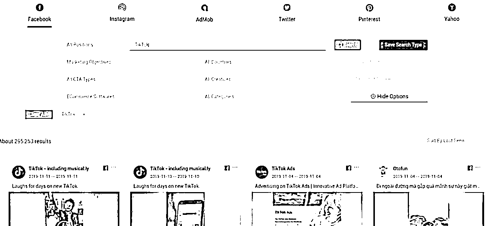

思路** + **工具的主要目的，是让我们在选品的时候不至于脑袋一热就拍屁股决定选品，而是要做好产品的市场调研。

a. 通过了解同行畅销产品和价格，方便我们进行新的产品开发和价格制定，提供可靠的数据支撑可参考价值；

b. 通过了解同行网站流量主要来源渠道，分析这个产品类目的主要引流渠道，针对性引流，减少引流试错成本；

c. 通过了解同行关键词布局，方便我们布局我们的关键词，让我们关键词布局更加全面，后期排名更有优势；

d. 通过了解客户群体，剖析客户需求，可以避开竞争激烈的市场，甚至可以抓住用户痛点，开拓空白市场，实现一飞冲天。

 

 

简单地说就是同行没有的我要有，同行有的我要更精；客户想到的我要有，客户想不到的我要帮客户想到。

四、可复制的选品思维

这一整套“抄”的流程，意在提取热卖产品的内核，依葫芦画瓢，用猫的骨架去画出老虎，看起来可能有点复杂，接下来我们就用思路 + 工具，总结出一套思维模式，来看看这只老虎具体要怎么画。

**1. **跟卖型选品

这是选品里面最简单粗暴的方法，但确实好用。注意，是跟卖型选品，而不是跟卖。

我们以玩具类目为例，打开亚马逊商城的 Best Sellers 榜单，能看到排名第一的玩具产品

同时点开 Most Wished For 榜单，发现这款产品在 Most Wished For 榜单排名也是第一。

 

 

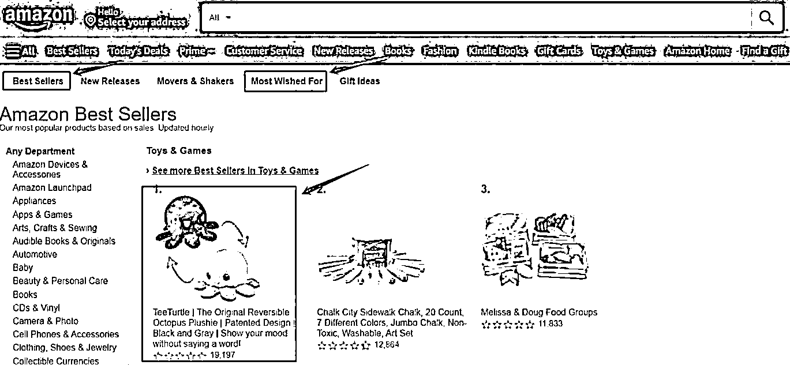

这就说明了这是一款足够热卖的产品，并且仍然有售卖空间，市场容量充足。

之所以强调是跟卖型选品而不是跟卖，是因为我们要提取这款产品的内核。

我认为这款产品的内核就是：可爱的玩具，而这也就是我们跟卖选品的方向。

接着我们可以通过谷歌趋势查看产品的趋势走向，有钱的也可以用更专业全面的  Semrush 。

谷歌趋势图：

 

 

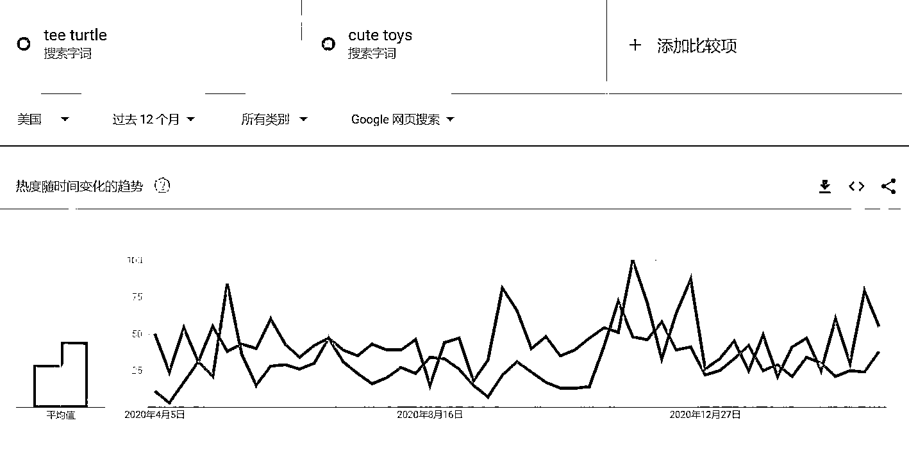

Semrush 分析图：

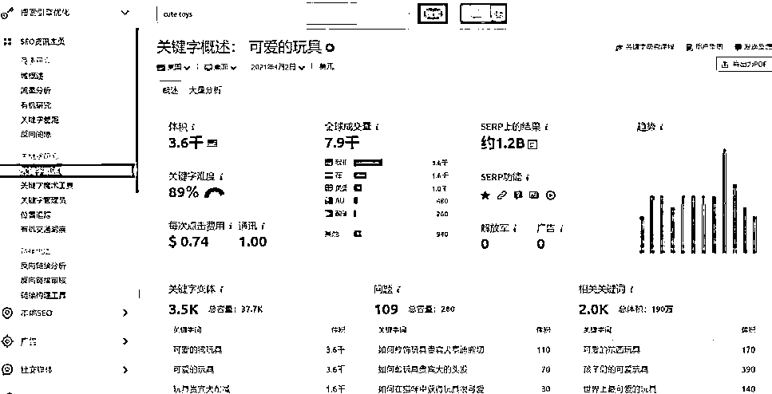

我们可以看到趋势曲线是震荡上升的。

再通过 Keepa 插件查看价格趋势，查看产品售卖价格。

 

 

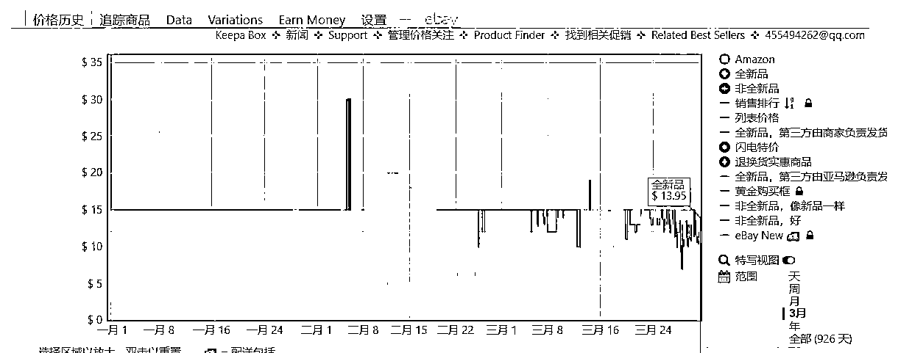

然后上 1688 上查看类似产品售价。

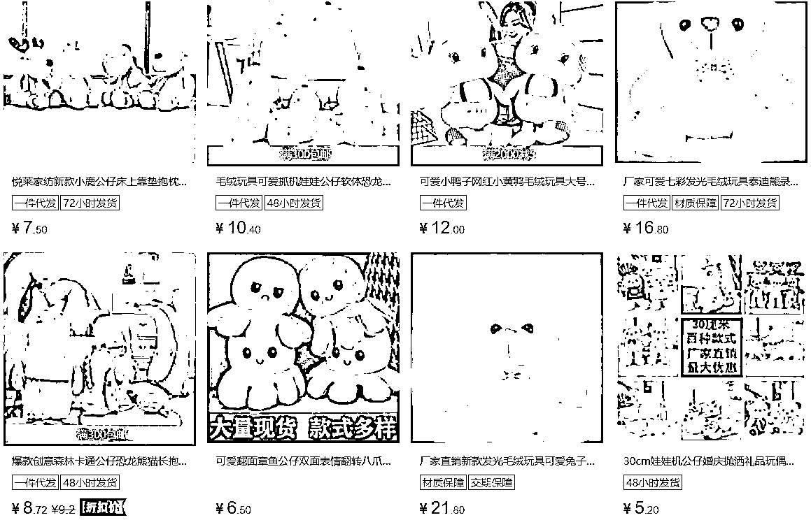

 

 

认为利润可观便可以敲定选品了。

注：毛利润**=**售价**-**采购成本**-**头程运费**-FBA **费用**-**亚马逊佣金**-**收款汇损（欧洲站还需扣除** VAT **税）

整体的选品流程就是寻找热卖商品**→**确认市场容量**→**确定产品趋势**→**确定产品利润**→**敲定选品。

同理，可以用这个方法在 eBay 、速卖通、独立站甚至各大社交平台进行选品。

社交媒体以一个类似于国内百度贴吧的网站 Reddit 为例，非常适合在上面深挖针对特定目标人群的选品调研。

比如你想要去深挖一下宠物类目，虽然现在宠物类目已经是白热化竞争市场，特别是狗粮猫粮一类，但是并不妨碍你去做一番调研试试手。

你可以去 Reddit 上面找到与宠物相关的论坛，爱猫爱狗的人总是有特别多的话题和同理心，我们要充分利用这种同理心和共情能力，让充满爱心的吧友给你打白工，而你所需要的只是试发一些样品给他们。

 

 

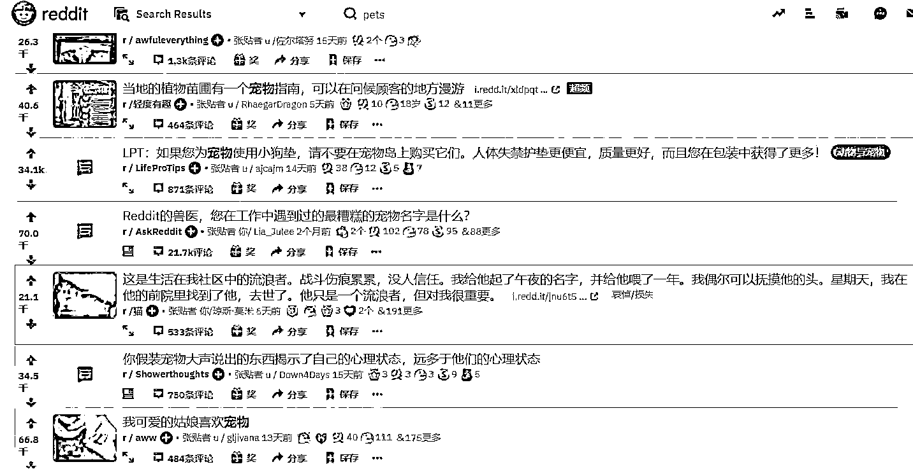

另外，当我们决定上一款产品的时候，也可以在相应的宠物小组发帖子，让大家根据目前的功能点和图片来提提意见，甚至可以考虑先送一批出去征求一波意见，如果不行的话可以根据意见返厂再进行修改，这就类似于产品在正式发布之前做的一个测款工作了。

之后，如果在群组和这些人混熟了，让他们帮忙解决亚马逊测评也是很容易的事情，要知道现在亚马逊刷单差得非常地严，但是贴吧这种地方永远都有热心网友存在。

**2. **视觉型选品

说实话，当看到上面案例里面这个毛绒玩具连续霸占热卖第一三个月的时候，不得不感慨人类真是一种视角动物。

但是视觉型选品并不是说选品一定要好看，毕竟审美这种东西太过私人，一千个人眼里有一千个哈姆雷特。

 

 

所以我认为视觉型选品的内核就是要有足够的视觉冲击力，既然要视觉冲击力，我们就从“ weird ”奇怪的这个关键词入手。

我们查找一下亚马逊销售榜单，发现确实有这样的产品（虽然这种长得跟月球一样的煎饼实际上是个毯子）。

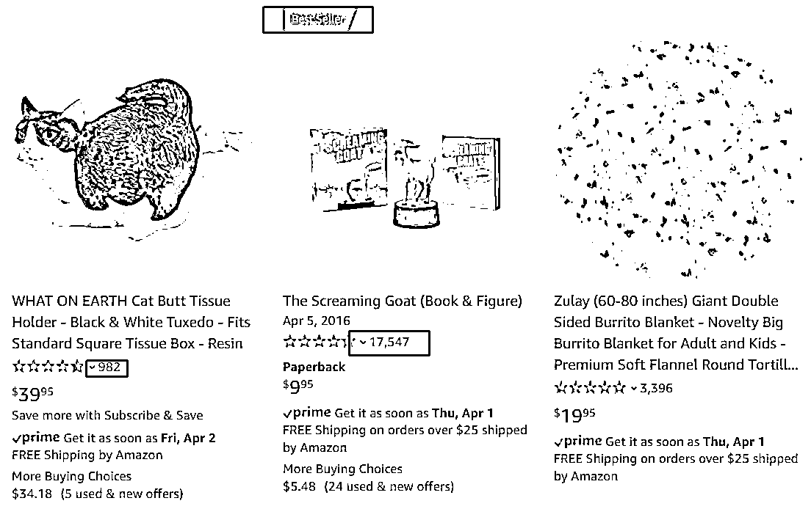

这一类还有能上热卖榜单的产品，市场容量也是足够的。

从谷歌趋势上看这一类的产品也处在一个上升期。

 

 

再通过 Keepa 插件查看价格，也趋于稳定。

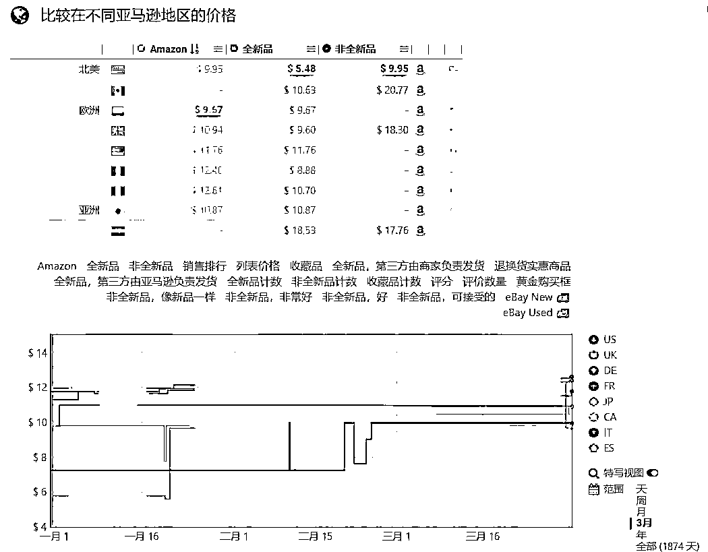

 

 

现在剩下的问题就是视觉冲击力还不够，然后偶然情况下我发现了这么一组产品。

 

 

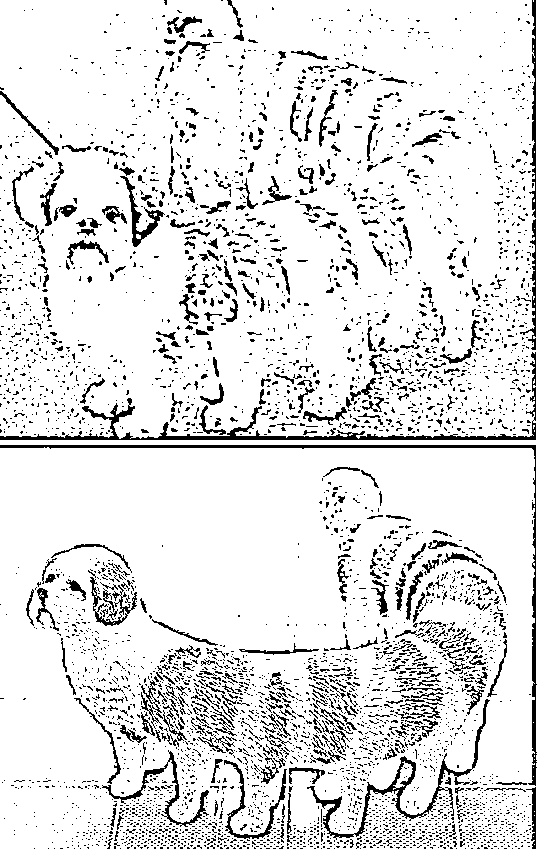

 

 

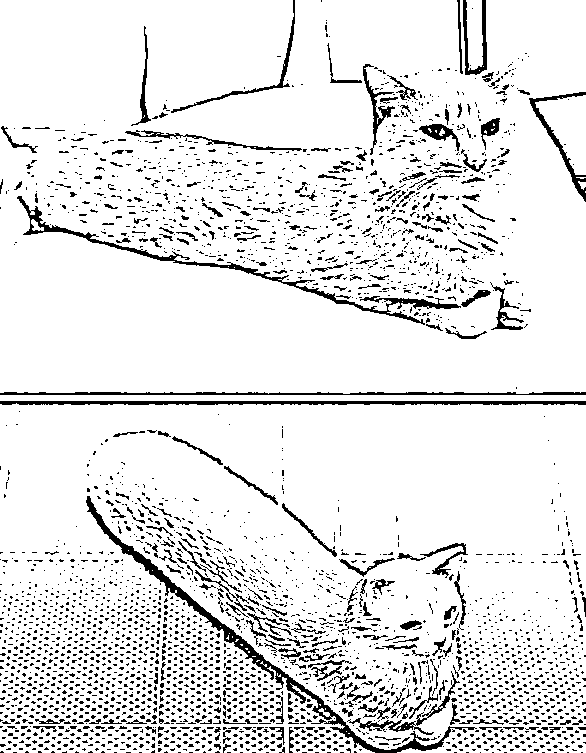

 

 

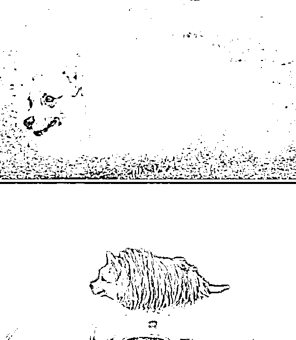

可以把一些网上的神经病表情包定做成产品，视觉冲击力十足，我初步搜索了一下亚马逊市场，有很多神经病玩具产品，但是这个品种的神经病还真没有。

配合充足的市场容量和好的搜索趋势，如果你能联系到这款产品的生产厂家，或者愿意定制这种产品的厂家，说不定可以打开一片蓝海市场。

**3. **实用型选品

 

 

我们逛网店的时候，除了看到一些有趣的小玩意忍不住剁手购买以外，更多的时候是抱着极强的的目的性去搜索产品来选购的，所以售卖实用类的产品也是一个选品的思维方式，并且这类选品的核心也过于简单，就是使用，从而也显得有点宽泛。

而当你面对这么宽泛的核心而无所适从的时候，没关系，亚马逊会告诉你这个核心能衍生出什么词出来。

直接在亚马逊搜索栏输入“ useful ”，能出来很多联想词条。

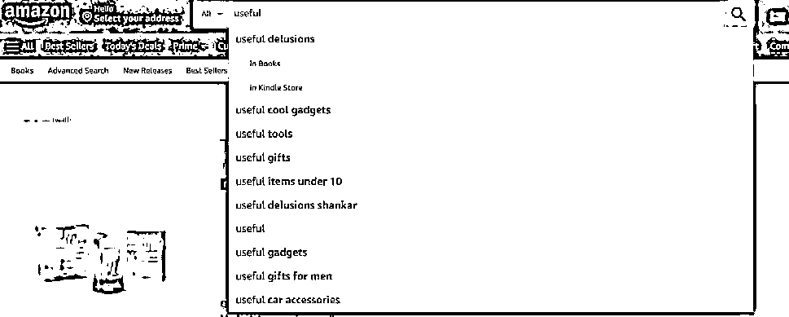

实用型选品有一个隐患，就是根据使用场景的不同产品总是会出现很多意料之外的问题。

比如车载手机支架，这东西你不卖不知道，一卖吓一跳。差评里面全是诸如“手机太重磁铁吸力不够”、“支架吸盘吸力不够”、“要用胶纸站在车上不便清洁”之类的问题。

 

 

这就引申出一个选品的小技巧，从热卖的差评中去选品，看差评分析产品痛点，看是否有改进空间，同时分析 Best seller 的产品特征，我们的产品要有基本的差异化特色，要开发出适合更多场景使用的产品。

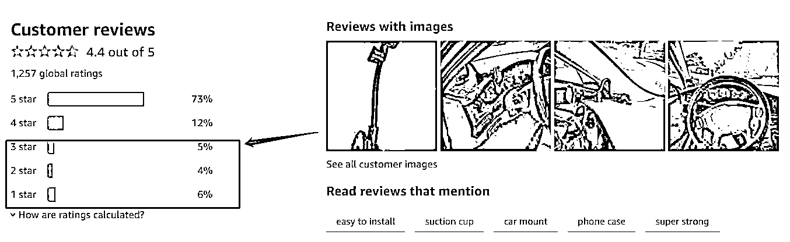 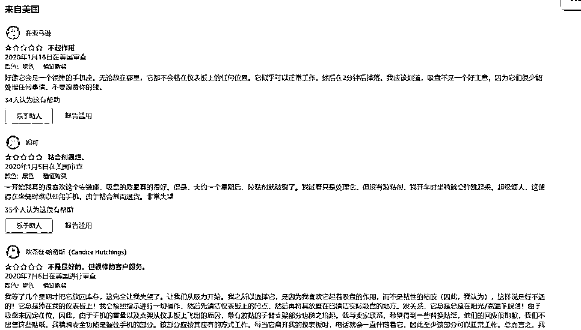

产品本身的缺点、服务上的缺点，通通都会体现在这里，这是你分析竞品优化自己的不能错过的宝地。

**4. **细分市场型选品

 

 

不管做多久的电商，始终还是觉得利基这个词过于抽象，我还是更喜欢称之为细分市场。

比如前面手机支架说的，要展现产品的差异化，开发出适合更多场景使用的产品其实就是一种细分市场。

同样是玩具，一岁男孩、一岁女孩、两岁男孩、两岁女孩，每一个点都是细分市场。

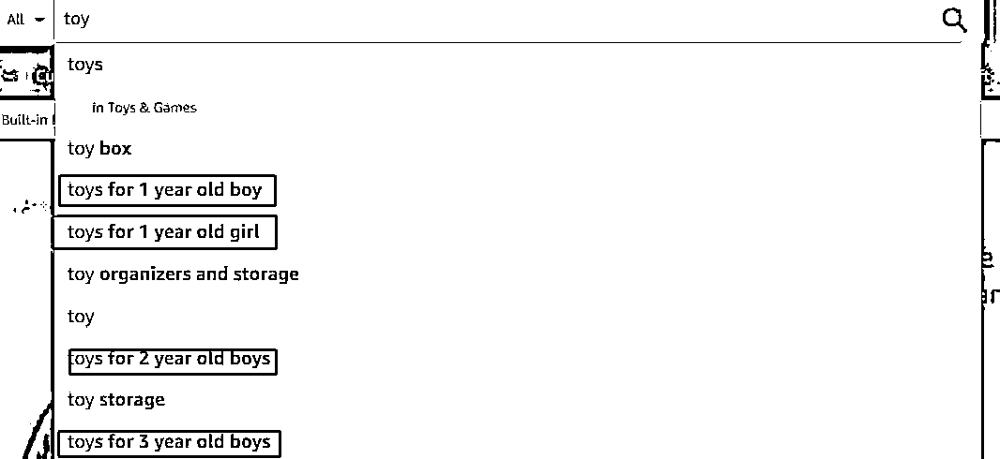

不止是亚马逊，我们还可以用谷歌、 Youtube 、 QUORA 等搜索引擎，我们只用他们的搜索引擎，看看我们输入关键词之后能联想出什么词条。

用 Keyword Tool 这个工具就可以。

 

 

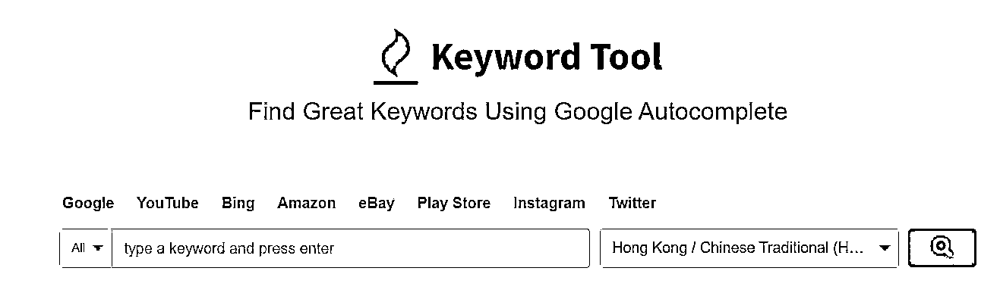

所以我认为细分市场选品的核心就是足够发散的思维和足够精确的定点。虽然看起来很矛盾，但事实就是这样。

比如说我现在要做一个马克杯，我可以通过终极发散的思维去为这个马克杯添加元素，发掘细分市场。

节日：母亲节，父亲节，护士节，独立日，复活节，感恩节，圣诞节

主题：订婚，婚礼，周年，生日，退休，搬家，洗礼，祷告，毕业，怀孕

对象：母亲，父亲，祖父母，姐妹，兄弟，朋友，医生，护士，教师

场景：厨房，浴室，卧室，厕所，花园，办公室

功能：收纳，装饰，保鲜，测量，  应急

就是这么发散的思维，偏偏对应着每一个足够精准的细分市场。

 

 

虽然前面在思路里面说，尽量避开季节性比较明显的类目，以防库存堆积成为接盘侠。

但是在做好准备的前提下，还是可以尝试的，特别是节日，每一个节日都是你产品爆单的机会，要不要搏一搏单车变摩托，你需要自己去衡量自己的风险抵抗能力。

亚马逊主页的产品类目导航，也是一个可以快速挖掘细分市场的地方，以宠物市场为例。

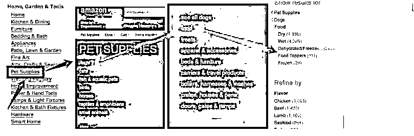

在 Pet Supplies > dog > food > wet 这样去一步一步的挑选产品。

再举个例子，比如家电洗衣机市场已经接近饱和，如何从中杀出一条血路？

我们可以做一个迷你洗衣机，专门洗内衣内裤，专门解决特定问题。

 

 

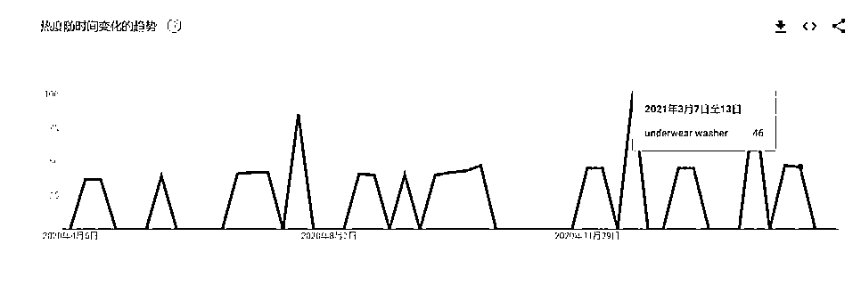

虽然这个趋势起伏比较大，但是一旦有需求的时候热度能升到很高。

在亚马逊也有一定的流量， 1688 拿货价虽然偏高，但是客单价也高。

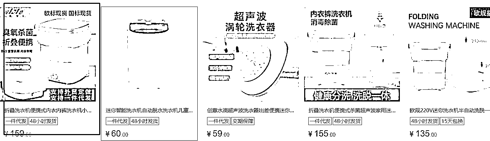 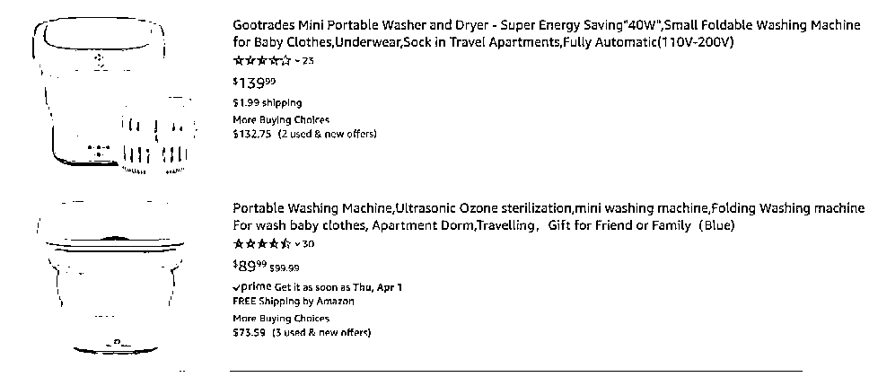

 

 

确定了细分市场，就可以用我之前提到的工具，如谷歌趋势图、 Keepa 插件、 Semrush 等，还有我没提到的工具，如 Jungle scout 、魔词等工具，进行一套确认市场容量→确定产品趋势→确定产品利润的素质三连，就可以选品了。

这种选品要注意观察不同产品、不同使用场景下，选品的季节性周期性问题。

**5. **情感型选品

从马克杯中分散的细分市场选品思路里面还可以提炼出另外一套核心，可以在选品中融入品牌故事，用讲故事的方式去卖产品。

比如卖这种家庭亲子 T-shirt ，不仅很有家庭氛围，还能一次卖出好多件。

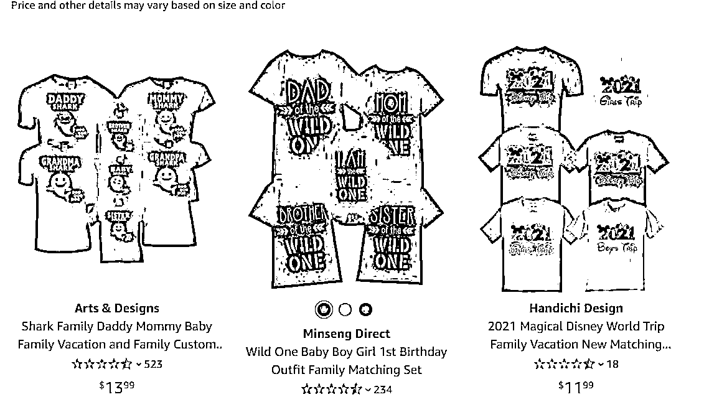

如果你觉得情感型选品这个说法比较抽象，那我们直接提取产品内核。

 

 

这是一类顾客对产品能够产生认同感的选品，或者说购买了这类产品之后我能获得群体认同感。

例如，美国人对文化衫这种产品有着一种我们不太熟悉的热爱，他们很喜欢搞游行，每一次游行都是几千件文化衫的定制，所以在衣服上印 Logo 也是一个可行的选品方案。

服装上的 Logo 和特殊饰品是最快速最直观地展示自己属于某个群体的方式，特别是一些明星的粉丝群体，他们非常总是非常急切地宣扬他们的偶像。

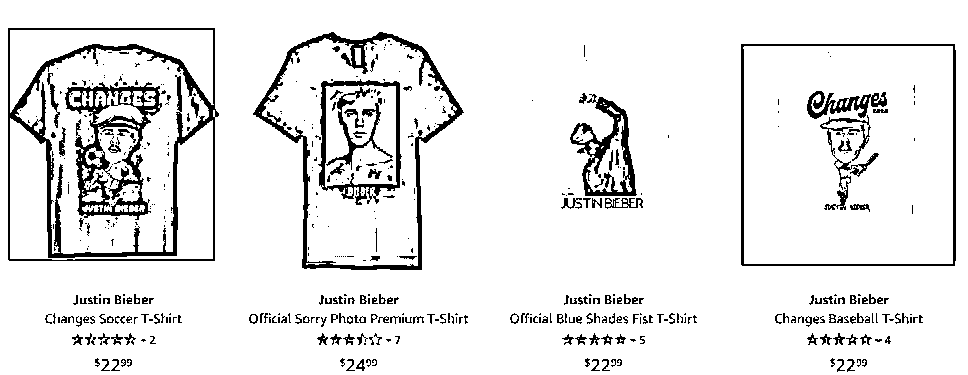 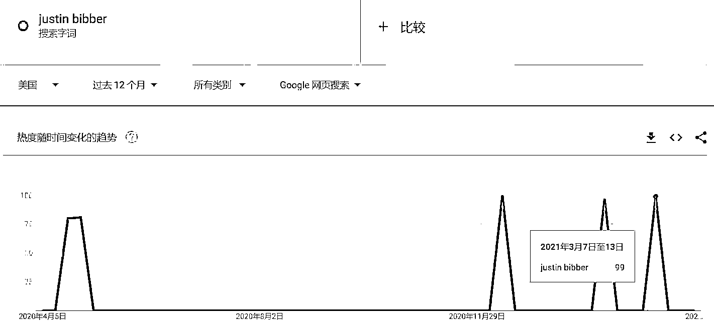

 

 

贾斯汀比伯也算是一个时不时喜欢爆发一波热度的经久不息的老美明星了，他总是这么不甘寂寞。

当然要注意，不要侵权。

或者是一些明星恶搞印花，如奔跑的小李和黑人问号。

 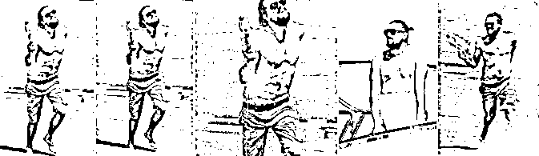

通过热度趋势能看到，这两位也是永远在提供着热度的明星，如何把他们带给粉丝、网友群体的情绪热度转变成你的产品价值，就是情感型选品的关键所在。

 

 

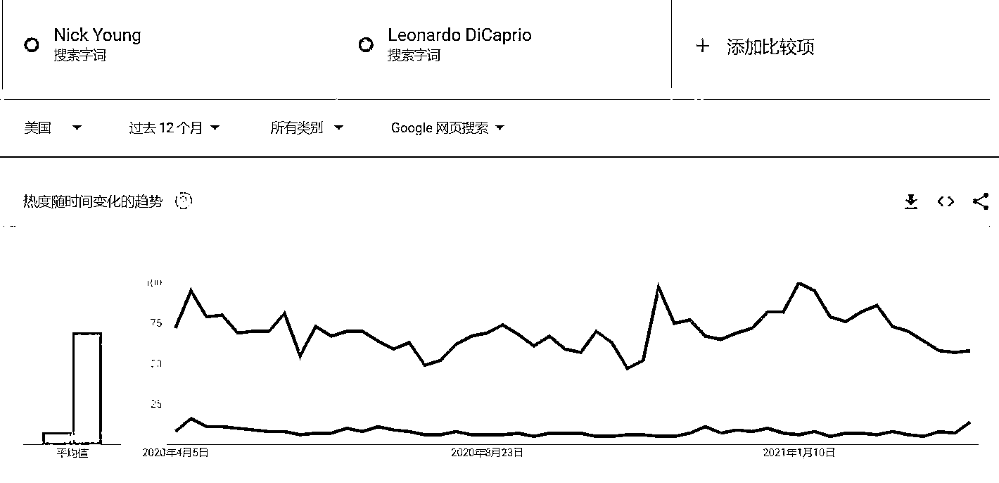

除了主流文化群体，我们还可以把目光瞄准非主流、亚文化群体，比如日本动漫的 ACG 文化， Cosplay 文化等，在美国也非常地流行，是一个虽然小众但是购买欲非常旺盛的群体。

 

 

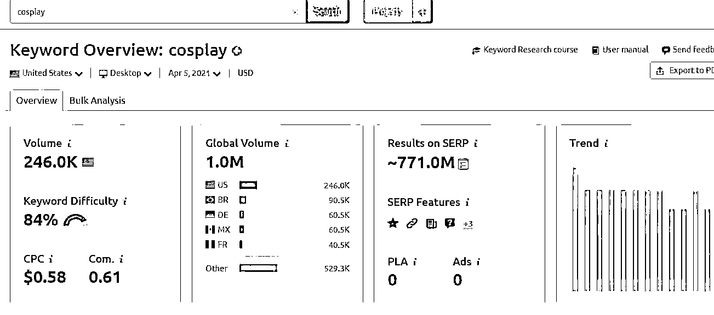

你需要做的是多听、多看，不停地挖掘大众群体的不同的情绪，或者不同的小众群体不同的文化认同感，把这种不同群体的诉求挖掘出来，再把这些诉求变成不限于衣服、口罩、手环、旗帜、手机壳、贴纸等一切可以用来展示“潮流+文化+诉求”的产品。

一定意义上，情感型选品也可以称为情绪型选品，所以与其说是调研产品，不如说是调研情绪。

时刻掌握目标客户群体的情绪走向，甚至在一定程度上调动买家的情绪，毕竟有研究表明，有超过 60 % 的网购行为都是冲动消费，所以在有人看到你的产品就上头的情况下，何愁选品不成功。

** **五、结语

通过这篇选品的文章，我分享了一整套选品的逻辑思维，由浅到深，一环扣一环，你只要想明白了任意一环，再去看别的选品思维，会发现千古选品不过一大抄。

 

 

纯自己开发爆款，大概率是开发不来的，你看罗永浩开发个手机想造个爆款，结果造了个锤子。

我来总结下，选品是一个从具象到抽象再到细分的过程，跨境电商的选品，是同时需要放大和发散的思维和细腻的心思的，需要靠自己的挖掘去培养出属于自己的思维模式和打法，你才能收获属于自己的沉淀。

拥有了这样的选品思维，再加上舍得投资购买工具和工具合理的搭配使用，照猫画虎，你又何尝学不会？

评论区：

鱼丸|亦仁助理 : 今天的分享主要分为 3 个部分：

**1. ** 在资金并不太充裕的情况下，可以减少试错成本的5个选品思路

**2. ** 用 5 个选品工具挖掘海量数据背后的细分市场爆品

鱼丸|亦仁助理 : 3\. 用 5 个可复制的选品思维，锻炼找到爆品的慧眼来，欢迎  和大家交流。

小马丁 : 感谢沐文大佬指引，感谢鱼丸邀请，感谢生财官方给的这个机会。希望和大家多多交流学习[拥抱]

沐文 : 马丁哥真棒！！！！！加油💪

飞奔的白羊古城 : 期待亚马逊大航海船

小马丁 : 谢沐文哥[拥抱]

小马丁 : 共同期待~

焦波 | 水镜 : 厉害了马丁兄弟~ [强]

# **# ****(**精华帖**)(173**赞**)5000 **字讲解跨境电商选品逻

# 辑

作者：  君途-👾

 

 

日期：2022-05-24

本文来自于我自身的选品经验和总结，仅供参考。

要做好一个跨境项目，离不开“产品+内容+渠道“。若追求短期利润，三者中缺一尚可，如爆品站铺货模式就是”内容+渠道“，”供应链+亚马逊“则是”产品+渠道“。但长久来看，要实现持续稳定的竞争力，三者都不可缺。

这篇文章侧重讲解【产品】板块，【内容】和【渠道】板块我之后再找机会分享。

01

—

流量

好的产品=好的流量！好的产品=好的流量！好的产品=好的流量！

在互联网世界就是流量为王，谁能在繁杂的信息流中被看到，并且点进来！谁就可以在同等的大流量池里面获得更多的交易机会。所以要了解产品，先要了解流量；

对于电商领域的新客而言，流量无非就两种，一种是搜索流量，一种是推荐流量。两者并不完全割裂地存在，而是一般以“三七开”分布。搜索的排序带着推荐，推荐的结果又参考了搜索的记录；

**1. ** 搜索流量

特征：转化率高

 

 

我们在百度搜索商品，在淘宝搜索商品，在亚马逊搜索商品，其目的都是为了了解和购买这款商品，所以用户本身的意向是很高的。所以搜索流量的转化率一定会很高，以亚马逊为例，全网累计约有80%。如果你的很低，无论是【曝光-点击】环节还是【点击-成交】环节很低，那你的客户一定是被同行转化了，这时候就需要自己尝试不断地去【搜索-对比-优化】，来迭代自身的展示面，提高自身的竞争力；

流量的获取：永远地**SEO**

seo（search engine optimize）,搜索引擎优化。即利用搜索引擎的规则提高网站在有关搜索引擎内的自然排名。即利用平台的规则，在平台上抢排名；

SEO适用于任何平台！只要它有搜索！所有做小红书，淘宝，闲鱼以及各种互联网平台的项目，尽管他们的规则不尽相同。比如美团更注重地理位置，淘宝注重销量，闲鱼注重信誉。但是！他们都一个做法是相通的，就是优化关键词，这又是个很高深的学问，这里不做展开，只讲核心思想：让客户能想到和你相关的所有词语都在你的产品页面出现！

换而言之，你会发现有的sku是很难被精准地搜索到的，比如下面这只【透明的内部有金属配件的朋克风熊吊坠】，这种产品极度不推荐在淘宝等搜索主导的平台售卖，它更适合推荐类平台；

 

 

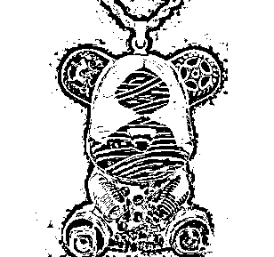

还有一些神器，像下面这款【手摇切丝机器】，在你看到产品前都不知道这种东西存在，更不会去搜索，所以这类产品也不建议在搜索为主的平台销售。

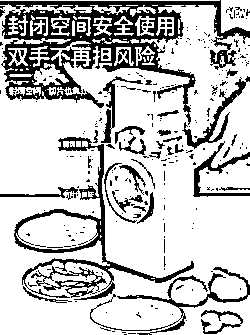

**1. ** 推荐流量

特征：随机性强

在推荐的算法研发中，人类只制定规则，结果由机器判定，所以出来的结果人无法精准预测。

 

 

以抖音为例，它会把你的视频推给你标签近似的10个人，作为第一个用户池子。如果10人里面有3个人点赞，就推给有100个人第二个用户池子，以此类推。

这种情况下，如果说就是碰巧！前面10个人没人点赞，这个视频就不会再被传播。所以抖音经常会出现两个一样的视频数据完全不一样的局面，于是也就有了“多个账号发同一个视频，搏运气跑出一个”的做法，结果往往是能跑出1-2个的。这个案例能很好地体现推荐的随机性，不过后来抖音优化了查重机制，重复的视频会被限流，所以矩阵视频的玩法也走不通了。

流量的获取：标签（精准人群）**+**内容

从上面的机制来看，要提升推荐流量获取有两种方式：一是让每一批用户更准确；二是优化内容，提高点赞率；

上述的【手摇切丝机器】，其产品使用过程本身就是好的内容，教你如何轻松切菜，所以很适合用于推荐流量，尤其是短视频这种内容承载量大的媒介；

以上的分析除了自然流量外，同样适用于广告。

02

—

差异化

 

 

这是我很喜欢的一张图，里面的格子相同，每只格子里面的小鸭鸭其实都不尽一样，但我只看到了蓝色的那只，尽管它真的很丑，但还是成功吸引了我的注意。

这在淘宝里面也是一样的，有些产品实在是太过于标准化了，以至于和其它产品完全拉不开差距，这样一页铺开直接就被忽略了。淘宝还可以在宣传图上做些功夫吸引注意力，而亚马逊只能放白净的抠图。。。

 

 

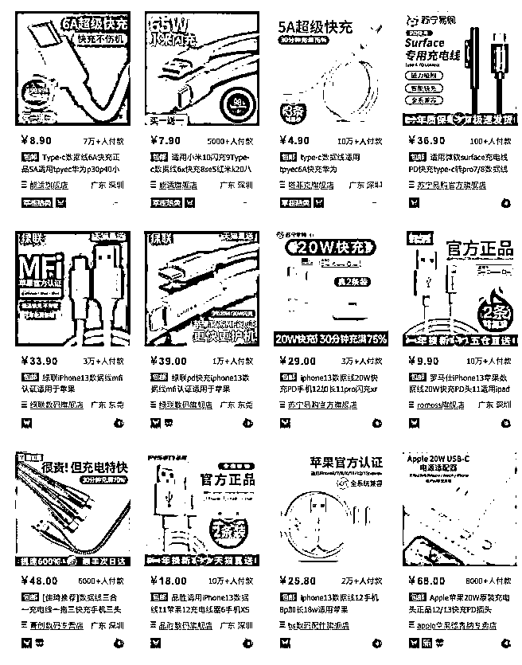

 

 

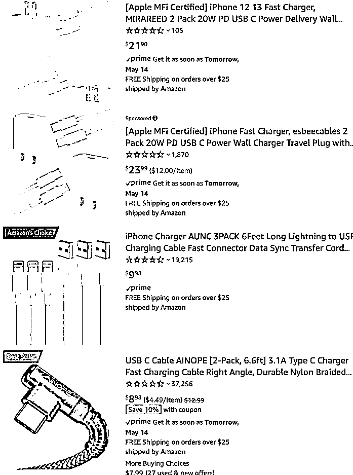

（搜索数据线，上边是淘宝，下边是亚马逊）

所以外观上的差异化是商城货品的突破口！尤其是搜索类商城，因为它会把一堆同类品摆到一起，让人选择困难。

说到数据线，必须要提一嘴老大哥anker，看看别人是怎么做亚马逊的。

 

 

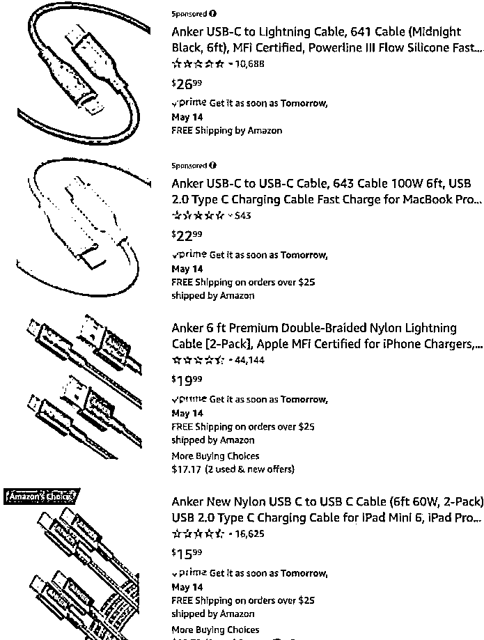

（亚马逊上的【anker】搜索结果）

 

 

数据线绝对是3C产品里面标准化程度数一数二的品类，但在亚马逊上搜索【anker】，和上面的亚马逊产品列表对比，从颜色，到设计，到材质，再到凹出来的造型，各个维度都碾压上面那一批白色的公模产品。

实际上，anker极度注重【产品外观】和【电商呈现】上的差异化设计，光是一个数据线就设计了8种颜色及5张图，而数据线这种产品其实没太多技术含量，在华强北待一天能找到100个同品类供应商。

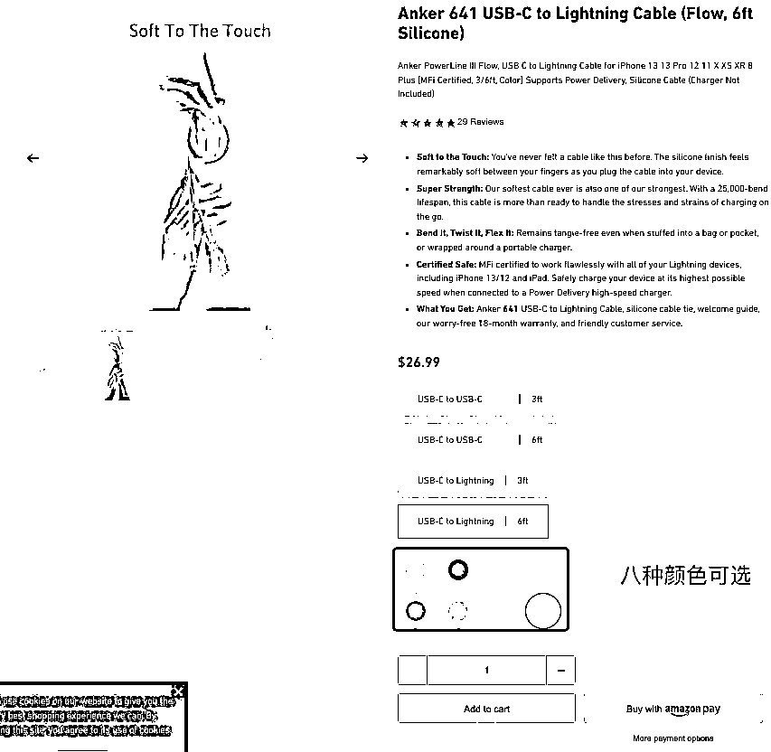

（anker官网数据线的产品页）

所以做商城，就多在外观的差异化上下功夫，做到差异化。

 

 

03

—

竞争度研究

就我个人而言，我知道好的项目非常多，能赚钱的方法非常多，但后来都是做的人太多了导致僧多肉少，最后大家吃得太猛蛋糕不够分，收益顶不上自己的辛苦费。

举个例子，在人流量大的地方卖早餐，本来生意很好，但别人看你生意好又在周边开了10家，经营的工作没有减少，收益却变成了1/10。

而在互联网，更多的是另一种情况，一个流量大的地方，只有一个铺位能租，谁租到了就能拿下所有流量。于是10个人竞价抢租，有人算了加房租后能赚10%，干了；有人算了再加房租后还能赚5%，干了；又有人算了再加房租后还能赚1%，目前好像没有别的出路，也干了。最后1%利润的人拿下来，又累又赚不到钱，收入都用来交租了，房东钵满瓢满。

在电商行业，平台方就是房东，你们竞争越激烈，它赚的越多，最后除了平台方之外大家都是输家，所以选品的时候，要严格考虑竞争度。

由于两种流量差异大，这里还是区分开两种流量来研究。

推荐流量

卖家的时间一般不充裕，没办法经常浏览国外的软件看他们推荐的产品，得到充分的选品思路。那么这个时候就只能使用广告监控软件了。举个例子poweradspy就是一个典型的广告追踪软件，你可以在上面批量查看广告。像这类广告数据化软件有非常多，可以让你非常直观的查看热门广告，相关的点赞数和评价数。

 

 

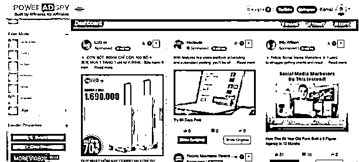

（选品需要用到的广告工具）

有时候，你可能会在这些广告间谍软件里看到很多有意思的热门产品，但是一定要保持理性，不要认为一个产品很酷炫就盲目选择这个产品，有时候这些广告不过是特效广告，而真实情况下是没有这样的产品存在的。这个在COD模式中非常常见。另外一个需要考虑的是自己的货源。并不是所有的产品都能在1688上面找到的。所以如果你对产品的预期过高，而供应资源没办法跟上，也不过是在空谈。

目前2022年，这类广告间谍软件已经是比较落后了，因为太多的卖家在使用同一款软件，看类似的数据。最终的情况就变成了，大家都没办法赚到多少钱，因为每个产品爆款的生命周期都太短暂了。

关键词难度

关键字研究的工具很多，最好用的应该是ahrefs和semrush，不过这两个工具很贵，我每个月都会花5000左右在这些工具上面，但我觉得作为个人能力的补充其实也值。

Shopify选品是可以通过针对关键字进行开展的。核心逻辑就是找到搜索量高但是竞争较低的核心关键字，然后进入市场中做这个产品。必须得说这个策略是最难的，因为我相信80%的关键字都已经是血海一片。既然想要找到剩下的蓝海市场是非常非常难的，但是只要通过合理的手段和方式，就能找到。

这里核心关注三个指标：keyword difficulty （KD），月搜索量，趋势；

**keyword difficulty **（**KD**）

 

 

反映的是竞争激烈程度，范围在1%-100%，越高竞争越激烈，一般认为80%以上想都别想，60%-70%的仍具有市场空间，40%-60%未来可期，40%以上前途无量。事实上40%以下的词已经很少了，常常是品牌词或者长尾词，如果顺着这些词找到他们品类最标准的词，往往都在80%以上；

月搜索量

反映的是市场需求，一般认为近似词累计1k以下的市场完全不值得做，但有一种情况是头5个词的搜索量都接近且很大，因为这商品没有一个标准的叫法，叫什么的都有，这时你只要能在一个叫法上做到第一名，能分到的流量就很多了；

趋势

反映的是这个市场的未来，如果是慢慢增长，那说明还有未来；如果是迅速增长且到了一个平台，那等你入场的时候这款产品的红利期大概率是过了，下一个红利期一般又要等三年。如果是下降的趋势，就好好考虑一下还要不要进场。

特别注意的是，有一些周期性的产品，永远有机会入场，比如泳衣，在今年夏天前大量推广前两年的爆款，还是可以获取到不少流量和收益的。

04

—

用户生命周期价值（Lift Time Value）（有点超纲）

LTV指的是你的用户中，平均每人一辈子能在这里的购物金额是多少？

如果做的是3C，或者是自有品牌，那这个板块如果设计好，会成为超级大招，直接让利润翻几倍。

这个板块偏向于商业模式和企业战略的设计，如果你是新人卖家或者大厂打工人，在这方面的决策上基本不会有太多话语权，可以忽略。

**1**、搭卖

一个买衣服的人，近半数都会愿意再买条裤子来搭这身衣服，如果有的话，还可以再卖他一顶帽子，这时再配一双鞋子就实现完全代入了。

 

 

当然这是极致理想的情况，但一般情况来说，这样的方式一定比单卖一件衣服来得利润高；

搭卖的做法不仅在产品上需要设计，在店铺的布局和运营上也需要有完美的布局，才能循序渐进地引导用户二次加购。

需要注意的是，这些搭卖的产品必须符合目标人群高度统一，才能提高每次加购的可能性。小米是很典型的案例，虽然它做的品类很多，但都是围绕着，【朴素却追求智能】的这波男性用户来进行产品设计的，所以会让人买了又买。

**2**、软件增值：

如果做的是3C类产品，而恰好你是品牌方，而又恰好产品需要个app，那么恭喜你，你已经脱离了3C制造业的低利润陷阱了。

3C属于制造业，制造业的成本高，服务成本还很高，所以利润普遍很低。而且还耐用，正常一个小家电都能用三五年，所以导致复购率也很低；

但是，如果你的app里面能提供那么一丢丢的增值服务，这个事就不一样了。

比如说，海康威视的监控系统，本身一套下来的价格才几百元，如果我要加一个【人脸识别】的功能，则每个月租用云服务的费用是20元，再加个【车牌识别】的功能，每个月又要加20元。对于用户来说，如果真的有需求，每个月这一点费用影响不大，但是对于品牌方，这个机制下很容易实现第一年的利润翻一倍，而且明年还可以继续收费。

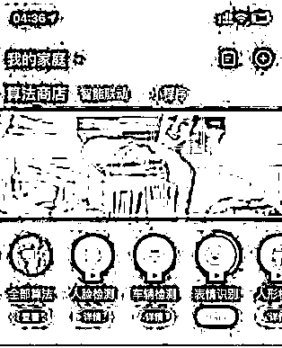

 

 

（海康威视的app里面，算法商店板块）

还有一个案例是华为手表，整个手表定价不过1500元，但买回来之后下载app，发现上面还可以买表盘，最贵的定价甚至到了88元。

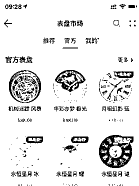

（华为健康运动app——watch GT 2——表盘市场）

这里还是需要回归到用户画像来看，对于华为的用户来说，一般购买力都是不弱且支持国产的，所以花88元支持一下国产其实并没有什么不妥。

**1. ** 耗材：

如果一个3C品牌，想要让用户源源不断地想起你，源源不断地购买你，那么耗材一定是最性感的。

我第一次听到这个说法其实不是在跨境电商，而是飞利浦的电动牙刷。

 

 

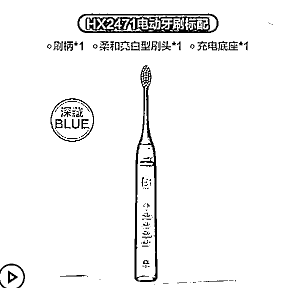

这只牙刷价格560元，应该是加上了产品设计费和品牌溢价，所以第一批的利润估计也还勉强可以，但是，他的刷头是每隔一段时间需要换的，于是就有了下面这款产品。

 

 

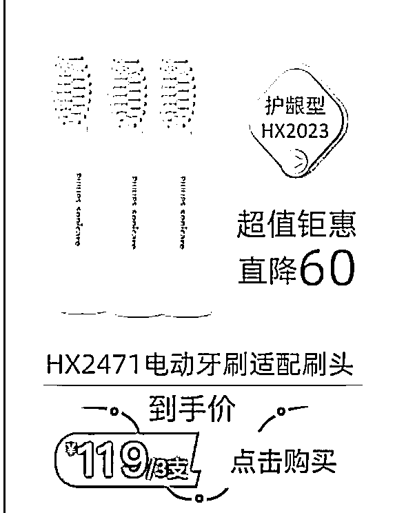

这种产品的批发价格，说实话在国内9元3支就差不多了，但是因为它是飞利浦的专用牙刷，而且上面那款牙刷的用户其实客户群体消费力都很强，所以根本不在乎这一百元的差价，刷头高价也不愁卖。

这里我们计算一下利润，三个刷头毛利润100元，大约可以用一年，而电动牙刷毛利润我估计在300左右。于是利润就变成了【300+100*年数】，那就解决了一个卖家的痛点，3C产品耐用导致复购低的问题，这个模式用得越久，复购率反而越高，换刷头这个机制也容易让客户接受。

 

 

但是！这里有两个点要注意的，否则耗材会被大量平替，让别人抄刷头而流失掉一部分用户。

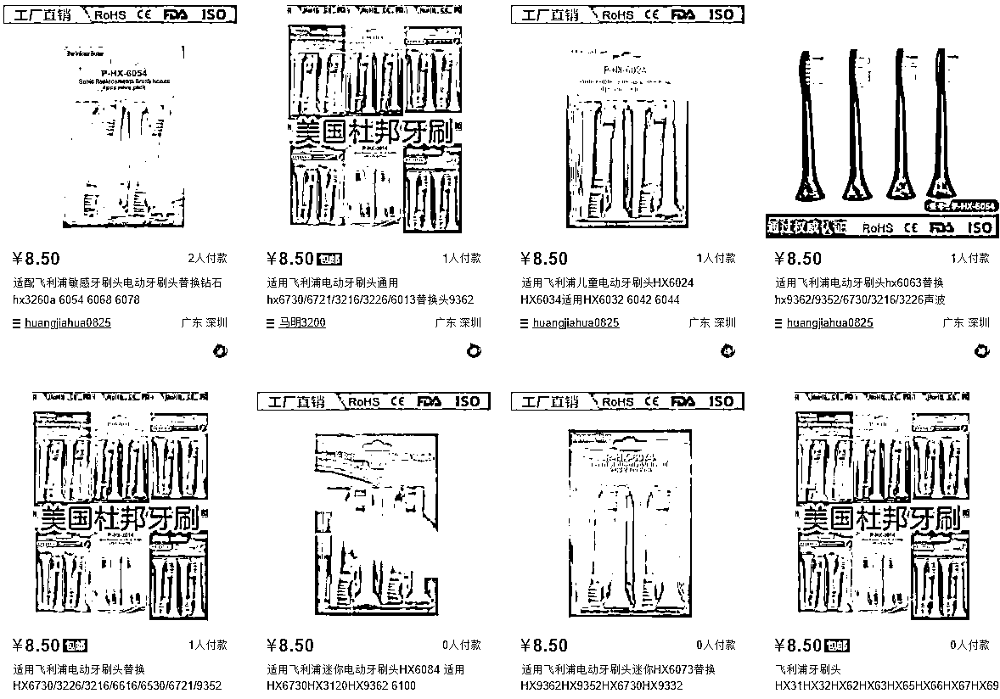

（淘宝上在卖的飞利浦平替刷头）

第一个是耗材要包装得有点技术含量。比如什么【纳米材料】，【tritan耐热科技】等，用这些词来抬起价格壁垒，因为便宜货说自己有什么科技，即使是真的也没人信的，哪怕这个科技本身其实真的很便宜。

第二个是定价要回归用户人群。再次提到了这个点，如果说飞利浦的牙刷定价是200元左右，那么客户人群就会更追求性价比，这时如果要卖119三个的刷头，客户就会去找40元左右的平替；

类似的模式，蓝月亮也玩得很溜。

 

 

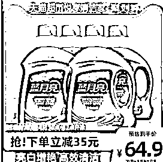

如果洗衣液用完了，客户会想“该换一瓶洗衣液了，想想该买什么牌子的。”

但是，如果你知道有下面这个东西。

决策就会变成“我什么时候该去买一瓶补充液”，这个方式直接斩断了客户选择竞品的可能性，毕竟只要上一瓶用得不算太差，那么补充液总是要比新买一瓶便宜点的。

 

 

以上就是我用5000字分享了我对跨境电商选品的思考。

**END**

评论区：

亦仁 : 挺清晰的选品案例，不仅仅跨境电商，其他项目也需要。

嘻嘻嘻 : 精彩[强]

丛政 : 写得很好  深入浅出

亦小亮 : 关键字研究的工具很多，最好用的应该是ahrefs和semrush，那国内最好用的是？

西昂 : 5118/chinaz/aizhan都可以啊

亦小亮 : 谢谢啦

奔跑的汤圆 : 受益良多[强][强][强]

泡芙🐵◌ི^ྀ : 惊呼：大佬

# **# ****(**精华帖**)(162**赞**)**独创：必胜法之四步打造一

# 个百万爆款

作者：  跨境杨少

 

 

日期：2023-01-29

——新手别着急上架铺货，先变专业一点才是捷径

1.我怎么看亚马逊、独立站、Tiktok、速卖通、Etsy、Ozon、Shopee、煤炉2.第一步【找蓝海】：蓝海市场、蓝海平台、蓝海产品方向

3.第二步【走捷径】：流量捷径、转化捷径

4.第三步【加光环】：快速获得品牌力、溢价、复购

5.第四步【微创新】：获得更长的红利期

正文：

大家好，我是跨境杨少，13年跨境电商老卖家，独创《选品四层方法论》，跨行业多项目连续创业者，90%以上的项目年变现百万级别，因为我是蓝海偏执狂。

很多朋友对我的《选品四层方法论》感兴趣，本文是这个方法论的微缩版(完整版是付费课程)，我将选品从底层往上分为四层：

1.套利

2.流量&转化

3.模式

4.品&品类。

其中，

 

 

1即低成本、信息差和确定性 ——控制风险

2即每一份钱和时间的花费都必须解决流量&转化两者或其一 ——杜绝自嗨

3即选品应进化为选模式 ——长红利期

4即要有自己的“选品字典” ——规模复制

这些在我以前的精华文中，有过一些解说，本文通过描述一个四步选品范式，来带大家感受一下这个4层结构是如何被满足的。文章标题一如既往耸动，竟然大言不惭说是必胜法，但一年多来，我不止一次分享此文，有作为亚马逊官方活动嘉宾的，也有在其他一些线下大会上分享，听众中不乏大卖、大v、大服务商、大外贸厂老板，基本上大家都承认，他们的成功大多没有脱离这4步所在的范畴，其中有一些是做国内电商的朋友，也觉得有启发，有的还真的按这个思路选出了可以在淘宝卖的蓝海产品，有的客单净利高达200-400，并且红利期还比较长。所以本文正标题就没有再强调跨境电商四个字了。

生财有很多大咖大v，本质是非常成功的流量团队，流量做的好当然就可以成功，甚至一夜暴富，但总有昙花一现的焦虑，最近看到盗坤公众号po文反思自己因为没有一个长期可做的好产品，而常常有在打游击之感，这是事实（很欣赏盗坤的自我迭代能力）。生财当然也有做产品水平很顶的大v，比如seven，但他的产品大多做白帽流量，相对很多流量团队的打法来说，有点偏冷启动的感觉。试想强流量与强产品如果能合璧，岂不是一个赢面非常大的长期主义的生意。

讨论怎么做产品是很复杂的，有钱的打法有各种各样，说起怎么做差异化来，也许三天三夜也讲不完，本文试图从没钱的角度来讨论，做产品到底有没有什么成功率比较高的套路和规律，也希望能抛砖引玉，炸出更多的产品达人来分享自己的经验。

 

 

# **# ****1.**我怎么看亚马逊、独立站、**Tiktok**、速卖

# 通、**Etsy**、**Ozon**、**Shopee**、煤炉

会选品的人，在选平台的时候就能看出来，那些选了1.小语种发达国家，2.人口大于一个亿，3.有本地入驻门槛的头部平台，是不是听上去就比不分青红皂白去做的人赚钱更轻松一点呢

先记住上面3点。

# **a)**亚马逊

亚马逊怎么样，这问题没办法回答(专业的人容易较真，见谅)，因为亚马逊有欧洲、北美、拉美、日本、澳洲、印度、中东等，都好做吗，那肯定不是，比如澳洲是发达国家呀，客单也高呀竞争也少呀，但人口才两千万，亚马逊市占率甚至还低于ebay，同样的功夫花下去，出不了几单。

我认为欧亚、美亚、日亚还是可以做一做，但也仅限于蓝海选品。

美亚现在风评很不好，似乎很多新手亏了不少钱。但同一套蓝海打法，跑到虾皮毛利润没有，在亚马逊仍然可以客单净利100人民+。

新手不懂蓝海，抓不到亚马逊的利基市场，不仅铺货还乱压fba，一亏十万起，谁的问题。

 

 

fba好还是fbm好，判断标准四个字：客户体验。fba物流时效快，客户体验更好，产品有竞争的话，客户体验更好的人出单。如果真的抓到蓝海独家产品，只能找你买，你发货慢他也只能等，fbm也一样出单，所以蓝海选品完全可以fbm测品，减小成本风险。

我听过很多跨境主播的直播间，几乎没人把客户体验以及分产品这个判断依据讲出来。

所以，新手面对1.亚马逊好不好做 2.fba还是fbm，听谁的?听自己的!你要先懂!要知其所以然。讲不出所以然的，大概率镰刀，然后镰刀还告诉你，说可以fbm的都是割的不要问为什么，听我的就行，包你赚钱——嗯镰刀的第二个特征就是承诺可以发财。

# **b)**独立站

过去三年我对接服务过1000多个独立站(有的老板是站群)，有些品类我一看基本就知道有没有戏，比如两三年前大部分独立站是杂货铺，确实有老板可以一个月赚100万，但近两年都死光了，因为杂货铺基本都是靠fb测爆款模式，本质上是铺货思维，没有选品，只是铺货形式展现为去fb铺广告组了(独立站站内铺货没意义因为没有自然流量)。

现在还活着的是品牌出海站、垂直站、定制站。

两三年前顾小北强烈推荐的fb+shopify模式，现在也只能偃旗息鼓。

所以现在很多人说，独立站不好做了，不行了，这部分人基本都是掉过fb测爆款的坑的。

上一篇文章我谈到流量分两种，人找货和货找人，fb流量就属于货找人，现在由于模式信息差没了，测的人多，甚至还有很多不发货不对版的，roi早崩了。

但是独立站也有“人找货“这种购物平台式流量来源，这就是seo（见效慢不推荐）、搜索广告和google shopping广告，如果再加上会蓝海选品，这部分独立站玩家目前是容易赚钱的。

但目前世面独立站相关课程大多还是fb+shopify这个模式的，模式早崩了，就是顾小北亲自来教你，也没用。

 

 

所以说好做，说不好做都对，听谁的?听自己的!自己要懂底层判断依据:1.流量 2.转化。

让自己稍微多懂一点，专业一点，不是那么难的，不专业咋赚钱呢。

# **c)tiktok**

又是个跟fb一样“货找人“的流量性质，算了，洗洗睡吧

tk是个娱乐平台，你卖货就要拍产品的视频，产品的短视频咋娱乐别人? 平台为什么要给你这种视频流量?

tk又分好多国家的，你选的好吗，不会又选到东南亚去了吧，oh my god。

大力出奇迹，每天上100个视频，我要all in~~你的时间不值钱?你all in一个月好好打工一万块赚不到?你这样做tk跟赌有啥区别?

我上一篇文章谈到90%新手做tk是两条腿断的在走路，一条就是流量，一条就是选品。

另外是不懂得用付费广告解决流量跑的出去和通过投放标签选择相对精准的人群。但目前结合tk广告一级代理商的数据来看，tk广告投放的roi极不稳定，即使付费玩家盈利的也不多，何况喜欢蹭蹭就好的玩家呢

tk让人心痒的地方就在于，每天都有人自然流量爆单，但让人心碎的是每天爆的都不是你。

成功老板都是抓确定性，只有韭菜财迷爱抓彩票，我接触的大卖，没有一个主战场在tk。

# **d)**速卖通** **虾皮

 

 

低价平台。

这两个平台的卖家，都比我厉害，因为我算来算去他们都是亏的，我是真的算不出他们怎么赚钱，那价格真的我只能说word妈，我认输，我太菜，我看不懂，再见。

我在速卖通曾有过短暂的成功，大概两年不到，因为我做了一个在国内抢注成功的品牌的山寨，类似的打法还有抢注国外三线商标到手表之类的上面，然后上速卖通，因为速卖通只要有国内商标注册证就合规就可以卖，老外分不清这些，可以蹭流量，高客单高转化。

虾皮有一部分赚钱的店群卖家，产品或多或少还是跟侵权沾边，虾皮的现状是仿牌都卖亏本价，这让我们做蓝海选品的怎么玩，虾皮的入驻广告铺天盖地，跨境电商界坑宝妈和副业人群最多的就是虾皮。

Temu也是低价平台，也不建议新手入。前两年fanno出来的时候，跨境界一片欢欣鼓舞，当时我接受一个财经媒体采访，我说不看好，因为1.低价平台，2.作为字节亲儿子，tiktok却不导流，底层上流量和转化这两点都是存疑的，半年后果然崩了。

# **e)etsy**和**ozon**

相对新兴平台，有一定铺货红利期，估计也快结束了，ozon也是个低价平台，意思不大。

俄罗斯现在把西方大牌赶走了，将平行进口合法化，因此在ozon上卖仿牌有一定红利期窗口，只要你票据全，你懂的，中国卖家这些都能搞定。

etsy有很多设计师产品，在手工艺品这个类目上，迭代的比亚马逊快，跟亚马逊之间有平台搬运红利，有助于亚马逊蓝海选品参考。

 

 

# **f)**煤炉** fb**商城**c2c**

这两个几乎都是店群或者批量账号卖仿牌的，不多讨论了。

# **# ****2.**第一步【找蓝海】：蓝海市场、蓝海平台、

# 蓝海产品方向

我将蓝海市场蓝海平台做如下分类：

最蓝的（第一类蓝海）：1.小语种发达国家，2.人口大于一个亿，3.有本地入驻门槛的头部平台  ，比如日本乐天

次蓝的（第二类蓝海）：1.发到国家，2.人口大于一个亿，3.平台仍然有蓝海选品空间，  比如亚马逊欧美日

微蓝的（第三类蓝海）：1.新上线的平台  ，2.刚开始开放中国卖家入驻的平台  ，即使是低价平台也有一点铺货红利期

不蓝的：所有低价平台

只要你有选蓝海市场蓝海平台的意识，你就已经超过了90%跨境小白和新手。

然后寻找这个市场的蓝海方向，比如日本我们找到真皮这个方向，美国我们找到户外防风防水科技材料这个方向，有没有一定的方法可以按图索骥的发现这些方向？“海关壁垒”算一个，还有“平台搬运”、“材质升级”等等，更多方法和怎么具体落地在我的付费课程《选品四层方法论》里面。

 

 

真皮这个方向属于海关壁垒，详细文章见我第一篇精华帖，里面有详细的筛选过程、落地案例和细节。

简单来说就是，我们通过筛选日本海关关税信息，发现真皮制品在日本的关税非常高，导致真皮制品在日本这个市场的价格长期处于高位，没有被传统外贸倾销过，价格体系没有被打破过，比如真皮的靴子，日本人普遍认为应该卖到100多美元以上，而中国工厂出厂价格有的仅有几十人民币。这就是一片广阔的蓝海选品大方向。

蓝海方向不是蓝海品类，真皮或者科技材料，可以做的品类有好几个，比如真皮我们重点选择了鞋类，科技材料我们即做了鞋类也做了服装类。

蓝海方向虽然有了，但还是很宽泛的，距离落实具体选品，虽然还有一些距离，但这一步，我们已经开始解决精准流量了，因为真皮就是一个相对垂直的关键词，对应的就是对产品有一定要求，并有一定消费力的人群，同样高科技材料也是一样，有自己的搜索量。

到了这一步，你已经实现了蓝中蓝，基本告别了难中难（比如虾皮），可以说超越了99%刚入门的小白和新手。

# **# ****3.**第二步【走捷径】：流量捷径、转化捷径

“七分选品，三分运营”？

 

 

我们认为选品就是运营，运营要解决的问题主要就是两个：流量，转化。

好的选品，在确定具体产品的时候，就已经确定引流方法，和转化方法（卖点）。

即好的选品模式，必须把流量和转化，解决一个，或者两个都解决。

我们举一个两个都解决的选品模式的案例：

合规山寨

很多朋友分不清山寨和仿牌，仿牌是违法的，山寨虽然确实是有一些产品是侵权的，比如侵犯商标权，专利权（外观专利  设计专利  知识产权专利等），但也有大量的山寨产品可以做到合规，为了区分，这类合规产品我们不使用山寨二字，而使用“平替”二字，即：

合规平替

合规平替不仅可以平替具体明星产品，也可以平替高端材质，这两种做产品的方向都是自带流量的，因为明星产品和高端材质，是有相应的搜索流量的，这也是我们可以布局的精准流量，只要产品合规，有自己的品牌，在亚马逊是可以大胆投放竞品品牌的关键词广告的，包括了很多知名大牌，除了品牌词，还有产品系列词等等，都是好用便宜的精准流量词，既可以直接投放付费广告，也可以做关键词优化自然流量。在我们的课程里，这部分提供了4个具体的寻找精准词的引流方法，另外还包括平替如何实现合规。

在真皮鞋类，我们给一个合规平替的案例如下图产品

 

 

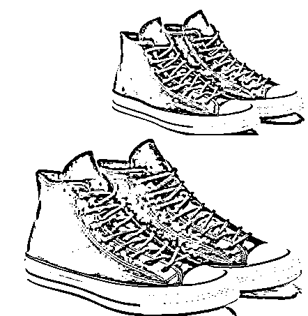

其实这个平替产品选择的很一般，因为背后的明星产品的原价并不是很高，品牌也不是奢侈品品牌，这个带来的影响就是，转化率不太行。之所以举这个例子，是因为这个产品在第四步差异化上我们给他增加了一些确定性热点元素，做出了高客单高利润的产品。

好的平替，可以打原价的十分之一的价格，净利润还有200人民币以上。

这就是为什么我们说这个选品模式把转化也解决的很多，因为它提供了极致性价比。在发达国家市场，平替切忌做低客单的烂货，一则赚不到钱，二则退货会非常多，甚至会倒亏钱。具体标准就是要能达到原产品的客户体验的90%，但是价格只有五分之一甚至更少。

材质平替的案例我们看这个产品：

 

 

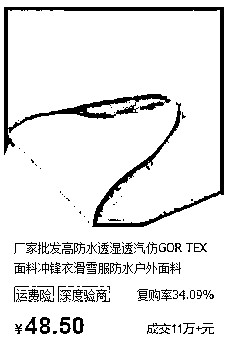 

这个产品可以蹭到的流量是冲锋衣+goretex这个长尾精准流量。

转化优势上，由于它只有goretex的成品价格的五分之一，所以具备性价比转化优势。

 

 

这两个例子我们看到：选品的同时，流量方案和转化方案也是同时就确定了的，留给运营的任务只是一些具体的上架，设置广告等事情，这就对运营的专业度要求要小了不少，甚至实习生也可以做，另外这种选品是有固定参考来源的，本文不详细说，结果就是可以形成查字典一样选品输出，这对负责选品的运营的要求又低了很多，实习生也可以完成，就算0起步的一人创业，也可以一个人完全胜任所有选品和运营的工作，因为，套路很固定。

合规平替是一个适用绝大部分类目的宝藏选品方向，因为它既有流量捷径，也有转化捷径。

大多数卖家到这一步，已经获得1-3年的蓝海选品产品库，已经够用，如果小语种发达国家，红利期会更长一点。

# **# ****4.**第三步【加光环】：快速获得品牌力、溢

# 价、复购

十年前，我们发现，JEEP、骆驼、CAT的鞋服，实际上跟美国JEEP越野车、骆驼香烟、CAT重型机械没啥关系，这三个鞋服品牌在国内最早是由中国老板成功抢注下来的。虽然十年后这三个品牌都不同程度的与美国品牌方达成和解或者授权，普通卖家已经不能随便去卖，但是这个骚操作，是值得我们借鉴的。

 

 

十年前，我们发现日本市场乐天平台和亚马逊平台，对这三个品牌的鞋服都不要求授权备案，也不进行审查，因为这三个品牌的鞋服其实在国外并不存在，由于是知名品牌，也没办法在日本抢注到鞋服类目上。所以对我们中小卖家形成一个几年的搬运倒卖的窗口期。这正是我们第二桶金的来源，我们在日本长期垄断了这三个品牌鞋服的销售，我们还给他们起了个名字，叫做空壳品牌。这也是一种选品模式，虽然只有特定的窗口期。

这个模式到今天仍然是具备可复制性的，例如上文提到的我们在速卖通能做到客单净利润100+的产品，就是这个模式出来的。而且空壳品牌在速卖通有独有的合规优势，上文已经解释。

我们把空壳品牌按占便宜程度/境外合规风险程度，分为如下几类：

1.抢注国外品牌，并复制它的全系产品（例如koolaburra 已被ugg收购）2.抢注国外品牌，并跨类目做新类目产品（速卖通常见套利玩法）

3.在国外注册品牌，策划国外的品牌故事和品牌形象（国内电商常见品牌捷径）在不同时期，以上3种打法均在亚马逊有过窗口期，目前还可以继续做的是第三类。

很多老板做品牌出海，或者美亚，老老实实的用自己的中国品牌形象，不是不行，但是更好的方案一定是策划一个空壳品牌，比如我们在日本做一个德国品牌，在东欧做一个日本品牌，在美国做一个欧洲或者日本品牌，这都是可行的，本土客户查不到，故事随便你说。

这个打法在淘宝也有非常大的红利，某做渔具的淘系卖家，就把它的渔具包装成日本品牌，做日本独立站官网，反向营销到国内市场，因为日本渔具比较有口碑，直接带来的就是远高于淘宝渔具正常利润的高溢价空间，和复购。

 

 

按我们的经验来看，成功的空壳品牌，可以做到10%的复购，可以带来的净利提升最多可以达到30%，这不仅是一个增加转化的方法，有时候甚至可以单独演变成一个选品模式，低成本、搬运式输出成功产品去跨境市场，这个由于信息差比较大，以后有机会再介绍。

# **# ****5.**第四步【微创新】：获得更长的红利期

前三步基本上都是可以工具化实现，要么花点钱实现，第四步主要是做产品的差异化，这个对人的要求高一些，如果做成功，对应的护城河更深，产品红利期也是更长的。

微创新其实就是不创新。

我们比较推荐新手去做的微创新差异化套路是：材质套利，是上文材质平替的一个延申。

新手做差异化，不要去考虑原创设计，痛点迭代，这些方向没有专业积淀，很难拿到成功确定性，新手适合基于大标品，去做升级式的和热点嫁接式的差异化产品。

首先，大标品不愁卖，也不需要买选品软件去分析大标品，但是大标品往往很多是低级材质，或者价格战重灾区，客单非常低，没有利润空间，大多数新手也喜欢一上来就干这个，跨境直播间凡是讲亚马逊热卖产品的，都不乏人气，这在我看来跟路边看人吵架没啥区别，没有任何意义。

 

 

其次，真正的高端货，中国卖家向来也不去挑战，也挑战不了，那么中端性价比市场就相对空白，我们找出高端材质这个方向，找到可以还原90%体验的低成本平替材质，去做这个稍稍消费升级的人群，将规避掉大量的竞争，获得长期的蓝海空间，上文的平替的案例可以看到，1688已经有现成的供应商，甚至投入就在几千块的水平就可以做出差异化产品，这个非常适合新手。

我们来看下材质平替套利差异化后的产品在亚马逊的案例：

直接搜索冲锋衣，美亚首页产品是

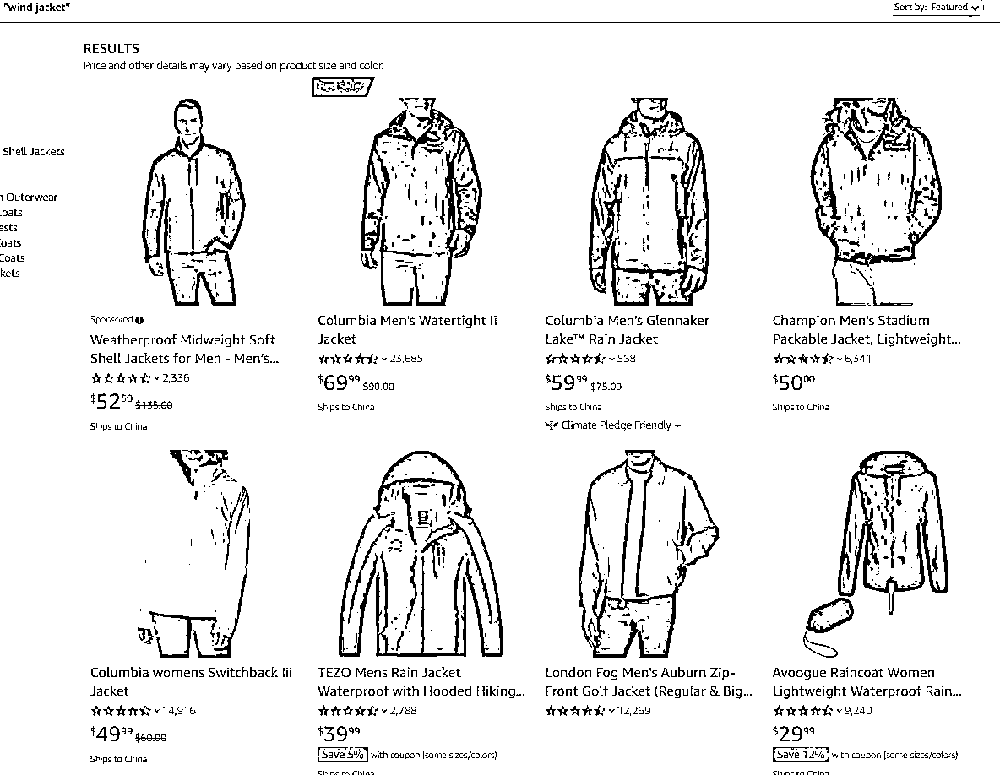

最低的十几美金，例如

 

 

而搜索冲锋衣+goretex 首页产品为

 

 

客单已经100多200多美金，在这个首页我们也看到有这个产品：

 

 

销量非常好，在100-200多的众多sku中，39.99的它鹤立鸡群，这就是我们说的将比价劣势转化为比价优势，它虽然不是goretex的，但是搜索goretex它会展示，它功能相同，它足够便宜。

但是如果把它放到与10几20几的冲锋衣一起展示，它就无法展现它差异化的卖点也没有价格优势，所以这个sku干脆放弃标品词，只做长尾词，这样才能获得流量优势，转化优势。这就是差异化产品的优势。

刚才是材质升级、平替套利的差异化。

下面我们看一个材质升级+平替套利+热点嫁接的差异化：

 

 

材质升级：帆布升级到真皮

平替套利：头层皮换成二层皮，成本下降三分之二

热点嫁接：厚底、边扣

精准流量词：真皮、厚底、边扣、某品牌、高跟、增高、女式板鞋、侧拉链等等转化点：厚底、经典平替、极致性价比等

所以这个鞋子跟普通帆布鞋板鞋标品比，实际上有4个差异化点1.真皮 2.边扣 3.厚底 4.平替

每一个点都对应一个精准引流点，精准流量的转化率是远远高于大词标品词的，还便宜，因为竞价的人少。

达到这个差异化水准的产品，70人民币跨境卖70美金，老外仍然觉得性价比爆棚，1688仍然有做好的现货，新手发现不了这样的供应商是因为认知不够关注不到。

这样的产品配合小语种发达国家门槛，类似的产品我们已经实现了7-8年的垄断红利期。

为什么不怕被跟卖，因为这种差异化产品出单量不大，所以选品软件抓不到，但是净利润很高，一个这样的产品一年完全可以贡献100万左右的净利润。所以我经常说跨境电商下一个十年要逐步放弃爆款思维，就是这个原因，因为做爆款在我看来是自杀行为。

好的选品，亚马逊/独立站/TK都可以做，享受长的红利期，稳定的利润，不昙花一现。

 

 

评论区：

亦仁 : 付费课程链接有么，贴一个

跨境杨少 : 这篇是上次捐献一小时活动希望分享给圈友的，后来觉得还是写成帖子比较清晰，但也很抱歉今天才写出来，这个文章本身就是一个很完整的做产品的方法论，架构比较完整，信息差也很多，可参考的也不限于跨境电商。

跨境杨少 : 感谢亦仁。刚才发的可能被星球自动屏蔽了，没事，感兴趣的圈友可以直接私信

亦仁 : 再发一遍？我也想看看学一下

跨境杨少 : [害羞][害羞]dou音搜索“跨境杨少”，置顶视频中有链接，明天上班我让助理发个券码给你[呲牙]

无尘 : 说的很好，赞一个，感谢大佬分享

亦仁 : 感谢分享，已加精华。

跨境杨少 : 感谢亦仁

# **# ****(**精华帖**)(150**赞**)**怎样在亚马逊中筛选出蓝海

# 产品？

作者：  小仙女

日期：2020-11-27

一起赚美元

《如何在亚马逊中筛选出蓝海产品及避坑指南》，可复制链接后用石墨文档 App 或小程序打开

第一次发帖子，希望可以帮助到大家。首先。介绍一下自己吧，创业亚马逊一年多的时候，2个月时间做到小类目top3。没有工厂背景和资源，小卖家摸索出来的一点经验和思路，两个月的时间赚到第一桶金。今天和大家分享一下，希望对大家有所帮助。应该对 

 

入门想了解亚马逊的卖家有帮助（用的软件没有做广告的意思，自己现在用的而已）  一．注册账号篇

二．蓝海选品篇

三．实用选品小插件

四．跨境物流篇

五．推广及运营基础篇

一  注册账号篇

**1. ** 如何选择切入的市场（站点）

我认为做亚马逊之前大家应该先搞清楚自己要做哪个站点，现在主流三大站点，美国，欧洲和日本，还有其他的小站点（澳大利亚，中东，新加坡等）这里就不说了。

首先，美国站点，最好注册的站点也是很多创业小白首选的站点，美国的市场最大，产品种类很多，小白很容易上手，语言是英文也容易操作一点。相对于欧洲和日本，美国站的账号比较容易注册下来（竞争大的原因）

其次，欧洲站，欧洲站里面有五个小的站点（英国，德国，西班牙，意大利，法国）注册下来，欧洲站上面五个小站点是自动开通的也就等于拥有了五个小站点。

每个站点语言不同，英国英语，德国德语，法国法语，西班牙是西班牙语。其中英国和德国占据销量的大头。

但是欧洲站的起点会比美国站高，首先是资料方面的审核要严格，需要过KYC审核，需要提交营业执照资料和法人身份信息。如果有其他股东股份超过25%，也要提交信息。主要是开具180天之内的一些账单（手机缴费，水电煤气，银行卡账单，物业账单选一种）文件上面的姓名和地址必须与卖家后台的姓名和地址一致。稍有不同，审核可能就会有不通过。

欧洲后面也会涉及到缴税的问题也就是VAT，这个费用美国站是没有的。目前有些类目欧洲的产品利润会比美国高。如果你要是预算充足，资料齐全可以考虑先从欧洲入手。

最后说下日本站，日本站也是很多卖家喜欢的一个站点，买家整体容量没有美国站大，但是产品的利润高，其次离我们距离近，物流费用会相对于便宜点到货时间快。日语也没有什么太大的障碍，账号比欧洲站好注册下来。但是日本对产品的质量要求还是严格一点的，海关查的比较严，现在物流税金也高。如果懂点日语，做日本站也是不错的一个选择。

 

 

**2. ** 我要如何注册账号和准备资料

a) SC账号和VC账号

简单来说，亚马逊分我们自己发货的账号（SC）和给亚马逊供货的账号（VC）这里我们说的是自己注册卖货的账号。VC我们就不说了，他是作为亚马逊的供货商，权限也会更高。

注册分两种一种是自己注册的（找到亚马逊页面，自己申请账号）另外一种是通过招商经理的链接去注册账号（招商经理注册可以推荐），那么这两种渠道有什么区别呢？自己注册的就相当于没有妈的孩子，基本上自给自足，但是有招商经理呢，他会有一年的扶持账号的时间，期间有问题可以问他，也有专属的卖家群可以帮助解答一些问题，招商经理下的链接二审概率小一点。建议大家用招商经理的链接去注册账号

b) 专业卖家和个人卖家

亚马逊账号也分专业卖家和个人卖家，专业卖家是用营业执照去注册，个人卖家是用自己的身份证去注册。那么这两种的区别是什么呢？专业卖家是用公司的资料去注册的（某种程度上会相对于安全点）个人卖家是我们自己的身份去注册一个亚马逊店铺。两种方法都可以，认为注册公司麻烦的还需要费用的小伙伴可以用自己的身份证去注册，如果已经有公司了，还是建议大家用公司去注册账号。

c) 美国账号国内账号

那么我们亚马逊的账号还分本土账号和我们国内注册的账号，两种有什么区别呢？

我们国内的注册的账号在国内用国内的资料去注册，本土账号是用美国的资料去注册账号。听说两种权重是不一样的（具体的我还没有去验证）权限在某些方面也不一样。美国账号权重高一点，比较不容易发生问题，可以卖杀虫剂一些特殊产品。

那么是需要注册美国公司去注册账号的。

综上所述，你会觉得好复杂，是不是，说的这么多感觉一脸懵。那么我的建议是：

营业执照+招商经理链接专业卖家，先开搞就对了。其他的在摸索中前进，慢慢就懂了

d) 注册账号所需资料（美国站为例）

专业卖家：营业执照+法人身份证+双币信用卡（扣款）+收款账号（付款）+手机（两步验证）+干净的电脑（固定IP，不是VPS）+干净的网络+邮箱。

PS：美国站信用卡可以不是法人的，欧洲站一定要是法人的信用卡，自己申请就行，什么银行的都OK，带有visa和master的标志✅

收款账号：第三方收款公司，类似于一个代收款的中介，然后通过平台把钱赚到我们自己账户里面。他们会扣一些汇损的费用大概千分之五，流水做大了可以谈的。

 

 

做这个的支付：连连支付，WF，网易，Pingpong 选一家就可以。

营业执照可以找代理注册，深圳很快就可以下来的，费用就是做账和计税的费用。

好了。了解了上面的内容之后，我们来注册账号了，注册账号的时候建议大家所填的信息用拼音或者是英文，保持和你的营业执照身份证上面的信息是一致的。注册账号会有单独的一个文档放在后面，大家可以参考。

最后在说一下二审的问题，亚马逊近一年注册下来账号有很多遇到二审，顾名思义就是对账号的第二次审核还有一些有视频验证，明信片这些的。我们这里说一下二审，需要准备账单，这个账单可以是水电煤气费或者是物业，电话网费，信用卡账单都可以，你看可以开具什么账单。那么地址要和营业执照上面的地址保持一致（会比较容易通过一点）。准备好资料在后台提交审核就可以了。通过有机率性看亚马逊心情。

PS：注册亚马逊的资料没有通过，这套资料还可以用吗？答案是不可以的，所有的这一套资料都不可以用了（亚马逊有一个关联的机制，这个东西说来话长）记住不可以用就行了。

我们的一套资料是可以注册亚马逊的美国站，欧洲站和日本站的这个不涉及到关联。

二．  蓝海选品篇

下面进行我们的第二篇选品方面，在亚马逊方面呢好的产品是成功的一半，也是很多卖家会说的7分选品，3分运营。因为我本人是辞职的创业的，所以在资金上面还有供应链上面是没有什么优势的，所以想赚到第一桶金就需要弯道超车，找一些蓝海产品，这样做才有机会在平台上面去分一杯羹。如果是想做副业的同学我觉得在亚马逊上买一个月赚到5K左右还是有机会的，但是想要做大那么后面的押款还有各种投入也是很大的。那么有资源和工厂的老板可以选择另外一种玩法哈。

那么我们首先如何切入这个市场呢？（美国站为例吧）

我们的目标是找到小类目的订单30-50左右，利润高，产品的竞争不是很激烈的这类产品  目标记住了，我们首先选择小的类目。找到亚马逊的BSR榜单

这里给大家介绍一个亚马逊的导航网站建议收藏，上面应有尽有：

图片:

这里就是亚马逊的类目，为什么要选择这个呢，因为你只有了解这个类目下面卖的产品还有大家的情况大可以知己知彼呀。选择一个自己感兴趣的类目，然后每天抽出时间去浏览这个类目下面的各种产品（看不懂英文的话，浏览器可以自动翻译），找到你所感兴趣的小类目和产品。然后进行下一步的调研。

细心的朋友可以发现了右边带图的这个版面，这个是亚马逊的榜单

红色框框里面的部分就是我们经常说到的BSR 卖的最好的top榜单，new release 新品榜单，move 上升趋势最多的，wish：心愿单：gift: 礼品。

 

 

图片: 这几个榜单也是前期我们选品的时候需要关注的，新品榜单你会看到现在有一些卖家长在推的还处于上升期的一个新品，这对于我们来说或许是一个机会。那么3C电子类目就不建议大家去做了，类似手机壳，线，充电宝，大卖家很多，黑科技也多，小卖家很难生存。服装类目有资源的考虑，没资源的不碰，退货率高。一些大牌的产品，类似迪士尼啊，乐高，耐克这类要有大的品牌授权才可以，要不很容易封号。

举个🌰怎么去看一下蓝海类目？

图片:

首页你了解了自己选择的类目之后，然后点进来，他还会有细分的小类目，也就是我们所说的二级，三级类目。建议大家去更小的类目二，三，四里面去找产品。为什么这样做呢？是因为如果你翻看了亚马逊的BSR榜单之后会发现很多产品一直都是在那个位置上的，基本上不会怎么变动还有就是他们的评价很多，上万甚至是上千，这样你去选择做这个产品后期运营推广的压力就会很大。那么前期是不建议的，所以我们从更小的三四级类目去着手，你会发现里面的产品有一定的量，还可以保持一定的利润去做后面的运营还有推广。

有些朋友会说我也是新手不知道要做什么类目呢？那么建议大家从工业类目，家居，手工艺品，宠物，花园这几个类目去着手先了解。

那么我们看一下下面的这款产品

图片:

那么我们看这样一款产品，这是一款3D钻头，首先我们用插件来看一下这个类目整体的一个销量，费用还有一个上架的情况。我用到的这个插件是数魔seller motor. 图片: 我这个是付费的版本，大家也可以一起团购

那么我们接下来先看这几组数据看一下，这款产品是否可以考虑切入。

**1. ** BSR一天的订单是100左右到第五名是有30单左右，那么这样的类目在美国站其实不算红海类目了。下面放一张蓝牙耳机的图给大家做一下对比。

图片:

大家可以对比一下大类目和小类目的区别，anker第五每天有800单，我们刚刚看到的那个小类目BSR才100单。所以我们也是根据经验来判定这个是一个蓝海的小类目了。

图片:

 

 

**2. ** 我们看一下大家的FBA费用情况（FBA费用是做我们发货到亚马逊仓库，亚马逊帮我们打包，包装的一个费用，如果大家想做自发货的话这个费用是没有，这块我们在后面运营在详细说，先了解这个概念）FBA费用基本是小件产品的收费尺寸，说明这个产品体积小，重要轻。

**3. ** 我们看一下近一年的销售趋势，是整体在缓步上升的，那么看产品的趋势，大家也可以用google trends. 这个是谷歌的一个软件，可以看到这款产品5年的一个走势图，我们可以看下图就知道这款产品是否有淡旺季，是整体处于上升还是在下降的一个趋势，还有些关键词在每个州的一个分布情况。

图片:

**4. ** 我们看产品的上架天数这个是代表这个产品从上架到亚马逊到现在，售卖的时间天数。那么我们可以从这个图中看到，前五十有几个新的卖家，而且最近的推广效果还不错，那么说明这款产品是有潜力的。我们可以在观察一段时间看看他们的销售情况，考虑是否去做这款产品。插件的话我们也可以借用keepa 去分析产品的售卖天数，价格走向这些。

**5. ** 我们找到这款产品的关键词然后去亚马逊平台搜索一下卖家数量

关键词也就是这款产品在平台产品的名称，比如我们说的充电宝，那么充电宝就是这款产品的关键词。每款产品在亚马逊上都会有2-3个核心的关键词，这个我们需要知道的，后面对于我们做广告投放还有关键词设置都有帮助的。

（不会找的关键词的小伙伴我们后面在详细说）

那么我们这款产品的关键词 3D nozzles 在亚马逊的前台进行搜索，看一下产品的情况

图片:

首先，大家在搜索之前，要记得切换一下美国的邮编，因为我们中国的IP，浏览器默认的是中国的邮编，这样搜索结果会有偏差或者是不全。

我们看一下搜索的结果数还有产品在亚马逊前台的分布的情况，标注sponsored的是亚马逊的广告位，代表这个卖家有做站内广告，然后我们看下其他位置卖家的一个评论，价格还有产品的一个情况，综合去分析一下这款产品能否去做。

我们看一下评论，有两家评论过千的，我们的评论是跟淘宝一样的代表的是买家买了这款产品对这个产品的评价，那么评论越多，我们也就知道这款产品的订单也就相对于来说会高一点（亚马逊通常的回评比例是100:1）这款产品是有几家评论过千的，是不是就证明这款产品其实是有一定的销量和市场的？这样才会有这样的评论基础。还有一些卖家的评论的是几百的，属于中间的市场，最后也有些卖家是刚上的这款产品，可以排到 

 

首页的位置，是不是证明这款产品的是可以推起来的呢？那么我们中高低都分析了，这款产品是值得我们去进入下一步调研的。

那么我们下面我们也可以看一下关键词的容量，也就是站在买家的角度，看一下搜索量是多少，借助的软件（卖家精灵，免费版本可以试用，上面的导航网站都可以找到）  图片:

那么我们看一下上图，大词的月搜索量是6千多，证明还是有一定的需求还有客户群里的，那么月购买量是跟我们之前抓取到的销量是差不多的，最后我们看一下PPC竞价，这个是亚马逊站内广告的一个竞价，我们的广告是按照单次点击去付费的，也就是买家点一次多少钱去结算费用，也就是我们说的PPC。那么我们看上图PPC竞价其实的范围不高，证明的他的竞争不是特别激烈。我们接下来看一下对比图，蓝牙耳机的图片: 这样大家就知道蓝牙耳机的量有多大，多烧钱了吧。

7。了解完了大概的市场体系和容量，接下来我们要知道产品的利润了吧，卖一款产品出去我到底可以赚多少钱呢？

首先我们要知道在亚马逊平台卖东西的一个收费标准。那么我们每卖出去一个产品平台是要抽佣金和之前我们提到的分拣包装费的，然后我们还要去除我们产品的成本+头程（头程也就是我们把产品从国内运送到亚马逊仓库这个中间运输所产生的物流费用），这些都去除了，最后是我们得到的毛利。

我们的佣金和分拣包装费我们统称FBA费用，这个费用怎么算出来的呢？

我们借助上面的这个小工具。首先科普一下亚马逊佣金一般是15%，有些类目是8%的（例如个人护理类目）分拣包装费呢是按照我们产品的体积重量大小去算的。那么算利润的时候，要对标你要做的同款类似的卖家，不要对错了哦。下面我们看一下上面这个产品的利润。

图片:

这个就是我们的公式算出来的产品利润率，那么成本大家可以去1688上面去找同款，头程我这里是按照空运的价格去算的，那么海运的话会更低，毛利基本上要到30%这样去做后面的推广，空间才会更大一点。那么大家也可以知道公式的原理，也可以用excel表格去算，这样更方便快捷还有记录产品的变化。

8。最后，我们还要考虑的一点是这款产品是否有专利会侵权，小心使得万年船。这个可以通过我们去问1688的产品供应商，还可以找代理去查或者我们自己去查也是可以的。

如果大家没有做大牌子的产品一般不太会涉及到，亚马逊上面我遇到的是产品的关键词被注册成商标侵权，还有外观专利还有一些产品的的知识产权和设计上面的专利。这里就不展开说了（啰嗦好久可能也说不明白）后面我会放一个文档，简单教一下大家去查专利上面的侵权

 

 

PS：如果大家想长期做亚马逊的，可以去注册一个商标，因为商标现在好处多多，可以防跟卖，上A+，做视频，做VINE，品牌分析，加速器计划，上传产品。反正好处多多，以后平台也会像这个方向发展，那么你只是像试试水，看这个平台是否适合你的话，就可以暂且不用去注册

9。经过我们的分析上面的这款产品是可以考虑去做一下的，接下来就是要提到的产品差异化。因为我们前期没有供应链的优势，所以我们的产品要尽量去做一下差异化，简单来说，就是可以通过增加一下小的配件或者是组合去吸引买家去购买你的产品。我们可以想一下，一个新卖家上来了，为什么买家要买的你新品而不是那些卖的好的产品呢？

所以我们在产品端要做一点差异化，去让产品更加的有竞争力。有工厂资源的老板可以去改产品，这样也是可以的。

10。还有一个店铺去筛选产品，就是我们看到一款产品，你可以去找到他的店铺，然后看哪些产品适合你做，就重复我上面的步骤去做调研分析。

那么上面就是我们会用到的一个基本的分析思路和调研的方法，那么我们现在做的一些蓝海类目，还是靠着我们的经验还有每天在平台上面多看去多分析产品得出来的。大概是这个思路，有些朋友可能还会比我做的更全面，也欢迎过来补充。刚入门的话感觉你可以掌握这些去选出来产品了。

剩下的一些运营知识我会接着去分享，篇幅有限我会在后面的帖子提到，有些东西写起来还是很繁琐，怕自己的表述不清楚。希望大家可以理解。

希望可以帮助到大家，我一直坚信越分享，越成长。希望链接到一些优秀的人，大家一起交流，很喜欢学习新的知识，不同行业的碰撞。

https://shimo.im/docs/thrgvyTtgkQkXyKp/ https://www.amazon.com/gp/bestsellers https://www.amz123.com/ https://uploader.shimo.im/f/7CxFJ6vTyKr5kswj.png https://uploader.shimo.im/f/yJN8ER4lBtcmohQ9.png https://uploader.shimo.im/f/nmwP2n2e7f7BaCjn.png https://uploader.shimo.im/f/j32fN5hsEYTU9Sqa.png https://uploader.shimo.im/f/ulHQnGPx3WIKCHHt.png https://uploader.shimo.im/f/2Zt3yFGLGYLLZ1Ky.png https://uploader.shimo.im/f/HWI1aYHQZNZpOZnD.png https://uploader.shimo.im/f/1buM6Rj8qSGspGDk.png https://uploader.shimo.im/f/2uIHTAVLiKiJFNyJ.png https://uploader.shimo.im/f/ngGkJ5XYTqNxjEmQ.png https://uploader.shimo.im/f/WvL1Wm5zbHPehm1D.png https://sellercentral.amazon.com/hz/fba/profitabilitycalculator/index? 

 

lang=en_US https://uploader.shimo.im/f/aZd8yO6eqqIEPQZO.png

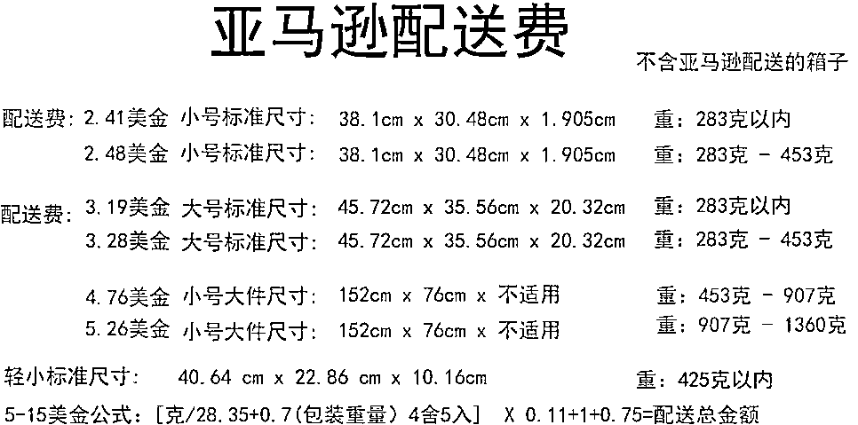

评论区：

良辰美 : 哇塞，太厉害了，非常翔实的内容，感谢分享[强]

小仙女 : 有帮助就好呀

th : 感谢，这个很有用

Franky : [强][强][强]

seven : 非常感谢您的分享

小仙女 : 希望帮助到你[愉快]

小仙女 : [呲牙][呲牙]

小仙女 : 哇 seven大佬

# **# ****(**精华帖**)(123**赞**)**亚马逊选品、运营的常见问

# 题详解，探讨如何突破天花板实现极致人效的自

# 动化

作者：  张子卿

日期：2022-05-17

 

 

现在还能做亚马逊吗？

我的答案是：依然可以。

大家好，我是张子卿，97 年，在 B2B 的跨境电商行业摸爬滚打了 2 年后，在 21 年中旬选择了 B2C 亚马逊平台蓝海选品销售这个赛道，并开始创业。

在一年多时间通过对蓝海赛道进行产品研发设计，以消费者真实需求为导向，在亚马逊美国站销售 GMV 在 1000 W 以上，毛利约 10 多个点。

下面是我们在亚马逊的创业过程遇到的问题和对应的解决方案。主要分享自己创业的一些道与术。此文为精简版，原文细节 1 万多字可在文末查看。

希望通过这篇分享，解决大家对是否能做亚马逊以及如何做亚马逊这两个问题。让新入局和打算了解跨境业务的朋友有一个全局的了解。

开始之前大家最好有个预期：亚马逊这门生意终局看的是投资回报率和链接资产，亚马逊创业的核心优势在于可低成本低门槛的去多试错** **且可借势。

这里的核心的借势还是在于选品，依靠中国制造丰富快速的供应链对产品去做独特的设计和改进。

**—01— **

如何能解决选品难的核心问题** **

 

 

我向来喜欢把复杂的事情拆解成几个简单的步骤去思考。

任何公司都需要牢牢把握选品的能力，这是做亚马逊的核心。选品在我看来其实可以分为两个方面：一是选赛道，二是产品的迭代优化。

一、选赛道** **

对于选赛道，我的核心思想就是，利用可获取的数据背后所代表的信息。根据下面 3 个数据形成核心原则，再进行筛选。

关键词=赛道

关键词搜索量=市场容量

市场容量和关键词下的市场竞争对手情况之比=赛道够不够蓝海

结合上面 3 个思想，我使用的是数据软件和爬虫并行解决选赛道的问题。

具体方法表现为，先通过对海量关键词进行粗排序解决选赛道中做什么蓝海市场的问题（通过数据排序），再解决进一步通过详细调研进行精排序从而解决选赛道的问题（依靠人工和相应的软件）。

看到这里你可能有点懵，在迭代优化我会举个例子，从选品到整体优化思路上可能会更加清晰。

二、产品迭代优化** **

 

 

选品在我看来分为选赛道和产品迭代更新。

在解决完选赛道的问题后，还需要对进行产品持续性的迭代更新优化。

本质上我非常鼓励所有跨境的卖家去走这条路：从研究产品**——**到研究用户**——**再到研究真实世界的需求。

关于迭代优化，我分享几种常用的方法。

首先是确定定价区间，计算利润范围，以及给采购预算；

其次就是研究用户和用户需求，决定做哪个用户群体，是高客单价走利润还是低客单价走量。

确定好采购预算后，在预算区间内尽可能满足以下几点迭代：

1.成本优化  材质的变更

2.外观优化  颜色  包装的改进——本质在于主图  在于点击率影响的广告权重3.设计理念的传递到链接的文案优化——产品的设计可以结合运营端讲故事

4.降维

5.跨维

 

 

6.产品研发设计

举一个直观的例子覆盖以上所有方法：

关于选品：** **

washer door prop 是一款家用洗衣机支撑架，在当初火热的时候最高有近 7 万的 H10 搜索量。

在蓝海选赛道的工作结束后，先判断产品的 ROI 。如果满足需求，就到了研究用户和需求进行迭代和优化的时候。

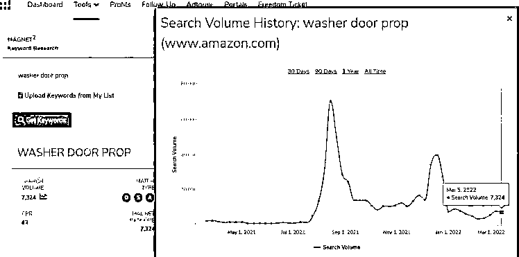

首先计算成本，预估出采购价格。

 

 

 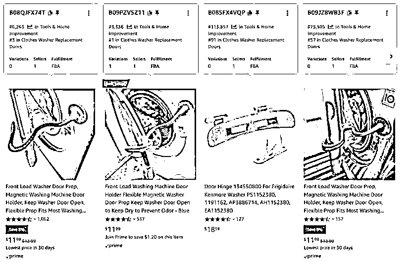

在半年前这款产品刚刚兴起的时候，最好的大概 300个  评论不到，月搜索量在 1 万以上，利润空间还是比较充足的，现在的话就比较内卷了，因为整个产品的搜索容量在持续降低。

这也涉及到另外一点，无论你多么看好一个新兴的赛道，要先小批量测款后再合理备货。如果你在 7 万搜索量的时候备了 5000 套过去，那真的会很惨。

 

 

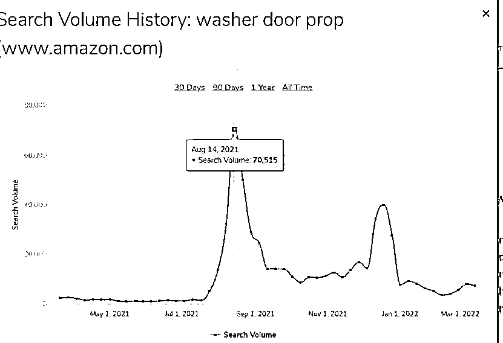

关于这个问题，我后面会说到产品的 leading time，在资金有限的情况下备货可以小而多次。降低风险，且大幅增加了资金周转速度，还记得上文说过亚马逊是一个看单位时间投资回报率的生意。

就以现在的 11.99 美金的售价去考虑先，这里可以直接使用 helium 的利润计算功能。

假设走空运的话：

FBA US$3.77

佣金 US$1.80

运费 US$1.81

成本 US$2.4

 

 

ROI就是：

（11.99-3.77-1.8-1.81-2.4）/（2.4+1.81）=52.4%

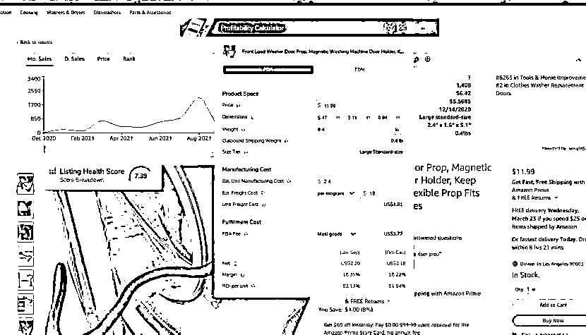

判断 ROI 决定产品是否继续，对应的标准就是。

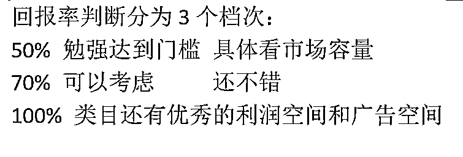

显然，50% 的 ROI 仅仅只是勉强能做而已。何况头部的格局已经形成搜索量也下来了，机会不大了。

 

 

到这一步，就可以判断这款产品是否要继续进行下去。

Yes or No？当然对于现在来说就是 No。

可是在半年之前还是比较有机会的类目，假设结果是 Yes，接着往下演示。这里只是走一个全过程，方便理解如何使用我的选品思想和优化思路。

研究用户和需求进行迭代和优化：

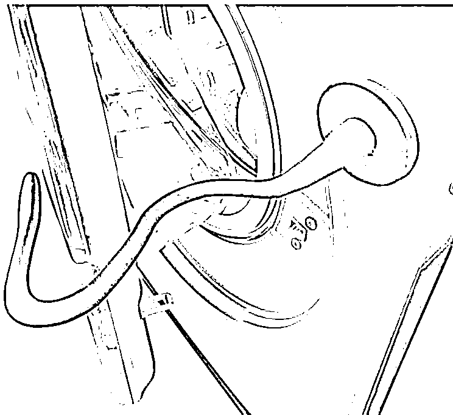

 

 

这款产品主要解决了很多公寓式住宅的滚筒洗衣机门开关的问题。

对于传统的公寓式住宅，滚筒式洗衣机往往在进门的过道，如果洗完衣服后想要晒干洗衣机内部避免潮湿和细菌滋长，就需要长时间打开洗衣机门。这极大地影响了正常的走动，如果家里还有孩子和宠物的话也有对应的风险。

用户群体：住在公寓里使用滚筒式洗衣机的人。

需求：滚筒洗衣机使用后长时间打开，且不影响狭窄过道的正常行走。

竞争对手的销量和差评研究：

这里使用 jungle scout 软件研究销量，使用人工筛选研究差评区。

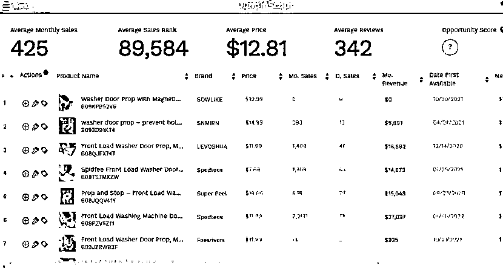

差评研究：

这块没什么好说的以具体的实际情况为准，研究竞争对手哪些点做的不好，在预算足够的情况下加以改进。

 

 

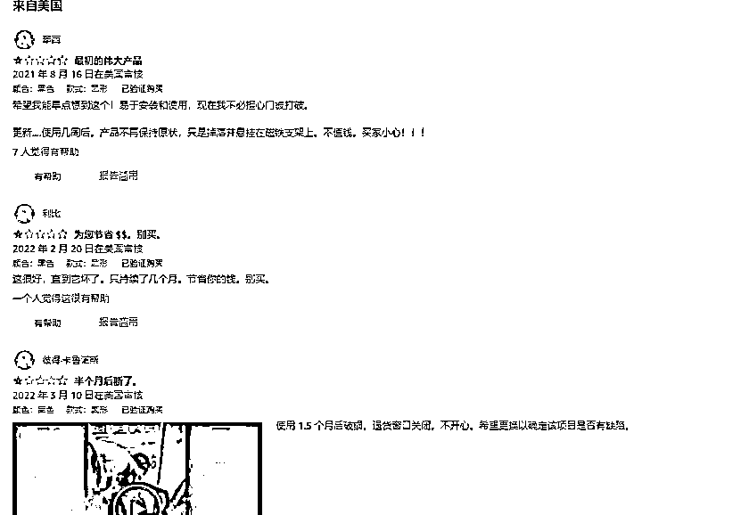

以 helium 10 来演示这部分：

就是找出所有与这个词相关连的精准出单词后，在进行发散和研究需求。

这个过程中，比如搜索量最高的词、最高的带颜色的长尾词、新的精准词都会被发现。

你就可以深层次的了解到，什么颜色、什么款式的长尾词搜索量相对最高，搜索量数据也代表着用户最真实的喜好和需求。

 

 

 

 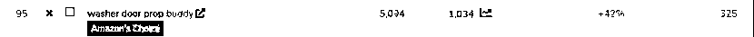

这里有两个词引起了我的注意

front load washer door prop

前置式洗衣机门支柱

washer door prop buddy magnetic man洗衣机门道具伙伴磁铁人

而且我发现 washer door prop 这个词往往能和洗衣机清洁 washer machine cleaner 有关。

产品的迭代优化：** **

**1. **优先考虑是否可以降低成本

因为除非走海运否则产品的预算已经严重不够。稍微一点波澜ROI 50%都达不到的产品风险过高。

采购成本，在保证质量的前提下找到价格最合适的卖家；

运输成本，海运方向的思考；

 

 

材质方面，是否有更合适廉价的材质同样可以满足这类需求。

（在写此文时已经有人做了类似的变换）

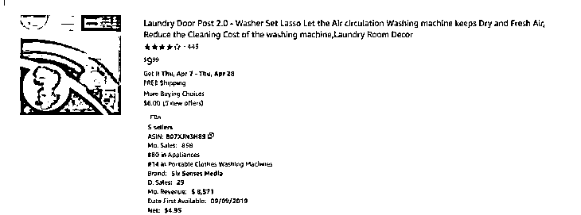

额外溢价方向，是否可以修改产品本身做出溢价更高的空间。

在经过一系列沟通后，得知这款产品底部的磁铁如果还需要变得更加强力和尺寸增加，成本还需要增加 2 元。在已经聊遍了市面所有厂家之后，在硅胶材质上进一步降低成本这条路已经不可能了。

如果走海运确实可以降低一部分，但基本和增加的磁铁成本抵消。

这时候就需要去思考，是否可以使用其他材质满足同样的需求，以此节省成本达到理想条件的 ROI 。

同时可以思考的就是，是否可以进一步满足潜在的消费者需求，做出高溢价的产品。也就是说实际定价可以高出** 11.99$ **的区间段。

 

 

**2. **外观优化角度思考

其实我的所有选品和迭代思路都是以数据为基本面的导向。

那么为什么要优化外观？做一个普通的棕盒不行吗？

这里提前把运营端思考的结果拿过来。核心点就在于对于亚马逊平台，产品的点击率非常重要。它直接影响了后续的广告组权重，直接影响你的广告支出。

在电商领域一张好点击率的主图，直接可以让一条链接逆天改命。

如何做到在众多商品中一眼就想让客户点击？

可以从以下几点考虑：

产品颜色的改变

外包装的改进

配件增加

总之需要结合实际的拍摄主图难度去进行深入的思考，最好达到一眼让你的产品脱颖而出的效果。

甚至可以引入测试投票，使用 PICKFU 网站可以完成。

对于这款产品而言，这方面收效甚微。因为这个类目直接是上的应用场景图而不是白底图。

 

 

改变颜色、增加配件以及优化外包装，来达到提高点击率的目的，都是建立在白底图的基础上。

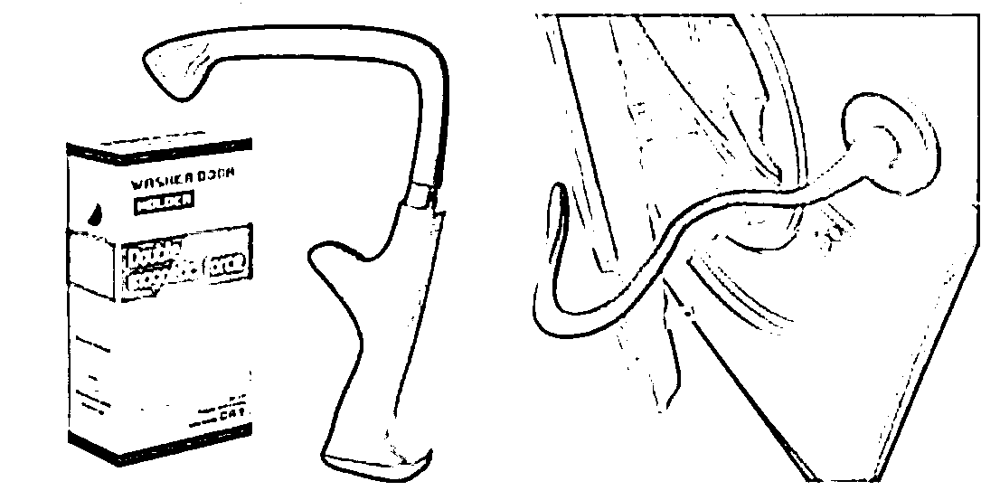

但如果是这种类目的话，上面的方法就会非常起效了。

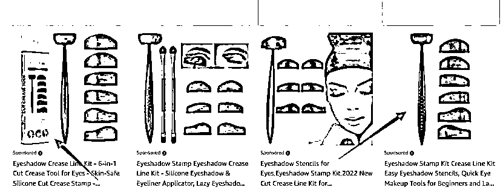

这两张图的点击率可能差 100%。

 

 

**3. **从理念的传递到链接的文案优化**——**产品的设计可以结合运营端讲故事

数据导向就是最终你的产品转化率。

这部分简单来说就是，在产品设计之初，如果抱有某种理念。可以在后续的链接文案和详情页上事半功倍。

比如你卖一款化妆品，设计之初就是为身上有疤痕的女士提供纯天然高质量的遮瑕产品。那么文案上可以大做文章了。

对于我们这款产品而言，可以从优化生活细节，保护孩子和宠物，等等角度去考虑。但是影响并不大，也不值得去重新根据新的理念去设计。因为这是实用类的产品，看的是实用性和使用价值，且不管是使用硅胶还是塑料开模成本都比较高。

降维

跨维

这里把降维和跨维一起总结，降维也就是把高维度的东西拉下来做，跨维就是把其他维度的产品拉到一个新的类目去解决新需求。从而达到做出额外溢价或者降低成本的目的。

举个例子，还记得我们之前研究关键词时候 washer door prop 常常和 washer machine cleaner 一起出现吗？

这就给我们做出新的产品溢价带来了契机。

 

 

washer door prop 洗衣机支撑架

washer machine cleaner 洗衣机清洁

洗衣机清洁这个词在调研后常表现为洗衣机片。

发散一下思维，那么常常使用 washer door prop 的人是不是也使用 washer machine cleaner 呢？

是否可以结合成本去考虑做一个组合类的产品，这种思路就是所谓的降维和跨维。

washer machine cleaner

一个拥有原本洗衣机支撑架 5-10 倍搜索量的词。

 

 

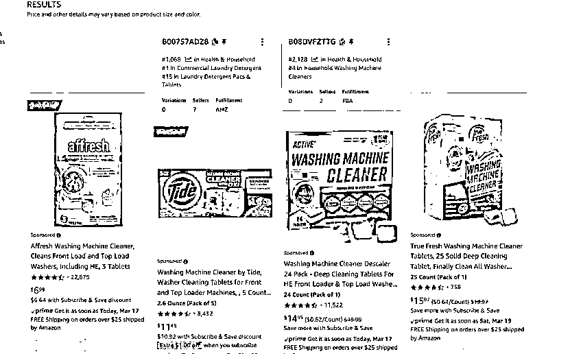

是否可以考虑将两者做一个 combo ，来达到更高的溢价。

结合产品的成本考虑，看来似乎是可行的一条路。

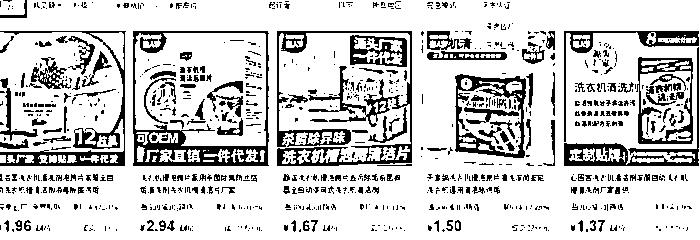

**4. **产品的研发设计

 

 

这部分就包括开模具、画图，以及进一步改进产品功能更加满足消费者需求的相关问题。

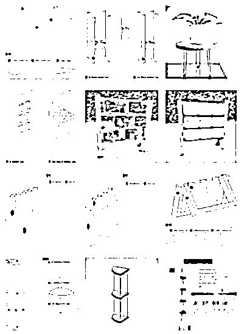

比如很多大型的木制品都面临着安装比较繁琐困难的问题，改设计为不需要螺丝安装的卯榫设计，也许有新的出路。

以上就是对常用几种术的探讨和应用举例。

 

 

关于运营端需要关注的数据细节和数据陷阱：

**—02— **

运营端除日常操作之外还需要尤为关注哪些数据** **

关于运营端，这里简单但着重地说几个关键的数据指标和表相的陷阱。

如果以计算机算法的角度思考运营端的数据的话，那么在运营端，对于一个产品的最核心的关键数据就是：点击率、转化率、核心关键词排名、星级评分以及整个项目单位时间的 ROI 。

下面展开来说说：

一、点击率**——**一个产品可影响的最核心的指标** **

点击率排在第一位的原因在于产品的点击率直接影响了广告组的权重，影响你的广告出价。点击率高的产品，在出价上可能会相差 100%。1 美金出到 2 美金的位置是非常常见的现象。

影响点击率的几个核心因素：

主图

价格

标题

星级

 

 

**PS. **广告的核心权重在于点击，点击的本质在于产品选品后端的迭代端和主图。点击率是可以人为大幅度进行调整优化影响的数据，也称之为可操作数据。比如一张优秀主图可以直接拉升 50% 的点击率。

二、转化率**——**一个巨大的数据陷阱** **

市面上无数的帖子和回复都提到转化率是一个产品及其重要的数据指标，这本身其实并没有错。

转化率为什么在我眼里是一个陷阱，问题就在于它基本是属于不可操作数据。

想想转化率和哪些因素有关？

价格

五点文案（产品卖点）

图片

A+页面

QA

评论区

AZ/BS标签

.....

你会发现如果你按照一个正常的流程去做每一款产品，比如认真调研，开发产品卖点、参考对比，写出本土化的文案，找相同的团队去拍摄图片和视频，等等诸多操作。

转化率其实拼的是内功、产品开发设计、文案、图片、视频、QA。

 

 

核心点：影响关键词排名的核心权重就在于链接单位时间的对应关键词下的销

售额即淘系的坑产

在产品上架之后，转化率是几乎无法去操控的。而在产品上架之前，所有的这些工作基本已经形成了固定的流程，也无法大幅度变更。

所以就导致，在产品上架开售后，除了测评和降价，运营几乎没有手段去影响转化率的数据。

归根到底，转化率体现的是做产品过程中流程制度的优越性。在上架后，不需要过度的去每天关注，因为可以做的事情很少。

三、关键词的核心排名** **

其他任何表象级的影响因素：

标签

转化率

评论

星级

历史数据等等

**...**

均为间接影响销售额的数据。

这里必须要是对应关键词下的销售额，站外和折扣都不计入其中。

 

 

四、如何使用优化**leadtime**去解决现金流不充足而项目过多的问题，同时降低单项目备货失败的风险？** **

——以 leadtime 数据为导向从投资的角度思考亚马逊这门生意：

运营端还需要特别关注并对整个项目的** ROI **和风险进行评估，对所需资源量和回报率进行合理预估。这种能力的流程化对将来能否突破商业天花板尤为重要。

这里重点提及一点，那就是对全年整个项目的资金投入 ROI 进行优化和关注。

这里就需要提到 leadtime 这个核心指标。

Leadtime 也就是从产品生产到发货上架的这段时间，对整个大框架项目的 ROI 下是非常重要的影响数据，且是可控数据。

这里举一个不是非常准确例子说明这个思想：

假如一款木制品，生产时间 30 天，运输时间 25 天，上架时间 5 天。

那么它的 leadtime 就是 60 天。

假设他的售价是 39.99 美金，重量 1.5kg，产品成本 40 元，佣金 15%，FBA 配送费 5.4 美金。

那么来算一笔账：

假设海运 15/kg 产品的运费就需要 22.5 元。

 

 

在不考虑广告等其他投入的情况下：

产品的利润（39.9*0.85*6.3-40-5.4*6.3-22.5）=117.1产品的运费和单价为（22.5+40）=62.5元

理想下的ROI=117.1/62.5=187%

假设产品月销 1000 套，那么实际需要投入的资金远远不止 1000*62.5 元。

因为 leadtime 长达 60 天的问题，一个月的销售就可能需要三个月的资金投入来保证不断货。

往往你投入的是 3 个月的资金，而实际在售卖和计算的是一个月库存资金的 ROI 。所以在 60 天 leadtime 的前提下实际的** ROI **往往只能达到理想状况下** 187% **的三分之一。而且在日常运营过程中，销量是增长或者动态的，实际的支出往往比理想状况还多。

这还没有算上亚马逊压的回款，等其他因素。

如果通过增加产品的单价，选择出货更快的供应商，选择更快的物流，leadtime 缩短到了 40 天的话，哪怕单价上升 10 块钱，最后你的实际资金ROI也是远大于之前。

且节省下来的空置资金可以投入到新项目的进展中。这就是 leadtime 数据的核心思想，优化 leadtime 哪怕牺牲部分利润，因为你可以用更少的利润来赚更多的钱。

 

 

在产品上架后，不断降低** leadtime **其实就是另一种财务角度的优化。

小结：

运营端的工作切误陷入表象，而忽略的深层次的内核。比如转化率，比如关键词排名，建议结合自己公司的实际情况进行更加深入的思考和针对性流程的优化。

同时在亚马逊初创阶段，由于资金是有限的而可以做的项目较多。**Leadtime**的优化对最终相同投入下，实际资本的回报率影响巨大。甚至往往可以牺牲利润来换取高速周转。

到这里只要不断尝试，不断迭代优化，小团队的亚马逊模式就运作起来了。

但任何商业模式我们都希望可以做到和工厂流水线生产一样的自动化，这是做业务的终极追求之一。

针对亚马逊业务而言，如果想要突破认知天花板和选品上限问题的核心点在于：

自研发选品软件解决选品产能问题

通过流程化制度和体系化的知识，尝试去培养跨境电商领域的产品经理解决产

品落地问题

文案和图片的专业外包（靠带有视觉审美的运营去统筹和提出专业的需求** **）

成熟期产品使用人工智能调节广告实现的后端运营全自动化（从回复追评** **到广告中后期** **均可以实现人工智能）

以上是我关于亚马逊情况的一些分享，希望对大家有帮助。

此外我对如何实现跨境亚马逊业务全自动化的领域做了一些探索，更多细节均写在生财这篇长文章节里：

 

 

https://articles.zsxq.com/id_jex6uu2zeu7o.html评论区：

亦仁 : 可能是生财有术搜索量最大的一个词：选品。

背后有几个逻辑，也和大家分享下：

选择大于努力，选品大于运营

起步阶段，选品而不是造品

电商是平台流量变现的最优方式之一

选品就是选赛道，赛道决定长期的利润率

Hanson不帅 : 兄弟，短短一年时间有此番总结令人倾佩。言简意赅，关于选品的思路和方法非常赞同，操作手法部分一致。

leadtime这个概念，一语点醒梦中人，亚马逊各项费用暴增，内卷严重的当下，缩短leadtime确实是一种降低风险提高利润的有效，之前一味的追求利润，运营端老是发最便宜的海运（周期40-60天），看起来头层费用减少少了很多，实则拉长了周期，增加了死库的风险。只见钱进去不见钱出来。

明知FBA有毒，我已无法自拔，亚马逊重资产模式，现在进入这个赛道还是要慎重。

张子卿 : 是的  一眼就看到了这个非常重要的指标

厉害 

阿晨 : 留个联系方式老板

黎昕 : 我觉得产品排名也很重要甚至比关键词排名还重要。

Hanson不帅 : 个人拙见：关键词排名优先，有了关键词排名才有产品排名，关键词调研优先！

跨境电商fantas* : 好厉害，第一次听见这样的选品思路，选品都已经到自动化了😂😂😂

作为亚马逊发货的服务商，回应下题主前面所说的，还能做亚马逊吗？我的答案也是可以的，因为这个市场总有人做的很好，关键思路还是在于选品！

毕竟在跨境有句老话说得好：选品70%，运营30%

今年刚和朋友成立了一家欧美线货代，海运到美国是我这边的优势，朋友之前在货代这行沉淀多年，有需要的圈友可以联系下，坐标深圳[呲牙]

林文勇 : 这回复里面埋词了

 

 

# **# ****(**精华帖**)(117**赞**)**如何找到不起眼但有销售空

# 间的小产品

作者：  布达佩斯

日期：2020-08-10

【首发冲击龙珠】

本人7年亚马逊卖家，目前运营11个销售账户，在2019年度小号卖出了65W+美金。今天分享下我们一直在使用的类目选品法，专找那些不起眼的暴利小产品。

文章包含的图片较多就形成了文档，希望我的一点分享能够对大家有用。如果你想更深入的了解亚马逊卖家，欢迎来聊VX：ltx281703

评论区：

jiupeak : 哇偶～特别想学选品……这就给安排了

池中金鳞 : 这套方法淘宝应该也能用

布达佩斯 : 应该是的，电商平台大同小异！

May : 好像在哪看到过

良辰美 : 亚马逊大类目总共有四十个，我曾想手动遍历所有类目，复制粘贴下来大类名称，还有小类目的数量，做成了一个EXCEL表格，后续没有做完，因为只有类目标题，没有数据就只是一个空壳，且工作量太大，我暂时没有看出来意义和价值，只是做出来初期雏形。

您的选品起始点是从评论数目多但是评分不太好的产品着手，中等资金百万左右，竞争小市场大标品非季节，去改进它的差评点但也不做特别复杂，利用新品期的流量清晰，测评+广告

第三种通过NODE ID选品是真牛掰，当然这也是最繁琐的事情，在一堆产品中找出来市场商机，星级低评论少但是成本也低利润高的产品。

第四种网购行为告诉我们，优先选择FBA，优先积累测评，优先根据亚马逊属性框来布局lst。

良辰美 : 龙珠预订[呲牙]

神小阳 : 我可能拿不到龙珠了，哪位大佬有卖的，可以私聊我阿[大哭]

 

 

Vienyea : 请问下Node ID数据在哪里下载呢

# **# ****(**精华帖**)(99**赞**)**手把手教你如何选出月入上万

# 的单品

作者： Lissa Tam

日期：2021-09-24

大家好，这里是 Lissa，今天来填坑：我的选品方法论。

4月份开始创业，折腾了1个月的店铺，1个月进行选品，产品上架至今刚好2个月多一点，经历了二次售空缺货后，目前趋于稳定，根据过去一个月的计算，该产品目前达到月利润1万以上。

本文主要和大家分享一下，这样的产品我是怎么选出来的，对于像我这样小资金、无供应链资源的卖家来说，如何选出适合自己的产品。

目前市面上做产品的方法，主要是三个大方向：**1.**现货；**2.**产品优化；**3.**产品创新。

A. 现货的玩法，销售属性公司玩的多。有资本和实力的公司，一般直接和工厂合作包销；差一点的可以拿到特定销售权；最后则是直接1688拿货上架卖，一般这种情况存在于产品还处于极度或相对蓝海情况下，否则则会陷入“选品一时爽，运营火葬场”的死亡境地，一些季节性产品或者突如其来的爆款，可以用这种方式销售，比如前段时间爆火的灭鼠先锋系列产品，以及去年很火的小矮人。这部分我的朋友 @Bryce 惠东玩得比较六，推荐他在生财的轻享给你  《以亚马逊电商为例，聊聊从公模到私模的整个过程》https://t.zsxq.com/bUJuRzVB. 产品优化有两个方向，第一，现货组合；第二，模具小改，如改颜色，模具加东西等等。现货组合相对来说好弄一点，相当于一个产品中介和筛选官的身份，选出来的产品有自己的独特性，服务给某一特定人群，因而运营的时候竞争压力没有现货那么大。模具小改也差不多，但需要有一定的量才行。

 

 

C. 产品创新旨在自己设计产品、开模，相对有些复杂，产品为主的公司一般倾向于这种玩法，需要对产品材料、产品结构设计、消费市场、用户需求、用户体验等有一定的了解。这种产品前期调研及设计比较费时，打样及研发费用高，但后期产品出来后，溢价能力相对更高。原材料木制品、金属、纺织品等模具及打样费用相对便宜，制作周期也短一些，适合练手。但整体时效仍然很长，以木制品举例，打样1-2周，后续优化及确定样品1周，货期6周，这里就去到了至少8周。再加上如果是比较重的产品，只能走海运，海上又4周，3个月过去了，产品刚上架，市场或许早就不是那个市场。如果研发能力不强，创新程度不够厉害的话，可能为时晚矣。这种玩法需要深入用户调查，个人觉得适合副业来玩，不适合刚开始的创业公司。

根据我自身情况，我开局时选择的是产品组合玩法。很费事，但是适合低成本快速测试，跑通流程。

我的选品整个流程为：产品初选-市场调研-用户需求分析-确定产品方案

一、 产品初选

选品上面，有三句话，我奉为圭臬：

1.产品要做超价值交付，至少超出30%以上@seven

2.产品看起来差不多的话，根本显示不出来产品的差异化@Zev@樊登读书3.啥是蓝海市场？比你差的，就是蓝海@盗坤

在初选市场的时候，我会选择：关键词搜索量**>4000**，搜索量**/**搜索结果**>4**，市场集中度**<50%**（非垄断市场），搜索词下有评价数少于**80**能上首页的类目，平均月销量**200**以上，毛利润最好能做到**40%**，成本利润率（净利润**/**货及物流）最好有**80%**以上，并且这个类目有机会能做出一些差异化，类目链接质量相对我做的差的（文案、图片）。也就是说：有机会做优化、市场容量够大、新品有机会获得曝光、竞争对手比我差。

 

 

初选市场可以用工具进行筛选，比如卖家精灵、数据魔方等，都可以用。下图为卖家精灵的筛选页面。

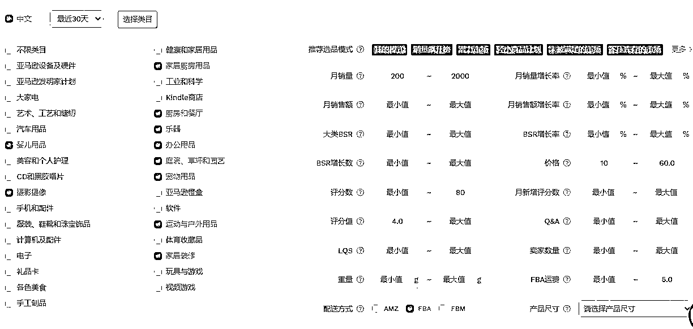

除开工具外，可以通过BSR、NEW RELEASE 榜单，（amz123.com，amz520.com，两个亚马逊导航网站可以直接找到榜单）以及整理出来的可参考卖家店铺，进行选品。还可以寻找自己感兴趣的品类，@阿发  的这篇《9大选品方法 + 4种选择垂直细分领域的技巧，一次解决两个独立站最让人头疼的问题》文章，里面有介绍如何整理自己的兴趣类目

https://wx.zsxq.com/dweb2/index/topic_detail/185228511284552筛选出来后，对利润进行分析，遇到还不错的产品和店铺，及时整理出来，放入自己的选品库中。

举个例子，大家知道我爱喝酒，那么酒具类的产品，我肯定是会找来分析一波了。比如下方鸡尾酒调酒产品，找到关键词后，将数据整理出来，放入我的选品数据库里，并对产品进行利润分析。通过1688，找到产品工厂报价及重量，进行利润计算。

亚马逊的利润公式为：利润=售价-产品成本-头程（海陆空）-FBA物流配送费-亚马逊佣金（一般15%个点）-退货成本-推广成本（测评+广告）。FBA物流配送费和亚马逊佣金是固定的，产品成本和头程略有浮动，最大浮动部分则是退货成本和推广成本。根据产品类目不同，我设定的退货率为2%，总推广成本为10%。

那按照我的利润表格来看，抛开产品组合方式，这个产品利润偏低，就不太适合我现阶段做。

（备注：图片主要用于表头参考，数据有出入，仅作为举例）

 

 

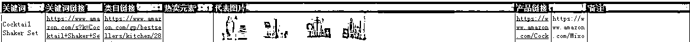 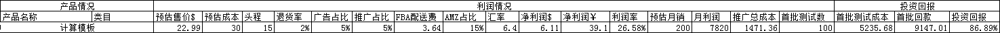

二、市场调研

市场调研中，我着重关注于产品类型、市场容量、对应产品类型的利润率、市场竞争强度、产品消费趋势。它与我“每个月利润、销量、前期推广成本花费、产品打上去的难易程度、产品未来发展趋势”直接挂钩。

对应的，我会着重关注几个数据：市场容量及趋势、产品类型占比、市场竞争强度、供应链稳定程度、消费需求及场景比例、用户痛点占比、以及现有产品差评点比例。

（一）市场容量及趋势

这个数据主要用于判断市场大小以及发展趋势，并分析产品的淡旺季，判断切入时间。如果容量不符合标准，或者整个行业态势呈下滑状态，那么如果从长期角度考虑，这个品类就不会做。

那么首先，我们先看市场趋势，这里我会用到2个工具：Google trends（https://trends.google.com/）,  卖家精灵（https://www.sellersprite.com/）。

Google trends主要用于看用户对该产品全网的搜索关注，卖家精灵则针对亚马逊的市场，观察用户对关键词的搜索变化量。

还是以调酒用具为例，首先，确定产品的核心关键词为：Cocktail Shaker，用谷歌趋势，抓取美国最近三年的趋势，可以看到，近三年来，这个品类用户的关注度是持续走高的。（做哪个站点，抓哪个国家数据，全文以美国站为例）

 

 

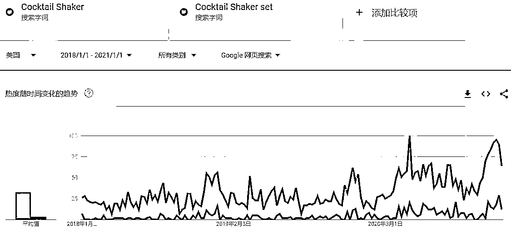

用卖家精灵工具，查询关键词的月搜索趋势，可以发现该产品搜索量可观，搜索趋势也是往上走的。

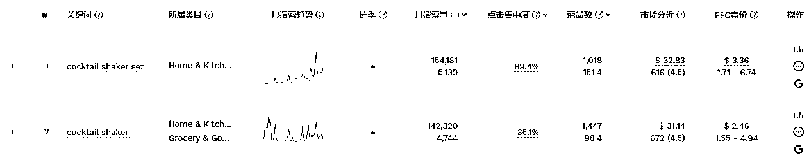

看完趋势后，再分析市场容量。

找到该产品BSR榜单，利用卖家精灵抓取整个榜单数据，能够看到其30天销量及销售额。当然，也可以用垂直关键词搜索，抓取前3-5页数据，去重后，得到一份产品表格，进行分析。

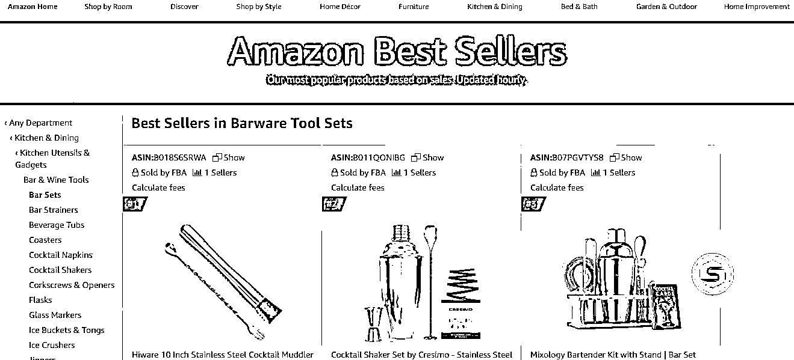

抓下来的数据进行筛选，把非对应产品删除后，可以得到精准产品下当月销量。再将谷歌趋势的数据下载下来，根据趋势变动，粗略计算出该品类一年的市场容量。为了数据精准性，我一般也会用 amazon business analysis，将关键词近12个月的排名整理出来，对比来分析。ABA和 

 

Google trends 不同的地方在于，一个是购买平台的需求，一个是"how to"搜索平台的需求。因而数据在某些程度上会有出入。那么我会二者结合一起观察。

在这些查询销量的平台中，Helium 10和卖家精灵我觉得相对准确度高，JS的话，相对而言就相差略大。

当然，这些数据也是用于看个大概而已。若是选中了一个工具，后续的销量，比如每个月下载数据更新市场容量，观察市场变化的时候，也要保持用同一个工具，确保相对数据的准确性。

最终能得到下列图表（注：表格仅为参考，内部数据并非对应产品精准数据）

（二）产品类型占比

如果只是粗略对市场进行分析，那么可以不进入产品向的分析。根据上述拉出来的数据， 通过简单的**excel**数据处理，可以看到品牌销量占比、评论数与销量的关系、**TOP10-****TOP20-TOP50-TOP100 **的销量占比，大致看到市场竞争情况，分析最低推广资金投入。

比如要做到日销80的量，位置至少要在BSR80，评论数至少要做到200。那么这个时候刷单金额大概能算出来。此外，广告的花费，第三方数据可以看到BID出价，转化率，计算出单个订单广告花费，得出广告占比。整个推广资金心里就会有数，这个品类，资金和资源能不能打起来，就有初步评判方向。

判断可做，或者未能得出明显结论，则可以进入深度的市场分析。这个时候主要站在产品和消费者的角度上进行调研，看是否有机会找到产品切入方向。

 

 

到了这一步，首先，我们会先通过Google搜索文章，查看用户在购买时会问的问题，以及blog如何分析产品，会着重关注哪些点。将这些内容参数提取出来，  就能得出一个产品组成框架。

比如，air fryer大家关注的点有：容量、内胆、操作方式、加热方式、性能、噪音、材质、外观、配件等等。

那么在做产品分析的时候，这些参数就是我们的调研方向。

最开始我们下载下来的BSR100的表格，这个时候，我们需要针对每一个产品，调研其上述的产品参数信息。类似于下图参数，部分可以自制爬虫抓取，但是大部分信息藏在产品描述、QA中，因而还是要每条链接点进去看。将这一步做完，对这个品类能了解个60%以上了。

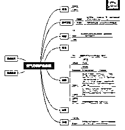

 

 

同样，将数据全部整理完后，进行数据分析，看哪个产品类型市场容量较大、单价分布在什么位置，哪些功能是基本配置，哪些可以作为辅助，为后续选款/产品优化  提供数据支撑。

（三）市场竞争强度

这块主要有以下几个分析点：

1.市场情况分析：市场容量、增长趋势、上架时间、Listing垄断情况2.品牌情况分析：品牌占有率、品牌垄断情况、品牌上架时间、品牌增长速度、品牌上新速度、品牌产品布局

3.参数分析：不同参数下的产品占有率，包括款式、容量、材质、性能等等。

4.价格段位分析：分析用户对各个价格段位的需求占有率，以及不同价位段产品功能参数情况5.运营难度：评论数量、对上述市场、品牌、参数情况分析汇总

我在这块主要会着重关注几个数据：

1.不同款式的售价范围，及其对应的市场容量；

2.不同评论数范围对应的日销数量；

 

 

3.产品上架时间及对应的市场容量；

4.不同款式的最早上架时间、及上架时间占比；

5.TOP20品牌的市场占有率、TOP20链接的市场占有率

这些数据对应的内容是：产品生命周期、新品上架后的机会值、最受用户接受的价格范围、用户觉得需要具备的产品功能排名、市场垄断情况。

具体这部分的分析，需要根据自己的实际情况及关注点，来选择数据进行分析，形成模板。

如果品牌或者头部链接占比过大，那就不用再搞了（这个数据，在产品类型占比分析或者初选之前可以看到）。但同样，如果真的对这个产品有信心，或者有供应链/设计资源，那么继续深入分析。

将头部品牌近几年的上架款式、上架时间、客单价情况，做一个品牌数据表格，能够清晰的看到，各个品牌的产品布局。

大概做出来的图长下面这样，有产品图片、核心功能、ASIN、售价、品牌

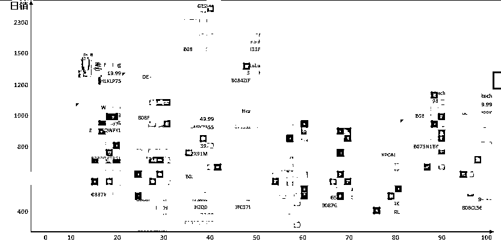

（四）供应链稳定程度

 

 

这块从运营的层面，主要看：产品评分、1688供货数量、相应工厂数量，作出一个大致的数据分析。

产品评分如果均在4.3分，也就是亚马逊四颗半星级以上，说明整体供应链比较成熟，对于没有太多产品经验或者是供应链资源的人来说，选择这样的品类会比较不踩雷。若是市场上大部分评分都是4颗星以内，说明产品类目不成熟，假设这玩意还卖的贼好，说明是个新需求市场，有产品研发经验的人可以入场，做产品升级，只要解决了痛点，就是行业靓仔。

举个例子：champagne gun，这个夏季爆款，之前我拿过样，用起来的时候发现真是贼难用，使用前体验贼差，但是产品很花哨，很符合夏季派对需求。3颗星评分，8月份的时候一个链接最多能卖1000+，Kitchen & Dining 排名 2000左右。如果有小号，这个产品就非常适合前期卖一波，赚笔钱撤离。50RMB采购成本，重量300g左右，FBA配送费用3.47美金，市面上的竞品售价35.99。假设我们售价29.99，假设走海运，毛利率45%，投资回报率158%。算上退货率10个点，推广10个点，也能赚25%，卖1000个是5万左右；走快递，18个点的利润，1000个是3万6。但是对于新手来说，把握不住的话，很容易变成库存。

看1688供货数量，同样也是为了看这个产品是否被垄断、是否被包销、是否有专利技术、制作的难以程度等等。被供应链掐脖子是可难受的事情。还是这个champagne gun，当时1688找的时候，仅有2家有卖的，都拿了样品，联系后发现，一家是抄的另一家，另一家抄的好像是国外的，但声称改良版，自己有专利（我没有细查）。中国工厂大多也求快、求爆品。对于这种工厂，产品细节上做不到位，体验做不到位，是比较正常的。特别是如果工厂不做限价，一旦市场卖起来，但是被供应链卡住，被同行恶性竞争的话，就很难搞。包括一些品牌方的产品，前期拿货可以卖一波，能卖起来是最好的，后期如果品牌自己同一个平台上场卖，开启市场收割模式，那么对于拿货方来说，也相对被动。

那么对我而言，前期，我更倾向于供应链相对稳定、市场相对成熟的品类，一方面市场经过了验证，只要产品有特色，就可以往长期做；另一方面，没有什么专利威胁，工厂选择性多，市场成熟，产品退货率、店铺安全等，都有一定的保障。

 

 

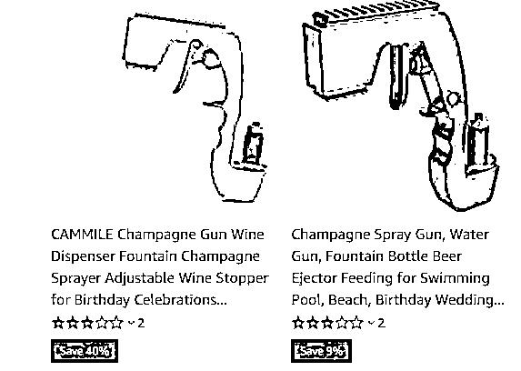

（五）消费需求及场景，用户痛点分析

消费需求可以参考 KANO 模型，分为5类：  基本型需求，  期望型需求，  兴奋型需求，  无差异型需求，  反向型需求。

**1. ** 基本型需求： 产品功能必须满足的用户需求。当该需求满足不充足时，用户很不满意；

当该需求充足时，对用户满意度没有多少影响，用户充其量是满意。例如社交产品的加友功能；音乐产品的听歌功能。

**2. ** 期望型需求： 用户满意度随着此类需求的满足程度而线性提升或下降。当此类型需求越得到满足则用户满意度越高，反之则用户满意度越低。例如，音乐类产品的歌曲越多越好。

**3. ** 兴奋型需求： 是一种完全出乎用户意料的属性或功能。如果提供此因素，用户会感觉惊喜，满意度大幅提升，但如果不提供此需求，用户满意度也不会随之降低。例如微信的摇一摇

**4. ** 无差异型需求： 这类需求无论满足与否，用户满意度都不会受其影响，用户对此因素并不在意。例如产品的简介

**5. ** 反向型需求： 用户没有此需求，提供后满意度适得其反。例如产品付费功能。

消费需求的数据来源是评论及QA。通过分析用户的问题及好评和差评，来提取用户需求。

一般我的提取模型为：

产品：不同类型的产品TOP3个/BSR排名TOP10（太多了分析不过来，看TOP比较有代表性）QA&好评&差评：近3个月or最近80条（一般产品3-4个月迭代一次，看最新内容，体现最新产品 version 情况）

 

 

这里多提一句，看用户的关注点这块，亚马逊在用户评价的时候，会针对不同类目，提出不同的问题让用户打分。同时，对于用户的评论，会做词频整理。那么这一块，就是我们可以着重关注的点，对其进行整理分类，然后再对照着提炼QA和评论，分析用户关注点和需求。

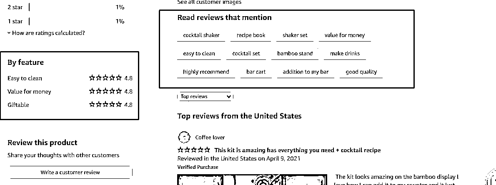

对数据分析后，再将QA及review内容提炼；其中差评还可以用于产品研发方向的支撑。

分析完需求后，消费场景也是利用QA及Review数据，通过词频分析，提取场景数据及排名，得到用户使用场景需求。

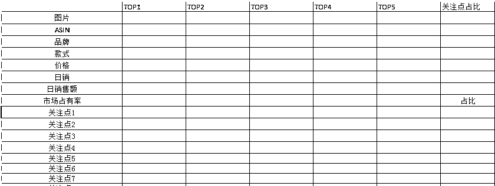

三、用户需求分析

对上述分析完后，最终可以获得一份用户调研表：包含使用场景（场景+时间）、用户人群（人群+使用目的）、客户需求。

 

 

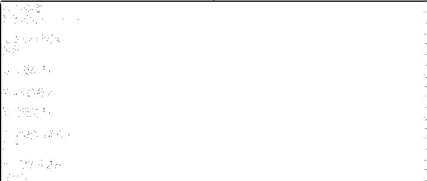 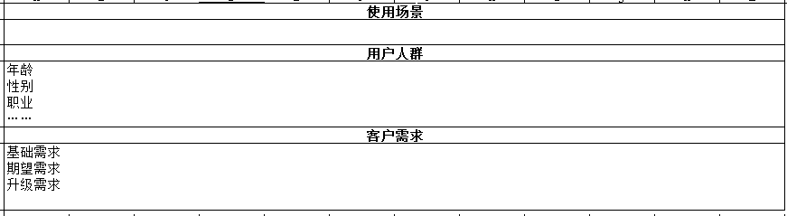

这个调研表，就是我们产品开发所依据的表格。

清楚的知道自己产品背后所对应的细分用户群体是怎样的一群人，针对这群用户，再具体研发或者改良产品。

举个例子，我做组合性产品，那么我首先需要明白这群人他的需求是什么，他是什么样的一群人，他买这个产品用来干什么，他除了买这个产品，还需要其他什么前后端的产品，他求不求方便性，求不求产品质感，他们最倾向的价格段位是多少，对应价格段的产品有哪些功能。这类产品的基础功能是什么、升级功能有哪些。在词频分析中，他们最常提及、最喜爱的款式有哪些，最多的场景是什么，需要配备什么功能或者产品。

把这些通通整理好，辅以文字形式，通过数据，展示出来。

四、确定产品方案

 

 

根据上面的用户需求分析，开始判断，这个品类是否有机会。具体是什么价位段、什么产品功能方向，他对应的市场容量、销售额及利润是多少，是否符合预期。

基础用户，给他们基础功能，匹配低价段的市容量最高的价格；对要求更高的用户，给他们配呼唤度更高的升级功能，或者上下端的产品。

最后，把“产品组成方案-价格-利润分析-预期销量-预期营收-对应1688初选”整理出来。

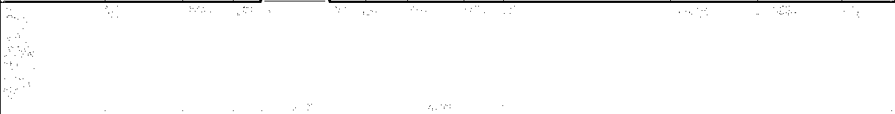

出合适的产品方案后，可能会有几种选择。比如颜色组合等等。当心里不确定的时候，做问卷调查。

Google设计问卷表格，然后投放fb广告，让用户进行填写，送对方礼品卡等方式，收集信息。

当然，有更省事的方法，上fiverr.com，有一帮歪果仁，能够帮你做这个事情。200份问卷的价格大约再25美金左右。

当你想不明白猜不透的时候，就想办法用数据解答问题。

但最重要的是，不要纠结。做产品本身就是不确定性的，上述工作，是为了做精品，砸钱进去之前，把不确定性变得更小一点。毕竟做亚马逊是个压资金的活儿，确定了一个品类，首批货少则200，多则2000。时间其实更为重要。“犹豫徘徊，等于白来”。

确定好产品方案，就可以再找工厂，把具体的产品落地，创建链接，准备发货了。

什么？没有店铺？关于店铺，可以看这篇文章，

https://wx.zsxq.com/dweb2/index/topic_detail/815528858411152  虽然是去年写的，但仍旧适用。

最重要得，产品上架之前，做好项目投资回报表，产品推广方案。做到“知道竞争对手是谁、什么时候需要达成什么样的销售目标、什么时候可以盈亏平衡、什么时候可以回本”。

然后，按部就班去做就好了，计划=方向=具体执行时的灵活调整指南

好了，整个选品策略写完了。

 

 

看到这里后，是不是觉得“我就搞这么个东西，为什么复杂到这种鬼程度？？”是的，的确很多步骤让事情变得复杂，但是相信我，当你把这套做完，你会非常了解这个品类，特别是在产品落地的时候，和供应商扯七扯八，又能积累到一波资源，对这个类目也有更深刻的理解。

整个流程是为了增加“确定性”，降低“风险概率”，做到“心中有数”。如果你是一名跨境新人，你需要这波流程，来增加你的跨境初体验成功率。如果你做垂直类目，你更需要这波流程，提高对市场的熟悉度。

如果是做铺货，则测款很重要，那么上述流程，很多部分能简化掉。铺货需要概率，增加产品数量，从而提高成功率。那么这波选品流程，主要用于提高成功率，但最终还是需要多款产品，需要多选。不断的看市场，在产品初选步骤和用户需求分析部分下功夫，其他的竞争性分析部分，拉数据，靠经验快速分析。

因为我的创业投入相对小，在最初的产品上，我每一款都细致的做了分析，然后确定方案。即便如此，因为最开始的不成熟，包括今年的市场因素，我的产品成功率也只有20%。活下来的一款产品，我把它做到了Best Seller TOP1, Most Wishes TOP1, Gift TOP1。当然，主要是这个类目相对小，利润虽然没多少，但是正反馈让我坚持了下来。顺着这个产品，我继续做垂直产品线开发，做好高低价位的防护。

具体的做法，我有一些复盘，发在我自己的星球、朋友圈以及生财的 #挑战2021收入翻倍#作业中，里面涵盖了我做这个产品经历的“供应链”、“推广”、“品类”“团队”方面的种种困难和思考。如果你感兴趣，可以在生财的作业里看到我的分享。10月，我将把《我是如何从0选出并打造1个月入1万的产品的（运营篇）》（白帽玩法）整理出来，分享给大家。

希望这篇文章对你有帮助，如果你有一些建议，欢迎在评论区留言，我们一起探讨。

如果觉得看得不尽兴，这里还有一些我曾经写过的其他跨境电商相关的精华文章，分享给你：

《我是如何毕业两年晋升为跨境电商大厂经理的》

https://wx.zsxq.com/dweb2/index/topic_detail/414815521552858《一文搞定亚马逊开店卖货（店铺注册/品牌备案/卖货发货/养号）》

https://wx.zsxq.com/dweb2/index/topic_detail/815528858411152 

 

《10人团队做亚马逊年营收7000w的方法论》

https://wx.zsxq.com/dweb2/index/topic_detail/241141458255151《我是怎么不靠广告，3个月时间在亚马逊把一个产品做到100W销售额的？》https://t.zsxq.com/u7AIAQB

《疫情下，跨境电商还有机会入局吗？》

https://wx.zsxq.com/dweb2/index/topic_detail/118851151558182《跨境电商创业全流程分享》

https://t.zsxq.com/jy7AMfE

感谢阅读，我是Lissa，混在跨境圈的音乐区up主，一个专注搞钱的深圳女孩 ;)————我是分割线————

最后来个小尾巴，和大家分享下创业的感受，还希望大家别笑话我。

其实这篇文章写了很久了，  一直没出完整篇，一来是测试周期不够，二来是成功有概率问题在。至今日，通过几次测试，有了一些小成果，确定了模型没啥问题，才和大家分享。之前在问涛哥栏目里面，和涛哥提及我的创业之惑，我说我好困扰，创业前期的能效太低了，我都不知道该坚持还是该去上班，我觉得我需要一个团队，但我找不到合适的人，也怕招来人没有事情给他们干，我模式跑不通，我人养不起。@杨涛  涛哥当时给我关于流量和卖货的提点，至今每每想起，都能让我更清醒更踏实。当然，还有关于团队的建议：伙伴的意义，很多时候不仅是业务上的，还是精神上的，走得不孤单，一起走更远。

的确，一个人走虽然前期很快，但真的是太累了。太多焦虑、迷茫、自我怀疑。好在坚持下来了，走着走着，感觉前路也稍微清晰了些。慢慢了解到动物园和野生环境的差异，知道决策的重要性以及所背负的压力。因为决策稳重而避了坑，也因为太过纠结而失去机会乃至成本飙升。有的时候自我安慰，说这段经历让我变得沉稳，变得更理解了什么是“工作”，什么是“做生 

 

意”，从理论派直接变为真实战家。我清晰的知道，我们所想要的，从来都是真的赢，而不是辩赢。

每个人都有想做的事，我希望我现在在做的，不仅仅是让自己能活下来，而是能够更大一点，更有意义一点。毕竟嘛，来都来了，  是吧。

在周复盘中，我一直在说想要找合伙人、投资人，甚至为此发起了“每周见一人”的活动。我觉得，是时候更加认真对待，把它提上日程了。如果你对亚马逊选品、或者亚马逊运营推广有自己的经验见解，如果你也对创业感兴趣，如果你对Lissa感兴趣，要不要一起聊聊，看看我们有没有机会，能一起走一段，一起走得更远？

最后，感谢一直支持我的@森淼，感谢@涛哥的帮助，感谢@亦仁的鼓励，感谢@白一喵的分享（要不是看到小白最近在生财的精华帖，这篇文章我大概率会一拖再拖 T T，小白乃神人也），感谢所有为我提供过帮助的朋友们。

借用最近朋友圈的一句话结尾：

生财变得好大好大，我变得好小好小

生财真棒，我也努力长大

评论区：

亦仁 : 感谢分享，已加精华。

Lissa Tam : 终于等到了😭  感谢亦仁！

轩辕 | 专注视频号 : 赞，核心方法论，数据分析、选品策略、产品趋势、开模差异化（高级玩法），这些都是可以借鉴到国内电商，不仅仅是跨境，供后面阅读的圈友参考。

wilsion亚马逊 : Lissa，我是你的粉丝😄😄。偶像，请问下各个品牌产品布局策略那张表是怎么做出来的呀，感觉不像是excel。

Lissa Tam : Excel….

跨境电商fantas* : 楼主的选品思路很有逻辑，很值得卖家学习，已收藏，借Lissa的分享 

 

给自己打个广告，我主营欧美FBA，做亚马逊圈友可以找我发货哈，价格都好说[呲牙] 苏生 : 厉害，感谢

# 【工具网站】**1**篇

# **# ****(**精华帖**)(36**赞**)**分享亚马逊的工具网站

作者：  锋度

日期：2017-06-30

刚看到一个亚马逊的工具网站内容，分享给有兴趣的伙伴。

1.haimai.amazon.cn

用亚马逊账户直接登录，可以查看每日出单量，实时销售变化，产品流量转化追踪报告，当然实际上跟亚马逊的后台没有多少差别，只是更加清晰。

最大的好处就是可以关注竞争对手的ASIN变化!

2.AMZTRACKER.COM

收费工具，可以试用十天，可以清楚地看到竞争对手的listing的购买量和成交金额！

估计这是最大卖点了！其他的功能大家自行研究！当然里面的review club大家可以好好研究！

3.Keepa.com

应该是提供给亚马逊买家的工具，可以监控某条listing一年来的价格变化，设定一个提示，如果对方价格落到了这个水平，就可以发邮件提醒。

这个还可以进行浏览器扩展，直接安装在浏览器上！

此类网站还包括 ,等

 

 

4.feedbackgenius.com

一个可以直接连接amazon seller central的工具，直接调用亚马逊数据。

操作较为简便。具体怎么使用，请直接注册登录，有30天试用，当然建议试用amazon的电脑，以防万一。实际上这个工具有点像是马帮工具，只是抓取数据，任何电脑登录都不存在问题！

5.feedbackfive.com

跟上面的genius有点像

6.

收费，类似于amztracker，但是功能比amztracker更加强大7.productrocket.io

刷评论的网站，自己去研究

8.

还是类似于amztracker，具体说明看图！

9.amzinsight.com

大体功能更amztracker类似，但是这个功能我觉得更强大！要有paypal账户，0.01美金试用！这个网站跟是同一个网站

这个工具强大之处还在于可以比较各国站点的关键词流量！

10.

每个工具都有每个工具的特点！这个也要试用亚马逊的MWS，不复杂，直接按照说明来就好！

11.

所谓的查看销量，排名，关键词的软件看起来很多，但是由于亚马逊开放的数据有限，所以都大同小异，大家随便选择一个就好！

12.

 

 

13.http://camelcamelcamel.com/ http://www.ipricetracker.com/ https://amzshark.comhttps://sellermetrics.com http://eglim.com/ https://sellics.com http://www.ranktracer.com https://sellerengine.com https://www.amz.one评论区：

萧遥 : 有个Amz123 导航网站  上面挺多工具链接

锋度 : 嗯嗯，这个导航网挺全的

阿彪 : 非常赞，多谢多谢！😄😄

# 【进阶玩法】**13**篇

# **# ****(**精华帖**)(439**赞**)**跨境电商平台年利润**100**万的

# 低成本小产品打法分享

作者： seven

日期：2020-08-11

【电商平台年利润100万的低成本小产品打法分享】

本文主要内容有：

一，原创蓝海打法的底层逻辑

二，实操细则及如何挖掘细分需求

三，用SWOT模型分析这套打法

四，进行到1/24的目标

五，我是如何更好的用好生财星球

一，原创蓝海打法的底层逻辑：

针对细分人群的刚需，提供高溢价低竞争产品。

在大平台里满足某个小需求也有很多赚钱机会。

 

 

能够高溢价的原因：

-细分人群的特定需求

-没有对手，独此一家

-原创设计，愿意为创意买单

能够低竞争及蓝海的原因：

-隐藏在各个角落，不出彩而不容易为发现

-非标品，要原创设计，打板生产，做深度产品，中小公司会觉得链路长，技能有要求，见效慢，麻烦，难，不值得等原因不好复制

-大公司看不上，大公司要么做GMV，要么做流量，要么两者兼具。

例如我前公司，原创飞机航模等做大GMV

全球80亿人口70亿穷人，靠低价做大流量，如今alex排名top500（1）此类产品特点：

**1. ** 需要选品，然后细致调研

**2. ** 高溢价

**3. ** 低成本产品撬动年利润100万，单价成本20元左右

案例：文学杯，运动爱好者杯

（2）此类公司特点：

真正做小而美的电商企业，依靠精准的细分市场和受众定位，加上差异化的选品，原创设计和供应链开模生产，活得很好，这些公司的特点是10人以下，人均产能在每月5万美元以上，没有特别大的扩充需求。

给国外市场的某一批细分人群，做好若干几个产品，在没有巨头进场的情况下，是可以活得很滋润的。（原文生财日历7月17日@HK）

二，实操细则

（1）拆解条件：

-选有机会的品类，低成本，可塑性强且不容易被轻易模仿

-找细分人群的刚需

-低竞争，小产品，成本要低利润要高

（2）可落地的实操步骤

定类目→熟悉材质→刷数据，找产品→挖掘细分需求→锁定单品后细致调研→找本土人查询专利→原创设计→找供应链打板→确认样品后做大货→运到当地仓库→上架运营 

 

1.先选定类目

电商平台都有分品类，例如淘宝网首页，就有分电器服装等品类。

要避开没有机会的类目：

-门槛低，易复制：服装饰品这类众矢之的，且打板生产无门槛

-难度高：美妆等类别

-成本大：电器等类别

有机会的类目：

-在此我把低成本，可塑性强且不容易被轻易模仿的9个类目都归纳出来了

-家居，厨房用品，户外，五金，宠物，园艺，游戏，母婴，手工

**2. ** 熟悉材质，找小产品来做，成本要20元左右

-在此我把能够低成本做货的9种材质列举好了

-金属、纸制品、纺织品、树脂、木制品、石头、塑料、玻璃、陶瓷

3.刷数据，找产品，找细分需求

实操步骤：

-点击类目，电商平台会按销量排序，依次展示商品。

-销量=需求，按最大的需求往下刷数据

-看到9种材质中的一种就停留，探寻细分市场

探寻细分市场是个脑力活，但有规律可循，并且有可上手的实操步骤：

-善用平台搜索框，用模糊搜索找到差异化细分市场产品

平台搜索下拉框和推荐搜索词提示找细分需求

（拓展阅读）

-五个维度拓展法探寻细分需求

我们拿一个案例,一步一步展开讲解

（1）例如我刷家居类别，按销量排序，第一个产品是陶瓷杯，符合陶瓷低成本做货材质。

（2）但是普货喝水杯无数竞争，这时候我们用方法二：关键字杯子放到工具平台搜索下拉框和推荐搜索词，其中「文学杯」一眼触动了我。

（3）然后用方法一，用「文学杯」在平台搜索，以亚马逊为例：我发现了

「禁书名咖啡杯」

「自由宣言杯」

 

 

「莎士比亚脏话杯」

…

(4)用关键字

「Banned Book Coffee Mug」

「Civil Liberties Coffee Mug」

「Shakespearean Insults Coffee Mug」

在amazon.com搜索，惊喜不，统统都只有一个对手

「The Unemployed Philosophers Guild」这家店铺的杯子，年利润200万以上。

（5）五个维度拓展法探寻细分需求

对象，主题，场景，功能，样式

*以换对象为例子，从文学爱好者衍生到运动爱好者，终于挖掘出了一款30美金的细分市场陶瓷杯，再比如可以衍生电影爱好者的20部人生必看电影杯。

运动爱好者杯

•成本：陶瓷杯，做货成本9元，加上头程最高15元

•单品利润：收回人民币120元，减去成本最高15元，等于105元利润

•单品月利润，对手出单30单一天，月成本2万，月利润9万。

针对杯子，要增大体量和利润，需要拓展衍生：

-对手只有一个款式和颜色，我们增加更多的选择给客户

-聚焦，若是我们一下陶瓷，一下木材，精力分散，赚不了大钱

-同个材质，同个工厂，最快响应

-因此，确定要做的单品，一定要就这个材质，最大化拿细分市场

（6）从0-0.1

当我们做一款杯子赚到钱的时候，就要思考如何放大，探寻更多杯子的细分需求  可以从5个维度拓展：

节日：母亲节,父亲节,护士节,独立日,复活节,感恩节,圣诞节…

主题: 订婚,婚礼,周年,生日,退休,乔迁,洗礼,祷告,毕业,怀孕…

对象: 母亲,父亲,祖父母,姐妹,兄弟,朋友,医生,护士,教师…

场景: 厨房,浴室,洗衣房,卧室,厕所,花园,办公室,门,墙,墓地…

功能: 收纳,装饰,展示,祈祷,罩,食品保鲜,测量, 应急…

采用杯子+「以上关键字的」的组合搜索，就可以发掘细分人群的需求

（拓展阅读）

 

 

以下以亚马逊市场为案例，思路是相通的，有兴趣可以去平台搜索

从场景入手，案例：方便宠物进出的宠物门

-宠物门：放在门上的有许多同质化产品，竞争大

-具有差异性的产品：美国人的庭院，从墙上进出的宠物门

-墙的场景有独特性、与众不同、卖家少、竞争小

-落地一体式窗户的，窗户宠物门

从功能入手：案例：婴儿积木

-积木是6面体，可以印刷不同的内容

-训练数字，颜色，字母，可以组合功能满足细分需求

（7）进阶思维

分析本质

当我们做了一个赚钱的产品后，就要分析赚钱的本质，需要思考

-我是如何找到这个好产品的

-我还能不能找到更多这种好产品

-怎样找到下一款好产品

我们可以提取下这类产品符合了哪些条件，从而成为了一个赚钱的好产品

-评价数量

-客单价

-类目排名

逻辑：

-评价数太少，壁垒低，众矢之的，评价数量太高，市场固化，非常难切入

-客单价低，无利可图，客单价高，通常成本也高，无法承受

-类目排名太前，众矢之的，排名太后，无利可图

从赚钱的产品里归纳总结的规律，用爬虫软件，或者是选品软件，将不符合条件的数据去掉，最大效率找到细分市场产品。

然后刷符合条件的数据，遇到贴合低成本的材质就按如上方法挖掘细分市场。

如果总找容易做的产品，客单价不高的产品做，就需要思考，是否太低壁垒了。

 

 

三，用SWOT模型分析亚马逊蓝海原创设计打法

（1）运作原理

亚马逊已经过了平台红利期，目前赚钱的主流打法有三：

-极致的铺货

-烧钱的运营打法

-蓝海产品或者是原创设计产品

（2）运作流程

1.选品

2.细致调研

3.原创设计

4.联系供应链打样，确认样板，做大货(批量生产)

5.上架运营

（3）主要门槛

-变现链路很长，变现周期长

-对技能的要求比较高

-选品和细致调研

选品是定生死的一个环节，这步错了，后面所有的努力，时间及资金的投入就全白费了  -原创设计，例如设计出一款好看的文学杯

-找本土人查询专利

-从设计稿到样品，对供应链的把控

（4）竞争分析

-本土卖家内部竞争：我们做的都是只有一两家本土卖家在做的产品，用降维的方式比他更优秀，本土卖家可能反应过来，也优化改进自己。

应对：本土卖家反应慢，也比较佛系，这个倒不很担心

-外部竞争：做蓝海原创设计的打法不止我们一家，也有中国卖家在做，从业的时候深有体会，天下中国卖家苦中国卖家者久矣。

应对：

1.拓展多几个产品

2.用垂直的思维，将细分产品做深做广做专业，被全盘复制的难度高

3.往高门槛的地方走

 

 

门槛由低往高如下：

-愿意打样生产的卖家本来就少，都喜欢现货，因为原创设计周期长，就算我们看到一个产品决定做了，最快也要4个月见到正反馈，盈利周期最快也要6-8个月。没办法，看到的任何产品，都要经过细致调研，原创设计，打版确认，做大货这些流程

-不容易被注意到的产品，蓝海隐藏而不为众人所知，静悄悄赚钱

-有外观专利，进一步过滤掉选手

-结构专利的就更少人愿意做了，原创设计的价值就在此@zev

-做货难，做货时间久的产品

-往更高客单价，做货成本更高的产品走

原创人员配置门槛由低往高

-视觉设计师/平面设计师

-产品结构设计师

-工业设计/产品设计

这块主要是@zev在协助我们搭建

逻辑：外观设计好破，结构专利，涉及到工业设计，更少人做

案例：B07C2439BH 名片卡夹

还有密码卡夹，还有按键出不同类型卡夹

整个市场只有一两家在做

如此复盘下来，亚马逊其实已经过了红利期，慢慢变成传统行业

如今做亚马逊，对积累，技能要求都相对比较高。

如果刚起步的应届生，可能选择短视频等新兴领域会是比较好的选择。

四，进行到1/24的目标

（1）一个我的特点

-单一的技能，单一的经历，不善交际使我更喜欢捣鼓产品。不善言辞，有一点点社交焦虑。

-因此我更喜欢静下来心来做好产品，耐下心来赚慢钱，能做3，5年的事情。

(2) 进行到1/24的目标

缘起：

-起步招人时，没有太高要求，因此她们大多不是特别有执行力

-因此旧产品留在了旧团队，属于我的自营团队。

-租新的办公室，带着能打的人去开始新的创业。

 

 

新的团队：

-7月1号开始新的408办公室

-作为合格的螺丝钉，我对运营可以说一无所知，因此邀约了@良辰美  担任顾问也是2021年项目负责人，注资50万。

-裂变对象Kathy

-华兄出资25万并出人，孵化项目负责人菲菲

-25万年薪+效果付费+全力辅助zev搭建亚马逊事业的条件邀约@zev担任产品设计  •Zev有电商经验，他的设计是紧密贴合市场的，

•国内top100学院211毕业，MBA硕士在读

•5年上市公司设计经验

•拆解商业技能，熟悉SOP标准化作业流程的搭建

为更好实现自己的目标，过去一个月我：

-组建一支有战斗力的团队

-谢谢@爱拆快递的小白兔  送了我一只小青蛙

-加入了亦仁的私董会

-加入了黎叔的星球，通过努力可以获得黎叔2小时的商业咨询

五，我是如何更好的用好生财星球

（1）刷精华

-第一次刷的时候，通宵看贴，各种能够赚钱的方法经过一定的筛选，觉得可行的都会去尝试，打开了我的视野和思维

-第二次刷的时候，我自己将精华帖分从0到1，和从1到10，而我处于有1，需要到10，明白老师，白一喵老师，生财合伙人的文章需要反复细品，如今我用讯飞听见，将文字转换成语音，在上下班的时间听。

（2）实践

前辈说，能赚大钱的生意，都是跑通一个模式后复制。

通过在生财星球的分享，对我在做的原创蓝海打法有了梳理，分析项目赚钱的本质，解剖项目的流程。

如今，我意识到原创设计和供应链这块暂时无法标准化后，着重借力在强化这两块。

（3）借力

-提供工位，无偿邀请想建立亚马逊从0到1的圈友来公司一两个月学习，积极的人碰撞在一起，一定会有不一样的创意和想法出来

-接孵化项目，将项目收益给研发团队和供应链，尝试强化原创设计和供应链，并思考后 

 

续如何独立成单独的部门

起初我很害怕，他们来到我公司，我所有的产品及运作核心就都暴露无遗了。

-轻易能被复制，只能说我们太弱了。

-蓝海原创打法的人很少，市场那么大，不愁找不到产品。

（4）在生财星球做分享

分享复盘的作用：

-我常常思绪很多，真正写的时候根本不是一回事，写作的能力，是需要将有价值的信息触达更多的人，影响一些人。

-在输出文章的同时，梳理了自己的思路和框架，会思考哪些可以优化的细则，是否可以做成sop，未来如何放大

-对团队有增益，为小伙伴带来启发，带动他们做复盘

-链接到了优质的人脉和资源，得到了很多的帮助

（5）如何更好的分享

-触达更多的人，以拿精华为目的的输出收益最高

-将想要分享的内容按案例、过程、细节、数据、流程、经验、总结、深度思考分解，用低层逻辑--系统框架--填充，案例过程细节数据流程--深度思考，经验总结串起来。

-还可以从商业模型，例如光合的文章，例如SWOT竞争分析写整个复盘

-参考

第一步，开拓眼界，汲取更多的赚钱信息、赚钱案例；

第二步，提升认知，建立正确的赚钱价值观，积累赚钱想法；

第三步，疑问修正，思考目前面临了哪些难关，可以如何调整；

第四步，提高效率，通过一些工具、技巧提升赚钱的速度；

第五步，复制思路，把已经跑通的赚钱逻辑，实际应用起来；

第六步，复盘总结，对尝试过的赚钱经验，进行规律总结和沉淀；

第七步，延申思考，赚到钱之后，还有哪些点是需要关注内化的。

复盘也可以从这个角度将全文贯穿起来

(6) 靠什么持续输出

-输出倒逼输入，写作是为了明心见智

-靠什么持续输出，输入，持续搞事情，安逸哪来案例数据

 

 

写在最后的话：

由于过去都是随心做事，从不做复盘，挖掘细分市场这块没沉淀出sop。

挖掘细分上还是写得比较浅，希望持续学习，持续分享，在未来传达较好的价值。

https://keywordtool.io https://mp.weixin.qq.com/s/cXa6Rwiet5gN8bSe-h4QNw https://mp.weixin.qq.com/s/0cWrxYamykTzP2his87k7w https://t.zsxq.com/nyN7iea

评论区：

明白（晚9点半睡觉） : 这是高手

seven : 谢谢明白老师，我加油[奋斗]

蜗牛君 : 高手复盘的内容，真的干货满满！

seven : 里面的卡夹也是成本很低，利润高的产品，不过需要结构设计，而且是第二家是中国卖家。

但思路和逻辑是相通的。

另外一年只能做好几个产品的情况下，需要把时间聚焦在收益最大的产品上。

聚焦在有壁垒的产品上，就可以拾级而上，积淀有复利。

容易被跟进的产品好比在海滩盖房子，禁不住海浪，就需要不停的找新产品保持盈利。

电商&安奇 : 干货鉴定完毕

阿枫 : 厉害厉害👍

嘉伟KiahWee : 感谢干货分享

一生荣禄 : 大赞，期待你的下次复盘[强][强][强]

# **# ****(**精华帖**)(386**赞**)10**人团队做亚马逊年营收

# **7000w**的方法论

作者：  亦仁

日期：2020-07-20

今天这篇  ，说实话，近8000字，干的有点噎。

 

 

如果你对于亚马逊创业没兴趣，不一定要看。

这篇文章是  在去年带了一个 10 人团队，用 1 条品线 5 个产品，在亚马逊做到年营收  7000 万的成绩。

如果你在做跨境电商，或者希望完整了解一个项目的从0到1，以及放大市场和团队管理等细节，那么这篇文章值得你看一下。

欢迎  。

———

嗨咯大家好呀，我是 Lissa, 一只擅长亚马逊精细化运营和 sop 流程梳理的跨境电商创业狗，感谢亦仁大大的认可，邀请我来做这次关于跨境电商的分享。

我本身学的电子商务，18年之前，我接触比较多的是国内运营，18年毕业，进入跨境电商行业。当时选择跨境电商的原因也简单，源于玩沙盘模拟的时候我们组输了，原因在于没有拓展海外市场。

18年做wish，铺货，主要通过站内 ppc 做销量。19年正式进入亚马逊，做精品。之前有分享过，我的成长路径设定的是，从做一条爆款，到做整个站点，到多个站点。很幸运，都完成了，相关的经验及运营策略之前发在星球里，感兴趣的可以翻一翻。

我们项目组大概10个人，一条品线，五款产品。一般一条产品我们能做到80w营收，一个站点能做到200w，整个项目组算下来，亚马逊平台年营收能做到7000万人民币。项目综合净利润在10%-15%，抢占亚马逊大部分 bestseller 和 amazon choice 标，品类在欧美市场整体占有率前三。

因为我刚好经历了整个流程，之前有和大家分享过，我是怎么不靠广告3个月时间在亚马逊把一个产品做到100W销售额的（比较野的玩法  ），那今天主要和大家分享一下相对可复制性高一些的玩法，我们项目组是怎么做到年营收7000万的。

以下正文，enjoy～

咱卖货的清楚，做生意再怎么掰扯，无非就产品和市场，生意的布局就战略+战术。

战略层面主要是产品及资源布局，搭盘子。一共三个点，资金运转、产品供应链把控、市场扩张策略。

我们开局拿了投资，从创始团队拥有的供应链资源入手，抢占市场主要通过多品牌霸屏，各个品牌设有独立站，2B和2C同步运作。

 

 

控制新品研发在3-6个月，把控各个环节的资金占比，比如推广成本占15个点，前期可以战略性亏损，阶段性把控利润率。

每月设定增长目标，通过最快速占领市场来拿供应链上的话语权，以及对外吸收投融，进一步扩大资金盘开发新品线。

战术层面主要就做市场，也就是怎么从一个产品到多个产品，一个国家到多个国家，一条品线到多条品线。

我们线上只做亚马逊，之前也和大家盘过流程：产品（市场需求+市场竞争）——供应链（供应商+仓库+物流）——销售（文案+运营+推广+售后），产品决定市场空间和竞争压力，供应链决定产品能走多远，销售决定占领市场的速度和程度，也就是决定现金流和利润。都说七分产品，三分运营，实则不尽然。产品好，起盘快，运营好，市场占有率做得快。各个公司的资源不同，近而战术不同，产生不同的侧重点。

当然啦，上面是我自己的理解，战略层面比较虚，对个人的资源要求高。战术层面相对更为落地，可复制性强。

众所周知，我是个 SOP 达人（逐渐开始不要脸），擅长盘流程，使其可复制化。那今天我主要和大家分享战术层面，也就是我们一个项目的市场团队，是怎么一年做到7000万营收的。

先说结论，我们主要依托于：选品+品控（质量迭代）+运营+售后，上述四块的投入及产出占比为—— 选品 : 品控 : 运营 : 售后 = 2 : 3 : 2 : 3 ，前两个属于产品端，后两部分属于市场端，各占50%。

【  一、选品  】

选品即选赛道，发掘最具优势的市场。

选品这部分我们直接由创始人团队进行把控，创始人团队中有一位现金流把控超级厉害的成员，大部分产品由他根据市场情况和月财务效益衡量选出。

因为公司资金相对比较富足，子弹多，可选的产品也比较多。我们主要做 3C 类的产品，这类产品的情况就是利润率高，竞争大，退货率差评高。我们团队擅长做 listing 的评分和评论数，所以市面上评分小于4.5分、评论数大于1000条的不多于十来二十个的产品，都在射程范围内。

 

 

18年我们项目入场。当时我们项目所在的市场有一个超级品牌（行业大头）在，他们主要做高客单价产品，市场占有率达到了80%。中低客单价有人在做，但是整个中低价市场比较乱，那时产品普遍评分在4分及以下，且没有品牌化运作。高客单价市场只占20%，还有80%的中低客单价市场的需求没有被满足，这就是我们切入的机会。当然，现在整个市场处于血海状态，随着越来越多的中国卖家入场，产品和 listing 质量做得越来越好，最终进入价格战，拼供应链。

【  二、品控  】

品控即做迭代，疯狂满足用户需求，解决用户痛点。

我们有专门的品控团队，负责产品的质量迭代，同时配合市场进行新款开发（功能迭代）。

我们每周会开一次品质会议，和市场部对接，反馈产品问题，并针对问题进行优化。软件的迭代速度很快，如果有问题，基本一周能搞定，硬件因为压货的原因，一般会保持在3-6个月迭代一次。

品控和市场的配合度非常之高，产品优化、功能开发、新品研发速度很快，这保证了我们能跑着竞争对手前面，从功能等产品性能方面进行降维打击。比如说，投影仪类产品，竞争对手还是 1080p 的时候，我们的产品做到了 4k 画质，竞争对手是按键，我们升级到触摸屏等等。

3C 类目，最开始比质量，然后比功能的丰富性。也差不多这两个点，从产品端跑赢竞争对手，市场部就能有更大的发挥余地。

【  三、运营  】

运营即开拓市场，最快速度做体量。

我们团队主要负责市场部分，上面我写到运营占2成，售后占3成，是因为我们团队主要还是在做服务，关于运营其实做得不是深入，也就是说服务 90 分，运营 70 分。

以我们这一个项目为例，按照战术拆分：一条链接到多条链接，一个产品到多个产品，一个站点到多个站点。

一）首先讲一条链接怎么做

做链接（链接即listing）主要分为两块，第一块是listing打造，和转化率挂钩；第二块是listing推广，和流量挂钩。

 

 

listing 主要分为三个部分：文案描述、图片展示、客户互动（问答+评论）。

listing 打造是比较基础的部分，在制作前，我们会调研主关键词下排名前40条listing，分析竞争对手的图片、卖点、用户好评和用户差评内容，以此抓取到用户痛点，和我们的主要卖点相整合，放入listing文案中。

图片展示则是根据卖点来，将用户定位、图片风格、需展现的主卖点和次卖点、每张图分别表述的卖点和使用场景，全部写清楚，整理成需求表，交付给美工做图。

关于客户互动，我们着重做评论这块。评论区也是我们整个listing打造的重中之重。

几个基本的要求：

首页评论区全五星好评，长文字带图带视频；

产品在100条评论前控制在5颗星，一般500条评论内都需要做到5星，不能低于4.5星；

新品2-3个月做到100条评论；

所有差评必须全部回复，24小时内处理。

上面这些点，我们主要通过测评来搞定，同时通过测评，我们将 listing 的关键词自然排名推起来。

listing推广即做流量，主要就自然流量和广告流量。我们广告玩得一般，广告之于我们的作用，第一，辅助推广listing的关键词排名，第二，占坑位。广告部分的要求就一点，控制占比5%以内。

我们主要还是通过做自然流量来做listing。自然流量中我们又主抓关键词排名流量和秒杀流量，通过上述两块流量，把New Release（新品推荐）流量、Most Wishes、Best Seller、Amazon Choice流量做起来，同时提高产品表现和转化率。

也就是说，主要流量来源是：

关键词自然排名

秒杀

New Release +Most Wishes

BS + Amazon Choice

关键词排名怎么搞？

 

 

上面提到的，测评+广告配合，测评的时候让测评人点广告下单，一方面可以优化广告数据，增强广告表现，以此提高固定竞价下广告位的排名，另一方面可以增加测评的真实性，降低被亚马逊抓包的风险。

测评的时候，我们会要求测评人：

点广告进入；

加 wish list 和购物车；

提 qa；

上优质评论（长文字+图片+视频）

给优质评论点赞

我们给到测评人的就是1个产品，如果测评人配合度高，可以考虑包 PayPal 扣点和税费。

当然啦，上述内容会根据测评的目的不同而变化。上面这些是为了做评论的要求，那当我们要走量的时候，会直接给99%的code折扣码，相应要求也会不同。

通过测评，我们做排名、做new release、做most wishes、做amazon choice。

我们利用测评做的事情比较多，需要高度把控，因而不会找中介。但是说句实在话，这部分的确花时间比较多。如果擅长玩转化、做广告，这部分的时间花费着实可以找中介做，这就和不同的公司体量及策略有关了。

那秒杀流量怎么抓呢？

操作变体换秒杀。这个要求你有多条有秒杀推荐的链接，前期在测品的时候上的产品，或者说一些配件，他们的秒杀推荐就可以拿来给主推的新品做了。怎么操作之前的文章有分享过，这里就不赘述了。

秒杀是个大流量窗口，一方面它有专门的秒杀页面，另一方面，它在产品关键词搜索页面下方会有推荐框。

秒杀的时候因为价格优势缘故，转化率会比之前高，这就意味着，通过秒杀能拓宽关键词数量，以及提高关键词的排名。

上面这些流量渠道层层关联，最终以销量来展现，销量高又能获得 Best Seller 流量窗口，拿到亚马逊的推荐，28定律，强者越强，最终把 listing 做到首页、做爆，占领市场份额。

 

 

我们一条 listing 的打造方式如上所示，这不是风险最低的玩法，但是是可复制性相对较强、且比较快的玩法。那么关于风险，做好把控措施比如多店铺操作、小账号、安全账号等，多方面均摊风险即可。

做好一条listing后，同样的方式，可以做多条 listing。

listing 就相当于手里的牌，牌多了，打法就相对丰富。

2）再讲讲多条 listing 的打法

不管是一次只推一条 listing，还是一次推多条 listing，这些 listing 都是有使命的。最基本的使命，很简单，做销量赚钱。

那像我们做品牌，做市场占有率的，我们的 listing 还有一个目的，就是品牌霸屏。通过品牌霸屏，疯狂刷存在感，同时抢占站点份额，做到品牌占有率第一。

一般而言，我们一开始每款产品只上一条listing，按照推广节奏，将产品一条一条推至首页。如果出现 listing 推新失败、或者 listing 太老，表现差的情况，我们会重新再推一条  listing。总之就一个目的，尽可能每款产品都有一条listing在首页。

亚马逊3C类目，一个页面有22个产品链接，16个自然链接，6个广告位。我们至少可以占到四分之一。

早两年算法还没变化，我们尝试过一款产品上2条listing的玩法，一条专门做秒杀，一条专门做价格。18年左右，德国站我们能做到第一页第二页都是我们的产品，想象一下，黑五大促的时候，几百个产品，秒杀刚开始，瞬间全部秒完的感觉。

现在算法变了，亚马逊会控制每页品牌的展现数量，当然，针对这点，我们玩多品牌布局，也就是上面战略部分提到的。

老 listing 我们怎么处理呢？当然也不会放弃，只是降低了成本（资金、时间）投入，广告开起来，售后这款跟上，及时处理差评客诉即可。当再次需要它的时候，比如主推listing要抢 bs，需要分走竞争对手销量，亦或者是说市面上出现了超低价的产品（做秒杀，或者售价极低），这条老listing就可以出山了，价格压到最低，广告打到对方附近，抢一波销量。

霸屏的玩法呢，考量好产品链接成本，以及多久能回本，把帐算清楚即可。

 

 

成本有两个，第一个是库存压货，第二个是推广成本。库存压货我们有海外仓，所以不是很担心，再者，市场大，小批量入仓，不愁卖不出去，库存压力小。推广成本，主要在于测评。18年的时候还不怎么需要测评，靠优质售后，加上运营策略，就能做到市场前列。到了19年开始，竞争格外激烈，为了保持市场占有率，加速新品推广进度，测评成了不得不做的事情。若是按照一条产品链接测评100个来算，这个费用差不多在2-3万RMB之间。若我们的产品利润率设定在40%，那大约卖个三四百个，就差不多了，那1-2个月就能回本，后面这条链接就是纯赚了。

除此之外呢，还有一些玩法，比如组合打法、捆绑销售、低价引流+高价利润 ……太多了，这个国内和国外的玩法都是相通的。

3）最后说说多站点打法

亚马逊有欧洲5个站点、美国2个站点、以及澳洲站、其他小站。

其中，欧洲德国站利润最高，市场竞争最小。欧洲税务复杂，大部分人这块搞不定，就只做美国站了。且德国人民对品质要求高，有利于产品的迭代升级。

那么我们开盘选择德国站先做，每周1次品质检讨会，快速迭代产品质量。一套花式玩法下来，德国站市场差不多稳定后，产品质量也差不多稳定了，此时，市场部铺开其他站点，产品部继续开发升级新品。

按照利润来说，德国>英国>意大利>西班牙>法国

按照市场来说，德国>意大利>西班牙>英国>法国

接下来选择的站点，是意大利、英国、美国、日本站。其他的站点，如法国、加拿大、澳大利亚，也可以同步开起来。

各个站点市场的特点不同，比如日本站和意大利喜欢低价，意大利和法国站测评非常好测，加拿大澳大利亚市场小但是利润非常高，意大利法国西班牙主要靠秒杀出单，德国站的人民爱好品质利润高，日本站轻易不给五星，喜欢给四星，还特地剪个视频，配上文字音乐放到评论区（真是辛苦了呢）……

玩多站点，listing的推广方法是一样的，留意好各个国家的政策和节日（活动日），把人招过来，就可以铺开了。

【  四、售后  】

在亚马逊上搞品牌，说起来也简单。

 

 

产品链接（listing）写的好，图片/文案皆高质；

产品链接评价多，评分高，给人可信赖的感觉；

售后服务响应速度快。

上述三点，无论是做品牌还是不贴牌，在亚马逊上挂产品，都是最直接的竞争力。产品链接是门面，售后服务是里子。门面和里子做到位了，东西不会卖不出去。

我们的售后部分主要是回信件、整理客户投诉对接品质部门进行产品优化、处理差评、给客户主动发邮件回访。

我上文里提到，我们是70分运营，90分售后，是因为整个运营方法复制性高，相对也非常简单。在日常工作中，反而是售后占比相对大，这个和品类有一定关系。我们对售后要求比较高，做好服务，就能留住客户。

售后主要涉及到两个部分，一块是产品质量问题，一块是产品使用问题。

针对于产品质量导致的客户投诉，我们直接给客户退款，一切以让客户顺心，不给差评为主，以此维护口碑。对于已经产生的差评，就需要主动通过邮件、订单号、客户名字对应的社媒账号等方式，联系客户删掉差评。

而对于产品使用问题，及时回复，给予解决方案即可。

在售后方面，我们有一些把控要求：

产品链接评分需保持在4.5分及以上；

差评需要24小时内回复处理；

站内信需24小时内回复，超过3次未回复，开除；

售后邮箱需每天回复处理。

定傻瓜式目标和要求，需要做的事情不复杂，坚持执行就好。这有助于我们控制投入成本，验收执行效果。

————分割线————

具体的做法介绍完了，最后来算一下人员配置和投入产出。

我们的人员配置，1个销售负责1个老站，站点稳定后可以带新站点，配1个销售助理。

每天的日常事务说白了其实就是测评、售后、以及运营层面的琐事。

 

 

我们的销售，不求多聪明，但求执行力强。说是销售，其实偏向于客服更多。事情简单，但是繁琐，细节要求高，整体可控。至于推广和运营能力，这个因人而异，不强求。运营这块我们也偏向于可控的内容，也就是做自然流量，涉及到付费的PPC推广，我们交由专人，按照标准化的投放策略进行，控制成本，不关心该投入内的acos如何。

至于推广，那就玩的更少了，几乎不用。

简单而言，就是做到管理成本可控。我们的销售的最基本要求，就是做好 “不花钱、能标准化”的可控的事情，把标准定为 “随便找个人来做，都能做好的事”。在此基础上，再择优，选择有运营想法和策略的人才。

整体而言，我们人员管理及推广成本是可控状态的。德国站1个人负责，稳定后招人来做新站点，德国销售负责带人。德国站1人，意大利1人，英国站1人，北美站1人，日本站1人，法国+西班牙1人。

销售业绩和负责的市场挂钩，那么你负责的项目越多，带来的利润/销售额越多，那么你拿到的钱就越多。

项目人员最多、营收最大的时候，人员配置为：1个主管+5个销售+4个新人。按照市面的薪酬来算，月固定底薪支出大概在6-8万RMB左右，控制在项目的5%内。

德国站带来的月营收约200万，意大利站约150万，英国站约100万，美国站约200万，日本站100万，加上小站，再算上淡旺季，七七八八平均下来差不多700万RMB每月，一年7000万RMB营收左右。

当然，月营收这个会和市场季节变化、人员变动、人员质量相关。市场变化控制不了，但是人员方面是可优化的。公司文化、每月激励活动做到位，尽量降低人员流失率，同时拉高招人要求。我司在公司文化（HR、培训、活动）这块的投入，相较其他公司的占比高很多。不过终归是事情推动人，只要控场的人足够优秀，下面的人择优即可。最快找到合适的人，投入机器运转。这也是为什么我们喜欢招新人、应届毕业生的原因（便宜好用爱学习）。

因为项目主要做品牌，那么口碑就很重要。口碑和产品质量、售后服务挂钩。

产品质量通过品质检讨会进行迭代，前期最快速把控好，售后服务通过销售端来进行把控。

我们的销售团队售后服务响应速度快，同时权利也相对较大，可以不需要申请，自己给客户补发产品。根据我自己的淘宝经验，国内的售后一般赔付占产品的10%-50%，那我们的售后赔付成本大概占产品的50%-200%，占整个项目的5%-10%。客户是上帝，不满意就退款，还不满意就退款+送产品，保证满意为止。这个一定程度上也和跨境市场相 

 

关，亚马逊以产品为重，为了做好产品表现，保持5星评分，跪舔客户就是销售的日常（卑微）。

再谈下利润。

基础管理成本占5%，推广成本前面提到，也是可控状态的，一般而言占比在5%-10%左右，ppc有专人管控，占5%，售后占5%。产品利润率在40%左右，净利润最后能做到10%-15%。

整个项目前期投入大概150-200万RMB，回本周期在6个月左右。一个项目跑通了，就能复制到其他项目。借由第一个项目打开的市场，同一个品牌下的其他项目组可以最快速启动。

—————分割线————

最后总结一下

产品方面，我们的产品赛道选的好，供应链对接以及产品优化速度快，尽可能跑在竞争对手前面，做降维打击。

市场方面，我们靠  爆款策略+品牌霸屏+多站点运作  ，尽可能提高市场占有率和品牌知名度，快速起量。我们做亚马逊，更倾向于靠努力就能出成绩的模块，比如我们主要靠测评和售后，做listing优化，而不是广告，需要烧钱学习试错，产出不可控。

用人方面，我们会尽可能地标准化，定傻瓜式要求，做到新人进来就有事可做，最快速上手干活。新人进场后主要做的就是  测评推新 + 售后服务。

资金方面，前期算好项目投入，压货费用，利润点，严格控制推广成本，包括测评占比和广告占比。

其实亚马逊玩法很多，我上面分享的这套玩法，有经验的亚马逊卖家不一定瞧得上，风险大且不够精致。

对我而言，我觉得，不同的资金盘子、不同的资源，配不同的玩法。

20万的启动资金，那就做好选品，找到利基市场卖货赚钱。要么把控选品，要么把控运营，其他环节可以外包，把利润率做到30%以上。200万的启动资金，一样可以卖货赚钱，但是玩法相对更多。可以多品牌布局，也可以多品线布局，这就看想做赚钱的事情，还是想做值钱的事情。

 

 

中大型买卖，子弹充足的情况下，考量的就是怎么快速把钱转起来，批量可复制的做大。人招过来，能做到1周培训就能上岗干活，带来产出，就是好样的。那像我这种出来创业，没有供应链资源、不拉投资的情况下，绝对不会这么玩，考虑的更多的是规避风险，通过最少的资金和时间投入，最快速测试产品，拿到高回报。那我玩得更多的就是选品、测品、转化率、ppc，这些内容更考验一个人的综合业务能力，我也还在不断学习和试错的路上。

不管怎么说，在战略层面上想清楚，算好账，找准适合自己的玩法就可以。

最后，再做个自我介绍。

我是 lissa, 一只创业狗，擅长亚马逊运营（从0-1）以及sop流程化梳理（从1-100）。如果你觉得上述内容对你有用，请记得给我一个赞。成年人的块乐，就是这么简单。如果你对亚马逊感兴趣，或者你是同行，有更多玩法可以一起交流，欢迎加我微信，sen-v2\. 感恩生财，感谢遇见。https://t.zsxq.com/uRJIunM评论区：

张静伟@生财有术 : 先赞后看，感谢大佬分享

颜过 : 🤟🤟🤟打call

森淼 : 给 idol 打 Call [鼓掌][鼓掌][鼓掌]

zealot : 小白问下Amazon里啥叫listing？啥叫测评？[呲牙] Superzz : 没有做跨境电商，光冲着0-1也值得进来看一看！

基本上就是一个自营公司的雏型啦，一步一个脚印非常受启发～

Johnson : 你有做亚马逊？

Johnson : 链接[呲牙]

游心 : 感谢分享❤

# **# ****(**精华帖**)(190**赞**)**不靠广告，如何在亚马逊**3**个

# 月把一个产品做到**100W**销售额

作者： Lissa Tam

日期：2020-04-29

 

 

《我是怎么不靠广告，3个月时间在亚马逊把一个产品做到100W销售额的？》更新——

原文内涉及到一些风险点没有提出来，需要大家斟酌:

**1. ** 违规变体容易导致平台审查警告，多次店铺审查后会被封店铺。

**2. ** 恶意操纵评论会被平台审查警告，多次店铺审查后会被封店铺。

我们以品牌运作为主，且同行且有违规操作，被互相举报的概率略小，同时公司有一定账号经理资源，因此风险相对来说略小。其他品类的话需要自行研究一下竞争对手的运营方式和成熟度来判定。

对于上述风险我们采用的兜底做法是:

多店铺运作，一个安全店铺，一个操作店铺，确保listing安全。

操作店铺遇到亚马逊审查(主要是违规变体导致的)，就老老实实给平台写信认错解封。

一般经历审查一次，一段时间后会老实做人，至少一两个月。如果店铺被审查三次，大概率就搞不回来了，因此做操作需要心里有数。

其次测评我们主要通过自己来测，控制风险。测评前需要审查对方账号质量，并且一切模拟真人真实购买来进行购物操作。但我们测评数量不多，主要是前期，后期会为了销量做免评单。目前还未出现过因为测评而导致店铺审核的。如果要进一步降低风险，可以考虑自己养号，或者干脆就不这么刷，换其他玩法，比如通过售后卡增加真实客户好评回评率。

全文作为运营思路给大家借鉴，需要自行斟酌操作风险性及有效性。

一切运营皆以结果导向出发，核算清楚成本及风险，根据目的来选择策略及方法。方法总比问题多。

感谢评论区朋友们提的意见及建议，也欢迎同行及跨行玩家加我微信交流: SEN-V2，备注生财圈即可。

有些点因为自身局限性可能写的不够完善，暂时先更新到这里，希望懂行的大佬们能不吝赐教，多给我提点建议，一起生财有术。

最后，感谢生财，感恩遇见～

———原文如下——

 

 

应该有一部分人知道，我以前是做运动相机的。我之前分享推广进度的时候，有心的朋友扒出来过。如果你再上心一点，把行业数据拉出来，你会看到整个市场也就那么几个品牌在争。akaso, compact, apeman, crostour，coou, victure等等。

这个时候你去查品牌归属，上企查查做公司调查，就会发现，背后其实也就那么两三家公司在分田地。

本质上是公司在做品牌布局，意图通过几个品牌联合，做到霸屏。通过垄断市场，一方面有足够的销量和供应商压价谈账期，另一方面市场自由操控性高，可以设立规则防止恶意竞争。

我就是在这种情况下进入的公司，市场血海，外部竞争内部竞争并存。我们老大经常和我们说，能把运动相机做起来的人，做其他品类都不会差。身在红海中厮杀的人是感受不到很强的竞争压力的，已经日常化了。反倒是先做简单品类再做红海的人，会非常难适应。

一开始分我进德国站。德国站是个利润很高的站点，同时退货率也高。各类邮件我每天要回到晚上十二点，都是产品问题。当然，公司品控也没闲着，一直在做迭代。搞了半个月左右，扛不住了，即便是整理了各种模板，重复性低劳工作，还是使我非常疲倦，成长太低。于是我向老大提了要求，要了一个新的产品带着。之前进公司的目的也很明确，就是要做品牌，做精品。我可以不计较何时转正，不计较拿多少提成，彼时我就想学东西。

老大给了我一条英国站的新品，外加加拿大站点。当然，这个站点我从来没管过他。在我的设定中，我要先学做一条产品，然后再推及多个产品，再到整个站点，再多个站点。这是我自己定好的成长流程。

当时我们英国站处于没做起来的状态，我和另一个女孩一起运作，她管英国站的其他运动相机，我只管那一条Listing。这个产品同一个型号在英国站有两条Listing。

这意味着，我一方面要组内和小伙伴竞争，另一方面还要对外竞争拓宽市场。但从另一个角度来说，被竞争对手恶搞的情况不大，相对推广很安全。

新人，毕竟无所畏惧。5月27号左右接手，一顿硬推，到7月底，拿到小类目action camera 的Best Seller, 8月份实现100W销售额，净利7-10%。9月份左右产品稳居市场第一，同时我们品牌份额做到英国站数一数二，历时4个月。

我靠什么做起来的呢？主要是测评+秒杀+节点。

 

 

对，没靠广告，中型公司的品线运作策略，决定了他们必须从源头上掐住推广占比。当然，这个规定后来一度被我打破，那是9月份之后的事情了。

测评我算了一下，总共测了不到150个，成本大概在26k。所有的测评靠亲自去Facebook群组发帖找人，没有佣金，只送产品，要求高质留评。

测评对前期稳定出单是非常重要的，它重点在于打磨整个Listing，提高转化率。

秒杀就是流量窗口，大型流量窗口，整个产品从稳定出单到推爆，就靠秒杀。几乎每天一次的秒杀。

是不是没想到，还能这么操作。

大部分品类我看了一下，对秒杀这块操作甚微，传统类家具产品更是几乎不做秒杀，其他电子类产品诸如蓝牙耳机音响等，也都是踏踏实实秒杀按固定排期来。不知道大家是不知道方法还是因为投入产出比不对等而放弃。方法很简单，通过绑变体，来把原来属于其他产品的活动，狸猫换太子，换给要主推的产品。星球里我之前写过操作方法，大家可以翻一翻。

测评刚刚说了，是为了打磨Listing，获得转化率。如果Listing打磨好了，后续加广告是绝对作用加成，只不过彼时PPC玩得不好，没太研究。

说回优化Listing。

Listing无非也就三个主要块，一块是Listing介绍，一块是QA，一块是评论。

Listing介绍又分为标题、套图、卖点、A+、描述、价格。

网络购物就是个看“脸”的时代，图片不好看，东西很难卖。那么主图在此时就很重要了。

决定流量进入，产品标题也就很重要。彼时VLOG在国外算是比较盛行了，我研究了四十条竞品Listing后，发现居然没有一个产品加vlog关键词的，因此在标题上加上了vlog，但讲实话，这可能是我的臆想，因为在监控Listing时候，并没有看到vlog关键词下我产品位于前页，广告这个词也没什么转化。倒是到了后期，产品爆了之后，这些词的AC标居然都成了我的。

标题和主图是门面，这不用说，在门面这一块，需要尽可能让用户注意到你。那么标题需要尽可能简洁，且阅读性高，符合用户及搜索引擎的抓取逻辑。正如国内淘宝可以通过聚划算之类的活动测试主图，亚马逊同样如此，可以通过秒杀来测试主图和标题。我没有做具体测试，因为同一个市场下的图片本身相似度比较高，我的产品在前期已经选择了相对偏差异化的图片，但图体现出的质感则稍微差了些。

 

 

不过没关系，有舍有得，取舍之间我选差异化，同时加速推广，来尽快获取ac/bs等亚马逊官方推荐标签，来增加主图的辨识度，一旦有了官方标签来作为视觉亮点，我会立马切回更高质但相对有些同化的图片。

至于套图和a+，不算亮眼，但并不出错。我后来新推的产品图片需求都是亲自跟的，这里建议是可以多体验下业界大佬做的图，不要局限在自己的小类目里，要模仿高级的存在，来低级市场做降维打击。像anker的产品，图片都做得很惊艳，当然，国内的大佬们就更不用说了，神仙打架的地方最值得学习。

图片制作方面不仅仅要考量电脑端的展现，还要考虑手机端的视觉效果，像我们的新产品，套图普遍都会选择1500*1300的尺寸，来增强手机端的用户观看体验。a+则尽量不要设计成一张图上很多小字的，不然缩小到手机上，完全不能一眼看清楚，还是要尽可能简洁清晰，让人看着有触感。

再说回系统ac标和bs标。系统给ac标的判定主要在于该关键词下产品的转化率。而Bs标则主要看该产品的销量和销售额。总之了，销量大，意味着流量也比较大，wishlist和购物车加的也多，新品new Releases/most wished for/best gifted 这几个标也都能给你整齐活儿。销量解千愁可谓是很真实了。

那么首先解决ac标的事儿，测评可以搞定ac标/review/qa这几个比较重要的转化关键点。

之前qa是可以自己刷的，我会把竞争对手和自家产品别的站点的都用插件扒下来，进行分类，提取出用户在意的点，然后每天刷个3-12条，后台再作出专业回复。有一说一，我qa和差评回复的质量是真的高，一切以礼貌的解决用户问题为主，用户可能会产生的衍生问题我通通给他想到并提出解决方案，再附上邮箱作为引导。此外，新品推广的时候（评论数小于200个）我会保证qa数量是review数量的两倍。反正可以自己刷，不刷白不刷，多做一点关键词搜索引擎收录。现在的话只能有购买记录的买家号才能上qa了，中介刷qa收费8块钱一个条，emmm还是有点贵的，所以号子能自己养的话还是养一点，能省不少钱（当然如果做项目计划时候把这块放进了推广费用里，愿意花钱，那也是非常ojbk的）。

测评的话，我当时是亲自一个个测的（就是刷单），去Facebook群组里发帖找买家，提要求，说明合作方式，然后双方同意后给出找到产品的关键词及方法。关键词从带有主关键词的长尾词开始测起，拿到长尾词ac标的同时，也能够推动产品在大词界面的排名。当时我测的就是action camera 4K这个词，大概测了一周，每天3-5个，这个词的ac标就到手了。到手之后换了大词测评，去推主词的排名。同样，我对测评人的评论质量要求也很高，长文+至少4张图+视频，只返产品费用，而且还不包paypal费，也就是95%的费用返还，通过每天坚持不懈的加群发帖，每天都能稳定测出去，这估计也有一部分 

 

客单价比较高的原因。

现在也有很多测评新方法了，比如说Facebook投放/blog广告投放，还有就是故意写错code码引导客户直接联系自己进而从站外deals平台薅流量等骚操作。方法千千万，找中介也可以，不过最好的办法就是自己掌控主动权，掌控测评及内容质量。

总之，通过测评这一波，使得我的产品listing界面打造的非常好看，页面很真实。同时我售后服务这块做得比较到位，产品评分4.9分，评论数量100条，转化率这块算是勉勉强强稳住了，这段期间，自然出单大概是15-20单左右。

对了，回评率也是要操作的，如同国内送小礼物一样，国外我们也是利用上好评送礼物的方式来增加回评率，我算了下，大概能提升5%。

之后就是节点。

节点就是为了bs标，说白了还是为了转化率。

加节点的这个操作具体在什么时候弄的我给忘了，算起来应该是prime day前，大概5/6月份的时候，产品起来了，有Ac标觉得不够，还要给他整一个bs标，于是开始寻寻觅觅找合适的节点。可巧的是还真被我找到了，一个老款gopro拥有的节点，但是它卖的没我好，我加了这个节点后，bs直接变成了我的。产品又是在首页前几个，又有bs标，主图又亮眼，标题又好看，流量蹭蹭蹭就上来了。

注意，不是换节点，是新增节点。新品不建议换节点，主节点的流量很大的，换到小节点不是很划算。但是拥有2个甚至更多节点就不一样了，双倍快乐。这个方法可以通过后台开页面拆分case来实现。产品越新，实现机率越大。

不过很可惜，这个节点后来被竞争对手给举报掉了，不管是不是我司的同事，总之是没了，也加不上了，只能找别的节点，而别的节点都牢牢掌控在彼时的市场老大，也是我司的另一个项目组同事手里，没招儿，只能想办法竞争，找到对方销量最小/质量最差的一个bs产品作为对标，开case加上它的节点。通过单个产品单点突破的方法，来打破对方形成的品牌壁垒。

一直到7月底8月初都是规规矩矩做人，每周1次秒杀。7月份的prime day的时候，产品差不多200个评论左右，刚推起来到首页，直接给卖断货了，49.99英镑涨价到五十多还有人在抢。当时心里也没想我丢失的money，毕竟没转正也没提成，脑子里想的都是断货了流量锐减怎么办之类的东西。大概缺了2/3天货左右，空运的物流跟上了，到货后仍旧正常卖，无非是日常开coupon，秒杀，但是因为旺季的原因，同时产品在首页，每天能出个20多单。后面继续每周1次的正常秒杀，卖了50多单，一步步突破销量最高限度。前台看销售排名的时候，发现和对标产品大类排名相差无几，立马决定倾斜资源，安排一波骚操作。

 

 

骚操作就是周末两天的秒杀都给我了，原本一周一次秒杀，然后换了一个其他产品的秒杀档期给我。就这样，我有秒杀排期而对方没有，对方的bs就这么被我抢过来了。

抢过来之后到周一，狠人的存在就是要维持这个bs，流量没了转化来凑，直接开了个将近50%的coupon，半价出售产品，亏本卖，来稳住bs标。搞了三天，这个标被我稳住了，竞争对手的这个产品，没了bs，产品性能上没有优势，图片也不亮眼，主节点排名刷刷往下掉，之后再也没上来过。

与此同时，我的产品现在主节点排名第二到第四，和竞争对手第1的开始抢主节点bs标。

这个有点难抢，但是想到要破局，必须够狠。于是整个项目的站点资源开始往我这边倾斜，所有秒杀资源都归我，从此日日deals，每天都是流量期，每晚都要三四点才能睡，如果不是刚好换了新房子，我那段时间还真不一定熬的过来，当时还在  马大大的大门口发过几条帖子来着。

就这么日日流量，没有流量转化来凑，没有转化测评刷单来凑，再加上高质量的售后服务来维持来listing的质量，疯狂和竞争对手比狠，最终竞争对手没狠过我，我的产品评论数由于销量的飞涨而飞涨，很快就到了五六百，同时因为秒杀次数多，很多关键词都跑开了，关键词的排名也上来了。并且由于售后即使，产品稳稳当当维持在5颗星，而竞争对手只有4颗半。竞争优势明显。

但是对方的优势在于评论数量比我多，上线时间比我早，也就是产品权重比我大，流量渠道比我多。同时对方也有两个节点，也就是无论如何都有个Bs标。所以，我能做的就是不断从它的产品上抢流量，拿走它的销量，来尽可能让自己的的产品有更多的曝光，更多的转化。一周的秒杀，我抢到了主节点action camera的Bs标，但是稳不住多久，只能是继续做秒杀，前有大头压住，后有刚被打下去的对手虎视眈眈，夹在中间没招儿，要么继续狠，要么就得掉。到8月底，通过这波骚操作，实现了100w销售额，以及不是很稳定的市场第一。

再往后，就是为了争市场第一而增加的各种玩法了，比如我开始研究广告，疯狂烧钱增加曝光，占领关键词首位，不断刷存在感，同时减少对方的展现机会。此外，新推产品来抢对方的节点，和对方做竞争。当然对方也没闲着，竞争对手铺了很多产品，掏出一条listing疯狂优化，居然也搞成了5颗星，加上了我后来所有产品都死活加不上的第一个节点，来和我做对抗，抢占我的流量，同时被我打下去的产品在后面虎视眈眈的等着我销量掉下去它再上来，配合站外推广来做冲刺。当然，销售额也翻了个倍，到了200万，一定程度也是因为旺季加成的原因。

那段时间英国站全部划分到我名下，同时又接手了美国站，人手不够，两个站点忙得焦头烂额，每天都是通宵，上午10点多继续去公司上班，知识星球和公众号更新频率降至为0，发际线估计也是那个时候和我说的拜拜。那个时候逛的比较多的居然还是   

 

大大的星球，总感觉生而为人，即便是生活上没有时间体验美好，看看别人的正常生活的美好也是很不错的。

回想起来这段时光，总感觉还挺有意思。真·体验到什么是累后，才发现我之前的工作是真轻松啊……不过和竞争对手疯狂作对，想各种策略来打天下分田地，还是很有意思的一件事。每个月领奖多了，和竞争对手也就眼熟了，甚至还请对方帮过忙，离职后也第一时间加了微信。瞧瞧，还是很有意思的嘛。优秀的对手就是朋友，互相学习，共同进步。这突如其来的鸡汤是怎么回事。

要说做对了什么，我觉得我可能是比其他人更注重细节上的东西，就比如说我会做产品关键词追踪表，每天看我的产品不同的关键词排名到了第几页，这些词的Ac标是谁的，有没有出现什么新的产品，我在这个市场的所受威胁度如何等等。我每天出单量是多少，类目排名是多少，增了还是降了，分析我做了什么操作，得到的结果是什么，引发结果的原因是什么。看得多了，心里就有底了，也就知道下一步该怎么做了。当时的表格还比较简陋，如图。去年我还专门写过一篇文章来介绍我的这份方法，感兴趣的话可以看看。

以前广告逻辑很生猛，目的性非常强，反正钱不是自己的，烧就是了。现在自己创业了，反倒是各种研究ppc/acos/roi，尽可能的提高转化率，降低成本。人一旦环境改变了，策略也会跟着变，盘子小的时候也不敢乱花钱了。不过玩法还是很多的，总之要么做利润直接赚钱，要么做销售额搞退税压账期把盘子玩大。嘛，还是缺人，要是人手齐活儿我就能研究更多好玩的事儿了（好吧是缺钱，别戳穿我）。前两天在生财分享了一波我的跨境电商创业全流程，感兴趣的朋友们也可以戳链接瞄一眼

不知不觉居然也写了五千来字了，真是…关于ppc和转化率最近也在研究，之前也在美国站日烧2wrmb试过一个月水。站点布局和霸屏的玩法之前有整理过一些，但是没有码成长文，还在整合中（辍更懒狗实锤）。

整个推广过程分享完了，再附上去年整理好发到  曹大星球里被加精的更为具体的操作文（原文被我删了，只有图片了），内容分别为怎么推广产品至稳定出单，怎么把产品推爆，以及后续整理好的关于新品出单和爆品打造的思维导图，希望对大家有用～  如果这篇文章对你有帮助，请给我个赞让我看到，下次继续和大家分享我是怎么玩ppc和研究用户心理做转化率的，同时也欢迎大家在评论区留言和我互动～～

感恩生财，感谢遇见，一起暴富吧；）（熬了那么多个夜咱也就这点追求了哈哈哈哈）  一起赚美元  跨境电商  亚马逊

 

 

https://mp.weixin.qq.com/s/Nl5cijryB9peKHu1l8tbcA https://t.zsxq.com/jy7AMfE

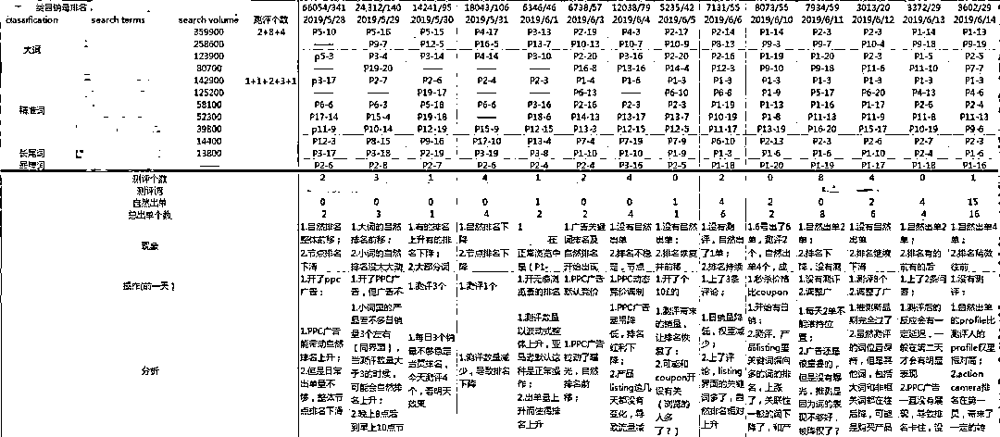

 

 

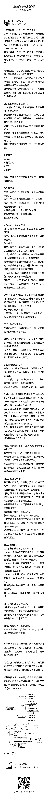

 

 

 

 

 

 

 

 

 

 

 

 

 

 

 

 

 

 

 

 

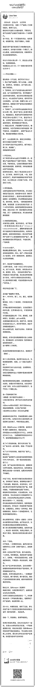

 

 

 

 

 

 

 

 

 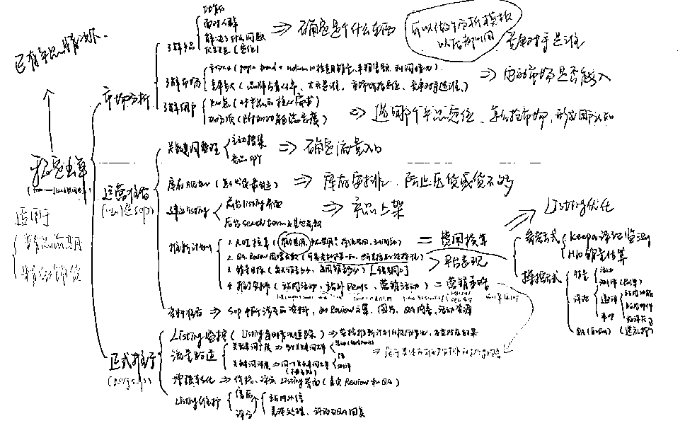

 

 

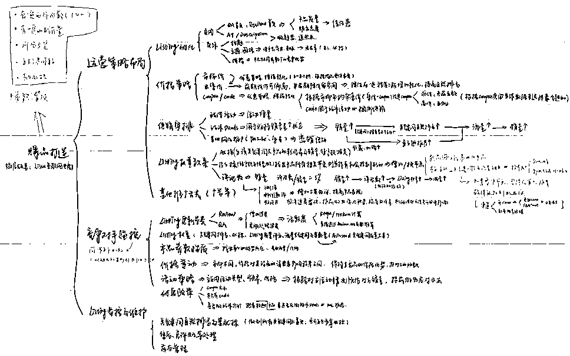

评论区：

Dreamland : 感觉做不了跨国的啊，英语不好[大哭]

Lissa Tam : 我英语也一般，抛开不知道的地道语言，其他都能用翻译+搬运搞定(´･ω･`)（机智如我）

Dreamland : 可以啊，我现在在做抖音，然后写一点知乎，今天想起来已经保存的很多什么课程，明天去闲鱼看看能不能上架卖，一步步来

Lissa Tam : 干巴爹昂～做一点，在做一点，没准就成了

Dreamland : 哈哈，一起加油

阡陌&纵横囧rz教主 : 太牛了[强][强][强]

金晶(Jim) : 楼主厉害，[强][强][强]

做传统外贸好几年了，17年还专门去上亚马逊培训课，到现在一直没有去操作，自己执行力真差。[捂脸][捂脸][捂脸][捂脸]

颜过 : 万物皆为工具😂

 

 

# **# ****(**精华帖**)(186**赞**)“**亚马逊零库存**”**玩法的简单介

# 绍

作者：  亦仁

日期：2019-08-19

每周一，邀请一位圈友分享TA的生财之术，谓之  。

前段时间，有圈友提问我“亚马逊零库存怎么玩”，我不了解便搜索了下星球，发现圈友  有相关经验，便邀请他来分享。

聊的过程中，了解到他是从一个工地搬砖的工人慢慢转型做外贸，现在已经有10年外贸经验，年收入也超过百万，这个过程中他有过很多挣扎和奋斗，有不少经验愿意拿出来分享给一些正在迷茫的圈友。

所以，今天的  分为两块，一块是“亚马逊零库存”玩法的简单介绍，另外一块是  的成长经验。

要多说一句的是，别人赚钱的事情，不是你简简单单复制就能赚钱，所有的信息，都是对你独立思考和判断的补充。

文章有点长，读完需要点耐心。

以下是今日之  ，enjoy！

大家好，非常感谢亦仁大哥的邀请，很高兴有机会在“生财有术”和大家交流分享。

我先介绍下我自己：我叫丁晓峰，10年外贸人，07年工地打工搬砖，真的是在工地上搬砖。08年后到现在一直网络搬砖，”搬砖工人“ 目前有几百个亚马逊店铺，日入一万利润，0库存，其他收入没有计算，还在增长。

这几百个亚马逊店铺，不同于大家日常理解的运营良好的精品店铺，在我这里，它们就类似于淘宝店群、拼多多店群一样，重在数量而不是质量，每一个店铺都是一个长尾流量入口，虽然每个店铺流量不多，但是架不住店铺多，每天加起来流量也不少。

我先简单介绍下0库存做亚马逊，然后再分享下我对“生财”的看法，希望能给大家一些有用的信息。

 

 

很多人觉得亚马逊不做精品店铺已经很难做了，有的人甚至对大范围铺货嗤之以鼻，觉得这事low。

但做过淘宝铺货、速卖通铺货的人很容易理解这样的模式，包括SHOPEE 铺货，以及拼多多导入Shopee铺货，还有阿里巴巴批量上传产品获得询盘的，什么阿里巴巴机器人助手之类的。

原理其实就是长尾理论，通过软件实现海量上架，利用信息不对称赚钱，总有人会找到你的店铺里面的商品下单，虽然单个店铺订单少，但是店铺多，积少成多，也能有不错的收益。

如果你懂，就是有这个认知，有这个认知，就有更多机会。

类似于顾小北老师提到过的“批量思维”。如果说做品牌的店铺走的是“以质取胜”的路线，那么我们走的就是“以量取胜”的路线，各有各有的优缺点，不做评价，选择适合自己的就好。

我给大家介绍下亚马逊零库存的基本玩法。

**1. ** 多语言多国家铺货：亚马逊每个国家站点，可以自动翻译，就是一件铺货到亚马逊多个站点。

**2. ** 多产品：不断上架产品，各种渠道的库存产品。

**3. ** 先进的管理工具：可以实现一键代发和自动结算，一键刊登，一键抓取，供应链分销。市面上大部分系统把  功能放在了订单的处理上。其实，  先保证出单才是第一位的，  有了单，怎么都能运输出去。亚马逊的后台如果没有ERP 极其难用，还有多语种，变体，再加上多店铺，分分钟崩溃的节奏，做过的人应该都深有感受。

**4. ** 发货怎么办？很多人担心物流时效什么的能保证嘛。我们把亚马逊的  运输时间设为最长，差不多是20-40天。你有足够的时间去运输物品，没有什么可以担心的。毕竟我们海淘也都是愿意等的。说白了，我的自发货和你的自发货没什么区别，甚至是由于我的利润率高，我们可以选择更好，更贵的物流。

**5. ** 售后：客服嘛，自己处理就行。

**6. ** FBA：我们也做FBA，但是我们FBA 的产品不是猜出来的。而是卖出来的。拥有自然排名流量的产品再去做FBA,风险会小的多。铺货也是选品。

**7. ** 分销：做贸易的人最能体会，产品分销倒买倒卖的效果，产品越多，资源越多，销售额越高。

 

 

亚马逊和谷歌都鼓励精品和内以及快速物流，而我们为什么没有做精品也能赚钱？  因为我们做到别人做不到的，或者看不上看不懂的，这部分钱没人赚我们赚。当然我们目前也没有精力做精品。

不光我们卖产品铺货，连APP也有人铺货，如果你APPSTORE 搜“时间管理”，你会发现有2个APP是一个模板，用的马甲包去获取更多的流量。

由此可见，刷单-精品-铺货  是玩电子商务的重要规则，玩不玩的好，就是八仙过海了。

要多说一句的，0库存的玩法依靠软件工具为基础，加上长尾理论和我们的经验，才可能玩的转。没有软件提升效率，人力成本太可怕，可能赚的钱还不够人工费用。

以上就是亚马逊零库存赚钱的简单介绍，大家有什么问题在评论区提出来。

既然是在生财有术，我下面就讲讲我对生财的看法。

首先普通人如何年入百万，在我看来人人都可以年入百万，只是有很多人没有遵循一些规则或者规律，以下是我过去生活的总结。

做外贸已经是第11个年头，如今看到很多业务员比较迷茫，就像当年工地上的自己一样，没有人指引，容易有错路。

如今的一百万可能像现在的一百块不值得一提，一进超市两百都不够花。当时我定的目标是是十年后能赚100万就可以了，因为按照当时计算100挺多的，可惜现在一百万可能杭州首付都不够。所以请大家就把这个当成一个数字吧，也并不是说100万就是天花板，当能做几百万的收入的时候，几千万就像锥子插入冰块慢慢裂开。

15年遇到我的外贸老师后，他说“遍地都是钱，遍地都是机会”。

我就想着怎么样才能达到到他这样子，不用和他一样，模仿10%也好。我觉得这个就像《将夜》这个电视剧里的修行者一样，有很多境界，每个人达到的境界不一样，看到的层面，赚到的钱就是不一样。当然里面也有很多普通人，不能开窍的。

查理芒格有句名言：“如果你想要得到某样东西，你就先得让自己配得上拥有它。”但是现实生活中，我们很多人想追求，却离目标越来越远。

查理芒格又说了：“如果他知道自己会在哪个地方死，他就不会去那个地方了。”所以我换句话说，如果要得到100万，首先得让自己配得上，其次，规避掉不能让我得到100万的坑。

 

 

现在总结一下我过去工作成长中总结出来的，阻碍着普通人发展，甚至发财的问题：

1.没有目标，经常换工作

在过去的几年里，我看到很多人做两年不到就走了，有换公司的，有换行业的，甚至过了几年遇到，还在原地踏步。

冰冻三尺非一日之寒，尽量在一个行业深耕。因为换行业换工作以后，和你竞争的是更加年轻的人，长江后浪推前浪，最终你会发现你已经换不起了，甚至没有了资格。

有的人才做1-2年，没有什么订单就开始怀疑自己了。我做外贸第一年的时候还没有非常好的学习圈子，没有知识星球，没有公众号，不像现在这样子什么都能查下，都可以找人问下。

我并不聪明，做了1年都没有订单，采购还经常嘲笑。但是我不怀疑自己，我只是不聪明，但是没有愚蠢，订单是迟早的事情。别人接10万的单，我先接1000的也行，别人赚100万，我先赚到10万，

只要我还有时间。第三年我就是公司的TOP了，或许是别人都离职了，只剩下我了哈哈。目前每天3-7个询盘，每周都能接几个订单。

当然也不是说做什么都不要换，千万不要钻牛角尖，如果真不合适，换一下比较好。如果我们是刀，稳定的工作可以夜以继日的磨砺自己，让自己更加锋利。公司有限的资源需要你的才能去发挥，有了局限，你才能提高自己。

经常换工作不就是经常变道，然后你迷路，打圈圈，不就是这个现象吗？比开错道还麻烦，因为开错道你或许能开到深圳遇到更多机会，但是转圈圈或者来回折返，你错过的就是机会吧。

如果你已经工作十年，我想你会有体会的。

2.没有自知之明，眼高手低

我工地上干了一年左右，被辞退后，又换了个工地，当时只是觉得工地上很难有出头的日子，看到厉害的项目经理年薪都只有30或者50来万，要会应酬，会吃喝，还要会盖楼。我基本上干不了，腰也扭伤了，基本上体力活也干不了多少，更可怕的是我还是个钢铁直男，在工地上，不说女孩了，女人也没几个，繁衍后代的任务都要失败了。😂  我有自知之明才换工作。

 

 

很多人应聘简历上的工资写的很高，我认为如果你想进入比较好的公司，先降低自己的姿态，以学习的心态加入，如果你能力很强，公司自然不会亏待，如果公司负责人有亏待，那也没关系，因为你已经可以足够强大换一个更好的公司。一切都会因为配得上，得到你想要的。

我加入公司的时候第一个月工资500，后来老板主动增加到600，当时平均公司800左右，我不在乎工资，就算给我6000，我也不能发财，只有我自己匹配的上了，我觉得钱会自己跑我口袋里。

曾经有个同事向老板要求提下工资，老板回答：钱就在那里，你凭本事拿，都给你，但是你看看你现在能拿多少?

当一个人能力足够强的时候，有人会塞钱过来给你。比如我这种10年外贸屌丝，当年不求多少工资，只求经验。现在不求多少工资，只求比较不错的产品和老板一起赚钱，不要工资：）。

3.用心不专，什么都学

但凡厉害的人，都是只专注一件事情，就算他们什么都学，也是一件一件事情学。很多人买了建站视频，参加了各种各样的培训，但是还是什么都不会。但凡厉害的人，都是高效的人。最近读了一本书叫做《The One Thing》，让我明白专精一件事非常重要，而且要在自己的天赋范围内。非常厉害的人可能会十八班武艺，但是我们普通人如果有一项技能特别厉害，也就够了。

我买了“明白”老师的爬虫课程，但是我并没有学习，因为不适合我，我希望认识明白和明白的学生我觉得我就有机会花钱请他们帮我抓取数据了。尝试过一次，太复杂，还是需要等下个任务，不过我认为这是可行的。

同时我加入了不少星球，我觉得很多星球的星主想法很特别，我有点贪多，但是我会花时间一次性看完一个星球的内容，并且做好摘记。比如某个星球的供应商已经让我赚了几万块钱。

部分人尤其是听说别人速卖通好做就做速卖通，听说独立站赚钱就做独立站，听说FACEBOOK 赚钱就去学FACEBOOK，到头来都是半桶水，甚至什么也没学到，还花了不少钱。

 

 

做外贸业务我好像并不是特别有天赋，因此我一直在优化我自己的外贸客户管理系统。

我把这个系统的方法教给外贸界的朋友们，并且只收取一顿饭钱而已，却能帮他们节省1-2万的成本。如今我感觉我可以见钱眼开了，噢不，是见得到机会，早上醒来我就打开手机看看有多少人加入学习免费的Gsuit客户管理群体，当然这只是开始。

给大家再分享个故事，在义乌，我爸因为腿脚老是麻木，连刹车都踩不了，找到一个老乡按脚，按一次就舒服不少，经过一个月断断续续的按摩和洗脚，就没有再去了，也没有见他发麻过。我爸当时已经很严重，各种医生都看过，甚至拉过脊柱牵引，但是缓和半年。这个医生是谁？她曾经是个理发师，后来在义乌找了一个老师学了一个礼拜，按了十多年，现在找她按脚都要预约。年收入是两三百万。（每个按脚的人，他都有自己的笔记记录每个人的症状）

龙港还有个推拿师，少跟手指，帮别人按摩按掉的，脊柱整形很厉害，也要预约，也是几百万收入。

可见生活中可以看到很多普通人，专精一个技能，自然变成别人不可或缺的需求之人。

所以我认为大部分人在自己的一个喜欢的专业做个十年二十年，收入百万，不是问题。

前几天还看到报纸上写着杭州的下水管道工人只需要听声音就可以知道下水管道哪里堵了。

4.不学习

但凡比较厉害的人，都有一个爱好，看书。人师难遇，书是我们最好的朋友。但凡周围厉害的朋友，都是非常爱看书的。给我开窍让我坚持的是一本叫做《秘密》的书，相信很多人都看过。大部分没有在低谷的人很难体会其中的奥妙。

总结下来，就是积极，让自己配得上（如果你看《原则》这本书，发现这是同样的结论）。

就在前几天我为了找个盒子供应商，花了好几周都没找到。因为产品货值高，量不大，尺寸特大，没有供应商愿意接。最后做梦到一个非常漂亮的盒子，很开心，醒来只是一场空，感觉好纳闷，就去朋友圈发了这个故事，结果纸箱厂老板娘看到就笑了，她答应帮我做了。

开心积极通常会很微妙的把一些困难慢慢破解，消极懒惰通常容易把问题搞的越来越麻烦。抱怨烦躁只会让你的精力消耗在问题上，就像搅拌一坨屎，会越来越臭的。

 

 

和一些说不清的人吵架也是一个道理，尽量避而远之。积极开心的事情，就像搅拌巧克力或者咖啡，越是搅拌越香。所以多多判断你是在搅拌什么吧。

易经讲究趋吉避凶吗？同样我们精神上也是，崇尚积极的人，运气也自然越来越好。经常抱怨，脾气暴躁的人，处理事情自然不容易顺心。

知识星球也有很多优秀的人，分享专业知识。比如现在比较著名的作者古典、采铜，他们的书籍浅显易懂，给年轻人指导方向，尤其是采铜的，如果你是应届毕业生，可以多看看，减少自己盲目摸索的时间。还有查理芒格的书，他的话好像都反着讲的，很有意思，我也是深受启发。

5.不自律

不自律和用心不专有点相似，没法控制自己，约束自己，很难在业务上精进。廖凡有一部很好看的电影叫《师父》，影片反响不是很大，但是我喜欢看武打片，不小心看到了，结果反复看了2遍，里面有一句话深深触动了我。

以下是小说里的原话：

“师父要娶美妇，美妇让师父给句话表明真心，师父回答：每日挥刀500下，这个数字管住了我，让我不胡思乱想，从此之后，以你为约束”

6.你为谁而工作

曾经因公司机会，我来到阿里巴巴总部参加2个月的外贸培训，培训老师Andy杨在课堂上给我们出了个题：你为谁而工作。

我的回答是我为自己而工作，也为公司工作，我描绘了我自己的理想，和公司的理想。

我的理想在我心里，公司的事情都是我的事情，我做的是公司的事，学的是自己的经验。

很多年轻人，老板吩咐工作做一下就做一下，没有吩咐，也就什么都不干，以为自己什么都可以干，等出去了之后为自己干了，才发现在公司里没有学够，什么都不会，半桶水。

没有老板思维的人很难在能力上有所提高。

**7. ** 圈子太小

 

 

10年的时候就听说过有个扫地阿姨在房地产公司老板家里上班，听不懂老板讲什么，但是只听懂买房子会赚钱。当时的我只想解决温饱问题，所以对这些也就听听，相信很多人也听说过。

1998的时候，有朋友在深圳从事外贸工作2000块钱工资，而在我老家，普通工作300块钱工资起，厨师800-1000左右。

知识星球可以让你找到行业内的老师，通过付费向他们学习，并且认识更多的朋友。

城市虽然吸血，但是也是个充满机遇，创造财富的地方，相对于农村里，能够赚钱的项目少之一少，所以大家都来城市里工作。

我本想回老家做点外贸生意，过点小日子，安安稳稳，舒舒服服。但是现在这么年轻，还不如再打拼一下，等老了干不动再回去也不迟。

所以现在就动动笔，多认识点朋友，多赚点钱，去不同的地方，认识和学习新的东西。

在知识星球和生财有术，我觉得可以拓展我的眼界，并不是说我能用别人的方法赚钱，但是我可以提高眼界和信息。当然道理看了很多，故事也看了很多，很多人依旧过不好自己的生活。

我认为只要克服以上几个主要的缺点，就像清理掉堵住河水的石头，河道自然通常，赚钱只是时间的问题，赚多赚少，机会大小而已。很多人看了，听了，但是没有行动，自然还是老样子。

思想上想通，行动上做足，我想年入百万只是时间问题。至于如何年入百万，我想行行出状元，只要你深耕，一定有效果。

比如：我从“明白”的网站看到生财有术的介绍，我突然灵光一闪，我觉得我也可以做个星球，

既可以帮助大家，又可以让自己年入百万。我在知识星球创建了个外贸小酒馆，主要帮助外贸老板降低企业管理开支，提高效率：这就是10年外贸的痛，很多客户管理不好，一直存在着信息差，很多老板交很多智商税，我自己遇到相同问题。

国外客户管理系统已经非常的成熟，已经到了白热化了，我们国内的系统还是老旧贵，1万起，大部分人只是用来存储客户。

如今的外贸已大不如从前好做，但是现在海关数据，客户管理，网络建站，哪个不是1万起步的，没有便宜反而更贵了。

 

 

而我现在把我的经验分享给大家，我比CRM软件工程师还懂外贸需求，因为我已经做了11年的外贸，我知道自己需要什么，我知道大家需要什么，帮助大家提高效率，满足功能，降低成本，没人愿意来吗？肯定有很多人愿意。

中国外贸公司创业超过3年以上，花费几万在客户管理上面的公司都是潜在的学习群体，只需要2000人，我就可以赚100万。市场这么大，我不坑人，还帮别人，利人利己。当然这只是尝试，不一定能做到，毕竟目前影响力有限。

头3个月做到了200多人，都是比较熟悉我的朋友。因为很少投入精力去做推广，所以目前增长缓慢，大概287人，收入6万多。

目前就是业余更新而已，如果全职运营，我想百万也是可以实现的。

如果一个人不踏实，机会来了，不一定抓的住，就好比我们软件给不成熟的人用，也不会有任何效果。相反，养成良好的成事习惯，遵守做事情的原则，一切会越来越顺利。

以上就是我今天的分享，感谢大家花时间阅读，再次感谢亦仁大哥。欢迎留言，交流我微信lufy84。

评论区：

王一刀 : 赞！

QuincySx : 赞

Javinlee : 我想知道开几百家亚马逊店的成本是多少

于洋 : 厉害[强]

王文波 : 酷

旭仔 : 赞

iamgo : 走心，谢谢

杨明峰  嘴哥 : 赞👍

# **# ****(**精华帖**)(108**赞**)**推荐一个收入不高但省心的

# 副业，美国亚马逊礼品卡

作者：  阿甘

 

 

日期：2020-10-26

思路分享  推荐一个收入不高但省心的副业

大家好，今天翻生财的帖子无意中看到@Albert的关于海淘和礼品卡的分享，写得非常好。文中提到的海淘下单套利是属于比较高阶的玩法，今天我跟大家分享一个比较低阶的，比较容易上手的东西，我就是用这个东西来解决我上了年纪的父亲的再就业问题的，宝妈们也可以参考一下。

这个项目是美国亚马逊礼品卡的倒卖，算了一下我在这个行业也有七年了。

美国亚马逊礼品卡刚刚开始的来源比较单一，就是信用卡的返利，后面的话来源就非常多也乱了。因为美国亚马逊礼品卡是在网络上是硬通货，很容易出手，折损也不高，黑的白的灰的的产业很多都会把美国亚马逊礼品卡成为变现的一个媒介。

所以我们要倒卖美亚礼品卡，首先要学会鉴别它是黑卡（非法得来的）还是白卡（合法得来的），黑卡我们就不要收。

美国亚马逊礼品卡会有很多黑卡，我们从一些表面的证据其实是很难辨别出一个卡是正常途径得来的还是非法得来的黑卡。例如现在某宝卖的很热火的paxful来的黑卡，都是有收据有卡的图片的，收据上面显示这个美亚礼品卡还是用现金购买的，平常的人肯定就会觉得是白卡了，但这些却都是妥妥的黑卡。有些人会忽悠你说我的这个卡都有在美国亚马逊的订单截图和美国亚马逊发这个卡充值码给我的邮件，是白卡来的。但是盗刷信用卡得来的卡，其实也能提供出这些东西。又例如有些人说我们可以通过价格来断定，这不是不行，但也比较片面，同样是黑卡，一些国外网站上面的人会卖到九折多，比白卡都要卖得贵。

要辨别一个亚马逊礼品卡是黑卡还是白卡，得从源头判断。我们可以主动一点去找源头，连源头都知道了，卡的质量我们就可以把控了，卡量也能做得比较稳定。

既然是“美国”亚马逊礼品卡，我们找源头的时候，肯定得从美国或者说至少是在国外找，而不要通过中文的媒介去找。你通过中文的媒介找到的，基本都是贩子，已经被别人吃过一次利润了。这里插一个题外话，从这个案例可以看出，语言其实就是产生信息差的其中一个因素，所以无论以后翻译软件或者工具多么发达，掌握多一门外语的人，路子和眼界都比没有掌握的人要宽广很多的，因为学习一门外语，除了能交流，更多的是你能懂那个国家或者民族的文化、生活和思考方式等等，这些东西都能产生套利空间。

下面我介绍几个白卡的源头和找源头的方法。

 

 

**1. ** 信用卡返利。就是一些银行的信用卡，你通过它在国外网站购物能返利。有一些人想薅这个羊毛，就会拿他们自己的信用卡去美亚上面买礼品卡然后转手卖出来。除非你本身自己就是玩卡的，不然我不建议你去找这个渠道，因为这个渠道已经被一些大卡商瓜分得很干净了，新人很难抢到他们的地盘，我们要抄小道，从敌人的侧面去突围。

**2. ** 这是除信用卡返利以外最大的美亚礼品卡白卡来源了，也是我们应该集中精力去找的。这个来源就是国外soho或者自雇一族那里来的美亚礼品卡。为什么这些人那里会有美亚礼品卡呢。  国外一些soho一族，他们

会在自建网站上面卖一些服务或者虚拟商品，往往金额是比较低的，五刀十刀那样，他们不像我们有微信支付宝的收款码，扫一下收到款了系统还会自动发货。他们收款要申请一个支付接口，这个是一个比较蛋疼的事情。而且即使他们的网站有支付接口，他们的顾客买一个五刀十刀的东西，很多是不愿意在一个小网站输入自己的信用卡资料的（担心信用卡资料泄露等问题）。于是美亚礼品卡这个硬通货就很有作用了，这些soho一族会让自己网站的用户付他们对应金额的礼品卡，然后就给自己的用户发货或者提供服务。

这些soho一族不可能自己能用完这么多美亚礼品卡，肯定要卖出去。而且从这些网站来的卡为什么基本不会出现黑卡的情况：例如这个网站是卖电子书的，如果我是不法分子，我会不会拿我盗刷出来的礼品卡去这个小网站换电子书或者这个小网站的一些服务呢？肯定不会，我盗刷这么辛苦，只想赶紧把礼品卡卖成钱。

这些soho一族卖礼品卡出来基本都只接受比特币支付，所以大家还得学习怎样使用比特币，这个大家可以百度一下或者参考其他星友的文章。

至于怎么找到有这些礼品卡的人，大家可以搜一些提供虚拟服务或者卖一些虚拟小商品的自建站，如果看到他们的付款方式有美国亚马逊礼品卡，你就可以跟网站所有人联系说希望回收了。另外这些人一般会在一些论坛例如bitcointalk.org或者社交软件facebook、twitter打广告出售他们的亚马逊礼品卡，而且是比较稳定的，每天或者每两三天都有一些，你就可以去跟他们接触了。搜索这些主题的关键词是amazon giftcard.3.这个方法跟第二个类似，你可以找一些运营自己开发运营的小游戏的网站，他们的用户充值  游戏的选项里面有美国亚马逊礼品卡或者其他美国的礼品卡的，你也可以跟他们接触。

 

 

4.一些调查类网站(用户在上面完成一些小问卷、完成一些小任务等的网站)是用美亚礼品卡作为奖品的，有些老外有专门的渠道去回收各个用户手上的散卡，然后集中到一起转手卖，这些卡商活跃在国外很多论坛和社交软件，大家可以多去发掘一下。

说一说我自己的入行的经历

当时我还在读大学，但是得了胃病，老是要往医院跑，一个月药费怎么都得一千多。我当时觉得自己很没用，20的人了，读大学问父母拿生活费不止，还得找他们要钱吃药。

于是我就想能不能有一些东西不用出去跑，对着电脑就能赚钱呢。然后有段时间我一下课就躲在宿舍，疯狂浏览器国外的网站。

有一天我发现国外的论坛还挺多人卖美亚礼品卡的，都在八折左右，我在想这个东西有没有中国人要呢？然后我用回中文搜索，发现真的有人收！就是做海淘的人！而且当时都能卖到95折以上，转一下手足足有15%的利润。跟一个出卡比较活跃的人第一单交易尝试过甜头以后，我就开始每天蹲守那个供货商。这个供货商论坛的账号是专门注册来卖这些美亚礼品卡的，每天或者隔天就上线一会，基本上线十来分钟内就卖完了。

我那时还没有很多的客源去买我的卡，但我知道肯定会有人买。于是这个供货商每次一上线，我就跟他说劳资全要了！先拿下来然后再想办法去卖。然后这个人上线时间很飘忽不定，也不接受先款预订，所以只能一直蹲着他。有时你蹲了他一天，就去了个厕所，回来发现他已经上线并且卖完了，想哭的心都有。

后面知道他是有个网站提供存储文件的服务，收一些服务费，这些卡都是他的客户给他网站的充值款。所以如果这个人好几天没有上线，就等于几天的充值款都堆积在一起了，会有比较多的卡。有一次他七天没有上线，我足足蹲了七天。就在吃饭的时候没有看五分钟，回来他好几千刀的卡已经卖了。我当时很激动，我说我每天都蹲你，这么多个月了天天都全要，你怎么一点都不留给我啊。他可能有点羞愧，过了几天就直接写了一个网站，他的那些卡只要客户一发给他，就会自动显示在网站上面，这个网站只有我跟他有进去的权限，就等于把这些卡都卖给我了。

有了这个稳定的卡源，我有了不少稳定的顾客，然后还找到了其他几个类似的供货商，生意慢慢就起来了。而且经过几个月的积累供货商和买家，也不用怎么花时间在这事情上面，一天花半小时左右，一个月就能搞到上万的利润，在学生时代是比较不错的收入了。也是因为倒卖这些礼品卡我进入了海淘这个行业，赚到了人身当中的第一桶金。关于这个行业的其他赚钱方法，以后有时间我会再写一些。

 

 

我爸原来是开店做生意的，后来四十多就退休了，退休生活有点无聊，我索性开了个淘宝店，让他做客服去卖这些卡，反正我就进一下货就好。我爸刚刚开始是只懂电脑开机关机的那种，智能手机也不会用，最后过了一个多星期也能独立地完成淘宝店的客服工作了。如果是受过高等教育的年轻宝妈想找一个赚点小钱的副业，这个再合适不过了，因为你只需要付出前期的找货源的努力，而这些打折的礼品卡卡是属于稀缺的资源，基本是不用担心滞销的问题的。

礼品卡卖的话还是建议开个淘宝店，这样客源会比较稳定有保障。至于定价方面，有一家店叫罗威哥哥的充值小店，算是淘宝卖白卡做得最大的，因为你是新店，你的卡每美刀比他便宜1毛钱就可以了，例如他100美刀的卡卖630元，你就卖620元。  另外其实不建议大家用全新的店去卖这些卡，全新店卖虚拟产品很容易被管控，可以买一个能过户的企业店铺来卖，大概几千块就能买到一些一钻的。

欢迎大家交流和指正哦。

评论区：

Albert : 厉害了，感谢分享。

良辰美 : 哇塞，非常厉害了呀

我是在亚马逊的，目前礼品卡还是主要的回评方式之一

简单来讲，就是我们在产品包装里放上类似于礼品卡的卡片，里面有售后邮箱，写的是联系我们，即可获得礼品卡30$

当然这个是暗地里进行的，任何平台都不希望客户被带走。

我所在的公司目前没有开发利用这一块客户资源，仅仅是兑换过礼品卡，让客户留评就好。

您这块的礼品卡，其实对于国人来说，确实刚需，一方面是电商刷单，另一方面是国人海淘产品。

当然，黑卡都是大家深恶痛绝的。

刘浮躁.zZ🇨🇳 : 为什么不卖黑卡？

Grace : 我也是亚马逊卖家  也是没有做这个礼品卡

行影不离 : 感谢分享，思路很好；我是那个每天需要至少100张礼品卡的人。

乘风 : 老哥留个微信？

 

 

阿甘 : 谢谢大家支持，我的微信号是15521319772

马大侠 : 没接触过，赚钱的道好多啊[强][强]

# **# ****(**精华帖**)(94**赞**)**规避难中难，寻找蓝中蓝：蓝

# 海小语种市场（日本）中的蓝海信息差品类的套

# 利机会

作者：  跨境杨少

日期：2021-12-14

跨境电商近几年竞争越来越激烈，尤其近两年，国家两会每年都提到大力发展跨境电商，这个行业已经不再是少数人知道的暴利行业，新人加速进场，竞争不断加剧，行业正在迅速从蓝海走向红海。

很多跨境电商新人来自国内红海电商市场，也带来了很多降维打击的新玩法，比如 9.9 包邮，低价螺旋，「吴三柜」等等，尤其美国亚马逊，可以说已经不再是蓝海市场，蓝海品类也迅速减少，即使有，也迅速会被价格战打到无利可图。一个原本的「蓝中蓝（蓝海市场蓝海品类）」行业，正在向「难中难」发展。

这个时候，一些小语种市场由于语言门槛以及本地化门槛等原因，仍然还具备一些蓝海市场的特征，也隐藏着一些信息差的蓝海品类，尚有比较大的套利空间，这里我们着重介绍日本市场，以及日本海关壁垒下的一个类目的套利机会，希望可以为大家找到新的「蓝中蓝」市场。

**-01-**

跨境电商的起源和本质是套利

 

 

2009 年当我进入跨境电商这个行业的时候，这个行业刚发展没几年。

催生这个行业的一些代表性品类有 3C（当时主要以手机壳、贴膜、挂绳等小商品为主）、婚纱、假发、cosplay、高仿等等，行业的主要平台是 ebay，基本都是不压货，无海外仓，左手倒右手，进价多少人民币就卖多少美元，自发货国际直邮，这个模式干掉了传统国际贸易通路的两国进出口贸易公司及层层代理分销等中间商。

例如：400 人民币的偏高端的婚纱，即使卖 400 美元，当时也只有美国市场原价格体系的一个零头，由于模式先进，价格虽低，却不仅暴利，还对原有体系形成降维打击。

可以说：跨境电商是因发现一个套利模式而兴起，这个行业的本质就是「套利」二字。

最近几年，由于从业人员变多，这个行业已经不再是低成本低投入快速盈利的行业，竞争加剧，很多打法已不再是套利模式，而变成了要先投入先烧钱再图盈利的「盈利模式」，套利模式变盈利模式，一字之差，代表的是门槛的提高与赚钱效应的下降。

那么，还有什么样的市场和什么样的品类，能继续实现跨境电商最初的样子，比较低门槛低投入的进行套利呢？

套利的三个关键词（特征）：

低成本（低投入）

信息差

确定性

 

 

低成本低投入很好理解，无货源，dropshipping 就是典型的低成本低投入，另外，在运营上，不需要大规模压货，不需要亏钱亏货刷单刷评价去拉排名，也是低成本低投入。

信息差也很好理解，蓝海品类就是信息差品类，知道的人少，没什么竞争，但现在蓝海品类越来越少，想要获得信息差，就要把跨境电商原有的追热点、查热卖排行、铺货、跟卖的老思维老方法，升级为找新模式，从赚产品信息差升级为赚模式信息差，比如海关壁垒产品，它的选品思维不是追热点，而是从海关关税清单中找到高壁垒的产品，通过邮政包裹自发货规避关税从而实现套利空间，这是一个行业内没有的选品方式，这就是新的选品模式，这就是「模式信息差」。

确定性是指赚钱的确定性，盈利和转化的确定性，比如绝对的成本优势就是一种盈利确定性，可以做到只有你便宜，别人便宜不了。

另外，别人已经成功的模式，做模式复制，抄作业，也是一种确定性，即 —— 尽量避免花费试错成本，选品和运营上尽量采用被验证过的成功方法，并且这个方法还是只有少数人知道的。

我们认为，好的选品思维，能赚钱的选品思维，一定是满足上面三个特征的。

**-02-**

日本市场与美国市场的几个大数据

 

 

过去两年，我们对接服务了超过 1200 个独立站卖家，绝大多数是做欧美市场的，对比美国市场，我们总结日本市场的几个大数据如下：

人口：美国三亿多，日本一亿多，市场人口规模约** 3**：**1**

人均收入：美国和日本差不多，但是日本的贫富差距远小于美国

卖家分布：**1200 **多个独立站卖家样本中，只有不到** 10 **个在做日本市场网购渗透率：美国大于日本，但由于疫情原因，日本在快速增长

信用卡收单机构数据：从** 2020 **年中开始，日本单单量迅速增长

收入差不多，网购率也开始接近的两个国家，市场规模是三比一，而卖家规模只有  100：1 都不到，仅此一项数据，就显示日本市场的竞争激烈程度远小于美国市场，尤其在一些准入门槛较高的日本电商平台比如日本乐天，即使铺货模式，也尚存在一定的红利期，而这在美国市场早已不存在。

由以上大数据，我们可以看到日本市场确实存在一定机会，这几年我们实际做下来总结有以下 4 大优势：

低竞争

高客单

快物流

低纠纷

 

 

**1**）低竞争：日本主流的亚马逊和乐天两大平台，铺货模式仍有一定的红利期，上架产品不刷单不刷评价，也能通过正常运营手段做到搜索排名靠前，这就避免了今年大量卖家遭遇的封号风险。

日本独立站方面，某些垂直品类长期没有竞品站和竞争对手（长达几年），google 广告的投放成本最多能比投放欧美市场便宜一半，我们 google 广告的 cpc 单价成本大多分布在 17～23 日元，约 0.2 美元的 CPC 这个价格是欧美卖家难以想象的，facebook 如果跑点击量，CPC 也仍然可以控制在 12～18 日元的范围。

**2**）高客单：垂直品类，和一些信息差品类，海关壁垒品类，客单价比较高，毛利空间较大。

**3**）快物流：自发货 2～3 天清关派送，旺季时效也有保证，不会出现欧美自发货商家在旺季物流积压，卖越多亏越多的情况。

**4**）低纠纷：在做好产品性价比和质量过关的前提下，绝大部分交易是静默交易，即使自发货模式，也对客服和售后成本消耗小，独立站几乎没有拒付，而欧美独立站长期被拒付党，撸货党困扰，这部分低素质人群在日本没有。

**-03-**

信息差：海关壁垒品类的选品方法

与套利机会

 

 

海关壁垒是我们的一个选品思维，我们通过货代，统计到所有品类在海关的关税税率，并按从高到低排序，从税率最高的开始选品，并通过邮政渠道单票自发货规避这个关税，把关税转化为利润空间。

这个不仅日本可以这么操作，中美贸易战下，美国的海关壁垒品类也值得调研与一试。

日本市场主要的海关壁垒品类为真皮类，尤其以真皮皮鞋的关税最重。另外食品和糖果类也是高关税品类，税率与真皮制品差不多。

例如真皮皮鞋，每双在日本海关的关税为 4300 日元，约 300 人民币，这个关税费用经常远远超出货值，正常贸易公司进出口无法规避这个关税，大货清关，fba 大货及货柜也无法避开这个税种，只能通过邮政渠道单票自发货，通过私人件清关规避这个关税，这个是合法的。

另外，食品糖果品类除了有海关壁垒，还有市场准入壁垒，平台无法上架，这个为独立站卖家创造了有可能垄断的机会，只要能找到 20 个左右的符合国外买家口味的网红食品，就可以建起一个独立站。具体打法以后有机会我们可以再另行分享。

**-04-**

真皮材质选品方向及其套利空间

由于真皮制品的高额关税，市场售价普遍较高，基本不会低于 500～600 人民币，而我们通过邮政自发货规避这个关税，可以做到即使以市场价一半的价格售卖，客单净利润也能接近 100 人民币，这在做欧美的跨境电商来说是比较难见到的利润空间。

 

 

真皮只是一个材质，不是一个品类，因此有很多品类可以做，选品上的空间是比较大的，并且都支持无货源 dropshipping，这满足我们说的跨境电商底层逻辑的低成本低投入，海关壁垒这个信息差在我们对接过的客户中几乎没有人知道，这满足底层逻辑中的第二点，由于规避关税形成的极大的成本优势，转化确定性模式成功的确定性是有的，这满足套利底层逻辑的第三点，因此这个选品方向是一个非常好的方向。

由于真皮制品品类较多，我们建议选品要分优先级别，先从自己比较专业的，有供应链优势的品类去选，比如我们会选择鞋类，另外可以选择自己感兴趣的、喜欢的或者有一些相关资源的品类去优先做。

**A**）可套利的真皮鞋靴种类

成本越低的真皮鞋类，在日本市场的套利空间就越大，因为不管多贵的真皮鞋子，日本海关都是收 300 人民币的关税。

中国工厂本来就具有比较大的成本优势，真皮皮鞋也不例外，一些凉鞋，包头软木拖鞋，单鞋的出厂价格最低 30-50 就可以做到，所用的皮大多为牛二层皮，牛绒皮，这些低成本的皮也是真皮，在 sku 的标题和详情里面可以直接标明为真皮。

经过我们多年的售卖经验，我们总结以下几种真皮鞋靴有比较大的套利空间：包头凉拖、凉鞋、户外鞋、登山鞋、马丁靴、工装靴、雪地靴、豆豆鞋、休闲鞋。

**B**）选品成本区间及零售定价策略

以上真皮鞋靴品类我们建议的满足品质和性价比的进货成本区间及零售定价区间如下：

 

 

包头软木凉拖：进价** 30**～**60 **建议售价** 1980**～**3980 **日元** **利润空间** 50**～**100rmb**凉鞋（玛丽珍等经典款基本款）：进价** 40**～**70 **建议售价** 2980**～**3980 **日元** **利润空间** 50**～**100rmb**

户外鞋（户外凉鞋和登山鞋）：进价** 55**～**125 **建议售价** 3980**～**7980 **日元** **利润空间** 100**～**200rmb**

马丁靴：进价** 60**～**180 **建议售价** 3980**～**9980 **日元** **利润空间** 100**～**200rmb**工装靴：进价** 90**～**120 **建议售价** 5980 **日元** **利润空间** 100rmb**雪地靴：进价** 50**～**160 **建议售价** 3980**～**8980 **日元** **利润空间** 100**～**200rmb**豆豆鞋：进价** 35**～**55 **建议售价** 2980 **日元** **利润空间** 70**～**100rmb**补充：有的鞋款同为真皮材质，但具体用料和款型的价格差异较大，有一些成本和利润平衡比较好，利润最大化的单品，比如雪地靴最贵最好的材质是羊皮毛一体，真皮真毛，出厂价一般在 150 之上，但同为真皮真毛，羊剪绒款只有 90、针织羊毛款最低只有 70 不到，套利空间就比羊皮毛一体款要大，而且引流上可以按皮毛一体真皮真毛、兼具保暖与透气的特性去营销，以同样的关键字去获取自然流量和推广，然后以极具性价比的价格获得高转化。

**C**）本地化优化：翻译；用词；文案

 

 

对于做欧美市场的卖家，标题、详情、广告文案单词如果用的不准或者不地道，对转化率的影响不是非常大，但是日本市场则不同，对用语是否地道，本地化的要求就比较高，如果客户觉得日语不标准，是外国人店主在卖货，会产生不安不信任感，转化率会有明显下降。因此日本市场的产品的标题详情要翻译准确，推广文案要用商业敬语。

即使在做欧美市场的卖家中，也存在很多本地化不到位，机器翻译的低级错误，比如很多卖家在卖的飞织鞋，大量的标题都用的是 flying weaving shoes，这是个非常低级的错误，甚至是笑话，正确的应当是 upper neat sneaker。

另外一个本地化容易出错的例子是雪地靴，欧美卖家也经常用词不对，大量标题里使用  snow boots，而这个实际上是指滑雪和踩雪的一些靴子，我们通常意义上的皮毛一体雪地靴是不防水的，不适合踩雪，这个对应的英文翻译应当是 mouton boots 或者  sheepskin boots ，在澳洲也可以叫 ugg boots（澳洲豁免 ugg 品牌词侵权，因为在澳洲  ugg boots 是雪地靴统称而不是具体哪个品牌）

对应的日本关键词也是一样的参考以上案例，因为很多日语叫法仅仅是英语的片假名读音外来词。

如果用错词，会浪费大量的广告费，流量不精准，转化低下，离赚钱就越来越远。这就是本地化和精准文案精准关键词的重要性。

**D**）检品仓与前置仓** fba **与** fbm**

做日本市场，虽然有蓝海空间以及蓝海品类、蓝海模式，但是由于客户对质量和快递时效要求较高，需要在运营能力上做相应提高。

 

 

一般来说真皮鞋类我们会选择进货成本在 100 左右的，是质量和性价比以及终端定价 / 净利比较平衡的一个档次。而一些低档的便宜货，在东南亚电商平台和速卖通可以做，却不适合日本市场，这些产品在日本市场的退货率极高，会造成巨额亏损。

为了降低退货率，即使做无货源 dropshipping 模式，我们也必须设置检品仓，把所有货自己检查一遍，比如毛头剪一剪，以及及时发现次品，这些事情交给中国工厂去做，即使叮嘱再到位，也不行，因为 dropshipping 的供应商有很多在品控上是不稳定、不靠谱、不负责的。

比如我们就在南京设置了检品仓，所有 dropshipping 的货先到南京检品一遍，再发货。

一些爆款产品，也统一由我们检品后送往上海前置仓或日本 fba 仓库。

前置仓是一个介于海外仓和国际直邮之间的解决方案。因为日本足够近，一般上海的前置仓可以做到当天发货次日清关，最慢不过 3-4 日。这就节省了海外仓的成本和店铺关停导致的货退不回来全部亏掉的风险，前置仓就相对灵活可控，但是检品也不能完全交给前置仓去做，除非自己安排人去前置仓检品。

对于真皮制品，由于大货无法规避关税去清关，一般都是自发货，但是通过 ems 的大件，也可以部分的进 fba，并且规避关税，我们一般会把好卖的尺码或者爆款，通过  ems 大件，少量的压 fba，其他的尺码和款式则自发货，这样可以保证好卖的 sku 获得亚马逊 prime 标志，在流量权重上获得提升，同时又兼顾了成本和海关风险。

**-05-**

结语

 

 

我们从 2009 年开始做日本市场，从日本雅虎开始，后逐步入驻日本乐天，日本亚马逊，2012 年开始自建独立站，既是日本电商平台中第一代中国卖家，也是独立站玩家中最早布局的一批，我们对日本跨境电商的选品、建站、物流、支付、推广、本地化等全业务链条有资深的经验。

随着国家不断提倡发展跨境电商，我们一边感到市场竞争加剧，一边感到跨境服务市场开始成为新蓝海，2019 年开始我们增加了出海日本这个服务的业务线，对接比较成熟的欧美跨境电商卖家，尤其以独立站卖家为主。

目前，我们是国内唯一的面向跨境电商中小卖家布局日本市场/品牌出海日本的专业且资深的服务商，我们也与服务上市公司级的品牌出海服务商在日本市场板块保持有合作。

今天分享的海关壁垒这个蓝海选品思维，是我们自己多年实操总结的四大选品思维之一，比较适合日本市场，其他的选品思维则不限于日本，也不限于平台或是独立站，都是通用的选品思维，都是具有套利底层逻辑的蓝海选品模式，如果未来有机会，再与大家逐个分享。

评论区：

游心 : 感谢真诚分享  收获很大 [爱心]

跨境杨少 : 一起生财有术哈哈哈

森烨跨境-天宇 : 留个联系方式，

跨境杨少 : 我不知道咱社群给不给公开留哈，要不我私信你吧

森烨跨境-天宇 : 给吧.没事

wtyyyy123

跨境杨少 : 好像私信功能我也没找到，你可以搜跨境杨少的拼音，dy和v都有哦  亦仁 : 非常干货精彩的分享。说到日本跨境，分享个我听说的，tiktok广告投爆款，唯一赚钱的几家，有一家就是投的日本。

亦仁 : 下面这个思路也有启发。

 

 

「从赚产品信息差升级为赚模式信息差，比如海关壁垒产品，它的选品思维不是追热点，而是从海关关税清单中找到高壁垒的产品，通过邮政包裹自发货规避关税从而实现套利空间，这是一个行业内没有的选品方式，这就是新的选品模式，这就是「模式信息差」。」

# **# ****(**精华帖**)(84**赞**)**跨境电商独立站从发掘产品到

# 放大的全过程

作者： jersy

日期：2020-06-27

案例分享  龙珠

这篇文章原发在我的公众号上，讲述了跨境电商独立站从发掘产品到放大的全过程，本文系我和我的朋友Aye共同写作，他是一位供应链专家，文中的爆款亦和他共同开发。

1-发现产品

2018年1月，一位英国同行朋友发来一个youtube视频，向我询问产品货源，打开一看是一个2015年上传的视频，乍一看播放量也不高，好像没什么亮点（）

（图1）

但是看完视频，我们对这个产品就有点兴趣了，看起来功能多样，削皮、削片、削丝、做花刀、挖果瓤，软的硬的水果蔬菜都能削，无比顺滑，简直全能选手。我们赶紧打开搜索引擎各大电商平台开始找这个产品。

2-然而没有货源

找了淘宝和1688，没找到货源

托朋友问了台州的工厂（台州是塑料产品的产地），他们都表示没有做过。

在跨境电商平台（亚马逊，速卖通，wish）看也没有竞品

最后，终于在ebay上找到了仅有的两个卖家，一个在澳大利亚，一个在英国顺便找到了这个产品的原厂家官网（）

 

 

（图2）

可以看到整个站点粗陋不堪，刺眼的红绿对比，胡乱分布的导航栏，有点基本素质的卖家估计都不会这样。

后来我们从“about us”得知站点经营者，也是这个产品的发明者是一位工程师，这样我们上面关于站点和推广的疑惑就解除了，毕竟工程师并不擅长卖家和营销。

（图3）

考虑到这个产品是澳洲公司的产品，然后从ebay唯二的两个卖家其中澳洲的那个卖家店里买了2套，结果过了几天也不发货，也不回复站内信。只好又从英国卖家店里下单了2套，过了2天，显示卖家发货了。

等了大概3周左右才到，到货了以后直奔农贸市场，把能想到的蔬菜水果都买一些拿到场地，开始各种测试，没想到这小小的3个刨刀，出人意料的的好用，youtube视频里真的没有夸张的成分。

（图4）

我们意识到，这可能是一个有商机的产品，在澳洲商标，专利相关的网站上地毯式查了一遍，可能因为这个产品销量不佳，原厂家甚至没有注册相关专利。

（图5）

这时候决定和朋友的工厂自己开模做这个产品

一来我们比较相信自己的眼光，之前沙拉碗出了接近100w个

二来市面上没有竞品，产品也确实很棒，如果能做出来，短时间也不会有很多竞争可以分到第一杯羹。

3-联系工厂开搞

4月，让合作方联系温州的工厂（之前合作过上百万个沙拉碗），算开模价格，塑料件温州工厂表示可以很轻松搞定。

重点在于里面的刀片，看起来简单，但涉及到的工艺有点复杂，全国只有广东阳江一个地方能做，他们有渠道能解决，评估出来开模费用5~7w左右。

工厂收到样品后也很看好这个产品，于是开模费用一人一半，产品量产后我们有前期的产能买断，和最低价拿货权（我们4元/套，其他人12元以上）。

 

 

不过温州工厂和阳江刀片的工厂在开模的过程中，小问题不断，前前后后过了快4个月才做出来，前2周刀片的产能只有1000套左右一天，良品率也不高，1000做出来，要报废大几十套。

（图6）

4-立刻引爆

7月，拿货，上架，广告开推。这款产品的威力在广告上立马显现了出来，加上做的时间非常早，基本广告打开出单就络绎不绝，评论区人头攒动，极为热闹。

第三天发现亚马逊有人copy了所有图片，当天就有Listing被加了Amazon Choice，又过了3天，发现这个产品居然到了Home&Kitchen类best seller第一名，一天的销量有上万单。

3天的时间单价从19.99美金打到了4.99美金，疯狂程度可见一斑。

不过这些卖家都是拿不到货的，我们供应商也反馈他和他的下线贸易商天天都被找货的人打爆了电话

（图7）

5-维权通知

有一天我们收到了一封自称是polyzand的版权持有人的警告信，要我们即可停止所有宣传，否则追究法律责任。

开发到这一步，如果一旦因为侵权的问题，那就是功亏一篑了。不过说到侵权，做电商的其实多少接触过，很多专做爆款的工厂甚至开玩笑，一年到头都没有被投诉过侵权，那说明这一年一个爆款都没有做出来。话虽如此，要真是碰上国外的律所，比如国内跨境电商卖家熟悉的GBC，那就头大了。

（图8）

这时候我们先是去澳洲商标专利网站查了一遍相关关键词，并没有发现注册记录。再者，我们的图片，视频都是自己拍摄，侵权中的商标，著作，专利，其实都可以规避。

想到这里，我们并没有下架产品，当然，如果国外厂家较真，其实也有隐患，所以我们是冒了一些风险，后续结果还是很值的，好在之后对方也没有后续跟进。

究其根本，还是因为这个产品压根没有注册过专利权，所以只要素材没有侵权，对方没有办法拿你怎么样。

 

 

6-开始出现抢货问题

由于亚马逊和FB上都卖爆了，但他们没有货，有人打听到了我们温州合作工厂的地址，组织了一波人，带着现金，跑到我们合作工厂堵门堵车堵人抢货，吓得工厂连夜转移地方，然后每天去抢货的人越来越多。

一直过了大约2个多月才有其他工厂出这个货。

工厂从去年7月到今年3月，累计的出货300w套左右，我们累计出货50W套，利润过百万。

（图9）

8-我们的启发

纵观整个推广过程，这个产品给我们的启发非常大。

爆款设计者和推广者基本不是一个人，这个产品的设计者，澳大利亚的那位工程师，其实他才是最冤的，因为没有推广能力也没有注册专利，绝大部分利益被我们这些同行吃掉，就算维权也因为没有专利基本无法实施。

第一个开发产品的人和赚到钱的也不是同一个人，及时跟卖不影响赚钱，跟卖拼的是信息敏锐度和执行的速度，很多卖家没货就敢上几千几万美金的广告。

产品重要性大过广告，广告是助推，产品是核心。当我们从流量驱动越来越走向产品驱动，当Facebook广告的投放门槛变得越来越低，跨境电商比拼的只剩下供应链。

没有供应链优势，就算产品推爆，也很难维持优势。这个问题我们作为流量出身的人深有体会，很多产品我们自己没有稳定的供应链或者工厂，任何人都可以拿到产品，即便我们推广出去这个产品，最后也会被立刻抄袭分食，毫无积累和沉淀。

平台和独立站都有布局的必要，反观我们推爆的很多产品，无论是自己推还是被抄袭，大多都会从Facebook一路火到亚马逊等平台，用户的需求是多元的，并非独立站比平台适合做品牌，平台比独立站适合卖货这种偏激的论调。

https://www.youtube.com/watch?v=AaxnjKvvNGk https://www.polyzand.com.au/ 

 

 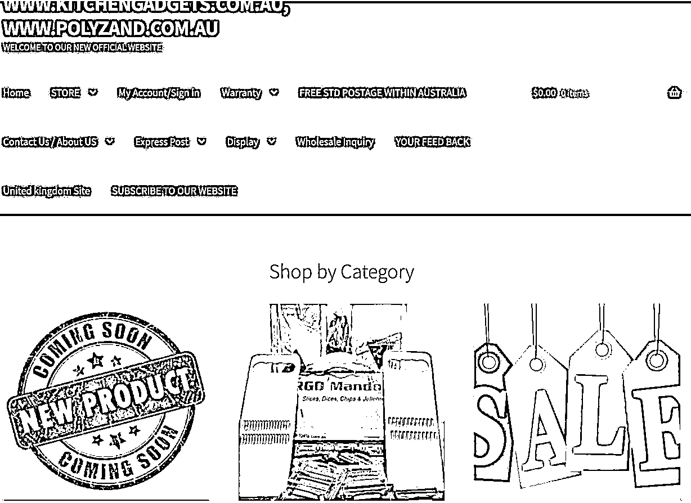

 

 

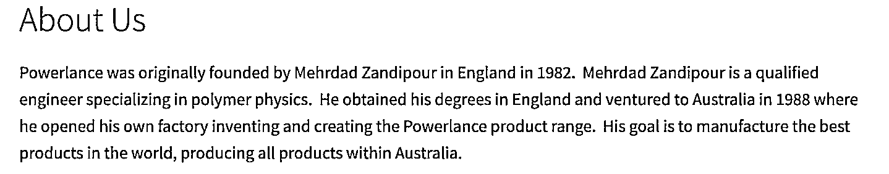 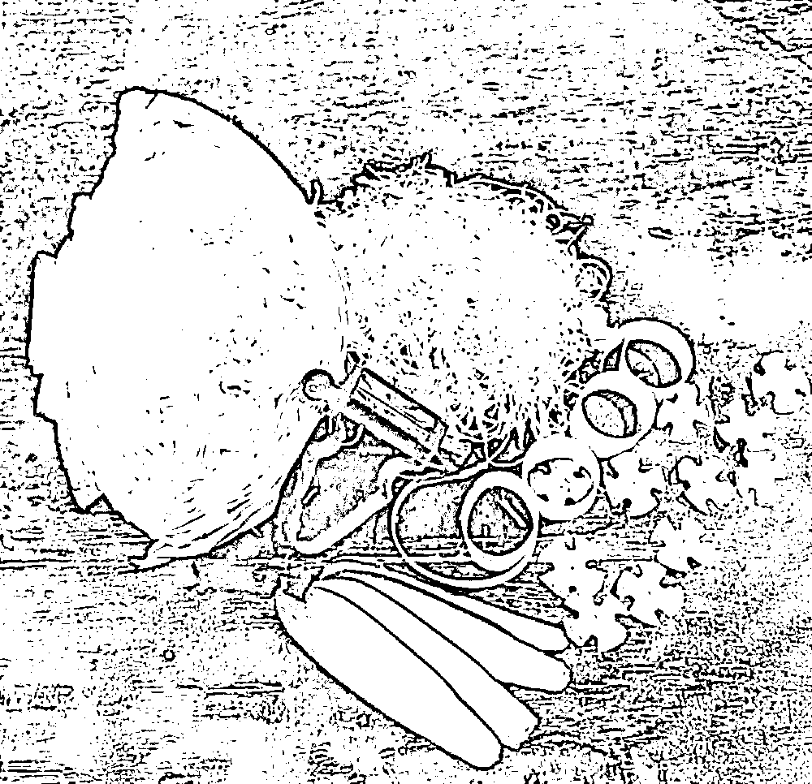

 

 

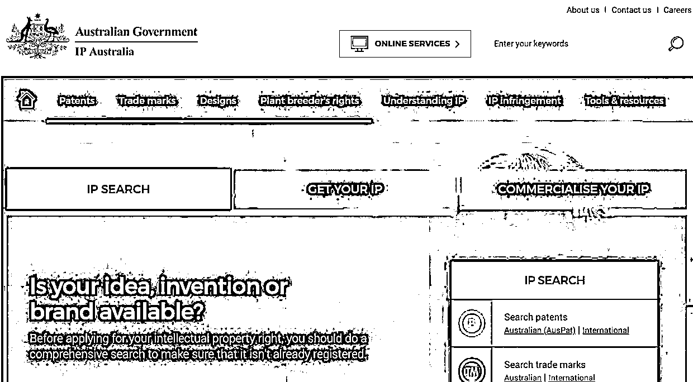 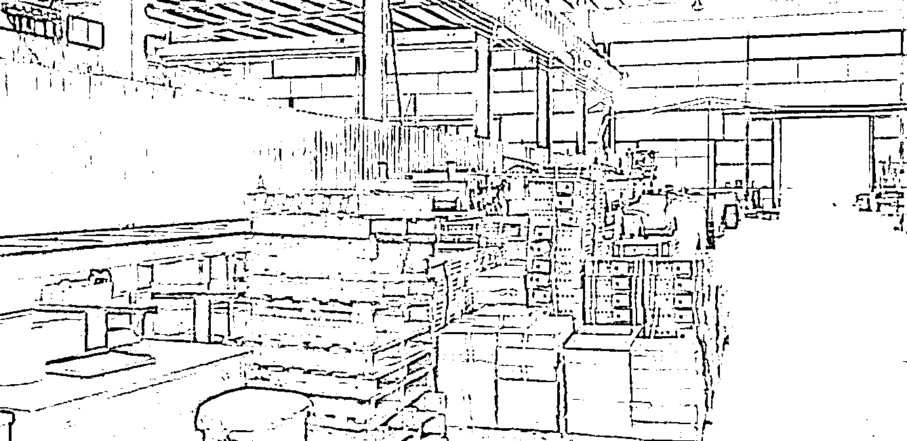

 

 

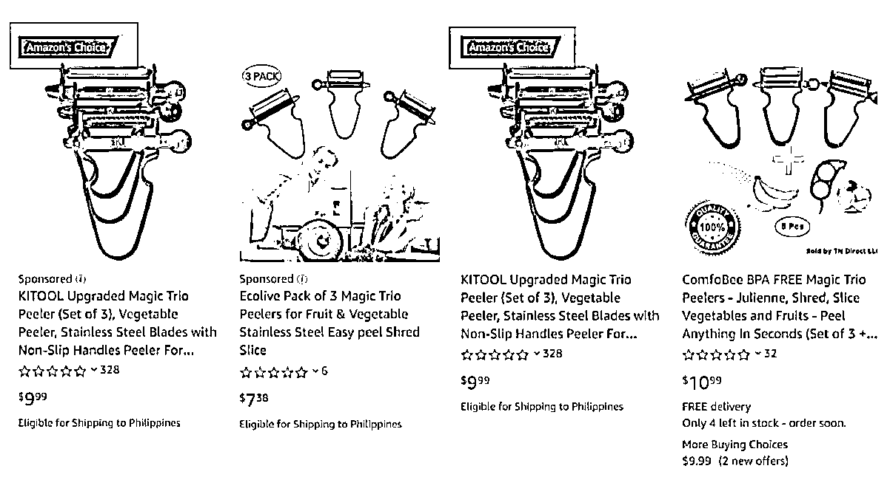 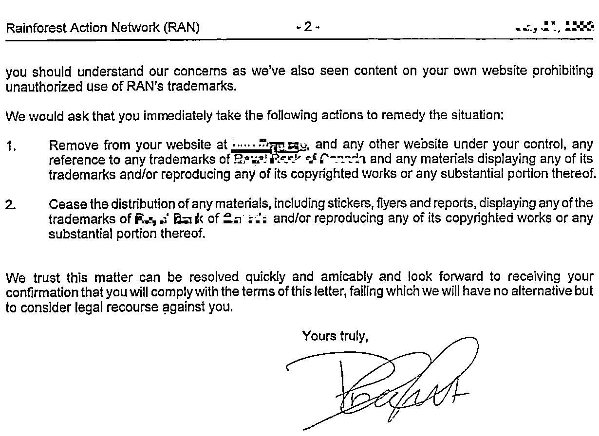

 

 

评论区：

斑马森林 : 文章去年还是什么时候在哪看到过，原来大佬也在星球里

段 : 为什么没有考虑和原来的工程师合作呢？

Albert : 厉害了，学到了。

Ace : 这款产品前年我有投过Facebook广告

高智豪 : 之前就注意到这个案例了  原来大佬在这里

酱图森 : 行云流水

 

 

Jun : 相逢恨晚

十一点睡觉 : 为什么没有后来你也没注册专利呢？

# **# ****(**精华帖**)(74**赞**)**如何从细节抓利润，将亚马逊

# 业务的利润率从** 1-2% **提升至** 7-10+%**？

作者： thousands

日期：2022-07-05

大家好，我是 thousands，目前是一家鞋服公司的亚马逊运营团队负责人、负责团队目前年 GMV 在 7-8 千万美金。

和大多数的亚马逊卖家一样，去年最惨的的时候，我们团队的新品月度净利润率几近于零，老品从 10% 跌到 5% 以内，而后痛定思痛，决心从每个环节去优化、提高利润率，最终新品能够到达 7% 老品回到 10% 及以上。虽然我们顺利破局，但依然有很多卖家仍陷于低利润的死胡同，因此，我想给大家分享我们具体的实操方法论，希望能带来帮助。

首先先说利润的的组合公式（利润=收入-成本  ）。

先来拆解一下：

收入=“售价*销量”

成本=“商品采购成本、头程运费成本、亚马逊抽佣、亚马逊仓储费用、亚马逊配送费用、推广费用、促销折扣费用、退货费用、损毁费用”

 

 

我们就这其中的因子，做了一些细分的拆解。能对利润率做到增益的部分主要有：售价、商品采购成本、头程运费成本、仓储费用、推广费用、配送费用、退货率、损毁率。

而后我们在对能影响以上因子的部分做了一些优化，以下是我们做重点优化的部分。

一、选品：拉高定倍率、提高** 10%+**毛利空间

**1. **选择最适合自己水平的体量**  **

为什么说选品要选适合自己的水平的体量，因为在每个品类中都要尽可能地往头部去靠，所谓的头部是指的类目的头部，以及关键词排位的头部。

为什么这么做？

亚马逊是一个流量的平台（在流量的紧缩期会尤为明显），流量在淡季时都会

优先安排给头部，因此一旦选择了一个产品无法做到头部，就容易出现没有自

然流量，只能靠不断的付费流量推广产品，推广成本居高不下的问题产生。

只要做到头部，至少在当前的平台，你可以有跟工厂更好的议价权。

因此结合自己目前的投资预算，预估所要做细分赛道的头部需要的资金、做到类目或者细分需求下的 TOP 是比较明智的选择。

 

 

目前我们自己的产品已经抢占多类目的 TOP、同等单量下、做到 TOP 的转化率更高、广告单量占比更低（综合下来，广告花费占比能降低 2 个点左右）、同时在供应链上也享受到一些优势（例如大厂优先给我们排单、且价格更低、挤压同行等）。

**2. **选择综合实力较弱的类目

在甄选品类的时候可以多做几个备选项，做完之后进行筛查，这个时期的亚马逊已经没有绝对的蓝海之说，比你弱的就是蓝海，比你强的就是红海。

在筛选出来的类目里，分别从供应品质（评分、断货次数）、视觉品质、文案水平、推广节奏（销量历史变化曲线等）、资金能力等多维度解析竞品对手之后，再决定跟进的类目。

**3. **初创期卖家优先选择轻、小、快

作为初创的卖家，从 0-1 的过程难免会走不少弯路，选择轻小快的卖家可以尽可能节省时间成本、利用最短的时间跑通整个流程，可以更快地对自己的细节判断做验证。

**4. **差异化选品

差异化选品，是拒绝内卷非常重要的一部分。只有在产品上做到差异化，才能拥有更好的议价权。在平台电商里，差异化的产品固然会被跟进，但差异化的护城池水越深，这个利润溢价就能够保持越久。

**5. **定价

 

 

如果不是价格敏感型的产品，那么在不大幅度影响转化率的情况下去定高价格，可以一定程度地提高毛利水平。一些我们临近断货的服装产品，在临近断货时做了 5+ 美金左右的提价，但事实上对于转化率的影响微乎其微，因此在对价格不敏感的商品上，建议大家大胆卖高价。

以上流程，对整体利润率影响：**5-8%**

二、生产

**1.  **选择有供应链优势的产品

速度，开发的速度、量产的速度；

质量，能否做好质量把控；

灵活性，做到柔性，可以少量多批次的开发、测试；

工厂综合实力。我碰到不少工厂原本不错，但是因为资金链等问题导致后续变

差。

有供应链优势的产品，可以帮助我们在产品的开发过程中节省巨大的测试成本。

另外，可以规避大量的测试风险。去年年初的时候，对自己的选品和推广能力盲目自信，很多新品在第一批次的备货过程中就备了小万件的库存过去，结果因为工厂的质量问题，导致很多产品评分低、退货率高，最终的结果是产品通过放量等手段草草了结。

去年因为“大跃进”的产品净亏损就有大几十万人民币。

 

 

一方面是少亏，另一方面，优质且配合度高的工厂在起量之后，还可以通过更合理的备料方式、优化生产流程、压低生产成本，最终为了获得更多的订单，我们可以在产品成本上获得更低的价格。

**2. **多家工厂备用、形成工厂竞争内循环

优质的供应链光有一家还不够，得让工厂之间形成竞争关系。要让工厂有危机意识，这样子可以快速知道谁做的又快又好又便宜。

在这个事情上，我们的做法是定期召开某个类型的供应商会议，将我们的诉求及目前遇到的问题进行反馈，对能够响应我们诉求的供应商重点给予帮助扶持，定期淘汰劣质供应商。

以上流程，整体利润率影响：**1-2% **

三、运输

**1. **明白物流行业的淡旺季、错开价格高峰期

每年随着购物流量的波动，海运的价格也在波动。例如 prime day、黑五等活动旺季前，都会有价格的波动，因此在这些节点前，我们会卡时间节点。

例如今年的 prime day 在 6.20 日前停止入仓，美森快船的时效大概在 30 天，如果卡在  5.10 这个节点发货，价格必定会高。

 

 

市场的供需关系势必影响价格，因此如 prime day 前 90 天，我们会将原有（在途+在库）备货再增加 20 天左右，这样在价格高峰区间只需要对库存做一定的差缺补漏，通过此操作，在物流头程成本上我们至少降低了 6% 左右的成本，而这个 6% 的成本，就为我们在利润一环抠出了约 0.5% 的利润率。

**2. **多家物流做比对

一开始，我们倾向于只走一家比较稳定合作的物流合作商。后面经过几次同行的介绍，才发现物流的成本经常是高于平均线的，并且在时效上也并无优势。

后面就这个问题，我们不再依赖自己最初的判断，通过一些不同行业的卖家介绍，我们分别测试了几家的物流商，对几家物流商的时效、价格方面做了分析，并把数据给到物流商，进行沟通。

在每次发货前，我们会通过比价的方式（结合时效）进行发货，物流商因为彼此之间相互知道，因此在价格上多有让利，在这一环上，我们又最终抠出了约 0.8% 点左右的利润率。

**3. **结合免费海外仓做周转

有些季节性的产品、原发货期高峰期刚好与物流价格高峰期是对应的，因此我们就会将发货期提前。

但因为有的产品在新店铺发售，过早大量发货会导致新店铺的库销比过低，从而导致高额的仓储费用，甚至无法正常发货。

 

 

因此，我们会结合提供免费海外仓仓储（45 天内）的物流服务商进行发货，将旺季的货部分保留在海外仓，到季节的时候再安排入仓。这一点里节省的费用结合第一点来看。

**4. **处理包装（箱、袋、盒）

重货** + **抛货的混装装箱方式

大家都知道，物流头程的价格是按照体积重或者实际重量最高来计算的（其中体积重为长cm*宽cm*高cm/6000 ），因为涉及到我们自己的产品，这里不举实际的例子，这里用两个虚拟的产品 A\B 做具体的装箱对比，大家可以进行几种装箱方式的对比（为了让数据更明显，不考虑装箱规格要求）。

A 产品 0.6kg、12件/箱；B 产品1.9kg、36件/箱

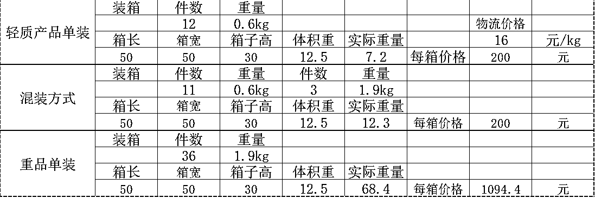

同样的箱子规格中，通过轻量、重货混装的装箱方式，可以让体积重趋近于实重，从而减少头程的成本。第二种装箱方式中，虽然只减少了一件轻货，但是却可以装三件重货，大大缩减了单件发货成本。

 

 

通过这种方式，我们实现跨类目重货的成本突破，部分重货我们可以以低于同行 30% 左右的价格发出，这个让我们得以在毛利上领先竞争对手 5% 左右，因此我们可以比对手更“卷”的同时拥有更多的利润。

其次是减少非必要包装，去年年中我们通过集中盘点的方式，对已有的装箱方式进行改良，压缩非必要的箱子规格，在一些以体积重为主的箱子上，缩减了 10% 左右的头程成本，实现了净利润率 0.8% 的增长。

最后是产品包装的处理，去年亚马逊的新闻就开始报道亚马逊的配送费用也将采用体积重、或者实重的中高的一方进行收费，因为我们有一部分的产品都是抛货，了解到亚马逊是进行机器扫描的，会对长宽高最高值进行取值，因此我们对包装进行整改。

例如，原本的包装中有龙骨带，龙骨以上多余的部分被我们严格的控制，原本的包装不够紧凑，会换成更加紧凑的袋子或者盒装。

 

 

最终也缩减了部分产品，在配送费用上能减少 20% 的 FBA 配送费用，在政策实施时，相较同行同等提价的范围下，我们净利润率上涨了 2% 左右。

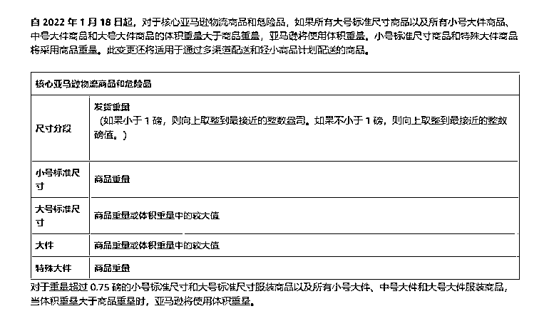

以上流程，整体利润率影响：**2-3% **

四、仓储

**1. **做销售计划、备货计划、减少冗余库存

针对产品做好详细的销售计划，一般来说海运产品，库存（包含在途）天数应该控制在  50 天上下，因为销量不是一成不变的，因此针对产品的推广节奏、季节、提报活动、做对应的销量预测，控制良好的库存销售天数，可以极大减少不必要的仓储费用。

 

 

通过对比类似人群及对标的竞品，做好详细的销售计划之后，我们从原本 90 天的备货量减少到 50 天，这里就至少减少了 40% 左右的仓储费用，在 Q4 季度在净利润率上提高了 1%。

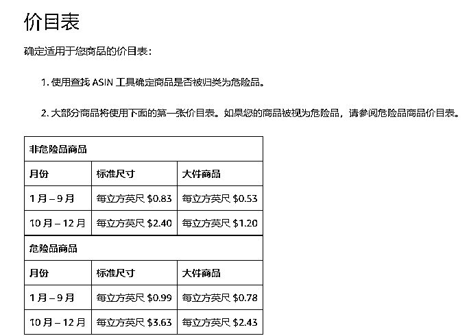

**2. **结合海外仓做仓储周转

另外，因为昂贵的仓储费用，我们会将一些季节差较大的产品提前备货于海外仓，从而在不影响推广节奏的情况下，减少仓储费用。

**3. **迅速处理滞销品：放量**+**清算**+**弃置

 

 

原本在推广的过程中，我们给予运营的试错时间过长，有些产品在准备前期的备货量会比较夸张，但跑一段时间数据的反馈表明产品并不是所谓的“爆款”。这个过程中没有及时地去处理库存，导致了大量长期费用的产生。

在这之后，新链接到达一定的时间节点（1 个月左右）如果没有按照推广节奏进行，我们会进行帮带，对节奏进行把控。如果在介入之后仍无法解决滞销，会果断开始放量配合降价等处理，尽可能将冗余的库存处理掉，节省仓储费用，并尽可能回收投入的成本。

以上流程，整体利润率影响：**1-2% **

五、推广成本

**1. **结合多种站内工具，选择竞争更小的流量坑位、做低**CPA **的流量

因为我们公司几乎是不碰人工干预的，所以广告是我们极为重要的推广手段，这也是大部分的白帽玩家所用的推广方式

去年在广告 CPC 飙升的情况下，我们没有及时做好战略的调整，一昧地迷信高点击率、高转化率的位置，最终的结果是 CPA 不断的攀升，在原本的广告订单占比不变的情况下，导致总的广告花费占比上升了 3-5% 个点不等，这就直接蚕食了我们的净利润率。

后面在经过几次内部的深度研讨，开始不断尝试各种新的广告方式，更多以 CPA 为导向去考量广告。

 

 

在这段时间内，对我们已有的广告手段进行了剖析。

首先，我们常用的广告手段有：由第三方代投的 DSP 广告、站内 AMS、SP、SB、SD 广告，经过对手上不同的类目数据进行汇总。

@首先 DSP 部分的 CPA 仅在再营销及站内竞品关联位的投放较为优秀，因此我们减少了对于其他类目的及一些陌生人群的拓宽。

在DSP上的投放也逐渐由原来的试错，但可增大体量允许亏损的心态转为不赚钱便不投放。不仅如此，我们还会定期做复盘，及时根据数据反馈对预算进行及时的调整。

C是站内的 SP 广告，过往我们的 SP 广告更多是使用关键词卡首页的方式，非常暴力，出效果很明显，但后期的CPA 非常的难看。

后面我们发现利用定位的方式，在一些关键词可以达到一样的效果，并且 CPA 更佳。有这样的发现很重要的一点在于，我们几乎对所有的广告都有测试，拥有大量的数据，可以快速测算出什么样的广告类型，是在当前拥有最低的 CPA。

总结出来：更多利用定位；更多寻找竞争力较弱的长尾词，这些词虽小，但量足够大的情况下体量也很吓人。

 SB、SD 以往我们更多的是当成钓鱼工具在使用，虽然表现好，但总产生订单占比并不高。

 

 

过往我们以为这是常态，但是在一些竞品的广告报告里，我们看到有的卖家在这些部分的占比确实要高于我们很多，且广告表现更好，因此我们有意识地不断去通过堆叠、竞价调整等方式扩大这部分的比例，最终使得这部分 CPA 较低的广告部分大幅上升。

⭐广告的部分没有什么特别技巧，以上是我们使用过程中较有成效的部分，说破便不值钱，但总结起来，方法就是多测试，别错过亚马逊的任何新动向，通过对比寻找较优途径，并不断地放大。

另外，广告很重要的目的之一是自然位，是为了产品能够有源源不断免费的流量，如果产品是有差异化的产品，那可以放开手脚地尝试去关掉一些广告（结合自然位的观测）。

**2. **花费时间做好页面，每高一丝的转化率，都是实打实的利润

所谓页面，我们分为两部分：

@静态部分，如图片、文案等

想要有更打动人的文案和图片，在完全不懂的情况下，还是那个最基础的方法论，研究—模仿—超越，先学优秀的竞品，再学习优秀的类目的优秀做法借鉴思路。

C动态部分，如 rev 、QA

rev 即使是不人工干预，也可以更多地将更优质的 rev 通过点赞等方式展示在更前面的位置。而 QA 更是可以通过分析用户更多关心的问题，以自问自答的方式获取更多的信任感。

**3. **逐步降低付费订单占比

 

 

去年很长一段时间，我们的自然订单占比一直上不去，也是导致利润率上不去的原因，后面发现因为亚马逊货架理论的存在，导致同一页面内，同 asin 会相互之间抑制。

因此在一些老品上，我们进行批次的降低广告预算，发现总订单量没有下降，甚至出现了上升的情况，这点帮助我们在总广告花费占比上至少节省了 3% 的花费。

**4. **做站外的引流、红人种草等动作（难、但贵在效果好且持久）

去年开始，我们逐步的增加了站外的一些投放，通过联系 Instergram 、FaceBook、一些独立网站网红、编辑等，不断的积累，使得我们获得很大一部分来自于站外的流量。

这部分的工作在刚开始的时候非常艰难，一是网红的触达率很低，二是没有过往的合作经验，经常遭到拒绝，但是久而久之，我们联系的网红编辑也成为我们重要的合作伙伴，有一些新品，因为得到这部分流量的加持，在新品期间就可以实在自然流量 8：1 付费流量。

因此这里也十分建议做亚马逊的圈友可以去开展这部分的工作内容。

**5. **关联布局、进行流量闭环布局、尽可能避免跳转流失

一开始我们对自己的流量闭环做的并不好，关联位甚至连 A+ 的布局都不够完善，导致很多的流量进入到我们产品的页面后，不断地被竞争对手瓜分走。

 

 

于是，我们通过页面布局结合站内广告等方式，将页面内的关联位尽可能做到全覆盖，一来可以最大限度地将一些自然关联位自动覆盖，节省费用；二来由于连接的大多数调性一致，这部分流量也在我们的链接内进行了很好的再转化。

以上流程，整体利润率影响：**4-5% **

六、退换货

**1. **针对差评及时做供货改进

亚马逊飞轮理论中非常重要的一环是客户体验，也是常被卖家忽略的一环。链接有利润的时候便只顾放大体量，但是这些卖家最终走向便是逐步被亚马逊淘汰，劣质的评分和较高的退货率会使得链接正向维持越来越难，去年我们也针对很多老品进行定期改良。

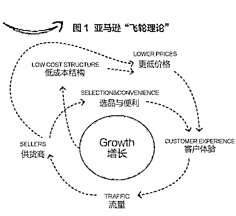

 

 

@对退货报告进行更加具体的分析，明确存在的退货原因，积极与工厂沟通进行改进，并在小批量（如某服装中的部分颜色）测试中取得较好结果之后进行全链接的改进。

C针对差评、QA，进行收集，对有反应到的产品劣质部分及时的改进，同时对一些劣质变体进行及时淘汰，减少差评率。

以上流程，整体利润率影响：**1-3% **

这个过程说来简单，但是一个非常长期的过程。

我们一些 3 年以上的老品常年未被淘汰，一是因为不断增加新元素迭代，二是因为退货率和评分高于竞品，因此我们可以获得更多平台的信任，拥有更多的自然流量、并且在退货损耗上更少（以我们定倍率在 5 左右的产品，一个点的退货率便能够剩下 0.3 个点的净利润率）。

总结

有人的地方就有江湖，卖家数量激增。

 

 

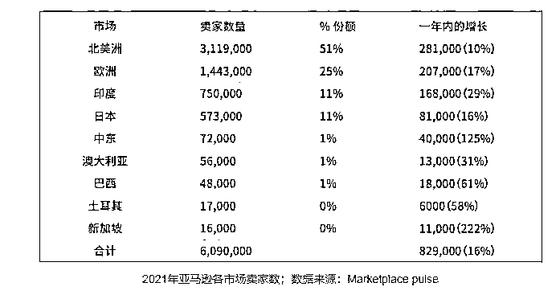

有实力卖家内卷的情况下，利润率受到整体环境是压迫是非常正常的情况。

在现有的大环境下，我不倡导大家大肆地去铺开，在拥有一定的体量的情况下，先将自己更方面的细节尽量做到最优，提升自己现有体量情况下的利润率，这样子就有了更强的硬实力。

蓝海是相对的，有了更强的硬实力，亚马逊在你眼里会有更多的蓝海市场，这样子你也会有更多的选择空间。

最后，祝新老圈友利润率节节攀升。

评论区：

万里 : 呜呜，前年到去年上半年，应该是最近的辉煌时刻了

燕窝雪姐 : 比你弱就是蓝海，比你强就是红海，喜欢这句话！这是强者的世界，我们就是要努力变成强者

nomadii : 精细化运营是可持续的基础

Erika : 但是说实话，点赞review和人工自问自答QA，这也算是干预了   

 

thousands : 是的

thousands : 这块的风险可以忽略不计，我所谓的干扰更多指的是sd、僵尸等  淑婷 : 谢谢分享，非常精细化，这里广告的CPA指的是什么？

thousands : 每出一单需要花费的广告成本

# **# ****(53**赞**)**亚马逊** OA **模式分享

作者：  安瑟

日期：2022-10-25

周一在亚马逊的航海做了亚马逊OA模式的分享，应静伟的邀请把分享的内容发出来，希望可以给对这方面感兴趣的朋友一点答疑。

大家好，我是安瑟，先介绍下我的经历。

之前一直在外企搬砖，主要做产品开发，负责部门一半的品类，每年向供应商采购1500w刀左右。20年底因为家庭原因从上海到杭州定居，开始考虑自己单干，最后综合以往的工作经验，包括产品开发，英文优势，行业发展选择了做跨境电商。

21年三四月上了优联荟举办的第一期亚马逊OA训练营，5月份开始全心做，期间做过后面几期训练营的辅导员和助教。目前在OA稳定的情况下，开始尝试做精品模式，严格来说OA是我创业的前期练手准备，只是现在看准备时间有点长了哈哈哈。

现在生财里OA部分的内容基本上也是当时训练营认识的朋友分享出来的，比如永哥，大咪和Bruce，他们的OA也做得非常好，静伟也是因为看到我的这个经历来邀请做分享的。

 

 

不过要先给大家打个预防针，比起之前几位精品大佬的分享，都是Best Seller，年销千万，利润月10万，我今天的内容就没有这么高大上了。与其说是经验分享，基本上就讲一下我自己对这个模式的一些看法。

内容主要分成以下几个部分，基本上以问答的形式呈现。如果大家还有其他的疑问，再提出来讨论。

一、亚马逊OA是什么？和其他模式有什么不同？

二、OA的天花板是不是很低？

三、OA现在还能做吗？

四、OA适合什么样的人去做？

五、OA需要什么样的条件才能做好？

六、OA最核心的部分是什么？

七、OA有哪些风险和坑？

# 一，亚马逊**OA**是什么？和其他模式有什么不同？

这个内容我们手册里已经有更详细的解释了，一句话说就是去其他网购平台采购低价的产品，发货到第三方物流商检查，打包贴标后发到亚马逊仓库，然后上架跟卖平台上的现成有销量的同款品牌产品的链接（国内卖家链接除外，切记）。这里要补充的是，采购的平台非常多，不要限定于手册举例的Walmart，Target几个大平台。如果你试过一些选品工具，就知道上面有几百上千的网站供你去淘宝。

 

 

我把OA看成是亚马逊最简单的模式，因为它与其他几个模式相比，不需要花精力，成本去做页面运营，不需要打广告。只需要你能买来销量已经稳定的产品，再上架等着出单就可以。

以下是亚马逊几个模式的简单对比，可以看到OA少了难度更大的链接打造和广告两个部分，属于最青铜的级别了，因此很多做精品的朋友也会有看不上这个模式的，心想（不就是跟卖嘛，哈哈）。

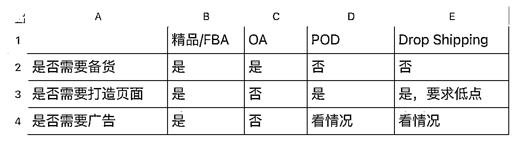

# 二，**OA**的天花板是不是很低？

之前在生财里看到，亦仁有在其中一个OA的帖子里留言大概问，这个模式的头部能有多少利润？也就是天花板有多高。确实咋一看这样一个看起来很一般的套利操作，应该没什么想象空间。不过实际上平台上已经有很多体量非常大的玩家。

比如有一家华人创立的公司叫Hour Loop，主要就是做OA，现在做大了开始和品牌直接签代理之类有更高阶的玩法。他们是2013年成立的，今年1月份在纳斯达克上市。可以看到他们的产品品类非常广，链接达到90000个，这可不是常规的软件铺货，上架的都是品牌的产品。

 

 

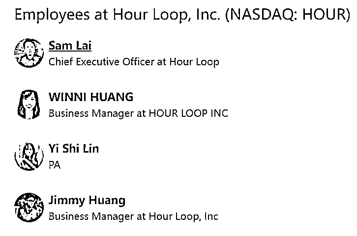 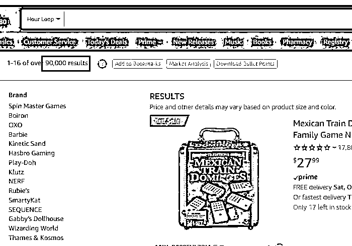

 

 

不过上市公司太遥远了，我们看看身边的例子。我看到圈里自己公开的的不少朋友也有做得很不错，大家可以看看截图，这些人都是从去年才开始做的。因为是付费社群的内容，就不放详细链接了。另外之前训练营中我认识的还有好多没有晒成绩的朋友，靠这个模式在默默赚钱。

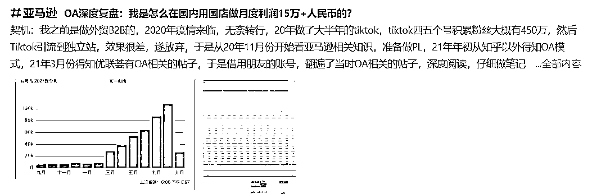

 

 

# 三，**OA**现在还能做吗？

 

 

群里有看到同学问这个问题，虽然不知道是因为看到什么内容问的。我的看法是，当然可以。

从模式发展来看，OA的模式在美国已经挺长时间了，各种规模的卖家都有。而且我现在偶尔会看到一些，日本，欧洲甚至东南亚地址的账号在做OA。

从竞争来看，国内火起来其实也才一两年的时间，对于亚马逊的整个体量来说，这段时间进去的人，不会对你产生多大的竞争。相比每年进去做精品的卖家数量，这点竞争基本上都可以忽略。

从平台政策看，也没看到什么消息说平台要取消跟卖的功能，也没有明显的收紧品牌权限或者侵权处理。

从流量角度看，OA销售的产品主要是一些比较稳定的品牌链接，基本上不依靠广告流量，主要靠品牌带来的自然流量稳定排名，以品牌的名气大小来定位置和销量。在流量越来越贵的现状下，这点比起国内精品的品牌甚至算是优势。

所以，特别是对一个新手来说，并没有什么理由阻止你进场。

# 四，**OA**适合什么样的人去做？

 

 

我想了一下，这个模式其实没有什么门槛，基本上会进生财的人对一些已知的困难都问题不大，如果要说，那对以下的几种人会比较适合。

1，如果你本身有一份正职在做，不打算离职，现在只是想要在业余时间做一份副业赚点外快。这种情况的同学很多，甚至有些同学做起来后，慢慢觉得手里的砖不香了。当然也有很多的人，慢慢就放弃了。

2，全职宝妈，奶爸。带娃之余，空闲时间每天花几个小时去运营店铺，有时也可以几天不开后台，店铺也在默默出单，连收款都自动打到账上。甚至过的比上班舒服，毕竟做得好的人可以照顾家庭又可以赚的不比上班少。

3，没有亚马逊经验的纯小白，想要入局亚马逊。不管你最后是否成功入局了，OA是你最容易切入亚马逊的模式（划重点！）。你可以省去精品最难的页面打造，调研，广告这些最难的部分，但是可以熟悉最基本的整个流程，开店，发货，物流商沟通，后台操作，开case，客服等等。当你熟悉简单的部分，再去做难的部分你的底气就特别的足，特别是你又已经在通过这个赚到钱的情况下。

4，有亚马逊经验，想靠OA多一点收入。我在训练营也遇到很多这个情况的朋友，这种朋友来做OA我一直说简直是降维打击，有天然的优势。我也特别喜欢和他们聊，除了给他们提供一些经验之谈，我也能向他们请教很多精品的问题。之前还有一个朋友和我聊OA，但人家自己的精品团队已经20多人了，还想能不能在OA的模式去尝试规模化。不过这类朋友通常都会非常的忙，不能稳定的安排时间选品，挑战也是比较大的。

如果有亚马逊经验，但是之后是想做精品的去创业的，那别浪费时间在简单的模式练级了。这个对精品的帮助确实不太大。我自己也有点陷在这里，今年初就开始学习精品的课程，但是一直走的特别慢没啥成绩。甚至有时候会想，每天只要花2，3个小时，一个月可以赚到大部分人几倍的工资，做精品的驱动力就会受到影响。格局不够。

 

 

# 五，**OA**需要什么样的条件才能做好？

# **1**，英文听说读写能力

整个OA过程中，选品需要看各个网站的产品信息，确保和亚马逊的链接一致。平时需要和网站的客服，物流商邮件沟通产品，发货的细节。然后有时被砍单，或者付款有问题需要找网站客服电话沟通，找PayPal客服电话解决账号问题。当然这里很多部分也可以通过一些翻译工具来实现，我也看过一些英文不好的同学做得好好的，但这可以是你的一个优势，更快更好的解决很多问题。

# **2**，有耐心，能坚持

前期的选品和积累，一定是枯燥无味的。每天基本上就盯着网页，对比产品信息，价格，查售卖权限，甚至有点大海捞针的感觉。这部分通过一些付费的选品工具，TA，SM等可以减轻工作量，但是很多人都在这一步放弃了。很少人可以忍受刚开始的时候，每天看5小时以上，连续一周，一件满意的产品都没选到的结果。

 

 

然后少数跑通流程的人最后也不一定赚钱了，因为卖出一点点产品是赚不了多少钱的。

只要坚持选品，拓宽自己的产品库，品牌库，你才能扩大你的规模，最后赚到可观的金额。据我所知，很多训练营跑通流程的同学，后来也因为各种原因没有坚持做下去。

但是当你坚持，积累到一定程度，你有自己熟悉采购的品牌和采购网站，最后你只需要打开网站搜索产品就可以找到产品下大数量的订单。总体来说，这是一个越做越轻松的生意。

# **3**，一定的资金

OA是需要采购囤货的，前期可以用几千块钱跑通流程，但做到最后你做多大也取决于你的资金投入。不过好处是，采购是可以用信用卡的，如果你采购的产品周转非常快，你可以在信用卡还款日前收回货款，相当于你没有投入你自己的资金，但赚回了更多的钱。

我之前在优联荟内部分享时聊过一个说法，我把OA看成是一个投资理财项目，我用信用卡资金采购的产品，用信用卡50天免息的时间，如果产品可以在这个时间内周转一圈，最终赚回了ROI为20%的回报。即使是按一年周转6次，这个也是ROI超过100%的投资项目，而且你还没有投入自己的资金。最后你能赚多少钱，就取决于你能投入的资金乘以你的ROI。

当然，这是比较理想的计算，中间会有很多可能产生的问题，比如选品不好卖不出去，被人投诉侵权，周转不够快等等拉低回报率的因素，但这些都是能力问题。毕竟从投资的角度来看，选一个能卖得出的产品，可比你去选一只不知道涨跌的股票确定性大多了。

 

 

# 六，**OA**最核心的部分是什么？

今天就只强调一个点，最核心的是选品。

选品是OA最最重要的内容，没有选到好的产品，一切都无从谈起。产品选好了，出单会非常省心，实现躺赚。但什么样的产品是好的产品？

一个好的产品通常看以下几个重要的方面  ：

# **1**，不侵权

其实这也是个伪命题，所有没有拿到授权售卖的产品，原则上其实是侵权。不过并不是所有的品牌都会去管这个问题，另外亚马逊平台基本上在品牌发起投诉才会主动判断侵权。也就是说，没人管你就可以卖，但是你要避开有人管的品牌。

这里我们主要是用大数据工具避免侵权的问题，IP Alert这个工具收集了市面上发生过申诉侵权的品牌数据，你点开页面就会提醒你，这样基本上避免了已知的风险。当然也还有一些其他的技巧可以做参考，比如分析卖家情况。然后还有其他免费的工具，但效果没这么好。

 

 

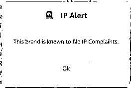

# **2**，有权限

只有有售卖权限的产品你才能上架，像下图这种需要申请的一般没有权限，或者需要经销商采购发票才能开通权限。权限会随着你的业绩增长自动开通更多的品牌，另外美国公司注册的账号天然有更多的权限。

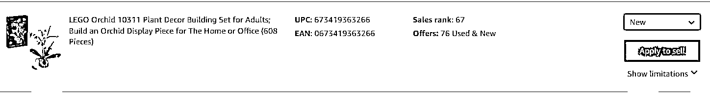

# **3**，有销量

能卖得出去的产品才是好产品。平台上有很多亚马逊自建或者其他三方卖家建的链接，前期已经积累了稳定的排名。这样的链接有稳定的排名，稳定的流量，从而保证稳定的销量。这个可以通过各种软件工具可以查看销量，比如卖家精灵。

 

 

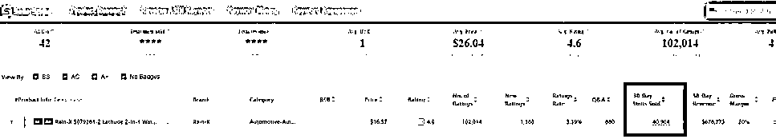

# **4**，有利润

通过计算，卖出的价格减去各种成本（产品采购成本，物流商成本，头程物流，平台成本）得到你的利润。也可以通过工具来计算。我用过几个插件工具之后发现有时不同变体会出错，现在基本上都是直接用卖家后台的网页最精确。

 

 

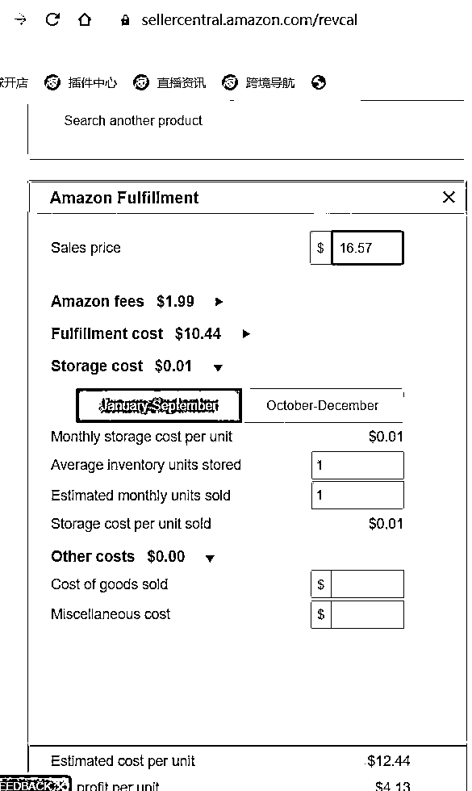

 

 

另外，这里我自己有一个数值参考，先不管利润大小或者ROI多少，计算一下利润和FBA费用的比例，特别是做鞋服等退货率高的同学，退货回来后FBA费用平台是不退给你的，如果你的利润不能覆盖这个费用，退货一次一件商品基本上就是白卖了。

因为前期不太可能像精品一样通过销量来摊平这部分费用，所以需要注意一下。通常利润可以覆盖这个费用，我都会买回来测品，只要你能周转你就是赚钱的，周转率和利润率抓好一个就够了。

# **5**，价格是真实可参考的

可参考指的是当前价格是真实可以用的，而不是处于虚高的阶段。这里要用到查看价格历史的工具，基本上我们都是用Keepa。确定这个价格是大部分时间里的成交价格，而不是犹豫短暂缺货卖家涨价导致的短暂价差。

一定要找资料认真去学Keepa的使用，做到精通，特别是下图红框的部分，对你判断一个产品能不能购买起决定性作用。这里涉及的内容很多，包括价格历史，卖家数量波动，亚马逊自营情况，变体选择等等，是选品参考的重点！

 

 

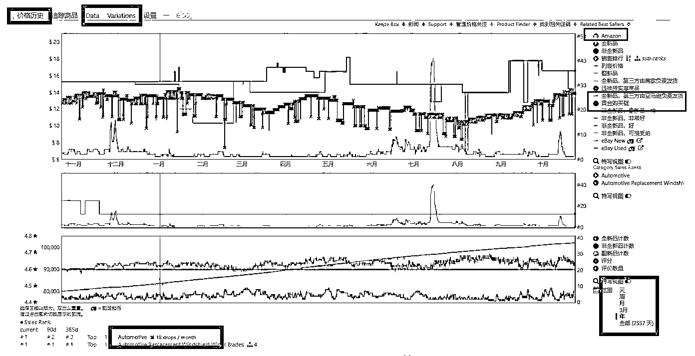

# **6**，竞争良好

一般你不可能能找到独占的好产品，除非少数时间缺货了。所以你只能尽量找到竞争毕竟良心的产品，这里参考的指标包括有：

比如卖家数量，月销量除以有效价格的卖家数可以大概得出每家分到的销量。

比如有没有恶性竞争，卖家无底线自动调价的情况。

比如有没有亚马逊自营长期霸占购物车，有的话尽量避开。

比如有没有大型经销商大量备货的。这些都是要考虑的因素。

这些也是有经验之后通过看卖家列表，Keepa，卖家精灵可以判断的。

 

 

# 七，**OA**有哪些风险和坑？

最后一个部分来浇一下冷水，虽然前面说了很多OA的优势和赚钱的想象空间。但这一路下来也或多或少我们会掉进各种大小的坑。如果你看透了模式，你就只能趟过去解决问题，然后继续赚钱。

下面列举一下比较常见的几个风险：

# **1**，侵权投诉

这个是最严重的一个风险，结果也各不一样。严重的话品牌会向平台投诉，然后平台直接冻结店铺账号，这种情况听说过几个但不太常见。另外轻一点的情况是，投诉之后平台会下架你的链接，后台绩效挂小红旗，然后给你提供品牌方的联系方式让你联系去沟通，品牌方如果同意了会取消投诉。后果就是库存不能卖了。这里只能在前期通过工具提醒以及经验去判断，尽量去避免。

# **2**，平台收紧售卖权限

有时候平台会无缘无故的把你的售卖权限取消，链接变成不可售。这种情况通常发生在Q4旺季来之前，我去年碰到过几个产品，产品送人亏2千美金。但今年好像没有这个情况了。不过遇到这个情况也是有解决方案的，一是找一些账号资深的，或者有美国店铺的朋友看看权限，帮忙清货。二是，通常采购网站都是有30-90天的退货期的，而且这个 

 

退货期过了你和客服battle也是有可能答应退货的，原路退回损失可以降到最小。还有一些朋友有其他平台账号，比如eBay，也可以上架清货。

# **3**，不靠谱物流商

一个靠谱的物流商可以帮你省去很多的麻烦，不靠谱的可以带来更多的麻烦，因为这部分的操作远在大洋彼岸，你是完全无法控制的。我有碰到过签收后反馈没收到的，有发错货变成其他ASIN导致退货的，有收货一个月不处理不发走的。甚至有人遇到货到仓库后玩消失的。不过这种其实也和我们国内的货代一样的性质，碰到了只能认倒霉。

我们能做的一般有下面几点：

前期多花时间精力去搜索，筛选，通过网上的信息做初步的筛选。比如物流商网页的历史，建立时间，地址的实景，邮件沟通的感觉，效率去判断是否靠谱。

然后选定几个备选，同时去测试，合作一段时间就知道质量了。

最后一定要少量测试几个月，确定靠谱了再加大发货量，不然万一损失就是一大批货。

我当初是花了好多天去搜索，发了几十封邮件，最后筛选出来备选。即使这样，我第一个物流商最后发现还是一个说的好听，发货拖拖拉拉的主。还好最后换的备选效果还不错。

 

 

# **4**，产品滞销

这个情况也是一个常见的问题，特别是前期选品不熟练的情况，我们会忽略了某些条件，导致选的产品最后发现卖不出去啊。

所以这块我们能做的就是：

选品的时候照着前面说的几点条件，一个个去对。不要因为看到利润很高就激动的去下单采购。要大胆，但也要细心。

降价处理。通常OA的产品很少是真的没人买，通常你通过降价也可以清掉，最终无法是不赚钱或者亏一点，还是能收回大部分成本。

如果你选的上架后发现已经过季了，也能放着等到应季了。通常这个时候反而会出现缺货的情况，你可以涨价把之前的仓储费补回来。

# **5**，各种丢件

做的时间久了总会遇到各种各样的丢件问题，采购网站到仓库丢件，物流商发去亚马逊上架丢件，亚马逊退回物流商也会发生丢件。这里其实处理得好其实有时候也是好事。

采购网站到仓库的丢件，通常去找采购网站客服投诉都可以直接退款给你，甚至有时候发现实际上仓库收到了。网站的客服一般都不太会较真难为消费者。

 

 

亚马逊上架丢件和退回物流商丢件就需要一个battle的过程，次数多了你会总结出准备赔偿申请的经验，该准备到什么程度。我的建议就是认真一点准备，证据充分到人家不赔你都不好意思。最后赔付了，相当于你直接出单把产品卖给平台了，所以说也是一件好事。之后具体碰到如果不会的，我可以指导一下。

以上就是我要分享的内容了，准备的有点仓促，大家凑合看哈。

主要还是看航海手册的内容比较全面。而且很多问题都是具体操作才会遇到的，到时大家需要帮助了可以再来提出问题。

以上。

评论区：

北纬64度 : 感谢分享，对oa有了大概了解

施小施 : 我在美国有海外仓，非免税州，圈友如果有想尝试这个项目的，可以提供这个服务，不收注册费，仅收单个打包处理费用1.5～2美金

三林 : OA的全称是

张静伟@生财有术 : OA（Online Arbitrage)线上套利  三林 : soga 谢谢答疑

星光熠熠 : 棒极了

小可爱～ : 请问可不可以介绍靠谱的物流商，自己找了好久没找到合适的，都快崩溃了，不是太贵就是要求太高不接收新卖家

# **# ****(**精华帖**)(48**赞**)**亚马逊新品上线，前三个月要

# 怎么备货才能保证不断货又减小库存风险？

 

 

作者：  蓝噗噗

日期：2021-07-01

#龙珠修行营

#小航海

大家好，我是蓝噗噗。

先介绍一下个人从事亚马逊的经历。

本人从2019年下半年开始接触亚马逊。从小白开始学习到独立运营产品，用了三个月。

第六个月开始成熟操作产品上BS。从2020年开始，因为产品有幸赶上了疫情风口，销量一路上涨，后所有产品逐步稳定在BS前10以内，BS前5基本有3-4个，日常占有BS1，月销售140W美金左右。

在加入生财以后，我开始对自己过去这段经历进行了复盘。反思这次小幸运后发现，其实在BS争夺战中，让我成功从长期处于大品牌垄断的类目中，借着风口成功超越取得BS1的一大重要因素就是长期稳定的库存供应。

** **【本文所介绍的方法适用情况】

在新品期销售量不确定的时候；

产品处于成长期且销售量有一定波动的时候；** **

想要打造偏爆款，以**BS10**为目标的产品

【飞书文档链接：点击下方链接查看全文】

 

 

https://ppih7fghvx.feishu.cn/docs/doccnlQMhAXntfTpsxEEJj62Z9g#OiA7PS这次的文章是对我过去经历的一次回顾，希望能够对大家有所启发。

感谢船长沐文老师、助教Moni老师、志愿者小敏的帮助和付出，以及龙珠文修行营小航海的各位航友！这次和一群优秀的船员同行，学习到了很多，也强烈感受到了生财的卧虎藏龙，激励我更加努力成更优秀的人！

评论区：

浩六 : 蓝瓶儿优秀！[强]

蓝噗噗 : 请多多指教~~~

阿宇 : 姐妹棒棒

富百 : 请问销售成功率89%是如何预测的

蓝噗噗 : 市调

蓝噗噗 : 谢谢[害羞]

富百 : 这也有量化的公式吗，还是靠经验估算的

蓝噗噗 : 可以通过各个维度估算成功率，网上也有很多资料教做市调的，都大同小异，可以找一篇看看

# **# ****(**精华帖**)(45**赞**)**亚马逊蓝海：**FBM **自发货精品

# 模式分享

作者： Edwin

日期：2021-12-30

 

 

一直以来，我大部分时间都是做FBA精品模式的，我个人也非常推崇这种模式，并且坚定的认为如果想要把亚马逊做好的话，FBA精品模式会是不错的选择，大部分繁琐的工作如订单发货和售后客服等都可以交给亚马逊官方团队来处理，卖家只需要负责选品和运营即可。

但是，我今天想要分享的内容不是FBA精品模式相关的，而是： **FBM**自发货精品模式！

因为FBM自发货模式，对于新手小白来说是十分友好的，门槛非常低，不需要像FBA模式那样一开始就要发很多库存到亚马逊仓库压着，相对来说项目的启动成本低，风险相对也比较低。可能很多人觉得做FBM自发货的都是铺货模式，赚不了钱还一直无脑上产品感觉很累，这种模式已经淘汰了。

但是我想说的是：无论是做**FBA**还是做**FBM**也好，这都只是亚马逊平台的两种不同物流配送方式而已，最终产品才是核心，重点的就是你的产品是否能解决消费者更深层次的需求，能否在同类的竞品中做到真正的价值超越，让买家能够忽略物流时效等原因，排除万难就只想买你的产品。

我想传递的一种观点就是：大家要把平台意识降低再降低，把更多的心思花在用户端去感知消费者更深层次的需求，买家自然就会感知得到你这款产品的温度。那我们经常提到的更深层次的需求其实是什么？可能很多人还是一脸懵逼，这其实就是类似冰山理论一样，人的需求有一部分是裸露在冰山之上的，这些显性的需求可能大部分人都能看得到，那我们要去做价值超越，其实就是要再进一步探索，满足冰山之下消费者的隐形需求，因为隐藏在冰山之下所以如果没有足够的耐心去研究是很难发现这种需求的，但如果你把这个冰山之下的需求解决了，买家看到后会恍然大悟，原来自己想要的是这个东西。举个例子吧：在汽车发明之前，人们只想要一匹更快的马，产品的迭代与升级远不是收集用户反馈的冰山之上的需求能够形成的，我们很快会发现马只是用户的显性需求，而汽车才是真正的解决方案，你要抓住更深层次的需求，人们到底是要马还是更快？  很明显人们的本质需求是快而不是马！

 

 

每一次分享我都很喜欢把自己平时学习到的一些思维融入文章里面，这样子也能让自己输出倒逼输入，只有把学到的东西传授给更多的人，才能代表自己真正掌握了这个东西，这也是我为什么喜欢分享的原因。接下来分享的内容，我不会事无巨细的所有东西都写得很细致，毕竟我现在还在用这种方法来赚钱，我只会说一些思维方面的碎片和一些重点需要注意的地方，我知道很多人能通过这种碎片整合起来的，觉得有价值的人自然会深入研究的。

分享一部分截图数据：

 

 

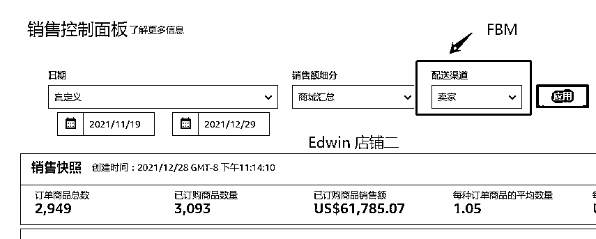 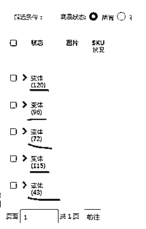

通过截图，可以看到这两个店铺的全部物流配送方式都是卖家配送（FBM模式），没错，这两个店铺只做FBM自发货的，右边可以看到后台的产品只有5款产品，虽然每个父体下面绑定的子变体很多，但是这5款产品父体下绑定的子体的产品其实都是一样的，本质上是同一款产品，只是我后期通过一些方法把一些热卖的爆款元素附加在这个通款产品上，然后创建多个子体，绑定在同一个父体下面，但是对于进货库存管理来说，只需要进5款产品即可；然后你再去找一些做水晶标或者热转印标贴纸的工厂去谈一下，把你的爆款元素做成水晶标或者热转印标，然后到时候出单后看具体订单情况，自己来贴在产品上面，这样子就变成了新的产品了，并且处理起来也是很简单的。

 

 

可能很多人还是会有点看不懂，我找了一个类似的案例来讲解吧。请注意！！！我肯定不是卖的这款产品，只是说这种模式和我是有点类似的，所以拿来举例子方便大家更能理解这种模式而已。

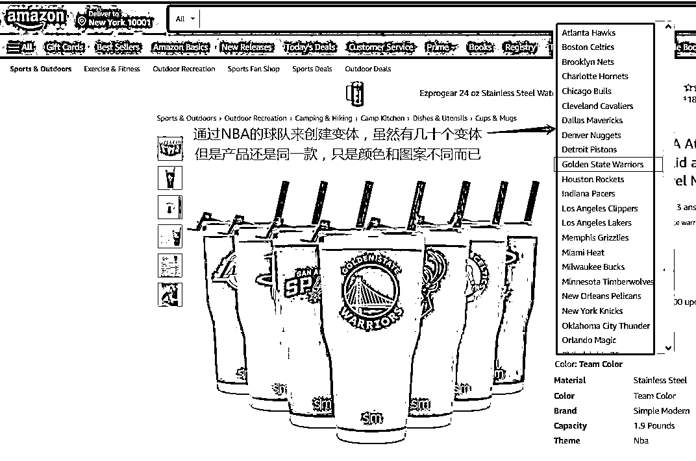

最终我们选品就要深入再去调研分析用户更深层次的需求，找到符合这种类型的产品，通过以上这种方式尽可能的多变体来操作，因为这样子多变体方式来做FBM自发货才会比较有优势，并且权重有累加的。当然，上面截图的这款产品是肯定的不能做的，很容易侵权的，除非你有**NBA**官方授权才可以，所以我们选品的时候，去找一些爆款元素的时候，也要格外的多注意知识产权方面的问题，提前最好风险预估。核心思维其实就是通过调研用户更深层次的需求，来创造一些高热度的爆款元素来赋予产品差异化，从而实现价值超越。

接下来分享一些重点的内容吧，希望通过文字，我们会有更好的交流。

Go...

 

 

新手做亚马逊**FBM**自发货要解决的十个核心问题

1.关于店铺问题

2.如何选品才能快速出单

3.新手产品上架问题

4.listing页面如何打造

5.产品推广问题

6.订单批量管理

7.小包分拣配送

8.物流运输问题

9.退货和售后问题

10.账单回款问题

**1.**关于店铺问题

关于店铺问题是最基础的，那么对于我来说，只是想测试下这种FBM自发货精品模式的方法论是否可行，那我在权衡了自己注册店铺和购买店铺所要花费的时间成本之后，我选择了直接购买店铺，毕竟也是拿来当小号玩玩而已。所以这两个店铺我是找号商买的，成本大概2800元/个左右，已经过了视频认证+明信片地址认证的。当然我是不鼓励买店铺的，毕竟里面的坑太多了，有很多不可控性，非常难规避的，除非你有很多这方面的经验并且能接受各种风险，不然还是自己老老实实去注册店铺吧，注册店铺也不难的，社群里面也有很多人分享过的可以去搜一下。我主要是为了省时间才迫不得已会用这种种方式的，当然我是衡量过其中的风险并且也有相关经验，所以非常不建议新手完全不懂的情况下就去这样子去操作，除非你想当最大的韭菜，或者已经做好最坏的打算即店铺和资金都可能拿不回来，并且如果这个最坏的打算发生了你也能坦然接受，那就可以去尝试一下，当然这方面的资源千万不要来找我，因为我不希望和社群里面任何人产生利益交集，我只是单纯分享一些内容，仅此而已。

**2.**如何选品才能更快的出单

 

 

a. 首先这种模式是有前提条件的：就是做的都是垂直细分的类目，就是最开始先确定目标用户群体是哪些，再来选择和打造产品，来满足这部分用户群体的需求，进行错位竞争，做到价值超越。

b. FBM自发货模式，那就要充分利用自发货的好处：不需要入仓囤货，所以我们就要利用这种优势来和FBA的卖家竞争，我们要尽可能的细分，把用户需求极致的细分，看过我前面文章的人都会知道，我们可以从很多方面进行细分：颜色，尺寸，场景，功能，型号，用途......等等，单款产品要尽可能的多变体全部绑定在一起，可能一款产品会有几十个甚至上百个子体，全部绑定在这个父体下面，这样子就能满足用户大部分的需求，并且每个子体都能在长尾细分的关键字里面最匹配用户的真实需求，这个时候转化率肯定是比较高的。

c. 所有变体绑定在一起后，review是共享的，出单后整条链接的权重也能累加，这样子就可以在新品期快速冲刺排名，关键字排名越高后期自然流量就越多。

d. FBA入仓模式如果按照这种方式来做的话，肯定需要大量的库存，因为子变体太多了，风险大，而且效率也不高，但是FBM模式的话是不用囤货的，变体再多也没关系，所以只要FBM卖家能利用好这一点，就算打败FBA卖家的产品，也是很有机会的。有点农村包围城市的感觉，就是单个子变体出单不多，但是整个链接所有变体加起来的单量就很吓人，并且排名也会非常理想的。

e. 在细分领域里面满足一部分用户的更深层次的需求，尽可能的通过调研过的用户需求进行极致细分，通过各种方式以变体的形式聚合在一起，尽可能的多变体，极致的细分让子变体在垂直细分的领域里面点击率更高，所有子变体加起来聚合起来在同一个详情页让买家进来后可以闭环，这样子转化率也会提升不少。

核心思维：基础爆款（从亚马逊平台上找）**+**热点爆款元素（调研背后用户群体的需求）**+**极致细分多变体聚合

 

 

基础爆款我们可以直接去亚马逊前台去找，首先你要先确定自己想要做的类目，先确定哪些类目的产品比较容易把这些热点爆款元素附加在基础爆款产品上，优先来做这种类目的产品，只要能在上面印图案的产品，基本都可以挑选来尝试去做。我还是用前面那个NBA球队元素的杯子来举例子吧：你通过调研亚马逊的排行榜单，发现某种款型的杯子非常畅销，在亚马逊上面卖得很好，这款杯子就是我所说的基础爆款；那么是不是我们找到这款产之后，就去直接跟着抄袭，做一模一样的产品呢？肯定不是的，那样子你肯定会一单都卖不出，因为你会发现畅销榜上面的这个基础爆款肯定价格是压得非常低的，并且评论非常多，普通小卖家和他们来拼肯定拼不过，何况你还是个FBM自发货卖家。所以这个时候我们需要在这个基础爆款上面，再去附加热点爆款元素，当然这个热点爆款元素也不是随便来印个图案就可以的，我前面说过的，我一般是先确定好目标用户群体，再来挑选爆款产品的，所以这个工作需要前置，就是你提前已经对某一个群体的目标用户有过深入的调研，通过亚马逊的QA和review也好，通过社交媒体也好，或者写国外的论坛之类的，先调研清楚这一部分用户的需求，再来匹配对应的基本爆款产品，再把用户喜欢的热点爆款元素附加在产品上面，打个比方啊：假如说我之前一直研究的用户群体就是运动爱好者，那我是不是就可以把运动相关的元素，附加在这个杯子上面呢，篮球，足球，棒球，橄榄球等，只要目标用户群体比较热爱的运动，我们都可以尝试来做。最后一步，就是把这个产品通过各种方式，进行极致细分，那么我们通过亚马逊的关键词调研工具去分析，发现篮球里面NBA的热度是最高的，搜索关键词的流量也是最大的，那么我们最终是不是可以用NBA球队来进行极致细分。PS：当然这也是用来举例子而已，不是让大家做这款产品请不要误解，只是用来举例子会更形象，大家会更容易理解，因为底层逻辑基本是相同的。选品这里面有两个重点需要注意的：第一，基础爆款确定后，也要同步去查询一下这款产品是否有专利，是否有侵权的风险，因为很多热卖产品都可能有专利的；第二，热点爆款元素确定后也要去查询一下是否有存在知识产品的隐患，提前杜绝掉。

PS：如果不太懂如何极致细分产品的朋友，可以先看看我之前分享过的一篇文章哈亚马逊蓝海：如何极致细分产品  https://articles.zsxq.com/id_4uow5bz9k495.html   

 

另外前两天我在生财精华里面，也看到一篇非常非常好的文章，《如何创造更多优质创意赋能给产品来实现差异化竞争》，这篇文章的内容，也是基本和我的理念非常相近的，以基础爆款+元素创新的方法论为切入视角，通过拆解案例和产品开发思路，佐证元素赋能做爆款创新的方向，我觉得他写得已经非常好的，大家一定要去反复看一下这篇精华文章，真的价值巨大的，写得非常透彻了，感谢他的分享。

链接地址：  https://articles.zsxq.com/id_tgzqxwfdj4tw.htmlOK，如果你把上面的内容都消化掉，基本上你会找到一些不错的产品来做了，那我们就继续下一步。

**3.**新手产品上架问题

重要的话说三遍：《卖家大学》!!!《卖家大学》!!!《卖家大学》!!!PS：如果真的不懂的话，可以去看亚马逊后台的卖家大学，因为后台的卖家大学基本是手把手免费教学了，秒杀掉市面上很多的培训机构的，只要你花点时间耐心的去看，看完跟着步骤去操作，基本可以解决90%的问题，剩余的10%不懂的再去问搜索引擎即可。

**4.listing**页面如何打造

虽然是做的FBM自发货模式，但是需要每一个产品的listing页面要当成精品来打造，图片要把卖点呈现出来，文案可以适当精简，但是一定要突出卖点。

a.图片。一般我们挑选完基础爆款产品后，就可以去找货源了，直接去阿里巴巴或者拼多多上面找就可以了，找到一模一样的产品后，直接去私聊那个店主，和他表明我们是做亚马逊的就可以，然后加微信后问他发产品原图给我们，一般多问几家，很多做批发的人都会愿意合作的，这就看你的沟通能力了，而且这两年由于疫情原因跨境电商亚马逊太火了所以很多做批发的都知道做亚马逊量大也很愿意合作的，所以也愿意给图片。

OK，那默认有了店主给的原图之后，我们就可以根据原图去微调了，假如你是做美国站的，就可以把图片风格做成欧美风，文案替换成英文的，这个不难的，会点基础PS基本 

 

都能搞定的，最好模仿你那款产品做的比较好的产品的图片风格。最后再把对应每个子变体的爆款元素P在产品合适的位置上面。

b.标题，卖点，描述。这里就涉及到运营层面了，需要你通过第三方的软件，或者竞品页面，可以通过JS或者卖家精灵去反查竞争对手的核心出单关键词，然后加上爆款元素词再埋到文案里面。需要注意的就是每一个变体的长尾关键词都需要调研出来，并且图片文案都要结合这个长尾关键词来布局，在这个细分领域，只要搜这个关键词，你这款产品匹配度是最高的，这里就可能涉及到稍微难一点的运营能力了。

c.每一个子变体的listing页面都需要根据这个子变体调研过的长尾关键词进行优化，就是务必要保证买家搜长尾关键词的时候，你这个子变体的产品，是这个页面最符合买家需求的产品，无论是图片，标题，还是卖点，描述，都要显示出独一无二，最好用一些专属定制的词语突出个性化和唯一性，才能做到价值超越。

d.上架后要有节奏的做QA，还有上传QA视频，不需要测评的，只要详情页做优秀，QA引导好，裸奔没评论也是可以出很多单的，这点不需要担心。

e.主图非常重要，尽量要保证主图的点击率非常高，后期要通过广告的长尾词去测试的，在保证点击率非常高的前提下，利用广告来推广产品，不用测评也能把产品打爆的。

**5.**产品推广问题

目前来说，产品推广方面，就做QA，拍摄和上传QA视频，不做真人测评，如果平台管控政策比较松的时候也会考虑上几个直评的，费用也便宜，QA的话3-5元一组，直评的话10-15元一个，但是最近直评上得比较慢不太稳定，基本都是只做QA和QA视频了。

 

 

然后重点的就是利用站内广告来推广了，按照目前这种模式的话，单纯用广告来推广其实成功率也是蛮高的了，只要前期选品选得不错的话，基本运营方面只要方法和模式对了，一般也不会太难，所以这也是侧面的反映出选品的重要性，后期运营方式也是根据产品特性来规划的。

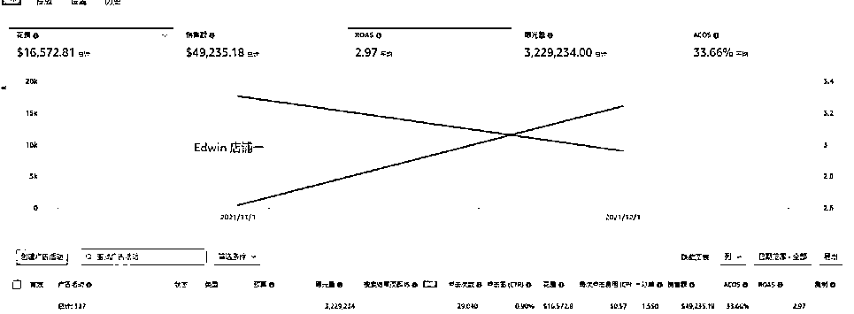 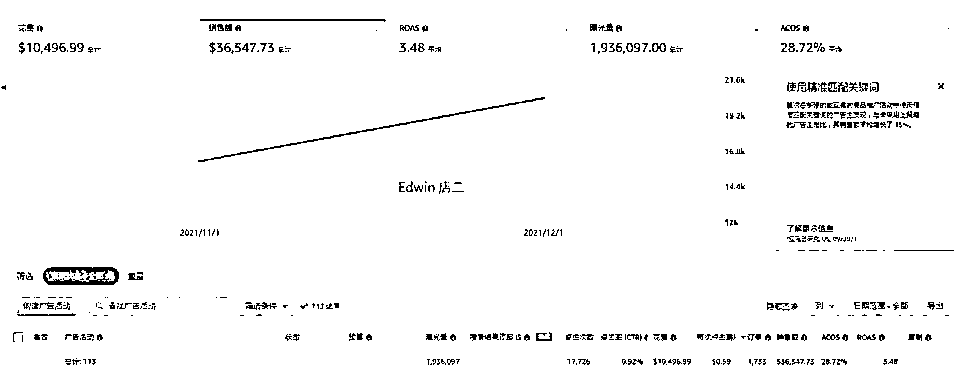

站内广告的逻辑：

a.假如一款产品有4种颜色，50个元素，那这款产品就有4*50=100个变体，那我一般会创建50个广告活动，就是相当于每个子变体的50个元素都单独创建一个广告活动，然后每个广告活动里面都加入这个元素的4种颜色，全部加入到这个广告活动里面，让它跑。

 

 

b.广告选词一般选两种词，一种是选这50个爆款元素的长尾词大词，各自加入刚才单独创建的50个广告活动里面，用广泛匹配模式来跑，等有一点权重之后，再增加一个精准匹配，为了提升这个长尾词大词的自然排名。另外一种词就是这个基础爆款产品的核心词，这个可以用软件来调研，找到核心词后，再在前面加上这50个元素的词拼在一起，各自放到对应的广告活动里面。

c.因为我都是开的手动广告，并且选的词都是比较精准的词，流量也是非常精准的，所以点击率就非常重要，前面几天都需要一直去测试点击率，如果点击率不满意需要及时去优化，如果点击率可以的话，慢慢的肯定会有转化的，因为我们的产品已经在这个长尾词下面是最匹配的产品了，所以肯定会有成交的，只要点击率不错，我们就要继续给预算，每天都要看前一天的实际花费，只要ROAS还不错的广告活动，就要持续去递增广告的预算。

d.这样子广告开下来，其实花费是挺多的，因为变体非常多，但是同时好处也是很明显的，只要点击率不错的情况下，每天持续有大量的点击，这个产品的排名会上升的非常快，后期自然排名也会一起上升，等到自然排名到了一个比较理想的状态后，就可以把广告的竞价降低，去吃后面的流量即可，那样子利润率就会大大地提高。

e.需要注意的一点就是，我们要尽可能在目标销售国家的白天的时候尽可能的花更多钱，尤其是转化率高的时候，比如说我是做北美站的，我会在我们中国时间下午4点（美国的晚上12点）把预算全部调为1美金，然后再到中国时间晚上9点多，再把预算恢复正常，同时加大竞价，尽量在白天转化高的时候把广告预算花完，性价比更高。

d.通过广告的一波操作，可以把整个产品推起来后，后期就需要不断点击亚马逊后台的请求评论按钮进行邀评，有一些插件可以批量操作的，同时也可以在产品包装里面放一些售后小卡片(你懂的)，因为自发货亚马逊查不到我们的包裹，因为我们不入亚马逊的仓库直接发货给买家的，所以只要买家不举报我们，基本就没事，一般我们只要做有利于买家的事情，正常来说肯定也不会举报我们放售后小卡片的，当然如果你比较保守的话，就不要搞这个了。

 

 

**6.**订单批量管理

写到这里，有点累了，哈哈，本来就想分享一些简单的零碎细节，没想到越写越多，后面我就挑重点来说吧。

订单批量管理有很多不错的ERP系统，我一直用的都是店小秘，免费的，效果也挺好，有很多功能的，非常适合自发货，比如你订单来不及发货还可以虚拟发货，避免ODR超标。还可以进行订单管理，打印订单，基本店小秘ERP系统都可以解决订单批量管理的问题了，关键还是免费的。市场上还有很多类似的这种ERP系统，大家都可以按照自己的实际情况去使用即可，不一定就用这个的。

**7.**小包分拣配送

小包配送分拣及仓库打包的解决方案：可以找一些大学生兼职，你只要培训好其中一个能力比较强的，然后让那个人你带着其他几个大学生来做就可以，每个产品最好都要弄一个编码之类的，按照编码来弄可以防止打包打错的问题，毕竟自发货如果发错货还是很麻烦的，买家要退货基本就很亏了。

**8.**物流运输问题

小包物流配送的话，也是有很多物流渠道的，像递四方，云途，燕文，都是时效不错的，邮政的话就比较慢，尤其是E邮宝非常不稳定，所以一般都会选前面几个，效果不错，一般美国的话2个星期左右买家都可以签收了。详情的话，可以百度一下他们的官网，然后加客户经理的微信，让她们指导就可以了。或者可以考虑用亚马逊的购买配送，也是非常好的，可以解决ODR的问题，亚马逊推出一段时间了，效果也是非常好，像云途，燕文都是支持亚马逊的线上购买配送服务的，对于FBM自发货来说真不错。

**9.**退货和售后问题

这个最重要的就是要控制好ODR，不要超标，有几个需要注意的点：第一，就是要选择时效稳定的物流商，最好用亚马逊合作购买配送的物流商，有保证。第二，一定要用ERP系统，可以虚拟发货，规避迟发率问题。第三，一定会存在外国骗子的，只能尽可能沟通多让利了，不要给差评或者争议，不然店铺绩效容易出问题，但目前来说，U1S1，这种情况还是比较少的。第四，尽可能不要做客单价太贵的产品，不然资金压力 

 

大，而且售后问题严重的话，会侵蚀掉你大部分利润的，要权衡好自己能接受的产品价格段；还有就是不要做太重的产品，体积太大的产品，物流费用太贵了，这些都不太适合做国内发货的自发货，除非是那种海外仓模式的自发货。

**10.**账单回款问题

做自发货的话，你会发现回款超级超级慢，因为很多时间资金都是转到预留资金里面，因为亚马逊规定买家收到货7天后没问题了，才会打款的，所以尽可能选择更快的物流商。还有一点，做自发货如果做大了，资金压力也是非常大的，因为你会发现你需要提前垫付物流运费和产品费用，每天的物流费和产品成本费都挺多的，你资金压力就会非常大了，然后回款又遥遥无期，这个时候一定要评估好风险，还有自己的资金实力，千万不要借款来周转，宁愿少卖一点，以利润为主，太激进的话，很容易翻船的。

最后：

突然想起昨晚在Youtube看了一则Ray Dalio有关「如何成功」的30分钟视频。

链接：https://www.youtube.com/watch?

v=B9XGUpQZY38&list=RDCMUCqvaXJ1K3HheTPNjH-KpwXQ&index=9在这个视频中，Ray Dalio分享了他自己的成功人生法则。他将这个法则总结为“五步流程”，只要严格遵循这个“五步流程”，你就能实现自己的人生目标。这五个步骤分别是：

1.制定明确的目标。

2.找到阻碍你实现这些目标的问题，并且不容忍问题的存在。

3.准确地诊断问题，找到问题的根源。

4.规划解决问题的方案。

5.坚定地从始至终地执行既定方案。

 

 

通过这个“五步流程”我想表达的是，很多时候我们最重要的是先制定明确的目标，找到阻碍你实现这些目标的问题，再准确地诊断问题，找到解决方案并坚定的执行。大家的最终目标其实都是为了赚钱，亚马逊也只是众多跨境电商平台中其中一个而已，所以无论是FBA还是FBM，这也只是两种不同的物流配送模式而已，但是底层逻辑其实都是一样的：我们通过亚马逊这个平台去销售产品，然后买家付款来购买并得到这款产品，卖家拿到应得的利润，平台收取佣金，最终只要卖家，平台和买家三方都满意即可。当然，FBA的配送体验更好，权重更高，FBM物流太慢了，买家的体验会差很多，但是这个就需要你自己权衡利弊了，因为FBA和FBM各自的优势和劣势也很明显。

我们一定不要给自己设限，对大部分人来说，是因为看见，然后相信，但对于我来说，则是因为相信，所以看见，很多事情先去做，暂时不要考虑结果，只要你觉得这件事情是对的，并且能接受失败后最坏的结果，那就大胆去做，没准你能成功呢。

因为相信，所以看见。

以上。

评论区：

亦仁 : 感谢分享，已加精华。

Grace : 2017-2019年做过2年FBM，被E邮宝的时效害惨了。

Edwin : 谢谢亦仁大佬.

Edwin : 对的，E邮宝相对不稳定，我一般都是递四方和云途比较多

亦行 : 大佬，那你店铺一个可以用多久，有没有被封店？

郑小焦 : 谢谢Edwin分享，写得特别好。目前还没有尝试过FBM模式，这样读来也挺有意思~~学习啦，准备拿一两个账号来测试玩一玩。（另外，昨天我也刚看《原则》的五步流程实现人生愿望，巧啊）

步骤逻辑都很清晰啦，细心的把一些具体工具都贡献分享了，特别棒的文章！

张yan : 满足用户需求的差异化，做正确的事暂时别考虑结果

Edwin : 多想想办法避免风险就行，办法总比困难多

 

 

# **# ****(22**赞**)**在线人数不高，转化效果不错的** **

# **Amazon Live**，单场直播几千**-**上万美金的亚马逊

# 直播玩法分享

作者：  冬佛儿

日期：2022-12-14

大家好，我是老李Sarah。

今天和大家分享一下我对亚马逊的直播板块的理解。这个板块相对比较新，业务发展的也比较“隐蔽”，跟大火的Tiktok直播在热度上真是没办法比。

但其实这是真有潜力帮你变现的领域，如果你也在考虑如何通过海外直播给品牌变现，欢迎一起探讨下去。

本篇适合哪些人看：

**1. ** 亚马逊的品牌卖家** **（品牌！品牌！品牌！）铺货型的卖家能收获的价值不一定高

**2. ** 看好电商直播的潜力，认可这里是有可变现的路径的，在积极寻找对的方法不适合哪些人看：

**1. ** 非品牌卖家** **（真的玩法不一样）

**2. ** 对海外直播的预期是：自己只拿个产品就想疯狂出单，别的资源、信息一概认为不重要，或者想找纯佣带货的联盟达人的

 

 

为了方便大家，这是全文的目录

**1**、自我介绍：为什么是我来给大家分享亚马逊直播

**2**、关于亚马逊直播：什么是亚马逊**Live**？

**3**、亚马逊直播玩法：适合哪些玩家，有什么玩法

**4**、如何运营好亚马逊直播间

**5**、案例分析

**6**、结语

# 一、自我介绍

接触亚马逊直播，纯属是个意外。我之前业务，一直会接触大量网红，帮他们自建电商品牌增加变现。

 

 

20年的时候，有一个姑娘，对我提供的变现方案丝毫不感兴趣，说她现在做的事情变现已经比较乐观了而且还在上升期，不会分散精力的再见。

如此坚决的态度引起了我巨大的好奇心，所以不断的套磁请教到成了好朋友，最后也是因为她，被“拽”入了亚马逊直播这个赛道直到现在，帮品牌做亚马逊直播。

# 二、关于亚马逊直播：什么是亚马逊

# **Live**

亚马逊Live是亚马逊平台自己推出的直播功能。

品牌方在直播的时候，他的产品详情就有可见的入口；网站主页菜单栏里有单独的live入口；主页也有单独的一屏是给live的。其实入口并不算特别多，所以很多人可能还不知道亚马逊live的存在。

亚马逊做直播的逻辑很简单粗暴。他们自己对外的口径就是，Amazon Live - Drive Conversions with Live Streaming。

就是说，至少亚马逊是把直播当做转工具的。因为亚马逊和Tiktok的本质不同，前者是购物平台，后者是泛娱乐平台。

 

 

虽然看娱乐内容的人也是消费者，也很可能在亚马逊上买东西。

但在看到直播的这一刻，如果是在亚马逊上发生的，说明你本来就是想买东西来的，你的readiness要比你刷Tiktok的时候要高。

再加上如果你是从产品详情页引流到直播间，更说明你本身就对这个产品感兴趣了，来直播间就是临门一脚加速转化。

整个流程都是尽量贴着“购物粉”去引导，直到最后成交，也是亚马逊，走完一个大闭环。

# 三、亚马逊直播玩法：适合哪些玩家，

# 有什么玩法

简单说，亚马逊直播现在就有两种大玩法 —— 让红人带货，或者品牌自播。

先说红人带货。

亚马逊的直播红人，可能自己在其他社媒也有粉丝（没办法，对社媒敏感的都是这么同一群人），但是他们本身的社媒粉丝并不直接推动他们在亚马逊的表现，大家都是从0开始。

 

 

而想找到红人带货，也有两种方法：

1）亚马逊官方操盘对接：想通过亚马逊官方来找到对接红人，是要走亚马逊的广告团队的。

这真的是一条奇贵无比的道路。甚至在他们自己的官网上就写明过，如果想用亚马逊的广告团队帮你打理直播，至少要预留5万美金的直播预算。这个费用，是一般咱们的品牌，至少在试水阶段不会去轻易用。

2）线下私聊亚马逊的直播网红：收费模式类似国内：坑位费/服务费+佣金。

坑位费是卖家自己去和主播私下结算，坑位费按照时长，是否是专场等维度，从几百到几万美金不等。佣金是通过亚马逊的体系自动结算好给主播。

但问题在于，亚马逊主播名单并不是一个公开的信息源，你能在公开渠道找到的，永远都是很小的一部分。很有可能要么主播量级太大或者太小，要不就放手盲找，但不一定能找到匹配合适的主播，来帮你带货。

这里带一嘴坑位费的问题。这个是大部分卖家可能都想省掉的地方。

但根据我的经验来说：

不要想占主播便宜。一是这个费用你也省不掉，而是如果能省掉，大概率是品牌方最终吃亏。

 

 

海外的直播业态，我再想美化也不得承认，就是没有国内成熟和稳定，不能做到像国内纯佣达人直播间。

美国亚马逊上的主播，大部分都是只有自己或者小工作室。这些主播里，如果可以做到一年几百万美金的带货量，就已经是首屈一指的了。

我们合作的主播在开播之前，每一场2-3个小时的直播，要准备4-5个小时才能开播。主播不仅要试用产品写脚本，还要了解品牌历史，收集筛选品牌营销素材。

这个投入跟联盟带货发一个图片或者视频帖子，是不一样的。

如果接受了纯佣合作，要么你的佣金奇高无比（亚马逊直播佣金也没有国内那么高），更可能的就是主播还没什么底气，拿你的样品练手。获得好的结果，自然是小概率事件。

再说品牌自播。

技术上，亚马逊没有太多要求。只要是亚马逊brand registry的注册品牌就行。可以用亚马逊的直播app进行品牌方自播。自播的话亚马逊也不收取额外费用，需要品牌方自己组盘  。

如果要说有什么门槛，其实是内容水平的门槛。红人主播这个趋势更明显，就是绝大部分的主播群体是“纯老外”，而且年龄跨度也很大。这一点和国内玩儿Tiktok的也有很大不同。

Tiktok的很多国人主播，虽然不是英语母语，但是非常会互动，依旧能吸引一票粉丝。

 

 

但是亚马逊的直播，整个的调调就更偏平和，它对主播的语言功底要求非常深，很少有“过于热闹”的直播间。一般打造的都是真实、亲和的路线。

直播间流量上，亚马逊会根据在线人数、互动情况等数据，适当推流。

但是切记，亚马逊的直播间首先总观众就没有Tiktok那么大，而且购物直播间，本身人数也不会特别多。

主播和品牌方爸爸都不要很快就气馁，没有出现开场就破千破万的场观也不怕。

一般来说，几十人的同时在线，是个非常正常的数字。如果赶上某个好的时间节点，恰好亚马逊推流，那你流量翻倍就非常快。

# 四、如何运营好亚马逊直播间

# **# ****4.1 **如何选择主播：大多数人选择主播的误区

 

 

主播的选择上，最终的主动权在品牌方 -- 想象如果你的品牌“是个人”，你希望它看起来是什么样的？

ta给人的感觉是本地的，还是异域风情的？是清新的，还是性感优雅的？是亲切可人的，还是高贵不可触碰的？你的客户是自用还是送人？

这一系列问题都是我们要和品牌方进行灵魂发问的，最终才能定下来到底合作什么样的主播。

此外，主播跟你的配合度一定要高。也许主播是兼职，或者是外部红人，但是这个人要深刻理解你想要传达的品牌信息。

专业的主播在接你的推广之前，都会仔细衡量你的品牌成熟度，品类匹配度，会学习产品在亚马逊的评论。

# **# ****4.2 **其他的运营技巧：做好亚马逊直播的几个运营前提

首先，亚马逊红人直播间里，排品是一个非常重要，要拿来单独说事情的点。

国内直播说到排品，经常会讲引流款、爆款、利润款的搭配。在亚马逊直播，我们的每一场排品，其实要帮红人根据产品的价格、折扣力度、品类搭配，以及白牌还品牌至少这几个维度来做安排。

 

 

尤其是品牌成熟度！新亚马逊品牌，要特殊搭配一些成熟品牌作为“绿叶”，来让这个产品的直播排名尽量上升。

时长上，总的时长要保证。如果是同红人合作，而且是比较新的品牌，一般会建议2个小时的总曝光作为起点。如果是品牌自播，一开始可以安排一周1-2次，一次2-3个小时就可以了。

关于是否本土化这个问题。说多了怕有打广告嫌疑 :p。只能说，我合作的主播，还都是非华裔的主播。

我个人操盘的品牌以生活家居、家用小家电、美妆时尚为主，这些品类都比较考验主播对生活场景的理解和表达。如果能有对本土理解非常强的主播，应该也是可以的。

# 五、案例分析

案例这里，和大家一起拆解一场迪士尼的直播案例。非常新，三天前刚播完。

打造一场迪士尼级别的亚马逊直播间，基本分为四步

第一步：确定直播主题

第二步：确认产品组合

 

 

第三步：选定主播，确认直播间背景风格

第四步：确认排品和展示方式

第五步：设计话术，开播

第一步：确定直播主题

万圣节一过，就陆陆续续进入圣诞季了。

迪士尼三天前直播的主旋律就定在Holiday Toy Wishlist （圣诞季礼物心愿单），主要面向成人，帮成年人解决给小孩送礼物不知道选什么的问题，以及顺带给这些平均年龄三十岁的老孩子们，种草一些童年杀玩具。

第二步：选品

这步其实很重要的，究竟上哪些产品，是需要花很多心思来设计的。基本在这个环节至少要考虑好几点：

1）产品数量：迪士尼的这场直播只有一个小时。他们在直播展示环节基本选择了10个左右产品重点介绍。

2）为目标人群按比例配品：这场直播主要帮成年人给孩子挑玩具，所以以儿童玩具为主。成人自用的玩具为辅。

即使是儿童玩具里，女孩子更偏好的娃娃类、服装类，和很多男孩子喜欢的积木、车模也进行了匹配。

 

 

3）产品价格区间拉开：迪士尼的这次直播里，价格区间在$20 - $99之间。

真人介绍的产品固定在$40-70美金区间。少量90美金档位，突出套盒的优势。依旧是性价比突出。

4）产品特性：吸睛的爆款，和经典款要搭配着来。迪士尼的这场直播里，有一款儿童泡泡机推车，超级吸引眼球，就被拿来在和靠前的位置做主推。

第三步：选择主播

迪士尼选择了两位主播联合直播。一位黑人姑娘，一位白人小伙子（是的有时候肤色inclusiveness啥的品牌爸爸们也要考虑一下）。

两位都是属于热情洋溢的孩子王形象。由于两位主播远程接入，所以背景没有做特殊高成本搭建，基本都是起居室作为背景，打造家庭的感觉。

 

 

这里其实也要戳一句：亚马逊直播的头部主播还是会有设计感的直播间背景，但是更多中腰部主播，在背景打造上属实有些草率了。

这也跟他们很多人都是个体户创业有很大关系，而国内很多主播背后都是一个团队在设计运作。如果有预算，非常推荐品牌方好好设计一下直播间背景。

我们给客户搭建的专业背景和家庭版背景，出来的视觉效果、观感和体验完全不一样。

此外，产品数量选择上有个小技巧。在橱窗里(carosel) ，可以添加直播间里并没有真人展示的产品。比如相似款。这样消费者看到的橱窗，会有更多的选择。有的时候也会促进转化。

第四步：确认排品和展示方式

人有了，产品有了，直播间也定下来了，下一步最主要的就是怎么把产品科学地排好。

 

 

对于品牌直播间来说，排好品的最大好处就是，尽可能让直播间数据好看起来 -- 历史直播时长、互动情况等，让亚马逊算法捕捉到，把你放在feature页上。

亚马逊推荐的直播间并不是很多，因此一旦被推流，数据起来的会非常快。可以有几十人跃到几百人，甚至有大主播几千人在线。

如何排品？我们常用的基本思路就是：吸引眼球（绝美、功能超炫的）** -- **价格惊人** -- **经典性价比  之间，来回做小循环。

以迪士尼的这场为例，他们第一个产品就是儿童泡泡机推车，一推就出泡泡，特别吸睛。

接下来，推荐给小女孩儿的迪士尼公主服装套盒 -- 5套衣服才几十美金，合着一套迪士尼公主衣服才不到十美金，价格诱惑巨大。

在这之后，再隆重推荐绿巨人积木玩具，玩一波回忆杀。

然后又回到一个巴斯光年玩具的实时拼接，又回到吸引眼球的新一轮介绍中，让观众跟着你的排品，心情上有起伏，这样才会在直播节奏上松弛有度，让观众更engaged. 

 

第五步：设计话术、开播

在这里只和大家分享一点。话术是重头戏，每一个卖点的挖掘，用什么语言、什么语气把产品卖点讲出来，是亚马逊头部主播最厉害的地方。

在话术上，要注意，亚马逊的受众年龄要比Tiktok大 -- 主播年纪也更大一些。

所以很多培训机构推崇的“honey”来"sweetie”去，跟用户淘宝客服一样甜蜜互动的方式，在亚马逊直播是吃不消的。更适合在Tiktok上和Gen-Z玩儿的嗨。

每个平台都有每个平台的调调，亚马逊的品牌端庄感更强。

迪士尼的这场直播，两位主播全程没有任何昵称口头语，都是在表达对产品的兴奋，以分享感为主。

 

 

# 六、结语

亚马逊直播是还没大火起来，但是依然有品牌吃到甜头的引流方式。品牌成熟度、主播特点、亚马逊算法推荐…… 都在影响着直播的转化情况。

大家要清楚亚马逊直播不是开播即赚的项目。但它确实是目前基础设施上把直播和电商结合得不错的海外渠道。先对项目有一个预期，再判断自己的品牌适不适合、愿不愿意投入去做，愿不愿意持续去做。

以上，第一次在生财上分享，文笔拙劣，超级期待圈友链接~~

评论区：

暂无评论

# **# ****(19**赞**)**使用**ChatGPT**优化亚马逊**listing**流程，

# 效率提升可观

作者：  阿路hh

日期：2023-06-02

 

 

下午一个做跨境电商的好友说想用ChatGPT结合亚马逊，优化一下写listing的流程。不确定可以达到什么效果，于是随手给我发了两条不同链接的listing，让GPT结合两个产品的功能输出一个新品的listing。

我在毫无调教的前提下直接让ChatGPT输出了一个新的listing，结果我觉得还挺满意的，毕竟以上的用时总共才5分钟不到。可想而知，如果调教一下，效率可以提升多少[机智]做跨境的朋友赶紧用起来！

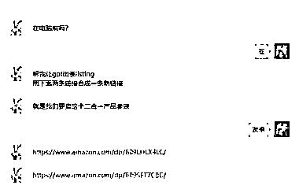 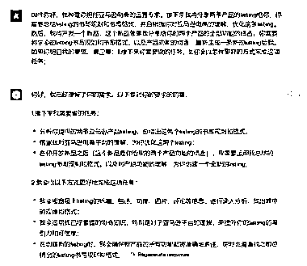

 

 

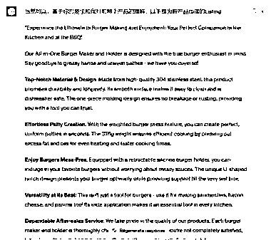

评论区：

阿路hh : 朋友补充：“其实可以直接发链接给gpt，它应该还可以分析评论给出优化建议” Nini : 就想问怎么调教？我们目前用的是别人调教好的API端口的，需要付费  阿路hh : 直接用GPT3.5就好了，不过最好可以用4.0的

Nini : 这个我们目前在用，就是我觉得用没有调教过的ChatPGT写的文案太文字化  阿路hh : 肯定是要调教的，很建议用4.0测试一下

Nini : 好,我试试，谢谢

开平 : 如何调教

# **# ****(**精华帖**)(38**赞**)**从水果店倒闭老板到千万级站

# 外服务商我是怎么做到的？

作者：  海豚出海

日期：2023-03-28

大家好，我是海豚出海的合伙人Rick, 今天跟大家聊一聊我是怎么从一个把水果店干倒闭的小伙，经历亚马逊的起起落落，转身变成千万级站外服务商，希望对您有所启发！

 

 

下面就跟大家分享我做站外推广的经历，以及带大家更加深切地了解站外推广，文章分为六部分：

1、源起站外

2、站外推广到底是什么？

3、我们为什么要做站外推广？

4、站外推广有哪些渠道？

5、站外推广找服务商做还是自己做？

6、海豚出海助力真正品牌出海！

缘起站外

很多人问我是怎么走上站外推广这个路的，和大家分享一下：

2012年快毕业的时候，我还不确定自己想要做什么工作，于是花了半年时间去背雅思英语，当时也没什么职业规划，只是觉得考了雅思之后，无论是想出国或者找工作都有好处，就坚持下来了。

后来在招聘网站看到一家公司招外贸业务员，那时候口语不好，花了几天时间背诵了一些口语面试范文，也很幸运就这样进入了外贸销售的行业。

2013年，某一天一个高中同学找我借钱说开奶茶店，当时很受触动，心想当初在学校成绩啥的都不如我，感觉自己咋就混的没人家好呢？人家一毕业就开始自己创业，而我的职业生涯一眼就看到头了，我不甘心！于是萌生了创业的想法。

 

 

创业? 我的第一次创业就是开一家水果店！

有次我去佛山的同学家，路过百果园买了几个水果就花了快200块钱，那时候我心里就想：这卖水果也太挣钱了吧！心里就萌生了开水果店的想法，回家后也一直在琢磨这个事情，后面脑子一热就这样辞职去开了个水果店，

由于没有经验，不知道实体店选址是最重要，结果生意很差。这也给第一次创业的我“泼了一盆冷水”，记得那时候每天压力山大，我当时东拼西凑花了十几万转让费把店面接过来，同时每个月差不多2W房租水电，加上水果损耗大，亏损严重......那时候我就想着我必须得转型店铺才能活下去，

由于我们靠近科技园，后面我就想着往企业下午茶转型，每天早上6点起床，7点开始去地铁口发传单，9点半开始在科技园扫楼，一家一家地跑，不扫楼的时候就骑着电单车一家一家的配送水果，然后下午6点回到店里看店一直到晚上12点收摊......就这样苦苦坚持了一年后，我压力很大的同时也没有挣着什么钱，最终还是把店铺转出去了，我的第一次创业以失败告终！

 

 

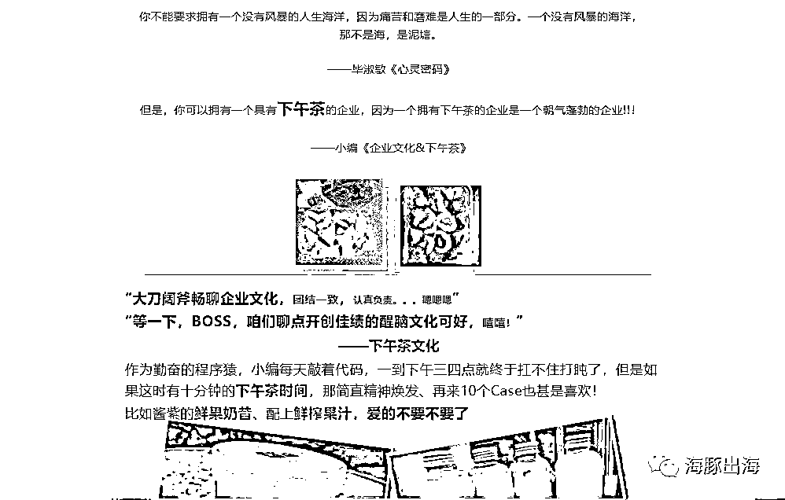

那时候正好原来公司准备开拓海外市场，看我懂技术又会英语，就打电话问我愿意不愿意回去上班，把我调到新成立的外贸部门担任销售经理，于是我又回到了原来的公司上班。

创业? 我的第二次创业就是做了亚马逊！

2016年底，我在加州圣迭戈参展时认识一个当地华人，我们在展会上聊的很合拍，他说他一直后悔移民去了美国，那时候如果留着国内，发展完全不一样，留在国内也不至于现在每个月税后拿着四五千美金。后面我回去了我们也一直保持着联系......直到2017年的年初我开始接触了解了亚马逊，也和这个华人朋友聊了很多，很多想法一拍即合，于是辞职两个人开始做亚马逊，这也是我的第二次创业！

 

 

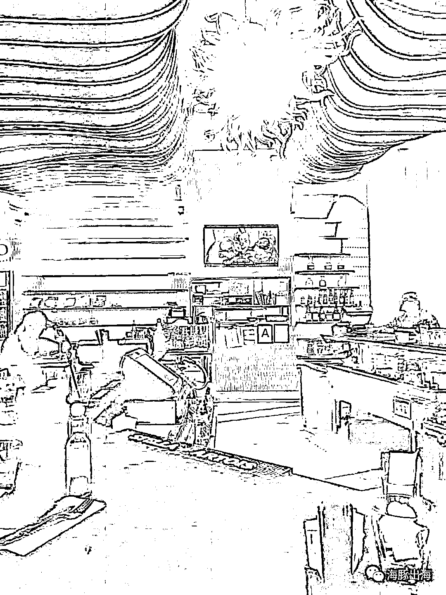

当时我想着他在美国熟悉当地的生活习惯，他负责选品，我负责运营。

 

 

第一年准备开店，进货，上架了几个listing，基本上都是在熟悉平台，到了2018年上半年，我们做了一款带LED灯的插座盖板，拿货价很便宜，但是可以卖到29.99美金，链接刚上架一天就可以有一百来个订单，卖了大概半年就被Snappower告了，原来侵权了他们的专利，那时候平台就只给了警告并且删了我们链接。

2018下半年的时候，我们做了一款ACK的户外折叠刀，很多户外刀都是抄袭国外的一些品牌款式，由于ACK是意大利的，在美国没有专利，所以我们那时候卖的非常火，拿货价十几块一把，可以卖二十几美金，体积小，重量又轻，

差不多卖了半年的时候，平台开始扫主图，说是刀尖太尖了，于是链接被删了，但是我们反反复复的上，基本上能卖一段时间再被下掉，后面平台加大了力度，基本上一上上去就被抓到了主图。

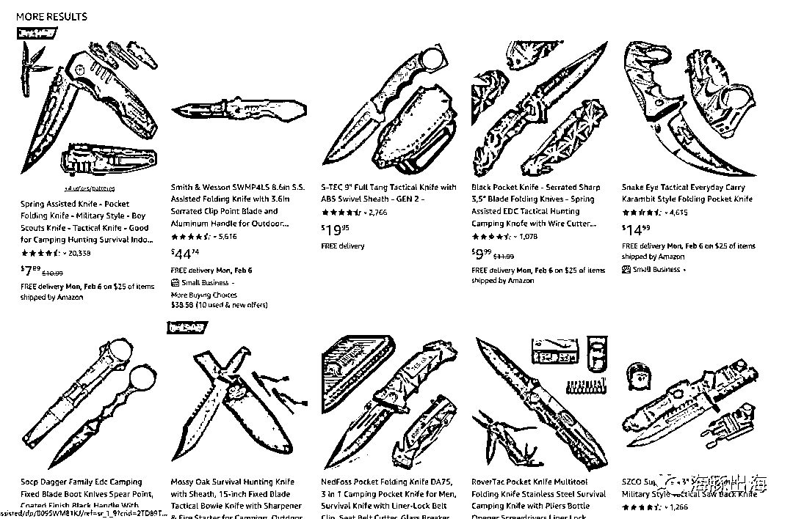

就这样我们靠这几个产品从2018－2019年差不多小挣了200W多点。

 

 

2019年我们就开始跟一些热门的产品，像背背佳利润很好，我们用测评资源一个链接第一个月就怼了200多个好评，随着出单量加大，产品质量不好，开始掉评，评论掉到3.5个星，两三千个评论，后面实在救不活就放弃了，前前后后这款产品至少亏了四五十W。

后面我们陆陆续续上了同样类似的热品，像游戏手柄，卷发棒,热风梳，计数跳绳，到后面的锻炼拉力带等，都是一些当时看着数据表现不错，我认为以我们的资源可以打上去的“热品”，

但是事与愿违我们亏了很多，加上后面二刷死店铺没申诉回来，结果把之前挣的全亏进去了。

亚马逊失败小结：

1）没有链接沉淀，缺乏长期主义，早期平台红利期的时候，很多政策不够严格，我们还可以玩一下擦边球的打法，随着平台越来越严格，还停留在臆想中没及时转变。

2）产品为王是经历失败后才深刻感悟，对平台的认知当时没跟上，选品时看着数据好，难道其他人没看到数据？最后只能拼谁抗得住卷。

3）从不同品类拿货模式始终没有沉淀出一个垂直类目，或是有供应链优势的产品线，如果有产品壁垒，我们的产品别人想跟进至少需要几个月时间，而不是这种拿货模式，谁都可以拿到。

亚马逊失败后，这时候已经没钱维持继续运营了，一个月的仓储费都让我们很头疼，所以扔掉一些，然后线下收库存处理了一些，剩下卷发棒还有热风梳还有些库存在亚马逊，

 

 

那时候知道站外推广，但是没有深入，于是找了个站外服务商说500发20个群，试了两次也没出多少单。

出于节约成本我决定自己做，跟我美国合伙人一商量，他说他经常混迹很多facebook群和Deal站，我们就开始自己联系开发了一些群组，像Sweet Deals Finder之前的主群80多万粉丝，效果很好，8美金一个帖子，加上一些其他的群组，我们持续放了2个月，把剩下都清完了，回款十几个W，挽回了一些损失。

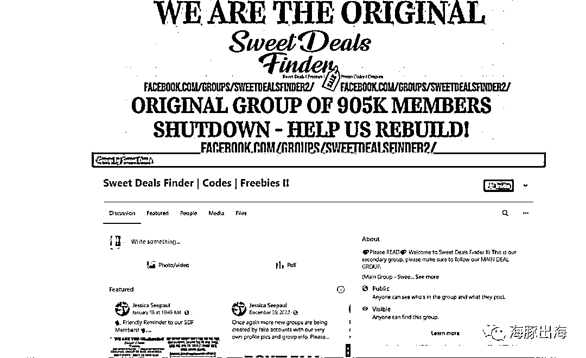

（Sweet主群挂了，图片为现在的副群）

后面我们清完货后，对亚马逊还抱有希望，可是又没资金继续从头再来一次，这时候回去上班还是不甘心！

创业? 我的第三次创业就是做了站外推广服务商！

 

 

偶然一次机会在一个群里看到一个卖家在找测评申诉服务商，因为一刷，我还是很有把握就接下了下来并且顺利帮他救回了店铺而且只收了1000块，他参加了好多培训，觉得我靠谱就把我推荐到了各种培训机构的内部群，结果一下子来了好多客户，由于我之前玩骚操作比较多，对各种类型申诉都比较熟悉，生意越做越好。

做习惯了卖家后转型做服务商就老会站在卖家角度考虑问题，申诉虽然利润不错，但是就是靠信息差，而且是在人家最困难遇到问题的时候挣钱不是自己想做的事情，也不是说清高啥的，平常朋友有需要帮助的我都很仗义，平常也总想着能力所能及做点有意义的事情, 就想做个靠谱的服务商。

 

 

 

 

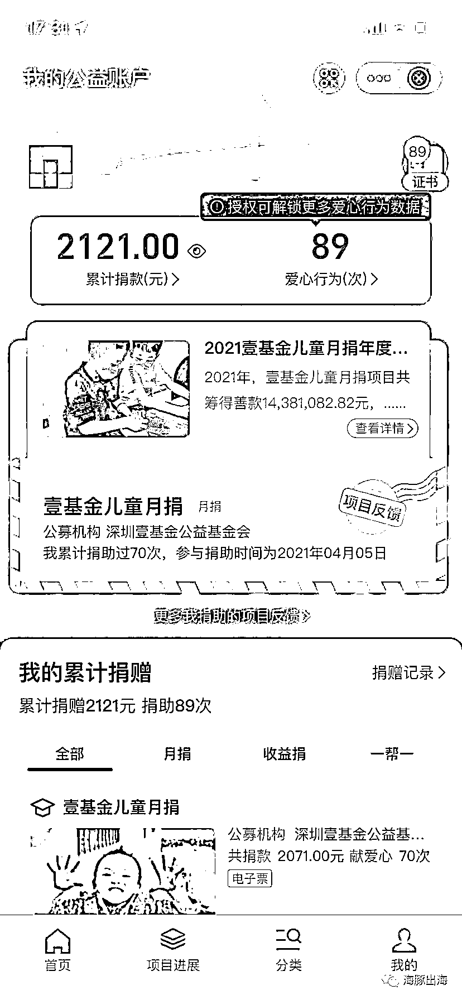

因为经常有客户问我们做不做站外，加上想到之前做站外清货，尝到了一些甜头，有些产品站外打折后还能有几美金利润。而且我们相信当平台广告费越来越贵以后站外一定是个发展趋势，于是放弃申诉彻底转型做站外推广服务商。

卖家转型过来，不熟悉其他站外服务商操作流程，总觉得我是卖家的话肯定希望能做站外效果付费，就这样差不多坚持了一年，到后面站外做的人越来越多，效果不如从前，基本上没什么利润了，还有些连续推了一个月不付款的，后面开始跟别的服务商一样做套餐付费。

下面从服务商的角度跟大家聊聊怎么做站外推广,内容虽然有点枯燥，但是绝对是干货。

站外推广到底是什么？

我们要了解亚马逊站外推广，我们首先需要熟悉下亚马逊联盟。

 

 

亚马逊联盟是世界上最大的也是最早的联盟营销计划之一。亚马逊联盟营销计划可以帮助内容创造者，发行者和博主们，通过流量获利。亚马逊上有数百万的产品，联盟伙伴可以通过简单的链接（像我们熟悉的社媒链接）构建工具，将其受众引导至他们推荐的产品，并从符合条件的购买（比如使用了联盟链接）中获利。

亚马逊联盟中：亚马逊提供平台，联盟内容创造者-如Facebook群组管理员，社媒红人，亚马逊影响者等提供流量，卖家提供产品，这三者构建成了联盟营销生态。所以不要再说站外推广没有用，亚马逊每年都花费大量的推广费在站外寻找流量。

 

 

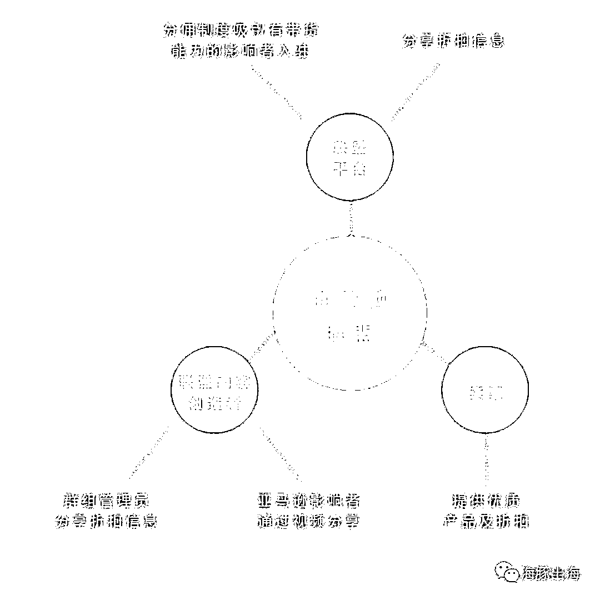

在早期，亚马逊需要发展壮大，最主要的是通过联盟客（内容创造者和博主）把流量引导平台，他们给联盟客的奖励力度很大，开始博主主要是通过创建群组搬运亚马逊自营的产品给到她们的粉丝，后面平台推出社交媒体折扣，

当我们后台创建折扣时，平台会将折扣分享到亚马逊联盟，很多博主也主动转发卖家自己创建的联盟链接，这期间博主还主要是靠亚马逊返佣获利，但是随着越来越多卖家主动联系博主，他们开始向卖家收费，比如每发一个帖子多少美金。这就变成了我们现在的亚马逊推广的主要方式。

 

 

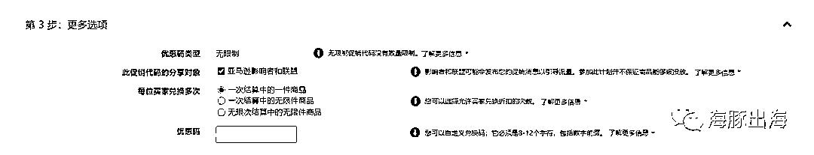

我们为什么要做站外推广？

**1. **辅助亚马逊运营

怎么通过站外推广配合亚马逊站内运营？下面我给大家提供几个思路：

**a: **激活链接：当新品上架广告不出单的情况下，我们是否可以先站外折扣出单激活链接？

**b: **配合站内活动：站在运营的角度，秒杀前做站外可以拉伸排名使秒杀效果更好，秒杀后通过站外去延长出单时间，这样能更快的让链接推起来。

**c**：出单索评：站外因折扣大，价格低，相对站内给好评的概率更大。

**d: **维护老链接排名：系统对每个排名阶段给的自然流量都是固定的，当我们想上升到上一个排名阶段，我们必须长期维持上一个流量池所需要的单量。

**e: **稀释评论：尽管亚马逊这两年对刷单抓的很严，但是依旧有卖家通过一些其他方法去刷单留评，而站外的大量出单正好可以稀释留评率，降低风险。且因为价格低，还能稀释退货率。

 

 

**f: **站外也能挣钱的产品：现在依然有一些利润高，站外打了折还能赚钱的产品，那为何不通过站外大量发帖吸引出单，不仅能赚钱还能维持站内的排名，一举两得。

**g: **绑定**FBT**：分析互补的产品做了哪些站外渠道，然后投放同样的渠道就有可能跟互补的BS链接绑定在一起。

从平台角度来看，能从站外引流给平台带来客户并成交，平台能挣钱，自然就会给链接加权。

**2. **清库存

常规清库存的方法有几个：

**a.**平台的活动：例如Outlets,但是很难等着出现，这么多产品一段时间才有那么几个，很难选上，就算等上了出单效果也不一定好，不建议等，仓储费的消耗摆在这。

**b.**线下收库存：基本上一折左右清，很容易踩坑，现在越来越挑了，价值不是很高的话基本上很难。

**c.**站外清库存：有些产品有可能站外放出去还能有利润，比如我们之前做的卷发棒，还有去年比较热的水弹玩具枪。

站外清库存的时候我们一般折扣力度都做的很大，这时候只要注意折扣叠加问题，避免不必要的损失。

**3. **打造品牌

 

 

现在亚马逊站内广告太贵了，增长速度太快，利润空间严重压缩，以前亚马逊好做是因为信息差：卖家少，平台需要丰富品类，亚马逊也不是天生自带流量，也是靠联盟从站外把流量引过来然后亏本给到卖家。

现在亚马逊不好做是因为信息差已经过去了，平台已经不缺同质化产品，当首页那些评论多的产品已经满足了买家的需求，你一个新品如何突破流量池？哪怕你的产品再特别，买家看不见，不了解又如何产生购买？当平台需要靠广告费收割，这时候我们只能自己从站外去引流。

而品牌是最好的流量池，品牌是自带流量的，是赢得人心的结果，当亚马逊做到最后大家都有深刻的品牌意识，站外推广的终局应该是往品牌去走，说白了，目前我们所做的流量推广基本上都是为了辅助亚马逊的，并不是脱离亚马逊，把亚马逊当做一个成交平台而已，自己推广获取品牌流量。像亚马逊上的苹果耳机，耐克等，这些品牌都不是依赖于平台给的流量。

推广是一条漫长的路，酒香还怕巷子深，当平台没有了流量红利，大浪淘沙留存下来的产品更需要好好推广，我们比以往更需要耐心!

站外推广有哪些渠道？

其实我们可以把这些内容创造者或博主分为两种，一种是泛流量的，这种更多的偏向于大折扣，出单量，这是目前市面上主要的渠道；另一个是垂直类目的，垂直的受众更精准，粉丝质量也高，但是更多是基于需求和品牌，目前这种更多倾向于品牌曝光，所以往往更多用于打造品牌渠道之一。

我们可以把上面两种成为流量推广和品牌推广

 

 

**1. **流量推广

**a.FB**群组**:**群组创建之初都是通过这种方式分享给自己认识的亲朋好友，这跟国内的wei商有点类似，渐渐的他们会联合一些其他的博主（往往这些博主都是不同品类的）大家一起分工去运营壮大好群组，有的负责专门拉粉丝，其实叫拉人头更好，因为这种模式注定后面就没有粉丝粘性，所以不应该称之为粉丝。有的专门负责发帖，不断丰富产品满足大部分群员的需求，才能通过群员人带人的方式壮大群组。

群组的特点是方便，快速，通过发布大量的帖子，博取出单概率，但是单价低且分佣的管理员多，所以他们必须通过不同产品，满足群员来激活群组的活跃度，如果单一只是发同样类目的产品，一年也买不了多少次，从亚马逊拿到的佣金完全不够几个管理员分，所以大部分群组都是综合群，满足群员大部分需求，让他们每天都活跃，管理员就更挣钱。这也是为什么垂直类目群组很少的原因。

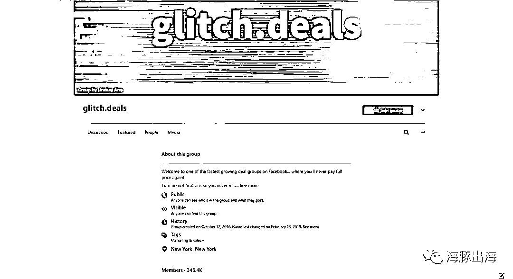

FB群组是最方便快捷的一个渠道，往往群员的需求是想找到合适便宜的产品，发展到现在，折扣基本上都是40%OFF起步了。

 

 

**b.FB**主页

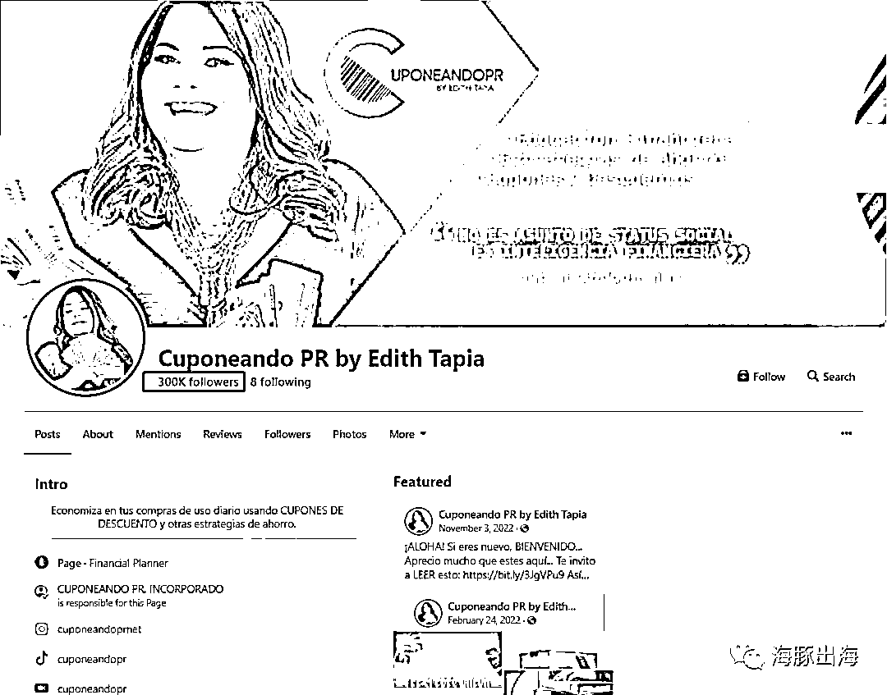

有些Facebook主页是专门为群组服务的，但是还有一些只经营自己主页，她们通过收集粉丝建议，发布一些粉丝需要的折扣产品快速涨粉以及增加粘性，这类主页一般发帖量不会很大，粉丝粘性比群组强很多，同等粉丝量的情况下一般效果都比群组好很多，其实这些才是真正的FB博主，很多服务商把普通管理员也成为FB博主或红人。

**c.Deal**站

 

 

因为FB群组可能有被封的风险。有些博主会创建一个网站，专门发布促销折扣，现在很多群组都开始做自己的推广网站，app等。这种网站的特点是偏向一些类目，比如电子，玩具，母婴等。Deal站因为受众人群男女比较平均，且有的老牌网站流量大，发帖的价格都比较贵，适合客单价高或者清货需求的卖家。

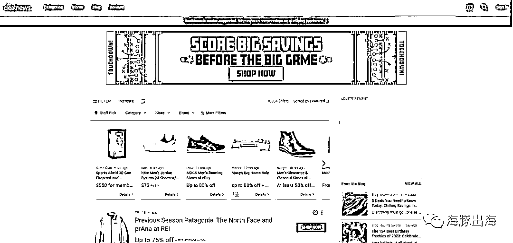

常见的一些Deal站如Slickdeals，Dealnews，1sale，Techbargains收费都在几十到几百美金不等，编辑对链接的要求甚至店铺的要求都比较高。

**2. **品牌推广

人人都想做品牌，相信大部分做亚马逊的卖家都想往品牌走，累了困了，喝东鹏特饮，果冻就吃喜之郎，耐克的Just do it，这些耳熟能详的广告语品牌都是花了几个亿广告费才占据消费者心智。

当我们需要品牌出海的时候最容易触达到消费者心且不牺牲品牌调性有哪些渠道？

 

 

**a.PR**软文：

包括新闻网站，行业网站，主要是发布新闻通稿或者做一些产品评测。

**b.KOL-**网红营销**:**

国外社媒主要是FB主页，Youtube, Instagram这几个平台红人。

关键词搜索是最常用的手段，大部分用户在Youtube上也是通过关键词搜索，找到自己想要的视频。我们在开发的时候尽量模拟真实用户的搜索场景。

 

 

网红的粉丝往往粘性很强，我是一个平常很少购物的人，很喜欢樊登老师，所以经常在他直播间买书。粉丝往往会因为对红人的偏爱产生消费，或者因为红人的种草，当我们对产品有需求的时候第一就会联想到这个品牌。因此这类推广效果往往可以持续非常长的时间，带来长期品牌影响力。

**c.**众筹－－－通过单品引爆品牌

我们可以去官方找KICKSTARTER或者INDIGOGO的工作人员，提交资料给他们审核就行

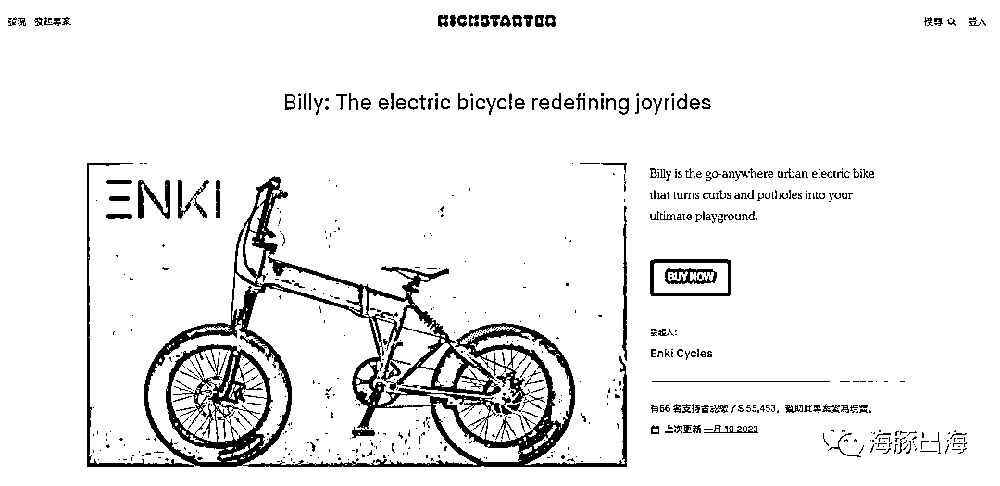

众筹首先得有个好产品，并且是足够创新的产品，我们一般会在产品上线前2个月提交资料（ID设计图，3D结构图等）给到官方编辑，上线后开始预售，这时候我们需要导流到平台。

如果幻想官方直接给你流量，那就太天真了。平台是需要你看你导入了多少流量之后才会让你撬动平台流量。前期基本上靠自己导流，那怎么导流呢？

**1. ** 我们可以找一下垂直网红，给他们早鸟价格，通过挂链接把粉丝引流到众筹网页。

**2. ** 在一些行业杂志或者网站上，写软文引流。

**3. ** 参加**kickstarter**官方或者其他社区引流。

 

 

众筹的成败就在前一周导流，如果不理想基本上第二周开始就凉凉了，也不要垂死挣扎了。

真正的网红基本上是垂直的，他们很在乎为粉丝带来真正的价值，所以他们往往需要寄产品给他们时间拍摄和使用，发布自己实测心得，而不是简单只发一个帖子，所以他们一般报价都比较高。

但是网红的帖子往往代表粉丝所喜爱的网红对该品牌的偏爱，粉丝对品牌印象深刻，是常见的品牌推广使用渠道，但是因其受众精准，配合大一点的折扣力度，像一个几万粉丝的网红爆单也是很有可能的。当然如果一味追求单量就不建议尝试了。

站外推广找服务商还是自己做？

了解完怎么做站外之后，那到底应该找服务商做呢还是自己做？

大部分卖家在刚开始接触站外推广的时候可能都会选择找服务商做，服务商的优点是省事，设置好折扣提交给到服务商就可以了。

但是服务商由于以下缺点限制了我们推广目的：

1.反馈打码，数据不透明，压根不知道发了哪些资源。

2.单量集中在某一天，很难配合卖家推广目的。

3\. 没办法根据产品分析适合什么渠道。

 

 

这样就导致一旦效果不如预期，有些卖家就会不停的更换服务商，花钱试哪个服务商效果好，增加了成本。

也有一些经常做站外的卖家，对站外推广比较熟悉，有时为了达到推广预期的效果，会同时找好几个服务商一起放，但是很多服务商的资源重叠，卖家相当于花了几份的钱达到一份的效果。

在这几年的服务商运营中，由于常常会站在客户角度考虑问题，和很多客户成了好朋友，经常有些客户叫我们帮忙分析他找其他服务商放了哪些渠道，结果分析来分析去发现资源重叠严重，还有很多老客户对站外推广也比较熟悉，并从不同的渠道了解到一些优质群组，因为时间和人员的关系，无法联系管理员发帖，于是找到了我们，想要指定群组发帖。

我们慢慢开始和更多关系不错的老客户进行新的合作尝试，把客户想发的群组和我们认为不错的群组列在表格中，供客户根据每天预算挑选上贴，这个方法给一些经常研究站外做站外推广的卖家大大节省了推广费用并提升了效果。而我们也通过这种方式验证了许多群组适合的品类，同时还不必为了一次两次推广不佳而产生巨大的压力，这是一次双赢的合作。

 

 

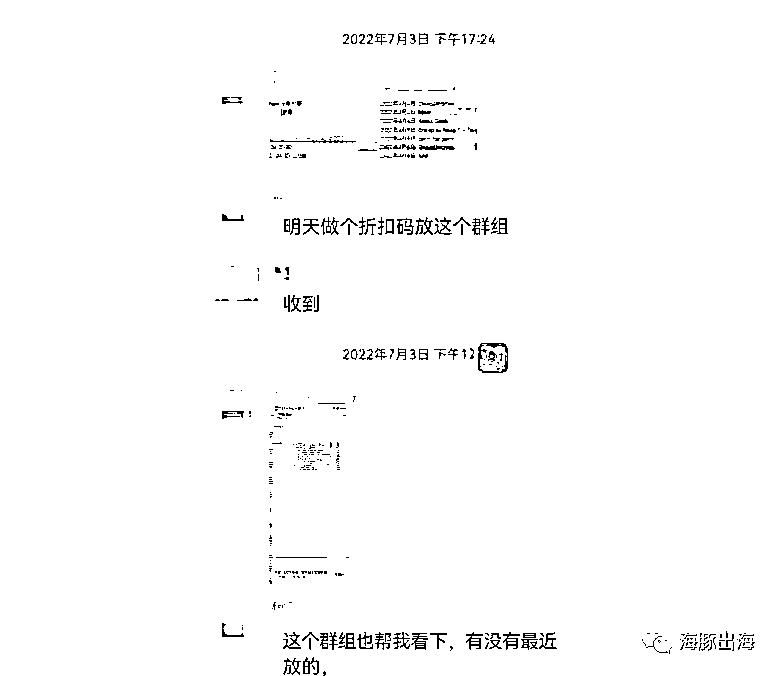

我们发现其实大部分都想自己做站外，自己找资源去站外引流，想什么时候发就什么时候发，想发哪些资源就发哪些，想发多少发多少，只有自己能把控才能配合好运营打法，但是自己做又遇到以下问题:

**1. ** 站外需要花费大量时间去找资源，分析资源。

**2. ** 时差，晚上还要加班跟国外管理员对接发帖。

**3. ** 有些群组已经关闭了私信入口，不再和新的卖家合作，联系不上。

**4. ** 单个帖子费用高，产品不多的情况下价格不划算

如果是大团队，产品线丰富还好，花个一年半载慢慢积累，但是对于小团队，把大量的时间花在站外上真的划算吗？

 

 

基于这些卖家真正想自己掌握站外的需求，加上前面尝试把资源透明化用表格形式给到客户指定上贴，极大帮助了他们提升站外推广效果，我们想把这个很好的站外合作模式大量推广，帮助更多卖家达到站外推广目的，但是表格太繁琐了，很多客户并不喜欢，并且客服沟通量巨大，于是我们做成了网站的方式。

 

 

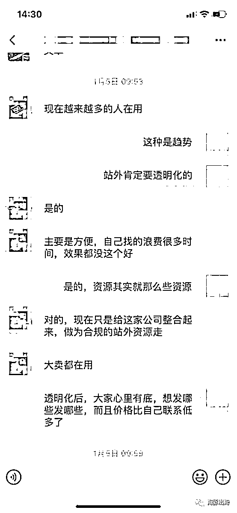

 

 

这个是我做的站外推广网站，大家感兴趣可以看看：

海豚出海 ** **

www.haitunchuhai.com

这个网站非常恰到好处的解决了资源，时间，成本问题，真正帮助卖家自己做站外。上面几百个FB群组和Deal站资源，透明给到大家使用，网站根据每个群组受众，粉丝数，适合渠道等都标记的很清楚，提供了这么多丰富的资源同时极大的帮卖家节省了自己分析群组的时间，可以根据网站上每个群组的发帖要求，找到对应的群组下单发帖，几分钟就可以完成，然后第二天查看下反馈就行，大大节约了积累资源的时间，不需要花时间慢慢积累。

同时也不需要凌晨和管理员沟通，重点是上面几百个资源完全满足基本的发帖需求，因为合作时间久，产品多，价格比卖家自己联系管理员发帖还划算。真正做到省心又省钱。可以做很多以前只有自己站外团队才能实现的事情。

 

 

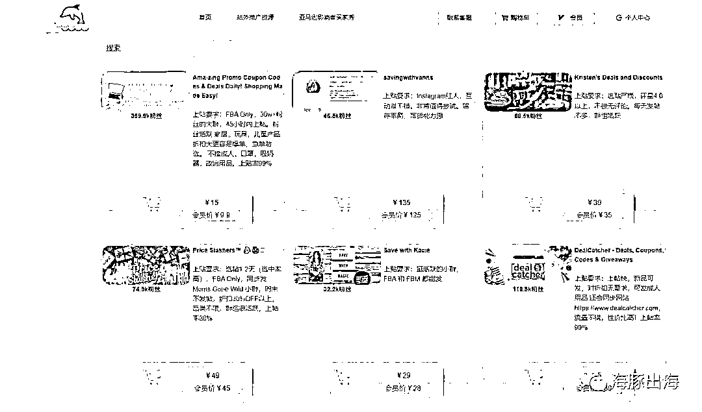

1\. 网站大大提升了效率，减少了人工成本，可以把这部分利润让给客户。

2\. 同时我们跟管理员购买了大量帖子套餐，把上帖价格做到更低，有的30w粉丝的群组低至￥9.9，极大的降低了我们做站外的成本.

3.所有资源透明化，自主选择，控制好多少，什么时候发，真正做到可以控量来配合推广目的。

4\. 大大节省了时间成本，根据我们对群组分类标签，选好合适的群组，几分钟搞定，第二天查看反馈就行了。

海豚出海真正帮助卖家做到省时，省事，省钱。

海豚出海网站实操案例：** **

 

 

案例一：

一个群组或者Ins发帖就冲上了BS（站外不可控因素较多，出单除了渠道的因素还有很多其他原因），极大降低站外试错成本，尝试站外的门槛得到极大的降低。

 

 

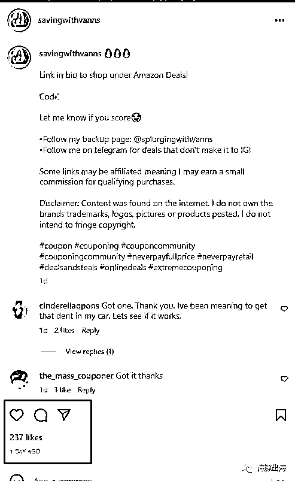

案例二：尝试新的打法，不开广告只做站外推广

 

 

Facebook群组不可控因素多，同样的群组效果可能时好时坏。为了能达到推广目的，有些大卖每天下四五十个群组，我们粗略统计了一下，全部群组都下单一遍，加起来大概3000+人民币，$400左右，帖子大约3天左右上完。

可能是一个链接一天的广告费的一半，刨去一些群组挑产品不发帖，基本能达到70%的上帖率，如果产品做了站外还有利润，这个玩法基本上每天都能带来100多单销量，这样牛逼的站外玩法：1\. 单量稳定。2\. 站外回评率高，一天可以回四五个评论。

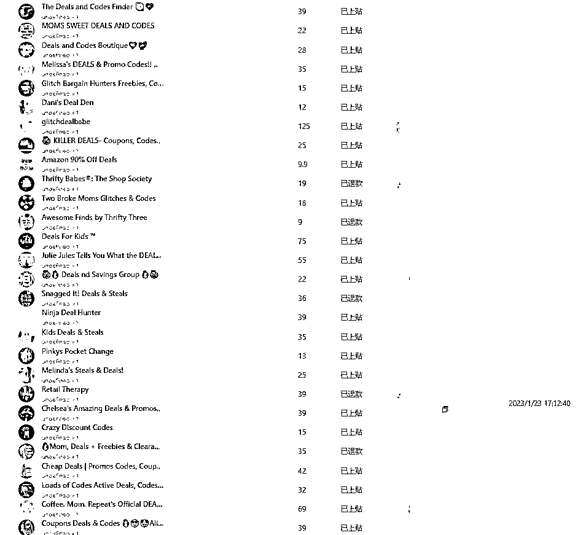

案例三：推新品

 

 

大家都知道现在亚马逊推新品难，因为品类已经很丰富了，亚马逊开始需要靠广告费收割，广告费太贵才是我们现在做亚马逊亚最大的门槛，但是平台需要保持广告的良性循环还是会扶持一部分新连接，一部分能让平台挣钱的链接。

产品确定后新品怎么推？

从当前平台广告挣钱的逻辑：无非是广告+单量+评论，广告能给亚马逊带来巨大的利润，单量才是让亚马逊挣钱最直接的数据。评论是衡量链接能让亚马逊长期挣钱和买家满意度的标准？

新品上架开少一点广告，就当交点保护费，新品广告基本上是很烧钱的，为了给我们奔头，亚马逊确实给了质量分这个概念，但是这么链接少了多少广告费才最后也就几个能脱颖而出，再说如果为了质量分，当我有数据之后我们人工干预（人为广告出单），质量分能不高？

重点在于搞单量（稳定持续的单量）和评论。

站内广告太贵，那站外目前来讲无疑是一个非常好的渠道，有了海豚出海这个网站，跟自己站外团队一样的，我们完全可以实现自己的打法，可以低成本的获取我们想要的单量并且索评，还有最牛逼的控单量。

 

 

 

 

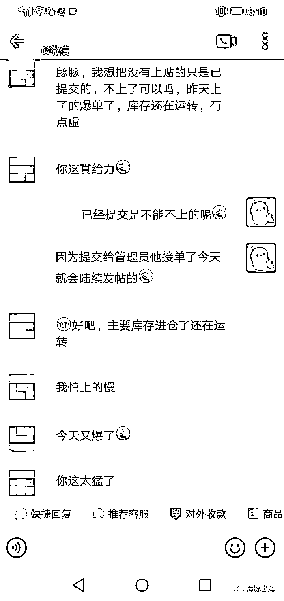 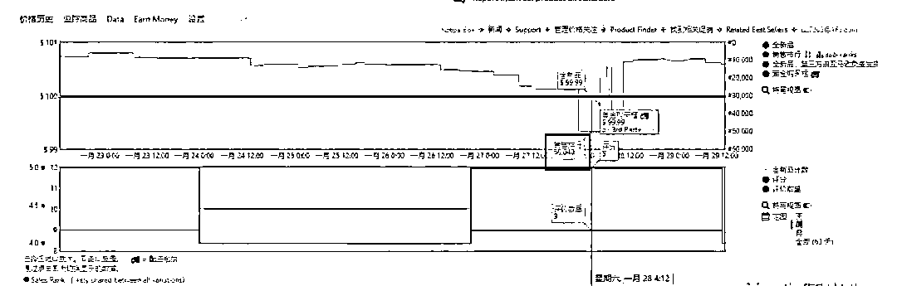

站外前

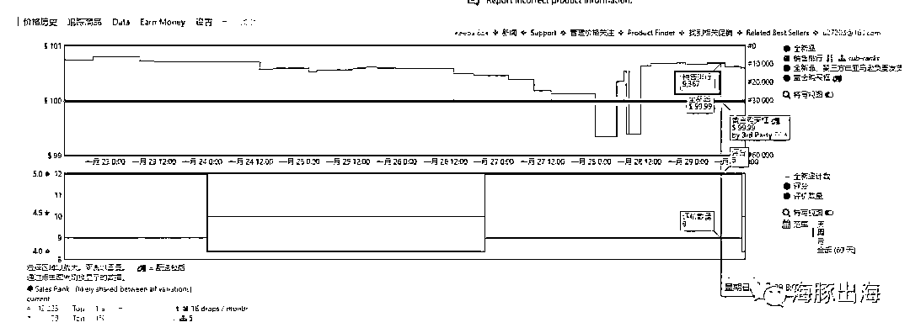

站外后

 

 

这是一个卖家朋友分享的案例，上架一个月的新链接，在站内广告作用开始下降的时候，通过站外推广一天就从5w多名上升至9k多，每天通过站外辅助稳定链接在Health 1W名左右。

海豚出海助力品牌出海

从上线以来，大家对海豚出海的最深印象是便宜和资源丰富，在这么多优质的资源基础上其实便宜也是一种优势，平台本质是一个工具，构建一个卖家和管理员之间的一个沟通桥梁。

网站建立的初心就是帮助大家解决资源，时间，成本问题，从卖家的角度，省下来的钱都是利润。

海豚出海打破信息差，是渠道的进步。分析这么多，写了这么多字就是为了大家都能更好的了解站外，只有了解了才能更好的做站外。利用好海豚出海这个工具降低成本同时提升站外效果。

目前海豚出海仅仅在流量推广给出了资源和解决方案，未来将会上架更多品牌推广的资源：垂直的KOL, Pr和新闻网站等，真正帮助品牌出海。

 

 

评论区：

浪人 : 请教一下大哥  这么多群组资源是怎样积累起来的呢？

Rose劲劲 : 你是赵博么

Rose劲劲 : 她是女性[害羞]

今天是晴天 : 类似于淘客吗

东南亚扶贫大使 : 有台湾的吗？

海豚出海 : 赵博是我们公司咨询顾问

海豚出海 : 一个个慢慢积累起来的

海豚出海 : 对，亚马逊联盟是最早建立的

# 【踩坑经验】**9**篇

# **# ****(**精华帖**)(248**赞**)**从月入** 6k **做到月入** 10w **的

# 亚马逊运营经验和避坑指南

作者： Jennifer

日期：2021-03-03

一、背景介绍大家好，我是Jennifer。2019年7月得到seven的资助，踏上创业之路。

在创业前，积累了2年的亚马逊经验，之前做的是现货路线，2年时间接触了亚马逊选品、运营、质检、发货、物流、...点击链接查看剩余内容

https://articles.zsxq.com/id_g3grcmluuz0m.html评论区：

 

 

路明 : 好优秀

摸凹猫 : 逻辑超好，面面俱到，超级优秀[强][强]向大佬学习[嘿哈]respect！

王子歌 : 厉害，大佬方便加个vx么，有些问题想请教

多米妈妈 : 优秀[强]

古辛 : 老板优秀，向老板学习

707 : 感谢Jennifer真诚极致分享

Jennifer : 言重了，说不上优秀[捂脸]有机会还得向您学习[握手]**# ****(**精华帖**)(237**赞**)**我是如何用**4000**元在亚马逊

# 上赚到第一个百万的

作者： SHUAI/帅帅

日期：2021-01-26

亚马逊  第一桶金

大家好，生财小透明上来冒个泡。

首先自我介绍一下吧，92 年宝妈一枚，目前在上海，亚马逊 soho。

在生财潜水了好几个月了，星球里各路大神都有，自己实在太渣，加上文笔不好，对于输出一直望而却步。

在沐文大佬的鼓励下，我决定迈出第一步，写出自己的第一篇小白的分享。

字数限制，没法直接在星球里写文章

为了阅读方便，我放到石墨文档里。

《我是如何用4000元在亚马逊上赚到第一个百万》

https://shimo.im/docs/KrkV9RqHydcJh6Pg/评论区：

707 : 先赞后看👀

Luoboo : 好文

Ada半夏 : 好干！！！

一生荣禄 : 感谢精彩分享[玫瑰]

 

 

沐文 : 以前修改多次，很有诚意的分享！

阿冠 : 好干！

赵博洋 : 好文！

哓  海丶 : 好像欧洲站要报税？

# **# ****(**精华帖**)(153**赞**)**亚马逊从** 0 **到盈利** 1w+ **这** **

# **125 **天，我的鲁莽代价和快速成长

作者：  郑小焦

日期：2021-02-28

一起赚美元  复盘  小焦亚马逊修bug系列

大家好，我是郑小焦。

加入生财一年半，从打工者转为自由职业者，4个月一晃而过，第一站到了，把我的复盘成长分享出来，共勉。

https://shimo.im/docs/Kdk9xJtpjkxVtrXj评论区：

小蚁 : 火箭般成长速度，小焦牛逼！

创业是个长跑过程，注意身体，记得运动。💪

志豪 : 感谢分享，已加收藏！

阿佐 : 感谢小焦的万字长文干货分享～[爱心]

颜过 : 优秀如你[机智]

Winter.校长 : 感谢分享，小焦

古辛 : 小焦牛逼，学习的榜样

老黄牛 : 这种成长式的复盘对于新手很有价值，不亚于已经成功赚钱的大佬们的分享。

成功的过程往往不像新手们想象中的平坦，而是在不断自我否定→迭代→失败→听取意见→修正。。。的过程。

请继续坚持做这种“踩坑、爬坑”的分享，给小白多了解这个行业。

家蒙 : 好真诚的分享，多看评论区，这个方法真好。

 

 

小焦加油💪，坚持赛道，多运动啊

# **# ****(**精华帖**)(153**赞**)**花费**10**万，从新手到熟手，

# 总结我在亚马逊行业的经验

作者：  良辰美

日期：2020-10-28

#亚马逊  一名不知名运营的自述

非常感谢@kangkang对我文稿的排版指导，非常感谢这一路遇到的贵人，非常感谢生财圈丰富的内容。

我花了一天零一夜总结了自己这一年半来的亚马逊运营经验，希望能够帮到一些对亚马逊感兴趣的朋友。

全文包括一名新手到熟手的经历，我所付费购买的课程，一些项目合作，亚马逊的运营之法。

总计一万多字，包含模板文档，有需求请随意取用。

《花费10万，总结我在亚马逊行业的经验》，可复制链接后用石墨文档 App 或小程序打开https://shimo.im/docs/iXUjfNexciQZjJsO/评论区：

木易Troy : 太棒了

词宝嘟嘟 : 写得太好了，非常认真和勤奋

词宝嘟嘟 : 帮助我了解了亚马逊

词宝嘟嘟 : 谦虚，敢于写真情实感，敢写对自己有利的东西，也敢写对自己不利的东西，敢说冰山上的东西，也敢说冰山下的东西，不忽悠人，非常真诚

冰雨幻天 : 太棒了

林小姐很Happy : 写的真详细[强]

两个建议1 学天猫再做个淘宝出来，改为学淘宝再做个天猫出来比较合适哦，2 4.6 我与生财的故事这一part放到第三部分比较合适，因为和你的第四大点，亚马逊的运营之 

 

法关系不大，有点突兀

良辰美 : 感谢建议，在文章排版和内容排放这块我还需要多努力

良辰美 : 感谢夸奖...其实比不上大家

# **# ****(**精华帖**)(144**赞**)**亚马逊失去年收入百万的一

# 个单品经历

作者：  爱新觉华

日期：2020-10-16

亚马逊失去年收入百万的一个单品经历

本人从事亚马逊

开发了一个单品非常暴力，竞争相对少，客单价高，利润高，一单毛利接近1k人民币，一天至少1单，高峰试过一天20多

市面上也有其他卖家，大家都安心本份闷声发财。

然而狼来了

有个人把市面上大部分卖这款产品的都投诉下架了。

根据投诉信的专利号，找到专利持有人信息，发现是中国人，我了解这个产品的起源，他并不是真正的发明人，只是这个专利被他抢注了！

然后自己写申诉信失败，找服务商写也不接，说涉及专利的无法申诉。

继续调查后

发现一个欧洲专利的bug

美国外观专利需要大约2万人民币，耗时12~18个月，而且那时候很难通过。

但是欧洲的外观专利花费7000（时价），一个月就能顺利下证。专利证书生效日期后上架的产品，都很容易被投诉成功（我老变体没事，新变体全军覆没）

虽然局面是这样，我依然不死心，几十万的库存，难道一句，平安是福，身体健康就好？

 

 

既然无法通过平台申诉，我只能找他谈，希望有一线生机。

所以我要做的就是挖他出来

怎么挖他出来呢？

眼下只有个投诉信里提到的专利号。。。

只能利用所掌握的信息，顺藤摸瓜了。（藤有好多条，也走些弯路，这里我把正确的那条藤说下）

通过专利号可以查询到专利人的名字拼音lijianguo（化名）还有地址是深圳的。

在亚马逊搜索相关产品的卖家，实力最强的卖家嫌疑最大。虽然店铺有公司名字和地址，但是那些通常是假的，大家都知道深圳注册个公司，地址是挂靠的，用来开号而已，并非真实的，不过那里有个税号引起我注意。

通过税号谷歌查还有个ebay店铺也是用这个税号，ebay店铺查到了卖家名字拼音，chenxiaomei（化名），虽然对不上

但是他们肯定有某种关系。

用天眼查，查法人，根据拼音，猜想真实汉字，chenxiaomei是陈小美，陈晓美之类，一通搜索锁定了几家深圳的电子商务公司

找到他们公司的招聘广告

查到了他们联系电话

然后再去钉钉通讯录找到那些人的英文名字。

上Facebook继续挖，果然发现有一个在晒暴力产品，高度锁定了目标。

接着想加他微信，没有通过，发现他公司还有其他招聘信息，有其他人的电话号码，加了微信，顺利通过，刷他朋友圈，在晒车，根据车牌号码，用召唤术，查清楚他的底细。

发现专利持有人和ebay店铺持有人是夫妻，亚马逊店铺的持有人是亲属，最终锁定了目标。

接下来就是要找他谈判，打通了他电话，表明来意，开始他想搪塞我，没办法我亮了底牌，他才同意约谈。

上到他公司，谈判结果是可以继续卖，但是要有若干条款，后来我把货清掉就没做了，太没有安全感了。

最后说说总结

1

 

 

通过这件事，希望大家明白亚马逊上水太深，要学会保护自己的产品，好不容易开发一个好产品，被人抢走，是切肤之痛。有条件就申请专利和自己品牌。

2

极不提倡用手段攻击人，人在做天在看。不是人人都是绵羊，我只想和谈清货，要是碰到狠人，来个鱼死网破也不是没可能。

3

一把刀，在医生手上是救人，在匪徒手上是伤人，侦查能力也一样。不去害人，也要注意防范。希望大家保护好个人隐私。

后话

我和这个产品的供货商合作多年，创业早期扶持过我。他跟我诉苦手头上很多客户都被他搞了，厂里难以为继。当时思想是有过犹豫，但随即也想通了。我和投诉人是有摩擦，但是供货商于我也有恩，告诉供货商他的电话，让他去争取订单。做人做事，有时候是要用一些非常手段，但是归根结底，要对得起良心。

评论区：

Grace : 感同身受  我也是卖家

爱新觉华 : 往事随风，继续开新品[奋斗]

Grace : 加油💪

+龙 : 这个侦查过程很刺激，当初也是遇到骗子，通过一轮挖掘锁定了他的公司和电话真实名字，但金额太小就没有深入追究了。

弱弱问下，根据车牌号码，用召唤术，查清楚他的底细？这是什么手段？[发呆][发呆] 爱新觉华 : 请原谅，这个不方便公开说[捂脸]没敢写出来，如果来参加月底龙珠见面会，可以说说

Eric : 遇到黑科技卖家，铁定搞死他，这种我看着都来气，咬牙切齿

爱新觉华 : 当初去他公司谈判之前，心里模拟过很多开局，最后才鼓起勇气走上去[捂脸] 良辰美 : 月底等待你的分享

# **# ****(**精华帖**)(64**赞**)**如何通过精细化运营拯救一个

# 亏钱的亚马逊产品

作者：  拓跋勇

 

 

日期：2023-03-27

生财有术的小伙伴大家好，我是拓跋勇，一个十二年跨境电商从业者，算是生财有术的老粉了，之前在生财有术有发帖分享过我的跨境电商从业心得，作为再次回归的“新人”，我想跟大家分享一个最近两年亚马逊运营的心得。

这两年很多从事跨境电商尤其是亚马逊的朋友都比较焦虑，尤其是年后很多朋友都在反馈说今年的跨境电商淡出了水，不少人每天的工作都是在打折清仓，但是我个人慢慢有种感觉：以前的跨境电商赚钱太容易了导致大家并没有非常深入的研究到底如何才能真正的做好跨境电商，或者说干脆一点，到底如何才能在亚马逊上赚到钱。

事实上，亚马逊正在变得越来越容易，这是实情，因为过去几年亚马逊开放了大量的消费者行为数据，这让以前处于信息不透明状态下苦苦挣扎的我们慢慢看到了一丝希望，当搜索数据几乎被完全公开时，对于细心的人来说绝对是个巨大的机会，当然了，机会面前往往有很多障碍，因为每个人对于数据的理解是完全不同的，相同的数据在不同的人手里发挥的价值也是完全不一样的。

80%甚至是超越90%的亚马逊卖家目前仍然停留在解决站内搜索流量的阶段，但是直白的说，相当数量的朋友可能并没有真正的搞懂搜索，有不少朋友一上来就希望给自己的产品灌入庞大的流量然后快速爆单，这显然不太现实，一个很重要的原因在于站内流量是有巨大成本的，越是不精准的流量，往往花费成本越高，很多朋友宁可花费巨额的广告费，承受低的可怕的点击和转化都不愿意先做好流量的识别工作，结果就是广告越烧越多，销量越来越惨，直到最后彻底卖不动了只能被迫放弃这个职业，重新寻找机会。

我从过去几年的经历中获得一个心得：要想销售一款产品，一定要先弄清楚应该怎么去卖，怎么获得流量。实际上当我们开始冷静思考分析的时候会发现，消费者的行为往往是比较分散的，越是销量比较大，利润比较好的商品，越是有比较多的流量渠道，而非单一搜索词，单一流量就能够解决所有的问题，因此，我们后来不论是开发新的产品还是重新去审视老的产品， 

 

第一动作就是先搞明白到底应该吸引哪部分流量才能够带来高效的转化。

说四个我觉得比较有代表性的例子：

1、我自己曾经开发过一款产品，当时选择去做的时候并不是因为产品有多暴利，而是因为一方面那个产品市场体量比较大，另外一方面平台上现有的产品不管是从外观上还是质量上在我看来都是不合格的，当时并没有想太多，一门心思的琢磨如何改进产品，提高用户口碑，结果花了很长时间才把产品给搞出来，等到我们真正上架之后我才傻眼了，因为产品的售价非常低，竞品又处于垄断地位，当时我们出高价花了大量的广告费，转化率非常惨淡，这也跟当时的广告投放策略有莫大的关系：只盯着几个出单量比较大的搜索词，出价逆天。再烧了几十万广告费后，我几乎绝望准备放弃，突然有天闲来无事重新去研究这类产品的流量渠道，我发现消费者并不会仅仅只购买一个，而是习惯性的购买至少两个到三个同类的产品，一方面是为了凑金额免运费，另外一个就是用户的消费习惯就是拿这类产品作为装饰品，因为售价在他们的可承受范围内，所以灵光一闪后，我改变了运营策略，从原来的跟别人竞争到后来借助别人商品每天庞大的流量先苟着出单赚钱再说，当我们的产品跟竞争对手的产品被平台同时推荐后，我几乎没有再打一分钱的广告，每天却可以从别人那儿蹭来小一百单，产品也算是顺利的实现了盈利。

2、去年的时候一个朋友找到我，他的产品要比竞争对手价格高上两倍，当时站内广告也是烧的非常厉害，一直看不到盈利的希望，当我认真去分析产品时发现他的产品在搜索端完全没有什么优势，但是因为产品的颜值比较高，很适合情侣之间送礼的场景，于是我建议他放弃付费搜索流量，转而采用跟海外网红合作的方式来推广自己的产品，结果非常有意思，很多网红非常喜欢他们家的产品，在Youtube、Ins、Tiktok发布了大量优质的视频内容，一度把他的产品送到了同品类的第二名，刚好赶上年后的情人节，他们的产品一度在海外卖脱销，不仅如此，他们去年在国内采用了同样的方法，小红书、抖音寻找大量的中小网红做开箱带货，天猫店的销售也非常惊人，前段时间还找了李佳奇连着做了三场直播带货，产品知名度立刻打了出去，这让我再次相信内容的能量、网红的能量、品牌的能量。如果你正在销售的产品具有比较好的产品力，竞争力，有着清晰的受众和目标用户群体，不妨可以试试网红营销这条路，或许是个不错的选择。后来我们作为TK北美小店的首批卖家也尝试直播带了他的产品，效果也不错，这里边有一个重要原因就是前边已经有大量的网红做了内容铺垫，销售已经成了顺理成章的事儿。

 

 

3、当你想就此清仓之前，先重新梳理下自己产品的流量结构，一个同样真实的案例是：有三个产品陷入滞销的朋友找到我的最初动机是希望我能帮忙清货，结果我看了产品，分析了流量后发现原来产品的流量一直都没上去过，很简单的，跟同类型的竞品相比，流量差了好几个量级，深究原因我发现以往的操盘手只盯着几个搜索词的流量和排名，最有意思的是花了很大力气去投放的搜索词居然跟产品的相关度非常低，于是我的第一动作就是先完整的熟路这类产品的所有流量词，然后对流量词进行划分：高度相关，订单量较大的词、高度相关，订单规模一般的词、弱相关，订单规模比较大的词，看似相关实则无关的词，完全无关的词。划分完不同的词之后，我的很重要一项工作就是尽量找到所有能够给产品带来流量的词并且按照上述概念进行关键词的划分，然后重新修改产品的文案，观察收录的状态，重新投放广告，在线搜索广告妙就妙在它的展现和排序机制本身跟相关度有很大的关系，一个更为准确表达产品的文本和一个有着非常精准投放范围的广告碰撞到一起，往往可以以非常低的成本获得非常高的点击率和转化率，结果这三款产品在短短的不到一个月时间内流量词从原来的只有几十上百到现在的几百上千，获客成本是之前的三分之一到五分之一，订单量却比之前要高出好多倍，所以，当产品陷入绝境时，不要盲目出清，先想想自己是否已经用尽一切办法，自己的引流方式是否正确。

4、解决产品销量事实上还有一个非常重要的点：我们要学会如何有效抓住用户。有的朋友可能懂怎么做引流，但是未必懂如何做转化，实际上，从流量产生到最终转化往往会经历一个比较复杂的过程，我们自己团队经过数年的摸索终于总结了一个相对来说比较有效的公式：

**Credibility+USP+User benefit+Question Killer+Social proof+Lure**（**CTA**）产品可靠性+独特销售主张+用户收益+解决问题+社会化证明+销售诱饵

之前我把它称之为电商图片八步法，后来我在应用的过程中发现，它在文案中，视频中，图片中的效果是完全一样的，我们想要获得成交就一定要遵循这个公式，很多朋友去做营销，搞销售，没有很好的结果，恰恰就是没有一套相对完整和成体系的销售公式，现在只要用好这个公式，消费者自然会愿意停留了解我们的产品，最后选择我们的产品。

 

 

还有很多关于跨境电商数据优化的内容，我就不在本文中一一列举了，总而言之，任何时候做销售都要记住一句话：你的用户是谁？你的产品核心优势是什么？你解决了哪些消费者的痛点问题？你要怎样才能做好有效触达目标客户的工作？

我是拓跋勇，一个十二年跨境电商从业经历的老朋友，欢迎同样从事跨境电商的朋友评论区交流。

评论区：

巧巧 : 太棒了

陈龙 : 感谢分享

销售做的不好，很多时候是因为我们没有认清楚自己的用户是谁，我们可以为用户解决什么问题，我们的产品核心优势是什么，我们该如何触达目标客户，这里面每一个问题都应该不断深入的去问自己，找出最核心的问题

拓跋勇 : [坏笑]

希声 : 666

奔腾 : 很有启发性[强][强][强]

wilsion亚马逊 : 圈友一般用什么工具做流量词分析的呢，卖家精灵还是sif呢？[呲牙][呲牙]

拓跋勇 : 卖家精灵，H10

wilsion亚马逊 : 感谢回复[呲牙][呲牙]，我总感觉卖家精灵数据有些夸大。

# **# ****(49**赞**)**疫情期间，从亚马逊小白到单款产品月

# 入**10w+**，我踩了哪些坑，又做对了什么？

作者：  队长

日期：2022-09-01

 

 

疫情期间，从亚马逊小白到单款产品月入10w+，我踩了哪些坑，又做对了什么？

我入行亚马逊比较晚，是20年底才上车，算是末班车吧，走访了几个亚马逊博主的公司后，我就感觉我行了，毕竟做了9年外贸，亚马逊不就简单的加个图片写个文案再把货发美国去，这有什么难的？

当时刚好我客户下单了一个旅游纪念品，比较有互动元素，我很喜欢，查了一下竞争对手的类似产品，按照亚马逊的售价来看，我这个产品一天30多单，我是原工厂大货采购，采购成本也就是12人民币左右，但是亚马逊上可以卖39.99美金

这差价，我不发财谁发财？

不出意外的话，一般是出意外了，我就知道钱没这么好赚，第一批货我做了500套测款，按耐不住发财的心，我并没有选择海运，发了空派过去，不计成本，就想快速看看效果如何，不要耽误我爆单

到了亚马逊仓库后，按原计划，广告开起来，给足预算大快干上。。结果亚马逊给我好好上了一课，广告费一天烧掉我毛一百美金，卖了一个，烧了几天我看势头不对，广告关了，佛系出单，一个月卖个一两个，就放着不管，后来了解到有超期仓储费，干脆选择亚马逊后台批量清货，直接甩掉了。

这一波，亏的我找不着北了（钱是没多少钱，但是让我意识到了，这并不是我进去就捡钱的地方）

于是我痛定思痛，开始思考，我怎么样才能在亚马逊里分一杯羹？

机缘巧合，那阵子客户给我下了个订单，紫外线消毒灯+商场门口那种立着的洗手液（这两个产品我可以直说，因为是外贸订单，并没有在亚马逊上卖）

我想到了雷军的话：做生意一定要顺势而为

我特么疫情期间去卖旅游产品。。。真是21世纪的卧龙凤雏，就这个智商还想赚钱？

所以我脑筋一转，我能不能选择一些疫情相关的，小众一些的产品？

事实上就是这个念头，让我在亚马逊上赚到了钱

为什么又要疫情相关，又要小众？

很明显，口罩防护面罩这些，虽然利润高，但是需要有资质的卖家才可以做，而我，显然没这个资质

 

 

医疗器械呢？也不行，这些都需要510k之类的证书，先不说证书死贵我能不能赚回来，审核的时间我也熬不住啊

想了想，我把目标放在了居家康复这个场景里，不需要证书，不用审核，说到底他也只是个辅助型的产品

于是我开始调研，亚马逊上还真有这种产品的卖家，但是不多，有一个简单的塑料产品才5家在卖(形状各有差别，但是功能一致)，而且看卖家的资料，都是国外的公司，我没有深入去查这个公司的法人到底是不是中国的，这个我不care

我关心的是，这个简单的塑料产品，最高卖到了60多美金，便宜的也要39美金，但是行内的人一看，就知道这个小塑料件，5块顶天了

利润是有了，销量怎么样？我再用软件把这5家的销量都查了一遍，卖得好的一天100多单，差的一天二三十单，我掂量了一下，我哪怕做最后一名，这个利润我也可以接受于是我马上安排1688上找工厂，没想到的是，1688上找不到。。。我来劲了，这果然是个蓝海产品！

1688上找不到，就代表了大多数卖家并不知道这个蛋糕，于是我转战阿里国际上搜索，搜到了，但是价格并没有像我预期的那么低，报价25块人民币，这工厂说实话血赚但是没办法了，现阶段我只能找到他家，我就安排采购了500个试试

这一波我学乖了，先拍个主图把链接写了创货件，发美森正班，这样时效快，费用也不高，比空派划算的多

接着是其他主图和详情页，我认认真真的把这5家的主图和详情页研究了个遍，该借鉴借鉴，淘宝找了一家还不错的工作室，把要求寄给他们去拍摄了

等货到了亚马逊仓库，这次我学乖了，找了一个信得过的亚马逊大佬，帮我检查了一遍我的链接，埋词有没有问题？有没有其他需要改进的地方，确认链接没什么问题接着就是重头戏了，我厚颜无耻的让他手把手的带我设计广告框架，初期打哪些词，什么时候做调整等等，从0到1 走了一遍，这才知道其中的门门道道

比如一个简单但是很多人犯错误的地方：大部分运营喜欢控制广告预算，比如一天10美金20美金，看似控制了成本，但是，如果预算20美金，acos只有5%或者10%，你会不会加预算？加到他烧不完为止，对吧

一个产品赚钱了，就是深挖同系列产品

 

 

我又开始薅这些竞争对手的羊毛——把他们店里的链接，自己小类排行的产品，统统调研了一遍，把利润好的都挑出来

对于我来说，利润好，但是订单量不大，我是可以接受的，爆款虽好，风险也高，一个产品一天十来二十单，利润足，备货少，很适合我

等我的产品成系列了以后，大佬又点拨了我一句：一个爆款做多遍，多个爆款多多遍然后我开始各种注册小规模公司，攒账号，把一个产品铺了好几个店

总结下来，亚马逊上赚钱的机会还是有很多，但是一定要选好产品，然后精铺，才是风险最小，赚钱最稳的方法

评论区：

林锅 : 同是亚马逊从业者，这个想法和蓝海真的挺赞

队长 : [呲牙][呲牙][呲牙]

梅晓 : 确实如此，我们日出 1000+ 只有2款产品[呲牙][呲牙] 队长 : 厉害了

梅晓 : 补充一下  我的是大类目哈  小类目  难

林锅 : 2款产品每天1000刀？那也很不错

队长 : 我大类目已经碰壁好几回了哈哈哈

黎昕 : 很厉害  我是21年5月份加入亚马逊的，这一年来平平淡淡，主要是接受公司的安排，感觉进步缓慢了点

# **# ****(**精华帖**)(48**赞**)**不同类型卖家在亚马逊打造品

# 牌，铺货、精铺或者精品模式的避坑经验分享

作者：  胖海豚-Arron

日期：2022-11-30

大家好，我是胖海豚Arron，创业第八年，营收做到了过亿，自认为也赚了一些小钱，也有一些做跨境电商的心得体会，但这绝不是我能斗胆分享的原因，这点自知之明我还是有的。

 

 

为什么写这篇分享？正所谓成功的经验各不同，失败的教训多相似。我自认为如果能把实实在在花钱踩过的坑分享出来还是挺有意义的一件事儿。

我是本科国际贸易专业出身，毕业后到一家上市公司做了北美区销售经理，工作几年之后再看看周围同事的工作和生活状态，我意识到如果继续待下去我已经看到了自己的未来，索性找了个借口离职。

当然我也非常感恩有这段宝贵的工作机会，让我在职业生涯起步阶段就能有很多国外出差的经历、同世界知名的客户谈判、合作等，同时我也明白我只是有个很好的舞台刚好站上去可以跳舞、发光而已。

辞职之后进入跨境电商行业，也是偶然中的必然，如果有机会再聊这个话题。

我更愿意把自己定义为一个在路上的创业者，因为在我的意识里赋予了“创业者”很多标签。

比如持续学习、积极分享、经常面对各种挑战和起伏高低、时常会体验到喜悦、欢笑、希望、无奈、泪水……是的，这种体验跟你我的人生没有太多的差别。

今天我分享的框架如下：

一、有哪些跨境平台可以选择？

二、亚马逊平台的现状，是否还有机会入局？

三、入局亚马逊平台选择什么模式以及对应的坑在哪里？

四、亚马逊平台经验分享

五、品牌出海

 

 

# 一、跨境平台的选择

其实我们团队创业至今也就做过 Aliexpress, Lazada, eBay, Newegg, Mercadolibre, Walmart和Amazon 这几个平台。

大家想要了解全球知名的跨境电商平台可以在网上看看（  https://www.amz123.com/中的“平台大全”栏目），超过100个不同的平台，哪个平台都有做得好的人，也都能做出结果，跟平台没有太大的关系，跟“你”有关系。

平台没有绝对的优劣，关键是你手中有什么牌可以选择从哪个平台入手！做过这么多平台，我选择用脚投票——用资金和人才投入来选择亚马逊。

在我的理解里，亚马逊是一个容纳不同类型卖家的平台，不管是个人卖家、小团队还是高举高打的成熟团队，都可以根据自身的目的来经营，比如卖货赚钱、打造品牌、做值钱的团队等。

个人卖家可以从一个产品入手、也可以从一个站点开始，从0开始做到有不错的营收。

小团队，如果有过结果甚至有团队的复制能力，做起来相对比较容易。

 

 

成熟团队，如果有外部资金的支持或者供应商的深度合作关系也适合。

# 二、亚马逊平台的现状，是否还有机会

# 入局？

经历了几年的野蛮生长，尤其是2021年大规模封号事件后，个人认为是当下就是介入亚马逊的好时机，好时机的意思是在风险可控的情况下可以达成属于“你”的结果，这个结果可能是赚钱、可能是做品牌积累的一个窗口、也可能是磨练团队的试金石。

想要达成属于自己的结果，需要看看你的目标是什么、你手里有什么牌可以打、你需要通过亚马逊平台实现什么属于你的价值。把这些先确定，再加上有了足够的意愿，自然会去找各种方法去实现。

如何评估你手上有什么牌？

大多数人总是喜欢讲别人的故事，市面上大卖的发家史和故事如数家珍，其实你知道再多也没用，跟你没关系，重要的是你要进入这个行业、实实在在做的话，你要评估你手上有什么牌可以实现属于“你”的目标。

 

 

我认为大概率成事的三张牌是资金、团队和资源，通俗点说就是钱、人才（团队）和方向，前两点好理解，我把资源约等于方向。

在亚马逊上生存模式无外乎三种，铺货、精铺和精品模式，手中的牌就决定了选择什么模式，如果都没有，还是不要介入为好。

**1**）铺货模式

顾名思义就是多产品、多店铺、多平台，把相同的产品以最快的速度上架到不同的平台和国家去销售。

这种模式基本不需要懂太深入的产品知识、取胜关键是会用各种软件获取当下最热卖或者最有竞争力的产品信息、通过ERP软件快速上架，出单后有足够的能力把多SKU的订单采购回来再顺利发出去直到回款，这是一个大致的闭环流程。

这种模式对资金和资源的要求不太高，比如不太需要足够的人手来操作采集产品信息、备货包货发货等，等有了订单后再按需配备人手，适合低风险的从零起步的创业者，属于轻资产创业里面较好的一个模式。

**2**）精铺模式

是对比“铺货模式”的一种叫法。

 

 

精铺属于SKU（可以理解为产品数量）相对较多，但远比铺货模式的SKU少，平台类型或账号不需要太多，比如可以专注在某一个平台通过少量精品SKU经营，也可以把自己有优势的一些品类在某一两个品类经营。

对于资金和人才的要求相对高，相较于铺货模式，起码需要知道平台的流量分发和转化逻辑，后端的供应链也需要非常配合，比如品质和发货时效的保证。

这种模式的难点在于要不停的淘汰和寻找下一个新产品，人才培养和梯队复制能力也尤为重要。

精铺模式我举一个我们自己的案例吧，我们是2014年开始做跨境电商，起步阶段我们涉足的平台就只有Aliexpress，大概半年之后，我们就涉足Lazada, 再过了半年之后，我们涉足了eBay，这对当时经验不足的我们来说确实是个挑战。

因为这种模式其实就是属于铺货模式了，多平台多SKU，我们当时又没什么经验，加上各种平台又不是很完善，幺蛾子又多，总是疲于奔命，这样的状态持续了很短时间，有个契机是我了解到几个熟悉的卖家朋友开始砍掉eBay团队转战亚马逊。

当时我们团队和业绩都很小，所以选择相信他们的判断，毕竟他们的经验更足，对市场和平台的感知力更强，我们马上处理掉仓库的库存，关停这些平台，转战亚马逊。

初入亚马逊时，当时我们也是一头雾水，不知道开发什么产品，就秉承做熟不做生的思路，从做过的品类入手，只是升级了产品质量标准，毕竟之前平台的目标客户多是新兴市场或者低收入人群，在亚马逊上的客户人群基本都是属于中产，他们对产品的品质要求更高。

 

 

直到现在，八年过去了，我依然认为我们公司是属于精铺模式的团队，只是选择了专注在亚马逊平台上精铺，基本思路就是多店铺多站点多品类。

我们选择亚马逊的原因是我们认为亚马逊目前为止还是平台电商中最好的，平台操作简单、相对公平、客户人群的购买力强、平台流量相对更大，在一个足够大的“蛋糕”上去想办法分一点市场份额也更有可能性。

我个人认为这个模式比较难的资金、人才和资源都需要很充足才能做好，但是如果不经过“精铺模式”的磨练，又很难直接从“铺货模式”转变到下面要讲的“精品模式”。

可以说“精铺模式”是一个练兵场，从产品开发到运营、品控和供应链管理、从单兵作战到团队搭建和管理，每个模块从做到能满足业务要求到精细化运营都需要时间来打磨，同时也不可避免的需要付出一些代价来踩坑。

那么如何能节省时间和避免踩坑呢？我的观点很明确：找到有结果有经验的人加入团队！

至于怎么找到这样的人，就属于另外的一个范畴了。如果不沿着这个路径去做，也不是没有成事的概率，无非是花一些时间去摸索、多花一些钱去付出代价而已。

如果摸索的时间太长，也可能错过时间窗口，有时时间会更重要。

如果是个人创业者从零开始，没有很多预算，避免不了学习和摸索的过程，可能走得会相对难一点，也有很大的可能性做好。

**3**）精品模式

 

 

SKU少，账号相对需要最少。

对于人才和产品的要求最高。我熟识的做得非常好的精品卖家，大部分是两种类型：单店铺死磕少SKU和多店铺打造少SKU，这两种模式对人的要求非常高，基本上没有在这种模式上拿到过结果对人是很难打造爆款的。

当然，能够选择这种模式去玩的产品，一定要在销售前做足功课，大概率的能经受住市场的考验和消费者的挑剔。

其次，精品模式，非常考验的人的宏观把控能力和应变能力，比如对库存周转的计划、销售计划的调整、对推广的把控等。

从结果来看，我身边熟悉的一些年销售额在5-10亿这个规模的卖家，没有人直接做亚马逊就是做精品开始，也没有人从零开始几何倍数的增长到几个亿的规模，大概率至少要尝试过铺货模式或者精铺模式，然后再转型做精品模式。

那么，新入局者是否有机会呢？

很宏观的评估，我的观点是：如果有资金在手，人和方向的问题可以用钱来解决，接下来就是打造一个适合团队的模式即可；

如果是没有资金加持，团队和方向选择就尤为重要，先评估下自身适合什么模式冷启动，低风险创业，边做边学习。

 

 

# 三、入局亚马逊平台选择什么模式以及

# 对应的坑在哪里？

**1**）铺货模式

最大的坑是多站点多品类，多点开花。

人的精力都是有限的，做到面面俱到真的很难。人都是愿意看到自己想看到的结果，每一个平台每一种模式都有做得很好的卖家，当人只看到这一面的时候，就特别容易盲目自信，想到别人能做到的我也能做到，从而消耗心力，疲于应付，可能最后哪个平台都没有做好。

除此之外，在下场走铺货模式这条路之前，就会产生很多隐形但必须花销的成本，这是很多创业者或者小卖家难以承受的，但又是必须花大量精力去准备的。

举个例子，计划在亚马逊上做50个店铺，如果是用正规的公司去注册，一年维护50家公司的费用就至少15万了，加上可能产生的ERP（管理订单、进销存、核算利润等的系统）年费、选品软件、目标市场（英国、欧洲国家）税号注册费和申报费、网络费、各种产品合规费用，至少要20万的开支，然而这时都还没有开始销售。

 

 

如果是去购买店铺，单单50个北美店铺都要15万，其他该花的成本也差不多，但是潜在的风险更大，比如亚马逊的二次审核或者产品链接遭遇审核但无法申诉回来造成的连带损失。

当下场开始实际运营之后，最大的成本就是决策成本了，即选择什么品类、订多少货、谁来销售、订单产生之后多久开始交付、走什么渠道的物流等，每一个环节都重要，任何决策失误都会到来连锁反应，最后可能危及到店铺关闭这个最基本的但是又至关重要的资源。

这种模式对创业者的要求非常高，整个链条的各个环节都是紧密关联，非常考验综合素质，链条的一个“卡扣”产生风险点可能导致崩盘，所以不太建议无经验的创业者涉足。

**2**）精铺模式

没有想清楚自己能在市场上胜出的关键是什么，追求完美是大忌。

精铺会遇到测款，多SKU的问题，当每个SKU每个站点都备库存后，又想着节省运费从而走长周期的普船，这时一旦外部市场变化或者平台推广受阻，在库存多、仓租压力以及回款慢的重压下，可能导致崩盘。

同时，这种模式也有个天然的优点就是试错成本低或者说可以快速试错，控制好单个SKU的备货量，风险就骤降很多。

我们公司也在这条路上煎熬过，犯过最大的失误就是在SKU很多的情况下备货太猛，很多货在还没有拿到手的情况下在意念中已经卖掉了，当市场环境变化的时候，就会冲击到公司的现金流，导致给供应商和物流商的回款速度偏慢，同时这也会反过来影响到备货的时效性，恶性循环。

 

 

好消息是，这条路不太需要创始人的各种能力都很强，只要发挥自己某一方面的优势，都有很大的概率成事，比如供应链优势、产品开发的预测和分析能力强、遇到水平很不错的运营、财务在备货发货上的把控能力强等。

**3**）精品模式

这是一条很难的路，不仅仅是喊个口号“我要做精品”或者我意念中在做精品，但是实际模式又不是精品。

如果没有找到有结果的人来操盘，很难有好的结果，这就好比你要爬珠峰，但带领你上山的人都没有到达过珠峰，成功的概率必然不大。

我身边几个操盘手都是走这条路线的，坦白来讲，我自己都觉得难以复制，因为我自己知道但做不到。

这种模式跟前两种最大的不同是非常考验领头羊的全局思维能力甚至体力，比如确定做一个产品之前需要经过大量的数据调研，订好要把产品做到什么排名、需要备多少货、这些货细致到每周通过什么渠道发多少、预演整个产品生命周期中可能存在的亏损、盈利时间节点等等。

 

 

# 四、亚马逊平台经验分享

**1**）跳出平台看平台：这个平台的属性和政策导向决定了我们的未来在哪里。

个人认为亚马逊是一个很包容的平台  ，你可以选择卖货赚钱、可以选择以推广品牌为目的（是否能赚钱另当别论）、可以做销售流水加持公司增值等等，先弄清楚“你”的目的和目标，找准对标店铺或者同行，先模仿再超越。

**2**）想明白在亚马逊平台最大的成本是什么。

我个人认为是时间成本和决策失误的成本。没有想清楚目标就直接下场，陷在细节里面从而忘了初心，失去了最宝贵的时间得不偿失；决策的失误，可能导致整个盘子崩掉，这里的决策包括选择的模式、备货的方式、选品、团队的搭建等。

**3**）找钱、找人、找方向，顺序不能错。

有了资金，后面的团队和方向可以轻松解决。资金直接决定了选择的平台模式。

**4**）保持初心，不忘目标。

如果想长期经营，一定要做好护城河，这些在产品投向市场之前，甚至开店前就要做好，比如域名、品牌、专利等花钱不多但是长期值钱的资产。如果选择快速试错的方式，就不要计较一时得失，快速试错再转换。

 

 

**5**）找准头部行业标杆公司学习，以结果为导向分析他们如何控制风险、稳步增长并且长期在市场中不掉队。

**6**）重视HR和财务部门。HR是打开公司人才流量的入口，让财务参与公司决策，用数据来指导销售。

# 五、品牌出海

能在亚马逊上做成一个知名的品牌出来是很多人的梦想，一如亚马逊官方在各种场合明示或者暗示的那样：亚马逊平台是可以助力到各类商家品牌出海的。

我在创业之前也经历过实实在在的品牌出海，当时的老东家选择了五个国家建立分公司，派遣我们这批总部sales常驻到当地国家，帮助客户做本土化的渠道销售建设，包括赋能经销商开拓代理、本土化的社媒广播电视传播等，几年下来每个国家的分公司都花销了千万级的费用，最终还是铩羽而归。

当前Tiktok、facebook等短视频和社媒平台的迅猛发展，加速了亚马逊商家品牌出海的一种可能性和速度，但是在我看来一定要先赚到钱，再用利润的一部分来投入到品牌建设中，不然在不赚钱的状态下持续投入会消耗掉团队的信心和心力。

 

 

因为品牌建设是一条长期的路并且短时间内很难看到效果，它需要持续的投入和一颗坚定不移的信心。

以上是我的一些拙见！

这是我第一次公开分享，欢迎评论区交流~

评论区：

飞奔的白羊古城 : 大佬[强]方便留微信吗

胖海豚-Arron : arronwongchina

安吉 : 我看过之后我觉得这不仅仅是亚马逊一个平台的一个模式  反而是所有大多数跨境平台  或者电商平台要经历的过程  和走势  很赞

亦仁 : 感谢分享，已加精华。

# **# ****(**精华帖**)(32**赞**)**一个基于创新型产品的垂类小

# 品牌站打法复盘

作者： FB

日期：2021-07-02

#案例分享

大家好，我是FB，坐标深圳。

加入生财时间蛮久了，一直是潜水学习的状态。今天我把一段自己经历过的创业案例写出来，分享给圈友中做产品的电商人以及做电商的产品人。

这段复盘案例的内容有点跨界，有比较多的篇幅涉及到产品开发，因此除了做电商尤其是跨境电商的圈友可借鉴看一下之外，也适合传统制造业以及产品公司中准备下场做2C的产品人来观摩。

 

 

感谢生财有术~

评论区：

亦仁 : 最好在开头先把取得的成绩说一下。

黄天 : 正是我需要的，学习了，感谢

Michael le* : 太厉害了

亦仁 : 感谢分享，已加精华。

跨境电商fantas* : 很值得卖家借鉴，借楼主分享打个广告，我主营亚马逊空运海运FBA，做亚马逊的朋友们，发货都可以来找我，帮你减少运费成本，毕竟公司是自己的，我公司在深圳坂田[呲牙]

 

 