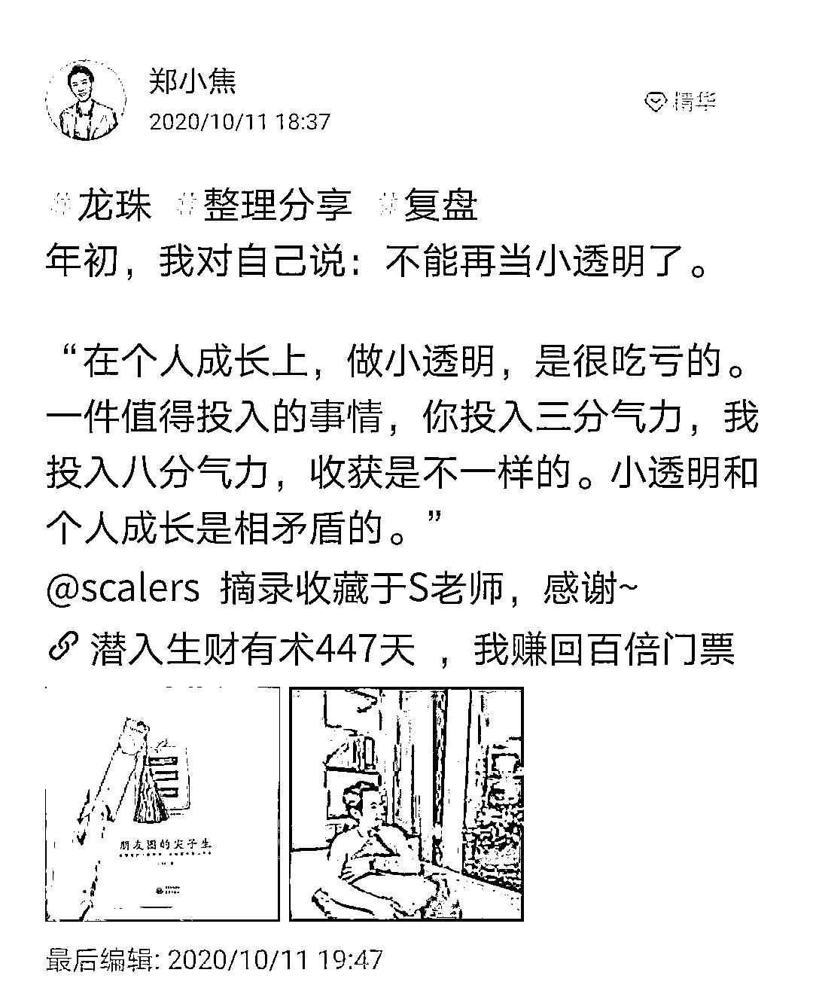

# (精华帖)(183赞)自由职业 5 个月回顾之我的亚马逊进修之路

作者：  郑小焦

日期：2021-03-31

复盘  案例分享  小焦亚马逊修bug系列

2020年10月26号，受贵人之恩，我来到408。

结束四年半的酒店生涯，开始自由职业之路。至今五个月，从“焦虑的小焦”转为“聚焦的小焦”。得之生财，“小透明”文章距今也有五个多月，我想复盘一下这段时间的历程，也请大家督促我。

 

 

《自由职业5个月回顾之我的亚马逊进修之路》

https://shimo.im/docs/KJgkTqhcd3V8cgY8/

 

 

评论区：

 

 

小蚁 : 小焦好厉害！[嘿哈]

CC : 小焦棒棒哒

Winter.校长 : 感谢分享，小焦

老黄牛 : 又有亚马逊干货[强][强]

天天的那个天天 : 厉害干货

蓝子鱼 : 小焦好棒啊，认识两年多你给我的感觉永远充满正能量

Dimple : 厉害的小焦

季伟宏 : 小焦好棒
