# (精华帖)(124赞)亚马逊批发，如何一年从 0 做到 100W 利润？

作者：  国民弟弟的跨境十年

日期：2022-08-24

在生财圈子待久了，今天鱼丸找到我说，**Bruce**你的经历很丰富哈。可以在圈子里面分享。

感谢推动，也在群里里面收获了很多认知。这里分享自己的创业的经历。就是一个普通人诚恳的讲讲自己故事。

不喜勿喷。我就是一个普通的不能再普通的人。

以下是正文。

大家好，我是国民弟弟的跨境十年 Bruce.（这篇文章是4月份写的，直接搬运过来了） 

 

我是一个美国本土亚马逊店铺套利和批发卖家。从0到1开启自己亚马逊套利生意，半年内从月销2K刀做到月销2W刀，副业给自己每月带来2W+人民币的收入。目前也跨境公司做项目合伙人，也做自己的项目。这次给大家分享下我的副业是如何从0开始起步做和自己微创业的感受。

**1.目前的情况.**

废话不多说，这是2022年4月份某天的主店铺的截屏。30天售卖了2.6W刀，货值是售价的1/3左右（8K刀)，利润是货值的50%左右，也就是4k刀，利润是2.6W人民币。

PS，现在2022年8月到了6W刀的销售。利润也是大致5-6w人民币的样子。

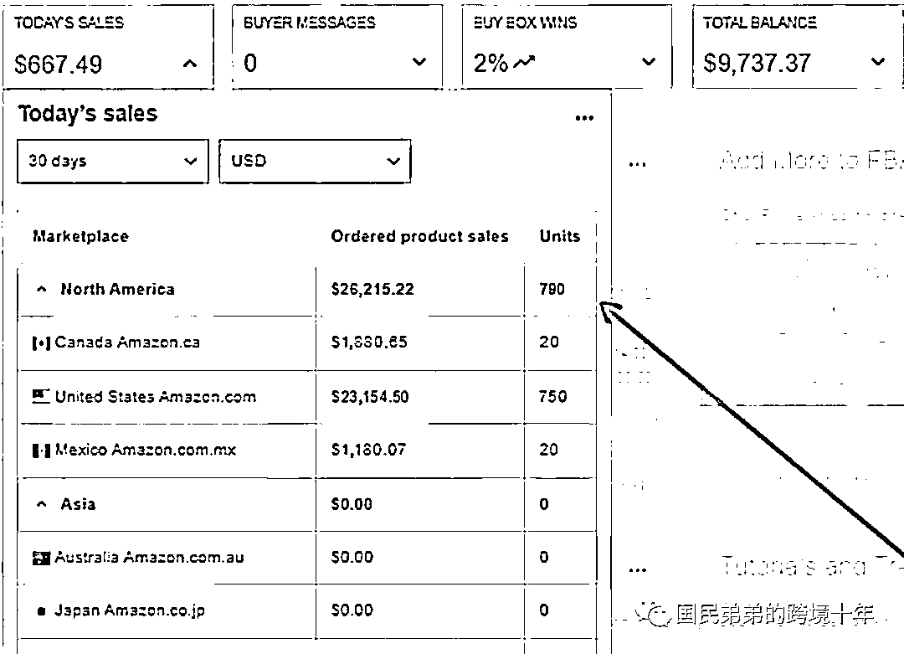

后面一张是细节图。有时间戳。

 

 

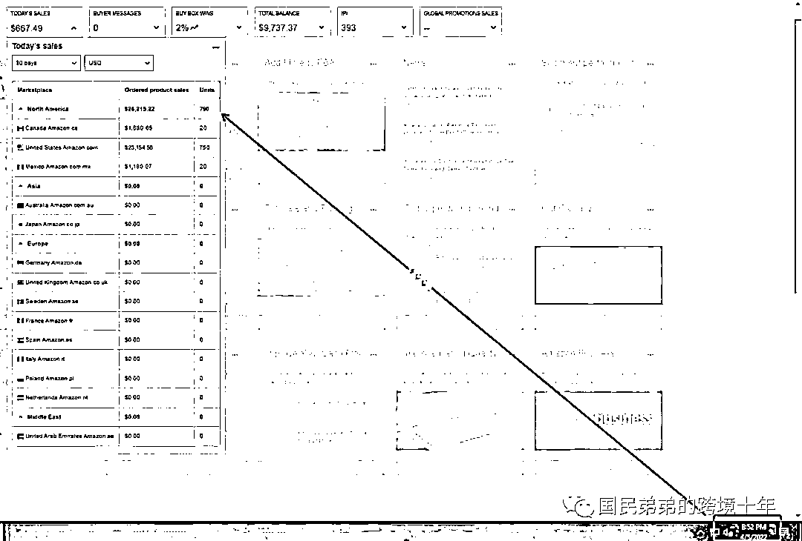

这是随手截图的产品利润率。可以看到时间和我命名SKU的方式就知道这个产品的利润率基本就是100%

**2.我的微创业的人生转变故事**

 

 

先简单介绍下，来自一个二本学校，学了个万金油的专业。毕业做外贸，自己玩过Gap year间隔年，在东南亚晃荡。不正经的在一家公司做户外向导，一年工作半年，剩下半年就是旅游。钱也只够穷游。穷困潦倒的时候，某次飞机上，找空少要了4盒飞机餐回去继续吃了两天。（机票是公司的报销的）

真正开始工作是2016年进入某大厂，万科做教育板块。后来因为各种情况和办公室政治。离开了某教育行业公司，之前虽然在这个行业待了6-7年，但是在这个行业没有什么积累。算是人生吃了一鼻子的亏和瞎混了一圈。只是拿了个工资的打工人。除了做事认真以外，乏善可陈。年级又到30了，基本上在人才市场是属于吃灰的那种。只有小公司万不得已才收。

从跨境前的唯一一份正经工作开始说起

当时在万科里面做户外教育板块。算是新业务，公司让我负责宁波市的业务。很快就和几个深圳的小伙伴上了早上10点深航飞机，两个小时后，小团队就这么在一个完全陌生的城市开始了业务。新城市，新地点，每个角落都是未知的。刚开始租车花了5天，跑了下城市大概，好歹先不要迷路。

前期的3个月的时间，每天除了睡觉就是工作。4个小伙伴一起鸡血，虽然不至于通宵，但是基本上3个月连轴转。没有休息，白天开会讨论引流方案和活动方案，晚上头脑风暴，盘点复盘。

团队里面，我是一个唯一在这行业有经验的人，其他人只有两个月的经验，还要负责培训新人。

对了，团队里面还有一个几个月才慢18岁的小朋友。算是带着童工和一堆新手开始在一个新城市，找流量，开始做业务。

作为项目负责人的我，晚上唯一的解压方式，是找其他各个同行朋友和其他分公司负责人打电话。还记在平楼的沥青小阳台上，踱着脚，从东走到西，南到北，像极一个热锅的蚂蚁在试图找到新业务的流量密码入口。

 

 

和现实中所有的一样，欲速则不达，客户进来都需要时间沉淀的，特别是我们做小朋友的生意的，更需要长期活动下来的信任。且自己也是流量新手，并不懂如何很好的去使用其他方式去引流和成交客户。就这样团队在每天鸡血忙碌了一年，流量业务上没有什么业绩，虽然成为公司夏令营口碑最佳的营期代表，抵不住利润报表的亏空。团队也就被公司拆散了。随后几个月后自己也离开了。

基于对之前行业的负面经历，决定换行业新进入跨境电商，付费两次找过跨境电商大佬电话咨询，只是希望自己没有选错方向。目标就是自己的跨境的创业的起步不要错。

现在社会试错成本都很高，宁可利润低，也不要最后一地鸡毛。

2020年末，从0开始进入换行业赛道，从深圳一个小跨境公司上班开始做亚马逊，中间换了一次，到现在长期搬砖的跨境年的大厂，做项目合伙人，同时也在2021年末，悄悄的开始了做自己的副业，目前自己副业已经超过主业收入。

 

 

**3.为什么选择跨境呢？**

2018年的时候，就萌生换行业的想法。给认识的唯一在做亚马逊的同学打电话的时候，随意闲聊中，之前的小学弟已经是年入50W了，这个金额让我错愕不已，当时的我虽然在公司做项目经理，也只是拿1W的工资，且要扣除各种公积金和税到手也就8K。对比下，猛然觉得选对行业比经验都重要。中国的老话，男怕入错行，女怕嫁错郎。只有经历过才刻骨铭心。

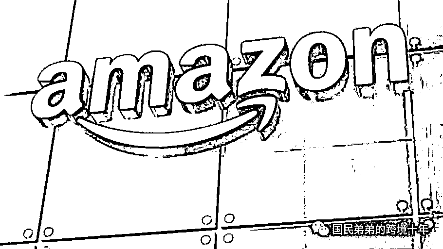

现在回顾下，这个世界大部分都是普通人，你和我和现在看这个篇文章的朋友，承认一个现实，95%以上的人都是普通人。如果你不是，那么你就是社会中的1%的老板了。

**4.那么普通人怎么现实逆袭呢？**

 

 

选择一个持续增长的行业。什么叫持续增加的行业？

最简单的判读，这个行业是替代之前旧需求的解决方案。

如，新能源的特斯拉替代燃油车，成为妖股。

美国亚马逊电商就是替代去商超店的购物。和我们中国淘宝起来的那么一波一模一样。

**未来铁定是中国电商全球的市场。进入这个行业至少有10年以上的发展前景。**

**新的信息和新的改变。**

于是在2020,12月通过社群知道亚马逊还有套利模式的时候

（简单介绍下，套利，就是通过在美国的其他零售平台购买打折的货物，在美国亚马逊上进行售卖，如，在美国沃尔玛上买到廉价的尾货，同样的产品在亚马逊上进行售卖。

类似中国拼多多进货到淘宝卖的模式）

而且在群里看着人家从0开始白手起家，20W直接在4个月后直接赚回来的时候，自己终于磨蹭的在3月份开始套利模式。

然而在当时公司新项目，忙碌到每天加班到10点，只能周末做事情。

周末通过社群和网络资料来学习。刚开始真的一脸蒙蔽，大量海外网站在自己面前，说是简单的套利，从别人家买了到亚马逊售卖。然而花花绿绿的网站放在你面前，还有更多五颜六色的商品在网站上，要在这成千上万的产品中找到能让有利润的产品，瞬间感觉到无从下手的焦虑。

 

 

钱不会掉下来，每一次的开始都是要靠自己。

硬着头皮，直接上，选择最笨的战术。黏贴采购网站的标题，到亚马逊搜索，人工识别确认是否一致，是否有利润，是否有权限售卖等等。

然而看着自己每天工作打卡到晚上10点，偶尔半夜起来工作的节奏加上大小周的作息，已经榨干了我这个打工人的精力。和所有人在奋斗的人一样，都希望努力出成绩，但是超人的勤奋会严重透支你的精力。

在前期鸡血干了一个月后，因为投入时间严重不足，加上白天工作的焦虑和忙碌。几个月下来，我的店铺只有刚开始的业绩截图是看的下去的。因为我只是进了一次货。这是5月份新店业绩截图。

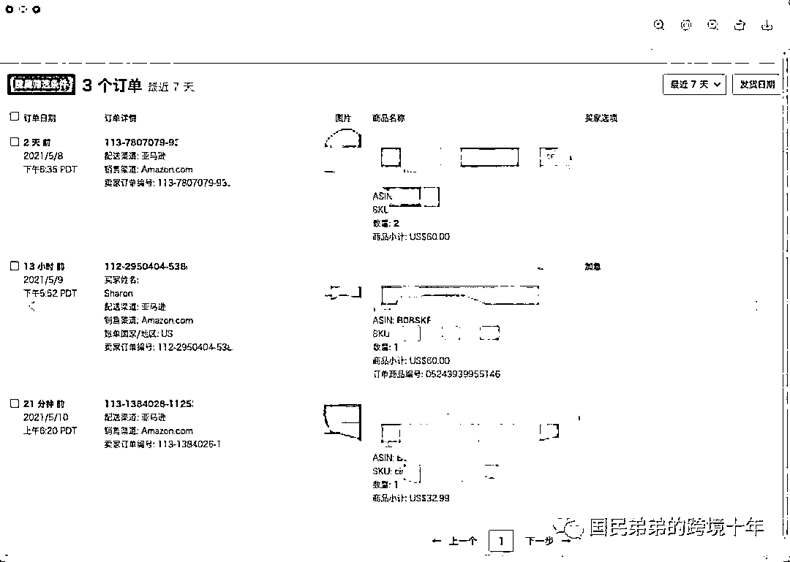

 

 

这段时间，开心的是开始自己能够有自己的副业赚到一笔60刀。遗憾的是自己无法投入更多精力做事情。

回顾下，最重要的是，任何副业前期都要给出时间让自己专注的做事情。

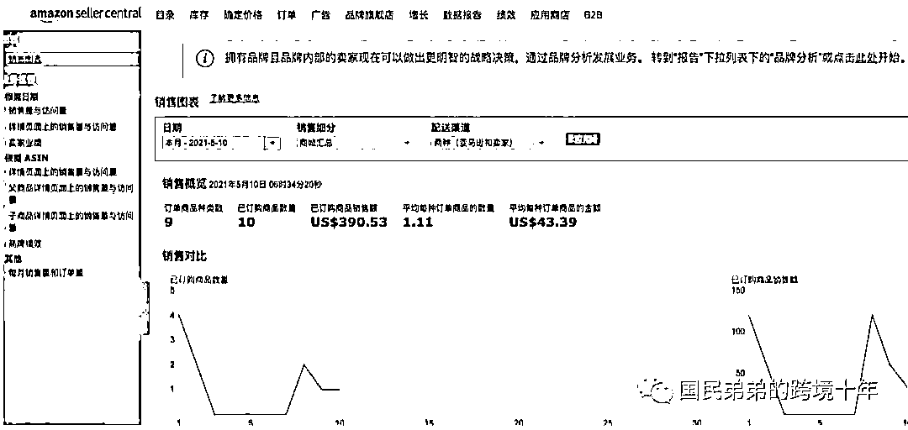

**5.亚马逊套利副业启航的故事**

2021年7月中旬，终于有空出大量时间开始做亚马逊套利。正到我准备踌躇满志的时候。晴天霹雳，收到亚马逊封店的邮件。封店！配图是网图（非正式邮件内容） 

 

因为放了一段时间，没有售卖任何货物。账户被审查需要提供资料，然后因为是买的店铺，没有任何资料，无法解封。就像你新店还未开张在装修的时候，就被租店的人告知你，不租店铺给你，你关门吧！

当时看到封店的邮件的时候，心中瞬间非常低落，不想说话，只想躺在沙发上刷手机看点其他的排除下烦恼，然后点一顿外卖，配上肥宅快乐水，刷个剧抚慰下自己受伤的心。

躺在沙发默默不语，抿着嘴半个小时之后，开始咨询各方朋友，确认了确实无法解封。

又是一波失落涌在心头。做在公寓台阶上，就那么看着天，发着呆，什么都不想说。天上的云儿就那样无表情的来回游走。我也无表情的看着他们。

约半个时候后，过来会，想想到自己悟到的金句。**“**这个世界没有什么是不变的，唯一的不变就是变化，而且非常多的事情不是你能控制的，积极应对才是生活的强者，**You are NOT in control”**

 

 

反复脑中念了几遍，这么多年来，其实所有的东西都是变化，人和关系，都是一样的。

跳出固定思维，积极应对才是生活的强者。如果你碰到类似的事情，这句话送给你。

承认这个世界的不确定后，我开始接纳现实，同时阿Q精神的告诉自己，封的早好，好歹没有货，否则钱货两空就更难过。

几天后，同时大量中国身份注册的亚马逊的店铺已经被限制权限了。让我也被治愈了，抱团取暖就是这样的感觉吧。同时也阿Q一把，反正中国账号也没有意思，本来就要换，只是被强制提前升级了而已。

**6.美司亚马逊之旅的开启**

然后我开启走向开美国公司注册亚马逊的路程。真的像，上帝给你关上了门，但是同时有给你开了一扇窗。很多时候你就是被时代机遇推着走的，其实回想起来，感谢封店。

不封我不会去探索新的路径。

开美国公司做亚马逊的路并不容易，好歹自己积累了些美国朋友资源，通过朋友的朋友，找到代理完成了从公司到店铺地址的明信片的验证，后续也完成了亚马逊最难的二审验证。

还记得在某个晚上和美国留学的朋友一起聊我的新公司起什么名字，最后在3个备用选项里面，帮我选择了一个美国化的名字。隔着大洋  一点一滴，一家美国公司在我的方寸间的房间里诞生了。

 

 

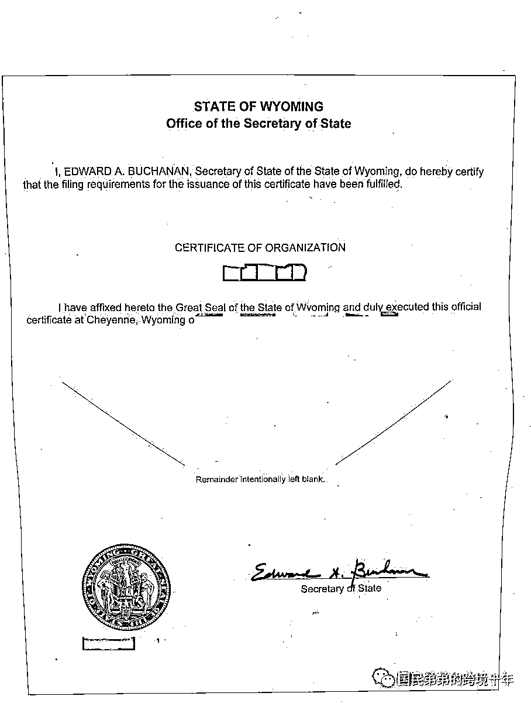

有了这些基础，我才可以第一次申请自己的亚马逊账号。

 

 

在社群和网络上翻略无数的帖子和反复和代理确认，我自己开始了自己的申请账号的路程，一切并不是很复杂，远程朋友家的电脑提交了资料。然后再是视频验证。记得视频的时候是一个小姐姐，操着南美口语，拿着一堆资料和她核对，15分钟搞定。小插曲是，资料提交因为格式不规范，导致来来回了一下，在咨询朋友和代理后，提交了正确的资料，比较顺利。

在8月中旬有了自己的店铺，权限齐全。记得那一天感觉闻到的空气都是甜的。辛苦一个月，靴子落地，而且结果很好。

**7.店铺有了，从这里开始，才是真正的自己美司套利启航的开始。**

2021年的8月中旬，又是重置自己，从0开始手动选品，在一个Nordstorm Rack网站打折清仓区开始，黏贴复制到亚马逊, 又是几个夜晚的不眠，凌晨三点的挑灯夜战，让我回归了到高考的感觉。然而几天后，效果依然一般。虽然下来几单，但是效率依然比较低下。

**8.学习总是遇到困难就有新的解决方案。**

开始复习TA和SM这两款选品软件。我把网络上关于他们的工具使用的视频全完了，又投入到选品中。成果比较喜人，选出了一些利润在30-40%的产品。

当我欣喜的时候，这时候总有让你打回原形的事情发生。

当我下单的时候，我的美区Paypal被封了（这是大家做套利的重要的支付路径）。当时候还得意自己的美区PayPal 可能没有问题，因为注册的时间久，想想是老账号，权重高，蜜汁自信。结果说封就封。

 

 

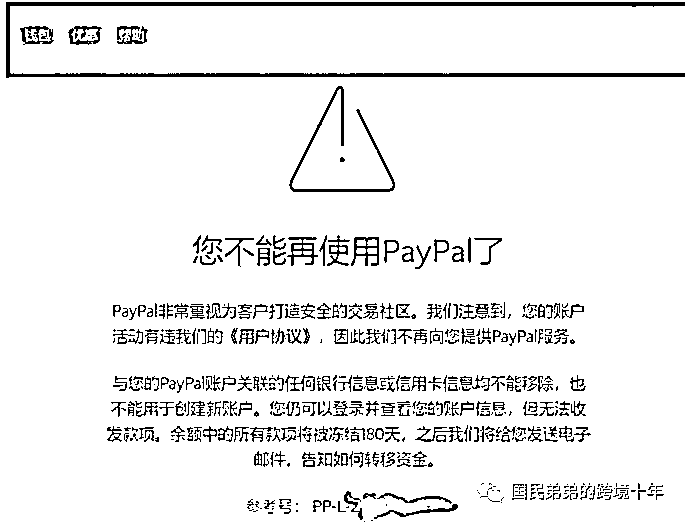

然后就是疯狂的给PayPal打电话，20多分钟终于找到合适的人通话。按照自己的中国思维，好歹给个机会，结果是一个BIG NO.

祸不单行，大量网站也砍了我的单子，沃尔玛，Macys,还有Academy,只要我下单子就砍。

无法支付，无法下单。让我好多天都没有精神，躺着床上，起来找攻略，可惜这个领域都是一个全新的领域，并没有任何人能够提供适合你的解决方案。

我瞬间蒙蔽了！那段时间是我打了很多电话。

我随意截图下。因为需要在美国时间电话，我一般都是晚上11点之后电话，一个一个打，还有最坑的是，话说到一半，网络掉线了。你知道那种崩溃是什么样子的么？花了半个小时找到人，已经聊到核心的时候，断线，然后需要重新打进入，因为他们不会打回来。持续了几周的一天3个小时电话量。

 

 

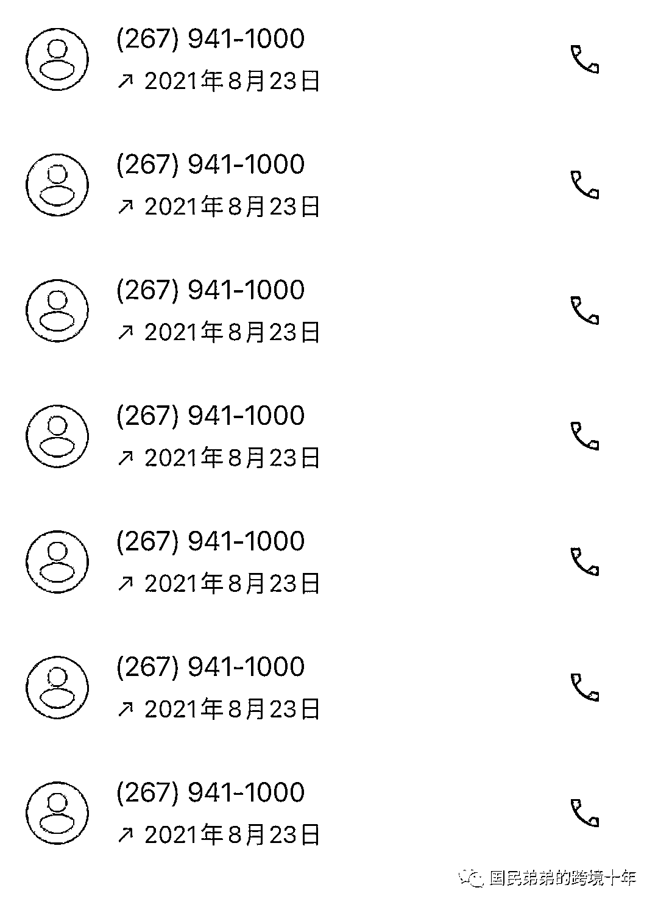

 

 

 

 

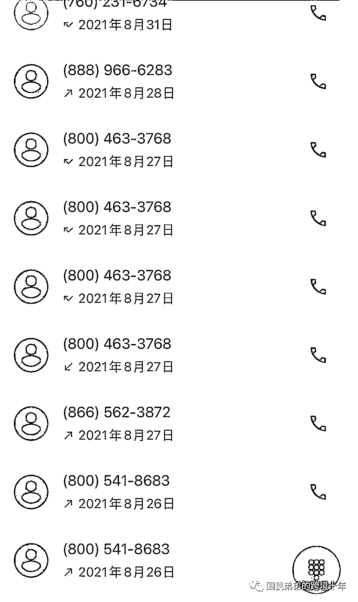

大量的实践，居然让我总结出来，其他下单的套路。和如何和客服快速沟通的经验。

在一个未知的领域，实践出真知。

总结了支付和砍单的经验后，我又升级打怪，进入批发的领域。

**9.开始批发之路！**

普通人厉害，靠什么？靠超人的勤奋！

15天互联网的汪洋中，自己找到的600个批发商，开始电话和邮件。

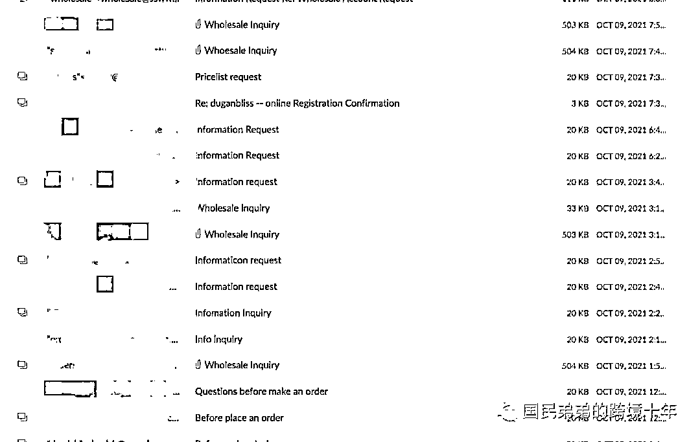

 

 

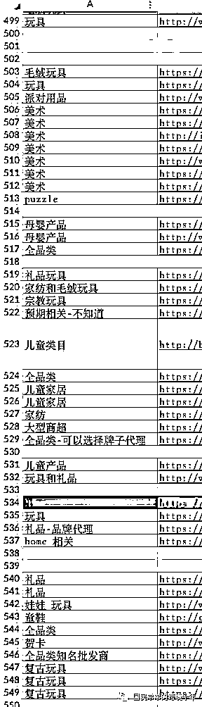

 

 

你以为这些有资料就是能够解决问题？

不要天真了，大部分需要你的资质和其他的材料。

经历了几次沟通不畅的情况，一个大胆的想法出现在我的脑子，雇佣美国人帮我电话。

于是乎万能的朋友圈让我找到之前的美国朋友，美国老爷子没事愿意以一个比较低的价格帮我电话。

 

 

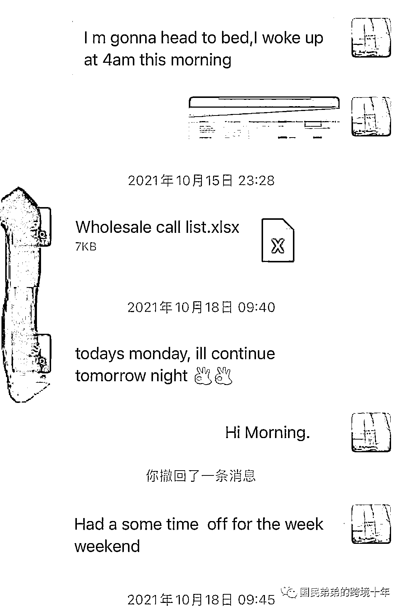

 

 

我们就这么交替合作，努力这次有了回报的，找到了些不错的利润的批发商。总结下，本土人互相沟通比较方便，而且年级大的做事比较稳，和销售沟通时彼此比较信任。

**10.这半年里面,我的困难和努力。**

有很多不眠之夜我是挂着电话和海外网站的客服隔空撕逼，要求单子能够下进去。

有多少个夜晚在不同的网站里面跳转，选择思考分析，把选到的产品放到自己采购清单里面。

还有绝望的等待，因为第三方贴标服务商把我的几十万的货拖在仓库（他们人手不够）。

有着不断选择测试IP怎么样不被PayPal封号的探索，和被封号后，一周每天3个小时的和他们客服的撕逼大战。

 

 

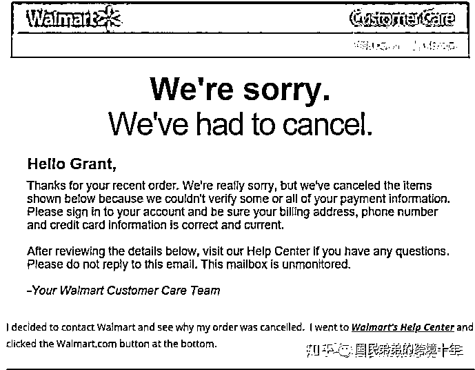

中间很多事情，都是新的，要不断想办法来解决。

在这里我补习了自己的商业英文口语，每日从油管follow 教程，怎么样把自己的锻炼的更美式英文表达思维，如何高效的表述和合理获得解决方案。

我自己搭建了独立站，自己装修站点。包装的非常本土，以至于被后续居然啥也没做独立站也出单了。

我学会了如何电话拜访供应商，如何和美国人谈完公事后拉家常，建立良好的供应商关系。

在这里，我又测试了出来了申请ITIN（美国个人税号）绑定美区PayPal，稳定不封号的方法。

又开通了美司的商业PayPal

在熬夜的一个晚上，我用空壳的美国公司，申请下来了美客多，Etsy和其他电商平台。

（正常的中国公司很难申请）

 

 

在某个晚上，我又信手拈来，去批量开了美国的信用卡，获得更多的美国银行方式。

在某个白天，自己闲着没事又开通了，美区的Stripe。

到现在，可以借着着自己的经验，利用美司，开Walmart，分享美司套利的技巧。

游刃有余的协助一些朋友一起开始OA套利。

当你开始了，一切就变得越来越简单。

**11.时间是我的朋友**

我从的店铺从第一个月的2k刀，到第二个月到了单日出20单欢喜。然后是缓慢的从5k到破1W，到现在开始到2W。利润不断追加投入中，到雇佣了我的亲戚帮我打理店铺。一切就在短短的半年完成了。

这是第一个月的2K的开始

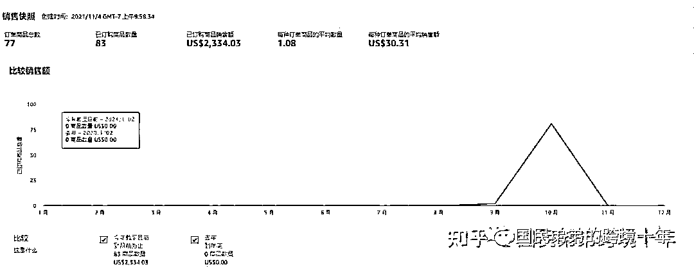

 

 

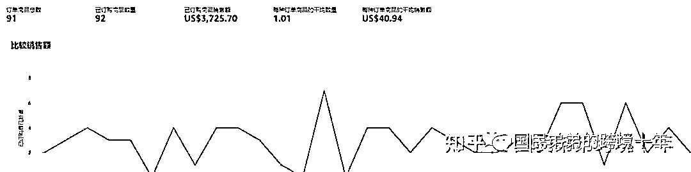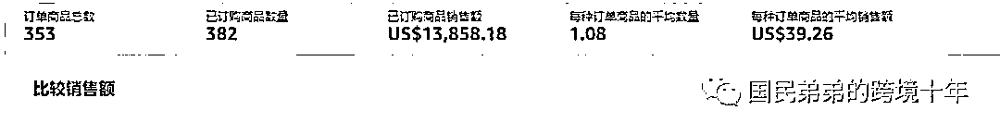

每一步都是一个积累，大量的练习，让我行业经验越来越足，不断能够淘到50%到100%以上的高周转产品，同时因为需要处理非常的事务，自己的工作节奏也是更加高效和简明。

这是顺手截图的在出单的产品。

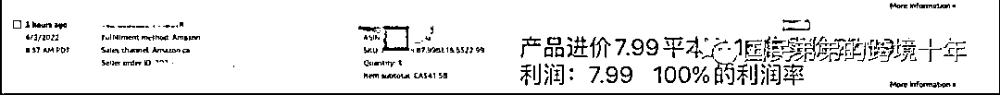

**12.走下来感悟最深的是：**

1.任何副业都没有速成的，都是需要大量的前期垃圾时间的积累，自己每日的经验总结。

 

 

2.提前规划最佳，因为使用的美国公司开的亚马逊账号，后续开权限基本无压力。包括后续开ITIN等申请信用卡一切都是水到渠成。

3.主动努力中，也要积极寻找合适可以帮助你的资源。没有美国的朋友和代理的协助有些事情在国内只能望洋兴叹。

4.主动学习的解决问题，向行业厉害的人虚心讨教。很多事情都是第一次做，通过搜索和问行业里面厉害的人，少走了弯路。

5.在自己擅长的领域开始，投入比常人更多精力。无数个夜晚对接美国时间和电话，一切都让后期的事情，无比顺畅。

6.选择比努力重要。如果我在跨境的路上还是抱着中国公司开店铺，估计很快就会有瓶颈。而美司虽然来来回回，好歹给我更多的选择。

现在有稳定的副业收入了，然而事情也没有更少，在培训下一个人帮我运营新店铺。已经兼职雇佣到第三个人了。

今年赚钱突破100个W。多点开花。PS(今年100W目标应该不远，唯一的目标就是150W)

 

 

关于利润同样无图证据！

这是我今年获得的人民币的资产（里面有卖货的利润，知识付费，工资，帮公司做项目的收益）90多W。美元就暂时不放出来了。还有30W人民币左右。

对于很多朋友都不算什么，但是作为一个普通人创业成功，也是非常不容易的开始。

 

 

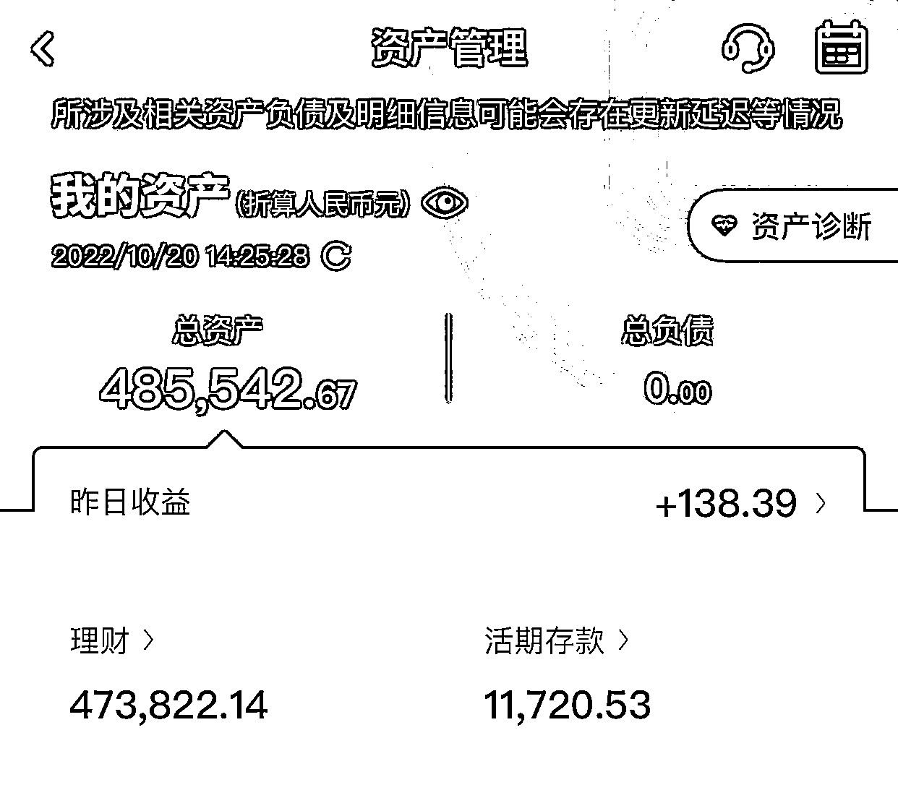 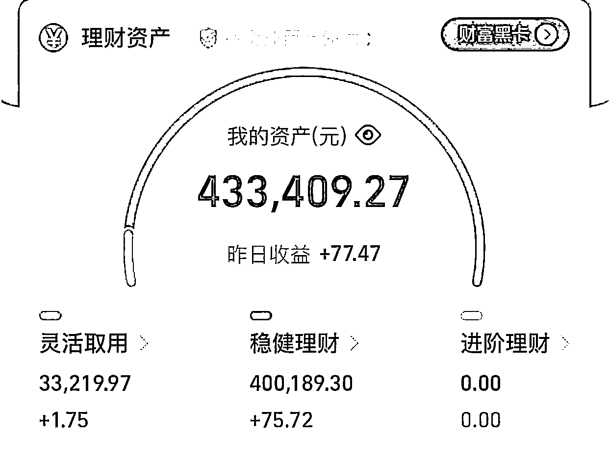

 

 

多赚了点，像我这样的工作狂人而已只是银行数字增加，唯一的就是给自己买了一辆高配的公路车自行车，给家人经常买点东西。

在银行里面转的美元，马上进入买货，进行复利操作。

越是赚钱的初期，越要节约，让自己的复利飞轮赚的更快些。普通人资本积累，获得资金的复利是最重要的。

不要去购买那些不能给自己带来生产力的东西，炫耀的产品。车子对于我这样的人，就没什么必要的。

我看过挥霍的钱的人，刚刚有点现金，自己挥霍一空，换成豪车，最后变卖豪车的人。

我只是一个普通人，刚开始创业，圈子里面也有很多厉害的朋友，故事分享出来也只是让普通人有一些参考价值。

毕竟大佬也是从普通开始的。

**13.最后，送自己一句话。自助者天助，这个世界很公平。**

公号：国民弟弟的跨境十年

我会更新最新的关于美司的一些自己摸索的经验和自己的思考分享，方便大家避坑。

可以给生财的朋友提供的资源如下：

 

 

【可提供资源】

1.亚马逊套利从0到1的经验，OA高阶➕批发经验.跨境经验分享博客

www.amz10years.com

2.超级低成本39刀注册美国公司和处理税务的美国资源可以分享.

3.利用美国公司开户walmart.ebay.etsy.美乐多等电商平台的分享。

4.美区Stripe和美区paypal商业版本使用开通使用经验

5.自己开通美国信用卡经验

6.海外美元账户开户经验分享

7.英国Tiktok小店从0到1落地经验

8.滑雪，滑翔伞，野外急救经验分享。

 

 

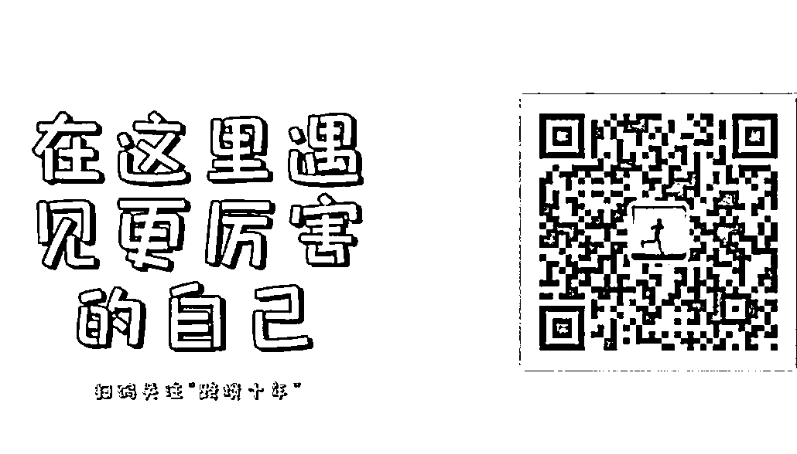

博客网站：https://www.amz10years.com/amazon-oa-experience/评论区：

凯 : 牛

阿鸿 : 一般人做不到

倪大胖 : 赞

苏生 : 厉害

曾世拓 : 精神可嘉

无念 : 看完文章，能感受到Bruce所经历的种种困难，一路的前行，一路的克服困难，优秀[强]。

喜欢你说的一句话:积极应对才是生活的强者。

国民弟弟的跨境十年 : 谢谢喜欢

66 : 真棒，加油

 

 
