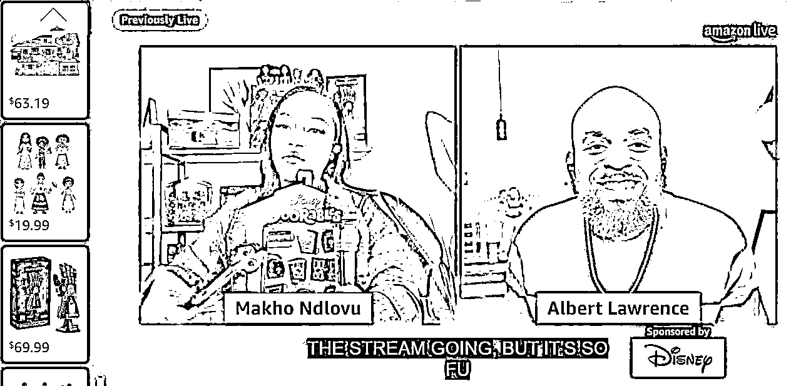

# (22赞)在线人数不高，转化效果不错的 Amazon Live，单场直播几千-上万美金的亚马逊直播玩法分享

作者：  冬佛儿

日期：2022-12-14

大家好，我是老李Sarah。

今天和大家分享一下我对亚马逊的直播板块的理解。这个板块相对比较新，业务发展的也比较“隐蔽”，跟大火的Tiktok直播在热度上真是没办法比。

但其实这是真有潜力帮你变现的领域，如果你也在考虑如何通过海外直播给品牌变现，欢迎一起探讨下去。

本篇适合哪些人看：

**1. ** 亚马逊的品牌卖家** **（品牌！品牌！品牌！）铺货型的卖家能收获的价值不一定高

**2. ** 看好电商直播的潜力，认可这里是有可变现的路径的，在积极寻找对的方法不适合哪些人看：

**1. ** 非品牌卖家** **（真的玩法不一样）

**2. ** 对海外直播的预期是：自己只拿个产品就想疯狂出单，别的资源、信息一概认为不重要，或者想找纯佣带货的联盟达人的

 

 

为了方便大家，这是全文的目录

**1**、自我介绍：为什么是我来给大家分享亚马逊直播

**2**、关于亚马逊直播：什么是亚马逊**Live**？

**3**、亚马逊直播玩法：适合哪些玩家，有什么玩法

**4**、如何运营好亚马逊直播间

**5**、案例分析

**6**、结语

# 一、自我介绍

接触亚马逊直播，纯属是个意外。我之前业务，一直会接触大量网红，帮他们自建电商品牌增加变现。

 

 

20年的时候，有一个姑娘，对我提供的变现方案丝毫不感兴趣，说她现在做的事情变现已经比较乐观了而且还在上升期，不会分散精力的再见。

如此坚决的态度引起了我巨大的好奇心，所以不断的套磁请教到成了好朋友，最后也是因为她，被“拽”入了亚马逊直播这个赛道直到现在，帮品牌做亚马逊直播。

# 二、关于亚马逊直播：什么是亚马逊Live

亚马逊Live是亚马逊平台自己推出的直播功能。

品牌方在直播的时候，他的产品详情就有可见的入口；网站主页菜单栏里有单独的live入口；主页也有单独的一屏是给live的。其实入口并不算特别多，所以很多人可能还不知道亚马逊live的存在。

亚马逊做直播的逻辑很简单粗暴。他们自己对外的口径就是，Amazon Live - Drive Conversions with Live Streaming。

就是说，至少亚马逊是把直播当做转工具的。因为亚马逊和Tiktok的本质不同，前者是购物平台，后者是泛娱乐平台。

 

 

虽然看娱乐内容的人也是消费者，也很可能在亚马逊上买东西。

但在看到直播的这一刻，如果是在亚马逊上发生的，说明你本来就是想买东西来的，你的readiness要比你刷Tiktok的时候要高。

再加上如果你是从产品详情页引流到直播间，更说明你本身就对这个产品感兴趣了，来直播间就是临门一脚加速转化。

整个流程都是尽量贴着“购物粉”去引导，直到最后成交，也是亚马逊，走完一个大闭环。

# 三、亚马逊直播玩法：适合哪些玩家，有什么玩法

简单说，亚马逊直播现在就有两种大玩法 —— 让红人带货，或者品牌自播。

先说红人带货。

亚马逊的直播红人，可能自己在其他社媒也有粉丝（没办法，对社媒敏感的都是这么同一群人），但是他们本身的社媒粉丝并不直接推动他们在亚马逊的表现，大家都是从0开始。

 

 

而想找到红人带货，也有两种方法：

1）亚马逊官方操盘对接：想通过亚马逊官方来找到对接红人，是要走亚马逊的广告团队的。

这真的是一条奇贵无比的道路。甚至在他们自己的官网上就写明过，如果想用亚马逊的广告团队帮你打理直播，至少要预留5万美金的直播预算。这个费用，是一般咱们的品牌，至少在试水阶段不会去轻易用。

2）线下私聊亚马逊的直播网红：收费模式类似国内：坑位费/服务费+佣金。

坑位费是卖家自己去和主播私下结算，坑位费按照时长，是否是专场等维度，从几百到几万美金不等。佣金是通过亚马逊的体系自动结算好给主播。

但问题在于，亚马逊主播名单并不是一个公开的信息源，你能在公开渠道找到的，永远都是很小的一部分。很有可能要么主播量级太大或者太小，要不就放手盲找，但不一定能找到匹配合适的主播，来帮你带货。

这里带一嘴坑位费的问题。这个是大部分卖家可能都想省掉的地方。

但根据我的经验来说：

不要想占主播便宜。一是这个费用你也省不掉，而是如果能省掉，大概率是品牌方最终吃亏。

 

 

海外的直播业态，我再想美化也不得承认，就是没有国内成熟和稳定，不能做到像国内纯佣达人直播间。

美国亚马逊上的主播，大部分都是只有自己或者小工作室。这些主播里，如果可以做到一年几百万美金的带货量，就已经是首屈一指的了。

我们合作的主播在开播之前，每一场2-3个小时的直播，要准备4-5个小时才能开播。主播不仅要试用产品写脚本，还要了解品牌历史，收集筛选品牌营销素材。

这个投入跟联盟带货发一个图片或者视频帖子，是不一样的。

如果接受了纯佣合作，要么你的佣金奇高无比（亚马逊直播佣金也没有国内那么高），更可能的就是主播还没什么底气，拿你的样品练手。获得好的结果，自然是小概率事件。

再说品牌自播。

技术上，亚马逊没有太多要求。只要是亚马逊brand registry的注册品牌就行。可以用亚马逊的直播app进行品牌方自播。自播的话亚马逊也不收取额外费用，需要品牌方自己组盘  。

如果要说有什么门槛，其实是内容水平的门槛。红人主播这个趋势更明显，就是绝大部分的主播群体是“纯老外”，而且年龄跨度也很大。这一点和国内玩儿Tiktok的也有很大不同。

Tiktok的很多国人主播，虽然不是英语母语，但是非常会互动，依旧能吸引一票粉丝。

 

 

但是亚马逊的直播，整个的调调就更偏平和，它对主播的语言功底要求非常深，很少有“过于热闹”的直播间。一般打造的都是真实、亲和的路线。

直播间流量上，亚马逊会根据在线人数、互动情况等数据，适当推流。

但是切记，亚马逊的直播间首先总观众就没有Tiktok那么大，而且购物直播间，本身人数也不会特别多。

主播和品牌方爸爸都不要很快就气馁，没有出现开场就破千破万的场观也不怕。

一般来说，几十人的同时在线，是个非常正常的数字。如果赶上某个好的时间节点，恰好亚马逊推流，那你流量翻倍就非常快。

# 四、如何运营好亚马逊直播间# 4.1 如何选择主播：大多数人选择主播的误区

 

 

主播的选择上，最终的主动权在品牌方 -- 想象如果你的品牌“是个人”，你希望它看起来是什么样的？

ta给人的感觉是本地的，还是异域风情的？是清新的，还是性感优雅的？是亲切可人的，还是高贵不可触碰的？你的客户是自用还是送人？

这一系列问题都是我们要和品牌方进行灵魂发问的，最终才能定下来到底合作什么样的主播。

此外，主播跟你的配合度一定要高。也许主播是兼职，或者是外部红人，但是这个人要深刻理解你想要传达的品牌信息。

专业的主播在接你的推广之前，都会仔细衡量你的品牌成熟度，品类匹配度，会学习产品在亚马逊的评论。

# 4.2 其他的运营技巧：做好亚马逊直播的几个运营前提

首先，亚马逊红人直播间里，排品是一个非常重要，要拿来单独说事情的点。

国内直播说到排品，经常会讲引流款、爆款、利润款的搭配。在亚马逊直播，我们的每一场排品，其实要帮红人根据产品的价格、折扣力度、品类搭配，以及白牌还品牌至少这几个维度来做安排。

 

 

尤其是品牌成熟度！新亚马逊品牌，要特殊搭配一些成熟品牌作为“绿叶”，来让这个产品的直播排名尽量上升。

时长上，总的时长要保证。如果是同红人合作，而且是比较新的品牌，一般会建议2个小时的总曝光作为起点。如果是品牌自播，一开始可以安排一周1-2次，一次2-3个小时就可以了。

关于是否本土化这个问题。说多了怕有打广告嫌疑 :p。只能说，我合作的主播，还都是非华裔的主播。

我个人操盘的品牌以生活家居、家用小家电、美妆时尚为主，这些品类都比较考验主播对生活场景的理解和表达。如果能有对本土理解非常强的主播，应该也是可以的。

# 五、案例分析

案例这里，和大家一起拆解一场迪士尼的直播案例。非常新，三天前刚播完。

打造一场迪士尼级别的亚马逊直播间，基本分为四步

第一步：确定直播主题

第二步：确认产品组合

 

 

第三步：选定主播，确认直播间背景风格

第四步：确认排品和展示方式

第五步：设计话术，开播

第一步：确定直播主题

万圣节一过，就陆陆续续进入圣诞季了。

迪士尼三天前直播的主旋律就定在Holiday Toy Wishlist （圣诞季礼物心愿单），主要面向成人，帮成年人解决给小孩送礼物不知道选什么的问题，以及顺带给这些平均年龄三十岁的老孩子们，种草一些童年杀玩具。

第二步：选品

这步其实很重要的，究竟上哪些产品，是需要花很多心思来设计的。基本在这个环节至少要考虑好几点：

1）产品数量：迪士尼的这场直播只有一个小时。他们在直播展示环节基本选择了10个左右产品重点介绍。

2）为目标人群按比例配品：这场直播主要帮成年人给孩子挑玩具，所以以儿童玩具为主。成人自用的玩具为辅。

即使是儿童玩具里，女孩子更偏好的娃娃类、服装类，和很多男孩子喜欢的积木、车模也进行了匹配。

 

 

3）产品价格区间拉开：迪士尼的这次直播里，价格区间在$20 - $99之间。

真人介绍的产品固定在$40-70美金区间。少量90美金档位，突出套盒的优势。依旧是性价比突出。

4）产品特性：吸睛的爆款，和经典款要搭配着来。迪士尼的这场直播里，有一款儿童泡泡机推车，超级吸引眼球，就被拿来在和靠前的位置做主推。

第三步：选择主播

迪士尼选择了两位主播联合直播。一位黑人姑娘，一位白人小伙子（是的有时候肤色inclusiveness啥的品牌爸爸们也要考虑一下）。

两位都是属于热情洋溢的孩子王形象。由于两位主播远程接入，所以背景没有做特殊高成本搭建，基本都是起居室作为背景，打造家庭的感觉。

 

 

这里其实也要戳一句：亚马逊直播的头部主播还是会有设计感的直播间背景，但是更多中腰部主播，在背景打造上属实有些草率了。

这也跟他们很多人都是个体户创业有很大关系，而国内很多主播背后都是一个团队在设计运作。如果有预算，非常推荐品牌方好好设计一下直播间背景。

我们给客户搭建的专业背景和家庭版背景，出来的视觉效果、观感和体验完全不一样。

此外，产品数量选择上有个小技巧。在橱窗里(carosel) ，可以添加直播间里并没有真人展示的产品。比如相似款。这样消费者看到的橱窗，会有更多的选择。有的时候也会促进转化。

第四步：确认排品和展示方式

人有了，产品有了，直播间也定下来了，下一步最主要的就是怎么把产品科学地排好。

 

 

对于品牌直播间来说，排好品的最大好处就是，尽可能让直播间数据好看起来 -- 历史直播时长、互动情况等，让亚马逊算法捕捉到，把你放在feature页上。

亚马逊推荐的直播间并不是很多，因此一旦被推流，数据起来的会非常快。可以有几十人跃到几百人，甚至有大主播几千人在线。

如何排品？我们常用的基本思路就是：吸引眼球（绝美、功能超炫的）** -- **价格惊人** -- **经典性价比  之间，来回做小循环。

以迪士尼的这场为例，他们第一个产品就是儿童泡泡机推车，一推就出泡泡，特别吸睛。

接下来，推荐给小女孩儿的迪士尼公主服装套盒 -- 5套衣服才几十美金，合着一套迪士尼公主衣服才不到十美金，价格诱惑巨大。

在这之后，再隆重推荐绿巨人积木玩具，玩一波回忆杀。

然后又回到一个巴斯光年玩具的实时拼接，又回到吸引眼球的新一轮介绍中，让观众跟着你的排品，心情上有起伏，这样才会在直播节奏上松弛有度，让观众更engaged. 

 

第五步：设计话术、开播

在这里只和大家分享一点。话术是重头戏，每一个卖点的挖掘，用什么语言、什么语气把产品卖点讲出来，是亚马逊头部主播最厉害的地方。

在话术上，要注意，亚马逊的受众年龄要比Tiktok大 -- 主播年纪也更大一些。

所以很多培训机构推崇的“honey”来"sweetie”去，跟用户淘宝客服一样甜蜜互动的方式，在亚马逊直播是吃不消的。更适合在Tiktok上和Gen-Z玩儿的嗨。

每个平台都有每个平台的调调，亚马逊的品牌端庄感更强。

迪士尼的这场直播，两位主播全程没有任何昵称口头语，都是在表达对产品的兴奋，以分享感为主。

 

 

# 六、结语

亚马逊直播是还没大火起来，但是依然有品牌吃到甜头的引流方式。品牌成熟度、主播特点、亚马逊算法推荐…… 都在影响着直播的转化情况。

大家要清楚亚马逊直播不是开播即赚的项目。但它确实是目前基础设施上把直播和电商结合得不错的海外渠道。先对项目有一个预期，再判断自己的品牌适不适合、愿不愿意投入去做，愿不愿意持续去做。

以上，第一次在生财上分享，文笔拙劣，超级期待圈友链接~~

评论区：

暂无评论
