# 播客制作 202308

> 来源：[`remhu1p2pr.feishu.cn/docx/NnNSdepLfoc9IvxLBXncfKdPncN`](https://remhu1p2pr.feishu.cn/docx/NnNSdepLfoc9IvxLBXncfKdPncN)

出品时间：2023 年 8 月 9 日

手册使用说明：本文旨在向你展示一个项目的更多可能性，帮助你更好地理解和实操。

建议：如果需要快速定位到精确内容，可以使用快捷键 Ctrl + F/command + F 的形式，搜索「关键字/词」，查找你想要的内容。

# 写在前面

💡Hi,

欢迎大家来到 8 月航海｜播客制作｜实战手册，相信在接下来的日子里，我们将在这里见面很多次。

1)播客是什么？现在做播客有多大机会？

播客类似于广播节目，可以涵盖从新闻、故事讲述、娱乐、专业知识分享等方方面面的主题。常见的播客平台有：小宇宙、喜马拉雅、苹果 Podcasts 等。

根据知名市场研究机构 eMarketer 调查，2021 年中文播客的听众数量就已经达到了 8600 万，2022 年超过 1 亿人次。与中文播客听众数相呼应的是，中文播客的数量也在成直线攀升，截止 2023 年 5 月，中文播客的数量已经达到 5.7 万。

据预测，中国市场播客的消费规模在 2023-2024 年间还会保持年均 15.8%的增长，增速位列全球首位。

拥有自己的播客频道后，我们可以通过接广、贩售周边、知识付费、组建社群等方式完成盈利。尤其对于想要建立个人 IP 或者扩大 IP 影响力的朋友来说，播客是很好的媒介渠道。

2）什么样的人适合做播客？

哪怕是新手，如果你有一定创作能力、表达能力和沟通能力，就可以尝试播客。在这个基础上，如果你能够具备一定的剪辑与后期能力，有不错的嘉宾人脉圈，项目开展能够更加顺利。

制作播客是一项既有挑战性又有创造性的工作，需要不断尝试和探索，才能不断提高自己的技能和水平。在这个过程中，需要具备开放的心态和积极的态度，不断尝试新的创意和思路，从而创造出更加丰富多彩的节目作品。

3）怎样正确使用这个手册？

为帮大家扫清前进路上的障碍，本手册从频道筹备、节目策划、采访录制、播客运营、播客商业化等角度给出了说明和实用技巧，希望大家的播客之旅能够一路顺利。

对于新手而言，以下章节是需要重点关注的，这也是本项目的重点动作：

✅1.5 变现模式

✅第二步：筹备播客✅第三步：创作播客内容

✅第四步：播客访谈、录制与剪辑

✅5.2 如何提高播客打开率：做好 Show Notes

✅6.3 运营方法二：运营 IP 社群⚠️需要注意的是：

为了给大家更一线的信息，本次手册，我们邀请了知名播客厂牌宇宙电波的创始人，也是播客频道《末日狂花》《消费圈内人》的主理人 @旺仔珂珂糖 提供内容支持，以她的一线视角与经验，搭建起这份播客制作手册。所以在本手册中，你能看到《末日狂花》多次作为案例出现，目的是让大家更真实感受到播客的发起、制作与背后构思。

除了上述内容外，还有个核心就是多提问，多交流，在这里没办法满足你的地方，多问问，我们会一起找到关于难题更多的解法。

希望大家可以在这次航行里收获成果外，结识一群战友。

以下内容由生财有术联合圈友制作而成，仅供航海船员以及生财有术星球圈友学习使用。

同时也欢迎圈友们在实践过程中持续反馈，和我们共同完善，可以联系鱼丸（yuwan387）提供修改建议～

# 第一步：了解播客

## 1.1 什么是播客

播客是一种通过互联网传播音频内容的方式，它类似于广播节目，但是你可以随时在网络上收听，传播载体可以是 APP、网页甚至是小程序，收听不受时间和地点的限制。

2010 年前后，随着智能手机和移动互联网的普及，播客开始进入主流视野。更多的人开始使用手机应用程序来订阅、收听和观看各种播客节目。许多传统媒体机构和名人也开始涉足播客领域，为播客的多样性和质量带来了提升。

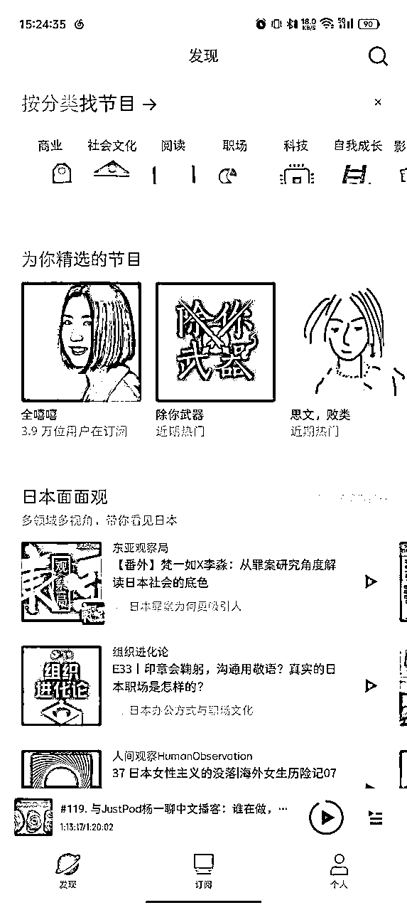

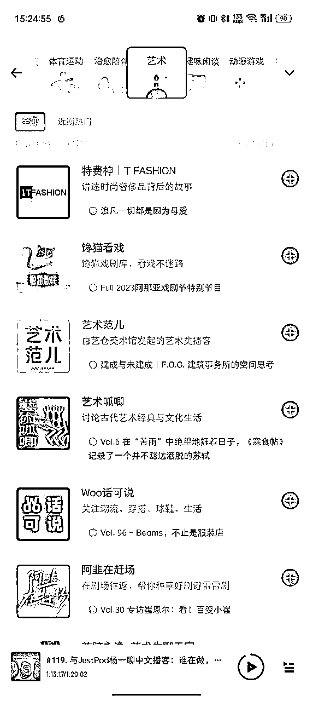

播客可以分为许多不同的分类，具体分类取决于内容和主题。以下是一些常见的播客分类：

故事讲述类：通常讲述真实或虚构的故事，涵盖了各种情感和题材，可以是真实生活故事、惊悚小说、戏剧等；

学习和教育类：旨在分享知识、技能和教育内容，涵盖从语言学习、科学知识到历史、文化等各种主题；娱乐和文化类：涵盖了娱乐、流行文化、电影、音乐等内容，可以评论电影、讨论流行文化趋势，或者探讨特定的艺术形式；

技术和科技类：内容更垂直于科技、互联网和计算机领域，可以介绍新技术、编程、互联网趋势等内容；健康和生活方式类： 涉及健康、心理学、生活技巧和幸福等主题，可以提供健康建议、生活指南和心理健康支持；

商业和创业类：更关注商业、创业和职业发展，可以提供创业经验分享、商业洞察和职业建议；旅行和探险类：涵盖旅行、探险和文化交流等主题，可以分享旅行经验、目的地介绍以及文化体验；

专业领域类：聚焦于特定的专业领域，如法律、医学、金融等，为从业者提供专业知识和见解。

许多平台也有自己的内容分类标准，大家可以随意点开一个常见播客平台，感受一下氛围。无论你对什么感兴趣，都可能会有与之相关的播客节目。

## 1.2 常见的播客平台

常见的播客平台有：小宇宙、喜马拉雅、网易云音乐、苹果 Podcasts、荔枝 fm

本章节，我们来简单介绍这些常见平台及其优劣势，大家可以由此选择适合自己发展的播客平台。

小宇宙

对于创作者来说，小宇宙是目前最推荐的播客 APP，大家可以在应用商店自行下载。

小宇宙的播客注册流程和托管功能非常丝滑，不同于其他综合类音频 APP（比如你还可以在网易云听原创音乐、在喜马拉雅听有声书），小宇宙是播客垂类 APP，也就是说下载小宇宙 APP 的人都是为了听播客的人，从源头上就保证了你的听众了解“播客”，是“播客”的受众。

而且小宇宙可以在 Show Notes 界面（可以先简单理解为节目简介界面）里面贴上你的二维码，方便听友与你同频沟通且不会被限流，非常方便！

喜马拉雅

喜马拉雅是目前国内最大的音频分享平台之一，汇集了有声小说、有声读物、有声书、儿童睡前故事、相声小品、鬼故事等数亿条音频。

它的优势是体量大，覆盖面广，但劣势也是在于覆盖面广，平台容纳了非常多的音频内容。今年喜马拉雅也在大力扶持播客生态，如果你想做一个播客，喜马拉雅和小宇宙同样重要，你可以将做好的播客内容同步上传至喜马拉雅。

网易云音乐

网易云音乐的主要使用场景是听歌，但它其实也提供丰富的播客节目，包括新闻、科技、音乐、文化等内容。

网易云音乐的用户数量较大，但大部分用户可能并不是冲着“播客节目”而来，大家很难在上面找到自己的精准受众。跟喜马拉雅一样，你可以通过 RSS 链接把你的节目同步到网易云音乐，同样建议大家将其作为一个同步播客内容的平台即可。

*RSS 是站点用来和其他站点之间共享内容的一种简易方式（也叫聚合内容），通常被用于新闻和其他按顺序排列的网站，例如 Blog。

苹果 Podcasts

作为全球最大的播客平台之一，苹果 Podcasts 也是许多人收听播客的首选，它与苹果设备紧密集成。但局限性也在于， 该应用只在 iPhone、iPad 和 Apple Watch 的 App Store 中提供。

是否选择使用苹果 Podcasts 来发布播客作品，可以根据你的目标、受众以及播客的性质来决定。

荔枝 FM

荔枝 FM 是一款中国的在线音频平台，提供广播、电台和播客等内容。它于 2013 年上线，成为中国最早的音频直播平台之一。荔枝 FM 通过移动应用和网页提供音频节目的收听和下载服务，用户可以在平台上收听各种类型的音频内容，包括电台节目、音乐、有声读物、情感心理、娱乐、财经等多个领域的内容。

你可以通过 RSS 链接把你的节目同步到荔枝 FM，同样建议大家将其作为一个同步播客内容的平台即可。

*RSS 是站点用来和其他站点之间共享内容的一种简易方式（也叫聚合内容），通常被用于新闻和其他按顺序排列的网站，例如 Blog。

## 1.3 播客项目值得做吗

为了解答这个问题，我们简单梳理一下播客项目的基础优势：

制作门槛相对较低，甚至只需要有手机，就能开始录制自己的声音或对话；

主题广泛，从你的兴趣爱好到专业知识，都可以成为播客的内容；有利于搭建个人 IP，如果你在特定领域有专业知识或独特见解，播客可以帮助你建立声誉，吸引更垂类的粉丝，从而建立起自己的 IP 或扩大已有 IP 的影响力。

从项目门槛和发展空间来说，播客是值得大家探索的一个玩法。

当然，有人担心，现在的播客市场有多大？能够承载多少商业发展的机会？

根据知名市场研究机构 eMarketer 调查，2021 年中文播客的听众数量就已经达到了 8600 万，2022 年超过 1 亿人次。与中文播客听众数相呼应的是，中文播客的数量也在成直线攀升，截止 2023 年 5 月，中文播客的数量已经达到 5.7 万。

根据预测，中国市场播客的消费规模在 2023-2024 年间还会保持年均 15.8%的增长，增速位列全球首位。

如今，播客市场正在尝试一系列新的探索，其中不乏已经构建出良性商业模式的播客品牌。

不仅是对于个人，从品牌、公司、集团的角度来说，播客可能会成为“双微一抖一红”一样标配的存在，未来会是“双微一抖一红一播客”的存在。

大家可以尝试思考一下：现在去哪找一个长达 60 分钟的品牌沟通场景？

相比种草追求泛泛地铺流量做曝光，种树更多地是倡导对有购买力的精准消费者的深度沟通。“播客种树”，就是因为播客可以为品牌带来长期建设，而不止是短期卖货。

你几乎很少能找到其它媒介载体，能让你的受众沉下心来，花一个多小时与你建立这种深度的沟通与陪伴。

在此过程中，你有充足的时间将你的品牌故事娓娓道来，在消费者心中悉心浇灌；

你可以树立独特的品牌理念，让忠实拥趸主动传播、开枝散叶；

你还可以将他当作对抗短内容信息洪流的武器，积累更长久的品牌资产复利，前人栽树后人乘凉。

## 1.4 谁更适合做播客

当然，做播客也有一定门槛。

对于创作者而言，需要具备一定的内容创作能力、表达能力、社交能力和适应能力，这些能力能够支撑你产出播客内容，也是决定你的播客风格的关键。

具体表现为：需要有创造有趣、有价值的内容的能力，能够选择适合的主题，编写脚本或大纲，并在播客中进行有条理的表达；

需要有清晰的声音表达能力，能够有自信地说话，使用适当的语调、语速和情感，吸引听众；

能够与粉丝互动，给予适当的反馈，从而建立起紧密的社群关系，提高听众参与度；有良好的社交能力，能够完成嘉宾的邀约、沟通与访谈（单人播客可以先忽略这点）

同时，需要创作人能够想办法解决节目的音频剪辑问题，这个可以是自己剪辑（需要自己具备剪辑能力），或外包给其他团队。

上述能力都有助于制作播客，但并不是每个播客创作者都需要精通所有领域。你可以在你擅长的方面发挥优势，粉丝一定也是因为你的独特价值聚集而来。

硬件设备上，播客没有太高要求，只用一个手机也完成你的播客创作。

当然，你也可以为自己配备更专业的设备，具体设备推荐和价格可以查看【第四步：播客访谈、录制与剪辑】。

总之，普通人也能做播客，不需要特殊的背景或技能。只要你有热情和愿意学习，你可以通过播客与世界分享你的故事、知识和观点。

播客还是很好玩的，通过制作播客认识的很多小伙伴也是很开心的一件事情。

同时，播客制作也是一项需要耐心和毅力的工作，需要花费大量的时间和精力，才能做出一份真正优秀的作品。但是，只要你热爱播客，有着坚定的信念和不懈的努力，就一定能够成功地制作出一份优秀的播客节目，收获足够多的正反馈。

## 1.5 变现模式

为爱发电之余，我们也需要考虑变现。

目前播客整体环境下，常见的商业变现方式有这 5 种：广告、周边、线下活动、付费内容和社群变现。

### 1.5.1 模式一：广告

广告的变现形式

广告是目前最普遍，也是大家感知比较深的一个变现方式，大家会看到很多播客在接广告，一般分为口播广告和定制广告。

口播广告是在节目前的贴片广告，对后续内容影响不大，通常较轻量级；

定制广告则围绕品牌和推广主题展开，是针对某一期节目量身定制的广告形式。定制广告还通常包括品牌植入，社区和社群同步，目前看到的案例是《凹凸电波》和《末日狂花》做得比较好。

广告还有一种特殊形式，是对一季节目进行赞助，比如说一季可能是 10 期、15 期。

这种广告形式相当于品牌推广，走的是 PR 费用。一季赞助需要与品牌建立足够多的信任，一般会先试投一期看效果，如果不错的话可能会购买年框，即在一年内露出 3 到 4 次。

这种赞助形式对于新手播客来说没有太大的借鉴价值，因为一般是品牌创始人决定要在整季节目中冠名，且很难衡量转化结果，更偏向纯品牌宣传。而目前市场上品宣向的的投放占比比较少，所以如果播客想接广告，需要思考能否帮助品牌赚回投资，比如帮助带货。所以大趋势来讲的话，肯定还是口播和定制的相对来说会多一些。比如有一个低度酒品牌 Jollee ，他们倾向于在开头两三分钟介绍品牌和最新优惠信息，据说投放效果很不错。

定制广告怎么做？

对于定制，我们会看各家节目对于定制的理解。

有些节目认为定制就是在节目的 Show Notes 中露出广告，然后在开头和结尾致谢广告主，但中间不会过多介绍产品。这取决于各家节目的调性。

例如，如果是一个文化类节目，接到护肤品广告时，不可能在讲书的过程中突然介绍护肤品的功效。本身你在开头结尾致谢就是挺硬的广。

而像《末日狂花》这种本身是有点好物分享的性质的播客，就可以在开头结尾致谢之外，在播客中间 cue 产品的功效。

你可以有自己做广告的态度。

比如《末日狂花》，做广告的态度一直是明确告诉观众这是一个广告，而不是软广或隐晦的广告。我们会告诉你这个产品很好，我自己也在使用。我们会给你提供一个很好的价格，你可以选择购买与否。因为钱是掌握在观众手中，我们不会强迫别人花钱，只是提供足够的信息让观众自己选择。

如何进行广告报价与谈判？

你需要让品牌方知道你的人群价值。

因为很多品牌方看不到什么数据，他们只能看到你的粉丝数量，所以他们常常会将你的粉丝数乘以一个系数来报价。

但对于垂直领域的节目来说，这种方式不友好。你需要有足够的数据证明你的用户质量非常高，购买力也很强。你需要提供这些证据来辅助你的广告定价。

那么如何报价比较好呢？

其实这涉及到报价心理学。通常情况下，许多人都没有报价的经验，他们会说你开个价，然后你就会被压价，你报的价格可能会让你自己觉得有些贵。

目前没有通用的参考报价。

我们看过许多家的刊例，分析了不同品牌的报价和粉丝比例、播放量比例等，没有发现任何相关性和规律，每家都根据自己的方式说服品牌方接受定价，品牌方也会从他们的视角进行比较，比如不同的播客的报价是怎样的，进行横向对比。

很多人觉得现在的报价生态还是一个黑暗森林，每个人都想知道别家的报价。但我认为这种信息并没有实际意义，因为如果你在这个领域里具有独特的优势，没有人与你有差异化，你就具备足够的定价权。

如果你毫无头绪，可以请教有经验的业内老师帮你分析。如果没有了解节目定位和受众情况，一般很难给出通用的建议。但如果有更具体的数据和节目信息，可能可以给出定制化的建议。

分享一个报价小技巧可以在一开始时比自己预期的要高一点来定价，至少要定一个自己不会亏的价格，避免觉得自己白做了广告，有一种吃亏的感觉。

即使定价高了，不一定能成交，但是成交次数越多，数据就会更清晰。

当然，大胆地报价，并不意味着对方会接受。如果对方不接受，这个价格就会悬在那里，不是一个真实的价格。所以，报价最好有往期成交数据作为佐证才能成立。

对于没有接过广告的主播，可以先分析自己的观众群体，给自己设定一个满意的高价格，并努力说服广告主。如果实在不能说服对方，我们可以尝试找其他广告主。

你如果迎合甲方的低价，其实做的东西自己也会不开心，你会觉得这么点钱我还要做广告，我还要面临掉粉的风险，很亏。

打广告担心掉粉怎么办？

如果做广告时担心会掉粉或者感到不开心，有没有一些好的方式让用户听到广告后不会反感？有没有一些注意点？

答案是：你永远无法让所有人都喜欢你，所以你无法预测发出广告后是否会掉粉。但只要你的涨粉速度够快就可以了。

我们可以尝试作为一个粉丝，来分析粉丝的心态：作为一个粉丝，我会为我喜欢的人接广告感到开心，因为我知道他全职做这个工作，如果没有广告方的金钱支持，他可能会断更；

作为粉丝，我希望他能够持续更新，我会理解他接广告；

甚至如果广告恰好是我需要的产品，我会购买。

所以如果因为发广告而掉粉，那这部分人本身就是 bp 粉（即白 piao 粉）。对于 bp 用户，发广告反而是一种好的方式，提纯了。

关注数不重要，你只要留下真心喜欢你支持你的人就可以了。

以《末日狂花》为例，《末日狂花》的广告听起来挺好的，因为主播们真实地使用这些产品，并分享了他们的使用心得和场景，所以听起来比较自然。

此外，《末日狂花》的广告常常很有创意，有一次在分享香水时进行了拟人化，即使粉丝本来不想听这个广告，还是不知不觉地听完了，大家会想象那个画面。这些小巧思大家可以多多参考，也可以多听听对标账号找灵感。

### 1.5.2 模式二：周边

IP 周边的受众就是喜欢你，愿意为你花钱，但这个周边可能并不是最刚需的或者最划算的产品。

周边的范畴很广泛。

比如说徽章，塞尔达游戏里有一个生物叫克洛洛，你碰到它，它会给你一个克洛洛果实。《末日狂花》的徽章赠送方式就是你在线下碰到我，我会给你个徽章。这就是这个徽章的用处。

《末日狂花》也有做 T 恤，其实一开始只做了 3 件自己穿，但是发到群里大家觉得挺好看的，我们就想后面办 VIP 线下活动可以送这些 T 恤，只送不卖。

因为卖文化衫它不是一个很好的生意，首先你市面上能看到很多定制 T 恤的店家，一件成本也就四五十块。如果你选一个好一点的 60 块的棉料，你肯定希望它卖得贵一点，你可能要卖 120 一件或者 99 一件。但它是个广告衫，我 99 块优衣库能买两件了，除非真的爱你，不然很难有粉丝会买。

IP 周边已经不是以物美价廉为目标了，更多是一种表达爱的方式。所以大部分的周边定价都比较低，这可能会导致一些质量问题。

同时，设计周边也有一定门槛：如果你做的东西很模板化，就没有让别人有强烈的购买欲望。

综上，对于考虑变现的人，不建议将 IP 周边作为一开始的变现方式，它也不应该是你主要的变现方式。回报率和投产比相对不高，也容易被吐槽。

凡事先问一下自己：为什么这件事情你能赚到这个钱，这是我们做播客商业化的最核心观点。

为什么是你赚这个钱，而不是别人？

你跟别人有什么真正的差异化的点？

你的绝对优势是什么？

你能给为你付费的人带来什么价值？

当然，如果你想用周边来变现，我们也找到一些变现案例供大家参考。

卫衣

去年文化有限出了一个卖得很好的卫衣，很多人都买了。之所以卖得好，是因为他们是中文播客最头部的节目，粉丝基数非常大。

周边店铺

姜思达的店铺有卖周边。较为便宜的商品通常卖得比较好，但是高价位的产品会比较困难，因为高价位的商品只有真正喜欢的粉丝才愿意购买。

比如他们卖四五百块的酒，虽然本身的定制成本很高，但是消费者的选择范围很大，不一定会购买他们的酒。这主要取决于有多少真正愿意为你花大钱的粉丝。

抱枕、冰箱贴

我还看到其他节目做过一些其他 IP 周边，比如抱枕、冰箱贴等，成本不高，起订量也不大，发现实际上没有太多人会购买，基本上都是朋友支持。所以如果大家想要靠周边赚钱，就需要走量，门槛要求比较高。

知识型周边：比如课程、知识地图、书籍等等

知识型的周边卖得很好，单品销售额达到了一两百万，利润率也比较高。但是要说的是，做这些周边时团队投入了很多精力，一个团队大约十个人，半兼职，投入了大约半年的时间，其中至少有一两个月是全职投入的。这样的投入下，才有了相应的业绩。

所以大家要做周边，要考虑是否有这样的投入程度和期望回报。另外，还可以拓宽想象空间，不仅仅局限于实物周边，还可以考虑其他形式的周边。

比如《提钱退休》的乌素老师自己做了小报童专栏教大家做小红书，将播客粉丝转化到专栏，很多听众对进一步学习感兴趣，就会购买专栏。

所以专栏也可以看作是播客的 IP 周边，它是一种知识型的周边。

### 1.5.3 模式三：线下活动

接下来我们聊第三种的变现方式，就是线下活动。

播客线下活动是如何商业化的呢？

如果是常规的线下活动或线下录制，比如广播节这种活动，主办方承担了线下的成本，可以给用户免费参与的机会，不建议收费；

但如果目标用户群比较集中，可以针对他们进行一些线下收费活动。如游学活动或线下课程，这样既满足他们的需求，又是他们愿意投入成本的好的变现模式。

重点是让用户感到自己花钱有价值。

以下是《末日狂花》和《消费圈内人》的线下活动经验，大家可以参考：《末日狂花》之前在上海的广播节，给了我们一个摊位，我们去跟粉丝做线下见面，没有收钱。

还有一种是跟品牌联名的线下活动，我们也不会收费，但是会优先邀请给我们提供过帮助的业主来参加，作为感恩回馈。

《消费圈内人》还会办一些线下的课程和游学活动，这些活动是收费的。

因为这个播客项目的定位是年轻人的第一个 MBA，我们将 MBA 的各个模块，如游学、课程、行业交流、大会等等模块化，根据个人的时间和需求选择上课程。

因为前期对接当地资源、老师和场地都会产生成本，所以这种线下活动肯定要商业化。我们不是做公益的，但我们提供的服务，如果用户需要，他们会来找我们。

所以衡量线下活动是否收费的一个标准是：是否提供了用户需要的服务。

综上，线下活动算小额收入且用户期望值很高，如果无法满足用户的期望，很难做好。所以不建议轻易做这种只赚取小额收入且交付预期高的活动。

### 1.5.4 模式四：付费内容

播客的付费模式一般有两种：付费订阅和赞赏。

赞赏和付费订阅是完全不同的逻辑。赞赏是听完节目后选择是否打赏，而付费是用户有需求才会花钱购买内容，这是完全不同的心理。并且，大部分节目的赞赏数据都较少，甚至有些大播客可能没有赞赏，但这并不意味着他们的商业能力不强，可能是因为用户在其他地方已经消费支持，如购买付费内容或加入会员群。

付费订阅数据也在一定程度上决定品牌方的投放意愿。付费数量在品牌方眼里不是单纯的付费数量，而是用户愿意为你付费的意愿，因为品牌方投你希望你能带货。

如果你的数据没有办法去佐证你的带货能力，或者你的用户愿意付费的能力的话，其实很难把你的刊例价格喊高。

付费内容的关键，是要有精准的用户画像。

《末日狂花》试水了一期付费订阅，付费数据是上线到下单 10 天，卖了 1700 多份，还不错，定价为 4 块 9 毛 9。

所以小播客也可以尝试做付费单集。

在一开始可能没有很多变现途径的情况下，通过做付费内容可以了解用户的需求并进行测试。付费意味着用户真心愿意为内容付费，这样你才能知道他们是否真正对此感兴趣。

免费的播客大家都会听，所以听众数据的高低并不能代表什么，但付费就证明需求比较强烈。如果付费后得到的反馈也很好，那就说明你选择了正确的方向，可以长期坚持下去。这是一个很好的模式，可以进一步推动播客的商业化。

### 1.5.5 模式五：社群变现

建立 IP 社群后，你可以做社区团购、知识付费、训练营陪跑等承接项目。

以《末日狂花》为例。

《末日狂花》现在有 13 个听友群，将近 6000 人，入群率非常高。这些群聊还承载另一个功能，即用来做社区团购。

《末日狂花》选品走的是高端、轻奢、小众风格，所以从整体氛围打造上，运营组会想办法让整个群看起来符合调性，让用户感觉你进来就是富姐富哥，需要去买一些配得起自己生活品质的东西。

其实在播客项目上，关注数不是第一重要的数据。对于品牌主来说，只有 1 万以上和 1 万以下，或者 10 万以上和 10 万以下的区别，只要你做上 1 万粉，就可以商业化，就是个大播客了。

这之后，更多要做的就是精细化运营你的用户，做社群，维持群活跃，并以此为基石构思更多商业化途径。如果单单依靠广告收入，在变现上是非常被动的，看天吃饭。

对于播客创作者来说，可以借鉴前辈的经验，尝试多种商业化路径，找到投入产出比最高的那个路子，然后深入发展。

同时，继续回归到我们最开始的那个问题——为什么这个钱是由你来挣？

# 第二步：筹备播客

## 2.1 播客的定位

很多朋友来问我，我想做一个播客，但是我不知道做什么样的播客，你能帮我梳理一下吗？

收到这样的问题实在太多了，所以，我总结了【灵魂 6 问】，想清楚这 6 个问题，甚至——能回答上来第一个问题，播客定位也就迎刃而解了。

这是怎样的一份神秘问题清单呢？ 我先卖个关子，具体内容在下文【2.1.1 方向定位】中展开。

我不建议大家一上来就根据“商业”“成长”“体育”“休闲”等等，这些播客平台上客观划分的类目来做定位。

### 2.1.1 方向定位

我做内容定位第一原则就是——从你自己这个人出发。你是什么样的人，你就做什么样的播客。不要被类目限制住。

播客是一个听友与主播之间关系最紧密的内容形态，日常生活中，即使是亲密的朋友，也很难做到一年时间里听你说话听到 50 个小时，而播客听友和播客主播的关系却是——“天呢！我竟然听这个人说了 100 小时的话！”

而每一句你在播客里说的话，都是你这个人本身特点的一个切面呈现，如果你做的播客不是从自己出发，那硬拗的感觉会很难受，听友也会听出来。

做播客也是一个内观，重新发现自己，并且放大自己最长板的过程。

播客是一个需要你强语言输出的内容表达形式，如果有一个话题你能和朋友滔滔不绝聊上 4-5 小时，那说明你本身对这个话题内容有着丰富的积累，且你愿意以对谈的形式向他人输出你的知识和观点。

在我看来，做什么样的内容就吸引什么样的人，反之，想要吸引什么样的人，你就可以做什么样的内容。但对于内容素人（此处指非媒体内容行业从业者），想要做出和自己本身特点不一样的内容，着实是一件难事，所以先从剖析自己自身特点和长处的角度出发，来梳理自己的内容定位，这是我推荐的第一步。

那么到这里，也该揭秘【灵魂 6 问】具体是什么了：

有什么话题，你可以和朋友滔滔不绝聊上 4-5 小时？

有什么领域，是你成长至今，花了最多时间去研究的？

和你的同龄人相比，有什么是“你有别人没有”的特点？

大家都会用什么词来形容你？

你最喜欢的播客是什么？这档播客最吸引你的点是什么？你觉得这个特点在你身上也有所体现吗？

你想通过制作这档播客吸引到什么样的朋友？

这些问题的答案共同构成了你所制作的这档播客的性格底色。

举例：旺仔珂珂糖的【灵魂 6 问】回答有什么话题，你可以和朋友滔滔不绝聊上 4-5 小时？

好物推荐、情感恋爱、香水、威士忌、餐厅推荐、行业信息沟通（消费、互联网、vc）。

有什么领域，是你成长至今，花了最多时间去研究的？

如何让生活过得更开心，让人生过得更丰盛。

和你的同龄人相比，有什么是“你有别人没有”的特点？

更社牛，更喜欢尝试新事物，行动力 max，认识非常多各行各业的朋友。

大家都会用什么词来形容你？

喜欢组局介绍朋友们互相认识的开朗连接者。喜欢讲段子和丢烂梗。行走中的种草机。

你最喜欢的播客是什么？这档播客最吸引你的点是什么？你觉得这个特点在你身上也有所体现吗？

我 2022 年最喜欢凹凸电波！最吸引我的点是那种节目中的欢脱氛围。我觉得我也是欢脱氛围的制造者。

你想通过制作这档播客吸引到什么样的朋友？

通过这档播客吸引到也喜欢研究「如何让生活过得更开心，让人生过得更丰盛。」的朋友们。

综上，所以旺仔珂珂糖做了一档围绕都市女性的情感生活、好物分享、行业经验、生活吐槽的杂谈类播客《末日狂花》。

### 2.1.2 差异定位

本章节，我们来看一下如何找到对标，细化你的差异性，做出你的特色来。

做播客前，先关注下“收听时长”

我发现很多人对播客都有误解，觉得不就是找几个朋友聊聊天吗？

对于这么想的人，我一般会接着问：你小宇宙收听时长多久啦？

如果对方问我“小宇宙是什么呀”，那我真的是当场表演一个晕厥了。

不会吧不会吧，不会真有人想做播客，但都没用过小宇宙吧……

在所有开始的开始，先请大家下载「小宇宙 APP」收听至少 30 个小时， 听过至少 30 期不同的节目。

为什么是 30 个小时呢？

通常来说，一集节目的时长是 1 小时左右，30 小时的基础收听量可以让你至少可以听完 30 集不同的节目，有些节目也许对你胃口，你愿意把它们听完，有些节目也许你听了开头就想关掉，那你也可以再思考更深一步，为什么这个节目开头就想让你换掉，如果我自己来做，该如何避免出现这个场景。

然后结合【章节 2.1.1】里给大家提供的灵魂 6 问的结论，再来问自己以下这些问题（咱们在本播客手册中只讨论简体中文播客场景）：

我想做的内容，现在小宇宙上有没有主播做类似的？

如果有，ta 现在做的怎么样？分析 ta 做得好的原因。

思考：我能不能做的比 ta 更好？

我能在哪些方面比 ta 做的更好：比如请更大咖的嘉宾，做更独家的内容选题、更有趣的切入点...如果没有，分析没有的原因：比如话题太小众、话题太敏感...

我对做内容的观点是这样的：先大量输入，再精简输出。

想做好内容，请站在巨人的肩膀上

一个听友，愿意花宝贵的 1 小时来收听我的节目，那我一定要带给 ta 在其他节目上收获不到的东西，也就是所谓的“信息增量”。

那怎么样制造“信息增量”？

最简单的也是最苦的笨办法就是，把市面上相似的账号和内容都听完看完，分析人家为什么做得好，拆解人家的内容结构，然后再加入自己的独家创新点（【章节 2.1.1】中有教大家怎么发现自己的独家特点）。

我们内容行业有一条潜规则，爆款的底层结构逻辑都非常类似，因为从人性的角度来说，能引起大家好奇心、想要点进去的无非都是相似的那些东西。所以，一上来就去学习+拆解做的好的内容，对自己内容的提升会非常大。

2 个思路轻松找到对标账号

关于怎么找到对标账号，我给一个不一样的思路。

比如你想做一档职场类的播客：常规找对标：小宇宙 APP 搜关键词——职场

这时候出现的都是名字 or 简介里带“职场”二字的播客，这个故事也告诉我们在取名字 or 写简介 or 取标题的时候可以加入这种“大范围词”来提高自己被搜索到的概率（一个 seo 小技巧）。

进阶找对标：小红书 APP 搜关键词—— 职场+播客

这时候你会发现，出来的搜索结果和小宇宙 APP 的结果完全不同，因为小红书上最近几年出现了大量播客推荐内容，都是基于原 po 的人工筛选并且组成合集，有很多单集推荐合集，这个对于大家找对标非常有用。

并且你可以在评论区看到许多大家对于这些播客的评价和观感，除此之外，你可以戳进大家的头像看看大家都在过什么样的生活，是什么样的人生阶段。

更好帮助你理解这些播客的受众是什么人群？是否是你想要吸引的那部分人。

接下来，结合这两个 APP 上的搜索内容，列出 20 档播客和 20 期节目，这 20 期节目不一定是 20 档对标播客里的，不用设限。

对于对标播客重点观察：简介写法、shownote 写法、标题取法。

对于对标节目重点观察：听完，评论区看完，内容结构是什么样的，内容主线是什么走向，评论区互动钩子留的是什么。

找出他们能成为“爆款”的共同性，然后加入自己的独家创新点。

## 2.2 播客的形式

播客的内容形式可以说是五花八门，有一个人录单口的，有两个人对谈的，还有多个人一起聊的。那，咱们到底该选哪种呢？

其实，内容形式并不一定是固定不变的，如果你听得够多，你会发现甚至一档节目里就有不止一种形式。所以，我们这一节主要会挑几种比较有代表性的形式跟大家介绍，大家可以根据自己的情况来参考。、

下图为「播客形式」的思维导图，大家可以结合思维导图来理解本章节内容。

### 2.2.1 单人发起

如果你现在没有搭档，或是想打造自己的个人 IP，那么可以重点看这部分。

假设你有成体系的内容可以输出，那我非常推荐你一开始录单口，也就是一个人录制。这样能把你的内容完整不被打断和曲解地传达给听友，而且不涉及邀请嘉宾、对访问提纲等工作量，启动速度会比较快。

而且，一上来先做几期单口，可以让播客听友对你和你的理论先有一个认知（一上来就做对谈，可能会弱化听友对你个人 IP 的认知）。

但是单口播客也存在一定的局限性，因为个人的经历+理论输出是有限的，后期大概率会面临素材枯竭的瓶颈。

这时候，我就非常推荐大家采用对谈形式了。用别人的经历和故事来补充自己可能面临的素材枯竭。

当然，对谈类播客的天花板取决于社交圈的大小和请嘉宾的能力。我们后面的章节也会教大家怎么样去邀请嘉宾。

总结一下&举个例子，方便大家对号入座：如果你在某一领域深有积累，那你很适合做单口

这里举例播客《联名关系》，这是一档由“丁不拉咚”主理的讲述品牌联名、IP 授权、播客串台、明星合作的播客。一共四期，已经完结，全部由“丁不拉咚”独立输出。

如果你在某一领域广有人脉，那你很适合做对谈

这里举例播客《乱翻书》，这是一档由“潘乱”主理，关注商业、科技、互联网的从业者的对话节目。每一期潘乱都会邀请对应话题的行业嘉宾，来根据当期主题展开聊聊。

如果你在某一领域深有积累又广有人脉，那你可以早期先做个人单口输出自己的观点和见解，后面再根据当期主题邀请相应嘉宾。

这里举例播客《量贩冰糖》，这是一档由“范冰”主理的播客，前 11 期是范冰单口输出，12 期开始会邀请对应话题的行业嘉宾，来根据当期主题展开聊聊。

### 2.2.2 多人发起

如果你已经找好了播客搭档，或者本来就是几个志趣相投的小伙伴一拍即合决定一起做一档播客节目，那么这时候我推荐你这样做：早期阶段

先和你的播客搭档根据某些话题展开聊聊，让听友熟悉你们的说话风格和说话声音。

比如播客节目《末日狂花》，开头 4 期都只有主创三个人根据“约会”“鉴渣”“都市丽人一年花了多少钱”“2022 年度好物分享”这种主题展开聊聊。

成熟阶段

后期如果想要拓宽话题的边界，可以开始根据主题邀请对应的外部嘉宾。

### 2.2.3 公司发起

如果你代表公司/品牌来制作一档播客，有以下形式：

不同的主播搭档不同的嘉宾

可以按照「第一季/第二季」等等来划分，比如三顿半旗下的播客《星球电台》、GIADA 旗下的播客《岩中花述》，每一季/集都是不同的主播搭档不同的嘉宾。

相同的主播搭档不同的嘉宾

这里面的主播可以由公司内部的创始人或伙伴担任，也可以外部请播客厂牌旗下的主播来代劳。这里举例：耐克旗下的播客《耐听》。

*公司/品牌类的播客玩法还有很多，此处因为是针对初学者的播客制作指南就不再赘述。

## 2.3 播客起名

本章节核心内容：如何起一个高传播性又有趣的播客名字？

我常和朋友开玩笑说，现在的播客太多，谐音梗都不够用了。

其实取播客名字不只是谐音梗一条路啦，我们列了几种起名思路和对应举例，也在本小节末写了一些不建议的方向和起名决赛圈的 PK 小技巧，希望对你有所启发。

先回答一个经常被问到的问题：播客名字几个字好？

其实播客起名没有明确的限制，只要不重名，都可以用，但一般来说，更推荐 3-4 个字的播客名字，因为好记，传播度更好，最好能在看到这个名字的第一眼就知道你要讲什么主题，降低理解成本。

### 2.3.1 起名思路参考

主要有以下这些起名方法：

主创名字起名法、播客主题取名法、 谐音梗、带公司&组织大名取名法、小圈子梗&致敬经典作品。

前 4 种方法比较好理解，我们就直接举几个例子，最后一种取名方法我们以《末日狂花》为例来展开讲讲。

① 主创名字起名法

适合主创有个人 IP，名字取自于主创，有利于粉丝快速识别，且播客传播也利于个人 IP 的强化。

举例：

冰镇电波——范冰

酸奶哥聊天社——酸奶哥

张春酷酷酷——张春姜思达——姜思达

T 哥的新邮件——Toby

大力如山——王大力

苗师傅——苗炜

小马宋——小马宋乱翻书——潘乱

......

② 播客主题起名法这个是非常通用的一个方法，可以帮助听友快速识别和定位本播客的主题，它的好处是可以让人对于你的播客内容有一个直观的了解。当然，这也要求你对于播客主题的核心关键词提炼到位，让人一望而知，并且能够被吸引。

举例：

剧谈社——翻译艺术品半拿铁|商业沉浮录

美妆内行人

商业就是这样

组织进化论

歪波音室识人识己

Slow brand

Buidler talk | web3 对谈

豆大王的睡前故事

账号侦探早晚卖货

创业内幕

蜜獾吃书

......③ 谐音梗

这个也是非常经典的取名方法，方便识别本播客主题+好玩。

举例：饭不着

大食话

厨此以外

木有娱丸

贝望录......

④ 带公司、组织大名取名法

其实就是把公司名字、品牌名字加上，方便大家识别。

例如：

GQtalk——GQ 杂志

书外 SSI Redtalk——小红书

红了再说——小红书 Gadio ——机核网

耐听——耐克

协和八啦吧——协议医学生

......⑤ 小圈子梗&经典作品致敬

方便小圈子同好一眼识别！

例如：退相干

文一西路夜谈

人间布洛芬

薯条码头

磕学小组星球电台

瓜儿与少年

跳进兔子洞

《末日狂花》

......拿珂珂老师的播客《末日狂花》举例，一方面是致敬末路狂花这部女性主题电影，因为是三位女主播，公路片的感觉也很符合珂珂老师对人生不是轨道是旷野这句话的理解；

另外一方面是玩一个双关梗，这档播客很大一部分比例都会聊消费/花钱，珂珂老师开玩笑说，主创三个人是那种末日到了也要狂花钱的类型，所以叫这个名字～

### 2.3.2 不建议的起名方向

1.不要用生僻词、冷门词、违禁词、会造成理解异议的词语。

尽量不要在名字里面添加标点符号，如惊叹号等，以免不容易被搜到。

如果你的播客受众大部分是简中用户，尽量不要用全英文名字；

4.

如果你一定要取一个第一眼看不出这个播客讲啥主题的名字，请善用“|”和“——”符号，留出一定的解释空间。比如：《剧谈社——翻译艺术品》、《半拿铁|商业沉浮录》。

### 2.3.3 起名决赛圈的小技巧

最后，教大家一招判断自己这个名字有没有传播性和记忆点的小技巧。

你可以先取 3 个候选项名字，然后把这 3 个名字告诉你的 3 个朋友，第二天你再去问他们，“昨天和你说的名字，你记住了哪个呀？” ，取他们都记得住的名字来用。

如果没有一个名字被记住，那咱们再重头开始，再写 3 个候选项，再来测一遍。

## 2.4 视觉包装

本章节内容提供的思路是：作为一个设计小白，且不准备花大价钱去找设计师设计，我该如何设计我的播客 logo，有什么需要注意的地方或者可以让设计更亮眼的地方？

### 2.4.1 三步拆解播客 logo 设计

我们来拆解一下一个最基础的播客 logo 由哪些元素组成：

主题色播客名字

和主题相关的元素（不必须）

第一步：定主题色你完全可以选你最喜欢的颜色来当你的主题色，

但如果你没有颜色偏好，又希望自己的播客能在成千上百个节目中被人更好注意到，这边有一个非常好上手实操的小技巧给大家：点开你的小宇宙 APP - 点开「订阅」- 截屏第一页 - 往下滑，截屏第二页 - 往下滑，截屏第三页

现在，你得到了三页带有不同的播客 logo 的截屏清空你的大脑，用 fresh eye 去看这几张截屏，记住你最先看到的几个 logo。

抽炼这些 logo 的颜色共性。

你可能会得到这样的结论：第一眼看到的是黑白、黄黑、蓝紫这种撞色配色；

第二眼看到的可能是高饱和度的红色、蓝色、橙色。

得出以上结论之后，你就可以按照这种配色思路来设计自己的 logo 了。

《末日狂花》 logo 设计的时候，我们也用了这个小技巧来选主题色，我们最后选择了爱马仕橙。

第二步：字体设计

推荐大家几个很方便的设计工具网站：可画：https://www.canva.cn/

稿定设计：https://www.gaoding.com/

创客贴：https://www.chuangkit.com/

按照播客创作者的说法：“可画帮了我好多，所以我直接开了年费会员，毕竟这个钱还不够专业设计师朋友出一张图。”

当你在这些网站上购买了会员，你就可以使用到一些可以用作商用的素材和字体，有种零基础无痛当设计师的快乐，非常方便。

最简单的 logo 版式就是，你的主题色当底板颜色，上面加上你的播客名字。logo 尺寸记得选 500*500。

这边有一个小 Tips：字号一定要大！字号一定要大！字号一定要大！

要记住你是为了让自己在成千上百个播客 logo 中第一眼被看到。

第三步：加点和主题相关的元素其实对于很多人来说，前两步就可以得到一个 可以用的播客 logo 了，如果你还想加点小心机，可以在上方推荐的网站中寻找你喜欢的素材添加，或者导入美图秀秀、醒图等修图 APP 添加自己喜欢的元素即可。

### 2.4.2 运用 AIGC 来辅助设计

如果你觉得这些都满足不了你，这里提供一个更好玩的思路：运用 AIGC 来辅助你设计。

只需要在以上步骤之前，多加一步。

点击如下网址，先用 AI 生产 logo，你会得到非常多案例，虽然结果不一定让你一下子满意：https://www.logosc.cn/

没事，这只是为了让 AI 替你做了建立 Mood Board 这一步。Mood Board 也称情绪版，通常是指一系列图像、文字或样品的拼贴组合物，用来展现设计师对一个项目的想法或感觉。

这里举例一下用 https://www.logosc.cn/，建立《消费圈内人》logo 设计的 mood board 截图：

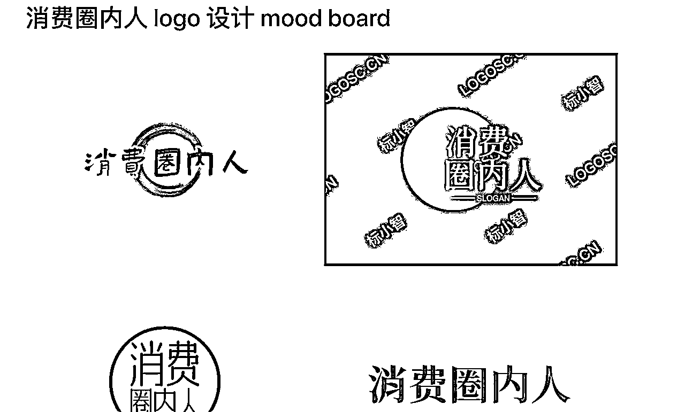

如何得到这样一个 Mood Board 呢？我们以“宠物研习社”为例，来跑一下这个流程。

第一步：

点开 https://www.logosc.cn/，并点击「在线 LOGO 设计」，再点击「开始」

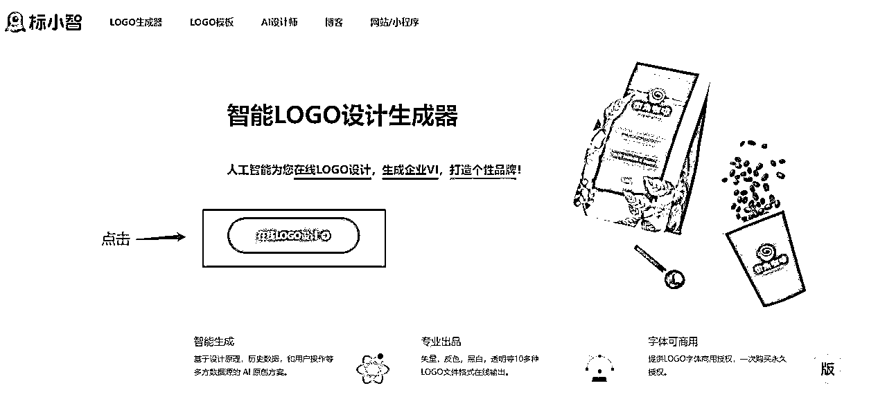

第二步：

填写你的 LOGO 名称，口号一栏系统会根据你的 LOGO 名自动填充，你也可以自己修改：

第三步：选择你的行业，如果不想选择也可以直接跳过：

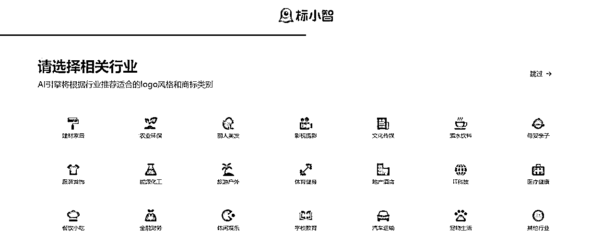

第四步：

选择你喜欢的色系和字体风格，可以多选，不喜欢可以跳过：第五步：

得到你的 LOGO Mood Board（在上方小菜单中还可以调整名称、颜色等搭配），了解自己喜好方向：

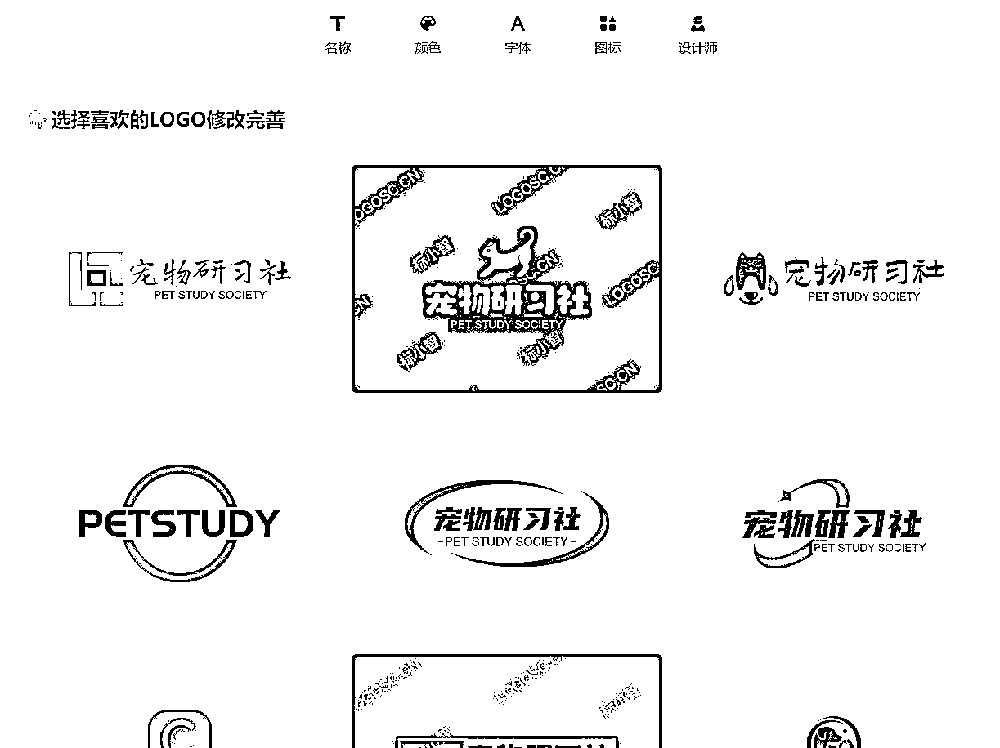

经此，你至少知道了自己在 logo 设计上更喜欢什么，更不喜欢什么。

## 2.5 创建播客节目

我们以「小宇宙」为例，展示播客创建流程。

第一步：点击小宇宙网页版👉小宇宙播客，并登录

第二步：点击“+”，创建节目

第三步：创建节目

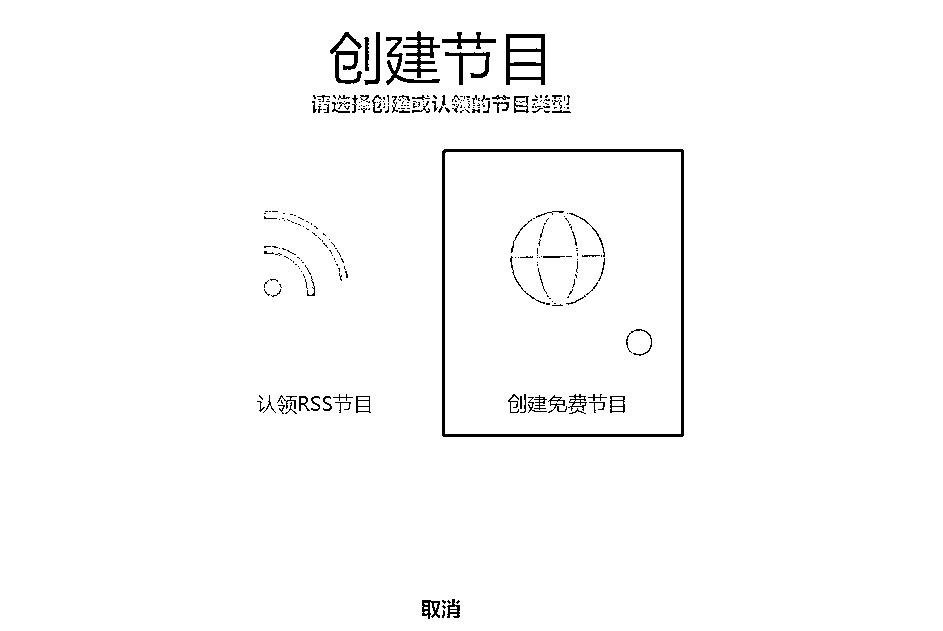

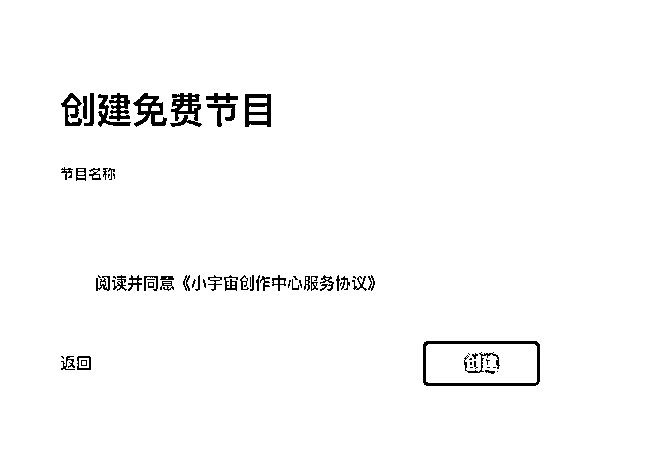

输入你的节目名字即可，恭喜创建成功！

创建节目后，节目需要经过审核期（审核速度较快，一般当天完成）。通过审核后，记得完成实名认证，否则无法上传单集节目。

# 第三步：创作播客内容

如果说前几章的“播客定位”、“播客形式”、“播客取名”、“视觉包装”构成了咱们这档播客的骨架，那这一章节所要讲的“定选题”，就是给这幅骨架填上肉身。

这一章节中，我们会先谈谈播客冷启动时 3 条最关键的底层逻辑。无论你做什么类型的播客，都能获得一些启发和参考。

了解底层逻辑后，我们来一步步探讨选题、节目嘉宾、播客大纲，希望大家能在本章节中，对自己要做的播客内容有一个初步感知。

## 3.1 冷启动的 3 条内容逻辑

### 3.1.1 无论如何，先录个 10 期

据路边社消息统计，很多播客主播都会在第三期或第四期的时候断更。因为很多人在开始之前错误估计了自己可投入的时间，或者说开始做了才发现正反馈不够多（比如希望一期两期就出爆款瞬间涨粉），再加上前期的心态是录一期看一期，所以就会导致非常多播客“烂尾”在第四集。

但是在我们做内容行业的看来，爆款可遇不可求，我们能做的只有是持续稳定地输出高质量内容，然后等。是的，爆款是靠前期的稳定积累，然后在天时地利人和的那刻“等”来的。

这里撇开说两句我对于“爆款”这件事的看法。我认为做内容就像种地一样，踏踏实实做，不低估自己也不要飘。今天播撒下种子，未来长成什么样，都是内容自己的造化。主客体分离看待事物的发展。摒弃一定要冲爆款的妄念。做三月的事情，在八九月自有答案。

所以第 1 条最关键的底层逻辑：无论如何，先录它个 10 期。先把量积累到了，有手感了，咱们再来说怎么打磨修改细节的事情。最值钱的，永远是沉浸在这行里的手感。

所以我们一上来，就要提前做好头 10 期的选题准备，然后无论如何，录完，发布，等待听友的反馈。

### 3.1.2 把关键词打透

当我们有了先录个 10 期的心理准备，我们接下来来看这 10 期的选题该怎么定。

我的观点是，这 10 期是你给点进你界面听友的第一观感，所以一定要让一个陌生人在 10 期里面知道你这个播客在讲什么，和别的播客有什么不同，ta 能在这边收获到什么。

你只有这“十期”，也就是看一眼 10s 的机会让别人记住你，那最好的办法就是聚焦和关键词打透。

还记得在【章节 2.1.1】里提到的“灵魂 6 问”吗？其中第一问就是：

“有什么话题，你可以和朋友滔滔不绝聊上 4-5 小时？”

以《末日狂花》为例，我们来拆解一下什么叫，“把几个关键词打透。”

前文我的一个回答是，关于“情感恋爱”，我可以和朋友滔滔不绝聊上 4-5 小时。

但是“情感恋爱”是一个非常大范围的词语，我们如果要细化到最开始的播客选题，一定要再收束。

举个例子，情感恋爱和鉴别渣男就是两个量级的词语，情感恋爱是一个大话题，鉴别渣男的颗粒度就更细了。那对于播客选题来说，我们需要更细的颗粒度，最好能细化到具体讲哪几个故事。所以在定播客选题的时候，一定要把关键词拆到很细。

那我们有了关键词，也明白了我们的目的是接下来要在 10 期的内容里让大家看到这关键词就想到你的播客，这时候，就要再次用到在【章节 2.1.2】里提到的“想做好内容，请站在巨人的肩膀上”方法。这里不再赘述背后的道理。

直接给大家上步骤：

第一步定自己播客的核心关键词；

第二步搜相关的节目，大量看和听，先发散；第三步再根据自己的情况来聚焦，思考我能在已经有的基础上怎么样做的更好。

如果第三步你的结论是“我没有办法做的比现在的基础更好”，那么重回第一步开始做。

### 3.1.3 讲故事，而不是讲道理

播客不是公开课，不要给听友灌输没有理论&案例支撑的大道理。

人性就是爱听故事，顺着人性来，不要干反人性的事情。

第 3 条和第 2 条结合起来就是，对于播客选题来说，我们需要更细的颗粒度，最好能细化到具体讲这一期节目要讲哪几个故事。

人性就是爱听故事，顺着人性来，不要干反人性的事情。第 3 条和第 2 条结合起来就是，对于播客选题来说，我们需要更细的颗粒度，最好能细化到具体讲这一期节目要讲哪几个故事。

你可以点击这个链接去收听，来感受一下节目的故事感和颗粒度：https://www.xiaoyuzhoufm.com/episodes/63c8af8078910ae65c945a30

## 3.2 确定播客选题

### 3.2.1 寻找选题的 4 种方法

方法一：

最简单的！在听友群里询问你的听友，最近想听什么选题什么内容，或者直接出两个选题让大家投票。

方法二：

根据营销节点来做，比如七夕、情人节、春节等等固定的节日，这些节日节点一般都会有平台给的运营活动机会，可能会得到额外的流量。

方法三：

热门选题是具有传导效应的， 可以关注小红书、抖音、微博等平台的热搜，然后再到播客平台搜索有没有人做过相关的内容，如果做的人少，可以尝试做一下。

方法四：

如何判断你想做的内容是不是迎合了最近的趋势？

利用关键词工具，如 Google AdWords 关键词规划工具、百度指数、微信指数等，输入相关关键词，查看搜索量和趋势，找到受众关注的热门话题。

### 3.2.2 加餐：迎合市场还是做自己？

我们来讨论两个许多人关心的问题：

① 选题需不需要结合时间节点来？要不要有强时效性？

② 要迎合市场还是做自己喜欢的选题？

我觉得这两个问题的底层逻辑是相似的。

做营销的朋友会知道一个东西叫“营销日历”，上面标记了新的一年里一些可被预测的营销时间节点，比如妇女节、情人节等等。你可以在选题规划的时候提前把这些节点考虑在内，因为很多平台的运营同学在节点到来的时候可能会给相关话题的节目更多的“运营流量”。

但是面对突然起来无法提前预测的热点，我的建议是，非内容从业的专业人士不要去追。

理由如下：

1.

制作时间更紧，质量无法保证；

2.

和你竞争这一热点的都是专业人士，素人节目本身就很难跑出来；

3.突然出现的热点可能会打乱你本身已经规划好的内容框架，整体观感会不搭，让你失去自己的节奏；

4.

爆了还好，如果没爆，你的心态会崩，会想说我那么努力追热点为什么没有火，从而丧失对制作播客的热情。

热爱可抵岁月漫长，朋友们，一定要保护好这份热爱。

“不存在追风口的这件事，只有这阵风刚好吹过你身边的时候才有效，你最多离这个风只有三步远的距离，风来了，你迅速挪过去，太远了就无效了。因为有其他离这阵风只有三步远的团队。”

最好的心态就是，踏踏实实在自己擅长的领域做事，风口可能会很快刮到你这边，也可能会很慢，这些都不重要，重要的是你知道了风来的时候，你也能以自己的节奏去迎接，驾驭风，乘风而行，而不是被风吹着跑，就行了。

这里特别想引述马东老师的一句话送给大家：

“如果一个想做节目的人，天天想着他们（受众）想什么，我就给他们做什么，也未必能做好。所以做你自己最擅长的，而且争取把它做到最好。其他的事儿，输赢交给命运。”

## 3.3 选择节目嘉宾

当我们定下来的选题，接下来我们就要开始定对应的嘉宾了。当然，很多人会更喜欢先定嘉宾再定选题，这里不做优劣评价，我认为都行，看你自己喜欢。

本章节主要是想分享 4 个在请嘉宾过程中的注意点：

我们一般从哪些角度去判断这个嘉宾合不合适？

和嘉宾沟通过程中很多人会忽略但是做不好就“致命”的一点

要不要一上来就请大 title 嘉宾？

教你拥有源源不断的嘉宾池

### 3.3.1 选择嘉宾的几大角度

如何判断一个嘉宾是否合适？最简单的一招，在正式录制之前，做一个预采访。

这个预采访可以理解为是正式录制的一个彩排，所有的录制环境都尽量模拟正式录制，然后拿着你提前写好的录制大纲（【章节 3.4】会讲怎么写）和嘉宾顺一遍，看一下效果。

这样做的目的，是因为很多人在正常聊天的情况下会很自然地输出观点，但是面对录制设备，可能就会紧张不知道说什么。所以，不能拿一个人在非录制状态下的表达能力和录制状态下的表达能力相提并论，提前做一个预采访相当于“排雷”。

那如果你很任性说我不想做预采访，我也只能把压箱底的 4 维评分法拿出来教给你了。

角度一：普适性这位嘉宾的擅长话题是不是上至 60，下至 18 都感兴趣的话题。

如果你要找一位擅长领域是量子技术的大牛，我只能说我们 90% 的听友不配听懂。

角度二：势能性当我们把请嘉宾这件事理解成是一种这位嘉宾和本播客的一种「联名行为」，那这一条，我们考虑的就是邀请这位嘉宾能不能给我们播客带来势能的提升 or 破圈。

角度三：价值性

本手册一直在强调的一件事是：要给听友交付“信息增量”，那这一条我们判断的是这位嘉宾能不能带来信息增量。

比如 ta 能不能在你的节目里分享，ta 之前在别的媒介上没有分享过的内容，或者 ta 能在你的节目里分享现在小宇宙 APP 上没有人讲过的话题（但也要考虑第一条的普适性。)

角度四：情绪性这点是判断，你要邀请的这位嘉宾是不是迎合了当下的一种情绪点。举个例子，大厂毕业季邀请从大厂毕业出来的朋友，秋招季邀请当年秋招的朋友等等。

如何根据上述 4 个角度，综合判断嘉宾是否合适呢？

我们把每个点的满分计为 10 分，整体得分➗4：

如果得分高于 8 分那就不要犹豫去邀请吧！

如果低于 8 分，但你还是想邀请某位嘉宾来作客，那咱还是得好好把预采访做了，尽可能优化节目效果。

### 3.3.2 如何联系接触不到的嘉宾

本章，我们来讨论一下，怎么样去接触到原本不认识的嘉宾？

这里面的底层逻辑是：

既然你明确知道你要找这个人，说明这个人是留了一些信息在外面的，比如你看到了一篇关于 ta 的报道，或者是只是听朋友说起这个人，我们要做的就是找毛线团里最开始的那个线头，然后顺着解开即可。

为了更方便大家理解，这边给大家假设一个场景，然后从我总结的 5 种方法分别拆解怎么做。

假设，你想要邀请一位小众香水品牌创始人来上你的节目：方法一：六度人脉法

这个方法就是通过你身边已经熟悉的人，去接触到你原本不认识的人。

你可以先在微信里用这个小众品牌为关键词搜“群聊天记录”、“你朋友们发过的朋友圈”，看看你的朋友们是否认识。

如果这一步收获无果，接下来我会开始思考：什么样的朋友会可能接触到这位创始人？下一步就可以开始拆解“小众香水品牌”这个关键词。

比如是否可以找买手店集合店的朋友来询问？比如是否可以找香水重度爱好者来询问？比如是否可以找香水从业者来询问？再比如找投小众品牌的投资人来询问？

如果你要找的人的名字不是那种重名率很高的，你也可以直接在搜索引擎搜索，通过 ta 过去的关系来反推你是否认识可能认识他的人。

通常来说，六度人脉法就能解决 80% 的找人情况。

方法二：社交网站法现在许多企业、品牌、个人都会在公众号、微博、小红书、即刻、 ins 等平台开设账号或者公司官网，那么就是去这些平台搜索这个品牌或品牌创始人 ID，直接留言或发邮件、私信，表达你的找人诉求即可。

方法三：招聘网站法

如果你在他们社交媒体账号留言，但是没有回复，这很正常，因为很多运营账号的同学可能并不是该公司的员工，或者说他们很少接触到创始人级别。

那这时候，我们可以剑走偏锋：

去招聘网站上搜这个公司，随便点开一个 JD 私信说你的找人诉求，因为很多小公司的招聘都是老板自己来盯，或者是可以直接接触到老板的 hr 同学，而且大家看招聘网站的频率会远高于社交平台后台私信。

方法四：企查查法

如果还是找不到，你可以去企查查搜这个品牌，然后你就得到这个品牌关联的公司，而且这个公司的邮箱和电话都是在这类网站上可以被公开查到的，直接联系即可。

方法五：网店客服询问法

这个方法仅限于你要找特别小众的消费品会有帮助。因为很多小品牌的老板会自己看客服消息，或者客服同学本身就和老板关系很近，可以直接帮忙转达。

### 3.3.3 如何与嘉宾邀约并沟通

这边给大家一个和嘉宾沟通的基础 sop，大家可以按照这个思路去自行拓展～

1、先和嘉宾介绍自己的节目，以及为什么这个主题想要邀请 ta 来当嘉宾？并与嘉宾沟通，节目是线上录制还是线下录制？

2、确认嘉宾录制时间，如果是线下录制，请提前给嘉宾发送录制地点

3、在录制前 3 天给嘉宾录制提纲，做前期准备 4、如果嘉宾第一次参与录制，可以在正式录制前和嘉宾预采访一下，模拟一下录制场景，以免正式录制的时候出现问题

5、如果是线上录制，提前给嘉宾发送需要准备的器材。常见话术：

“辛苦 xxx，提前准备【电脑（下载飞书）】+【有线耳机（连电脑）】+【手机（用来录音）】 ”

6、正式录制之前，请嘉宾和主播再次确认下自己的设备是否满电、是否可以正常使用

7、录制结束之后请嘉宾第一时间把录音文件发送到群内，并询问嘉宾觉得哪里需要剪掉 8、在节目正式上线之前记得给嘉宾听一下确认哦

9、节目正式上线后记得把链接发给嘉宾，邀请 ta 一起转发起来！

### 3.3.4 如何拓宽嘉宾池

很多人会觉得自己的社交圈小，感觉只能列出那么一些嘉宾，那这里教一招，让你拥有源源不断的嘉宾池。

方法很简单，只需要在每次的访谈最后加上一句话：“你能再给我推荐三位适合上我们播客的朋友吗？”

然后你就获得了 3 的 n 次方那么多嘉宾来源。

嘉宾裂变，你 get 了吗！

### 3.3.5 【拓展讨论】要不要一上来就请大咖？

答案先行——不要。

从两个方面告诉大家为什么不要。

第一，我看到很多人喜欢一上就请非常多大 title 的嘉宾，我愿称之为富贵玩法。这种或许能很快起量，但是不能可持续发展。

这种玩法有一个弊端，因为人的社交圈毕竟有限，你上来就把大牌出完了，之后出啥？

而且前期堆大牌，把你播客听友们的预期提的太高，后期大牌出完之后，大家肯定会存在一定落差，造成用户粘性变差。

第二，作为一个之前没有采访经验的内容素人（指没有内容行业从业经验的朋友），没有一定的采访积累，问的问题容易流于表面，很难挖掘出这位嘉宾的精华内容。

而且很多人面对大嘉宾的时候会紧张，导致最后效果不佳，如果发布之后数据不好，这就导致负反馈了，让你在播客这条路上容易半途而废。

综上所述，不建议大家一上来就拿大嘉宾“练手”（太奢侈了！！！) .

开头几期，先请身边你熟悉的，故事有趣的小伙伴开始，这样你们俩心理负担都不重。

你可以在和大家录播客的过程中提升自己的访谈技巧，逐渐锻炼控场能力。

而且这样的内容，发布之后，你也没有很大的数据压力，更能平常心去看待结果和分析需要改进的点。

## 3.4 撰写播客大纲

### 3.4.1 为什么要写大纲

很多人认为播客就是朋友之间的随意聊天，也不是不可以那么理解，但是从一个收听这场对话的第三方视角，设身处地地来讲，我更希望听到一场有逻辑结构和顺序的对话，至少不给我一种东一处西一处的信息散落的感觉，这样我才会听完，或者说愿意推荐给更多的朋友收听，增加大家所制作的内容的传播性和完播率。

好的逻辑结构和顺序可以从两个方面来建立：前期详实的大纲

后期较为复杂的剪辑这其实挺非此即彼的，前期功夫花的多，那后期就容易，不用涉及到整段挪来挪去的操作。或者前期发散聊，后期下功夫做重新的逻辑线剪辑。

以大部分小伙伴的后期水平来说，我更建议前期功夫下足，即准备尽量详实的大纲。

### 3.4.2 如何写大纲

以对谈类播客为例，一个好的播客大纲，我建议的版式是：逐字稿的开场和结尾+中间列出问题（问题的数量标准是：比你可能问到的问题，多准备 50% 问题数）

为什么开场结尾需要逐字稿？

因为按照我录了那么多期的经验，我们常常高估了自己临场发挥来一段开场的表达能力……非常容易吃螺蛳卡壳，这时候不如好好写一份逐字稿开头照着读。

而且相似的开篇和结尾，会让常听你节目的听友记得更深，重复加强心智。

开场信息通常包括：

打招呼 + 1-2 句介绍本档播客 + 1-2 句介绍本次嘉宾 + 1-2 句介绍嘉宾分享的主题，以及为什么这次邀请嘉宾来分享这个主题。

如果不知道如何写播客介绍、嘉宾介绍与主题简介，最好的办法就是参考对标账号，尽可能多的听一听做得好的播客，向大家学习。

大家可以点击链接收听这两期节目，来听一下开场白的例子：

Vol.27 爱你在心口难开：聊聊暗恋的故事 | 串台不开玩笑

Vol.4 品牌做抖音直播如何少交学费？起底常踩的 10 大坑！| 对谈前头部抖音品牌操盘手 Joey 为什么问题的数量标准是：比你可能问到的问题，多准备 50% 问题数

举个例子，你预计你们这次的时长够聊 10 个话题，那你要准备一个 15 个问题的大纲。

多一点的问题，对主播来说，其实是一种心理上“不用担心拉不到时长”的防护垫。

这些问题怎么来的呢？

按我个人的方法：如果我的嘉宾是一位在市面上能找到非常多公关材料的人，那我从“提供信息增量”的角度出发， 我会选择把之前所有关于 ta 的采访物料都看完。

这里的搜索渠道并不固定，各大视频网站平台、社交媒体平台、信息检索平台等，都可以是你的信息来源。

写问题的角度，可以从以下几个角度切入：

有什么问题是 ta 之前没有回答过，但是我觉得我的听友会很感兴趣的？

有什么问题是 ta 之前回答了，但是由于各种原因（比如篇幅限制）导致只是浅尝辄止的？这次能不能设计问题让 ta 来展开说说？

有什么内容是 ta 想在我这个节目上表达的，我应该去设计什么样的问题让 ta 说出来？

ta 擅长的这个领域内容，在目前的播客平台上有没有人说过，如果没有，ta 愿不愿意成为第一个分享的人？

怎么样设计问题，让听友在开篇就能被 ta 的故事吸引并且听到结尾？

有什么问题，是那种嘉宾听到就觉得你很了解我，你做了很多功课，瞬间能熟络起来的问题？

这种写提纲的方法是非常笨且费时的方法，但是非常有用。

让你写大纲更轻松的小习惯当然，除了上面说的笨方法，你还可以选择积累自己的问题库。

比如你可以参考普鲁斯特问卷里的问题做一些变种问题，作为你的常规和嘉宾拉近关系的热场问题。普鲁斯特问卷由一系列问题组成，问题包括被提问者的生活、思想、价值观及人生经验等，能较为全面地展示被采访者的价值观、兴趣爱好及特质。

除此之外我们也可以在听友群里和听友们互动，提前预告录制，问问大家的意见，这些也可以当做你列提纲的参考。自己写提纲时会出现一个盲区，就是不知道大家真正关心的是什么。这时候不如把权限开放给听友们，让大家决定自己想要听到什么，这是共赢的事情。

附普鲁斯特问卷一份：

1.你认为最完美的快乐是怎样的？

你最希望拥有哪种才华？

你最恐惧的是什么？

你目前的心境怎样？

还在世的人中你最钦佩的是谁？

6.你认为自己最伟大的成就是什么？

你自己的哪个特点让你最觉得痛恨？

你最喜欢的旅行是哪一次？

你最痛恨别人的什么特点？

你最珍惜的财产是什么？

11.你最奢侈的是什么？

你认为程度最浅的痛苦是什么？

你认为哪种美德是被过高的评估的？

你最喜欢的职业是什么？

你对自己的外表哪一点不满意？

2.你最后悔的事情是什么？

还在世的人中你最鄙视的是谁？

你最喜欢男性身上的什么品质？

你使用过的最多的单词或者是词语是什么？

你最喜欢女性身上的什么品质？

7.你最伤痛的事是什么？

你最看重朋友的什么特点？

你这一生中最爱的人或东西是什么？

你希望以什么样的方式死去？

何时何地让你感觉到最快乐？

12.如果你可以改变你的家庭一件事，那会是什么？

如果你能选择的话，你希望让什么重现？

你的座右铭是什么？

### 3.4.3 如何使用并确定大纲

关于大纲使用的几点 tips

1.

如果这个嘉宾之前很少接受采访，可以在正式录制之前拿大纲和 ta 做一个预采访，发现不合适的地方就调整大纲，调整之后再和嘉宾确认

2.

在正式录制前，要提前把大纲发给嘉宾做准备，以及嘉宾觉得不合适的问题就删除，以免在正式录制的时候出现尴尬

# 第四步：播客访谈、录制与剪辑

## 4.1 前期准备

为了让大家的访谈与录制能更加顺利，在前期准备中，我们会告诉大家一些硬件设备的简单原理和适用场景。

根据每个人的预算情况，和对专业设备的易上手程度，我们还推荐了具体的录音设备，大家可以按需选择。

还是那句话，本身场地和设备都是丰俭由人的选择，不要因为场地和设备而限制你语言表达的快乐和自由。

### 4.1.1 麦克风如何选择

如果你想加点钱上设备了，那不妨先让我来为你科普一下不同种类的麦克风。

我们可以按常见麦克风的电子特性和麦克风的指向性两种方式来分类。

电子特性：动圈麦克风、电容麦克风

指向性：全指向、心型动圈麦克风篇

就是长得最像你想象中麦克风样子的那种麦克风，emoji 里的麦克风🎤 就是动圈麦克风。

这种麦克风对录制环境中的环境噪音收音不灵敏，用的时候最好嘴离麦克风有一拳左右的距离，这样就可以得到非常棒的人声录制。

电容麦克风篇

这种麦克风相比于动圈麦克风来说，收声更灵敏，适合在非常安静的环境下录制，换句话说，如果是在环境音很嘈杂的地方，

全指向型麦克风

你可以简单理解为，所有的电容麦克风都是全指向型麦克风，会收到周围环境音。

心型麦克风

最适合录人声的麦克风。

接下来就到了买啥的环节了！

以下都是珂珂老师自用测评过的机器，不能保证涵盖面非常广，但是都是亲测性价比最高的。

### 4.1.2 入门级录音设备

如果你只是想在播客试试水，可以尝试这样的设备形式：

① iPhone 手机垫高录音：具体如何设置参数、如何使用，可以参考后文的具体流程；② 有线耳机录音：将有线耳机的麦克风（那个长方形方块）卡在下巴处即可

### 4.1.3 进阶级录音设备

在家用的录音设备，推荐：谛听 vo7u

推荐理由：千元以下的神，技术参数对标舒尔 mv7（京东价 1888）的，整体表现几乎没有差距，但是价格 是 1/2

声音表现力非常好，你用了就知道原来自己的声音可以那么好听

usb 接口即插即用，无需插声卡自带耳机口可以插监听耳机

出门用的单个录音设备，推荐：Zoom H1N 录音机推荐理由：

参考售价：780 元（售价可能会有变化）

非常非常小巧轻便带出门可以配上毛套和三脚架当小话筒来用

不需要另插动圈麦克风，可以直接录制不需要占手机录制内存，自带储存卡

不用担心手机录制没电，因为这玩意装电池

一般按照几个嘉宾配几个 h1n 来购买，我常备 3 个出门用的整套录音设备，推荐：rode wireless go 二代 一拖二

推荐理由：整套参考售价：2680 元（售价可能会有变化）

小巧轻便，网红同款

罗德品质，值得信赖可以直接连接线插手机录制

如果你拍 vlog，这个设备对你也非常有用

### 4.1.4 pro 花大钱录音设备

当你看到了这里，并且有兴趣往下看，说明你已经准备好花钱了。

以下是珂珂老师的 pro 设备清单，你可以直接抄作业。

rode 大全套：RØDECaster Pro II 播客一体机 单机售价 5480

动圈麦克风 Podmic n （n 代表你的常驻主播数量）单机售价 980

或动圈麦克风 PRO CASTER n （n 代表你的常驻主播数量） 单机售价 1430NTH-100 监听耳机 n （n 代表你的常驻主播数量）单机售价 1495

PSA 话筒支架 n （n 代表你的常驻主播数量）单支架售价 1195

## 4.2 访谈技巧

首先，准备工作非常重要。

在采访之前，要充分了解被采访对象的背景信息，包括他们的经历、成就和观点。提前制定大纲，并发送采访对象确认，确保问题涵盖关键话题，并且有逻辑性和深度。

建立与被采访对象的信任和亲和力也很关键。

在开始访谈时，可以先简单闲扯，让嘉宾放松，让他们感到舒适并愿意分享信息，表现出对他们的尊重和兴趣，展示出你对他们的关注。

在访谈过程中，要善于聆听。

给被采访对象足够的时间回答问题，避免打断他们的思路。认真倾听他们的观点和故事，展现出对他们说话的专注和兴趣。如果是远程录制，建议开摄像头。

提问的技巧也很重要。

问题要具有针对性和深度，引导被采访对象深入探讨话题。或者使用开放性问题，鼓励他们提供详细回答，而不仅仅是简单的是非题。避免使用带有偏见或引导性的问题，保持客观中立。

根据被采访对象的回答，灵活地进行追问和挖掘，深入了解他们的观点和经历。这有助于揭示更多细节和理解他们的思考过程。

在访谈中，要尊重被采访对象的隐私和敏感话题。

避免过于侵入性的问题，尊重他们的个人边界和保密要求。

此外，注意观察被采访对象的非语言沟通。

如身体语言、面部表情和声音的变化，这些细微的信号可以提供额外的信息和洞察力。

在访谈过程中，要灵活应对意外情况和变化。

根据被采访对象的回应，调整问题或话题的顺序，确保流程顺畅。

同时，要尊重被采访对象的时间限制，合理安排访谈时长。

在接近结束时，提前提醒他们，以确保最后几个问题得到回答。

最后，要向被采访对象表示感谢，并表达今天聊完有很多收获，及时同步后续内容进度。

## 4.3 远程录制

本章节开始，我们来聊一聊具体如何录制播客。

一般来说，我们会把录制分成远程录制和线下录制两个大类。如果能线下面对面交流，肯定效果会更好，但是很多时候我们碍于地域只能进行远程录制。

本小节先介绍远程录制的注意事项和 sop。

### 4.3.1 远程录制流程

准备阶段 1v1 远程对谈式的录制场景，需要提前准备：

耳机 2，电脑 2，录音设备（可以是手机）*2，一些书籍或可以垫高手机，至说话人脖子处的实心物体或手机支架。

如果你的手机是 iPhone，那推荐你可以先使用 iPhone 录制几期后，再去购买更专业的录音设备，毕竟先完成再完美，不要一开始就花钱！！钱不是大风刮来的！！！

如果不是 iPhone，安卓手机也可以，但是录制效果没有 iPhone 好。

具体流程

第一步：

提前在电脑上安装飞书/zoom/腾讯会议等客户端，推荐使用飞书，因为后续转化成飞书妙记更加方便且亲测通话流畅度最好。

飞书首页：https://www.feishu.cn/

第二步：

准备好具有麦克风功能的耳机，连接电脑。此处更推荐有线耳机，无线耳机存在一定延时。

第三步：

准备一台录音设备录自己这边的音轨，可以使用 iPhone、zoom h1 等录音设备。在录制之前，推荐你在你的 iPhone 上进入【设置-语音备忘录-音频质量】界面，把音质设成【无损】。

第四步：在正式录制前，提前和嘉宾做好连接测试。确认耳机可以听到对方的说话声，且自己这边的录音设备只能录到自己的声音，嘉宾那边也是只能录到 ta 的声音，我们最后剪辑的时候会把几条音轨并在一起。

第五步：

记得点一下飞书/zoom/腾讯会议等客户端，会议界面的「录制」键，方便做一个音频备份。

第六步：

开始录制吧！请双方同时击掌，以便在音轨上标记出录制开启点。

第七步：在录制完之后，在 iPhone【语音备忘录】界面选中该段音频，点击【左下方三个点】选【增强录音】即可发送给制作人（即递交后期制作）。

### 4.3.2 注意事项

以下是录制过程中，大家可以注意避坑的地方：

1.

找一个安静且不空旷的小房间进行录制，可以减少回音；

2.

手机侧放，不要正对嘴巴，容易造成喷麦；

3.录制前手机调至飞行或静音模式；

4.

手机屏幕设为常亮，不自动熄灭，以便随时查看录音软件波形，确认录音在进行；

5.

手机电量充足，或连接在充电器上；

6.

录制中尽量避免抖腿、晃椅子、揉捏纸张、敲键盘、写字等行为，减少噪音；

7.

桌面铺浴巾，可以成为简单的降噪设置。

8.多人对谈如果不开摄像头容易造成抢麦，建议开启，实在是镜头恐惧，可以在飞书会议中选【特效】给自己搞一个动物头像；

9.

多人录制，听友很容易搞混谁在说话，主持人可以做一些引导性的发言，比如：xxx，你怎么看。

如果在远程录制的时候做好了以上注意事项，最后得出的效果也是和线下录制差不多滴！

这边放两期节目给大家作对比，一期是线下录制，一期是远程录制，几乎听不出区别：

Vol.23 笑到打鸣！人生在世哪有不社死的，硬撑罢了！

Vol.18 男女坦白局！老蒋返场聊聊约会软件鉴渣指南和使用心得

## 4.4 线下录制

现场录制，专业场地和设备是必须的吗？先说结论，不必须。

本身场地和设备都是丰俭由人的选择，不要因为场地和设备而限制你语言表达的快乐和自由。

先完成再完美，我们要做的就是先录个 10 期发了。

那我们线下录制都需要准备一些什么呢？简单来说就是场地+录音设备。

### 4.4.1 场地要求与选择

对场地的要求，我们做了个小小的 checklist 供大家参考：安静、不空旷、尽量堆满物品（减少回声）的小房间

注意空调、电扇声等家用电器的声音注意楼上楼下是否有装修声

尽量把门窗都关起来

尽量坐在不会发出声音的椅子上（我们通常录制时是坐在地毯和靠垫上，这样移动起来也不会发出声音。)

把猫猫狗狗抱走

如果不知道去哪里录制你的节目，你也可以选择去一些对外开放的场地进行录制。

以下是上海地区和北京地区的推荐场地。

上海地区

CPA 线下录制场地地址：上海市静安区陕西北路 278 号金鹰国际购物中心 8 楼 802

联系方式：Rex 13818337506 同微信

可供的录音人数上限：4 人

设备：RØDECaster Pro II 播客一体机小宇宙线下录音室

地址：上海市杨浦区淞沪路 303 号 6 楼

联系方式：填写小宇宙录音预约表单后，与领航员确认时间

可供的录音人数上限：4 人设备：RØDECaster Pro II 播客一体机

备注：推荐大家下午来，一整个下午都可以自由使用

北京地区 CPA 线下录制场地

地址：北京市朝阳区三里屯 soho 办公 A 座 1006

联系人：哲爷

联系方式：15001009569

设备：RØDECaster Pro II 播客一体机录音上限人数：4 人

上述内容的价格和使用方式难免有一定时效性，如果有变化以最新为准。

### 4.4.2 录制设备与细节要求

录制设备：如果你还没有购买其他录制装备，遇事不决先用 iPhone 录制，摆在几位嘉宾的中间即可，在录制之前，推荐你在你的 iPhone 上进入【设置-语音备忘录-音频质量】界面把音质设成【无损】；

在录制完之后，在 iPhone【语音备忘录】界面选中该段音频，点击【左下方三个点】选 【增强录音】即可发送给制作人；手机侧放，不要正对嘴巴，容易造成喷麦；

录制前手机调至飞行或静音模式；

手机屏幕设为常亮，不自动熄灭，以便随时查看录音软件波形，确认录音在进行；手机电量充足，或连接在充电器上；

桌面铺浴巾，可以成为简单的降噪设置。

结合我们某次录制现场的图来给大家讲解一下，录制过程中的一些要点：

你可以在图上看到：我们三个坐得很近

空间较小且乱，减少反射的回声

录音设备（iPhone）放在我们中间，并且用实心物体垫高我们坐的椅子都比较重，很难移动发出声音

我们不正对着录音设备说话，防止喷麦路边社消息，录制过程中稍微喝一点酒，可以让你更快进入状态，获得更好的效果（请大家适度饮酒）。

对于个人，也有几个小小的要求：

头发扎起，减少摩擦穿着较为柔软面料的衣服，减少衣服摩擦发生的声音

不要抖腿，减少脚和地面的摩擦所有资料放在面前，尽量减少翻动

录制过程中不要用电脑打字和写字

这边放一期节目线下用 iPhone+小房间录制的节目给大家听听看，音质还是可以到 80 分的：Vol.20 大爆笑！都市男女蹦迪实录：“我下班以后其实玩很大！”

## 4.5 剪辑与后期

### 4.5.1 常用剪辑软件

工欲善其事，必先利其器。这一节我们先介绍一下播客剪辑的常用工具。

目前我观察到，大家常用的有以下 3 个剪辑软件：AU、PR、剪映专业版。

AU 软件下载地址和安装说明

windows 系统下载这个：https://www.yuque.com/docs/share/d01f2858-cc5e-4a52-8ac1-ab7c10821e6c?#

Mac 苹果系统下载这个：

https://www.yuque.com/docs/share/f07468f2-c326-4f68-90d6-36227848caae?#

下载说明：① 上面链接里面都有安装教程，请仔细看后再安装哦

② 根据自己的电脑系统，复制以上链接到，电脑浏览器网址栏，粘贴并打开（不要去百度框框里面搜索，不要用微信直接点开）。

剪映下载地址和安装说明

官网地址：https://www.capcut.cn/

点击上述网站，选择「专业版」，点击「立即下载」即可：

### 4.5.2 如何完成音频剪辑

剪辑的步骤统一都是：粗剪 - 精剪 - 降噪。

因为剪辑本身就是一个大技能，我们没有办法在本手册中非常详细地介绍每一个剪辑软件的使用方法，而且对于大家来说也没有必要把每个软件都用一遍，选择你习惯的就好。

以下是我们整理的一些剪辑教程，大家可以按需获取。

剪映新手教程 8 月航海中，我们同时开设了「剪辑特训」项目，其中涉及到剪映的基础学习与进阶学习，大家可以跳转至该手册查看教程👉【8 月航海｜剪辑特训｜实战手册】

AU 新手教程

AU 新手教程 - B 站版本：

5.3 音频处理-Adobe Audition 采样降噪 _ 哔哩哔哩 _bilibili

10 人声的压缩处理 _ 哔哩哔哩 _bilibili

AU 新手教程 - 小红书版本：

https://www.xiaohongshu.com/explore/60ec4a360000000021035fca?secondshare=weixin&share_from_user_hidden=true

AU 新手教程 - 油管版本：https://www.youtube.com/watch?v=b1eW2Tu_eK8&ab_channel=SimonRao

AU 播客剪辑制作全流程笔记（由珂珂老师的热心群友 @liu 提供）：

https://docs.qq.com/sheet/DRkhGSnlNWEt0empV?tab=BB08J2PR 新手教程

PR 零基础入门指南：

https://mp.weixin.qq.com/mp/APPmsgalbum?action=getalbum&__biz=MzI2ODI4MjIwMA==&scene=1&album_id=1451757337706119171&count=3#wechat_redirect

### 4.5.3 播客后期秘籍：提升听感

有一位专业的后期老师曾经给我科普过一个数据：“在我们日常说话当中，10 句话里只有 3 句话是真正有信息量的。”

仅供参考，但其实也告诉我们一个道理，如果不是在念逐字稿的情况下，你的表述里面一定会有很多“多余的废话”。

《末日狂花》的单集平均时长是 90 分钟，完播率近 60%，也就是每一个听友平均收听时长 54 分钟，这是怎么做到让大家愿意花近 1 小时来收听节目的呢？

现在就把后期秘密告诉你。

首先，还是想强调一个点：

播客大纲，可能比你想象得还重要！

前期功夫花的多，那后期就容易，不用涉及到整段挪来挪去的操作；或者前期发散聊，后期下功夫做重新的逻辑线剪辑。以大部分小伙伴的后期水平，我更建议前期功夫下足。

怎么写一个让后期省力的大纲，请看【章节 3.4】。

后期的时候需要注意哪些呢？可以参考以下建议：① 在正式剪之前，试听一个片段，先总结主播和嘉宾的常见口癖

比如很多人常常喜欢说“这个”、“然后”、“了解”等等，这些词出现次数过多会影响听众感受，可以适当剪掉。

在剪辑这些“常见口癖”时，需要在字与字之间留下一些空白，即剪辑中所说的“刀口”，方便剪辑的时候衔接前后文，听起来还是在正常说话，不至于出现生硬的衔接。

② 注意重复语义的描述

把大段重复的句意剪辑精简到一两句话。

③ 确保节目可信度

在涉及到数据、无法确认的事实、名人名言、理论等内容的时候，需要和主播&嘉宾做二次确认，确保节目可信度。

④ 剪掉脏话和政治不正确的话

⑤ 开头混剪 1-2 句分享本期节目的金句

文字没有声音有感染力，光看标题和 Show Notes（不了解 Show Notes 的小伙伴可以跳转【章节 5.2】） 很难一下子理解本节目的调性和风格。

但如果能在开头混剪 1-2 分享本期节目的金句，特别对于新节目来说，这开头 2 分钟可以让大家更好了解到你。

在一开始的时候就通过声音制造一个“场”，能让听友被带入到这期节目想要传达的氛围感里。

⑥ 用最差的耳机检查节目效果

由于很多听友的收听场景是在公共交通的通勤路上，环境嘈杂且不是每一个人都有降噪耳机，为了照顾到这部分听友的收听感受，再加上我们是在安静的环境下收听待发布内容，所以我建议大家在这一步要用最差的耳机（无降噪）去收听你的待发布内容，代入听友的收听场景来进行细节上的修改。

## 4.6 注意事项

### 4.6.1 定稿需要和嘉宾确认

很多人会觉得，和嘉宾录完播客就结束了，但实际上，其实这说明和嘉宾的对接流程才刚刚开始。

有一点很多人会忽略，就是要在节目正式上线之前，和嘉宾确认最终稿内容是否可行，只有嘉宾打下“确认”这两个字，我们才能上传。

这边结合前文，写一个精简版 sop 给大家参考：初稿大纲和嘉宾确认

预采访

定终稿大纲正式录制

初稿音频给嘉宾（此处要给音频+转文字稿两个版本，转文字稿我推荐用飞书妙记）

终稿音频给嘉宾（此处要给音频+转文字稿两个版本，转文字稿我推荐用飞书妙记）

嘉宾文字确认，上传发布

大家在上传音频前，需要检查上述步骤是否完成。至少需要确认，是否在内容定稿上与嘉宾达成共识。

# 第五步：发布内容

## 5.1 播客发布流程：以小宇宙为例

在播客的发布上，我们建议：打穿一个平台，个人要考虑自己的精力分配。

如果那么多音频平台你只能选一个平台运营你的播客，那我推荐你首选小宇宙。

首先声明，我们不是小宇宙的托儿，但是小宇宙的播客注册流程和托管功能真的太丝滑了。

而且小宇宙不同于其他综合类音频 APP（比如你还可以在网易云听原创音乐、在喜马拉雅听有声书），小宇宙是播客垂类 APP，也就是说下载小宇宙 APP 的人都是为了听播客的人，从源头上就保证了你的听众了解“播客”，是“播客”的受众。

而且小宇宙可以在 Show Notes 界面里面贴上你的二维码，方便听友与你同频沟通且不会被限流，真的是非常方便！

怎么在小宇宙发布节目单集？咱们直接给大家截图列步骤！

第二步：在你的后台界面（主页或单集管理页均可），上传并发布作品即可：

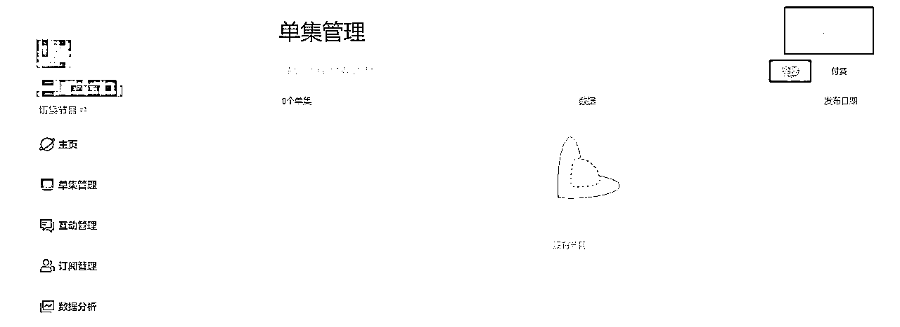

## 5.2 如何提高播客打开率：做好 Show Notes

本章和大家聊聊，什么是 Show Notes？为什么 Show Notes 很重要？再来聊聊 Show Notes 可以怎么写？

### 5.2.1 什么是 Show Notes

Show Notes 暂时没有一个确切的中文翻译。

通常来说，在一档播客中，Show Notes 常常以文字或图片的形式出现在的节目简介中，你可以在 Show Notes 里加上所有与本期节目相关的事情，比如录制背景、嘉宾介绍、引用文献、时间戳直达等等。

### 5.2.2 为什么 Show Notes 很重要

在很多时候，听友会在正式收听一期节目之前点开 Show Notes 来辅助判断要不要收听本期播客。

因为单靠节目的标题提供的信息量可能不够大，一份完整又有点小幽默的 Show Notes 可以让听友获得更多背景信息，对本期节目产生更多兴趣，也给听友展示了你除了口条有意思之外的其他特长（比如写作能力不错或者长得好看）。

从而大大增加本期节目的打开率。

特别是当你做的是商业财经、文化历史等相对严肃的内容，在 Show Notes 里附上你得出观点的支撑论据和引用文献，会让你的内容可信度提升。

这里分享一个小技巧：

在小宇宙 APP-订阅界面中，我们可以看到每一期节目被分成了一个个小卡片形式按发布时间排序。

在每一个小卡片上，我们能看到以下信息：标题+Show Notes 的第一句话。

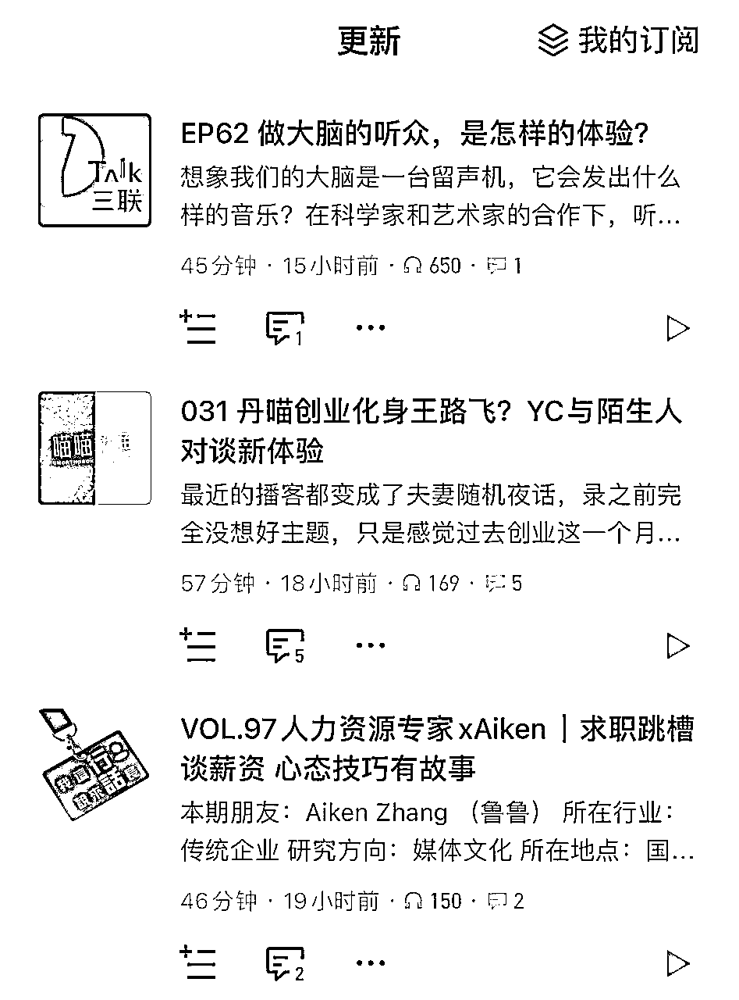

所以，标题是吸引大家点进来的第一步，第二步就是优化你的 Show Notes 第一句话。

把本期节目的最大爆点总结成一句话放在 Show Notes 第一句， 可以有效提升点击率哦。

### 5.2.3 Show Notes 可以怎么写？

首先，我想强调一下，目前没有 100% 适用所有节目的 Show Notes 的格式，甚至你也可以选择不写，比如姜思达的播客就没写。

我们写这个也不要有很大的压力，毕竟音频内容本身才是大头，Show Notes 写得好只是锦上添花，起不到一篇闪闪发光 Show Notes 带你冲上榜的作用。

著名流媒体音乐平台 Spotify 在 2020 年发布的文章《Your Podcast Needs Show Notes》中给出了相关建议：

1.列出参与制作节目的每一个人；2.提供播客官方网站和其他社交媒体账号；

3.告知听众该如何支持你的播客，例如众筹方式、打赏渠道、周边商店；

4.节目是否包含优惠代码或者赞助商。

很标准，适合几乎所有的节目都参考这个格式。但如果你想有点小创新，我们想我们还能写得再有趣点。

这边分享几个，让你的 Show Notes 可读性更高的小技巧，希望对你有所启发：

① 在 Show Notes 的开头写一段本期节目的背景介绍，和你的听友聊聊为什么你要做这期节目，你和嘉宾是怎么认识的，你们会在这期节目里面聊到哪些内容。100-200 字就行，降低听友的选择成本。

② 如果你是一档陪伴类节目，可以在 Show Notes 里和大家聊聊你的近况，把这个当周记手账来写，还可以贴一些图片让大家更有沉浸带入感。

③ 如果你是一档商业财经、文化历史等相对严肃的内容的节目，你可以在 Show Notes 里写一下你对本期论题的研究过程，比如为什么想要做这个选题，引用了那些信息源，做了哪些调研来支撑你的论点等等，有点像咱们读书时候写的论文开题报告。

④ 学习小红书博主的 post 写法，给文字间点缀一些 emoji 和颜文字，增加呼吸感和有趣度吧！

⑤ 你甚至可以在 Show Notes 里面放自拍和家里猫猫狗狗的照片，放飞自我，没在怕的。

这里给大家拆解一下《末日狂花》每一期的 Show Notes 框架，希望对你有所参考：

1.

录制背景介绍

2.

本期节目重点提要

3.

听友群加入引导

4.主播介绍、嘉宾介绍

5.

时间戳

6.

节目介绍

7.

制作团队

8.

BGM 直达链接：https://www.xiaoyuzhoufm.com/episodes/63ee06240d7e8eaa72c50057

## 5.3 如何同步播客内容至其他平台

如何把播客同步到喜马拉雅、网易云音乐、苹果 Podcast 上呢？

同步节目到喜马拉雅、网易云音乐等国内平台

第一步：

登录小宇宙网页版：https://podcaster.xiaoyuzhoufm.com/第二步：

进入后台-节目设置-多平台同步

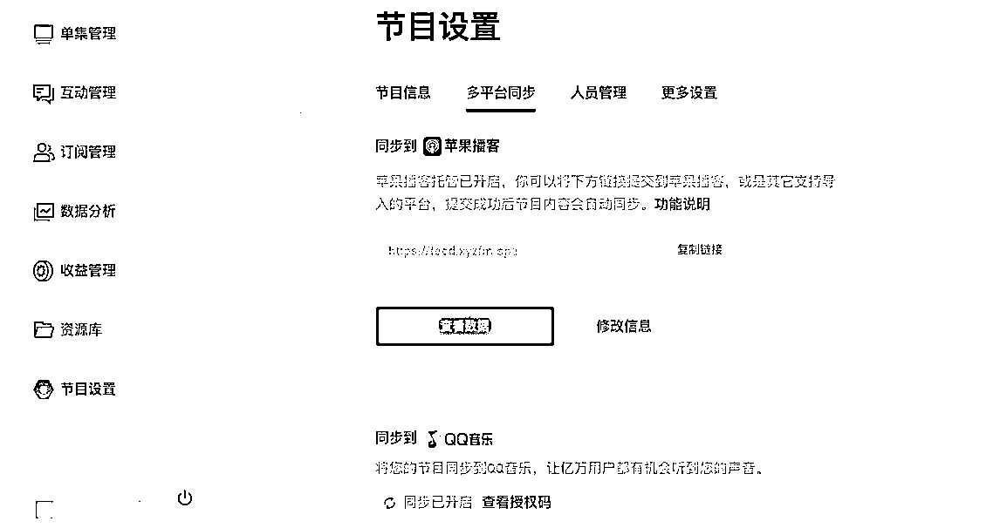

同步节目至苹果 Podcast

第一步：

打开 Podcast Connect（点击跳转）并登录你的苹果账号。

第二步：点击加号，选择添加「新节目」

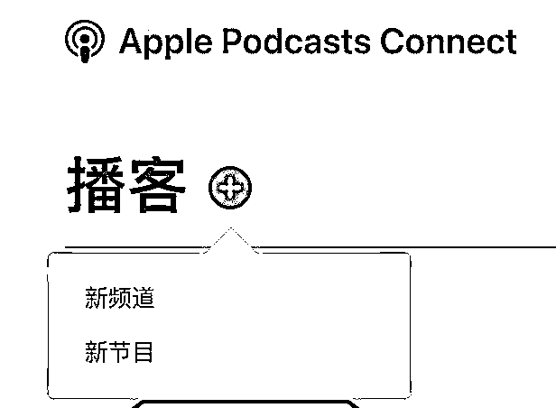

第三步：

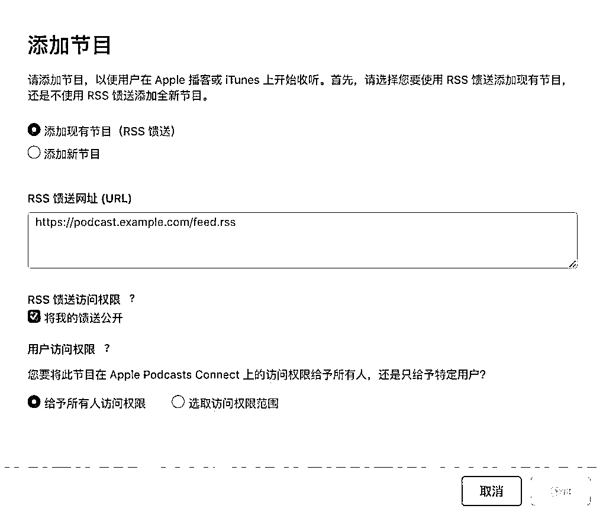

提交完成后节目会进入草稿状态，等待苹果审核通过即可。

注：如何获得 RSS 地址？

RSS 地址可以从小宇宙后台获取，点击你的节目后台-点击节目设置-找到「同步到苹果播客」-点击「立即申请」即可，开启该功能后，就能获得 RSS 链接：

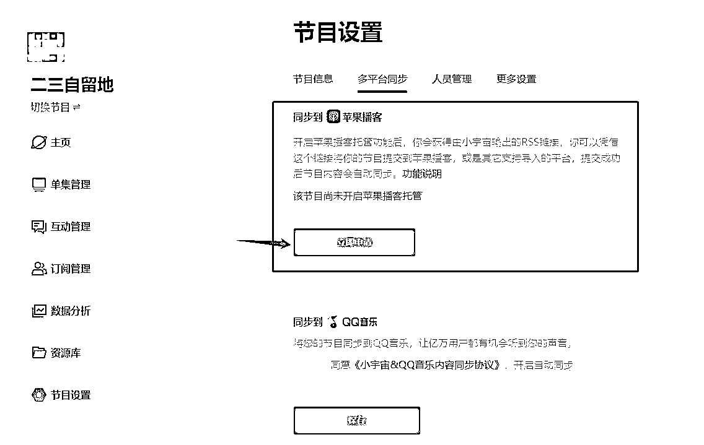

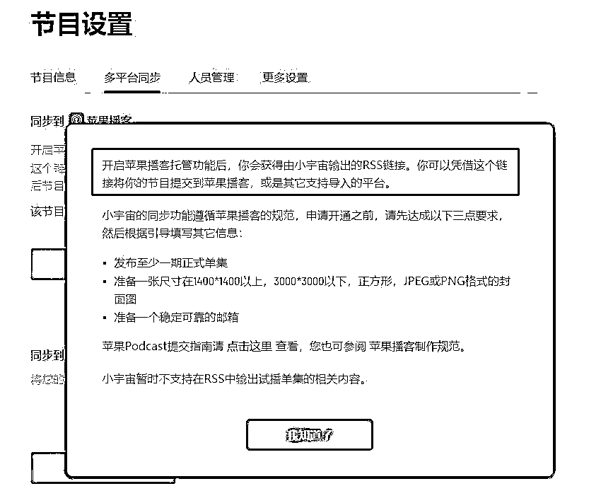

# 第六步：运营与优化

## 6.1 查看账号数据

账户数据查看路径：

小宇宙：小宇宙网页版-侧边数据栏喜马拉雅：喜马拉雅网页版-创作者中心

一般来说，推荐大家注意几个数据（建议数据参考在于精而不在于多）：

1.

完播率：45% 及格，50% 优秀，60% 超级棒，新手一开始 30%+ 就可以啦；2.

评论数：由于节目类型和这个没有确切数据参考，大家可以多做几期节目之后拉取往期节目数据取平均值，自己和自己的平均值做对比；

3.

转发数：由于节目类型和这个没有确切数据参考，大家可以多做几期节目之后拉取往期节目数据取平均值，自己和自己的平均值做对比。

## 6.2 常见涨粉路径

除了编辑推荐和运营策划选题定向给流量之外，目前播客涨粉的路径主要可以分为三类。

以小宇宙平台为例，大家可以理解为平台本身并不会直接给新人流量，你可以通过以下方式：

私域宣传+冷启动，比如发朋友圈或发群等，号召大家来关注你的账户和收听你的节目，记住一定要跳转到 APP 内打开才算一次播放，在微信渠道播放不计入播放量；

公域宣传，比如即刻或小红书等渠道，大家可以在对应平台搜索“播客”，看看大家是如何宣传的；

平台渠道，比如小宇宙的三大榜单，尤其是「新星榜」，另外两个榜单分别是「最热榜」和「锋芒榜」。

最热榜：呈现的是当下引起广泛关注的内容，榜单上一般是大号霸榜；

锋芒榜：汇聚了颇有潜力的优质内容，哪怕是新节目，做的好也有机会上榜；新星榜：挖掘的是近期新播客的精彩内容，这是新节目最可以搏一搏的榜单。

榜单每天 0 点更新，根据前一天单集的表现，由算法计算，得出上榜节目。

榜单的计算综合了多种维度，包括但不限于内容受欢迎程度、话题新鲜度、互动氛围等，算法目前并不是公开透明的，甚至平台也在不断调整，所以大家能做的，就是尽量做好节目与互动。

但有一个我们可以尝试的动作：

大家可以尝试尽早发布内容，比如每天 0 点发布。

「新星榜」的算法规律，是按照自然天为一个节点计算，所以越早上传，越是能把这一天的流量都给算进去，从而拉高作品上线当天的单日播放。

一般来说，在周更的前提下，2 个月左右 2-3k 粉丝，5-6 个月左右小宇宙 1w 粉是很不错的数据了。如果想要获得更好的数据，在选题质量、节目质量等没有太大变动的情况下，可以尝试多多更新。

## 6.3 运营方法一：选择适合的上传时间

0 点上传节目

小宇宙上新星榜的算法规律，是按照自然天为一个节点计算，所以越早上传，越是能把这一天的流量都给算进去，从而拉高作品上线当天的单日播放，争取能进入新星榜，在整个算法里面占据优势。

很多朋友会选择晚上 11 点发布内容，那就只有 1 个小时能算在这个算法里，其实非常吃亏。

除非是那种很牛的大台，不用管什么时候上传，数据都能很稳定。因为账号本身漏斗就非常大，所以永远可以上最热，但这种情况对普通账号来说没有任何参考价值。

如果大家还在新手起步期的话，建议还是在 0 点上传，去吃满一天的流量。

周几发节目更合适？

确定发布时间点后，在发布作品的具体日期上，我们怎么选择呢？

周一：不上传节目

周一大家都很忙。大家可以代入自己想一下，通常周一都堆积了很多事情要处理，大多数人是不是没心思去听别的东西？

周二、周四：职场类可以上传节目如果你做知识类、职场类的节目，我比较推荐你在周二和周四上。以前看过一个研究，数据表明，周二和周四的晚上是大家在一周中，最想学习新知识的时间点。

周三、周五：适合发一些轻松类的节目周三又被称为小周五，很多用户会觉得这周熬得差不多了。所以周三和周五类似，这时候我们适合放一些轻松类的内容。

以上这套理论我们可以活学活用到自己的频道里。

比如珂珂老师的厂牌频道：

周四会发《消费圈内人》，它是一个行业垂直类节目，符合周四晚上大家想要学点什么东西的期望；

周三和周五就放《末日狂花》这种很轻松的内容，因为大家这天的心态就是摸摸鱼，毕竟一周已经过半或者过完了。

其他建议：避开大号的发布时间

除去以上这套方法，大家也可以多看看平台榜单，你会发现有一些大台，或者说有些运营相对正规的台，它们有固定的发布时间。

比如，你做的是行业类、创投类或者垂直类的内容，然后发现《消费圈内人》一直在礼拜四上线，而且数据一直很稳定，那它可能就会占掉一个锋芒榜的位置，对不对？

这时候，我们避开这个时间，在其他日期发布作品，反而能获得一些流量。

## 6.4 运营方法二：运营 IP 社群

如果想要播客有更长久的生命力，有更稳健的变现模式，打造并运营 IP 社群是非常关键的一点。

以《末日狂花》为例，《末日狂花》现在有 13 个听友群，将近 6000 人，入群率非常高。

如何做到的呢？

### 6.4.1 设置钩子

吸引用户进群，你需要有一个强有力的钩子，所以设计钩子的方式非常重要。

你可以从节目类型下手，尝试找到用户感兴趣的点：

如果你是知识类节目，设置钩子其实比较容易做，因为话题很广泛，学习型清单、书单等都可以作为钩子；

闲谈类播客，可以尝试用好物清单来吸引用户进群。

你也可以从听众画像下手，找到符合他们需求的东西：

比如听众画像可能是对提升自己非常感兴趣，并且有强烈的自我驱动力，那么我们的抓手可以是一些学习型的东西，比如书单或者某个特定问题的清单等等。

你也可以在节目中直接介绍社群，吸引大家：

比如告诉大家，如果想加入听友群可以在哪里找到我们，再介绍一下听友群有什么特别之处，唤起大家对入群的期待。

《末日狂花》以前进行过一期好物分享，主播们准备了一份好物清单，告诉大家可以进群领取，结果那一期进群的人特别多。

这样的抓手就非常好，因为它给了大家一个加群的动力。

后续还有一期，话题是聊风水，主播们准备了一个风水书单，让对风水进阶感兴趣的同学进群领取。现在基本上每天都还有几个用户加群，并说他们想要领取风水书单。

所以，提供一个清单或书单这样的东西，其实是一个很好的入群抓手，能够激发大家加群的动力。

### 6.4.2 拉新入群

播客平台上的订阅只是一个数字，当用户进入群聊后，他们才真正成为我们的活跃用户，我们可以与他们进行反复互动，有更多机会接触他们。

首先，我们要充分利用播客的群公告功能，在群公告里放置二维码，让大家进入群组，还可以在节目公告中提到群聊，吸引大家入群；

其次，我们的 Show Notes 也可以放入加群的信息，但是建议不要直接放置二维码，因为二维码上限是 200 人，很容易满员；

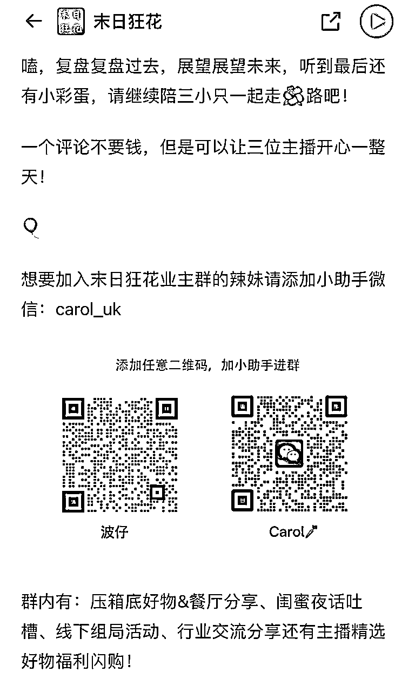

如果你的群聊有想做的调性，拉群的时候需要做筛选。

比如《末路狂花》的调性定位是 90% 女性用户的群体，为了保护基本用户群，不会冒险拉入一些不认识的男性，除非是认识很久的、非常可靠的男性朋友。

再比如《消费圈内人》，这个播客 IP 群的每个人都是珂珂老师自己拉的，拉的时候会问对方一个问题：

你能介绍一下你自己和你现在负责的业务吗？

这时候我们就能得到一些信息：

比如他需要实名，他会告诉你自己叫什么，在什么公司上班，负责什么样的业务。既然播客定位叫消费圈内人了，所以如果对方不是消费行业内的，就无法通过进群申请；

同时，哪怕都是消费行业从业者，但是群内供货商的比例也需要控制。因为很多服务商会进群加人，把群聊当成获客途径，从而伤害核心用户；

最后，消费圈内人的定位也决定了，这个群不会拉学生党，学生可以等毕业后入行了，再加入群聊。

这样一来，虽然入群门槛高，但人群更精准，用户质量也相当高。

做社群运营最关键的，就是你要知道你的大盘用户是谁，你所做的所有东西是为了维护大盘用户的利益

综上，拉群时需要注意两个关键点：

根据 IP 需求，做好核心用户筛选，要明白你的主要核心资源、核心用户、大盘是谁；社群安全问题很重要，不拉入可能会给核心用户带来负面体验的人群。

一个另辟蹊径的技巧：

有时为了吸引听友进群，也可以说某个嘉宾在你的群聊里面。因为嘉宾通常在这个行业里已经有成果，大家也都知道他非常有干货，很多人就会想进群链接这个嘉宾。

但需要注意的是，我们不能让所有人都直接链接到嘉宾，对我们来说，嘉宾是最宝贵的资源，需要保护好。

处理方法可以是：由主创团队来筛选联系。

举个例子，《消费圈内人》之前帮一位嘉宾做节目，做完后帮他留了个口子，说如果有合适的品牌想跟他合作，可以加主创的微信对接嘉宾。这时候我们就能对用户做筛选，如果不合适，可以提前回绝掉。

### 6.4.3 加深认同感

方法一：设置一个有趣的群名

《末日狂花》的听友群其实不叫听友群，都是一些豪宅命名的业主群。

一方面，这个群名很有意思，群友在用电脑、微信 PC 版时如果被同事看到，会被问，你怎么是汤臣一品业主？而且这种事情是真的发生过，本身群名就很有梗点。

另一方面，其实群聊有另一个承载功能，即用来做社区团购。《末日狂花》选品走的是高端、轻奢、小众风格，所以从整体氛围打造上，运营组会想办法让整个群看起来符合调性，让用户感觉你进来就是富姐富哥，需要去买一些配得起自己生活品质的东西。

如果社群卖 9 块 9 的东西，那群名肯定就会取得土一点，或者干脆就叫团购群，目标明确。

前文其实有说到，关注数不是第一重要的数据。因为对于品牌主来说，只有 1 万以上和 1 万以下，或者 10 万以上和 10 万以下的区别，只要你做上 1 万粉，就可以商业化，就是个大播客了。

这之后，更多要做的就是精细化运营你的用户，做社群，维持群活跃，并以此为基石构思更多商业化途径。

方法二：设定群规，维护群内氛围

群规其实普通群聊差不多即可。

首先，不要发布任何违法乱纪的内容；

其次，在群里也不要询问可能导致群被封禁的内容；

最后，不要在群里分享过多的互点链接或其他类似内容。

《末日狂花》的风格是，主创团会非常松散地去看群状态，虽然每条都会看，想知道大家在关心什么，但是不会做太多过高的干涉，只要让听友知道主创们在群里陪伴大家即可。除非觉得话题跑太偏了，才会做一些适当引导。

《末日狂花》IP 群给人最大的感受就是：

大家都会分享自己用过的好物，但是没有打广告的氛围，很明显能感受到大家都是基于个人使用经验，真心实意地推荐，所以筛选合适用户的真的很重要；

有的时候大家提到主创团队，珂珂老师就会闪现，不仅能拉近与一线用户的距离，还能了解他们的需求、反馈和关心的话题，这非常关键。

方法三：双赢的团购活动

如果你的社群有团购性质，也可以在群里推出团购活动。

以《末日狂花》为例，由于拥有优质的供应链和价格机制，听友很愿意相信主创们的选品品位，群内就像是一个线上买手店铺。

《末日狂花》选品走的是高端、轻奢、小众风格，所以从整体氛围打造上，运营组会想办法让整个群看起来符合调性，让用户感觉你进来就是富姐富哥，需要去买一些配得起自己生活品质的东西。

这种模式是双赢的，用户可以买到他们喜欢且价格合理的产品，主创团队也能有盈利。

但需要注意的是一点是，不要做超出自己能力范围的团购，选品也要谨慎慎重，否则伤害 IP 信任度，得不偿失。

### 6.4.4 提前剧透，增加期待

提前剧透的目的，其实就是拉高用户期待值，吸引用户注意力，从多角度提升播客数据与群内活跃度。

以《末日狂花》为例，会做这样 2 个运营的动作。

① 提前告诉大家，我请到了一个很牛逼的嘉宾，大家有什么想问的吗？然后开始接龙。

《末日狂花》有 13 个群接龙，这时候基本上能收集到 80 ～ 100 个问题。把这些问题收集下来再做个分类筛选，我们就能得到二三十个精准问题。这些问题，都能作为我们写提纲的重要信息来源。

自己写提纲时会出现一个盲区，就是不知道大家真正关心的是什么。这时候不如把权限开放给听友们，让大家决定自己想要听到什么。这是共赢的事情。

② 上线前一天，在听友群里发起标题/关键词投票，提前跟大家预告明天上线的内容和上线的嘉宾，同时通过投票增加大家的参与感。

听友投票后会想，诶，我今天选了 1 和 2，我明天倒要看看到底是 1 和 2 谁比重多？

而且这样的做法也能引起群内讨论，大家会发表意见，比如为什么觉得 1 好？哪里好？ 2 哪里好？这样的正面讨论能你的社群有热度。

将标题发到群聊里还有一个好处，因为不同标题就是不同的切入点，不同的关键词也是同理，大家一口气看到这些切入点和关键词，就知道明天大概会有哪些自己感兴趣的内容。在投票的过程中，大家就已经对内容有期待了。

其实好的社群不需要天天有很多人活跃，只需要当你有事需要拜托大家的时候，大家给你一个及时的反馈就好了。

如果一个群有太多闲聊消息，反而会让很多人不想点进去，最终导致群聊被折叠。

