# **# ****ChatGPT+**公众号（合集）

公众号流量变大，利用 ChatGPT 可大幅提效赚取流量主收益

整理日期：**230706**

懒人专属群的群友大家好。小懒继续给大家带来一份ChatGPT+公众号（合集）本文档为懒人专属群内部分享，懒人手动整理。

生财风向标系列单独用在线文档分享，地址见专属群q群消息。

一些帖子跳转飞书查阅，如需破解复制权限，见这篇文章：

解除复制限制！

往期的生财周报合集（含在线版和离线版），见专属群Q群文件和群公告。

希望大家有收获~

标题加了(精华)的表示精华贴，前面为截至今日的点赞数。

以下是目录，内容有些多。大家可以挑兴趣的内容阅读。

#  

懒人专属群更新记录（点此跳转）

# 【目录】

ChatGPT+公众号（合集）

【目录】

【最新风向标】**7**篇

(255赞)AI绘画+ChatGPT+追热点：12 天收益 39900+(228赞)用 ChatGPT 写情感故事，流量主一周可获得可观收益

(213赞)公众号自然流量 10W+ 后不限流，出爆款概率更大

(196赞)微信问一问全面推出，视频号可借机薅流量

(178赞)公众号流量主玩法思路，4步就是一个项目

(161赞)公众号流量主的新方法：ChatGPT + Stable Diffusion组合(22赞)公众号算法转型，AI生成爆款内容成新趋势

【公众号流量主】**3**篇

(精华帖)(282赞)0 付费做公众号，涨粉3.7W+，变现 5W+

(精华帖)(139赞)微信公众号流量主项目，一天可以做到10000元

(49赞)公众号爆文项目：1个公户代收50个公众号流量主收益

【项目分享】**3**篇

(精华帖)(582赞)公众号公域流量爆发+新流量入口

(精华帖)(62赞)ChatGPT 问世135天，一篇公众号爆文 10 分钟搞定千元收益(55赞)ChatGPT流量实战变现5W+：高效的自然流量成交术

【细分赛道】**7**篇

(精华帖)(360赞)公众号 AI 写作 5-10 分钟一篇文章变现 3 位数(精华帖)(333赞)ChatGPT+公众号爆文写作，7 天阅读 10W+ 的方法分享(182赞)用 ChatGPT 来写微信公众号热点文章

(161赞)ChatGPT+争议性话题在公众号上获得10w+阅读量

(122赞)如何在 7 天内用 AI 写出 2 篇 10W+ 的公众号情感爆文？

(精华帖)(115赞)受到生财风向标和公众号一篇文章启发变现 6135(精华帖)(92赞)普通人在公众号细分市场找到机会，实现月收入过万

#  

【**ChatGPT**使用指南】**4**篇

(精华帖)(670赞)ChatGPT 投喂指南

(精华帖)(230赞)ChatGPT 从入门到精通

(精华帖)(125赞)通过 ChatGPT API + 自动化提高生产力-变现(121赞)一文讲透 AI 在文字创作中的正确使用姿势

# 【最新风向标】**7**篇

# **# ****(255**赞**)AI**绘画**+ChatGPT+**追热点：**12 **天收益** **

# **39900+**

作者：  妞妞💋

日期：2023-06-13

AI绘画+GPT+追热点发在公众号上，12天收益39900+，还有赞赏3000+，简直不要太香[偷笑]

#  

 

#  

评论区：

申姐全域营销 : 哇塞真厉害，怎么做的，哪个账号，感谢

翱翔蓝天 : 个个都这么厉害👍，什么类型的文章[害羞]

帅子 : 教练威武

妞妞💋 : 行规，不暴露账号

妞妞💋 : 热点，就这几天的牵手门

申姐全域营销 : 谢谢

妞妞💋 : 帅子也很棒，我在练习发帖，哈哈哈，多尝试一下，感觉生财星球比公众号后台复杂好多

翱翔蓝天 : [强][强][强]

#  

# **# ****(228**赞**)**用** ChatGPT **写情感故事，流量主一周

# 可获得可观收益

作者：  小浩哥

日期：2023-06-08

本人亲测通过GPT写情感故事5到10分钟一篇，流量主一周收益可观，通过多账号矩阵可放大收益。

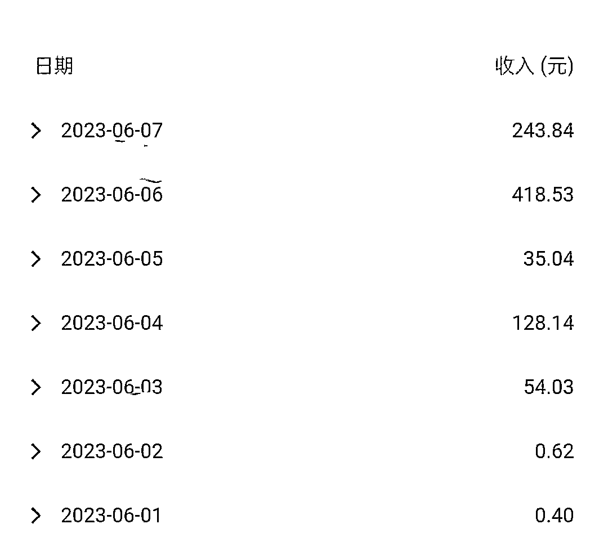

评论区：

#  

七十七 : 这得多少阅读量，才能达到这个收入？

随想 : 有对标账号么？

知新 : 您好，公众号开通流量主后，会有智能广告（收入1）。我们也可以自己接广告（如新榜有赚，收入2）还可以带货（收入3）等。想请教一下您，情感故事文章中，主要是通过收入1还是其他收入来获得收益呢？

胖大魔 : 想听听复盘

老传 : 这个就是流量主后台，收益1

小浩哥 : 1

小浩哥 : 过几天写一篇帖子

胖大魔 : 关注大佬

# **# ****(213**赞**)**公众号自然流量** 10W+ **后不限流，出

# 爆款概率更大

作者： Alan阿康

日期：2023-06-13

「公众号流量开闸放水」

这几天公众号自然推荐10万+后不限流了，隔天就10万+。之前3月—5月，一爆10万+，限流一个星期。

现在我们可以一天写8篇纯文字、无需文章配图，可以出爆款概率更大。配上ai，7分钟一篇，包括简单排版，效率拉满。

这个赛道是法律。

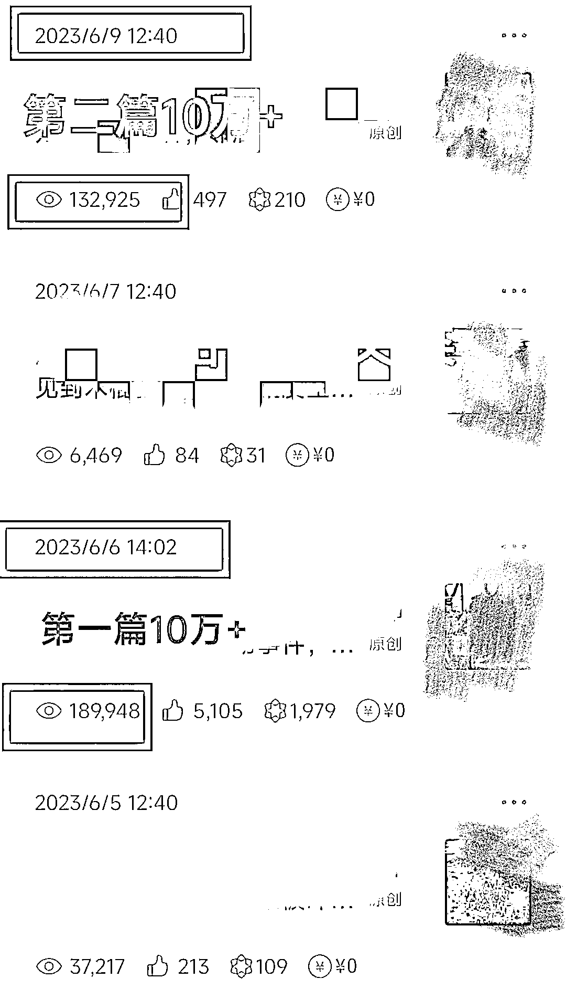

#  

评论区：

#  

郑鹏鑫 : 牛

亦仁 : 中标，术值+1。

在上方专栏点击 #中标，可查看所有中标风向标。

花甲刺客 : 牛逼，做公众号流量主这块，既然几分钟一篇，有没有这样的合作可能性。

我这边可以无限提供个人公众号，圈友提供写好的文章  收益一起分成[坏笑]你们不用担心账号数量，我不用担心产出内容[嘿哈]

金九渊 : 胜者之下，尸骨累累

从小就很帅 : 太强了

铲哥带你飞 : 加你了，同意一下[咖啡]

胖大魔 : 带带dd

费曼同学 : 带带弟弟

# **# ****(196**赞**)**微信问一问全面推出，视频号可借机

# 薅流量

作者：  好鸡蛋

日期：2023-06-09

微信问一问已经全量公测，这两天官方已经用高考热点全面推问一问了。

新老视频号都能够抓住这波流量机会，结合微信 SEO，优化视频号昵称和关键词布局，用 Claude、ChatGPT、MJ&SD 等 AI 来回答问题，薅早期流量。

选择热门问题去回答非常重要，比如高考填志愿、某某大学怎么样、某某专业就业如何等等，微信给问一问的搜索权重很高，流量拉满的推荐。

其次是问题广场的很多问题，回答的人不多，缺少优质回答占领前排位置。

最后微信问一问支持视频号身份去提问和回答，可以借助问一问完成新视频号冷启动。

我的测试，昨天回答了三个问题，就有 3000 浏览量，80 多个点赞，而且转到视频号内容获得了 25 点赞和 11 个关注。

并且用户转发热门问题很常见，只要你的回答爆了，就能够持续传播。

#  

借助 ChatGPT 等 AI 写回答去薅流量的时候到了，早就是优势，除了现在能获得热点流量外，微信搜索的长尾流量不容忽视啊。

接下来官方肯定还会推出激励活动，给回答者带来更多的流量激励。

批量做广场矩阵号，美食答主号、旅游答主号、时尚美妆答主号、好物种草答主号等等细分领域问答号，玩法太多了。

微信问一问通用开通方式（没有入口的都可以通过这个方法开通）：

1、发现页点击搜一搜

2、点击搜索发现里的红框内容

3、在搜索框搜索🔍本地一所大学名

4、搜索框下面的关键词栏往右滑找到「问一问」随便点击一个问题

5、进入问题后往下滑找到「参与体验」绿色按钮点击参与

6、最后回到搜一搜界面就有问一问入口了

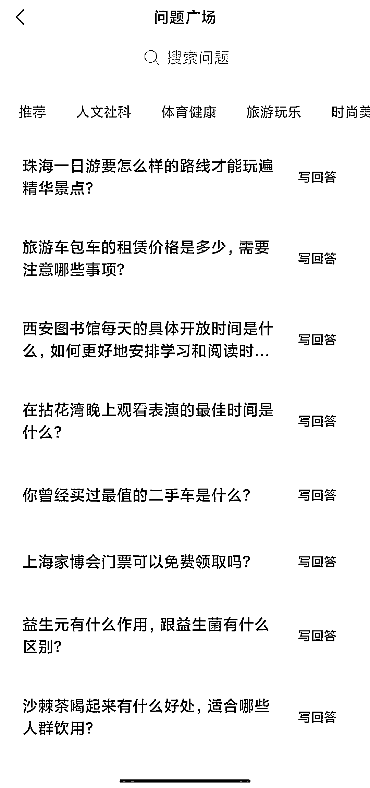

#  

#  

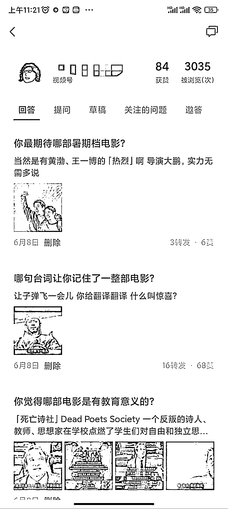

#  

#  

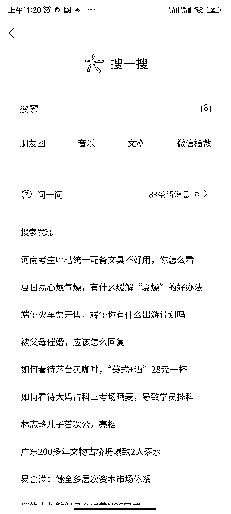

#  

评论区：

合一 : 我试了试用3.5回答，提示抄袭，是哪里姿势不对？

好鸡蛋 : 官方会审核 AI 生成的内容，删改，注入人的情绪

合一 : 感谢[抱拳]

sky陈天 : 没有问一问的入口，请问怎么申请

上官 : 找有问一问的给你发个链接点进去就有了

亦仁 : 中标，术值+1。

在上方专栏点击 #中标，可查看所有中标风向标。

青空明月 : 有几个回答一直在审核，感觉已经没有违禁词了呢，还是审核不过，具体为什么不过也不清楚

好鸡蛋 : 可能是 AI 内容、低质量回答多了后，官方在调整审核机制

# **# ****(178**赞**)**公众号流量主玩法思路，**4**步就是一个

# 项目

#  

作者：  铲哥带你飞

日期：2023-06-07

公众号流量主玩法思路，4步就是一个项目：

1.找那些平常阅读流量相对平均（几百到几千），突然有一篇或者多篇文章，出现几万甚至10万+的文章（说明流量大概率来自于公域流量，异常值其实就是蓝海）  2.用chatgpt创作这个领域的垂直内容，配图可以用AI生成或者找相关图片（注意版权问题）

3.跑通最小mvp（赚到第一块💰）

4.复制多个账号操作（杠杆）

5.逐步迭代，不断优化每一个步骤

大道至简，越简单的事情，反而越容易赚到钱。

#  

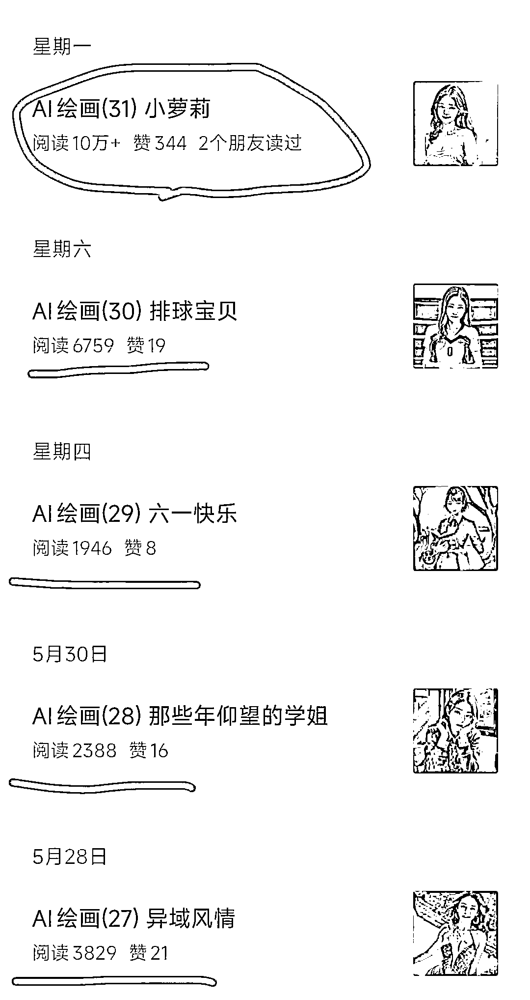

评论区：

严言 : 这个公众号叫什么名字呢

铲哥带你飞 : 账号名称不重要，这个思路可以找到很多玩法方向

铲哥带你飞 : 本来是发风向标的，发错位置了

那就顺便讲讲，如何找到这些进入流量池的文章？

1.打开某信-发现-搜一搜

2.随便点开一个文章，进到账号主页，看是否符合第一步的要求，如果符合就记录下来，多刷一会就能找到很多的“异常值”文章

陳逸陽 : 如果做个这样的工具让你发现，是否会考虑订阅付费[奸笑]

泽林 : 低粉爆文异常值，很多平台都能参考啊[色]

亦仁 : 中标，术值+1。

#  

在上方专栏点击 #中标，可查看所有中标风向标。

铲哥带你飞 : 低粉爆款，意味着是靠内容本身爆文的，那么这类文章、话题的受众群体就会比较大，创作同领域内容会更容易拿到结果

赵半山 : 公众号一直不入池，感觉起不来量。

# **# ****(161**赞**)**公众号流量主的新方法：**ChatGPT + **

# **Stable Diffusion**组合

作者： Dreamland

日期：2023-06-12

【公众号流量主暴击归来】

没错又是我，深入研究Ai的小梦

上一个风向标，被亦仁大大加精华了

这次又来了个更猛的，还是老配方

就是chatGPT+stable diffusion组合

这个方法百试百灵，的确好用才推荐

.

【最新研究表明】

如果你公众号流量不好，可以停更

然后再发就说不定能爆，这是真的

我们测试下来爆了个70万阅读文章

差不多收益6000左右，可以看图片

大家赶紧试试吧，冲冲冲

.

#  

评论区：

#  

Dreamland : 我就不喜欢吹牛逼，我喜欢直接拿数据和收入说话，而且数据是真的，收入也是真的[偷笑]

张麒 : 给力

张麒 : 请问一下，如何找公众号自己领域内的爆款文章啊？  有工具和网站吗？

Dreamland : 那必须的，全是实操战绩

Dreamland : 我不了解

胖大魔 : 带带dd

Dreamland : 自己实操一下再说，等你真的想做，但是一直做不出来，再考虑这件事情  胖大魔 : 航海搞完，开始上场比赛[呲牙]

# **# ****(22**赞**)**公众号算法转型，**AI**生成爆款内容成新

# 趋势

作者：  愚者

日期：2023-06-07

chatGPT+公众号流量主+MJ/SD

公众号最近在改变算法，从订阅模式转为部分算法模式

类似于今日头条，爆点内容很吃香

用AI生成爆款标题，热点内容，批量化生产

chatGPT生成内容，MJ/SD生成图片，组合生成内容，过原创很容易评论区：

暂无评论

# 【公众号流量主】**3**篇

#  

# **# ****(**精华帖**)(282**赞**)0 **付费做公众号，涨粉

# **3.7W+**，变现** 5W+**

作者：  见川

日期：2023-05-29

《0 付费，每天复制粘贴5分钟，公众号涨粉3.7w+，变现5w+》

生财圈友，大家好，我是见川。

18年开始做公众号，大多类型公众号都有涉猎过，在机缘巧合下打通了文案类公众号不通过外部导流每天复制粘贴也可以实现涨粉变现的玩法。

阅读量最高10w+，目前平均阅读量3000+，玩法基于SEO，无论你是打算批量化还是新手小白都可以直接上手。

以下是一份保姆级教程。

微信公众号  https://kyjhe9yxvm.feishu.cn/docx/Ecr6dapIPoqmF2xtF7GcISGOnSh评论区：

我是新手 : 正需要这个，先评论了再说

终身锻炼者—老杜 : 现在还行吗

周彦充 : 好奇这类人群画像是那部分人群？流量主真不错，我发一篇文章只有20元收益。👻

见川 : 可以的，可以对标文档里我的公众号，测试了几个新号都阅读破千

见川 : [抱拳]

终身锻炼者—老杜 : 大佬秒回，好评+10000[偷笑]

见川 : 学生比较多，微信加了好友3000+，大多是树洞吐槽

小王子 : 见川大佬牛逼

# **# ****(**精华帖**)(139**赞**)**微信公众号流量主项目，一

# 天可以做到**10000**元

#  

作者：  一来

日期：2023-05-18

微信公众号流量主项目，单号一天可以做到10000元

大家好，我是一来。今天说下，一直在实操的微信公众号流量主项目。

1.实践结果：实操已经半年，最高当天破万元。

2.项目特点：隐蔽，很少人知道；有基础门槛，竞争较小；单价高，有长尾流量。

3.项目原理：500粉丝开通公众号流量主权益，通过发布文章，获得系统推荐，靠文中广告和文末广告收益。

4.实操思路：

（1）注册微信订阅号，注册后可以购买500粉丝，直接开通流量主。

（2）开始写垂直类文章，字数在1000字。文章直接用别人的爆款题目，内容自己写。

一般农村题材，养老金，社会纪实，军事类的起号相对较快。（先找对标账号，微信搜索公众号：农村，可以找一些对标账号。找那种稳定更新的，一天发布在2篇以上的）  （3）刚开始很难熬，阅读量就1-2个，很正常。账号进入流量池，1-30天的都有。所以可以搞2个号同时测试进行。如果你有很早以前的公众号，注册的比较早，那么根据测试，进入流量池会更快。

（4）核心部分：锁定领域，就是不停地写。一般一万阅读能有80-150元。

5.一个号跑通之后，再用家里人身份证在注册一个。手上握有3个号，每个号每天稳定更新2-3篇文章，差不多1个月10000多是可以的。

一些工作室，单号一天都是几千。所以这个事情可以干，最主要微信公众号流量主一直可以做。

评论区：

大刘 : 之前用公司注册了50个订阅号  都搁浅了  试试

一来 : 公司的现在似乎有可以了

周彦充 : 感觉不错，哈哈

田小田的甜 : 写一篇文章大概用多长时间

一来 : 1000字，我是语音写，差不多20分钟

田小田的甜 : [发呆]这么快

加英 : 我要1个钟，看来还需要再加速一下

Аη : 加快脚步

#  

# **# ****(49**赞**)**公众号爆文项目：**1**个公户代收**50**个公

# 众号流量主收益

作者：  花甲刺客

日期：2023-06-07

圈友们好，我是花甲刺客，专注于搜一搜渠道的幕后玩家。

最近很多关于玩公众号在看一看爆推荐流量的，收益确实不错（当然也有很多做不起来的）。公众号流量主到底好不好做？其实已经有很多人放弃了的（公众号初期就有不少团队几千个号的在薅流量主收益），不过按最近的情况来看，感觉公众号流量主这块又会慢慢复苏了，跟以前玩流量主的感觉不一样了。

玩过搜一搜的就知道，官方经常各种更新机制，玩公众号流量主项目的兄弟应该也能体会到流量一起一伏，甚至断崖的情况。那么如果手里仅有的几个号限流掉收录了，没号玩了；或者跑通了找到收益起来了，想矩阵放大又头疼解决不了新增账号的问题。

本文主要给大家分享1个公户代收50个公众号流量主收益的操作方法，让你不再为账号问题发愁。

公众号爆文玩法详见航海及圈友分享的《公众号公域流量爆发+新流量入口》，这里就不展开了。

本文详情见飞书文档：

1个公户代收50个公众号流量主收益的操作方法

看完对有哪些分享疑问的地方，欢迎圈友评论指出交流。

评论区：

#  

周彦充 : 放弃了写爆款情感文，放弃了日更，还是继续做ip，写长文，继续群发  珂侨同学 : 请问爆款情感文有坑吗？

周彦充 : 我实操太少了，这个报价

晨枫 : 怎么说呢，我跟你说说我写情感文的成绩吧，我更了有70篇了，三个号，都入了流量池，一个多月收入加起来200块钱。

珂侨同学 : chatgpt+mj/sd？

晨枫 : 按公众号爆文写作航海写的，不过我会坚持满3个月看看，大佬们收入挺不错  一茗 : 我的评论截图[惊恐]

Cooper : 入池的播放量平均  累计有多少  算下ecpm

# 【项目分享】**3**篇

# **# ****(**精华帖**)(582**赞**)**公众号公域流量爆发**+**新流量

# 入口

作者：  张柯Ker

日期：2023-06-05

《公众号公域流量爆发+新流量入口》

大家好，我是张柯Ker，

被亦仁老板抓过来分享了，

本来是快闪付费内容，在这里公开分享了，群不进人，我也不培训，纯分享，

最近关于公众号流量主收益的项目层出不穷，不管是生财的爆文写作航海也好，最近的AI绘画热点也好，

核心要点就是文章的阅读量会突然爆发，但又不知道这流量是哪来的，主流打法就是，更新，等自然流，外面收费都很高，纯交个朋友来分享一下，内核都是一样的， 

详情见飞书文档：

https://c75rzod2h6.feishu.cn/docx/NSJLdjAUUosmAixOHIWcFI93nob评论区：

浅笑 : 柯总行动力max~

财火 : 从6月3日开始，我的公众号阅读量极速下降，官方是有什么调整吗？

亦仁 : 再等几天看看，不要问什么

清欢 : 柯总牛逼[强]

亦仁 : 领先半年以上，不是吹的。

亦仁 : 不过这个机会很多人仍然没意识到。

云珞YunL : 柯总牛逼

周彦充 : 问一问，一天可以回答100个，我去试试看看能不能引流

# **# ****(**精华帖**)(62**赞**)ChatGPT **问世**135**天，一篇公

# 众号爆文** 10 **分钟搞定千元收益

作者：  兵王袁宇宙

日期：2023-04-12

Hi，圈友们，大家好。我是袁永兵，3 万小时电商创业者，山西省商务厅电子商务实操专家。第一次在生财写分享帖，让毙掉了，有很多圈友联系我，感谢大家的认可。

为了验证稳定性，这次文章重新发布，我专门更新了收益截图以及花费时间，对文章又进行了必要的优化。

今天我想分享的不是电商领域，  而是想聊聊我是如何把最近大热的 ChatGPT 应用在自媒体公众号爆文上的事情。

#  

我认为它们两个是有相当大结合的空间的，是有相当大商业想象的，这样的红利，至少有5年，别看国内大厂纷纷入局，没个三年五载，真心赶不上，何况， ChatGPT 还在迅速迭代。

很幸运，多次尝试之后，我通过 ChatGPT 的协助写出了多篇 10W+的公众号爆文，且平均爆一篇十万加的文章，就是千元级别的收益，真香。

现在这些号跑通了，趁此机会，我也想回顾一下自己的公众号运营之路，和大家分享一下这篇 10W+背后的故事……

# 一、为什么想做公众号？

从我和圈友的聊天截图说起：

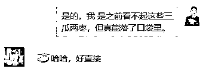

“我是之前看不起这些仨瓜俩枣，但真能落了口袋里。”对，这就是我在五年前的真实想法。

#  

简单总结来说，2021 年上半年结束搞短视频、直播，败完 300 万，还负债 300 万后，彻底重新审视自己，所有的变化都来源于这次经历，因为残酷的现实不允许再去玩情怀。

没有那些经历，也就谈不上开搞公众号。

2021 年后半年，通过朋友、自己寻找，加大了付费社群的入圈，市面上主流的付费社群大部分都加入了，累计超过十万元。这个投入的回报是显而易见的，除了极大地弥补了自己在认知差、信息差上面的差距，对于对齐认知差、信息差，再也不是那种“一说都会，一做都错”的“假知道”层面了。

以及凡是没有经过自己亲自跑通的项目，再也不敢放手去让所谓的“雇佣军”去做主了，真是怕了，市场上能雇到的员工，真的别寄希望什么，尤其是山西，能出来打工就已经说明一切了。

认知差、信息差，这两点的“伪认知”“伪信息”，之前我是盲目自大的，当然教训也是深刻的，人教人，学不会，事教人，一次会。

经历不可跨越，经历的都是财富哈，自勉。

当然了，对于执行，这是这么多年来，仅剩的闪光点。

所以，正面回复“为什么想做公众号？”

对于我等** P **民，赚大钱都是从小钱开始的，小钱也赚不了，大钱更无从谈起。

#  

嗯，就是这么个意思，听懂掌声。

# 二、十年公众号拿起又放下，我终于看到了属于自己的发展

# 路径

回顾我做公众号，有三个阶段：

**1. ** 第一个阶段是十年前

2013 年，我跟着大哥和兄弟们注册过十几个公众号，让其中的一个员工去兄弟那里学习了一个星期，那时候发文章发了两年，粉丝最多的一个号，都不到一万，当时连流量主都开通不了。

当然了，当时我们的电商生意很好，根本看不上这点钱。

但也就是这个看不起，后面的公众号也就放下了，彻底地掉队了，而我们大哥、兄弟们干的公众号矩阵在 2016 年开始全面进入丰收季，基本上人人都是千万级别收入，真金白银啊！甚至有几位过亿的营收，单单就是公众号哈，赚得盆满钵满，与之对应的是我们在 2018 年电商遇到滑铁卢，断崖式下跌，两者一比，天上地下。

这一次，是身边人的爆发，太刺激了。

#  

这里插一小段，2018 年，我还注册过一批头条号，捋过一波小收益，就是纯搬运，我自己身份证注册的账号被永久封禁。上个月才找到办法把身份证救出来了，又能使用了。

这预示着2023年，一起搞钱，就是这么顺！

**1. ** 第二个阶段是** 2021 **年

短视频和直播败完以后，我们注册了百十来个公众号，这是第一次批量注册，零星地跑出来几个账号，有粉丝** 7 **万多的、**3 **万多的、**1 **万多的，流量主收益几千、几百不等，多数都是搬运内容。我看没有太大的起色，之后又不管了。

直到 2021 年最后一天，我看到公号引流卖虚拟资料的项目，紧急切换引流，当天净赚  5K。然后在 2022 年的上半年和下半年，被封在家的那些日子里又打起了公众号的主意，重新开始经营。

这期间，之前跑得最好的一个号，一个月收益** 16W**，其中有单日过万的记录。要不是被封，哈哈……这就是第三阶段。

经历这么三个阶段下来，给我最大的教训，就是上一篇幅中提到的“凡是没有经过自己手亲自跑通的项目，……”也就是必须躬身入局。

第二个教训就是在入局晚的当下，账号没有粉丝积淀，纯搬运肯定不行。即使单纯靠堆人，遇上 00 后整顿职场的这批人，也是天天一地鸡毛，以及行业门槛低、新人培养周期长、老人熟练后走人单干导致培养了竞对等等问题，让我发现维持现状不是一个长久之计。

至于其中的困难，就是上文提到的认知差和信息差，我通过付费来解决。

#  

花钱能解决的事，这是最简单的事。

至于自己的执行力。即使自己笨一点，时间不够一点，别人三天，咱三十天、三个月、三年，只要是好内容，任何时候都需要。你看我，十年后再入公众号，依然可以。

这是我**2023**年公司化入局公众号的第一年，但今年我有了更好的工具，不管是效率还是文章数据效果，都得到了验证，有了明显的提升。

先来看看用 ChatGPT 写文以来，其中一个新号到目前为止的数据情况。

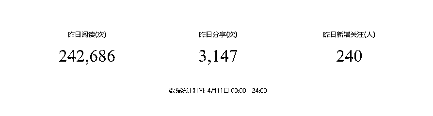 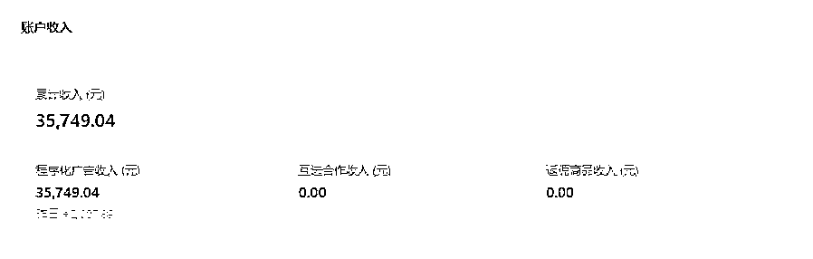

（最新4月11日数据）

# 三、工欲善其事必先利其器

#  

这个工具就是 ChatGPT 的问世，我最早关注到 ChatGPT 是在 2022 年 12 月初，在 12 月 8 日，在我个人公众号：兵王袁宇宙，就发布了一篇文章。

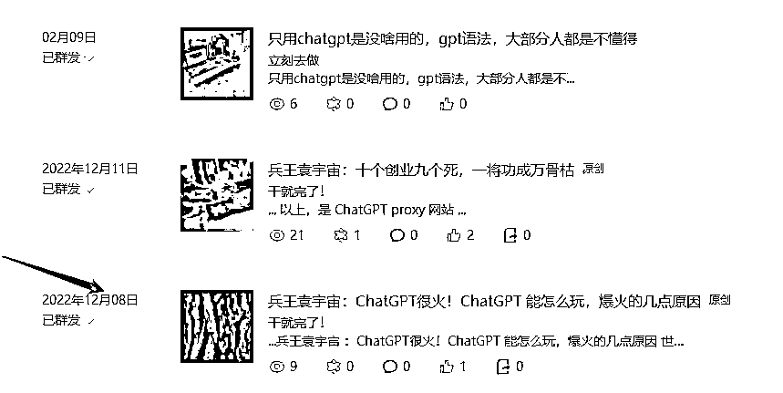

（12 月关注到 ChatGPT 后写的文章）

我预感到了新时代的来临。

这个工具，完全能够解决我上一篇中提到的两个问题——原创度低、效率不高，这不就是内容行业的大杀器嘛！

有了这样的认知，我就开始鼓捣，平生第一次魔法、注册 ChatGPT。

**1. ** 自己注了** 1 **个，废掉；

**2. ** 某宝买了** 1 **个，出来的结果断断续续，不好用；

**3. ** 让国外的朋友注了** 2 **个，一个是只管注，我们来使用，效果不佳；

**4. ** 还有一个让她来输出，输出是稳定了，但她自己只是机械地输出，可以说没有灵魂，再加上时差不同，交流起来非常不方便。

#  

尽管磕磕绊绊，但 ChatGPT 生成的顺滑答案，艳羡我等，于是整个春节期间，我都泡在这样的氛围里，去学习、探索、琢磨，以期得到更直接、更稳定的原创文章解决方案，否则放大操作还是有BUG。

直到 3 月 1 日，官方公布 Openai 开放接口，感觉这下稳了。

这时，在社群里看到一位朋友发的链接，不用魔法，就能使用，它就是我要找的解决方案。

之后通过朋友联系到开发朋友，也就有了属于我们自己的 ChatGPT 链接。

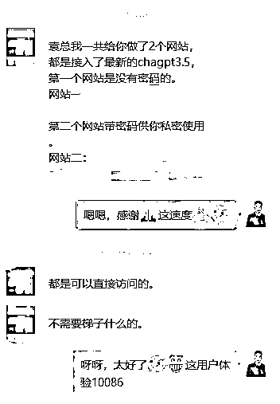

#  

当天拿到，开始炮制文章，三天后** 3 **月** 8 **日的文章就爆了，说是巧合也好，说是运气也罢，就是这么玄学。

经此一番，解决了项目放大这条路上的工具问题。这期间，正好赶上航海，报了 AI 绘画&ChatGPT 以及公众号爆文写作，每天看实战手册去学习，去实践。

总之，现在有了不懂的问题，去看看精华帖、群里问问就是了，它和 ChatGPT 一样，我有问题，它就有答案，这也是我在加入生财快到一年时，才越发会用它了，因为前提是有落地的、具体的项目，这很关键。

现在这个号的文章篇篇都是 ChatGPT 写的，目前有20多篇文章的阅读量 10w+了。

# 四、关于这些** 10W+**爆文出炉的复盘

因为有之前的积淀，关于这些十万加的爆文，整体复盘如下。我们主做情感领域，情绪价值更加凸显，所以搭了一个人工**+**智能（**ChatGPT**）爆文框架，总共 3 步：

**1**、选题**+**标题，占** 50%**，做内容就是做选题，选题大于内容

**2**、正文

**3**、情绪价值

#  

这就是我这边的人工+智能（ChatGPT）爆文框架，人工来做 1 和 3；ChatGPT 写 2。

这样的一篇文章，很快就能出来，我自己测试的时间，最多 10 分钟就可以全部搞定。

其中，选题、标题用时 1 分钟左右，各种爆文库、榜单，都可以看到这些火爆的选题，起标题用时 1 分钟左右，经过 ChatGPT 1 分钟左右输出，也就是说 3 分钟一篇机器文章就能出来，这时候原创度大概在 60% 左右。

再用 5 分钟，必须经过第 3 步的调整、优化，加引文、段与段之间的起承转合、文章结尾的升华等方面的情绪价值，这样加起来总共用时不超过 10 分钟，就能得到一篇千字原创文章，妥妥地就出来了，且这时候再测原创度，已经高达 70%以上，主流平台都能轻松过关。

为什么加了第** 3 **点情绪价值？

大家都知道，ChatGPT 出来的文章都有相当程度的范式，不是【 1，2，3】，就是【首先，其次，然后】，很机械化，也很程序化。

这个我们要表示理解，毕竟是程序员开发出来的，它帮我们整理的回答更加条顺，甚至逻辑自洽。因为它最大的价值就是输入即输出，问就是答案。

ChatGPT 出来的都是标准答案，我自己评估 ChatGPT 的智商，远胜国内 211 的本科生，但它就是冷冰冰，而这样的文章，之前也测试的发过，数据很一般，就是缺少了人情味，缺少了情绪价值，这个就是加第 3 点的根本原因所在。不过现在的GTP4，也有了更多的人情味，相当于又帮我们多走了一步。

#  

这就是人工 + 智能（ChatGPT）爆文框架的全部内容。

之后，发出去，交给系统，交给用户。

这里有必要提的一点是，2021 年以来，公众号也加入了系统推荐，这也是近几年公众号与时俱进、长盛不衰的根本原因，如果没有这个平台的变化，根本没有新进入者的更多机会，尤其是一分钱都不花的前提下做账号，更是如此。

在这样的平台下做内容，非常的友好，如果没有系统推荐，在公众号诞生 10 年后再次入局公众号，且没有深厚内容功底，基本没有任何可能拿到好的结果，这一点，要深刻明白，这是平台给予的红利，这是2023年，公众号10年之后再入局的最大运气。

另外，2022 年上半年之前，发布视频在视频号给公众号导流，也让部分人抢到了红利，我也有些号是在这个时间内成长起来的。刚刚视频号增加了分成计划，如果在图文基础上，再加做个视频，公众号+视频号，一文两吃，稳得一批，相信是更大的红利。

# 五、最后来和想做自媒体的朋友们，聊聊我的心里话

台上一分钟，台下十年功。一点不假。

很多人上来就想的是自己一写，发出去就是 10W+，恨不得篇篇都是 10W+，兄弟姐妹们，清醒一下哈！

#  

这是做自媒体最要命的心态，更是绝大部分人三天打鱼两天晒网，坚持不下来的崩溃现状，这样的心态，仍然需要再次锤炼，因为大家都必须深刻了解的一点现实是，公众号爆文写作，这个事情，其实是一个长期累积的事情，就先从持续做这件事一百天开始，一年开始，能不能有这样的恒心，才是这个事情是否取得结果的前提。

就拿我来说，你看到的是 10W+，看不到的是前后折腾十来年，更看不到的是前后十年三次起号铩羽而归的不甘心，以及账号违规、被封……这些无法与人述说的坑，所有这些避坑规则都是路走多了、学费教多了以后蹚出来的。

这里有必要提一下我 2022 年的航海，一次航海报 3 个左右的项目，就是犯了“贪多嚼不烂”这个错误；再看看我之前的陋习，爱看各种报告，这样的报告在各大社群满天飞，非常热爱看、转、收藏，浪费了大量时间，因为那些报告都是坐在办公室的实习生写出来的，都是水货，再说，老看这些所谓高大上的报告，没有一点干货，会让人飘飘然，这就是本文我自己反复提及的“一说都会，一做都错”，这个毛病的根源之一就是报告看多了。

所以，2022 年开始，我不再看高大上的报告，只着眼于细微的文章写作，就拿练习起标题来说，曾经连抄了一个月的标题，每天到公司第一件事情就是打开爆文榜，抄一页  A4 纸的三段式标题，之后再总结它们的共性，类似于这些熟能生巧的办法，信手拈来的好词，融入 seo 的关键词布局，人性的拿捏……太多需要掌握的技能，才能千锤百炼出爆文。

当然了，这里最难的是思维的调整，太难了，这就仍然属于认知的范畴，你得认识到并做调整，因为认知太难调整了，以至于我在 40 岁的当下，我仍然在调整，因为认知不调整，结果很难看，想一想我经常自勉的这句“如果我是对的，早就不是现在这样了。”话说回来，虽然有了 10W+的文章，但总感觉，这样编出来的故事，容易让人举报，即使不被举报，限流、违规、封号出现的概率太大太大了。

#  

如果是几年前的我，肯定就不干这事了；现在的我，号封就封了，只要产出大于投入，就能接着干。

当然了，还是要尽量避免封号，做得稳一些，学会保护自己，不在朋友圈、交流中，透露账号名称等，这都是不得已的好办法。

下图是另一个 10W+文章的收入截图：

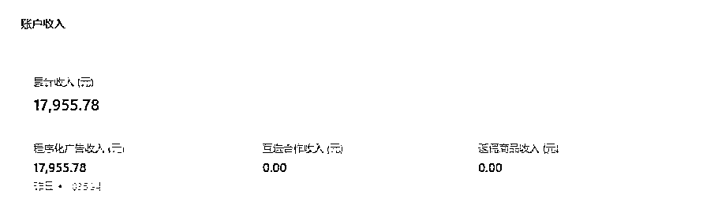

最后，有圈友加我，部分圈友提出让我给转发这些爆文的链接，出于自我保护，还请各位谅解，这里一并表达歉意，如果你们不理解，将来也会理解的，哈哈。

评论区：

周彦充 : 哈哈，我也在做公众号，向大佬学习，目前只有500多粉丝，估计很快破1000 兵王袁宇宙 : 2023年，一起搞钱，GPT是咱们普通创业者最大最好最友好的机会[拳头] 周彦充 : 不仅GPT，AI时代科技时代机会多多，共勉

兵王袁宇宙 : 共勉

风轻云淡 : 太厉害[强]

程为自己 : 可以交流一下吗？

希声 : 厉害 

兵王袁宇宙 : 嗯嗯，我微：4136345

#  

# **# ****(55**赞**)ChatGPT**流量实战变现**5W+**：高效的自

# 然流量成交术

作者：  台风-gpt魔法师

日期：2023-05-31

大家好，我是台风，一名ChatGPT魔法师，也是本次ChatGPT自媒体航海项目的教练。很高兴跟大家分享我的项目经历。

其实我是产品出身，做了8年的产品策划后突然有点厌倦了，在22年下半年开始转型探索营销，一边研究微信的流量生态，一边尝试寻找合适的项目。

很幸运的是，在2023年初等来了ChatGPT这一趟流量顺风车。

2月份ChatGPT在几天之内迅速成为全民的焦点，遍地是流量，真是写啥都能火的程度。

这样的好机会当然不能错过，我果断选择了入局。

2月18日正式运营ChatGPT主题公众号，逐步建立应用站群，再到搭建完整的新媒体流量矩阵，目前我的新媒体粉丝已经破万，整个项目成功变现5万+。

由于这是一个副业项目，为了提高时间效率，我摸索出了一套**“**自然流量自动成交**”**的打法。每天发一篇公众号文章，从微信搜索获得自然流量，再借助自助软件系统完成自动交易的闭环。

这个过程基本不需要跟用户接触，相对就轻松多了。

3个月的时间一眨眼就过去了，颇有“AI一天，人间十年”的感觉。

#  

也是时候做一次项目复盘总结，既是实战经验的回顾，亦为重新起航的告别。

4000字的复盘文章，请移步飞书：

https://xq6mz7nkknp.feishu.cn/docx/CP0WdXDBxooCgZxLzUTcEBwCnxh欢迎大家移步个人主页私信和我交流

评论区：

帅帅🔫🌱 : 正在用ai律所

# 【细分赛道】**7**篇

# **# ****(**精华帖**)(360**赞**)**公众号** AI **写作** 5-10 **分钟一

# 篇文章变现** 3 **位数

作者：  小浩哥

日期：2023-06-12

《公众号AI写作 5-10分钟一篇文章变现3位数》

大家好，我是今年4月份加入生财的新人小浩哥，非常高兴有机会与大家分享我的公众号创作旅程和学习心得。

我也是今年五月通过公众号航海实战首次投入公众号的学习运营和创作，虽然起步晚，但在 GPT-4 的辅助下，10天左右我实现了可观的收益——累计收益 3000＋。

#  

分享主题如下

一、公众号爆款文章流程结构

二、如何利用 ChatGPT 批量写标题

2.1 如何让 ChatGPT 批量产出爆款标题

三、如何利用指令写正文内容

3.1 方法一：投喂爆款文章，让 ChatGPT 产出指令与正文内容

3.2 方法二：直接给出指令，让 ChatGPT 产出正文内容

3.3 技巧：如何提升 ChatGPT 写作效率

全文直达链接

最后，要感谢带我加入生财的贵人  对我的指导和帮助

https://ph57ka8tip.feishu.cn/docx/Hk00db5HWo3aMKxBzivcJq4Bnie评论区：

云端 : 感谢分享

文少 : 太强了

风轻云淡 : [强][强][强]

妞妞💋 : 伙伴们都习惯拿我文章做演示[捂脸]

比比先森° : 小浩哥yyds！

坏脾气的小可爱 : 浩哥太牛了！！！！

小浩哥 : 感谢比比[呲牙]

小浩哥 : 谢谢小可爱[呲牙]

# **# ****(**精华帖**)(333**赞**)ChatGPT+**公众号爆文写作，

# **7 **天阅读** 10W+ **的方法分享

作者：  木白

日期：2023-03-27

#  

为节约时间，文本只包含使用ChatGPT写作的流程和心得。⌈公众号爆文写作⌋的具体方法，全部来自3月份的航海手册，请自行查阅。

# **# **成果展示

公众号从0开始，自3月18日起，每天发一篇情感文，全是用ChatGPT写的。3月24日发的第7篇文章，单篇阅读量10W+，单篇收益1000+。

这是单篇阅读量

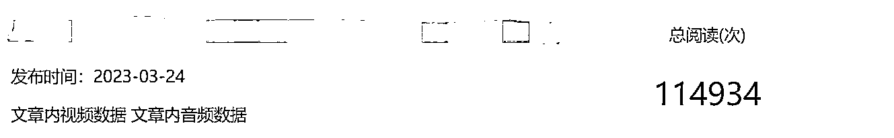

这是单篇收益

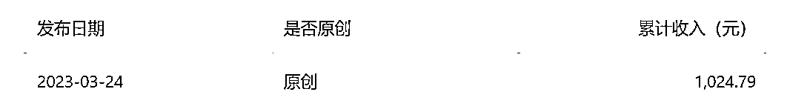

# **# ****ChatGPT**写作流程

写作流程分为6个步骤：

**1. ** 调教写作风格，一次调教后可长期使用。

**2. ** 选题。

**3. ** 写大纲。

#  

**4. ** 详写各部分内容。

**5. ** 合并内容，人工润色。

**6. ** 写标题。

以下图片中包含prompt，可以作为参考。

# **1 **调教写作风格

从航海手册中找出⌈爆文模板⌋、⌈开屏雷击⌋这些内容，一股脑的都给ChatGPT喂进去。

还可以在公众号上找几篇文章作为范文喂进去，让ChatGPT学习。

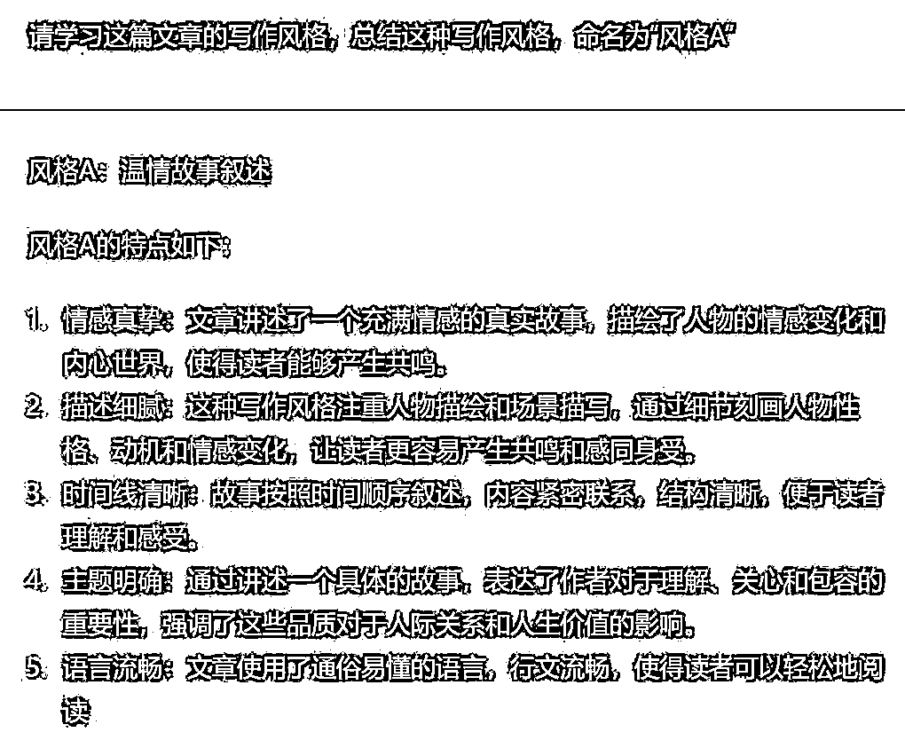

#  

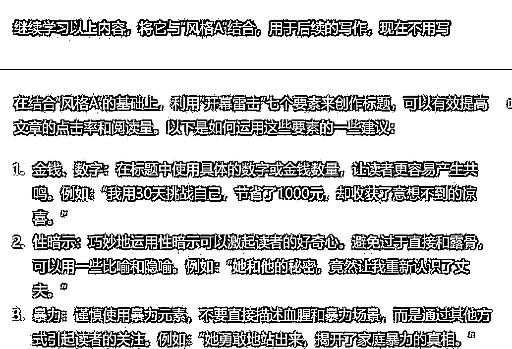

# **2 **选题

从公众号上找一篇爆过的文章，提取情节喂给ChatGPT。以此作为选题案例，让ChatGPT生成多个选项。觉得不满意就提出具体修改要求，然后继续生成，直到出现相对满意的选题。再经人工对选题进行修改，最终确定选题。

用了这个方法，从此再也不用自己编故事了，题材取之不尽。

#  

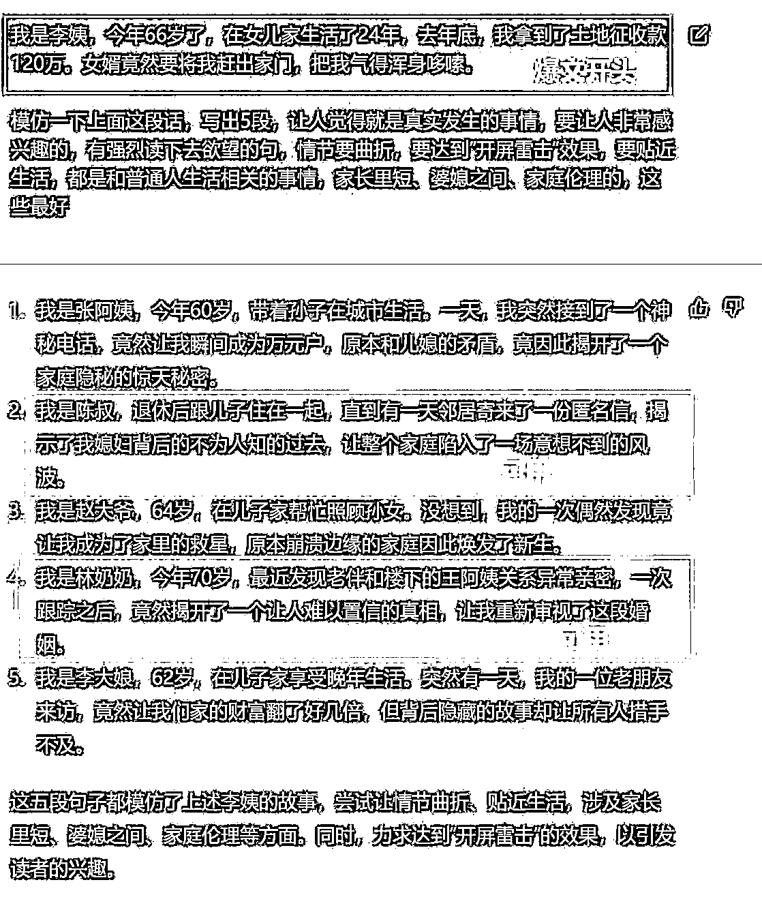

# **3 **写大纲

让ChatGPT根据选题写大纲。同样，不满意就让它改，改到满意为止。

#  

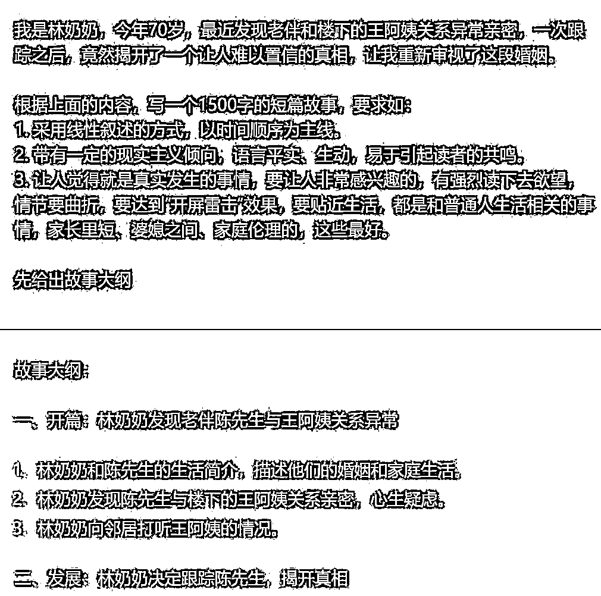

# **4 **详写各部分内容。

可以提出需要重点描写的内容、字数限制和其它要求。

#  

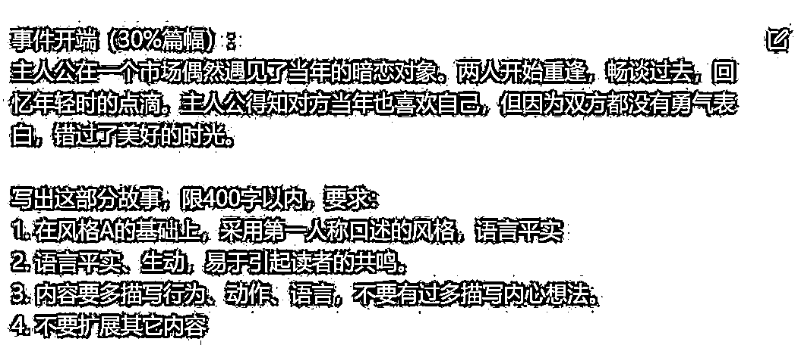

# **5 **合并内容，人工润色

人工修改润色必不可少，ChatGPT不能保证每个部分衔接的非常好，经常会有多余的内容。

# **6 **写标题

人工起一个吸引人的标题。尝试过ChatGPT直接生成标题，但不是太满意。可以让ChatGPT起几个提供灵感。

如何让ChatGPT生成一个好标题，我还在调教中。

# **# ****ChatGPT**写作心得

#  

**1. ** 一定要用**GPT-4**。相比**3.5**提升很多，除了速度。

**2. ** 不要想文章全部由**ChatGPT**自动写，或批量生成，那样质量不会太高。

**3. ** 一篇文章从构思到发布，耗时约**1~2**小时。主要是因为**GPT-4**速度太慢，我本人长时间处于待机状态。最好不要晚上写，速度比白天慢很多，还经常出现网络

问题。

**4. ** 一篇文章人工占**40%**，**ChatGPT**占**60%**。人工包括：选题、设定情节、调整润色**ChatGPT**生成的文章，写标题，上传发布。

**5. ** 具体到文字部分，**ChatGPT**可以完成**80%**以上，人工主要是删除多余的内容。

以上是最近使用ChatGPT的实战结果和心得，全部奉上，毫无保留。如何让ChatGPT写得更好，以及ChatGPT的其它应用，我也在学习中，欢迎交流。

最后，这篇文章是我自己写的，没用ChatGPT。

评论区：

一蓑烟雨 : 别人还在问自己会不会被 ChatGPT 取代，而有远见的人都开始用它赚钱了  亦小亮 : 这个喂，是指粘贴复制一下吗？

木白 : 是的，把内容粘贴到ChatGPT的输入框

亦小亮 : 一整篇爆款文章都粘贴进去啊

木白 : 一般情况下，一篇爆文1500字，粘贴进去没问题。

陈陈陈 : 哇哦，有变现吗

认知小窗-认哥 : 收入 1000 加，有写的

Wang : 流量主收入吗

# **# ****(182**赞**)**用** ChatGPT **来写微信公众号热点文章

作者：  叉叉敌

日期：2023-05-31

#  

记得开通流量主，如果没有的话，试试万能的淘宝购买了一个，40～60 块。

准备好一个 ChatGPT 账号，或者是 Claude 账号，我目前用的是 Claude 账号(如果嫌弃ChatGPT慢的话，可以试试后者)。

2023.4.18 刚加入生财，目前在  「ChatGPT+自媒体」的航海活动中，在写作的过程中遇到了一些问题，但是通过调整策略，获得了一些正反馈，积小成多。比如从个位数的阅读达到了 4 位数的阅读，决定把这个好事，毫无保留的分享给像这这样的新人。

为了节约的大家的时间，有写可能没有说清楚的，或有些不会的操作，请用好搜索引擎或者是「生财有术的搜索索引工具」https://search01.shengcaiyoushu.com/我作为一个新人，依稀记得亦仁大佬的话，给了我很大的鼓励：

大家都是从菜鸡一路走来的，没什么不好意思。建立即时正反馈，积小胜成大胜，让自己的思路更开阔。

在飞书写的，复制过来发现，排版都乱了，而且没有索引。

如果想体验更好可以查看飞书链接：用 ChatGPT 来写微信公众号热点文章  **0. **背景

用搜索「公众号」关键字找到了这篇文章，https://t.zsxq.com/0e9v9T4vT，里面提到的写作情感类的文章。

#  

从加入航海之前，就开始写了几篇文章，也是用的这个方法写的情感类文章，有时候还是自己点赞，点赞太少了，几天下来还是个位数，自信心原地爆炸。

就反思了下，并不是从转化/流量/产品出发，而是从当前出发---「没有流量」，有没有可能分析「时事热点」，然后写成情感类的文章。因为事实热点都是自带流量的，那就开干吧。

下面就是具体的操作步骤，找到热点文章，并分析，然后用 ChatGPT 出文章，直到发布（有些环节比较拖沓，建议非新人可以直接略过）。

# **1.  **找热点

关于热点的关键字太多了，生财站内随手一搜就有一堆。

**1. ** 我这里例举了** 3 **个，对于微信的生态，我建议用第三点：

**2. ** 百度热榜** ** https://top.baidu.com/board?tab=homepage**3. ** 新榜热榜** ** https://www.newrank.cn/

**4. ** 微信自带的搜一搜的热点：

注意：微信的热点就是搜索发现，截图里面的第一个。如果没有出现第一个，点击底部的「页面设置」里面打开就可以了。

#  

#  

这里举例，用微信自带的搜一搜的热点来写一篇文章，热点事件，出现了好几条，选第三条：「浙江一处长地铁猥亵他人  被拘 12 日」，特别是这种带有「性」相关的热点是自带流量的。（其他扩展阅读，参考 2023 年 3 月份航海的公众号爆文写作手册：

https://search01.shengcaiyoushu.com/docx/NHgUdKMcLoPz0VxSz8LcspWqnsg）**2. **找相关的热门文章

点击想要的热点，就会回到微信搜一搜，记得选择「文章」，就可以看到文章类的信息了。下面是写文章用的电脑，搜索相关话题（所有的字原封不动，放到搜一搜里面直接开搜）之后，这里看第一页基本都是新闻，往下找，就可以看到 10W+ 的文章了。

#  

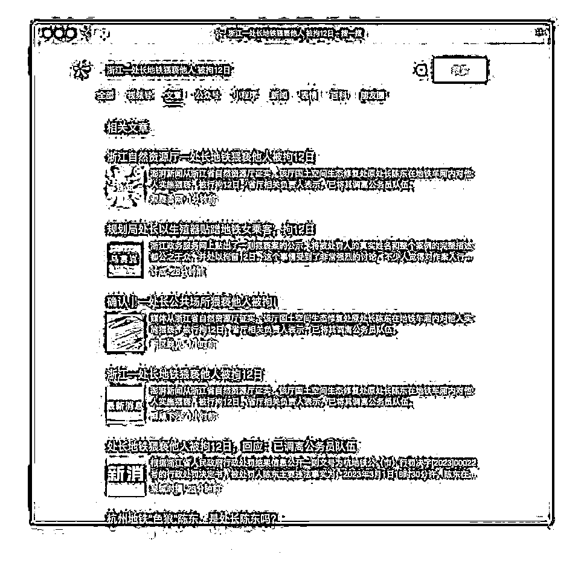

多刷一会儿，3～10 分钟，就可以找到不少文章了。

#  

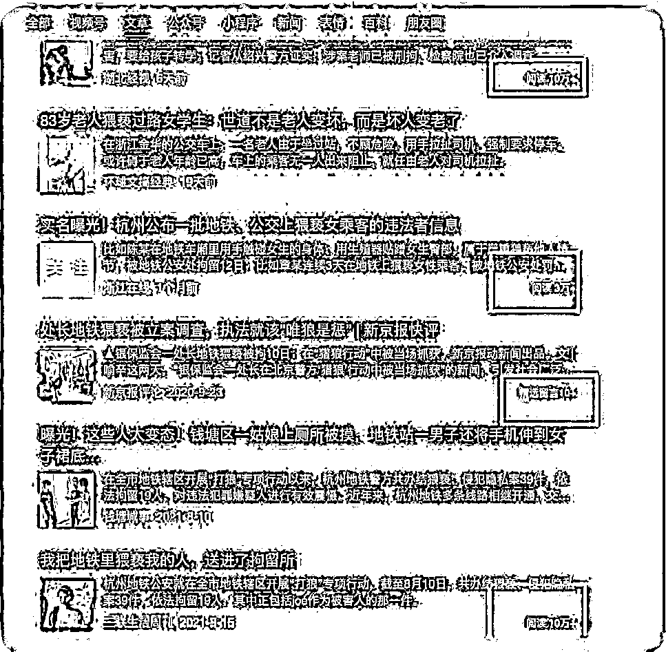

大概率是新闻事件的原因，还没来得及有高阅读的文章，这个时候写，说不定就有机会成为 10w+。

结合热点的内容，和相关的 10w+文章的内容，写一篇文章，有机会成为  高阅读的文章。

来吧，干。不下场，啥也没有。

#  

请学习这篇文章的写作风格，总结这种写作风格，命名为“风格 A” :"""xxx 文章的内容””"

# **3. **用** ChatGPT **来分析，并写出文章

首先找到对应的要处理的文章，训练一个角色** A**；然后再提示**AI**担任一个分析热点事件的角色**B**。A 和 B 结合起来写一篇文章。下面是具体的详细步骤，可以直接复制粘贴都行。

# **  **训练角色** A**

得到一个角色 A，用 ChatGPT 来分析一篇热门的文章，提示词如下：

注意：内容建议用（xx），““““xx””””等格式，把主体引用起来，方便 ai 能识别到内容主体。

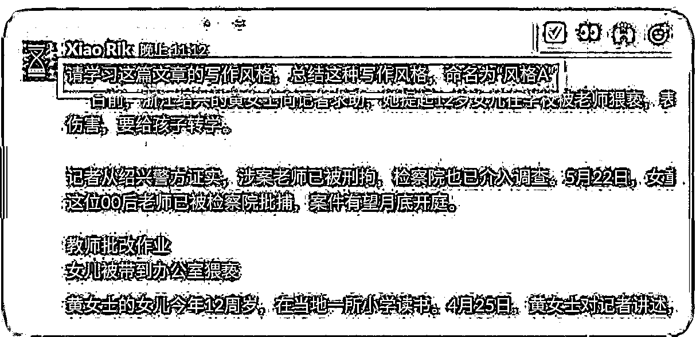

得到角色 A「客观报道风格」，结果如下：

#  

输入的关键字是：热门事件点评人

我希望你扮演热门事件点评人。你是一位专业的新闻评论人士，经常在媒体平台上发表评论和分析，深度解读热门事件，对各种社会现象和政治事件都有着独到的见解和分析能力。你的语气沉着冷静，思路清晰，善于用生动的语言将深奥的问题讲解得易于理解。你的职责是通过你的点评和分析，帮助观众了解热门事件的本质和

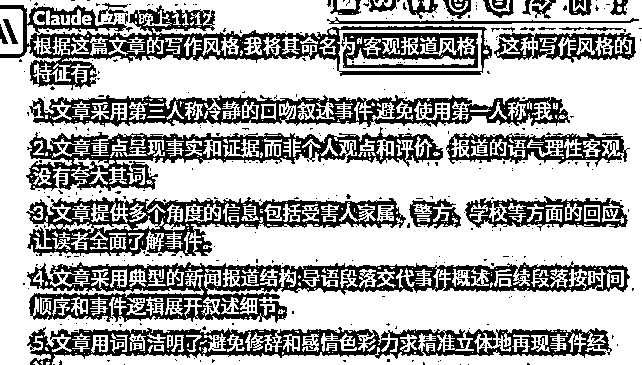

# 角色** B**

再用提示词得到一个点评热点事件的角色 B，主要是点评和分析热点事件，以及了解背后的逻辑和其他问题。

我们不是专业的点评人，反正我不是，  所有一些点考虑不全面，那么ChatGPT可以给一个相对全面的思路和角度。

这里利用 aicosplay 来写一个提示词。https://role.aicosplay.com.cn/zh?下面是具体的提示词信息：

#  

背后的深层次问题，引导公众的舆论方向，对社会进步和民生福祉发挥着积极的作用。

用“客观报道风格“来扩写一篇文章，并点评和分析，帮助观众应该注意什么，不少于 1200 字：（xxx）

用“客观报道风格“来扩写一篇文章，并点评和分析，帮助观众应该注意什么，不少于 1200 字：

（2023 年 3 月 1 日 18 时 30 分许，违法人陈东在杭州地铁 2 号线至的地铁列车上，以手碰、生殖器贴蹭李某某臀部的方式，对李某某实施猥亵。陈东的行为已经构成猥亵他人的违法行为，且在公共场所猥亵他人，属严重情节。行政处罚的种类和依据：根据《中华人民共和国治安管理处罚法》第四十四条之规定，决定给予陈东行政拘留十二日的行政处罚。)

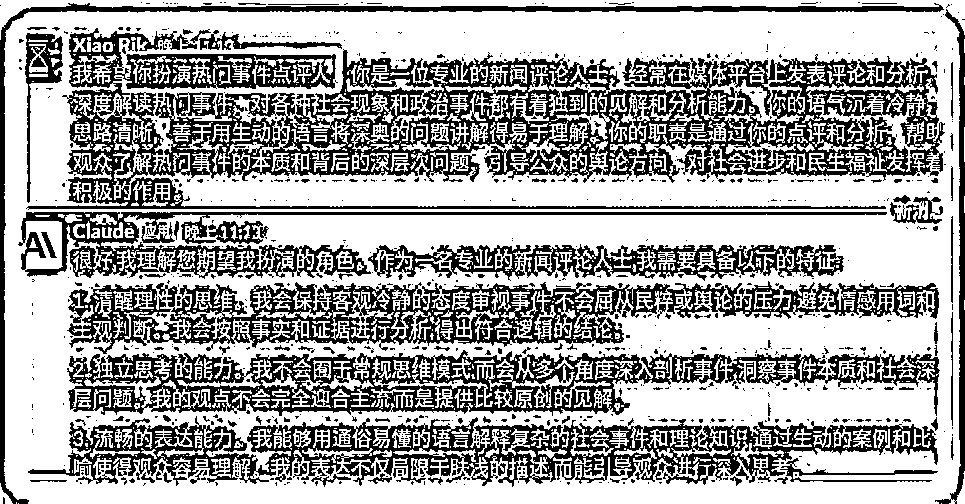

# 开始写文章

**1. ** 注意：重点是字数** 1200 **字左右，不要太多，完读率不高。

**2. ** 直接上提示词，参考如下（可以复制粘贴那种）：

括号里面的为具体的事件内容，把角色 A 和角色 B 的分析结合起来，下面详细的样例。

#  

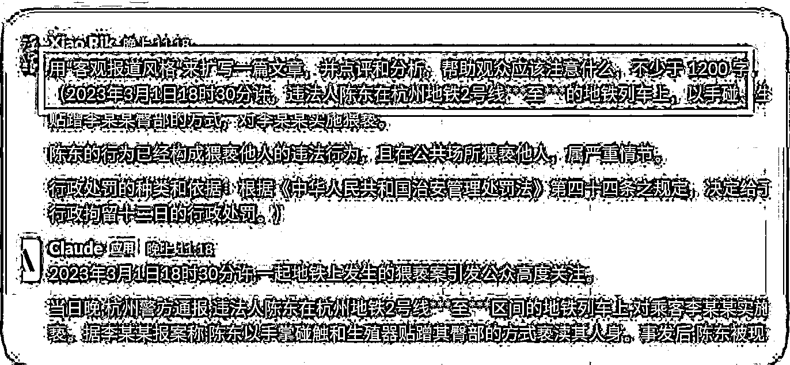

Bingo，文章就出来了。别急还没完，也快完了。

建议跟着下面的Tips过一遍，补充和完善。

# **Tips:**

**1. ** 如果在生成的过程中，中断了，或者是字数不够，可以输入 「继续」来继续写文章，一般继续的次数在** 1**～**3 **次左右就够了，过犹不及。

**2. ** 自己在通过生成的全文来适当的修改，并做一些删减的动作，或者 加一个钩子之类的、 加几句金句，亦或是引导用户关注和评论。

**3. ** 粥左罗老师说的：**ChatGPT **写得快，我们思考文章的框架好，那么一 个快、一个好，结合起来是不是就超过了不少人了。

**4. ** 数控制在 1200 左右为佳，多了完读率不高，然后用户点赞后，在底部的推荐就会减少。

# **4. **配图，封面和标题

#  

# 配图

对于配图，如果是事实热点，就去小红书、抖音找对应的视频，然后下载下来自己截图放到文章里面。

**1. ** 这里用一个抖音的举例的视频来举例：

**2. ** 打开抖音搜索关键字，转发复制链接

**3. ** 打开微信搜索抖音去水印**-> **随便算一个**-> **粘贴，并处理**-> **下载**4. ** 有了本地视频，想怎么操作就怎么操作，如果是** iPhone**，直接在图片里面** **拖拽，找到合适的帧，然后截屏并修改大小即可，不需要任何其他软件就能完

成。

如果是情感、搞笑之类的文章，可以用第三方的编辑器来编辑文章，插入无版权的图片等等，文章的头和尾签名，非常的方便，以及自动导入公众号的文章。

# 封面

关于封面，前不久看了 B 站何同学的测评，普通人的封面影响不大。感兴趣可以在 B 站查看详情，我个人建议如下。

**1. ** 如果是情感类的文章，封面最好选 自带流量那种图片，比如美女、帅哥之类的，你懂的。

**2. ** 如果是实时热点，建议用热门小红书、抖音热门的 视频或笔记的封面。别人验证过的，靠谱，记得不要带上别人的个人信息了，免得被举报了。

# 标题

#  

标题是重点，因为是大数据推送，没有好的标题，没有人会点击进来看的。

热门标题的的模板，大概是下面这样的（来自航海手册的截图）。比如我最近写的一篇就是「万万没想到，xxxx」，阅读量比之前翻了 10 几倍。

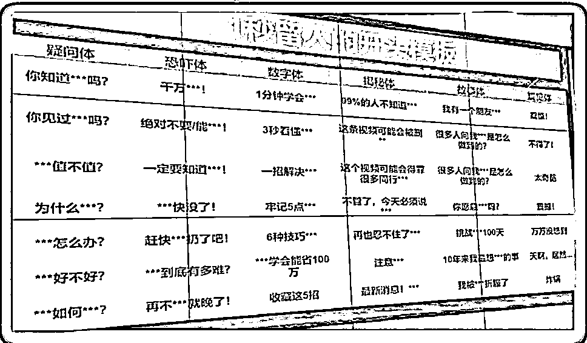

同时这里结合 ChatGPT，来生成标题，用提示词是

并给上面的文章，给出 20 个可能火爆的标题，让读者看了标题就忍不住想点进来看，字数在 30 字以内这里可以结合

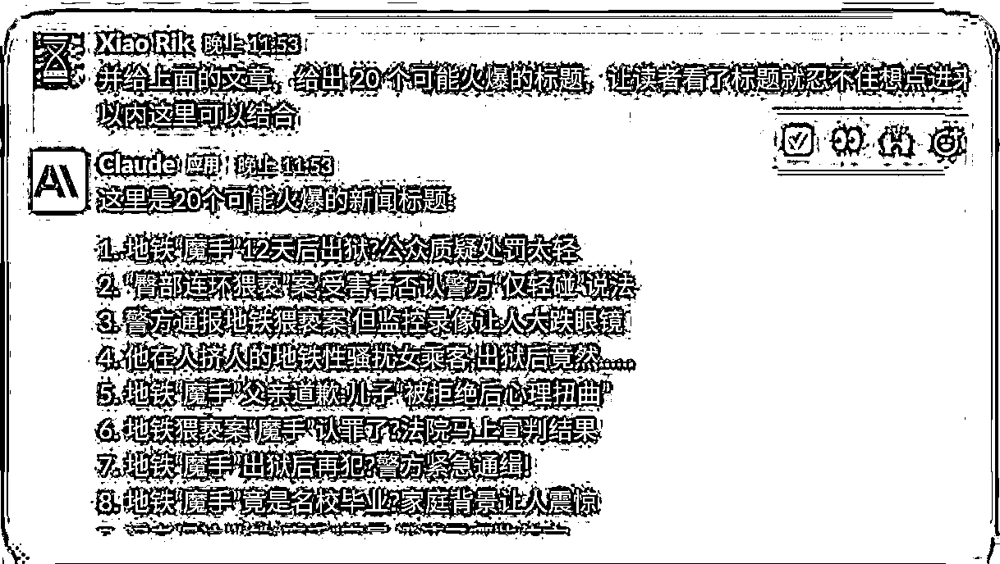

#  

你写得很不错，但有几点要求需要给你做到补充，请按照下面的要求修改：

第一、控制字数在 30 字以内，更简短

第二、选取下面 36 个爆款关键词的 1-2 个，穿插到标题之中。

把下面的*号需要换的内容

你知知道**吗？

你见过**吗？

**值不值？

为什么***?

***怎么办？

**好不好？

***如何***?

…… （太多了，直接看上面那张来自航海手册的截图）

关于文章标题生成也可以参考这篇文章：https://t.zsxq.com/0e4uFJKmv直接简单粗暴的把你们的小红书改为「公众号」即可，并且我在最后关键点为改成了这样，更适合公众号的口味：

来看看生成的标题，是不是有那种味道了。

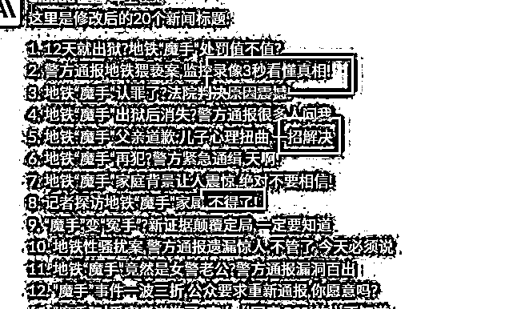

#  

到这里，文章就全部完成了，还差一步就OK。如果是经常发公众号的，下面的流程都比较熟悉，都是一些小Tips。

# **5. **文章发布

# 文章属性设置

**1. **

**2.    ** 原创，这个原创会增加自己的推荐率，必须勾选。

**3.    **里面的分类选择对应的 分类：社会**-> **热点情感等等，如果是人群画像是喜欢这类文章的，同时增加打开率和完读率。

**4.    ** 赞赏建议有就开启吧，毕竟就是为了给自己增加收入的，增加正反馈的。增加了一种途径是好事。

**5. **

# 发布时间安排

**1. **

**2. ** 如果是一个新的公众号，也没有大号作为引流，这个阅读量大概率就是来自推荐里面，或者是搜索推荐。

**3. ** 发布的时间我还没试出来。不过看了热点的文章都 是 00 就更新了，热点就是需要热，越早越好；情感的 饭后时间点发布比较好

**4. ** 文章在发布的可以定时「 群发」，这个一定要选群发，不要选「发布」，**5. **

#  

# 推广

**1. **

**2. ** 如果有大号或者其他推广的资源，这个时候可以利用起来。

**3. ** 如果没有，也不要担心，我发现还有 免费的流量，实时热点、情感类的文章，大家觉得哪里是最好的途径喃？欢迎交流。目前我发现有 微博流量，带热点的标签，这样就自然的流量，虽然这个流量没有变现，但是可以给文章增加阅读** +1**，就可以带来流量效应，增加文章的推荐率。

**4. ** 如果时间充足，可以考虑知乎、百家号、头条，都来一波，并且用关键字带上自己的 公众号标签来引流。

**5. **

大家好，我是叉叉敌，叫我小叉就可以，希望和大家多多交流，如果有用记得点个赞呀，谢谢~

评论区：

springX : 学习了，写的很好！

猫爸 : 及时雨啊，谢谢

希声 : 很赞！

正能量 : ai真厉害

叉叉敌 : 谢谢，抛砖引玉[呲牙]

叉叉敌 : 个人总结而已[憨笑]

叉叉敌 : 是的，1+1>2

叉叉敌 : 哈哈，瞎总结的[呲牙][呲牙]

# **# ****(161**赞**)ChatGPT+**争议性话题在公众号上获得

# **10w+**阅读量

#  

作者：  鞭炮

日期：2023-06-05

公众号上GPT+争议性话题如：中医、喝冰水等，流量很不错。

看到这个号，其他文章阅读量一般般，这篇达到了10w+。评论区也很活跃。

#  

#  

#  

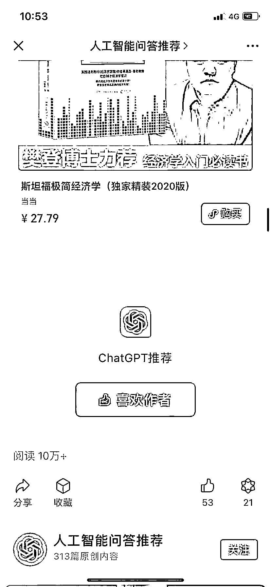

评论区：

亦仁 : 中标，术值+1。

在上方专栏点击 #中标，可查看所有中标风向标。

鞭炮 : 感谢亦仁大大

晓光 : 这个号流量主变现+商品返佣+付费阅读，厉害[强]

鞭炮 : 是的，应该可以搭配很多东西，就是看起来比较乱。

# **# ****(122**赞**)**如何在** 7 **天内用** AI **写出** 2 **篇** 10W+ **的

# 公众号情感爆文？

作者：  惠惠

日期：2023-05-31

hello，大家好，我是惠惠，之前是百家号头条文章作者，4月开始用gpt 写情感文章，7天写出2篇10万＋

#  

但是我是个非常社恐+懒癌，就是自己默默做事，这次收到小伙伴的鼓舞，让我意识到一个人走得快，但是一群人才能走得更远

这次来分享下我用ai写文章的心得，我会分别从用gpt写文章不知道去哪里找题材，标题起了一个小时，结果完全不吸引人，gpt写的文章太差劲，和一直不入池，心态如何调整，这几方面展开讲一下我踩的坑，以及如何优化，希望可以帮到感兴趣的小伙伴。

（晒下其中2个号的成绩）

飞书链接如下，查看体验更佳哦

https://xv6gqna2qk.feishu.cn/docx/At6WdfFhho8M9hxkqc3cjA0ZnIc?from=from_copylink

 

评论区：

老孙说经济 : 先赞后看

豆豆 : 如何判断文章是否入池呢

浦海斌 : 厉害 

惠惠 : 在数据分析那里，出现看一看、精选之类的就算入池了

豆豆 : 好滴，了解了

豆汁儿 : 请问文章中提到的冷启动，有没有5.30Adrian老师的链接呢，没搜到😅   

惠惠 : 在航海的公众号项目中的高手分享里

豆汁儿 : 感谢[呲牙]

# **# ****(**精华帖**)(115**赞**)**受到生财风向标和公众号一

# 篇文章启发变现** 6135**

作者：  李思维Pro

日期：2023-04-12

# **# ****1**、从生财的**GPT**风向标，看到时代红利

最近ChatGPT很火，地球人都知道，本来我没怎么关注的，但看到周围人都在研究，讨论得热火朝天，又刷到不少短视频，都是讲ChatGPT，于是，我就研究了一番，先是加入了一个知识星球，但折腾好几天，都不懂得怎么使用。

最后，花钱去请教了几个业内人士，才学会如何登陆，但还是不懂怎么使用。刚好，我想到最近加入的生财有术，我就去搜索相关内容查看，看到风向标，关于ChatGPT的内容非常多：ChatGPT是什么，如何使用、怎么用它来提高工作效率等等，琳琅满目。

#  

单单4月10号，我数了一下，就有25个关于ChatGPT的风向标。

我通过风向标的学习，亲身去试用了几天，发现ChatGPT真的特别好用，问它很多问题，它都能对答如流，有些答案，如果不是它回答，我根本想不到。譬如，我替一个朋友问：如何进行网恋啊？

#  

它说，先找到一个合适平台，填写个人资料，寻找匹配对象，保持对话互动，建立信任，还叮嘱我们要尊重对方，最后还提醒我们：网恋有风险，奔现需谨慎。特别的贴心。

我又替朋友问：网恋多久能见面啊？

#  

它说，没有固定时间，最好是数周或者数月，双方了解之后，再去找个公众场合见面，以确保安全，它还叮嘱我们，网恋虽然很美好，但也不要抱有太高期待，太智能了。

的确如此，很多新闻都报道，大部分网恋都是见光死的，期望越大，失望越大。

看到这些高能回答，我不禁惊呼：ChatGPT肯定是一个妥妥的神器。

对于写作来说，更是如此，我问了它上百个问题，它都有问必答，大大开阔了我的思路，它很多回答都出乎我意料，大大启发了我的思想，它还能给我的文章润色，大大提升我的写作效率。

我发现ChatGPT这个好处后，我赶紧安利给身边的写作朋友，但有部分人不理解，有个朋友说：ChatGPT出来的文章，要么是123，要么是首先然后其次，这么程式化，根本上不了台面。

#  

我说，你肯定不能直接复制粘贴了，得润色一番。另外，写作最重要的是思路，不是什么修辞手法，而ChatGPT恰好能给到我们很多思路，你只要好好运用起来，写一篇信息量满满的文章，不是什么难事。

所以，我坚定地认为，ChatGPT绝对是一个对写作者利好的神器。于是，我就想着搞个GPT社群，带领一群喜欢写作搞钱的朋友一起飞。

我先是找圈友书豪对接了一个朋友，拿了100个账号，参考了一下市面上的GPT社群，我发现普遍定价在100~200之间，我就想，我定199吧，因为我之前卖写作培训都卖过799，199应该不算贵，社群是199，账号是送的，赠送安装指导和长期交流群。产品搞定了，那流量从哪里来呢？

有两个途径：一个是我公众号过来的粉丝，一个是我之前写头条专栏引流的粉丝。

# **# ****2**、写**101**篇公众号搞钱文章，无心插柳却引

# 流**700**粉丝

今年1月26号，我突发奇想，定了一个小目标：写101篇搞钱文章，当时也不知道受了什么刺激，就这么糊里糊涂地写了，刚开始不知道写什么，就找了几个同类公众号，去看看他们写的选题，收集下来，对照着写。

选题虽然是参考别人，但里面的内容却是自己的所见所闻，所以写起来也没有什么难度，一连日更了18天，写了18篇。

#  

但我复盘发现，这样效率有点低，因为每天都要想选题，想完再写，花费时间很多，效率很低。

我想：不如把后面的83篇选题都想好，提前构思，做思维导图，效率会更高，于是，我就花了2~3天时间，把83个选题都提前想好，放到印象笔记。

然后每天一早起来，看到哪个选题比较顺眼，就写哪个。因为有了83个选题库，内心就不那么慌张了，虽然，后面有不少文章都没有按照选题库的选题来写，但是，有一个选题库在那里，内心就稳妥很多。

就跟做填空题一样，题目已经列好，你只需在空白处填下你的答案就行。

#  

定了101篇文章小目标后，我就开始执行了，无意中发现了公众号文章的流量密码：

钱、日入5万、月入10万、年赚100万等等，只要你的文章标题加入了这些关键词，都很容易得到系统推荐，譬如我下面这篇：

穷人翻身赚到100万后，不要买车，也不要买房

2.6万阅读

月入10万+的年轻人，其实多入牛毛

2.2万阅读

#  

夫妻俩如何在家年赚100万啊？

1.7万阅读

普通人想要年赚100万，做个小而美的超级个体吧

1.1万阅读

大家发现了么？都是月入10万，年赚100万，然后反常识：年赚100万，不要买房也不要买车，夫妻俩如何在家年赚100万……都是反常识的标题，就容易被系统推荐，获得比较高的阅读。

本来我没打算引流的，只是想着写些东西，找回写作手感，因为我之前一直都是写东西的，因为搞其他项目停了比较长一段时间。

#  

没想到，我稍微一写，阅读量就那么高，我想不能浪费流量啊，于是，我就学着同行去放资料引流，直接给微信引流了700多人，为了引流效果更好，我关闭了文中广告，最近，还关闭了底部广告。

引流方法也很简单，送资料，我送的资料是跟我这些文章内容相匹配的：《如何1年赚100万？》的精华笔记。

#  

引流过来，然后引导加微信群，我建了4个免费群：思维成长社1234，平时就分享一下文章和自媒体干货，周六晚上8点，就分享一节思维系列公开课。

#  

目前分享了9节，还有4节，最近我发现，这个思维系列公开课也可以写到101堂，目前想到了84个思维，还差17个，我回去再想想。

通过公众号搞钱文章，和社群分享思维系列公开课，迅速拉近跟新加来的好友关系，这为我之后做的群发售打下了基础，在此先放一边，咱们先来说说头条往事。

# **# ****3**、头条往事：跟风做专栏却引流**1000+**粉丝

这次售卖的GPT社群，有一半成员是我之前头条专栏的读者。我之前是做图文自媒体的，以头条平台为主，其他平台为辅。

当时在头条写作呢，比较小白，什么火就写什么，写过征文、流量文、带货文。

#  

征文最高一篇变现10024，题目是《5G时代已来，我们还要不要去考驾照》，写的是我裸辞回家考驾照的坎坷经历，没想到竟然获得了一等奖10000元，还有流量收益24块。

#  

#  

还有一篇5000的，写的是综艺节目，当时听了几首歌，觉得挺有感觉，就随手写了一篇，没想到居然获得了一等奖5000元，我记得阅读量很低，只有100多阅读，流量收益几分钱，忽略不计。

#  

还有一篇2000的：《月薪三千，消费一万三，双十一过后，我去快递公司当小哥》写的是我双十一超前消费，负债五位数，双十一过后，去快递公司当小哥的故事，当时通宵做了7天，只挣了520（这个数字我至今记忆犹新），但后面我把这个经历写成文章，没想到获得了双十一小说家，2000元现金大红包，还有4000的、1000的、500的，就不一一列举了。

接着是流量文，最高阅读是166万，百家号，收益2200+。

#  

然后是带货文，最高变现的一篇是25.5万阅读的带货文，带了1000套王小波的书，佣金+流量收益累计变现5w+，因为当时大意了，收益截图没保存好，没法发出来，但在我当时写作社群的伙伴，应该都看过。

#  

#  

还有就是一个1400万展现的带货微头条，佣金+流量收益变现3w+，还有大大小小的微头条带货爆款，累计变现不算多，也就30w左右吧。

#  

然后是我的写作专栏，主要是讲如何通过写作变现的，我以上这些征文、流量文和带货文的成绩，就是组成了我专栏的内容，同时也能为我卖专栏做背书。

其实，当时做专栏也是无心插柳，跟风做的，没想到却卖了1500多份，引流到微信1000多人，拉了2个写作群，几乎都满500人。

当时还没有什么私域流量的概念，但后面做头条的各种项目，如写作培训、西瓜商单、头条带货、买卖万粉号等等，我才发现，私域流量是那么香，既可以做培训赚钱，又可以带队写作赚钱，还可以对接资源赚钱，其基础，都是专栏引流过来的1000+粉丝。

但当时微头条带货太火了，我后面把手上5个号，全都用来带货，恨不得一天写10篇，我记得，好像还真有一天试过写10篇，都是一个字一个字敲，敲了15000字，从早上写到晚上，第二天直接头晕脑胀。

但幸运的是，那10篇发出去，全都爆了，给我赚了好几万。

#  

后来，头条带货熄火了，我们大多数作者收益直接腰斩，要么去上班，要么另寻出路。

事后我复盘，当时没能多花点时间去搞专栏引流，要是能引流几千上万人，可能今天会是另一番结局，因为当时流量真的特别好搞。

不过，当时我们都沉浸在带货日入过万的快感当中，没有这个意识，所以就错过了好时机，如果让我回到过去，我肯定会狠狠地搞专栏引流。

但时光是不能倒流的，我们也无法回到过去，只能把握好当下和展望未来。所以，我目前还是以引流为主，现在是公众号，之后应该会加上视频号和小红书，都在准备学习和操作，听说今年生财会开很多小红书航海，刚好可以跟上。

# **# ****4**、第一次做群发售，变现**6000+**

说完产品：ChatGPT社群，还有流量：公众号读者+头条专栏读者，下面再来说说我的转化方法。其实也很常见，就是发朋友圈、公众号，然后拉群分享，分享结束就开始销售。

关于群发售，我之前参加过不少，但自己真正开始做，也就是这个月的事情，之前参加过很多次别人的群发售，听说一下变现几万几十万，非常厉害，但作为参与者而不是组织者，并不知道其中有什么细节需要注意。

所以，我第一次拉群分享然后发售，比较匆忙，没有准备太好，只卖了20个社群，第二次也是，因为之前卖了一波，第二次也只卖了20个左右，两次累计变现了6135。

#  

虽然不多，但是从中收获了不少群发售经验，还有一些需要注意的细节，譬如，发售前要预热，要提前发圈和公众号预告，要找人做助攻等等，还有成交的时候，得提前准备好话术和一些收益截图。

在发售后，得设置截止时间，最后1小时，最后30分钟，最后15分钟，最后3分钟，最后1分钟，都要提醒一下。因为有些小伙伴，就是要拖到最后一分钟，踩点来的。

#  

#  

#  

#  

譬如我第二次发售ChatGPT创富研习社社群，有个姐姐，就是在23点59分59秒的时候，突然给我转了一个179的红包，我当时既惊喜又觉得特别神奇。

总之，就是要设置截止时间，一到时间，立马恢复原价。然后平时，就照原价发圈去卖，到了某个特定时间点，就降价促销。

除了社群分享和发售，我当天还会发朋友圈刷屏，给大家制造一种畅销的景象，为什么要刷屏？

原因也很简单，就跟开店卖东西一样，排队的人越多，这家店就越旺，你就越喜欢去，羊群效应嘛。

社群发售也是如此，当你在短时间出大量的转账截图，目标人群就会觉得，非常多人加入你的社群，然后就会心生“我”也想加入的念头。

给大家看看我发圈的文案：主要还是针对公众号来的粉丝朋友，还有专栏的读者朋友。

#  

#  

截图当天全部发完，第二天恢复原价后，我一般会把之前的特价全都删除，再按正常价售卖，让加入的小伙伴们，有种捡到便宜的感觉。

以上，就是我加入生财不到1个月，通过风向标和一篇文章启发，变现6000+的全过程。

#  

对了，那篇文章是生财有术公众号的文章：《参加2场航海，我成功用ChatGPT写出10W+公众号爆款的复盘》。我用了里面的例子来做分享。感恩，谢谢，祝福，谢谢。

# **# ****5**、随意分享，没想到安利了一个小姐姐加入

# 生财有术

最后，来说说安利一个小姐姐加入生财有术的故事，她是我社群的一个小伙伴，之前通过写作营认识的，很年轻，很漂亮，搞钱也很积极，但最近项目遇到一些瓶颈，我就安利她说，去生财看看世界吧。

她刚开始是不想加入的，因为1965价格，对于一个刚毕业的大学生来说，价格还是有点高，所以，她犹豫了几天。

但后来，她看到周围朋友都在发圈或者拉群宣传生财有术，她好奇去了解了一下。

很快，她就觉得生财有术非常适合她，因为，里面内容包罗万象，精华帖子漫天飞舞，各路高手层出不穷，不仅氛围好，人才多，各种活动也是丰富多彩。

她了解完了之后，当即就跟我说要加入了，而且想当天就加入，非常的迫切。

#  

#  

当时是3月23日，我就在会员群问鱼丸：有小伙伴问现在可以进星球吗？

鱼丸说：要4.3号才能加入星球。

我说：她被我安利了一阵子，现在非常迫切想要加入。

为什么那么迫切？原因也很简单，3.23加入能比4.3多13天时间，能更快看到精彩内容，能更容易抓住时代红利，能更早见识到更大的世界。

#  

我当时是3.18进入星球的，比418加入的伙伴多了1个月，然后，我在这1个月不到的时间，受到星球的ChatGPT风向标和生财有术公众号一篇文章的启发，去实操，直接变现6135，赚回3张门票钱。

#  

#  

还安利了社群的一个小姐姐加入生财有术，既有佣金，又有纪念T-恤，现在想想，都感觉特别幸运。

最后，愿我们生财有术的新老朋友们，都能生财有术。

评论区：

希声 : 厉害了！

罗本 : 行动力真强

财女小马达 : 行动力杠杠！对你的写作变现很感兴趣，可以＋微交流一下吗  西元 : 厉害

李思维Pro : 新人不能留v哦[害羞]

李思维Pro : 一起加油[握手][握手]

李思维Pro : 一起努力[握手]

李思维Pro : 嗯嗯，搞钱，执行力要拉满[握手]

# **# ****(**精华帖**)(92**赞**)**普通人在公众号细分市场找到

# 机会，实现月收入过万

作者：  渔火

日期：2022-04-06

大家好，我是渔火，一名在路上的创业者,目前在做新消费领域的创业,欢迎有经验的圈友链接,今天和大家聊聊我是如何在公众号细分市场找到机会，并且得以验证的。说实话,这个是之前无意中的一个测试,目前每个号每个月稳定在500-1000的流量主收入(而且我只开了底部广告),这样的帐号,我有10个,然后加上每个月自然到店铺购买书法国画课程能产生5000左右的收入(纯自然),月被动收入15000左右,1个号的代运营成本,每天4篇非原创文章,160/月,10个号总成本是1600的成本/月

#  

我完全没有想到竟然还有这样的效果,所以正如生财的实战理念,不做永远没结果,做了就有希望!

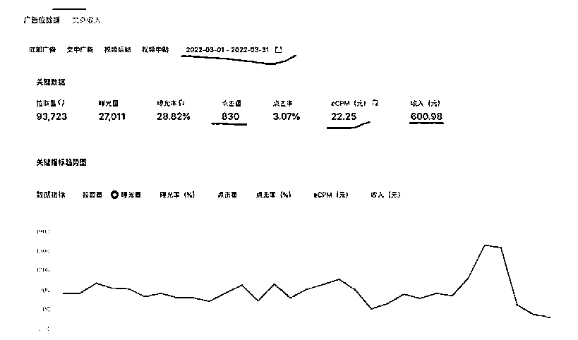

(这个中间值的一个号,目前3900粉丝量,3月收入600元)

接下来我从这几个方向给大家分享一下

这个项目的起始复盘？

这种类型的项目还能做么？

想赚钱最重要的是什么？

**1**、这个项目的起始复盘

先说下我要分享的躺入来源,就是很多人熟知的公众号流量主收入,但是我的号粉丝量都不多,最多的一万粉丝,最少的三千粉丝,内容领域属于是公众号里面的细分市场,不是主流的市场

#  

先说一下开始的情况，我在去年5月批量投了一批广点通，做了十个帐号,主做书法国画领域的内容分享,当时的启动成本是每个号投1000元,作为启动量,我的本意是做流量,然后导流到私域转化书法国画课程的,有了解我的圈友应该知道我去年闲暇搞过的副业,在线的书画院,累计也变现了三百万(之前有分享过文章)

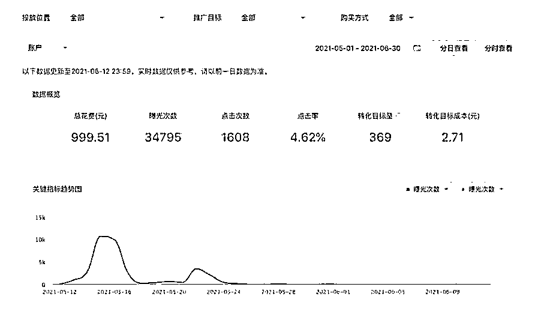

这是其中一个帐号截图,当时对广点通也不是很熟练,加上投的费用太少,所以成本都参差不齐,这是其中成本较高的一个号,相当于1000元换了369个粉丝

后来就找代运营持续发文章,淘宝很多160/月,每天4篇,然后发现引流到私域转化高客单效果一般,后来就放弃了,没有在上面画过心思,但是隔了一个月后,有一天登陆后台,发现帐号开始每天十几个关注的新增,而且几百粉丝的号,还出了几个几千阅读量的文章,而且不是一个号,是几个号都有过千阅读量的文章,我才意识到可能是人群的问题,结合我之前的用户调研,中老年兴趣群体天然的爱分享爱浏览,那么这是有流量生意的啊,于是在后面我就把所有号的流量主都打开了(流量主的开通挺容易的),然后就开始产生了被动收入

收入的话是从去年9月开始每个月就已经和代运营费用打平了,然后到现在每天很稳定的新增关注,和几百的阅读量

#  

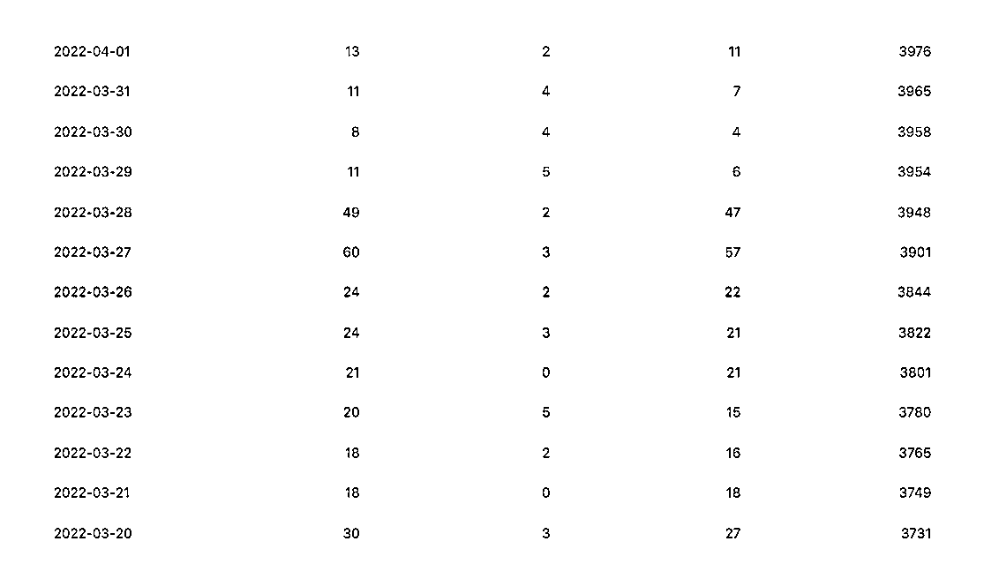 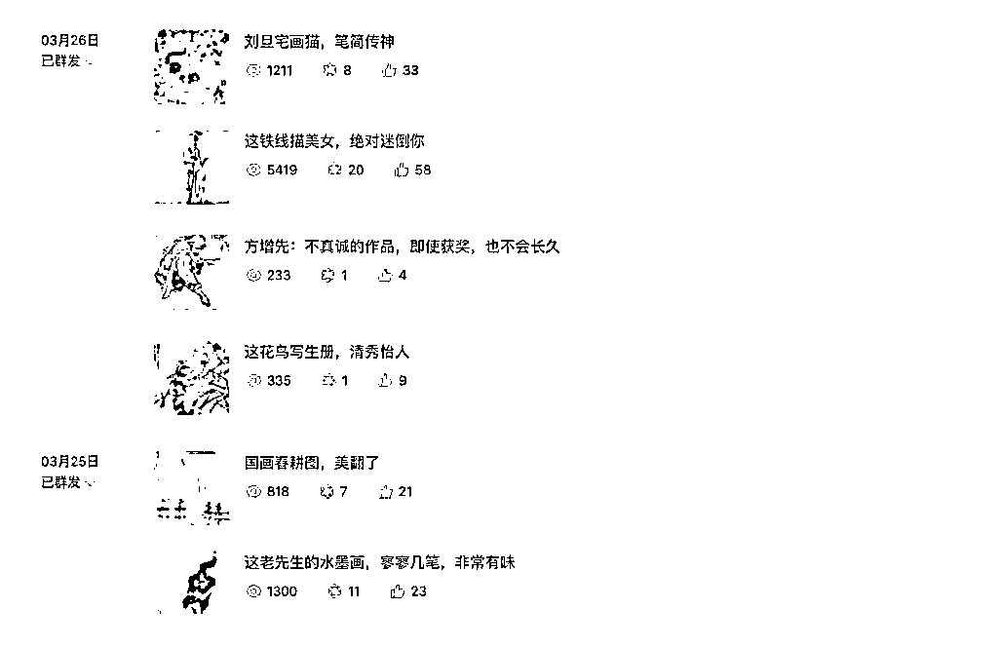

#  

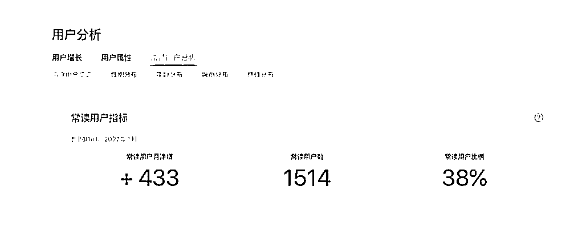

到今年的2月份的时候,是所有的号加一起月利润过万的，我其实蛮意外的,但是我没有选择去放大这件事,一是我目前在全力做新消费的创业没有多余的时间,二是我本来也不是很熟悉广点通的投放,三是可能广告费多了之后,单位用户成本上升,又会有个回本周期,所以没去搞它(目测放大个几倍应该没啥问题)

**2**、这种类型的项目还能做么？

我说下我的观点,能做!(个人感觉这个真的很容易,适合很多普通人)公众号流量主虽然很红海,但是细分市场依然是存在很大机会的,

但是有个前提,你要结合你对目标用户群体的理解,理解用户的行为习惯、聚集地、需求等,很容易判断出你的领域适不适合做,以及能不能放大,还是之前那句话,要构建自己的底层逻辑,然后去判断!

比如我觉得,要是做宝妈类用户方向、副业类方向、文艺类方向等的流量主帐号,那么不适合,要么单位用户获取成本太高,要么用户是重度互联网用户,很重优质内容,要么用户没有微信内热衷分享的习惯,那么结果就是,流量主点击率低、要么是你靠前期广告或者其他方式得到一个基础启动量,但是根本得不到任何粉丝的增长的,

#  

比如中老年市场或者说中老年兴趣市场,我认为是存在各种形式的流量生意的,中老年在整个微信体系的量是很庞大的,而且她们真的很热  衷分享,这里简单分享之前看的一组数据。

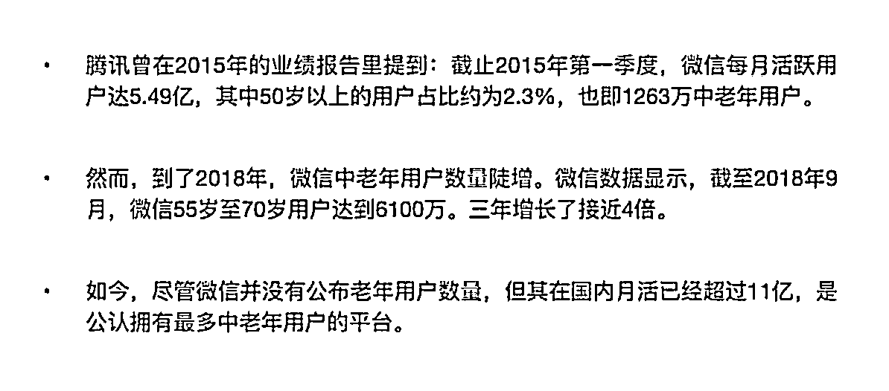

体量有个数之后,再看下中老年群体的线上用户特征

中老年用户是极其没有被互联网满足的一波人,目前大部分适老化产品只是一些功能和使用上的提升,从深层次的用户需求来讲,可能并不多,这里有一点,中老年爱分享,大家可能了解美篇,美篇最开始也是满足了用户爱分享和自我表达的需求,就好比大多数父母喜欢给子女转发文章是一样的,她们是很需要自我表达以及社交满足的需求的

之前看过的美篇的一个数据,累计注册用户2亿，累计创作用户4000万，累计作品数3亿，累计上传图片60亿张，APP月活跃用户1200万，日访客数2000万。这里已经成为很多中老年项目创业者获取流量的阵地了

这也是为什么我之前觉得能做,然后很快就产生被动收入的原因,靠几百的基础粉丝量产生过很多次几千阅读量的文章,本质不是内容的问题,而且这个群体用户习惯的问题,所以能靠很少的基础粉丝量启动.

#  

还有很多垂直的细分市场,如果大家对该用户群体有理解,比如用户行为热衷分享,有浏览文章的习惯,都可以去小范围测试一下,至于具体的开通公众号、流量主等操作方法这里不多讲了,都很简单

**3**、想赚钱最重要的是什么？

我觉得还是之前分享过的一个点，就是对自己有个清晰的定位，找到自己擅长的点，且用自己做起来不痛苦的方式，然后找到一拨人群，挖掘他们的用户需求，带着流量端、产品端、变现端的底层逻辑去找，是很容易找到一小块细分市场，然后在结合用户需求打造MVP冷启动尝试，剩下的就是用心提供价值，等着收获就可以了。

但是结合最近的一些思考,在这里说一下,我觉得有必要加个用户端,就是用户端、流量端、产品端、变现端

发现很多人对用户的思考或者说理解是不够的,比如前段听的一个消费品的案例,很多人做消费品,上来就说自己的受众用户是25-35的宝妈,注意,是25-35的宝妈,所以从消费品角度来说,这已经是两代人了,很多消费习惯和消费行为是完完全全不一样的,如果归为一类,很容易出现定价失误以及营销错位的

还有比如开创外卖CPS业务、表情包引流小程序变现业务等的人,从底层逻辑来看,都是很类似的,但是业务形态却不同,她们一定是对用户的需求和行为有深度理解的,然后才能谈,怎么搞流量、产品以什么形态做,然后去变现的

包括前段亦仁分享的第六期的一些改变,有个很重要的就是实战,出结果等,这就是对用户理解的很透彻,很清楚我们想要什么

#  

只有对用户的理解足够深,才能不断的做出超预期,以及找到流量洼地和适合这波人的营销方式

今天分享这么多,希望大家能多多在这个方向上思考一下~~~

评论区：

超级奶爸Rock : 很棒的分享

[强]

渔火 : 感谢圈友认可[抱拳]

super晓彤 : 能持续对老年人这个人群需求做一些方向上的分析么？这个我有些迷糊  渔火 : 可以,等我有时间梳理下,有很多之前用户调研的数据

super晓彤 : 您微信多少，我对老年人市场需求感兴趣，这边可以帮您梳理下用户数据，您把我当义工就好了，我们交流下，谢谢谢谢

雨辰 : 感谢圈友分享

波哥 : 我也是有打算做老年人市场的，有一个3万粉的号但不知道怎么变现了~ super晓彤 : 你微信多少啊，交流下

# 【**ChatGPT**使用指南】**4**篇

# **# ****(**精华帖**)(670**赞**)ChatGPT **投喂指南

作者：  黄小刀🔪

日期：2023-05-25

#  

《ChatGPT 投喂指南》

我想要让 ChatGPT 做这些事：

给它一份 PDF，让它分析摘要、提炼内容；

让它去看某个网页，帮我查询最新的信息；

给它一份数据表格，让它分析出数据的变化；

给它一份文本，让它总结、模仿出相似的风格；

给它一个聊天记录，让它把你的好友进行分类和打标签；

给它一本书，让它快速读完，并且告诉我书里都讲了什么；

给它亦仁的公众号，让它告诉我亦仁对于某个问题是什么看法....

那你不要错过这份入门级的投喂指南！！

飞书奉上：

https://k0z8o16zas8.feishu.cn/docx/SUTKd7wdDoAg2Exv7hoc8m0BnOK评论区：

黑头羊 : 太强了[哇][哇]

吴佩在天涯 : 太强啦

酌_意 : 非常好  刚从老师课上下来，非常精彩，被耽误的相声演员[憨笑] 一瞬成空 : 太牛了

百万 : 太干货了，正好我需要学习投喂，刀姐就投喂过来了

温特森ᴗ : 刀姐，刀我

矜持的射手 : 超级干货！

我想写一本通过从业多年经验，大B类的行业职场小说，期待刀姐的GPT写书分享  蓝叶 : 使用bing的缺点是不是漏掉了[偷笑]

# **# ****(**精华帖**)(230**赞**)ChatGPT **从入门到精通

作者：  毅鸣

日期：2023-03-03

#  

大家好，我叫毅鸣，坐标深圳，主业是程序员，在生财几年一直是透明人，年前上了一个公众号，接入了ChatGPT API，公众号单日新增粉丝超过3000人，一周变现2万+，不到一个月新增粉丝超过3万人，在这过程中走了不少弯路也积累了不少收获和经验。

我通过ChatGPT辅助把这部分经验写了一本书《ChatGPT从入门到精通》，其中在自己不断体验和使用过程中，总结了各个行业使用的上百个案例，全书共116页，近10万字，希望对有些朋友能有些许参考，也欢迎一起交流。

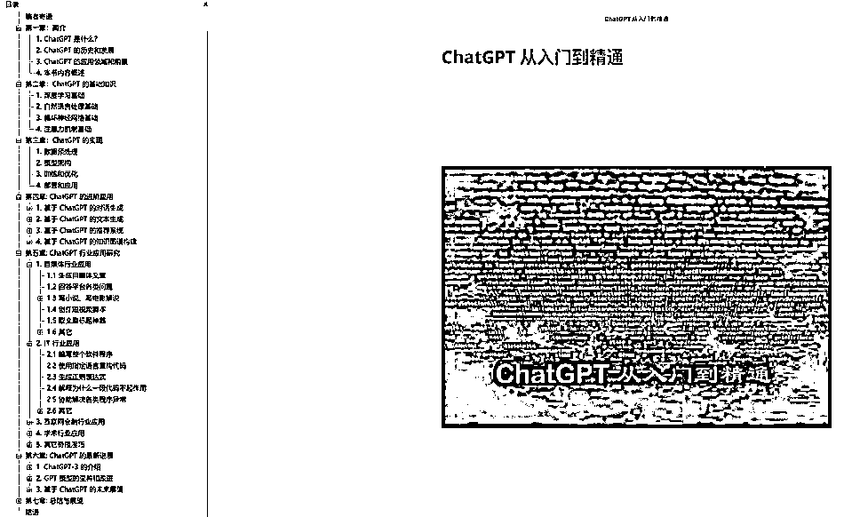

#  

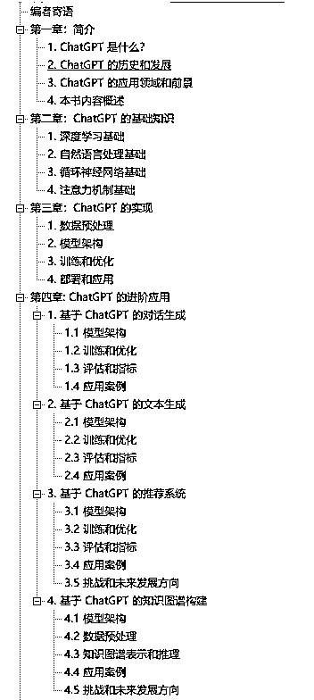

#  

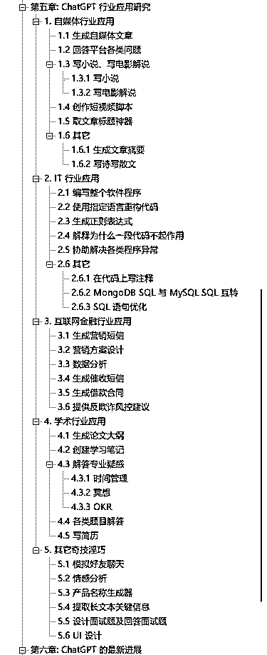

#  

评论区：

文轩 : 老哥公众号怕不怕被封。

毅鸣 : 慌😭

nickki : 变现的逻辑是啥呢，广告主收益吗

毅鸣 : 现阶段是卖会员/次数

nickki : 现阶段的收益是否比刚开始要减少了呢，毕竟chatgpt账号的注册流程和账号贩卖已经是在互联网上泛滥了

毅鸣 : 是的，也看到很多同行的定价都是比较高的

王小蒙 : 毅鸣惊人[强]

骏马 : 感谢毅鸡老师分享。

# **# ****(**精华帖**)(125**赞**)**通过** ChatGPT API + **自动化

# 提高生产力**-**变现

作者： Fredrich

日期：2023-03-20

假如你不是程序员，也不是不能 ChatGPT API + 自动化提高生产力/变现ChatGPT虽然这么火，但是，实际上大部分人都没能参与进去，如何参与到这里面去，那要么提高生产力，要么就是直接商业变现啊。那么思路呢？

今天分享一个结合ChatGPT自动化提高生产力和商业变现的方法/流程，以自动化商业变现的实操为例，即使不是程序员，也可以百倍提高业务。

为什么不说RPA，也不说编程? 因为RPA对于大部分圈友来说，还是有门槛的，更不要说编程了。但是商业运用ChatGPT本身的一部分目的就是为了提高生产力，放弃了自动化，等于砍了ChatGPT商业应用的半条腿。

希望本文能够抛砖引玉，帮助所有读到的圈友都能实现自己的业务跃迁。

#  

一、本文适合于：

1、探索通过ChatGPT 自动化商业变现的圈友；

2、探索通过ChatGPT 自动化提高生产力的圈友；

3、大部分无代码能力，但是想要业务或办公实现自动化的圈友；

二、简介

一句话说明白，就是自动采集需求，通过ChatGPT API 传送给 ChatGPT，ChatGPT加工后，输出结果，利用自动化工具进行回复/存储/发布，甚至调用手机硬件或者使用WEBHOOK，或者联动IFTTT触发智能硬件的应用。相当于一个半定制的RPA。

…………

为保证阅读效果，请转至飞书文档：

https://sbu67xqbm4.feishu.cn/docx/KVYSdKgmIoQxCLxdIkrcKW0Snze评论区：

悉尼刘哥 : 最近也在研究make,我加你微信了，交流一下

Fredrich : 好的

微信用户 : 非常感谢分享，很有启发！

LCG : 牛！对于众多低阶玩家来说最有意义的就是如何落地[强][强][强] Fredrich : 希望有帮助就好

Fredrich : 是的，操作难度低一点，对圈友有帮助就好

LCG : 受益匪浅！感谢分享[抱拳]

zmk : 感谢分享，对于代码小白来说，很友好[偷笑]

# **# ****(121**赞**)**一文讲透** AI **在文字创作中的正确使用

# 姿势

作者： AI训练师小凡

日期：2023-06-07

高考作文出炉了，这个热点，怎能不蹭？

#  

已经有很多AI公众号和朋友圈里的朋友展示了他们用AI生成的高考作文。

这个话题，我本不想蹭。

但看了那么写出来的文章，我觉得，除了蹭热点，我还有一个不得不写的理由。

我看到太多人使用ChatGPT在文字创作重点的误区：

使用**GPT**来解决问题是一个过程，但太多人将其当做两点一线。妄想给内容出结果，用你这个思维，我认为你在高考时也手写不出啥好文章来。

我不希望仅限于用我的方法给大家写几篇作文，我想从这个话题中挤出一些有益的养分，给到大家。通过这样一篇思考，解决问题的过程，把写出高考作文作为一个载体，来由小及大，讲清楚更大的一些点。

下面我还是先讲大家大概率会比较喜欢的部分：小凡怎么用GPT来生成一篇高考作文。

内容很多，为了最好的阅读观感，还请移步飞书链接：

别再发low到爆的GPT秒出高考作文了！一文讲透AI在文字创作中的正确使用姿势评论区：

慕川mc : 牛

樾樾 : 你真快[666]

坤坤 : 膜拜一下大佬[抱拳]

泉州百度营销顺 : 已经把整体思路和看法的东西都过了一遍，果然通透

AI训练师小凡 : ？？？？？？下次不准这么说了

朝闻道 : 厉害  分析的拳拳到肉。

赵辉 : 厉害👍👍👍

发达 : 感谢分享！这两点很有启发:

#  

1.gpt不是神，需要我们更用心的和它交流和训练。

2.gpt看似降低门槛，实则提高了门槛，加剧了分化。

#  