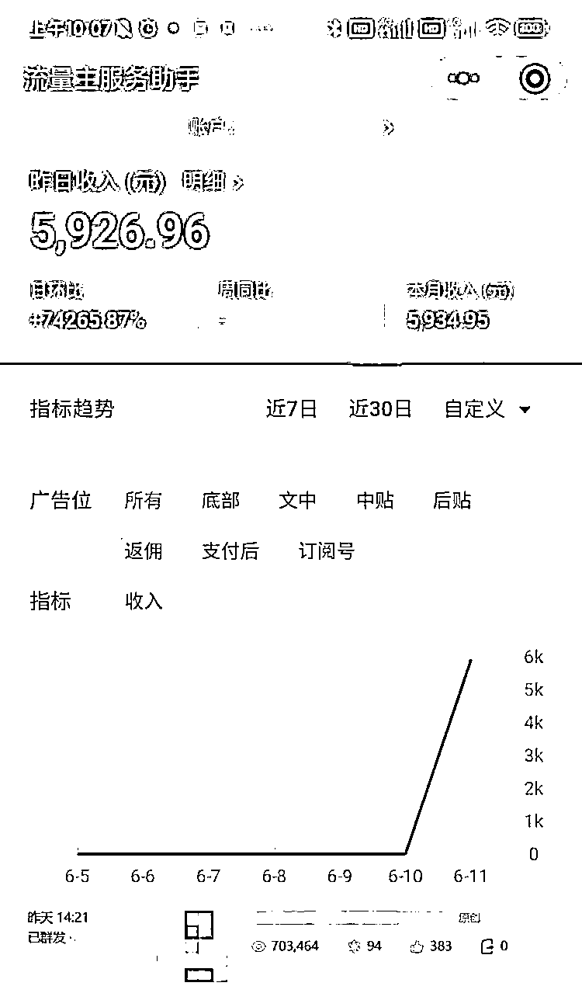

# (161 赞)公众号流量主的新方法：ChatGPT + Stable Diffusion 组合

作者： Dreamland

日期：2023-06-12

【公众号流量主暴击归来】

没错又是我，深入研究 Ai 的小梦

上一个风向标，被亦仁大大加精华了

这次又来了个更猛的，还是老配方

就是 chatGPT+stable diffusion 组合

这个方法百试百灵，的确好用才推荐

.

【最新研究表明】

如果你公众号流量不好，可以停更

然后再发就说不定能爆，这是真的

我们测试下来爆了个 70 万阅读文章

差不多收益 6000 左右，可以看图片

大家赶紧试试吧，冲冲冲

.

评论区：

Dreamland : 我就不喜欢吹牛逼，我喜欢直接拿数据和收入说话，而且数据是真的，收入也是真的[偷笑]

张麒 : 给力

张麒 : 请问一下，如何找公众号自己领域内的爆款文章啊？  有工具和网站吗？

Dreamland : 那必须的，全是实操战绩

Dreamland : 我不了解

胖大魔 : 带带 dd

Dreamland : 自己实操一下再说，等你真的想做，但是一直做不出来，再考虑这件事情  胖大魔 : 航海搞完，开始上场比赛[呲牙]
