# (精华帖)(115赞)受到生财风向标和公众号一篇文章启发变现 6135

作者：  李思维Pro

日期：2023-04-12

# 1、从生财的GPT风向标，看到时代红利

最近ChatGPT很火，地球人都知道，本来我没怎么关注的，但看到周围人都在研究，讨论得热火朝天，又刷到不少短视频，都是讲ChatGPT，于是，我就研究了一番，先是加入了一个知识星球，但折腾好几天，都不懂得怎么使用。

最后，花钱去请教了几个业内人士，才学会如何登陆，但还是不懂怎么使用。刚好，我想到最近加入的生财有术，我就去搜索相关内容查看，看到风向标，关于ChatGPT的内容非常多：ChatGPT是什么，如何使用、怎么用它来提高工作效率等等，琳琅满目。

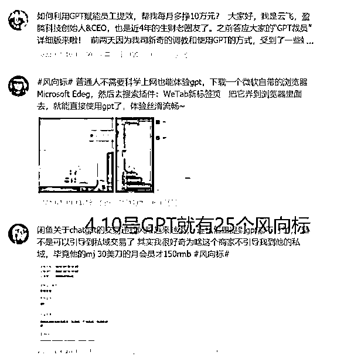

单单4月10号，我数了一下，就有25个关于ChatGPT的风向标。

我通过风向标的学习，亲身去试用了几天，发现ChatGPT真的特别好用，问它很多问题，它都能对答如流，有些答案，如果不是它回答，我根本想不到。譬如，我替一个朋友问：如何进行网恋啊？

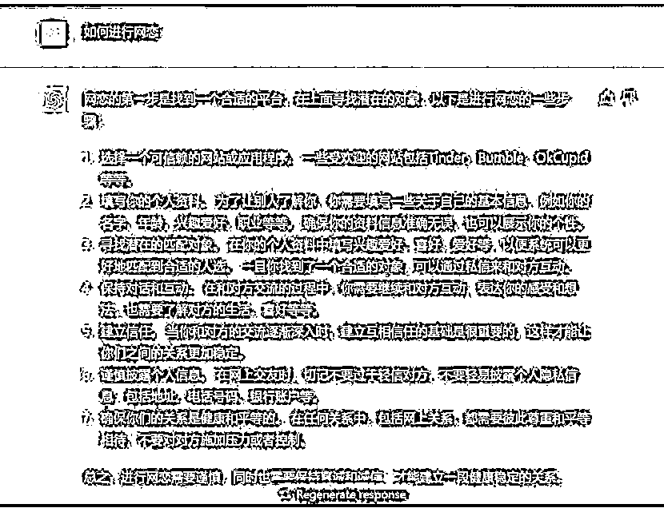

它说，先找到一个合适平台，填写个人资料，寻找匹配对象，保持对话互动，建立信任，还叮嘱我们要尊重对方，最后还提醒我们：网恋有风险，奔现需谨慎。特别的贴心。

我又替朋友问：网恋多久能见面啊？

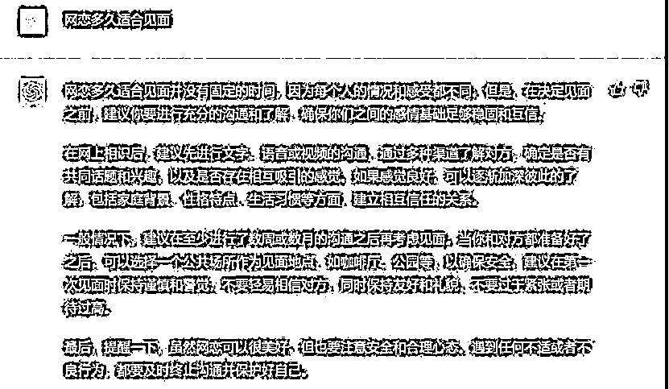

它说，没有固定时间，最好是数周或者数月，双方了解之后，再去找个公众场合见面，以确保安全，它还叮嘱我们，网恋虽然很美好，但也不要抱有太高期待，太智能了。

的确如此，很多新闻都报道，大部分网恋都是见光死的，期望越大，失望越大。

看到这些高能回答，我不禁惊呼：ChatGPT肯定是一个妥妥的神器。

对于写作来说，更是如此，我问了它上百个问题，它都有问必答，大大开阔了我的思路，它很多回答都出乎我意料，大大启发了我的思想，它还能给我的文章润色，大大提升我的写作效率。

我发现ChatGPT这个好处后，我赶紧安利给身边的写作朋友，但有部分人不理解，有个朋友说：ChatGPT出来的文章，要么是123，要么是首先然后其次，这么程式化，根本上不了台面。

我说，你肯定不能直接复制粘贴了，得润色一番。另外，写作最重要的是思路，不是什么修辞手法，而ChatGPT恰好能给到我们很多思路，你只要好好运用起来，写一篇信息量满满的文章，不是什么难事。

所以，我坚定地认为，ChatGPT绝对是一个对写作者利好的神器。于是，我就想着搞个GPT社群，带领一群喜欢写作搞钱的朋友一起飞。

我先是找圈友书豪对接了一个朋友，拿了100个账号，参考了一下市面上的GPT社群，我发现普遍定价在100~200之间，我就想，我定199吧，因为我之前卖写作培训都卖过799，199应该不算贵，社群是199，账号是送的，赠送安装指导和长期交流群。产品搞定了，那流量从哪里来呢？

有两个途径：一个是我公众号过来的粉丝，一个是我之前写头条专栏引流的粉丝。

# 2、写101篇公众号搞钱文章，无心插柳却引流700粉丝

今年1月26号，我突发奇想，定了一个小目标：写101篇搞钱文章，当时也不知道受了什么刺激，就这么糊里糊涂地写了，刚开始不知道写什么，就找了几个同类公众号，去看看他们写的选题，收集下来，对照着写。

选题虽然是参考别人，但里面的内容却是自己的所见所闻，所以写起来也没有什么难度，一连日更了18天，写了18篇。

但我复盘发现，这样效率有点低，因为每天都要想选题，想完再写，花费时间很多，效率很低。

我想：不如把后面的83篇选题都想好，提前构思，做思维导图，效率会更高，于是，我就花了2~3天时间，把83个选题都提前想好，放到印象笔记。

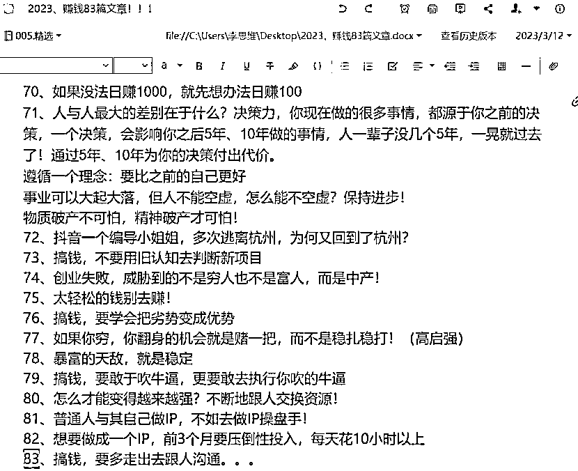

然后每天一早起来，看到哪个选题比较顺眼，就写哪个。因为有了83个选题库，内心就不那么慌张了，虽然，后面有不少文章都没有按照选题库的选题来写，但是，有一个选题库在那里，内心就稳妥很多。

就跟做填空题一样，题目已经列好，你只需在空白处填下你的答案就行。

定了101篇文章小目标后，我就开始执行了，无意中发现了公众号文章的流量密码：

钱、日入5万、月入10万、年赚100万等等，只要你的文章标题加入了这些关键词，都很容易得到系统推荐，譬如我下面这篇：

穷人翻身赚到100万后，不要买车，也不要买房

2.6万阅读

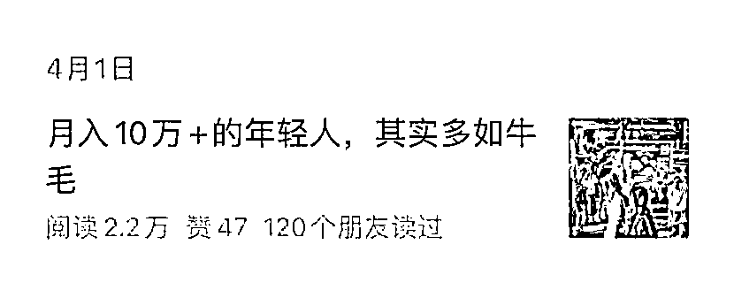

月入10万+的年轻人，其实多入牛毛

2.2万阅读

夫妻俩如何在家年赚100万啊？

1.7万阅读

普通人想要年赚100万，做个小而美的超级个体吧

1.1万阅读

大家发现了么？都是月入10万，年赚100万，然后反常识：年赚100万，不要买房也不要买车，夫妻俩如何在家年赚100万……都是反常识的标题，就容易被系统推荐，获得比较高的阅读。

本来我没打算引流的，只是想着写些东西，找回写作手感，因为我之前一直都是写东西的，因为搞其他项目停了比较长一段时间。

没想到，我稍微一写，阅读量就那么高，我想不能浪费流量啊，于是，我就学着同行去放资料引流，直接给微信引流了700多人，为了引流效果更好，我关闭了文中广告，最近，还关闭了底部广告。

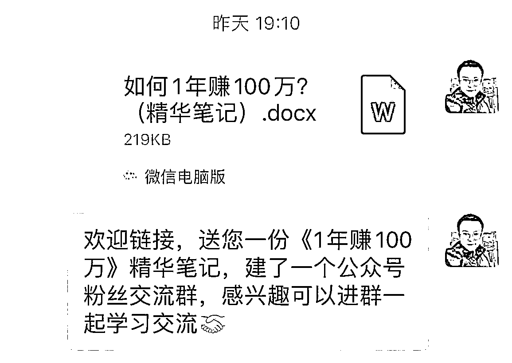

引流方法也很简单，送资料，我送的资料是跟我这些文章内容相匹配的：《如何1年赚100万？》的精华笔记。

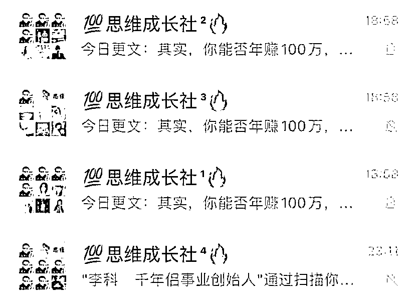

引流过来，然后引导加微信群，我建了4个免费群：思维成长社1234，平时就分享一下文章和自媒体干货，周六晚上8点，就分享一节思维系列公开课。

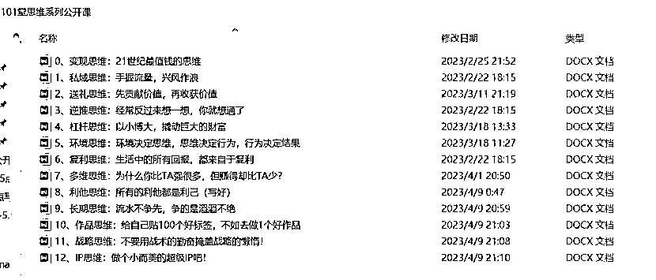

目前分享了9节，还有4节，最近我发现，这个思维系列公开课也可以写到101堂，目前想到了84个思维，还差17个，我回去再想想。

通过公众号搞钱文章，和社群分享思维系列公开课，迅速拉近跟新加来的好友关系，这为我之后做的群发售打下了基础，在此先放一边，咱们先来说说头条往事。

# 3、头条往事：跟风做专栏却引流1000+粉丝

这次售卖的GPT社群，有一半成员是我之前头条专栏的读者。我之前是做图文自媒体的，以头条平台为主，其他平台为辅。

当时在头条写作呢，比较小白，什么火就写什么，写过征文、流量文、带货文。

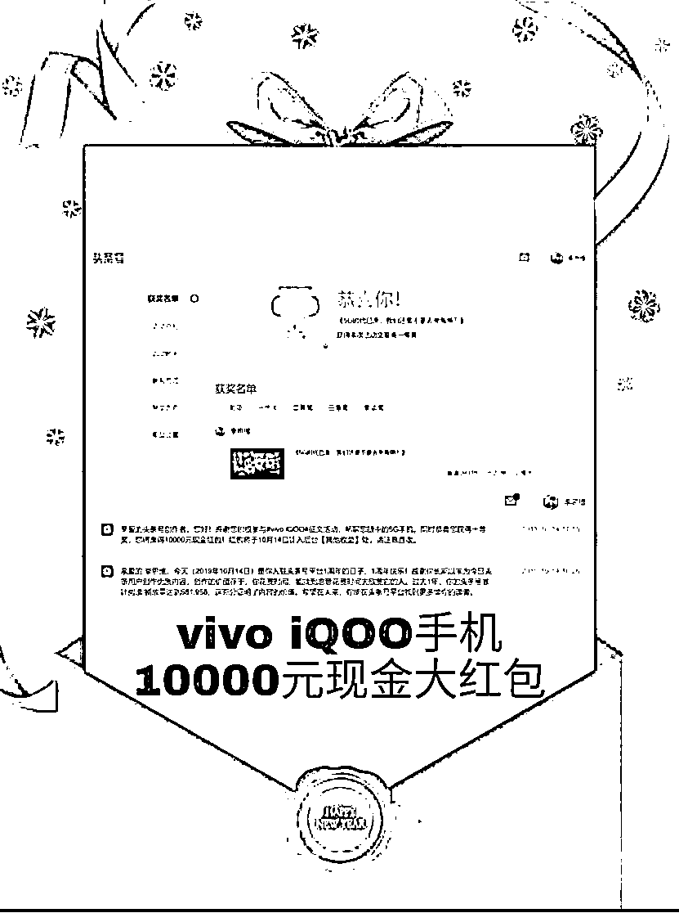

征文最高一篇变现10024，题目是《5G时代已来，我们还要不要去考驾照》，写的是我裸辞回家考驾照的坎坷经历，没想到竟然获得了一等奖10000元，还有流量收益24块。

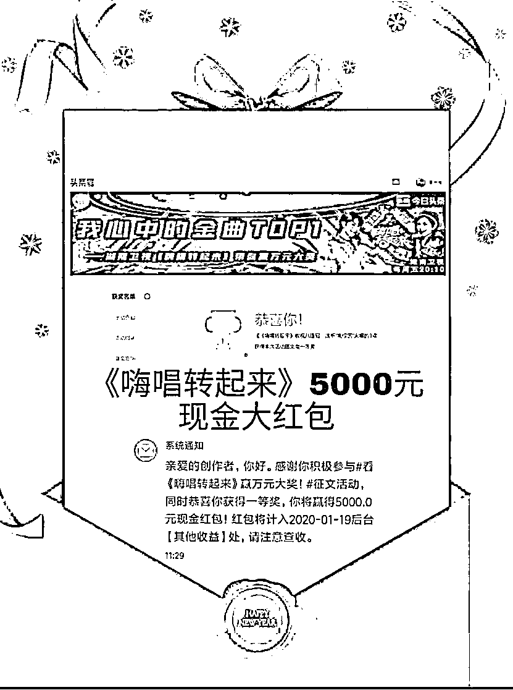

还有一篇5000的，写的是综艺节目，当时听了几首歌，觉得挺有感觉，就随手写了一篇，没想到居然获得了一等奖5000元，我记得阅读量很低，只有100多阅读，流量收益几分钱，忽略不计。

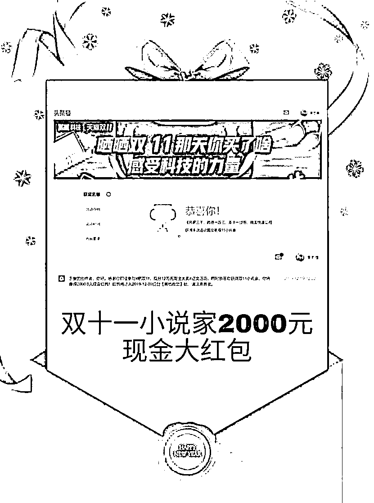

还有一篇2000的：《月薪三千，消费一万三，双十一过后，我去快递公司当小哥》写的是我双十一超前消费，负债五位数，双十一过后，去快递公司当小哥的故事，当时通宵做了7天，只挣了520（这个数字我至今记忆犹新），但后面我把这个经历写成文章，没想到获得了双十一小说家，2000元现金大红包，还有4000的、1000的、500的，就不一一列举了。

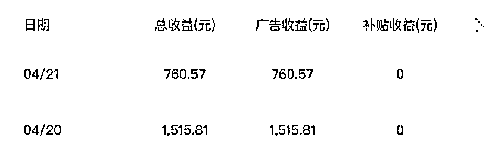

接着是流量文，最高阅读是166万，百家号，收益2200+。

然后是带货文，最高变现的一篇是25.5万阅读的带货文，带了1000套王小波的书，佣金+流量收益累计变现5w+，因为当时大意了，收益截图没保存好，没法发出来，但在我当时写作社群的伙伴，应该都看过。

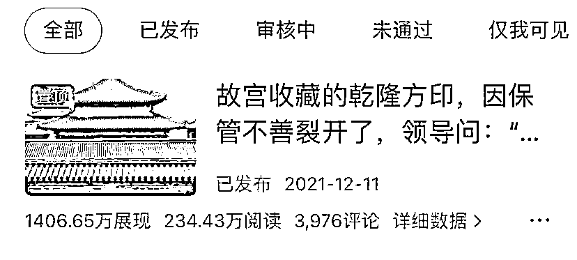

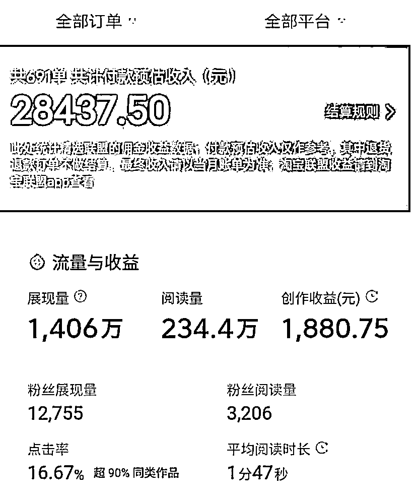

还有就是一个1400万展现的带货微头条，佣金+流量收益变现3w+，还有大大小小的微头条带货爆款，累计变现不算多，也就30w左右吧。

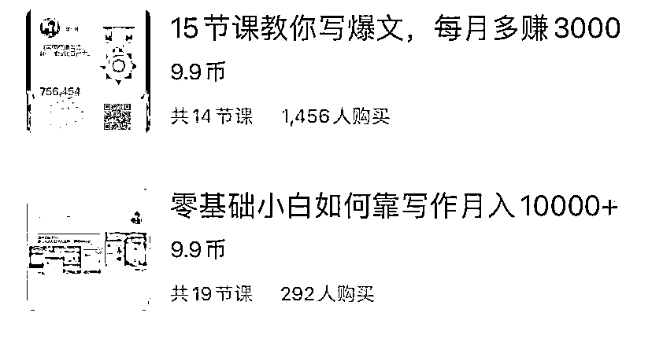

然后是我的写作专栏，主要是讲如何通过写作变现的，我以上这些征文、流量文和带货文的成绩，就是组成了我专栏的内容，同时也能为我卖专栏做背书。

其实，当时做专栏也是无心插柳，跟风做的，没想到却卖了1500多份，引流到微信1000多人，拉了2个写作群，几乎都满500人。

当时还没有什么私域流量的概念，但后面做头条的各种项目，如写作培训、西瓜商单、头条带货、买卖万粉号等等，我才发现，私域流量是那么香，既可以做培训赚钱，又可以带队写作赚钱，还可以对接资源赚钱，其基础，都是专栏引流过来的1000+粉丝。

但当时微头条带货太火了，我后面把手上5个号，全都用来带货，恨不得一天写10篇，我记得，好像还真有一天试过写10篇，都是一个字一个字敲，敲了15000字，从早上写到晚上，第二天直接头晕脑胀。

但幸运的是，那10篇发出去，全都爆了，给我赚了好几万。

后来，头条带货熄火了，我们大多数作者收益直接腰斩，要么去上班，要么另寻出路。

事后我复盘，当时没能多花点时间去搞专栏引流，要是能引流几千上万人，可能今天会是另一番结局，因为当时流量真的特别好搞。

不过，当时我们都沉浸在带货日入过万的快感当中，没有这个意识，所以就错过了好时机，如果让我回到过去，我肯定会狠狠地搞专栏引流。

但时光是不能倒流的，我们也无法回到过去，只能把握好当下和展望未来。所以，我目前还是以引流为主，现在是公众号，之后应该会加上视频号和小红书，都在准备学习和操作，听说今年生财会开很多小红书航海，刚好可以跟上。

# 4、第一次做群发售，变现6000+

说完产品：ChatGPT社群，还有流量：公众号读者+头条专栏读者，下面再来说说我的转化方法。其实也很常见，就是发朋友圈、公众号，然后拉群分享，分享结束就开始销售。

关于群发售，我之前参加过不少，但自己真正开始做，也就是这个月的事情，之前参加过很多次别人的群发售，听说一下变现几万几十万，非常厉害，但作为参与者而不是组织者，并不知道其中有什么细节需要注意。

所以，我第一次拉群分享然后发售，比较匆忙，没有准备太好，只卖了20个社群，第二次也是，因为之前卖了一波，第二次也只卖了20个左右，两次累计变现了6135。

虽然不多，但是从中收获了不少群发售经验，还有一些需要注意的细节，譬如，发售前要预热，要提前发圈和公众号预告，要找人做助攻等等，还有成交的时候，得提前准备好话术和一些收益截图。

在发售后，得设置截止时间，最后1小时，最后30分钟，最后15分钟，最后3分钟，最后1分钟，都要提醒一下。因为有些小伙伴，就是要拖到最后一分钟，踩点来的。

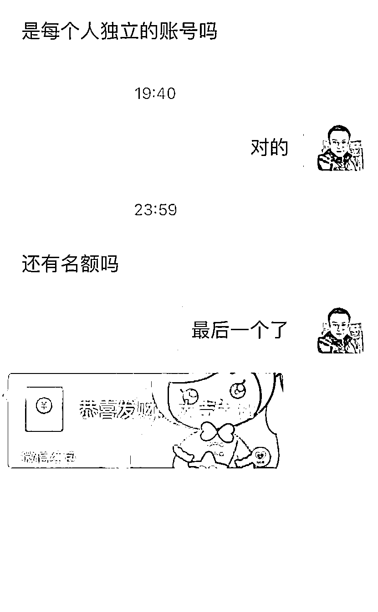

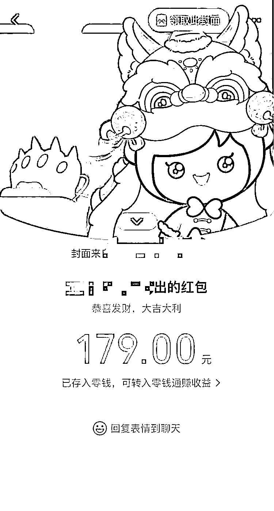

譬如我第二次发售ChatGPT创富研习社社群，有个姐姐，就是在23点59分59秒的时候，突然给我转了一个179的红包，我当时既惊喜又觉得特别神奇。

总之，就是要设置截止时间，一到时间，立马恢复原价。然后平时，就照原价发圈去卖，到了某个特定时间点，就降价促销。

除了社群分享和发售，我当天还会发朋友圈刷屏，给大家制造一种畅销的景象，为什么要刷屏？

原因也很简单，就跟开店卖东西一样，排队的人越多，这家店就越旺，你就越喜欢去，羊群效应嘛。

社群发售也是如此，当你在短时间出大量的转账截图，目标人群就会觉得，非常多人加入你的社群，然后就会心生“我”也想加入的念头。

给大家看看我发圈的文案：主要还是针对公众号来的粉丝朋友，还有专栏的读者朋友。

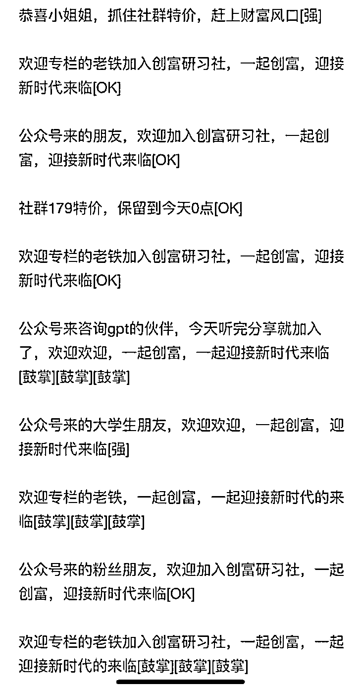

截图当天全部发完，第二天恢复原价后，我一般会把之前的特价全都删除，再按正常价售卖，让加入的小伙伴们，有种捡到便宜的感觉。

以上，就是我加入生财不到1个月，通过风向标和一篇文章启发，变现6000+的全过程。

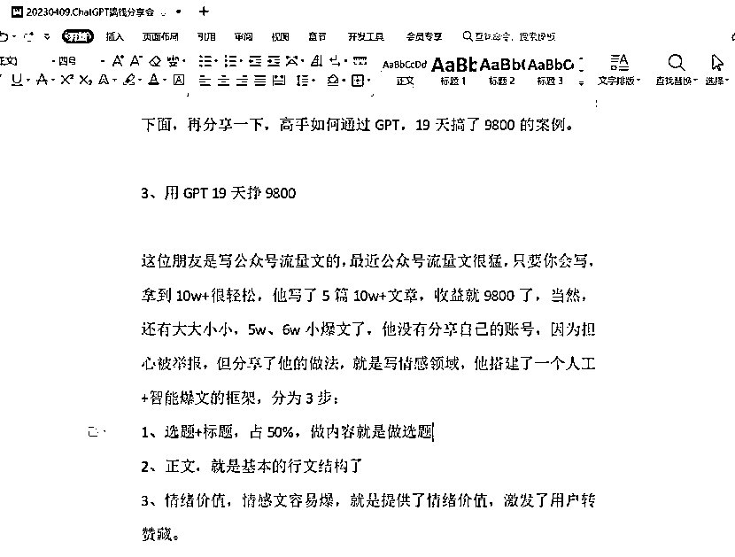

对了，那篇文章是生财有术公众号的文章：《参加2场航海，我成功用ChatGPT写出10W+公众号爆款的复盘》。我用了里面的例子来做分享。感恩，谢谢，祝福，谢谢。

# 5、随意分享，没想到安利了一个小姐姐加入生财有术

最后，来说说安利一个小姐姐加入生财有术的故事，她是我社群的一个小伙伴，之前通过写作营认识的，很年轻，很漂亮，搞钱也很积极，但最近项目遇到一些瓶颈，我就安利她说，去生财看看世界吧。

她刚开始是不想加入的，因为1965价格，对于一个刚毕业的大学生来说，价格还是有点高，所以，她犹豫了几天。

但后来，她看到周围朋友都在发圈或者拉群宣传生财有术，她好奇去了解了一下。

很快，她就觉得生财有术非常适合她，因为，里面内容包罗万象，精华帖子漫天飞舞，各路高手层出不穷，不仅氛围好，人才多，各种活动也是丰富多彩。

她了解完了之后，当即就跟我说要加入了，而且想当天就加入，非常的迫切。

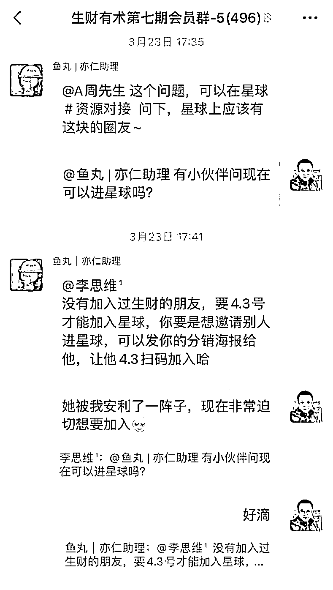

当时是3月23日，我就在会员群问鱼丸：有小伙伴问现在可以进星球吗？

鱼丸说：要4.3号才能加入星球。

我说：她被我安利了一阵子，现在非常迫切想要加入。

为什么那么迫切？原因也很简单，3.23加入能比4.3多13天时间，能更快看到精彩内容，能更容易抓住时代红利，能更早见识到更大的世界。

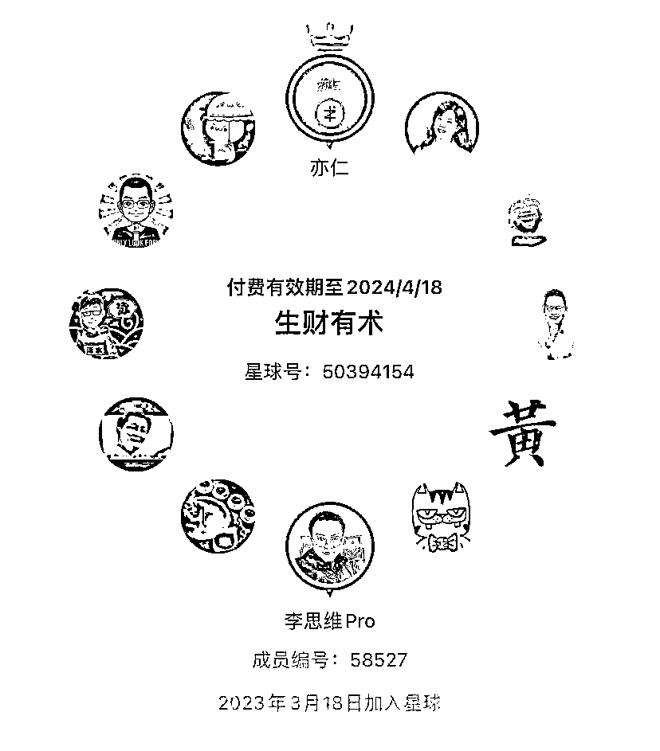

我当时是3.18进入星球的，比418加入的伙伴多了1个月，然后，我在这1个月不到的时间，受到星球的ChatGPT风向标和生财有术公众号一篇文章的启发，去实操，直接变现6135，赚回3张门票钱。

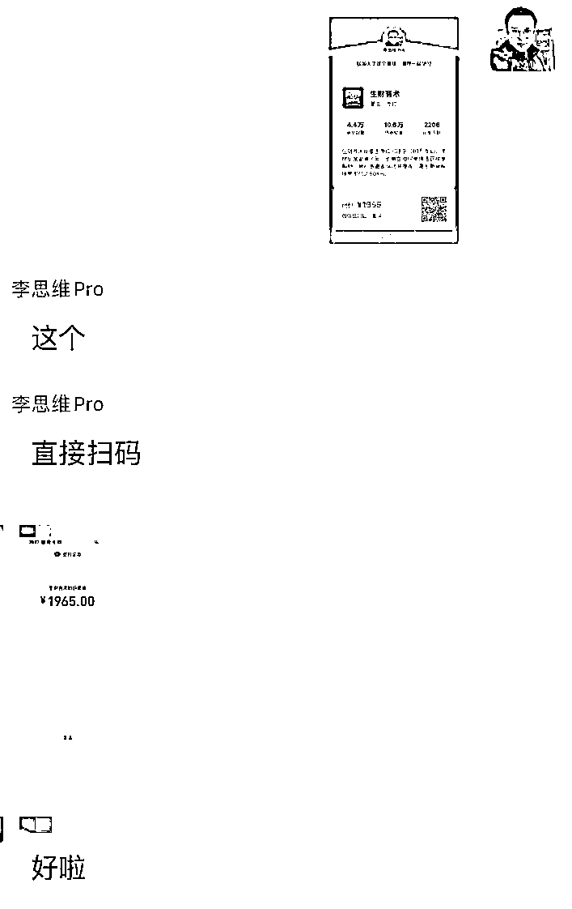

还安利了社群的一个小姐姐加入生财有术，既有佣金，又有纪念T-恤，现在想想，都感觉特别幸运。

最后，愿我们生财有术的新老朋友们，都能生财有术。

评论区：

希声 : 厉害了！

罗本 : 行动力真强

财女小马达 : 行动力杠杠！对你的写作变现很感兴趣，可以＋微交流一下吗  西元 : 厉害

李思维Pro : 新人不能留v哦[害羞]

李思维Pro : 一起加油[握手][握手]

李思维Pro : 一起努力[握手]

李思维Pro : 嗯嗯，搞钱，执行力要拉满[握手]
