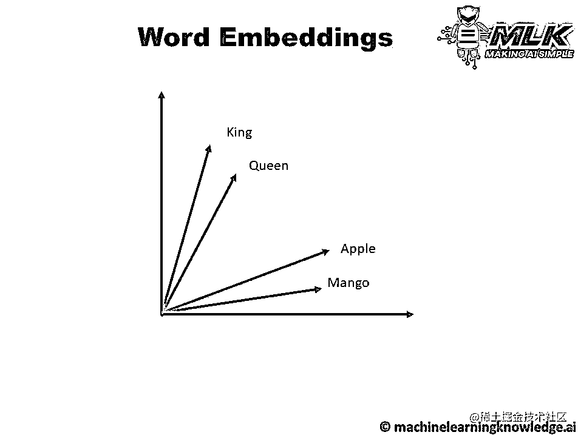
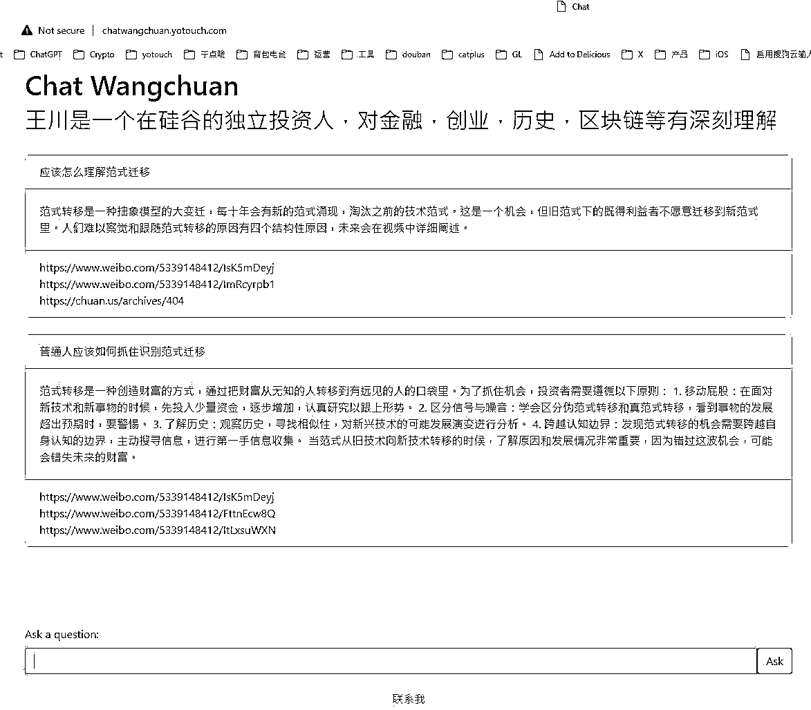
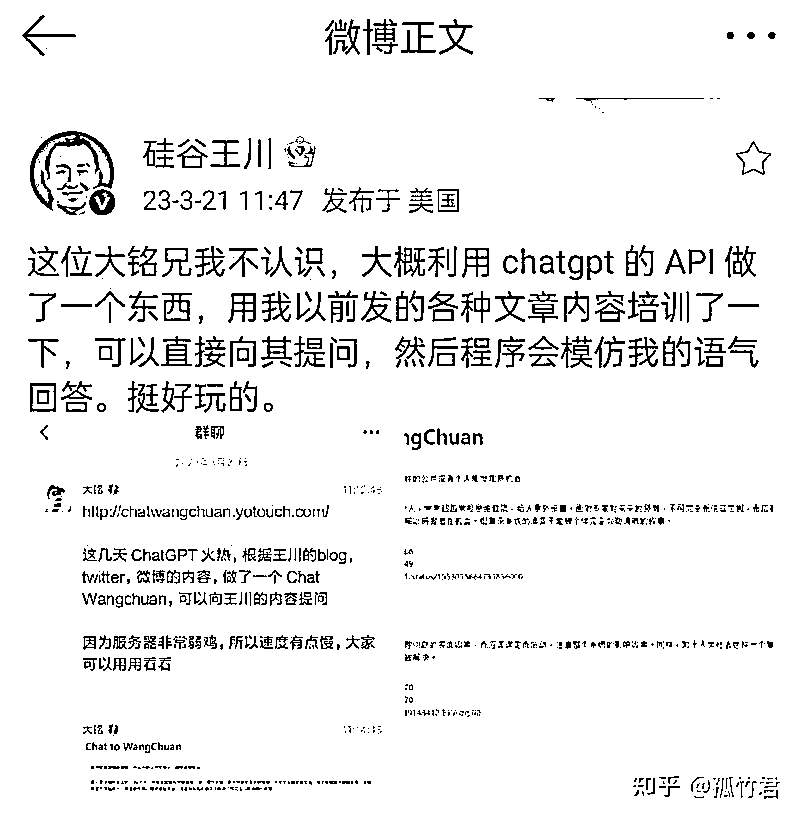
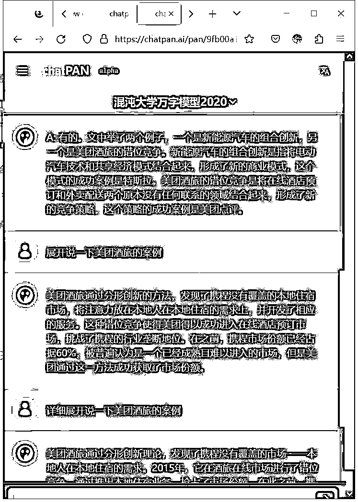
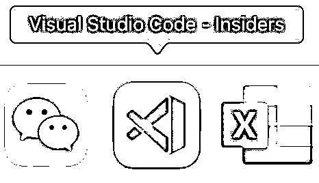
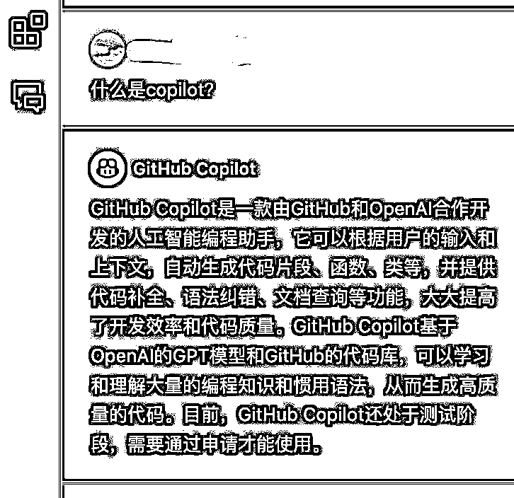
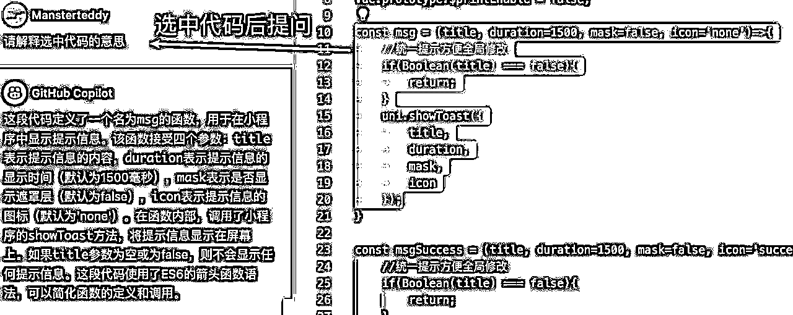
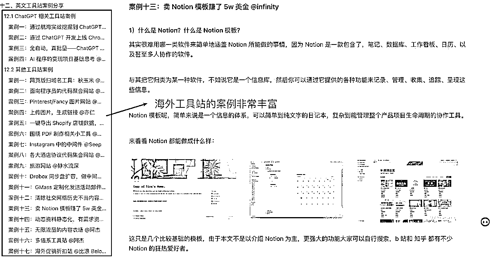
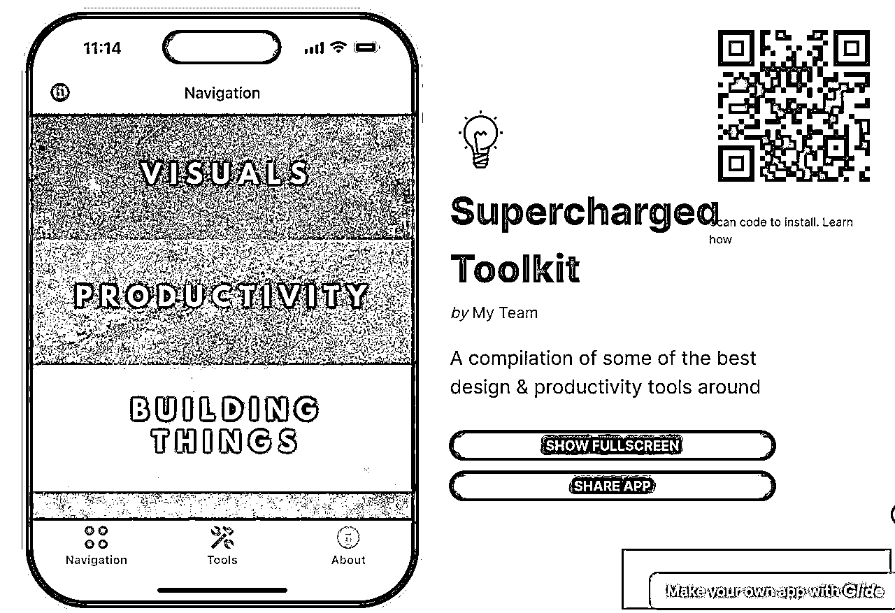
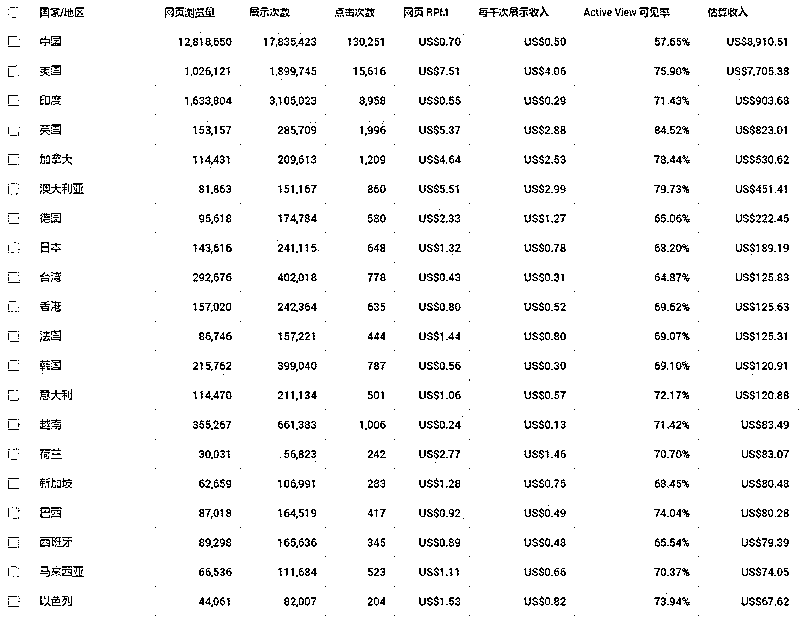

# ChatGPT+海外工具 202308

> 来源：[`remhu1p2pr.feishu.cn/docx/DJHbdiAekoVQASxiaQhctohbnxh`](https://remhu1p2pr.feishu.cn/docx/DJHbdiAekoVQASxiaQhctohbnxh)

# ChatGPT+海外工具

出品时间：2023 年 8 月 18 日

手册使用说明：本文旨在向你展示一个项目的更多可能性，帮助你更好地理解和实操。

建议：如果需要快速定位到精确内容，可以使用快捷键 Ctrl + F/Command + F 的形式，搜索「关键字/词」，查找你想要的内容。

写在前面

💡

Hi,欢迎大家来到 ChatGPT+海外工具 | 实战手册，相信在接下来的日子里，我们将在这里见面很多次。

本次航海的目标，在 21 天时间内，了解海外市场的不同玩法，并以 ChatGPT 赛道方向为主，开启自己的 ChatGPT 海外工具之路。

首先需要跟大家说明的是，本次手册是在 5 月航海｜ChatGPT+海外工具｜实战手册的基础上制作而成，新增内容主要为上一期航海的高手分享内容、新的 ChatGPT 和 AI 相关的案例。由于内容篇幅较长，所以我们把整个手册分为了上、下两篇。上篇主要讲工具站的相关信息，下篇主要讲案例。如果你是上一期的船员，更建议跳转至下篇，查看案例。

由于海外市场的玩法非常之多，没有办法用一种或几种归类方向教大家怎么做，我们主要是通过案例合集的方式，为大家呈现各种各样的思路。在英文工具站开发方面，我们为大家找到了比较具体且适合新人快速上手的操作方法，通过 MVP 测试和 ChatGPT 辅助开发，帮助大家开启最小化创业之旅。

关于新增内容，可以点击以下链接跳转：

7.3 深度解析 ChatPAN：基于语料的 AI 聊天工具的设计与落地过程

八、如何利用工具快速完成产品上线

13.2 其它 ChatGPT 相关案例

13.4 其它 AI 新增案例

在新增内容的筛选和确定上，我们的核心考虑点是，目前 ChatGPT 和 AI 属于大热阶段，大家如果能借助 ChatGPT 或者基于 ChatGPT 做一些事情，将大大提高产品开发效能，或是赶上时代浪潮提高成功率。

在内容上，我们依旧采用了之前航海手册的生产方式，在生财有术星球收集该主题的精华、干货帖和高手分享，通过拆分重组，最终形成我们的实战手册。

我们这么做的目的，是为了能够给大家展示出这个项目中更多的可能性。希望大家通过阅读不同圈友们的经验后，能够从更多维度、更多人的视角中了解这个项目，从而更清晰地看到一个项目在从零到一过程中的各种路径及玩法。

总体来说，本次手册共新增了一百多颗粒度比较粗的案例，有 69 个「ChatGPT」相关的案例，和 84 个 AI 相关的案例，供大家参考和借鉴，希望能给到你一些启发。

手册怎么用？

前文有提到，手册是用来给大家提供海外市场赚钱需求的挖掘和工具站开发思路。因此，不仅需要你带着「发现一个年入百万的赚钱英文工具站」的目标，在手册里的各个模块里找到称手的方法和思路，同时也需要你亲自下场，用 MVP 思维和效能工具打造出一个真实的工具站，尝试用最高效率跑通最小闭环，并快速拿到市场和用户反馈，促使赚钱的结果发生。

手册中，我们大多摘录了重点内容，帮助大家过滤不重要的信息，与此同时我们也为大家备注了所有内容的「内容来源」链接，大家可以点击跳转至原帖中寻找答案。

以下内容由生财有术联合圈友制作而成，仅供航海船员以及生财有术星球圈友学习使用。

同时也欢迎圈友们在实践过程中持续反馈，与我们共同完善，可与鱼丸（yuwan387）反馈修改建议～

# 上篇

# 一、英文工具站基础介绍

💡章节概要

工具站，用英文表达即是 Web Tool 或 Web SaaS，是指通过网站提供的在线工具或服务。

本章节，我们从网站的常见类型、工具站的特点和分类，以及为什么要做英文工具站，为大家开启本次航海实战的第一步。

为什么选择工具站？因为它可以满足您从用户需求挖掘定位到达成变现的全流程需求。在这个过程中，我们将学习如何挖掘需求、打造细分且差异化的产品、增加流量，最终实现产品价值的创收。

## 1.1 网站的常见类型 @ChatGPT

本节内容来自 ChatGPT 的辅助：

概括来说：

工具站：提供特定工具或服务的网站，例如搜索引擎、在线存储空间或翻译工具。

内容站：提供文本、图像、音频或视频内容的网站，例如新闻门户网站、博客或社交媒体网站。

电商站：提供商业服务或产品的网站，例如独立站官网或在线市场。

社区站：允许用户互相连接、互动和分享内容的网站，例如论坛、社交网络或博客平台。

教育站：提供教育资源、在线课程和学习工具的网站，例如在线学习平台、教育博客或教育机构官网。

娱乐站：提供娱乐内容、游戏和视频的网站，例如在线电影、游戏网站或音乐平台。

新闻站：提供最新新闻、事件和评论的网站，例如新闻门户网站、博客或媒体网站。

……

我们经常看到上述类型的网站，但在本次实战中，我们主要关注工具站。为什么选择工具站？因为它可以满足您从用户需求挖掘定位到达成变现的全流程需求。

## 1.2 工具站的特点和分类 @ChatGPT

本节内容来自 ChatGPT 的辅助：

通常来说，做一个商业成功和用户满意的在线工具型网站，需要注意以下方面：

用户需求：了解用户需求，提供满足用户需求的功能。

用户体验：注重用户体验，保证界面简洁、使用方便。

功能强大：提供强大的功能，满足用户的需求。

技术实现：采用高效、稳定的技术实现，以保证网站稳定性。

数据安全：采用高安全性技术，保护用户的数据和隐私。

市场营销：通过有效的市场营销策略，吸引用户使用。

客户支持：提供优质的客户支持，解决用户的问题。

数据分析：通过数据分析，了解用户的行为和偏好，不断改进网站。

首先，做一个产品，首要的把握了用户需求，本手册第三章将是重头戏：如何系统性的挖掘英文站需求，有方法有实操有工具有诀窍。

工具站提供好用的工具，帮助用户解决某些需求，如个人所得税计算器、万年历、IP 信息查询等。

工具站的具体分类，举例来说：邮件营销工具：如 Mailchimp、Constant Contact、AWeber 等

项目管理工具：如 Asana、Trello、Basecamp 等网站分析工具：如 Google Analytics、Mixpanel、Heap Analytics 等

在线支付工具：如 PayPal、Stripe、Square 等

在线图片编辑工具：如 Canva、Piktochart、Visme 等在线文档协作工具：如 Google Docs、Microsoft Office 365、Zoho Docs 等

在线客服工具：如 Intercom、Zendesk、Freshdesk 等在线表单工具：如 Typeform、Google Forms、JotForm 等

这些大多都是知名的产品，而作为个人或者小团队开发者，我们更需要瞄准细分领域的用户需求，所谓的「Micro SaaS」，Micro SaaS 是一种小型的软件即服务 （Software as a Service） 产品。它通常是一个简单、易用的互联网工具，可以解决特定的业务需求。

与传统的 SaaS 不同，Micro SaaS 通常更加专注于某一特定方面，并且价格更加实惠。开发 Micro SaaS 产品的关键在于了解用户需求，提供简单易用的解决方案。

工具类网站开发完成之后，日常维护花费的精力比较少，可以自动运行。而且如果工具做得的确好用，用户会自己记住网址或者放入书签以备以后访问。

## 1.3 为什么要做英文工具站 @刘小排

为什么需要从海外网站（英文工具站）开始呢？

因为做海外网站，最快。比做其他形态的产品，要快出很多。

做 iOS、Android 的 App 很慢。首先，它们编码过程比做网页复杂，编码能力要求也更高；其次，上线还需要打包、提交审核，审核还可能不通过，时间成本很高。 如果你做的是国内 App，那就更慢了，你还需要花 3 个月的时间拿到软件著作权证书，才能够上架国内的应用商店。 更讨厌的是，当你想修复小 bug，你不得不重新发版，用户还得升级安装的 App 才能使用，这会严重拖累你发布 bugfix 的效率。

做国内网站，也很慢，你需要域名备案。域名备案，周期大约是 1～3 周。如果你是在一些要求特别严格的城市比如北京，备案还经常被打回。

做微信小程序，比上面两个略好，但也慢。 它的问题是：微信小程序开源生态不够大，有很多轮子需要我们自己造，难以直接引入开源代码加速我们的编码过程。

做海外网站是最快的。它不需要软件著作权证书、不需要域名备案、不需要应用商店审核、软件有更新的时候用户不需要重新下载 App。代码放到 Github 仓库里，通过 Github Action 做 CI/CD，实现一提交代码就立即自动上线的效果，开发体验倍爽。

需要指出的是，“从网站开始”，不意味着你的产品永远都是一个网站。 只不过 MVP 阶段是网站而已，当你接受到足够多的用户数据反馈之后，你再去为它做微信小程序、iOS App，永远都不迟。

内容来源：《写给独立开发者：如何快速做出产品 MVP》

## 1.4 中国工具出海时间线 @非洲水手

恰逢看过吴晓波的《激荡四十年》有感而发，今天在这里想先和大家复习下中国工具出海的时间线，这激荡二十年也大致可以分为 4 个时期：萌芽期，起始期，扩张期，转型期。

1、萌芽期

首先是萌芽期，1998-2007 的中国互联网发展早期，在那个还是 Copy to China 的时代，在中国工具出海第一人周奕的带领下，以 MP3 CD Maker 为开始，中国互联网出海迎来第一波曙光。

2、起始期也是在这个时候大家开始意识到，工具出海是可以抹平中西方文化差异的。随着 2007 年 iPhone 初代及 Apple App Store 的发布，移动互联网时代开启，中国工具出海进入了起始期，久邦、百度、360、UC、金山等国内玩家开始在海外“低调地”攻城略地，闷声发大财。

3、扩张期

接着到了 2011-2016 年，移动互联网出海正式进入扩张期，工具出海渐渐形成细分领域：手机管理类，如 Clean Master；相机图片类，如美图秀秀；桌面类，如 Solo Launcher、Go Launcher；浏览器类，如 UC、海豚浏览器等。不到 0.01 美金的买量成本，动辄数亿数十亿的安装量，迎来了出海资本的明媚春天。

这个时代也催生了众多广告代理公司，如 Yeahmobi、Mobvista、Avazu 等，或自己开辟了广告代理业务，如猎豹 CM。很幸运我也是在这个时代入的行，服务过很多当时的明星产品，有幸见证了出海行业的辉煌时代。

4、转型期

好巧不巧，时间很快来到 2017 年，工具出海经过了几年的黄金窗口，增长方式越来越多元，变现方式越来越成（kua）熟（zhang）。与之同时的是海外人口红利越来越少，产品同质化越来越严重，平台规则（主要指 Facebook 和 Google）越来越收紧。

久邦股价腰斩而退市，Google、 Facebook 相继禁止锁屏广告，Facebook 更是暂停了中国区工具广告主的广告投放，Google 相继下架了 iHandy、猎豹等开发者的总计几百款工具产品，看空工具出海的声音不绝于耳，利益空间不断被压缩，工具出海行业被迫转型。

难道中国工具出海要止步于此？可以继续看看后面的内容。

内容来源：3 月 6 日《关于出海工具产品营销推广，我的几点经验分享》@非洲水手

# 二、英文工具站的变现方式

💡

章节概要

英文工具站的主要变现方式，甚至是这类工具性的产品，比如工具类的 App，他们的变现方式通常有四种：✅ 纯广告变现

✅ 广告变现+付费订阅变现

✅ 免费后付费变现

✅ 资本变现 ChatGPT 海外工具站的变现方式通常有两种：

✅ 卖流量

✅ 卖产品

下文主要以工具类 App 的案例，来向你介绍如何在海外市场变现的几种玩法。

## 2.1 纯广告变现 @亦仁

由于工具品类的特殊性，用户使用次数和停留时长远比不上泛娱乐类产品，在早期 Google play 平台政策未调整的时候，纯工具类的变现基本上就是 "饱和式变现"（借用刘鹏老师公众号提到的名词，我觉得是高度概括了）。

既除在应用内要给用户每一步操作都精妙地设计广告场景之外，还高度依赖进程活跃，主动创造 "用户使用场景"，让用户不用打开 APP，让用户被动使用产品功能 + 广告，增大广告曝光频率。

典型的场景有：锁屏场景，用户充电的时候、用户正常锁屏的时候弹出广告

应用锁场景，主动引导用户设置常用应用打开密码，用户只要打开应用，就会弹出密码键盘+广告通话场景，用户正常拨接电话的时候弹出

如此暴力的变现方式，对于纯工具类出海公司而言，随着 18 年 Google play 的政策逐渐缩紧开始，一去不复返了，多家出海公司还因为被 Google play 下架产品。

这里提一句，如果被 Google play 下架产品，Android 基本上很小几率能在海外翻盘，因为 Google play 技术，能甄别出开发者试图搞成马甲包卷土重来的账户，然后以 "账户关联到触犯 Google play 政策的账户" 为由，封停开发者账户下架产品，而一旦产品被下架，主流的海外广告平台（admob/Facebook 等），均不会再返回广告，收入几乎可以一夜归零。

所以很多出海公司，在国外折戟后，在 19 年年初纷纷回国，将海外这套打法全盘复制到国内，由于缺少了像 Google play 这样子的平台监管，于是也一样行得通，混得风生水起。

## 2.2 广告 + 付费订阅变现 @亦仁

随着 Google play 政策的收紧，广告+付费订阅慢慢在全球范围内，开始成为趋势，其核心本质就是找到那批愿意付费的用户，让他们掏钱付费，让不愿意付费的用户看广告。 如果早期没有用户画像，不知道什么类型的用户才乐意付费，就粗暴点让所有用户都走一遍付费流程，拒绝付费的用户再走一遍广告流程，当然这会在一定程度上伤害用户体验，再通过 ABtest 测试不断调优，最终达到 LTV 最大值。 广告方面，可以通过使用聚合工具找到最合适的广告来源来进行广告调优。聚合的作用是把最高的收益的广告挑选出来推送给用户，为每次的展示选择最优 eCPM，以此来增加广告填充，获取更高的广告收益。 付费订阅方面，其 LTV= 新增用户数订阅率支付率*续费次数。其实无论 Google play 还是 appstore 在很早之前就一直鼓励开发者用这个模式，但是也是在这一两年，我才感觉到这个模式对中国的出海开发者才开始热起来，我建议工具类的产品，尝试订阅，由于以下两个原因：

有免费试用周期，降低用户的使用门槛，让用户享受产品服务，最终锁定更多的高价值用户对比单次购买的模式，降低了单次支付的金额，但是后续订阅有自动续费功能，主动帮用户续费，最终整体 LTV 会比单次收费来得高很多。

内容来源：《生财有术 #轻享栏目：出海工具怎么玩》除了上文这些关于订阅模式的讲解以外，亦仁之前也分享过一段关于订阅模式的解释，这里摘录过来，有兴趣的同学可以点击原文查看全文。

在当下，订阅模式已经超出了本身最初的狭窄定义，广泛适用于各个商业细分领域之中。在出海行业，可以看到，这一商业模式越来越广泛地应用到了工具类变现中。在 5 家增长之星中，喜马拉雅、蓝城兄弟和 WPS Office 都采用了订阅的商业模式。尽管在具体的执行策略中有所不同，但显而易见的是，订阅模式很好地拓宽了其应用原本的边界。

以 WPS Office 为例，WPS Office COO 章庆元在接受 Morketing Global 采访时谈到，“会员订阅已成为 WPS 越来越依仗的商业模式。这一模式的基础是不断增长的用户规模，以及适用于不同用户人群的本地化内容服务。我们在海外市场正不断探索如模板服务、H5 海报制作等轻度编辑的产品，我们相信这是 WPS 正确的发展方向。”WPS Office 作为一款办公类的工具应用，其基础功能，如文字处理、制作图表等功能会免费向所有用户开放。但如果 WPS Office 的业务仅仅停留在这些基础功能上，很容易落入到其他工具类应用存在的变现困局中。传统的工具类 App 很难带来用户粘度，这大大限制了商业变现模式的可能性。订阅模式就是一个很好的提高用户黏度的手段。WPS Office 的订阅模式提供了大量创意类模板等轻度编辑产品，吸引用户进行订阅。而这将使得用户对应用的使用频次大大提升，使用应用的方式也会发生一定的改变。在此基础上，WPS Office 可以开展社群运营，奖励生产优质内容的用户，从而延展了 WPS Office 的边界。”

内容来源：《订阅模式让出海工具获得新生》

## 2.3 先免费后付费变现 @静水流深

利用提供免费的服务，收集用户，进行后续变现，以下是我们的网站：

https://realfavicongenerator.net/api/

很多人估计会觉得这个网站又没广告又免费难道为爱发电吗？

其实不然，人家变现的地方在这里，申请他们的 API 要提交邮箱，后续可以推送其他服务进行变现。

## 2.4 资本变现 @静水流深

如果真海外流量变现，一定要有 adsense 帐号，这是一切的保底收入。打算认真创业就正儿八经注册一家公司，真正最赚钱的事情是卖公司，而不是公司的业务赚钱，这就是资本市场的魅力。

（BLOCKCHAIR）这家对加密货币提供优质服务的网站，技术牛逼以及服务体验好，就是没收费的东西，人家为什么免费？

因为只需要做口碑获取用户数，在资本市场出售公司的股权进行融资即可，因为这样的网站只要用户基数增加，任何人都不会认为没办法变现的，所以资本一定抢着投资这样的公司。

还有下面的这个案例（IP 数据定位与服务），利用免费的服务收集到大数据，利用积累的数据商业化定制服务变现。

内容来源：《英文工具站，你没见过的那些案例》

## 2.5 ChatGPT 海外工具站的变现模式@子木

赚钱核心两个元素：流量 和 产品。

关注流量和产品两个赚钱核心元素，确保不仅仅是产品开发，而没有盈利能力。

如图，ChatGPT 海外工具站也分为 卖流量 和 卖产品 赚钱。

### 2.5.1 卖流量

卖流量是通过提供与 ChatGPT 相关的免费工具站实现变现的模式，类似 https://decompilertool.com/ 、https://sharegpt.com/ 如图，挂广告就能变现

这类工具站的特点：

第一要素：提供有价值的免费工具，以获取流量

变现也简单：广告、分销、广告联盟、Affiliate（联盟推广）、导流其他产品等方式来实现变现

比如最简单就是通过提供 ChatGPT 免费工具站，可以通过导流，ChatGPT 账号自动发卡进行变现即可。

### 2.5.2 卖产品

卖产品是通过提供与 ChatGPT 相关的付费工具站实现变现的模式。

那就是 ChatGPT 相关的付费工具站，类似 https://www.proseoai.com/ （圈友做的 谷歌 SEO 获客内容神器），可以通过试用后转为付费用户来实现变现。

这类工具站的特点：第一要素：提供有付费价值的工具

链路也长：搞流量 -> 搞转化 -> 还要客服搞成交 -> 还还要搞客服售后。即需要建立完整的销售链路，包括获取流量、转化、客服销售和售后等环节。

同时卖流量和卖产品是否可行？

当然可以。拥有流量意味着可以同时销售自己的产品和流量，只需确保相关性和目标客群的一致性即可。这样做可以实现双重变现效果。

内容来源：5 月 25 日《普通人能做 ChatGPT 相关海外工具的 IDEA 方向》@子木

# 三、如何挖掘英文工具站需求

💡

章节概要如何挖掘需求，如何在市面上的英文工具站中找到适合自己的切入点，如何找到一个能赚钱的需求，如何找到和 ChatGPT 相关的需求等等。这些是本次航海重点需要考虑的问题，也是最核心的问题。

为了让大家的需求挖掘之旅变得有迹可循，我们找了星球里挖掘需求的高手，摘录了他们在挖掘需求的过程中所使用的玩法。

圈友刘小排认为，一个高成功率 idea 需要满足三个条件，并由此总结了五种常见的方法，以及备注了相应的成功概率。

本章节我们将参考刘小排的分类形式，并补充进了其他需求挖掘高手的更多方法（因此数量不仅五种）：

✅原生 idea ★★★★★

✅抄竞品做出差异化 ★★★★

✅通过关键词挖掘需求 ★★★✅通过痛点挖掘需求 ★★★

✅通过围绕平台挖掘需求 ★★★

✅通过围绕自身需求拓展需求 ★★★

✅通过排行榜挖掘需求★★★★

✅个性化需求定制 ★★✅重点关注：ChatGPT 相关工具站需求挖掘

希望这些思路和玩法，可以帮助大家找到一个能赚钱的英文工具站。甚至是不仅仅局限于此，而是挖掘出在海外市场上的赚钱需求，进而发现一个可以长期赚钱的机会。

## 3.1 高成功率创意需要满足的条件 @刘小排

在我看来，一个高成功率的产品 idea，需要满足三个条件：有真实需求存在

你是这个领域的专家，即便是直面竞争，你也能比对手做得好你能坚持下去，尤其是早期缺乏正反馈的时候

我们按照这三个条件，来构思寻找产品 idea 的方法。

我一共总结了五种常见的方法，他们的成功概率递减。（我的个人观点）

它们分别是：

1）原生 idea ★★★★★

2）抄成功竞品，然后做出差异化的价值点 ★★★★

3）分析搜索关键词，找到尚未被满足的需求 ★★★4）有人愿意预付费找你定制某个需求，然后你将它产品化 ★★★

5）生造的 idea ★

内容来源：《如何获得产品 idea》

## 3.2 方法一：原生 idea ★★★★★ @刘小排

英文原名“organic idea”。这是硅谷创业界最推崇的方式，被众多科技界创投界大佬认可。

“organic idea”的意思是—— 解决你自己遇到的问题，你自己就是它的用户，你会每天使用自己的产品。

这个词似乎最早出现在硅谷创业教父 Paul Graham 的文章中。

他说，构思产品 idea 的动词，应该是“注意到”，而不是“想到”。

The verb you want to be using with respect to startup ideas is not "think up" but "notice." At YC we call ideas that grow naturally out of thefounders' own experiences "organic" startup ideas. The most successful startups almost all begin this way.

“我注意到，有这么一个问题，可以这么来解决” 而不是 “我想到了一个创业 idea”。

原文链接：http://paulgraham.com/startupideas.html

其他版本的表述还包括——硅谷科技创业圈最著名的话：eat your own dog food， 吃自己的狗粮。（意思是，你需要是你自己产品的用户）。这句话在过去 50 年的时间内，被无数公司无数大牛引用。

世界最顶尖的独立开发者 Peter Levels 在自己的著作《Make》中说：Themost important thing is to find ideas from solving your own problems 。 在书中，他还建议大家每天记录 3 个自己遇到的问题，这样的话，一周以后，你就有 21 个产品 idea 了。

世界上有很多创业成功的公司，是这套方法论的产物。

苹果公司，起家于组装个人电脑，给谁用？给自己用。这是沃兹的个人爱好。

Facebook，最初是小扎自己想用的一个小网站，给学校女生打分的用的，产品名叫"hot-or-not"AirBnB，最初是创始人没钱交房租，开始做租床位的生意，提供租空气床垫（Air Bed）和早餐（Breakfast）的服务，这也是 AirBnB 名字的由来 —— Air Bed and BreakfastBuiltWith，对，就是最近挺火、全公司只有 1 个人、每年收入 1400 万美元那个产品。最初也是来自于创始人自己的需求。创始人经常看到别人的产品，想知道这个产品是用什么技术栈做出来的，然后就自己做了个产品来解决这个问题。

说一个更近的。生财有术，最初是亦仁想找一个供创业者交流的社区，发现并不存在这样的社区，于是自己建了一个。

再说一个接地气的，nomadlist.com ，Peter Levels 自己是个数字游民，想知道全世界有哪些城市适合数字游民居住，所以自己做了一个 Excel 表格。

Peter 偶尔发现，自己的表格被有很多人传阅，才决定把它产品化。 后来，世界上出现了无数创业公司，拿着更多的钱、更多的资源、更多的人，想要山寨它，但都没有人能打败它。 因为 Peter 本人才是最懂数字游民需求的人，这个产品，解决的是他自己的需求。

这套方法论为什么成功率会高呢？因为它完全符合我们刚才说的三个条件：

有真实需求存在。这个需求，它就是来自于你自己。

你是这个领域的专家。你自己有痛点，花了很多时间去研究，发现市面上其他方案都不能满足你，你最懂你需要什么。 如果有一天，别人觊觎你的成功，想要山寨你，你作为专家，你也并不怕。

你能坚持下去。 为什么能坚持？因为你自己就是它的用户，你自己由衷地希望把它变得更好。

当然，这套方法论也有问题。它最大的问题是： 你怎么知道，你自己的需求，别人也需要呢？

这个问题是无解的，并不存在成功率为 100%的创业方法。 我们只能说，用这个方法，创业成功率会别其他方法高一些。

内容来源：《如何获得产品 idea》

## 3.3 方法二：抄竞品做出差异化 ★★★★ @刘小排

对于大部分生财有术圈友来说，这是我最推荐的方法。它的优势在于： 成功的竞品，已经帮你验证过，市场一定存在、这条路一定能走通。

生财有术是一个创业案例宝库，其中有大量的实操经验，大家都完全可以从模仿开始，然后不断去优化、去做出差异点。

“抄”，听上去好像不怎么高端。不高端又怎么样，实用就行。

我们举一些成功公司的案例。

Google 怎么来的？Google 是世界上第 11 个搜索引擎，它先抄了别的搜索引擎，然后引入了 PageRank 算法，让搜索结果排序更加合理，从而提供了差异化的价值。

百度是怎么来的？抄的 Google，然后做出了差异化的价值，比如最早百度主打的是“更懂中文”。

腾讯怎么来的？它抄了一款在当时颇为成功的聊天软件 ICQ，改名叫做 OICQ（再后来改名为 QQ）。QQ 比 ICQ 提供的差异化的价值，那可多了去了，产品体验比原版 ICQ 好很多，大家可以自行搜索。 后来，腾讯又做了微信，嗯，大家应该知道，微信这个 idea，也并不是原创的。

再比如，优酷、滴滴、微博、淘宝、抖音……他们都是从“抄”开始、再做出差异化的价值，进而获得成功。例子太多了，不一而足。

这套方法论的优势非常明显。

它的劣势也很明显，至少包括以下两点，请大家注意：

你的差异化价值是什么？ （这是最容易被忽略的部分）

你抄原版，你能否比原版更懂用户需求呢？你能像 QQ 一样，做出来比原版 ICQ 更好的用户体验和流量渠道吗？

内容来源：《如何获得产品 idea》

## 3.4 方法三：通过关键词挖掘需求 ★★★

用户的需求会通过关键词的方式以另外一种形式展现出来，比如：

我在某平台留下了对某个产品的吐槽；我在搜索引擎上面搜索了某个问题；

……

以上这些行为都会在互联网上留下记录，同时也会从数据层面反映出用户的一些潜在需求。那么如何站在用户的角度去了解关键词呢？

可以从以下两方面入手：

用户的关键词是怎么产生的，他们会在哪些地方留下关键词？

用户是如何搜索关键词的（或者说带着什么样的心理状态去搜索关键词）？

知道了这些以后，不可避免的要使用搜索引擎，关于搜索引擎又有哪些技巧可以帮助我们快速找到有价值的关键词呢？

1、用户的关键词如何产生

互联网上，只要有用户交互的地方，一定会留下用户的痕迹，不论是被动的还是主动的。而我们站在需求挖掘的角度上，用户留下痕迹的地方就是我们该去探索和挖掘的地方。

以用户在 Amazon 上面为例：

用户搜索了某个关键词，Amazon 会记录下来，再打开页面会直接给该用户推荐相关产品；用户浏览（在线时间）或收藏了哪个商品，Amazon 也会记录下来，以便后面分析用户喜好；

用户购买或评论了某个商品，也会被记录下来，后续 Amazon 会根据情况给 listing 更多流量；

Amazon 还会抓取用户的地理位置或其他信息，并推荐相关商品。

上述所说的用户轨迹其实就是我们分析用户需求的依据，这些用户行为 Amazon（或其他第三方工具，如卖家精灵等）都会给我们提供，我们需要的是在这些数据中抽丝剥茧，从不同维度指标中验证我们的目标需求是否存在。

内容来源：《航海实战｜Google | 付费插件｜实战手册 》

2、用户如何搜索关键词 @Tiger 站在普通用户层面，他们是不会直接搜索核心关键词的，更多的是直接描述需求（包含核心关键词的长尾关键词）。

如，我现在想 Google 一个送给父亲的礼物，一般搜索的关键词是：适合送给父亲的礼物有哪些？

送父亲什么（烟、酒、手表、剃须刀等）比较好？

给退休父亲的生日礼物送什么比较好？

这些都是站在用户的需求角度去考虑搜索什么关键词，有一个相对万能的公式可以参考一下（顺序可以打乱）：核心关键词+需求动词（名词）+疑问词

而获取这些需求长尾词，除了第三方工具还有一个最简单方便的方式，就是利用搜索引擎的下拉框和尾部的相关搜索框，都是用户需求最直接的体现。

内容来源：《Google 搜索 技巧寻找潜在商机》

2、关键词挖掘的具体实操 @三林@Tiger

1）简单上手关键词挖掘给圈友分享我的经验。第一步：框定母词。

首先我们要基于研究的对象：TikTok ，还是 YouTube，抑或 Tesla 等，确定一系列的母词，比如 tiktok，我会选用：tiktok video、tiktok live、tiktok shop、tiktok fans 等圈定大范围。

接着：

第二步：拓词！通『 谷歌关键词规划师』等第三方工具，发现相关搜索词。

第三步：清洗，再度拓词。再度查询关键词流量。

第四步：对搜索结果二次分组，统计具体哪些「关键词」的流量具备代表性。

第五步：筛选有价值的关键词，并定向研究具体的产品/服务承接。收录到自己的「项目库」或「需求池」。充分的调研、评估过后，再决定是否要做相关产品。

2）有哪些好用的拓词方法通过下拉框寻找关键词 @TIGER

有时候我们在 Google/Youtube 搜索关键词的时候会出现下拉框，这是一个寻找热门词以及长尾词非常好的一个方式。所有的数据都是会根据 Google 本身算法筛查过的，相关性既强，热度又高。是一个拓展新流量业务极好的选词方法。

这次分享以 Google 举例，放回国内会有多个场景可以使用同样思路。

技巧：你可以在目标关键词前加上星号（）， 它的作用类似“通配符”

（“wildcard”）。可以搜索出更多的相关关键词，这些关键词竞争度小，搜索潜力却巨大。（在 Youtube 中直接以开头搜索不会被识别为通配符，需要先输入关键词，再在前面添加*）

如图显示了我以“TikTok”为例如何寻找潜在的热门搜索词。

在 google 按我上面的方法搜索热门相关搜索词之后，蹦出来的第一条是，How to go live on TikTok（如何在 TikTok 上直播）

这个词搜索之后的首页，蹦出了相关的一模一样名称的解说式视频，标题就是用的一模一样的搜索关键词。

点进去可以发现，这个视频的观看量是在一百五十万次。

进一步点进主页后发现，该博主平均的视频流量在几万，而这个一百五十万次访问的视频则是这个博主的最大一个爆款，可以说她的大多数粉丝都和这个视频引流相关， 该博主也有了 20 多万粉丝。

就此，通过分析搜索词进而挖掘出来了一个靠此搜索流量而火的 Youtube 频道博主（当然她也有通过 TikTok 导流）以上案例呢，仅仅是我用此方法给大家的举个例子，告诉大家如何应用这种搜索技巧来寻找需求，或者寻找别人的成功案例。

内容来源：《Google 搜索 技巧寻找潜在商机》

拓词工具之 Google 关键词规划师 @三林

这是 Google Ads 谷歌广告平台的后台功能，可以直接用谷歌账号注册，免费开启使用，菜单「工具和设置-规划」里可以找到「关键词规划师」。

进入「关键词规划师」，两个功能入口：一个偏「拓词」发现新词。一个偏「查词」查询流量的。

在「发现新关键词」栏目，搜索一个「关键词」便可产出更多的相关词，以及每个词的每月搜索量、广告点击出价预估等。（此功能最终还是服务广告投放的，但不妨我们用于需求挖掘的调研），如下图所示：

这就是「拓词」。初筛后，再次拓词，所谓「二阶拓词」，往往一个母词，可以拓词出一千左右的词， 一两千的核心母词，可以扩展出百万的带搜索量的词也并不少见。

拓词工具之 Ahrefs 关键词查询 @三林

Ahrefs 在海外站点的 SEO 方面很专业。Ahrefs 也有关键词发现（keywordexplorer）栏目，但不同于 Google 关键词规划师，其更多的是精准匹配的定向研究某个具体的关键词，数据颗粒度很细，比如 tiktok video downloader 这单一关键词的数据概述：

「直接匹配」了哪些相关词：

其他相关词建议：同样需求的词，可以下载导出作为「关键词」再次拓词。

Ahrefs 很好用很专业，去某淘租一个共享账号玩玩。快速上手体验。

另外一个 SEO 工具「similarweb」也有关键词分析板块，但我认为其数据量不够多，并不好用，但查一个网站的访问量，similarweb 是比 ahrefs 更准确的。

拓词工具之 光年-谷歌关键词分析工具 @三林此工具由国内做流量增长的咨询公司「光年实验室」出品，亮点在于：批量查询和多维度数据导出，如果数据量很大，光靠网页版是不够用的，得申请谷歌关键词 API。（同根同源，数据同样是来自谷歌关键词规划师）。

注：谷歌关键词规划师 API 目前很难申请到。

内容来源：《以 TikTok 举例，如何发现海外产品的生财机会 ？》

3）拓词后如何处理关键词 @TIGER

拿到觉得靠谱的热门词之后，一般需要做如下的几个步骤：看这个热门词的搜索具体频次

有的热门词，比方说 YouTube，这种搜索上亿次的词组导致衍生需求也会非常的多，比如说 Youtube to mp3 之类的，单单这一子类的搜索量就高达每月千万。头部几个简单的工具站可以通过关键词 seo 做到每月过亿流量。

但是有的词组，主词可能搜索量就不高，靠走量做这个关键词的业务价值就不一定会高。可用工具：Google Ads Keyword Planner（关键词规划师），Ahrefs、Semrush、Keywords Everywhere 等第三方服务。

看竞争对手

好的机会，往往不是说你发现这个地方有多大的流量，而是要选流量既大，竞争对手也不那么强的领域。

无论是希望做新网站，还是做新 Youtube 频道。首先要分析竞争对手的实力，你看到了某热门的关键词或关键字，别人也会看到。

Youtube 频道的话，直接把该关键词对应推荐出来的几个频道做分析，看对面的粉丝量和制作水准。

做独立站吸引流量的话，首先分析排在 Google 首页前十名网站的外链量，域名权重等等。进而分析自己有没有实力去超过他。

在这里，查看对方的外链也可以用另一个小技巧。

「另一个小技巧」

直接在 google 搜索栏输入「link：xxx.com」（xxx 换成具体的域名）

这样会搜索出来这个网站的大部分外链，当然如果想要更精准一些的数据，可以参考使用 Ahrefs 的服务。

内容来源：《Google 搜索 技巧寻找潜在商机》

4）关键词挖掘的技巧补充 @三林

关于母词，要多且准。母词的数量建议在「四位数」，数千个母词，可以拓词出数十万到百万的词。 而精准很关键，否则容易拓词出不相干的结果，筛选成本变高了。比如「Tiktok」容易拓词出一些大网红的名字，这些词在拓词时要先删掉。

那我们可以从哪里找母词？分享三点：从目标网站挖掘：比如网站首页、关于我们等页面人工整理关键词，比如 Slogan、 页面描述、Metawords、底部导航菜单命名。 描述业务的词，越全越好。

找母词的角度：自己所处行业，那就头脑风暴开始。包括不局限于：直接相关词、行业相关词、人均相关词。

从广告投放词：来用作关键词母词，也是特别好的。 Ahrefs 上了一个新功能「付费关键词」，即可以查询一个网站所投放的关键词，这个太强了。你想啊，人家愿意按点击付费购买的关键词，能不精准吗～ 下图以 Shein 举例：Ahrefs 共收录了 7.4 万个关键词，可过滤导出进一步筛选。

总结一下：

通过 Google 的搜索大数据，直接反映用户真正的需求。关键词研究若对一个行业需要更全面、耐心的挖词、选词。我介绍的是通过工具快速上手的方式。围绕 Tiktok 是如此，试试其他产品方向呢？比如据说最新估值 1000 亿美金的 Shein ，又有哪些周边机会可以做呢。

平台在变，可用户的需求具备延续性，若能在新兴平台提前布局相关服务，不失为分到一杯羹。比如 Instagram/YouTube 下载站的经验，在 Tiktok 上再来一遍。

通过 Google 搜索平台关键词研究，发现用户需求/产品机会，我称之为「生财机会」。关键词研究很有意思，你会发现：居然人们在这样搜索一个词；当你去搜索这些词，惊奇：我靠，居然还能这么做。关键词研究的运用场景很多，不止是用在需求发现和 SEO/SEM，还可以用于内容生产维度参考、信息流投放、舆情监控、KOL 挖掘等。

内容来源：《以 TikTok 举例，如何发现海外产品的生财机会 ？》

## 3.5 方式四：通过痛点挖掘需求 ★★★ @亦仁

痛点挖掘有很多种方式：从自身实际需求出发，从自己所在行业或者所关心话题出发，从互联网巨头周边出发等。

在资源有限的情况下，我常用的挖掘痛点方式是从互联网巨头产品周边挖掘出一些痛点。对于任何一个大的互联网产品，都有很多产品需求点 1）巨头考虑后不做，比如微信公众号的数据服务（新榜），微信小程序的导航（爱范儿）。

2）巨头没考虑到，一些很小众的需求，巨头没关注到，即使关注到也不太会为了 1% 的人的需求去影响 99% 人的体验，比如允许同时在手机上开两个微信 APP。

而这些被有意或者无意忽视的需求却是真实存在的，满足这些用户需求，就能获得这部分用户，体量并不一定小。 而几乎每一个互联网巨头周边都有若干产品和创业公司活的很好，甚至有一些上市公司。这次分享的是如何从 Instagram 上找到真实痛点和产品机会，同样的思路可以用在 Facebook、WhatsApp、Bitcoin、Snapchat、微信、微博上。

1、挖掘痛点我们先 Google 搜索『Instagram』，在 Google 的下拉框和推荐搜索词提示了下面几组词

除了 instagram download 其他词看起来都很普通。

Google 这个词看看有什么机会，搜索发现有以下几组关键词

除了最后两个词『instagram download video』、『 instagram downloadpictures』，其余的搜索官方都已经满足了需求。

2、确认痛点

难道在 Instagram 上下载图片和视频有什么需求未被满足吗？

果然，在网页 Instagram 上确实无法右键保存别人上传的图片，右键另存为的功能被限制了。这个限制其实很常见，很多网站包括知乎，出于版权保护或者其他目的，限制了直接在站内复制文本或者保存图片。 这就像， 使用微信时，收到朋友发来的语音，想转发给其他人，却发现不被支持。

Instagram 的这一设置，也许就难倒了 90% 以上的普通用户。但事实上确实会有这样下载图片和视频的需求，这个痛点真实、有效，围绕这个痛点有没有好的解决方案？能不能赚到钱？还不清晰，继续往下 Google。

3、挖掘现有的产品

继续 Google『instagram download pictures』，在搜索结果的第一页出现了 6 个解决此痛点的小工具。

4、商业模式研究

点开排名第一的网站，功能和模式都比较简单，直接通过输入 Instagram 图片的链接就可以将图片直接下载下来，盈利方式是 Google Adsense 广告系统。

用 SimilarWeb（网站流量数据统计插件）查一下，每月 120 万访问量，每日 4 万访问量。 按照千次访问 2 美元的收入来估算，此网站估计每天收入 80 美元，每个月收入 2400 美元，每年收入 28800 美元，约人民币 20 万元。 不错，相当于一个白领一年的收入了！

挖掘到此，痛点真实且需求量不小，有成熟的产品上线了，是不错的机会。

内容来源：《通过 Google 挖掘细分市场的一个案例》

## 3.6 方式五：围绕平台挖掘需求 ★★★ @Seep

看了亦仁老师这篇 《通过 Google 挖掘细分市场的一个案例》的文章，动手实践了一下。找到了一个围绕 Instagram 赚美元的案例，和大家分享。

网站名叫 linktr.ee，网站的创始人 Alex Zaccaria 利用这个简单的网站，每年赚到大约 200 万美元。据 Alex 说，linktr.ee 在启动时没有投入一分钱用于营销推广，完全是靠自然传播获取用户的。

Instagram 有一个 “one link policy”，即在 Instagram 中，你是无法在你发的帖子中或其他任何地方放置链接的，唯一能够让你放置链接的地方只有你个人 profile 处的网站。

这就意味着，如果你希望你的粉丝可以通过不同的链接跳转到不同的 landing page 是无法实现的（FB 广告投放除外）。这个对于很多 IG 上的网红和商家来说很不友好。比如很多商家有自己的 Amazon 店铺、独立站，网红需要给不同的雇主带货、宣传，他们希望他们的粉丝能够跳转到不同的地方，而 IG 的政策限制了他们这样的行为。而 linktr.ee 就是抓住这个痛点。

linktr.ee 本质上就是一个 landing page，它帮助你生成中间页的网站，在中间页中你可以放不同网站的跳转链接，实现让你的粉丝跳转到不同的地方。linktr.ee 的 PRO 版，提供了更加完整的数据追踪和页面装饰功能，帮助这些有烦恼的 IG 用户更好的追踪链接的效果和突出自身的品牌特色。

linktr.ee 没有其他的盈利方式，它所有的收入都来源于用户购买它的 PRO 版。

内容来源：《围绕 Instagram 赚美元的案例》

## 3.7 方式六：围绕自身需求拓展 ★★★

1、dropbox 扩容案例 @真武空手套白狼，使用 dropbox 赚了 1 万美元。

dropbox 是一个国外最早的同步盘服务，注册一个账号会有 2G 的免费空间。

邀请一个朋友注册，你和你的朋友会再得 1G 的空间，上限总容量是 18G，换句话说，你得邀请 16 个好友。

但好多人不愿意麻烦朋友，我自己有扩容的需求，就在万能的淘宝上花几元钱购买了一个扩容服务，其实商家也是通过虚拟机自动化完成的。

后来我一想，自己有这个需求，可能别人也有，中国市场竞争太激烈了，我将目光移到了海外，国外有一个网站，叫 fiverr.com ，绝大部分商品的价格都是 5 美元，每成交一笔，网站抽成 1 美元，我就在这个网站发布了 dropbox 扩容和卖现号的服务，标价 5 美元，成本是几元人民币。

接到订单让淘宝的商家去做，一单能赚 20 元左右，每天能轻松接个好几单。

内容来源：《空手套白狼，使用 dropbox 赚了 1 万美元》

2、simunlock 手机解锁案例 @静水流深有个东西叫手机解锁，有海外生活经历的朋友应该都明白，国外买手机都可以签合约，当然中国也有。

两者最大的区别是：中国是返话费，机器你可以插任意只要支持制式的卡使用，国外是直接很低的价格给你用，但是得给我签一般两年的合同，这两年里你每个月的话费得满足最低要求，而且必须只能使用对应签约公司的 SIM 卡，插其他的卡直接变砖机。

两年后提交你的 IMEI，官方给你解锁这部手机，你这个时候才可以随便插入任何电信公司的 SIM 卡正常使用，以及你可以把号码转到其他公司去，结束合同或者签约新的合同，换新手机再次延续上面的操作。

大家应该记得一开始 iPhone4 出来的时候，说什么老美只要 99 美元，中国却要五千块纯是断章取义。你要知道当时一般背后的合同都是每个月 50 美元左右的最低消费，24 个月起步，最后算一下谁便宜？

因为这样，所以就催生了一个行业，叫手机解锁 ——simunlock，这个词搜索量很大，并且谷歌上不少商家在投放广告：

我选择了一家提供 iPhone 解锁服务的商家，这家我以前用过，他们是提供货真价实的解锁服务，这里随便找了一个比较主流的 iPhone12 作为测试，然后他们给了报价：

99 美元解锁，而咸鱼还有一些国内的渠道，价格远低很多（咸鱼上的过低标价未必是正确标价价格）：

前面我们看见有人投放谷歌的 Adwords 广告做竞价排名，确定这个生意一定是存在并且还是赚钱的，这里我们发现了巨大的差价空间，估计有很多做跨境电商的朋友就看出来了，一个简单的 Shopify 即可实现之前那些解锁网站的功能，完全可以当作一个虚拟物品提供服务的跨境电商来运作。

Fiverr 上更离谱，要么没有，要么 150 美元：

只要你把解锁服务作为商品，并且提供相关关键词作为吸引人的标题发布上去，就可以自然获客了，而你不需要花费一分钱。当这边接到了老外的解锁请求，然后找一个国内提供解锁服务的商家处理，赚取不错的差价。哪怕解锁不了，退钱即可，你也没任何损失。多数时候，你的利润率超过 100%。

具体找哪几家国内提供解锁的服务商比较好？咸鱼、淘宝多看看，包括国内知名的找果科技，前提是你一定要亲手去尝试这个项目。任何项目你不动手就是个零，哪怕项目再好。

内容来源：《3 个单人就能做的赚钱案例，告诉你怎么通过互联网在海外淘金？》

## 3.8 方式七：通过排行榜挖掘需求 ★★★ @非洲水手

通过排行榜挖掘需求很重要！一定要多看榜单！不要自己瞎想，自己想的没有榜单的实际情况来得真实给大家列举几个重要的榜单，多看看，会好好的开拓自己的视野的：

https://www.ycombinator.com/companies

https://toolify.ai/

https://chrome-stats.com/这个上面日排名靠前的，周排名靠前的，月排名靠前的，也可以多看看：https://www.producthunt.com/

通过这份 AppAnnie 2023 年一月份的非游收入榜，我们来看看有哪些有意思的产品方向发现：

1、娱乐产品依然是当红炸子鸡，收入榜前三全是娱乐产品，那就可以延伸下其周边有没有硬刚需的工具需求？如视频无水印下载？Bio 链接跳转？或者 Instagram 的热门小工具有没有可以搬到 TikTok Bigo Kwai 上的？

2、产品力和多年的细致打磨绝对塑造王牌产品，壁垒无可超越，如扫描全能王和美图秀秀，选准一个领域，做时间的朋友，回报可能真的超乎你的想象

3、前 10 里竟然有我们生财圈友无人不知的老照片修复项目！这个说实话包括我自己都是没有想到的，必须深刻反思！

4、AI 项目除了老照片修复还有个智能识别动植物的，微信上也有个很火的小程序叫“识花君”，发掘此类的爆款，海内外用户对新兴创意类目的接受度同样高，比如之前的蚂蚁呀嘿，海内外可以做到同步火 5、类目出现的频次看，娱乐社交、照片/视频编辑、阅读、AI 项目、健身、办公等。有的可能涉及到一些资源池，但想做的话社群里已经有很多相关资源的对接了，如果你有心，我觉得你一定可以找到 6、榜单里没有出现的一款海外开发者的产品《Hallow》大家也可以关注下，这是一款针对天主教徒的祈祷冥想产品，对的，你没猜错，它的原型就是《Calm》这个冥想独角兽，只是更细分的开发了天主教徒这个受众，它在今年的 2 月 24 号曾经来到美榜前 3，可见宗教移动市场不可小觑，可以延伸下之前被做成矩阵的《Holly Bible》圣经电子书，是不是似曾相识？原来两个品类的相交也可以产生如此强烈的化学反应？

内容来源：3 月 6 日《关于出海工具产品营销推广，我的几点经验分享》@非洲水手

## 3.9 方式八：个性化需求定制 ★★ @刘小排

有人愿意预付费找你定制某个需求，这是非常好的模式。

码叔在生财有术做过分享，这正是他的方法。 他从 6 月自学 Google 插件开发以来，半年时间已经变现了好几十万，他的方法可以复制。他总是从定制需求开始，从来不自己生造一个 idea。

某人有个需求，知道码叔会编程，就付费让码叔定制开发。然后，码叔就想办法把它产品化，卖给更多的人。

十年前，我在一家软件外包公司工作。这家公司主业是接欧美软件外包，但是高明的老板，从一早就意识到了这套思路。既然有客户愿意花钱让我们做，那我们何不试试把它标准化，卖给其他客户呢？ 他们也时不时推出一些小型的 SaaS 产品，有些也取得了小成。

（这家公司叫重庆诺怀软件科技有限公司，到今天也还在运转，我是它的一个小股东）

国际上更著名的案例是 Typeform 和 Basecamp，他们最初都是软件外包公司，然后从客户的需求中，找到了共性需求，再将之产品化。以下是创始人的原话。

生财有术有很多独立开发者，经常会接到付费定制开发的需求。 大家完全可以组织起来，去发掘其中产品化的机会。

注意事项：生造的需求往往是误区这不是一个好的方法论，通过生造 idea 获得成功的公司，屈指可数。

把它列到这里，是希望跟大家提个醒。

下次，当你脑海里冒出一个天外飞仙的想法“我想到一个绝妙的点子”的时候，多问问自己，用户在哪里？谁愿意付费？

最好骗的人，是你自己。我们很容易被自己的生造 idea 搞得很嗨。千万别轻易爱上自己的想法。

内容来源：《如何获得产品 idea》

## 3.10 重点关注： ChatGPT 相关工具站需求挖掘 @三林 🔥

AIGC 发展太快了，ChatGPT 4.0，Midjourney 5，谷歌的 LLM 新模型，微软的 Copilot ，百度文心一言， AI 一周，什么一年？web3 出来挨打（txtx）。具体可以看看极客公园写的这篇 https://mp.weixin.qq.com/s/5fhzpYmLKQhx9FEIT0wssA

回到 ChatGPT。有着充分的理由相信，ChatGPT 的 API 开放的当下，会有大量围绕 ChatGPT 的应用产品涌现，形成一个蓬勃发展的应用生态。而在 API 开放之前，彼时有一些应用率先跑出来了，比如国人开发者 Lencx 做的客户端工具 ChatGPT Mac/Win 客户端，火出圈的浏览器插件 ChatGPT for Google，其安装用户量达百万。

这里来分享一些围绕 ChatGPT 而做的第三方浏览器插件产品，他们是如何做的产品定位和一些体验思考。

首先，产品发现来自谷歌应用商店的搜索「ChatGPT」

https://chrome.google.com/webstore/search/ChatGPT

1、从 AIPRM 说起，可能是最佳 ChatGPT 插件

让 ChatGPT 提供更好的结果的关键在于输入质量，也就是提问的方式。如何提出高质量的问题是一个核心命题。有几款做得非常好的工具，它们专注于增强在使用 ChatGPT 时的提示语输入，使得高质量的提问变得更加简单，而 AIPRM 就是其中的佼佼者。

AIPRM 自带了一个 Prompt 模板市场，直接加强在 ChatGPT 的界面。对用户而言，让提问变简单，输出更高质量的结果；此外，我喜欢 TA 可以设定输出语言和语言风格。例如，我直接输入中文，但设定了以英文输出，则 ChatGPT 默认就返回英文的内容。

营销层面，鉴于开发者是 SEO 专家，AIPRM 这个产品率先在海外 SEO 届打开了名声。比如这条推特。现已超过 60 万的安装量，Chrome 应用商店里有着来自世界各地网友的好评。

最新消息是 AIPRM 开启了商业化，免费版受限比较多，精选的 Prompts 只限付费版（最低 20 美金/月）使用。平替版，可以试试 ChatGPT Prompt Genius。

2、ChatGPT for Google ，搜索场景下的代表来自国内开发者的产品，率先响应围绕 ChatGPT 而开发的浏览器插件。产品效果即是在搜索 Google 的同时，该插件同步给到 ChatGPT 的答案。

产品在即刻社区流传开来，增长速度很快。目前是第三方工具里用户量最多的，超过了 100 万安装量。这是一款开源产品，支持二次开发（划重点）。

我看一个工具有什么能力？两个快速办法：一看工具的设置项 Setting，二看价格页 Pricing

ChatGPT for Google 的设置项里有这个设定：Trigger Mode（触发模式）

Always：每次谷歌搜索都查询响应 Question Mark：当带上问号 ？时，才响应

Manually：默认不响应，需要的时候再点击一下。

窥斑见豹，这款插件的核心交互方式。我单独聊这一点，因为这是 ChatGPT for Google 早期为人诟病的核心体验：如果每次搜索谷歌都查询响应，那岂不是会增加太多无效的对话查询。 触发模式，这个设置，把选择权交给了用户。

3、ChatGPT Writer 狠抓核心场景，起量快

作为一个大规模语言模型，「文本处理」是 ChatGPT 的强项。如果说你要做一个 ChatGPT 赋能的产品， 考虑到核心能力，效果最好的也应该是文本处理。

ChatGPT Writer 这个辅助写作插件，定位抓的准，除了随时可以发起创作，还切入了一些应景的场景：比如贴合在 Gmail 邮件书写框里。ChatGPTWriter 目前增长到 30 万安装用户了，难道是名字取的好？

同类型的产品：

YouTube summary with ChatGPT 一键总结 YouTube 的视频内容，这个产品实现超级简单：提取 YouTube 的字幕，跳转到 ChatGPT 做总结。我认为这个插件只使用了一个提问相关的 Prompt，一个 Prompt 等于一个迷你工具。

而 后起之秀 Monica - Your ChatGPT Copilot in Chrome ，国人开发团队的出海之作，产品设计挺精美的，交互类似 New Bing 唤起侧边对话栏，可内容生成的质量不太给力，我总觉得用的是 GPT-3 而不是 3.5 或 4 ；

4、弥补官方功能不足，以 ShareGPT 举例

这是我高频使用的插件，一键分享 ChatGPT 对话变成对外分享的链接，这比长截图更友好。

同样切入官方功能不足的产品，还有：生财圈友 @码叔编程 的 AI 会话存档插件：导出 ChatGPT 会话为 PDF 等多格式到本地；

生财圈友 @啊洛 开发的 ChatGPT to Notion：一键保存会话到 Notion；再比如 ChatGPT Master ，其主打划词快捷键提问，自定义鼠标右键：支持多个模板配置。 类似 Notion AI 的交互，选择文本，让 ChatGPT 进一步干活：优化文案、翻译、缩写、扩写…… 都可以配置。

还有结合浏览器语音播报能力的 Voice Control for ChatGPT 、Speak to ChatGPT，适合跟 ChatGPT 语音对话，场景能干嘛？ 练口语、练听力。

5、ChatGPT for Amzon 赋能原有业务升级这是来自国内创业公司 Shulex VOC 的产品，一款面向亚马逊商家的评论分析 SAAS，通过数据挖掘和垂直行业分析，洞察消费者和市场。在 ChatGPT 出现以前，虽然对主要大类目很深入，但比较难覆盖全品类。而 ChatGPT 横空出世后，NLP 不存在了…，可以面向更多商家服务了。

Shulex VOC 原本已经足够深入电商评论分析，但还能通过 ChatGPT 来提升：高效产出多维度评论分析（产品优缺点、消费者期望），秒出 Listing 优化结果，产品体验大幅提升。而在营销方面，Shulex VOC 利用 ChatGPT 热点和跨境圈的红人视频营销，增长势头非常不错。

这个技术底层的转变，让我想起生财圈友强哥说的：研究 NLP 家破人亡，用好 NLP 鱼翅拌饭。

殊途同归， 产品「Glowe 阁楼」，其用 ChatGPT 底层技术赋能心理咨询，刚拿到新一笔千万级融资。

对生财有术而言，AI 教练、AI 鱼丸，甚至 AI 亦仁，正在开发中。 说不定，下一期航海，让 AI 教练陪伴你航行。

这都是我身边的案例。

——

上述提到了这些插件产品：提示词集成类：AIPRM，ChatGPT Prompt Genius 等

突出文本处理类：ChatGPT Writer，YouTube summery with ChatGPT，Monica 效率工具类： ChatGPT for Google，ShareGPT，ChatGPT Master，ChatGPT to Notion

原有业务赋能类：ChatGPT for Amazon 等小结下提到了一堆浏览器插件，其实现在插件生态还是有一些玩家的，毕竟从去年 12 月初开始，到现在 4 个月的时间，足够这些手速快的选手做出好产品了。但我相信，目前还远没有到爆发的阶段。

回到开始的提问，为什么是浏览器插件呢？

因为 ChatGPT 官方正版是一个网页版，浏览器插件的对网页的 Enhance 能力，在用户熟悉的场景下做的体验升级，贴合用户习惯，乐于使用。这弥补了原生产品的不足，相当于站在巨人肩膀上做事。

以上，还仅仅是我看到的部分产品服务，相信接下来会涌现太多更有意思的产品。

总结：

总结一下，从这些产品里我学到的认知：1）从面向 Google 编程，到面向 ChatGPT 编程；相信开发者圈友们感受很深。

2）ChatGPT 是魔法百宝箱，密码就是 Prompts，这是流量密码，也是财富密码。

3）浏览器插件只是一种产品形态，开放了 API ，可能性就太多了。一句 Prompt 等于一个 Mini tool，一套 Prompts 等于一个 Mini SAAS；

4）思考符合自己业务需求的场景，大胆用 ChatGPT 为自己和业务赋能；

5）最后也是最重要：鉴于原生体验、内容安全，建议创业者们出海，这也是我们做英文工具站的意义。

内容来源：《ChatGPT 应用生态之浏览器插件观察》

目前 ChatGPT Plus 版已经逐渐支持联网、并且接入了 70 多个第三方插件，涉及教育、电商购物、娱乐、新闻、投资等等领域。圈友 @黄小刀 整理分享了这些插件的功能，除了刚刚以上提到的几个工具外，这些插件的功能描述也许可以帮你提供一些 idea ：《ChatGPT Plugins 清单 @黄小刀》

另外在生财有术，和 ChatGPT 有关的风向标里，也隐藏了很多可以挖掘的需涉及教育、电商购物、娱乐、新闻、投资等等领域。圈友 @黄小刀 整理分享了这些插件的功能，除了刚刚以上提到的几个工具外，这些插件的功能描述也许可以帮你提供一些 idea ：《ChatGPT Plugins 清单 @黄小刀》另外在生财有术，和 ChatGPT 有关的风向标里，也隐藏了很多可以挖掘的需

# 四、如何分析一个英文工具站

💡章节概要

如何分析一个英文工具站的流量，如何思考一个英文工具站的定价策略，这是做英文工具站比较重要的两个问题。

在流量分析部分，主要给大家介绍了流量、流量来源、跳出率和转化率的定义。

所谓流量，就是用户的访问情况；所谓流量来源，一共有四种：搜索流量、直接流量、引荐流量和社交流量；

所谓跳出率，指用户在进入网页后，没有进行任何其他操作就关闭网页的行为的比率；所谓转化率，指用户从进入网站到最后设定的目标占所有进入网站用户的比率；

在定价分析部分，给大家分享了 5 种思路，它们没有逻辑顺序，只是一些供大家参考的注意事项：

为用户价值定价，而不是自己的成本；

服务好 20% 的用户；定一个价格锚点；

订阅模式，有那么一点点黑；涨价是最好的增长方式；

需要注意的是，这些都是圈友分享的个人经验，大家在实际应用的时候，还是要以实际情况为准，具体问题具体分析。毕竟，数据分析和定价分析不止有一种思考逻辑。

## 4.1 如何分析网站流量 @Leevege

一般衡量网页表现的维度和指标大体可以分四点看：流量、流量来源、跳出率和转化率。深入的维度或者指标基本上都是从这四个里面衍生出来的，让我们一个个拆开来看。

### 4.1.1 流量

流量一般分为 PV（页面访问量）和 UV（独立访客量）。如果一个用户在多个页面间产生浏览行为，这样的数据就会被记录成多个 PV 和一个 UV ，任何时候 PV 都是大于等于 UV 的。我们看到的 similar web 里的页面平均访问量（每次访问页数）就是 PV/UV ，这个数值和平均页面访问时长一样，是衡量用户粘性的一个可选指标，越大越好。

Similar Web 对于 Google 的分析，可以看到用户浏览谷歌通常带着很强的目的性，与一般认知相悖的是，作为社交媒体的 Facebook ，无论从访问量、平均访问时长、每次访问页数和跳出率，比起 Google 都有差异。在做竞品分析的时候同样可以对比这些维度，如果类似的维度可以做得比竞品好，流量就只和推广投放有关系了。

如果要做精细化运营分析，我们还可以看每个时间段的流量数据统计，不过因为时差的存在，通常要对流量统计的时间做对应的时区转换，结果才能符合我们做出海网站的目标用户对应时区的浏览趋势。流量数据也可以看页面的详细情况，有的页面被同一个用户多次浏览（ PV 高），这样就可以了解到用户更喜欢这个页面了。

某网站用户浏览量，这里取的是美国时间，X 轴是开始浏览～ 1 小时以内的时间点，20 表示晚上 8 点～ 9 点。在这里可以看到，用户比较活跃的时间是在美国时间下午 5 点之后到晚上 10 点之间。如果是做内容站，在这段时间里面做引流和推广显然效果会比早上好。

### 4.1.2 流量来源 @阿彪

来源的分类维度和需求相关，这个维度需要我们开发和运营网站的管理者积极监控和复盘数据，只要发现异常值就分析异常原因，如果异常值让我们流量增加了，我们就可以利用导致异常的这个特性加大相关的投入，大概率会可以让流量爆发。

首先，大家要清楚四个主要流量的概念：搜索流量、直接流量、引荐流量和社交流量。清楚不同流量的定义，清楚竞品主要的流量来源，才能针对性地研究和确定我们自己的营销策略。

#### 4.1.2.1 搜索流量

搜索流量，简而言之就是从搜索引擎搜过来的流量。它包括两种，一种是自然搜索，一种是付费搜索。

大家看到红色的柱子 77.28%，这个是搜索流量的占比，但不要想当然的以为，这 77.28% 这全部都是自然搜索，里面很有可能包含较大一部分付费搜索的流量。

理论上来说，别人能够付费搜索排上去，你也可以付费搜索排上去。因为大家都没有用过这个产品，用之前都是盲盒，理论上来说 ROI 能够打平，你也是有可能的。

举个案例， PDFfiller 是一个做在线 PDF 编辑的，它一个月的流量是 13.7M ，我们可以看到它搜索流量的占比是 77.28% 。

然后看右下角，它的 organic traffic（自然流量）占比 60%，剩下 39% 都是 paid traffic（付费流量），也就是它做付费搜索流量占了 39% 。

这个是非常高的，大家算一个数，假如说 14 M，1400 万流量一个月，70% 就是将近 1000 万。1000 万的搜索流量里面，付费搜索占 40%，也就是有 400 万的付费搜索流量，这个量级是非常非常高的。

这个我们就要注意，他投了广告，我们也要注意好好利用一下广告。如果我们只会做广告，也可以在这里面分一杯羹，400 万分 100 万，足够养活自己了。这就是做分析所带来的价值。

另外一个网站，就是 Top10.com ，它是 3M，90% 的流量都来源于搜索，我们就直接认为它基本上都来源于搜索。搜索里面有 60% 来源于付费，就是说这个网站主要就是靠广告。如果对这个领域感兴趣的朋友，看一下这个网站，就会发现它其实就是一个广告套利的网站。

什么意思呢？他自己做一个列表榜单，比如说 10 个最好的域名服务商，或者是主机，或者是其他的一些产品。然后他从谷歌购买广告，通过销售自己代理的产品获得佣金。如果佣金大于付费搜索带来的成本，就可以赚钱。

就是这么一个生意。毫无疑问他生意做得比较大，一个月流量都有 3M ，付费广告是 180 多万，一个流量进来最少得 0.5 美金，那一个月是大几十万美金这个广告费，所以这是个比较大的生意。

我们再看另外一个产品，就是 PDF editor online ，它有 180k 的流量， 60%都是付费。如果我们做一个这个网站，有这么一个功能，直接通过广告投放就能赚钱。其实如果 ROI 能够打平，这是非常好的一件事情，因为广告投放是一个确定性很高，然后即时响应的事情。

当然，目前就在线 PDF 编辑还是比较难的，如果能够做出来，直接通过广告投放就能够打平，这个生意还是很不错，因为即使是投入这个产品研发，也不是那么难。

#### 4.1.2.2 直接流量

直接流量，第一种是直接输入 URL 或者点击收藏夹和插件进去的。英国或美国人本身就有输入 URL 的习惯，不像中国人，我们主要的文字就是象形文字，而互联网的世界都是英文，英文字母本来就是他们的语言，所以很多人直接就输入 google.com 进去了。中国人很多不会输入 google.com ，会输入 Google 或 Apple 再进去。

第二种就是谷歌浏览器判断不出哪里来的流量，都把它归类于直接流量。这里有好几种举例，比如说其他桌面等软件；比如说视频编辑软件、图片编辑软件、文档编辑软件；比如说 App 通讯工具；比如说我在 telegram 或 WhatsApp 里面有链接，点过去其实就相当于直接输入 URL 。

为什么呢？比如说在 adobe 的软件里面，桌面的软件里面点击一个链接直接过去了。对于浏览器来说，它就是直接打开这个 URL 和你直接输入这个 URL 的意思是一样的。他不知道你到底是从 A 页面还是 B 页面过来的，压根没有 A 页面。

B 页面它是两个孤岛，一个是叫 adobe 一个是叫 Chrome 两个完全不一样的东西，直接是从 adobe 过去的。 adobe 不是个网站，它是个桌面软件，它在这个桌面的软件过去，就相当于直接输入 URL ，所以它就把这种归类于直接流量。

所以如果是很多桌面软件或者 App 公司，他们的网站 web 端网站有很多的流量，很有可能他们的这些直接流量，都是来源于他们的桌面的软件或者是 App 。

另外还有一种情况案例，比如说很多 web 3 的工具或者是区块链相关的工具，直接流量都非常高。因为他们很多都是通过社群进行传播的，在 telegram 上面很多链接，点击后就直接到了这个网页。

像这种如果看到流量很高，然后说要做一些 SEO ，对不起，你可能压根就没找对方向，人家压根就没有做 SEO ，主要做的社群。这些链接在社群里面分享，大家都点过去了，导致有很多的流量。

比如说我是个 PDF 作品，我是个免费的或者付费的，我里面有很多的链接链上我的网站，这些流量也是直接流量。当然，这里面的 PDF 是在 adobe 或者是像其他的 PDF 的这种桌面的软件，不是指的 web 端。

第三个是指加了 noreferral 标签的，也会把它归类为直接流量。很多广告跳转的链接会比较多，比如说是很多网盟过来的，这种很多的链接都带了 noreferral 或者是一些弹窗广告。

#### 4.1.2.3 引荐流量

引荐流量，大概的意思是从其他非社交网站点击引流过来的流量。引荐流量如果比较高，有这几种情况：主网站的马甲站、子工具站、子品牌站或者是自己收购的站。这些引荐流量比较高的，很有可能就成为他下一个潜在的要收购的站。马甲站就换个壳，颜色不一样，功能都一样；子工具站，以视频编辑为例，它里面有很多小工具，每个小工具做一个子站，那这个子站就一个小功能，全部都引流给主站；子品牌站，就是一个子的品牌。

多语言站点。就是它的后缀不一样。

Affiliate 代理商网站。大概意思就是因为很多主品牌网站它会发展自己的代理商业务，如果我们看到它引荐流量比较高，很有可能是他自己的代理商。

付费做的高质量的高流量软文。

支付通道的服务采用商。比如说我是 PayPal ，很多人采用我的支付，他要到我网站来支付对不对？它会跳到 paypal.com ，然后后面一个 URL 的后缀。如果我的网站采用了 PayPal 支付的话，最后就会给 PayPal 导流。

这里大家要注意，引荐流量，一般就我们目前 80% 的常规用户而言，要通过软文这种方式是不太现实的。举个例子，比如说 A 引流给 B ，一般来说 10% 顶天了，3-5% 都不错了。假如说一个月给你引流 1 万，原来的页面一个月最少流量得 10 万，一个月 10 万，这种是很少很难得的。

我们可以通过 Top Referral Sites 知道对方的营销策略，知道对方有哪些代理商网站、马甲站和多语言站点。

这个图是免费版本的，我们看一下付费版本的。

这是给 pdffiller.com 这个网站引流的，都是它的 Referral Traffic，就是刚刚那个在线 PDF 编辑的网站。大家可以看到一个月的引荐流量，6 月份到 9 月份，引荐了 200 多万流量，分别是哪些网站引流过来？看红色方框，右边这一列还列了很多。然后 traffic share 中间这一列，会发现比如说 https://pdf-editor-online.com 这个网站，它这三个月引流是 393k 等。

一直往下，大家会发现这些网站的 logo 都长一个样，很明显就是这个网站的子工具站，它把很多的子功能都单独地做成一些网站，然后给他的主站导流。

这些子工具站的流量是怎么获得的呢？可能 60% 甚至 80-90% 以上都是来源于广告投放，也就是说主站做了很多的广告投放，子工具站也做广告投放，然后给主站引流，这就是他的一个策略。

SEO 玩家里面应该是属于 top 3 系列的，感兴趣的朋友可以再仔细研究一下。这是一个全生态的产品，既做了 web 端的这种网站在线编辑，也做了客户端、App、浏览器插件，也就是说刚刚我说的这些生态它基本上都有涉及。

这是一个全终端的软件，全终端的公司能获得大几千万美金的投资。

我们看另外一个 shopify.com ，可以看到很多都是它多语言站点，引荐流量排名第四的是 https://usefulcharts.com 这个网站，给 Shopify 带来的流量是 77.7k。

为什么他是引荐流量给 Shopify 呢？原因很简单，就是这个网站用的 Shopify 的购物车和支付，然后给他引荐了这么多流量。后面我们还可以看到 Oberlo 这个排名第六的网站，带来流量是 55.9k ，仔细看这就是他的代理商网站。

我们看一下 PayPal 的引荐流量，通过查看 PayPal 或者其他支付通道的 Top Referral Sites，可以知道哪些站点销售比较高，来挖掘商机。

它是个支付通道，它最关键的一个环节就是收钱。谁到 PayPal 的流量最多，肯定谁收钱就越多。假如说把它前 1 万到前 1000 的都导出来，一个个筛一下，看到哪一个比较感兴趣，在能力范围之内就可以做。

这里面排名第一的个电商网站，她一个月的导流量是 21.6M，2000 多万超级高，因为它本身就是个电商平台。下面还有其他很多我们比较熟悉的站点，就不一一列举了。

这里面肯定没有适合大家的，因为都是巨头，只是这个思路可以学习，多看看排名比较靠后的那些。比如说我是做 Shopify 的，我是做工具站的，看一下给 PayPal 导流比较多的其他工具站，说明很赚钱，我也可以考虑一下，这是挖掘商机的一个方式。

#### 4.1.2.4 社交流量

社交流量很简单，就是从某个社交平台过来的。社交流量占比比较高，主要有这三种情况。

第一种就是在 FB 或者其他社交平台做广告做得很多，导致有很多社交流量过来，这里面不太可能是发的这个自然帖子。

比如说我粉丝有 500 万，然后我天天发帖子，想着会有很多的引荐流量或社交流量过来，这种可能性比较低，原因是 Facebook 是要赚钱的，你把它的流量都薅走，那它怎么赚钱呢？你发一条帖子，500 万的粉丝，能有 5% 的人看到就不错了，5% 的人看到，然后又有 5% 的人点击就不错了。

你想一想， 500 万粉丝的大 V 发条帖子能有多少引荐流量，能有多少社交流量？很有限的，基本上都是广告做得非常凶猛，尤其是一些做跨境电商的独立站，他们基本上就是在社交平台做广告，导致有很多的这种社交流量。

第二种就是它本身的工具是基于社交平台的，比如说它自动转发某个 Twitter，然后尾部夹带一个小尾巴，去到某个开发者的网站。这种基于平台的工具，它可能有很多的社交流量。

第三个是 YouTube ，它的引流效果很不错，而且是可持续的，它本身是全球第二大搜索引擎，有很多搜索流量，你的视频有很多观看量，下面加了链接，然后这些链接就会成为你的社交流量。

这三种就是社交流量高的，对于提升品牌知名度是有较大的帮助。你算个数，比如说点击率 5% ，引流 1 万，其实你的品牌曝光是有 20 万次。如果是搜索， 20 万次的成本远远大于社交流量。

你展示广告也没有社交，也不一定有这个效果，但成本肯定会高很多。流量要不来自于搜索，要不来自于社交，主要就这两个渠道。如果是要品牌曝光，做社交广告或者是信息流广告有较大的帮助。

举个例子，https://usefulcharts.com 就是 Shopify 引荐流量比较高的，它 social traffic 流量占比 37%，这很高了。

算一笔数，5% 的点击率，曝光要乘以 20 倍，那品牌曝光得多高。他 9 月份 social traffic 流量占比 42%，具体细分一下，94% 来自于 YouTube ，看一下它的频道（直接在 YouTube 里搜 usefulcharts）， 有 100 多万的观看，100 多万的订阅者。

前面这些观看量高的一个都是大几百万，这里面给他带来的引荐流量肯定是相当高的。当然，这些引荐流量是归属于社交流量，这就是做 similar web 深度分析所得来的。

我知道他给 Shopify 导流比较多，主要用的 Shopify 的购物车。然后通过分析发现它社交流量来得比较多，又发现来自于 YouTube ，这就完成了整个事件的分析。

内容来源：《直播回放：简单聊聊出海工具，流量和支付的一些事》

### 4.1.3 跳出率

跳出率，通常跳出指的是在进入网页没有进行任何其他操作就关闭网页的行为，也有把返回上一级作为“跳出”这个定义的另外一个行为。跳出率则是浏览网页的用户中，跳出的占比。高跳出率意味着用户对于浏览的网页不满意、误操作或者不感兴趣。

这里对不同网页的跳出率做了统计，这个案例里面，一个商家页面的跳出率显著高于其他页面，说明这个商家页面可能装修得太差了，也有可能产品太少，具体要点进去这个页面，对比其他页面做分析。一个页面的高跳出率不会影响到其他页面，但是用户确实有可能因为一个页面做得不好而流失。

### 4.1.4 转化率

用户从进入网站到最后设定的目标占所有进入网站用户的比率，目标不一定是购买什么产品，可以是发表一个帖子或者看了一个视频，还可以是一段时间的用户留存。对于大多数不以直接消费作为主营业务的网站，我们看的都是某组件的点击率或者广告的观看率。

分析面板这里可以看到每个页面的转化情况，其中转化率可以用在这个页面的互动（转化）操作除以这个页面的全部其他非互动性操作，这个案例中的转化率偏小，因为谷歌统计数据的时候会把 sending_request、receive_response 这种事件也统计进去。分析时可以做横向对比，看看哪个页面的转化率相对偏低，也可以针对某个组件单独埋点，用统计数据做分析。

说到这里，可能大家都觉得很奇怪，是不是无论我做什么样的网站，我只要流量高，跳出率低，转化率高就可以了呢？其实不一定。海外网站分析和我们其他业务的分析一样，要先确定自己的目标。

工具站的目标可能是促进用户付费，内容站的目标可能是促进用户分享内容，点击广告。对于工具站，我们就需要考核用户的流量来源渠道。

拿我们公司在做的海外餐饮 Saas 来说，用户通常的消费场景是和自己生活的物理区域息息相关的，所以我们在投放广告和做裂变的时候会很关注用户的物理特征。

如果用户来源于我们基于物理位置的投放和裂变分享链接，或者通过已下过单的用户即时沟通工具的传播了解到我们的，基本上都可以进入付费转化的环节，而其他渠道过来的基本上都是看看就走了。匹配渠道和用户标签在这里就显得格外重要，不然更多的流量只会增加我们的投放成本。

城市和地区也可以是用户来源的一个渠道，如果发现自己的链接被不属于那个地区的用户点击了，需要及时找到那几个链接和被这些非目标用户点击的原因，否则推广越猛，浪费的钱越多，不过也有例外。

这个案例中的网站是面向全球的，但是我们可以看到非洲内罗毕的浏览量很多，针对这种情况可以做一个交叉分析，看看在那边都是什么样的用户点击了我们的网页，看了什么内容，他们的用户价值怎么样。

对于内容站，重点就要放在用户的分层和留存上面了，因为持续的用户活跃是让用户越来越多，越来越依赖这个内容站、甚至变成自来水自发推荐给其他用户的关键点，考核也从流量来源渠道变成了 DAU、MAU 这些留存指标。

用户留存如果用了谷歌数据统计软件（下面会提到），就可以帮你计算出来，在这个案例里面，如果网站是做内容为主的，第三天 4.2% 的用户留存就显得偏低了，要回到上面去看看是不是有什么页面跳出率太高。

对于一个全新的内容站，用户的曝光机会基本上都是平等的，而我们对于高度活跃的用户，会检查其他用户对于这些用户所发的内容的浏览量。在这里，单个用户帖子的 PV 越高，这个用户的内容对于其他用户来说可以说是越有价值，那么我们就会对这种类型的用户做激励，鼓励这些用户去为我们的网站增加自然流量。

做好用户分层，自然跳出率会降低，帖子查看的比例（转化率）自然会提升。这个时候对于高转化率的内容，我们就可以想办法变现了，比如对想看高转化率内容的用户推送合适的嵌入式广告，赚取广告费，类似的这种做法在 Youtube 上面很常见。

只要你没有装 Adguard 插件，一定会看到的 Youtube 千人千面广告，通常用户为了自己喜欢看的 Youtuber，都愿意看点广告。如果这个时候广告还匹配了他们目前的痛点，让他们产生了兴趣和点击，就可以吸引更多的广告商来投广告了。

说了这么多，我们想看自己网站的这些数据要怎么做呢？

出海网页和 APP 都可以通过 Google Analytics（https://analytics.google.com/analytics/) 追踪数据，目前配置功能性埋点除了 Firebase ，还可以用 Google Tag Manager，也叫 GTM（https://tagmanager.google.com/#/home) ，后者的配置相对更容易上手。

Google Analytics（也叫 GA 或 GA3 ，将于 2023 年全面替换成 GA4 ）是一个免费软件，还有 Demo 账号可以给我们试用操作。

GTM 可以协助我们用最少的代码去做埋点，部署 GTM 后获取的数据更容易被 GA4 利用和解读。

针对网页本身的埋点，分发埋点后的 URL ，一般会使用 Campaign URL Builder（https://ga-dev-tools.web.app/campaign-url-builder/) 。

针对网页链接最基础的埋点，设置好这样的埋点之后，结合 GTM 可以做最基础的用户数据分析。

如果需要对 Google Analytics 的数据进行可视化分析，可以对接到谷歌的 DataStudio （这几天改了名字叫 LookerStudio ）（https://datastudio.google.com/)，刚才展示的图片除了来自于 GA ，还有一部分时来自于 Data Studio 。这个服务之前没有对谷歌账号设置是中国的用户开放，但现在似乎可以重设国家并正常使用了，大家有空可以试试。

Looker Studio 有各种各样的模板，从指引使用这个软件到国家地区等的用户分布，基本上都在模板里面可以直接套用，不需要重复造轮子。谷歌出品的一个优点就是，你基本上所有的疑问都可以通过看一遍官方文档解决。

总结一下，衡量网页表现，我们可以看 4 点：

1） 网页的流量，有多少人、看了多少页面；

2） 网页的流量来源，用户是从什么渠道、通过什么方式找到我们的；

3） 网页的跳出率，对应的网页有多少人没有做其他操作就退出了；4） 网页的转化率，有多少用户在进入网页之后达成了我们设定希望他们做的一个动作。

内容来源：高手分享 -10 月 17 日《海外网站数据分析需要关注的几个点》

## 4.2 如何分析定价策略 @壹树

在小众市场里，产品价值可以粗暴地通过价格去体现，通过价格去提高用户对产品的预期。价格从 4.99、 9.99 这样一路提升，用户的留存颠覆了我的认知。

同时我也对 Shopify Product Scraper 进行了同样的涨价操作，从 6.99、$9.99 这样一路提升。如下图显示，里面显示的时间是涨价时间。

并没有因为涨价，用户出现明显流失，留存比例价格高的比价格低的更好。非常后悔没有早点进行这样的操作，什么产品优化都不用做，直接涨价就出现利润增长了。

下图是我收到的其中一位付费用户的邮件，这种正反馈是最好的回报，比钱更让人愉悦。说明产品对他有非常大的价值。

涨价过程中，多次跳出技术，跳出产品，来到运营层面，对价格与小众市场的进行复盘与总结，更切身体验到一句话，为价值定价！

### 4.2.1 为用户价值定价，而不是自己的成本

对于我们接触的公司项目，或者个人外包，通常会有这样的认识，就是成本把控，若想利润最大化，要么压缩成本，要么尽显商务能力。

副业开始很容易被这样思维定势影响。我的成本是多少，报价必须是高于成本以保证利润。

对于在小众市场上，我们直面用户，如何去定价是一个挺头痛的问题，因为做的东西目标用户不一定是自己。就如我做的 Youtube Comment Bot ，我刚开始定价是 $1.99，因为价值于我来说，很低，开发成本也不高。

后来深刻理解到，要为用户价值定价，而不是自己的成本，大胆去明码标价，说钱谁说伤感情了？

### 4.2.2 服务好 20% 的用户

一个产品，漂浮于小众市场上，什么方式最快、最直接、最有效让用户产生期望价值？

不是多种功能描述，不是用户问题与解答，不是免费 7 天体验，不是 24 小时全天候客服，不是安装用户数，不是体验评分。而是一个数字明确的价格，对于这样一个数字，用户会对产品产生与之匹配的期望价值。

对于高的产品期望价值，无疑会过滤一部分潜在付费用户，但也要思考这样的问题，依据 80/20 法则，20% 的用户贡献的是 80% 的利润，优先选择服务好 20% 的用户。因为深知产品价值的用户会提出更多有价值的想法，对产品的迭代提供更大的帮助。

### 4.2.3 定一个价格锚点

价格锚点 即商品价格的对比标杆。营销中，企业通过各种锚点招数，或者利用对比和暗示来营造幻觉的手段，动摇人们对于货币价值的评估。

在消费者眼里，商品的价值是“相对存在的”，这件商品到底值不值这么多钱，这个定价到底实惠与否，都需要一个可供参照的标准。价格锚点既是商家设定的参照标准。

可以理解 99 元/年 就是价格锚点，有了这个价格，你才会觉得后面的价格实惠。

下图是优酷的会员费用，套路满满。季度 VIP 56 元理解为价格锚点。

新用户首 3 月 6 元/月，第 4 月起 15 元/月，老用户 15 元/月。正常办个季度 3 个月的会员，最多也就是 45 元，标一个 56 元季度 VIP 到底是什么意思？:P.

### 4.2.4 订阅模式，有那么一点点黑

这个模式目前在国内比较流行的是在视频网站上面，包月，包季，包年，不同的价格满足不同的人的口味，但相比于国外，自动续费目前在国内依然举步难行（看 App Store 的很多评论就知道了），被扣费了会找客服理论，人力成本挺高的，所以国内更多看到的是一次性付费（准确说不能是订阅模式）。

但在国外，这种订阅付费已经非常流行，用户接受度也高，所以通常一些工具软件都是用这种形式。

一般都是按月，当然也有提供季度，年的。也有支持更多的付费选择，然后 强烈推荐（Most popular） 其中一款，订阅的时间越长，价格通常会越低。

为什么说订阅方式有点黑？因为用户在订阅后，很大概率会忘记取消订阅（或者把取消指引弄得不那么显著），用着用着就忘记了，再过一段时间，把工具删了并彻底忘记了。

结果是怎样？当然是继续扣费，若不主动去取消订阅，或者去信用卡所在银行申诉，基本上都等于白花钱了（偶尔会收到用户要求取消订阅的邮件，他已经把扩展程序删了，但基本上不会叫我退款）。

我的小产品也采用这种模式，不会去判断用户是否依然继续在使用（其实可以通过使用日志去判断，若超过一定时间不登录，自动取消订阅），这算是行业的心照不宣的规则，视而不见，钱来了，就让它来吧。

诚然，也有用户向银行申述的，但属于小概率事件，到目前为止，我也就是收到过 10 来个申述。下图是 Stripe 里具有争议的订阅收费。

上面理由（REASON）有说欺诈（Fraudulent）的，大概率是他的信用卡被盗刷了。对于存在争议的交易，收款方也可以申述，提供相关信息（邮件来往，使用日志等等），不过我一般都不去花这个时间，退就退了。

### 4.2.5 涨价是最好的增长方式

标题可能具有一定的争议，但对于我们而言，这个方式是值得冒险去尝试的。做产品就是一连串的试错冒险，尝试不同的方法取得不同的增长目标。

在小众市场，作为产品的各环节负责人，决策必须够果断，能想到的环节都可以去尝试与优化，在这个涨价的过程，有点像温水煮蛙的过程。

对于已经订阅的用户可能造成不了太大的影响，因为不一定感知到涨价了。但对于新的用户，看到产品用户安装量，有一定的迷惑性，会认为旧用户也是按这样的价格去支付的。

我们一起看看下面的涨价表格，若每月新增 1000 用户，付费转化率因为涨价而降低，即使降低 0.90% ，都比之前的收入提高。

决定收入的当然还有流失率，但这个也不会因为你涨价而就马上流失，因为涨价对已订阅的用户没影响，属于自然流失，相对稳定。

注：小众市场，若付费率降去 1% 是属于动荡很厉害的了。在《前言》说过，小众市场属于细水长流，基本不会出现大起大落的情况（除非被下架）。

我们除了站在用户的角度去解决问题，也要站在用户的角度评估价值，为价值定价。大胆为产品价值标上明码实价。

因为我们帮用户解决问题了，所以我们可以理直气壮地接受报酬。

# 五、如何在竞品之间做差异化 @Cathy

💡

章节概要通过上一章节的 MVP 方法论，我们知道了如何快速做出产品。那如何才能做出一个有差异化有竞争力的产品，并最终切入市场呢？本小节给大家提供了 2 个思考角度和 2 个相关案例。

2 个思考角度：产品研发角度、运营推广角度。

从产品研发角度来说，除了产品经理自身能力之外，可以多看看竞争对手的评论以及社群，多跟竞争对手的用户聊，主要看哪些需求没满足，有的需求小有的需求大，如果是个人团队也许满足一个极小需求就能撬动市场。

从运营推广角度来说，差异点就是尽量降低运营成本、推广成本。两个案例也是从运营推广角度展开阐述的。

差异化的要领，在于“人无我有，人有我优，人优我特，人特我转”，有时候一个细微的差别，可能就是整场竞争的杠杆解。

在找到一个需求后，往往会发现这个需求，市场上已经有竞争对手做出了相应的产品，那么我们应该怎么去和他们竞争，怎么找到差异点并最终切入这个市场呢？

我们应该找那种别人看不起、看不懂或者追不上的差异点。

以 App 产品举例，做差异化的思路对于英文工具站同样适用：对于 App 来说最重要的还是要从产品和运营推广角度，其中产品尤其重要。

## 5.1 产品研发角度

确保产品研发能力能追赶竞争对手的情况下， 思考自己的产品是否能在体验、功能上比别人好，能否找到那个有需求的差异点。

至于怎么找差异点，除了产品经理自身能力之外，可以多看看竞争对手的评论以及社群，多跟竞争对手的用户聊，主要看哪些需求没满足，有的需求小有的需求大，如果是个人团队也许满足一个极小需求就能撬动市场。

以我之前负责过的的一款 HD Wallpapers 为例，这款产品投入的研发成本非常小， 1 个研发半个产品两周就能搞定，这个例子非常适合个人小团队借鉴。

当初我们通过调研发现这款产品的竞争对手在壁纸资源这块非常丰富，但高清度不够、体验不好，而且不够美观。我们是完全有信心在体验上做的比竞争对手好几倍的，所以我们在图片质量、 UI 、用户体验上严把关，且不同的手机型号推荐不同的分辨率保证速度和体验。

发布之后在完全没有付费推广和导量的情况下日安装最高 14 万（被 Google 推荐） ，平均日安装 10 万，一个月日活就达到 100 万。

不过这个产品其实护城河并不高，个人可以做做赚点零花钱，大公司不应该投入太多。

## 5.2 运营推广角度

如果你找到了一个 ROI 非常高的 App 方向，而且产品研发实力都能跟得上竞品，但是暂时没有找到特别大的差异点，可以从运营推广角度试试。

运营推广的差异点就是尽量降低运营成本、推广成本。

接下来，我讲下我负责的两个产品案例。

## 5.3 案例一：CM Launcher

这个产品推出之初已经有很多竞争对手，我们公司因为有强大的流量池，所以也想进去分一杯羹，但推出之后变现和留存能力不行，因此公司也停止了强推，新安装从 70 万降低到 5 万，其实这就是典型的调研能力不足造成的，因为竞争对手的付费流量与免费流量比例就很不健康，不能只看表面繁华。

我加入之后，通过主题 APK 带量方式将推广成本降到接近免费，这款产品的 ROI 也逐渐打正，团队成员也随之扩大，产品也有了微创新之后产品越来越好，日安装也重新回到 70 万左右，日活已经由第三梯度逐渐追赶竞争对手并远远超越他们。

中间细节可以看我的另外一篇文章，其实这个产品能脱颖而出的原因是运营推广比别家牛，当竞争对手用真金白银的流量砸的时候，我们在细水长流慢慢啃食他们，直到一年以后我们建立的运营推广护城河，竞争对手永远无法追赶。这真正属于别人看不上、看不懂也追不上的差异点，是值得大团队投入的。

## 5.4 案例二：vvv

这款产品是我和研发朋友两人做的产品，包含免费连接和付费内购功能。经过两年的沉淀，在 Google Play 全球下载量挺进前 50 。

因为被高 ROI 低成本吸引而决定做。弊端是竞争压力很大， GP 市场几万款都有，且我们在产品上很难找到差异点，所以我们主要从运营和推广形成差异化。

1、运营方面

在我看来 vvv 最重要的是免费连接的稳定性，竞品在对待内购用户上一般很用心，但免费的服务器是完全没跟上的，而我们在高 ARPU 值的目标国家服务是一致的，而且我们用户可以一直免费用。

因此我们的评论都是「都是别家连不上或者经常断而我们家很稳之类」的内容，当然广告也是少而精。在连之前不放任何广告，在连之后放高价值的广告，在同行的服务中属于数一数二的。

2、推广方面

免费 3v 是强需求产品是不缺流量的，只是多少的问题，为了获取更多流量，我们在 ROI 能打正的情况下每天花不到 10 美金付费推广。

在做 CM Launcher 的时候积累的经验，只花极少的钱投长尾关键词。当大家都花更多钱去竞争更热的词时，而我们平均每天花不到 10 美金把长尾关键词吃的很透。

查找长尾关键词可以通过 SensorTower 和 App Annie ，不过这类产品的投放仅限 Google 广告。

这个案例其实符合看不起、看不懂、追不上三条中的第一条。虽然总收益每月不到 5 万，但作为维护成本低的睡后收入来说非常棒了。

内容来源：《Google Play 赚钱机会：对于小型技术团队/个人开发者，如何判断一个 App 是否值得做、引流及变现方法论分享》

# 六、产品的完整生命周期 @Cathy

💡

章节概要

一个产品做出来之后，一般都会经过三个时期：测试期

推广期衰退期

测试期的目的，是获取用户反馈以及决定是否推广。

进入推广期，说明产品的用户接受度不错，有一定的自增长，或者有资源可以大推，这阶段关注的是持续获取用户和变现的能力，主要指标是新增、活跃、留存和收益，服务对象由一个个单个用户变成数字，所以在推广期前就需要把数据统计平台加上。

产品进入稳定期或衰退期，有可能是市场因素决定，也有可能是用户变了，这时期的主要目标是实现第二次用户或者收益增长。需要回过头来将主要精力又放在用户上，去寻找现在用户的真实需求。

从测试到推广到稳定或衰退，这是所有产品的生命周期，按规律办事，才会事半功倍。

产品（适用于所有产品、工具站、内容站、APP 等）做出来以后，一般都会经过三个时期：测试期

推广期

衰退期这里以圈友 @Cathy 做过的 App 举例。

## 6.1 测试期

目的：

获取用户反馈以及决定是否推广

时期：

为期一个月，分为四个阶段。

第一阶段：

同事和身边朋友测试，这阶段直接发 demo，没上线的 APK 。看着他们操作就行。因为前期他们都知道你要做什么产品，所以主要关注 Bug 、易用性和需求匹配度。

第二阶段：

前期勾住的最核心的种子用户，几个就好。主要关注需求匹配度、Bug 和建议。

第三阶段：

在应用商店上线 Beta 版本，并在论坛社区邀请大家加入 Beta 计划。主要关注需求匹配度、Bug 和建议。

第四阶段：在应用商店上线正式版，这时候可以在社群发送邀请，把前期积累的用户都邀请过来体验，用户不足的情况下， 可以在非专业论坛、 App 评测网站发帖，比如著名的 XDA Developers （最好提前多养几个号）， Quora 、 Making Money with Android 、 Droid Forums 、 Facebook Group 、AppAdvice 、 App Store Apps 、 148Apps 等。

应用商店：GetJar ， SlideMe ， Opera Mobile Store ， AppsLib ， Amazon Appstore ， AppBrain 。 如果觉得应用好，可以去以下网站申请榜单： Kiip Build Fund ， The mobileys ， Appy Awards， Best App Ever Awards ， AppCircus Competition ，甚至申请 AppStore 和 Google Play 的推荐。

在猎豹负责的一款 App 靠推荐获取了超百万的初期用户。想图快可以通过 Facebook、Google 等渠道推一点量过来（一定要精准），这时候最重要的是要看用户反馈和自增长能力。也是一个判断 App 是否存亡的关键时刻。如果反馈和自增长不行，方向、路径总有一个出错。

不同的 App 测试期在第三和第四阶段会稍有差别，以我负责过的 App 举例如下。

社交型的 App：在第三和第四阶段来自外部社区测试非常重要，我参与过朋友的两个类型的社交性 App ，一个是游戏语音交友型和匿名交友，我的方案是在多准备几个马甲进入该类型的 Facebook Group 、XDA Developers、竞争对手社区放钩子。

工具型的 App：

此类 App 测试则需要短平快。以我们团队监控到大量竞争对手 App 下架、快速产出了一款短期获利 App 举例，在 App 包名、名字、描述等素材中优雅的放入竞争对手的关键词，在不花一分钱的情况下获得了大量测试用户，为我们打磨产品和推广提供了充分测试数据。

所以测试期除了关注用户反馈，还有一个是 ASO ，可以为推广起到四两拨千斤的作用。App 的包名、名称、Logo、短描述、长描述、关键词、宣传图、 Page 页、视频内容、评论，每一个模块都很重要，最基础的东西往往是最重要的。

而另外一款上面提到过的竞争压力很大的 App ，则需要通过付费推广拉一定的精准用户以便测试，一般一天不到 100 美金即可。

对于有同类型产品的大公司 App ，一般通过导量的方式获取测试用户。

订阅型的 App：

一般是两种流量两种结合，以我参与的一个 TikTok 付费型工具 App 举例，刚开始大部分的测试流量来自于 Quora 和 Google 流量，在所有问答后面我们都留了产品名称或链接，由于这个品类也属于竞争压力比较大的品类，所以我们在测试期也集合了每天 20 美金左右的 Google 流量。

所以对于个人团队来说，开通 Facebook 广告和 Google 广告非常重要，能花小钱办大事。

## 6.2 推广期

进入推广期，说明产品的用户接受度大家都很满意，有一定的自增长，或者有资源可以大推。这阶段关注的是持续获取用户和变现的能力。

关注的主要指标变成了新增、活跃、留存和收益。服务对象由一个个单个用户变成数字，所以在推广期前就需要把数据统计平台加上。

分为免费推广和付费推广：

免费推广需要持续维护，付费推广的没什么窍门，总结成两个字就是「细节」，需要做预算和推广规划、渠道的拓展与维护、质量监控和数据分析，不同产品对付费渠道选择不一样，主流的付费渠道有社交媒体、Google 、网盟。

新产品建议先尝试社交媒体，质量稳定。不知道投什么渠道，可以看竞争对手在哪些渠道推广，先可复制一波测试。最终选择一两个 ROI 最好的渠道长期做。

在这个时期除了自增长特别好的 App ，一般都需要做付费推广，以我以前负责的 App 举例：我有 2 款工具 App 没有付费推广，原因是整体行业受 Google 压制，而我的这两款靠着竞争对手关键词可以生存下去，如果推上去反而会被枪打出头鸟，所以一直苟活着。

上文提到的两款小 App， 3V 以及美化类的 App 竞争压力大， ROI 还可以，所以付费推广会一直持续。这两款 App 的付费推广经验是只投竞争对手看不起的 Google 的长尾流量，在推广成本上做到差异化。

而在猎豹期间做的桌面产品大部分流量来自于免费流量，具体做法是通过大量的主题 APK 铺大量长尾关键词。

不管免费还是付费推广都需要关注 AARRR 模型，这个模型始终贯穿在我们整个用户链路中。 从用户看到素材到最终使用，每一个环节都会经过无数次 AB testing ，比方说我们的 Top 主题产品，每周都会分语言测试图，文字，以便吸引看到的用户点击下载。

而下载的用户到下载成功则会优化包大小，在质量和包大小之间找到平衡。下载成功的主题到点击应用主题则会 AB testing 应用按钮颜色、样式以及推荐的主题。 应用成功下载到桌面则会优化包大小、对应的图片和文案。下载成功到使用则会根据用户的特征（国家、机型等）在第*天推荐类似主题或者 Top 主题，以便提升用户使用率留的更久。

## 6.3 稳定期或衰退期

产品进入稳定期或衰退期，有可能是市场因素决定，也有可能是用户变了，这时期的主要目标是实现第二次用户或者收益增长。需要回过头来将主要精力又放在用户上，去寻找现在用户的真实需求。

我负责的桌面产品算实现了非线性增长，主要原因是当时的目标用户还有需求没满足，能通过差异化的运营推广手段获取这部分用户。

但我自己的小 App 大都进入到了稳定期或者衰退期，稳定期的 App 需求很稳定，我的服务、推广都能跟得上，所以会继续维护。

而衰退期的 App 本身做的就是短期效益，投入太多反而是负担，食之无味，弃之不可惜。

内容来源：《Google Play 赚钱机会：对于小型技术团队/个人开发者，如何判断一个 App 是否值得做、引流及变现方法论分享》

# 七、如何快速做出工具产品

## 7.1 如何快速做出工具产品 MVP @刘小排

💡

章节概要在找到需求、学会分析方法、知道产品差异化和完整生命周期后，接下来就要开始做自己的英文工具。

为什么需要快速做出产品 MVP ？因为新产品的失败率太高了。为了提高整体成功率，我们只能增加数量，只能不断地尝试新的 iada，这是所有创新者的窘境。

我们为大家整理了几个快速做产品的方法论，在精益迭代的商业竞赛里，每年能发布 12 个 MVP 产品的你，比每年只能发布 3 个 MVP 的对手，多了四倍的优势。

著名独立开发者 Peter Levels，在今年 10 月，新发布了一款产品 avatarai.me 。在上线第一天就入账 1 万美元。 上线十天，总共入账 10 万美元。

厉害吧？他成功的秘诀是什么呢？是“多”。

在过去十年左右的时间中，他一共做过 70 个产品，其中只有 4 个成功了。成功率只有 5% —— 注意，他是全世界最厉害的独立开发者之一，成功率才仅仅 5%， 何况是我们呢？

既然这样，那我们最好的选择就是：

去做你能想到每一个 idea

用最省事的方式、最快的速度把它做出来，上线。比如：一个周末。

上线后，看用户数据。让市场告诉你，你是否应该继续投入。

如何快速想到产品 idea，上面挖掘需求部分我们已经讲过了，具体如何做呢？下面是一些比较详细的方法：

### 7.1.1 如何两天内做出 MVP

作为一个海外工具网站产品的 MVP，只有两点是重要的界面要漂亮，看上去就很贵很专业。

核心的功能，要可用根据这两点，我们的解决方案呼之欲出。

首先，界面如何漂亮呢？ —— 花钱买个模板！

我买的是这一款 https://tailwindui.com/templates/salient。

你可以和我刚刚提到的 https://keywordsea.com 对比一下，是不是感觉，一毛一样？

不过，这款挺贵的。我更建议你到 themeforest.net 去看看，选择更多，便宜。一般大约 10 美元到 50 美元不等。

然后，核心功能，如何完成呢？ —— 方法是：只写一个函数！

对，只写一个，这个函数，就是你的主功能。 其他函数一概不写。

任何一个函数，我不太相信一个合格的程序员、在开源社区的帮助下， 8 个小时内写不出来。

比如，你想做一款“下载 Youtube 视频”的工具， 你先定义好输入和输出（输入：URL；输出：视频文件），然后去 Github 找代码，稍微改一改， 全程不会超过 1 小时。

总结起来，买模板： 1 小时

买域名：1 小时

写文案：1 小时

改模板：2 小时

主函数：8 小时 （往往更少）

部署上线：2 小时

两天时间，绰绰有余了。

上线后，把链接发到一些 Startup 社区，比如 Product Hunt。 然后就可以静静地等待数据了。

观察什么数据好呢？ 如果是免费产品，请重点关注自然流量的增长，因为它们代表用户在自传播。 自然流量包括：社交网络流量、搜索流量、外链流量。

### 7.2.1 如何半天内做出 MVP

敏锐的你可能已经注意到，在上述过程中，最消耗时间的是写主函数，其次消耗时间的是前端界面（买模板+改模板），它们占整个 MVP 时间的 70%以上。

如果这两项功能都不做，岂不是可以进一步缩短做 MVP 的时间？

没错，还真可以。

尤其是对于付费产品而言，你完全可以不做主功能。因为你只需要验证“付费意愿”即可。

“验证付费意愿”的最好办法，就是“预售”，AKA“卖空气”！

具体步骤写产品预售的营销文案，尤其是列出你要解决的问题、你的 3 个卖点。

用工具生成 Landing Page。推荐工具 carrd.co、Webflow、Framer，把你的文案填进去用 Typeform 接入 Stripe 支付功能。

购买 Google 关键词搜索广告，关注转化率数据。

carrd.co 和 typeform 的产品体验很好，它们具体怎么使用，我就不手把手教了。

在 carrd.co 里制作 landing page 的界面，如图所示：

在 Framer 里制作 Landing Page 页面，如图所示：

在 typeform 里添加收款功能的界面，如图所示：

再来几个例子。

下面两个产品的 landing page，都是用 carrd.co 生成出来的，不需要写代码：

而这个链接，是 Typeform + Stripe，实现了“带有支付功能的调查问卷”。同样也不需要写代码。把这个链接放到 landing page 上，你的 MVP 就算是完成了，可以开始测试转化率 了。大家可以点开链接，感受一下。

https://template.typeform.com/to/zDzdJ3Me

内容来源：《写给独立开发者：如何快速做出产品 MVP》

## 7.2 如何借助 ChatGPT 搭建工具产品 @AUDI 🔥

💡章节概要

做产品 MVP ，从某个层面来说，属于“精益创业”的思维，而真正要快速做出来，有时候还需要借助一些效能工具，比如 ChatGPT。

ChatGPT 的发展之迅速，几乎相当于是一个高阶智能教练，无论咨询还是请教，甚至给方案，都能给出可落地的解答。

下面是使用 ChatGPT 搭建工具产品的小例子，大家可以参考着完成自己的产品开发。

以一款预置 prompt 的 AI 生成文本产品为例，灵感及参考来源 aicodehelper.com：1）使用 ChatGPT 生成代码，描述需求，这个时候描述清楚你希望网页有哪些元素，同时每个元素的功能是什么，操作之后会发生什么诸如此类。举例：「用 python + html 帮我写一个程序，名字内容是【作文生成器】，单独一行展示，第二行是一个标题“请输入作文主题”，另起一行是文字输入框，右边是“确认”按钮，点击确认后将“请以下列内容为主题生成一篇作文：\n\n”加上输入框的内容传到 openai 的接口，再另起一行是输出框，用于展示内容，将前面接口传过去后返回得到的内容展示在输出框。希望代码要中文注释，注释要清晰； 给我完整代码"」2）于是乎就得到了一堆 python 代码，和一份 html 的代码，如果发现不完整可以输入”继续“得到完整的代码。3）通过查阅 openai 的 api 文档和对比 python 代码可以发现我们需要有一个 key 调用接口才能正常获取内容。生成 key 的网址，登录账号后使用 beta.openai.com 将下面注释中这段内的内容替换成自己生成的 key ，然后将代码保存成后缀为。py 的文件这个程序就能正常本地使用了（如何运行也可以询问 AI ）。# 设置 OpenAI API 密钥 openai.api_key = "XXXXXXXXXXXXXXXXXX"4）如果需要部署成网页前面也有生成对应的前端代码，将 html 代码保存为 index.html 文件并放入 templates 文件夹内，将 py 文件与这个文件夹保持同一级然后就能上传到服务器去运行这个程序了（这一步其实自己试的时候不是这么做的，结果报错了，询问 AI 后才得知这个正确做法；部署成服务这个因为之前玩博客的经历所以有一些运维经验，但是也遇到了一些问题，通过询问 AI 解决了）当然这样生成的产品还是比较粗糙的，时间原因详细的配置没有写完整，举的例子和图片也是用于发文，不一定代表真实使用效果，大家可以自己去尝试，毕竟折腾也是一种乐趣。你可以继续用 ChatGPT 继续去优化 html 的样式（图二示例就是简单让 AI 排了下版后的效果，我自己原先玩的那个甚至还写了很多样式和动效）

也可以用 openai 自带的 playground 去优化自己的 prompt （playground 这里其实也有功能可以直接将自己的 prompt 生成代码噢，可以用于替换自己程序里的 prompt ～）

内容来源：

《ChatGPT 火了，我如何抓住机会，打造了一个有用的工具站？》

《0 编程基础搭建属于自己的 AI 产品》

## 7.3 深度解析 ChatPAN：基于语料的 AI 聊天工具的设计与落地过程@大铭

### 7.3.1 研究 Prompt 还是研究 API？

在上次参加航海的时候，我开始正式研究 ChatGPT，因为感觉已经有点晚了。

当时我注意到了一种普遍的现象：许多人已经在制作基于 ChatGPT 的 Prompt 套壳。简单有效，能够将这个强大的 AI 模型应用到各种场景中。

但是这个太薄了，而且想做出来估计也就是一周两周的时间，所以我跳过了对 Prompt 之类的学习，直接开始从接口 API 下手看还有没有什么机会。

我认为 API 是一种更为灵活和强大的工具，它可以让我更深入地探索和利用 ChatGPT 的能力。而且，通过 API，我可以更加灵活地集成和定制 ChatGPT 的功能，从而做一些不一样的产品。

### 7.3.2 技术实验 & 产品需求

Fine Tuning vs embeddingFine Tuning 是第一时间想到的方式，也做了测试，1 万字需要花费 3-5 美金，测出来效果很奇怪。而且需要很大的验证集进行验证，但是一般我们是没有这种数量的验证集的。如果能够覆盖全部的场景倒是没问题，但是我们无法完全涵盖业务中可能的场景。

如何使用 embedding

本地保存向量使用数据库工具

坑可以快速掠过，我这个阶段最大的收获，是对调用和一些底层的机制有了很大的了解。

2\. 对一个客服产品需求的初步思考

我在看市面上已有的工具产品时，发现这时候网上已经开始有 ChatPDF 等产品出现了，从这些产品上看，很容易看到是一个基于文件的问答，如果把一个单独的文件转换成多个文件的支持，这就是一个非常方便的客服的雏形。

如果我们看手册可以发现，需求的来源是有如下的几个方面的，这里感谢 @刘小排

💡

✅原生 idea ★★★★★

✅抄竞品做出差异化 ★★★★✅通过关键词挖掘需求 ★★★

✅通过痛点挖掘需求 ★★★

✅通过围绕平台挖掘需求 ★★★

✅通过围绕自身需求拓展需求 ★★★

✅个性化需求定制 ★★✅重点关注：ChatGPT 相关工具站需求挖掘

从我自己的场景出发，我是做母婴服务生意的，现在可以应用的场景有公司的月子中心 5 个，月嫂公司 1 个，朋友的月嫂联盟 20-30 家，这个基础的用户量是可以有保障的。

所以我可以确定我做出来的东西一定会有人用，而且这个应用场景还不会很小。

然后我进行了初次的产品功能抽象提炼：完全是基于语料库进行后续的操作，结合特定的内容填充至 ChatGPT。

凡是需要有自己的语料库进行处理，就可以使用类似的技术。

抽象提炼完成后，我发现一个很多开发者都会碰到的问题：虽然这个产品已经具备了解决实际问题的能力，但是用户还是有可能看不懂，不会用。

很多工具从开发者的角度，是能够看明白可以应用在很多的场景下的，但是从用户的角度是看不到也看不懂的，因为用户看不到技术的深度，也无法想象技术可以延展的点。

比如对企业知识库的问答、客服系统、名人的角色扮演，都可以利用基于语料库 + 特定 prompt 的方式来做。技术上很类似，但是场景差异很大。

如果不能把场景展示给用户，用户是无法明白可以利用这些技术来干什么。

换言之，如果你只给技术，用户不知道怎么用。

用户只能看懂自己熟悉的东西，然后做一些变化。如果你给他一个拥有很多新功能的产品，更像工具的产品，用户是不知道怎么用的。

比如：你给用户用乐高组装好的变形金刚，用户很爽；

你给一堆散件乐高和组装说明书，少数用户愿意这么干；

你给用户一堆乐高，告诉他释放你的想象力吧，用户说这是个啥啊；所以，用户需要的是场景落地。

因此我现在也还在寻找真正的落地场景。

### 7.3.3 实验室代码尝试

尝试一：通过微调数据进行训练

首先看到的是 Fine Tuning 这种方式，对数据进行微调，但是失败了

💡Q: 到家月嫂提供什么服务？

A: 到家月嫂是一个非常纯洁的工作

原因是需要一个很大的验证集，每次训练的成本是 1 万字 3-5 美金，但是不知道需要训练多少时间。

尝试二：抄作业， How ChatPDF works

发现了很多的类似的 GitHub 的项目，比如向 Naval 提问：https://github.com/mckaywrigley/naval-gpt，AI search & chat for Naval Ravikant Twitter thread "How To Get Rich。"

从这个项目中获得的知识，使用 OpenAI Embedding，和 pgvector。

研究 Embedding

本地做了测试，深入了解 Embedding 的原理

汉堡和热狗的关系比较近，但是和桌子差距比较远通过 Embedding 可以做很多相似度的查询

当你从 King 中减去 Man 这个词，再加上 Woman，就会得到 Queen 这个最接近的结果之一。

国王-男人+女人≈女王

解释 Gensim 中的 Word2Vec，用于创建单词嵌入模型（预训练和自定义）。

原文：https://juejin.cn/post/7120088845604880421 其他的项目

Gpt-index

Langchain

这是两个项目，从里面我获得了很多灵感，也对一些不确定的技术进行了验证。

另外很多人也问 ChatPAN 是否是使用了 langchain，并没有，因为开发 ChatPAN 时候 langchain 还向现在这么成熟，而且也想把最关键的技术掌握在自己手里。

尝试三：做了一个 ChatWangchuan

我需要一个完整的 App 把上面的所有零散的点串联起来，来证明整体上是可行的，所以我尝试做了一个 AI 版本「Chat WangChuan」。

王川是一个硅谷的投资人，善于输出，很容易的就可以拿到以下平台上的公开信息：

微博 Twitter

博客我整理了这些渠道上的所有的内容，大约 200 万字，进行本地的 Embedding，存储到 SQLite 数据库，使用代码进行相似度的计算，效率低，但是可以证明可行。

在这个这个过程中，我有以下收获：经验一：语料如何切分？

王川的特点是按照 1/2/3 这样的方式，所以就按照自然段进行切分。 效果在王川上还可以，但是在其他的文档就不行，因为上下文太少了经验二：语料库命中的问题是否有效

王川的语料库中大量的，参考我的文章 XXX，这时候如果一个用户问的问题就是标题关键字，则命中的全部是“参考我的文章 XXXX”，比如摩尔定律，这时候就会给不出来什么有效的内容。

引起的启发是，语料必须进行人工处理——清洗整理才能达到一个比较好的效果。

但是在很多的场景下我们无法对语料库进行特定的业务切分，所以只能有通用的做法，也就是按照字数进行切分。 ChatPDF 和很多类似的产品都是这样做的。

另外被王川大佬翻牌子，发了微博和推特，本人感觉挺好的。

### 7.3.4 做出 ChatPAN 产品

基于自己的语料库，进行后续的提问，这本身就是一个强需求，虽然我当时还不清楚落地的场景，但是已经决定开始把 ChatWangChuan 通用化，产品化：

1.

用户上传自己的语料，理论上可以无限

2.

对自己的语料进行提问，获得对应的结果 1.考虑可能的落地应用场景

客服

学习助手企业知识库

……

2\. 先做出来再说—— ChatPAN 0.9.0

从实验室代码到产品代码，中间有很多的事情要做。例如：稳定性

在实验室环境下，我可以随时修改和调试代码，但在正式产品中，我不能这么做。我需要确保我的代码在各种情况下都能稳定运行，不会出现错误或崩溃。

异常处理

在实验室环境下，我可以忽略一些异常，但在正式产品中，我不能这么做。我需要确保我的代码能够正确地处理各种异常情况，而不是简单地崩溃或者停止运行。

性能优化

在实验室环境下，性能可能并不是一个大问题，但在正式产品中，性能就变得非常重要了。我需要确保我的代码能够快速且高效地运行，满足用户的需求。

用户体验

我需要确保我的产品不仅功能强大，还易于使用，能够给用户带来良好的体验。

在这过程中，我也有一些收获

首先，如果你对产品的第一个版本不感到尴尬，那就意味着你推出的时间太晚了。

这句话是 LinkedIn 的联合创始人 Reid Hoffman 说的：If you're not embarrassed by the first version of your product， you've launched too late，原文：https://twitter.com/reidhoffman/status/847142924240379904 所以，这次我就开始第一时间就尝试上线，为了安抚产品给用户带来的不好的体验，暂时定义为免费的产品

而且只有上线了，我才能：

1.验证客户假设，很多我们理解的客户需求，并不是真的需求；

2.

收集到很多用户的需求，才更好的进行下一个版本的迭代。

开发部分不多说了，大家可以看文档 扩展 ChatPan（0.9.2）

我现在给 ChatPAN 这个工具的定位是【支撑】，帮助各位长官更好的赚钱，大家赚大钱，ChatPAN 顺便喝口汤。

内容来源：6 月 7 日《深度解析 ChatPAN：基于语料的 AI 聊天工具的设计与落地过程》@大铭

# 八、如何利用工具快速完成产品上线@do 小鱼

## 8.1、快速完成产品上线有哪些好处？

第一点：验证产品想法

产品最初可能只是一个 IDEA，或者是解决了某个问题的小功能，但是否可以被市场所接受，还需要验证。

那怎么去做验证呢？

通过快速推出产品，能够让意向用户参与使用和测试，根据用户反馈，进而判断是否需要做进一步开发，避免花了过多时间开发了不被需要的产品。

第二点：定位细分市场

基于用户数据与反馈，能够进一步确定产品的目标市场和用户画像。并且与共创者、推广者等相关利益方建立链接，做到更有效益和针对性的营销。

第三点：更加敏捷和灵活

小步迭代，先将最核心的功能开发出来，待产品上线以后，再灵活地响应市场需求和变化，逐步对产品做调整和优化。

第四点：跑通产品全流程

在构思产品的时候，我们很容易陷入到一些无关紧要的细节上。但上线一个产品，需要考虑的不仅仅是产品本身，还包括怎么推广、营销以及做交付。

以上是我认为做 MVP 的比较重要的几点。

我在 2 月航海将想法变成 MVP 之后，收到了很多反馈，也正是综合了用户的反馈后，选择了暂停。

因为我发现很难建立起一个很具体的用户画像，就算我把产品开发完成了，也不知道去那里找到用户去做推广。

总结来说就是虽然有了一个看似有趣的想法，但是在验证了市场需求比较弱以后，我发现这不是一个很强烈的需求，在冷静一下后，自己的热情也没有那么高涨。那么也暂时没有必要进行后续的开发了。

虽然这个产品目前没有进行下去，但我也收获了很多——独立感受到了做出整个产品的过程，并且明白了产品的成功不是光有新鲜的创意和点子就行，最重要的是知道你的用户在哪儿，怎么与他们进行链接。

这也让我明白了，快速把想法暴露出来的重要性——杜绝闭门造车，早点“生”出来再慢慢改造。

可能我们船上的朋友，很多都是互联网行业某个职业的专家，比如开发、产品经理、设计师……在公司里面做产品，我们只用负责自己专业的一亩三分地。

而独立开发上线产品的过程，能够体验一整个产品的流程，感受在每个环节会有的问题和坑。

## 8.2 如何利用工具快速完成上线

今天和大家分享的，就是在本次的航海中，我的一些实践经历——作为一个非开发人员，怎么利用工具和资源，快速完成产品上线。

### 8.2.1 利用开源资源

小排老师的这篇文章《写给独立开发者：如何快速做出产品 MVP》：https://t.zsxq.com/0eIswqav8。

我隔一段时间就会去回看一下，看看自己是否有做到和实践。每一次阅读，都是一次强化，也建议大家可以尝试按照小排老师提到的流程实操一遍。

我在航海期间上线的第一个工具是 #小程序：手写签名签字板。

做这个小工具的原因是，在航海开始之前，我老妈找了我几天时间，问我怎么做一个电子签名。

因为是来自身边的非常具体的需求，小程序作为载体非常适合，我也想通过做这个工具，来练习一下 GPT 如何辅助来开发程序。

在这个过程中，我主要用到的是 GitHub Copilot 工具：https://github.com/features/copilot，这是由 GitHub 和 OpenAI 合作开发的一个 AI 工具，可以辅助编程。

最初想要无脑依赖 Copilot 来写程序，但是失败了，原因是小程序的文档迭代很快，Copilot 用到的一些函数已经过期了。改了很多次都没有改对以后，我放弃了从 0 开始让它写代码。

于是决定换一种方式，选择了小排老师文章里面提到的，在开源资源库：https://ext.dcloud.net.cn/ 里找有相近功能的代码，进行修改。

这里需要注意的是，Copilot 需要使用绿色图标的 VS Code Insider 版本。具体的安装大家可以自行去谷歌。这里主要分享一下我是怎么用它的。

#### 8.2.1.1 直接当 ChatGPT 用。

安装好以后，在 VS Code Insider 版本里面会有一个小图标，点击以后直接可以与它对话。

#### 8.2.1.2 代码释义

拿到开源代码，看不懂的地方，可以直接选中，让 Copilot 解释代码意思。

#### 8.2.1.3 功能查找

因为是基于开源代码的二次修改，有一些功能是多余的，或者是不需要的，那么可以通过前端页面上已经有的功能，让它找到相关功能函数，然后再做修改。

#### 8.2.1.4 代码修改

根据你的需求调整让它去修改代码，比如删除功能，添加新的功能。

#### 8.2.1.5 报错分析

编译代码的时候，如果出现了报错，让它分析是什么原因，并且辅助纠正代码。

在 Copilot 小助手的帮助下，我很快就完成了代码的二次修改，总共花了 5 个小时，完成了产品的上线。

### 8.2.2 利用现有平台

作为非开发人员，当我对用什么技术和工具去实现产品没什么头绪的时候，我会先去拆解优秀的对标案例，去研究它们是怎么做出来的。

在航海手册里面，我们也能够找到很多优秀的案例，大家可以挑选一些自己感兴趣的案例，去做深度分析，会有很多新发现。

例如，我自己并非开发，所以比较关注一些 low-code 或者 no-code 的案例。

在航海手册中有一个《卖 notion 模板赚了 5w 刀》的案例，吸引了我的注意力。

于是我开始对这个案例从 3 方面进行分析：

1）使用了哪些工具和技术；

2）主人公如何获客和留客；3）主要有哪些变现方式。

案例的主人公，有一个产品网站：https://brainpint.com/

如果是三方平台搭建的网站，一般在底栏，会显示网站的技术支持。拉到网站底部，可以看到网站是 Carrd 搭建的。

Carrd 是一个单页面建站工具，可以快速地搭建一个落地单页。

接着，来看看网页的首屏部分，是一个邮件订阅的功能，这个功能也是非常重要的，能够直接帮助我们留下用户的信息。

通过点击 read previous issues，进入到过往简报的列表页面

随机点击一个简报进去，也是在页面最下角，可以看到这个功能是由 Mailerlite 这个平台提供的技术支持。

进而我们就可以去调研一下这个产品，这是一个支持数字营销的产品。

继续回到网站，来到网站第二部分，发现主人公提到了她做了 2 个 app。

点进去以后，发现 app 也是用的三方平台搭建的。

再摸索点进去，发现了这是一个 no code 的工具平台：https://www.glideapps.com/

网页第三部分，则是主人公销售的 notion 模板，也就是在航海手册里面提到的案例产品。

点击进入以后，可以看到是一个独立的域名，也使用 Carrd 制作的。

我们点击 Get it Now，弹出了 Gumroad 的三方页面，直接可以搞定支付功能。

在网站的右下角，都有一个 Buy xx a coffee，这也是一个三方平台，用于打赏。

至此，我们对于她的网站使用的工具和商业模式就有了比较全面的了解了，随即可以做一个整理。

使用技术\工具

介绍

功能支持 Carrd

Carrd 是一个零代码的网页建设平台，适用于创建精美的单页面网站和落地页。

搭建产品落地页：https://brainpint.com/

https://newsletteros.com/

接入其他三方工具

Glide

Glide 是一个无代码应用开发平台，可帮助用户快速创建自定义的移动应用程序，无需编写代码。

App 开发

MailerliteMailerLite 是一款简单易用的电子邮件营销工具，提供邮件列表管理、自动化邮件、模板设计等功能，适合中小型企业进行邮件营销。

获得用户邮箱列表

Newsletter 发送

Gumroad

Gumroad 是一个数字内容交付平台，方便创作者售卖数字化产品和服务虚拟产品的发布、交易与支付

Buy me a coffee

Buy Me a Coffee 是一个支持创作者的平台，让粉丝可以通过打赏方式支持创作者，以鼓励其创作更多优质内容。

现金打赏通过对优秀案例的拆解，我们就能够挖掘到对方使用了哪些三方技术，从而帮助我们去搭建自己的产品。

除了去网页上面根据蛛丝马迹找到他们的技术，也可以通过 www.builtwith.com 这个平台，查看网站使用的技术和工具。如果有不知道的，直接点击蓝色链接，进入到相关页面做进一步了解。

分析优秀案例，除了可以挖出一些好用的三方工具，还可以挖到对方是如何获客和留客，以及具体的变现方式。

比如，在“Notion 模板”这个案例中，主人公主要从公域社交平台（Twitter、ProductHunt）发布内容，吸引兴趣用户到她的网站，再通过收集用户邮箱，利用 Newsletter 增强用户粘性。

而她的变现方式包括：

1）卖 Notion 模板；

2）NewsLetter 广告；

3）打赏通过拆解优秀案例，能全面了解对方是怎么运营和营销自己的产品，我的思路也在慢慢打开：

1.

海外的产品形式是多元的——不再局限于软件、插件，它也可以是邮件订阅、模板、教程；

2.海外产品的变现是多元的——不一定是付费购买，它还可以是赞助、打赏；

3.

产品搭建的工具是丰富的——非常多的三方平台和工具，能够辅助我们轻便、简单地上手做出产品；

4.

用户的积累是至关重要的——通过公域平台吸引流量，利用独立网站承接流量，售卖我们的各类产品；通过邮件订阅进一步获得用户信息，做后续的营销与激活；

这样的思路，是不是就可以运用到我们的产品上面来啦？

在我们想要做什么的时候，先不考虑自己从 0 到 1 搭建，尽可能去找到能够支持我们想法的三方资源和平台。

比如，我想要做一个内容站，由于平时的内容都积累在 notion，我就在想，有没有第三方能够帮助我快速的把 notion 里面的内容变成网页呢？这样就节约了我的时间和效率。

那直接在谷歌里面搜索 notion to website，我就找到了 super.so 这个工具。

那如何选择要不要使用这个工具呢？

基于你自己的需求，以目标为导向，去做判断，产品功能是否匹配。

我的需求

是否满足

一键把 notion 的内容发布到网站

满足：直接在 notion 修改内容，则可以同步到前端网站学习成本低，不需要额外花精力在搭建和服务器管理上面

满足：no code，只需要点击配置就能完成发布

价格在 10 美金以内部分满足：可免费使用，年订阅是在 12 刀/月，单月定价是 16 刀/月

国内可以访问

不满足，免费域名国内无法访问，需要购买域名免费版本体验下来，感觉还不错，但域名无法访问，发现这个域名导向的是 vercel。于是我又利用搜“notion vercel 博客”的关键词，找到了免费开源的工具，只需要买个域名，就搭建了一个网站出来 👉 https://www.solopilot.xyz/从 Notion 模板案例中学到的，收集用户信息很重要，于是也利用案例主人公使用的 Mailerlite 三方平台，把邮件订阅的功能搞定。

之后也可以参考她的模式，在拿到了用户邮件信息后，后续内容更新可直接邮件触达，引导用户回流网站。而变现模式，也可以参考案例中的方式。

内容来源：6 月 8 日《如何利用工具快速完成产品上线？》@do 小鱼

# 九、如何为英文工具站获取流量/冷启动

💡

章节概要

当我们做出自己的英文工具站后，接下来要做的第一步就是获取流量，进行冷启动，一是为了测试我们做出来的工具站能否进入市场，另一方面是我们需要一些种子用户，帮我们测试、迭代。

那么有哪些方法可以帮助我们快速进行冷启动呢？

通常来说，最适合我们的就是通过制作引流内容来吸引目标用户，包括但不限于以下几个渠道：

✅社交平台（TikTok、Facebook、Instgram、YouTube 等）

✅评测网站

✅自建博客网站

✅Google 流量✅网盟

除了上述通过制作内容吸引用户，还可以通过投流等方式获取流量。

## 9.1 玩法一：TikTok 引流 @Harevy

TikTok 现在无疑是一个巨大的流量入口，只要做好 TikTok 引流，基本上就不用愁产品冷启动。

对于一个新手来说，该怎么在 TikTok 上引流呢？这里以圈友 @Harevy 通过 TikTok 引流，推广一款海外交友平台产品的案例，来向你展示在 TikTok 上引流的全过程。希望能给你带来启发：

1、注册账号，并包装成美女账号 1、注册 TikTok 账号，将名字、头像、简介包装成美女人设形象，再搬运 3-6 条美女视频提高账号真实度即可，可以不用追求播放量。

2、找到对应地区的美女账号美女账号下的众多男粉丝就是我们需要去触达的用户。我测试过几个地区（台湾、欧美、中东、东南亚），根据账号文案或简介的语言就可以初步判断是哪个地区的，目前数据表现欧美地区的充值率最高，只作为参考。

分享两种无限裂变采集对标账号的方法：第一种方法：

①关注一个对应地区的美女账号

②点击“Follow”右边的小箭头会弹出部分相似推荐

③再点击小字“See all”，你就能得到一批相似博主④持续重复前三个步骤就能实现无限裂变

第二种方法：

①关注一个对应地区的美女账号

②进入该账号的粉丝列表，基本上都是男粉丝③找这些男粉丝所关注的账号，就能发现一大片新大陆

④最后只需做好筛选即可

3、关注对标账号的粉丝

因为老外本身就有爱回关粉丝的习惯，再加上美女人设账号的包装，整体回关率基本都能达到 30%左右。

4、私信引流

最后，私信对方已编辑好的文案，引导他们通过链接下载 APP，到这一步就完成了，之后只要用户在 APP 上消费，就能获得分佣。

当然，除了私信链接，还可以将用户引导到 Whatsapp 上精聊转化，只要做好话术引导，转化效果还是挺不错的，缺点就是效率相对较低。等账号有了一点权重之后，可以转成商业账号后直接主页挂链接，增加多一个触达入口。

为什么我说这种玩法不用追求播放量，这可以说是一种取舍吧，在被动流量和主动流量之间的取舍。

像以往的基金、带货，其实都是通过制作优质视频，获取高播放和粉丝后才能变现，但这种路径受环境影响大，且流量被动不可控，爆视频当然爽，但相信很多人也都体验过长期 0 播低播的煎熬吧。

通过关注回关的方式不仅无需花费精力去制作优质视频，还能忽略环境导致的 0 播低播，能够把流量主动权握在手上，毕竟稳定才是王道。

玩法升级和其他可应用场景

其实这个玩法能跑通的基本逻辑很简单：「TikTok 一个账号下的粉丝就代表着一群精准用户，只要能基于产品去对这群用户进行针对性的触达、营销和变现即可」那么基于这个逻辑，是不是可以应用到很多其他的项目呢？

并且我们还能延伸出一个应用场景更广的玩法，也已经看到有人这么在玩：

「大号做包装，小号在评论区引流」具体玩法如下：

1、注册一个大号，定好要做的类目，比如说包包，包装好相关的名字、头像、简介，挂上独立站链接或 Whatsapp，尽力让账号显得足够专业。

2、制作产品视频，一定要在视频中体现出产品亮点（外观、质量、价格等等），并通过图片和箭头引导详细展示出购买的路径。

3、寻找能和包包匹配的账号，例如品牌官方号，种草博主等，通过工具批量采集相关账号下的粉丝用户名。

这里同样分享一个找到更精准对标账号的方法：

和国内一样，TikTok 也有一个星图广告平台 https://creatormarketplace.tiktok.com/（激活账号需要用到公司注册），注册后可以免费使用平台的条件筛选功能，通过粉丝数、性别、年龄段、国家地区、兴趣等参数能够筛选出符合条件的账号。

4、注册一批小号，在我们的产品视频评论区批量 at 已采集好的用户，只要用户登录 TK，就能看到被@的消息，点进去就直接是产品视频的展示。

一个精准的用户，看到符合自己需求的产品，低廉的价格，配合上清晰的购买路径，转化成功率是不是能够大大提升呢？

5、掌握了这套玩法后，通过账号粉丝采集和营销，就可以应用到非常多的场景，尤其是对众多的跨境卖家来说，也许能够成为一把获得精准客户的利器，用于导流到独立站或者私域做长期复购生意。

采集年轻女性群体，卖化妆品、包包、鞋子等采集家庭主妇群体，卖家务用品、平台刷好评（贪便宜）等

采集小孩群体，卖玩具、做游戏推广等

......

还有很多各类 CPS 项目、知识付费课程、其他产品等等都有可以实现的操作空间。

内容来源：《TIKTOK 如何利用海外 CPS+工具 0 粉丝变现月入过万》

## 9.2 玩法二：请测评网站测评引流 @亦仁

网络上会有大量评测类型的网站以及 how-to 网站，类似于国内创投领域的 36kr，小众软件。这些网站关注用户在使用大网站过程中的痛点，并对解决此痛点的工具性产品进行评测，导入流量。如果能将咱们的网站在这些评测类型的大网站上被评测到，就会引入大量的初始流量。

我在 ahrefs.com （外链查询网站）分析了下一个竞争对手 https://vibbi.com/instaport/， 在 top referring content 这个页面

我们发现 mashable.com、lifehacker.com、makeuseof.com、pcmag.com 等流量巨头都推荐这个小工具网站，给这个网站导入了巨大流量。

显然，这些流量巨头也发现了 Instagram pictures download 这个真实的用户痛点，不过他们是用了更轻的方式，用内容而不是产品，来为用户解决这个问题。通过评测这些工具类型的网站，他们给用户做出指引，而用户最终被指引到这些工具类型的网站。

所以到这一步，要做的事情很清晰，梳理出报道竞争对手的网站，联系他们并请求评测。 这就像启动一个开关，一旦有一些大网站接受了评测的需求，流量就会持续进来，后面就会启动自增长，即使什么工作也不做， 过一段时间也会发现很多评测网站主动的链向我们的工具站了。

内容来源：《通过 Google 挖掘细分市场的一个案例》

## 9.3 玩法三：Instagram 引流 @aWu

作为海外主流社交平台之一的 Instagram，下文称 ins。也是一个非常适合冷启动的平台，我们可以通过一些方法在这里找到种子用户，比如圈友 @aWu 分享的有关 ins 流量的玩法，这里分享下他的思路，可能有些方法已经过时了，但不重要，我们重点学习的是如何在 ins 上搞流量的思路。

如果你是按照从上往下阅读的顺序，你会发现这个玩法和上文的 TikTok 简直一模一样，无非就是换了个平台而已！说明玩法可以跨平台，思路之间可以通用。

### 9.3.1 批量账号引流法

批量引流，简单的说就是注册一批账号，去批量关注 ins 上的用户，因为 ins 的产品设计机制，你被人关注会跳出一个提醒，大部分人会选择点击看一下，关注你的人是谁，这时就给我们一个引流的机会，在你的账号上写上你的微信或者 Whatsapp 信息，感兴趣的用户就会去加你。

这种方法是我比较喜欢的一种方法，简单直接，引流效果不差。但是前提是要有一些资金技术支持，软件的费用，账号的费用，代理的费用等等，当然随着 ins 越来越严格，这种玩法肯定会越来越难，但是现在还是可以的玩的。我知道的一些工作室一个月流水有上百万的，至于做什么业务，大家可以自己注册一个 ins 去看一下，肯定会有一些想法。

批量肯定是需要软件来操作，目前市面上常见的软件有许多，我觉得做的比较好的一个是 Jarvee，还有一个 GMT。这两个软件各有优势，Jarvee 功能比较全很强大，但是比较贵，GMT 便宜但是功能稍弱一些。

另外，玩批量目前最重要的是代理节点的问题，由于 ins 上的垃圾账号越来越多，这些账号大部分都是用的数据中心的 IP，所以现在大部分数据中心的代理都是烂的不行，有些一上号就死，有些过几天也被 ban，目前解决的方法是找一些手机信号基站的代理，可以缓解很多问题，缺点就是比较贵。

### 9.3.2 Follow Like 涨粉法

如同前面说批量账号引流一样，你用一个账号去 follow 别人，总会引起对方的注意的，这是最直接的一个涨粉方法。和批量的大水漫灌不同，我们在用自己精心做的账号去 follow 其他人的时候，肯定是关注 follow back 的比例的，所以这就要我们针对的去寻找对我们的产品关心去的受众，那么如何找到我们的受众，提高 follow back 的几率呢？

我的做法是找那些同行粉丝在五万以下，贴子上的互动特别多的小 V 下手，这样 follow back 的把握会大一些，有人会问为啥不去找那些几十万几百万粉的大 V 呢？我曾经也是这样想的，还去实验了一下，发现 follow back 回来的基本都是机器人或者营销号，活人没几个。后来看了许多前辈的经验，才明白其中道理，所以大家要尽量找小 v 或者小小 V 的粉丝下手最好。

follow 了一个人之后，告诉大家一个比较鸡贼的小技巧，去给他一个月之前的贴子点点赞，这样对方会觉得你是认真看了他的贴子的，这样回粉的几率就大了许多。

### 9.3.3 子母账号涨粉法

随着 ins 的审核越来越严，像以前一天 follow 六七百人这样的操作很容易被检测到，要么操作被 block，要么账号直接被 ban。但是道高一尺，魔高一丈，一群大神又发明出了子母账号大法，将批量与精品账号玩法相结合，来进行涨粉。

母账号就按照正常的行为操作，专注帖子质量。用一批子账号去 follow 潜在对你感兴趣的用户，在对那些关注了你的子账号的人，引导他们关注你的主账号。这样一个操作，极大的减少了主账号的操作风险，同时又极大增加了其一天涨粉的可能。

这里重点讲一讲子账号的操作方法，子账号作为一个诱饵去吸引别人关注，并且还要让别人接受你的引导去关注主账户，由此可见他的设置一定是要重视的。

从头像开始，大部分人选择的都是美女头像，当然也可以根据自己的 niche 来选择，其次是 username 和 fullname，有些买的账号 username 都是乱码，一看就是垃圾账号，所以一定要把它修改成真实一点的名称，其次是 fullname 一定要填写，fullname 是账号简介里最显眼的一行，可以加表情可以改变字体，做批量引流的账号我喜欢直接在这里加上微信号或者电话号码，这里的子账号可以起一些与 niche 相关的名字或者直接引导关注都可以。

接下来就是重点的简介部分。之前我们都是在简介中间直接 @母账号，一点问题没有，但是目前检测越来越严，大量账号在简介中同时 @母账号，这些子账号会死的很快。

这里有两个解决办法，一是金字塔标签法，在这子号 @某个子账号，再由子账号 @另一个号，层层深入直到主账号，另一个方法是买一些便宜域名，建立一个 web 页面，点击这个链接直接跳转到主账号，通过这两种方法可以有效的控制 ins 的杀伤。

接下来是子账号的日常操作，1.Follow Like 操作，对那些 follow back 的用户直接发私信给他们让他们关注主账号 2。 日常发帖，在贴子里面 @主账号 。 3\. 在图片上 @主账号，4。 在一些同行的贴子下面评论 @主账号。

注意这些操作不要做的过火，以上一切的原则是模拟正常用户，还有关于贴子内容的编写，私信的编写，因为是批量操作肯定不会一个个去手写的，需要用 spintax 语法去编写一个模板，带 spintax 功能的批量软件会根据这个模板自动形成不同的语句，来减少重复，减少风险。

内容来源：《Instagram 的流量江湖》

## 9.4 玩法四：利用工具批量制作教程引流 @Muthon

只需要一篇教程，或者一个教学视频，就可以每月获得上万的长期被动收入，是不是很香。

而这些教程或者视频也许根本不需要你自己制作，海外大把英文，中文（繁体）的视频教程，文字教程，只要照着写一遍就好。发布到国内各大平台，特别是 B 站，或者去投放百度，知乎广告套利，我相信，像 Clifunnel 这样的关键词，能去搜索的一定是对这个软件有了解有需求的人，转化率肯定非常高。

类似的工具还有很多很多，再举一个例子。有不少人做抖音，做 TikTok，或者做 B 站，可能很多人不知道这个在海外非常流行的工具：Vidnami，这款工具，拥有大量的视频片段库，能够让普通人输入一段文字，就能自动生成对应的高清视频，是一款非常好用的工具，是做 YouTube 赚钱的人的必备工具，也能用来做 TikTok 视频和 B 站、抖音视频。

内容来源：《从一套课程衍生出来的月入万刀生意，每个人都可以操作》

## 9.5 玩法五：SEO 引流@Lebron @小孟*

SEO 引流，SEO 是“Search Engine Optimization”（搜索引擎优化）或“Search Engine Optimizer”（搜索引擎优化服务商）的首字母缩写，说人话就是通过优化内容关键词布局，来获取搜索引擎流量。

这种玩法广泛分布在海外市场的各种流量获取渠道里，比如 Google SEO，YouTube SEO，独立站 SEO...，并且网上有着大量的教学内容，这里就不重复造轮子，圈友 @Lebron @小孟* 整理了一些优质的 SEO 博客，这里摘录过来供大家学习。

内容来源：《海外营销、SEO 博客汇总》

## 9.6 玩法六：工具产品投放 @非洲水手

### 9.6.1 营销方法

海外主流的数字营销方式包括但不限于以下几种：

1、SEO 搜索引擎优化：通过对网站进行技术和内容优化，提升网站在搜索引擎中的排名，从而吸引更多的有价值的流量，相对于其他数字营销方式，SEO 的成本相对较低，效果也更加稳定和长期。

2、ASO 应用商店优化（App Store Optimization）：通过优化应用在应用商店中的排名和曝光度，提高应用的下载量和用户转化率，是一种相对低成本的营销方式，主要方式是关键词优化、应用元素优化、用户评价/评论管理和应用商店广告。

3、SEM 搜索引擎广告：搜索引擎广告是指在搜索引擎结果页面上显示的广告，这种广告形式可以通过竞价排名来确定展示顺序，适用于大多数广告场景，如 Google Ads，Bing Ads。

4、社交媒体广告：社交媒体广告是指在社交媒体平台上进行的广告投放活动，这种广告形式可以通过定位和人群细分来提高广告的效果，适用于大多数广告场景，如 Facebook Ads，TikTok Ads。

5、移动应用广告：移动应用广告是指在移动应用上进行的广告投放活动，主要通过 DSP 平台进行广告片竞价，效果广告居多，电商季时也有品牌广告主露出。

6、电子邮件营销：通过向潜在或现有客户发送电子邮件，提供有价值的信息和优惠，增加用户转化率和忠诚度，一般电商产品用的较多。

7、红人营销：红人营销是指利用社交媒体上拥有大量粉丝和影响力的用户（通常被称为“红人”、“网红”、“KOL”）来进行品牌推广和营销活动。例如赞助红人发布带有品牌信息的推文、视频、图片等内容，或者邀请红人参与品牌活动、拍摄广告片等，提高品牌的吸引力和转化率。

8、社群营销：通过创建和维护一定规模的在线社群（如垂直论坛、电报群、Facebook 群组等）来进行品牌推广和营销活动的一种营销策略，可以通过社群成员之间的相互推荐和口碑传播来扩大品牌影响力和曝光率，从而带来更多的销售机会和商业价值。

9、Retargeting 再营销：通过使用网络分析和追踪工具，将数字广告定向发送给目标受众，提高广告的效果和转化率，同时，再营销可以通过对访问网站/App 的用户进行追踪和定向广告投放，增加用户转化率和忠诚度。

当然还有一些更适合英文工具站产品的营销手段在此就不做列出。营销方式虽然很多，但一定要找到合适自己产品方向的营销手段。

对想要做长期品牌建设的玩家来说，可以多手一起抓，官网 SEO 和 SEM 保证关键词流量牢牢把握在自己手里，红人和社群运营加深用户的品牌认知，视情况可以考虑效果广告以获得更多的商品出单，各种组合拳来慢慢磨合出最适合自己的媒体营销矩阵。

但实际上对大部分中小开发者来说，最直接有效的营销途径其实还是打效果广告，主要指 SEM 和社媒广告，如果商业模式成立，通过买量迅速放大。

国内常见的渠道有百度系、腾讯系和头条系，咱们做出海的，一般需要接触到的都是一些全球性的流量渠道，大媒体主要指的就是 Google 和 Meta （Facebook），现在 TikTok 也通常被认为是新的大媒体渠道了，此外还有一些 Twitter、Reddit 等的海外常用媒体流量渠道，那就需要具体根据你的产品类型来做流量匹配了。

当然你最好可以准备一些广告名词扫盲：https://www.yestupa.com/facebook-ads-glossary.html9.6.2 投放前准备

认准了产品方向，又假设你有了一个完成度 80% 以上的产品，那我们就进入下一个环节——买量：一个 App 工具产品的投放流程（以 Facebook 为例）。

首先是开户问题，如果你身处大陆就不要想用个人户跑了，100% 只有挫折。

有营业执照的话，Facebook 的大陆账户开户是有返点的，能拿百分之几看你的商务能力。

Google 大陆户返点现在几乎是没有了，但是海外户还能拿到 10～20 的返点（FB 也有），能找到少部分源头 25+也不是没有可能 emmm...

TikTok 的大陆户返点政策会少一些，但是最近也有海外户开始往外放了，返点比例可以做到全球统一。这部分可以扩展的太多，有机会的下次再聊。

因为 Google 没有给我们提供一些用户属性之类的选项，更多的是依靠 Google 的算法来做智能投放（UAC）。而 Facebook 就给我们提供了很多定位和尝试的可能性，这个教程也会主要分享下 Facebook 投放的基础流程。

在 Facebook 投放之前，请确保自己已经有以下这 4 个东西，如果你是通过代理商开下来的账户而非个人户，那这 4 个东西你一定已经有了：广告账户

BM( Business Manager)

主页（Facebook Page）

已上架的产品，包括 Google Play、iOS App Store，或已上线网站（Shopify 独立站或你的工具站都 ok）

提醒一下：现在的新账户切忌挂羊头卖狗肉，即拿 A 产品开的户去跑 B 产品，这个是 Facebook 严厉禁止的，有一些 2017 年之前的老账户还是没问题的，但是这么宝贵的账户资源就是行业熊猫，用一个少一个。

好的，解决了账户问题，那我们现在开始进行投放前的一些设置：第一步，开发者授权

登录你的 Facebook 开发者后台 https://developers.facebook.com/，输入你的广告账户 ID，将你的 App 绑定到 Facebook 广告前端

第二步，三方 MMP（App）设置或 GA（网站）设置

此处以 Appsflyer 为例，其他家同理。打开 Meta 的渠道开关，输入上面的 FB App ID，归因窗口选择默认，添加你需要关键的 app 应用内事件，保存即可

下面就开始正式进入投放流程，一起来傻瓜式操作～9.6.3 具体投放流程

第一步，打开你的广告账户，点击新建，投放 App 就选“App Promotion”，投 Web 就选“Traffic”或者“Sales”，新手可以直接选“Advantage+ app campaigns”，如果想钻研下就正常“App Ads”即可。

第二步，选择 Ad Set Level，选择你之前绑定好的 App，选择区域时建议改成“People Living in this Location”， 比如图示就是定位了最近居住在美国，18-35 岁的女性，喜欢摄影但不喜欢柯达胶卷的人群，也可以加上 Beauty 之类的关键词，这个人群就很适合投放图片编辑应用。

第三步，选择你的出价和优化目标版位，这个部分稍微说详细一点。

如下图所示，Facebook 的优化能力分 3 个层级：优化安装、优化付费事件、优化 ROAS。我们可以循序渐进，先跑安装，积累数据后再跑事件，最后跑付费对于出价和预算个人建议可以先 Lowest Cost 自动出价跑 10-20 美金，根据结果匹配你的预期 CPC 和 CPA，如果偏差太高那就在结果基础上找到你能承受的出价（一般*0.85 还是没问题的），选择 Bid Cap，这样可能拿不到更多量级但是可以有效控制你的买量成本这里可以展开多说一句，其实无论是 IAP（内购）或者 IAA（广告变现）还是混合变现的产品，每个产品都有自己的盈利模型，也就是说这个产品每一个用户能赚多少钱，其实这个是在投放之前已经测算出来的。所以说，你自己想赚多少钱其实就决定了你的出价，从 ltv 里剔除你的预期利润，就是你用来买量的预算，如果这个很薄甚至为负，那就要考虑下这个商业模型是否成立，因为没有买量空间的商业模型本身就不能成立。

投放版位上可以不勾选 Audience Network，这里是 Meta 的三方流量，可以缺量时再加。

接下来到了第四步，就是选主页和素材了，ChatGPT 写文案，甚至出素材图片的 prompt，再拿去让 AI 生成图片我觉得都是完全没有问题的，大家也可以去 Facebook 官方广告库找找灵感：https://www.facebook.com/ads/library/ （PS: Facebook 广告库也是有开放 API 的哦～）

### 9.6.4 数据分析

广告投出去之后当然数据也很重要，我主要会看两个部分，一个投放监控，一个竞品分析。

1、投放监控先说下平常不太看但需要关注的几个指标：

1）广告展示频率 Frequency=Impression/Reach，指单个用户看了几次你的广告，一般来说当广告点击率下降或消耗变慢的时候，请关注下你的广告展示频率，一般来说 2.5 或 3.5 以内都是可以接受的，但超过 5 的时候请不要吝啬的把它关掉或者换素材。

2）点击率 CTR 和转化率 CVR。有代投的话可以问他们这个品类的平均水准，来衡量你的投放结果如何：

CTR 高 CVR 低，CTR 高就是素材吸引人，马上收到素材库里作为素材方向。这种情况先看 CPM 是否正常，如果 CPM 明显异常那就是广告跑偏了；如果 CPM 正常，但是 CVR 低就可以看看分性别年龄版位等的细分情况，确认不仅仅是素材诱导；啥都看不出来那就复制一个换兴趣或出价再比较

CTR 低 CVR 高，看下最终成本，如果成本合适，0.05%的 CTR 它也可以是好素材！

CTR 低 CVR 低，人群不对，素材不行，Frequency 高，都有可能，建议重新寻找投放方向 3）版位。Facebook 上通常分为 Facebook、Instagram、Messenger、Audience Network 四大版位，还有更详细的版位细分大家可以自行探索，其中除了 AN 外都是 Facebook 的自有流量，AN 是 FB 的三方开发者流量（比如我们通过 Facebook 做广告变现），成本和消耗异常的时候可以来这里看看。

4）广告质量排名。这个其实看看就行，就是 FB 根据你的广告质量、转化率排名、参与度排名来给你加大加速量级或者减小降低量级，可以直接通过提高出价解决。

再说下广告日常监控，主要指标是花费 Costs、主要 App Events 以及收入（计算 ROAS），可以通过 MMP（Appsflyer 等）、广告平台直接拉、自己创建 BI 等方式获取，但收入这东西比较敏感，你可能不放心传给 MMP，那就自建个 BI 来看数据吧（听我的，代码交给 ChatGPT，可以吗？) .

如果还是觉得麻烦也可以直接用 Google Data Studio，因为可以自定义数据源，所以这个面板不仅适用于查看广告数据，SEO、产品用户漏斗等都可以通过 DS 来实现。

2、竞品分析至于如何做竞品分析，其实星球里已经有很多帖子了，我也就不做太多介绍了，我今天还是只想推荐一个最原始但最有效的办法：亲自刷广告。

不要吐槽刷广告的效率，市面上最贵的广告 Spy 工具，相信我都没有你手动刷出来的 Facebook 广告实时，特别是那种多赞多评论的广告，留个心眼，务必一键三连，该赞就赞，该评就评，该收藏就收藏，顺手再加个购物车，下次人家投 LAL 的时候说不定就把预算花在你身上了呢～

所以从今天开始，准备好一个干净手机，挂好干净节点，装上 Facebook、Instagram、TikTok，再 GP 免费榜上下载几个评论说全是广告劝人不要下载的“垃圾 app”，这就是你的最强 Spy 工具！

内容来源：3 月 6 日《关于出海工具产品营销推广，我的几点经验分享》@非洲水手

# 十、如何搭建用户收益模型？@罗玲（：D）

💡

章节概要工具类产品的套路和玩法，核心是用户增长和流量变现，归纳公式为：利润规模=（单用户 LTV-单用户 CPA）新增量级精准选品*产品矩阵数量。

针对用户的获取，只有当 CPA

如何搭建用户收益模型，本小节和大家介绍了圈友对广告收益模型搭建、用户收益模型判断、用户量级和精准选品的经验。

这些内容是英文工具站增长的第一步，也是最重要的一步，只有这样才能把整个增长闭环打通，实现质的飞越。

1、广告收益模型搭建：

通过广告平台数据和客户端收集到的用户行为数据做一个模型，其中不同广告平台计算广告收益的算法都存在差异，Facebook 大多以 CPM 计价，Google 多以 CPC 计价，而视频渠道更多是以 CPI 计价，需要通过广告主端不同的出价模式，反过来拆分数据，推算出每一个广告平台带来的收益。

2、用户收益模型判断：

支付订阅收益模型搭建方面，这个相对简单点，直接通过 Android ID/IDFA 来追踪用户收益情况，如果用订阅模式，唯一要注意的是要准确的预判用户的续费率，通过实际的续费率不断地调整算法模型。

3、用户量级：

这个不用详细说了，一旦 CPA

4、精准选品：

找到 CPA

发现市场：

善用第三方工具，比如做 APP 产品时，可以用 APPAnnie/sensor Tower 等，通过下载量/下载排名来分析当前用户喜欢用什么，圈定入局品类。

分析用户：找到希望入局的品类之后，分析用户怎么来？

*是否通过投放平台花钱买用户：通过第三方广告数据监测品台，商务打探，了解其投放规模/投放素材/投放成本（CPA）*是否通过其他非买量途径获取：比如 ASO/用户主动传播/网红推荐等等。

拆解产品漏斗：

知道用户如何来之后，拆解产品漏斗，体验产品功能，拆解其商业模式，估算用户 LTV，综合评估是否入局尝试。

我个人感受/经验而言，其实对于工具类，国内外差异没有大家想象中那么大的，国外火的需求，搬到国内一样能火，比如以猎豹这批为代表的工具类公司，以清理类产品出名，在国内一样推得风声水起。 再比如大家熟知的国内各种 XX 任务赚钱的 APP，搬到国外一样能火，可以去 Google play 搜下 lucky money 这种关键词，就会发现一堆类似的 APP，大家常识里会觉得这种赚钱的 APP 只会在比较穷的国家火，比如中国下沉市场，东南亚地区，但你一搜就会发现这种在欧美一样能火，因为人性都是一样的，不分国界。

内容来源：《工具类出海产品怎么玩？》

# 十一、广告收益分析 @哥飞

💡

章节概要上一节我们简单提到了广告收益模型，就是通过广告平台数据和客户端收集到的用户行为数据做一个模型，通过广告主端不同的出价模式，反过来拆分数据，推算出每一个广告平台带来的收益。

本小节我们将针对广告收益，从广告类型、出价类型、广告定位等方面进行细致分析。

Adsense 产品类型，分为 PC 网站的内容广告和移动端的内容广告两种；从 PRM（每千次搜索产生的广告收入）角度来看，美国、澳大利亚、英国、加拿大等几个国家的钱是更好赚的。

出价类型上，收入最多的是按照点击计费；广告定位上，收入最高的是个性化广告，然后是内容相关。

按照每 100 万 PV 产生的广告费算，不能简单的说中文网站的点击单价低，英文站的点击单价高，还是要看网站的内容和用户群，内容离钱越近，价格就越高，用户群的购买欲望越强烈，价格也越高。

## 11.1 Adsense 产品类型

Adsense 产品类型分为，PC 网站的内容广告和移动端的内容广告两种。在圈友 @哥飞 的网站上，PC 上的内容广告赚钱效果是更好的。

文字广告的千次收入是最高的，次之是图片广告。所以创建广告单元的时候，广告类型建议选择默认的“文字广告和展示广告”。

## 11.2 哪个国家的钱好赚

圈友 @哥飞 的网站收益截图

从 PRM（每千次搜索产生的广告收入）角度来看，美国、澳大利亚、英国、加拿大等几个国家的钱是更好赚的。 从每千次展示收入来看，前几个国家还是美国、澳大利亚、英国、加拿大。

## 11.3 哪种出价类型更高价

每次互动出价的千次展示收入最高，但是需要用户与网页上的广告互动（比如鼠标放在广告上几秒，会展开一个更大的广告浮层），所以整体收入没有其他出价类型多。收入最多的还是按照点击计费，因为只有用户点击了，到达了广告主的落地页，对于广告主来说，才更有效。

## 11.4 广告定位方式

内容相关意思是，用户在你的网页上看到的广告是根据你广告代码周围的文字内容来展示的相关广告。个性化意思是，用户看到的是因为用户在其他网站的行为导致的专门针对该用户显示的个性化广告。所以，其实个性化的广告，是收入最高的，然后才是内容相关。为什么呢，因为这样的用户更有可能有消费意愿，广告主为了让用户最终达成消费，愿意出更多钱。

## 11.5 每百万 PV 广告费

按照每 100 万 PV 产生的广告费算，圈友 @哥飞 的几类网站数据如下：瀑布流商品图片类网站： 1656/百万 PV；趣味测试网站： 970/百万 PV；Code4App 中文站： 204/百万 PV。

所以不能简单的说，中文网站的点击单价就低，英文站的点击单价就高，还是要看网站的内容和用户群，内容离钱越近，价格就越高，用户群的购买欲望越强烈，价格也越高。

内容来源：《生财有术 #轻享栏目：做 Adsense 网站赚到 3 万美金的实操经验》

# 十二、做英文工具站有哪些注意事项

💡

章节概要

在海外市场掘金的过程中，机遇总是和风险并存，在这中间，做一个英文工具站会遇到无数的坑甚至失败。

本章节，我们汇总了圈友们英文工具站时沉淀下的经验和教训，来向你介绍一些在产品开发时需要注意的点，比如：

✅招人坑✅业务流程坑

✅支付坑（大坑）

✅图标图像坑

✅推广坑

✅技术永远为思路服务✅一直失败怎么办

希望能给你带来启发。

## 12.1 招人坑 @颜过

具体需求没有太多确定，就去招人，而且还是在国外平台上，一是 fiverr，二是 upwork 等 freelancer 平台。

有些事，只有你真正做过了，才知道这里的坑有多少。就像这个 Chrome 插件 PDFXYZ，看似简单，里面还有几个难点需要一定经验，或者是主动解决问题能力的程序员才能搞定。

而找老外做开发，你得 1，2，3，4，5........ 把实现细节拆分才行。要不然，加上时差，还有技术框架不熟悉（我的那些编程语言，算法套路基本都交还给大学老师了），这一来一回，更是难上加难了。

如果你要找老外做开发，一定得先列好细的需求，直接让他实现 code 就好了。要不然开发时间和进度会拖死你。最重要的是，多找几个来对比，多磨合几轮，才能找到合适自己的。

开发时间对于小工具来说是个大坑，如果托得时间越久，那成本只增不减。也是相互一个磨合过程，开发这个活，还是技术优势来主导的，差一点，就真的需要时间去打磨，别无他法。

## 12.2 业务流程坑 @颜过

做小众市场先行原则：找别人已经赚了钱的需求，再深挖（最直接的是找差评，看看能不能解决这些问题），你离变现不会太远。

有句话叫，你想学会游泳，你至少得下一次水吧，要不然动作再漂亮也没有什么用。先行原则，前面已经提到过了，即 pdf 这个大工具，周边其实是有很多需求的，用户基数也足够大，先积累种子用户，能收到第 1 块的用户那更好。再去拓展其它需求，赚钱是迟早的事。

先下水，那就直接先模仿，把核心需求实现，尤其是支付环节实现（chrome 插件之前还有 google pay 的支付，现在没有官方支付支持了，但是能接第 3 方，这里支付坑再展开讲一下）。

讲一下 PDFXYZ 这个小工具，核心需求，朋友 L 是用中间服务器来实现的，PDF 文件基本无损来承现了（即文件清晰度，因为 pdf 文档，要么是文字，要么是图片，还有其它格式合成的），即能满足客户真实需求，但这里面还有服务器上传下载的问题，还有文件大小的门槛（文件大，下载时间就长）。文件大了，插件的体验就极差了，因为会卡在那里，半天动不了，只有限制其大小，设置为 10M。

朋友 Y，是直接用 js api 来实现，但是文件下载下来就模糊（客户的核心需求实现还差一些），另外同样的，也是文件上传下载的问题，这种文件大小限制就大一些，为 30M。

## 12.3 支付坑（大坑）@颜过

国外的工具或一些需求，或产品，除了广告变现以外（Google Adsense）；常用的变现方式：捐赠（paypal）；还有通过分享产品等知识，用 affiliate 模式（分销赚佣金）来实现；那最直接的方式，就是直接收费。

chrome 插件大多数情况下，只能选择捐赠，或直接收费的方式。结果现在的 Paypal 账号是不支持国内账号的捐赠。

直接收费方式，因为 google pay 官方支付停止，但接受第 3 方支付。你可能直觉是 Paypal，但不好意思，虚拟产品，Paypal 不支持（应该大型软件会有收款白名单）。还有其他选择：stripe 等（但现在申请，又是门槛 N 高，申请下来，也会被封号的风险）。

现在收款，是先试的是 Sendowl（可以再转 Paypal，现在测试的结果，几十美金，通过 sendowl 付款链接，Paypal 是直接到帐的）。

因为 sendowl 是 web 端网页支付，插件端要有个支付回传（webhooks），确认用户已经支付成功。不做登录就可以整个本地的唯一标识 Key，当用户付款了，就生成一个标识 Key，保存到数据里（或者用户本地电脑缓存）；另外最好手动或自动再发一下支付邮箱一封邮件，把其 Key 发给用户。如果用户卸载了，就可以用这个 Key 来识别。

另外插件内是不支持回传确认的，如下图，即卡死在那里，因为没有回传确认是否支付成功。朋友 Y 是直接用的单独新开浏览器标签页，让付款用户直接通过 sendowl 网页链接付款。

## 12.4 图标图像坑 @颜过

这个坑，估计大多数独立开发者，只有真的有一款小工具跑出来后才会意识到，但往往这个时候，估计你的款都有可能被扣光，如果造成侵权的话。

也许你没有碰到过，所以，看到这个坑，会不会有夸大的嫌疑。

真没有，想起 N 年前，第 1 次私模，做硅胶材质的汉堡制作工具，因为一家加拿大公司把这个细分类的常用词都注册成商标了，导致当时在亚马逊仓库的货、在途的、工厂生产的，都得换包装（还是彩盒），产品上的 LOGO 产品词得去掉，这样一处理，小几十万没有了...

## 12.5 推广坑 @颜过

因为是虚拟产品，直接 chrome 插件网页地址是可以投 google 的搜索广告，但是联盟广告是不行的，需要另外做网站，但 PDF 这个需求，其实投联盟广告是极好的，尤其是定点投放相关网站）。另外有尝试 native ads （zeropark， propellerads），google ads（直接 chrome 插件网页可投 google 搜索 + 智能广告），Bing ads 被否，Quora ads 被否。

暂时算是盲测阶段，没有安装统计代码（因为插件不同于网页，具体可参考 https://developer.chrome.com/docs/extensions/mv2/tut_analytics/），google ads 也只是做了简单优化：需求地点（直接定位到城市）、设备（排除掉非电脑 PC 端）、keywords 直接上精确匹配.......

简单优化的数据，表现最好的区域为新加坡，0.5-0.7 美金一个安装，精细化优化，成本至少可以降一半以上。30% 的卸载（数据量基数不大），另外同类产品功能差不多的情况下，是免费的，PDFXYZ 这个小工具性能也要再优化。安装率 45%，即差不多 2 个人看，有 1 个安装，即需求还是有的，流量也算精准。

下面的 20 年国外的一份统计表，值得你在 chrome 插件，初始预算要花到多少钱。到了 1000 的用户数，你基本算是脱颖而出，当然，现在 21 年，用户基数的标准提高了。如果按照前面的简单优化的单个安装成本 0.5-0.7 美金，你推广试错成本你至少得准备 500 美金，是不是突然发现这个事可以干那么一下子了。

内容来源：《Chrome 插件从 0 到 1 的试错经验》

## 12.6 一直失败怎么办 @刘小排

答案是：挺好的，你需要提高失败的速度，然后，继续尝试。

我很喜欢玩德州扑克。

最早的时候，我认为它是个数学游戏，它的获胜诀窍是“计算概率，只在赔率合适的时候下重注”。

一年后，我发现计算概率只是基础入门，大家都会算，我开始认为它的获胜诀窍是“meta game”。通过察言观色等方式，发现隐秘的线索，从而精准读取对手的牌。

https://www.thepokerbank.com/strategy/psychology/metagame/

再过了两年，我才意识到，它的获胜诀窍是“Mental Game”。 在长时间内保持情绪稳定，才是最重要的。

https://howtoplaypokerinfo.com/poker-mental-game/

而要做到情绪稳定，你需要“打无记忆的牌”。

有人因为连续输了几把冤家牌，就变得情绪急躁。还有人以为连续赢了几把，手变得松，不把筹码当成筹码了，这都是业余玩家最常见的错误。

你改变不了已经发生过的事，无论是好是坏。你也改变不了这一次你拿到的手牌，无论是好是坏。我们唯一能决定的，就是把忘记过去，不怨天尤人，把当前这手牌打到最好。

这和做产品的过程是何其相似啊！

有人因为做成功了一些产品，就变得飘了。这很常见 —— 你能说出几个，连续做了多个产品、连续获得多次成功的人的名字呢？不多吧？ 就像某些 rapper，还不出名的时候，能写出很好的作品。等他们成名了，换了大房子，就再也写不出来好作品了。

还有人因为连续做失败了一些项目，对自己的评价就变了，甚至还抑郁了。

这也很常见，生财有术里不少圈友就是这样。

他们都没有做到“打无记忆的牌”。

所以，如果你连续做了好几个产品、好几个项目，都失败了，你应该怎么办呢？ 你应该从失败中学习，然后继续尝试，就像 Peter Levels 一样，就像职业德州扑克选手一样。

内容来源：《写给独立开发者：如何快速做出产品 MVP》

# 下篇

# 十三、英文工具站案例分享

💡章节概要

通过上面的 11 个模块，相信大家对英文工具站的大致玩法和思路都有了比较多的了解。

为了让大家更直观的了解不同英文工具站的项目情况，我们特地在星球搜集了 18 个比较完整的案例，包括了 ChatGPT 相关案例 4 个，其他类型的工具站案例 14 个

还有 100 多个颗粒度比较大的案例，其中生财风向标 ChatGPT 相关案例 59 个，可以直接点击该链接查看生财风向标：ChatGPT+海外工具案例库 圈友提供的 ChatGPT 相关案例 10 个，AI 类型案例 84 个，供大家参考和借鉴。

这里面有扫域名工具、代码聚合网站、图片网站、导数据工具、PDF 小工具、旅游网站、清除数据工具等等，希望能给你带来启发。

## 13.1 ChatGPT 相关工具站案例

案例一：通过航海实战挖掘到 ChatGPT 工具需求 @AUDI

航海结束之后，因为养成了习惯，依然是每天会在空闲时候持续的刷小红书，从虚拟资料主题 -> 刷到了转码主题 -> 写论文神器主题 -> 好用的工具主题 -> Pytho 然后开始发现了 ChatGPT 的相关帖子，当时 ChatGPT 还不是很火，但是我在生财有术风向标共创群里耳濡目染，感觉这个应该是个很大的信息差，肯定会火，于是先放弃了正在做的工具站，而是赶紧思考如何蹭上 ChatGPT 热点，做个有用的工具；因为刷到了很多 Python 作业的主题，例如作业 bug 求改，作业求代做，代码求指导求带，于是我想到是否可以做一个能帮学生学习代码、写作业的工具，也就是 AICodeHelper 的产品萌芽；

1）冷因为我 17 年有做成过小程序开发者论坛的经验，总结了一些 SOP，所以做 AICodeHelper 的时候自然就想到了下面这些：

首先是验证需求，研究在小红书 Python 作业相关的帖子下的留言，跟他们互动、。私信后，他们会主动问多少钱给做，基于私信联系的人较多，我认定这应该不是个伪需求。

验证了需求之后，我开始在评论区引流，说可以免费代做 Python 作业，确实有不少人加我，并且给我发了作业，并且主动问我怎么收费，我使用了 Chatn 很难么？师兄出战帮你搞定》，同时挂上了群聊。

产品开发，当时考虑过 app、小程序、网页、chrome 插件，但是觉得最快的还是网页单页，于是决定元旦 1 天调教 ChatGPT 写了前后端代码，完成了上线，网址是：https://aicodehelper.com

调教方式可以参考这个链接：基本这个就是跟我的一致的：《0 编程基础搭建属于自己的 AI 产品》产品完成上线之后，第一时间加了谷歌统计、百度统计、提交了谷歌、百度网址收录，并且在即刻 APP 做了第一波冷启动推广（为什么选择即刻？因为即刻可以发布帖子的时候带上图片或链接，并且即刻有专门的用户兴趣圈子，这个可真天生的是个利于冷启动的 APP）。

主产品词 SEO、外链基建：在 csdn、简书、博客园发布博客，标题就是主产品名，内容中做介绍并且附带上我的网址链接；（做这个是为了之后用户搜索的时候能够有内容承接流量，且内容中因为是留了链接，能够跳转到 AICodeHelper）

经验分享可以看我 17 年的分享：《小程序开发者论坛复盘》

经验建议：在一开始上线之后，就要立马想到做 SEO 铺量的事情，因为做了 SEO 后，我测试下来，百度、谷歌一般一周多才能搜出来，不做 SEO 铺量，4）及时蹭上热点阶段

这时候主要还是在小红书发布帖子、在即刻发布帖子，在自己的帖子引流，并且在评论中置顶网址链接（不是直接的网址，就是产品名），在别人的帖子截流；用户的来源，发现这些渠道引流确实是有效的。

在 2 月 10 日之后，ChatGPT 的热度突然高涨，朋友圈刷屏、公众号推文刷屏，关注到了这个异常值，且发现，当时的类似网站很少，于是我复制页面赶紧做了一个 ChatGPTHelper，主要解决了好多人不知道 ChatGPT 是啥，但是又 5）思考流量变现阶段

因为流量增加的比较稳定，比较少，让我没有动力思考变现，就想着自动化赚点谷歌广告费就行，为爱发电，但是流量大了之后我的网站经常卡，我要使用更多有了想变现的想法，于是我的注意力就放在了倾向于能帮助我变现的内容或思路；

我尝试了下面几种变现：

① 推销别人的 AI 内容专栏赚分佣

③ 自己写专栏赚知识付费

④ 私域变现

⑤ 源码出售

目前 atGPT 的应用产品越来越多，能直接登录官网使用 ChatGPT 的人也越来越多，泛流量的需求已经被更多竞品或官网分散被承接；

6）回归长线，专心做产品，铺流量阶段

目前分场景的还不是很多，这个就是机会。

① 持续做细分产品，例如基于 ChatGPT 能力的翻译、口语练习、语法润色、周公解梦、生成情侣昵称、起名、周报生成器、自动化测试脚本生成器、SQL 生成器、一键总结视频概要、智能客服 SOP 机器人等等；

② 关续做 SEO 基建，流量还是很重要的；

7）碰到了哪些困难？

① 产品形态问题

曾经成大于完美】，决定先完成快速上线再说。

② 变现问题

流量变现分销专栏，前期效果好，后面效果差，是因为网站的新老用户访客，需要测试定期换品；③ 专栏问题

我认为自己写专栏不太建议，因为容易让自己陷入交付牢笼，并且占用很大的精力去售前售后维护；可以分销别人的专栏；

④ 流只做了主关键词的 SEO 基建，长尾词的流量一直没做，需要持续去铺

内容来源：《ChatGPT 火了，我如何抓住机会，打造了一个有用的工具站？》

案例二：通过 ChatGPT 开发上线 Chrome 插件 @易焘

3 月份，我第三次参加英文工具站航海，终于在 ChatGPT 的帮助下上线第一个 Ch

文件格式保存到电脑本地，不需要分享或者保存在线上而担心对话记录泄露，同时，还让 ChatGPT 实现一个 WordPress 插件 API 给 Chrome 插件加载远程站点的指定的文章列表。

https://chrome.google.com/webstore/detail/ChatGPT-save-data/最近 ChatGPT 封号很严重，也许这个插件能帮助大家尽快把自己的调教记录保存在自己的电脑中，账号是不值钱的，但大家和 ChatGPT 的调教记录和创意灵感却是无价的。

这是 atGPT 对话，从最简单地获取当前网页的 html 内容开始，再到把代码保存到 TXT 文件，然后保存前对获取的 html 内容做处理和优化，再到保存为 html 文件、PDF 文件和 PNG 图片，最后再修改成多语言版本，一步步地完成整个插件的功能，开发这个插件的十几天时间里，其中不乏我和 ChatGPT 每天长达 8 到 10 小时的悉心陪伴和促膝长谈，中间遇到了许多困难和一个个突破。

结果，插件准备上线之前才发现原来自己被 ChatGPT 忽悠使用了 Manifest V2 做开发，然而，从 2023 年 1 月 1 日开始，Chrome 应用商店不再接受基于 Manifest V2 规范的新插件上传，于是，又不得不重新让 ChatGPT 一步步修改线和审核过程中又遇到一些问题，还好 ChatGPT 再次出马，把问题一个个丢给 GPT，它都帮我一一解决，连上线使用的插件概述也是由 ChatGPT 代劳写了一个 PAS 模型的插件概述，最终插件终于在昨天正式审核通过上线了。

虽然二次开发，说不定能更快完成所需的功能，但是作为一次新的尝试，这个插件验证了 GPT4 所具备的开发能力。但通过 ChatGPT 编写项目需要注意以下几点：

1）项目的切入点一定要小 GPT4 已经非常智能，但是并不能奢望直接把一整个项目需求丢给 GPT4，让他帮你写出所有代码。即使项目很小，稍微有一些功能模块，GPT 也不一定能真的帮你实现整个项目。一开始的时候，一定要抽象出项目的最小功能点，项目切入点一定要小，小到 GPT4 能给出完整能用的初始版本。

比如这个插件，我的第一步切入点并不是让 GPT 写出能处理网页代码并保存成各种文件的功能，而是让他写一个最简单的谷歌插件，实现读取当前网页的源代码并显示在 popup 页面中。实现第一步之后，再逐步给 GPT 增加需求。

2）要 ChatGPT 在输出的时候，经常会遇到输出中断的问题，有时可以通过“继续”、“继续写”、“继续输出代码”等指令引导它继续输出，但并不是总能奏效，而且程序这种上下文强关联的内容，一旦前后逻辑有偏差，就有可能出现问题。因此，我尝试让 GPT4 分模块帮我输出，先让他告诉我实现这个功能需要哪 3）不断和 ChatGPT 确认开发好的代码

GPT4 的输出有时候还是会出现前后逻辑接不上的情况，因此在开始增加一个新功能前，我总会让它再次确认需求，并重新提供代码让他检查确认是否存在问题 4）适当地深入功能和代码来对 ChatGPT 做引导

虽然 GPT4 已经非常智能，但在编程过程中有时它会陷入一个功能点的某一种实现方式出不来，不断地在里边打转，但给出的代码就是不能解决问题。这个时引导它尝试使用其他方式实现需求。

插件开发过程和审核过程中，我遇到了许多困难和波折，但我都和 GPT 合力把问题一个个解决，ChatGPT 不单纯是你的工具，更是你的帮手或者同事，我们要像对接同事一样与它合力一起探讨和解决问题。

这个插件虽然功能很简单，但它的上线也意味着我们可以通过 ChatGPT 来辅助开发英文工具站，未来无限遐想，我们和 ChatGPT 一起创造。

内容来源：《通过 ChatGPT 开发上线第一个 Chrome 插件，实现保存 ChatGPT 对话记录》

案例三：全自动，真批量——ChatGPT 超级写手机器人 1.0 @渣渣浩

1、开 1）ChatGPT 常见的痛点

ChatGPT 是一款功能强大的人工智能模型，它使用深度学习技术训练而成，可以用于许多不同的应用场景，包括内容创作领域。

在内容创作方面，ChatGPT 可以用于以下几个方面的功能作用：

① 文章自动生成：ChatGPT 可以通过对一些已有的文章进行学习，学习其风格、主题、句式等特点，并生成类似的文章。

② 内容推荐：ChatGPT 可以根据用户的兴趣、历史行为等信息，推荐相关的文翻译：ChatGPT 可以进行多语言的翻译，将一种语言的内容翻译成另一种语言。

④ 内容摘要：ChatGPT 可以对一篇文章进行摘要，提取出其中的重点信息，并以简洁的方式呈现给用户。

⑤ 内容分类：ChatGPT 可以对一些文章进行分类，将其归为不同的主题、领域总之，ChatGPT 在内容创作领域的功能作用非常广泛，可以大大提高内容创作的效率和质量，帮助用户更好地获取所需的信息。

这个功能像个水文一样，但是结尾会用到里面的内容，绝对牛叉！！！

后面的 chatgpf 正是基于这个获得大纲摘要，从而实现真正意义上的全自动化，而不是半自动化创作。

用 ChatGPT 写作时常常遇到以下问题：写了一段，没写完就停了

停了之后，你发继续写，上下文衔接不上来，甚至毫不相干提问和和回答都需要手动复制粘贴

提问次数多了，整理提问回答很麻烦

提 ChatGPT 的提问回答次数有限，不能太多，也不能太快，如果用多账号多浏览器解决问题，人工守着去处理停顿故障很费人力。

但如此好的人工智能模型，有一个巨大的痛点：很多很多使用它的操作，都非常依

2）ChatGPT 是人工智能领域的基础设施

蒸汽时代的蒸汽机、电气时代的发电机、信息时代的计算机和互联网，人工智能（A 第一次提出人工智能这一专业术语了。

很多家企业，很久以前就进行了很多年的人工智能研究开发工作，他们有强大的研发团队和财力物力，人工智能是真正意义上的，并不需要太多的手动操作。

ChatGPT 作为第一款面向普通用户的人工智能模型，却离不开大量重复且机械化的手动操作，对于大企业来说，根本不是问题，他们有自己的程序员，有自己的开发团队，自动化非常容易实现。

Chat 只有将 ChatGPT 和其他的工具产品组合在一起才能成为一个真正上的人工智能自动化利器。

但是对于我们才接触 1，2 个月的普通人来说，并没有程序员团队，也没有开发预算，怎么让这个 ChatGPT 显得像个智能化的产品，而不是一个蹩脚的小可爱 3）RPA+ChatGPT 实现创作的全自动真批量

市面上的有很多 ChatGPT 宣传文案，ChatGPT 批量制作 500 篇小红书文案，批量制作 1000 篇抖音文案，但是他们的方法，不谈别的，就让你手动复制 50 他们绝不敢用全自动批量这个词。

2、手把手教你配置你的第一个 RPA 机器人

由于大家花几分钟学会配置和使用 RPA 机器人。

1）uibot 软件安装

uibot 软件安装教程（生财有术）

2）使用你的第一个 RPA 机器人（批量联系微信好友）

使用 3、ChatGPT 超级写手机器人 1.0 使用教程

1）源码

https://t.zsxq.com/0cC5e4Pkn2）复制粘贴，完全不需要用户懂编程，懂代码

① 复制机器人压缩包到常用位置解压

② 用 uibot 打开机器人文件夹

③ 用 listary 打开 ChatGPT 内容工厂模版文件

④ 根

RPA 机器人的使用都超级简单，就是复制粘贴，完全不需要用户懂编程，懂代码。如果怎么用机器人压缩包不清楚，请仔细看上面的教程：使用你的第一个 RPA 机器人（批量联系微信好友）（生财有术）

Chat 文章自动生成

自动续写，无需等待

续写作完成后自动保存提问和回答到 excel 表格

虽然比 3.0 版本差点，但是也足够强大。

chatgpt 超级写手机器人各版本介绍 生财有术就不写这个机器人多牛逼了吧，因为写再多，旁人看了无非就一个目的。在 RPA 帮的定价体系上来看，50 个机器人 500 不到，这玩意，就 10 块。也没有太多需要强调的。

3）机 4 月 7 日 RPA 帮内容工厂 chatgpt 超级写手 1.0.mp4【在线播放】

4、ChatGPT 超级写手 1.0 实战案例

我们以”如何利用 Google 挖掘细分市场，实现推广和赚钱“这篇文章为例，让 ChatGPT 根据这个文章重写一遍。

第一步：利用 chatpdf 提炼出大纲

www.chatpdf.com

第二

由于刚好卡在饭点，要干饭了，就没去再跑一遍看 ChatGPT 调优后的效果了，这个展示只是模板，大家使用根据实际需要来。

第三注意了，有的朋友喜欢直接生成一篇完整的文章，而不是这样拼接，但是这样并不一定好，因为 ChatGPT 有时候会出现上下文不一致，对不上逻辑的情况，如果全合在一起，你改的话都不知道从何开始。

演示视频

4 月 10 日 chatgpt 超级写手机器人实战案例-谷歌挖掘细分市场.mp4【在线播放】5、结束语

用了 ChatGPT 超级写手机器人之后，自己的 ChatGPT 终于不像一个小可爱（傻 X）了，也不再只是一个需要你调教的电子宠物。

本文分享的是 1.0 版，1.0 版本对于 99% 的创作者已经够用了，据开发者生财圈友阿愚呱呱透露， 还计划开发另外几个版本，后面几个版本对于大点的团队可能有帮助，小个体有没有用确定性不大。

内容

案例四：ChatGPT 海外工具站的赚钱 IDEA 分享@子木

人类大脑：存储信息的容器 ChatGPT 应用中的 OpenAI 能力就好比人类大脑，它能存储和生成信息，可以产生 AI 文字和 AI 图片

不过，ChatGPT 是一个网站，也是 OpenAI 的一个应用。类似地，Op2\. 如何利用它做海外工具站呢？

我们自己公司，目前是以下这样利用 GPT 能力。

服务做 SEO 高质量内容。类似用圈友 二两 做的 https://www.proseoai.com/ ，谷歌 SEO 获客内容神器自动生成

做 SEM 广告词优化、落地页文案优化做社媒营销高传播文案优化，当然顺便可用 AI 绘画配图

等等

服务产品：我们做在线会议的。其中脑暴会议支持 AI 扩展思路、会议结束后支持 AI 会议总结等等

开发人员使用 ChatGPT 编写代码和制定技术方案。

对于 SaaS 大型 KA 项目，使用 ChatGPT 提供解决方案。

等等

3\. 如最重要的一趴来了，普通人能做 ChatGPT 相关海外工具的 IDEA 有哪些？

分析这个问题，其必要因素

IDEChatGPT 相关：市场需求跟 ChatGPT 相关，或 OpenAI 能力能更快更好地解决

普通人：说明实现成本或复杂度不高总结来说：相对来说比较 niche（市场定位） 利基市场，可能是信息差，认知差，没被太多人发现。结合这些必要因素，我分享下一些 IDEA 思路：

1）围绕巨头 ChatGPT 做补充需求工具站解决基于它：ChatGPT 是个新晋 top 应用，但肯定很多利基需求没有被满足，有了 plugin 也没有。所以围绕巨头 APP 的客群，做细分客群的需求，有市场。

比需求：文字交流多麻烦，能不能语音跟 GPT 交流

实现：不就是多个 文字 -> 语音，语音 -> 文字 基础能力吗总结：完善了 input or output 的方式

延展下：翻译能不能搞？苹果 siri 能不能接通？微信语音能不能打通？等等比如 chatgpt to notion

需求：gpt 会话会保存，但它不是知识库，需要保存到知识库实现：跟知识库应用 api 打通，提供模块，一键保存到知识库对应分类，可以打 tag

总结：完善了 output 的最终利用闭环延展下：to 印象笔记、to 飞书、to xxx 都可以

比如 AIPRM for ChatGPT 需求：prompt templates，怎么跟 ChatGPT input 更好

实现：收集高质量、分类、支持搜索的 prompt 库，类似 https://sharegpt.com/ 也是这个道理总结：解决了如何用好 ChatGPT 的问题

延展下：AI 绘画 prompt 有没有需求有（https://promptheroes.cn/ 目前月 UV 1 万）、更细分人群更专业的 prompt 模板有需求吗？中英文 prompt 有需求吗？

如何找到这些需求，需求挖掘「这一期的航海文档」讲了很多，这些我都是在谷歌插件通过下面关键词搜索到的

ChatGPT To xxxXxx For ChatGPT

2） 利用 OpenAI 能力，做细分场景的 ChatGPT 工具站

利用以玩了

比如 chatgpt for mail messages

需求：老外经常写 mail ，使用 ChatGPT AI 生成完整的电子邮件和消息，并支持 Gmail

实现：基于 Gmail 写个插件，按客户的 prompt ，输入 topic 生成填充

总结：解决了老外整天 messages mail 输出的难延展下：能不能 for 各大社交媒体 比如 TW FB 等等、能不能 for 视频平台 youtube 等等

比需求：使用 ChatGPT 的亚马逊和 Shopify 评论分析、列表优化和 Shopify 评论生成器

延展下：for xxx 基本上都偶有需求包括国内 for 小红书内容生产、国外也一样 Amazon 也马上有种草内容平台

那我如何找到这些需求的，其实就是 chatgpt for xxx。

内容来源：：5 月 25 日《普通人能做 ChatGPT 相关海外工具的 IDEA 方向》@子木

## 13.2 其它 ChatGPT 相关案例@MoneyHunter

1：案例名称：ChatGPT WhatsApp 插件

使用人群：需要多合一的插件人群，把聊天、画图、转移等集合在一起

流量：40 万/月

增速：40 万/月

地址 2：案例名称：机械佛（ChatGPT 佛主版，与菩萨聊天）

使用人群：有疑问想问（佛祖、耶稣）的人群，差异化到其他国家的信仰

流量：上线几天已经解决了 222492 个人的问题

变现方式：分享裂变（社交裂变）

产品方式：https://hotoke.ai/?id=222445

3：案例名称：AI SQl 语句

模型：Powered by OpenAI GPT-3

使用人群：需要和 SQL 打交道的人群

流量时长：23 年 3 月左右

变现如何：月入 2000 刀

地址：https://www.ai2sql.io/

4：案例名称：漫画图片翻译器

模型人群：漫画党人

变现方式：开源漫画翻译器、漫画全球出海

地址：https://github.com/zyddnys/manga-image-translator

5：案例名称：ChatGPT Mac 插件

介绍：76K

增速：76K/月

价格：0 元起

下载量：134036

变现方式：付费增值

地址二：https://www.macgpt.com/

6：案例名称：GPT 3.5 套壳

介绍：这种应该是打榜玩法，用 1 块钱的去打榜付费榜，然后去做订阅

每天 7%-10%的订阅，

每天这是订阅收入，这个 28 应该是周订阅

下载量：1378/天

变现方式：打榜、订阅

地址：https://www.qimai.cn/app/downloadEstimate/appid/1670286468/country/cn7：案例名称：ChatGPT 生成文案+Canvas->affiliate

介绍：通过 AI 生成的东西，能抓住流量->导入返利

流量：133337

变现方式：抓住流量->导入返利

地址 8：案例名称：ChatGPT 繁体插件

用户使用人数：

3 月 22 日：1000+

5 月 19 日：32285

变现赛道，付费 5%，也有几千个付费，收入还是可以

地址：https://chrome.google.com/webstore/detail/chatgpt%E8%87%BA%E7%81%A3%E7%B9%81%E9%AB%94%E4%B8%AD%E6%96%87%E7%89%88/codimfnjmclmdlbbjblecaahhpjdkcjf9：案例名称：GPT 地图

地址：https://www.mapsgpt.com/

分类：AI 工具

流量：4 万/月

流量：AI 生成地图

变现方式：直接问哪里好玩，请制作攻略、直接制作旅游攻略

10：案例名称：ChatGPT 的 Whisper 工具

名字：Buzz

开源地址：https://buzzcaptions.com/

windows 地址：https://github.com/chidiwilliams/buzz/releases

介绍：在您的个人计算机上离线转录和翻译音频。 由 OpenAI 的 Whisper 提供支持。

想法：自媒体的好工具啊

博客的好工具啊

翻

## 13.3 其他工具站案例

案例一：面向程序员的代码聚合网站 @哥飞

还是 2012 年，那是秋玉米上线一个月后的 4 月 6 日，Code4App.com 上线了。Code4App 是一个给 iOS 开发人员用的代码下载网站，最初上线是因为我搭档自己就是一个 iOS 开发者，他以前是在 Oracle 做 JAVA 相关工作，对于 iOS 也是边学边开发。

学习期间他积攒了一百多份源代码，有实现某些功能的，有实现某些界面特效的。他发现想要实现某个功能的代码，只能通过搜索引擎，或者去各个论坛搜索下载，但是下载之前根本不知道代码是否有用，适合哪个系统，对于代码的使用方法也需要花时间摸索。

他就想，如果把每一份代码都测试一遍之后，用自己的语言去描述代码的作用，写出代码的使用方法，并且给出代码运行效果截图，对于其他开发者一定有用，因为能够节省开发者时间。然后实习设计师妹子设计了第一版界面。很快，我们花了两周多时间就把网站做出来了，并且把这一百多份代码都放到网站上面去了，Code4App 有了初始内容。然后在 V2EX 发帖宣传了一下，大家都很喜欢，站长 Livid 还帮我们在 Twitte 后来 7 月份，我们做了一个英文版，就是 Code4App.net 。没有任何宣传，只是在中文版底部放了英文版的链接，过段时间就慢慢被 Google 收录了。慢慢有 iOS 开发者通过搜索引擎来到网站，觉得网站好用之后，成为了网站的常客，并且在 StackOverflow 里边回答问题时，把我们英文版链接贴上去。外链越对于中文版 Code4App ，为了体验，我们很克制，只是放了一段时间的广告用来测试广告点击情况，后来发现广告费不多之后，就撤掉了广告代码。后来遇到有人想要购买 Code4App ，而且开的价格我们也还接受，就把这个站给卖掉了。当时我们没有去分析英文版的广告数据，所以傻傻的把 。net 英文站也一中文版放广告期间的累计 PV 大概在 530 万左右，广告费才 1250 美元。而英文站从上线到卖掉，总流量大概才 480 万 PV 左右，但是广告费却有 4670 美元。

内容

案例分享一个赚美元的案例。老英文站长可能比较熟悉这个工具：prnt.sc，在 skype、twitter 上很常见。这个，可以在社交网络中通过链接的方式分享图片。跟国内美篇有点像，上传多张图片生成图集，绕过朋友圈九张图片的限制。这个简单的功能带来每天 100 万次的访问用户，200 万次的 PV，目前盈利方式是网站每天带来约 4000 美金，每个月 12 万美金的收入，完全躺赚。比较爽的点在于，这个产品天然带有裂变属性，生成的图片链接被传播到社交网络上后，又会带来新的用户。类似到一些对 prnt.sc 的吐槽，比如不支持批量上传图片生成分享链接，不支持上传图片生成二维码等。

内容来源：《生财有术 #一起赚美元专栏：prnt.sc》

案例三：一键导出 Shopify 店铺数据，借此数据开通新 Shopify 店铺的插件 @壹树

Shop 建立站点的时候需要有一些评论数据，好显得自己的店铺更加真实可信。

所以，就有了这样一个插件，可以一键导出 Shopify 店铺数据，借此数据复制一个新的 Shopify 店铺，技术上很简单，但你猜这个插件有多赚钱？ 我就知道参【目前已下架】插件地址是：https://chrome.google.com/webstore/detail/shopify-product-scraper/deinfjdkjobfkjkgdonefkeegfkeekje

不过，可以在 Chrome 插件商店搜索：Shopify Product Scraper，目前还有其他插截至 2019 年，用户是 2.6k，价格是每月 $9.99，付费率大概 5%，这种电商小插件留存比预想中要好。

内容来源：《浏览器插件》

案例四：围绕 PDF 制作相关小工具 @颜过

选哪手做了第 1 个小产品，然后慢慢就会有感觉，但是你整天想这想那，那很大概率，就没有然后的然后了。

其实这次小工具选品，也还是走了一些固有的思维的弯路，例如最早有两条大路，电商类小工具，或 wp+woo 小工具，但其实等于没有，因为没有办法立马就最后，是一美国的做物流的朋友，她有个小需求，即 pdf 相关的需求，最后付费这里也是（半买半送，后面相关的 pdf 需求 PDFXYZ（暂时隐去插件名字，后面有公开，因为上架有一段时间），都会免费送给她一整套小插件使用）。付了两笔 49.99 美金（钱不多，但至少有个正向反馈，这个最重要）

最终选 PDFXYZ 这个细分需求，还有几个原因，你可以细品一下，尤其是想做一个新市场，找个细分点，快速试一下，小成本跑通整个流程，即完成大于完美度一拖，各种成本就上来了）。

另外这个 PDF 需求，在 github 找到相关的实现源码（虽然是其它语言的，但对于 chrome 插件也是可以复用的），即可以借前人的轮子来用，加快整个进度。

PDF 各种需求，在国外市场是巨大的，直接 Google 一下，居然有 250 多亿的搜索结果。因为软件是边际效应的，你开发出来，其实后面的维护成本很低的。另外这个需求，也是为了先试 chrome 插件市场，还有积累原始的 pdf 需求的第 1 批种子用户。因为周边需求的拓展太多了。每个子功能，都是可以做成。

内容来源：《Chrome 插件从 0 到 1 的试错经验》

案例五：Instagram 中的中间件 @Seep

网站名叫 linktr.ee，网站的创始人 Alex Zaccaria 利用这个简单的网站，每年赚到广，完全是靠自然传播获取用户的。

Instagram 有一个 “one link policy”，即在 Instagram 中，你是无法在你发的帖子中或其他任何地方放置链接的，唯一能够让你放置链接的地方只有你个人 profile 处的网站。这就意味着，如果你希望你的粉丝可以通过不同的链接跳转到不这个对于很多 IG 上的网红和商家来说很不友好。比如很多商家有自己的 Amazon 店铺、独立站，网红需要给不同的雇主带货、宣传，他们希望他们的粉丝能够跳转到不同的地方，而 IG 的政策限制了他们这样的行为。而 linktr.ee 就是抓住这个痛点。

linktr.ee 本质上就是一个 landing page，它帮助你生成中间页的网站，在中间页中你可以放不同网站的跳转链接，实现让你的粉丝跳转到不同的地方。linktr.ee 的 PRO 版，提供了更加完整的数据追踪和页面装饰功能，帮助这些有烦恼的 IG 用户更好的追踪链接的效果和突出自身的品牌特色。

linktr.ee 没有其他的盈利方式，它所有的收入都来源于用户购买它的 PRO 版。

2020 年 10 月融资 1070 万美金 Linktr

年 3 月融资 4500 万美金‘Link-in-bio’ company Linktree raises $45M Series ...

案例六：各大酒店协议代码集合网站 @静水流深

简单介绍下 Adsense，就是谷歌版的百度联盟，但是比百度联盟好 N 倍。主流玩可以内置谷歌的广告，所以统称流量主）卖流量给谷歌即可。

谷歌的广告简单到不需要你布置，一段自动广告代码会自动布置到你的媒体最佳位置，广告内容也会根据你的用户画像来生成。当然也有流量套利等玩法，这里不深入阐述，最简单的理解就是谷歌版的百度联盟。

这里我放几个 Adsense 的图：

收入才 5000 人民币一个月。但是我告诉您这只花了总计两个小时做出来的一个小项目，而且没有去管理，就这样了，不知道您还有没有兴趣？

这个项目每年的成本除了一个域名的费用 5 美元，就没有其他成本了。

然后，我只需要用我的信用卡支付上述费用，我的银行付费接受来自谷歌 Adsense 的每个月的付款，设置信用卡自动还款，这就是一台自动赚钱机器，当然上面仅仅列举了 Adsense 的收入，还有一些其他广告联盟的收入，加起来就平均每个月 $1000 美元，持续了几年了，未来也一样。 网站地址：https://hotelcorporatecodes.com 中文版：https://xieyidaima.com

内容来源：《3 个单人就能做的赚钱案例，告诉你怎么通过互联网在海外淘金？》

案例七：Drobox 同步盘扩容，做中间商 @真武

空手套白狼，使用 dropbox 赚了 1 万美元，这是我几年做的一个项目。

dropbox 是一个国外最早的同步盘服务，注册一个账号会有 2G 的免费空间。

邀请一个朋友注册，你和你的朋友会再得 1G 的空间，上限总容量是 18G，换句话说，你得邀请 16 个好友。

但好多人不愿意麻烦朋友，我自己有扩容的需求，就在万能的淘宝上花几元钱购买了一个扩容服务，其实商家也是通过虚拟机自动化完成的。

后来我一想，自己有这个需求，可能别人也有，中国市场竞争太激烈了，我将目光国外有一个网站，叫 fiverr.com，绝大部分商品的价格都是 5 美元，每成交一笔，网站抽成 1 美元。

我就在这个网站发布了 dropbox 扩容和卖现号的服务，标价 5 美元，成本是几元接到订单让淘宝的商家去做，一单能赚 20 元左右，每天能轻松接个好几单。

后来我作死，发现了国外某网站的漏洞，使用了一个工具发了上千万条私信，推广我在 fiverr 上的商品链接，结果服务器被封，fiverr 上的商品链接被举报下架现在想在 fiverr 上重操旧业，发现没法做了，竞争对手标价 25 美元，你标价 5 美元，对手使用恶意手段直接让你的链接和账号被封。

教训：虽然发现了一个商机，但是缺乏有效的引流手段，大部分是依赖平台自身的内容来源：《空手套白狼，使用 dropbox 赚了 1 万美元》

案例如果你习惯使用谷歌邮箱，不知道你有没有试过 GMass 这个工具。我在 StarterStory 平台上看到了这个工具作者的分享，他现在每个月有 20 万美元的营收。

主人 10 年后被收购，准备寻找下一个创业项目。当时他看到 Gmail 上开放了一个可以更快回复邮件的接口时，就给自己做了个内部小工具，便于自己更快地回复电子邮件，这也是 GMass 的原型。

因为手里有公司被收购留下的存款，他就把很大一部分技术都外包出去了；而刚好开发特别简单。半个月不到的时间，他就完成了 GMass 的雏形。

这个产品最初的功能特别明确：

如果你同时给多个人发邮件，你可以在邮件中放进一些「变量」，比如用 {First 给每个人发出不同的定制化邮件，让收件人能在邮件中看到自己的名字。这个功能在产品发冷启动邮件的时候、或者做活动营销的时候都挺有用的。

产品的定位是：用来帮助创业者和销售人员更方便地发送冷启动和活动邮件。

他的 uctHunt 上描述了一些内容，就直接上架到 Chrome 应用商店了。

不过，「早就是优势」，在他发布产品的时候，同类竞品还没有这么精致 —— 所以产品一经推出就很受欢迎，这也强化了他的信心，决定把这个尝试性的产品当成一个完整业务来做。

他在输出文字的时候会忽略掉所有 SEO 的技术，专注提高内容质量，至少自己要觉得有趣，那时候他认为在内容上做 SEO 只不过是一些技巧性的手段，容易让价值感下跌；只不过如今回头看看直呼「真香」，现在觉得，其实是有内容价值足够、SEO 也能做好的双全之法，就算自己一时无法达成，也可以让其除了内容运营，他从始至终还关注了另一个点 —— 投放。

他的营收始终会有一块是拿来做广告投放的，现在有 20 万美金的月营收，他会拿出至少 10% 来投放广告，长期算账下来是没少赚钱的，毕竟这个工具每单的对这个产品而言，除了产品盈利外，平台数据的积累也是非常宝贵的资产。几年来通过这个工具发送的电子邮件已经超过 10 亿封，长期积累得来的邮件格式数据、不同行业邮件打开率数据、平台收件方设备数据等简直是邮件营销玩家的宝库，可以对很多用户特征一目了然。像是开了上帝视角。

而这个营收体量下，他的团队远程工作、分布在世界各地，总计约 20 人。

内容来源：《生财有术 #一起赚美元 栏目：GMass 定制化邮件案例》

案例九：清除社交网络历史不当内容工具 Scrubber @麻瓜小小

今天介绍的案例是帮用户清除 “污点” 的 Scrubber，帮用户找到并清除自己社交网，可以创造 3,800 美元 / 月的收入。

包括用户发布的内容，用户给别人的评论，别人给用户的评论，提到用户的评论等。还有自定义关键词功能，可以标记出包含特定人名、职位或组织的内容。

Scrubber 解决的问题非常具有话题性，不仅人们会口口相传，媒体也愿意报道这样的东西，Scrubber 曾被 Cosmopolitan、华尔街日报和 Good Morning America 报道，这对产品的启动非常有用。

1、盈可以免费注册，扫描出不当内容后，可以自行在社交网络帐号中找到并删除；如果怕麻烦或内容较多找起来麻烦，可以付费由 Scrubber 提供链接直接定位。另外如果用户想要在 Scrubber 每次技术升级后重新扫描一次，则需要月付一笔费用。（大多数用户付款扫描一次后会直接走掉）

值得用户手动删除，这应该是因为 Facebook 等没有提供接口供第三方删除内容。但这种做法也是制作 MVP 的一种简化手段，甚至在设计一个完善产品时也可能会用到：“需要解决的问题” 并不一定完全等于 “提供的解决方案”。

2、想法&MVP&启动：

作者这个想法是由一个叫 4SquareAnd7YearsAgo（现 Timehop：Timehop）的 APP 启发的，从那时他开始对 “Digital History” 这个概念感兴趣，他想到再过几十年，人们的 “Digital History” 会变得多么庞杂和难以管理。

他把这个想法告诉了女友，女友非常看好这个点子。她当时在读法律，她说她的一的法律生涯。作者立马在自己的笔记本电脑上做了一个原型拿给几个朋友看，得到了很好的反馈，但作者又耽搁了一年没有发布。

一年后作者上线了网站，一个来自 Cosmopolitan 杂志 的作家不知怎么发现了网站并写了一篇文章，在 1 天之内为他带来了 10,000 个用户，Scrubber 就这样 ing America 报道。

发布时间：2017 年

运营渠道：Clean up embarrassing posts from your Facebook， Tw...

流量概况：5,000UV / 月（2018.6-2018.8 均值），60% 流量来自老用户回访，3 能力：3,800 美元 / 月（2017.4）

扩展阅读：Growing to $4,000/mo by Scrubbing Embarrassing Con...

案例十：卖 Notion 模板赚了 5w 美金 @infinity

1）什很难用哪一类软件来简单地涵盖 Notion 所能做的事情，因为 Notion 是一款包含了，笔记、数据库、工作看板、日历、以及甚至多人协作的软件。

与其把它归类为某一种软件，不如说它是一个信息库，然后你可以通过它提供的各种功能来记录、管理、收集、追踪、呈现这些信息。

Notion 模板呢，简单来说是一个信息的体系，可以简单到纯文字的日记本，复杂到能管理整个产品项目生命周期的协作工具。

来看看 Notion 都能做成什么样：

这只是几个比较基础的模板，由于本文不是以介绍 Notion 为主，更强大的功能大家可以自行搜索，b 站和 知乎 都有不少 Notion 的狂热爱好者。

2）一个卖了 5 万多美元的 Notion 模板

先放几张截图看看这个叫 Newsletter OS 的 Notion 模板长什么样：

3）使用了哪些工具/平台？花了多少钱？

Notion - 主要内容的承载软件 - 免费 Figma - 设计工具 - 免费

Flaticon - 图标网站 - 免费

Gu 域名 - $8 / 年 4）上线两天就超一千多美元的营收，她做对了什么 ① 产有留意到这个 Notion 模板产品的名字叫什么？Newsletter OS!

前文说了，如果是模板，会显得很廉价；谁也不会为模板买单，即使会，单价也不个模板里，并刻意把产品叫“操作系统”，这样客户买的的就不是冰冷冷的模板，而是某个领域的“最佳实践”了。

另外 Newsletter （简报）创作也是国外很流行的打造个人 IP 的方式，并且非常主流；类似于博客，只是简报更突出订阅功能，这样简报的作者可以向订阅者推内，叫微信公众号。哈哈哈

② 新冠带来的机遇

2020 年正是新冠席卷全球的一年，很多失业在家的人都有在网上创业的想法 - 开网店、做 Instagram / Tiktok 网红、等等。简报创作也是其中一个大类。

这算是碰上了风口，有准备做简报的人看到这样的产品都会愿意购买。另外定价并不算特别高，算是合理的价位。

（这个不算是她做对了的事，算她碰上的， 哈哈）

在坚持输出 6 个月内容后，她突然意识到或许其他简报作者能从她的简报运营经验中获益不少。然后她就将她自己用的 Notion 模板丰富了一些内容以及常用的资源，包装成了一个可售卖的产品。接下来就是在 Twitter 上做推广啦。对比起以前，现在这条推的传播效果是不是好了很多？

这一次她自己也没预想到会获得那么多的关注：

后面发生的事我们都知道了，上线两天就超千元美刀收入，这也算是完成了这个产品从 0 到 1 的阶段。

③ 产品实力强

如果说疫情是火箭的助推器，那产品就是火箭的主体。见过很多火箭发射，起飞是挺成功的，但飞到一半就炸了，前面的助推器再好，也是徒劳。

在 Gu 分。

现在我相信在 Newsletter 的这个圈子里，但凡有新人进入，如果在网上问到了怎么开始 Newsletter 的写作，都一定会有人出来推荐 Janel 的这套系统。

④ 说服力极强的销售页面

我把 Janel 在商品页面上这个框架勾画了下来，基本回答了所有购买者可能会有的疑问。链接 -> https://janel.gumroad.com/l/newsletteros

Co 由于平台不会公布卖了多少份内容，所以她上来先直接给你一个有力的销售数据

Why did I create this? - 是什么驱使我去做这个“操作系统”？

因为正好自己有 Newsletter 的运营经历，这个就很顺理成章了，也很好增加了购买者的信任度

“I've spent 150+ hours working on it, so you don't have to spend timebuilding it yourself.” 这句是点睛之笔，言下之意就是“我花了 150 多个小时做的这套系统，你花钱买了就省了 150 多个小时。”

You'll benefit from this if: - 如果你是以下几类人，你会从这个“操作系统”中有所收获筛选人群，就直接告诉用户，哪类购买者会有收获；而不是想把产品卖给所有人

What's inside: - 这个“操作系统”里都有什么内容都包含了什么，突出数字以及盈利，比如 130 种创作工具、20 种变现方式

What are people saying? - 看看大家都是怎么评价的列出了优质的购买者评价，并附上他们的个人链接；用户可以自己看这些购买者的可信度/影响力

FAQs - 常见问题这里就是其他小问题了，比如退款政策这种

⑤ 乘胜追击 + 持续经营

前面提到了“产品实力强”，各路大神都觉得这个产品好，愿意为她背书做推广。

得 400 多赞，目前总共获得 800 多个赞。在 ProductHunt 上能获得那么多赞是非常出色的成绩了，很多产品发上去完全无人问津。

获得那么好的成绩当然不能停下来准备躺赚，更是要快马加鞭抓住热度，让更多的人知道这个 Notion 模板，带来更多的收入。

Janel 也受邀做客了很多采访以及播客，通过这些媒体/播客本身的受众又更进一步地扩大了这个产品的知名度。而这一切都是免费的。

5）Newsletter OS 的从 0 到 1

作者，清一色 0 赞 0 评论 0 转发。2020 年 4 月是她第一次开始推广她的免费的简报产品（不是本文讨论的 Notion 模板），结果也是很惨淡，1 赞，1 评论（还是自己写的）。

但是，起码她开始了。

接下来的 6 个月，她都定期地输出简报内容，并在 Twitter 上以及一些在线社区，像 IndieHackers 这样的平台发问推文。在这 6 个月，她的简报也慢慢地涨到了 500 多位订阅者。虽然没有赚到很多钱（仅有一些赞助商）但是，这也为她带来了一些关注者以及简报的订阅者。

在 Twitter 这种社交平台，她除了用来推送自己的简报内容，也会分享她简报的数据：

时不时也会分享一些干货：

明显看到，她的推已经越来越受欢迎，虽然没有当时的粉丝数据；单从点赞数已经互动率来看，但就算是她个人 IP 的从 0 到 0.5 了吧。这都是在为后续产品的爆发作铺垫。

在创流/工作系统，从选题、调研、撰写到推广等。

在坚持输出 6 个月内容后，她突然意识到或许其他简报作者能从她的简报运营经验中获益不少。然后她就将她自己用的 Notion 模板丰富了一些内容以及常用的资源，包装成了一个可售卖的产品。接下来就是在 Twitter 上做推广啦。

这一次她自己也没预想到会获得那么多的关注：

后面品从 0 到 1 的阶段。

内容来源：《卖 Notion 模板也能赚个 5 万多美元》

案例十一：动态资料静态化，有需求资料网页化 @阿杰

国平老師在《我以前在阿里巴巴的流量方法论》的文章中，有一段发人深省的话。

「当你的行业有一些从固有数据库能查询到的数据，请把它网页化，去命中搜索引擎的关键词，然后这些流量就是你的。后来有人把 QQ 号码、邮政编码、手机号码、天气预报等等都网页化一遍，都是大量的流量。」

我这 ompany.com、twzipcode.com。

或是像这个网站一样，https://twedr.com/scmh/ 把散落各地不易阅读的医院开放时间、医生诊别资讯、看诊进度、交通资讯整理出来，集中在网站上，并且获取不少资讯。

最后，将 API 作为内容来源打造网站，也是非常好的一种做法。

内容来源：12 月 2 日《在生财有术开启月入过万的工具站之旅》@阿杰

案例十二：无限流量的内容农场 @阿杰

小排老师曾经分享过《0 资源，做出 3 个日 UV 过十万、7-8 个日 UV 过万的网站//t.zsxq.com/BeiemMB ，内容是探讨他如何创造无限流量。我建议还没看过这篇文章的圈友可以找间拜读一下，非常有启发。

我认为一个网站的流量上限，其实就是他可以获取多少关键字，而这些关键字又分别有多少流量。「总流量＝关键字数量Ｘ个别关键字潜在流量」。所以要做一需要的内容。

以下跟大家介绍两个无限流量的网站（注：大家可以参考「概念」，不一定非得要爬别人的资料。毕竟你在爬别人内容时，对方很有可能不允许。)

网站农场

这边简单分析一下 kknews 成功的关键

1、做）

2、将文章内容简转繁后发布在网上（对搜寻引擎来说是最原创的内容）

3、文章与文章间有良好的关联（内部连结），且许多文章有质量不错（丰富的图文）

4、大量主题，涵盖了各种关键字

二名称：批踢踢（ptt）相关网站、网址：https://www.ptt.cc/bbs/index.html 成绩：总系列流量破千万

ptt 这个网站是由台湾大学的学校管理，从数十年前发迹，现在依旧是台湾最大的线上论坛之一（类似美国的 Reddit）。在上面会有大量的网民在各个不同的各式问与答。

而关于做 SEO 或著是所有的网站，基本上都是为了「问答」所存在。所以 PTT 的内容是非常精华的存在。所以就有了

1、把 Ptt 根据各个分类分别爬出来（让内容聚焦在特定主题，对 SEO 有利）

2、爬化文章间的关联性（内部连结）

最后市面上出现了许多不同 PTT 的复制站（由不同人持有），许多复制站的流量都是破百万 PV。

内容

案例十三：多语系工具站 @阿杰

网站多语系工具站

我个人认为做工具网站有以下几个优势：1、关键字竞争强度，比单纯用文字可满足的内容低（会写程序又会 SEO 的人比较少

2、有机会可以透过多语系拓展流量（很多工具全世界通用

3、「比较」不容易受到 Google zero-click 策略的影响（Google 会把搜寻的答案具网站有机会比内容站有更高的广告单价（因为画面更多点击操作，广告摆放位置也会有影响）

说到工具站，我最喜欢的例子是 piliapp.com（工具邦）的这个网站。这个网站每个月的 PV 数也是好几千万，而且工具站往往有机会比一般内容站创造更高的虽然工具邦这个网站的流量令人称羡，但最重要的重点是，这样的结果不是一蹴可几的。我其实几年前就开始陆续观察工具邦，那时候他的流量其实就已经非常高了，但我最近发现，他竟然还持续在改版他自己的网站（像是外观跟架构）。

时候这种工具站就是放著不管它了，因为我猜这网站的开发者一个月收入绝对是破十万美金（因为有许多欧美的流量，单价较高），但他还是不停的在开发，甚至一些比较小、冷僻的字他也持续在做，像是台湾捷运工具、数字大小写转换。

内容

案例十四：海外促销折扣站 @比浪 Belone

1）海由于公司其中一个主要项目的原因，简单搭建了一个海外促销商品的展示网站。

实际就三个代码网页：首页、产品分类列表页、产品详情页，连界面都是简单结合。

大概 2 天时间就搭建了这个网站，当时这个网站就是一个商品内容的展示，没有任何会员注册或者输入邮箱领折扣码的功能，连发放折扣码的功能都没做，纯商品展示。

后面我们想着别浪费了，就去申请了个亚马逊联盟，然后将联盟 ID 埋在产品的链接里，用户点击购买链接就带上我的联盟 ID 跳转到亚马逊购买，我们可以拿到佣金。

网站销商品网站，就更加彻底没管这个折扣网站，我记得大概当时这个时间段也挣了百来块美金吧。

不过，那时候是 2019 年提现有点麻烦，也没深入研究，亚马逊给把这些钱折合成礼品卡兑换码给我们了。

当时想着挣了点美元还没法提现，就更加没管理这个网站，过了一段时间收到了一封邮件，告诉我们联盟账号被封了，应该是多少天没达到多少销售额，具体也记不清了。

但还其他国家站也全部被封了，其他国家没重新申请替换，相当于到现在也就少挣了一些钱，哈哈哈。

然后替换了新的亚马逊美国站的联盟 ID 后，基本上又彻底没管过这个网站了。

一直过了一年半左右，今年 2022 年 2 月底，进亚马逊联盟美国看站了一眼，发现有 848 美元（如下图所示）

这个时候，我们才想着怎么去把钱提现一下，经过这些年时代与技术的进步，亚马逊联盟支持派安盈 P 卡的提现了。

我赶紧注册了账号配置好提现账户，于 2022 年 2 月 28 日提现了人生中第一笔亚

虽然收入了差不多 6000 元人民币，但是还是没有引起丝毫重视，哈哈。

因为这还是与自己公司主项目没关系，这点钱没有精力与动力去产生任何下大功夫的想法，本身自己主业项目一堆的杂事要忙。

唯一改变点的可能就是，去亚马逊联盟后台看佣金的次数稍微多点了，一周左右会截止上个月 2022 年 11 月，11 月份收入还有 186.21 美金的收入

成绩 2）小破促销网站月独立访客 4.3W

这是在这之前，我并没有深入学习过 SEO，就简单看了几篇 SEO 招数的文章，就是给这个网站设置了每个产品页面单独的 TKD，然后产品的链接带上了产品的标题（比如*-mechanical-gaming-keyboard-）。

然后置了定期生成，然后提交给了谷歌。

其他好像真的没什么了，时间太过久远也没上心，现在要分享这个东西，只好看看现在的网站和代码回想一下，可能不太全面，以前从来没考虑过 SEO 有多重要（坑爹，现在等于才开始学习入门）

3）挖掘需求的过程

这个误撞随意搞出来的一个网站。但是要谈这个话题，我就来想一想我能够简单思考到的。

促销打折算是个大众化需求吧，总是有人需要的，尤其是现在这个经济环境，老外日子也紧巴巴的，能省点是点儿。

拼多多海外版 TEMU 上线这几个月多火爆，不过大众化的需求，也意味着激烈的竞争，确实有很多大大小小的促销网站。

但是促销网站只需要定期更新尽可能多的产品（基本上可以一键操作），和不断优）。

如果新手有精力的话，还是可以尝试一下的，看似是个内容站，实际也相当于是个工具站的，内容的添加也可以用很多自动化方法，然后 SEO 搞流量的同时，多有精力的点多花点精力海外社媒搞流量也行。

如果后期流量大了，有了一键代发的自己的产品，有更多赚头的话，搞搞谷歌等广告投放也应该可以吧，随意畅想了，哈哈。

另外如果流量大了，还可以给卖家放站外单挣个中介费，之前看生财有术里面也有 4）过程中的经验和坑

当时系统设置了产品 30 天后自动下架不展示，导致产品减少了很多，当然付由于网站没管理，导致证书到期了也不知道，结果导致老用户流量减少了不少，当然付费转化也少了，本来流量都起来了的，结果直接腰斩（如下图所示）

其他国家站点初期被统一封号了后，只重新申请了美国站，导致促销网站上多注意自己的所有其他国家站点的联盟 ID，一旦失效尽快补上，除非你不做这个国家产品，否则还是搞上多个挣钱的机会；

SEO 优化做的不足，自己没有系统学习过谷歌的 SEO 优化，当时只是看了据会更好；

网站没有弄多语言站点，对那些小语种国家的用户不太友好，估计难以转化；应该要带上博客功能，搞一些产品类别的排行榜的文章，可以尝试模板化，更方便谷歌收录搞点流量；可以注册一些一键代发平台的网站，然后上一些那种产品，这样相当于卖自己的产品，应该挣得更多一些吧；

稍后续邮件营销唤回老用户回购；

内容来源：12 月 5 日《海外促销折扣站案例分享》@比浪 Belone

## 13.4 其它 AI 新增案例@MoneyHunter

Buzz（AI 音频视频本地生成文字 SEO）可以长期稳定的赚钱思路产品：https://github.com/chidiwilliams/buzz 功能：本地计算机离线把音频生成文字，或者给视频加上字想法 2：AI 导航地址：https://aitools.fyi/赚钱方式：https://aitools.fyi/deals 流量：324.0K（运作两个月）想法 3：AI 资料变现分类：AI 教程地址：视频号：ChatGPT 星球方法：开通小鹅通知识付费赚钱收益：每天纯利润 4000-8000，39.9*200 约等于 8000 想法：买一套类似的，重新写一次，同样的方式卖

4：AI 教学课程变现地址：https://www.youtube.com/watch?v=-IBxIXBaei8 分类：把这个视频，使用中文，重新做一次赚钱方式：视频网站引流卖资料小鹅通卖资料网易云课堂等卖课抖音 5：AI 备课助手地址：http://www.srxbkzs.com/流量：3 天 5000 个老师使用分类：AI 工具想法方式：

订阅付费

次数收费资料下载收费

流量导入方式：

裂变导入抖音视频

垂直领域导入

6：C：AI 直接换发型想法：

APP 给普通用户筛选发型

理：社交和裂变

7: myGPTReader

读取电子书，网页并且快速总结地址：https://twitter.com/madawei2699/status/1638554382878015488 功能在线读取任意网页内容，根据内容给予总结回复的 slack bot。

它还支持读取电子书（支持多种数据格式）的内容并根据书的内容与你讨论。

还能定时发送每日热榜新闻。

支持 prompt 模版，能根据消息历史记录上下文回复你的问题。

支：做成 google 插件等，应该有的做

8: AI 资源导航特点：一个月暴涨 10 倍流量地址：https://openai.wiki/流量方式：买资料，广告，卖教程，卖会员想法：

Copy 一个国内

站 9：ChatGPT 插件市场上线（一定要重视）地址：https://openai.com/blog/chatgpt-plugins 说明：未来的 AppStore

10：：AI 对话细分地址：http://character.ai/流量：860 万/月特点：

可本质还是 ChatGPT，不过加了前缀

想法：

做成 APP 和小程序让李白教你写诗，貂蝉陪你作曲

11：漫画图片翻译器分类：垂直细分领域模型：https://github.com/zyddnys/manga-image-translator 想法：

开源漫画翻译器

漫漫画出全球海

12：AI 小说生成分类：https://appintro.io/ai-story-generator-novel-writer 想法：

小说最容易让人沉迷了

小 13：AI 制作 PPT 分类：AI 工具生成流量：300 万/月，月增长 2 倍地址：https://www.beautiful.ai/想法这种算是 slide 的细分

可以仔细看看，但是不一定做

14：：AI 工具地址：https://www.erase.bg/流量：200 万/月想法：

国推广 Affiliate

API 套壳，affliate

15：：AI 工具地址：https://www.unscreen.com/流量：100 万/月想法：API 套壳，API 套壳

16：：AI 工具流量：100 万/月（月增长 2 倍）地址：https://www.adcreative.ai/想法：国内做个壳

17：：AI 工具地址：https://www.hairstyleai.com/流量：10 万/月变现：40 个发型 14 美金想法：国内做一个

APP 搞一个

18：：AI 交易站带你地址：https://promptbase.com/流量：150 万/月（月增长 1 倍）想法：

国把卖的好的买回来再买一次

把自己认为好的 Prompt 或者教程上去卖

19：：AI 垂直地址：https://dreamhouseai.com/流量：3.7 万/月想法：

这国内搞一个，引流到装修公司

做个 APP

20：：AI 垂直地址：https://www.chefgpt.xyz/流量：40 万/月（3 个月引流 40 万）变现：订阅想法：做个 APP

做个小程序

21：：卖资料地址：https://shushantlakhyani.gumroad.com/l/midjourney-AI-art-generator 流水：几天卖了 300 多份想法：

买买回来再卖一次

在 gumroad 用同样的方式再买一次

22：：AI 工具导航地址：https://www.vondy.com/流量：15 万/月（从 0 到 15 万花了 3 个月）变现：导航类的变现太多种了流量导入：twitter 想法做一个国内的

做一个其他国家语言的

23：：AI 工具地址：https://www.resumai.com/流量：50 万（3 个月增长 50 万）变现：订阅或者购买|月入几万美金是有的流量导入：twitter 同类 http://Resumaker.aiAuto-complete and fill data for you.

http://Kickresume.comBuihttp://Rezi.aiCreate a resume with AI in minutes.

http://ResumAI.comAI 法：简历是刚需

24：AI 股票教程

地址：https://twitter.com/reachvaldo/status/1639872380217487360?t=9A6F01MrD3VrIm1mjWoC1Q

贩卖方式：

已售：2969 份

变现售卖：教程

想法：买回来重新卖

25：：https://namelix.com/

流量：250 万/月

想法：

做成 APP|小程序换个语言再做一次

26：AI prompt 出售平台

地址：https://prompthero.com/

流量率：2 倍/月

引流渠道：twitter|PH|裂变

想法：

这个真的可以搞一个 c2c 市场国内搞一个

把这个变成 APP 或者小程序

把 27：AI 面试记录分析地址：https://www.metaview.ai/流量：2 万/月流量增长：3 倍/月想法可以做一个小的 SAAS 应用

垂直细分的 SAAS 还是很赚钱

28：：https://koala.sh/流量：1 万/月流量增长：第一个月想法：

站做一个同样的产品，这类垂直产品付费率高

29：AI 网页生成邮件分类：AI 工具地址：3 万/月流量导入：PH 增长：月增长 1 倍介绍：你可以把你一个网页内容 AI 生成各种邮件想法：电商运营等必备插件 30：AI 生成 figma UI 设计图分类：AI 工具地址：https://www.usegalileo.ai/流量：160 万引流：Chat To UI 想法：

这个成本很大适合观望

接 31：AI 源码的 github 仓库分类：AI 仓库流量：1500 万/月地址：https://huggingface.co/描述：

从中找到可以套壳的仓库

做一个国内的项目推荐 32：AI 从内容转视频分类：AI 工具地址：https://www.steve.ai/流量：100 万/月描述：

利用这个工具批量生产内容做自媒体

利用这个工具把热门的博客做成内容卖 33：AI 生成 LOGO 书籍封面等分类：AI 工具流量：100 万/月增速： 100 万/3 个月地址 r 地址：https://twitter.com/stockimgAI 描述：你能想象这个工具是教你如何利用他们工具赚钱来引流的想法：

国内的小说封面有一个市场的可以试试去 Logo 的地方接单试试

利用同样的方式引流

34：：AI 工具地址：https://morise.ai?via=z4pq34d7flxjxclb239f 流量：5 万/月流量增长：5 万/月说明：根据你给 Channel，自动给你生成爆款标题、描述、tag。你可以模仿也可以制作新视频的 Idea

根据你的描述，自动给你生成爆款的标题、描述、tag

想法同类视频直接使用后流量暴涨，抄袭一个同类的博主，把它的内容通过这方式再做一次

做 affiliate 能不能再做一个，这个小工具太有用了

35：AI 生成产品介绍视频地址：https://app.movio.la/guest/templates?cid=29e68db2 流量：这个网站有 100 万流量/月，这是一个新的产品。直接利用 AI 生成一个人对产品做介绍或者是对产品做反馈电商能利用到这个场景。有各种的 template。想法有实力的上，这个确实是一个电商或者是广告的场景。

这确实是一个电商的利用场景，后期调整号语音的节奏，估计还是很多人买单。

36：AI Logo 生成分类：垂直工具地址：https://makelogo.ai/流量：18 万/月流量：这个 AI Logo maker 和其他的区别在于 landing page 上多了展示的 Logo 感觉品质更高想法：

国其他国家多种语言都可以上一个

接单说出你的想法

原因：现在所有的关键字都是英语，其他语言的关键字有延后性 37：AI 对话生成 3D 游戏场景分类：AI 工具地址：https://opus.ai/流量：7 万/月增速：可以根据文本描述来自动创建 3D 游戏场景，简直是元宇宙生成器，多半是接入了 #chatgpt 的。想法：

游戏公司的可以先尝试尝试毕竟又是改变一个行业的先驱

38：AI 优化 amazon 产品 list 信息分类：AI 工具地址：10 万/月介绍：这个产品对 amazon 卖家非常有用，能快速优化关键词，让自然流量更多想法：

有有没有优化拼多多的

39：AI Prompt 站点分类：AI 导航地址：200 万/月增速：100 万/月流量：51%的搜索流量来源，可见它的每一个 Prompt 都是做了 SEOtitle 优化的。相当于 UGC。如果做一个垂直的 Prompt 站点

做一个地域垂直或者国家的站带你做一个付费增值版本的

40：AI 壁纸分类：AI 工具地址：2 万/月流量增速：2 万/月想法：

增加一个生成存档，做 SEO 壁纸和铃声是刚需

41：AI 电商 Prompt 分类：垂直导航地址：6 万/月流量增速：6 万/月介绍：ChatGPT Prompts for the Ultimate eCommerce Marketer 想法：

垂做一个中国的试试

42：AI 生成音乐分类：AI 内容生成地址：66 万增速： 1.5 倍/月 goolge play：873084 下载介绍：AI 生成音乐，无版权音乐，太多用处了但是存在了 5 年左右没有跨如果再结合 linkedin 的数据，就能推断是赚钱还是亏钱了想法

套壳 API 先试试无版权音乐也是一个刚需

43：AI 画图 Prompt 站点分类：AI Prompt 地址：15 万/月流量增速：1.5 倍/月介绍：就是一个 AI 画图的免费 Prompt 站点想法：

拔同样的垂直站点再来一个

44：AI Prompt 工程培训资料分类：AI 资料地址//learningprompt.wiki/https://learnprompting.org/zh-Hans/介绍：免费 Prompt 工程师入门教材想法：改成付费 AI prompt 工程师教材只要 9.9 元

45：k 地址：https://www.tiktok.com/@sincode.ai?lang=en

AI 地址：https://www.sincode.ai/

流量：60 万/月

介绍：通过 TikTok 视频引流进来，仔细看

想法：这种方式引流到 APP 落地页也可以

这种方式转到付费的一些壳里面也可以

这 46：AI Meme 音乐生成地址：https://www.voicemod.net/text-to-song 流量：330 万（注意这是整个网站的流量）介绍：我们已经看到了 meme 图片生成的巨大流量了，这次 meme 音乐又来了：

做个 APP，这个必须做一个 APP 了（两次看到这个垂直 niche 场景了）

通过网站引流到 APP 做订阅 47：AI 换衣分类：AI 工具地址：https://www.outfitsai.com/流量：23.5 万/月增速：29 刀/月（最低版）介绍：通过 AI 换衣看看自己今天适合的出门装，电商场景啊想法：这个流量，这个简单的页面，看到人们对 AI 换衣的需求有多大

48：AI Youtube 内容生成地址：AI 内容生成流量：未知介绍：把 YTB 的内容生成文章，再把文章生成爆款 twitter，然后引流或者做 SEO 想法：这东西好啊，直接把 Youtube 生成内容后优化，做了 SEO，然后直接生成 49：Tiktok AI 卖课

分类：AI 卖课

地址：https://www.tiktok.com/@createwithsean

流量：粉丝群：4718

引流：币火的时候介绍币，ai 火的时候介绍 AI，不过他没给诱饵，应该给诱饵卖资料

想法：当然是通过这个方式卖资料

50： AI 一键变动漫头像分类：https://play.google.com/store/apps/details?id=com.ai.polyverse.mirror&hl=en-us&gl=us 上架日期：2023-2 下载量：937637 介绍：这种 APP 短时间爆发这么大的量，而且所有平台全部打开投放，那么回收空间应该是很好的

这种 APP 从投放的素材和排名历史来看，近期开始爆发，证明前面的投放验：

整体跑一次流程

从 ios 和 android 的 Comment 寻找契机从这个 APP 的公司，挖掘消息，从他们的代投或者是收入挖掘消息

51：AI 写作地址：https://writesonic.com?via=mh 流量：300 万/3 个月介绍：

AI 写作的龙头，关注很久了，看到这个增速和完善程度说明一点有用

看：当然是小语种尝试了

52：AI 绘制 youtube 封面分类：AI 工具流量：4 万/月介绍：

tiktok 也需要制作

非常细分的市场，如果能把 youtube 的 title 一起做了，形成一个垂直的 nic53：AI 制作广告素材分类：AI 工具地址：https://www.adcreative.ai/流量：130 万增长次观察：3 月 24 号：流量：100 万介绍：不到一个月流量增长 30 万，那么一个月流量应该在 140 万左右。这个就有意思了，他的付费率应该上来了

想能不能复刻一个，专门做某些 niche

能不能套一个壳，上一些细分市场

54：：AI 视频地址：https://elai.io/流量：90 万/月增速：30 万/月介绍：这个是一个模拟真人的视频生成，ChatGPT3.5 可以生成电商，生成博客视：电商的小伙伴用起来，这类电商真的是可以做一个闭环

55：AI excel 公式分类：AI 工具地址：https://excelformulabot.com/流量：这个域名是去年 7 月份注册的，这个 AI 开始运作肯定不超过 1 年了，能运作到月百万流量，那么这个订阅收入肯定不错的想法：国内做一个，其他语言做一个

56：国内 AI excel 插件分类：https://chatexcel.com/流量：80 万/月增速：80 万/月介绍：这是国内的 AI 插件，增速也非常迅猛想法：如果能连续出一些插件到 google workspace，或者是其他的 workspace 肯定有流量

这些 AI 插件不能做教程，或者是倒流进入返利多语言来一份

57：AI 生成文案维护你的社交平台分类：AI 工具地址：220 万/月增速：140 万/月介绍：利用 AI 生成文案，或者抄袭文案，或者是生成你的 brand 视频，定时发布到你的社交平台想法：做一些细分社交插件应该能火，这玩儿意，增长是真的爆炸啊 58：AI 关键词引流分类：引流技术地址：https://www.awyerwu.com/9273.html 流量：252922 上线词：chatgpt 注册教程想法：I 的一些长尾，联想词流量应该也是好的

59：AI 2D 图片转 3D 模型分类：AI 工具地址：13 万介绍：这是游戏行业需要的，直接从 2d 转成 3d，其他相关行业没有 3d 建模的人需要的想法：用起来这个东西，提高生产力

60：：AI 套壳地址：https://app.diandian.com/app/ygdivudwpz9vh6y/googleplay?market=11&country=26&id=com.peace.AiChat 下载量：1277302 上架时间：2023-01-21 介绍：其它小语种的可以试试，蹭自然量也有流量

61：AI 根据 Linkedin 资料写邮件

分类：AI 工具

地址：https://finalscout.com/

流量：10 万/月

介绍 dIn 个人资料制作量身定制的电子邮件，保证高达 98% 的电子邮件送达率。 扩大您的外展工作，并以前所未有的方式与潜在客户或客户建立联系。

想法：

这个对 HR 就太实用了其他国家有没有类似的场景搞一个

这个可以是重付费率

62：：AI 导航博客

地址：https://easywithai.com/

流量：15.3/月

增速：12 万/月

介绍：传统的 top 系列做 ai，吃掉相关 AI 周边的所有的关键字

利用 affiliate 赚钱，或者是订阅发送广告赚钱，或者是广告赚钱

无：

搬一个中文版，或者是其他语言的版本

谁火就把谁的长短尾全吃 63：Prompt Daily 订阅分类：AI 订阅地址：https://www.neatprompts.com/流量：60 万/月增量：广告、售课介绍：Prompts daily 的订阅项目，已经看到两个这种了。想法：

这种其实可以跟着做一波，witter 引流的假设我做一个电商的订阅，游戏的订阅项目。

64：AI 工具站点|电商需求分类：AI 工具站点地址：240 万/月增速：80 万/月介绍：做了一系列的工具，感觉都挺实用的，电商需求也挺好看下面两个：https://www.zmo.ai/aimodels/https:：

如果能做返利，我直接加入返利

这种 model 感觉还是很厉害 65：AI 歌手|AI 孙燕姿分类：AI 应用地址：https://search.bilibili.com/all?vt=00271011&keyword=ai%E5%AD%99%E7%87%95%E5%A7%BF&from_sourc：百万介绍：请看视频想法：卖教程、做一些引流卖教程。想想让孙燕姿为你唱首歌

66：利用 OPenAI 长视频自动裁剪为短视频分类：https://www.opus.pro/流量：61 万流量增长：57 万/月介绍：这个就是把长视频裁剪成短视频想法：这个玩意用来做短视频引流可好

这个能不能做电影号呢，可以尝试下

这这个东西可以用作短视频洗量

67：AI 套壳 APP 分类：AI APP 地址//www.qimai.cn/app/rank/appid/6446806786/country/ushttps://www.qimai.cn/app/rank/appid/1668787639/country/us 下载量：252,505/昨日 118,855/昨日介绍：把前面觉得有意思的有 api 套壳一次

68：日本 AI 教程站|赚翻了分类：AI 教程地址：https://blogcake.net/流量：200 万/2 个月介绍：用谷歌翻译看看，就是赚翻了啊想法：小语种，竞争没有那么大，转载翻译抄

69：AI 论文解释|翻译|提问|总结分类：https://typeset.io/流量：170 万/月增速：20 万/月介绍：

突提出后续问题并获得即时答案

一种无需指定关键字即可搜索和查找相关论文的新方法

想法：这类后期有很大的付费空间，论文优化

付费率后期也非常的高，因为是一个垂直 niche

70：：https://www.therundown.ai/流量：4 月 11 日：67 万/月增速：6 倍/月 5 月 30 日：110 万/月介绍：妈妈我也要做一个海外的

71：AI 导航分类：AI 导航地址：https://topapps.ai/流量 23 日：10 万/月 6 月 1 日：15 万/月 7 月 11 日：37 万/月介绍：这个导航有意思，一来直接一个大幅度的弹框，让你 email 订阅想法：

这个用法非常好，感觉每天做一波 emmail marketing 很 nice

这个弹框好

这 72：AI 卖画画 prompt 分类：AI 卖 prompt 地址：https://bestaiprompts.art/流量：10 万/月

想法接着 DM 或者 profile 页面

导入到付费平台

73:电：AI 电商地址：https://www.weshop.com/介绍：蘑菇街旗下电商 AI 应用才上线的，是不是电商小伙伴的理想中的整套 AI 应用如果是创业公司，这个应该能和天使轮谈一谈了 74：AutGPT 套壳分类：AI 套壳地址：https://godmode.space/流量：2023-06-09：220 万/月介绍 utoGPT 套壳，这个东西貌似中国还木有---------还有一个相关的直接从 0 做到了月入 37 万刀（建站一个月的 wordpress）------------------https://t.zsxq.com/0eTyPig37 想法：仔细看关键字，吃掉它

套壳上 APP

吃一个相关的网站，3 个月 200 万的流量地址：https://autogpt.net/流量：540 万/月

75：AI 给社交图片加标题分类：https://www.imagetocaption.ai/流量：40 万/月增速：40 万/月介绍：它始于一位摄影师，他厌倦了为 Instagram 帖子的婚礼照片写标题。 作为一名软由于无法在互联网上找到这样的工具，他决定自己构建它，从而诞生了 imagetocaption.ai。 由聊天 GPT 提供支持。 该工具可免费使用，而且永远免费。想法：

套再做一个，引流到 APP

做一个摄影师的专业工具然后付费升级

76：：AI 工具网址：https://summarist.ai/流量：10 万/月收入来源： 广告、 amazon 返利介绍：这个看来每个月躺赚一个几千美金没有什么问题

----相似源码和想法以及流量方法---https://t.zsxq.com/0fsRdR9ko

https://huggingface.co/pszemraj/led-large-book-summary

貌这个是来自 theresanaiforthat

刷了一波导航站就能起来

77：：AI 助手网址：https://monica.im/流量：390 万/月 chrome 插件：700,000+Edge 插件：100,000+介绍呢想法：

在差异化的市场里面总能发现机会

如他的关键字，看增长，看竞争。直接上一个博客页面吃掉这个关键字就是流量

78:淘宝卖 AI 提示词分类：淘宝搜：关键词，按照销量排序销售额：1 万+月收入：10 万+介绍：这里可能不止，因为 MJ 共享会员是需要持续付费的想法：上上去尝试尝试，要不拼多多也整一个 79：AI 照片变清晰分类：AI 工具网址：https://www.restorephotos.io/流量：70 万/月介绍：

做成一个多语言的网站

有源码做过 APP 试一试 80:AI 创业想法分类：AI 工具网址：https://ideasai.com/流量：17 万/月介绍 AI 生成创业想法，或者是创业导师的作用是一个 GPT 套壳有人会问，这个赚钱么，请看订阅量相当于现在私域有 4 万多人

81:AI：AI 小语种网址：https://wowokurage.com/流量：27 万/月介绍：这个算不算是最简单的赚钱方式，简单不简单，粗暴不粗暴。就搭建一个 wordpress，然后把搜集到的 AI 资料放进去，每个月广告加返利妥妥的几千刀：

火车头采集国内的金色财经，8btc 等，然后用插件自动翻译成英语

流量，当时采集做的不好，但是一个月也有个 2 万 IP 左右现在的方式，直接重新写了一整套 SAAS

82：AI 论文写作分类：AI 写作网址：52 万/月介绍：AI 论文写作，共计看到了 3 个站点，流量都不错，没有百万，但是几十万有了论文润色，论文格式都是不错的 niche 想法 83:AI Meme 分类：AI 工具地址：https://app.supermeme.ai?via=MoneyHunter 流量：3 月 10 日：70 万/月用户：30 万+介绍：AI 生成 meme 图；它应该是赚钱的，因为它升级成多语言了，而且更加正规化了想法：

流量上有增加，这个做成一个小工具应该很香

API 套壳

AP 做一个插件

84:AI 伴侣/源码工具包地址：https://github.com/a16z-infra/companion-app 介绍个性、背景故事和能力，然后使用这个框架进行训练和部署。

1.选择一个主题：选择一个你感兴趣的主题，设定它的背景，这将是你的 AI 伴侣的个性和知识基础。2.写一个对话脚本：编写一个对话脚本，包括你想要 AI 伴侣说的话，以及你想要 AI 伴侣回答的问题。3.训练。4.测试你的 AI 伴侣：在你的设备上测试你的 AI 伴侣，看看它是否能够正确地回答你的问题。5.发布你的 AI 伴侣：一旦你满意你的 AI 伴侣的性能，你可以发布它，让其他人也可以使用。

-----具体步骤----- https://twitter.com/venturetwins/status/1678800686115594240

