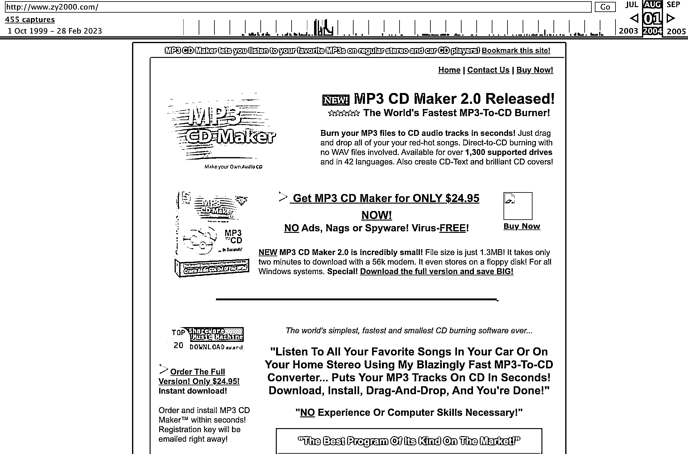
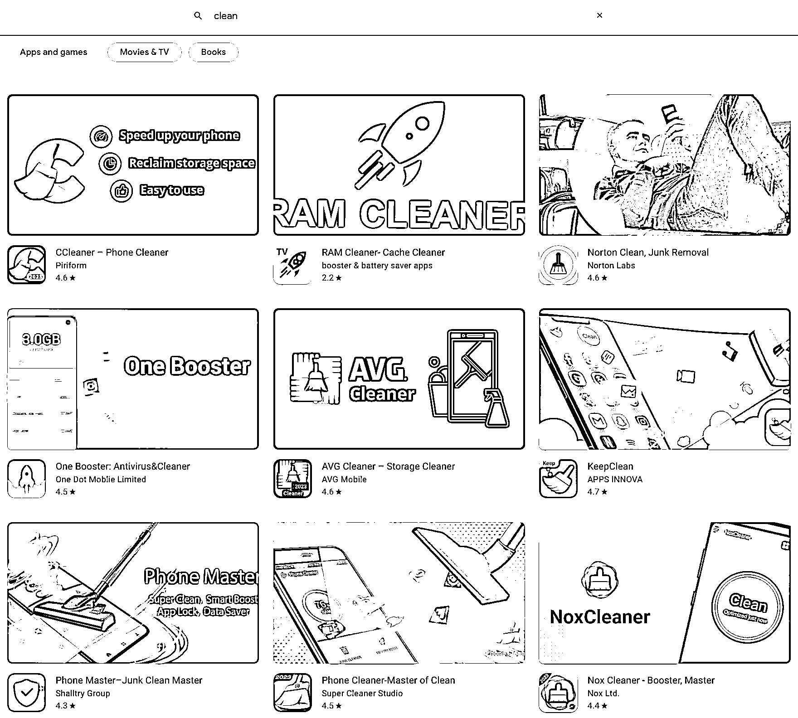
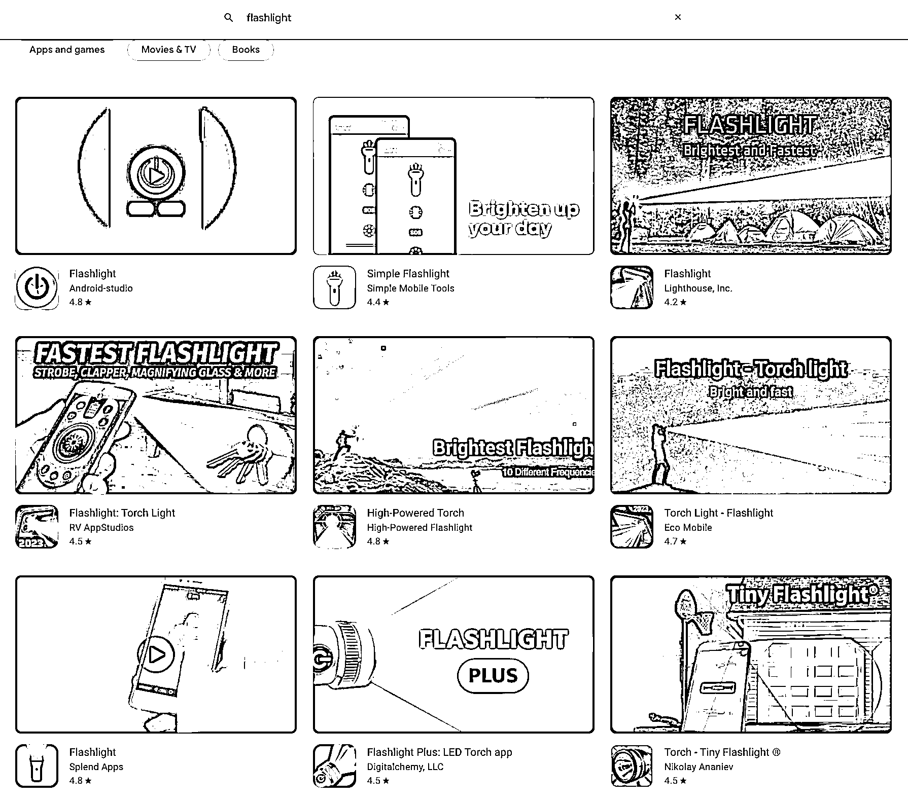

# 1.4 中国工具出海时间线 @非洲水手

恰逢看过吴晓波的《激荡四十年》有感而发，今天在这里想先和大家复习下中国工具出海的时间线，这激荡二十年也大致可以分为 4 个时期：萌芽期，起始期，扩张期，转型期。

1、萌芽期

首先是萌芽期，1998-2007 的中国互联网发展早期，在那个还是 Copy to China 的时代，在中国工具出海第一人周奕的带领下，以 MP3 CD Maker 为开始，中国互联网出海迎来第一波曙光。

2、起始期

也是在这个时候大家开始意识到，工具出海是可以抹平中西方文化差异的。随着 2007 年 iPhone 初代及 Apple App Store 的发布，移动互联网时代开启，中国工具出海进入了起始期，久邦、百度、360、UC、金山等国内玩家开始在海外“低调地”攻城略地，闷声发大财。

3、扩张期

接着到了 2011-2016 年，移动互联网出海正式进入扩张期，工具出海渐渐形成细分领域：手机管理类，如 Clean Master；相机图片类，如美图秀秀；桌面类，如 Solo Launcher、Go Launcher；浏览器类，如 UC、海豚浏览器等。不到 0.01 美金的买量成本，动辄数亿数十亿的安装量，迎来了出海资本的明媚春天。

这个时代也催生了众多广告代理公司，如 Yeahmobi、Mobvista、Avazu 等，或自己开辟了广告代理业务，如猎豹 CM。很幸运我也是在这个时代入的行，服务过很多当时的明星产品，有幸见证了出海行业的辉煌时代。

4、转型期

好巧不巧，时间很快来到 2017 年，工具出海经过了几年的黄金窗口，增长方式越来越多元，变现方式越来越成（kua）熟（zhang）。与之同时的是海外人口红利越来越少，产品同质化越来越严重，平台规则（主要指 Facebook 和 Google）越来越收紧。

久邦股价腰斩而退市，Google、 Facebook 相继禁止锁屏广告，Facebook 更是暂停了中国区工具广告主的广告投放，Google 相继下架了 iHandy、猎豹等开发者的总计几百款工具产品，看空工具出海的声音不绝于耳，利益空间不断被压缩，工具出海行业被迫转型。

难道中国工具出海要止步于此？可以继续看看后面的内容。

内容来源：3 月 6 日《关于出海工具产品营销推广，我的几点经验分享》@非洲水手

