# 3.4 方法三：通过关键词挖掘需求 ★★★

用户的需求会通过关键词的方式以另外一种形式展现出来，比如：

我在某平台留下了对某个产品的吐槽；我在搜索引擎上面搜索了某个问题；……

以上这些行为都会在互联网上留下记录，同时也会从数据层面反映出用户的一些潜在需求。那么如何站在用户的角度去了解关键词呢？

可以从以下两方面入手：

•用户的关键词是怎么产生的，他们会在哪些地方留下关键词？

•用户是如何搜索关键词的（或者说带着什么样的心理状态去搜索关键词）？

知道了这些以后，不可避免的要使用搜索引擎，关于搜索引擎又有哪些技巧可以帮助我们快速找到有价值的关键词呢？

1、用户的关键词如何产生

互联网上，只要有用户交互的地方，一定会留下用户的痕迹，不论是被动的还是主动的。而我们站在需求挖掘的角度上，用户留下痕迹的地方就是我们该去探索和挖掘的地方。

以用户在 Amazon 上面为例：

用户搜索了某个关键词，Amazon 会记录下来，再打开页面会直接给该用户推荐相关产品；用户浏览（在线时间）或收藏了哪个商品，Amazon 也会记录下来，以便后面分析用户喜好；用户购买或评论了某个商品，也会被记录下来，后续 Amazon 会根据情况给 listing 更多流量；Amazon 还会抓取用户的地理位置或其他信息，并推荐相关商品。

上述所说的用户轨迹其实就是我们分析用户需求的依据，这些用户行为 Amazon（或其他第三方工具，如卖家精灵等）都会给我们提供，我们需要的是在这些数据中抽丝剥茧，从不同维度指标中验证我们的目标需求是否存在。

内容来源：《航海实战｜Google | 付费插件｜实战手册 》

2、用户如何搜索关键词 @Tiger

站在普通用户层面，他们是不会直接搜索核心关键词的，更多的是直接描述需求（包含核心关键词的长尾关键词）。

如，我现在想 Google 一个送给父亲的礼物，一般搜索的关键词是：

适合送给父亲的礼物有哪些？送父亲什么（烟、酒、手表、剃须刀等）比较好？给退休父亲的生日礼物送什么比较好?

这些都是站在用户的需求角度去考虑搜索什么关键词，有一个相对万能的公式可以参考一下（顺序可以打乱）：核心关键词+需求动词（名词）+疑问词

而获取这些需求长尾词，除了第三方工具还有一个最简单方便的方式，就是利用搜索引擎的下拉框和尾部的相关搜索框，都是用户需求最直接的体现。

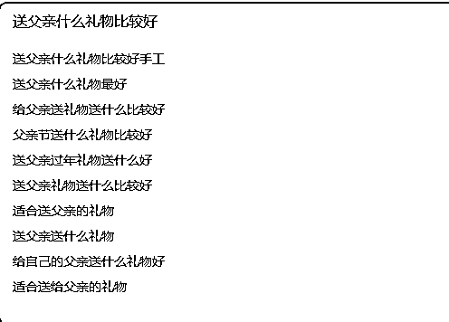

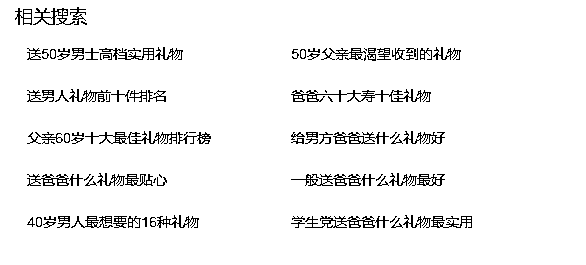

内容来源：《Google 搜索 技巧寻找潜在商机》

2、关键词挖掘的具体实操 @三林@Tiger

1）简单上手关键词挖掘

给圈友分享我的经验。第一步：框定母词。

首先我们要基于研究的对象：TikTok ，还是 YouTube，抑或 Tesla 等，确定一系列的母词，比如 tiktok，我会选用：tiktok video、tiktok live、tiktok shop、tiktok fans 等圈定大范围。

接着：

第二步：拓词！通『 谷歌关键词规划师』等第三方工具，发现相关搜索词。

第三步：清洗，再度拓词。再度查询关键词流量。

第四步：对搜索结果二次分组，统计具体哪些「关键词」的流量具备代表性。

第五步：筛选有价值的关键词，并定向研究具体的产品/服务承接。收录到自己的「项目库」或「需求池」。充分的调研、评估过后，再决定是否要做相关产品。

2）有哪些好用的拓词方法

•通过下拉框寻找关键词 @TIGER

有时候我们在 Google/Youtube 搜索关键词的时候会出现下拉框，这是一个寻找热门词以及长尾词非常好的一个方式。所有的数据都是会根据 Google 本身算法筛查过的，相关性既强，热度又高。是一个拓展新流量业务极好的选词方法。

这次分享以 Google 举例，放回国内会有多个场景可以使用同样思路。

技巧：你可以在目标关键词前加上星号（*）， 它的作用类似“通配符”（“wildcard”）。可以搜索出更多的相关关键词，这些关键词竞争度小，搜索潜力却巨大。 （在 Youtube 中直接以*开头搜索不会被识别为通配符，需要先输入关键词，再在前面添加*） 如图显示了我以“TikTok”为例如何寻找潜在的热门搜索词。

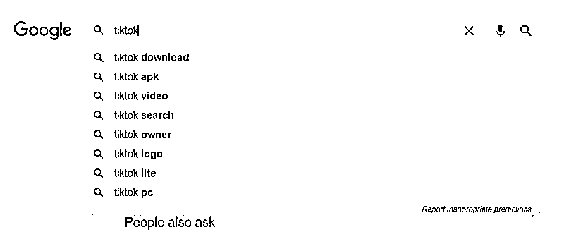

在 google 按我上面的方法搜索热门相关搜索词之后，蹦出来的第一条是，How to go live on TikTok(如何在 TikTok 上直播)

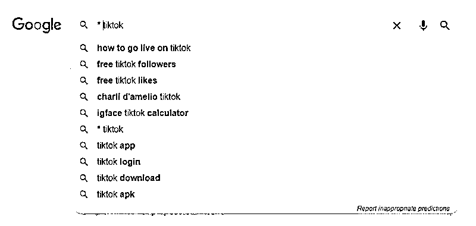

这个词搜索之后的首页，蹦出了相关的一模一样名称的解说式视频，标题就是用的一模一样的搜索关键词。

点进去可以发现，这个视频的观看量是在一百五十万次。

进一步点进主页后发现，该博主平均的视频流量在几万，而这个一百五十万次访问的视频则是这个博主的最大一个爆款，可以说她的大多数粉丝都和这个视频引流相关, 该博主也有了 20 多万粉丝。

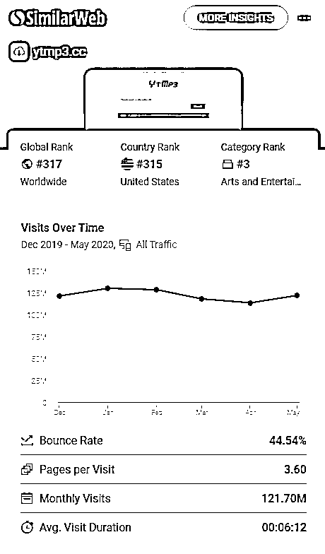

就此，通过分析搜索词进而挖掘出来了一个靠此搜索流量而火的 Youtube 频道博主（当然她也有通过 TikTok 导流） 以上案例呢，仅仅是我用此方法给大家的举个例子，告诉大家如何应用这种搜索技巧来寻找需求，或者寻找别人的成功案例。

内容来源：《Google 搜索 技巧寻找潜在商机》

•拓词工具之 Google 关键词规划师 @三林

这是 Google Ads 谷歌广告平台的后台功能，可以直接用谷歌账号注册，免费开启使用，菜单「工具和设置-规划」里可以找到「关键词规划师」。

进入「关键词规划师」，两个功能入口：一个偏「拓词」发现新词。一个偏「查词」查询流量的。

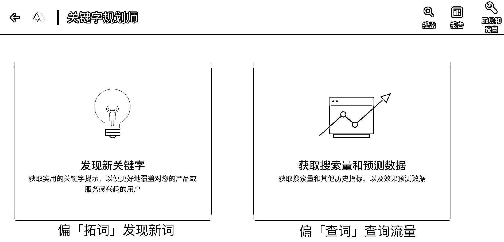

在「发现新关键词」栏目，搜索一个「关键词」便可产出更多的相关词，以及每个词的每月搜索量、广告点击出价预估等。（此功能最终还是服务广告投放的，但不妨我们用于需求挖掘的调研），如下图所示：

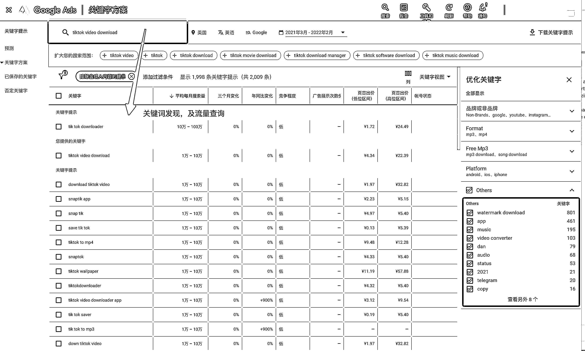

这就是「拓词」。初筛后，再次拓词，所谓「二阶拓词」，往往一个母词，可以拓词出一千左右的词， 一两千的核心母词，可以扩展出百万的带搜索量的词也并不少见。

•拓词工具之 Ahrefs 关键词查询 @三林

Ahrefs 在海外站点的 SEO 方面很专业。Ahrefs 也有关键词发现（keyword explorer）栏目，但不同于 Google 关键词规划师，其更多的是精准匹配的定向研究某个具体的关键词，数据颗粒度很细，比如 tiktok video downloader 这单一关键词的数据概述：

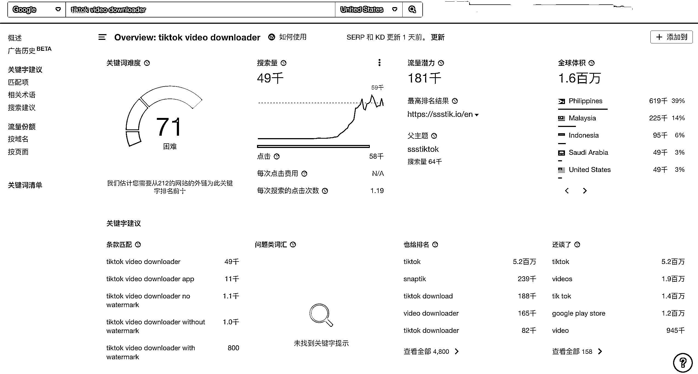

「直接匹配」了哪些相关词：

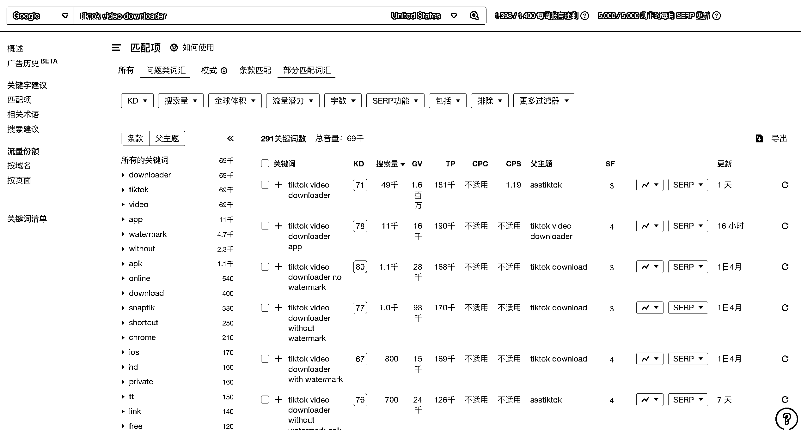

其他相关词建议：同样需求的词，可以下载导出作为「关键词」再次拓词。

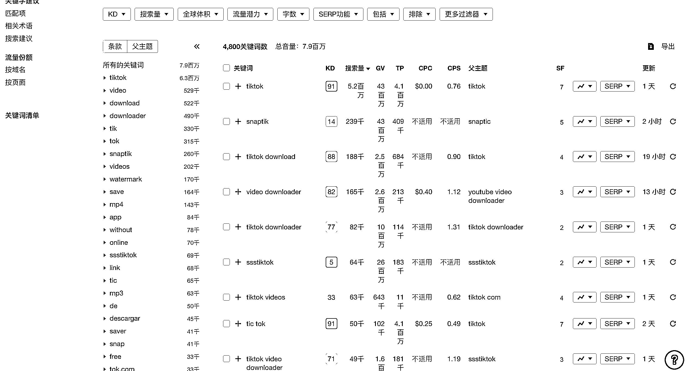

Ahrefs 很好用很专业，去某淘租一个共享账号玩玩。快速上手体验。

另外一个 SEO 工具「similarweb」也有关键词分析板块，但我认为其数据量不够多，并不好用，但查一个网站的访问量，similarweb 是比 ahrefs 更准确的。

•拓词工具之 光年-谷歌关键词分析工具 @三林

此工具由国内做流量增长的咨询公司「光年实验室」出品，亮点在于：批量查询和多维度数据导出，如果数据量很大，光靠网页版是不够用的，得申请谷歌关键词 API。（同根同源，数据同样是来自谷歌关键词规划师）。

注：谷歌关键词规划师 API 目前很难申请到。

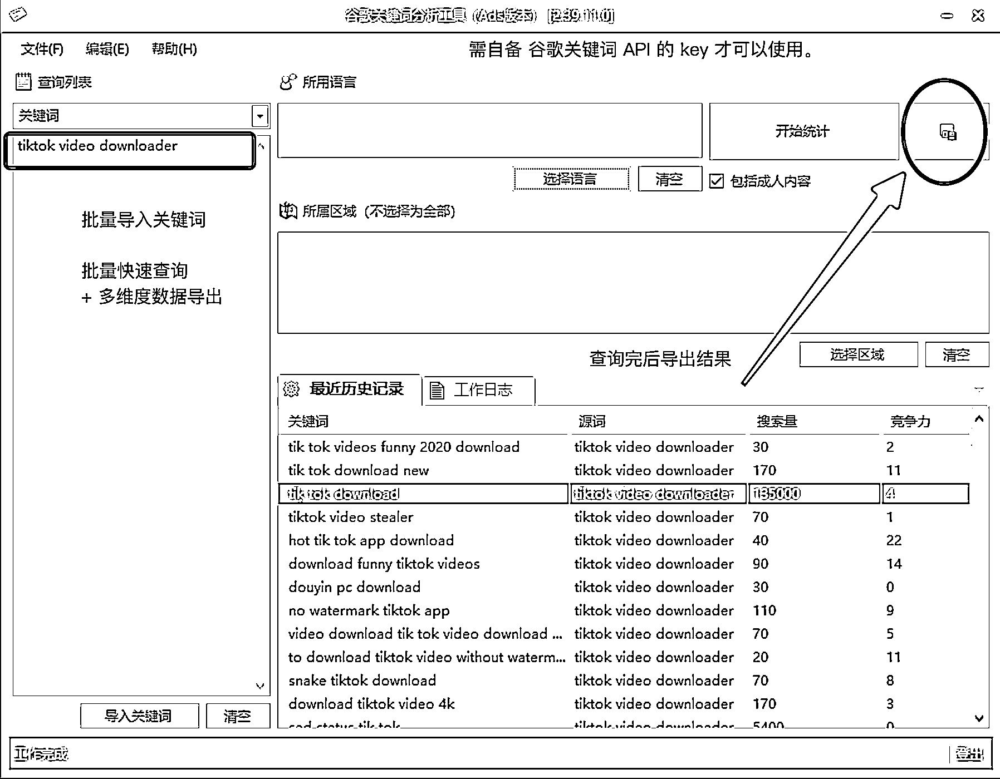

内容来源：《以 TikTok 举例，如何发现海外产品的生财机会 ？》

3）拓词后如何处理关键词 @TIGER

拿到觉得靠谱的热门词之后，一般需要做如下的几个步骤：

•看这个热门词的搜索具体频次

有的热门词，比方说 YouTube，这种搜索上亿次的词组导致衍生需求也会非常的多，比如说 Youtube to mp3 之类的，单单这一子类的搜索量就高达每月千万。头部几个简单的工具站可以通过关键词 seo 做到每月过亿流量。 但是有的词组，主词可能搜索量就不高，靠走量做这个关键词的业务价值就不一定会高。 可用工具：Google Ads Keyword Planner(关键词规划师)，Ahrefs、Semrush、Keywords Everywhere 等第三方服务。

•看竞争对手

好的机会，往往不是说你发现这个地方有多大的流量，而是要选流量既大，竞争对手也不那么强的领域。

无论是希望做新网站，还是做新 Youtube 频道。首先要分析竞争对手的实力，你看到了某热门的关键词或关键字，别人也会看到。

Youtube 频道的话，直接把该关键词对应推荐出来的几个频道做分析，看对面的粉丝量和制作水准。

做独立站吸引流量的话，首先分析排在 Google 首页前十名网站的外链量，域名权重等等。进而分析自己有没有实力去超过他。

在这里，查看对方的外链也可以用另一个小技巧。 「另一个小技巧」

直接在 google 搜索栏输入「link：xxx.com」（xxx 换成具体的域名）

这样会搜索出来这个网站的大部分外链，当然如果想要更精准一些的数据，可以参考使用 Ahrefs 的服务。

内容来源：《Google 搜索 技巧寻找潜在商机》

4）关键词挖掘的技巧补充 @三林

关于母词，要多且准。母词的数量建议在「四位数」，数千个母词，可以拓词出数十万到百万的词。 而精准很关键，否则容易拓词出不相干的结果，筛选成本变高了。比如「Tiktok」容易拓词出一些大网红的名字，这些词在拓词时要先删掉。

那我们可以从哪里找母词？分享三点：

•从目标网站挖掘：比如网站首页、关于我们等页面人工整理关键词，比如 Slogan、 页面描述、Metawords、底部导航菜单命名。 描述业务的词，越全越好。

•找母词的角度：自己所处行业，那就头脑风暴开始。包括不局限于：直接相关词、行业相关词、人均相关词。

•从广告投放词：来用作关键词母词，也是特别好的。 Ahrefs 上了一个新功能「付费关键词」，即可以查询一个网站所投放的关键词，这个太强了。你想啊，人家愿意按点击付费购买的关键词，能不精准吗~ 下图以 Shein 举例：Ahrefs 共收录了 7.4 万个关键词，可过滤导出进一步筛选。

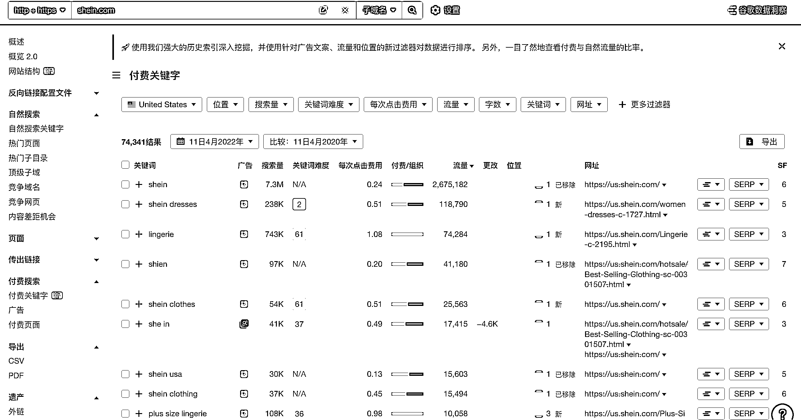

总结一下：

通过 Google 的搜索大数据，直接反映用户真正的需求。关键词研究若对一个行业需要更全面、耐心的挖词、选词。我介绍的是通过工具快速上手的方式。围绕 Tiktok 是如此，试试其他产品方向呢？比如据说最新估值 1000 亿美金的 Shein ，又有哪些周边机会可以做呢。

平台在变，可用户的需求具备延续性，若能在新兴平台提前布局相关服务，不失为分到一杯羹。比如 Instagram/YouTube 下载站的经验，在 Tiktok 上再来一遍。

通过 Google 搜索平台关键词研究，发现用户需求/产品机会，我称之为「生财机会」。关键词研究很有意思，你会发现：居然人们在这样搜索一个词；当你去搜索这些词，惊奇：我靠，居然还能这么做。关键词研究的运用场景很多，不止是用在需求发现和 SEO/SEM，还可以用于内容生产维度参考、信息流投放、舆情监控、KOL 挖掘等。

内容来源：《以 TikTok 举例，如何发现海外产品的生财机会 ？》

