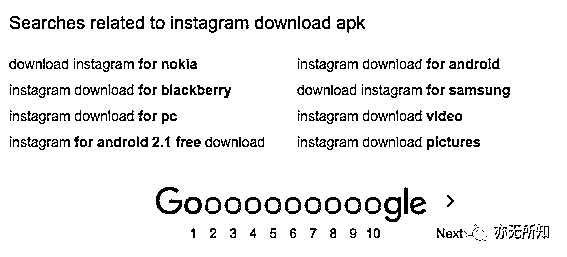
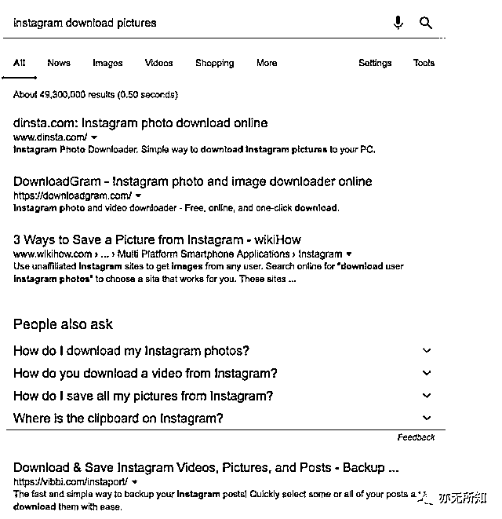
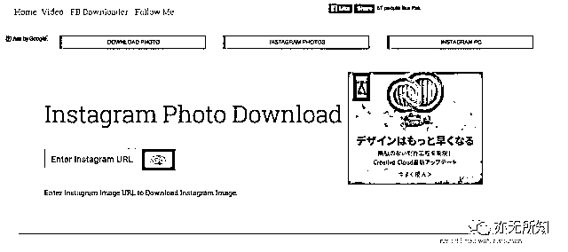
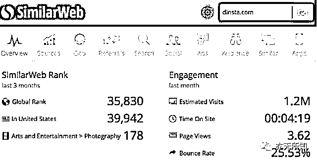

# 3.5 方式四：通过痛点挖掘需求 ★★★ @亦仁

痛点挖掘有很多种方式：从自身实际需求出发，从自己所在行业或者所关心话题出发，从互联网巨头周边出发等。

在资源有限的情况下，我常用的挖掘痛点方式是从互联网巨头产品周边挖掘出一些痛点。对于任何一个大的互联网产品，都有很多产品需求点

1）巨头考虑后不做，比如微信公众号的数据服务（新榜），微信小程序的导航（爱范儿）。

2）巨头没考虑到，一些很小众的需求，巨头没关注到，即使关注到也不太会为了 1% 的人的需求去影响 99% 人的体验，比如允许同时在手机上开两个微信 APP。

而这些被有意或者无意忽视的需求却是真实存在的，满足这些用户需求，就能获得这部分用户，体量并不一定小。 而几乎每一个互联网巨头周边都有若干产品和创业公司活的很好，甚至有一些上市公司。这次分享的是如何从 Instagram 上找到真实痛点和产品机会，同样的思路可以用在 Facebook、WhatsApp、Bitcoin、Snapchat、微信、微博上。

1、挖掘痛点

我们先 Google 搜索『Instagram』，在 Google 的下拉框和推荐搜索词提示了下面几组词

除了 instagram download 其他词看起来都很普通。

Google 这个词看看有什么机会，搜索发现有以下几组关键词

除了最后两个词『instagram download video』、『 instagram download pictures』，其余的搜索官方都已经满足了需求。

2、确认痛点

难道在 Instagram 上下载图片和视频有什么需求未被满足吗？

果然，在网页 Instagram 上确实无法右键保存别人上传的图片，右键另存为的功能被限制了。这个限制其实很常见，很多网站包括知乎，出于版权保护或者其他目的，限制了直接在站内复制文本或者保存图片。 这就像， 使用微信时，收到朋友发来的语音，想转发给其他人，却发现不被支持。

Instagram 的这一设置，也许就难倒了 90% 以上的普通用户。但事实上确实会有这样下载图片和视频的需求，这个痛点真实、有效，围绕这个痛点有没有好的解决方案？能不能赚到钱？还不清晰，继续往下 Google。

3、挖掘现有的产品

继续 Google『instagram download pictures』，在搜索结果的第一页出现了 6 个解决此痛点的小工具。

4、商业模式研究

点开排名第一的网站，功能和模式都比较简单，直接通过输入 Instagram 图片的链接就可以将图片直接下载下来，盈利方式是 Google Adsense 广告系统。

用 SimilarWeb（网站流量数据统计插件）查一下，每月 120 万访问量，每日 4 万访问量。 按照千次访问 2 美元的收入来估算，此网站估计每天收入 80 美元，每个月收入 2400 美元，每年收入 28800 美元，约人民币 20 万元。 不错，相当于一个白领一年的收入了！

挖掘到此，痛点真实且需求量不小，有成熟的产品上线了，是不错的机会。

内容来源：[《通过 Google 挖掘细分市场的一个案例》](https://mp.weixin.qq.com/s/cXa6Rwiet5gN8bSe-h4QNw)

