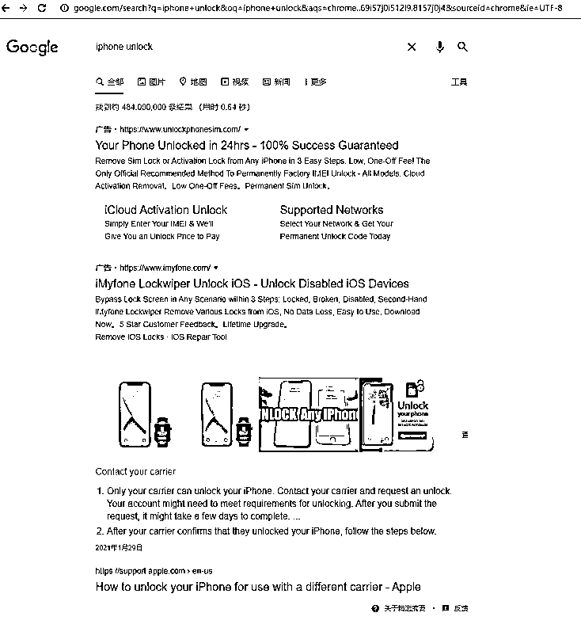
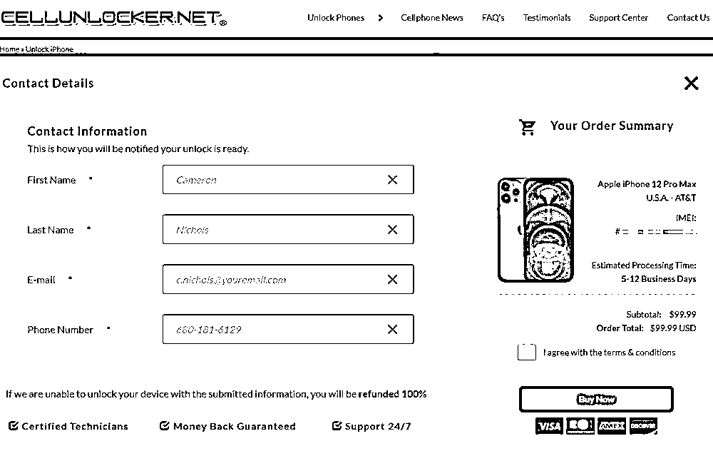
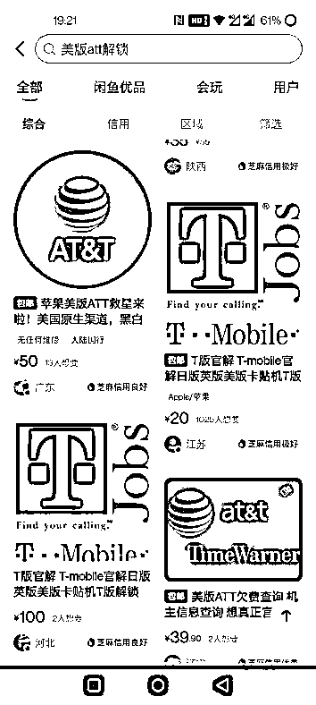
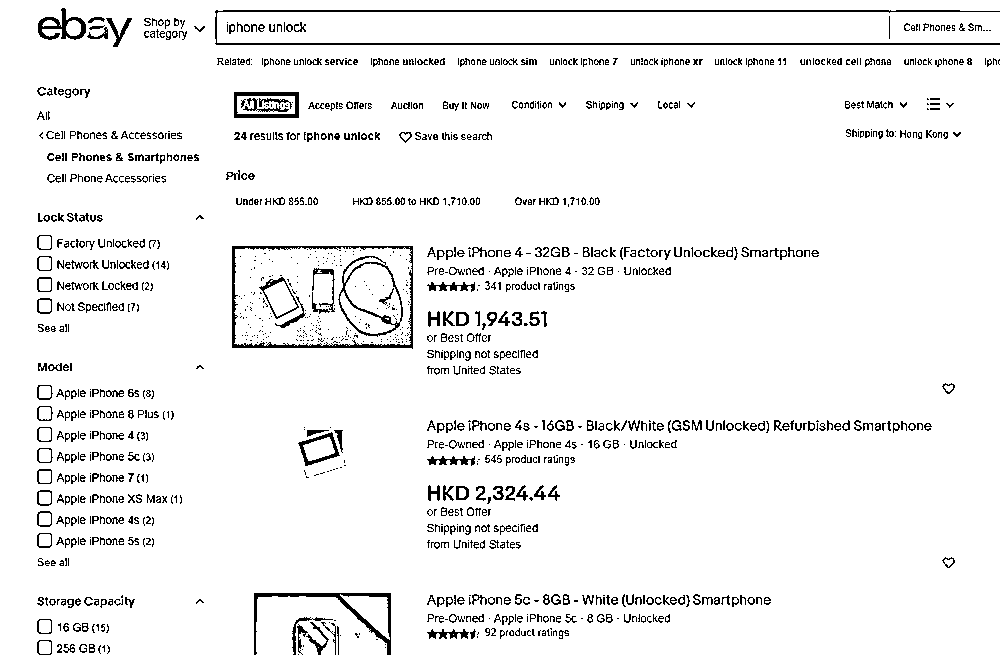
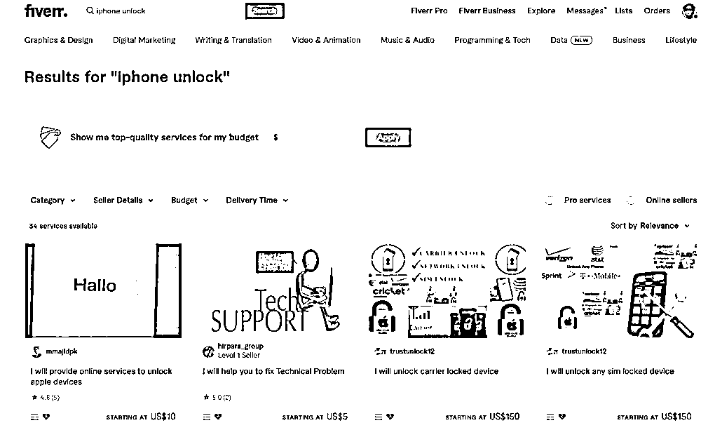

# 3.7 方式六：围绕自身需求拓展 ★★★

1、dropbox 扩容案例 @真武

空手套白狼，使用 dropbox 赚了 1 万美元。

dropbox 是一个国外最早的同步盘服务，注册一个账号会有 2G 的免费空间。

邀请一个朋友注册，你和你的朋友会再得 1G 的空间，上限总容量是 18G，换句话说，你得邀请 16 个好友。

但好多人不愿意麻烦朋友，我自己有扩容的需求，就在万能的淘宝上花几元钱购买了一个扩容服务，其实商家也是通过虚拟机自动化完成的。

后来我一想，自己有这个需求，可能别人也有，中国市场竞争太激烈了，我将目光移到了海外，国外有一个网站，叫 [fiverr.com](http://fiverr.com/) ，绝大部分商品的价格都是 5 美元，每成交一笔，网站抽成 1 美元，我就在这个网站发布了 dropbox 扩容和卖现号的服务，标价 5 美元，成本是几元人民币。

接到订单让淘宝的商家去做，一单能赚 20 元左右，每天能轻松接个好几单。

内容来源：《空手套白狼，使用 dropbox 赚了 1 万美元》

2、simunlock 手机解锁案例 @静水流深

有个东西叫手机解锁，有海外生活经历的朋友应该都明白，国外买手机都可以签合约，当然中国也有。

两者最大的区别是：中国是返话费，机器你可以插任意只要支持制式的卡使用，国外是直接很低的价格给你用，但是得给我签一般两年的合同，这两年里你每个月的话费得满足最低要求，而且必须只能使用对应签约公司的 SIM 卡，插其他的卡直接变砖机。

两年后提交你的 IMEI，官方给你解锁这部手机，你这个时候才可以随便插入任何电信公司的 SIM 卡正常使用，以及你可以把号码转到其他公司去，结束合同或者签约新的合同，换新手机再次延续上面的操作。

大家应该记得一开始 iPhone4 出来的时候，说什么老美只要 99 美元，中国却要五千块纯是断章取义。你要知道当时一般背后的合同都是每个月 50 美元左右的最低消费，24 个月起步，最后算一下谁便宜？

因为这样，所以就催生了一个行业，叫手机解锁 ——simunlock，这个词搜索量很大，并且谷歌上不少商家在投放广告：

我选择了一家提供 iPhone 解锁服务的商家，这家我以前用过，他们是提供货真价实的解锁服务，这里随便找了一个比较主流的 iPhone12 作为测试，然后他们给了报价：

99 美元解锁，而咸鱼还有一些国内的渠道，价格远低很多（咸鱼上的过低标价未必是正确标价价格）：

前面我们看见有人投放谷歌的 Adwords 广告做竞价排名，确定这个生意一定是存在并且还是赚钱的，这里我们发现了巨大的差价空间，估计有很多做跨境电商的朋友就看出来了，一个简单的 Shopify 即可实现之前那些解锁网站的功能，完全可以当作一个虚拟物品提供服务的跨境电商来运作。

我们可以更加简单抽象地做无本生意：Ebay 上貌似没有人提供解锁服务：

Fiverr 上更离谱，要么没有，要么 150 美元：

只要你把解锁服务作为商品，并且提供相关关键词作为吸引人的标题发布上去，就可以自然获客了，而你不需要花费一分钱。当这边接到了老外的解锁请求，然后找一个国内提供解锁服务的商家处理，赚取不错的差价。哪怕解锁不了，退钱即可，你也没任何损失。多数时候，你的利润率超过 100%。

具体找哪几家国内提供解锁的服务商比较好？咸鱼、淘宝多看看，包括国内知名的找果科技，前提是你一定要亲手去尝试这个项目。任何项目你不动手就是个零，哪怕项目再好。

内容来源：《3 个单人就能做的赚钱案例，告诉你怎么通过互联网在海外淘金？》

