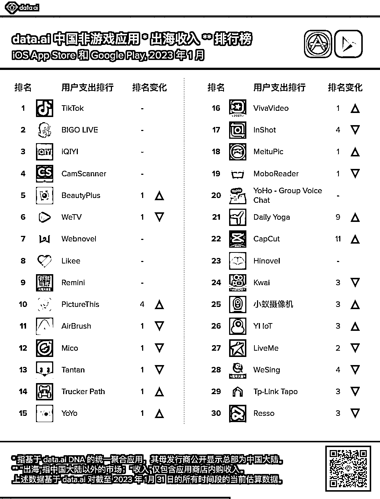
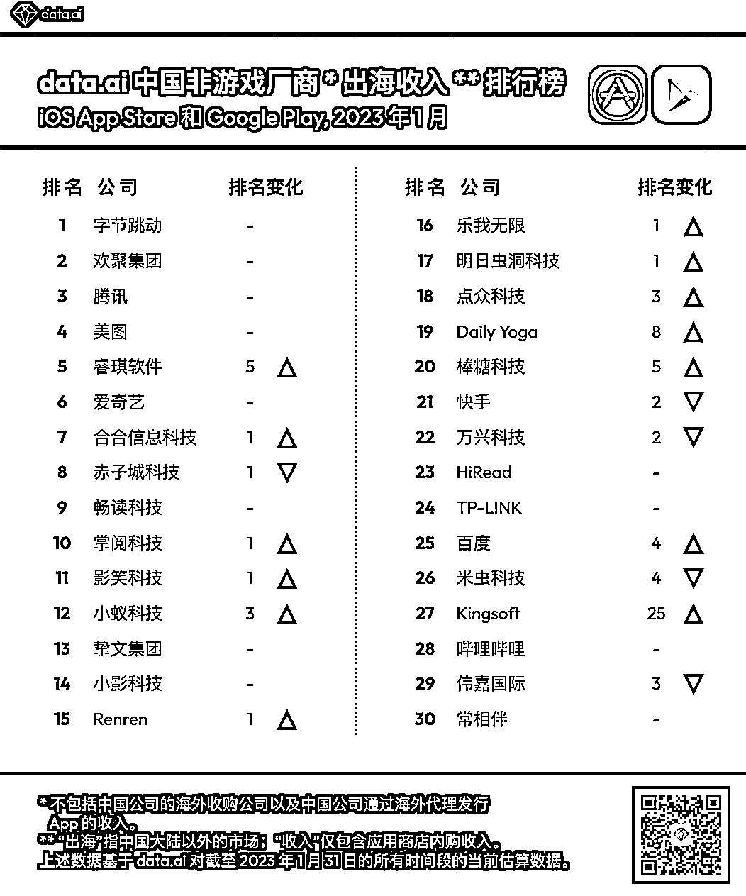
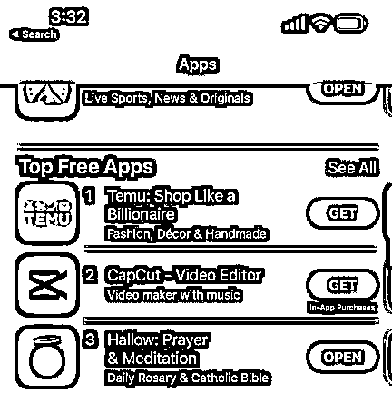

# 3.8 方式七：通过排行榜挖掘需求 ★★★ @非洲水手

通过这份 AppAnnie 2023 年一月份的非游收入榜，我们来看看有哪些有意思的产品方向发现：

1、娱乐产品依然是当红炸子鸡，收入榜前三全是娱乐产品，那就可以延伸下其周边有没有硬刚需的工具需求？如视频无水印下载？Bio 链接跳转？或者 Instagram 的热门小工具有没有可以搬到 TikTok Bigo Kwai 上的？

2、产品力和多年的细致打磨绝对塑造王牌产品，壁垒无可超越，如扫描全能王和美图秀秀，选准一个领域，做时间的朋友，回报可能真的超乎你的想象

3、前 10 里竟然有我们生财圈友无人不知的老照片修复项目！这个说实话包括我自己都是没有想到的，必须深刻反思！

4、AI 项目除了老照片修复还有个智能识别动植物的，微信上也有个很火的小程序叫“识花君”，发掘此类的爆款，海内外用户对新兴创意类目的接受度同样高，比如之前的蚂蚁呀嘿，海内外可以做到同步火

5、类目出现的频次看，娱乐社交、照片/视频编辑、阅读、AI 项目、健身、办公等。有的可能涉及到一些资源池，但想做的话社群里已经有很多相关资源的对接了，如果你有心，我觉得你一定可以找到

6、榜单里没有出现的一款海外开发者的产品《Hallow》大家也可以关注下，这是一款针对天主教徒的祈祷冥想产品，对的，你没猜错，它的原型就是《Calm》这个冥想独角兽，只是更细分的开发了天主教徒这个受众，它在今年的 2 月 24 号曾经来到美榜前 3，可见宗教移动市场不可小觑，可以延伸下之前被做成矩阵的《Holly Bible》圣经电子书，是不是似曾相识？原来两个品类的相交也可以产生如此强烈的化学反应？

内容来源：3 月 6 日《关于出海工具产品营销推广，我的几点经验分享》@非洲水手

